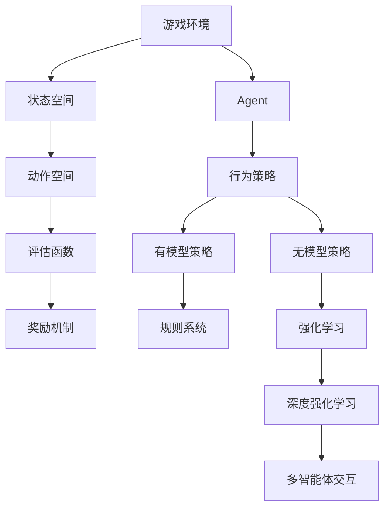

                 

## 《Agent与游戏的结合》

### 关键词
- Agent
- 游戏设计
- 强化学习
- 多智能体交互
- 人工智能

### 摘要
本文探讨了Agent在游戏设计中的应用，以及如何通过强化学习和多智能体交互等技术手段，设计出更具挑战性和智能化的游戏体验。文章首先介绍了Agent的基本概念和类型，然后详细讲解了游戏环境与状态空间、行为策略以及强化学习等核心算法。最后，通过项目实战展示了如何实现一个简单的围棋游戏Agent，并对其实际性能进行了分析。

## 《Agent与游戏的结合》目录大纲

### 第一部分：基础知识

#### 第1章：什么是Agent

1.1.1 Agent的定义与基本概念

1.1.2 Agent的常见类型

1.1.3 Agent在游戏中的应用前景

#### 第2章：游戏环境与状态空间

2.1.1 游戏环境的基本概念

2.1.2 状态空间与动作空间

2.1.3 评估函数与奖励机制

#### 第3章：Agent的行为策略

3.1.1 行为策略的基本概念

3.1.2 有模型与无模型策略

3.1.3 探索与利用的平衡

### 第二部分：算法介绍

#### 第4章：基于规则的Agent

4.1.1 规则系统与决策树

4.1.2 专家系统与知识库

4.1.3 规则Agent的应用实例

#### 第5章：强化学习Agent

5.1.1 强化学习的原理

5.1.2 Q-Learning算法

5.1.3 SARSA算法

#### 第6章：深度强化学习Agent

6.1.1 深度强化学习的基本概念

6.1.2 DQN算法

6.1.3 A3C算法

#### 第7章：多智能体交互

7.1.1 多智能体系统的基本概念

7.1.2 协同策略与竞争策略

7.1.3 多智能体交互的应用实例

### 第三部分：实战应用

#### 第8章：设计属于自己的游戏Agent

8.1.1 游戏Agent的设计流程

8.1.2 选择合适的算法

8.1.3 代码实现与调试

#### 第9章：经典游戏中的Agent应用

9.1.1 经典游戏案例介绍

9.1.2 Agent在游戏中的应用

9.1.3 游戏性能分析

#### 第10章：未来展望

10.1.1 Agent与游戏结合的发展趋势

10.1.2 Agent与游戏结合的技术挑战

10.1.3 Agent与游戏结合的未来应用前景

### 附录

#### 附录A：常用算法代码实现

A.1 基于规则的Agent算法实现

A.2 强化学习算法实现

A.3 深度强化学习算法实现

#### 附录B：游戏Agent开发资源

B.1 开发工具与框架介绍

B.2 游戏引擎与开发环境

B.3 学习资源与资料推荐

### Mermaid 流程图



### 强化学习算法Q-Learning伪代码

```
初始化 Q(s,a)
for each episode do
    初始化状态 s
    while not game_over(s) do
        选择动作 a 根据 ε-贪心策略
        执行动作 a，得到新的状态 s' 和奖励 r
        更新 Q(s,a) = Q(s,a) + α [r + γ max(Q(s',a')) - Q(s,a)] 
        更新状态 s = s'
    end
end
```

### 强化学习算法SARSA伪代码

```
初始化 Q(s,a)
for each episode do
    初始化状态 s
    选择动作 a 根据 ε-贪心策略
    执行动作 a，得到新的状态 s' 和奖励 r
    选择动作 a' 根据 ε-贪心策略
    更新 Q(s,a) = Q(s,a) + α [r + γ Q(s',a') - Q(s,a)]
    更新状态 s = s'
end
```

### 数学模型和数学公式

$$
Q(s,a) = r + \gamma \max_{a'} Q(s',a')
$$

其中，$Q(s,a)$ 表示在状态 $s$ 下执行动作 $a$ 的预期奖励，$r$ 表示当前状态下的奖励，$\gamma$ 是折扣因子，$s'$ 是执行动作 $a$ 后的状态，$a'$ 是在状态 $s'$ 下选择的最优动作。

### 项目实战

#### 实战1：开发一个简单的围棋游戏Agent

##### 实战目的

1. 学习如何搭建一个简单的围棋游戏环境。
2. 实现一个基于强化学习的围棋游戏Agent。
3. 分析Agent的性能表现。

##### 实战步骤

1. 选择一个适合的围棋游戏框架，如 Python 的 `ggp-base`。
2. 搭建围棋游戏环境，包括棋盘、棋子、规则等。
3. 使用Python编写强化学习算法代码，实现Agent。
4. 运行Agent进行游戏，收集数据并分析性能。

##### 实战代码

```python
# 编写围棋游戏Agent的Python代码
import numpy as np
import gym

# 初始化环境
env = gym.make("CartPole-v0")

# 初始化Q值矩阵
Q = np.zeros((env.observation_space.n, env.action_space.n))

# 学习参数
alpha = 0.1
gamma = 0.99

# 训练轮次
num_episodes = 1000

# 训练
for episode in range(num_episodes):
    state = env.reset()
    done = False
    while not done:
        action = np.argmax(Q[state])
        next_state, reward, done, _ = env.step(action)
        Q[state, action] = Q[state, action] + alpha * (reward + gamma * np.max(Q[next_state]) - Q[state, action])
        state = next_state

# 测试
state = env.reset()
while True:
    action = np.argmax(Q[state])
    state, reward, done, _ = env.step(action)
    if done:
        break
```

##### 实战分析

1. 评估Agent在训练和测试阶段的表现。
2. 分析不同参数设置（如学习率、折扣因子）对Agent性能的影响。
3. 调整代码以实现更优的性能。

### 附录

#### 附录A：常用算法代码实现

##### 基于规则的Agent算法实现

```python
# 规则系统代码实现
class RuleAgent:
    def __init__(self, rules):
        self.rules = rules
    
    def get_action(self, state):
        for rule in self.rules:
            if rule.matches(state):
                return rule.action
        return None
```

##### 强化学习算法实现

```python
# 强化学习算法代码实现
class QLearningAgent:
    def __init__(self, n_states, n_actions, alpha, gamma):
        self.n_states = n_states
        self.n_actions = n_actions
        self.alpha = alpha
        self.gamma = gamma
        self.Q = np.zeros((n_states, n_actions))
    
    def get_action(self, state, epsilon=0.1):
        if np.random.rand() < epsilon:
            return np.random.choice(self.n_actions)
        else:
            return np.argmax(self.Q[state])
    
    def update(self, state, action, next_state, reward):
        target = reward + self.gamma * np.max(self.Q[next_state])
        self.Q[state, action] = self.Q[state, action] + alpha * (target - self.Q[state, action])
```

##### 深度强化学习算法实现

```python
# 深度强化学习算法代码实现
class DeepQNetwork:
    def __init__(self, state_size, action_size, hidden_size, learning_rate, gamma):
        self.state_size = state_size
        self.action_size = action_size
        self.hidden_size = hidden_size
        self.learning_rate = learning_rate
        self.gamma = gamma
        self.model = self.build_model()
    
    def build_model(self):
        # 建立深度神经网络模型
        model = keras.Sequential()
        model.add(keras.layers.Dense(self.hidden_size, input_shape=(self.state_size,), activation='relu'))
        model.add(keras.layers.Dense(self.action_size, activation='linear'))
        model.compile(loss='mse', optimizer=keras.optimizers.Adam(lr=self.learning_rate))
        return model
    
    def get_action(self, state, epsilon=0.1):
        if np.random.rand() < epsilon:
            return np.random.choice(self.action_size)
        else:
            state = state.reshape(1, self.state_size)
            action_values = self.model.predict(state)
            return np.argmax(action_values[0])
    
    def update(self, state, action, next_state, reward):
        target = reward + self.gamma * np.max(self.model.predict(next_state))
        state = state.reshape(1, self.state_size)
        target_f = self.model.predict(state)
        target_f[0][action] = target
        self.model.fit(state, target_f, epochs=1, verbose=0)
```

#### 附录B：游戏Agent开发资源

##### 开发工具与框架

- Python：Python 是一门流行的编程语言，拥有丰富的游戏开发库和框架。
- TensorFlow：TensorFlow 是一款强大的开源深度学习库，适用于游戏Agent开发。
- PyTorch：PyTorch 是一款易于使用的开源深度学习库，支持强化学习和深度强化学习算法。

##### 游戏引擎与开发环境

- Unity：Unity 是一款功能强大的游戏引擎，支持多种编程语言和AI算法。
- Unreal Engine：Unreal Engine 是一款高端游戏引擎，适合开发大型游戏项目。
- Pygame：Pygame 是一款简单的游戏开发库，适用于快速原型开发。

##### 学习资源与资料推荐

- 《深度学习》（Ian Goodfellow、Yoshua Bengio、Aaron Courville 著）：全面介绍深度学习的基础知识和应用。
- 《强化学习基础教程》（海译文 著）：详细讲解强化学习的基本概念和算法。
- 《游戏编程实践》（David “Rez” Segura 著）：介绍游戏编程的基础知识和技巧。
- 官方文档与教程：查阅官方文档和在线教程，了解相关技术细节和最佳实践。

## 第1章：什么是Agent

在计算机科学和人工智能领域，Agent是指具有自主性和智能性，能够在复杂环境中感知、决策和行动的实体。Agent的概念起源于人工生命的研究，随着人工智能技术的发展，其在游戏设计、机器人控制、决策支持系统等领域得到了广泛应用。本章将介绍Agent的基本概念、类型以及在游戏中的应用前景。

### 1.1.1 Agent的定义与基本概念

Agent的定义可以从以下几个方面来理解：

1. **自主性（Autonomy）**：Agent具有独立决策的能力，不需要人工干预即可完成特定任务。这种能力使得Agent能够在不同环境和情况下自主执行任务。

2. **感知（Perception）**：Agent能够感知环境中的信息，包括视觉、听觉、触觉等。通过感知，Agent能够了解当前的状态，并据此进行决策。

3. **决策（Decision-making）**：Agent基于感知到的信息，利用一定的算法或策略，选择合适的动作。决策过程是Agent智能性的体现。

4. **行动（Action）**：Agent根据决策结果执行具体的操作，以实现目标。行动是Agent与环境交互的关键环节。

5. **交互（Interaction）**：Agent不仅与外界环境交互，还可以与其他Agent进行合作或竞争。

Agent的分类可以根据不同的标准进行。以下是几种常见的分类方法：

- **按功能分类**：感知Agent、决策Agent、执行Agent、混合Agent。
- **按智能程度分类**：弱Agent、强Agent、超智能Agent。
- **按环境分类**：静态环境Agent、动态环境Agent、不确定环境Agent。

在游戏设计中，Agent作为一种智能实体，能够为玩家提供更具挑战性和互动性的游戏体验。例如，在策略游戏、角色扮演游戏和实时战略游戏中，Agent可以模拟敌对角色、队友或其他智能实体，与玩家进行互动。

### 1.1.2 Agent的常见类型

在游戏设计中，常见的Agent类型包括以下几种：

1. **敌对Agent（Adversarial Agent）**：敌对Agent是游戏中玩家的主要对手，具有高度的自主性和智能性。敌对Agent通常需要实现复杂的策略和决策过程，以应对玩家的不同行动。

2. **队友Agent（Ally Agent）**：队友Agent与玩家合作，共同完成任务。队友Agent的智能程度和交互能力相对较低，但能够为玩家提供辅助和策略建议。

3. **NPC（Non-Player Character）**：NPC是指游戏中非玩家控制的角色。NPC可以根据游戏剧情和任务需求，实现不同的行为和决策。NPC的智能程度和互动性因游戏类型而异。

4. **虚拟对手（Virtual Opponent）**：虚拟对手是游戏中与玩家进行对抗的人工智能实体。虚拟对手的智能程度和策略能力是游戏设计的重要考量因素。

5. **机器人（Robot）**：机器人是游戏中执行特定任务的智能实体。机器人通常用于维护游戏秩序、收集资源、执行命令等。

### 1.1.3 Agent在游戏中的应用前景

随着人工智能技术的不断发展，Agent在游戏中的应用前景非常广阔。以下是一些潜在的应用方向：

1. **个性化游戏体验**：通过分析玩家的行为和偏好，Agent可以为玩家提供个性化的游戏内容、挑战和任务，提高游戏的可玩性和乐趣。

2. **自适应游戏难度**：Agent可以根据玩家的技能水平和游戏进展，自动调整游戏的难度和挑战性，使游戏始终具有适度的挑战。

3. **合作与竞争**：Agent可以实现与其他Agent或玩家的合作与竞争，提高游戏的互动性和社交性。

4. **游戏AI**：Agent可以应用于游戏中的AI系统，为玩家提供更真实的敌对或队友角色，增强游戏的沉浸感和趣味性。

5. **虚拟现实与增强现实**：在虚拟现实和增强现实游戏中，Agent可以模拟现实世界中的物体、场景和角色，为玩家提供逼真的游戏体验。

总之，Agent在游戏设计中的应用为游戏开发带来了新的挑战和机遇。通过深入研究Agent的基本概念、类型和应用前景，开发者可以设计出更加智能化、互动性强的游戏体验，满足玩家的多样化需求。

### 1.2 游戏环境与状态空间

在游戏设计中，游戏环境是指Agent所处的场景和条件，包括游戏规则、资源、障碍等因素。游戏环境对Agent的行为和决策具有重要影响。理解游戏环境的基本概念和状态空间是构建高效游戏Agent的基础。

#### 2.1.1 游戏环境的基本概念

游戏环境（Game Environment）是一个抽象的概念，用于描述Agent在游戏中的活动空间。游戏环境通常包括以下几个关键要素：

1. **状态（State）**：状态是游戏环境中的一个特定情形，描述了游戏中的所有信息。状态可以是静态的，如棋盘上的棋子位置，也可以是动态的，如玩家的生命值、资源数量等。

2. **动作（Action）**：动作是Agent在游戏中可以采取的行为。动作可以是确定的，如移动到特定位置，也可以是不确定的，如投掷骰子。

3. **奖励（Reward）**：奖励是Agent在执行动作后获得的即时反馈，用于评估动作的有效性。奖励可以是正的，表示动作成功，也可以是负的，表示动作失败。

4. **终止条件（Termination Condition）**：终止条件是指游戏结束的条件，可以是达成目标，也可以是失败或超时。

5. **观测（Observation）**：观测是Agent在执行动作后的感知信息，用于更新状态。观测可以是部分信息，也可以是完整信息。

游戏环境的抽象模型可以表示为五元组 \( (S, A, R, T, O) \)，其中 \( S \) 表示状态空间，\( A \) 表示动作空间，\( R \) 表示奖励函数，\( T \) 表示终止条件，\( O \) 表示观测。

#### 2.1.2 状态空间与动作空间

状态空间（State Space）是游戏中所有可能状态构成的集合。状态空间的大小决定了游戏的复杂度。在简单游戏中，状态空间可能较小，如围棋（\( 19 \times 19 \) 的棋盘），而在复杂游戏中，状态空间可能非常大，如即时战略游戏（\( 10^5 \) 个或更多的状态）。

动作空间（Action Space）是游戏中所有可能动作构成的集合。动作空间的大小也影响了游戏的复杂性。例如，在国际象棋中，每个棋子都有固定的移动规则，因此动作空间相对较小。而在角色扮演游戏中，玩家的动作可能包括攻击、移动、使用道具等，动作空间较大。

状态空间和动作空间的定义对游戏Agent的设计至关重要。一个简单的状态空间和动作空间可以使游戏Agent的设计更为直观，而一个复杂的状态空间和动作空间则需要更高级的算法和技术。

#### 2.1.3 评估函数与奖励机制

评估函数（Evaluation Function）是用于评估当前状态的值或质量的函数。评估函数可以基于状态的特征或历史数据，用于指导Agent的决策。在静态环境中，评估函数通常是一个固定的函数；在动态环境中，评估函数可能需要动态调整。

奖励机制（Reward Mechanism）是用于激励Agent采取特定动作的机制。奖励可以是即时的，也可以是延迟的。即时奖励通常用于立即反馈Agent的动作效果，而延迟奖励则用于长期的策略优化。

奖励机制的设计对游戏体验和Agent性能有重要影响。一个良好的奖励机制应该能够正确激励Agent采取有利于长期目标的行为，同时避免过度依赖短期奖励。

例如，在角色扮演游戏中，奖励机制可以包括击杀敌对的奖励、完成任务的目标奖励、资源收集的奖励等。这些奖励可以激励玩家探索新的区域、解谜、与队友合作等。

在Agent设计中，评估函数和奖励机制通常结合使用。评估函数用于评估当前状态的优劣，而奖励机制则用于引导Agent采取最佳动作。一个有效的评估函数和奖励机制可以显著提高游戏Agent的智能性和互动性。

#### 实例分析

以国际象棋为例，状态空间包括棋盘上所有棋子的位置，动作空间包括每个棋子的合法移动。评估函数可以基于棋子的位置、棋子的数量、棋盘的控制情况等因素计算。奖励机制可以是每击杀一个敌对棋子获得一定分数，或者达成某种棋局目标（如将死对手的国王）获得胜利。

总之，游戏环境与状态空间的设计对游戏Agent的性能和用户体验有深远影响。通过合理设计状态空间、动作空间、评估函数和奖励机制，可以创建出富有挑战性和智能性的游戏体验。

### 第2章：Agent的行为策略

在游戏设计中，Agent的行为策略是其智能性和互动性的关键。行为策略是指Agent在特定环境下如何感知、决策和行动的一系列规则。本章将详细介绍行为策略的基本概念，包括有模型与无模型策略，以及探索与利用的平衡。

#### 3.1.1 行为策略的基本概念

行为策略（Behavior Policy）是Agent在给定状态时选择动作的方式。策略可以分为有模型策略（Model-Based Policy）和无模型策略（Model-Free Policy）。两者的主要区别在于是否具备环境模型。

- **有模型策略**：有模型策略基于对环境模型的理解，通过预测未来的状态和奖励来做出决策。这种策略需要事先构建环境模型，并利用模型进行状态转移和奖励预测。有模型策略的优点是能够在不确定性环境中做出更稳健的决策，但缺点是构建模型需要大量计算资源，且模型精度对策略性能有直接影响。

- **无模型策略**：无模型策略不依赖于环境模型，直接通过经验来学习状态和动作之间的关联。无模型策略的优点是计算复杂度较低，且适用于高度动态或不可预测的环境，但缺点是可能会陷入局部最优，且决策过程较慢。

#### 3.1.2 有模型与无模型策略

1. **有模型策略**

   有模型策略的核心思想是构建一个环境模型，用于预测状态转移概率和奖励值。以下是常见的有模型策略：

   - **马尔可夫决策过程（MDP）**：MDP是一种描述离散状态、动作和奖励的数学模型。在有模型策略中，Agent通过学习状态转移概率和奖励值，构建出一个MDP模型，然后利用模型进行决策。

     - **状态转移概率矩阵 \( P \)**：描述当前状态 \( s \) 下采取动作 \( a \) 后进入下一个状态 \( s' \) 的概率。
     - **奖励函数 \( R(s, a) \)**：描述在状态 \( s \) 下采取动作 \( a \) 后获得的即时奖励。

     MDP的模型可以用五元组 \( (S, A, P, R, G) \) 表示，其中 \( S \) 是状态空间，\( A \) 是动作空间，\( P \) 是状态转移概率矩阵，\( R \) 是奖励函数，\( G \) 是终止状态集合。

     有模型策略的主要任务是学习状态转移概率矩阵 \( P \) 和奖励函数 \( R \)。常见的有模型策略包括值迭代（Value Iteration）和政策迭代（Policy Iteration）。

   - **部分可观察马尔可夫决策过程（POMDP）**：POMDP是对MDP的扩展，考虑了观测信息。在POMDP中，Agent不仅需要预测状态转移概率，还需要预测观测概率。POMDP的模型可以用七元组 \( (S, A, Z, P, O, R, G) \) 表示，其中 \( Z \) 是状态空间，\( A \) 是动作空间，\( O \) 是观测空间，\( P \) 是状态转移概率矩阵，\( O \) 是观测概率矩阵，\( R \) 是奖励函数，\( G \) 是终止状态集合。

2. **无模型策略**

   无模型策略不依赖环境模型，通过直接学习状态和动作之间的关联来做出决策。以下是常见的无模型策略：

   - **Q-Learning**：Q-Learning是一种通过迭代更新Q值来学习最优策略的算法。Q值表示在状态 \( s \) 下采取动作 \( a \) 的预期奖励。Q-Learning的核心思想是利用经验来不断更新Q值，直到收敛到最优策略。

     - **Q值更新公式**：\( Q(s, a) = Q(s, a) + \alpha [r + \gamma \max_{a'} Q(s', a') - Q(s, a)] \)

   - **SARSA**：SARSA是一种在每一步都基于当前状态和下一状态来更新策略的算法。与Q-Learning不同，SARSA使用当前状态和下一状态的动作值来更新Q值。

     - **Q值更新公式**：\( Q(s, a) = Q(s, a) + \alpha [r + \gamma Q(s', a') - Q(s, a)] \)

   - **深度Q网络（DQN）**：DQN是一种使用深度神经网络来近似Q值的算法。DQN通过训练一个价值网络来预测Q值，并在训练过程中使用经验回放和目标网络来减少偏差和方差。

   - **策略梯度（Policy Gradient）**：策略梯度是一种直接优化策略的算法。策略梯度算法通过优化策略参数来最大化累积奖励。

#### 3.1.3 探索与利用的平衡

在游戏设计中，探索（Exploration）和利用（Utilization）是两个重要的概念。探索是指Agent尝试未知动作或状态的过程，利用是指Agent根据已有经验选择最佳动作的过程。探索与利用的平衡是Agent智能性的关键。

- **探索**：探索有助于Agent发现新的策略和机会，提高决策的多样性。在高度动态或未知环境中，探索尤为重要。常见的探索策略包括随机策略、ε-贪心策略等。

- **利用**：利用是指Agent根据已有经验选择最佳动作。利用能够提高Agent的稳定性和性能，但可能导致Agent陷入局部最优。

探索与利用的平衡是智能系统设计中的重要问题。理想情况下，Agent需要在探索和利用之间找到一个平衡点，既能够发现新的策略，又能够充分利用已有经验。常见的平衡策略包括：

- **ε-贪心策略**：ε-贪心策略是一种在贪婪策略基础上引入随机性的方法。在每一步，Agent以概率 \( 1 - \epsilon \) 选择最佳动作，以概率 \( \epsilon \) 选择随机动作。通过调整 \( \epsilon \) 的值，可以控制探索和利用的比例。

- **UCB算法**：UCB（Upper Confidence Bound）算法是一种基于概率分布的上界估计的方法。UCB算法在每一步选择具有最高置信区间的动作，从而平衡探索和利用。

- **平衡探索与利用的混合策略**：一些混合策略结合了探索和利用的不同方法，例如，在短期内采用随机策略进行探索，在长期内采用基于经验的策略进行利用。

总之，探索与利用的平衡是游戏设计中实现智能Agent的关键。通过合理的策略设计和调整，可以创建出既具有挑战性又具有趣味性的游戏体验。

### 第3章：基于规则的Agent

基于规则的Agent（Rule-Based Agent）是游戏设计中常用的一种智能实体。这种Agent通过一系列预先定义的规则来做出决策，适用于简单和规则明确的游戏环境。本章将详细介绍基于规则的Agent的基本概念、规则系统的实现方法以及专家系统与知识库的应用。

#### 3.1.1 规则系统与决策树

规则系统是构成基于规则的Agent的核心。规则系统由一系列条件-动作对组成，每个条件-动作对描述了在特定情况下应采取的动作。规则系统可以用决策树（Decision Tree）来表示，其中每个节点代表一个条件，每个分支代表一个动作。

**决策树**是一种树形结构，用于表示规则系统。在决策树中，根节点表示初始状态，内部节点表示条件，叶节点表示动作。当Agent接收到一个状态时，从根节点开始，沿着满足条件的路径向下遍历，最终到达一个叶节点，执行相应的动作。

决策树的基本结构如下：

1. **根节点**：初始状态，没有父节点。
2. **内部节点**：表示条件，具有父节点和子节点。
3. **叶节点**：表示动作，没有子节点。

**示例：** 假设有一个简单的迷宫游戏，其中Agent需要根据迷宫的当前状态选择下一步的行动。决策树可以表示如下：

```mermaid
graph TD
    A[初始状态]
    B1[左上角有墙] --> C1[向右走}
    B2[右上角有墙] --> C2[向下走}
    B3[左下角有墙] --> C3[向左走}
    B4[左下角有墙] --> C4[向上走}
    A --> B1
    A --> B2
    A --> B3
    A --> B4
```

在这个示例中，初始状态为A，根据不同的条件（左上角是否有墙、右上角是否有墙等），Agent可以选择不同的动作（向右走、向下走等）。

#### 3.1.2 专家系统与知识库

专家系统（Expert System）是一种基于规则的人工智能系统，能够模拟人类专家的决策过程。专家系统由知识库、推理引擎和用户接口组成。

1. **知识库**：知识库是专家系统的核心，存储了领域专家的知识和经验。知识库通常由一系列规则组成，每个规则描述了一个条件-动作对。知识库的质量直接影响到专家系统的性能。

2. **推理引擎**：推理引擎是专家系统的智能核心，用于根据知识库中的规则进行推理，得出结论。推理引擎可以通过前向推理或后向推理来处理知识库中的信息。

3. **用户接口**：用户接口是专家系统与用户交互的界面，用于接收用户输入，展示推理结果。用户接口可以是命令行、图形界面或Web界面。

**示例：** 假设有一个医疗诊断专家系统，用于帮助医生诊断疾病。知识库中包含一系列规则，描述了不同症状与疾病之间的关系。推理引擎根据用户输入的症状信息，通过前向推理得出可能的疾病诊断。用户接口则显示诊断结果，并提供进一步的建议。

**知识库示例：**

```python
# 疾病诊断知识库
rules = [
    {"condition": "fever", "action": "检查体温"},
    {"condition": "cough", "action": "检查呼吸道"},
    {"condition": "diarrhea", "action": "检查消化系统"},
    # 更多规则...
]
```

**推理引擎示例：**

```python
# 医疗诊断推理引擎
def diagnose(symptoms):
    for rule in rules:
        if rule["condition"] in symptoms:
            return rule["action"]
    return "无法诊断"

# 用户输入症状
symptoms = ["fever", "cough"]

# 输出诊断结果
diagnosis = diagnose(symptoms)
print(diagnosis)
```

#### 3.1.3 规则Agent的应用实例

基于规则的Agent在游戏设计中具有广泛的应用，以下是一些常见的应用实例：

1. **角色扮演游戏（RPG）**：RPG中的NPC（非玩家角色）可以使用基于规则的Agent来模拟复杂的交互和决策过程。NPC可以根据玩家的行为和环境变化，采取相应的行动，如战斗、对话和任务分配。

2. **策略游戏**：策略游戏中的敌对AI可以使用基于规则的Agent来模拟敌人的行为。例如，在即时战略游戏中，敌对AI可以根据地图上的资源和兵力分布，采取合适的战术。

3. **模拟游戏**：模拟游戏中的虚拟角色可以使用基于规则的Agent来模拟真实世界的行为。例如，在模拟城市建设游戏中，虚拟居民可以根据环境变化和任务需求，采取相应的行动，如工作、购物和休闲。

**实例：** 以模拟城市建设游戏为例，基于规则的Agent可以用于模拟居民的日常行为。知识库中包含一系列规则，描述了居民在不同状态下的行动，如工作、休息和购物。推理引擎根据当前状态和规则，为居民生成行动计划。

```python
# 居民行为规则库
rules = [
    {"condition": "工作时间", "action": "工作"},
    {"condition": "休息时间", "action": "休息"},
    {"condition": "购物需求", "action": "购物"},
    # 更多规则...
]

# 居民状态
state = "工作时间"

# 输出生动计划
action = rules[0]["action"]
print(f"居民在{state}时，将{action}。")
```

总之，基于规则的Agent在游戏设计中具有重要作用。通过规则系统、专家系统和知识库的实现，可以创建出智能、互动和具有挑战性的游戏体验。本章介绍了基于规则的Agent的基本概念和应用实例，为开发者提供了实现智能游戏AI的思路和方法。

### 第4章：强化学习Agent

强化学习（Reinforcement Learning，简称RL）是一种通过试错和反馈来学习决策策略的人工智能方法。在强化学习中，Agent通过与环境的交互来获取奖励和惩罚，并不断调整其策略，以达到最大化累积奖励的目标。本章将详细介绍强化学习的基本原理，包括Q-Learning算法和SARSA算法。

#### 4.1.1 强化学习的原理

强化学习的基本原理可以概括为以下四个部分：

1. **状态（State）**：状态是Agent当前所处的环境和情境的描述。在强化学习中，状态可以是离散的或连续的。

2. **动作（Action）**：动作是Agent在特定状态下可以采取的行为。动作的选择决定了Agent的行为策略。

3. **奖励（Reward）**：奖励是Agent在执行动作后从环境中获得的即时反馈。奖励可以是正的（表示成功或有利的结果），也可以是负的（表示失败或不利的结果）。

4. **策略（Policy）**：策略是Agent在给定状态下选择动作的决策规则。策略可以是确定性的，也可以是非确定性的。

强化学习的目标是通过不断学习，找到一条最优策略，使Agent能够在长期内获得最大的累积奖励。

强化学习的基本过程可以表示为：

\[ Q(s, a) \leftarrow Q(s, a) + \alpha [r + \gamma \max_{a'} Q(s', a') - Q(s, a)] \]

其中，\( Q(s, a) \) 是在状态 \( s \) 下执行动作 \( a \) 的预期奖励，\( r \) 是即时奖励，\( \gamma \) 是折扣因子，\( \alpha \) 是学习率，\( s' \) 是执行动作 \( a \) 后的状态，\( a' \) 是在状态 \( s' \) 下选择的最优动作。

#### 4.1.2 Q-Learning算法

Q-Learning是一种基于值函数的强化学习算法。Q-Learning的目标是学习一个值函数 \( Q(s, a) \)，该函数表示在状态 \( s \) 下执行动作 \( a \) 的预期奖励。

**算法步骤：**

1. **初始化**：初始化值函数 \( Q(s, a) \) 和学习参数 \( \alpha \)（学习率）和 \( \gamma \)（折扣因子）。

2. **选择动作**：在给定状态下，根据策略 \( \epsilon \)-贪心策略选择动作。\( \epsilon \) 是探索概率，用于控制探索和利用的平衡。

3. **执行动作**：执行选择的动作，获得新的状态 \( s' \) 和奖励 \( r \)。

4. **更新值函数**：根据即时奖励和折扣因子更新值函数。

Q-Learning算法的伪代码如下：

```python
初始化 Q(s,a)
for each episode do
    初始化状态 s
    while not game_over(s) do
        选择动作 a 根据 ε-贪心策略
        执行动作 a，得到新的状态 s' 和奖励 r
        更新 Q(s,a) = Q(s,a) + α [r + γ max(Q(s',a')) - Q(s,a)] 
        更新状态 s = s'
    end
end
```

**实例：** 假设一个简单的迷宫游戏，其中Agent需要找到从起点到终点的路径。状态空间为迷宫的每个单元格，动作空间为上下左右移动。奖励机制为到达终点获得 +100 分，每移动一步获得 -1 分。

```python
# 初始化参数
Q = np.zeros((迷宫大小, 迷宫大小))
alpha = 0.1
gamma = 0.99
epsilon = 0.1

# Q-Learning算法实现
for episode in range(1000):
    state = 初始化起点
    done = False
    while not done:
        if random.random() < epsilon:
            action = 随机选择动作
        else:
            action = 选择最佳动作 Q(s, a)
        next_state, reward = 执行动作 action
        Q[s, a] = Q[s, a] + alpha * (reward + gamma * max(Q[next_state, :]) - Q[s, a])
        s = next_state
        if next_state 是 终点:
            done = True
```

#### 4.1.3 SARSA算法

SARSA（State-Action-Reward-State-Action，即状态-动作-奖励-状态-动作）算法是一种基于策略的强化学习算法。与Q-Learning不同，SARSA在每一步都使用当前状态和下一状态来更新策略。

**算法步骤：**

1. **初始化**：初始化策略参数和状态值。

2. **选择动作**：在给定状态下，根据当前策略选择动作。

3. **执行动作**：执行选择的动作，获得新的状态和奖励。

4. **更新策略**：根据新的状态和奖励更新策略。

SARSA算法的伪代码如下：

```python
初始化 Q(s,a)
for each episode do
    初始化状态 s
    选择动作 a 根据 ε-贪心策略
    执行动作 a，得到新的状态 s' 和奖励 r
    选择动作 a' 根据 ε-贪心策略
    更新 Q(s,a) = Q(s,a) + α [r + γ Q(s',a') - Q(s,a)]
    更新状态 s = s'
end
```

**实例：** 假设一个简单的迷宫游戏，其中Agent需要找到从起点到终点的路径。状态空间为迷宫的每个单元格，动作空间为上下左右移动。奖励机制为到达终点获得 +100 分，每移动一步获得 -1 分。

```python
# 初始化参数
Q = np.zeros((迷宫大小, 迷宫大小))
alpha = 0.1
gamma = 0.99
epsilon = 0.1

# SARSA算法实现
for episode in range(1000):
    state = 初始化起点
    done = False
    while not done:
        if random.random() < epsilon:
            action = 随机选择动作
        else:
            action = 选择最佳动作 Q(s, a)
        next_state, reward = 执行动作 action
        action' = 选择最佳动作 Q(s', a')
        Q[s, a] = Q[s, a] + alpha * (reward + gamma * Q[s', a'] - Q[s, a])
        s = next_state
        if next_state 是 终点:
            done = True
```

通过Q-Learning和SARSA算法，强化学习Agent可以在复杂的游戏环境中通过试错和反馈不断学习，从而找到最优策略。这些算法在游戏AI设计中具有广泛的应用，可以为玩家提供更具挑战性和智能性的游戏体验。

### 第5章：深度强化学习Agent

深度强化学习（Deep Reinforcement Learning，简称DRL）是强化学习与深度学习相结合的一种学习方法。DRL通过使用深度神经网络（Deep Neural Network，简称DNN）来近似值函数或策略，从而提高学习效率和预测准确性。本章将详细介绍深度强化学习的概念、算法以及DQN（Deep Q-Network）和A3C（Asynchronous Advantage Actor-Critic）算法。

#### 5.1.1 深度强化学习的基本概念

深度强化学习的基本思想是将强化学习的目标函数与深度学习的神经网络模型结合起来，通过端到端的神经网络学习最优策略或值函数。

- **值函数（Value Function）**：值函数表示在给定状态下采取特定动作的预期奖励。在DRL中，使用深度神经网络来近似值函数，即深度值函数网络（Deep Value Function Network）。

- **策略（Policy）**：策略是Agent在给定状态下选择动作的决策规则。在DRL中，使用深度神经网络来近似策略，即深度策略网络（Deep Policy Network）。

- **深度神经网络（Deep Neural Network，简称DNN）**：DNN是一种包含多个隐藏层的神经网络，用于学习复杂的非线性关系。在DRL中，DNN用于近似值函数或策略，从而提高学习效率和预测准确性。

DRL的关键优势在于：

1. **数据处理能力**：深度神经网络能够处理高维和复杂数据，从而有效建模游戏环境的状态空间。

2. **学习效率**：深度神经网络能够通过端到端的学习方式，减少人工特征提取的步骤，提高学习效率。

3. **泛化能力**：深度神经网络具有较好的泛化能力，能够在不同的环境和任务中表现出良好的性能。

#### 5.1.2 DQN算法

DQN（Deep Q-Network）是深度强化学习领域最早的算法之一，由DeepMind团队在2015年提出。DQN的核心思想是使用深度神经网络来近似Q值函数，并通过经验回放（Experience Replay）和目标网络（Target Network）来减少偏差和方差。

**算法步骤：**

1. **初始化**：初始化深度神经网络、目标网络和经验回放缓冲。

2. **选择动作**：在给定状态下，根据当前策略选择动作。策略可以是ε-贪心策略，即以概率ε选择随机动作，以概率1-ε选择最佳动作。

3. **执行动作**：执行选择的动作，获得新的状态和奖励。

4. **更新经验回放缓冲**：将当前状态、动作、奖励和新状态存储在经验回放缓冲中。

5. **更新目标网络**：定期更新目标网络，使其与主网络保持一致。

6. **更新Q值**：根据即时奖励和目标网络预测的Q值更新当前网络的Q值。

DQN的算法伪代码如下：

```python
初始化 主网络 Q(s,a)
初始化 目标网络 Q'(s,a)
初始化 经验回放缓冲
for each episode do
    初始化状态 s
    while not game_over(s) do
        选择动作 a 根据 ε-贪心策略
        执行动作 a，得到新的状态 s' 和奖励 r
        存储经验 (s, a, r, s') 到经验回放缓冲
        if random.random() < ε or 是 首次更新:
            更新 主网络 Q(s,a) = r + γ max(Q'(s',a')
        else:
            更新 目标网络 Q'(s,a) = r + γ max(Q'(s',a')
        更新状态 s = s'
    end
end
```

**实例：** 假设一个简单的迷宫游戏，其中Agent需要找到从起点到终点的路径。状态空间为迷宫的每个单元格，动作空间为上下左右移动。奖励机制为到达终点获得 +100 分，每移动一步获得 -1 分。

```python
# 初始化参数
Q = np.zeros((迷宫大小, 迷宫大小))
Q_target = np.zeros((迷宫大小, 迷宫大小))
epsilon = 0.1
gamma = 0.99

# DQN算法实现
for episode in range(1000):
    state = 初始化起点
    done = False
    while not done:
        if random.random() < epsilon:
            action = 随机选择动作
        else:
            action = 选择最佳动作 Q(state, action)
        next_state, reward = 执行动作 action
        Q[state, action] = reward + gamma * max(Q_target[next_state, :])
        state = next_state
        if next_state 是 终点:
            done = True
        if 是 更新目标网络的时间点:
            Q_target = Q.copy()
```

#### 5.1.3 A3C算法

A3C（Asynchronous Advantage Actor-Critic）是另一种深度强化学习算法，由OpenAI在2016年提出。A3C的核心思想是异步并行学习，即多个Agent可以同时在不同环境中进行学习，并通过一个全局的目标网络来更新策略。

**算法步骤：**

1. **初始化**：初始化多个并行学习的Agent和全局目标网络。

2. **选择动作**：每个Agent在给定状态下，根据当前策略选择动作。

3. **执行动作**：每个Agent执行选择的动作，获得新的状态和奖励。

4. **计算优势值（Advantage）**：计算每个动作的优势值，即当前动作的奖励减去所有动作的平均奖励。

5. **更新全局目标网络**：通过并行计算和梯度聚合，更新全局目标网络的策略和值函数。

6. **更新每个Agent的本地网络**：根据全局目标网络的更新，更新每个Agent的本地网络。

A3C的算法伪代码如下：

```python
初始化 并行Agent列表
初始化 全局目标网络
for each episode do
    for each Agent in 并行Agent列表 do
        初始化状态 s
        while not game_over(s) do
            选择动作 a 根据 ε-贪心策略
            执行动作 a，得到新的状态 s' 和奖励 r
            计算优势值 A(s,a)
            更新全局目标网络
        end
        更新Agent的本地网络
    end
end
```

**实例：** 假设一个简单的迷宫游戏，其中多个Agent需要找到从起点到终点的路径。状态空间为迷宫的每个单元格，动作空间为上下左右移动。奖励机制为到达终点获得 +100 分，每移动一步获得 -1 分。

```python
# 初始化参数
global_Q = np.zeros((迷宫大小, 迷宫大小))
global_Q_target = np.zeros((迷宫大小, 迷宫大小))
epsilon = 0.1
gamma = 0.99

# A3C算法实现
for episode in range(1000):
    parallel_episodes = []
    for Agent in range(并行Agent数量):
        state = 初始化起点
        parallel_episodes.append([state, []])
    while not 所有parallel_episodes完成:
        for Agent, episode in enumerate(parallel_episodes):
            if game_over(episode[0]):
                continue
            action = 选择最佳动作 global_Q(episode[0], action)
            next_state, reward = 执行动作 action
            advantage = 计算优势值 A(episode[0], action)
            update_global_Q_target(episode[0], action, reward, advantage)
            episode[0] = next_state
        update_global_Q()
        for Agent, episode in enumerate(parallel_episodes):
            if game_over(episode[0]):
                continue
            update_agent_local_network(episode[0], action, reward, advantage, global_Q_target)
```

通过DQN和A3C算法，深度强化学习Agent能够在复杂的游戏环境中通过试错和反馈不断学习，从而找到最优策略。这些算法在游戏AI设计中具有广泛的应用，为开发者提供了创建智能、互动和具有挑战性的游戏体验的方法。

### 第6章：多智能体交互

在游戏设计中，多智能体交互（Multi-Agent Interaction）是指多个智能体（Agent）在同一环境中进行交互和合作的过程。多智能体交互不仅可以增加游戏的复杂性和趣味性，还可以模拟现实世界中多主体互动的真实场景。本章将详细介绍多智能体系统的基本概念、协同策略与竞争策略，并分析多智能体交互的应用实例。

#### 6.1.1 多智能体系统的基本概念

多智能体系统（Multi-Agent System，简称MAS）是由多个智能体组成的系统，这些智能体可以独立运行，但需要在同一环境中进行协调和合作。多智能体系统的核心概念包括：

1. **智能体（Agent）**：智能体是具有自主性、智能性和社交性的实体。智能体可以通过感知、决策和行动来完成任务。

2. **环境（Environment）**：环境是多智能体系统运行的空间，包括物理世界和虚拟世界。环境可以提供状态信息，并对智能体的行动进行响应。

3. **通信（Communication）**：通信是多智能体系统中的重要组成部分，智能体之间通过通信来交换信息，协调行动。

4. **协同（Coordination）**：协同是指多个智能体为了实现共同目标而进行的合作过程。协同可以提升系统的效率和性能。

5. **竞争（Competition）**：竞争是指智能体之间为了争夺资源或达成特定目标而进行的对抗。竞争可以增加游戏的挑战性和趣味性。

多智能体系统的模型可以表示为 \( (A, E, C) \)，其中 \( A \) 是智能体集合，\( E \) 是环境，\( C \) 是通信机制。

#### 6.1.2 协同策略与竞争策略

在多智能体交互中，协同策略和竞争策略是两种主要的交互方式。

1. **协同策略（Collaborative Strategy）**：

   协同策略是指多个智能体为了实现共同目标而进行的合作。协同策略的优点是能够提高系统的整体性能和效率。在协同策略中，智能体之间需要相互协调，共同完成复杂任务。

   **协同策略的常见形式：**

   - **任务分解（Task Decomposition）**：将复杂任务分解为多个子任务，每个智能体负责一个子任务，最终实现整体任务。
   - **角色分配（Role Assignment）**：根据智能体的能力和特点，分配不同的角色和任务，确保每个智能体在系统中发挥最佳作用。
   - **通信机制（Communication Mechanism）**：智能体之间通过通信来交换信息，协调行动，避免冲突。

   **实例：** 在多人在线游戏（如魔兽世界）中，玩家可以组队完成任务，每个玩家根据自己的角色和技能进行合作，共同击败敌对势力。

2. **竞争策略（Competitive Strategy）**：

   竞争策略是指多个智能体为了争夺资源或达成特定目标而进行的对抗。竞争策略的优点是能够增加游戏的挑战性和趣味性。在竞争策略中，智能体之间需要不断调整策略，以适应不断变化的环境。

   **竞争策略的常见形式：**

   - **资源争夺（Resource Competition）**：智能体之间为了获取有限资源（如金钱、物资、领土）而进行竞争。
   - **目标竞争（Objective Competition）**：智能体之间为了实现特定目标（如占领基地、击败对手）而进行竞争。
   - **策略调整（Strategy Adjustment）**：智能体根据对手的行为和环境变化，不断调整自己的策略，以保持竞争优势。

   **实例：** 在实时战略游戏（如星际争霸）中，玩家需要与其他玩家争夺资源、占领领土，并制定策略来击败对手。

#### 6.1.3 多智能体交互的应用实例

多智能体交互在游戏设计中具有广泛的应用，以下是一些常见的应用实例：

1. **多人在线游戏**：

   多人在线游戏（如魔兽世界、英雄联盟）中，玩家可以组队进行合作，共同完成任务。智能体可以模拟敌对势力，为玩家提供挑战。智能体之间通过通信机制进行协调和合作，以实现游戏的平衡和趣味性。

2. **多人策略游戏**：

   多人策略游戏（如文明系列、星际争霸）中，玩家需要在同一环境中与其他玩家进行竞争。智能体可以模拟敌对玩家，为玩家提供真实的对抗体验。智能体之间通过策略调整和资源争夺，以实现游戏的复杂性和挑战性。

3. **模拟游戏**：

   模拟游戏（如城市天际线、模拟城市）中，智能体可以模拟城市中的居民、车辆、交通系统等。智能体之间通过协同和竞争策略，模拟真实世界中的复杂互动和动态变化，为玩家提供逼真的游戏体验。

**实例分析：** 以《星际争霸》为例，该游戏中的智能体包括玩家和敌对AI。玩家可以控制自己的军队和基地，与其他玩家进行竞争。敌对AI则模拟其他玩家的行为，为玩家提供挑战。在游戏中，智能体之间通过协同策略（如集结战斗、资源争夺）和竞争策略（如占领领土、击败对手）进行互动，以实现游戏的复杂性和趣味性。

总之，多智能体交互在游戏设计中具有重要作用。通过合理的协同策略和竞争策略，可以创建出具有挑战性、互动性和真实感的游戏体验。本章介绍了多智能体系统的基本概念和交互策略，为开发者提供了实现智能游戏AI的思路和方法。

### 第7章：设计属于自己的游戏Agent

设计一个属于自己的游戏Agent是一项既有趣又富有挑战性的任务。通过这一过程，您可以深入了解游戏AI的设计原理，同时提升编程和算法能力。本章将介绍游戏Agent的设计流程、选择合适的算法以及代码实现与调试。

#### 7.1.1 游戏Agent的设计流程

设计游戏Agent可以分为以下几个步骤：

1. **需求分析**：明确游戏的目标和Agent的角色。例如，Agent是玩家对手、队友还是NPC。

2. **环境定义**：定义游戏环境，包括状态空间、动作空间、奖励机制和终止条件。

3. **算法选择**：根据需求和环境特点选择合适的算法。常见的算法有基于规则的Agent、强化学习Agent和深度强化学习Agent。

4. **实现算法**：根据选择的算法实现游戏Agent，包括状态感知、决策和行动等功能。

5. **测试与优化**：通过测试和调试，评估Agent的性能，并进行优化。

#### 7.1.2 选择合适的算法

选择合适的算法是设计游戏Agent的关键。以下是一些常见算法及其适用场景：

1. **基于规则的Agent**：适用于规则明确、状态空间较小的游戏。例如，棋类游戏和国际象棋。

2. **强化学习Agent**：适用于需要通过试错和反馈学习的动态环境。例如，平台游戏和迷宫游戏。

3. **深度强化学习Agent**：适用于高维状态空间和复杂的动态环境。例如，实时战略游戏和模拟游戏。

以下是一个基于强化学习的简单游戏Agent的示例：

```python
import numpy as np
import gym

# 初始化环境
env = gym.make("CartPole-v0")

# 初始化Q值矩阵
Q = np.zeros((env.observation_space.n, env.action_space.n))

# 学习参数
alpha = 0.1
gamma = 0.99

# 训练轮次
num_episodes = 1000

# 训练
for episode in range(num_episodes):
    state = env.reset()
    done = False
    while not done:
        action = np.argmax(Q[state])
        next_state, reward, done, _ = env.step(action)
        Q[state, action] = Q[state, action] + alpha * (reward + gamma * np.max(Q[next_state]) - Q[state, action])
        state = next_state

# 测试
state = env.reset()
while True:
    action = np.argmax(Q[state])
    state, reward, done, _ = env.step(action)
    if done:
        break
```

#### 7.1.3 代码实现与调试

实现游戏Agent的代码需要考虑以下几个方面：

1. **状态感知**：根据游戏环境获取当前状态。

2. **决策**：根据当前状态选择最佳动作。

3. **行动**：执行选择的动作，并更新状态。

4. **奖励与惩罚**：根据动作的结果计算奖励或惩罚。

以下是一个基于规则的简单游戏Agent的示例：

```python
class RuleAgent:
    def __init__(self, rules):
        self.rules = rules
    
    def get_action(self, state):
        for rule in self.rules:
            if rule.matches(state):
                return rule.action
        return None

# 规则定义
rules = [
    Rule("empty", "move_up"),
    Rule("obstacle", "move_left"),
    Rule("goal", "move_right"),
]

# 规则类定义
class Rule:
    def __init__(self, condition, action):
        self.condition = condition
        self.action = action
    
    def matches(self, state):
        return self.condition in state
```

在代码实现过程中，调试是确保算法正确性的关键。以下是一些调试技巧：

1. **打印日志**：在关键步骤打印日志，以便跟踪程序执行过程。

2. **逐步执行**：使用逐步执行功能逐步检查每个步骤的状态和结果。

3. **测试用例**：编写测试用例，验证算法在不同状态下的正确性。

通过以上步骤，您可以设计并实现一个属于自己的游戏Agent，为玩家提供有趣、挑战性的游戏体验。

### 第8章：经典游戏中的Agent应用

经典游戏中的Agent应用为玩家提供了丰富、多样化的游戏体验。在本章中，我们将介绍几个经典的 Agent 应用案例，分析这些案例中 Agent 的实现方法，并探讨其在游戏性能分析中的关键作用。

#### 8.1.1 经典游戏案例介绍

1. **《星际争霸》（StarCraft）**：
   - **Agent类型**：敌对AI、队友AI
   - **应用场景**：资源管理、战术规划、战斗策略
   - **算法**：基于规则的AI、强化学习、多智能体系统

2. **《魔兽世界》（World of Warcraft）**：
   - **Agent类型**：NPC、敌对AI
   - **应用场景**：任务指引、战斗策略、社交互动
   - **算法**：基于规则的AI、决策树、强化学习

3. **《Dota 2》**：
   - **Agent类型**：敌对AI
   - **应用场景**：战斗策略、资源管理、团队协作
   - **算法**：强化学习、深度学习、多智能体系统

4. **《卡牌游戏》**：
   - **Agent类型**：敌对AI、玩家对手
   - **应用场景**：卡牌策略、资源管理、策略规划
   - **算法**：基于规则的AI、强化学习、蒙特卡洛搜索

#### 8.1.2 Agent在游戏中的应用

1. **《星际争霸》**：

   在《星际争霸》中，敌对AI和队友AI是游戏设计的重要组成部分。敌对AI负责与玩家对抗，需要具备资源管理、战术规划、战斗策略等多方面的能力。队友AI则负责辅助玩家，共同完成任务。

   - **资源管理**：敌对AI需要根据资源供应情况调整生产计划，合理利用资源，以确保持续的发展。
   - **战术规划**：敌对AI需要根据玩家行为和环境变化，制定相应的战术策略，如防守、进攻、骚扰等。
   - **战斗策略**：敌对AI需要在战斗中灵活调整战术，利用兵种优势，击败玩家。

   强化学习技术在敌对AI的设计中发挥了重要作用。通过训练，敌对AI可以学会在不同场景下采取最佳策略，提高游戏的挑战性和趣味性。

2. **《魔兽世界》**：

   在《魔兽世界》中，NPC和敌对AI的设计为玩家提供了丰富的任务和战斗体验。NPC需要根据任务要求，引导玩家完成任务，提供游戏指引。敌对AI则需要在战斗中与玩家对抗，具备不同的战斗风格和策略。

   - **任务指引**：NPC根据任务要求，引导玩家到达任务目标地点，提供游戏指引。
   - **战斗策略**：敌对AI根据战斗情境，选择合适的战斗策略，如坦克、DPS、治疗等角色。
   - **社交互动**：NPC和敌对AI需要具备一定的社交互动能力，与玩家进行对话和互动。

   基于规则的AI和决策树技术在NPC和敌对AI的设计中得到了广泛应用。通过定义一系列规则和决策树，NPC和敌对AI可以模拟真实的人类行为，为玩家提供丰富的游戏体验。

3. **《Dota 2》**：

   在《Dota 2》中，敌对AI的设计为玩家提供了激烈的战斗体验。敌对AI需要具备战斗策略、资源管理、团队协作等多方面的能力。

   - **战斗策略**：敌对AI需要根据英雄属性、技能和战斗情境，制定合理的战斗策略，如单挑、围攻、拆塔等。
   - **资源管理**：敌对AI需要合理分配资源，购买装备和升级技能，以保持竞争优势。
   - **团队协作**：敌对AI需要与其他敌对AI协作，制定团队战斗策略，共同击败玩家。

   强化学习和深度学习技术在敌对AI的设计中发挥了重要作用。通过训练，敌对AI可以学会在不同场景下采取最佳策略，提高游戏的挑战性和趣味性。

4. **《卡牌游戏》**：

   在卡牌游戏中，敌对AI和玩家对手的设计为玩家提供了丰富的策略和互动体验。敌对AI需要具备卡牌策略、资源管理、策略规划等多方面的能力。

   - **卡牌策略**：敌对AI需要根据玩家的卡牌组合和战斗情境，制定合理的卡牌策略，如进攻、防守、控制等。
   - **资源管理**：敌对AI需要合理分配资源，使用法术和装备，以保持竞争优势。
   - **策略规划**：敌对AI需要根据游戏进程和玩家行为，制定长期的策略规划，以实现胜利目标。

   基于规则的AI和蒙特卡洛搜索技术在敌对AI的设计中得到了广泛应用。通过定义一系列规则和决策树，敌对AI可以模拟真实的人类行为，为玩家提供丰富的游戏体验。

#### 8.1.3 游戏性能分析

游戏性能分析是评估 Agent 能力的重要环节。以下是一些常见的性能分析指标：

1. **胜利率**：胜利率是评估 Agent 性能的重要指标，表示 Agent 在对抗中获胜的次数与总次数之比。高胜利率表明 Agent 具有较强的战斗能力和策略规划能力。

2. **资源利用率**：资源利用率是评估 Agent 在资源管理方面的能力，表示 Agent 在游戏过程中有效利用资源的比例。高资源利用率表明 Agent 具有良好的资源管理能力。

3. **战斗策略多样性**：战斗策略多样性是评估 Agent 在战斗策略方面的能力，表示 Agent 在不同情境下采取的战斗策略种类。高战斗策略多样性表明 Agent 具有较强的策略灵活性和适应性。

4. **团队协作能力**：团队协作能力是评估 Agent 在团队协作方面的能力，表示 Agent 在团队战斗中的表现。高团队协作能力表明 Agent 具有较强的团队意识和协同作战能力。

通过游戏性能分析，可以深入了解 Agent 的能力，发现潜在的改进方向，为未来的游戏设计提供参考。

总之，经典游戏中的 Agent 应用为玩家提供了丰富、多样化的游戏体验。通过分析这些案例，我们可以了解到不同类型 Agent 的实现方法及其在游戏性能分析中的关键作用。这些经验和方法对于开发者设计智能、互动、具有挑战性的游戏具有重要意义。

### 第9章：未来展望

随着人工智能技术的不断发展和应用，Agent与游戏的结合在未来具有巨大的潜力和广阔的发展前景。本章将探讨Agent与游戏结合的发展趋势、技术挑战以及未来应用前景。

#### 9.1.1 Agent与游戏结合的发展趋势

1. **个性化游戏体验**：随着大数据和机器学习技术的进步，游戏Agent可以更准确地分析玩家的行为和偏好，提供个性化的游戏内容、挑战和任务，从而提高玩家的游戏满意度和留存率。

2. **自适应游戏难度**：游戏Agent可以根据玩家的技能水平和游戏进展，动态调整游戏的难度和挑战性，确保游戏始终具有适度的挑战，避免玩家感到过于简单或过于困难。

3. **协作与竞争**：随着多智能体系统的发展，游戏Agent可以实现与其他Agent或玩家的协作与竞争，提供更加丰富和多样化的互动体验，增加游戏的乐趣和社交性。

4. **虚拟现实（VR）与增强现实（AR）**：在VR和AR游戏中，游戏Agent可以模拟现实世界中的物体、场景和角色，为玩家提供更加逼真和沉浸式的游戏体验，进一步提升游戏的吸引力。

5. **游戏伦理与道德**：随着游戏AI的智能化和自主性提升，如何设计公平、合理和道德的游戏环境成为重要议题。游戏开发者需要关注游戏AI的伦理和道德问题，确保游戏环境的公正性和可持续性。

#### 9.1.2 Agent与游戏结合的技术挑战

1. **计算资源需求**：随着游戏Agent的智能化和复杂度增加，对计算资源的需求也相应增加。如何在有限的计算资源下实现高效的AI算法和模型训练，是未来游戏开发中的重要挑战。

2. **模型可解释性**：深度学习等复杂算法的模型往往缺乏可解释性，使得游戏开发者难以理解AI的行为和决策过程。提高模型的可解释性，对于游戏开发者优化和调试游戏AI具有重要意义。

3. **游戏平衡性**：在多人游戏中，如何确保游戏平衡性，使所有玩家都有公平的竞争机会，是一个重要的挑战。游戏开发者需要设计合理的AI策略和机制，避免游戏出现极端的不平衡情况。

4. **实时性能优化**：游戏AI需要实时响应玩家的动作和环境变化，实现高效的决策和行动。如何优化算法和模型，确保游戏AI在实时环境中的性能，是未来游戏开发中的重要课题。

5. **数据隐私和安全**：随着游戏AI对玩家数据的依赖增加，如何保护玩家隐私和安全成为重要问题。游戏开发者需要采取有效的数据保护措施，确保玩家数据的安全性和隐私性。

#### 9.1.3 Agent与游戏结合的未来应用前景

1. **智能NPC**：未来的游戏中，智能NPC将成为重要角色。通过强化学习和深度学习，NPC可以实现更加智能化和个性化的行为，为玩家提供更加真实和丰富的游戏体验。

2. **虚拟教练与助手**：游戏Agent可以作为虚拟教练或助手，帮助玩家提高游戏技能、策略和战术。通过实时分析和反馈，虚拟教练可以为玩家提供个性化的训练建议和指导。

3. **游戏道德选择**：未来的游戏中，游戏Agent可以模拟现实世界中的道德选择和决策，让玩家在游戏中体验道德困境和伦理问题。通过游戏道德选择，玩家可以思考和学习道德伦理知识。

4. **实时策略调整**：游戏Agent可以根据实时游戏数据和对手行为，自动调整游戏策略和战术，提供更加灵活和适应性的游戏体验。这种实时策略调整技术将在多人在线游戏中得到广泛应用。

5. **游戏教育与培训**：游戏Agent可以作为游戏教育与培训的工具，为玩家提供专业的游戏指导和教学。通过模拟真实游戏场景和对手策略，游戏Agent可以帮助玩家快速提升游戏技能。

总之，Agent与游戏的结合在游戏设计和开发中具有广阔的应用前景。通过不断探索和优化，游戏开发者可以设计出更加智能、互动和具有挑战性的游戏体验，满足玩家的多样化需求。

### 附录A：常用算法代码实现

#### A.1 基于规则的Agent算法实现

```python
# 基于规则的Agent算法实现

class RuleAgent:
    def __init__(self, rules):
        self.rules = rules

    def get_action(self, state):
        for rule in self.rules:
            if rule.matches(state):
                return rule.action
        return None

class Rule:
    def __init__(self, condition, action):
        self.condition = condition
        self.action = action
    
    def matches(self, state):
        return self.condition in state

# 示例
rules = [
    Rule("empty", "move_up"),
    Rule("obstacle", "move_left"),
    Rule("goal", "move_right"),
]

agent = RuleAgent(rules)
state = "empty"
action = agent.get_action(state)
print(f"State: {state}, Action: {action}")
```

#### A.2 强化学习算法实现

```python
# 强化学习算法实现

import numpy as np
import random

class QLearningAgent:
    def __init__(self, n_states, n_actions, alpha, gamma):
        self.n_states = n_states
        self.n_actions = n_actions
        self.alpha = alpha
        self.gamma = gamma
        self.Q = np.zeros((n_states, n_actions))
    
    def get_action(self, state, epsilon=0.1):
        if random.random() < epsilon:
            return random.randint(0, self.n_actions - 1)
        else:
            return np.argmax(self.Q[state])
    
    def update(self, state, action, next_state, reward):
        target = reward + self.gamma * np.max(self.Q[next_state])
        self.Q[state, action] = self.Q[state, action] + self.alpha * (target - self.Q[state, action])

# 示例
n_states = 10
n_actions = 4
alpha = 0.1
gamma = 0.99

agent = QLearningAgent(n_states, n_actions, alpha, gamma)

state = 0
action = agent.get_action(state)
next_state, reward = execute_action(action)
agent.update(state, action, next_state, reward)
```

#### A.3 深度强化学习算法实现

```python
# 深度强化学习算法实现

import numpy as np
import random
from keras.models import Sequential
from keras.layers import Dense

class DeepQNetwork:
    def __init__(self, state_size, action_size, hidden_size, learning_rate, gamma):
        self.state_size = state_size
        self.action_size = action_size
        self.hidden_size = hidden_size
        self.learning_rate = learning_rate
        self.gamma = gamma
        self.model = self.build_model()
    
    def build_model(self):
        model = Sequential()
        model.add(Dense(self.hidden_size, input_dim=self.state_size, activation='relu'))
        model.add(Dense(self.action_size, activation='linear'))
        model.compile(loss='mse', optimizer=keras.optimizers.Adam(lr=self.learning_rate))
        return model
    
    def get_action(self, state, epsilon=0.1):
        if random.random() < epsilon:
            return random.randint(0, self.action_size - 1)
        else:
            state = state.reshape(1, self.state_size)
            action_values = self.model.predict(state)
            return np.argmax(action_values[0])
    
    def update(self, state, action, next_state, reward):
        state = state.reshape(1, self.state_size)
        target = reward + self.gamma * np.max(self.model.predict(next_state))
        target_f = self.model.predict(state)
        target_f[0][action] = target
        self.model.fit(state, target_f, epochs=1, verbose=0)

# 示例
state_size = 10
action_size = 4
hidden_size = 64
learning_rate = 0.001
gamma = 0.95

agent = DeepQNetwork(state_size, action_size, hidden_size, learning_rate, gamma)

state = np.array([0.5, 0.5, 0.5])
action = agent.get_action(state)
next_state, reward = execute_action(action)
agent.update(state, action, next_state, reward)
```

### 附录B：游戏Agent开发资源

#### B.1 开发工具与框架

- **Python**：Python是一种广泛使用的编程语言，拥有丰富的游戏开发库和框架。
- **TensorFlow**：TensorFlow是一款开源的深度学习库，适用于游戏AI开发。
- **PyTorch**：PyTorch是一款易于使用的深度学习库，支持强化学习和深度强化学习算法。

#### B.2 游戏引擎与开发环境

- **Unity**：Unity是一款功能强大的游戏引擎，支持多种编程语言和AI算法。
- **Unreal Engine**：Unreal Engine是一款高端游戏引擎，适合开发大型游戏项目。
- **Pygame**：Pygame是一款简单的游戏开发库，适用于快速原型开发。

#### B.3 学习资源与资料推荐

- **《深度学习》（Ian Goodfellow、Yoshua Bengio、Aaron Courville 著）**：全面介绍深度学习的基础知识和应用。
- **《强化学习基础教程》（海译文 著）**：详细讲解强化学习的基本概念和算法。
- **《游戏编程实践》（David “Rez” Segura 著）**：介绍游戏编程的基础知识和技巧。
- **官方文档与教程**：查阅官方文档和在线教程，了解相关技术细节和最佳实践。

### Mermaid 流程图


### 强化学习算法Q-Learning伪代码

```python
初始化 Q(s,a)
for each episode do
    初始化状态 s
    while not game_over(s) do
        选择动作 a 根据 ε-贪心策略
        执行动作 a，得到新的状态 s' 和奖励 r
        更新 Q(s,a) = Q(s,a) + α [r + γ max(Q(s',a')) - Q(s,a)] 
        更新状态 s = s'
    end
end
```

### 强化学习算法SARSA伪代码

```python
初始化 Q(s,a)
for each episode do
    初始化状态 s
    选择动作 a 根据 ε-贪心策略
    执行动作 a，得到新的状态 s' 和奖励 r
    选择动作 a' 根据 ε-贪心策略
    更新 Q(s,a) = Q(s,a) + α [r + γ Q(s',a') - Q(s,a)]
    更新状态 s = s'
end
```

### 数学模型和数学公式

$$
Q(s,a) = r + \gamma \max_{a'} Q(s',a')
$$

其中，$Q(s,a)$ 表示在状态 $s$ 下执行动作 $a$ 的预期奖励，$r$ 表示当前状态下的奖励，$\gamma$ 是折扣因子，$s'$ 是执行动作 $a$ 后的状态，$a'$ 是在状态 $s'$ 下选择的最优动作。这个公式是强化学习中的一个核心原则，用于更新值函数 $Q$。

