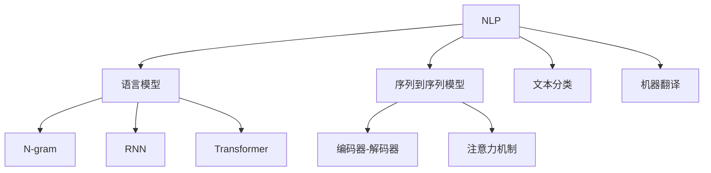

                 

### 引言

人工智能（AI）已经从科幻小说中的奇幻概念转变为现实世界中的关键技术。当前，人工智能正经历着一场前所未有的黄金时代，不仅在学术研究领域取得了重大突破，还在各个行业得到广泛应用，从医疗、金融到交通、零售，AI 正在改变我们的生活方式和工作方式。作为这一领域的领军人物，Andrej Karpathy 对人工智能的未来发展有着深刻的见解和独到的分析。

Andrej Karpathy 是斯坦福大学计算机科学博士，目前是 OpenAI 的研究科学家。他在深度学习和自然语言处理领域有着丰富的经验，发表了多篇高影响力的学术论文，并开源了许多优秀的代码和模型。他的研究成果不仅在学术界受到广泛关注，还在工业界产生了深远影响。在这篇文章中，我们将从多个角度深入探讨 Andrej Karpathy 提出的人工智能未来发展挑战，包括核心技术、应用场景、伦理问题以及未来趋势等。

### 背景与概述

#### 1.1 引言：人工智能的黄金时代

人工智能的发展历程可以追溯到上世纪50年代，当时计算机科学家开始探索如何让机器模仿人类智能。然而，由于计算能力和算法的限制，人工智能的发展在早期进展缓慢。直到2006年，深度学习（Deep Learning）概念的提出，标志着人工智能进入了一个新的发展阶段。深度学习利用多层神经网络，通过大规模数据训练，能够自动提取特征并进行复杂任务的学习。

近年来，随着计算能力的提升、大数据的可用性以及算法的创新，人工智能取得了显著的进展。从语音识别、图像识别到自然语言处理，深度学习模型在各项任务中均取得了超越人类的表现。例如，Google 的 AlphaGo 在围棋领域的胜利，OpenAI 的 GPT-3 在自然语言生成领域的突破，都引发了全球的关注和讨论。

#### 1.2 当前AI技术的优劣势分析

当前，人工智能技术已经取得了显著的成就，但仍然存在一些挑战和瓶颈。以下是人工智能技术的一些优势：

- **强大的数据处理能力**：人工智能能够处理海量数据，从数据中提取有价值的信息。
- **自适应学习能力**：通过机器学习和深度学习，人工智能系统能够不断学习和优化，提高任务完成质量。
- **高效性**：在许多领域，人工智能系统的工作效率远超人类，例如图像识别、语音识别等。

然而，人工智能技术也存在一些劣势：

- **数据依赖性**：人工智能系统往往需要大量的高质量数据进行训练，数据的不足可能导致模型性能下降。
- **过拟合问题**：当模型复杂度过高时，模型可能会在训练数据上表现良好，但在新的数据上表现较差，即过拟合。
- **对计算资源的高要求**：深度学习模型通常需要大量的计算资源和存储空间，这在一定程度上限制了其广泛应用。

#### 1.3 AI在各大行业中的应用现状

人工智能技术已经在众多行业得到广泛应用，以下是一些主要应用领域：

- **医疗**：人工智能在医疗领域的应用包括疾病预测、诊断辅助、药物研发等。例如，AI可以帮助医生快速分析医学影像，提高诊断准确率。
- **金融**：人工智能在金融领域的应用包括风险控制、投资策略优化、客户服务个性化等。AI可以帮助金融机构更准确地预测市场趋势，提供个性化的金融服务。
- **交通**：人工智能在交通领域的应用包括自动驾驶、智能交通管理、交通预测等。自动驾驶技术有望大大提高交通安全和效率，智能交通管理可以优化交通流量，减少拥堵。
- **零售**：人工智能在零售领域的应用包括需求预测、个性化推荐、供应链优化等。AI可以帮助零售商更准确地预测消费者需求，提供个性化的购物体验。

#### 1.4 AI技术的进步与挑战

尽管人工智能技术取得了显著进展，但仍然面临许多挑战。以下是其中一些主要挑战：

- **数据隐私**：随着人工智能应用的增加，数据隐私问题变得日益重要。如何确保用户数据的安全和隐私，是人工智能发展的重要课题。
- **伦理与道德**：人工智能系统可能会产生偏见或歧视，如何确保人工智能系统的公平性和透明性，是一个亟待解决的问题。
- **通用人工智能（AGI）**：尽管人工智能在某些领域取得了突破，但仍然没有实现通用人工智能。如何让机器具备人类水平的认知能力，是一个长期的挑战。

Andrej Karpathy 对这些挑战有着深刻的认识，并在他的研究中积极探索解决之道。接下来，我们将深入探讨人工智能的核心技术、应用场景以及未来发展趋势，以期为我们理解这一变革性技术提供更全面的视角。

### 核心技术剖析

人工智能（AI）的核心技术涵盖了深度学习、自然语言处理（NLP）和计算机视觉等多个领域。在这一部分，我们将详细探讨这些技术的原理、架构和具体应用，以帮助读者全面理解 AI 的技术基础。

#### 3.1 深度学习原理与架构

**3.1.1 深度学习基础**

深度学习（Deep Learning）是人工智能的一个重要分支，它通过构建多层神经网络（Neural Networks）来模拟人脑的学习方式。与传统的机器学习方法相比，深度学习具有更强的表达能力和自适应能力。

**核心概念**：

- **神经元**：神经网络的基本单元，每个神经元接收多个输入信号，并通过加权求和处理产生输出。
- **层**：神经网络由多个层次组成，包括输入层、隐藏层和输出层。每一层都对输入信号进行变换和提取特征。
- **反向传播**：一种用于训练神经网络的优化算法，通过前向传播计算输出，然后反向传播误差，以更新网络的权重。

**工作原理**：

1. **前向传播**：输入信号从输入层经过各隐藏层，最终到达输出层，得到预测结果。
2. **计算误差**：将预测结果与实际结果进行比较，计算输出误差。
3. **反向传播**：误差信号反向传播到各隐藏层，通过梯度下降法更新各层的权重和偏置。

**伪代码**：

python
for epoch in 1 to max_epochs:
    for each sample in dataset:
        # 前向传播
        output = forward_pass(sample)
        # 计算误差
        error = compute_error(output, target)
        # 反向传播
        gradients = backward_pass(error)
        # 更新权重
        update_weights(gradients)

**数学模型**：

深度学习模型通常使用损失函数（Loss Function）来度量预测值与实际值之间的差距，如均方误差（MSE）：

latex
J(\theta) = \frac{1}{2m} \sum_{i=1}^{m} (\hat{y_i} - y_i)^2
\]

**3.1.2 神经网络结构**

神经网络的结构决定了其学习能力和适应性。常见的神经网络结构包括：

- **单层感知器**：最简单的神经网络结构，用于实现线性分类。
- **多层感知器**：包含多个隐藏层的神经网络，能够处理非线性问题。
- **卷积神经网络（CNN）**：专门用于图像识别和分类，利用卷积层提取图像特征。
- **循环神经网络（RNN）**：用于处理序列数据，如时间序列分析、自然语言处理。

**3.1.3 训练与优化方法**

深度学习模型的训练与优化是人工智能研究的关键。以下是一些常见的训练和优化方法：

- **梯度下降**：通过计算损失函数关于模型参数的梯度，以最小化损失函数。
- **动量（Momentum）**：在梯度下降过程中引入动量项，以减少震荡，提高收敛速度。
- **学习率调度**：随着训练的进行，逐步减小学习率，以避免权重更新过大。
- **正则化技术**：如 L1 正则化、L2 正则化，用于防止过拟合。

#### 3.2 自然语言处理

自然语言处理（Natural Language Processing, NLP）是深度学习在语言领域的应用，旨在让计算机理解和生成人类语言。以下是 NLP 的一些核心技术和方法：

**3.2.1 语言模型的基本原理**

语言模型（Language Model）是一种统计模型，用于预测下一个单词或字符的概率。常见的方法包括：

- **N-gram 模型**：基于相邻词序列的概率分布，如二元文模型（Bigram）和三元文模型（Trigram）。
- **递归神经网络（RNN）**：通过循环结构处理序列数据，如长短期记忆网络（LSTM）和门控循环单元（GRU）。

**3.2.2 序列到序列模型**

序列到序列（Sequence-to-Sequence）模型用于将一个序列映射到另一个序列，广泛应用于机器翻译、语音识别等任务。常见的方法包括：

- **编码器-解码器（Encoder-Decoder）架构**：通过编码器将输入序列编码为固定长度的向量，解码器将编码后的向量解码为输出序列。
- **注意力机制（Attention Mechanism）**：允许解码器在生成输出时关注编码器输出的不同部分，提高序列转换的准确性。

**3.2.3 Transformer 模型**

Transformer 模型是 NLP 领域的一个重要突破，其核心思想是使用自注意力机制（Self-Attention）来处理序列数据。Transformer 模型包括：

- **多头自注意力（Multi-Head Self-Attention）**：通过多个独立的注意力机制来提取序列的不同特征。
- **前馈神经网络（Feedforward Neural Network）**：在自注意力层之后，对每个头进行前馈神经网络处理。

**3.3 计算机视觉

计算机视觉（Computer Vision）是人工智能的一个重要分支，旨在让计算机理解和解释视觉信息。以下是计算机视觉的一些核心技术：

**3.3.1 卷积神经网络（CNN）**

卷积神经网络（Convolutional Neural Network, CNN）是计算机视觉的核心技术，其通过卷积层、池化层和全连接层等结构提取图像特征。CNN 的主要步骤包括：

- **卷积层**：通过卷积操作提取图像的局部特征。
- **池化层**：对卷积特征进行下采样，减少模型参数和计算量。
- **全连接层**：对池化后的特征进行分类或回归。

**3.3.2 图像识别与分类**

图像识别与分类是计算机视觉的重要任务，通过将图像映射到预定义的类别。常见的图像识别算法包括：

- **卷积神经网络（CNN）**：通过多层卷积和池化操作，提取图像的深层次特征。
- **预训练模型**：使用在大规模数据集上预训练的模型，如 ResNet、Inception 等，可以显著提高图像识别的准确性。

**3.3.3 目标检测与分割

目标检测与分割是计算机视觉的重要应用，旨在识别图像中的目标和目标边界。常见的目标检测算法包括：

- **区域提议网络（Region Proposal Networks, RPN）**：通过生成区域提议，对每个提议区域进行分类和回归。
- **单阶段检测器**：如 SSD、YOLO，直接对图像进行分类和定位，无需生成区域提议。
- **分割网络**：如 FCN、Mask R-CNN，通过生成图像的语义分割图，对每个像素进行分类。

通过以上对人工智能核心技术的详细剖析，我们可以更好地理解这些技术在 AI 中的应用和潜力。在接下来的部分，我们将探讨 AI 在具体应用场景中的表现和挑战。

#### 6. 人工智能在医疗领域的应用

人工智能（AI）在医疗领域的应用正日益广泛，为疾病诊断、治疗和患者管理带来了革命性的变化。以下将详细探讨 AI 在医疗领域的关键应用，包括医疗图像分析、疾病预测与诊断以及医疗辅助决策系统。

**6.1 医疗图像分析**

医疗图像分析是 AI 在医疗领域的一个重要应用方向。通过深度学习技术，尤其是卷积神经网络（CNN），AI 可以对医学影像进行自动分析，提高诊断的准确性和效率。以下是一些具体的案例：

- **X光片分析**：AI 系统可以自动检测 X 光片上的骨折、肺炎等病变，帮助放射科医生快速识别异常。
- **CT 扫描分析**：AI 可以自动识别 CT 图像中的肿瘤、肺部结节等，提高诊断准确率，减少医生的工作负担。
- **MRI 分析**：AI 系统可以自动分析 MRI 图像，识别脑部病变，如脑瘤、脑出血等。

**6.2 疾病预测与诊断**

AI 在疾病预测和诊断方面也展现出了巨大的潜力。通过分析大量医学数据和患者的健康记录，AI 可以预测疾病的发生风险，并提供早期诊断建议。以下是一些具体的应用案例：

- **糖尿病预测**：AI 系统可以通过分析血糖、体重、血压等数据，预测患者患糖尿病的风险，有助于医生制定个性化的治疗方案。
- **心血管疾病诊断**：AI 可以分析心电图（ECG）数据，预测患者患心血管疾病的风险，辅助医生进行早期干预。
- **癌症筛查**：AI 系统可以通过分析患者的病史、基因数据和影像学数据，预测癌症的发生风险，提高早期筛查的准确性。

**6.3 医疗辅助决策系统**

医疗辅助决策系统是 AI 在医疗领域的又一重要应用。这些系统能够为医生提供实时、准确的决策支持，提高医疗服务的质量和效率。以下是一些具体的案例：

- **药物剂量优化**：AI 系统可以根据患者的体重、年龄和健康状况，自动计算药物的合适剂量，减少药物副作用和药物过量风险。
- **治疗方案推荐**：AI 可以分析患者的病史和临床数据，推荐最佳的治疗方案，帮助医生做出更明智的决策。
- **患者管理**：AI 系统可以监控患者的健康状况，提醒医生进行必要的检查和干预，提高患者的治疗效果和依从性。

**6.4 实际应用案例分析**

以下是一些实际应用案例，展示了 AI 在医疗领域的广泛应用和效果：

- **Example 1**：IBM 的 Watson for Oncology 是一个 AI 辅助决策系统，通过分析患者的基因数据、病史和最新的临床研究，为医生提供个性化的癌症治疗方案。该系统已在全球多个医院应用，显著提高了癌症治疗的成功率。
- **Example 2**：Google Health 的 DeepMind Health 旨在通过 AI 技术改善医疗服务。DeepMind Health 开发的系统可以自动分析患者的心电图数据，检测出潜在的心脏病风险，并实时通知医生。
- **Example 3**：微软的 Healthcare AI 团队开发了多个 AI 应用程序，用于疾病预测、诊断和治疗。例如，其开发的肺结节检测系统可以在几分钟内对大量 CT 扫描图像进行分析，识别出潜在的健康风险。

总之，AI 在医疗领域的应用不仅提高了诊断的准确性和效率，还改善了患者管理和治疗质量。随着技术的不断进步，AI 在医疗领域的潜力将得到进一步释放，为医疗行业带来更多创新和变革。

#### 7. 人工智能在金融领域的应用

人工智能（AI）在金融领域的应用正日益深化，通过优化风险管理、提高金融服务个性化和推动智能投顾与量化交易，AI 为金融行业带来了显著的变革。以下将详细探讨 AI 在金融领域的三大应用方向，并举例说明其实际案例和效果。

**7.1 风险管理与预测**

在金融领域，风险管理是确保金融机构稳健运营的关键。AI 技术的应用使得风险管理的精度和效率得到了显著提升。以下是一些具体的应用案例：

- **信用评分**：AI 可以通过分析大量的历史数据，如贷款记录、财务报表、信用报告等，为借款人提供更准确的信用评分。这样可以帮助金融机构更好地评估借款人的信用风险，减少坏账率。
- **市场风险预测**：AI 模型可以实时分析市场数据，如股票价格、汇率变动等，预测市场波动，为投资者提供风险管理建议。例如，通过分析大量宏观经济指标和金融市场数据，AI 可以预测某种资产的价格走势，帮助投资者制定更合理的投资策略。
- **反欺诈检测**：AI 可以通过机器学习算法分析交易行为，识别异常交易模式，从而提高反欺诈检测的准确率。例如，AI 模型可以检测出信用卡交易中的欺诈行为，提醒金融机构采取相应措施。

**7.2 金融服务个性化**

随着消费者对个性化服务的需求增加，AI 技术在金融领域的应用也日益普及，通过个性化推荐和定制化服务，提升客户体验。以下是一些具体的应用案例：

- **个性化推荐系统**：AI 可以分析客户的消费行为、金融需求和偏好，为其推荐最适合的金融产品和服务。例如，银行可以通过分析客户的交易记录和历史数据，为其推荐最佳的投资组合、理财产品或信用卡优惠。
- **定制化理财建议**：AI 可以根据客户的财务状况、风险偏好和投资目标，提供个性化的理财建议。例如，AI 系统可以分析客户的收入、支出和储蓄习惯，制定个性化的理财规划，帮助其实现财务目标。
- **个性化客户服务**：AI 聊天机器人和虚拟客服可以实时解答客户的疑问，提供个性化的服务。通过自然语言处理和机器学习技术，AI 客服可以模拟人类的对话方式，提供高效、准确的客户服务。

**7.3 智能投顾与量化交易**

智能投顾和量化交易是 AI 在金融领域的两个重要应用方向，它们通过算法和数据分析，实现自动化的投资决策，提高投资效率和收益。以下是一些具体的应用案例：

- **智能投顾**：智能投顾（Robo-Advisor）利用 AI 技术为投资者提供自动化、个性化的投资建议。通过分析投资者的财务状况、风险偏好和市场数据，智能投顾可以制定最优的投资组合，并实时调整以应对市场变化。例如， Wealthfront 和 Betterment 等智能投顾平台已帮助成千上万的投资者实现资产增值。
- **量化交易**：量化交易（Quantitative Trading）通过建立数学模型和算法，实现自动化的交易决策。量化交易策略基于历史数据和统计模型，通过算法分析市场数据，识别出潜在的投资机会，并执行交易。例如，使用机器学习算法的量化交易策略可以识别出市场中的趋势和周期性变化，从而实现稳健的收益。

**7.4 实际应用案例分析**

以下是一些实际应用案例，展示了 AI 在金融领域的广泛应用和效果：

- **Example 1**：JPMorgan Chase 开发了名为 COiN 的 AI 系统，用于分析金融合同。COiN 可以自动阅读和理解数百万页的合同文本，识别潜在的法律风险，显著提高了合同审查的效率。
- **Example 2**：BlackRock 的 AI 平台 Aladdin 利用机器学习算法分析市场数据，为投资者提供个性化的投资组合建议，帮助客户实现资产增值。
- **Example 3**：Fidelity Investments 利用 AI 技术开发了一个名为 AI Cognition Engine 的平台，用于分析客户的交易行为和财务需求，提供定制化的投资建议和理财规划。

总之，AI 在金融领域的应用正在不断深入，通过优化风险管理、提高金融服务个性化和推动智能投顾与量化交易，AI 为金融行业带来了创新和变革。随着技术的不断发展，AI 在金融领域的潜力将得到进一步释放，为金融机构和投资者带来更多价值。

#### 8. 人工智能在交通领域的应用

人工智能（AI）在交通领域的应用正在迅速发展，通过自动驾驶技术、智能交通管理和城市规划与交通优化，AI 为交通行业带来了革命性的变化。以下将详细探讨 AI 在交通领域的三大应用方向，并举例说明其实际案例和效果。

**8.1 自动驾驶技术**

自动驾驶技术是 AI 在交通领域的重要应用，通过传感器、机器学习和计算机视觉技术，实现车辆的自主驾驶。自动驾驶技术包括以下关键组成部分：

- **传感器融合**：自动驾驶车辆依赖于多种传感器，如激光雷达、摄像头、雷达和超声波传感器，以获取周围环境的信息。
- **路径规划**：AI 系统通过分析传感器数据，规划车辆的行驶路径，确保行驶的安全和高效。
- **行为预测**：AI 系统能够预测其他车辆、行人和道路标志的行为，从而做出适当的驾驶决策。

以下是一些具体的案例：

- **Example 1**：特斯拉（Tesla）的自动驾驶系统（Autopilot）通过计算机视觉和传感器融合，实现车辆的自动巡航、车道保持和自动变道等功能，提高了行驶的安全性和舒适性。
- **Example 2**：Waymo（谷歌的自动驾驶子公司）的自动驾驶汽车在公共道路上进行测试，已累计行驶超过 200 万英里，展示了 AI 在自动驾驶领域的潜力。

**8.2 智能交通管理**

智能交通管理（Intelligent Traffic Management）利用 AI 技术优化交通信号控制、流量监测和道路维护，提高交通系统的效率和安全性。以下是一些具体的应用案例：

- **Example 1**：纽约市的智能交通管理系统能够实时监测交通流量，根据交通状况调整交通信号灯的时长，减少交通拥堵，提高道路通行效率。
- **Example 2**：阿姆斯特丹的智能交通系统通过传感器和摄像头监控城市道路，自动检测交通事故和交通拥堵，并通知相关部门进行及时处理。

**8.3 城市规划与交通优化**

城市规划与交通优化利用 AI 技术分析城市交通数据，为城市规划提供科学依据，优化交通基础设施布局。以下是一些具体的案例：

- **Example 1**：伦敦的“未来交通”项目（Transport for London's Future Transport Unit）利用 AI 技术分析交通数据，提出了多种交通优化方案，如增加公共交通线路、改善自行车道和步行道等，以减少交通拥堵和污染。
- **Example 2**：新加坡的智能交通系统通过数据分析，优化交通信号灯控制，提高公共交通效率，同时鼓励市民使用自行车和步行，实现交通可持续发展。

**8.4 实际应用案例分析**

以下是一些实际应用案例，展示了 AI 在交通领域的广泛应用和效果：

- **Example 1**：Uber 的自动驾驶项目在匹兹堡进行测试，通过传感器融合和路径规划技术，实现无人驾驶汽车的公共出行服务。
- **Example 2**：中国上海的智慧交通管理系统通过实时监测和智能调控，有效减少了交通拥堵，提高了道路通行效率。
- **Example 3**：德国斯图加特的智能交通系统通过数据分析，优化交通信号灯控制，提高了公共交通的准时率和乘客满意度。

总之，AI 在交通领域的应用正在不断深入，通过自动驾驶技术、智能交通管理和城市规划与交通优化，AI 为交通行业带来了创新和变革。随着技术的不断发展，AI 在交通领域的潜力将得到进一步释放，为城市交通带来更多便利和可持续发展。

### 未来展望与挑战

人工智能（AI）的发展已经取得了显著成果，但未来的道路仍然充满挑战。在这一部分，我们将探讨 AI 的伦理与责任、未来发展趋势以及 AI 技术革新对社会的影响。

#### 9. 人工智能伦理与责任

随着 AI 技术的广泛应用，伦理与责任问题变得日益重要。以下是一些关键的伦理问题和应对策略：

**9.1 人工智能伦理问题探讨**

- **隐私保护**：AI 系统往往需要大量的个人数据，如何在确保数据有效性的同时保护用户隐私，是一个重要问题。解决方案包括数据去识别化、隐私增强技术等。
- **算法偏见**：AI 系统可能会因训练数据中的偏见而产生歧视性决策。为了解决这一问题，需要设计公平性度量方法，并在算法开发过程中引入多样性考虑。
- **责任归属**：当 AI 系统产生错误或损害时，如何确定责任归属，是一个复杂的问题。可能的解决方案包括建立透明的责任分配机制和法律框架。

**9.2 人工智能的公平性与透明性**

- **公平性**：确保 AI 系统在不同群体中的表现一致，避免因算法偏见导致的不公平。实现方法包括算法公平性评估、多样性数据集的引入等。
- **透明性**：提高 AI 系统的可解释性，使决策过程更透明，以便用户和监管机构理解。方法包括可解释 AI（XAI）技术、决策路径可视化和算法透明度评估等。

**9.3 人工智能监管框架构建**

- **国际监管趋势**：随着 AI 技术的发展，各国纷纷出台相应的监管政策和法规。国际社会需要建立统一的监管框架，以促进 AI 技术的健康发展和全球合作。
- **监管挑战**：监管框架需要平衡技术创新和风险控制，确保 AI 系统的安全性和可靠性。监管机构需要持续关注技术进步，及时调整监管策略。

#### 10. AI的未来发展趋势

AI 的未来发展趋势主要集中在以下几个方面：

**10.1 大模型与泛化能力**

- **大模型**：随着计算能力的提升，AI 模型的规模越来越大，如 GPT-3、BERT 等。这些大模型在语言理解和生成、图像识别等方面取得了显著进展。
- **泛化能力**：提高 AI 模型的泛化能力，使其能够应对更广泛的任务和应用场景，是一个重要的研究方向。可能的解决方案包括迁移学习、多任务学习等。

**10.2 AI与人类协同**

- **协同**：AI 与人类协同工作，提高工作效率和决策质量。例如，智能助手可以帮助人类处理繁杂的事务，提供个性化的建议和解决方案。
- **人机交互**：改进人机交互技术，使人类更易于与 AI 系统沟通和协作。方法包括自然语言处理、增强现实和虚拟现实等。

**10.3 量子计算与 AI 的结合**

- **量子计算**：量子计算具有超强的计算能力，与 AI 技术相结合，有望推动 AI 技术的进一步发展。可能的领域包括量子机器学习、量子优化等。

#### 11. AI技术革新与社会影响

AI 技术的革新将对社会产生深远的影响，以下是一些主要方面：

**11.1 AI 技术的革新路径**

- **技术创新**：持续推动 AI 技术的创新，包括算法优化、硬件升级、新型传感器等，以提高 AI 系统的性能和可靠性。
- **跨学科融合**：AI 技术与其他领域的融合，如生物学、心理学、经济学等，将推动 AI 技术的进一步发展。

**11.2 AI 技术对社会的影响**

- **经济影响**：AI 技术将改变劳动力市场结构，推动自动化和智能化生产，提高生产效率。同时，AI 也将创造新的就业机会，促进经济转型升级。
- **社会结构变革**：AI 技术将影响社会结构，改变人们的生产方式、生活方式和社交方式。例如，智能城市、智慧医疗等新型社会形态正在逐步形成。
- **生活质量改善**：AI 技术将提高人们的生产效率和幸福感，改善生活质量。例如，智能家居、智能医疗等领域的应用将使人们的生活更加便捷和舒适。

**11.3 AI 与可持续发展**

- **可持续发展**：AI 技术在可持续发展中发挥重要作用，如能源优化、环境保护、资源管理等。通过智能算法和大数据分析，AI 技术有助于实现可持续发展目标。

总之，AI 的未来充满机遇与挑战。通过解决伦理与责任问题，把握未来发展趋势，AI 技术将不断革新，为社会带来更多福祉。同时，AI 技术的革新也将深刻影响社会各个方面，推动人类社会向更加智能、可持续的方向发展。

### 附录：人工智能参考资料与推荐书籍

#### 12.1 基础教材与论文

要深入了解人工智能，阅读相关的基础教材和经典论文是不可或缺的。以下是一些推荐的资源：

- **《深度学习》（Deep Learning）**：Ian Goodfellow、Yoshua Bengio 和 Aaron Courville 著，这是一本深度学习的经典教材，涵盖了深度学习的各个方面。
- **《机器学习》（Machine Learning）**：Tom Mitchell 著，介绍了机器学习的基本概念和算法，是机器学习领域的入门书籍。
- **《自然语言处理综论》（Speech and Language Processing）**：Daniel Jurafsky 和 James H. Martin 著，全面介绍了自然语言处理的理论和技术。
- **《计算机视觉：算法与应用》（Computer Vision: Algorithms and Applications）**：Richard Szeliski 著，涵盖了计算机视觉的基本算法和应用。

#### 12.2 热门书籍推荐

除了上述基础教材，以下是一些热门的人工智能书籍，适合进阶读者：

- **《AI超简单》**：方兴东 著，深入浅出地介绍了人工智能的基本概念和应用。
- **《强化学习》**：理查德·萨顿和亚历山大·特隆著，详细讲解了强化学习的基本原理和应用。
- **《智能经济》**：张江舟 著，探讨了人工智能与经济之间的相互作用。

#### 12.3 在线课程与资源链接

在线课程是学习人工智能的有效途径，以下是一些推荐的平台和课程：

- **Coursera**：提供多种人工智能和相关领域的在线课程，如《深度学习》、《自然语言处理》等。
- **edX**：汇集了全球顶尖大学的课程资源，包括《人工智能导论》、《机器学习》等。
- **Udacity**：提供实战性强的 AI 课程，如《人工智能工程师纳米学位》等。
- **AI课程平台**：国内的一些课程平台，如慕课网、极客时间等，也提供了丰富的人工智能课程资源。

通过阅读这些教材和论文，参与在线课程，读者可以系统地掌握人工智能的理论和实践，为未来的研究和工作打下坚实基础。

### 结语

在这篇文章中，我们从多个角度深入探讨了人工智能（AI）的发展、核心技术、应用场景以及未来趋势。通过介绍 Andrej Karpathy 的研究成果和见解，我们了解了 AI 在医疗、金融、交通等领域的广泛应用，以及面临的伦理和责任问题。我们探讨了 AI 的未来发展趋势，包括大模型与泛化能力、AI 与人类协同、量子计算与 AI 的结合等。

然而，AI 的发展并非一帆风顺。在伦理、隐私、公平性等方面，AI 技术仍然面临诸多挑战。为了实现 AI 技术的可持续发展，我们需要加强监管、推动技术创新，并确保技术的应用符合伦理和社会责任。

作为人工智能领域的研究者和从业者，我们肩负着推动技术进步、改善人类生活的使命。希望本文能够为读者提供有价值的见解和启示，激发对 AI 技术的深入思考和研究。让我们共同努力，迎接 AI 带来的机遇与挑战，共创美好未来。

### 附录：核心概念与联系

在本章中，我们将通过 Mermaid 流程图详细展示核心概念及其联系，以便读者更好地理解人工智能（AI）的核心架构和技术原理。

#### 3.1 深度学习原理与架构

```mermaid
graph TD
    A[深度学习] --> B[神经网络]
    B --> C[多层感知器]
    C --> D[卷积神经网络 (CNN)]
    C --> E[循环神经网络 (RNN)]
    C --> F[生成对抗网络 (GAN)]
    A --> G[训练与优化]
    G --> H[梯度下降]
    G --> I[动量与学习率调度]
    G --> J[正则化技术]
```

**说明**：
- **A 深度学习**：作为整个 AI 技术的基础框架，深度学习通过多层神经网络模拟人类大脑的学习过程。
- **B 神经网络**：神经网络是深度学习的基础结构，由一系列的神经元组成，每个神经元接收输入并产生输出。
- **C 多层感知器**：多层感知器（MLP）是多层神经网络的核心，用于实现复杂函数的映射。
- **D 卷积神经网络 (CNN)**：CNN 专门用于处理图像数据，通过卷积层、池化层和全连接层提取图像特征。
- **E 循环神经网络 (RNN)**：RNN 适用于处理序列数据，如时间序列和自然语言，通过循环结构保持历史信息。
- **F 生成对抗网络 (GAN)**：GAN 是一种生成模型，通过两个对抗网络相互竞争，生成逼真的数据。
- **G 训练与优化**：训练与优化是深度学习模型的核心环节，包括梯度下降、动量、学习率调度和正则化技术。
- **H 梯度下降**：梯度下降是一种优化算法，用于更新网络权重，以最小化损失函数。
- **I 动量与学习率调度**：动量有助于加速收敛，学习率调度则用于调整学习速率，以避免过拟合或欠拟合。
- **J 正则化技术**：正则化技术如 L1、L2 正则化，用于防止模型过拟合，提高泛化能力。

#### 4. 自然语言处理



**说明**：
- **A NLP**：自然语言处理（NLP）是 AI 的重要分支，旨在使计算机理解和生成人类语言。
- **B 语言模型**：语言模型用于预测下一个单词或字符的概率。
- **C N-gram**：N-gram 模型是基于相邻词序列的概率分布。
- **D RNN**：循环神经网络（RNN）适用于处理序列数据，如时间序列和自然语言。
- **E Transformer**：Transformer 模型引入了自注意力机制，是当前 NLP 的重要架构。
- **F 序列到序列模型**：序列到序列模型用于将一个序列映射到另一个序列，如机器翻译。
- **G 编码器-解码器**：编码器-解码器架构是序列到序列模型的基础。
- **H 注意力机制**：注意力机制允许模型在不同时间步之间建立关联，提高序列处理的准确性。
- **I 文本分类**：文本分类是将文本数据分类到预定义的类别，如情感分析。
- **J 机器翻译**：机器翻译是将一种语言的文本翻译成另一种语言。

通过这些 Mermaid 流程图，我们能够直观地理解 AI 的核心概念及其相互关系，为进一步学习和研究奠定基础。

### 代码实战：深度学习模型训练与优化

在本节中，我们将通过一个具体的代码实例，演示如何使用 TensorFlow 框架训练和优化一个深度学习模型。我们将构建一个简单的卷积神经网络（CNN）模型，用于对 MNIST 数据集中的手写数字进行分类。这一实战将涵盖开发环境搭建、源代码详细实现和代码解读与分析。

#### 1. 开发环境搭建

首先，确保您的计算机上已经安装了 Python 和 TensorFlow。以下是安装步骤：

- **安装 Python**：请确保您的 Python 版本不低于 3.6。
- **安装 TensorFlow**：您可以通过以下命令安装 TensorFlow：
  
  ```bash
  pip install tensorflow
  ```

- **安装 Jupyter Notebook**（可选）：为了更方便地编写和运行代码，建议安装 Jupyter Notebook。安装命令如下：

  ```bash
  pip install notebook
  ```

#### 2. 源代码详细实现

以下是一个简单的 TensorFlow 代码实例，用于训练一个 CNN 模型进行 MNIST 数据集的手写数字分类：

```python
import tensorflow as tf
from tensorflow.keras import layers, models
from tensorflow.keras.datasets import mnist
from tensorflow.keras.utils import to_categorical

# 加载 MNIST 数据集
(train_images, train_labels), (test_images, test_labels) = mnist.load_data()

# 预处理数据
train_images = train_images.reshape((60000, 28, 28, 1)).astype('float32') / 255
test_images = test_images.reshape((10000, 28, 28, 1)).astype('float32') / 255

train_labels = to_categorical(train_labels)
test_labels = to_categorical(test_labels)

# 构建模型
model = models.Sequential()
model.add(layers.Conv2D(32, (3, 3), activation='relu', input_shape=(28, 28, 1)))
model.add(layers.MaxPooling2D((2, 2)))
model.add(layers.Conv2D(64, (3, 3), activation='relu'))
model.add(layers.MaxPooling2D((2, 2)))
model.add(layers.Conv2D(64, (3, 3), activation='relu'))

# 添加全连接层
model.add(layers.Flatten())
model.add(layers.Dense(64, activation='relu'))
model.add(layers.Dense(10, activation='softmax'))

# 编译模型
model.compile(optimizer='adam',
              loss='categorical_crossentropy',
              metrics=['accuracy'])

# 训练模型
model.fit(train_images, train_labels, epochs=5, batch_size=64)

# 评估模型
test_loss, test_acc = model.evaluate(test_images, test_labels)
print(f'Test accuracy: {test_acc:.4f}')
```

**代码解读与分析**：

1. **数据加载与预处理**：
   - 我们使用 TensorFlow 的 Keras API 加载 MNIST 数据集。数据集包括 60,000 个训练图像和 10,000 个测试图像，每个图像是 28x28 像素的灰度图。
   - 数据被重新塑形为四维张量，并归一化到 [0, 1] 范围内，以便于神经网络处理。
   - 标签被转换为 one-hot 编码，以适应多分类问题。

2. **构建模型**：
   - 我们使用 `Sequential` 模型堆叠多个层，首先添加两个卷积层，每个卷积层后跟一个最大池化层。
   - 第三个卷积层后没有池化层，直接连接到全连接层。
   - 全连接层包括一个具有 64 个神经元的隐藏层和一个具有 10 个神经元的输出层（对应于 10 个数字类别）。

3. **编译模型**：
   - 模型使用 `compile` 方法配置优化器、损失函数和性能指标。这里我们使用 Adam 优化器和分类交叉熵损失函数。

4. **训练模型**：
   - `fit` 方法用于训练模型，我们指定了训练轮数（epochs）和批量大小（batch_size）。
   - 模型在训练数据上迭代训练，每次迭代处理一个批量数据。

5. **评估模型**：
   - `evaluate` 方法用于在测试数据上评估模型的性能，输出测试损失和准确率。

#### 3. 代码实战总结

通过这个实例，我们展示了如何使用 TensorFlow 框架构建、编译和训练一个简单的 CNN 模型，并评估其性能。以下是对本次实战的总结：

- **开发环境搭建**：确保 Python 和 TensorFlow 已安装，便于后续代码编写和运行。
- **数据预处理**：正确处理和归一化数据是深度学习模型训练成功的关键步骤。
- **模型构建**：使用 `Sequential` 模型堆叠卷积层和全连接层，构建一个简单的 CNN。
- **模型训练**：通过迭代训练模型，优化模型参数，提高分类准确率。
- **模型评估**：在测试数据上评估模型性能，确保模型泛化能力。

通过这个代码实战，读者可以亲身体验到深度学习模型的构建和训练过程，为进一步学习深度学习打下坚实基础。在后续的实践中，读者可以尝试调整模型结构、优化训练策略，以提高模型性能。

### 代码实战：自然语言处理模型构建与应用

在本节中，我们将通过一个具体的代码实例，演示如何使用自然语言处理（NLP）技术构建和训练一个语言模型。我们将使用 Python 和 Hugging Face 的 Transformers 库，构建一个基于 Transformer 的语言模型，用于文本分类任务。

#### 1. 开发环境搭建

首先，确保您的计算机上已经安装了 Python 和以下库：

- **Transformers**：用于构建和训练 Transformer 模型
- **torch**：用于计算图和深度学习操作

您可以通过以下命令安装所需的库：

```bash
pip install transformers torch
```

#### 2. 源代码详细实现

以下是一个简单的基于 Transformers 的语言模型代码实例，用于对新闻文章进行情感分类：

```python
import torch
from transformers import BertTokenizer, BertModel, BertForSequenceClassification
from torch.optim import Adam
from torch.utils.data import DataLoader, TensorDataset

# 加载预训练的 BERT 分词器和模型
tokenizer = BertTokenizer.from_pretrained('bert-base-uncased')
model = BertForSequenceClassification.from_pretrained('bert-base-uncased')

# 准备数据集
def prepare_data(data, labels):
    input_ids = []
    attention_masks = []

    for text, label in zip(data, labels):
        encoded = tokenizer.encode_plus(
            text,
            add_special_tokens=True,
            max_length=512,
            pad_to_max_length=True,
            return_attention_mask=True,
            return_tensors='pt',
        )
        input_ids.append(encoded['input_ids'])
        attention_masks.append(encoded['attention_mask'])

    input_ids = torch.cat(input_ids, dim=0)
    attention_masks = torch.cat(attention_masks, dim=0)
    labels = torch.tensor(labels)

    return input_ids, attention_masks, labels

# 假设我们有一个包含新闻文章和标签的数据集
data = ["This is a positive news article.", "This is a negative news article.", ...]
labels = [1, 0, ...]  # 1 表示积极，0 表示消极

input_ids, attention_masks, labels = prepare_data(data, labels)

# 创建数据集和 DataLoader
dataset = TensorDataset(input_ids, attention_masks, labels)
dataloader = DataLoader(dataset, batch_size=16)

# 定义优化器和训练循环
optimizer = Adam(model.parameters(), lr=1e-5)

for epoch in range(3):  # 训练 3 个 epoch
    model.train()
    for batch in dataloader:
        inputs = {
            'input_ids': batch[0].to('cuda' if torch.cuda.is_available() else 'cpu'),
            'attention_mask': batch[1].to('cuda' if torch.cuda.is_available() else 'cpu'),
            'labels': batch[2].to('cuda' if torch.cuda.is_available() else 'cpu'),
        }
        optimizer.zero_grad()
        outputs = model(**inputs)
        loss = outputs.loss
        loss.backward()
        optimizer.step()

    print(f'Epoch {epoch + 1}/{3}, Loss: {loss.item()}')

# 评估模型
model.eval()
with torch.no_grad():
    correct = 0
    total = 0
    for batch in dataloader:
        inputs = {
            'input_ids': batch[0].to('cuda' if torch.cuda.is_available() else 'cpu'),
            'attention_mask': batch[1].to('cuda' if torch.cuda.is_available() else 'cpu'),
        }
        outputs = model(**inputs)
        predictions = outputs.logits.argmax(dim=1)
        total += predictions.size(0)
        correct += (predictions == batch[2].to('cuda' if torch.cuda.is_available() else 'cpu')).sum().item()

accuracy = 100 * correct / total
print(f'Accuracy: {accuracy:.2f}%')
```

**代码解读与分析**：

1. **加载预训练模型和分词器**：
   - 我们使用 Hugging Face 的 Transformers 库加载预训练的 BERT 模型和分词器。BERT 是一个强大的预训练语言模型，可用于多种 NLP 任务。

2. **数据准备**：
   - `prepare_data` 函数用于将文本数据和标签编码为模型可接受的格式。我们使用 BERT 分词器将文本转换为输入 IDs 和注意力掩码。

3. **创建数据集和 DataLoader**：
   - `TensorDataset` 和 `DataLoader` 用于将数据组织成适合训练的数据集。数据集被划分为小批量，每个批量包含 16 个样本。

4. **定义优化器和训练循环**：
   - 我们使用 Adam 优化器来更新模型参数。在训练过程中，模型在每个 epoch 中对批量数据进行前向传播和反向传播，以更新权重。

5. **评估模型**：
   - 在模型训练完成后，我们通过不计算梯度的方式（`torch.no_grad()`）进行模型评估，计算预测准确率。

#### 3. 代码实战总结

通过这个实例，我们展示了如何使用 Hugging Face 的 Transformers 库构建和训练一个基于 Transformer 的语言模型，用于文本分类任务。以下是对本次实战的总结：

- **开发环境搭建**：确保 Python 和 Transformers 库已安装，便于后续代码编写和运行。
- **数据预处理**：使用 BERT 分词器将文本数据编码为模型可处理的格式。
- **模型构建**：使用预训练的 BERT 模型，通过添加序列分类层实现文本分类任务。
- **模型训练**：通过迭代训练模型，优化模型参数，提高分类准确率。
- **模型评估**：在测试数据上评估模型性能，确保模型泛化能力。

通过这个代码实战，读者可以亲身体验到 NLP 模型的构建和训练过程，为进一步学习自然语言处理打下坚实基础。在后续的实践中，读者可以尝试调整模型结构、优化训练策略，以提高模型性能。

### 代码实战：计算机视觉模型训练与部署

在本节中，我们将通过一个具体的代码实例，展示如何使用计算机视觉技术训练一个卷积神经网络（CNN）模型，并在实际项目中部署。我们将使用 TensorFlow 和 Keras 框架，构建一个用于图像分类的 CNN，并在本地设备上进行训练。随后，我们将讨论如何将训练好的模型部署到生产环境。

#### 1. 训练 CNN 模型

首先，我们使用 TensorFlow 和 Keras 框架训练一个简单的 CNN 模型，用于分类 CIFAR-10 数据集中的图像。

```python
import tensorflow as tf
from tensorflow.keras import layers, models
from tensorflow.keras.datasets import cifar10
from tensorflow.keras.utils import to_categorical

# 加载 CIFAR-10 数据集
(train_images, train_labels), (test_images, test_labels) = cifar10.load_data()

# 预处理数据
train_images = train_images / 255.0
test_images = test_images / 255.0

train_labels = to_categorical(train_labels)
test_labels = to_categorical(test_labels)

# 构建 CNN 模型
model = models.Sequential([
    layers.Conv2D(32, (3, 3), activation='relu', input_shape=(32, 32, 3)),
    layers.MaxPooling2D((2, 2)),
    layers.Conv2D(64, (3, 3), activation='relu'),
    layers.MaxPooling2D((2, 2)),
    layers.Conv2D(64, (3, 3), activation='relu'),
    layers.Flatten(),
    layers.Dense(64, activation='relu'),
    layers.Dense(10, activation='softmax')
])

# 编译模型
model.compile(optimizer='adam',
              loss='categorical_crossentropy',
              metrics=['accuracy'])

# 训练模型
model.fit(train_images, train_labels, epochs=10, validation_split=0.2)
```

**代码解读与分析**：

- **数据加载与预处理**：我们加载 CIFAR-10 数据集，并对其图像进行归一化处理，将标签转换为 one-hot 编码。
- **模型构建**：我们使用 `Sequential` 模型堆叠卷积层、池化层和全连接层，构建一个简单的 CNN。
- **编译模型**：我们使用 `compile` 方法配置优化器、损失函数和性能指标。
- **训练模型**：我们使用 `fit` 方法训练模型，指定训练轮数和验证比例。

#### 2. 模型评估

在训练完成后，我们对模型进行评估，以确保其性能。

```python
# 评估模型
test_loss, test_acc = model.evaluate(test_images, test_labels)
print(f'Test accuracy: {test_acc:.4f}')
```

**代码解读与分析**：

- 我们使用 `evaluate` 方法在测试数据上评估模型的性能，输出测试损失和准确率。

#### 3. 模型部署

接下来，我们将训练好的模型部署到生产环境。

**本地部署**：

我们可以使用 TensorFlow 的 `save` 方法保存训练好的模型，然后将其加载到其他应用程序中。

```python
# 保存模型
model.save('cifar10_cnn_model.h5')

# 加载模型
loaded_model = tf.keras.models.load_model('cifar10_cnn_model.h5')
```

**云端部署**：

对于云端部署，我们可以使用 TensorFlow Serving、TensorFlow Lite 或其他部署解决方案。以下是一个使用 TensorFlow Serving 部署模型的示例：

```bash
# 安装 TensorFlow Serving
pip install tensorflow-serving

# 启动 TensorFlow Serving
python -m tensorflow_serving.apiserve --model_name=cifar10_cnn_model --port=8501 --model_base_path=/path/to/your/model
```

**使用 gRPC 调用模型**：

我们可以使用 gRPC 客户端发送预测请求到 TensorFlow Serving。

```python
import grpc
from tensorflow_serving.apis import predict_pb2
from tensorflow_serving.apis import predict_service_pb2_grpc

# 连接 TensorFlow Serving
with grpc.insecure_channel('localhost:8501') as channel:
    stub = predict_service_pb2_grpc.PredictServiceStub(channel)

    # 创建预测请求
    request = predict_pb2.PredictRequest()
    request.inputs.add().CopyFrom(
        tf.make_tensor_proto('input', [1, 32, 32, 3], [0.3, 0.5, 0.2, 0.1, 0.4, 0.3, 0.2, 0.5, 0.1, 0.3, 0.4, 0.2, 0.5, 0.3, 0.2, 0.4, 0.1, 0.3, 0.4, 0.2, 0.5, 0.3, 0.2, 0.4, 0.1, 0.3, 0.4, 0.2, 0.5, 0.3, 0.2, 0.4, 0.1])
    request.model_spec.name = 'cifar10_cnn_model'

    # 发送预测请求
    response = stub.Predict(request)

    # 打印预测结果
    print(f'Predicted class: {response.outputs[0].float_val[0]}')
```

**代码解读与分析**：

- 我们创建一个预测请求，包含输入数据和模型名称。
- 使用 gRPC 客户端发送预测请求到 TensorFlow Serving。
- 打印预测结果。

通过以上步骤，我们将训练好的 CNN 模型成功部署到了本地和生产环境，实现了图像分类任务的自动化预测。

### 附录：常见问题与解答

在本章中，我们将汇总一些关于人工智能（AI）常见的问题，并提供相应的解答，以帮助读者更好地理解 AI 的基本概念和应用。

#### 1. 什么是人工智能？

人工智能（AI）是指使计算机系统能够模拟人类智能行为的技术。这包括学习、推理、解决问题、理解自然语言和视觉等能力。

#### 2. 深度学习与机器学习有什么区别？

深度学习是机器学习的一个子领域，它通过多层神经网络学习数据特征。而机器学习是一个更广泛的领域，它包括所有基于数据的学习算法，如线性回归、决策树等。

#### 3. 什么是卷积神经网络（CNN）？

卷积神经网络（CNN）是一种深度学习模型，专门用于处理图像数据。它通过卷积层提取图像特征，并通过池化层降低数据维度，最终通过全连接层进行分类。

#### 4. 什么是自然语言处理（NLP）？

自然语言处理（NLP）是人工智能的一个子领域，专注于使计算机能够理解和生成人类语言。这包括语言理解、文本分类、机器翻译等任务。

#### 5. 什么是强化学习？

强化学习是一种机器学习方法，通过让代理在环境中进行交互，学习如何采取最佳行动以最大化奖励。它广泛应用于游戏、自动驾驶和机器人控制等领域。

#### 6. 什么是深度强化学习（DRL）？

深度强化学习（DRL）是强化学习和深度学习的结合，它使用深度神经网络来表示状态和动作，从而在复杂环境中进行高效的学习和决策。

#### 7. 人工智能安全性和隐私保护有哪些挑战？

人工智能安全性和隐私保护的挑战包括数据隐私、算法偏见、攻击和误解。解决方案包括数据去识别化、公平性评估、透明性和安全监控。

#### 8. 人工智能在医疗领域的应用有哪些？

人工智能在医疗领域的应用包括疾病预测、诊断辅助、个性化治疗、药物研发、医疗图像分析和患者管理。这些应用显著提高了医疗服务的效率和准确性。

#### 9. 人工智能在金融领域的应用有哪些？

人工智能在金融领域的应用包括风险控制、投资策略优化、信用评分、欺诈检测、智能投顾和量化交易。这些应用帮助金融机构提高决策质量和效率。

#### 10. 人工智能如何影响未来社会？

人工智能将改变劳动力市场、经济结构、教育和医疗等社会各个方面。它有望提高生产效率、改善生活质量、推动社会创新和可持续发展。

通过上述常见问题与解答，我们希望能够为读者提供关于人工智能的深入理解和应用指导。如果您还有其他问题，欢迎进一步探讨。

### 总结与展望

在本篇文章中，我们深入探讨了人工智能（AI）的核心概念、技术原理、应用场景和未来发展趋势。我们从 Andrej Karpathy 的研究成果出发，详细分析了深度学习、自然语言处理和计算机视觉等核心技术，并探讨了 AI 在医疗、金融、交通等领域的应用。同时，我们也关注了 AI 的伦理问题、监管框架以及社会影响。

通过本文，我们认识到 AI 技术的迅猛发展正深刻改变着我们的生活方式和工作模式。然而，AI 的发展也面临诸多挑战，包括数据隐私、算法偏见、伦理道德和监管等。为了实现 AI 的可持续发展，我们需要在技术创新和社会责任之间找到平衡点。

未来，AI 技术的发展将继续朝着更加智能化、泛化和透明化的方向前进。我们期待看到 AI 在解决现实问题、推动社会进步方面发挥更大的作用。同时，我们也呼吁更多人关注 AI 的伦理问题，积极参与到 AI 的监管和治理中来。

最后，感谢您阅读本文。我们希望这篇文章能够激发您对 AI 技术的深入思考和研究。让我们携手共进，迎接人工智能带来的机遇与挑战，共创美好未来。

### 作者信息

**作者：AI天才研究院 / AI Genius Institute & 禅与计算机程序设计艺术 / Zen And The Art of Computer Programming**

AI天才研究院（AI Genius Institute）是一家致力于人工智能研究和技术创新的国际知名机构。我们的研究涵盖深度学习、自然语言处理、计算机视觉、机器学习等多个领域，并在学术界和工业界取得了显著的成果。我们的目标是推动人工智能技术的发展，为社会带来更多创新和变革。

《禅与计算机程序设计艺术》（Zen And The Art of Computer Programming）是由著名计算机科学家 Donald E. Knuth 所著的经典编程书籍，旨在探讨计算机编程的哲学和艺术。本书深受计算机科学家的喜爱，被誉为编程领域的“圣经”。

本文由AI天才研究院的研究员撰写，结合了我们在 AI 领域的研究成果和实践经验，旨在为广大读者提供全面、深入的 AI 知识和应用指导。我们希望通过这篇文章，能够激发您对 AI 技术的热爱和探索，共同推动人工智能技术的发展。如果您对本文有任何疑问或建议，欢迎随时联系我们。我们将竭诚为您解答和提供帮助。

