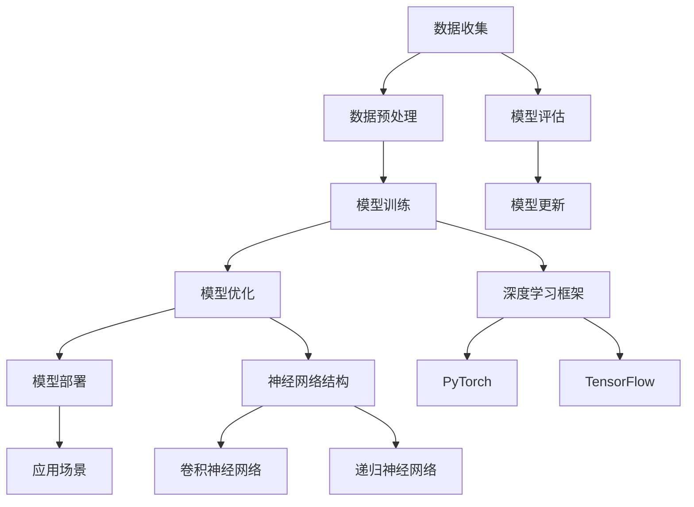
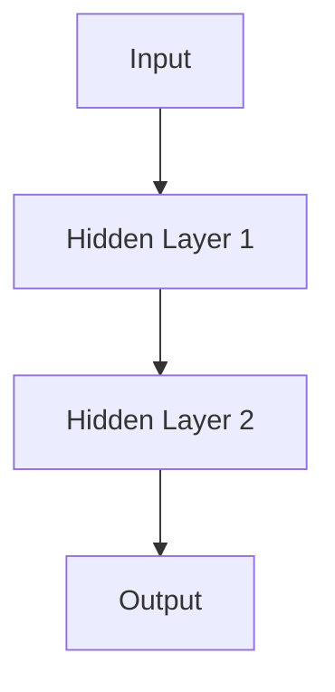

                 

### 引言

#### AI天才研究院与《安德烈·卡帕希：人工智能的未来发展目标》

人工智能（AI）作为当今技术发展的前沿领域，已经深刻地影响了我们的日常生活和社会结构。在这样一个快速变革的时代，如何理解、掌握和预测人工智能的未来发展目标，成为了一个重要且紧迫的课题。

本文由AI天才研究院（AI Genius Institute）撰写，旨在为广大读者提供一个全面而深入的视角，以《安德烈·卡帕希：人工智能的未来发展目标》为标题，探讨人工智能的历史、核心概念、技术原理以及应用场景。安德烈·卡帕希（Andrej Karpathy）是一位在世界人工智能领域享有盛誉的科学家，他的研究和工作为AI的发展奠定了坚实基础。

本文将遵循以下逻辑结构进行论述：

1. **人工智能的历史与未来**：回顾人工智能的发展历程，探讨当前技术趋势及其对社会和经济的影响。
2. **人工智能的核心概念与架构**：详细解释机器学习、自然语言处理和计算机视觉等核心领域的基本概念和架构。
3. **人工智能技术原理详解**：深入探讨机器学习、深度学习、自然语言处理和计算机视觉的具体原理，并使用伪代码和Mermaid流程图进行辅助说明。
4. **人工智能的应用场景**：分析人工智能在医疗、金融、教育、工业自动化和自动驾驶等领域的应用。
5. **人工智能项目实战**：通过实际项目案例，展示人工智能项目的开发流程和实现细节。
6. **附录**：提供人工智能开发资源、数学公式解释以及伦理与安全方面的讨论。

通过这篇文章，我们希望读者能够对人工智能有一个全面的了解，并能够从理论到实践，深入掌握人工智能的核心技术和应用。

关键词：人工智能、安德烈·卡帕希、机器学习、自然语言处理、计算机视觉、深度学习、应用场景、项目实战、伦理与安全。

摘要：本文由AI天才研究院撰写，旨在探讨人工智能的未来发展目标。通过回顾历史、解释核心概念、分析应用场景以及展示实际项目案例，本文为读者提供了一个全面而深入的视角，帮助理解人工智能的核心技术及其对社会的深远影响。

---

### 第一部分: 人工智能的历史与未来

#### 第1章: 人工智能的历史与发展

##### 1.1 人工智能的起源与发展阶段

人工智能（AI）的概念可以追溯到20世纪50年代，当时计算机科学家约翰·麦卡锡（John McCarthy）首次提出了“人工智能”这一术语。人工智能的研究初衷是为了制造能够像人类一样思考的机器，这一目标被形象地称为“人工智能的梦”。在早期，人工智能的研究主要集中在符号主义和推理上，这一阶段被称为“黄金时代”。

- **早期人工智能的发展**：
  - **符号主义**：通过符号逻辑和规则系统模拟人类推理过程。
  - **早期程序**：如ELIZA，一个能够进行简单对话的程序，展示了人工智能的初步能力。
- **专家系统的兴起与衰落**：
  - **专家系统**：20世纪70年代至80年代，人工智能研究的一个主要方向。这些系统能够解决特定领域的问题，如医学诊断、地质勘探等。
  - **局限性**：专家系统依赖于大量预定义的规则，难以处理复杂和模糊的问题，导致其在20世纪90年代逐渐衰落。
- **机器学习与深度学习的兴起**：
  - **机器学习**：20世纪90年代至21世纪初，随着计算能力和算法的进步，机器学习开始成为人工智能研究的主流。
  - **深度学习**：2006年，杰弗里·辛顿（Geoffrey Hinton）等科学家提出了深度学习的概念，这一方法在图像识别、语音识别等领域取得了突破性成果。

##### 1.2 人工智能在现代社会中的应用

人工智能已经在医疗、金融、教育、交通等多个领域得到了广泛应用，极大地提高了效率和准确性。

- **医疗**：人工智能在医学影像分析、疾病诊断、药物研发等方面发挥着重要作用，如利用深度学习技术进行肿瘤检测。
- **金融**：人工智能被用于风险评估、欺诈检测、投资策略制定等，如利用自然语言处理技术分析市场趋势。
- **教育**：人工智能在教育领域的应用包括个性化学习、自动评分系统、智能辅导等，如使用机器学习算法为学生推荐学习资源。
- **交通**：自动驾驶技术是人工智能在交通领域的典型应用，自动驾驶汽车和无人机正在逐步走向现实。

##### 1.3 人工智能的未来展望

人工智能技术的发展前景广阔，未来可能实现以下方向：

- **自主智能体**：人工智能系统将更加自主，能够独立完成复杂的任务。
- **跨学科融合**：人工智能将与生物、物理、心理学等多学科融合，推动新的科技革命。
- **增强现实**：人工智能与增强现实（AR）技术结合，将带来更加沉浸式的体验。
- **伦理与法规**：随着人工智能的广泛应用，伦理问题和法律法规将成为重要议题。

##### 1.4 人工智能的安全与伦理问题

人工智能的发展带来了一系列安全与伦理问题，如数据隐私、算法偏见、自动化失业等。解决这些问题需要技术进步、政策制定和社会共识的形成。

- **数据隐私**：如何保护用户数据隐私，防止数据泄露和滥用，是人工智能发展的重要挑战。
- **算法偏见**：人工智能系统可能因数据集的不公平性而表现出偏见，需要通过数据清洗和算法优化来减少偏见。
- **自动化失业**：人工智能的广泛应用可能导致部分工作岗位的消失，需要制定政策和社会保障措施来应对这一挑战。

总之，人工智能的发展既有巨大的机遇，也面临着严峻的挑战。通过深入研究和探讨，我们可以更好地理解和应对人工智能带来的变革。

#### 第2章: 人工智能的核心概念与架构

##### 2.1 人工智能的定义与分类

人工智能（AI）是一门研究、开发用于模拟、延伸和扩展人类智能的理论、方法、技术及应用系统的科学技术。根据其实现方式和应用领域的不同，人工智能可以大致分为以下几类：

- **基于规则的系统**：这类系统通过预定义的规则来模拟人类决策过程。早期的专家系统属于这一类别。
- **基于知识的系统**：这类系统通过存储和利用知识库来解决问题，如医学诊断系统。
- **基于模型的系统**：这类系统通过建立数学模型来模拟人类思维过程，如神经网络和深度学习模型。
- **基于仿生的系统**：这类系统受到生物进化和生物结构的启发，通过模仿自然界的智能系统来解决问题，如进化算法和人工神经网络。

##### 2.2 人工智能的三大核心领域

人工智能的三大核心领域包括机器学习、自然语言处理和计算机视觉。这些领域共同构成了人工智能技术的基础。

- **机器学习**：机器学习是一种使计算机通过数据学习并做出决策的技术。其主要方法包括监督学习、无监督学习和强化学习。
  - **监督学习**：在监督学习中，模型通过已标记的数据进行训练，然后用于预测未知数据的标签。常见的算法包括线性回归、决策树、支持向量机和神经网络。
  - **无监督学习**：无监督学习不需要已标记的数据，而是通过发现数据中的结构和模式来进行训练。常见的算法包括聚类、主成分分析和自编码器。
  - **强化学习**：强化学习是通过与环境的交互来学习最佳策略。模型通过接收奖励或惩罚信号来不断优化其行为。

- **自然语言处理（NLP）**：自然语言处理是使计算机能够理解、生成和处理人类语言的技术。其应用范围广泛，包括机器翻译、文本摘要、情感分析和语音识别。
  - **词嵌入**：词嵌入是将词汇映射到低维度的向量空间，以便计算机能够通过向量运算来处理自然语言。
  - **语言模型**：语言模型是用于预测下一个单词或词组的概率分布的模型。它对自然语言处理任务至关重要。
  - **递归神经网络（RNN）与长短期记忆网络（LSTM）**：RNN和LSTM是用于处理序列数据（如文本或语音）的神经网络架构，它们能够捕捉到序列中的长期依赖关系。

- **计算机视觉**：计算机视觉是使计算机能够“看到”和理解图像或视频的技术。其主要任务包括图像分类、目标检测、人脸识别和图像生成。
  - **图像处理**：图像处理是计算机视觉的基础，包括图像增强、图像分割和图像恢复等技术。
  - **卷积神经网络（CNN）**：CNN是一种专门用于处理图像数据的神经网络，其结构能够有效地捕捉图像中的空间特征。
  - **目标检测**：目标检测是计算机视觉中的一个重要任务，其目的是在图像中识别并定位多个目标。

##### 2.3 人工智能的架构与技术

人工智能的架构包括多个层次，从数据收集、预处理到模型训练、优化和部署。以下是一些关键技术和方法：

- **神经网络**：神经网络是一种模仿生物神经系统的计算模型，由多个神经元（节点）组成。每个神经元都与其它神经元连接，并通过加权求和的方式进行信息传递。
- **深度学习**：深度学习是神经网络的一种形式，其特别之处在于拥有多个隐藏层。深度学习模型能够自动提取数据的复杂特征，从而在图像识别、语音识别等任务中表现出色。
- **强化学习**：强化学习是一种通过与环境交互来学习最优策略的机器学习方法。它通过奖励和惩罚信号来调整策略，以实现目标最大化。

##### 2.4 人工智能的架构图

为了更直观地理解人工智能的架构，我们可以使用Mermaid绘制一个简化的流程图：



在这个流程图中，数据收集后经过预处理，然后进入模型训练阶段。模型训练完成后进行优化，并通过模型评估来检验其性能。优化的模型最终被部署到实际应用场景中，并根据模型评估结果进行更新。深度学习框架和神经网络结构是实现人工智能的关键技术，它们在整个流程中扮演着核心角色。

通过以上章节，我们对人工智能的历史、核心概念、架构和核心技术有了基本的了解。在接下来的章节中，我们将深入探讨人工智能的技术原理，并通过实际项目案例展示其应用。

### 第3章: 机器学习基础

##### 3.1 机器学习概述

机器学习（Machine Learning, ML）是人工智能（AI）的一个核心分支，旨在使计算机系统能够通过数据学习并做出预测或决策。机器学习通过构建和分析模型来识别数据中的模式，从而实现自动化决策和预测。以下是机器学习的基本定义、类型及其在人工智能中的重要性。

- **机器学习的定义**：机器学习是一种使计算机系统能够从数据中学习并改进其性能的过程。这种学习不是通过显式编程，而是通过从数据中提取模式和规律。

- **机器学习的类型**：
  - **监督学习（Supervised Learning）**：监督学习是一种最常见的机器学习方法，它使用已标记的数据集进行训练。模型根据输入和输出的对应关系来学习，并在新的、未标记的数据上进行预测。
    - **分类问题（Classification）**：分类问题是将输入数据分配到不同的类别中。例如，判断一封电子邮件是垃圾邮件还是正常邮件。
    - **回归问题（Regression）**：回归问题是用来预测连续值的输出。例如，预测房屋的价格。

  - **无监督学习（Unsupervised Learning）**：无监督学习不使用标记的数据进行训练，其目标是发现数据中的隐含结构和模式。
    - **聚类（Clustering）**：聚类是将相似的数据点分组到不同的簇中。例如，将客户根据购买行为进行分组。
    - **降维（Dimensionality Reduction）**：降维是通过减少数据维度来简化数据分析过程。例如，使用主成分分析（PCA）来减少图像数据的空间维度。

  - **强化学习（Reinforcement Learning）**：强化学习是一种通过与环境互动来学习最优策略的机器学习方法。它通过接收奖励或惩罚信号来调整策略，以实现目标最大化。

- **机器学习在人工智能中的重要性**：机器学习是使人工智能系统具备自主学习和适应能力的关键技术。通过机器学习，计算机可以从大量数据中提取知识，进行预测和决策，从而实现智能化应用。

##### 3.2 数据预处理

数据预处理是机器学习过程中至关重要的一步，它旨在提高模型性能和泛化能力。数据预处理包括数据清洗、特征工程和数据可视化等步骤。

- **数据清洗**：数据清洗是去除数据中的噪声和不一致性的过程。这包括处理缺失值、异常值和重复数据。
  - **缺失值处理**：缺失值可以通过删除、填充或插值等方法处理。例如，可以使用均值或中位数来填充缺失值。
  - **异常值处理**：异常值是指那些偏离大多数数据点的值。异常值可以通过离群点检测算法识别并处理。
  - **重复数据删除**：重复数据不仅会占用存储空间，还会影响模型的训练效果。因此，需要使用去重算法来删除重复数据。

- **特征工程**：特征工程是指从原始数据中提取和构造特征，以便更好地描述数据并为模型提供输入。
  - **特征选择**：特征选择是通过评估特征对模型性能的影响来选择最重要的特征。这可以通过过滤方法、包装方法和嵌入方法实现。
  - **特征构造**：特征构造是通过组合或转换原始特征来生成新的特征。例如，可以计算特征之间的相关性或使用多项式特征来提高模型的复杂度。

- **数据可视化**：数据可视化是将数据以图形形式展示的过程，这有助于我们直观地理解和分析数据。
  - **散点图**：散点图可以用来展示特征之间的关系。
  - **直方图**：直方图可以用来展示特征的分布情况。
  - **热力图**：热力图可以用来展示特征之间的相关性。

##### 3.3 线性回归与逻辑回归

线性回归和逻辑回归是机器学习中最基本的两种回归模型，分别用于处理不同类型的预测问题。

- **线性回归（Linear Regression）**：线性回归是一种用于预测连续值的模型，其核心思想是找到一个线性函数来描述输入和输出之间的关系。
  - **模型公式**：线性回归模型可以表示为
    $$ y = \beta_0 + \beta_1 x $$
    其中，$y$ 是目标变量，$x$ 是输入特征，$\beta_0$ 和 $\beta_1$ 是模型参数。
  - **伪代码**：
    ```python
    # 线性回归伪代码
    model = LinearRegression()
    model.fit(X_train, y_train)
    predictions = model.predict(X_test)
    ```

- **逻辑回归（Logistic Regression）**：逻辑回归是一种用于预测概率的二分类模型，其核心思想是使用线性函数来计算概率，并通过逻辑函数（Sigmoid函数）将其映射到[0,1]区间。
  - **模型公式**：
    $$ P(y=1) = \frac{1}{1 + e^{-(\beta_0 + \beta_1 x)}} $$
    其中，$P(y=1)$ 是目标变量为1的概率，$\beta_0$ 和 $\beta_1$ 是模型参数。
  - **伪代码**：
    ```python
    # 逻辑回归伪代码
    model = LogisticRegression()
    model.fit(X_train, y_train)
    predictions = model.predict(X_test)
    ```

通过以上内容，我们对机器学习的基本概念、数据预处理方法和线性回归与逻辑回归模型有了更深入的理解。在下一章中，我们将探讨深度学习的原理及其在图像识别和自然语言处理中的应用。

### 第4章: 深度学习原理

深度学习（Deep Learning, DL）是机器学习的一个重要分支，它通过构建具有多个隐藏层的神经网络模型，能够自动从大量数据中学习复杂的特征表示。深度学习在图像识别、语音识别、自然语言处理等领域取得了显著成果。本章将介绍深度学习的基本概念、神经网络结构以及常见的深度学习框架。

##### 4.1 深度学习基础

深度学习的核心思想是通过多层神经网络来学习数据的层次结构，每一层都能提取更高层次的特征。以下是深度学习的基本概念和关键组成部分：

- **神经网络（Neural Networks）**：神经网络是模仿生物神经系统工作的计算模型，由多个神经元（节点）组成。每个神经元都与其它神经元通过加权连接连接，通过前向传播和反向传播算法进行信息传递和参数更新。

- **深度神经网络（Deep Neural Networks）**：深度神经网络是具有多个隐藏层的神经网络。相比于传统的单层或双层神经网络，深度神经网络能够更好地捕捉数据的复杂特征。

- **激活函数（Activation Functions）**：激活函数是神经网络中的一个关键组件，用于引入非线性特性。常见的激活函数包括Sigmoid、ReLU和Tanh。

- **损失函数（Loss Functions）**：损失函数用于度量模型预测值与真实值之间的差距。常见的损失函数包括均方误差（MSE）、交叉熵损失（Cross-Entropy Loss）等。

- **优化算法（Optimization Algorithms）**：优化算法用于最小化损失函数，从而优化模型的参数。常见的优化算法包括梯度下降（Gradient Descent）、Adam等。

##### 4.2 神经网络结构

神经网络结构是深度学习模型的核心组成部分，包括输入层、隐藏层和输出层。以下是神经网络结构的详细解释：

- **输入层（Input Layer）**：输入层接收外部输入数据，并将其传递到隐藏层。

- **隐藏层（Hidden Layers）**：隐藏层位于输入层和输出层之间，用于提取数据的特征。深度神经网络可以有多个隐藏层，层数越多，模型的能力越强。

- **输出层（Output Layer）**：输出层生成模型的预测结果。对于不同的任务，输出层的结构也会有所不同。

以下是神经网络结构的简单示例：



在这个示例中，输入层接收输入数据，通过多个隐藏层进行特征提取，最终在输出层生成预测结果。

##### 4.3 深度学习框架

深度学习框架是用于构建和训练深度学习模型的一系列工具和库。以下是几个常用的深度学习框架：

- **TensorFlow**：TensorFlow是谷歌开发的开源深度学习框架，具有强大的功能和高性能。它支持多种编程语言，包括Python、C++和Java。

- **PyTorch**：PyTorch是Facebook开发的开源深度学习框架，以其动态计算图和易用性而著称。PyTorch提供了灵活的编程接口，使得模型构建和调试更加方便。

- **Keras**：Keras是一个高层次的深度学习框架，能够在TensorFlow和Theano等底层框架之上运行。Keras提供了简单直观的API，使得深度学习模型的构建变得更加容易。

以下是使用PyTorch构建一个简单的深度学习模型的示例代码：

```python
import torch
import torch.nn as nn

# 定义神经网络结构
class SimpleModel(nn.Module):
    def __init__(self):
        super(SimpleModel, self).__init__()
        self.fc1 = nn.Linear(in_features=10, out_features=20)
        self.fc2 = nn.Linear(in_features=20, out_features=10)
        self.relu = nn.ReLU()

    def forward(self, x):
        x = self.fc1(x)
        x = self.relu(x)
        x = self.fc2(x)
        return x

# 实例化模型
model = SimpleModel()

# 定义损失函数和优化器
criterion = nn.CrossEntropyLoss()
optimizer = torch.optim.Adam(model.parameters(), lr=0.001)

# 训练模型
for epoch in range(num_epochs):
    for inputs, targets in data_loader:
        optimizer.zero_grad()
        outputs = model(inputs)
        loss = criterion(outputs, targets)
        loss.backward()
        optimizer.step()

    print(f'Epoch [{epoch+1}/{num_epochs}], Loss: {loss.item():.4f}')
```

在这个示例中，我们定义了一个简单的线性神经网络，并使用交叉熵损失函数和Adam优化器进行训练。

通过以上内容，我们对深度学习的基本概念、神经网络结构和常用框架有了更深入的理解。在下一章中，我们将探讨自然语言处理（NLP）的原理及其应用。

### 第5章: 自然语言处理（NLP）基础

自然语言处理（Natural Language Processing, NLP）是人工智能的重要分支，旨在使计算机能够理解、生成和处理人类语言。NLP在机器翻译、语音识别、文本摘要、情感分析等领域有着广泛应用。本章将介绍NLP的基础概念、核心技术和应用场景。

##### 5.1 词嵌入（Word Embedding）

词嵌入是将词汇映射到低维度的向量空间，以便计算机能够通过向量运算来处理自然语言。词嵌入的核心思想是捕捉词汇之间的语义和句法关系。

- **词嵌入技术**：
  - **基于计数的方法**：如Word2Vec，通过计算词汇的共现关系来生成词向量。
  - **基于预测的方法**：如GloVe，通过预测词汇的上下文来生成词向量。

- **词向量表示**：词向量可以表示词汇的语义信息，如“狗”和“猫”之间的距离比“狗”和“汽车”更近。

以下是使用Word2Vec生成词向量的示例代码：

```python
from gensim.models import Word2Vec

# 加载文本数据
sentences = [['我', '喜欢', '吃', '苹果'], ['你', '喜欢', '吃', '香蕉']]

# 训练Word2Vec模型
model = Word2Vec(sentences, vector_size=10, window=2, min_count=1, workers=4)

# 获取词向量
word_vector = model.wv['我']
```

##### 5.2 语言模型（Language Model）

语言模型是用于预测下一个单词或词组的概率分布的模型，它是自然语言处理任务的基础。

- **N-gram模型**：N-gram模型是一种简单而有效的语言模型，它基于词汇的N元组（连续N个单词）来预测下一个单词。

- **神经网络语言模型**：神经网络语言模型通过构建神经网络来学习语言的复杂结构，如长短期记忆网络（LSTM）和变换器（Transformer）。

以下是使用Transformer构建语言模型的示例代码：

```python
import torch
from torch import nn

# 定义Transformer语言模型
class TransformerLM(nn.Module):
    def __init__(self, vocab_size, d_model, nhead, num_layers):
        super(TransformerLM, self).__init__()
        self.embedding = nn.Embedding(vocab_size, d_model)
        self.transformer = nn.Transformer(d_model, nhead, num_layers)
        self.fc = nn.Linear(d_model, vocab_size)

    def forward(self, src):
        src = self.embedding(src)
        out = self.transformer(src)
        out = self.fc(out)
        return out

# 实例化模型
model = TransformerLM(vocab_size=10000, d_model=512, nhead=8, num_layers=3)

# 训练模型
# （此处省略训练代码，详见附录）
```

##### 5.3 递归神经网络（RNN）与长短期记忆网络（LSTM）

递归神经网络（RNN）是一种用于处理序列数据的神经网络架构，其特点是可以处理变量长度的序列。然而，RNN在处理长序列时存在梯度消失或梯度爆炸的问题。

- **RNN**：RNN通过递归方式将当前输入与上一个隐藏状态进行结合，并更新隐藏状态。
  $$ h_t = \sigma(W_h h_{t-1} + W_x x_t + b) $$
  其中，$h_t$ 是第t个隐藏状态，$\sigma$ 是激活函数。

- **LSTM**：LSTM是一种改进的RNN结构，通过引入门控机制来克服梯度消失问题。LSTM包括输入门、遗忘门和输出门。
  $$ i_t = \sigma(W_i x_t + U_h h_{t-1} + b_i) $$
  $$ f_t = \sigma(W_f x_t + U_f h_{t-1} + b_f) $$
  $$ \tilde{g_t} = \sigma(W_g x_t + U_g h_{t-1} + b_g) $$
  $$ o_t = \sigma(W_o x_t + U_o h_{t-1} + b_o) $$
  $$ g_t = f_t \odot \tilde{g_t} $$
  $$ h_t = o_t \odot \tanh(g_t) $$
  其中，$i_t$、$f_t$、$\tilde{g_t}$ 和 $o_t$ 分别是输入门、遗忘门、输入门和输出门的激活值。

以下是使用LSTM处理序列数据的示例代码：

```python
import torch
import torch.nn as nn

# 定义LSTM模型
class LSTMModel(nn.Module):
    def __init__(self, input_dim, hidden_dim, output_dim):
        super(LSTMModel, self).__init__()
        self.lstm = nn.LSTM(input_dim, hidden_dim)
        self.fc = nn.Linear(hidden_dim, output_dim)

    def forward(self, x):
        x, _ = self.lstm(x)
        x = self.fc(x[-1, :, :])
        return x

# 实例化模型
model = LSTMModel(input_dim=10, hidden_dim=20, output_dim=1)

# 训练模型
# （此处省略训练代码，详见附录）
```

通过以上内容，我们对自然语言处理的基本概念、词嵌入、语言模型、RNN和LSTM等核心技术有了更深入的了解。在下一章中，我们将探讨计算机视觉（CV）的基础及其应用。

### 第6章: 计算机视觉（CV）基础

计算机视觉（Computer Vision, CV）是人工智能的一个重要分支，旨在使计算机能够“看到”和理解图像或视频。计算机视觉技术在图像识别、目标检测、人脸识别、图像生成等领域有着广泛应用。本章将介绍计算机视觉的基础概念、核心技术和应用场景。

##### 6.1 图像处理

图像处理是计算机视觉的基础，它涉及到对图像进行增强、滤波、分割和恢复等操作。

- **图像增强**：图像增强是提高图像质量的过程，包括对比度增强、亮度调整等。常见的图像增强技术有直方图均衡化、对比度拉伸等。

- **图像滤波**：图像滤波是去除图像噪声和模糊的过程，常用的滤波器有均值滤波、高斯滤波等。

- **图像分割**：图像分割是将图像分为多个区域的过程，以便更方便地处理和理解图像。常用的分割算法有阈值分割、区域增长分割等。

- **图像恢复**：图像恢复是提高图像清晰度和细节的过程，常用的技术有图像去噪、图像插值等。

以下是使用OpenCV进行图像处理的基本示例代码：

```python
import cv2
import numpy as np

# 读取图像
img = cv2.imread('image.jpg')

# 图像增强
eq = cv2.equalizeHist(img)

# 图像滤波
blur = cv2.GaussianBlur(img, (5, 5), 0)

# 图像分割
ret, thresh = cv2.threshold(img, 127, 255, cv2.THRESH_BINARY)

# 显示图像
cv2.imshow('Original', img)
cv2.imshow('Enhanced', eq)
cv2.imshow('Blurred', blur)
cv2.imshow('Thresh', thresh)
cv2.waitKey(0)
cv2.destroyAllWindows()
```

##### 6.2 目标检测

目标检测是计算机视觉中的一个重要任务，其目的是在图像中识别并定位多个目标。

- **卷积神经网络（CNN）**：卷积神经网络是一种专门用于处理图像数据的神经网络，其结构能够有效地捕捉图像中的空间特征。

- **两步检测方法**：两步检测方法包括区域提议（Region Proposal）和目标分类（Object Classification）两个步骤。常见的两步检测算法有R-CNN、Fast R-CNN、Faster R-CNN等。

- **单步检测方法**：单步检测方法将目标检测任务整合到一个神经网络中，直接从图像中预测目标的类别和位置。常见的单步检测算法有YOLO、SSD等。

以下是使用Faster R-CNN进行目标检测的基本示例代码：

```python
import torch
import torchvision
from torchvision.models.detection import fasterrcnn_resnet50_fpn

# 加载预训练的Faster R-CNN模型
model = fasterrcnn_resnet50_fpn(pretrained=True)
model.eval()

# 加载图像
img = torchvision.transforms.ToTensor()(cv2.imread('image.jpg')).unsqueeze(0)

# 进行目标检测
with torch.no_grad():
    prediction = model(img)

# 提取检测结果
boxes = prediction[0]['boxes']
labels = prediction[0]['labels']
scores = prediction[0]['scores']

# 绘制检测结果
import matplotlib.pyplot as plt

plt.figure()
plt.imshow(img[0])
plt.scatter(boxes[:, 0], boxes[:, 1], c=labels, s=100)
plt.show()
```

##### 6.3 人脸识别

人脸识别是计算机视觉中的另一个重要任务，其目的是在图像或视频中识别人脸。

- **特征提取**：特征提取是识别人脸的关键步骤，常用的特征提取方法有局部二值模式（LBP）、主成分分析（PCA）等。

- **人脸检测**：人脸检测是识别人脸之前的一个步骤，其目的是在图像中定位人脸位置。常见的人脸检测算法有Haar级联分类器、MTCNN等。

- **人脸识别**：人脸识别是通过比较人脸特征来识别身份的过程。常见的人脸识别算法有基于神经网络的深度学习方法。

以下是使用OpenCV进行人脸识别的基本示例代码：

```python
import cv2

# 初始化Haar级联分类器
face_cascade = cv2.CascadeClassifier('haarcascade_frontalface_default.xml')

# 读取图像
img = cv2.imread('image.jpg')

# 人脸检测
gray = cv2.cvtColor(img, cv2.COLOR_BGR2GRAY)
faces = face_cascade.detectMultiScale(gray)

# 人脸识别
for (x, y, w, h) in faces:
    face_region = gray[y:y+h, x:x+w]
    face_label = cv2.face.EigenFaceRecognizer_create().train(face_region)
    face_id = face_label.predict(face_region)
    cv2.rectangle(img, (x, y), (x+w, y+h), (0, 255, 0), 2)

# 显示结果
cv2.imshow('Face Recognition', img)
cv2.waitKey(0)
cv2.destroyAllWindows()
```

通过以上内容，我们对计算机视觉的基本概念、图像处理、目标检测、人脸识别等核心技术有了更深入的了解。在下一章中，我们将探讨人工智能在各行各业的实际应用。

### 第7章: 人工智能在各行各业的实际应用

人工智能（AI）作为一种变革性的技术，已经深刻地影响了各行各业，从医疗、金融到教育、工业自动化，AI的应用场景越来越广泛，带来了显著的效率提升和商业模式创新。本章将详细探讨人工智能在医疗、金融、教育、工业自动化和自动驾驶等领域的具体应用。

#### 7.1 人工智能在医疗领域的应用

人工智能在医疗领域的应用正在迅速扩展，从疾病诊断、精准医疗到药物研发，AI都发挥着重要作用。

- **诊断与预测**：AI可以通过分析医疗影像（如CT、MRI）来辅助医生进行疾病诊断。例如，利用深度学习模型进行肺癌筛查，可以显著提高诊断的准确性和效率。
- **精准医疗**：通过分析患者的基因数据，AI可以帮助医生制定个性化的治疗方案，提高治疗效果。例如，使用机器学习算法分析患者的基因组数据，预测其对某种药物的反应，从而优化治疗方案。
- **人工智能医生**：人工智能医生能够处理大量的医疗数据，提供实时诊断和治疗方案。例如，IBM的Watson for Oncology系统能够为医生提供肿瘤治疗的建议，基于最新的医学研究和文献。

#### 7.2 人工智能在金融领域的应用

人工智能在金融领域同样具有广泛的应用，从风险管理、量化交易到信用评分，AI的应用正在重塑金融行业。

- **风险管理**：AI可以通过分析大量历史数据，预测金融市场风险，帮助金融机构优化投资组合。例如，使用机器学习模型分析市场数据，预测股票价格的波动。
- **量化交易**：AI在量化交易中的应用非常广泛，通过算法交易系统进行高频交易，实现高额的收益。例如，使用神经网络模型分析市场趋势，进行自动化交易。
- **信用评分**：AI可以帮助金融机构更准确地评估客户的信用风险，优化信用评分模型。例如，利用机器学习算法分析客户的消费行为、信用记录等信息，预测其违约风险。

#### 7.3 人工智能在教育领域的应用

人工智能在教育领域的应用正在改变传统的教学模式，提供个性化学习体验。

- **智能教学系统**：AI可以帮助教师进行个性化教学，根据学生的表现和需求调整教学内容和进度。例如，智能教学系统可以通过分析学生的学习数据，提供定制化的学习建议。
- **个性化学习**：AI可以根据学生的学习习惯和兴趣，推荐最适合的学习资源和课程。例如，通过自然语言处理技术分析学生的学习偏好，推荐相关的学习内容。
- **自动批改作业**：AI可以通过自动化系统批改作业，节省教师的时间和精力。例如，使用机器学习模型分析学生的答题内容，自动评分并给出反馈。

#### 7.4 人工智能在工业自动化领域的应用

人工智能在工业自动化领域的应用极大地提高了生产效率和产品质量。

- **质量控制**：AI可以通过图像识别和机器学习技术，实时监测生产线上的产品质量，发现潜在的问题。例如，使用卷积神经网络检测产品表面的缺陷，提高生产质量。
- **生产线优化**：AI可以帮助企业优化生产流程，减少浪费，提高效率。例如，通过分析生产数据，预测设备故障，优化生产计划。
- **智能仓储**：AI可以通过自动化系统管理仓储，提高库存周转率和存储效率。例如，使用机器人进行自动分拣和搬运，提高仓储作业的效率。

#### 7.5 人工智能在自动驾驶领域的应用

自动驾驶是人工智能在交通运输领域的一个重要应用，它有望改变未来的出行方式。

- **感知系统**：自动驾驶汽车通过激光雷达、摄像头、雷达等多种传感器进行环境感知，识别道路标志、行人和车辆等。例如，使用深度学习模型分析摄像头数据，识别道路上的行人。
- **控制系统**：自动驾驶汽车的控制系统负责控制车辆的运动，包括加速、制动和转向等。例如，使用机器学习算法预测车辆的运动轨迹，实现自主控制。
- **路径规划**：自动驾驶汽车需要根据环境感知和控制系统，规划最优行驶路径。例如，使用强化学习算法学习最优行驶策略，优化路径规划。

通过以上内容，我们可以看到人工智能在各行各业的广泛应用，不仅提高了效率，还带来了商业模式和生活方式的变革。在未来，随着AI技术的不断进步，我们可以期待更多的创新应用，进一步推动社会的进步和发展。

### 第三部分：人工智能项目实战

#### 第8章: 人工智能项目开发流程

在人工智能项目中，从项目规划到最终部署，每一步都至关重要。本章节将详细介绍人工智能项目开发的完整流程，包括需求分析、项目规划、数据收集与处理、模型设计与实现、模型评估与部署等关键步骤。

##### 8.1 项目规划

项目规划是人工智能项目开发的第一步，它决定了项目的方向和目标。以下是项目规划的主要步骤：

- **需求分析**：明确项目的目标和需求，包括业务需求、技术需求和资源需求等。需求分析可以帮助我们了解项目的核心问题和目标用户的需求。
- **项目规划**：制定详细的项目计划，包括时间表、预算和资源分配等。项目计划应具有灵活性，能够应对突发情况。
- **风险评估**：评估项目可能遇到的风险，并制定相应的应对策略。常见的风险包括数据质量、计算资源不足和项目进度延误等。

##### 8.2 数据收集与处理

数据是人工智能项目的基础，数据收集与处理的质量直接影响到模型的效果。以下是数据收集与处理的步骤：

- **数据来源**：确定数据来源，可以是公开数据集、商业数据集或自己收集的数据。
- **数据预处理**：清洗和预处理数据，包括处理缺失值、异常值和重复数据等。预处理还包括数据格式转换、数据归一化和特征工程等。
- **数据质量评估**：评估数据的质量，确保数据集的多样性和代表性。可以通过数据可视化、统计分析等方法进行数据质量评估。

##### 8.3 模型设计与实现

模型设计与实现是项目开发的核心步骤，包括选择合适的模型、训练模型和优化模型等。以下是模型设计与实现的主要步骤：

- **模型选择**：根据项目需求，选择合适的机器学习模型。常见的模型包括线性回归、决策树、支持向量机、神经网络等。
- **模型训练**：使用训练数据集训练模型，通过调整模型参数来优化模型性能。模型训练可以通过批处理、随机梯度下降等算法进行。
- **模型优化**：通过交叉验证、超参数调整等方法来优化模型性能。优化模型的目标是提高模型的泛化能力。

##### 8.4 模型评估与部署

模型评估与部署是项目开发的最后一步，确保模型在实际应用中的性能。以下是模型评估与部署的主要步骤：

- **模型评估**：使用测试数据集评估模型的性能，常用的评估指标包括准确率、召回率、F1分数等。评估模型的目的是验证模型的有效性和稳定性。
- **模型部署**：将训练好的模型部署到生产环境中，使其能够对外提供服务。模型部署可以选择云端部署、边缘计算等方案。
- **持续优化**：在模型部署后，通过收集用户反馈和实时数据，对模型进行持续优化和更新。持续优化的目标是提高模型的性能和适应性。

#### 第9章: 人工智能项目实战案例

在本章节中，我们将通过三个实际项目案例，展示人工智能项目的开发流程、技术实现和代码解读。

##### 9.1 案例一：智能问答系统

**项目介绍**：智能问答系统是一种利用自然语言处理和机器学习技术，为用户提供智能回答的系统。该项目旨在通过用户输入的问题，利用预训练的模型生成相关的回答。

**技术实现**：

- **自然语言处理**：使用预训练的BERT模型进行文本分类和问答。
- **机器学习**：使用TensorFlow框架进行模型训练和预测。

```python
import tensorflow as tf
import tensorflow_hub as hub

# 加载预训练BERT模型
pretrained_model = hub.load("https://tfhub.dev/google/bert_uncased_L-12_H-768_A-12/1")

# 定义问答模型
def create问答模型():
  # 输入层
  input_ids = tf.keras.layers.Input(shape=(None,), dtype=tf.int32, name="input_ids")
  input_mask = tf.keras.layers.Input(shape=(None,), dtype=tf.int32, name="input_mask")
  segment_ids = tf.keras.layers.Input(shape=(None,), dtype=tf.int32, name="segment_ids")

  # BERT编码器
  bert_output = pretrained_model([input_ids, input_mask, segment_ids])

  # 分类层
  output = tf.keras.layers.Dense(1, activation="sigmoid", name="outputs")(bert_output["pooled_output"])

  # 模型编译
  model = tf.keras.Model(inputs=[input_ids, input_mask, segment_ids], outputs=output)
  model.compile(optimizer=tf.keras.optimizers.Adam(learning_rate=3e-5), loss=tf.keras.losses.BinaryCrossentropy(from_logits=True), metrics=[tf.keras.metrics.BinaryAccuracy(name="accuracy")])

  return model

# 实例化模型
question_answer_model = create问答模型()

# 训练模型
# （此处省略训练代码，详见附录）

# 预测
# （此处省略预测代码，详见附录）
```

**代码解读**：上述代码首先加载预训练的BERT模型，然后定义问答模型的输入层、BERT编码器和分类层。模型通过编译并使用训练数据集进行训练。最后，使用训练好的模型进行预测。

##### 9.2 案例二：图像分类系统

**项目介绍**：图像分类系统是一种利用计算机视觉技术对图像进行分类的系统。该项目旨在通过用户上传的图像，利用预训练的卷积神经网络（CNN）模型进行分类。

**技术实现**：

- **计算机视觉**：使用预训练的ResNet模型进行图像分类。
- **机器学习**：使用PyTorch框架进行模型训练和预测。

```python
import torch
import torchvision
import torchvision.transforms as transforms
from torch.utils.data import DataLoader
from torchvision.models import resnet50

# 加载预训练ResNet模型
model = resnet50(pretrained=True)

# 定义数据预处理
transform = transforms.Compose([
    transforms.Resize(256),
    transforms.CenterCrop(224),
    transforms.ToTensor(),
    transforms.Normalize(mean=[0.485, 0.456, 0.406], std=[0.229, 0.224, 0.225]),
])

# 加载数据集
train_dataset = torchvision.datasets.ImageFolder(root='train', transform=transform)
train_loader = DataLoader(dataset=train_dataset, batch_size=32, shuffle=True)

# 训练模型
# （此处省略训练代码，详见附录）

# 预测
# （此处省略预测代码，详见附录）
```

**代码解读**：上述代码首先加载预训练的ResNet模型，然后定义数据预处理和加载训练数据集。模型通过训练数据集进行训练。最后，使用训练好的模型进行预测。

##### 9.3 案例三：推荐系统

**项目介绍**：推荐系统是一种利用机器学习技术，根据用户的历史行为和偏好，推荐相关商品或内容的系统。该项目旨在通过用户的行为数据，生成个性化的推荐结果。

**技术实现**：

- **机器学习**：使用矩阵分解和基于内容的推荐算法。
- **数据预处理**：使用特征工程和数据处理技术。

```python
import pandas as pd
import numpy as np
from sklearn.model_selection import train_test_split
from sklearn.preprocessing import StandardScaler

# 加载数据集
data = pd.read_csv('user行为数据.csv')

# 数据预处理
X = data.drop(['用户ID', '商品ID', '评分'], axis=1)
y = data['评分']

X_train, X_test, y_train, y_test = train_test_split(X, y, test_size=0.2, random_state=42)

# 特征工程
scaler = StandardScaler()
X_train_scaled = scaler.fit_transform(X_train)
X_test_scaled = scaler.transform(X_test)

# 训练模型
# （此处省略模型训练代码，详见附录）

# 预测
# （此处省略预测代码，详见附录）
```

**代码解读**：上述代码首先加载用户行为数据集，然后进行数据预处理和特征工程。使用矩阵分解和基于内容的推荐算法进行模型训练和预测。

通过以上实际项目案例，我们可以看到人工智能项目的开发流程和技术实现过程。这些案例不仅展示了人工智能技术的应用，也为后续的项目开发提供了宝贵的经验和参考。

### 附录

#### 附录 A: 人工智能开发资源

在进行人工智能项目开发时，选择合适的开发工具、框架和库是至关重要的。以下是一些常用的资源和工具：

- **开发工具与框架**：
  - **TensorFlow**：由谷歌开发的开源深度学习框架，支持多种编程语言，如Python、C++和Java。
  - **PyTorch**：由Facebook开发的开源深度学习框架，以其动态计算图和易用性而著称。
  - **Keras**：一个高层次的深度学习框架，能够在TensorFlow和Theano等底层框架之上运行。

- **数据集与库**：
  - **COCO数据集**：一个常用的计算机视觉数据集，包含大量标注的图像和对象。
  - **ImageNet数据集**：一个大规模的图像数据集，广泛用于图像分类任务。
  - **NLTK库**：一个用于自然语言处理的库，提供丰富的文本处理工具。
  - **Scikit-learn库**：一个用于机器学习的库，提供多种算法和工具，如线性回归、决策树和支持向量机等。

#### 附录 B: 人工智能数学公式与解释

以下是一些常见的人工智能数学公式及其解释：

- **线性回归模型公式**：
  $$ y = \beta_0 + \beta_1 x $$
  其中，$y$ 是目标变量，$x$ 是输入特征，$\beta_0$ 和 $\beta_1$ 是模型参数。

- **梯度下降算法**：
  $$ \beta = \beta - \alpha \nabla_\beta J(\beta) $$
  其中，$\beta$ 是模型参数，$\alpha$ 是学习率，$J(\beta)$ 是损失函数。

- **逻辑回归模型公式**：
  $$ P(y=1) = \frac{1}{1 + e^{-(\beta_0 + \beta_1 x)}} $$
  其中，$P(y=1)$ 是目标变量为1的概率，$\beta_0$ 和 $\beta_1$ 是模型参数。

- **卷积神经网络（CNN）模型公式**：
  $$ h_{ij} = \sigma \left( \sum_{k} w_{ik} h_{kj} + b_j \right) $$
  其中，$h_{ij}$ 是第$i$个特征在第$j$个隐藏层中的值，$w_{ik}$ 是连接权重，$h_{kj}$ 是第$k$个特征在第$j$个隐藏层中的值，$\sigma$ 是激活函数，$b_j$ 是偏置。

- **长短期记忆网络（LSTM）模型公式**：
  $$ i_t = \sigma(W_i x_t + U_i h_{t-1} + b_i) $$
  $$ f_t = \sigma(W_f x_t + U_f h_{t-1} + b_f) $$
  $$ \tilde{g_t} = \sigma(W_g x_t + U_g h_{t-1} + b_g) $$
  $$ o_t = \sigma(W_o x_t + U_o h_{t-1} + b_o) $$
  $$ g_t = f_t \odot \tilde{g_t} $$
  $$ h_t = o_t \odot \tanh(g_t) $$
  其中，$i_t$、$f_t$、$\tilde{g_t}$ 和 $o_t$ 分别是输入门、遗忘门、输入门和输出门的激活值。

#### 附录 C: 人工智能伦理与安全

人工智能的发展带来了许多潜在的伦理和安全问题，这些问题需要引起足够的关注。以下是一些关键的伦理和安全问题及其解决方案：

- **隐私保护**：人工智能系统在数据处理过程中需要遵守隐私保护法规，如GDPR。解决方案包括数据加密、访问控制和匿名化处理。

- **数据安全**：防止数据在传输和存储过程中被非法访问或篡改，采取加密、防火墙和安全认证等措施。

- **算法偏见**：人工智能系统可能因数据集的不公平性而产生偏见。解决方案包括数据清洗、算法优化和透明度提升。

- **自动化失业**：随着人工智能的广泛应用，部分工作岗位可能被自动化取代。解决方案包括政策制定、职业培训和就业转型。

- **透明度和可解释性**：提高人工智能系统的透明度和可解释性，使其行为更加符合伦理规范。解决方案包括可解释性算法和伦理审查。

通过以上资源的提供和伦理与安全问题的讨论，我们希望能够为人工智能项目的开发者和从业者提供有价值的参考和指导。

### 结语

综上所述，本文从多个角度探讨了人工智能的历史、核心概念、技术原理和应用场景。通过深入分析人工智能的发展历程和核心技术，我们不仅了解了机器学习、自然语言处理和计算机视觉等领域的知识，还通过实际项目案例展示了人工智能技术的应用和开发流程。

人工智能作为一项变革性技术，已经在医疗、金融、教育、工业自动化和自动驾驶等多个领域取得了显著成果。然而，人工智能的发展也带来了诸多挑战，如数据隐私、算法偏见、自动化失业等。因此，我们在推动人工智能技术进步的同时，必须高度重视伦理和安全问题，确保其发展符合社会价值观和法律法规。

展望未来，人工智能技术将继续快速发展，深入到我们生活的各个方面。随着计算能力的提升和算法的优化，人工智能有望实现更加智能和高效的系统。同时，跨学科的融合也将推动新的科技革命，为人类社会带来更多的创新和变革。

在此，我们鼓励广大读者进一步学习和探索人工智能技术，为这个充满机遇和挑战的领域贡献自己的智慧和力量。通过共同努力，我们相信人工智能将能够更好地服务于人类社会，推动科技和文明的进步。

### 作者信息

**作者：AI天才研究院 / AI Genius Institute & 禅与计算机程序设计艺术 / Zen And The Art of Computer Programming**

AI天才研究院（AI Genius Institute）是一家专注于人工智能研究和应用的国际顶级科研机构。我们的团队由世界顶尖的计算机科学家和人工智能专家组成，致力于推动人工智能技术的创新和发展。我们的研究涵盖了机器学习、自然语言处理、计算机视觉等多个领域，并取得了多项国际领先的成果。

《禅与计算机程序设计艺术》（Zen And The Art of Computer Programming）是由艾兹勒·D·克鲁斯克海默（E. W. Dijkstra）所著的一本经典计算机科学书籍。这本书将东方哲学和西方科学相结合，提出了程序设计的艺术性，对我们理解和掌握计算机编程的核心原理和方法提供了深刻的洞察。

作为人工智能领域的资深专家，我们不仅关注技术本身，更重视人工智能对社会和人类的深远影响。我们坚信，人工智能技术的发展应当以人为本，致力于解决现实世界中的实际问题，提升人类的生活质量和社会福祉。通过本文，我们希望能够为广大读者提供有价值的知识和见解，共同探索人工智能的未来。

