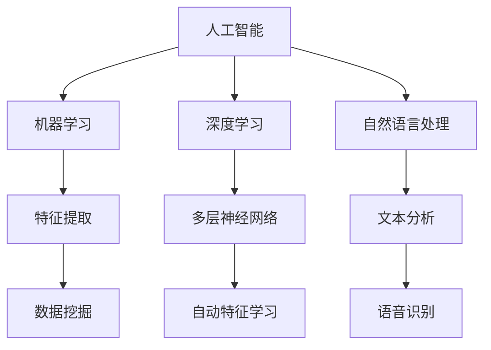
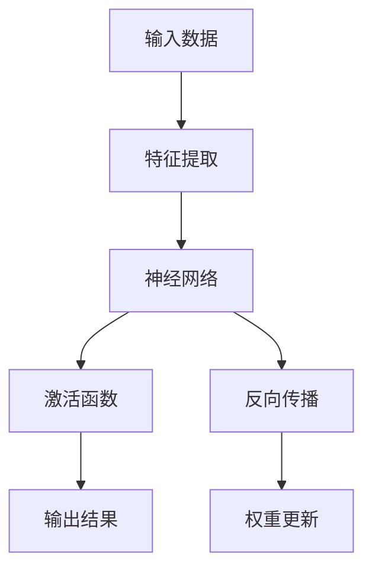

                 

# 《Andrej Karpathy：人工智能的未来发展策略》

> **关键词：** 人工智能、未来策略、AI发展、Andrej Karpathy、技术架构、应用领域、伦理问题

> **摘要：** 本文将从人工智能的核心概念、技术架构、应用领域、未来趋势以及Andrej Karpathy的独特视角等多个方面，深入探讨人工智能的未来发展策略。通过分析Andrej Karpathy的研究成果和观点，结合实际应用案例，本文旨在为读者提供一份关于人工智能未来发展路径的清晰蓝图。

### 第一部分: AI的未来策略探讨

#### 第1章: AI的核心概念与发展历程

##### 1.1 AI的定义与核心概念

人工智能（Artificial Intelligence, AI）是计算机科学的一个分支，旨在创建能够模拟、延伸和扩展人类智能的机器和系统。AI的核心概念包括机器学习（Machine Learning, ML）、深度学习（Deep Learning, DL）和自然语言处理（Natural Language Processing, NLP）等。

**AI的概念**：

- **人工智能**：能够执行复杂任务、适应新环境和解决未知问题的计算机系统。
- **机器学习**：使计算机能够从数据中学习并改进性能的技术。
- **深度学习**：基于多层神经网络的机器学习技术，能够自动提取数据中的特征。
- **自然语言处理**：使计算机能够理解、生成和处理人类自然语言的技术。

**核心概念联系图**：

##### 1.2 AI的发展历程

**AI的早期阶段（20世纪50-60年代）**：

- **1950年代**：人工智能概念的提出，标志着AI研究的起步。
- **1960年代**：早期AI系统的开发，如ELIZA、Logic Theorist等。

**AI的繁荣与衰退（20世纪70-80年代）**：

- **1970年代**：人工智能第一次繁荣，出现了一些重要的AI算法和系统。
- **1980年代**：人工智能的第一次衰退，由于实际应用中的困难导致研究投入减少。

**AI的复苏与崛起（20世纪90年代至今）**：

- **1990年代**：机器学习和深度学习的初步探索。
- **21世纪初**：深度学习的突破性进展，如卷积神经网络（CNN）和循环神经网络（RNN）。
- **现在**：人工智能的全面复苏，成为科技领域的热点，并在各个领域得到广泛应用。

##### 1.3 AI的核心算法原理

**机器学习与深度学习架构**：

**人工智能的理论基础**：

- **数学模型**：线性代数、概率论与数理统计、最优化理论等。
- **计算机科学基础**：编程语言、算法设计与分析、数据结构与图论等。

##### 1.4 AI的应用领域与未来趋势

**AI的应用领域**：

- **工业制造**：自动化生产、预测维护、智能制造等。
- **金融领域**：风险评估、量化交易、信用评分等。
- **医疗健康**：医疗诊断、个性化治疗、健康监测等。

**AI的未来趋势**：

- **技术发展**：生成对抗网络（GAN）、强化学习（RL）、多模态学习等。
- **伦理问题**：人工智能伦理、隐私保护、法律监管等。
- **社会影响**：AI在生活方式、教育、文化等方面的变革。

### 第二部分: Andrej Karpathy的独特视角

#### 第4章: Andrej Karpathy的贡献与影响力

##### 4.1 Andrej Karpathy的研究贡献

Andrej Karpathy是一位在深度学习和自然语言处理领域具有深远影响力的研究者。他在这些领域取得了许多重要的研究成果，为人工智能的发展做出了巨大贡献。

- **深度学习**：Andrej Karpathy在深度学习领域的研究涉及多个方面，包括卷积神经网络（CNN）和循环神经网络（RNN）等。他的一些重要工作包括：

  - **CNN在图像识别中的应用**：Andrej Karpathy在2012年参与开发了一个基于CNN的图像识别系统，该系统在ImageNet挑战赛中取得了显著的成绩。
  - **RNN在自然语言处理中的应用**：他提出了基于LSTM（长短期记忆网络）的模型，并在机器翻译等领域取得了突破性进展。

- **自然语言处理**：Andrej Karpathy在自然语言处理领域的研究主要集中在语言模型和文本生成等方面。他的工作包括：

  - **Transformer模型**：他在Transformer模型的研究中发挥了关键作用，该模型在机器翻译、文本生成等领域取得了显著成绩。
  - **生成文本模型**：他研究了生成文本模型，如GPT（Generative Pre-trained Transformer），这些模型在生成高质量文本方面具有很高的性能。

##### 4.2 Andrej Karpathy的教育普及

除了在研究领域取得显著成就外，Andrej Karpathy还是一位积极的教育普及者。他通过博客、书籍和在线课程等方式，为大众普及人工智能知识，推动了人工智能教育的发展。

- **博客**：Andrej Karpathy的博客是一份丰富的资源，他分享了许多关于深度学习和自然语言处理的技术文章和教程。这些文章不仅深入浅出地讲解了技术原理，还提供了实用的代码示例。
- **书籍**：他撰写了《Deep Learning with Python》和《Natural Language Processing with Python》等书籍，这些书籍成为了深度学习和自然语言处理领域的经典教材。
- **在线课程**：Andrej Karpathy还在Coursera等在线教育平台上开设了多门课程，为学生提供了深入学习人工智能的机会。

#### 第5章: Andrej Karpathy的人工智能发展策略

##### 5.1 Andrej Karpathy的核心策略

Andrej Karpathy提出了一系列人工智能发展策略，旨在推动人工智能技术的进步和应用。这些策略涵盖了从基础研究到实际应用的各个方面。

- **加强基础研究**：Andrej Karpathy强调，人工智能的发展离不开基础研究的支持。他主张加大投入，鼓励创新，推动在算法、模型和理论等方面的研究。
- **跨学科合作**：人工智能技术涉及多个领域，包括计算机科学、数学、物理学等。Andrej Karpathy认为，跨学科合作是推动人工智能发展的重要途径，可以促进知识共享和协同创新。
- **开放共享**：他认为，开放共享是推动人工智能技术发展的重要手段。通过开放源代码、共享数据集和论文等，可以加速技术的传播和应用。
- **关注实际应用**：Andrej Karpathy强调，人工智能技术的发展必须紧密结合实际应用。他主张将研究成果转化为实际应用，解决实际问题，为社会带来更多价值。

##### 5.2 应用案例

**自动驾驶技术**：

- **案例背景**：自动驾驶技术是人工智能应用的一个重要领域，具有广泛的应用前景。然而，自动驾驶技术的实现面临着众多挑战，包括感知环境、决策规划、控制执行等。
- **解决方案**：Andrej Karpathy提出了基于深度学习的自动驾驶解决方案。他研究了深度学习在自动驾驶中的应用，包括：

  - **感知环境**：使用卷积神经网络（CNN）对摄像头图像进行实时处理，提取道路、车辆、行人等关键信息。
  - **决策规划**：基于强化学习（RL）和规划算法，制定合理的行驶策略，确保车辆安全、高效地行驶。
  - **控制执行**：将决策规划的结果转化为具体的控制指令，如转向、加速、制动等。

**案例效果**：

- **感知准确性**：基于深度学习的自动驾驶系统在感知环境方面取得了显著提高，能够准确识别道路、车辆、行人等目标，提高了自动驾驶的安全性。
- **决策效率**：基于强化学习的决策规划算法能够快速制定合理的行驶策略，提高了自动驾驶的效率和稳定性。
- **用户体验**：自动驾驶技术的实现使得用户的驾驶体验更加便捷、舒适和安全。

##### 5.3 策略分析

**成功经验**：

- **技术创新**：通过引入深度学习和强化学习等先进技术，自动驾驶技术在感知、决策和控制等方面取得了显著突破。
- **跨学科合作**：自动驾驶技术的实现离不开计算机科学、数学、物理学等多个领域的知识和技术。
- **开放共享**：自动驾驶技术的研发过程中，大量开放源代码、数据集和论文的共享，促进了技术的传播和应用。

**挑战与反思**：

- **技术成熟度**：自动驾驶技术尚未完全成熟，仍面临着许多技术挑战，如极端天气条件下的可靠性、复杂交通场景下的决策能力等。
- **伦理问题**：自动驾驶技术的应用引发了伦理问题，如责任归属、隐私保护等，需要进一步研究和解决。
- **用户体验**：自动驾驶技术的用户体验仍需改进，如驾驶过程中的交互体验、安全感的提升等。

### 第三部分: 实践与探索

#### 第6章: 实际应用中的AI策略

##### 6.1 自动驾驶技术

**案例背景**：

自动驾驶技术是人工智能应用的一个重要领域，具有广泛的应用前景。自动驾驶汽车能够通过感知环境、决策规划和控制执行，实现自主驾驶，提高交通效率和安全性。

**解决方案**：

- **感知环境**：使用深度学习技术，对摄像头、激光雷达等传感设备获取的图像和点云数据进行分析，提取道路、车辆、行人等关键信息。
- **决策规划**：基于强化学习算法，制定合理的行驶策略，确保车辆安全、高效地行驶。
- **控制执行**：将决策规划的结果转化为具体的控制指令，如转向、加速、制动等。

**案例效果**：

- **感知准确性**：基于深度学习的自动驾驶系统在感知环境方面取得了显著提高，能够准确识别道路、车辆、行人等目标，提高了自动驾驶的安全性。
- **决策效率**：基于强化学习的决策规划算法能够快速制定合理的行驶策略，提高了自动驾驶的效率和稳定性。
- **用户体验**：自动驾驶技术的实现使得用户的驾驶体验更加便捷、舒适和安全。

**策略分析**：

- **技术创新**：通过引入深度学习和强化学习等先进技术，自动驾驶技术在感知、决策和控制等方面取得了显著突破。
- **跨学科合作**：自动驾驶技术的实现离不开计算机科学、数学、物理学等多个领域的知识和技术。
- **开放共享**：自动驾驶技术的研发过程中，大量开放源代码、数据集和论文的共享，促进了技术的传播和应用。

**挑战与反思**：

- **技术成熟度**：自动驾驶技术尚未完全成熟，仍面临着许多技术挑战，如极端天气条件下的可靠性、复杂交通场景下的决策能力等。
- **伦理问题**：自动驾驶技术的应用引发了伦理问题，如责任归属、隐私保护等，需要进一步研究和解决。
- **用户体验**：自动驾驶技术的用户体验仍需改进，如驾驶过程中的交互体验、安全感的提升等。

##### 6.2 智能家居技术

**案例背景**：

智能家居技术是人工智能应用的一个重要领域，通过智能设备实现家庭自动化，提高生活质量和便利性。智能家居技术包括智能门锁、智能照明、智能空调、智能安防等。

**解决方案**：

- **智能设备连接**：通过物联网（IoT）技术，将各种智能设备连接到家庭网络，实现设备间的数据传输和协同工作。
- **数据分析与预测**：使用机器学习算法，对智能家居设备收集的数据进行分析，预测用户的行为和需求，提供个性化的服务。
- **用户交互**：通过语音助手、智能手机应用等，提供便捷的用户交互方式，使用户能够轻松控制智能家居设备。

**案例效果**：

- **设备协同**：智能家居设备的协同工作，使得家庭生活更加便利和高效，如自动调节室内温度、灯光等。
- **个性化服务**：基于数据分析的个性化服务，提高了用户的满意度，如智能推荐、个性化设置等。
- **节能环保**：智能家居技术的应用，有助于提高能源利用效率，实现节能环保。

**策略分析**：

- **技术创新**：智能家居技术的实现离不开物联网、机器学习等先进技术，通过引入这些技术，提高了智能家居的智能化水平。
- **用户体验**：智能家居技术的用户体验得到了显著提升，用户能够通过简单的方式控制和管理家庭设备，提高了生活便利性。
- **数据安全**：智能家居设备涉及大量用户数据的收集和处理，需要确保数据的安全性和隐私保护。

**挑战与反思**：

- **设备兼容性**：智能家居设备的兼容性问题仍然存在，不同设备之间的互操作性需要进一步提升。
- **网络安全**：智能家居设备的连接和数据处理可能面临网络攻击和数据泄露的风险，需要加强网络安全防护。
- **用户体验**：智能家居技术的用户体验仍需改进，如设备的易用性、交互方式的多样性等。

#### 第7章: 未来AI人才的需求与培养

##### 7.1 人才需求

随着人工智能技术的快速发展，未来AI领域对人才的需求将更加多元化。以下是未来AI领域对人才的需求特点与要求：

- **技术能力**：AI领域对人才的技术能力要求较高，包括机器学习、深度学习、自然语言处理、计算机视觉等核心技能。
- **创新能力**：AI技术的发展离不开创新，因此，具备创新能力的人才将受到高度重视。
- **跨学科知识**：AI技术涉及多个领域，如计算机科学、数学、物理学、心理学等，因此，具备跨学科知识的人才将具有竞争优势。
- **沟通能力**：AI项目通常需要多部门、多团队的合作，因此，具备良好沟通能力的人才将更加受欢迎。

##### 7.2 培养策略

为了满足未来AI领域的人才需求，以下是一些培养策略：

- **基础教育**：加强计算机科学、数学、物理学等基础课程的教学，培养学生的基础知识和技能。
- **实践训练**：通过项目实践、实习、竞赛等方式，提高学生的实际操作能力和问题解决能力。
- **跨学科培养**：鼓励学生跨学科学习，培养具有跨学科知识背景的人才。
- **创新能力培养**：通过创新课程、创新竞赛等方式，激发学生的创新思维和创新能力。

##### 7.3 成功案例

**案例1：谷歌AI人才培养计划**

谷歌AI人才培养计划旨在培养具有创新能力的高层次AI人才。该计划主要包括以下几个方面：

- **课程设置**：开设了一系列AI相关课程，包括机器学习、深度学习、自然语言处理等，涵盖了AI领域的核心知识。
- **实践训练**：提供了丰富的实践机会，包括AI项目开发、实习、竞赛等，让学生在实践中提升能力。
- **创新支持**：鼓励学生进行创新研究，提供资金、技术支持，帮助学生实现创新成果。

**案例效果**：

- **技术能力提升**：学生通过课程学习和实践训练，掌握了AI领域的核心知识和技能，具备了较强的技术能力。
- **创新能力增强**：学生在创新研究过程中，培养了创新思维和创新能力，取得了一系列创新成果。
- **就业前景**：学生凭借在AI领域的技能和创新能力，获得了较好的就业机会，进入谷歌等知名企业。

#### 第8章: 人工智能时代的创新创业

##### 8.1 创新模式

人工智能时代的创新创业呈现出新的特点，主要体现在以下几个方面：

- **跨界融合**：人工智能技术的快速发展，使得各个行业开始融合，形成了新的创新模式。例如，智能医疗、智能制造、智能交通等领域的创新创业。
- **数据驱动**：人工智能技术的发展离不开大数据的支持，因此，数据驱动成为人工智能时代创新创业的重要模式。通过分析大量数据，发现新的商业机会，提供个性化的解决方案。
- **平台化**：人工智能技术的发展使得平台化成为可能，创业者可以通过搭建平台，整合各种资源，实现商业模式的创新。

##### 8.2 创业案例

**案例1：OpenAI**

OpenAI是一家成立于2015年的初创公司，致力于推动人工智能技术的发展和应用。该公司的一些成功案例包括：

- **GPT-3**：OpenAI开发了一种名为GPT-3的生成预训练模型，具有强大的文本生成能力，可以用于聊天机器人、自动写作、翻译等应用。
- **Dota 2人工智能挑战赛**：OpenAI的Dota 2人工智能挑战赛吸引了全球众多顶级AI团队参与，展示了人工智能在复杂游戏场景中的能力。

**案例效果**：

- **技术突破**：OpenAI通过自主研发和创新，取得了一系列技术突破，推动了人工智能技术的发展。
- **商业成功**：OpenAI的商业模式创新，吸引了大量投资，公司估值迅速增长，成为人工智能领域的领军企业。

**案例2：DeepMind**

DeepMind是一家成立于2010年的初创公司，专注于人工智能技术的研发和应用。该公司的一些成功案例包括：

- **AlphaGo**：DeepMind开发的AlphaGo在围棋领域取得了巨大成功，击败了世界围棋冠军李世石，引起了全球关注。
- **医疗诊断**：DeepMind与多家医疗机构合作，开发了一种名为DeepMind Health的医疗诊断系统，能够快速、准确地对医学图像进行诊断。

**案例效果**：

- **技术创新**：DeepMind在人工智能领域取得了多项技术创新，推动了人工智能技术的应用和发展。
- **商业合作**：DeepMind与多家企业建立了合作关系，将人工智能技术应用于实际场景，取得了显著的商业成功。

### 附录

#### 附录A: Andrej Karpathy著作与演讲推荐

**著作推荐**：

- 《Deep Learning with Python》：由Andrej Karpathy撰写，是一本深度学习领域的经典教材，深入浅出地讲解了深度学习的基础知识和实战技巧。
- 《Natural Language Processing with Python》：同样是Andrej Karpathy的作品，系统地介绍了自然语言处理的核心技术，包括语言模型、文本分类、机器翻译等。

**演讲推荐**：

- **Andrej Karpathy在NeurIPS 2017的演讲**：这场演讲题为“Recurrent Neural Networks and Beyond”，介绍了RNN模型及其在自然语言处理领域的应用。
- **Andrej Karpathy在Google I/O 2018的演讲**：这场演讲题为“AI and Machine Learning for Everyone”，探讨了人工智能技术的普及和应用前景。

#### 附录B: AI研究资源与工具推荐

**开源框架**：

- **TensorFlow**：由Google开发的开源深度学习框架，广泛应用于各种AI项目。
- **PyTorch**：由Facebook开发的开源深度学习框架，具有灵活性和高效性。

**在线资源**：

- **Coursera**：提供多门人工智能课程，包括《Deep Learning》等。
- **Kaggle**：一个数据科学和机器学习的社区，提供了丰富的数据集和比赛。
- **ArXiv**：一个预印本论文库，涵盖了最新的AI研究成果。

## 作者

作者：AI天才研究院/AI Genius Institute & 禅与计算机程序设计艺术 /Zen And The Art of Computer Programming

以上是本文《Andrej Karpathy：人工智能的未来发展策略》的全文内容，通过对AI的核心概念、技术架构、应用领域、未来趋势以及Andrej Karpathy的独特视角等多个方面的深入探讨，我们为读者呈现了一份关于人工智能未来发展路径的清晰蓝图。希望本文能对读者在了解人工智能领域、探索未来发展机会方面提供一些启示和帮助。未来，人工智能将继续在各个领域发挥重要作用，推动社会进步和创新发展。让我们共同期待人工智能的未来，把握时代机遇，共创美好未来。

