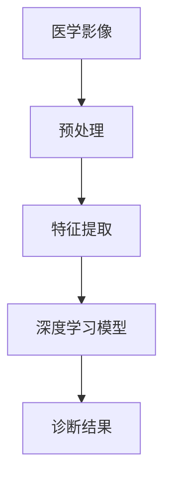
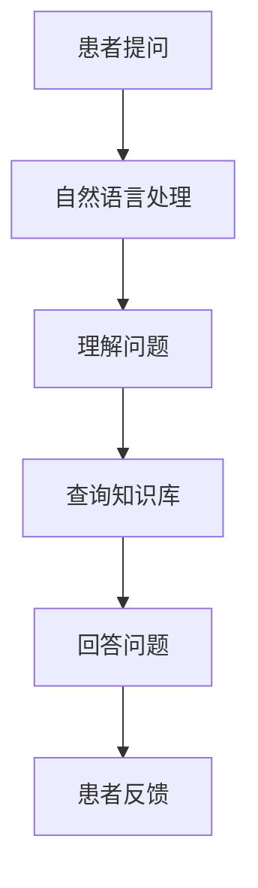
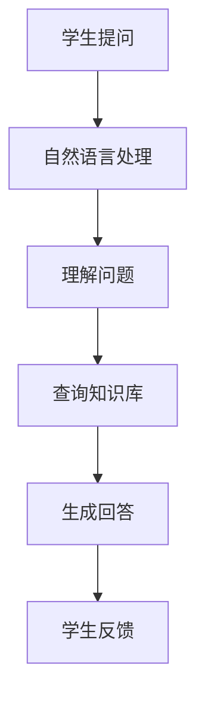
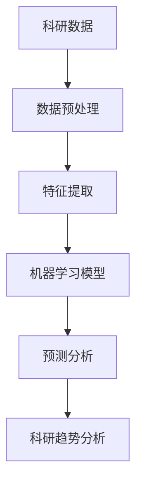
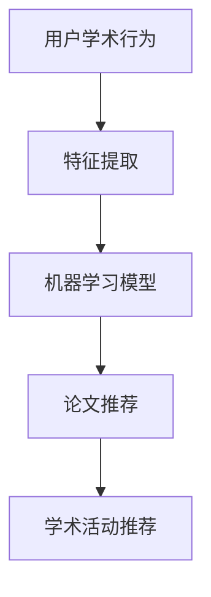

                 

# 《Andrej Karpathy：人工智能的未来发展规划》

## 关键词：
* 人工智能
* 未来发展
* Andrej Karpathy
* 技术趋势
* 应用场景

## 摘要：
本文将探讨人工智能领域的杰出贡献者Andrej Karpathy对未来人工智能发展的看法，以及人工智能在各行各业中的应用场景。通过详细分析人工智能的核心概念、技术发展、挑战与未来方向，我们试图描绘出一个清晰、具有前瞻性的未来人工智能蓝图。

---

## 引言

### 第1章：人工智能的现状与未来

#### 1.1 人工智能的发展历程

人工智能（AI）的概念最早可以追溯到20世纪50年代。当时，计算机科学家艾伦·图灵提出了“图灵测试”，这是对人工智能的早期定义之一。图灵测试的核心思想是，如果一个机器能在与人类的对话中表现出智能行为，以至于人类无法区分该机器与真实人类，那么这个机器就可以被认为具有智能。

在接下来的几十年里，人工智能经历了几个重要的发展阶段。20世纪80年代，专家系统成为人工智能研究的热点，这些系统基于一系列规则和知识库，能够模拟专家的决策过程。然而，专家系统存在一些局限性，例如规则编写困难、知识库更新缓慢等。

20世纪90年代，随着计算能力的提升和算法的改进，机器学习开始崭露头角。机器学习通过从数据中学习规律和模式，实现人工智能的目标。这一时期，神经网络作为一种重要的机器学习算法，得到了广泛关注和应用。

进入21世纪，深度学习成为了人工智能领域的研究热点。深度学习通过多层神经网络的结构，能够自动提取数据的复杂特征，从而在图像识别、语音识别等领域取得了突破性进展。这一时期的代表人物之一就是Andrej Karpathy，他的研究成果对深度学习的发展产生了深远影响。

#### 1.2 当前人工智能的技术趋势

当前，人工智能的发展呈现出几个明显的趋势：

1. **模型规模与计算能力的提升**：随着深度学习模型的复杂性增加，对计算资源的需求也急剧上升。近年来，GPU、TPU等专用硬件的出现，为深度学习提供了强大的计算支持。

2. **跨领域的应用**：人工智能技术在各个领域的应用越来越广泛，包括医疗、金融、教育、制造业等。跨领域应用不仅推动了人工智能技术的发展，也促进了各个行业的创新。

3. **数据驱动的决策**：人工智能在数据分析、数据挖掘等领域发挥着重要作用，为企业提供了更加精准的决策支持。

4. **人机交互的优化**：随着语音识别、自然语言处理等技术的发展，人机交互变得更加自然和高效。未来，人工智能将更加深入地融入人们的生活和工作。

#### 1.3 人工智能对社会的影响

人工智能的发展不仅推动了技术进步，也对人类社会产生了深远影响：

1. **经济影响**：人工智能技术在提高生产效率、降低运营成本方面发挥了重要作用。同时，人工智能也创造了新的就业机会，例如数据科学家、机器学习工程师等。

2. **伦理与隐私**：人工智能的应用引发了一系列伦理和隐私问题。如何确保人工智能系统的透明性、公正性和安全性，成为了一个重要的研究课题。

3. **社会结构**：人工智能的普及将改变人类的工作方式和社会结构。一些传统职业可能会被自动化替代，同时也可能催生出新的职业和产业。

### 第2章：Andrej Karpathy的贡献与影响

#### 2.1 Andrej Karpathy的学术背景

Andrej Karpathy是一位杰出的计算机科学家，毕业于斯坦福大学，获得了计算机科学博士学位。他的研究主要集中在深度学习、计算机视觉和自然语言处理等领域。

#### 2.2 Andrej Karpathy的研究领域与成果

Andrej Karpathy在深度学习领域取得了许多重要成果。他的研究成果包括：

1. **卷积神经网络（CNN）**：Andrej Karpathy在CNN的研究中做出了重要贡献，推动了计算机视觉技术的发展。

2. **生成对抗网络（GAN）**：他参与了GAN的研究，这一技术能够生成高质量的图像，对艺术创作和图像处理领域产生了重要影响。

3. **自然语言处理**：Andrej Karpathy在自然语言处理领域也有深入研究，他的研究成果为问答系统、机器翻译等应用提供了重要支持。

#### 2.3 Andrej Karpathy在人工智能社区的影响力

Andrej Karpathy不仅在学术界有着广泛的影响力，他还积极参与人工智能社区的活动。他是一位活跃的博客作者，通过分享自己的研究成果和心得，为人工智能的发展做出了贡献。

### 第3章：人工智能的核心概念与架构

#### 3.1 人工智能的基本概念

人工智能（AI）是指使计算机系统具备智能行为和决策能力的技术。它包括多个子领域，如机器学习、深度学习、计算机视觉、自然语言处理等。

#### 3.2 深度学习的基本架构

深度学习是一种基于多层神经网络的人工智能技术。它的基本架构包括输入层、隐藏层和输出层。通过多层网络的结构，深度学习能够自动提取数据的复杂特征，从而实现智能任务。

#### 3.3 人工智能的层次结构

人工智能的层次结构可以分为以下几个层次：

1. **感知层**：感知层负责接收和处理外部输入，如图像、声音等。

2. **认知层**：认知层负责处理感知层提取的特征，进行理解和决策。

3. **行动层**：行动层根据认知层的决策，执行相应的操作。

### 第4章：人工智能的技术发展与挑战

#### 4.1 人工智能的技术发展现状

当前，人工智能技术在多个领域取得了显著进展。例如，在计算机视觉领域，深度学习技术已经能够实现高精度的图像识别；在自然语言处理领域，机器翻译、问答系统等技术也取得了突破性进展。

#### 4.2 人工智能面临的挑战

尽管人工智能技术在许多领域取得了显著进展，但仍然面临一些挑战：

1. **数据隐私**：人工智能系统的训练和运行需要大量的数据，如何保护数据隐私成为一个重要问题。

2. **模型可解释性**：深度学习模型通常被视为“黑箱”，难以解释其决策过程，这限制了其在一些关键领域的应用。

3. **伦理问题**：人工智能的应用引发了一系列伦理问题，如歧视、隐私侵犯等。

#### 4.3 未来人工智能的发展方向

未来，人工智能的发展将朝着以下几个方向努力：

1. **算法优化**：通过改进算法，提高人工智能系统的性能和效率。

2. **跨领域应用**：推动人工智能技术在更多领域的应用，实现跨领域的融合。

3. **人机协同**：实现人机协同，使人工智能系统能够更好地服务于人类。

### 第5章：Andrej Karpathy对人工智能发展的看法

#### 5.1 Andrej Karpathy对未来人工智能的展望

Andrej Karpathy认为，未来人工智能将在以下几个方面取得突破：

1. **智能交互**：人工智能系统将更加自然地与人类进行交互，提供更加个性化的服务。

2. **自动化**：人工智能将在更多领域实现自动化，提高生产效率和生活质量。

3. **创新**：人工智能将激发新的创新，推动科学技术的进步。

#### 5.2 Andrej Karpathy对人工智能应用的看法

Andrej Karpathy认为，人工智能的应用将主要集中在以下几个方面：

1. **医疗**：人工智能在医疗领域的应用将有助于提高诊断准确率、优化治疗方案。

2. **教育**：人工智能将改变教育模式，提供个性化学习体验。

3. **金融**：人工智能在金融领域的应用将提高风险管理能力、优化投资策略。

#### 5.3 Andrej Karpathy对人工智能伦理的看法

Andrej Karpathy认为，人工智能的伦理问题需要引起高度重视。他提出，应该通过以下措施解决人工智能伦理问题：

1. **透明性**：提高人工智能系统的透明性，使其决策过程可解释。

2. **公平性**：确保人工智能系统不会对某些群体产生歧视。

3. **隐私保护**：加强数据隐私保护，确保用户隐私不被侵犯。

### 第二部分：人工智能的应用场景与发展规划

#### 第6章：人工智能在医疗领域的应用

#### 6.1 人工智能在医疗诊断中的应用

人工智能在医疗诊断中的应用越来越广泛。通过深度学习和计算机视觉技术，人工智能系统能够对医学影像进行分析，提高诊断准确率。以下是一个简单的流程图：



#### 6.2 人工智能在医疗治疗中的应用

人工智能在医疗治疗中的应用主要体现在个性化治疗方案的制定。通过分析大量的病例数据，人工智能系统可以推荐最适合患者的治疗方案。以下是一个简化的伪代码：

```python
def personalized_treatment(patient_data):
    # 数据预处理
    preprocessed_data = preprocess(patient_data)
    
    # 特征提取
    features = extract_features(preprocessed_data)
    
    # 使用深度学习模型预测治疗方案
    treatment = predict_treatment(features)
    
    return treatment
```

#### 6.3 人工智能在医疗服务中的应用

人工智能在医疗服务中的应用主要包括智能助理、远程医疗等。通过自然语言处理技术，人工智能系统可以回答患者的问题，提供咨询服务。以下是一个简单的流程图：



#### 第7章：人工智能在商业领域的应用

#### 7.1 人工智能在数据分析中的应用

人工智能在数据分析中的应用主要体现在数据挖掘、预测分析等方面。通过机器学习算法，人工智能系统可以自动发现数据中的规律和模式，为企业提供决策支持。以下是一个简化的伪代码：

```python
def data_analysis(data):
    # 数据预处理
    preprocessed_data = preprocess(data)
    
    # 特征提取
    features = extract_features(preprocessed_data)
    
    # 使用机器学习模型进行预测
    predictions = predict(features)
    
    return predictions
```

#### 7.2 人工智能在市场营销中的应用

人工智能在市场营销中的应用主要包括客户行为分析、广告投放优化等。通过分析客户的行为数据，人工智能系统可以推荐最适合的广告内容和投放策略。以下是一个简化的伪代码：

```python
def marketing_analysis(customer_data):
    # 数据预处理
    preprocessed_data = preprocess(customer_data)
    
    # 特征提取
    features = extract_features(preprocessed_data)
    
    # 使用机器学习模型进行预测
    predictions = predict(features)
    
    return predictions
```

#### 7.3 人工智能在供应链管理中的应用

人工智能在供应链管理中的应用主要包括需求预测、库存优化等。通过分析历史数据和供应链中的各种因素，人工智能系统可以预测未来的需求，优化库存水平。以下是一个简化的伪代码：

```python
def supply_chain_management(supply_chain_data):
    # 数据预处理
    preprocessed_data = preprocess(supply_chain_data)
    
    # 特征提取
    features = extract_features(preprocessed_data)
    
    # 使用机器学习模型进行预测
    predictions = predict(features)
    
    return predictions
```

#### 第8章：人工智能在教育和科研领域的应用

#### 8.1 人工智能在教育中的应用

人工智能在教育中的应用主要包括智能辅导、在线教育等。通过自然语言处理和机器学习技术，人工智能系统可以为学生提供个性化的辅导，帮助学生更好地学习。以下是一个简化的流程图：



#### 8.2 人工智能在科研中的应用

人工智能在科研中的应用主要包括文献挖掘、数据挖掘等。通过分析大量的科研数据，人工智能系统可以帮助科研人员发现新的研究趋势和潜在的合作机会。以下是一个简化的流程图：



#### 8.3 人工智能在学术交流中的应用

人工智能在学术交流中的应用主要包括论文推荐、学术社交等。通过分析用户的学术行为和兴趣，人工智能系统可以推荐相关的论文和学术活动，促进学术交流。以下是一个简化的流程图：



### 第9章：人工智能的未来发展规划

#### 9.1 人工智能的发展趋势

未来，人工智能的发展将呈现出以下几个趋势：

1. **模型规模与计算能力的提升**：随着深度学习模型的复杂性增加，对计算资源的需求也将不断提升。未来，我们将看到更多高效的深度学习算法和专用硬件的出现。

2. **跨领域的应用**：人工智能将在更多领域得到应用，实现跨领域的融合。例如，人工智能将与传统制造、医疗等行业的结合，推动产业升级。

3. **人机协同**：人工智能将更加深入地融入人类生活和工作，实现人机协同。未来，我们将看到更多智能助理和机器人产品进入市场。

#### 9.2 人工智能的未来挑战

尽管人工智能的发展前景广阔，但仍然面临一些挑战：

1. **数据隐私**：随着人工智能系统的普及，数据隐私问题将更加突出。如何保护用户隐私，将成为一个重要的研究课题。

2. **伦理问题**：人工智能的应用引发了一系列伦理问题，如歧视、隐私侵犯等。如何确保人工智能系统的公平性和透明性，是一个亟待解决的问题。

3. **人才短缺**：人工智能的发展需要大量的专业人才，但当前的人才供给无法满足需求。如何培养和吸引更多的人工智能人才，是未来的一个重要任务。

#### 9.3 Andrej Karpathy的人工智能发展规划

Andrej Karpathy对未来人工智能的发展有着清晰的规划。他认为，未来人工智能的发展应该遵循以下几个原则：

1. **以人为本**：人工智能的发展应以满足人类需求为出发点，推动人类社会的进步。

2. **可持续性**：人工智能的发展应注重可持续性，减少对环境的影响，实现绿色增长。

3. **合作与共享**：人工智能的发展需要全球范围内的合作与共享，共同推动人工智能技术的发展。

### 第10章：结论

#### 10.1 人工智能的发展对社会的意义

人工智能的发展对社会的意义巨大。它不仅提高了生产效率、降低了运营成本，还改变了人类的工作方式和生活方式。人工智能将推动人类社会迈向一个更加智能、高效和可持续的未来。

#### 10.2 人工智能的未来展望

未来，人工智能将在更多领域得到应用，实现跨领域的融合。人工智能将更加深入地融入人类生活和工作，实现人机协同。同时，人工智能的发展也将带来一系列伦理和社会问题，需要我们共同努力解决。

#### 10.3 我们应该如何看待人工智能

我们应该以积极的态度看待人工智能的发展。人工智能不仅是一个技术工具，更是一个推动社会进步的力量。我们应该关注人工智能的伦理问题，确保人工智能的发展符合人类的利益。同时，我们也应该抓住人工智能带来的机遇，培养更多的人工智能人才，推动人工智能技术的创新和发展。

---

**作者：AI天才研究院/AI Genius Institute & 禅与计算机程序设计艺术 /Zen And The Art of Computer Programming**

