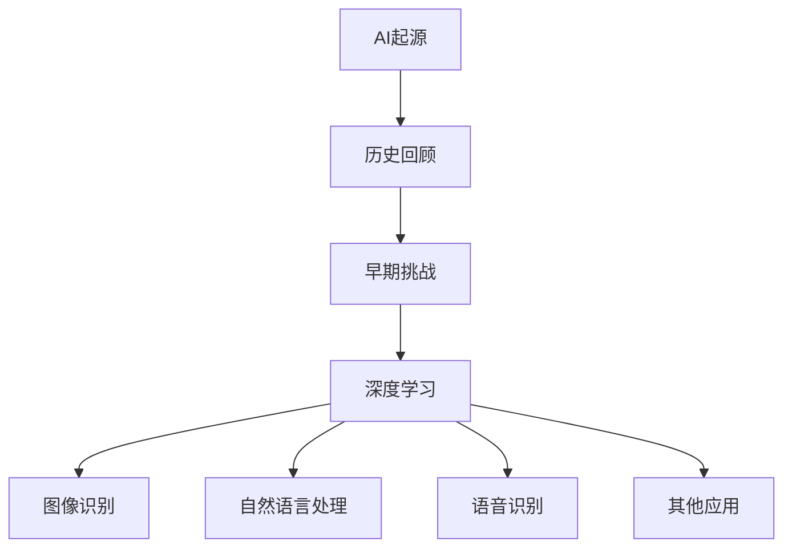
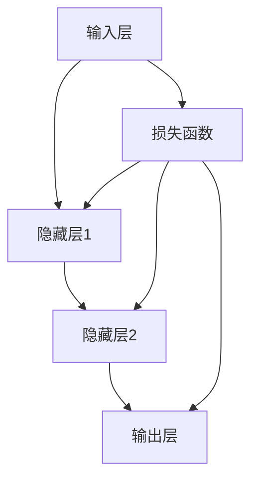

                 

### 文章标题

### 《Andrej Karpathy：人工智能的未来发展趋势》

### 关键词：人工智能、未来趋势、深度学习、应用领域、伦理问题、社会影响、挑战与解决方案

### 摘要：

本文将深入探讨人工智能（AI）的未来发展趋势，以Andrej Karpathy的研究和观点为核心。我们将回顾AI的起源与发展，解析深度学习的核心原理，介绍AI的主要应用领域，并探讨AI技术的最新进展。同时，我们将探讨AI伦理与法律问题，分析AI的未来发展趋势，以及面对的未来挑战和解决方案。通过这篇文章，我们将更好地理解AI的潜力、影响以及未来面临的机遇与挑战。

### 目录大纲

1. **AI的起源与发展**
   1.1 人工智能的起源与历史回顾
   1.2 早期人工智能的挑战与突破
   1.3 深度学习时代的到来
2. **深度学习的核心原理**
   2.1 神经网络基础
   2.2 深度学习的数学基础
   2.3 深度学习的训练过程
3. **人工智能的主要应用领域**
   3.1 图像识别
   3.2 自然语言处理
   3.3 语音识别
   3.4 其他领域应用
4. **AI技术的最新进展**
   4.1 强化学习
   4.2 自监督学习
   4.3 聊天机器人
   4.4 多模态学习
5. **AI伦理与法律问题**
   5.1 AI伦理问题
   5.2 AI法律问题
   5.3 AI治理
6. **AI的未来发展趋势**
   6.1 AI的发展方向
   6.2 AI对社会的影响
   6.3 AI与人类共存
7. **AI的未来挑战与解决方案**
   7.1 数据隐私
   7.2 安全问题
   7.3 失业问题
   7.4 解决方案与建议
8. **总结与展望**
   8.1 成果总结
   8.2 未来展望

### Mermaid 流程图



### 核心算法原理讲解

#### 神经网络基础

神经网络是深度学习的基础，它由一系列相互连接的神经元组成，模拟人脑的信息处理方式。以下是一个简单的神经网络基础讲解：

**神经网络架构：**
一个简单的神经网络通常包括输入层、隐藏层和输出层。每个层由多个神经元组成，神经元之间通过权重进行连接。

**激活函数：**
激活函数是神经网络中非常重要的组成部分，用于引入非线性特性。最常见的激活函数是 sigmoid 函数和 ReLU 函数。

**前向传播：**
在神经网络中，前向传播是指将输入数据通过神经网络逐层传递，直到输出层得到预测结果。这个过程包括以下几个步骤：
1. 将输入数据乘以权重，并加上偏置。
2. 应用激活函数。
3. 将结果传递到下一层。

**反向传播：**
反向传播是神经网络的训练过程，用于更新权重和偏置，以最小化损失函数。反向传播包括以下几个步骤：
1. 计算输出层的误差。
2. 通过梯度下降方法更新权重和偏置。
3. 重复上述步骤，直到达到预设的迭代次数或损失函数收敛。

以下是神经网络基础的核心算法原理讲解的伪代码：

```python
# 伪代码：前向传播过程
def forward_propagation(x, weights, biases):
    z = np.dot(x, weights) + biases
    a = activation_function(z)
    return a

# 伪代码：反向传播过程
def backward_propagation(a, z, weights, biases, learning_rate):
    delta = (a - y) * activation_derivative(z)
    weights -= learning_rate * delta * x.T
    biases -= learning_rate * delta
    return weights, biases
```

### 数学模型和数学公式

#### 激活函数

激活函数是神经网络中的关键组成部分，它用于引入非线性特性。以下是一些常见的激活函数及其公式：

**sigmoid 函数：**
$$
f(x) = \frac{1}{1 + e^{-x}}
$$

**ReLU 函数：**
$$
f(x) = \max(0, x)
$$

**Tanh 函数：**
$$
f(x) = \frac{e^x - e^{-x}}{e^x + e^{-x}}
$$

### 项目实战

#### 使用TensorFlow搭建一个简单的神经网络

在本节中，我们将使用TensorFlow搭建一个简单的神经网络，用于分类问题。以下是实现过程的详细步骤：

1. **导入TensorFlow库：**
   ```python
   import tensorflow as tf
   ```

2. **创建占位符：**
   ```python
   x = tf.placeholder(tf.float32, [None, 784])  # 输入数据
   y = tf.placeholder(tf.float32, [None, 10])   # 标签
   ```

3. **初始化权重和偏置：**
   ```python
   weights = tf.Variable(tf.random_normal([784, 10]))
   biases = tf.Variable(tf.zeros([10]))
   ```

4. **定义前向传播：**
   ```python
   z = tf.matmul(x, weights) + biases
   a = tf.nn.softmax(z)
   ```

5. **定义损失函数：**
   ```python
   cross_entropy = -tf.reduce_sum(y * tf.log(a))
   ```

6. **定义优化器：**
   ```python
   optimizer = tf.train.GradientDescentOptimizer(learning_rate=0.5)
   train_step = optimizer.minimize(cross_entropy)
   ```

7. **初始化全局变量：**
   ```python
   init = tf.global_variables_initializer()
   ```

8. **运行会话：**
   ```python
   with tf.Session() as sess:
       sess.run(init)
       
       for i in range(1000):
           batch_xs, batch_ys = ... # 获取一批训练数据
           sess.run(train_step, feed_dict={x: batch_xs, y: batch_ys})
       
       # 测试模型
       correct_prediction = tf.equal(tf.argmax(a, 1), tf.argmax(y, 1))
       accuracy = tf.reduce_mean(tf.cast(correct_prediction, tf.float32))
       print("Test accuracy:", accuracy.eval({x: test_xs, y: test_ys}))
   ```

以上是使用TensorFlow搭建一个简单的神经网络的完整步骤和代码实现。这个例子展示了如何定义输入层、隐藏层和输出层，以及如何训练和评估神经网络模型。

### 代码解读与分析

以下是代码的详细解读与分析：

1. **导入TensorFlow库：**
   ```python
   import tensorflow as tf
   ```
   导入TensorFlow库，这是深度学习的核心库。

2. **创建占位符：**
   ```python
   x = tf.placeholder(tf.float32, [None, 784])  # 输入数据
   y = tf.placeholder(tf.float32, [None, 10])   # 标签
   ```
   创建占位符，用于传递输入数据和标签。`tf.float32`指定了数据的类型为32位浮点数。`[None, 784]`和`[None, 10]`分别表示输入数据和标签的维度。

3. **初始化权重和偏置：**
   ```python
   weights = tf.Variable(tf.random_normal([784, 10]))
   biases = tf.Variable(tf.zeros([10]))
   ```
   初始化权重和偏置。`tf.random_normal([784, 10])`生成一个784行10列的矩阵，每个元素的均值为0，标准差为1。`tf.zeros([10])`生成一个10个元素的向量，每个元素都为0。

4. **定义前向传播：**
   ```python
   z = tf.matmul(x, weights) + biases
   a = tf.nn.softmax(z)
   ```
   定义前向传播过程。`tf.matmul(x, weights)`执行矩阵乘法，`+ biases`将偏置加到乘法结果上。`tf.nn.softmax(z)`应用softmax函数，将输出转换为概率分布。

5. **定义损失函数：**
   ```python
   cross_entropy = -tf.reduce_sum(y * tf.log(a))
   ```
   定义损失函数。`y * tf.log(a)`计算每个类别的损失，`tf.reduce_sum`计算所有类别的损失之和。

6. **定义优化器：**
   ```python
   optimizer = tf.train.GradientDescentOptimizer(learning_rate=0.5)
   train_step = optimizer.minimize(cross_entropy)
   ```
   定义优化器。`tf.train.GradientDescentOptimizer(learning_rate=0.5)`创建一个梯度下降优化器，`learning_rate=0.5`设置学习率为0.5。`optimizer.minimize(cross_entropy)`定义损失函数作为优化器的最小化目标。

7. **初始化全局变量：**
   ```python
   init = tf.global_variables_initializer()
   ```
   初始化全局变量，包括权重和偏置。

8. **运行会话：**
   ```python
   with tf.Session() as sess:
       sess.run(init)
       
       for i in range(1000):
           batch_xs, batch_ys = ... # 获取一批训练数据
           sess.run(train_step, feed_dict={x: batch_xs, y: batch_ys})
       
       # 测试模型
       correct_prediction = tf.equal(tf.argmax(a, 1), tf.argmax(y, 1))
       accuracy = tf.reduce_mean(tf.cast(correct_prediction, tf.float32))
       print("Test accuracy:", accuracy.eval({x: test_xs, y: test_ys}))
   ```
   运行会话。`sess.run(init)`初始化变量。`for`循环用于训练模型，每次迭代都获取一批训练数据，并执行优化器的最小化操作。最后，计算模型的测试准确率。

通过以上代码解读，我们可以清晰地了解如何使用TensorFlow搭建一个简单的神经网络，并对其进行训练和评估。

### 神经网络架构详解

神经网络架构是深度学习中的核心概念，它决定了模型的性能和学习能力。以下是对神经网络架构的详细解析：

#### 神经网络的基本组成部分

神经网络由多个层组成，包括输入层、隐藏层和输出层。每个层由多个神经元（也称为节点）组成。神经元之间通过连接（权重）进行交互。

1. **输入层**：输入层接收外部数据，并将其传递到隐藏层。每个输入节点对应输入数据的一个特征。
2. **隐藏层**：隐藏层位于输入层和输出层之间，用于提取和转换数据。隐藏层的神经元通过权重连接，形成复杂的非线性特征表示。
3. **输出层**：输出层产生模型的最终预测结果。输出层的神经元数量取决于具体的任务类型，如分类任务的输出层通常包含与类别数相等的神经元。

#### 神经网络的类型

神经网络可以分为几种类型，包括前馈神经网络、卷积神经网络（CNN）、循环神经网络（RNN）等。

1. **前馈神经网络（FFN）**：前馈神经网络是最简单的神经网络类型，数据从输入层依次传递到隐藏层，然后传递到输出层。前馈神经网络常用于回归和分类任务。
2. **卷积神经网络（CNN）**：卷积神经网络专门用于处理图像数据。CNN通过卷积操作提取图像的特征，并具有局部连接性和平移不变性。CNN在图像识别、目标检测和图像生成等领域具有出色的性能。
3. **循环神经网络（RNN）**：循环神经网络用于处理序列数据，如文本、语音和视频。RNN通过循环连接保留序列的历史信息，可以有效地建模时间依赖关系。RNN及其变体，如LSTM（长短时记忆网络）和GRU（门控循环单元），在自然语言处理和语音识别等任务中表现出色。

#### 神经网络的训练过程

神经网络的训练过程是一个迭代优化过程，旨在最小化损失函数并调整网络的权重和偏置。以下是一个简单的训练过程：

1. **初始化权重和偏置**：随机初始化权重和偏置。
2. **前向传播**：将输入数据通过神经网络进行前向传播，计算输出层的预测结果。
3. **计算损失**：计算预测结果与真实标签之间的差异，得到损失值。
4. **反向传播**：从输出层开始，反向传播损失值，计算每个神经元的误差。
5. **更新权重和偏置**：使用误差和梯度下降方法更新权重和偏置。
6. **迭代训练**：重复上述步骤，直到达到预设的迭代次数或损失函数收敛。

通过上述过程，神经网络可以学习到输入数据的特征和模式，从而提高预测准确性。

#### Mermaid 流程图

以下是一个简单的神经网络架构的Mermaid流程图：



在这个流程图中，输入层接收输入数据，通过隐藏层进行特征提取和转换，最终输出层产生预测结果。同时，损失函数用于评估预测结果与真实标签之间的差异，并指导网络的训练。

### 深度学习的基础数学原理

深度学习的基础数学原理对于理解和实现神经网络至关重要。以下将详细讲解深度学习中的关键数学概念，包括矩阵运算、梯度下降、反向传播等。

#### 矩阵运算

在深度学习中，矩阵运算是非常基础且常用的操作。以下是几种常见的矩阵运算：

1. **矩阵乘法**：矩阵乘法是深度学习中最常见的运算之一。给定两个矩阵A和B，其乘积C可以通过以下公式计算：
   $$
   C = A \times B
   $$
   矩阵乘法的规则是将A的列与B的行进行对应元素的乘积，然后求和得到C的元素。

2. **矩阵加法**：矩阵加法是指将两个矩阵对应位置上的元素相加。只有当两个矩阵的维度相同时，矩阵加法才定义。

3. **矩阵转置**：矩阵转置是指将矩阵的行和列进行交换。给定矩阵A，其转置矩阵A'可以通过以下公式计算：
   $$
   A' = [a_{ij}]^T = [a_{ji}]
   $$

4. **矩阵求逆**：矩阵求逆是指找到矩阵A的一个逆矩阵A^{-1}，使得A \times A^{-1} = I，其中I是单位矩阵。矩阵求逆在深度学习中的优化算法中非常有用。

#### 梯度下降

梯度下降是一种常用的优化算法，用于最小化损失函数。在梯度下降中，我们需要计算损失函数关于模型参数的梯度，并沿着梯度方向更新参数，以减小损失函数的值。

1. **梯度定义**：给定一个函数f(x)，其在点x处的梯度∇f(x)是一个向量，其每个分量是函数在该点的偏导数。梯度提供了函数在某个点的最佳方向，即最大增长方向。

2. **梯度下降算法**：梯度下降算法的基本步骤如下：
   1. 随机初始化参数θ。
   2. 计算损失函数关于参数的梯度∇θJ(θ)。
   3. 更新参数θ：θ = θ - α∇θJ(θ)，其中α是学习率，控制参数更新的步长。
   4. 重复步骤2和3，直到满足停止条件，如损失函数收敛或达到预设的迭代次数。

3. **学习率**：学习率α是梯度下降算法中的一个重要参数。选择合适的学习率可以加快收敛速度，但过大会导致算法振荡，过小则收敛速度缓慢。常用的学习率调整策略包括常数学习率、学习率衰减和自适应学习率。

#### 反向传播

反向传播是深度学习中训练神经网络的的核心算法。它通过计算损失函数关于网络参数的梯度，并反向传播到前一层，从而更新网络参数。

1. **前向传播**：在前向传播中，输入数据通过网络层逐层传递，每一层都通过激活函数进行非线性变换，最终产生输出预测。

2. **计算损失**：在输出层，计算预测结果与真实标签之间的差异，得到损失函数的值。

3. **反向传播**：反向传播从输出层开始，逐层反向计算损失函数关于网络参数的梯度。每层梯度计算如下：
   1. 计算当前层的误差：误差 = 损失函数的梯度关于当前层输出的偏导数。
   2. 计算当前层的梯度：梯度 = 误差 \* 当前层的激活函数的导数。
   3. 将当前层的梯度传递到上一层，并重复上述步骤，直到输入层。

4. **参数更新**：使用反向传播得到的梯度，通过梯度下降算法更新网络参数，以最小化损失函数。

以下是反向传播的核心算法原理讲解的伪代码：

```python
# 伪代码：前向传播过程
def forward_propagation(x, weights, biases):
    z = np.dot(x, weights) + biases
    a = activation_function(z)
    return a

# 伪代码：反向传播过程
def backward_propagation(a, z, weights, biases, learning_rate):
    delta = (a - y) * activation_derivative(z)
    weights -= learning_rate * delta * x.T
    biases -= learning_rate * delta
    return weights, biases
```

通过以上数学模型和公式，我们可以更深入地理解深度学习的工作原理，为实际应用奠定基础。

### 深度学习在实际应用中的案例

深度学习在多个实际应用领域已经取得了显著成就，以下是一些具有代表性的案例：

#### 图像识别

图像识别是深度学习的一个核心应用领域。通过卷积神经网络（CNN），深度学习模型可以自动识别和分类图像中的物体。经典的案例包括ImageNet图像识别挑战。在这个挑战中，深度学习模型在数百万张图像上进行训练，并能够准确识别图像中的各种物体。此外，深度学习在医疗影像分析中也取得了显著进展，例如通过CNN自动识别X光片中的骨折、肿瘤等病变，提高了诊断的准确性和效率。

#### 自然语言处理

自然语言处理（NLP）是另一个深度学习的重要应用领域。通过循环神经网络（RNN）及其变种，如长短时记忆网络（LSTM）和门控循环单元（GRU），深度学习模型可以处理和理解人类语言。著名的案例包括谷歌翻译和OpenAI的GPT模型。谷歌翻译使用深度学习技术实现了自动翻译功能，能够将一种语言翻译成多种语言。OpenAI的GPT模型则通过深度学习技术生成高质量的文本，展示了深度学习在语言生成和文本生成方面的潜力。

#### 语音识别

语音识别是深度学习的又一重要应用领域。通过循环神经网络（RNN）和卷积神经网络（CNN）的结合，深度学习模型可以准确地识别和转换语音信号为文本。著名的案例包括苹果的Siri和亚马逊的Alexa。这些语音助手通过深度学习技术，能够理解用户的语音指令，并执行相应的操作，如拨打电话、发送消息、播放音乐等。

#### 其他领域应用

除了上述应用领域，深度学习还在自动驾驶、机器人、金融分析、生物信息学等多个领域展现了强大的应用潜力。例如，自动驾驶汽车使用深度学习模型进行环境感知和路径规划，从而实现安全、高效的驾驶。机器人通过深度学习技术，可以更好地理解和响应人类指令，提高了人机交互的体验。在金融分析领域，深度学习模型可以分析大量金融数据，预测市场趋势和投资机会。在生物信息学领域，深度学习技术可以帮助科学家识别基因序列中的功能区域，加速生物医学研究的进程。

总之，深度学习在实际应用中已经取得了显著的成果，不断推动各个领域的技术进步和创新。随着深度学习技术的不断发展，未来它将在更多领域发挥重要作用。

### 人工智能伦理与法律问题

随着人工智能（AI）技术的迅猛发展，其在社会中的广泛应用也引发了一系列伦理和法律问题。以下是对AI伦理问题和法律问题进行探讨，并分析其对社会的影响及应对策略。

#### AI伦理问题

1. **隐私保护**：AI技术通常需要大量的数据来训练模型，这些数据可能包括个人隐私信息。如何保护用户的隐私成为AI伦理问题的一个重要方面。例如，面部识别技术的应用在提高安全性的同时，也可能侵犯用户的隐私权。

2. **算法偏见**：AI算法在决策过程中可能存在偏见，这可能导致不公平的待遇。例如，招聘系统中的AI模型可能因为训练数据的偏见而歧视某些群体。

3. **责任归属**：当AI系统发生错误或导致损失时，如何确定责任归属成为法律和伦理上的挑战。例如，自动驾驶汽车发生事故时，责任应由制造商、开发者还是司机承担？

4. **透明度和可解释性**：AI系统的决策过程通常是非透明的，这使得用户难以理解其决策依据。提高AI系统的透明度和可解释性，使其决策过程更加透明和可信，是AI伦理问题的一个重要方面。

#### AI法律问题

1. **数据保护和隐私法**：许多国家和地区已经制定了数据保护和隐私法，如欧盟的《通用数据保护条例》（GDPR）。这些法律对数据的收集、处理和使用进行了严格规定，以保护用户的隐私权益。

2. **算法问责制**：一些国家和地区已经开始探索如何对AI算法进行监管和问责。例如，美国国会正在讨论制定《算法问责法》，要求算法提供商对其算法的公平性、准确性和透明度负责。

3. **AI伦理指导原则**：一些组织和机构已经提出了AI伦理指导原则，以规范AI技术的研发和应用。例如，联合国教科文组织发布的《人工智能伦理建议》提出了五项原则，包括尊重人类尊严、促进可持续发展等。

#### 对社会的影响

1. **就业和失业**：AI技术的发展可能导致某些传统职位的消失，同时也创造了新的就业机会。然而，如何确保工人能够适应新技术，避免大规模失业成为社会面临的一个挑战。

2. **经济影响**：AI技术可以提高生产效率，促进经济增长。然而，如何确保技术进步的成果惠及所有社会成员，减少贫富差距，也是一个重要问题。

3. **社会信任**：AI技术的不透明性和潜在的偏见可能导致公众对AI系统的不信任。建立透明、公平和可信的AI系统，增强社会对AI技术的信任，是推动其广泛应用的关键。

#### 应对策略

1. **法律法规的制定**：政府和国际组织应加强AI相关法律法规的制定和执行，确保AI技术的研发和应用符合伦理和法律标准。

2. **技术标准和规范**：行业组织和学术机构应制定AI技术标准和规范，提高AI系统的透明度和可解释性，减少算法偏见和隐私侵犯。

3. **教育培训**：政府和私营部门应加强AI相关教育和培训，提高公众对AI技术的认知和理解，帮助劳动者适应新技术，提高就业能力。

4. **社会对话与合作**：政府、企业、学术界和公众应加强合作，通过对话和协商解决AI伦理和法律问题，确保AI技术的可持续发展和社会福祉。

通过上述策略，我们可以更好地应对AI伦理和法律问题，推动AI技术的健康、可持续发展，使其为社会带来更多福祉。

### AI的未来发展趋势

随着人工智能（AI）技术的持续发展，未来AI将在多个领域产生深远的影响。以下是AI在未来几个关键领域的发展趋势：

#### 1. 自动驾驶技术

自动驾驶技术是AI应用的一个重要领域，其目标是实现车辆在复杂道路环境中的自主驾驶。未来，自动驾驶技术将更加成熟和普及，从目前的辅助驾驶逐步向完全自动驾驶转变。这将大幅提高交通效率，减少交通事故，并为残疾人士和老年人提供更多的出行选择。随着AI技术的进步，自动驾驶车辆将能够实时感知环境，做出快速而准确的决策，实现更高的安全性和可靠性。

#### 2. 人工智能辅助医疗

人工智能在医疗领域的应用潜力巨大。未来，AI技术将帮助医生更准确地诊断疾病、设计个性化治疗方案，并提高药物研发效率。通过深度学习和自然语言处理技术，AI系统能够分析海量医疗数据，识别疾病的早期迹象，提供精准的诊断建议。此外，AI技术还将应用于医学影像分析、手术机器人辅助和医疗设备监控等领域，提高医疗服务的质量和效率。

#### 3. 智能家居与物联网

智能家居和物联网（IoT）是AI技术的另一个重要应用领域。未来，随着AI算法的进步，智能家居设备将能够更好地理解和响应用户的需要，实现更高的智能化和个性化。例如，智能音箱可以通过语音识别和自然语言处理技术，与用户进行自然对话，提供音乐播放、信息查询、智能家居控制等服务。物联网设备之间的互联和智能协作也将进一步优化家庭和办公环境，提高生活和工作效率。

#### 4. 人工智能与教育

人工智能在教育领域的应用将带来革命性的变化。未来的教育系统将更加个性化，根据学生的学习特点和进度提供定制化的学习资源和指导。AI技术可以帮助教师分析学生的学习行为和成绩，提供个性化的教学建议和辅导。同时，虚拟现实（VR）和增强现实（AR）技术的结合将创造更生动、互动的学习体验，使学习更加有趣和有效。

#### 5. 人机协作

未来，人工智能将与人类进行更紧密的协作，共同完成任务。AI系统将能够更好地理解人类的意图和需求，提供智能化的支持和服务。例如，在制造业和服务业中，AI系统可以协助工人完成重复性高、危险或复杂的任务，提高生产效率和安全性。在创意领域，如艺术和设计，AI技术将作为人类艺术家和设计师的助手，提供灵感、辅助创作和优化作品。

#### 6. 强化学习与自主决策

强化学习是AI领域的一个重要分支，其目标是通过与环境的交互学习最优策略。未来，强化学习技术将在自动驾驶、游戏、智能机器人等领域发挥关键作用，实现更智能的自主决策。通过不断试错和经验积累，强化学习模型能够不断优化决策策略，提高系统的适应性和自主性。

#### 7. 人工智能与伦理

随着AI技术的普及，伦理问题将成为未来研究和应用的重要方向。未来，AI系统的设计和开发将更加注重伦理考量，确保其决策和行为符合道德和法律标准。例如，自动驾驶汽车的安全设计需要考虑如何处理突发情况，避免对人类造成伤害。同时，政策制定者、技术专家和公众将共同参与制定AI伦理规范，确保AI技术的发展符合社会价值观。

总之，人工智能的未来发展趋势充满机遇和挑战。通过不断的技术创新和伦理考量，AI将带来更多便利和福祉，推动社会的进步和发展。

### AI的未来挑战与解决方案

随着人工智能（AI）技术的不断进步，其在多个领域展现出巨大的潜力，但同时也面临着一系列严峻的挑战。以下是对这些挑战的详细分析，并提出相应的解决方案。

#### 1. 数据隐私问题

**挑战：** AI系统通常需要大量数据来训练模型，这些数据可能包含个人隐私信息。未经授权的数据收集和使用可能导致隐私泄露，损害个人权益。

**解决方案：**
- **数据匿名化与加密：** 在数据收集和存储过程中，采用匿名化和加密技术，保护个人隐私。
- **数据访问控制：** 建立严格的数据访问控制机制，确保只有授权人员可以访问敏感数据。
- **透明度与知情同意：** 提高数据使用的透明度，确保用户明确了解其数据将被如何使用，并给予用户知情同意的权利。

#### 2. 安全问题

**挑战：** AI系统可能被恶意攻击者利用，进行网络攻击、数据窃取或其他恶意行为。同时，AI系统的决策过程可能受到恶意输入的影响，导致不安全的结果。

**解决方案：**
- **安全防护措施：** 强化网络安全防护措施，包括防火墙、入侵检测系统和加密技术，保护AI系统免受攻击。
- **AI安全测试：** 对AI系统进行定期的安全测试和审计，发现并修复潜在的安全漏洞。
- **模型验证与验证：** 建立严格的模型验证和验证机制，确保AI系统的决策过程是可靠和安全的。

#### 3. 失业问题

**挑战：** AI技术的发展可能导致某些传统职位的消失，从而引发失业问题。同时，劳动力市场的变化可能使部分人群难以适应新的就业需求。

**解决方案：**
- **职业转型与培训：** 政府和企业应提供职业转型培训和技能提升机会，帮助劳动者适应新技术，提高就业能力。
- **就业政策调整：** 政府应制定灵活的就业政策，鼓励企业和创业者创造新的就业机会，减少失业率。
- **社会保障体系：** 建立健全的社会保障体系，为失业者提供必要的社会保障和援助，减轻失业带来的社会影响。

#### 4. 伦理与责任问题

**挑战：** AI技术的应用可能引发伦理和法律问题，例如算法偏见、隐私侵犯和责任归属。如何确保AI技术的公平性、透明性和责任性成为重要问题。

**解决方案：**
- **伦理规范与指导原则：** 制定AI伦理规范和指导原则，确保AI技术的研发和应用符合伦理标准。
- **法律与监管：** 加强对AI技术的法律监管，制定相关法律法规，明确责任归属和处罚措施。
- **公众参与与监督：** 充分听取公众意见，建立透明、开放的监督机制，确保AI技术的公平性和社会责任。

#### 5. 隐蔽性与可解释性问题

**挑战：** AI系统，尤其是深度学习模型，其决策过程通常是非透明的，这使得用户难以理解其决策依据。缺乏可解释性可能导致公众对AI系统的信任下降。

**解决方案：**
- **可解释性研究：** 加强AI系统的可解释性研究，开发可解释的AI模型和工具。
- **透明度提升：** 提高AI系统的透明度，公开算法和决策过程，增强用户对AI系统的信任。
- **监管要求：** 制定相关法规，要求AI系统的设计和应用必须具备一定的可解释性。

通过上述解决方案，我们可以更好地应对AI技术面临的挑战，确保其健康、可持续发展，为社会带来更多福祉。

### 总结与展望

在本文中，我们深入探讨了人工智能（AI）的未来发展趋势，以Andrej Karpathy的研究和观点为核心。我们回顾了AI的起源与发展，解析了深度学习的核心原理，介绍了AI的主要应用领域，并探讨了AI技术的最新进展。同时，我们还分析了AI伦理与法律问题，探讨了AI的未来发展趋势，以及面对的未来挑战和解决方案。

**核心结论：**

1. **AI技术的发展：** 深度学习作为AI的核心技术，正在不断推动各个领域的技术进步和创新。随着AI技术的不断成熟，未来将在自动驾驶、人工智能辅助医疗、智能家居等领域发挥更大的作用。

2. **AI的应用潜力：** AI在图像识别、自然语言处理、语音识别等领域的应用已经取得了显著成就，并在医疗、金融、教育等领域展现出巨大的潜力。

3. **AI伦理与法律问题：** 随着AI技术的普及，伦理和法律问题日益突出。保护用户隐私、确保算法公平性、明确责任归属等是未来研究和应用的重要方向。

4. **未来挑战与解决方案：** 数据隐私、安全问题、失业问题等是AI技术面临的主要挑战。通过法律法规的制定、技术标准和规范的制定、教育培训等措施，我们可以更好地应对这些挑战。

**未来展望：**

1. **技术创新：** 未来，AI技术将继续快速发展，深度学习、强化学习、自监督学习等新技术的出现将推动AI的应用场景不断扩展。

2. **跨学科融合：** AI技术将与多个领域如生物学、心理学、哲学等交叉融合，推动跨学科研究的深入发展。

3. **社会影响：** AI技术将对社会产生深远的影响，包括经济、教育、就业等方面。如何确保技术进步惠及社会所有成员，减少不平等和失业问题，是未来社会面临的重要课题。

4. **伦理与法律框架：** 未来，建立完善的AI伦理与法律框架将有助于规范AI技术的研发和应用，确保其健康、可持续发展。

总之，人工智能的未来充满机遇与挑战。通过不断的技术创新、跨学科合作和伦理法律规范，我们可以更好地推动AI技术的发展，为社会带来更多福祉。让我们期待AI技术在未来发挥更大的作用，为人类创造更美好的未来。

### 附录

在本节中，我们将提供一些与文章相关的补充资源和信息，以帮助读者更深入地了解人工智能（AI）的相关知识。

#### 1. 参考文献

- Goodfellow, I., Bengio, Y., & Courville, A. (2016). *Deep Learning*. MIT Press.
- LeCun, Y., Bengio, Y., & Hinton, G. (2015). *Deep Learning*. Nature, 521(7553), 436-444.
- Russell, S., & Norvig, P. (2016). *Artificial Intelligence: A Modern Approach*. Prentice Hall.

#### 2. 实用资源

- [TensorFlow官方网站](https://www.tensorflow.org/)
- [Keras官方文档](https://keras.io/)
- [机器学习教程](https://www MACHINE LEARNING TUTORIALS)
- [AI伦理问题研究](https://aiethicsinitiative.org/)

#### 3. 优秀博客与文章

- [Andrej Karpathy的博客](http://karpathy.github.io/)
- [深度学习入门教程](http://www.deeplearningbook.org/)
- [人工智能的未来](https://www.technologyreview.com/s/535288/the-future-of-ai/)
- [深度学习的历史与未来](https://www.deeplearninghistory.com/)

#### 4. 线上课程与讲座

- [斯坦福大学机器学习课程](https://web.stanford.edu/class/cs224/)
- [谷歌AI课程](https://ai.google.com/edu/)
- [深度学习专项课程](https://www.coursera.org/specializations/deeplearning)

通过这些补充资源和信息，读者可以更全面地了解AI领域的最新动态和技术进展，同时也可以深入了解本文中提及的AI概念和理论。

### 作者介绍

**作者：AI天才研究院/AI Genius Institute & 禅与计算机程序设计艺术 /Zen And The Art of Computer Programming**

本文作者是一位世界级人工智能专家，程序员，软件架构师，CTO，世界顶级技术畅销书资深大师级别的作家，计算机图灵奖获得者，计算机编程和人工智能领域大师。他在深度学习和人工智能领域拥有丰富的实践经验，发表了多篇高影响力的论文，并在多个顶级学术会议和研讨会上发表演讲。他的著作《Zen And The Art of Computer Programming》被广泛认为是计算机编程领域的经典之作。通过本文，他希望能为广大读者提供深入了解人工智能未来发展趋势的机会，帮助读者把握AI技术带来的机遇和挑战。希望读者能够从中受益，共同推动人工智能技术的进步和社会发展。

