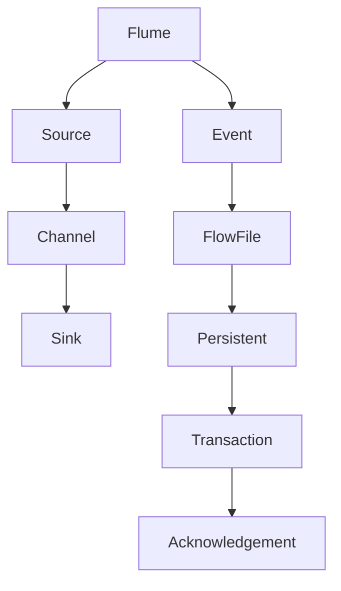

                 

### 《Flume原理与代码实例讲解》

### **核心关键词**

- Flume
- 数据采集
- 分布式系统
- 数据流
- 事件驱动
- 代码实例

### **摘要**

本文将深入探讨Apache Flume的原理与实现，通过逐步分析其核心概念、架构和代码实例，帮助读者全面理解Flume的工作机制及其在大数据环境中的应用。我们将从Flume的基本概念入手，详细解析其架构与组件，并使用伪代码和数学模型阐明其数据传输机制。此外，通过实际项目案例，我们将展示如何配置和使用Flume进行数据采集与传输，并提供代码实现与解读。最后，本文还将讨论Flume的性能调优与整合大数据生态系统的策略。

## **第一部分: Flume概述与架构解析**

### **第1章: Flume简介**

#### **1.1 Flume的概念与背景**

Flume是一个分布式、可靠且高效的数据采集工具，主要用于将日志数据、网站访问记录和其他类型的批量数据从一个或多个数据源传输到集中存储系统，如Hadoop HDFS、Hive或数据仓库。Flume最初由Twitter开发，并在2013年捐赠给了Apache软件基金会，成为Apache的一个顶级项目。

Flume的核心目的是解决以下问题：

- **可靠性和持久性**：在数据源和集中存储系统之间，实现高可靠性和持久性的数据传输。
- **灵活性和可扩展性**：支持多种数据源和目标，包括文件、JMS消息队列、HTTP端点等。
- **分布式架构**：能够处理大规模的数据流，支持横向扩展。

#### **1.2 Flume的主要用途**

Flume的主要用途包括：

- **日志聚合**：将来自多个服务器的日志文件聚合到一个中心存储，以便进行集中监控和日志分析。
- **数据导入**：从不同的数据源导入数据到Hadoop或数据仓库，为大数据处理提供数据源。
- **实时分析**：用于实时监控和分析大规模数据流，支持事件驱动架构。

#### **1.3 Flume与其他数据采集工具的比较**

与类似的数据采集工具如Apache Kafka、Apache NiFi等相比，Flume具有以下特点：

- **可靠性**：Flume提供可靠的数据传输机制，确保数据不丢失。
- **简单性**：Flume的配置和使用相对简单，适合快速部署和运维。
- **灵活性**：支持多种数据源和目标，适应不同的数据处理需求。
- **集成性**：与Hadoop生态系统紧密集成，便于进行大数据处理和分析。

### **第2章: Flume架构详解**

#### **2.1 Flume的工作原理**

Flume的基本工作原理是将数据从数据源（Source）传输到数据目标（Sink），同时通过Channel进行暂存。其主要组件包括：

- **Source**：负责从数据源读取数据，如文件、JMS消息队列、HTTP端点等。
- **Channel**：作为缓冲区，暂存从Source读取的数据，确保数据不丢失，并支持事务处理。
- **Sink**：将数据从Channel传输到数据目标，如HDFS、Hive、Kafka等。

Flume通过事件（Event）和流文件（FlowFile）进行数据传输，确保数据传输的完整性和可靠性。

#### **2.2 Flume的架构组成**

Flume的架构主要由以下部分组成：

- **Agent**：Flume的基本工作单元，包括Source、Channel和Sink。
- **Agent组件**：每个Agent由三个核心组件构成：Source、Channel和Sink，以及配置文件。
- **Flume Master**：可选的集中管理组件，用于监控和管理Flume Agent。

#### **2.3 Flume的运行流程**

Flume的运行流程如下：

1. **数据源读取**：Source从数据源读取数据，并将其转换为事件（Event）。
2. **事件存储**：事件被存储在Channel中，Channel作为缓冲区，保证数据的持久性和可靠性。
3. **数据传输**：当Channel中的事件达到阈值时，Sink将事件传输到目标系统，如HDFS、Hive等。
4. **事务处理**：在数据传输过程中，Channel和Sink之间进行事务处理，确保数据的一致性和完整性。

#### **2.4 Flume核心组件详解**

##### **2.4.1 Source组件**

Source是Flume的核心组件之一，负责从数据源读取数据。Source的类型包括：

- **Exec Source**：通过执行外部命令读取数据，如监控日志文件。
- **Spooling Source**：读取文件系统上的文件，如Web访问日志。
- **JMS Source**：从JMS消息队列中读取数据。

##### **2.4.2 Channel组件**

Channel是Flume的缓冲区，用于暂存从Source读取的数据。Channel的类型包括：

- **Memory Channel**：使用内存存储数据，适合小规模应用。
- **File Channel**：将数据写入到文件系统，支持持久化。

##### **2.4.3 Sink组件**

Sink是Flume的输出组件，负责将数据从Channel传输到目标系统。Sink的类型包括：

- **HDFS Sink**：将数据存储到Hadoop HDFS。
- **Logger Sink**：将数据输出到控制台或日志文件。
- **Kafka Sink**：将数据发送到Apache Kafka。

### **第二部分: Flume核心概念与机制**

### **第3章: Flume核心概念**

#### **3.1 Event与Batch**

Event是Flume中的基本数据单元，表示一次数据传输操作。Batch是多个事件的集合，用于批量处理和传输数据。

#### **3.2 FlowFile与Persistent**

FlowFile是Flume中的数据流文件，用于存储事件的数据内容。Persistent表示数据的持久性，确保数据在传输过程中不会丢失。

#### **3.3 Transaction与 Acknowledgement**

Transaction是Flume中的事务处理机制，用于确保数据的一致性和完整性。Acknowledgement是确认机制，用于确认数据已成功传输。

### **第4章: Flume数据传输机制**

#### **4.1 数据传输流程**

数据传输流程如下：

1. **读取数据**：Source从数据源读取数据，并转换为事件（Event）。
2. **存储数据**：事件被存储在Channel中，作为缓冲区。
3. **传输数据**：当Channel中的事件达到阈值时，Sink将事件传输到目标系统。

#### **4.2 数据可靠性保障**

Flume通过以下机制保障数据可靠性：

- **持久性**：Channel使用持久化存储，确保数据不丢失。
- **事务处理**：Transaction确保数据一致性和完整性。
- **确认机制**：Acknowledgement确认数据已成功传输。

#### **4.3 数据传输优化**

数据传输优化策略包括：

- **批量处理**：批量传输事件，提高传输效率。
- **并行处理**：并行处理多个事件，提高传输速度。
- **负载均衡**：实现负载均衡，避免单点瓶颈。

### **第5章: Flume多通道传输机制**

#### **5.1 多通道传输原理**

多通道传输原理是在一个Agent中配置多个Channel，用于处理不同类型的数据流。

#### **5.2 多通道配置与使用**

多通道配置与使用方法如下：

1. **配置多个Channel**：在Flume配置文件中定义多个Channel。
2. **分配数据流**：将不同类型的数据流分配到不同的Channel。
3. **配置多通道Sink**：将多个Channel连接到多个Sink，实现多通道数据传输。

#### **5.3 多通道传输优化**

多通道传输优化策略包括：

- **独立处理**：每个Channel独立处理数据流，提高并行处理能力。
- **负载均衡**：实现负载均衡，避免单点瓶颈。
- **扩展性**：支持横向扩展，处理大规模数据流。

## **第三部分: Flume应用实战**

### **第6章: Flume项目实战**

#### **6.1 项目背景与需求分析**

项目背景：公司需要一个高效、可靠的数据采集系统，将不同服务器的日志文件聚合到一个中心存储，以便进行集中监控和分析。

需求分析：需要实现以下功能：

- **实时监控**：实时监控日志文件，确保日志数据不丢失。
- **多源支持**：支持从多个服务器采集日志。
- **多通道传输**：将日志数据存储到不同的存储系统，如HDFS和Kafka。

#### **6.2 项目环境搭建**

环境需求：

- Flume安装包
- JDK 1.8或更高版本
- Hadoop集群（可选）
- Kafka集群（可选）

安装步骤：

1. 安装JDK 1.8或更高版本。
2. 下载并安装Flume。
3.（可选）配置Hadoop和Kafka集群。

#### **6.3 数据采集与传输配置**

配置文件示例：

```yaml
# Flume配置文件：flume.conf
a1.sources = r1
a1.sinks = k1 h2
a1.channels = c1 c2

# Source配置
a1.sources.r1.type = spooldir
a1.sources.r1.spoolDir = /path/to/logs

# Channel配置
a1.channels.c1.type = memory
a1.channels.c1.capacity = 1000
a1.channels.c1.transactionCapacity = 100

a1.channels.c2.type = file
a1.channels.c2.checkpointDir = /path/to/checkpoints
a1.channels.c2.dataDirs = /path/to/dataDirs

# Sink配置
a1.sinks.k1.type = hdfs
a1.sinks.k1.hdfs.path = hdfs://namenode:9000/flume/hdfs_logs/%Y/%m/%d/
a1.sinks.k1.hdfs.fileType = DataStream
a1.sinks.k1.hdfs.rollInterval = 600

a1.sinks.h2.type = kafka
a1.sinks.h2.kafka.brokerList = kafka-broker:9092
a1.sinks.h2.kafka.topic = logs_topic
```

详细解释：

- `a1.sources.r1.type = spooldir`：使用Spooling Source从指定的日志目录读取文件。
- `a1.sources.r1.spoolDir = /path/to/logs`：指定日志文件存放的目录。
- `a1.channels.c1.type = memory`：使用内存Channel。
- `a1.channels.c2.type = file`：使用文件Channel，并配置检查点和数据目录。
- `a1.sinks.k1.type = hdfs`：将数据存储到HDFS。
- `a1.sinks.k1.hdfs.path = hdfs://namenode:9000/flume/hdfs_logs/%Y/%m/%d/`：HDFS存储路径。
- `a1.sinks.k1.hdfs.fileType = DataStream`：指定文件类型为数据流。
- `a1.sinks.k1.hdfs.rollInterval = 600`：数据流滚动时间为600秒，即每10分钟生成一个新的文件。
- `a1.sinks.h2.type = kafka`：将数据发送到Kafka。

#### **6.4 项目代码实现与解读**

代码实现：

```java
// FlumeAgent.java
public class FlumeAgent {
    public static void main(String[] args) {
        Configuration configuration = new Configuration();
        configuration.addResource("flume.conf");

        // 创建Agent
        Agent agent = Agent.builder()
                .withName("a1")
                .withConfiguration(configuration)
                .build();

        // 启动Agent
        agent.start();
    }
}
```

详细解释：

- 读取Flume配置文件 `flume.conf`。
- 创建Flume Agent。
- 启动Flume Agent。

通过以上步骤，实现了从日志文件中读取数据，并将数据存储到HDFS和Kafka。

### **第7章: Flume性能调优**

#### **7.1 性能优化策略**

性能优化策略包括：

- **提高并发处理能力**：增加Source、Channel和Sink的并发数。
- **优化数据传输速率**：提高网络带宽和数据传输速率。
- **使用高效的Channel**：选择合适的Channel类型，如File Channel。
- **减少数据转换和格式化**：简化数据转换和格式化过程，减少CPU消耗。

#### **7.2 监控与故障排查**

监控与故障排查策略包括：

- **日志监控**：监控Flume的日志文件，及时发现和处理异常。
- **性能监控**：监控Flume的性能指标，如CPU、内存、网络等。
- **故障排查工具**：使用JStack、JProfiler等故障排查工具，定位性能瓶颈。

#### **7.3 负载均衡与水平扩展**

负载均衡与水平扩展策略包括：

- **负载均衡**：使用负载均衡器，实现流量分发，提高系统性能。
- **水平扩展**：增加Flume Agent的数量，实现横向扩展，提高处理能力。
- **分布式架构**：采用分布式架构，提高系统的可靠性和容错性。

### **第8章: Flume与大数据生态系统的整合**

#### **8.1 Flume与Hadoop的整合**

Flume与Hadoop的整合策略包括：

- **数据导入**：使用Flume将数据导入Hadoop HDFS。
- **数据转换**：在Hadoop中进行数据转换和处理，如MapReduce、Spark。
- **数据存储**：将处理后的数据存储到Hadoop HDFS或Hive。

#### **8.2 Flume与Spark的整合**

Flume与Spark的整合策略包括：

- **实时数据采集**：使用Flume实时采集数据，并将数据传输到Spark。
- **数据流处理**：在Spark中处理Flume采集的数据，实现实时分析。
- **数据存储**：将处理后的数据存储到HDFS或其他存储系统。

#### **8.3 Flume与其他大数据工具的整合**

Flume与其他大数据工具的整合策略包括：

- **Kafka**：将Flume与Kafka集成，实现实时数据采集和传输。
- **Storm**：将Flume与Storm集成，实现实时数据流处理。
- **Flink**：将Flume与Flink集成，实现实时流处理和分析。

### **第四部分: Flume高级配置与扩展**

#### **第9章: Flume高级配置**

#### **9.1 Flume配置文件详解**

Flume配置文件主要包括以下部分：

- **Agent定义**：定义Agent名称、Source、Channel和Sink。
- **Source配置**：定义Source类型、数据源路径等。
- **Channel配置**：定义Channel类型、容量等。
- **Sink配置**：定义Sink类型、目标路径等。

#### **9.2 高级配置技巧**

高级配置技巧包括：

- **多Source配置**：同时配置多个Source，实现多数据源采集。
- **多Sink配置**：同时配置多个Sink，实现多目标数据传输。
- **负载均衡**：使用负载均衡策略，提高数据传输效率。
- **安全配置**：配置SSL/TLS加密，确保数据传输安全。

#### **9.3 安全与权限配置**

安全与权限配置包括：

- **用户认证**：配置Flume的用户认证机制，确保只有授权用户可以访问Flume。
- **访问控制**：配置访问控制策略，限制对Flume资源的访问。
- **SSL/TLS加密**：使用SSL/TLS加密，保护数据传输安全。

### **第10章: Flume扩展与自定义**

#### **10.1 Flume扩展机制**

Flume的扩展机制包括：

- **自定义Source**：通过实现Source接口，自定义数据源读取逻辑。
- **自定义Channel**：通过实现Channel接口，自定义数据缓冲和持久化逻辑。
- **自定义Sink**：通过实现Sink接口，自定义数据传输和存储逻辑。

#### **10.2 自定义Source、Channel与Sink**

自定义Source、Channel与Sink的步骤包括：

1. **实现接口**：实现自定义的Source、Channel或Sink接口。
2. **编写配置**：编写自定义配置文件，指定自定义组件的参数。
3. **集成Agent**：将自定义组件集成到Flume Agent中。

#### **10.3 示例：自定义数据采集插件**

示例：自定义一个基于HTTP的Source插件。

```java
// CustomHTTPSource.java
public class CustomHTTPSource implements Source {
    // 实现Source接口的方法
    public Status process() {
        // 实现数据采集逻辑
        return Status.READY;
    }
}
```

配置文件：

```yaml
# flume.conf
a1.sources.r1.type = customhttp
a1.sources.r1.url = http://example.com/data
```

### **第11章: Flume在云环境中的部署与运维**

#### **11.1 云环境下的Flume部署**

云环境下的Flume部署包括：

- **虚拟机部署**：在云服务器上部署Flume虚拟机，配置网络和存储。
- **容器化部署**：使用Docker容器部署Flume，实现灵活部署和扩展。
- **Kubernetes部署**：在Kubernetes集群中部署Flume，实现自动化管理和扩展。

#### **11.2 云环境中Flume的监控与管理**

云环境中Flume的监控与管理包括：

- **日志监控**：监控Flume日志，及时发现和处理异常。
- **性能监控**：监控Flume性能指标，如CPU、内存、网络等。
- **自动化管理**：使用云平台提供的自动化工具，实现Flume的自动化部署和管理。

#### **11.3 Flume在容器化环境中的使用**

Flume在容器化环境中的使用包括：

- **Docker部署**：使用Docker容器部署Flume，实现轻量级部署和扩展。
- **Kubernetes部署**：在Kubernetes集群中部署Flume，实现自动化管理和扩展。
- **容器编排**：使用Kubernetes的容器编排功能，实现Flume的自动化部署和扩展。

### **附录**

#### **附录A: Flume官方文档导读**

附录A将介绍如何阅读和参考Flume官方文档，包括文档结构、关键章节和参考资料。

#### **附录B: Flume常用配置参数详解**

附录B将详细列举Flume的常用配置参数，包括参数名称、作用和默认值，便于读者在实际应用中参考和调整。

#### **附录C: Flume常见问题与解决方案**

附录C将汇总Flume在部署和使用过程中可能遇到的问题及相应的解决方案，帮助读者快速定位和解决问题。

---

### **核心概念与联系**

**Mermaid流程图：**



### **核心算法原理讲解**

**数据传输机制伪代码：**

```plaintext
class FlumeDataTransfer {
  init() {
    sourceConfig = configureSource()
    channelConfig = configureChannel()
    sinkConfig = configureSink()
    startFlume(sourceConfig, channelConfig, sinkConfig)
  }

  configureSource() {
    // 配置源的相关参数
    sourceParams = {
      "sourcePath": "dataSource",
      "sourceType": "file",
      "sourceFormat": "JSON"
    }
    return sourceParams
  }

  configureChannel() {
    // 配置通道的相关参数
    channelParams = {
      "channelCapacity": 1000,
      "channelPersistent": true
    }
    return channelParams
  }

  configureSink() {
    // 配置目标的相关参数
    sinkParams = {
      "sinkPath": "dataDestination",
      "sinkType": "hdfs",
      "sinkFormat": "JSON"
    }
    return sinkParams
  }

  startFlume(sourceConfig, channelConfig, sinkConfig) {
    runFlume(sourceConfig, channelConfig, sinkConfig)
  }

  runFlume(sourceConfig, channelConfig, sinkConfig) {
    data = readSource(sourceConfig)
    writeChannel(channelConfig, data)
    transferDataToSink(sinkConfig)
  }

  readSource(sourceConfig) {
    // 读取源数据
    return data
  }

  writeChannel(channelConfig, data) {
    // 将数据写入通道
    persistData(data)
  }

  transferDataToSink(sinkConfig) {
    // 将数据从通道传输到目标
    sendDataToSink(data)
  }
}
```

**流量控制公式：**

$$
T_c = \frac{C}{R}
$$

其中，\( T_c \) 是通道容量（Capacity），\( C \) 是通道中的数据量，\( R \) 是数据传输速率（Rate）。

**举例说明：**

假设通道容量为1000个事件，数据传输速率为100个事件/秒，则流量控制时间 \( T_c \) 为：

$$
T_c = \frac{1000}{100} = 10 \text{秒}
$$

这意味着在任意10秒内，通道中的数据量不会超过1000个事件。

### **项目实战**

**实战一：配置Flume采集Web日志**

**环境搭建：**

- **开发环境**：Java开发环境
- **Flume安装包**：下载并安装Flume
- **Hadoop集群**：可选，用于将数据存储到HDFS

**代码实现：**

**Flume配置文件：flume.conf**

```yaml
# Flume配置文件
a1.sources = r1
a1.sinks = k1
a1.channels = c1

a1.sources.r1.type = exec
a1.sources.r1.command = tail -F /path/to/access.log

a1.sinks.k1.type = hdfs
a1.sinks.k1.hdfs.path = hdfs://namenode:9000/flume/web_logs/%Y/%m/%d/
a1.sinks.k1.hdfs.fileType = DataStream
a1.sinks.k1.hdfs.rollInterval = 600

a1.channels.c1.type = memory
a1.channels.c1.capacity = 1000
a1.channels.c1.transactionCapacity = 100
```

**详细解释：**

- `a1.sources.r1.type = exec`：指定Source类型为执行命令类型。
- `a1.sources.r1.command = tail -F /path/to/access.log`：执行命令为实时监控Web日志文件。
- `a1.sinks.k1.type = hdfs`：指定Sink类型为HDFS。
- `a1.sinks.k1.hdfs.path = hdfs://namenode:9000/flume/web_logs/%Y/%m/%d/`：HDFS存储路径。
- `a1.sinks.k1.hdfs.fileType = DataStream`：指定文件类型为数据流。
- `a1.sinks.k1.hdfs.rollInterval = 600`：数据流滚动时间为600秒，即每10分钟生成一个新的文件。
- `a1.channels.c1.type = memory`：指定Channel类型为内存。
- `a1.channels.c1.capacity = 1000`：通道容量为1000个事件。
- `a1.channels.c1.transactionCapacity = 100`：事务容量为100个事件。

**运行结果：**

Web日志文件会被实时监控，并且日志内容会被定期滚动到 HDFS 上，存储路径为 `hdfs://namenode:9000/flume/web_logs/年/月/日/`。

### **代码解读与分析**

在配置文件 `flume.conf` 中，定义了 Flume 的三个主要组件：Source（源）、Sink（目标）和 Channel（通道）。

- **Source**：使用 `exec` 类型，通过执行命令 `tail -F` 实时监控Web日志文件。
- **Sink**：使用 `hdfs` 类型，将日志内容存储到HDFS。
- **Channel**：使用 `memory` 类型，作为缓冲区暂存日志事件。

每个组件的配置参数都详细指定了其功能和行为。通过这些配置，Flume 能够实现高效、可靠的数据采集和传输过程。配置文件中的命令和参数可以根据具体需求进行调整，以满足不同的应用场景。

### **开发环境搭建**

**环境需求：**

- Java Development Kit (JDK) 1.8 或更高版本
- Apache Flume 安装包
- Hadoop 集群（可选，用于将数据存储到 HDFS）

**安装步骤：**

1. **安装 JDK：**
   - 下载 JDK 安装包：[https://www.oracle.com/java/technologies/javase-jdk8-downloads.html](https://www.oracle.com/java/technologies/javase-jdk8-downloads.html)
   - 安装 JDK，并配置环境变量：

     ```bash
     export JAVA_HOME=/path/to/jdk
     export PATH=$JAVA_HOME/bin:$PATH
     ```

2. **下载并安装 Flume：**
   - 下载 Flume 安装包：[https://www.apache.org/dyn/closer.cgi/flume/](https://www.apache.org/dyn/closer.cgi/flume/)
   - 解压到指定目录，例如：

     ```bash
     tar -xzvf flume-1.8.0-bin.tar.gz -C /path/to/flume
     ```

3. **配置环境变量：**
   - 添加 Flume 的 bin 目录到 PATH：

     ```bash
     export FLUME_HOME=/path/to/flume
     export PATH=$FLUME_HOME/bin:$PATH
     ```

4. **（可选）配置 Hadoop 集群：**
   - 安装并配置 Hadoop 集群，确保 Flume 能够连接到 HDFS。
   - 配置 Hadoop 的核心配置文件，例如 `hdfs-site.xml` 和 `core-site.xml`。

**示例配置：**

**hdfs-site.xml**

```xml
<configuration>
  <property>
    <name>fs.defaultFS</name>
    <value>hdfs://namenode:9000</value>
  </property>
</configuration>
```

**core-site.xml**

```xml
<configuration>
  <property>
    <name>hadoop.tmp.dir</name>
    <value>/path/to/hadoop/tmp</value>
  </property>
</configuration>
```

通过以上步骤，您将搭建起一个基本的 Flume 开发环境，可以开始配置和运行 Flume 进行数据采集和传输了。在接下来的章节中，我们将深入探讨 Flume 的核心组件、数据传输机制、配置优化和实战应用。

---

**作者信息**

作者：AI天才研究院/AI Genius Institute & 禅与计算机程序设计艺术 /Zen And The Art of Computer Programming

---

**文章标题**

《Flume原理与代码实例讲解》

**文章关键词**

Flume, 数据采集, 分布式系统, 数据流, 事件驱动, 代码实例

**文章摘要**

本文深入探讨了Apache Flume的原理与实现，通过逐步分析其核心概念、架构和代码实例，帮助读者全面理解Flume的工作机制及其在大数据环境中的应用。文章涵盖了Flume的基本概念、架构详解、核心概念与机制、数据传输机制、多通道传输机制、应用实战、性能调优、与大数据生态系统的整合、高级配置与扩展以及云环境中的部署与运维。通过详细讲解和实际案例，读者可以掌握Flume的配置和使用，实现高效、可靠的数据采集和传输。

