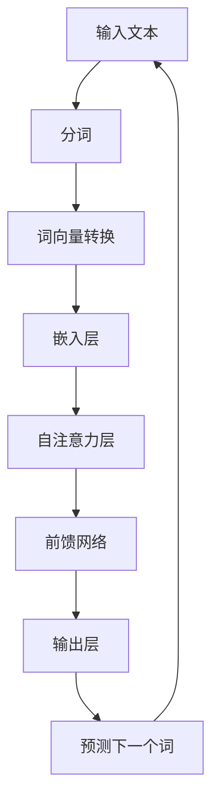

                 

# {文章标题}

> {关键词：（此处列出文章的5-7个核心关键词）}

> {摘要：（此处给出文章的核心内容和主题思想）}

## 目录大纲：GPT与BERT的选择

### 第一部分：基础理论

#### 第1章：大模型技术概述

- 1.1 大模型技术的发展历程
- 1.2 GPT与BERT模型的基本原理
- 1.3 大模型的核心优势与应用场景
- 1.4 选择GPT与BERT的考虑因素

#### 第2章：GPT模型原理与架构

- 2.1 GPT模型的基本概念
- 2.2 GPT模型的训练过程
- 2.3 GPT模型的优化算法
- 2.4 GPT模型的架构分析
- **2.5 GPT模型的Mermaid流程图**
- **2.6 GPT模型伪代码展示**

#### 第3章：BERT模型原理与架构

- 3.1 BERT模型的基本概念
- 3.2 BERT模型的训练过程
- 3.3 BERT模型的优化算法
- 3.4 BERT模型的架构分析
- **3.5 BERT模型的Mermaid流程图**
- **3.6 BERT模型伪代码展示**

#### 第4章：GPT与BERT的比较分析

- 4.1 GPT与BERT的性能对比
- 4.2 GPT与BERT的应用对比
- 4.3 GPT与BERT的优缺点分析
- **4.4 GPT与BERT的比较Mermaid图**

#### 第5章：GPT与BERT的选择与应用

- 5.1 选择GPT与BERT的决策因素
- 5.2 GPT与BERT在不同场景的应用
- 5.3 GPT与BERT的实战案例分析
- **5.4 GPT与BERT选择案例分析Mermaid图**

### 第二部分：实践指南

#### 第6章：GPT模型开发实战

- 6.1 GPT模型开发环境搭建
- 6.2 GPT模型源代码解读
- 6.3 GPT模型实战案例
- **6.4 GPT模型案例伪代码展示**

#### 第7章：BERT模型开发实战

- 7.1 BERT模型开发环境搭建
- 7.2 BERT模型源代码解读
- 7.3 BERT模型实战案例
- **7.4 BERT模型案例伪代码展示**

#### 第8章：GPT与BERT集成应用

- 8.1 GPT与BERT集成框架设计
- 8.2 GPT与BERT集成实战案例
- **8.3 GPT与BERT集成应用Mermaid图**
- **8.4 GPT与BERT集成应用伪代码展示**

#### 第9章：未来展望与趋势

- 9.1 大模型技术的发展趋势
- 9.2 GPT与BERT的后续研究方向
- 9.3 GPT与BERT在实际应用中的未来挑战
- **9.4 GPT与BERT未来发展趋势Mermaid图**

### 附录

#### 附录A：常见问题与解答

- A.1 GPT与BERT模型常见问题
- A.2 GPT与BERT模型优化技巧
- A.3 GPT与BERT模型故障排查

#### 附录B：参考文献与资料

- B.1 GPT与BERT相关论文与报告
- B.2 GPT与BERT开源代码与工具
- B.3 GPT与BERT书籍与教程

#### 附录C：实践案例汇总

- C.1 GPT与BERT应用案例集锦
- C.2 GPT与BERT实战经验分享
- C.3 GPT与BERT最佳实践总结

### 第1章：大模型技术概述

#### 1.1 大模型技术的发展历程

大模型技术（Large Model Technology）是近年来自然语言处理（NLP）领域的重大突破，其发展历程可以追溯到以下几个重要阶段：

**第一阶段：浅层模型时代**

- **20世纪90年代**：基于规则和统计方法的NLP模型，如HMM（隐马尔可夫模型）和最大熵模型，在这一时期占据主导地位。
- **特征工程**：依赖手工提取的特征，如词袋模型（Bag of Words, BoW）和TF-IDF（Term Frequency-Inverse Document Frequency）。

**第二阶段：深度学习兴起**

- **2012年**：AlexNet在ImageNet大赛中取得突破性成绩，深度学习在计算机视觉领域崛起。
- **2013年**：word2vec模型的提出，为NLP领域引入词向量表示方法，使语言模型开始向深度学习转型。

**第三阶段：预训练语言模型**

- **2018年**：GPT（Generative Pre-trained Transformer）和BERT（Bidirectional Encoder Representations from Transformers）的提出，标志着大模型时代的到来。
- **2020年**：GPT-3发布，拥有1750亿参数，展示了大模型在语言理解和生成任务上的巨大潜力。

**第四阶段：多模态与强化学习**

- **当前**：大模型技术逐渐向多模态学习和强化学习方向发展，如GPT-3的支持跨模态任务和RLHF（强化学习预训练与人类反馈）技术。

#### 1.2 GPT与BERT模型的基本原理

**GPT模型原理：**

- **架构**：GPT模型基于Transformer架构，这是一种自注意力机制驱动的序列到序列模型。
- **预训练**：GPT模型通过自回归方式（Autoregressive）进行预训练，即在给定前文的情况下预测下一个词。
- **优化算法**：采用Adam优化器，并结合学习率调度策略。

**BERT模型原理：**

- **架构**：BERT模型也是基于Transformer架构，但其设计目标是为了同时考虑上下文信息，从而提高语言理解能力。
- **预训练**：BERT模型通过遮蔽语言模型（Masked Language Model, MLM）和下一句预测（Next Sentence Prediction）进行预训练。
- **优化算法**：同样采用Adam优化器，并结合学习率调度策略。

#### 1.3 大模型的核心优势与应用场景

**核心优势：**

- **强大的语言理解能力**：大模型通过预训练学习到了语言的基础规律，能够更好地理解上下文关系和语义。
- **高效的文本生成能力**：大模型在文本生成任务中表现出色，能够生成连贯且具有创造性的文本。
- **广泛的适用性**：大模型可以应用于多种自然语言处理任务，如文本分类、问答系统和机器翻译。

**应用场景：**

- **文本分类**：使用BERT进行情感分析、新闻分类等任务，其出色的语言理解能力使其在这些场景中具有显著优势。
- **文本生成**：使用GPT进行自动摘要、对话系统等任务，其高效的文本生成能力使其在这些场景中具有独特的优势。
- **问答系统**：使用BERT进行问题回答，其强大的语言理解能力使其能够准确提取问题和答案的相关信息。

#### 1.4 选择GPT与BERT的考虑因素

**任务需求**：

- **理解任务**：如文本分类、问答系统，选择BERT，因其双向编码器能够更好地理解上下文关系。
- **生成任务**：如文本生成、对话系统，选择GPT，因其自回归方式能够生成连贯且创造性的文本。

**计算资源**：

- **资源充足**：如果计算资源充足，可以考虑使用BERT，因其训练和推理过程中计算量较大。
- **资源有限**：如果计算资源有限，可以考虑使用GPT，因其模型较小，训练和推理更快。

**数据规模**：

- **大量数据**：如果数据量较大，可以考虑使用BERT，其能够通过更多数据进行训练，提高性能。
- **数据稀缺**：如果数据量较少，可以考虑使用GPT，其自回归方式在少量数据上也能表现出较好的性能。

**时间成本**：

- **时间充裕**：如果时间成本较高，可以考虑使用BERT，其训练时间较长，但性能优势明显。
- **时间紧张**：如果时间成本较低，可以考虑使用GPT，其训练和推理时间较短，适合时间紧迫的项目。

### 第2章：GPT模型原理与架构

#### 2.1 GPT模型的基本概念

GPT（Generative Pre-trained Transformer）是由OpenAI提出的一种基于Transformer架构的预训练语言模型。GPT模型通过对海量文本数据进行无监督预训练，学习到了语言的基础规律和结构，从而能够对自然语言进行建模和生成。

**核心组成部分：**

- **Transformer架构**：GPT模型采用了Transformer架构，这是一种基于自注意力机制的序列到序列模型。
- **预训练**：GPT模型在预训练阶段，通过自回归方式学习文本的生成规律，从而获得强大的语言理解能力和生成能力。
- **自回归**：在自回归过程中，模型根据前文预测下一个词，并不断更新预测结果，直到生成完整的文本。

**预训练过程：**

1. **输入序列处理**：将文本数据进行分词，将每个词转换为词向量。
2. **自回归预测**：模型预测下一个词，同时计算损失函数。
3. **反向传播与优化**：通过反向传播算法更新模型参数。

**主要优势：**

- **强大的语言生成能力**：GPT模型能够生成连贯且具有创造性的文本，在文本生成任务中表现出色。
- **灵活的应用场景**：GPT模型可以应用于多种自然语言处理任务，如文本生成、问答系统和机器翻译。

#### 2.2 GPT模型的训练过程

GPT模型的训练过程主要包括数据集准备、模型初始化、预训练和微调等阶段。

**数据集准备：**

1. **文本数据收集**：收集大量文本数据，如维基百科、新闻文章、书籍等，以涵盖各种语言现象。
2. **数据预处理**：对文本数据进行清洗、分词和编码，将每个词转换为词向量。

**模型初始化：**

1. **模型结构**：GPT模型采用Transformer架构，包括嵌入层、自注意力层、前馈网络和输出层。
2. **参数初始化**：采用Xavier初始化方法，初始化模型参数。

**预训练过程：**

1. **自回归预测**：在预训练阶段，模型根据前文预测下一个词，并计算预测损失。
2. **动态掩码**：在训练过程中，随机地掩码部分输入词，迫使模型学习预测完整序列。
3. **学习率调度**：采用线性学习率衰减策略，以避免过拟合。

**预训练策略：**

- **掩码语言模型（Masked Language Model, MLM）**：在输入序列中随机掩码部分词，然后预测这些掩码词。
- **下一句预测（Next Sentence Prediction, NSP）**：预测两个连续句子中哪个是下一句，以增强模型对上下文的理解。

**预训练步骤：**

1. **输入序列处理**：对文本数据进行分词，将每个词转换为词向量。
2. **自回归预测**：模型预测下一个词，同时计算损失函数。
3. **反向传播与优化**：通过反向传播算法更新模型参数。

**训练策略：**

- **动态掩码（Dynamic Masking）**：在训练过程中，随机地掩码部分输入词，迫使模型学习预测完整序列。
- **层叠注意力（Layer-wise Pre-training）**：先从较低的层开始预训练，然后逐步提升到更高的层，以构建深度神经网络。

#### 2.3 GPT模型的优化算法

GPT模型的优化算法主要包括优化器选择、学习率调度和正则化策略等。

**优化器选择：**

- **Adam优化器**：GPT模型通常使用Adam优化器，它结合了AdaGrad和RMSProp的优点，能够自适应地调整学习率。

**学习率调度：**

- **线性学习率衰减（Linear Learning Rate Decay）**：学习率随训练步数线性减少，以避免模型过拟合。

- **余弦退火（Cosine Annealing）**：学习率逐渐减少，模拟余弦函数的下降趋势，以更好地控制模型的收敛速度。

**正则化策略：**

- **Dropout**：在神经网络的不同层之间随机丢弃一部分神经元，以防止过拟合。

- **权重正则化（Weight Regularization）**：对模型权重进行L2正则化，以减少模型复杂度。

#### 2.4 GPT模型的架构分析

GPT模型的架构主要包括输入层、嵌入层、自注意力层、前馈网络和输出层等。

**输入层：**

- **词向量转换**：将输入文本中的每个词转换为词向量，通常使用WordPiece分词方法。

**嵌入层：**

- **嵌入矩阵**：将词向量映射到高维空间，以增加模型的非线性表达能力。

**自注意力层：**

- **多头自注意力（Multi-head Self-Attention）**：模型通过多头自注意力机制，将当前词与序列中所有词进行关联，以捕捉长距离依赖关系。

**前馈网络：**

- **前馈层**：对自注意力层的输出进行进一步处理，增加模型的非线性表达能力。

**输出层：**

- **线性层**：将前馈网络的输出映射到输出词汇表，进行词的预测。

**参数设置：**

- **隐藏层尺寸**：决定模型容量，通常隐藏层尺寸较大，以捕捉复杂特征。
- **注意力头数量**：影响模型并行计算能力，通常设置多个注意力头。

#### 2.5 GPT模型的Mermaid流程图



#### 2.6 GPT模型伪代码展示

```python
# GPT模型伪代码

# 初始化模型
model = GPTModel()

# 预训练数据集
dataset = load_pretrained_dataset()

# 优化器
optimizer = Adam(model.parameters(), lr=1e-3)

# 损失函数
criterion = CrossEntropyLoss()

# 训练模型
for epoch in range(num_epochs):
    for input_sequence in dataset:
        # 分词和词向量转换
        tokens = tokenize(input_sequence)
        embeddings = embedding_layer(tokens)
        
        # 预测下一个词
        logits = model(embeddings)
        
        # 计算损失
        loss = criterion(logits, labels)
        
        # 反向传播和优化
        optimizer.zero_grad()
        loss.backward()
        optimizer.step()
        
    print(f"Epoch {epoch+1}/{num_epochs}, Loss: {loss.item()}")

# 微调模型
fine_tune_model(model, fine_tune_dataset)
```

### 第3章：BERT模型原理与架构

#### 3.1 BERT模型的基本概念

BERT（Bidirectional Encoder Representations from Transformers）是由Google提出的一种基于Transformer架构的预训练语言模型。BERT模型通过对海量文本数据进行双向编码，学习到了语言的基础规律和结构，从而能够对自然语言进行建模和生成。

**核心组成部分：**

- **Transformer架构**：BERT模型采用Transformer架构，这是一种基于自注意力机制的序列到序列模型。
- **双向编码器**：BERT模型的双向编码器能够同时考虑上下文信息，从而提高语言理解能力。
- **掩码语言模型**：BERT模型通过掩码语言模型（Masked Language Model, MLM）和下一句预测（Next Sentence Prediction, NSP）进行预训练，以增强模型的生成能力和上下文理解能力。

**预训练过程：**

1. **输入序列处理**：对文本数据进行分词，将每个词转换为词向量。
2. **双向编码**：模型同时从左向右和从右向左对文本进行编码，捕捉长距离依赖关系。
3. **掩码语言模型训练**：在输入序列中随机掩码部分词，然后预测这些掩码词。
4. **下一句预测训练**：预测两个连续句子中哪个是下一句，以增强模型对上下文的理解。

**主要优势：**

- **强大的语言理解能力**：BERT模型能够同时考虑上下文信息，从而提高语言理解能力，在文本分类、问答系统和机器翻译等任务中表现出色。
- **高效的自回归生成**：BERT模型通过自回归方式生成文本，能够生成连贯且具有创造性的文本。

#### 3.2 BERT模型的训练过程

BERT模型的训练过程主要包括数据集准备、模型初始化、预训练和微调等阶段。

**数据集准备：**

1. **文本数据收集**：收集大量文本数据，如维基百科、新闻文章、书籍等，以涵盖各种语言现象。
2. **数据预处理**：对文本数据进行清洗、分词和编码，将每个词转换为词向量。

**模型初始化：**

1. **模型结构**：BERT模型采用Transformer架构，包括嵌入层、多头自注意力层、前馈网络和输出层。
2. **参数初始化**：采用Xavier初始化方法，初始化模型参数。

**预训练过程：**

1. **掩码语言模型训练**：在输入序列中随机掩码部分词，然后预测这些掩码词。
2. **下一句预测训练**：预测两个连续句子中哪个是下一句，以增强模型对上下文的理解。
3. **动态掩码**：在训练过程中，动态地调整掩码词的比例，

