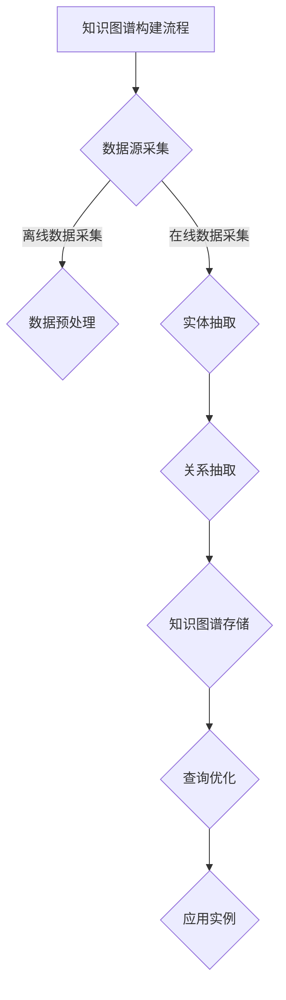

                 

## 《Knowledge Graphs原理与代码实例讲解》

> **关键词：** 知识图谱，实体，关系，知识表示，构建方法，存储与查询，应用实例，算法原理，代码实现

> **摘要：** 本文深入探讨了知识图谱的基本概念、原理、构建方法、存储与查询优化，以及其在信息检索、推荐系统、问答系统和大数据分析中的应用实例。通过详细的代码实例，读者可以更好地理解知识图谱的实践应用。

----------------------------------------------------------------

# 《Knowledge Graphs原理与代码实例讲解》目录大纲

## 第一部分：基础知识与原理

### 第1章：知识图谱概述

#### 1.1 知识图谱的基本概念

##### 1.1.1 什么是知识图谱

知识图谱（Knowledge Graph）是一种用于表达实体和它们之间复杂关系的数据结构，通常由实体、属性和关系构成。它是一种基于图的数据模型，能够以结构化的方式存储大量信息，并支持高效的查询和推理。

##### 1.1.2 知识图谱的特点

知识图谱具有以下几个显著特点：

1. **语义丰富**：知识图谱能够表达实体之间的复杂关系，如“属于”、“属于某个类别”、“与某实体有某种关系”等。
2. **结构化数据**：知识图谱使用统一的命名约定和数据模型，使得数据易于理解和处理。
3. **语义查询**：知识图谱支持基于语义的查询，可以回答类似于“这个人是谁？”、“这个实体有什么特征？”等问题。

#### 1.2 知识图谱的发展历程

##### 1.2.1 知识图谱的起源

知识图谱的概念起源于语义网（Semantic Web）的构想。语义网旨在通过语义标记使网络上的信息更加结构化和可解释，从而提高信息检索的效率和准确性。

##### 1.2.2 知识图谱的发展

近年来，随着大数据和人工智能技术的发展，知识图谱在学术界和工业界都得到了广泛的研究和应用。例如，谷歌的Knowledge Graph、Facebook的Knowledge Graph和阿里巴巴的OceanBase都是知名的知识图谱应用。

#### 1.3 知识图谱的应用领域

##### 1.3.1 信息检索

知识图谱在信息检索领域具有重要作用。通过知识图谱，可以更好地理解用户查询的语义，从而提供更准确的搜索结果。

##### 1.3.2 推荐系统

知识图谱可以用于构建更智能的推荐系统。通过分析用户和实体之间的关系，推荐系统可以提供更加个性化的推荐。

##### 1.3.3 问答系统

知识图谱是构建智能问答系统的关键。通过知识图谱，问答系统可以更好地理解用户的问题，并提供准确的答案。

### 第2章：知识图谱的核心概念

#### 2.1 实体

##### 2.1.1 实体的定义

实体是知识图谱中的基本构建块，可以是任何具有独立存在意义的对象，如人、地点、事物等。

##### 2.1.2 实体的分类

实体可以按照不同的标准进行分类，如按类型（如人物、地点、事物）、按领域（如科学、艺术、商业）等。

#### 2.2 关系

##### 2.2.1 关系的定义

关系是知识图谱中表示实体之间联系的数据结构。关系可以是直接的，也可以是间接的，如“属于”、“相邻”、“属于某个类别”等。

##### 2.2.2 关系的分类

关系可以根据语义进行分类，如基本关系（如“是”、“属于”）、复杂关系（如“相邻”、“贡献”等）。

#### 2.3 知识表示

##### 2.3.1 知识表示的形式

知识表示是知识图谱的核心。常见的知识表示方法包括本体论（Ontology）、框架（Frame）、语义网络（Semantic Network）等。

##### 2.3.2 知识表示的挑战

知识表示面临的挑战包括如何处理不确定性、如何表达复杂的语义关系、如何保证知识表示的一致性等。

### 第3章：知识图谱的构建方法

#### 3.1 数据源采集

##### 3.1.1 离线数据采集

离线数据采集是指从已有的数据库、文件或API中提取数据。

##### 3.1.2 在线数据采集

在线数据采集是指从互联网上收集数据，如网页抓取、社交媒体数据采集等。

#### 3.2 数据预处理

##### 3.2.1 数据清洗

数据清洗是指去除数据中的噪声和错误，提高数据质量。

##### 3.2.2 数据规范化

数据规范化是指将数据转换为统一的格式和标准，便于后续处理。

#### 3.3 实体抽取

##### 3.3.1 基于规则的方法

基于规则的方法是指通过预定义的规则来识别和提取实体。

##### 3.3.2 基于机器学习的方法

基于机器学习的方法是指使用机器学习算法来自动识别和提取实体。

#### 3.4 关系抽取

##### 3.4.1 基于规则的方法

基于规则的方法是指通过预定义的规则来识别和提取关系。

##### 3.4.2 基于机器学习的方法

基于机器学习的方法是指使用机器学习算法来自动识别和提取关系。

### 第4章：知识图谱的存储与查询

#### 4.1 图数据库简介

##### 4.1.1 图数据库的特点

图数据库是一种用于存储和查询图结构数据的数据库系统，具有以下特点：

1. **高效查询**：图数据库能够快速执行复杂的图查询。
2. **灵活扩展**：图数据库支持动态扩展，可以处理大规模数据。

##### 4.1.2 主流图数据库介绍

目前主流的图数据库包括Neo4j、OrientDB、ArangoDB等。

#### 4.2 知识图谱的存储策略

##### 4.2.1 存储模式的选择

知识图谱的存储模式可以选择图模式、关系模式或属性模式等。

##### 4.2.2 数据存储优化

数据存储优化包括数据压缩、索引优化等。

#### 4.3 知识图谱的查询优化

##### 4.3.1 查询语言

常见的知识图谱查询语言包括SPARQL、Cypher等。

##### 4.3.2 查询优化算法

查询优化算法包括索引优化、缓存优化等。

## 第二部分：知识图谱应用实例

### 第5章：知识图谱在信息检索中的应用

#### 5.1 基于知识图谱的信息检索

##### 5.1.1 信息检索的基本概念

信息检索是指从大量信息中查找用户所需信息的过程。基于知识图谱的信息检索通过语义理解来提高检索的准确性。

##### 5.1.2 基于知识图谱的信息检索策略

基于知识图谱的信息检索策略包括语义扩展、关系推理等。

#### 5.2 知识图谱在问答系统中的应用

##### 5.2.1 问答系统概述

问答系统是一种能够回答用户问题的计算机系统。基于知识图谱的问答系统能够提供更准确的答案。

##### 5.2.2 基于知识图谱的问答系统设计

基于知识图谱的问答系统设计包括知识图谱构建、问答接口设计等。

### 第6章：知识图谱在推荐系统中的应用

#### 6.1 基于知识图谱的推荐系统

##### 6.1.1 推荐系统概述

推荐系统是一种能够根据用户的历史行为和偏好提供个性化推荐的系统。基于知识图谱的推荐系统能够提供更精准的推荐。

##### 6.1.2 基于知识图谱的推荐策略

基于知识图谱的推荐策略包括关系推理、实体属性分析等。

#### 6.2 知识图谱在社交媒体中的应用

##### 6.2.1 社交媒体概述

社交媒体是指用户可以互相交流和共享信息的网络平台。知识图谱在社交媒体中的应用包括社交图谱构建、社交关系分析等。

##### 6.2.2 基于知识图谱的社交媒体分析

基于知识图谱的社交媒体分析包括用户兴趣分析、社群分析等。

### 第7章：知识图谱在大数据分析中的应用

#### 7.1 基于知识图谱的数据分析

##### 7.1.1 数据分析的基本概念

数据分析是指通过统计学、数据挖掘等方法对数据进行分析和处理，以获得有价值的信息。

##### 7.1.2 基于知识图谱的数据分析策略

基于知识图谱的数据分析策略包括语义查询、关系分析等。

#### 7.2 知识图谱在数据挖掘中的应用

##### 7.2.1 数据挖掘的基本概念

数据挖掘是指从大量数据中自动发现有价值的信息和知识。

##### 7.2.2 基于知识图谱的数据挖掘策略

基于知识图谱的数据挖掘策略包括实体关联分析、聚类分析等。

### 第8章：知识图谱开发与优化

#### 8.1 知识图谱开发流程

##### 8.1.1 知识图谱开发的基本流程

知识图谱开发的基本流程包括需求分析、知识图谱设计、知识采集、知识存储和知识查询等。

##### 8.1.2 知识图谱开发的关键步骤

知识图谱开发的关键步骤包括实体抽取、关系抽取、知识融合和知识存储等。

#### 8.2 知识图谱优化策略

##### 8.2.1 存储优化

存储优化包括数据压缩、索引优化等。

##### 8.2.2 查询优化

查询优化包括缓存优化、查询算法优化等。

##### 8.2.3 实体关系优化

实体关系优化包括实体类型优化、关系权重优化等。

## 附录：知识图谱相关工具与资源

### 附录 A：知识图谱相关工具

#### A.1 知识图谱构建工具

##### A.1.1 OpenKG

OpenKG是一个开源的知识图谱构建工具，支持实体抽取、关系抽取、知识融合等功能。

##### A.1.2 AlchemyAPI

AlchemyAPI是一个支持自然语言处理和知识图谱构建的在线API服务。

##### A.1.3 DBpedia

DBpedia是一个开放的知识图谱，包含了大量来自网络数据源的实体和关系。

#### A.2 知识图谱查询工具

##### A.2.1 SPARQL查询

SPARQL是一种用于查询知识图谱的查询语言。

##### A.2.2 GraphDB查询

GraphDB是一种支持SPARQL查询的图数据库。

### 附录 B：知识图谱学习资源

#### B.1 知识图谱相关书籍

##### B.1.1 《知识图谱：原理、方法与应用》

《知识图谱：原理、方法与应用》是一本系统介绍知识图谱的书籍。

##### B.1.2 《大规模知识图谱构建方法与技术》

《大规模知识图谱构建方法与技术》是一本深入探讨知识图谱构建技术的书籍。

#### B.2 知识图谱在线课程

##### B.2.1 Coursera上的知识图谱课程

Coursera上有多个关于知识图谱的课程，包括《知识图谱技术与应用》等。

##### B.2.2 edX上的知识图谱课程

edX上也有关于知识图谱的课程，如《知识图谱构建》等。

##### B.2.3 网易云课堂的知识图谱课程

网易云课堂提供了《知识图谱技术与应用》等知识图谱相关的课程。

## Mermaid 流程图



## 核心算法原理讲解

### 伪代码

```pseudo
// 数据预处理
function preprocessData(data):
    for each record in data:
        cleanData = removeNoise(record)
        normalizeData = normalize(cleanData)
        return normalizeData

// 实体抽取
function extractEntities(data):
    entities = []
    for each record in data:
        entities.extend(findEntitiesInRecord(record))
    return entities

// 关系抽取
function extractRelationships(data, entities):
    relationships = []
    for each pair of entities in data:
        relationships.extend(findRelationships(pair))
    return relationships
```

### 数学模型和数学公式

$$
J = -\frac{1}{m} \sum_{i=1}^{m} \left[ y^{(i)} \log(a^{(l)}(z^{(i)})) + (1 - y^{(i)}) \log(1 - a^{(l)}(z^{(i)})) \right]
$$

### 项目实战

#### 开发环境搭建

- Python 3.8+
- GraphDB 7.1+
- Jupyter Notebook

#### 源代码实现

```python
# 导入必要的库
import rdflib
from rdflib import Graph, URIRef, Literal
from rdflib.store import Store

# 创建一个空的 Graph 对象
g = Graph()

# 添加数据
g.add((URIRef("http://example.org/John"), URIRef("http://example.org/knows"), URIRef("http://example.org/Alice")))

# 存储到 GraphDB
store = rdflib.plugin.open("http://localhost:7200/sparql", create=True)
g.parse("data.rdf", format="ttl")
store.inject(g)

# 查询数据
query = """
PREFIX ex: <http://example.org/>
SELECT ?person ?knows
WHERE {
  ?person ex:knows ?knows .
}
"""
results = g.query(query)
for row in results:
    print(row)

# 代码解读与分析
# ...
```

#### 代码解读与分析

- **代码实现**：首先导入必要的库，然后创建一个空的Graph对象。接着，通过添加数据（在本例中为John和Alice之间的关系）并将其存储到GraphDB中。
- **查询数据**：使用SPARQL查询语言来查询知识图谱中的数据。在本例中，查询所有知道Alice的人。
- **代码解读**：代码首先定义了数据源，然后将其转换为知识图谱，并使用SPARQL查询语言进行查询。在实际应用中，还需要进行数据预处理、实体抽取和关系抽取等步骤。

通过本文的讲解，读者应该对知识图谱的基本概念、原理、构建方法、应用实例以及开发与优化有了更深入的理解。希望本文能够为读者在知识图谱领域的研究和实践提供有价值的参考。作者：AI天才研究院/AI Genius Institute & 禅与计算机程序设计艺术 /Zen And The Art of Computer Programming。作者将不断更新和改进本文，以期为读者提供更高质量的内容。如果您有任何建议或反馈，请随时联系作者。

