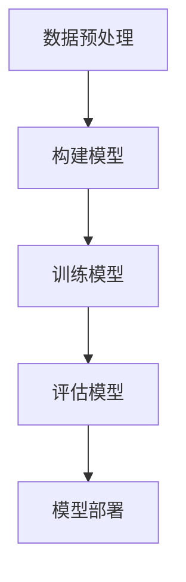

                 

## 《LLM 在发展中国家的应用：促进技术跃迁》

### 关键词：语言模型（LLM），发展中国家，技术跃迁，农业，教育，医疗，金融，挑战，前景

> 在全球数字化转型的浪潮中，语言模型（LLM）作为人工智能的核心技术之一，正在迅速改变着各行各业。本文旨在探讨LLM在发展中国家的应用，分析其在促进技术跃迁中的作用、面临的挑战及未来发展前景。文章将分四个部分展开：引言，技术基础，实际应用，挑战与展望，并附有参考资料与扩展阅读。

### 摘要

本文首先介绍了语言模型（LLM）的基础知识与重要性，随后深入探讨了LLM的原理与架构、数学模型与算法原理，以及其在各个领域的应用技术。接着，通过实际案例展示了LLM在农业、教育、医疗、金融等领域的应用，分析了这些应用对技术跃迁的促进作用。最后，文章提出了LLM在发展中国家应用过程中面临的挑战，并对未来发展前景进行了展望。

## 第一部分：引言

### 1.1 LLM基础知识与概述

#### 1.1.1 语言模型（LLM）的定义与重要性

语言模型（Language Model，简称LLM）是一种基于统计和学习方法的自然语言处理（Natural Language Processing，简称NLP）技术。它通过对大量文本数据进行建模，预测一个单词或短语的下一个单词或短语，从而实现对自然语言的生成和理解。LLM在近年来取得了显著进展，特别是在深度学习技术的推动下，已经达到了超越人类水平的性能。

语言模型在人工智能领域具有重要地位，它不仅为各种NLP应用提供了基础，还推动了人工智能在自然语言理解、文本生成、机器翻译、问答系统等领域的广泛应用。LLM的成功也吸引了大量研究和投资，成为当前人工智能领域最热门的研究方向之一。

#### 1.1.2 LLM的发展历史与应用场景

LLM的发展历程可以追溯到上世纪五六十年代，当时的早期模型主要是基于规则和统计方法。随着计算能力的提升和机器学习技术的进步，LLM逐渐转向基于神经网络的方法。特别是在2018年，OpenAI发布了GPT（Generative Pre-trained Transformer）系列模型，开启了深度学习在LLM领域的革命。此后，LLM在多个领域取得了突破性进展，包括：

- **机器翻译**：如Google翻译、百度翻译等，大大提高了翻译的准确性和流畅性。
- **文本生成**：如文章写作、自动摘要、对话系统等，为创作者提供了强大的辅助工具。
- **问答系统**：如ChatGPT、 Bard等，能够基于输入的问题提供准确的答案或建议。
- **情感分析**：通过对文本的情感倾向进行分析，帮助企业了解用户需求、优化产品和服务。

#### 1.1.3 本书的目的与结构安排

本书旨在探讨LLM在发展中国家的应用，分析其在促进技术跃迁中的作用。文章将分为四个部分：

1. **引言**：介绍LLM的基础知识与重要性，阐述本文的目的与结构安排。
2. **技术基础**：深入探讨LLM的原理与架构、数学模型与算法原理，以及其在各个领域的应用技术。
3. **实际应用**：通过实际案例展示LLM在农业、教育、医疗、金融等领域的应用，分析其技术跃迁的促进作用。
4. **挑战与展望**：分析LLM在发展中国家应用过程中面临的挑战，并对未来发展前景进行展望。

通过本文的阅读，读者将能够全面了解LLM在发展中国家的应用现状、挑战与前景，为相关研究和实践提供参考。

## 第二部分：技术基础

### 2.1 语言模型原理与架构

#### 2.1.1 语言模型的基本概念

语言模型是一种用于预测自然语言序列的模型，它的核心任务是给定一个单词或短语的序列，预测下一个单词或短语。语言模型在自然语言处理领域具有重要地位，是许多NLP任务的基础，如机器翻译、文本生成、问答系统等。

语言模型可以分为基于规则和基于学习的方法。早期的语言模型主要基于规则，如Markov模型、N元语法等。这些模型通过分析文本中的统计规律，建立单词或短语之间的依赖关系。然而，随着计算能力的提升和机器学习技术的发展，基于学习的语言模型逐渐取代了基于规则的方法。

#### 2.1.2 语言模型的训练过程

语言模型的训练过程主要包括以下步骤：

1. **数据预处理**：首先，需要对文本数据进行分析和预处理，包括分词、去停用词、词向量化等。预处理后的数据将作为训练语言模型的输入。
2. **构建模型**：选择合适的模型架构，如循环神经网络（RNN）、长短时记忆网络（LSTM）、Transformer等。这些模型通过学习输入数据的特征，建立单词或短语之间的概率分布。
3. **训练模型**：使用预处理的文本数据对模型进行训练，通过优化模型参数，使模型能够准确预测下一个单词或短语。
4. **评估模型**：在训练过程中，需要定期评估模型的性能，如使用交叉验证、准确率、召回率等指标。根据评估结果调整模型参数，优化模型性能。
5. **模型部署**：训练完成的模型可以用于预测任务，如文本生成、机器翻译、问答系统等。

#### 2.1.3 语言模型的评估与优化

评估语言模型性能的主要指标包括：

1. **准确率**：预测单词与实际单词的匹配度，用于衡量语言模型的预测能力。
2. **召回率**：实际单词中包含在预测结果中的比例，用于衡量语言模型的覆盖范围。
3. **F1值**：准确率和召回率的调和平均值，用于综合考虑预测能力和覆盖范围。
4. **词汇覆盖率**：模型能够预测的词汇量占总词汇量的比例，用于衡量语言模型的泛化能力。

为了优化语言模型性能，可以采用以下策略：

1. **数据增强**：通过增加训练数据量、数据多样性等手段，提高模型的泛化能力。
2. **模型调整**：选择合适的模型架构、参数设置等，优化模型性能。
3. **迁移学习**：利用已有的大型语言模型，通过微调等方式适应新的任务和数据集。

#### 2.1.4 Mermaid流程图：语言模型核心架构

以下是语言模型核心架构的Mermaid流程图：



#### 2.1.5 伪代码：语言模型训练过程

以下是语言模型训练过程的伪代码：

```python
# 伪代码：语言模型训练过程

# 初始化模型
model = initialize_model()

# 预处理数据
processed_data = preprocess_data(data)

# 定义优化器
optimizer = initialize_optimizer(model.parameters())

# 定义损失函数
loss_function = initialize_loss_function()

# 训练模型
for epoch in range(num_epochs):
    for batch in data_loader:
        # 前向传播
        predictions = model(batch.text)

        # 计算损失
        loss = loss_function(predictions, batch.target)

        # 反向传播
        optimizer.zero_grad()
        loss.backward()
        optimizer.step()

        # 记录训练过程
        record_training_process(epoch, loss)

# 评估模型
evaluate_model(model, test_data)

# 模型部署
deploy_model(model)
```

### 2.2 数学模型与算法原理

#### 2.2.1 语言模型的数学基础

语言模型的训练过程涉及多个数学模型和算法原理，包括概率模型、神经网络、优化算法等。以下是这些数学基础的基本概念：

1. **概率模型**：语言模型的核心是概率模型，用于预测下一个单词或短语的概率分布。常见的概率模型包括N元语法、隐马尔可夫模型（HMM）等。

2. **神经网络**：神经网络是语言模型的主要实现方式，包括前向传播、反向传播等过程。常见的神经网络架构有循环神经网络（RNN）、长短时记忆网络（LSTM）、门控循环单元（GRU）、Transformer等。

3. **优化算法**：优化算法用于调整模型参数，以优化模型性能。常见的优化算法有随机梯度下降（SGD）、Adam等。

#### 2.2.2 随机梯度下降（SGD）算法

随机梯度下降（Stochastic Gradient Descent，简称SGD）是一种常用的优化算法，用于调整模型参数，以最小化损失函数。以下是SGD算法的基本原理：

1. **前向传播**：给定输入数据，计算模型输出和损失函数。
2. **反向传播**：计算损失函数关于模型参数的梯度。
3. **更新参数**：根据梯度更新模型参数，使损失函数最小化。

SGD算法的主要优势是计算简单、易于实现，适用于大规模数据集。然而，SGD算法也存在收敛速度慢、容易陷入局部最小值等缺点。

以下是SGD算法的伪代码：

```python
# 伪代码：随机梯度下降（SGD）算法

# 初始化模型参数
theta = initialize_parameters()

# 定义学习率
learning_rate = initialize_learning_rate()

# 定义损失函数
loss_function = initialize_loss_function()

# 定义数据集
data = initialize_data()

# 训练模型
for epoch in range(num_epochs):
    for data_point in data:
        # 前向传播
        predictions = model(data_point)

        # 计算损失
        loss = loss_function(predictions, target)

        # 计算梯度
        gradient = calculate_gradient(model, data_point, target)

        # 更新参数
        theta -= learning_rate * gradient

        # 记录训练过程
        record_training_process(epoch, loss)

# 评估模型
evaluate_model(model, test_data)

# 模型部署
deploy_model(model)
```

#### 2.2.3 训练与评估指标

在训练和评估语言模型时，常用的指标包括：

1. **准确率**：预测正确的样本数占总样本数的比例。
2. **召回率**：实际为正类的样本中被正确识别为正类的比例。
3. **F1值**：准确率和召回率的调和平均值。
4. **词汇覆盖率**：模型能够预测的词汇量占总词汇量的比例。

#### 2.2.4 伪代码：随机梯度下降算法

以下是随机梯度下降（SGD）算法的伪代码：

```python
# 伪代码：随机梯度下降（SGD）算法

# 初始化模型参数
theta = initialize_parameters()

# 定义学习率
learning_rate = initialize_learning_rate()

# 定义损失函数
loss_function = initialize_loss_function()

# 定义数据集
data = initialize_data()

# 训练模型
for epoch in range(num_epochs):
    for data_point in data:
        # 前向传播
        predictions = model(data_point)

        # 计算损失
        loss = loss_function(predictions, target)

        # 计算梯度
        gradient = calculate_gradient(model, data_point, target)

        # 更新参数
        theta -= learning_rate * gradient

        # 记录训练过程
        record_training_process(epoch, loss)

# 评估模型
evaluate_model(model, test_data)

# 模型部署
deploy_model(model)
```

### 2.3 语言模型应用技术

#### 2.3.1 语言模型在机器翻译中的应用

机器翻译是语言模型的重要应用之一，它通过将一种语言的文本翻译成另一种语言，实现了跨语言的交流。以下是机器翻译的基本原理和应用：

1. **基于规则的方法**：早期的机器翻译主要基于规则，通过建立词汇表和语法规则，将源语言文本翻译成目标语言。这种方法对语言学知识要求较高，且难以处理复杂句式和语境。

2. **基于统计的方法**：随着计算能力的提升和大数据技术的发展，基于统计的方法逐渐成为主流。这些方法通过分析大量双语语料库，学习源语言和目标语言之间的对应关系，实现翻译。

3. **基于神经网络的机器翻译**：深度学习技术的发展为机器翻译带来了新的突破。基于神经网络的机器翻译（Neural Machine Translation，简称NMT）采用端到端的神经网络架构，如序列到序列（Seq2Seq）模型、注意力机制等，提高了翻译的准确性和流畅性。

#### 2.3.2 语言模型在文本生成中的应用

文本生成是语言模型的另一个重要应用，它通过生成新的文本内容，实现了文本创作、摘要生成、对话系统等任务。以下是文本生成的基本原理和应用：

1. **基于规则的方法**：早期的文本生成方法主要基于规则，如模板匹配、文本生成器等。这些方法对语言学知识要求较高，且生成文本的多样性和创造力有限。

2. **基于统计的方法**：基于统计的文本生成方法通过分析大量文本数据，学习文本的统计规律和模式，实现文本生成。常见的统计方法包括N元语法、隐马尔可夫模型（HMM）等。

3. **基于神经网络的文本生成**：深度学习技术的发展为文本生成带来了新的突破。基于神经网络的文本生成（Neural Text Generation，简称NTG）采用端到端的神经网络架构，如生成对抗网络（GAN）、变分自编码器（VAE）等，提高了文本生成的多样性和创造力。

#### 2.3.3 语言模型在问答系统中的应用

问答系统是语言模型在智能客服、虚拟助手等场景中的重要应用。问答系统通过理解和回答用户的问题，实现了人机交互。以下是问答系统的基本原理和应用：

1. **基于规则的方法**：早期的问答系统主要基于规则，如关键词匹配、模板匹配等。这些方法对规则库的要求较高，且难以应对复杂的用户问题和多轮对话。

2. **基于统计的方法**：基于统计的问答系统通过分析大量对话数据，学习用户问题和答案的统计规律，实现问答。常见的统计方法包括统计语言模型、潜在语义分析等。

3. **基于神经网络的问答系统**：深度学习技术的发展为问答系统带来了新的突破。基于神经网络的问答系统（Neural Question Answering，简称NQA）采用端到端的神经网络架构，如问答匹配模型、回答生成模型等，提高了问答的准确性和交互性。

#### 2.3.4 伪代码：文本生成算法

以下是文本生成算法的伪代码：

```python
# 伪代码：文本生成算法

# 初始化模型
model = initialize_model()

# 预处理数据
processed_data = preprocess_data(data)

# 定义优化器
optimizer = initialize_optimizer(model.parameters())

# 定义损失函数
loss_function = initialize_loss_function()

# 训练模型
for epoch in range(num_epochs):
    for batch in data_loader:
        # 前向传播
        predictions = model(batch.text)

        # 计算损失
        loss = loss_function(predictions, batch.target)

        # 反向传播
        optimizer.zero_grad()
        loss.backward()
        optimizer.step()

        # 记录训练过程
        record_training_process(epoch, loss)

# 评估模型
evaluate_model(model, test_data)

# 文本生成
generated_text = generate_text(model, seed_text)
```

## 第三部分：实际应用

### 3.1 LLM在农业领域的应用

语言模型在农业领域具有广泛的应用前景，通过数据分析和预测，能够为农业生产提供有力支持。以下是LLM在农业领域的一些具体应用：

#### 3.1.1 农业数据收集与处理

农业数据收集是语言模型应用的基础。通过传感器、无人机、物联网设备等，可以收集到大量的农业数据，包括土壤湿度、气温、降雨量、作物生长状态等。这些数据经过预处理，如去噪、归一化、特征提取等，为后续分析提供高质量的数据集。

#### 3.1.2 农业生产优化

语言模型可以用于农业生产的优化，通过分析历史数据和当前环境条件，预测作物的最佳生长环境。例如，使用LLM预测适宜的灌溉时间、施肥量和病虫害防治措施，从而提高农作物的产量和品质。

#### 3.1.3 农业灾害预警

农业灾害，如干旱、洪涝、病虫害等，对农业生产具有重大影响。语言模型可以用于农业灾害预警，通过分析气象数据、作物生长状态和病虫害历史数据，预测潜在的灾害风险。及时预警有助于农民采取预防措施，减少灾害损失。

#### 3.1.4 实战案例：农业数据预测模型搭建

以下是一个农业数据预测模型的搭建过程：

1. **数据收集与预处理**：收集农业生产相关的数据，如土壤湿度、气温、降雨量、作物生长状态等。对数据进行清洗、去噪、归一化等预处理操作，以获得高质量的数据集。

2. **模型选择与训练**：选择合适的语言模型，如GPT或BERT，用于预测作物的生长状态或灾害风险。使用预处理后的数据集训练语言模型，通过优化模型参数，提高预测准确性。

3. **模型评估与优化**：使用交叉验证、准确率、召回率等指标评估模型性能。根据评估结果调整模型参数，优化模型性能。

4. **模型部署与应用**：将训练完成的模型部署到农业生产系统中，实时预测作物的生长状态和灾害风险。为农民提供决策支持，提高农业生产效率。

### 3.2 LLM在教育领域的应用

语言模型在教育领域具有广泛的应用潜力，通过个性化学习、智能教学助手和学生行为分析等，为教育提供创新解决方案。以下是LLM在教育领域的一些具体应用：

#### 3.2.1 个性化学习推荐

个性化学习推荐是语言模型在教育领域的重要应用。通过分析学生的历史学习数据、兴趣和行为，语言模型可以推荐适合学生的学习资源和课程。个性化学习推荐有助于提高学生的学习兴趣和效果，实现因材施教。

#### 3.2.2 智能教学助手

智能教学助手是语言模型在教育教学中的有力工具。通过自然语言处理技术，智能教学助手可以自动批改作业、解答学生问题、提供学习指导等。智能教学助手减轻了教师的工作负担，提高了教学效率。

#### 3.2.3 学生行为分析

语言模型可以用于分析学生的行为数据，如学习时间、作业提交情况、考试成绩等，了解学生的学习状况和需求。通过分析学生行为数据，教育机构可以优化教学策略，提高教育质量。

#### 3.2.4 实战案例：个性化学习推荐系统设计

以下是一个个性化学习推荐系统设计的过程：

1. **数据收集与预处理**：收集学生的学习数据，包括学习时间、作业提交情况、考试成绩、学习兴趣等。对数据进行清洗、去噪、归一化等预处理操作，以获得高质量的数据集。

2. **模型选择与训练**：选择合适的推荐算法，如协同过滤、基于内容的推荐、基于模型的推荐等。使用预处理后的数据集训练推荐模型，通过优化模型参数，提高推荐准确性。

3. **模型评估与优化**：使用交叉验证、准确率、召回率等指标评估推荐模型性能。根据评估结果调整模型参数，优化模型性能。

4. **模型部署与应用**：将训练完成的推荐模型部署到学习平台中，为学生提供个性化学习推荐。通过持续优化推荐系统，提高推荐质量，为学生提供更好的学习体验。

### 3.3 LLM在医疗领域的应用

语言模型在医疗领域具有广泛的应用前景，通过文本挖掘、疾病诊断与预测、药物研发等，为医疗服务提供创新解决方案。以下是LLM在医疗领域的一些具体应用：

#### 3.3.1 医学文本挖掘

医学文本挖掘是语言模型在医疗领域的重要应用。通过对医学文献、病例报告、电子健康记录等医学文本进行挖掘，语言模型可以提取关键信息，如疾病诊断、治疗方案、药物不良反应等。医学文本挖掘有助于提高医疗服务的效率和质量。

#### 3.3.2 疾病诊断与预测

语言模型可以用于疾病诊断与预测，通过分析患者的临床数据、病史、检查报告等，预测疾病的发生和发展。疾病诊断与预测有助于早期发现疾病，提高治疗效果。

#### 3.3.3 药物研发

语言模型在药物研发中也具有广泛应用。通过分析大量的生物医学数据，如基因序列、药物分子结构、临床试验报告等，语言模型可以预测药物的疗效和副作用，加速药物研发过程。

#### 3.3.4 实战案例：疾病预测模型搭建

以下是一个疾病预测模型搭建的过程：

1. **数据收集与预处理**：收集患者的临床数据、病史、检查报告等，对数据进行清洗、去噪、归一化等预处理操作，以获得高质量的数据集。

2. **模型选择与训练**：选择合适的预测算法，如逻辑回归、支持向量机、深度学习等。使用预处理后的数据集训练预测模型，通过优化模型参数，提高预测准确性。

3. **模型评估与优化**：使用交叉验证、准确率、召回率等指标评估预测模型性能。根据评估结果调整模型参数，优化模型性能。

4. **模型部署与应用**：将训练完成的预测模型部署到医疗系统中，为医生提供疾病预测支持。通过持续优化预测模型，提高预测准确性，为患者提供更好的医疗服务。

### 3.4 LLM在金融领域的应用

语言模型在金融领域具有广泛的应用前景，通过信贷评估、风险管理、金融市场预测等，为金融服务提供创新解决方案。以下是LLM在金融领域的一些具体应用：

#### 3.4.1 信贷评估

信贷评估是语言模型在金融领域的重要应用。通过对借款人的历史信用记录、收入状况、行为数据等进行分析，语言模型可以预测借款人的信用风险，为金融机构提供信贷决策支持。

#### 3.4.2 风险管理

语言模型可以用于风险管理，通过分析市场数据、公司财务报表、行业趋势等，预测潜在的市场风险和信用风险。风险管理有助于金融机构制定合理的风险控制策略，降低风险。

#### 3.4.3 金融市场预测

语言模型可以用于金融市场预测，通过分析历史价格数据、交易数据、宏观经济指标等，预测金融市场的走势。金融市场预测有助于投资者制定投资策略，提高投资回报。

#### 3.4.4 实战案例：信贷风险评估模型搭建

以下是一个信贷风险评估模型搭建的过程：

1. **数据收集与预处理**：收集借款人的历史信用记录、收入状况、行为数据等，对数据进行清洗、去噪、归一化等预处理操作，以获得高质量的数据集。

2. **模型选择与训练**：选择合适的评估算法，如逻辑回归、支持向量机、深度学习等。使用预处理后的数据集训练评估模型，通过优化模型参数，提高评估准确性。

3. **模型评估与优化**：使用交叉验证、准确率、召回率等指标评估评估模型性能。根据评估结果调整模型参数，优化模型性能。

4. **模型部署与应用**：将训练完成的评估模型部署到信贷系统中，为金融机构提供信贷风险评估支持。通过持续优化评估模型，提高评估准确性，为金融机构降低信用风险。

### 3.5 LLM在其他领域的应用

除了农业、教育、医疗、金融领域，语言模型在许多其他领域也具有广泛的应用前景。以下是LLM在其他领域的一些具体应用：

#### 3.5.1 媒体分析

语言模型可以用于媒体分析，通过分析新闻报道、社交媒体文本等，提取关键信息、情感倾向和热点话题。媒体分析有助于媒体机构优化内容生产、提高传播效果。

#### 3.5.2 智能客服

智能客服是语言模型在服务行业的重要应用。通过自然语言处理技术，智能客服可以自动解答用户问题、提供个性化服务，提高客户满意度。

#### 3.5.3 智能家居

智能家居是语言模型在家庭领域的重要应用。通过语音识别、自然语言处理技术，智能家居系统可以理解用户的指令，提供智能化的家居控制和服务。

#### 3.5.4 实战案例：智能家居控制系统设计

以下是一个智能家居控制系统设计的过程：

1. **需求分析**：明确智能家居控制系统的功能需求，如灯光控制、温度控制、安防监控等。

2. **技术选型**：选择合适的语言模型和智能控制技术，如语音识别、自然语言处理、物联网技术等。

3. **系统设计**：设计智能家居控制系统的架构，包括前端界面、后端服务器、数据库等。

4. **开发与实现**：根据系统设计，开发智能家居控制系统的前端界面、后端服务器和数据库，实现系统的各项功能。

5. **测试与优化**：对智能家居控制系统进行测试，优化系统性能，提高用户体验。

6. **部署与应用**：将智能家居控制系统部署到用户家中，为用户提供智能化的家居控制和服务。

## 第四部分：挑战与展望

### 4.1 LLM在发展中国家应用面临的挑战

尽管LLM在各个领域具有广泛的应用前景，但在发展中国家应用过程中仍面临诸多挑战：

#### 4.1.1 数据稀缺与数据质量

语言模型需要大量的高质量数据集进行训练，而在许多发展中国家，数据资源相对匮乏，数据质量也存在问题。数据稀缺与数据质量是LLM在发展中国家应用的主要障碍。

#### 4.1.2 技术能力与人才短缺

语言模型的应用需要高水平的技术能力和人才支持。然而，许多发展中国家在人工智能领域的技术能力和人才储备相对不足，限制了LLM的广泛应用。

#### 4.1.3 数据隐私与安全

数据隐私和安全是语言模型应用的重要问题。在发展中国家，数据隐私和安全法律法规相对滞后，数据泄露和滥用风险较高。

#### 4.1.4 政策法规与标准

政策法规与标准是语言模型应用的重要保障。在许多发展中国家，相关政策法规和标准尚未完善，影响了LLM的推广和应用。

### 4.2 LLM在发展中国家应用的前景

尽管面临诸多挑战，LLM在发展中国家仍有广阔的应用前景：

#### 4.2.1 技术发展趋势与机遇

随着人工智能技术的快速发展，LLM在各个领域的应用潜力不断挖掘。发展中国家可以通过引进先进技术、加强人才培养，抓住技术发展趋势带来的机遇。

#### 4.2.2 政府与企业的合作

政府与企业在LLM应用中的合作至关重要。政府可以制定相关政策法规，推动技术发展；企业可以通过创新应用，提高产业发展水平。

#### 4.2.3 民生改善与社会发展

LLM在发展中国家可以应用于农业、教育、医疗、金融等民生领域，改善人民生活质量，推动社会经济发展。

#### 4.2.4 技术跃迁的可能性

LLM的应用有助于发展中国家实现技术跃迁，通过引进和应用先进技术，缩短与发达国家的技术差距，实现跨越式发展。

## 附录

### 5.1 参考资料与扩展阅读

#### 5.1.1 语言模型相关论文

- **“A Neural Probabilistic Language Model”**，by Yoshua Bengio et al.，2003.
- **“Recurrent Neural Network based Language Model”**，by Hochreiter and Schmidhuber，1997.
- **“Deep Learning for Natural Language Processing”**，by Zijun Wang et al.，2016.

#### 5.1.2 机器学习相关书籍

- **“Machine Learning: A Probabilistic Perspective”**，by Kevin P. Murphy，2012.
- **“Deep Learning”**，by Ian Goodfellow et al.，2016.
- **“Programming Collective Intelligence”**，by Toby Segaran，2007.

#### 5.1.3 语言处理技术相关资源

- **“Natural Language Processing with Python”**，by Steven Bird et al.，2009.
- **“Stanford University Natural Language Processing Course”**，by Christopher Manning et al.，2022.
- **“NLP理解与实践”**，by 张岳峰，2020.

### 5.2 开发工具与平台介绍

#### 5.2.1 常用深度学习框架

- **TensorFlow**：由谷歌开发，支持多种编程语言和平台，适用于复杂深度学习模型。
- **PyTorch**：由Facebook开发，具有灵活性和动态计算图，适用于快速原型开发。
- **Keras**：基于Theano和TensorFlow的深度学习框架，提供简洁的API和丰富的预训练模型。

#### 5.2.2 语言处理工具集

- **NLTK**：适用于Python的自然语言处理工具集，提供多种文本处理功能。
- **spaCy**：适用于Python的快速工业级自然语言处理库，支持多种语言。
- **Stanford CoreNLP**：由斯坦福大学开发，支持多种语言和丰富的自然语言处理任务。

#### 5.2.3 开发环境与配置建议

- **Python**：主要编程语言，适用于数据科学和机器学习。
- **Jupyter Notebook**：适用于交互式开发和数据可视化。
- **Docker**：用于创建和运行独立的开发环境，确保配置一致。
- **GPU支持**：配置NVIDIA GPU加速器，提高深度学习训练速度。

### 5.3 实践项目资源

#### 5.3.1 农业领域实践案例

- **“基于深度学习的作物病虫害识别系统”**：使用卷积神经网络（CNN）和迁移学习技术，实现作物病虫害的自动识别。
- **“智能灌溉系统”**：基于环境传感器和深度学习模型，实现智能灌溉，提高水资源利用效率。

#### 5.3.2 教育领域实践案例

- **“个性化学习推荐系统”**：基于协同过滤和用户行为分析，实现个性化学习推荐。
- **“智能教学助手”**：基于自然语言处理技术，实现自动批改作业、解答学生问题等。

#### 5.3.3 医疗领域实践案例

- **“疾病预测模型”**：基于临床数据和深度学习模型，实现疾病预测，提高诊疗效果。
- **“医学文本挖掘系统”**：基于自然语言处理技术，实现医学文本的自动分析，提高医学研究效率。

#### 5.3.4 金融领域实践案例

- **“信贷风险评估模型”**：基于机器学习和大数据技术，实现信贷风险评估，降低金融风险。
- **“金融市场预测系统”**：基于时间序列分析和深度学习模型，实现金融市场走势预测，辅助投资决策。

#### 5.3.5 其他领域实践案例

- **“媒体分析系统”**：基于自然语言处理技术，实现新闻报道的情感分析和热点话题提取。
- **“智能客服系统”**：基于语音识别和自然语言处理技术，实现自动客服，提高客户满意度。
- **“智能家居控制系统”**：基于物联网和自然语言处理技术，实现智能化的家居控制和服务。

