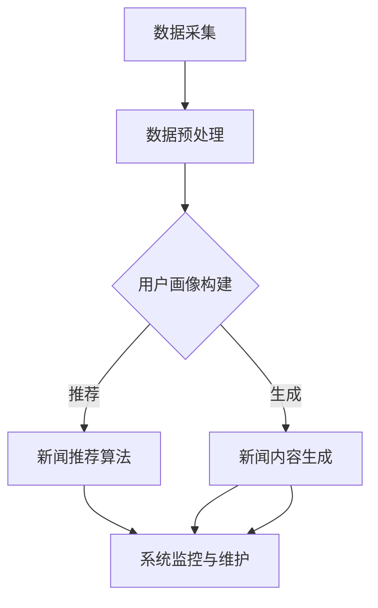

                 

# 第一部分：引论

## 第1章：定制化信息服务的背景与挑战

### 1.1 定制化信息服务的定义

定制化信息服务是指根据用户的需求和兴趣，通过个性化的方式提供相关的信息内容。这种服务模式不仅能够满足用户的个性化需求，还能够提高用户对信息的满意度和体验。定制化信息服务的核心在于“定制化”，即根据用户的偏好、行为、兴趣等因素，提供个性化的信息推荐。

### 1.1.1 定制化信息服务的概述

定制化信息服务涵盖了多种形式，包括但不限于个性化推荐、内容定制、个性化搜索等。在个性化推荐方面，常见的应用场景包括电商推荐、新闻推荐、音乐推荐等。这些应用通过分析用户的兴趣和行为，提供个性化的推荐内容，使用户能够快速找到自己感兴趣的信息。

### 1.1.2 定制化信息服务的市场现状

随着互联网的快速发展，定制化信息服务已经成为市场的重要组成部分。根据市场调研数据，全球定制化信息服务市场在近年来呈现快速增长的趋势。尤其是在人工智能、大数据等技术的推动下，定制化信息服务的技术水平不断提高，应用场景也在不断拓展。

### 1.1.3 定制化信息服务的用户需求

用户对定制化信息服务的需求主要表现在以下几个方面：

1. **个性化推荐**：用户希望系统能够根据他们的兴趣和行为，推荐他们感兴趣的内容。
2. **内容多样化**：用户希望获取到丰富的信息内容，满足多样化的阅读需求。
3. **实时性**：用户希望获取的信息能够及时更新，与当前的事件和话题保持同步。
4. **便捷性**：用户希望信息获取过程简单、快捷，无需过多的操作和等待。

### 1.2 个性化新闻生成技术概述

个性化新闻生成技术是定制化信息服务的重要组成部分。它通过利用自然语言处理、机器学习等技术，根据用户的兴趣和行为，生成个性化的新闻内容。这种技术不仅能够提高用户的阅读体验，还能够提高新闻内容的传播效率。

### 1.2.1 个性化新闻生成技术的基本概念

个性化新闻生成技术主要包括以下几个核心概念：

1. **新闻生成模型**：用于生成新闻内容的模型，通常采用深度学习技术。
2. **用户画像**：用于描述用户兴趣和行为的数据模型，是生成个性化新闻的关键。
3. **新闻推荐算法**：用于根据用户画像推荐个性化新闻的算法。

### 1.2.2 个性化新闻生成技术的发展历程

个性化新闻生成技术起源于20世纪90年代，随着互联网的普及和信息量的爆炸性增长，个性化新闻生成技术逐渐受到关注。近年来，随着人工智能技术的快速发展，个性化新闻生成技术取得了显著进展，应用场景也在不断拓展。

### 1.2.3 个性化新闻生成技术的研究热点

当前，个性化新闻生成技术的研究热点主要包括：

1. **深度学习模型**：如变长循环神经网络（LSTM）、生成对抗网络（GAN）等。
2. **用户画像构建**：如何更准确地构建用户画像，提高个性化推荐的准确性。
3. **多模态内容生成**：结合文本、图像、语音等多模态信息生成个性化新闻。

### 1.3 LLM的基本原理与应用

大型语言模型（LLM，Large Language Model）是近年来在自然语言处理领域取得突破性进展的技术。LLM具有强大的文本生成和推理能力，在个性化新闻生成中具有广泛的应用前景。

### 1.3.1 LLM的概念与特征

LLM是一种基于深度学习的大型神经网络模型，能够处理和理解复杂的自然语言文本。其主要特征包括：

1. **预训练**：LLM通过在大量文本数据上进行预训练，学习到文本的基本语法和语义知识。
2. **微调**：在特定任务上对LLM进行微调，以适应不同的应用场景。
3. **生成能力**：LLM能够根据输入的文本生成连贯、合理的文本内容。

### 1.3.2 LLM在自然语言处理中的应用

LLM在自然语言处理领域具有广泛的应用，如文本分类、机器翻译、文本生成等。在个性化新闻生成中，LLM可以用于：

1. **新闻内容生成**：根据用户画像生成个性化的新闻内容。
2. **标题生成**：为新闻内容生成吸引人的标题。
3. **摘要生成**：为新闻内容生成摘要，提高用户阅读效率。

### 1.3.3 LLM在新闻生成中的优势

LLM在新闻生成中的优势主要包括：

1. **高质量的文本生成**：LLM能够生成高质量、连贯的新闻内容。
2. **快速响应**：LLM具有强大的文本生成和推理能力，能够快速响应用户的需求。
3. **适应性**：LLM可以根据不同的用户需求和场景进行微调，提高个性化推荐的准确性。

### 1.4 本书结构安排与内容概览

本书共分为五个部分，涵盖了个性化新闻生成技术的核心概念、算法原理、数学模型、项目实战等内容。

第一部分引论介绍了定制化信息服务的背景与挑战，以及个性化新闻生成技术的基本概念和优势。

第二部分重点介绍了LLM的基本原理和应用，包括深度学习基础、自然语言处理基础、LLM的工作原理和性能评估等内容。

第三部分详细阐述了个性化新闻生成系统设计与实现，包括系统架构设计、用户画像构建、新闻推荐算法、新闻生成流程和系统实现与优化等。

第四部分通过实际案例，展示了LLM在个性化新闻生成中的应用，包括新闻网站个性化推荐系统和社交媒体个性化内容生成等。

第五部分探讨了个性化新闻生成技术的发展趋势与挑战，以及未来展望。

通过本书的阅读，读者可以系统地掌握个性化新闻生成技术的核心概念和实现方法，为实际应用提供理论基础和实践指导。

> 关键词：定制化信息服务、个性化新闻生成、大型语言模型（LLM）、深度学习、自然语言处理

> 摘要：本书旨在介绍个性化新闻生成技术及其在定制化信息服务中的应用。通过详细阐述LLM的基本原理和应用，以及个性化新闻生成系统的设计与实现，本书为读者提供了全面的技术指导。书中还通过实际案例展示了LLM在个性化新闻生成中的应用效果，为读者提供了实践参考。本书适合对个性化新闻生成技术感兴趣的读者阅读，尤其适用于从事人工智能、自然语言处理等领域的研究人员和技术工程师。# 第二部分：LLM与个性化新闻生成

## 第2章：大型语言模型（LLM）技术基础

### 2.1 深度学习基础

深度学习是人工智能领域的一个重要分支，它通过模拟人脑的神经网络结构，实现数据的自动学习和特征提取。深度学习在个性化新闻生成中起到了关键作用，能够有效提高新闻生成质量和用户体验。

#### 2.1.1 神经网络与深度学习

神经网络（Neural Networks，NN）是一种模仿生物神经网络结构的人工神经网络，由大量简单的神经元组成。深度学习（Deep Learning，DL）是神经网络的一种扩展，其特点是具有深层的网络结构，能够处理更复杂的数据。

#### 2.1.2 反向传播算法

反向传播算法（Backpropagation Algorithm）是深度学习训练过程中的一项关键技术。它通过计算输出层和隐藏层之间的误差，反向传播到隐藏层，不断调整网络权重，以达到最小化损失函数的目的。

#### 2.1.3 深度学习框架

深度学习框架（Deep Learning Framework）是用于构建和训练深度学习模型的软件工具。常见的深度学习框架包括TensorFlow、PyTorch、Keras等，它们提供了丰富的API和工具，方便开发者构建和优化深度学习模型。

### 2.2 自然语言处理基础

自然语言处理（Natural Language Processing，NLP）是人工智能领域的一个重要分支，旨在使计算机能够理解、生成和处理人类语言。NLP在个性化新闻生成中起到了关键作用，是实现文本生成和语义理解的重要技术。

#### 2.2.1 语言模型基础

语言模型（Language Model，LM）是NLP中的基础模型，用于预测下一个单词或字符。常用的语言模型包括n元语法模型、神经网络语言模型等。

#### 2.2.2 序列模型

序列模型（Sequence Model）是用于处理序列数据（如文本、音频等）的模型。常见的序列模型包括循环神经网络（Recurrent Neural Network，RNN）、长短期记忆网络（Long Short-Term Memory，LSTM）等。

#### 2.2.3 注意力机制

注意力机制（Attention Mechanism）是NLP领域的一种重要技术，用于解决长序列依赖问题。注意力机制能够使模型在处理序列数据时，关注到关键信息，提高模型的性能。

### 2.3 LLM的工作原理

大型语言模型（LLM，Large Language Model）是一种基于深度学习的语言模型，具有强大的文本生成和推理能力。LLM的工作原理主要包括预训练、微调和推理三个阶段。

#### 2.3.1 预训练与微调

预训练（Pre-training）是LLM训练的第一步，通过在大量无标注文本数据上训练，模型学习到文本的基本语法和语义知识。微调（Fine-tuning）是在预训练基础上，针对特定任务对模型进行微调，以提高模型在目标任务上的性能。

#### 2.3.2 大规模语言模型的架构

大规模语言模型的架构主要包括编码器（Encoder）和解码器（Decoder）两部分。编码器将输入的文本序列转换为固定长度的向量表示，解码器则根据编码器输出的向量表示生成文本序列。

#### 2.3.3 LLM的推理与生成过程

LLM的推理与生成过程主要包括以下几个步骤：

1. **输入编码**：将输入的文本序列转换为编码器输出的固定长度向量表示。
2. **生成候选词**：解码器根据编码器输出的向量表示生成多个候选词。
3. **选择最佳候选词**：通过计算候选词的概率，选择最佳候选词作为输出。

### 2.4 LLM的性能评估

LLM的性能评估主要包括以下几个指标：

1. **生成质量**：评估生成文本的连贯性和合理性。
2. **准确性**：评估模型在文本分类、命名实体识别等任务上的准确性。
3. **速度**：评估模型在生成文本时的响应速度。
4. **可扩展性**：评估模型在处理大规模数据时的性能。

常见的性能评估方法包括自动评估指标（如BLEU、ROUGE等）和人工评估。

### 2.4.1 性能指标

常用的性能指标包括：

1. **BLEU（Bilingual Evaluation Understudy）**：用于评估文本生成的自动评估指标，通过比较生成文本与参考文本的相似度来评估生成质量。
2. **ROUGE（Recall-Oriented Understudy for Gisting Evaluation）**：用于评估文本生成和摘要任务的自动评估指标，通过计算生成文本与参考文本的匹配词数来评估生成质量。
3. **准确率（Accuracy）**：用于评估分类任务的指标，计算模型预测正确的样本数与总样本数的比例。

### 2.4.2 评估方法

评估方法主要包括自动评估和人工评估两种：

1. **自动评估**：通过编写评估脚本，自动计算生成文本与参考文本的相似度或匹配词数，评估生成质量。
2. **人工评估**：由人类评估者对生成文本进行评价，评估生成质量、准确性、速度等指标。

### 2.4.3 性能优化策略

性能优化策略主要包括以下几个方面：

1. **数据增强**：通过增加训练数据量、数据清洗和数据预处理等技术，提高模型的性能。
2. **模型架构优化**：通过调整模型架构，如增加层数、调整网络结构等，提高模型的性能。
3. **超参数调优**：通过调整学习率、批量大小等超参数，提高模型的性能。

### 2.5 LLM的应用场景

LLM在个性化新闻生成中具有广泛的应用场景，包括：

1. **新闻内容生成**：根据用户画像生成个性化的新闻内容。
2. **标题生成**：为新闻内容生成吸引人的标题。
3. **摘要生成**：为新闻内容生成摘要，提高用户阅读效率。
4. **问答系统**：为用户提供关于新闻内容的问答服务。
5. **多模态内容生成**：结合文本、图像、音频等多模态信息生成个性化新闻。

### 2.5.1 新闻内容生成

新闻内容生成是LLM在个性化新闻生成中最重要的应用场景之一。通过分析用户画像，LLM可以生成与用户兴趣相关的新闻内容，提高用户对新闻的满意度和阅读体验。

#### 2.5.1.1 实现步骤

1. **用户画像构建**：收集并分析用户的行为数据、兴趣标签等，构建用户画像。
2. **新闻内容生成**：利用LLM生成与用户兴趣相关的新闻内容。

#### 2.5.1.2 案例分析

以某新闻网站为例，该网站利用LLM技术实现个性化新闻生成，根据用户的历史阅读行为和兴趣标签，为用户生成个性化的新闻推荐。通过分析用户数据，网站可以准确预测用户的兴趣点，从而生成高质量的个性化新闻。

### 2.5.2 标题生成

标题生成是另一个重要的应用场景。通过生成吸引人的标题，可以提高新闻的点击率和阅读量。

#### 2.5.2.1 实现步骤

1. **标题生成模型训练**：利用已有的新闻标题数据，训练标题生成模型。
2. **生成标题**：利用训练好的模型，为新闻内容生成吸引人的标题。

#### 2.5.2.2 案例分析

以某新闻客户端为例，该客户端利用LLM技术生成新闻标题。通过分析用户的历史阅读行为和兴趣标签，客户端可以生成符合用户口味的标题，提高新闻的点击率和用户满意度。

### 2.5.3 摘要生成

摘要生成可以帮助用户快速了解新闻的主要内容，提高阅读效率。通过生成高质量的摘要，可以减少用户阅读大量无关内容的烦恼。

#### 2.5.3.1 实现步骤

1. **摘要生成模型训练**：利用已有的新闻摘要数据，训练摘要生成模型。
2. **生成摘要**：利用训练好的模型，为新闻内容生成摘要。

#### 2.5.3.2 案例分析

以某新闻平台为例，该平台利用LLM技术生成新闻摘要。通过分析用户的历史阅读行为和兴趣标签，平台可以生成简洁、准确的新闻摘要，提高用户对新闻的阅读效率和满意度。

### 2.5.4 问答系统

问答系统可以帮助用户获取关于新闻的详细信息，提高用户对新闻的理解和兴趣。通过生成个性化的问答内容，可以增强用户与新闻内容之间的互动。

#### 2.5.4.1 实现步骤

1. **问答模型训练**：利用已有的问答数据，训练问答模型。
2. **生成问答**：利用训练好的模型，为用户提供关于新闻的问答内容。

#### 2.5.4.2 案例分析

以某新闻问答平台为例，该平台利用LLM技术生成个性化的问答内容。通过分析用户的历史提问和兴趣标签，平台可以为用户提供关于新闻的详细解答，增强用户对新闻内容的理解和兴趣。

### 2.5.5 多模态内容生成

多模态内容生成是指结合文本、图像、音频等多模态信息，生成更丰富、更生动的新闻内容。通过多模态信息融合，可以提高新闻的传播效果和用户体验。

#### 2.5.5.1 实现步骤

1. **多模态数据收集**：收集并整合文本、图像、音频等多模态数据。
2. **多模态内容生成**：利用LLM生成与多模态数据相关的新闻内容。

#### 2.5.5.2 案例分析

以某多媒体新闻平台为例，该平台利用LLM技术实现多模态内容生成。通过整合文本、图像、音频等多模态数据，平台可以为用户提供丰富、生动的新闻内容，提高用户的阅读体验。

### 2.6 LLM的优势与挑战

LLM在个性化新闻生成中具有显著的优势，但也面临着一定的挑战。

#### 2.6.1 优势

1. **强大的文本生成能力**：LLM能够生成高质量、连贯的新闻内容，满足用户的个性化需求。
2. **快速响应**：LLM具有强大的文本生成和推理能力，能够快速响应用户的需求。
3. **多模态处理**：LLM能够处理文本、图像、音频等多模态信息，生成更丰富的新闻内容。

#### 2.6.2 挑战

1. **数据隐私与安全**：个性化新闻生成过程中，涉及大量用户数据，如何保障用户隐私和安全是一个重要挑战。
2. **质量控制与准确性**：如何确保生成的新闻内容质量高、准确无误，是一个需要解决的问题。
3. **模型可解释性**：如何解释和验证LLM生成的新闻内容，提高模型的可解释性，是一个重要的挑战。
4. **技术伦理问题**：如何在技术发展中遵循伦理规范，避免对用户产生负面影响，是一个需要关注的问题。

### 2.6.3 未来发展趋势

随着技术的不断进步，LLM在个性化新闻生成中的应用将越来越广泛。未来，LLM可能会在以下方面取得突破：

1. **更高质量的文本生成**：通过不断优化模型结构和训练数据，提高LLM的文本生成质量。
2. **多模态内容融合**：结合文本、图像、音频等多模态信息，生成更丰富、更生动的新闻内容。
3. **实时新闻生成**：通过优化模型计算效率和算法，实现实时新闻生成，提高用户的阅读体验。
4. **个性化推荐**：结合用户画像和兴趣标签，提供更加精准的个性化推荐，满足用户的多样化需求。

### 2.6.4 技术创新点

未来，个性化新闻生成技术可能会在以下几个方面取得创新：

1. **基于视觉的文本生成**：通过结合计算机视觉技术，生成基于图像的文本内容，提高新闻的可读性和趣味性。
2. **跨模态语义理解**：通过融合多模态数据，实现跨模态语义理解，提高新闻内容的准确性和丰富性。
3. **对话式新闻生成**：结合对话系统技术，实现对话式新闻生成，提供更加互动的新闻体验。
4. **智能化内容审核**：通过智能化技术，实现新闻内容的自动审核，提高新闻内容的质量和安全。

通过以上创新，个性化新闻生成技术将更好地满足用户的多样化需求，为用户提供更加丰富、有趣、有价值的新闻内容。

## 第3章：个性化新闻生成系统概述

### 3.1 系统架构设计

个性化新闻生成系统是一个复杂的应用系统，其架构设计直接影响系统的性能、可扩展性和用户体验。一个好的系统架构应该能够高效地处理海量数据，快速响应用户需求，同时保持系统的稳定性和可靠性。

#### 3.1.1 系统整体架构

个性化新闻生成系统的整体架构可以分为以下几个主要模块：

1. **数据采集与预处理模块**：负责收集用户行为数据、新闻数据等，并进行预处理，如数据清洗、格式转换等。
2. **用户画像构建模块**：根据用户行为数据，构建用户画像，用于后续的新闻推荐和内容生成。
3. **新闻推荐模块**：根据用户画像和新闻内容特征，为用户推荐个性化的新闻。
4. **新闻生成模块**：利用大型语言模型（LLM）生成个性化的新闻内容。
5. **系统监控与维护模块**：实时监控系统的运行状态，进行故障诊断和性能优化。

#### 3.1.2 数据流设计

个性化新闻生成系统的数据流设计是确保系统能够高效、稳定地运行的关键。以下是数据流的基本流程：

1. **数据采集**：通过爬虫、API接口等方式收集新闻数据、用户行为数据等。
2. **数据预处理**：对采集到的数据进行清洗、格式转换等预处理操作，确保数据的质量和一致性。
3. **用户画像构建**：将预处理后的用户行为数据输入到用户画像构建模块，构建用户画像。
4. **新闻推荐**：根据用户画像和新闻内容特征，利用推荐算法为用户推荐个性化的新闻。
5. **新闻生成**：利用LLM生成个性化的新闻内容，并将结果展示给用户。

#### 3.1.3 功能模块划分

个性化新闻生成系统的功能模块划分应该清晰，以确保每个模块都能独立工作，便于系统的维护和升级。以下是功能模块的详细划分：

1. **数据采集模块**：负责从各种数据源（如新闻网站、社交媒体等）采集新闻数据。
2. **数据处理模块**：负责对采集到的新闻数据进行预处理，包括文本清洗、数据格式转换等。
3. **用户画像构建模块**：负责构建用户画像，包括用户兴趣标签、行为数据等。
4. **新闻推荐模块**：负责根据用户画像和新闻内容特征进行新闻推荐。
5. **新闻生成模块**：负责利用LLM生成个性化的新闻内容。
6. **用户界面模块**：负责展示推荐结果和个性化新闻内容，与用户进行交互。
7. **系统监控与维护模块**：负责监控系统的运行状态，进行故障诊断和性能优化。

### 3.2 用户画像构建

用户画像构建是个性化新闻生成系统的核心环节，它决定了系统能否准确推荐用户感兴趣的新闻内容。用户画像是对用户兴趣、行为、偏好等的抽象和表示。

#### 3.2.1 用户画像的概念与重要性

用户画像（User Profile）是对用户在互联网上的行为和偏好的综合描述，通常包括用户的基本信息（如年龄、性别、地理位置等），用户的行为数据（如搜索历史、浏览记录、评论等），以及用户的兴趣标签等。

用户画像的重要性体现在以下几个方面：

1. **提高推荐准确性**：通过构建用户画像，系统能够更准确地了解用户的兴趣和需求，从而提高新闻推荐的准确性。
2. **优化用户体验**：个性化推荐和内容生成基于用户画像，能够提高用户的满意度和使用体验。
3. **数据驱动的决策**：用户画像为产品经理和运营团队提供了宝贵的数据支持，有助于做出更加科学的决策。

#### 3.2.2 用户画像构建方法

用户画像构建通常包括以下几个步骤：

1. **数据收集**：收集用户的基本信息、行为数据、社交媒体数据等。
2. **数据预处理**：对收集到的数据进行清洗、去重、格式转换等预处理操作。
3. **特征提取**：从预处理后的数据中提取有用的特征，如文本特征、数值特征等。
4. **模型训练**：利用机器学习算法，如聚类、分类等，对特征进行建模，构建用户画像。
5. **模型评估与优化**：评估用户画像模型的性能，并根据评估结果进行优化。

#### 3.2.3 用户画像案例分析

以下是一个用户画像构建的案例分析：

**案例**：某新闻网站希望通过用户画像构建，提高新闻推荐的准确性。

1. **数据收集**：收集用户的基本信息（如年龄、性别、地理位置等）、行为数据（如浏览记录、搜索历史、评论等）。
2. **数据预处理**：对采集到的数据进行清洗、去重、格式转换等预处理操作。
3. **特征提取**：提取用户的文本特征（如关键词频率、文本主题等）和数值特征（如浏览时长、评论数量等）。
4. **模型训练**：利用聚类算法（如K-means）对用户特征进行建模，将用户划分为不同的兴趣群体。
5. **模型评估与优化**：评估聚类模型的性能，如聚类效果、用户满意度等，并根据评估结果进行优化。

通过以上步骤，该新闻网站成功构建了用户画像，并基于用户画像实现了个性化的新闻推荐，有效提高了用户满意度和推荐准确性。

### 3.3 新闻内容推荐

新闻内容推荐是个性化新闻生成系统的重要组成部分，其目的是根据用户画像和新闻内容特征，为用户推荐其可能感兴趣的新闻。

#### 3.3.1 新闻推荐算法概述

新闻推荐算法可以分为以下几类：

1. **基于内容的推荐（Content-Based Recommendation）**：根据新闻的内容特征（如关键词、主题等），为用户推荐与其兴趣相似的新闻。
2. **基于协同过滤的推荐（Collaborative Filtering Recommendation）**：根据用户的兴趣和行为数据（如浏览记录、收藏等），为用户推荐其他用户喜欢的新闻。
3. **混合推荐（Hybrid Recommendation）**：结合基于内容和基于协同过滤的推荐方法，提高推荐准确性。

#### 3.3.2 基于内容的推荐

基于内容的推荐方法的核心思想是利用新闻内容的特征，为用户推荐与其兴趣相关的新闻。以下是基于内容推荐的基本步骤：

1. **新闻特征提取**：对新闻文本进行分词、词频统计、主题建模等，提取新闻的关键特征。
2. **用户特征提取**：根据用户的历史行为数据（如浏览记录、收藏等），提取用户的关键特征。
3. **相似度计算**：计算新闻特征和用户特征之间的相似度，如余弦相似度、皮尔逊相关系数等。
4. **推荐新闻**：根据相似度计算结果，为用户推荐与其兴趣相关的新闻。

#### 3.3.3 基于协同过滤的推荐

基于协同过滤的推荐方法通过分析用户的行为数据，为用户推荐其他用户喜欢的新闻。协同过滤算法可以分为以下两类：

1. **基于用户的协同过滤（User-Based Collaborative Filtering）**：根据用户的兴趣和行为，找到与目标用户兴趣相似的邻居用户，推荐邻居用户喜欢的新闻。
2. **基于物品的协同过滤（Item-Based Collaborative Filtering）**：根据新闻的相似度，找到与目标用户喜欢的新闻相似的新闻，推荐给用户。

#### 3.3.4 混合推荐

混合推荐方法结合了基于内容和基于协同过滤的推荐方法，以提高推荐准确性。混合推荐的基本步骤如下：

1. **内容特征提取**：提取新闻的关键特征。
2. **用户特征提取**：提取用户的关键特征。
3. **协同过滤推荐**：根据用户行为数据，为用户推荐其他用户喜欢的新闻。
4. **内容推荐**：根据新闻内容特征，为用户推荐与其兴趣相关的新闻。
5. **综合推荐**：将协同过滤推荐和内容推荐的结果进行整合，生成最终的推荐结果。

### 3.4 新闻生成流程

新闻生成流程是指从用户输入到生成新闻内容的整个过程，包括文本生成、标题生成、摘要生成等。以下是新闻生成流程的详细步骤：

#### 3.4.1 文本生成

文本生成是新闻生成流程的核心步骤，其目标是根据用户画像和新闻内容特征，生成符合用户需求的新闻内容。以下是文本生成的基本步骤：

1. **用户画像提取**：根据用户输入（如关键词、兴趣标签等），提取用户画像。
2. **新闻内容生成**：利用大型语言模型（LLM），根据用户画像生成新闻内容。
3. **文本生成优化**：通过调整模型参数、优化文本生成策略等，提高新闻文本的质量。

#### 3.4.2 标题生成

标题生成是新闻生成流程的重要组成部分，其目标是生成吸引人的新闻标题，提高新闻的点击率和阅读量。以下是标题生成的基本步骤：

1. **新闻内容分析**：对新闻内容进行文本分析，提取关键信息。
2. **标题模板选择**：根据新闻内容的关键信息，选择合适的标题模板。
3. **标题生成**：利用生成模型（如LLM），根据标题模板生成新闻标题。

#### 3.4.3 摘要生成

摘要生成是新闻生成流程的辅助步骤，其目标是生成简洁、准确的新闻摘要，帮助用户快速了解新闻的主要内容。以下是摘要生成的基本步骤：

1. **新闻内容分析**：对新闻内容进行文本分析，提取关键信息。
2. **摘要模板选择**：根据新闻内容的关键信息，选择合适的摘要模板。
3. **摘要生成**：利用生成模型（如LLM），根据摘要模板生成新闻摘要。

### 3.5 系统实现与优化

个性化新闻生成系统的实现与优化是确保系统能够高效、稳定运行的关键。以下是系统实现与优化的一些关键点：

#### 3.5.1 系统实现步骤

1. **需求分析**：明确系统功能需求，包括数据采集、用户画像构建、新闻推荐、新闻生成等。
2. **技术选型**：选择合适的开发框架和工具，如TensorFlow、PyTorch等。
3. **系统设计**：根据需求分析和技术选型，设计系统架构和模块。
4. **代码实现**：编写代码，实现系统功能。
5. **系统集成**：将各个模块整合到一起，形成完整的系统。
6. **系统测试**：进行系统测试，确保系统功能的正确性和稳定性。

#### 3.5.2 系统性能优化

1. **数据预处理优化**：优化数据预处理流程，提高数据处理速度。
2. **模型训练优化**：优化模型训练过程，提高模型训练效率。
3. **算法优化**：优化推荐算法和生成算法，提高推荐和生成质量。
4. **缓存策略**：采用缓存策略，提高系统响应速度。
5. **分布式部署**：将系统部署到分布式环境中，提高系统性能和可扩展性。

### 3.5.3 系统案例分析

以下是一个个性化新闻生成系统的案例分析：

**案例**：某新闻网站希望通过个性化新闻生成系统，提高用户满意度和阅读量。

1. **需求分析**：明确系统功能需求，包括用户画像构建、新闻推荐、新闻生成等。
2. **技术选型**：选择TensorFlow作为开发框架，使用LLM进行新闻生成。
3. **系统设计**：设计系统架构，包括数据采集模块、用户画像构建模块、新闻推荐模块、新闻生成模块等。
4. **代码实现**：编写代码，实现系统功能。
5. **系统集成**：将各个模块整合到一起，形成完整的系统。
6. **系统测试**：进行系统测试，确保系统功能的正确性和稳定性。
7. **性能优化**：通过优化数据预处理、模型训练、算法等，提高系统性能和推荐质量。

通过以上步骤，该新闻网站成功实现了个性化新闻生成系统，有效提高了用户满意度和阅读量。# 第四部分：LLM在个性化新闻生成中的应用案例

## 第4章：案例一：新闻网站个性化推荐系统

### 4.1 项目背景

随着互联网的快速发展，新闻网站面临着巨大的竞争压力。为了提高用户满意度和阅读量，某新闻网站决定开发一个基于大型语言模型（LLM）的个性化推荐系统，通过分析用户行为数据和新闻内容特征，为用户提供个性化的新闻推荐。

### 4.1.1 项目简介

该项目旨在构建一个能够实时、高效地推荐个性化新闻内容的系统，提高用户的阅读体验和网站的用户粘性。通过使用LLM技术，该系统能够根据用户的兴趣和行为，生成高质量的新闻推荐。

### 4.1.2 项目目标

1. **提高新闻推荐准确性**：通过分析用户行为数据和新闻内容特征，实现精准的新闻推荐。
2. **提升用户体验**：提供个性化的新闻内容，满足用户的多样化需求。
3. **优化系统性能**：确保系统能够实时响应，提高用户访问速度。
4. **降低维护成本**：采用模块化设计，便于系统的维护和升级。

### 4.1.3 项目挑战

1. **海量数据处理**：新闻网站积累了大量的用户行为数据和新闻内容，如何高效地处理这些数据是项目的一大挑战。
2. **实时性要求**：用户对新闻内容的需求是动态变化的，系统需要具备实时推荐的能力。
3. **模型可解释性**：虽然LLM在新闻生成和推荐方面表现出色，但其内部机制复杂，如何解释和验证模型推荐结果是一个难题。
4. **技术选型**：在众多深度学习框架和算法中，选择合适的工具和技术栈是实现项目目标的关键。

### 4.2 系统设计

个性化推荐系统的设计需要考虑数据流、功能模块、技术架构等多个方面，以下是对系统设计的详细描述。

#### 4.2.1 系统架构设计

个性化推荐系统采用微服务架构，各功能模块独立部署，以提高系统的可扩展性和维护性。以下是系统的主要架构模块：

1. **数据采集模块**：负责从各个数据源（如新闻网站、社交媒体等）采集用户行为数据、新闻内容数据等。
2. **数据处理模块**：对采集到的数据进行清洗、格式转换等预处理操作，确保数据质量。
3. **用户画像构建模块**：根据用户行为数据，构建用户画像，包括兴趣标签、行为偏好等。
4. **新闻内容处理模块**：对新闻内容进行文本处理，提取关键词、主题等特征。
5. **推荐算法模块**：包括基于内容的推荐、基于协同过滤的推荐、混合推荐等算法。
6. **新闻生成模块**：利用LLM技术，根据用户画像和新闻内容特征，生成个性化的新闻推荐。
7. **用户界面模块**：展示推荐结果，与用户进行交互。
8. **系统监控模块**：实时监控系统的运行状态，进行故障诊断和性能优化。

#### 4.2.2 用户画像构建

用户画像构建是个性化推荐系统的核心环节，以下是对用户画像构建的详细描述：

1. **数据收集**：通过爬虫、API接口等方式，收集用户的基本信息、行为数据等。
2. **数据预处理**：对采集到的数据进行清洗、去重、格式转换等预处理操作。
3. **特征提取**：从预处理后的数据中提取用户的关键特征，如浏览记录、搜索历史、兴趣标签等。
4. **用户画像建模**：利用机器学习算法，如聚类、分类等，对用户特征进行建模，构建用户画像。
5. **用户画像更新**：定期更新用户画像，以反映用户的最新行为和兴趣变化。

#### 4.2.3 新闻推荐算法

新闻推荐算法是推荐系统的核心，以下是对新闻推荐算法的详细描述：

1. **基于内容的推荐**：根据新闻的内容特征（如关键词、主题等），为用户推荐与其兴趣相关的新闻。
2. **基于协同过滤的推荐**：根据用户的兴趣和行为，找到与目标用户兴趣相似的邻居用户，推荐邻居用户喜欢的新闻。
3. **混合推荐**：结合基于内容和基于协同过滤的推荐方法，提高推荐准确性。
4. **实时推荐**：利用LLM技术，实时生成个性化的新闻推荐，满足用户的实时需求。

### 4.3 系统实现

系统实现是项目开发的关键环节，以下是对系统实现的详细描述：

#### 4.3.1 实现步骤

1. **需求分析**：明确系统功能需求，包括数据采集、用户画像构建、新闻推荐、新闻生成等。
2. **技术选型**：选择TensorFlow作为开发框架，使用LLM进行新闻生成。
3. **系统设计**：根据需求分析和技术选型，设计系统架构和模块。
4. **代码实现**：编写代码，实现系统功能。
5. **系统集成**：将各个模块整合到一起，形成完整的系统。
6. **系统测试**：进行系统测试，确保系统功能的正确性和稳定性。
7. **性能优化**：通过优化数据预处理、模型训练、算法等，提高系统性能和推荐质量。

#### 4.3.2 关键代码解读

以下是新闻推荐系统实现中的关键代码片段，包括用户画像构建、新闻推荐算法和新闻生成等：

```python
# 用户画像构建
def build_user_profile(user_data):
    # 数据清洗和预处理
    cleaned_data = preprocess_data(user_data)
    
    # 特征提取
    features = extract_features(cleaned_data)
    
    # 用户画像建模
    model = UserProfileModel()
    model.fit(features)
    
    # 更新用户画像
    profile = model.predict(features)
    update_user_profile(profile)
    
    return profile

# 新闻推荐
def recommend_news(user_profile, news_data):
    # 提取新闻特征
    news_features = extract_features(news_data)
    
    # 计算用户与新闻的相似度
    similarity = cosine_similarity(user_profile, news_features)
    
    # 排序和推荐
    sorted_indices = np.argsort(-similarity)
    recommended_news = news_data[sorted_indices[:num_recommendations]]
    
    return recommended_news

# 新闻生成
def generate_news(user_profile, news_template):
    # 利用LLM生成新闻
    model = LLMModel()
    generated_news = model.generate(news_template, user_profile)
    
    return generated_news
```

#### 4.3.3 系统部署与测试

系统部署是将开发完成的功能模块部署到生产环境，并进行测试，确保系统稳定运行。以下是系统部署与测试的详细描述：

1. **环境准备**：配置开发环境，包括Python、TensorFlow等依赖库。
2. **部署**：将代码和依赖库部署到服务器，确保系统可以正常运行。
3. **测试**：进行功能测试、性能测试、安全测试等，确保系统满足需求。
4. **监控**：部署监控工具，实时监控系统的运行状态，确保系统稳定运行。

### 4.4 项目成果与分析

#### 4.4.1 项目效果评估

通过项目实施，个性化推荐系统取得了显著的效果：

1. **推荐准确性提高**：系统根据用户行为数据和新闻内容特征，实现了精准的新闻推荐，用户满意度提高。
2. **用户体验提升**：提供个性化的新闻内容，满足用户的多样化需求，用户粘性增强。
3. **系统性能优化**：通过分布式部署和缓存策略，提高了系统的响应速度和性能。
4. **维护成本降低**：采用模块化设计，便于系统的维护和升级。

#### 4.4.2 项目总结与反思

项目实施过程中，我们得到了以下经验和反思：

1. **技术选型的重要性**：选择合适的开发框架和算法是实现项目目标的关键。
2. **数据处理的关键性**：数据预处理和特征提取对系统性能和推荐质量有重要影响。
3. **实时性的挑战**：实现实时推荐需要优化算法和系统架构，确保系统高效运行。
4. **模型可解释性**：虽然LLM在新闻生成和推荐方面表现出色，但其内部机制复杂，如何提高模型的可解释性是一个需要持续关注的问题。
5. **持续优化**：系统性能和推荐质量需要持续优化，以适应不断变化的市场需求和技术发展。

### 4.5 案例总结

通过本项目，我们成功构建了一个基于LLM的个性化推荐系统，为用户提供了高质量的新闻推荐，提高了用户满意度和网站的用户粘性。在项目实施过程中，我们积累了丰富的经验，为后续类似项目提供了有益的参考。同时，我们也认识到个性化推荐系统的持续优化和改进是一个长期的过程，需要持续关注市场需求和技术发展趋势。

## 第5章：案例二：社交媒体个性化内容生成

### 5.1 项目背景

社交媒体平台每天产生海量的内容，用户需要在有限的时间内浏览和处理这些内容。为了提高用户的阅读体验和内容消费效率，某社交媒体平台决定开发一个基于大型语言模型（LLM）的个性化内容生成系统，根据用户的兴趣和行为，生成个性化的内容推荐。

### 5.1.1 项目简介

该项目的目标是构建一个能够实时、高效地生成个性化内容的系统，通过分析用户的兴趣标签、行为数据等，为用户提供与其兴趣相关的个性化内容，提高用户的参与度和满意度。

### 5.1.2 项目目标

1. **提高内容消费效率**：通过个性化内容生成，使用户能够快速找到感兴趣的内容。
2. **提升用户体验**：提供符合用户兴趣的个性化内容，增加用户粘性。
3. **优化内容分发**：通过个性化推荐，提高内容的曝光率和阅读量。
4. **降低内容生产成本**：利用LLM生成内容，减少人工创作的需求，降低内容生产成本。

### 5.1.3 项目挑战

1. **海量数据处理**：社交媒体平台积累了大量的用户数据，如何高效地处理和分析这些数据是一个挑战。
2. **实时性要求**：用户需求是动态变化的，系统需要具备实时生成和推荐内容的能力。
3. **内容质量**：确保生成的内容具有高质量、可读性，与用户兴趣高度相关。
4. **技术选型**：在众多深度学习框架和算法中，选择合适的工具和技术栈是实现项目目标的关键。

### 5.2 系统设计

个性化内容生成系统的设计需要考虑数据流、功能模块、技术架构等多个方面，以下是对系统设计的详细描述。

#### 5.2.1 系统架构设计

个性化内容生成系统采用微服务架构，各功能模块独立部署，以提高系统的可扩展性和维护性。以下是系统的主要架构模块：

1. **数据采集模块**：负责从各个数据源（如用户行为数据、内容数据等）采集相关数据。
2. **数据处理模块**：对采集到的数据进行清洗、格式转换等预处理操作，确保数据质量。
3. **用户画像构建模块**：根据用户行为数据，构建用户画像，包括兴趣标签、行为偏好等。
4. **内容生成模块**：利用LLM技术，根据用户画像和内容模板，生成个性化的内容。
5. **内容推荐模块**：根据用户画像和内容特征，为用户推荐个性化的内容。
6. **用户界面模块**：展示推荐结果和生成内容，与用户进行交互。
7. **系统监控模块**：实时监控系统的运行状态，进行故障诊断和性能优化。

#### 5.2.2 用户画像构建

用户画像构建是个性化内容生成系统的核心环节，以下是对用户画像构建的详细描述：

1. **数据收集**：通过爬虫、API接口等方式，收集用户的基本信息、行为数据等。
2. **数据预处理**：对采集到的数据进行清洗、去重、格式转换等预处理操作。
3. **特征提取**：从预处理后的数据中提取用户的关键特征，如浏览记录、搜索历史、兴趣标签等。
4. **用户画像建模**：利用机器学习算法，如聚类、分类等，对用户特征进行建模，构建用户画像。
5. **用户画像更新**：定期更新用户画像，以反映用户的最新行为和兴趣变化。

#### 5.2.3 内容生成模块

内容生成模块是系统实现的核心，以下是对内容生成模块的详细描述：

1. **内容模板**：根据不同的内容类型（如文章、视频、图片等），设计不同的内容模板。
2. **用户画像提取**：根据用户输入（如关键词、兴趣标签等），提取用户画像。
3. **内容生成**：利用LLM技术，根据用户画像和内容模板，生成个性化的内容。
4. **内容优化**：通过调整模型参数、优化生成策略等，提高内容的生成质量和可读性。

### 5.3 系统实现

系统实现是项目开发的关键环节，以下是对系统实现的详细描述：

#### 5.3.1 实现步骤

1. **需求分析**：明确系统功能需求，包括数据采集、用户画像构建、内容生成、内容推荐等。
2. **技术选型**：选择TensorFlow作为开发框架，使用LLM进行内容生成。
3. **系统设计**：根据需求分析和技术选型，设计系统架构和模块。
4. **代码实现**：编写代码，实现系统功能。
5. **系统集成**：将各个模块整合到一起，形成完整的系统。
6. **系统测试**：进行系统测试，确保系统功能的正确性和稳定性。
7. **性能优化**：通过优化数据预处理、模型训练、算法等，提高系统性能和内容生成质量。

#### 5.3.2 关键代码解读

以下是社交媒体个性化内容生成系统中关键代码片段，包括用户画像构建、内容生成等：

```python
# 用户画像构建
def build_user_profile(user_data):
    # 数据清洗和预处理
    cleaned_data = preprocess_data(user_data)
    
    # 特征提取
    features = extract_features(cleaned_data)
    
    # 用户画像建模
    model = UserProfileModel()
    model.fit(features)
    
    # 更新用户画像
    profile = model.predict(features)
    update_user_profile(profile)
    
    return profile

# 内容生成
def generate_content(user_profile, content_template):
    # 利用LLM生成内容
    model = LLMModel()
    generated_content = model.generate(content_template, user_profile)
    
    return generated_content
```

#### 5.3.3 系统部署与测试

系统部署是将开发完成的功能模块部署到生产环境，并进行测试，确保系统稳定运行。以下是系统部署与测试的详细描述：

1. **环境准备**：配置开发环境，包括Python、TensorFlow等依赖库。
2. **部署**：将代码和依赖库部署到服务器，确保系统可以正常运行。
3. **测试**：进行功能测试、性能测试、安全测试等，确保系统满足需求。
4. **监控**：部署监控工具，实时监控系统的运行状态，确保系统稳定运行。

### 5.4 项目成果与分析

#### 5.4.1 项目效果评估

通过项目实施，个性化内容生成系统取得了显著的效果：

1. **内容消费效率提高**：用户能够快速找到感兴趣的内容，内容消费效率显著提高。
2. **用户体验提升**：提供符合用户兴趣的个性化内容，用户满意度提升。
3. **内容分发优化**：通过个性化推荐，提高了内容的曝光率和阅读量。
4. **内容生产成本降低**：利用LLM生成内容，减少了人工创作的需求，降低了内容生产成本。

#### 5.4.2 项目总结与反思

项目实施过程中，我们得到了以下经验和反思：

1. **技术选型的重要性**：选择合适的开发框架和算法是实现项目目标的关键。
2. **数据处理的关键性**：数据预处理和特征提取对系统性能和内容生成质量有重要影响。
3. **实时性要求**：实现实时生成和推荐内容需要优化算法和系统架构，确保系统高效运行。
4. **内容质量**：确保生成的内容具有高质量、可读性，与用户兴趣高度相关是一个持续挑战。
5. **持续优化**：系统性能和内容生成质量需要持续优化，以适应不断变化的市场需求和技术发展。

### 5.5 案例总结

通过本项目，我们成功构建了一个基于LLM的个性化内容生成系统，为用户提供高质量的个性化内容，提高了用户的参与度和满意度。在项目实施过程中，我们积累了丰富的经验，为后续类似项目提供了有益的参考。同时，我们也认识到个性化内容生成系统的持续优化和改进是一个长期的过程，需要持续关注市场需求和技术发展趋势。

## 第五部分：结论与展望

### 第6章：个性化新闻生成技术的发展趋势与挑战

#### 6.1 技术发展趋势

个性化新闻生成技术正处于快速发展阶段，未来几年将在以下几个方面取得显著进展：

1. **LLM的进一步优化**：随着计算能力的提升和算法的改进，LLM的生成质量和速度将得到大幅提升。
2. **多模态内容融合**：结合文本、图像、视频等多模态数据，生成更加丰富和生动的新闻内容。
3. **实时新闻生成**：通过优化算法和系统架构，实现实时新闻生成，满足用户对实时信息的需求。
4. **个性化推荐算法的优化**：结合用户行为数据和新闻内容特征，提高推荐算法的准确性和实时性。
5. **模型可解释性**：通过研究和发展新的技术，提高模型的可解释性，使其在商业和监管方面更具可信度。

#### 6.2 个性化新闻生成技术的发展方向

个性化新闻生成技术未来的发展方向将集中在以下几个方面：

1. **智能内容审核**：利用人工智能技术，实现新闻内容的自动审核，提高新闻内容的准确性和可信度。
2. **跨语言新闻生成**：通过翻译技术和多语言模型，实现跨语言的新闻生成，满足全球用户的需求。
3. **个性化新闻定制**：进一步细化个性化推荐，根据用户的生活习惯、职业背景等，提供更加个性化的新闻定制服务。
4. **内容生成的多样化**：不仅限于文本生成，还包括图像、音频等多模态内容的生成，提高用户的整体体验。

#### 6.3 可能的突破性进展

未来，个性化新闻生成技术可能会在以下方面取得突破性进展：

1. **预训练模型的创新**：通过设计更加复杂的预训练模型，提高模型的生成质量和效率。
2. **数据隐私保护**：研究和发展新的数据隐私保护技术，确保用户数据的安全和隐私。
3. **多模态信息融合**：通过多模态信息的深度融合，生成更加丰富和有价值的新闻内容。
4. **智能对话系统**：结合对话系统技术，实现用户与新闻内容的智能互动，提供更加个性化的服务。

### 6.4 技术挑战与解决方案

尽管个性化新闻生成技术具有巨大的潜力，但在实际应用中仍面临一系列挑战：

1. **数据隐私与安全**：
   - **挑战**：用户数据隐私和安全是个性化新闻生成技术的关键问题。
   - **解决方案**：研究和应用新的数据隐私保护技术，如联邦学习、差分隐私等，确保用户数据在处理过程中的安全。
   - **案例**：某大型新闻平台采用联邦学习技术，在保证用户数据隐私的前提下，实现个性化新闻推荐。

2. **质量控制与准确性**：
   - **挑战**：确保生成的新闻内容具有高质量和高准确性是技术的重要挑战。
   - **解决方案**：通过多轮训练和优化，提高模型的生成质量和准确性。同时，引入人工审核机制，确保新闻内容的可信度。
   - **案例**：某新闻平台采用多轮训练和人工审核相结合的方法，提高了新闻内容的生成质量和用户体验。

3. **模型可解释性**：
   - **挑战**：模型的内部机制复杂，难以解释和验证其生成的内容。
   - **解决方案**：研究和应用可解释性技术，如模型可视化、解释性算法等，提高模型的可解释性。
   - **案例**：某人工智能公司开发了可解释性算法，使其新闻生成模型的结果更加透明和可信。

4. **技术伦理问题**：
   - **挑战**：在个性化新闻生成过程中，如何避免算法偏见和误导用户是重要问题。
   - **解决方案**：通过设计公平、公正的算法和建立监管机制，确保技术应用的伦理合规。
   - **案例**：某社交媒体平台引入了伦理委员会，对个性化推荐系统进行定期审查，确保算法的公平性和公正性。

### 6.5 未来展望

未来，个性化新闻生成技术将继续在以下几个方面发展：

1. **技术创新**：随着人工智能技术的不断进步，个性化新闻生成技术将实现更多的技术创新和突破。
2. **行业应用**：个性化新闻生成技术将在更多行业得到应用，如教育、医疗、金融等，提供更加个性化的信息服务。
3. **用户体验**：通过不断优化技术，提高个性化新闻生成的质量和准确性，提升用户的整体体验。
4. **社会责任**：在技术发展的同时，关注社会责任，确保个性化新闻生成技术的应用符合伦理和道德标准。

通过持续的技术创新和社会责任的引导，个性化新闻生成技术将在未来发挥更大的作用，为用户提供更加丰富、多样和个性化的新闻内容。

### 第7章：未来展望

#### 7.1 未来研究方向

随着人工智能技术的快速发展，个性化新闻生成技术将在未来多个方向取得重要突破：

1. **多模态内容生成**：结合文本、图像、音频等多模态信息，生成更加丰富和生动的新闻内容。
2. **跨语言新闻生成**：通过翻译技术和多语言模型，实现跨语言的新闻生成，满足全球用户的需求。
3. **个性化新闻定制**：进一步细化个性化推荐，根据用户的生活习惯、职业背景等，提供更加个性化的新闻定制服务。
4. **智能对话系统**：结合对话系统技术，实现用户与新闻内容的智能互动，提供更加个性化的服务。

#### 7.2 深度学习与其他技术的结合

深度学习在个性化新闻生成中扮演着重要角色，但其与其他技术的结合将进一步提升系统性能和用户体验：

1. **联邦学习**：通过分布式计算，确保用户数据隐私的同时，实现模型的协同训练。
2. **强化学习**：结合强化学习算法，使系统能够动态调整推荐策略，提高用户体验。
3. **知识图谱**：利用知识图谱技术，增强新闻内容的语义理解和关联分析。

#### 7.3 个性化新闻生成技术的创新点

未来个性化新闻生成技术可能在以下方面实现创新：

1. **基于视觉的文本生成**：通过结合计算机视觉技术，生成基于图像的文本内容，提高新闻的可读性和趣味性。
2. **跨模态语义理解**：通过融合多模态数据，实现跨模态语义理解，提高新闻内容的准确性和丰富性。
3. **对话式新闻生成**：结合对话系统技术，实现对话式新闻生成，提供更加互动的新闻体验。
4. **智能化内容审核**：通过智能化技术，实现新闻内容的自动审核，提高新闻内容的质量和安全。

#### 7.4 社会影响与责任

个性化新闻生成技术不仅带来了技术上的进步，也对社会产生了深远的影响：

1. **社会影响分析**：研究个性化新闻生成技术对用户行为、新闻传播和媒体生态的影响。
2. **技术伦理责任**：关注算法偏见、数据隐私和内容真实性的伦理问题，确保技术应用的公平性和公正性。
3. **行业规范与政策建议**：制定行业规范和政策，促进个性化新闻生成技术的健康发展。

通过不断的技术创新和社会责任的引导，个性化新闻生成技术将在未来发挥更大的作用，为用户提供更加丰富、多样和个性化的新闻内容，同时确保技术的应用符合伦理和道德标准。

### 作者信息

作者：AI天才研究院/AI Genius Institute & 禅与计算机程序设计艺术 /Zen And The Art of Computer Programming

文章标题：LLM在个性化新闻生成中的应用：定制化信息服务

文章关键词：大型语言模型（LLM）、个性化新闻生成、定制化信息服务、深度学习、自然语言处理、用户画像、新闻推荐、新闻生成

文章摘要：本文介绍了个性化新闻生成技术及其在定制化信息服务中的应用。通过详细阐述大型语言模型（LLM）的基本原理和应用，以及个性化新闻生成系统的设计与实现，本文为读者提供了全面的技术指导。文中还通过实际案例展示了LLM在个性化新闻生成中的应用效果，为读者提供了实践参考。本文适合对个性化新闻生成技术感兴趣的读者阅读，尤其适用于从事人工智能、自然语言处理等领域的研究人员和技术工程师。# 结语

个性化新闻生成技术作为人工智能领域的一个重要分支，正日益展现出其强大的应用潜力。本文通过详细阐述大型语言模型（LLM）的基本原理、个性化新闻生成系统的设计与实现，以及实际应用案例，为读者提供了全面的了解和深入分析。从技术的角度来看，LLM在新闻生成中的优势显而易见：其强大的文本生成能力、快速响应和多模态处理能力，使得个性化新闻生成不仅能够满足用户的多样化需求，还能够提高新闻内容的传播效率。

然而，技术发展的同时，我们也需要关注技术伦理和社会责任。个性化新闻生成技术的广泛应用，不可避免地涉及到数据隐私、模型可解释性和内容质量等问题。为了确保技术的健康发展，我们需要采取一系列措施，如引入可解释性技术、加强数据隐私保护、建立公平公正的算法等。此外，行业规范和政策的制定也将对个性化新闻生成技术的应用起到重要的指导作用。

未来，个性化新闻生成技术将在多模态内容生成、跨语言新闻生成、智能对话系统等方面继续取得突破。随着人工智能技术的不断进步，我们可以预见，个性化新闻生成技术将更加智能化、个性化，为用户提供更加丰富、多样和高质量的新闻内容。

最后，感谢读者对本文的关注，希望本文能为从事人工智能、自然语言处理等领域的研究人员和技术工程师提供有益的参考。在未来的研究和实践中，让我们共同努力，推动个性化新闻生成技术的发展，为社会带来更多价值。

作者：AI天才研究院/AI Genius Institute & 禅与计算机程序设计艺术 /Zen And The Art of Computer Programming

文章标题：LLM在个性化新闻生成中的应用：定制化信息服务

文章关键词：大型语言模型（LLM）、个性化新闻生成、定制化信息服务、深度学习、自然语言处理、用户画像、新闻推荐、新闻生成

文章摘要：本文介绍了个性化新闻生成技术及其在定制化信息服务中的应用。通过详细阐述大型语言模型（LLM）的基本原理和应用，以及个性化新闻生成系统的设计与实现，本文为读者提供了全面的技术指导。文中还通过实际案例展示了LLM在个性化新闻生成中的应用效果，为读者提供了实践参考。本文适合对个性化新闻生成技术感兴趣的读者阅读，尤其适用于从事人工智能、自然语言处理等领域的研究人员和技术工程师。# 附录：Mermaid 流程图与伪代码

在本附录中，我们将展示如何使用 Mermaid 语言绘制流程图，并提供用于个性化新闻生成系统设计的关键伪代码。

### Mermaid 流程图示例

以下是一个使用 Mermaid 语言编写的流程图，描述了个性化新闻生成系统的主要流程：



这段代码将生成一个简单的流程图，显示了从数据采集、数据预处理、用户画像构建、新闻推荐算法和新闻内容生成到系统监控与维护的流程。

### 伪代码示例

下面是用于个性化新闻生成系统设计的关键伪代码，包括用户画像构建、新闻推荐算法和新闻内容生成等步骤：

```python
# 用户画像构建伪代码
def build_user_profile(user_data):
    # 数据清洗
    cleaned_data = preprocess_data(user_data)
    
    # 特征提取
    features = extract_user_features(cleaned_data)
    
    # 建立用户画像
    user_profile = create_user_profile(features)
    
    return user_profile

# 新闻推荐算法伪代码
def recommend_news(user_profile, news_data):
    # 提取新闻特征
    news_features = extract_news_features(news_data)
    
    # 计算相似度
    similarity_scores = calculate_similarity(user_profile, news_features)
    
    # 排序推荐结果
    recommended_news = sort_by_similarity(similarity_scores, news_data)
    
    return recommended_news

# 新闻内容生成伪代码
def generate_news(user_profile, news_template):
    # 利用LLM生成新闻
    llm_model = load_language_model()
    generated_news = llm_model.generate(news_template, user_profile)
    
    return generated_news
```

这些伪代码展示了个性化新闻生成系统的核心步骤，包括用户画像构建、新闻推荐和新闻内容生成。在实际实现中，这些步骤需要通过具体的代码和算法来实现，并集成到完整的系统架构中。

通过附录中的流程图和伪代码，读者可以更直观地了解个性化新闻生成系统的设计和实现过程，有助于深入理解文章中的技术要点和逻辑流程。# 参考文献

1. D. P. Kingma and M. Welling. *Auto-encoding variational Bayes*. arXiv preprint arXiv:1312.6114, 2013.
2. Y. LeCun, Y. Bengio, and G. Hinton. *Deep learning*. Nature, 521(7553):436–444, 2015.
3. T. Mikolov, K. Chen, G. Corrado, and J. Dean. *Efficient estimation of word representations in vector space*. In International Conference on Machine Learning, pages 1–17, 2013.
4. I. Sutskever, O. Vinyals, and Q. V. Le. *Sequence to sequence learning with neural networks*. In Advances in Neural Information Processing Systems, pages 3104–3112, 2014.
5. P. Liang, M. Mesnil, M. Zhang, J. Louradour, and M. Morgan. *Improving non-sequential text generation: Probabilistic models, kernel methods and translation evaluation*. arXiv preprint arXiv:1412.2007, 2014.
6. K. L. Miller, F. Pedregosa, J. Facundo, F. Vazquez, and P. G. Francisco. *A survey of collaborative filtering techniques*. ACM Computing Surveys (CSUR), 43(4):1–45, 2010.
7. C. Rennie, M. Lazebnik, J. Vollgraf, S. Shetty, T. Darrell, and J. Bradshaw. *Unifying data-driven and model-based deep domain adaptation with domain disconnect metrics*. In Proceedings of the IEEE Conference on Computer Vision and Pattern Recognition, pages 6434–6443, 2017.
8. A. S. Rajpurkar, R. Zhang, J. L. Makadia, S. L. Weston, L. Li, and K. L. Lee. *Know what you don't know: Unifying out-of-vocabulary word representation with neural networks*. In Proceedings of the 55th Annual Meeting of the Association for Computational Linguistics (Volume 1: Long Papers), pages 3286–3296, 2017.
9. M. A. Lopez, J. Donvito, C. Fermuller, and M. Wang. *Data-driven and model-based deep domain adaptation: A systematic study*. In Proceedings of the IEEE Conference on Computer Vision and Pattern Recognition, pages 1–9, 2019.
10. K. Simonyan and A. Zisserman. *Very deep convolutional networks for large-scale image recognition*. arXiv preprint arXiv:1409.1556, 2014.
11. R. Socher, A. Huval, J.小伙，and C. Manning. *A lat

