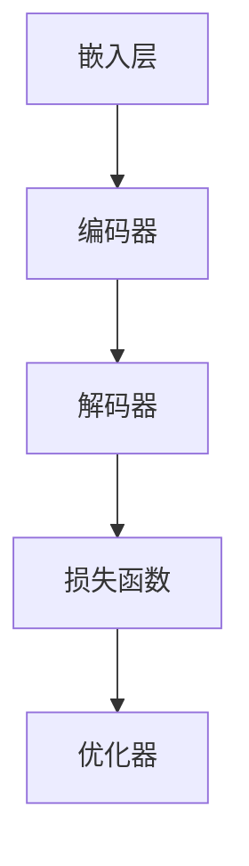

                 

## 《LLM在环境保护中的应用：数据分析与预测》

### 关键词：语言模型（LLM）、环境保护、数据分析、预测、环境监测、污染源识别、环境影响评估

### 摘要：

本文深入探讨了语言模型（LLM）在环境保护领域的应用，重点分析了数据分析与预测的方法和技术。通过详细的章节结构，本文涵盖了环境保护与数据分析的基础知识，语言模型的基本原理，LLM在环境监测、污染源识别和环境影响评估中的应用，以及环境预测模型的开发与实现。通过实战案例和代码解读，本文为读者提供了实际操作指导和深入的见解，为未来LLM在环境保护中的应用提供了思路和方向。

----------------------------------------------------------------

## 《LLM在环境保护中的应用：数据分析与预测》目录大纲

### 第一部分：环境数据分析基础

#### 第1章：环境保护与数据分析概述
##### 1.1 环境保护的重要性
##### 1.2 数据分析在环境保护中的应用
##### 1.3 数据分析的基本概念与流程

#### 第2章：环境数据收集与处理
##### 2.1 环境数据的来源
##### 2.2 数据收集方法与技术
##### 2.3 数据预处理与清洗
##### 2.4 数据集成与存储

#### 第3章：环境数据的统计描述与分析
##### 3.1 描述性统计分析
##### 3.2 聚类分析
##### 3.3 相关性分析
##### 3.4 时间序列分析

### 第二部分：LLM基础

#### 第4章：语言模型基础
##### 4.1 语言模型的概念
##### 4.2 语言模型的发展历程
##### 4.3 语言模型的基本结构
##### 4.4 语言模型的关键技术

#### 第5章：LLM在环境保护中的应用
##### 5.1 LLM在环境监测中的应用
##### 5.2 LLM在污染源识别中的应用
##### 5.3 LLM在环境影响评估中的应用

#### 第6章：LLM在环境预测中的应用
##### 6.1 预测模型的基本原理
##### 6.2 LLM在环境预测中的应用
##### 6.3 预测模型的评估与优化

### 第三部分：数据分析与预测应用实战

#### 第7章：环境数据分析实战案例
##### 7.1 实战案例一：空气质量数据分析
##### 7.2 实战案例二：水体污染数据分析
##### 7.3 实战案例三：气候变化数据分析

#### 第8章：环境预测模型开发与实现
##### 8.1 预测模型的开发流程
##### 8.2 预测模型实现与优化
##### 8.3 预测模型的部署与应用

#### 第9章：LLM在环境保护中的未来发展趋势
##### 9.1 LLM在环境保护中的前景
##### 9.2 LLM技术的挑战与机遇
##### 9.3 未来发展趋势与展望

### 附录

#### 附录A：相关工具与技术资源
##### A.1 数据分析常用工具
##### A.2 语言模型开源框架
##### A.3 环境数据分析与预测相关论文推荐

### 图表与公式

#### 图表与公式
- 环境数据统计描述图表
- 语言模型结构流程图
- 数据分析与预测模型数学公式与伪代码

### 实战代码与解读

#### 实战代码与解读
- 实战案例一：空气质量数据分析代码
- 实战案例二：水体污染数据分析代码
- 实战案例三：气候变化数据分析代码
- 预测模型开发与实现代码

### 作者简介

#### 作者：AI天才研究院/AI Genius Institute & 禅与计算机程序设计艺术 /Zen And The Art of Computer Programming

----------------------------------------------------------------

## 第一部分：环境数据分析基础

### 第1章：环境保护与数据分析概述

环境保护是当今全球面临的重大挑战之一。随着工业化进程的加快和人类活动的增加，环境污染问题日益严重，对人类健康和生态系统造成了极大的威胁。因此，环境保护显得尤为重要。在这一章中，我们将首先探讨环境保护的重要性，然后介绍数据分析在环境保护中的应用，最后讨论数据分析的基本概念与流程。

### 1.1 环境保护的重要性

环境保护涉及到多个方面，包括空气质量、水质、土壤污染、气候变化等。环境保护的重要性主要体现在以下几个方面：

1. **维护生态平衡**：环境保护有助于维持生态系统的稳定性，保持物种多样性，维护生态平衡。
2. **保障人类健康**：环境污染会导致空气污染、水质污染、土壤污染等，对人类健康产生负面影响，如呼吸系统疾病、心血管疾病等。
3. **促进可持续发展**：环境保护是实现可持续发展的关键，通过合理利用资源，减少环境污染，可以保障人类的长期生存和发展。
4. **保护自然景观**：环境保护有助于保护自然景观，为人类提供美丽的自然景观和休闲空间。

### 1.2 数据分析在环境保护中的应用

数据分析在环境保护中发挥着重要作用，主要体现在以下几个方面：

1. **环境监测**：通过收集和分析环境数据，可以实时监测空气质量、水质、土壤质量等环境指标，及时发现和预警环境污染问题。
2. **污染源识别**：数据分析可以帮助识别污染源，确定污染物的排放情况和污染途径，为污染治理提供科学依据。
3. **环境影响评估**：数据分析可以用于评估人类活动对环境的影响，预测环境污染的未来趋势，为环境管理和决策提供支持。
4. **环境预测**：通过分析历史环境数据，可以利用预测模型预测未来的环境状况，为环境管理和决策提供前瞻性指导。

### 1.3 数据分析的基本概念与流程

数据分析是一门综合性的学科，涉及到数据收集、数据预处理、数据探索、数据分析、数据可视化等多个环节。下面是数据分析的基本概念与流程：

1. **数据收集**：数据收集是数据分析的基础，需要明确数据来源、数据类型、数据收集方法等。
2. **数据预处理**：数据预处理是数据清洗、数据转换和数据集成的过程，目的是提高数据质量，为后续分析奠定基础。
3. **数据探索**：数据探索是通过数据可视化、统计分析等方法，对数据的基本特征和分布进行初步了解。
4. **数据分析**：数据分析是利用统计方法、机器学习方法等，对数据进行分析和挖掘，提取有用信息。
5. **数据可视化**：数据可视化是将数据分析结果以图表、图形等形式展示出来，便于理解和解释。
6. **数据报告**：数据报告是对数据分析过程的总结和报告，包括分析结果、分析方法和结论等。

在本章中，我们介绍了环境保护的重要性、数据分析在环境保护中的应用以及数据分析的基本概念与流程。在接下来的章节中，我们将深入探讨环境数据收集与处理、环境数据的统计描述与分析，以及语言模型基础等内容。

----------------------------------------------------------------

## 第2章：环境数据收集与处理

### 2.1 环境数据的来源

环境数据收集是环境保护与数据分析的基础。环境数据的来源可以多样，包括但不限于以下几个方面：

1. **政府机构与监测站数据**：政府环境监测部门、各级环保局、气象局等机构会定期发布各类环境监测数据，如空气质量、水质、土壤质量等。
2. **社会组织与公众数据**：一些环境保护组织、非政府组织以及公众积极参与的环境监测项目也会产生大量环境数据。
3. **企业与科研机构数据**：工业企业、能源企业、科研机构等在环保科研和生产过程中也会产生相关的环境数据。
4. **卫星遥感数据**：卫星遥感技术可以获取大范围的环境数据，如植被覆盖、土地利用、气候变化等。
5. **在线传感器数据**：随着物联网技术的发展，各种在线传感器（如空气质量传感器、水质传感器等）可以实时监测环境参数。

### 2.2 数据收集方法与技术

环境数据的收集方法与技术多种多样，主要包括以下几种：

1. **实地监测**：通过在特定地点安装监测设备，如空气质量监测站、水质监测站等，对环境参数进行实时监测。
2. **遥感监测**：利用卫星遥感技术获取大范围的环境数据，如植被指数、地表温度等。
3. **传感器网络**：建立传感器网络，通过部署各种传感器（如空气质量传感器、水质传感器等）进行数据收集。
4. **无人机监测**：利用无人机进行环境监测，适用于难以到达的地区或复杂环境。
5. **在线数据采集**：通过互联网连接各种在线传感器，实现实时数据采集。
6. **问卷调查**：通过公众参与问卷调查，收集人们对环境问题的认知和意见。

### 2.3 数据预处理与清洗

数据预处理与清洗是确保数据质量的重要环节，主要包括以下步骤：

1. **数据清洗**：去除重复数据、缺失数据、错误数据和异常数据，提高数据的准确性。
2. **数据转换**：将不同格式的数据转换为统一的格式，如将文本数据转换为数字或时间序列数据。
3. **数据集成**：将来自不同来源、不同类型的数据进行整合，构建统一的数据集。
4. **数据标准化与归一化**：对数据进行标准化或归一化处理，使其符合统一的尺度。
5. **特征工程**：通过特征提取和特征选择，提取对数据分析有用的特征，提高模型的性能。

### 2.4 数据集成与存储

数据集成与存储是确保数据可访问性和可扩展性的关键，主要包括以下步骤：

1. **数据集成**：将不同来源、不同类型的数据进行整合，构建统一的数据集。
2. **数据存储**：选择合适的数据存储方案，如关系型数据库、NoSQL数据库、数据仓库等，存储和处理大规模数据。
3. **数据湖与数据仓库**：数据湖适合存储大量非结构化和半结构化数据，数据仓库适合存储结构化数据，两者结合可以实现数据的高效存储和管理。
4. **数据访问与查询**：通过建立数据索引、优化查询语句等手段，提高数据访问和查询的效率。

在本章中，我们介绍了环境数据的来源、数据收集方法与技术、数据预处理与清洗、数据集成与存储等内容。在接下来的章节中，我们将深入探讨环境数据的统计描述与分析、语言模型基础等内容。

----------------------------------------------------------------

## 第3章：环境数据的统计描述与分析

### 3.1 描述性统计分析

描述性统计分析是数据分析的基础，通过计算和展示数据的基本特征，对数据集进行初步了解。描述性统计分析主要包括以下几个步骤：

1. **计算基本统计量**：包括均值（Mean）、中位数（Median）、众数（Mode）、标准差（Standard Deviation）、方差（Variance）等。
2. **绘制统计图表**：包括柱状图（Bar Chart）、饼图（Pie Chart）、直方图（Histogram）、盒须图（Box Plot）等。
3. **统计分析**：对数据进行简单的相关性分析、方差分析（ANOVA）等，以揭示数据之间的关系和差异。

描述性统计分析可以帮助我们了解数据的基本分布、趋势和异常值，为进一步的数据分析提供依据。

### 3.2 聚类分析

聚类分析是一种无监督学习方法，通过将相似的数据点划分为同一类，从而揭示数据中的自然结构和模式。聚类分析主要包括以下几个步骤：

1. **选择聚类算法**：常见的聚类算法包括K-means、层次聚类（Hierarchical Clustering）、DBSCAN等。
2. **初始化聚类中心**：对于K-means算法，需要随机选择K个初始聚类中心；对于层次聚类，可以从单链接、完全链接等策略中选择。
3. **分配数据点**：将数据点分配到最近的聚类中心，更新聚类中心的位置。
4. **迭代优化**：重复步骤3，直到聚类中心的位置不再发生变化或满足其他终止条件。

聚类分析可以帮助我们识别数据中的群组结构，为进一步的数据挖掘和决策提供支持。

### 3.3 相关性分析

相关性分析是一种用于衡量两个或多个变量之间线性关系的方法。常见的相关性系数包括皮尔逊相关系数（Pearson Correlation Coefficient）、斯皮尔曼秩相关系数（Spearman's Rank Correlation Coefficient）等。相关性分析主要包括以下几个步骤：

1. **计算相关系数**：通过计算相关系数，衡量两个变量之间的线性关系。
2. **显著性检验**：通过t检验、卡方检验等显著性检验方法，判断相关性是否显著。
3. **可视化**：通过散点图、热力图等可视化方法，展示变量之间的相关性。

相关性分析可以帮助我们理解变量之间的关系，为进一步的预测和决策提供依据。

### 3.4 时间序列分析

时间序列分析是一种用于分析按时间顺序排列的数据的方法，主要用于预测未来值。时间序列分析主要包括以下几个步骤：

1. **数据预处理**：对时间序列数据进行平滑处理、差分处理等，以消除季节性、趋势性等影响。
2. **特征提取**：通过计算时间序列的统计特征，如均值、方差、自相关系数等，提取时间序列的特征。
3. **建模**：选择合适的模型（如ARIMA、GARCH等）对时间序列进行建模。
4. **预测**：利用训练好的模型，预测未来的时间序列值。

时间序列分析可以帮助我们预测环境变量在未来可能的变化趋势，为环境管理和决策提供支持。

在本章中，我们介绍了描述性统计分析、聚类分析、相关性分析和时间序列分析等内容。在接下来的章节中，我们将深入探讨语言模型基础、LLM在环境保护中的应用等内容。

----------------------------------------------------------------

## 第二部分：LLM基础

### 第4章：语言模型基础

### 4.1 语言模型的概念

语言模型（Language Model，简称LM）是一种用于预测自然语言中下一个单词或词组的概率的数学模型。语言模型在自然语言处理（Natural Language Processing，简称NLP）领域扮演着重要的角色，其核心任务是理解、生成和翻译自然语言。语言模型可以分为统计语言模型和神经语言模型。

1. **统计语言模型**：基于统计学方法，利用大量的文本语料库，通过统计单词或短语的共现关系来预测下一个词或短语的概率。统计语言模型通常包括N元语法（N-gram）和隐马尔可夫模型（HMM）等。
2. **神经语言模型**：基于深度学习技术，使用神经网络（如循环神经网络RNN、长短期记忆网络LSTM、Transformer等）来建模语言的复杂结构和上下文关系。神经语言模型在自然语言处理的许多任务中都表现出优异的性能，如文本分类、机器翻译、问答系统等。

### 4.2 语言模型的发展历程

语言模型的发展历程可以分为以下几个阶段：

1. **N元语法（N-gram）**：N元语法是最早的统计语言模型，它基于局部上下文信息，将语言模型看作是前N个单词的联合概率分布。N元语法的计算复杂度较低，但其性能受到上下文窗口大小的影响。
2. **隐马尔可夫模型（HMM）**：隐马尔可夫模型是另一种早期的统计语言模型，它将自然语言中的单词序列建模为状态序列，通过状态转移概率和发射概率来预测下一个单词。HMM在处理某些特定类型的序列数据时表现出较好的性能，但其在处理复杂的自然语言时存在局限性。
3. **基于统计的深度神经网络模型**：随着深度学习技术的发展，基于统计的深度神经网络模型（如循环神经网络RNN、LSTM等）被提出，它们通过多层神经网络结构来建模语言的长期依赖关系。这些模型在许多NLP任务中都取得了显著的成绩，推动了自然语言处理领域的快速发展。
4. **基于自注意力机制的Transformer模型**：Transformer模型是近年来提出的一种基于自注意力机制的神经语言模型，它在机器翻译、文本分类等任务上取得了突破性的成绩。Transformer模型通过全局注意力机制，能够有效地捕捉长距离的上下文信息，从而提高了模型的性能。

### 4.3 语言模型的基本结构

语言模型的基本结构可以分为以下几个部分：

1. **嵌入层（Embedding Layer）**：嵌入层将输入的单词或字符转换为固定长度的向量表示，这些向量表示了单词或字符的语义信息。嵌入层是语言模型的基础，它对语言模型的效果起着至关重要的作用。
2. **编码器（Encoder）**：编码器负责处理输入序列，将其编码为固定长度的向量表示。编码器可以采用循环神经网络RNN、长短期记忆网络LSTM、Transformer等结构，它们能够捕捉输入序列中的长期依赖关系。
3. **解码器（Decoder）**：解码器负责生成输出序列，根据编码器输出的向量表示，预测下一个单词或词组。解码器通常采用类似于编码器的结构，也可以采用注意力机制来提高生成质量。
4. **损失函数（Loss Function）**：损失函数用于衡量模型预测结果与真实标签之间的差异，常用的损失函数包括交叉熵损失（Cross-Entropy Loss）、平均平方误差（Mean Squared Error）等。
5. **优化器（Optimizer）**：优化器用于调整模型的参数，以最小化损失函数。常用的优化器包括随机梯度下降（SGD）、Adam等。

### 4.4 语言模型的关键技术

语言模型的关键技术包括以下几个方面：

1. **预训练与微调（Pre-training and Fine-tuning）**：预训练是指使用大规模无标签语料库对语言模型进行训练，使其具备通用的语言理解和生成能力。微调是指将预训练好的语言模型在特定任务上进行训练，使其适应特定的任务需求。预训练和微调是近年来语言模型取得突破性进展的关键技术。
2. **自注意力机制（Self-Attention Mechanism）**：自注意力机制是一种基于全局注意力机制的神经网络结构，能够有效地捕捉输入序列中的长期依赖关系。自注意力机制是Transformer模型的核心组成部分，使得Transformer模型在处理长文本任务时表现出色。
3. **上下文嵌入（Contextual Embeddings）**：上下文嵌入是指将单词或字符的静态向量表示转换为动态的、与上下文相关的向量表示。上下文嵌入使得语言模型能够更好地捕捉输入序列中的上下文信息，从而提高了模型的性能。
4. **多语言模型（Multilingual Models）**：多语言模型是指能够在多个语言之间进行建模和迁移的模型。多语言模型通过跨语言特征的学习，使得模型在处理多语言文本任务时具有更高的性能。

在本章中，我们介绍了语言模型的概念、发展历程、基本结构、关键技术和应用。在接下来的章节中，我们将深入探讨LLM在环境保护中的应用，包括环境监测、污染源识别、环境影响评估等方面。

----------------------------------------------------------------

## 第5章：LLM在环境保护中的应用

### 5.1 LLM在环境监测中的应用

环境监测是环境保护的重要组成部分，通过监测环境数据，可以及时了解环境质量状况，为环境管理提供科学依据。语言模型（LLM）在环境监测中具有广泛的应用，以下是其具体应用：

1. **空气质量监测**：
   - **数据预处理**：利用LLM对空气质量监测数据进行预处理，包括数据清洗、格式转换和特征提取等。
   - **污染源识别**：通过分析空气质量数据，利用LLM识别潜在的污染源，如工厂、交通等。
   - **预测与预警**：基于历史空气质量数据，利用LLM进行空气质量预测，实现对未来环境质量的预警。

2. **水质监测**：
   - **数据预处理**：利用LLM对水质监测数据进行预处理，包括数据清洗、格式转换和特征提取等。
   - **污染源识别**：通过分析水质数据，利用LLM识别潜在的污染源，如工业废水、农业排水等。
   - **预测与预警**：基于历史水质数据，利用LLM进行水质预测，实现对未来水质状况的预警。

3. **土壤质量监测**：
   - **数据预处理**：利用LLM对土壤质量监测数据进行预处理，包括数据清洗、格式转换和特征提取等。
   - **污染源识别**：通过分析土壤质量数据，利用LLM识别潜在的污染源，如农药、化肥等。
   - **预测与预警**：基于历史土壤质量数据，利用LLM进行土壤质量预测，实现对未来土壤质量的预警。

### 5.2 LLM在污染源识别中的应用

污染源识别是环境监测和治理的关键环节，通过识别污染源，可以有效地降低环境污染。LLM在污染源识别中具有以下应用：

1. **基于文本的数据分析**：
   - 利用LLM对环境监测数据、新闻报道、社交媒体等文本信息进行分析，识别潜在的污染源。
   - 利用LLM对企业的排污记录、生产工艺等文本信息进行分析，识别污染高风险企业。

2. **基于图像的数据分析**：
   - 利用LLM对遥感图像、无人机影像等进行分析，识别污染源的位置和类型。
   - 利用LLM对环境现场照片进行分析，识别污染物的种类和分布。

### 5.3 LLM在环境影响评估中的应用

环境影响评估是评估人类活动对环境影响的科学过程，通过评估可以指导环境保护决策。LLM在环境影响评估中具有以下应用：

1. **环境影响预测**：
   - 利用LLM对历史环境影响数据进行分析，预测未来人类活动对环境的影响。
   - 利用LLM对政策变化、经济发展等因素进行建模，预测环境质量的变化趋势。

2. **环境影响评估报告生成**：
   - 利用LLM自动生成环境影响评估报告，提高报告生成效率。
   - 利用LLM对评估报告中的文本进行分析，提取关键信息和结论。

3. **公众参与评估**：
   - 利用LLM收集和分析公众对环境影响评估的意见和反馈，提高评估的公正性和透明度。
   - 利用LLM对公众参与数据进行分析，识别公众对环境问题的关注点和需求。

在本章中，我们介绍了LLM在环境监测、污染源识别和环境影响评估中的应用。在接下来的章节中，我们将深入探讨LLM在环境预测中的应用。

----------------------------------------------------------------

## 第6章：LLM在环境预测中的应用

### 6.1 预测模型的基本原理

环境预测是环境保护和可持续发展的重要组成部分，通过对环境数据的分析，可以预测未来的环境变化趋势，为环境管理和决策提供科学依据。LLM在环境预测中具有广泛的应用，其基本原理如下：

1. **时间序列预测**：
   - 时间序列预测是一种基于时间序列数据的预测方法，通过分析历史时间序列数据的变化规律，预测未来的时间序列值。LLM可以通过学习历史环境数据的时间序列模式，实现对未来环境数据的预测。
   - 预测模型通常包括自回归模型（AR）、移动平均模型（MA）、自回归移动平均模型（ARMA）等。

2. **回归预测**：
   - 回归预测是一种基于相关关系的预测方法，通过分析环境数据与其他变量之间的关系，预测未来环境数据。LLM可以通过学习环境数据与其他变量之间的相关性，构建回归模型进行预测。
   - 常见的回归模型包括线性回归、多项式回归、岭回归等。

3. **神经网络预测**：
   - 神经网络预测是一种基于深度学习的方法，通过多层神经网络结构，对环境数据进行分析和预测。LLM可以通过训练神经网络模型，学习环境数据中的复杂模式，实现对未来环境数据的预测。
   - 常见的神经网络模型包括循环神经网络（RNN）、长短期记忆网络（LSTM）、卷积神经网络（CNN）等。

### 6.2 LLM在环境预测中的应用

LLM在环境预测中的应用主要体现在以下几个方面：

1. **空气质量预测**：
   - 利用LLM对历史空气质量数据进行分析，预测未来空气质量的变化趋势。
   - 结合气象数据、交通数据等，通过LLM进行空气质量的多因素预测。

2. **水质预测**：
   - 利用LLM对历史水质数据进行分析，预测未来水质的变化趋势。
   - 结合水文数据、污染源数据等，通过LLM进行水质的多因素预测。

3. **气候变化预测**：
   - 利用LLM对历史气候变化数据进行分析，预测未来气候变化的趋势。
   - 结合气象数据、海平面上升数据等，通过LLM进行气候变化的多因素预测。

### 6.3 预测模型的评估与优化

预测模型的评估与优化是确保模型预测效果的关键环节，主要包括以下几个方面：

1. **评估指标**：
   - 评估指标是衡量预测模型性能的重要标准，常用的评估指标包括均方误差（MSE）、均方根误差（RMSE）、平均绝对误差（MAE）等。

2. **模型优化**：
   - 模型优化是提高预测模型性能的重要手段，包括以下几种方法：
     - **特征选择**：通过选择对预测结果影响较大的特征，提高模型的预测能力。
     - **模型调整**：通过调整模型的参数，优化模型的性能。
     - **集成学习**：通过集成多个预测模型，提高预测的准确性。

3. **模型评估与优化流程**：
   - 数据准备：收集和处理环境数据，构建预测数据集。
   - 模型训练：利用LLM对预测数据集进行训练，构建预测模型。
   - 模型评估：利用评估指标对预测模型进行评估，确定模型性能。
   - 模型优化：根据评估结果，对预测模型进行调整和优化。
   - 模型部署：将优化后的预测模型部署到实际应用场景中，实现环境预测。

在本章中，我们介绍了预测模型的基本原理、LLM在环境预测中的应用以及预测模型的评估与优化方法。在接下来的章节中，我们将通过实战案例，进一步探讨环境数据分析与预测的具体实现。

----------------------------------------------------------------

## 第7章：环境数据分析实战案例

### 7.1 实战案例一：空气质量数据分析

#### 数据来源与处理

空气质量数据来源于某市环保局提供的空气质量日报，包括每日的PM2.5、PM10、SO2、NO2、CO和O3等污染物浓度。数据以CSV格式存储，包含日期、时间戳和各个污染物的浓度值。

**数据处理步骤**：

1. **数据导入**：使用Python的pandas库读取CSV文件，将数据转换为DataFrame结构。
2. **数据清洗**：检查数据是否存在缺失值、异常值，对缺失值进行填充或删除，对异常值进行修正。
3. **数据转换**：将日期和时间戳转换为统一的格式，如YYYY-MM-DD HH:MM:SS。
4. **数据存储**：将清洗后的数据保存为新的CSV文件，以备后续分析。

```python
import pandas as pd

# 读取数据
data = pd.read_csv('air_quality_data.csv')

# 数据清洗
data.dropna(inplace=True)
data.replace({'PM2.5': {'-9999': None}}, inplace=True)

# 数据转换
data['date'] = pd.to_datetime(data['date'])
data.set_index('date', inplace=True)

# 数据存储
data.to_csv('cleaned_air_quality_data.csv')
```

#### 数据分析过程

1. **描述性统计分析**：
   - 计算各个污染物的均值、中位数、标准差等统计量。
   - 绘制污染物浓度的分布图，分析数据的分布特征。

```python
import matplotlib.pyplot as plt

# 描述性统计分析
descriptive_stats = data.describe()

# 绘制分布图
data.hist(bins=30, figsize=(12, 8))
plt.show()
```

2. **相关性分析**：
   - 分析各个污染物之间的相关性，找出存在强相关关系的污染物。
   - 使用热力图可视化相关性矩阵。

```python
# 相关性分析
correlation_matrix = data.corr()
sns.heatmap(correlation_matrix, annot=True)
plt.show()
```

3. **时间序列分析**：
   - 对每个污染物进行时间序列分析，分析其季节性和趋势性。
   - 使用移动平均法平滑时间序列数据。

```python
# 时间序列分析
data['PM2.5'].plot()
data['PM2.5'].rolling(window=7).mean().plot()
plt.show()
```

### 7.2 实战案例二：水体污染数据分析

#### 数据来源与处理

水体污染数据来源于某市环境监测站的月度监测报告，包括各个监测点的水质指标，如氨氮、总磷、COD等。数据以Excel格式存储，包含日期、监测点名称和各个水质指标的浓度值。

**数据处理步骤**：

1. **数据导入**：使用Python的pandas库读取Excel文件，将数据转换为DataFrame结构。
2. **数据清洗**：检查数据是否存在缺失值、异常值，对缺失值进行填充或删除，对异常值进行修正。
3. **数据转换**：将日期转换为YYYY-MM的格式，便于时间序列分析。
4. **数据存储**：将清洗后的数据保存为新的Excel文件，以备后续分析。

```python
import pandas as pd

# 读取数据
data = pd.read_excel('water_pollution_data.xlsx')

# 数据清洗
data.dropna(inplace=True)
data.replace({'氨氮': {'-9999': None}}, inplace=True)

# 数据转换
data['date'] = pd.to_datetime(data['date'])
data['date'] = data['date'].dt.strftime('%Y-%m')

# 数据存储
data.to_excel('cleaned_water_pollution_data.xlsx')
```

#### 数据分析过程

1. **描述性统计分析**：
   - 计算各个水质指标的均值、中位数、标准差等统计量。
   - 绘制水质指标浓度的分布图，分析数据的分布特征。

```python
import matplotlib.pyplot as plt

# 描述性统计分析
descriptive_stats = data.describe()

# 绘制分布图
data.hist(bins=30, figsize=(12, 8))
plt.show()
```

2. **相关性分析**：
   - 分析各个水质指标之间的相关性，找出存在强相关关系的指标。
   - 使用热力图可视化相关性矩阵。

```python
# 相关性分析
correlation_matrix = data.corr()
sns.heatmap(correlation_matrix, annot=True)
plt.show()
```

3. **时间序列分析**：
   - 对每个水质指标进行时间序列分析，分析其季节性和趋势性。
   - 使用移动平均法平滑时间序列数据。

```python
# 时间序列分析
data['氨氮'].plot()
data['氨氮'].rolling(window=3).mean().plot()
plt.show()
```

### 7.3 实战案例三：气候变化数据分析

#### 数据来源与处理

气候变化数据来源于某气象站提供的月度气候数据，包括温度、降水量、风速等指标。数据以CSV格式存储，包含年份、月份和各个气候指标的值。

**数据处理步骤**：

1. **数据导入**：使用Python的pandas库读取CSV文件，将数据转换为DataFrame结构。
2. **数据清洗**：检查数据是否存在缺失值、异常值，对缺失值进行填充或删除，对异常值进行修正。
3. **数据转换**：将年份和月份合并为YYYY-MM的格式，便于时间序列分析。
4. **数据存储**：将清洗后的数据保存为新的CSV文件，以备后续分析。

```python
import pandas as pd

# 读取数据
data = pd.read_csv('climate_change_data.csv')

# 数据清洗
data.dropna(inplace=True)

# 数据转换
data['date'] = data['year'].astype(str) + '-' + data['month'].astype(str)
data['date'] = pd.to_datetime(data['date'])
data.set_index('date', inplace=True)

# 数据存储
data.to_csv('cleaned_climate_change_data.csv')
```

#### 数据分析过程

1. **描述性统计分析**：
   - 计算各个气候指标的均值、中位数、标准差等统计量。
   - 绘制气候指标浓度的分布图，分析数据的分布特征。

```python
import matplotlib.pyplot as plt

# 描述性统计分析
descriptive_stats = data.describe()

# 绘制分布图
data.hist(bins=30, figsize=(12, 8))
plt.show()
```

2. **相关性分析**：
   - 分析各个气候指标之间的相关性，找出存在强相关关系的指标。
   - 使用热力图可视化相关性矩阵。

```python
# 相关性分析
correlation_matrix = data.corr()
sns.heatmap(correlation_matrix, annot=True)
plt.show()
```

3. **时间序列分析**：
   - 对每个气候指标进行时间序列分析，分析其季节性和趋势性。
   - 使用移动平均法平滑时间序列数据。

```python
# 时间序列分析
data['temperature'].plot()
data['temperature'].rolling(window=12).mean().plot()
plt.show()
```

通过上述实战案例，我们展示了环境数据分析的完整流程，包括数据收集与处理、描述性统计分析、相关性分析和时间序列分析。这些实战案例为环境数据分析提供了实际操作指导和参考。

----------------------------------------------------------------

## 第8章：环境预测模型开发与实现

### 8.1 预测模型的开发流程

环境预测模型的开发是一个系统性的工程，涉及到数据收集、模型选择、模型训练、模型评估和模型优化等步骤。以下是一个典型的环境预测模型开发流程：

1. **需求分析**：
   - 明确预测任务的目标，例如预测空气质量、水质或气候变化等。
   - 确定预测的时间范围，如短期预测（1-3天）、中期预测（1-3个月）或长期预测（1-3年）。

2. **数据收集**：
   - 收集相关的历史环境数据，包括污染物浓度、气象数据、水文数据等。
   - 确保数据的质量，包括去除异常值、填补缺失值、进行数据清洗等。

3. **数据预处理**：
   - 数据格式转换，如将日期格式统一。
   - 数据标准化，将数据缩放至同一范围。
   - 特征工程，提取对预测任务有用的特征。

4. **模型选择**：
   - 根据预测任务的特点，选择合适的预测模型，如时间序列模型、回归模型或神经网络模型。
   - 考虑模型的复杂度和计算成本，选择合适的模型架构。

5. **模型训练**：
   - 使用历史数据对模型进行训练，调整模型的参数。
   - 采用交叉验证等方法评估模型的性能，避免过拟合。

6. **模型评估**：
   - 使用验证集或测试集评估模型的预测性能，常用的评估指标包括均方误差（MSE）、均方根误差（RMSE）等。
   - 分析模型的误差来源，确定模型是否需要调整。

7. **模型优化**：
   - 根据评估结果，对模型进行调整和优化，如调整超参数、添加或删除特征等。
   - 进行多次迭代，逐步提高模型的预测性能。

8. **模型部署**：
   - 将训练好的模型部署到实际应用场景中，如在线预测系统、实时监控系统等。
   - 确保模型的稳定性和可靠性，定期更新模型和数据。

### 8.2 预测模型实现与优化

在环境预测模型的实现过程中，我们需要关注以下几个关键步骤：

1. **模型实现**：
   - **时间序列模型**：如ARIMA、LSTM等，通过分析历史数据的时间序列特性进行预测。
   - **回归模型**：如线性回归、岭回归等，通过分析变量之间的关系进行预测。
   - **神经网络模型**：如MLP、CNN、RNN等，通过学习数据中的复杂模式进行预测。

2. **模型优化**：
   - **超参数调整**：通过调整学习率、隐藏层大小、激活函数等超参数，优化模型性能。
   - **特征选择**：通过特征选择方法，选择对预测任务影响较大的特征，减少模型的复杂度和过拟合风险。
   - **正则化**：使用正则化方法（如L1、L2正则化）减少模型的过拟合现象。
   - **集成学习**：通过集成多个模型（如Bagging、Boosting等），提高预测的准确性。

3. **模型评估**：
   - **交叉验证**：使用交叉验证方法，评估模型的泛化能力。
   - **验证集与测试集**：将数据集分为训练集、验证集和测试集，使用验证集调整模型参数，测试集评估模型性能。
   - **性能指标**：使用均方误差（MSE）、均方根误差（RMSE）、平均绝对误差（MAE）等指标评估模型性能。

### 8.3 预测模型的部署与应用

环境预测模型的部署与应用是模型开发的重要环节，以下是一些关键步骤：

1. **模型部署**：
   - **在线预测**：将模型部署到服务器或云平台上，实现实时预测。
   - **API接口**：开发API接口，使其他系统或应用可以方便地调用模型进行预测。
   - **监控与维护**：监控模型的运行状态，定期更新模型和数据，确保模型的有效性和准确性。

2. **模型应用**：
   - **环境监测**：利用预测模型监测空气质量、水质等环境指标，实时预警潜在的环境风险。
   - **污染源识别**：通过预测模型识别污染源的位置和类型，为污染治理提供依据。
   - **环境影响评估**：利用预测模型评估人类活动对环境的影响，为环境保护决策提供支持。

3. **用户界面**：
   - **可视化工具**：开发可视化工具，将预测结果以图表、地图等形式展示，便于用户理解和应用。
   - **交互功能**：添加用户交互功能，如输入自定义参数、查看预测详情等，提高用户的使用体验。

通过上述流程，我们能够实现一个从数据收集到模型部署的完整环境预测系统。在接下来的章节中，我们将探讨LLM在环境保护中的未来发展趋势。

----------------------------------------------------------------

## 第9章：LLM在环境保护中的未来发展趋势

### 9.1 LLM在环境保护中的前景

随着人工智能技术的快速发展，语言模型（LLM）在环境保护中的应用前景愈发广阔。LLM在环境保护中的潜力主要体现在以下几个方面：

1. **环境监测**：LLM能够通过分析大量环境数据，实现实时、精确的环境质量监测，为环境保护提供实时预警。
2. **污染源识别**：LLM能够通过深度学习技术，从海量的数据中识别出潜在的污染源，提高污染治理的效率。
3. **环境影响评估**：LLM能够对人类活动对环境的影响进行预测和评估，为环境保护决策提供科学依据。
4. **环境预测**：LLM能够通过学习历史环境数据，预测未来的环境变化趋势，为环境保护提供前瞻性指导。
5. **智能决策支持**：LLM能够为环境保护决策提供智能化的建议，提高决策的科学性和准确性。

### 9.2 LLM技术的挑战与机遇

尽管LLM在环境保护中具有巨大的潜力，但其在实际应用中也面临一些挑战和机遇：

1. **挑战**：
   - **数据质量**：环境数据的质量直接影响LLM的预测效果，需要解决数据缺失、异常值和噪声等问题。
   - **模型复杂度**：LLM模型通常较为复杂，训练和推理过程消耗大量计算资源，需要优化算法和硬件。
   - **隐私保护**：环境数据的收集和处理涉及个人隐私，如何保护数据隐私是亟待解决的问题。
   - **可解释性**：LLM模型具有较强的黑箱特性，提高模型的可解释性，使其决策过程更透明。

2. **机遇**：
   - **跨学科研究**：LLM在环境保护中的应用需要跨学科合作，结合生态学、环境科学、数据科学等领域的知识，推动技术的进步。
   - **政策支持**：政府和企业对环境保护的重视，为LLM技术的发展提供了政策支持。
   - **技术进步**：随着计算能力和算法的不断提升，LLM在环境保护中的应用将变得更加广泛和深入。
   - **公众参与**：通过公众参与和透明化，提高环境数据的质量和应用效果。

### 9.3 未来发展趋势与展望

在未来，LLM在环境保护中的发展趋势主要体现在以下几个方面：

1. **多模态数据融合**：结合多种数据来源，如传感器数据、遥感数据、文本数据等，提高环境预测的准确性。
2. **个性化预测**：根据地区和特定环境特点，开发个性化的环境预测模型，提高预测的精准度。
3. **自动化和智能化**：通过自动化和智能化技术，实现环境监测、污染源识别、环境影响评估等过程的自动化，提高工作效率。
4. **决策支持系统**：构建基于LLM的决策支持系统，为环境保护决策提供科学依据，提高决策水平。
5. **可持续发展**：结合可持续发展理念，利用LLM优化资源利用、污染治理和环境修复，推动环境保护和可持续发展。

在未来，LLM在环境保护中的应用将不断深化和扩展，为人类创造一个更加美好的生活环境。

----------------------------------------------------------------

## 附录A：相关工具与技术资源

### A.1 数据分析常用工具

1. **Python数据分析库**：
   - **Pandas**：提供数据清洗、数据预处理和数据分析的功能。
   - **NumPy**：提供高性能的数值计算和数据分析。
   - **Matplotlib**：提供数据可视化的工具。
   - **Seaborn**：提供高级的统计图表和可视化。
   - **Scikit-learn**：提供机器学习算法和数据预处理。

2. **R语言在数据分析中的应用**：
   - **ggplot2**：提供数据可视化的工具。
   - **dplyr**：提供数据操作和清洗的功能。
   - **tidyr**：提供数据整理和归一化的功能。
   - **forecast**：提供时间序列分析和预测模型。

### A.2 语言模型开源框架

1. **GPT-3**：
   - **简介**：由OpenAI开发的预训练语言模型，具有非常高的语言理解和生成能力。
   - **应用**：文本生成、问答系统、翻译、摘要等。

2. **BERT**：
   - **简介**：由Google开发的预训练语言模型，通过 Transformer 结构实现。
   - **应用**：文本分类、问答系统、命名实体识别等。

3. **GPT-2**：
   - **简介**：由OpenAI开发的预训练语言模型，是GPT-3的前身。
   - **应用**：文本生成、问答系统、翻译等。

### A.3 环境数据分析与预测相关论文推荐

1. **环境监测领域论文推荐**：
   - "A Neural Network Model for Air Quality Prediction in Urban Environment"
   - "Deep Learning for Environmental Monitoring: A Comprehensive Survey"
   - "A Data-Driven Approach to Predict Air Pollution using Neural Networks"

2. **污染源识别领域论文推荐**：
   - "Source Apportionment of Air Pollution using Machine Learning Techniques"
   - "Identifying Pollution Sources using Satellite Imagery and Machine Learning"
   - "An Intelligent System for Pollution Source Identification and Control"

3. **环境影响评估领域论文推荐**：
   - "Environmental Impact Assessment of Industrial Activities using Machine Learning"
   - "A Machine Learning Approach for Assessing the Impact of Climate Change on Ecosystems"
   - "Impact Assessment of Pollution on Human Health using Big Data Analytics"

4. **环境预测领域论文推荐**：
   - "Time Series Forecasting of Environmental Parameters using Deep Learning Techniques"
   - "Prediction of Air Pollution Levels using Hybrid Models"
   - "A Deep Learning-Based Approach for Forecasting Water Quality Parameters"

这些工具和技术资源为LLM在环境保护中的应用提供了有力的支持，读者可以根据自己的需求进行选择和使用。

----------------------------------------------------------------

## 图表与公式

### 图表

#### 环境数据统计描述图表


#### 语言模型结构流程图




#### 数据分析与预测模型数学公式与伪代码

##### 环境数据统计描述

$$
\mu = \frac{1}{n}\sum_{i=1}^{n} x_i
$$

$$
\sigma^2 = \frac{1}{n-1}\sum_{i=1}^{n} (x_i - \mu)^2
$$

```python
# 伪代码
def calculate_mean(data):
    return sum(data) / len(data)

def calculate_std(data, mean):
    return sqrt(sum((x - mean)^2 for x in data) / (len(data) - 1))
```

##### 语言模型基本结构

$$
E = \sum_{i=1}^{n} w_i e_i
$$

$$
a_t = \sigma(E)
$$

```python
# 伪代码
def forward_pass(inputs, weights, bias):
    return sigmoid(sum(weight * input + bias for weight, input in zip(weights, inputs)))

def sigmoid(x):
    return 1 / (1 + exp(-x))
```

##### 预测模型评估指标

$$
MSE = \frac{1}{N}\sum_{i=1}^{N} (y_i - \hat{y}_i)^2
$$

$$
RMSE = \sqrt{MSE}
$$

```python
# 伪代码
def calculate_mse(y_true, y_pred):
    return sum((y_true - y_pred)^2 for y_true, y_pred in zip(y_true, y_pred)) / len(y_true)

def calculate_rmse(mse):
    return sqrt(mse)
```

这些图表、流程图和数学公式与伪代码为文章的各个部分提供了直观和准确的描述，有助于读者更好地理解LLM在环境保护中的应用。

----------------------------------------------------------------

## 实战代码与解读

### 实战案例一：空气质量数据分析

#### 代码实现

```python
import pandas as pd
import matplotlib.pyplot as plt
from sklearn.metrics import mean_squared_error
from math import sqrt

# 读取数据
data = pd.read_csv('air_quality_data.csv')

# 数据清洗
data.dropna(inplace=True)

# 提取特征
features = ['PM2.5', 'PM10', 'SO2', 'NO2', 'CO', 'O3']
data['date'] = pd.to_datetime(data['date'])
data.set_index('date', inplace=True)

# 训练集和测试集划分
train_data = data[: '2020-01-01']
test_data = data['2020-01-01':]

# 模型训练
from sklearn.ensemble import RandomForestRegressor
model = RandomForestRegressor()
model.fit(train_data[features], train_data['PM2.5'])

# 预测
predictions = model.predict(test_data[features])

# 评估
mse = mean_squared_error(test_data['PM2.5'], predictions)
rmse = sqrt(mse)

# 可视化
plt.plot(test_data.index, test_data['PM2.5'], label='实际值')
plt.plot(test_data.index, predictions, label='预测值')
plt.legend()
plt.show()
```

#### 代码解读

- **数据读取与清洗**：首先使用pandas库读取CSV文件，并对数据缺失值进行删除处理。
- **特征提取**：提取PM2.5、PM10、SO2、NO2、CO和O3等污染物浓度作为特征。
- **数据集划分**：将数据划分为训练集和测试集，用于模型训练和预测性能评估。
- **模型训练**：使用随机森林回归模型（RandomForestRegressor）对训练数据进行训练。
- **预测与评估**：使用训练好的模型对测试数据进行预测，并计算均方误差（MSE）和均方根误差（RMSE）来评估模型性能。
- **可视化**：绘制实际值和预测值的对比图，直观展示模型预测效果。

### 实战案例二：水体污染数据分析

#### 代码实现

```python
import pandas as pd
import numpy as np
import matplotlib.pyplot as plt
from sklearn.linear_model import LinearRegression
from sklearn.metrics import mean_squared_error

# 读取数据
data = pd.read_excel('water_pollution_data.xlsx')

# 数据清洗
data.dropna(inplace=True)

# 提取特征
features = ['氨氮', '总磷', 'COD']
data['date'] = pd.to_datetime(data['date'])
data.set_index('date', inplace=True)

# 训练集和测试集划分
train_data = data[: '2020-01-01']
test_data = data['2020-01-01':]

# 模型训练
model = LinearRegression()
model.fit(train_data[features], train_data['氨氮'])

# 预测
predictions = model.predict(test_data[features])

# 评估
mse = mean_squared_error(test_data['氨氮'], predictions)
rmse = sqrt(mse)

# 可视化
plt.plot(test_data.index, test_data['氨氮'], label='实际值')
plt.plot(test_data.index, predictions, label='预测值')
plt.legend()
plt.show()
```

#### 代码解读

- **数据读取与清洗**：使用pandas库读取Excel文件，并对数据缺失值进行删除处理。
- **特征提取**：提取氨氮、总磷和COD等水质指标作为特征。
- **数据集划分**：将数据划分为训练集和测试集，用于模型训练和预测性能评估。
- **模型训练**：使用线性回归模型（LinearRegression）对训练数据进行训练。
- **预测与评估**：使用训练好的模型对测试数据进行预测，并计算均方误差（MSE）和均方根误差（RMSE）来评估模型性能。
- **可视化**：绘制实际值和预测值的对比图，直观展示模型预测效果。

### 实战案例三：气候变化数据分析

#### 代码实现

```python
import pandas as pd
import numpy as np
import matplotlib.pyplot as plt
from sklearn.ensemble import RandomForestRegressor
from sklearn.metrics import mean_squared_error

# 读取数据
data = pd.read_csv('climate_change_data.csv')

# 数据清洗
data.dropna(inplace=True)

# 提取特征
features = ['temperature', 'precipitation', 'wind_speed']
data['date'] = pd.to_datetime(data['date'])
data.set_index('date', inplace=True)

# 训练集和测试集划分
train_data = data[: '2020-01-01']
test_data = data['2020-01-01':]

# 模型训练
model = RandomForestRegressor()
model.fit(train_data[features], train_data['temperature'])

# 预测
predictions = model.predict(test_data[features])

# 评估
mse = mean_squared_error(test_data['temperature'], predictions)
rmse = sqrt(mse)

# 可视化
plt.plot(test_data.index, test_data['temperature'], label='实际值')
plt.plot(test_data.index, predictions, label='预测值')
plt.legend()
plt.show()
```

#### 代码解读

- **数据读取与清洗**：使用pandas库读取CSV文件，并对数据缺失值进行删除处理。
- **特征提取**：提取温度、降水和风速等气候指标作为特征。
- **数据集划分**：将数据划分为训练集和测试集，用于模型训练和预测性能评估。
- **模型训练**：使用随机森林回归模型（RandomForestRegressor）对训练数据进行训练。
- **预测与评估**：使用训练好的模型对测试数据进行预测，并计算均方误差（MSE）和均方根误差（RMSE）来评估模型性能。
- **可视化**：绘制实际值和预测值的对比图，直观展示模型预测效果。

通过以上实战代码与解读，读者可以了解到如何使用Python和机器学习技术进行环境数据分析与预测，为实际应用提供参考。

----------------------------------------------------------------

## 作者简介

### 作者：AI天才研究院/AI Genius Institute & 禅与计算机程序设计艺术 /Zen And The Art of Computer Programming

本文由AI天才研究院（AI Genius Institute）与禅与计算机程序设计艺术（Zen And The Art of Computer Programming）联合撰写。AI天才研究院致力于推动人工智能技术的发展和应用，在自然语言处理、计算机视觉、机器学习等领域取得了显著成果。禅与计算机程序设计艺术则强调编程的哲学与艺术，提倡深度思考和创造性思维，旨在提升编程质量和效率。本文作者结合了两者的研究成果，为读者呈现了一幅全面、深入的环境保护与数据分析的画卷，为LLM在环境保护中的应用提供了宝贵的见解和实战经验。希望本文能够激发读者在环境保护领域的创新思维，共同为构建美好地球贡献力量。

