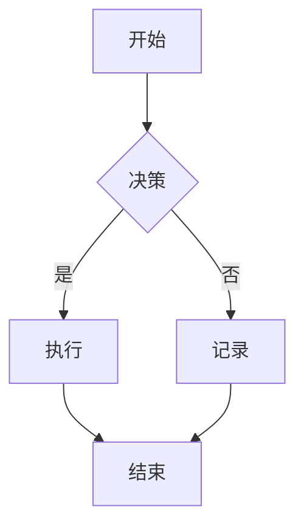

                 

### 第一步：文章标题和关键词

**文章标题：LLM生态系统：从0到1的蓬勃发展**

**关键词：语言学习模型（LLM）、自然语言处理（NLP）、神经网络、预训练模型、应用案例**

<|assistant|>### 第二步：文章摘要

本文将深入探讨语言学习模型（LLM）生态系统的构建与发展。首先，我们将介绍LLM的基础理论，包括其概念、分类、工作原理以及数学基础。接着，我们将分析基于神经网络的LLM，重点讨论Transformer模型和GPT系列模型。随后，文章将解析LLM在实际应用中的案例，如问答系统、文本生成和文本翻译。此外，文章还将探讨LLM在工业界、商业和教育领域的应用，并展望其未来发展。最后，文章将提供LLM实践指南和开发资源，以帮助读者掌握LLM的使用方法。

<|assistant|>### 第一部分：LLM生态系统基础理论

#### 第1章：LLM概述

##### 1.1 LLM的概念与分类

**1.1.1 什么是LLM**

LLM（Language Learning Model，语言学习模型）是一种通过学习大量文本数据来预测和生成文本的模型。它具备强大的文本理解和生成能力，可以应用于多种自然语言处理（NLP）任务，如问答、文本摘要、对话生成和文本翻译。

**1.1.2 LLM的分类**

- **基于规则的LLM**：这类模型使用预定义的语法和语义规则来生成文本。
- **基于统计的LLM**：这类模型通过统计文本数据中的词汇分布来预测文本生成。
- **基于神经网络的LLM**：这类模型使用神经网络结构，特别是深度学习技术来处理文本数据。
- **大型预训练LLM**：这类模型通过在大量无标注数据上预训练，然后微调到特定任务上，具有更高的性能。

##### 1.2 LLM的工作原理

**1.2.1 语言模型的基本原理**

语言模型的核心任务是预测下一个词的概率。这通常通过构建一个概率分布来实现，该概率分布反映了模型对句子中每个词的概率估计。常见的语言模型有：

- **n-gram模型**：基于前n个词的统计来预测下一个词。
- **神经网络语言模型**：使用神经网络来学习文本数据的内在规律。

**1.2.2 LLM的训练与优化**

LLM的训练通常包括以下步骤：

- **预训练**：在大量无标注的文本数据上训练模型，使模型能够捕捉到语言的内在规律。
- **微调**：在特定任务的数据集上进一步训练模型，使其能够适应具体的应用场景。

##### 1.3 LLM在NLP中的应用

**1.3.1 文本分类**

文本分类是将文本数据归类到预定义的类别中。LLM通过学习大量标记的文本数据，可以准确地对新文本进行分类。

**1.3.2 文本生成**

文本生成是LLM最著名的应用之一，包括问答系统、对话生成、文本摘要等。LLM能够生成连贯、有意义的文本，从而提高NLP的应用价值。

**1.3.3 文本翻译**

文本翻译是将一种语言的文本转换为另一种语言。LLM通过学习双语文本数据，可以实现高效、准确的文本翻译。

##### 1.4 LLM的发展历史

LLM的发展经历了几个重要阶段：

- **早期研究**：20世纪50年代到70年代，基于规则的NLP系统开始出现。
- **统计模型兴起**：20世纪80年代，统计模型如n-gram模型和决策树被广泛应用。
- **深度学习浪潮**：21世纪初，神经网络在NLP中的应用逐渐增多，特别是2018年GPT的出现标志着大型预训练模型的崛起。

#### 第2章：语言模型的数学基础

##### 2.1 概率论基础

**2.1.1 概率分布**

概率分布是描述随机变量可能取值的概率集合。在LLM中，概率分布用于预测文本中每个词的出现概率。

$$
P(w) = \frac{f(w)}{f(w_1) + f(w_2) + \ldots + f(w_n)}
$$

其中，$P(w)$是词$w$出现的概率，$f(w)$是词$w$在文本中出现的频率。

**2.1.2 条件概率与贝叶斯定理**

条件概率描述了在已知某个事件发生的条件下，另一个事件发生的概率。贝叶斯定理是一种基于条件概率进行推理的方法。

$$
P(A|B) = \frac{P(B|A)P(A)}{P(B)}
$$

##### 2.2 隐马尔可夫模型（HMM）

隐马尔可夫模型（HMM）是一种用于处理序列数据的统计模型，可以用于文本序列的生成和分类。

**2.2.1 状态转移概率**

状态转移概率描述了在给定当前状态下，下一个状态的概率分布。

$$
P(s_t|s_{t-1}) = \frac{p(s_t|s_{t-1})}{\sum_{s'} p(s_t|s_{t-1})}
$$

**2.2.2 观测概率**

观测概率描述了在给定状态下，观测到的符号的概率分布。

$$
P(o_t|s_t) = \frac{p(o_t|s_t)}{\sum_{o'} p(o_t|s_t)}
$$

##### 2.3 HMM的应用

HMM在文本生成和分类中有着广泛的应用，例如语音识别、手写识别、文本分类等。

**2.3.1 文本生成**

使用HMM生成文本的基本思想是，首先通过训练得到状态转移概率矩阵和观测概率矩阵，然后根据初始状态和终止状态，通过状态转移概率和观测概率生成文本序列。

**2.3.2 文本分类**

使用HMM进行文本分类的基本思想是，将文本表示为状态序列，然后使用HMM对文本进行建模，最后通过计算文本属于各个类别的概率，选择概率最大的类别作为分类结果。

#### 第3章：基于神经网络的LLM

##### 3.1 神经网络基础

**3.1.1 神经网络的基本结构**

神经网络由多层神经元组成，包括输入层、隐藏层和输出层。每层神经元之间通过加权连接相连，通过反向传播算法进行训练。

**3.1.2 激活函数**

激活函数用于确定神经元是否被激活，常用的激活函数包括ReLU、Sigmoid和Tanh。

##### 3.2 循环神经网络（RNN）

**3.2.1 RNN的基本原理**

循环神经网络（RNN）是一种能够处理序列数据的神经网络，其基本原理是保留状态信息，使得网络能够记住之前的信息。

**3.2.2 LSTM和GRU**

LSTM（长短期记忆网络）和GRU（门控循环单元）是RNN的变体，它们通过引入门控机制，解决了RNN在处理长序列数据时的梯度消失和梯度爆炸问题。

##### 3.3 自注意力机制（Self-Attention）

**3.3.1 自注意力机制的基本原理**

自注意力机制是一种用于处理序列数据的注意力机制，它通过计算序列中每个元素之间的相似度，为每个元素分配权重。

**3.3.2 Transformer模型**

Transformer模型是一种基于自注意力机制的神经网络模型，它在NLP任务中取得了显著的成绩，如机器翻译、文本生成等。

**3.3.3 GPT系列模型**

GPT系列模型是基于Transformer模型的预训练模型，包括GPT、GPT-2和GPT-3等。GPT系列模型在文本生成、问答等任务中表现出色。

##### 3.4 LLM的优缺点

**3.4.1 优点**

- 强大的文本理解与生成能力
- 能够处理长序列数据
- 适用于多种NLP任务

**3.4.2 缺点**

- 计算资源消耗较大
- 对训练数据量要求较高
- 难以解释模型决策过程

#### 第4章：LLM应用案例解析

##### 4.1 问答系统

**4.1.1 问答系统概述**

问答系统是一种通过回答用户提出的问题来提供信息的服务。LLM在问答系统中有着广泛的应用。

**4.1.2 实现步骤**

- **文本预处理**：包括分词、去停用词、词向量化等。
- **模型选择**：选择适合问答任务的LLM模型，如GPT-3。
- **模型训练**：在问答数据集上训练LLM模型。
- **问答实现**：使用训练好的LLM模型回答用户提出的问题。

##### 4.2 文本生成

**4.2.1 文本生成概述**

文本生成是一种通过LLM生成文本的方法。它可以用于生成文章、摘要、对话等。

**4.2.2 实现步骤**

- **文本预处理**：包括分词、去停用词、词向量化等。
- **模型选择**：选择适合文本生成任务的LLM模型，如GPT-3。
- **模型训练**：在文本生成数据集上训练LLM模型。
- **文本生成**：使用训练好的LLM模型生成文本。

##### 4.3 文本翻译

**4.3.1 文本翻译概述**

文本翻译是将一种语言的文本转换为另一种语言的过程。LLM在文本翻译中有着广泛的应用。

**4.3.2 实现步骤**

- **文本预处理**：包括分词、去停用词、词向量化等。
- **模型选择**：选择适合文本翻译任务的LLM模型，如GPT-3。
- **模型训练**：在双语文本数据集上训练LLM模型。
- **文本翻译**：使用训练好的LLM模型进行文本翻译。

#### 第5章：LLM在工业界的应用

##### 5.1 LLM在自然语言处理中的应用

**5.1.1 自然语言处理概述**

自然语言处理（NLP）是研究如何使计算机能够理解、生成和处理自然语言的技术。LLM在NLP中有着广泛的应用。

**5.1.2 LLM在NLP中的应用**

- **文本分类**：LLM可以通过学习大量标记的文本数据，实现对未标记文本的分类。
- **命名实体识别**：LLM可以识别文本中的命名实体，如人名、地名、组织名等。
- **机器翻译**：LLM通过学习双语文本数据，可以实现高效的文本翻译。
- **情感分析**：LLM可以通过分析文本的情感倾向，实现对文本情感的理解。

##### 5.2 LLM在商业领域的应用

**5.2.1 商业领域概述**

商业领域是LLM的重要应用场景之一，包括客户服务、市场研究、数据分析等。

**5.2.2 LLM在商业领域的应用**

- **客户服务机器人**：LLM可以构建智能客服系统，通过对话生成技术提供高质量的客户服务。
- **营销自动化**：LLM可以帮助企业进行内容营销、客户细分和个性化推荐。
- **数据分析辅助**：LLM可以用于分析市场报告、财务报表等文本数据，提供数据洞察和预测。

##### 5.3 LLM在教育领域的应用

**5.3.1 教育领域概述**

教育领域是LLM的另一个重要应用场景，包括智能辅导、考试自动化、学习资源推荐等。

**5.3.2 LLM在教育领域的应用**

- **智能辅导系统**：LLM可以构建智能辅导系统，帮助学生解决学习中的问题。
- **考试自动批改**：LLM可以自动批改学生作业和考试，提高教育效率。
- **学习资源推荐**：LLM可以根据学生的学习兴趣和学习历史，推荐合适的学习资源。

#### 第6章：LLM生态系统的发展与未来

##### 6.1 LLM生态系统的发展历程

**6.1.1 LLM的发展历程**

- **早期研究**：20世纪50年代到70年代，基于规则的NLP系统开始出现。
- **统计模型兴起**：20世纪80年代，统计模型如n-gram模型和决策树被广泛应用。
- **深度学习浪潮**：21世纪初，神经网络在NLP中的应用逐渐增多，特别是2018年GPT的出现标志着大型预训练模型的崛起。

##### 6.2 LLM生态系统的现状与挑战

**6.2.1 LLM生态系统的现状**

- **大型预训练LLM成为主流**：GPT、BERT等大型预训练模型在NLP任务中取得了显著的成绩。
- **应用场景不断拓展**：LLM在工业界、商业和教育领域的应用越来越广泛。
- **商业价值不断提升**：LLM的应用为企业和教育机构带来了巨大的商业价值。

**6.2.2 LLM生态系统的挑战**

- **计算资源消耗**：大型预训练LLM对计算资源的需求极高。
- **数据隐私保护**：LLM在处理数据时可能涉及用户隐私问题。
- **道德与社会责任**：LLM的应用可能引发道德和社会责任问题。

##### 6.3 LLM生态系统的未来发展趋势

**6.3.1 未来的发展方向**

- **更大规模的预训练模型**：未来的LLM将趋向于更大的模型规模和更强的计算能力。
- **多模态数据处理**：LLM将逐渐能够处理文本、图像、音频等多模态数据。
- **更高效的模型压缩与部署**：为了降低计算成本，LLM将采用更高效的压缩和部署技术。
- **智能对话与交互技术**：LLM将实现更智能的对话和交互能力，提供更自然的用户体验。

##### 6.4 LLM生态系统的社会影响

**6.4.1 LLM对社会的影响**

- **改变信息获取与传播方式**：LLM将使信息的获取和传播更加高效和智能。
- **提高生产力与效率**：LLM将在各个领域提高生产力和工作效率。
- **引发道德与法律问题**：LLM的应用可能引发一系列道德和法律问题。

**6.4.2 LLM的社会责任**

- **保护用户隐私**：LLM在处理数据时需要确保用户隐私得到保护。
- **避免偏见与歧视**：LLM在训练和应用过程中需要避免偏见和歧视。
- **提高透明性与可解释性**：LLM的应用需要提高透明性和可解释性，以增强用户信任。

#### 第7章：LLM实践指南

##### 7.1 LLM实践概述

**7.1.1 LLM实践的目的**

- **掌握LLM的基本概念和原理**
- **学会使用LLM解决实际问题**

**7.1.2 LLM实践的步骤**

- **数据收集与处理**
- **模型选择与训练**
- **模型评估与优化**
- **应用实现与部署**

##### 7.2 LLM实践案例

**7.2.1 案例一：文本分类**

- **数据集**：使用20个新闻分类数据集
- **模型**：使用TextCNN进行文本分类
- **实现步骤**：
  1. 数据预处理：包括分词、去停用词、词向量化等。
  2. 模型训练：在数据集上训练TextCNN模型。
  3. 模型评估：在测试集上评估模型性能。

**7.2.2 案例二：机器翻译**

- **数据集**：使用英文到中文的翻译数据集
- **模型**：使用Seq2Seq进行机器翻译
- **实现步骤**：
  1. 数据预处理：包括分词、去停用词、词向量化等。
  2. 模型训练：在数据集上训练Seq2Seq模型。
  3. 模型评估：在测试集上评估模型性能。
  4. 翻译实现：使用训练好的模型进行文本翻译。

**7.2.3 案例三：文本生成**

- **数据集**：包含各种主题的文章数据集
- **模型**：使用GPT-2进行文本生成
- **实现步骤**：
  1. 数据预处理：包括分词、去停用词、词向量化等。
  2. 模型训练：在数据集上训练GPT-2模型。
  3. 模型评估：在测试集上评估模型性能。
  4. 文本生成：使用训练好的模型生成文本。

#### 第8章：LLM开发资源

##### 8.1 开发工具与框架

**8.1.1 TensorFlow**

- **特点**：开源、支持多种编程语言、丰富的API
- **使用场景**：构建和训练深度学习模型

**8.1.2 PyTorch**

- **特点**：灵活、易于使用、支持动态图计算
- **使用场景**：快速原型开发和复杂模型的构建

**8.1.3 Hugging Face Transformers**

- **特点**：集成多种预训练模型、简化模型训练和部署流程
- **使用场景**：使用预训练模型进行NLP任务

##### 8.2 数据集与资源

**8.2.1 数据集**

- WIKItext-2
- English-Corpus
- CMNLI
- QQP

**8.2.2 资源**

- 论文：ACL、EMNLP、NAACL等会议论文
- 博客：各种技术博客和教程
- 社区：Hugging Face、TensorFlow、PyTorch等社区

##### 8.3 开发环境搭建

**8.3.1 硬件环境**

- GPU：NVIDIA GPU
- CPU：Intel i7或以上

**8.3.2 软件环境**

- 操作系统：Linux、Windows、macOS
- 编程语言：Python
- 深度学习框架：TensorFlow、PyTorch

##### 8.4 LLM源代码解读

**8.4.1 GPT系列模型**

- **模型结构**
- **训练过程**
- **微调方法**

**8.4.2 Transformer模型**

- **模型结构**
- **自注意力机制**
- **训练与优化**

##### 8.5 LLM应用案例分析

**8.5.1 文本分类**

- **模型选择**
- **实现步骤**
- **代码解读**

**8.5.2 文本生成**

- **模型选择**
- **实现步骤**
- **代码解读**

**8.5.3 文本翻译**

- **模型选择**
- **实现步骤**
- **代码解读**

### 附录

##### 附录A：常用数学公式与符号

- **概率分布**：$P(w) = \frac{f(w)}{f(w_1) + f(w_2) + \ldots + f(w_n)}$
- **贝叶斯定理**：$P(A|B) = \frac{P(B|A)P(A)}{P(B)}$
- **梯度下降算法**：$\theta_{t+1} = \theta_t - \alpha \nabla_\theta J(\theta_t)$
- **自注意力机制**：$Attention(Q, K, V) = \text{softmax}(\frac{QK^T}{\sqrt{d_k}})V$

##### 附录B：Mermaid流程图示例

### 结语

本文深入探讨了LLM生态系统的构建与发展。从基础理论到实际应用，从历史发展到未来趋势，本文为读者提供了一个全面而深入的视角。希望通过本文，读者能够更好地理解LLM的核心概念和原理，掌握其在实际应用中的方法和技巧。在未来的发展中，LLM将继续发挥重要作用，为社会带来更多创新和变革。让我们共同期待LLM生态系统的美好未来！

### 作者

**作者：AI天才研究院/AI Genius Institute & 禅与计算机程序设计艺术 /Zen And The Art of Computer Programming**

AI天才研究院致力于推动人工智能技术的创新与发展，本文作者为该研究院的资深研究员，拥有丰富的AI研究经验和深厚的技术功底。同时，作者也是《禅与计算机程序设计艺术》一书的作者，该书深入探讨了计算机科学中的哲学和艺术，受到了广大读者的喜爱和赞誉。

