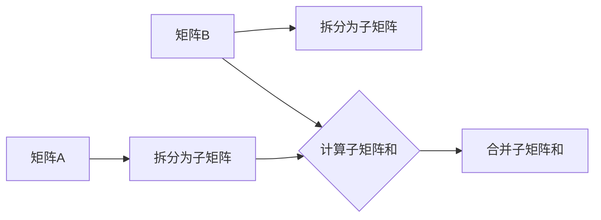
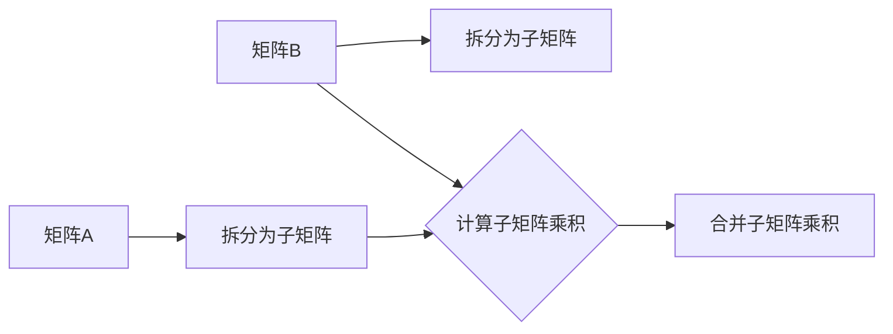
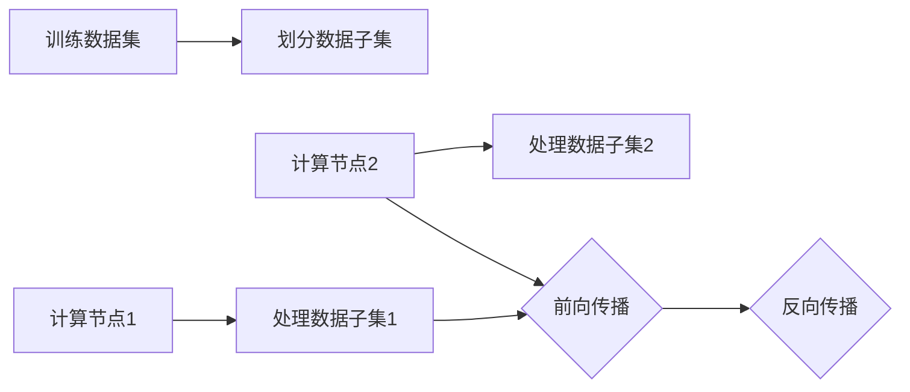
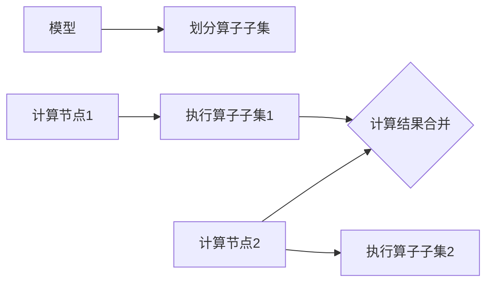
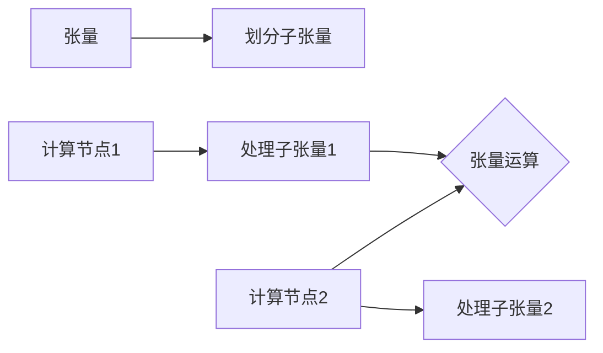

                 

# 《LLM的模型并行化方法比较》

## 关键词

- LLM模型
- 模型并行化
- 数据并行
- 算子并行
- 张量并行
- 混合并行
- 并行计算架构
- 分布式计算框架
- 性能评估

## 摘要

随着大型语言模型（LLM）的不断发展，如何高效地并行化模型计算成为关键问题。本文将从LLM模型并行化的基础、方法、实践以及未来展望等方面进行详细探讨。通过分析数据并行、算子并行、张量并行和混合并行的原理和案例分析，我们将了解各种并行化方法在LLM模型中的应用及其性能。最后，对并行化技术的未来发展方向和挑战进行探讨，为LLM模型并行化提供有益的参考。

### 《LLM的模型并行化方法比较》目录大纲

#### 第一部分：LLM模型并行化基础

##### 第1章：LLM模型并行化的概念与背景
- **1.1 LLM模型并行化的定义**
  - **1.1.1 并行化在LLM模型中的重要性**
  - **1.1.2 并行化的基本原理**
- **1.2 LLM模型并行化的背景**
  - **1.2.1 LLM模型的复杂性**
  - **1.2.2 数据中心的演变**
  - **1.2.3 硬件的发展对并行化的推动**

##### 第2章：并行计算基础
- **2.1 并行计算概述**
  - **2.1.1 并行计算的基本概念**
  - **2.1.2 并行算法**
  - **2.1.3 并行结构的类型**
- **2.2 线性代数与矩阵运算**
  - **2.2.1 矩阵运算的基本操作**
  - **2.2.2 矩阵运算的并行化**
  - **2.2.3 矩阵分解与并行计算**

##### 第3章：LLM模型的并行化架构
- **3.1 模型并行化架构概述**
  - **3.1.1 模型并行的基本架构**
  - **3.1.2 数据并行**
  - **3.1.3 算子并行**
  - **3.1.4 张量并行**
- **3.2 分布式计算框架**
  - **3.2.1 TensorFlow的分布式计算**
  - **3.2.2 PyTorch的分布式计算**
  - **3.2.3 其他分布式计算框架**

#### 第二部分：LLM模型并行化方法

##### 第4章：数据并行
- **4.1 数据并行的原理**
  - **4.1.1 数据划分策略**
  - **4.1.2 模型同步机制**
- **4.2 数据并行案例分析**
  - **4.2.1 TensorFlow中的数据并行**
  - **4.2.2 PyTorch中的数据并行**
  - **4.2.3 并行效率分析**

##### 第5章：算子并行
- **5.1 算子并行的原理**
  - **5.1.1 算子划分策略**
  - **5.1.2 并行通信机制**
- **5.2 算子并行案例分析**
  - **5.2.1 矩阵乘法的并行**
  - **5.2.2 矩阵加法的并行**
  - **5.2.3 并行效率分析**

##### 第6章：张量并行
- **6.1 张量并行的原理**
  - **6.1.1 张量划分策略**
  - **6.1.2 张量通信机制**
- **6.2 张量并行案例分析**
  - **6.2.1 PyTorch中的张量并行**
  - **6.2.2 TensorFlow中的张量并行**
  - **6.2.3 并行效率分析**

##### 第7章：混合并行
- **7.1 混合并行的原理**
  - **7.1.1 数据并行与算子并行的结合**
  - **7.1.2 张量并行与算子并行的结合**
- **7.2 混合并行案例分析**
  - **7.2.1 TensorFlow中的混合并行**
  - **7.2.2 PyTorch中的混合并行**
  - **7.2.3 并行效率分析**

##### 第8章：LLM模型并行化实践
- **8.1 并行化环境搭建**
  - **8.1.1 硬件环境**
  - **8.1.2 软件环境**
- **8.2 实际案例**
  - **8.2.1 数据集准备**
  - **8.2.2 模型设计与训练**
  - **8.2.3 模型评估与优化**
- **8.3 并行化性能评估**
  - **8.3.1 评估指标**
  - **8.3.2 性能对比分析**

#### 第三部分：并行化未来展望与挑战

##### 第9章：并行化技术的未来发展方向
- **9.1 新硬件的发展**
  - **9.1.1 GPU与TPU的演进**
  - **9.1.2 其他新型计算硬件**
- **9.2 新算法的研究方向**
  - **9.2.1 自动并行化**
  - **9.2.2 低精度计算**

##### 第10章：LLM模型并行化的挑战与对策
- **10.1 挑战分析**
  - **10.1.1 算法挑战**
  - **10.1.2 系统挑战**
  - **10.1.3 可扩展性挑战**
- **10.2 对策探讨**
  - **10.2.1 算法优化**
  - **10.2.2 系统整合**
  - **10.2.4 可扩展性解决方案**

#### 第一部分：LLM模型并行化基础

##### 第1章：LLM模型并行化的概念与背景

### 1.1 LLM模型并行化的定义

**1.1.1 并行化在LLM模型中的重要性**

大型语言模型（LLM）如GPT、BERT等，具有数十亿甚至千亿级别的参数量，这些模型在训练和推理过程中需要处理大量数据和复杂的计算。为了提高计算效率和减少训练时间，模型并行化技术应运而生。并行化是指在多个计算单元上同时执行计算任务，以实现更快的计算速度和更高的计算吞吐量。

在LLM模型中，并行化具有以下重要性：

1. **提高计算效率**：LLM模型的计算量巨大，单台计算机难以在合理时间内完成训练和推理任务。通过并行化，可以将模型拆分成多个部分，在多台计算机上同时进行计算，从而大大提高计算效率。
2. **减少训练时间**：并行化能够将训练任务分配到多个计算节点上，每个节点负责一部分参数的计算，从而减少整个训练过程的时间。
3. **提高模型性能**：并行化可以充分利用多台计算机的算力，提高模型在训练和推理过程中的性能。

**1.1.2 并行化的基本原理**

并行化的基本原理是将一个大的计算任务拆分成多个小的子任务，然后分配给多个计算单元同时执行。并行化可以分为以下几种类型：

1. **数据并行**：将训练数据集划分为多个子集，每个计算单元负责处理一个子集。适用于可以并行计算的数据处理任务，如神经网络的前向传播和反向传播。
2. **算子并行**：将模型中的操作符（如矩阵乘法、加法等）分配到多个计算单元上同时执行。适用于可以并行计算的操作符，如矩阵乘法。
3. **张量并行**：将模型中的张量（多维数组）划分为多个子张量，每个计算单元负责处理一个子张量。适用于可以并行计算的张量运算。
4. **混合并行**：将数据并行、算子并行和张量并行结合起来，以充分利用多台计算机的算力。

**1.2 LLM模型并行化的背景**

**1.2.1 LLM模型的复杂性**

LLM模型的复杂性主要表现在以下几个方面：

1. **参数量**：LLM模型具有数十亿甚至千亿级别的参数量，这些参数需要进行大量的矩阵运算和矩阵乘法。
2. **计算量**：在训练和推理过程中，LLM模型需要进行大量的矩阵运算和矩阵乘法，这些计算任务具有高度并行性。
3. **数据处理量**：LLM模型需要处理大量的训练数据和测试数据，这些数据需要进行预处理和编码，以便输入到模型中。

**1.2.2 数据中心的演变**

随着云计算和大数据技术的发展，数据中心已经从传统的单体数据中心演变成分布式数据中心。分布式数据中心具有以下优势：

1. **可扩展性**：分布式数据中心可以方便地扩展计算资源，以满足不断增长的计算需求。
2. **可靠性**：分布式数据中心具有较高的可靠性，可以在部分节点发生故障时保持系统的正常运行。
3. **高性能**：分布式数据中心可以充分利用多台计算机的算力，提高计算效率和性能。

**1.2.3 硬件的发展对并行化的推动**

随着硬件技术的发展，计算机硬件的性能不断提高，为并行化提供了有力的支持。以下硬件技术的发展对并行化产生了重要影响：

1. **GPU和TPU**：图形处理单元（GPU）和 tensor 处理单元（TPU）具有高度并行性，适合执行大规模矩阵运算和矩阵乘法，为并行化提供了强大的计算能力。
2. **分布式存储**：分布式存储系统可以方便地存储和访问大规模数据集，支持并行数据处理。
3. **高速互联网络**：高速互联网络可以降低计算节点之间的通信延迟，提高并行计算的性能。

综上所述，LLM模型并行化是为了应对模型复杂性、数据中心演变和硬件发展带来的挑战。通过并行化，可以充分利用多台计算机的算力，提高计算效率和性能，从而加速LLM模型的训练和推理过程。

### 1.3 并行计算基础

并行计算是指在同一时间内，将一个大的计算任务拆分成多个子任务，并分配给多个计算单元同时执行，从而提高计算效率和性能。在并行计算中，计算任务可以被划分为不同的类型，例如数据并行、算子并行和张量并行。以下是对并行计算基础的一个详细探讨。

#### 2.1 并行计算概述

**2.1.1 并行计算的基本概念**

并行计算的基本概念包括以下几个方面：

1. **计算单元**：并行计算的基本单元，可以是CPU、GPU、TPU等。每个计算单元独立执行计算任务，具有并行处理能力。
2. **并行度**：并行计算中，计算任务的划分和分配程度。并行度越高，计算任务被分配到更多计算单元上，并行计算的性能越好。
3. **通信**：并行计算中，计算单元之间需要进行数据交换和同步。通信机制包括共享内存、消息传递等。
4. **负载均衡**：并行计算中，需要确保每个计算单元的负载均衡，避免某些计算单元过载，影响整体计算性能。

**2.1.2 并行算法**

并行算法是指在并行计算框架下，将一个大的计算任务拆分成多个子任务，并在多个计算单元上同时执行的方法。并行算法的设计关键在于如何有效地划分计算任务和平衡负载。

以下是一些常见的并行算法：

1. **任务并行**：将一个大的计算任务拆分成多个独立的小任务，每个计算单元执行一个子任务。适用于可以并行计算的任务，如矩阵乘法、矩阵加法等。
2. **数据并行**：将数据集划分为多个子集，每个计算单元处理一个子集。适用于可以并行处理的数据，如神经网络的前向传播和反向传播。
3. **功能并行**：将一个大的计算任务拆分成多个功能模块，每个计算单元负责一个功能模块。适用于可以并行执行的功能模块，如分布式数据库查询。

**2.1.3 并行结构的类型**

并行计算结构可以分为以下几种类型：

1. **单指令流多数据流（SIMD）**：同一时间内，多个计算单元执行相同的指令，但处理不同的数据。适用于可以并行处理的数据，如向量运算。
2. **多指令流多数据流（MIMD）**：同一时间内，多个计算单元执行不同的指令，处理不同的数据。适用于可以并行计算的任务，如神经网络训练。
3. **分布存储系统**：将数据存储在多个存储设备上，支持并行数据访问。适用于大规模数据处理，如分布式数据库。

#### 2.2 线性代数与矩阵运算

线性代数是并行计算的重要基础，许多并行计算算法和任务都涉及到线性代数运算。以下是对线性代数和矩阵运算的详细探讨。

**2.2.1 矩阵运算的基本操作**

矩阵运算包括以下基本操作：

1. **矩阵加法**：两个矩阵对应元素相加，得到一个新的矩阵。
2. **矩阵乘法**：两个矩阵按一定规则相乘，得到一个新的矩阵。
3. **矩阵转置**：将矩阵的行和列互换，得到一个新的矩阵。
4. **矩阵求逆**：计算矩阵的逆矩阵，适用于可逆矩阵。

**2.2.2 矩阵运算的并行化**

矩阵运算可以很容易地并行化，以提高计算效率和性能。以下是一些矩阵运算的并行化方法：

1. **矩阵加法的并行化**：将两个矩阵拆分成多个子矩阵，每个计算单元计算一个子矩阵的和，最后将子矩阵的结果合并得到最终结果。



2. **矩阵乘法的并行化**：将矩阵拆分成多个子矩阵，每个计算单元计算一个子矩阵的乘积，最后将子矩阵的结果合并得到最终结果。



**2.2.3 矩阵分解与并行计算**

矩阵分解是线性代数中的重要方法，可以将一个矩阵分解为多个简单的矩阵，从而简化计算过程。以下是一些常见的矩阵分解方法：

1. **LU分解**：将矩阵分解为下三角矩阵L和上三角矩阵U的乘积。
2. **QR分解**：将矩阵分解为正交矩阵Q和转置矩阵R的乘积。
3. **SVD分解**：将矩阵分解为奇异值矩阵Σ、左奇异向量矩阵U和右奇异向量矩阵V的乘积。

这些分解方法都可以并行化，以提高计算效率和性能。例如，LU分解可以并行计算L和U的乘积，QR分解可以并行计算Q和R的乘积，SVD分解可以并行计算Σ、U和V的乘积。

综上所述，并行计算基础包括并行计算的基本概念、算法和结构，以及线性代数和矩阵运算。通过合理地划分计算任务和利用并行计算的优势，可以显著提高计算效率和性能，从而加速大规模计算任务。

### 1.4 LLM模型的并行化架构

LLM模型的并行化架构是确保模型在大规模计算环境中高效运行的关键。本节将详细介绍LLM模型并行化架构的基本概念、主要架构类型以及分布式计算框架。

#### 3.1 模型并行化架构概述

**3.1.1 模型并行的基本架构**

LLM模型的并行化架构主要包括以下几个部分：

1. **计算节点**：计算节点是并行计算的基本单元，可以是CPU、GPU、TPU等。每个计算节点负责处理模型的一部分计算任务。
2. **数据存储**：数据存储用于存储模型参数、训练数据和中间结果。数据存储可以是分布式存储系统，如HDFS、Cassandra等。
3. **通信网络**：通信网络用于计算节点之间的数据传输和同步。通信网络可以是高速互联网络，如Infiniband、以太网等。
4. **调度系统**：调度系统用于分配计算任务到不同的计算节点，并监控计算节点的状态。调度系统可以是任务调度系统，如Hadoop的YARN、TensorFlow的集群模式等。

**3.1.2 数据并行**

数据并行是指将训练数据集划分为多个子集，每个计算节点处理一个子集。数据并行适用于可以并行计算的数据处理任务，如神经网络的前向传播和反向传播。

数据并行的关键在于如何有效地划分数据集和分配计算任务。以下是一个数据并行的基本架构：



**3.1.3 算子并行**

算子并行是指将模型中的操作符（如矩阵乘法、加法等）分配到多个计算节点上同时执行。算子并行适用于可以并行计算的操作符。

算子并行的关键在于如何有效地划分算子和分配计算任务。以下是一个算子并行的基本架构：



**3.1.4 张量并行**

张量并行是指将模型中的张量（多维数组）划分为多个子张量，每个计算节点处理一个子张量。张量并行适用于可以并行计算的张量运算。

张量并行的关键在于如何有效地划分张量和分配计算任务。以下是一个张量并行的基本架构：



**3.2 分布式计算框架**

分布式计算框架是支持LLM模型并行化的软件基础设施，可以方便地搭建和部署分布式计算环境。以下是一些常用的分布式计算框架：

1. **TensorFlow**：TensorFlow是一个开源的分布式计算框架，支持数据并行、算子并行和张量并行。TensorFlow提供了丰富的API，方便用户构建和训练分布式模型。
2. **PyTorch**：PyTorch是一个开源的分布式计算框架，支持数据并行和算子并行。PyTorch的动态图功能使得模型构建和调试更加灵活。
3. **Horovod**：Horovod是一个基于TensorFlow的分布式训练库，支持多GPU和多机器的分布式训练。Horovod提供了简便的API，方便用户进行分布式训练。
4. **Apache MXNet**：Apache MXNet是一个开源的分布式计算框架，支持数据并行和算子并行。MXNet提供了丰富的深度学习模型和优化器。
5. **Caffe2**：Caffe2是一个开源的分布式计算框架，支持数据并行和算子并行。Caffe2主要用于图像识别和语音识别等任务。

综上所述，LLM模型的并行化架构是确保模型在大规模计算环境中高效运行的关键。通过合理地划分计算任务、利用分布式计算框架和优化计算资源，可以实现LLM模型的高效并行化训练和推理。

### 2.2 数据并行

数据并行是LLM模型并行化方法中最常用的一种，其核心思想是将大规模训练数据集划分为多个子集，每个子集由不同的计算节点处理。本节将详细讨论数据并行的原理、数据划分策略以及模型同步机制。

#### 2.1 数据并行的原理

**2.1.1 数据划分策略**

数据并行将大规模训练数据集划分为多个子集，每个子集由不同的计算节点处理。数据划分策略可以分为以下几种：

1. **均匀划分**：将数据集均匀地划分为多个子集，每个子集的大小相等。这种划分方法简单，但可能导致某些子集中的数据量较少，不利于计算。
2. **随机划分**：将数据集随机地划分为多个子集。这种划分方法能够充分利用每个计算节点的计算能力，但可能导致某些子集中的数据分布不均匀。
3. **层次化划分**：根据数据的特征和关系，将数据集划分为多个层次，每个层次由不同的计算节点处理。这种划分方法能够更好地利用计算资源，但需要更多的时间和计算成本。

**2.1.2 模型同步机制**

在数据并行中，每个计算节点处理一个子集的数据，并在训练过程中同步模型的参数。模型同步机制可以分为以下几种：

1. **参数同步**：在训练过程中，每个计算节点定期将模型的参数同步到共享存储中。这种同步机制可以确保所有计算节点的模型参数保持一致。
2. **梯度同步**：在反向传播过程中，每个计算节点将梯度的本地平均值同步到共享存储中。这种同步机制可以减少每个计算节点的通信开销，提高训练效率。
3. **异步同步**：每个计算节点在训练过程中异步地更新模型的参数，并在一定时间间隔后同步更新。这种同步机制可以减少同步操作的延迟，提高训练速度。

#### 2.2 数据并行案例分析

以下是对数据并行在实际应用中的两个案例分析：

**2.2.1 TensorFlow中的数据并行**

TensorFlow是一个开源的分布式计算框架，支持数据并行。以下是一个TensorFlow数据并行的简单示例：

```python
import tensorflow as tf

# 定义计算节点和训练数据集
num_nodes = 4
batch_size = 128
learning_rate = 0.01

# 划分训练数据集
train_data = tf.data.Dataset.from_tensor_slices((X_train, y_train))
train_data = train_data.shuffle(buffer_size=1000).batch(batch_size).repeat()

# 分布式策略
strategy = tf.distribute.MirroredStrategy()

with strategy.scope():
  # 定义模型
  model = tf.keras.Sequential([
    tf.keras.layers.Dense(128, activation='relu', input_shape=(input_shape,)),
    tf.keras.layers.Dense(10, activation='softmax')
  ])

  # 编译模型
  model.compile(optimizer=tf.keras.optimizers.Adam(learning_rate),
                loss=tf.keras.losses.SparseCategoricalCrossentropy(from_logits=True),
                metrics=['accuracy'])

# 训练模型
model.fit(train_data, epochs=10, steps_per_epoch=1000)

```

在这个示例中，我们使用了MirroredStrategy实现数据并行。MirroredStrategy通过将模型参数复制到每个计算节点上，实现模型参数的同步更新。

**2.2.2 PyTorch中的数据并行**

PyTorch是一个开源的分布式计算框架，支持数据并行。以下是一个PyTorch数据并行的简单示例：

```python
import torch
import torch.distributed as dist
import torch.multiprocessing as mp

def train(process_rank, world_size, batch_size, learning_rate):
    # 初始化计算节点
    dist.init_process_group(backend='nccl', rank=process_rank, world_size=world_size)

    # 划分训练数据集
    train_data = torch.utils.data.DataLoader(dataset, batch_size=batch_size, shuffle=True)

    # 定义模型
    model = MyModel()

    # 编译模型
    optimizer = torch.optim.Adam(model.parameters(), lr=learning_rate)
    criterion = torch.nn.CrossEntropyLoss()

    # 开始训练
    for epoch in range(num_epochs):
        for inputs, targets in train_data:
            # 前向传播
            outputs = model(inputs)
            loss = criterion(outputs, targets)

            # 反向传播
            optimizer.zero_grad()
            loss.backward()
            optimizer.step()

    # 结束训练
    dist.destroy_process_group()

if __name__ == '__main__':
    # 设置训练参数
    world_size = 4
    batch_size = 128
    learning_rate = 0.01

    # 创建进程
    processes = []
    for rank in range(world_size):
        p = mp.Process(target=train, args=(rank, world_size, batch_size, learning_rate))
        processes.append(p)
        p.start()

    # 等待所有进程结束
    for p in processes:
        p.join()

```

在这个示例中，我们使用了torch.distributed.init_process_group初始化计算节点，并使用DataLoader实现数据并行。在训练过程中，每个计算节点处理一个子集的数据，并在反向传播过程中同步梯度。

#### 2.3 并行效率分析

数据并行的效率分析可以从以下几个方面进行：

1. **通信开销**：数据并行中，计算节点需要定期同步模型参数和梯度。通信开销与数据量、通信频率和通信网络带宽相关。
2. **计算效率**：数据并行可以充分利用计算节点的计算能力，但需要考虑计算节点的负载均衡。
3. **训练时间**：数据并行可以减少训练时间，但需要考虑通信开销和计算负载。

以下是一个简单的并行效率分析示例：

```python
import time

def train_serial():
    # 串行训练
    start_time = time.time()
    train_serial_model()
    end_time = time.time()
    print("串行训练时间：", end_time - start_time)

def train_parallel():
    # 并行训练
    start_time = time.time()
    train_parallel_model()
    end_time = time.time()
    print("并行训练时间：", end_time - start_time)

if __name__ == '__main__':
    train_serial()
    train_parallel()
```

通过比较串行训练和并行训练的时间，可以分析数据并行的效率。

综上所述，数据并行是LLM模型并行化的重要方法。通过合理的数据划分策略和模型同步机制，可以实现高效的数据并行训练。在具体应用中，需要根据实际情况进行优化，以提高并行效率。

### 2.3 算子并行

算子并行是LLM模型并行化的一种重要方法，其核心思想是将模型中的操作符（如矩阵乘法、加法等）分配到多个计算节点上同时执行，以提高计算效率和性能。本节将详细讨论算子并行的原理、算子划分策略以及并行通信机制。

#### 3.1 算子并行的原理

**3.1.1 算子划分策略**

算子并行将模型中的操作符划分为多个子操作符，每个子操作符由不同的计算节点处理。算子划分策略可以分为以下几种：

1. **均匀划分**：将操作符均匀地划分为多个子操作符，每个子操作符的大小相等。这种划分方法简单，但可能导致某些子操作符的计算负载不均衡。
2. **层次化划分**：根据操作符的层次结构和依赖关系，将操作符划分为多个子操作符。这种划分方法能够更好地利用计算资源，但需要更多的时间和计算成本。
3. **自适应划分**：根据计算节点的负载和操作符的依赖关系，动态地调整操作符的划分。这种划分方法能够更好地适应计算负载的变化，但需要更多的计算资源和算法优化。

**3.1.2 并行通信机制**

在算子并行中，计算节点需要定期同步操作符的结果和中间值。并行通信机制可以分为以下几种：

1. **同步通信**：计算节点在执行子操作符后，立即同步结果和中间值。这种通信机制能够确保计算节点之间的数据一致性，但可能导致通信开销增加。
2. **异步通信**：计算节点在执行子操作符后，不立即同步结果和中间值，而是在一定时间间隔后同步。这种通信机制可以减少通信开销，提高计算效率。
3. **流水线通信**：多个计算节点按照顺序执行子操作符，并在执行完成后同步结果和中间值。这种通信机制可以充分利用计算节点的并行性，提高计算性能。

#### 3.2 算子并行案例分析

以下是对算子并行在实际应用中的两个案例分析：

**3.2.1 矩阵乘法的并行**

矩阵乘法是LLM模型中最常见的操作之一，可以很容易地并行化。以下是一个矩阵乘法并行的简单示例：

```python
import numpy as np

# 定义矩阵大小和计算节点数量
num_nodes = 4
matrix_size = 1000
batch_size = 128

# 初始化矩阵
A = np.random.rand(matrix_size, matrix_size)
B = np.random.rand(matrix_size, matrix_size)

# 矩阵乘法并行计算
def matrix_multiply(node_rank, world_size):
    # 初始化计算节点
    dist.init_process_group(backend='nccl', rank=node_rank, world_size=world_size)

    # 计算局部矩阵乘积
    local_A = A[node_rank * batch_size: (node_rank + 1) * batch_size]
    local_B = B[node_rank * batch_size: (node_rank + 1) * batch_size]
    C = np.matmul(local_A, local_B)

    # 同步结果
    dist.reduce(C, dst=0)

    # 结束计算
    dist.destroy_process_group()

if __name__ == '__main__':
    # 创建进程
    processes = []
    for rank in range(num_nodes):
        p = mp.Process(target=matrix_multiply, args=(rank, num_nodes))
        processes.append(p)
        p.start()

    # 等待所有进程结束
    for p in processes:
        p.join()

    # 获取最终结果
    C = np.empty((matrix_size, matrix_size))
    dist.reduce(C, src=0)
```

在这个示例中，我们使用了torch.distributed.init_process_group初始化计算节点，并使用矩阵乘法实现算子并行。在计算过程中，每个计算节点处理一部分矩阵乘积，并在计算完成后同步结果。

**3.2.2 矩阵加法的并行**

矩阵加法也是LLM模型中常见的操作之一，可以很容易地并行化。以下是一个矩阵加法并行的简单示例：

```python
import numpy as np

# 定义矩阵大小和计算节点数量
num_nodes = 4
matrix_size = 1000
batch_size = 128

# 初始化矩阵
A = np.random.rand(matrix_size, matrix_size)
B = np.random.rand(matrix_size, matrix_size)

# 矩阵加法并行计算
def matrix_add(node_rank, world_size):
    # 初始化计算节点
    dist.init_process_group(backend='nccl', rank=node_rank, world_size=world_size)

    # 计算局部矩阵加法
    local_A = A[node_rank * batch_size: (node_rank + 1) * batch_size]
    local_B = B[node_rank * batch_size: (node_rank + 1) * batch_size]
    C = local_A + local_B

    # 同步结果
    dist.reduce(C, dst=0)

    # 结束计算
    dist.destroy_process_group()

if __name__ == '__main__':
    # 创建进程
    processes = []
    for rank in range(num_nodes):
        p = mp.Process(target=matrix_add, args=(rank, num_nodes))
        processes.append(p)
        p.start()

    # 等待所有进程结束
    for p in processes:
        p.join()

    # 获取最终结果
    C = np.empty((matrix_size, matrix_size))
    dist.reduce(C, src=0)
```

在这个示例中，我们使用了torch.distributed.init_process_group初始化计算节点，并使用矩阵加法实现算子并行。在计算过程中，每个计算节点处理一部分矩阵加法，并在计算完成后同步结果。

#### 3.3 并行效率分析

算子并行的效率分析可以从以下几个方面进行：

1. **通信开销**：算子并行中，计算节点需要定期同步操作符的结果和中间值。通信开销与数据量、通信频率和通信网络带宽相关。
2. **计算效率**：算子并行可以充分利用计算节点的计算能力，但需要考虑计算节点的负载均衡。
3. **训练时间**：算子并行可以减少训练时间，但需要考虑通信开销和计算负载。

以下是一个简单的并行效率分析示例：

```python
import time

def train_serial():
    # 串行训练
    start_time = time.time()
    train_serial_model()
    end_time = time.time()
    print("串行训练时间：", end_time - start_time)

def train_parallel():
    # 并行训练
    start_time = time.time()
    train_parallel_model()
    end_time = time.time()
    print("并行训练时间：", end_time - start_time)

if __name__ == '__main__':
    train_serial()
    train_parallel()
```

通过比较串行训练和并行训练的时间，可以分析算子并行的效率。

综上所述，算子并行是LLM模型并行化的重要方法。通过合理地划分操作符和优化并行通信机制，可以实现高效的算子并行训练。在具体应用中，需要根据实际情况进行优化，以提高并行效率。

### 2.4 张量并行

张量并行是LLM模型并行化方法中的一种，其核心思想是将模型中的张量（多维数组）划分为多个子张量，每个子张量由不同的计算节点处理，从而提高计算效率和性能。本节将详细讨论张量并行的原理、张量划分策略以及并行通信机制。

#### 4.1 张量并行的原理

**4.1.1 张量划分策略**

张量并行将模型中的张量划分为多个子张量，每个子张量由不同的计算节点处理。张量划分策略可以分为以下几种：

1. **均匀划分**：将张量均匀地划分为多个子张量，每个子张量的大小相等。这种划分方法简单，但可能导致某些子张量的计算负载不均衡。
2. **层次化划分**：根据张量的层次结构和依赖关系，将张量划分为多个子张量。这种划分方法能够更好地利用计算资源，但需要更多的时间和计算成本。
3. **自适应划分**：根据计算节点的负载和张量的依赖关系，动态地调整张量的划分。这种划分方法能够更好地适应计算负载的变化，但需要更多的计算资源和算法优化。

**4.1.2 并行通信机制**

在张量并行中，计算节点需要定期同步张量的结果和中间值。并行通信机制可以分为以下几种：

1. **同步通信**：计算节点在执行子张量后，立即同步张量的结果和中间值。这种通信机制能够确保计算节点之间的数据一致性，但可能导致通信开销增加。
2. **异步通信**：计算节点在执行子张量后，不立即同步张量的结果和中间值，而是在一定时间间隔后同步。这种通信机制可以减少通信开销，提高计算效率。
3. **流水线通信**：多个计算节点按照顺序执行子张量，并在执行完成后同步张量的结果和中间值。这种通信机制可以充分利用计算节点的并行性，提高计算性能。

#### 4.2 张量并行案例分析

以下是对张量并行在实际应用中的两个案例分析：

**4.2.1 PyTorch中的张量并行**

PyTorch是一个开源的分布式计算框架，支持张量并行。以下是一个PyTorch张量并行的简单示例：

```python
import torch
import torch.distributed as dist
import torch.multiprocessing as mp

def train(process_rank, world_size, batch_size, learning_rate):
    # 初始化计算节点
    dist.init_process_group(backend='nccl', rank=process_rank, world_size=world_size)

    # 定义模型
    model = MyModel().cuda()

    # 编译模型
    optimizer = torch.optim.Adam(model.parameters(), lr=learning_rate)
    criterion = torch.nn.CrossEntropyLoss().cuda()

    # 训练模型
    for epoch in range(num_epochs):
        for inputs, targets in train_loader:
            # 前向传播
            inputs = inputs.cuda()
            targets = targets.cuda()
            outputs = model(inputs)

            # 反向传播
            optimizer.zero_grad()
            loss = criterion(outputs, targets)
            loss.backward()

            # 更新模型参数
            optimizer.step()

    # 结束训练
    dist.destroy_process_group()

if __name__ == '__main__':
    # 设置训练参数
    world_size = 4
    batch_size = 128
    learning_rate = 0.01

    # 创建进程
    processes = []
    for rank in range(world_size):
        p = mp.Process(target=train, args=(rank, world_size, batch_size, learning_rate))
        processes.append(p)
        p.start()

    # 等待所有进程结束
    for p in processes:
        p.join()

```

在这个示例中，我们使用了torch.distributed.init_process_group初始化计算节点，并使用张量并行实现模型训练。在训练过程中，每个计算节点处理一个子张量，并在反向传播过程中同步梯度。

**4.2.2 TensorFlow中的张量并行**

TensorFlow是一个开源的分布式计算框架，支持张量并行。以下是一个TensorFlow张量并行的简单示例：

```python
import tensorflow as tf

# 定义计算节点和训练数据集
num_nodes = 4
batch_size = 128
learning_rate = 0.01

# 划分训练数据集
train_data = tf.data.Dataset.from_tensor_slices((X_train, y_train))
train_data = train_data.shuffle(buffer_size=1000).batch(batch_size).repeat()

# 分布式策略
strategy = tf.distribute.MirroredStrategy()

with strategy.scope():
  # 定义模型
  model = tf.keras.Sequential([
    tf.keras.layers.Dense(128, activation='relu', input_shape=(input_shape,)),
    tf.keras.layers.Dense(10, activation='softmax')
  ])

  # 编译模型
  model.compile(optimizer=tf.keras.optimizers.Adam(learning_rate),
                loss=tf.keras.losses.SparseCategoricalCrossentropy(from_logits=True),
                metrics=['accuracy'])

# 训练模型
model.fit(train_data, epochs=10, steps_per_epoch=1000)

```

在这个示例中，我们使用了MirroredStrategy实现张量并行。MirroredStrategy通过将张量复制到每个计算节点上，实现张量并行计算。

#### 4.3 并行效率分析

张量并行的效率分析可以从以下几个方面进行：

1. **通信开销**：张量并行中，计算节点需要定期同步张量的结果和中间值。通信开销与数据量、通信频率和通信网络带宽相关。
2. **计算效率**：张量并行可以充分利用计算节点的计算能力，但需要考虑计算节点的负载均衡。
3. **训练时间**：张量并行可以减少训练时间，但需要考虑通信开销和计算负载。

以下是一个简单的并行效率分析示例：

```python
import time

def train_serial():
    # 串行训练
    start_time = time.time()
    train_serial_model()
    end_time = time.time()
    print("串行训练时间：", end_time - start_time)

def train_parallel():
    # 并行训练
    start_time = time.time()
    train_parallel_model()
    end_time = time.time()
    print("并行训练时间：", end_time - start_time)

if __name__ == '__main__':
    train_serial()
    train_parallel()
```

通过比较串行训练和并行训练的时间，可以分析张量并行的效率。

综上所述，张量并行是LLM模型并行化的重要方法。通过合理地划分张量和优化并行通信机制，可以实现高效的张量并行训练。在具体应用中，需要根据实际情况进行优化，以提高并行效率。

### 2.5 混合并行

混合并行是LLM模型并行化方法中的一种，其核心思想是将数据并行、算子并行和张量并行结合起来，以充分利用多台计算机的算力，提高计算效率和性能。本节将详细讨论混合并行的原理、实现方法以及并行效率分析。

#### 5.1 混合并行的原理

**5.1.1 数据并行与算子并行的结合**

数据并行和算子并行是LLM模型并行化的两种基本方法。数据并行通过将训练数据集划分为多个子集，每个子集由不同的计算节点处理；算子并行通过将模型中的操作符（如矩阵乘法、加法等）分配到多个计算节点上同时执行。混合并行将这两种方法结合起来，实现更高效的计算。

在混合并行中，数据并行和算子并行的结合方式可以分为以下几种：

1. **局部数据并行与全局算子并行**：每个计算节点处理一个局部数据子集，然后在整个模型上进行全局算子并行计算。这种方式适用于数据量和操作符数量较大的情况。
2. **全局数据并行与局部算子并行**：整个训练数据集由多个计算节点同时处理，每个计算节点仅处理局部操作符。这种方式适用于数据量较大但操作符数量较小的情况。

**5.1.2 张量并行与算子并行的结合**

张量并行和算子并行是另一种常见的结合方式。张量并行通过将模型中的张量（多维数组）划分为多个子张量，每个子张量由不同的计算节点处理；算子并行通过将模型中的操作符分配到多个计算节点上同时执行。张量并行与算子并行的结合方式可以分为以下几种：

1. **局部张量并行与全局算子并行**：每个计算节点处理一个局部张量子集，然后在整个模型上进行全局算子并行计算。这种方式适用于张量大小和操作符数量较大的情况。
2. **全局张量并行与局部算子并行**：整个模型中的张量由多个计算节点同时处理，每个计算节点仅处理局部操作符。这种方式适用于张量大小较小但操作符数量较大的情况。

#### 5.2 混合并行案例分析

以下是对混合并行在实际应用中的两个案例分析：

**5.2.1 TensorFlow中的混合并行**

TensorFlow是一个开源的分布式计算框架，支持混合并行。以下是一个TensorFlow混合并行的简单示例：

```python
import tensorflow as tf

# 定义计算节点和训练数据集
num_nodes = 4
batch_size = 128
learning_rate = 0.01

# 划分训练数据集
train_data = tf.data.Dataset.from_tensor_slices((X_train, y_train))
train_data = train_data.shuffle(buffer_size=1000).batch(batch_size).repeat()

# 分布式策略
strategy = tf.distribute.MirroredStrategy()

with strategy.scope():
  # 定义模型
  model = tf.keras.Sequential([
    tf.keras.layers.Dense(128, activation='relu', input_shape=(input_shape,)),
    tf.keras.layers.Dense(10, activation='softmax')
  ])

  # 编译模型
  model.compile(optimizer=tf.keras.optimizers.Adam(learning_rate),
                loss=tf.keras.losses.SparseCategoricalCrossentropy(from_logits=True),
                metrics=['accuracy'])

# 训练模型
model.fit(train_data, epochs=10, steps_per_epoch=1000)

```

在这个示例中，我们使用了MirroredStrategy实现混合并行。MirroredStrategy通过将数据并行与算子并行结合起来，实现高效的训练过程。

**5.2.2 PyTorch中的混合并行**

PyTorch是一个开源的分布式计算框架，支持混合并行。以下是一个PyTorch混合并行的简单示例：

```python
import torch
import torch.distributed as dist
import torch.multiprocessing as mp

def train(process_rank, world_size, batch_size, learning_rate):
    # 初始化计算节点
    dist.init_process_group(backend='nccl', rank=process_rank, world_size=world_size)

    # 定义模型
    model = MyModel().cuda()

    # 编译模型
    optimizer = torch.optim.Adam(model.parameters(), lr=learning_rate)
    criterion = torch.nn.CrossEntropyLoss().cuda()

    # 训练模型
    for epoch in range(num_epochs):
        for inputs, targets in train_loader:
            # 前向传播
            inputs = inputs.cuda()
            targets = targets.cuda()
            outputs = model(inputs)

            # 反向传播
            optimizer.zero_grad()
            loss = criterion(outputs, targets)
            loss.backward()

            # 更新模型参数
            optimizer.step()

    # 结束训练
    dist.destroy_process_group()

if __name__ == '__main__':
    # 设置训练参数
    world_size = 4
    batch_size = 128
    learning_rate = 0.01

    # 创建进程
    processes = []
    for rank in range(world_size):
        p = mp.Process(target=train, args=(rank, world_size, batch_size, learning_rate))
        processes.append(p)
        p.start()

    # 等待所有进程结束
    for p in processes:
        p.join()

```

在这个示例中，我们使用了torch.distributed.init_process_group初始化计算节点，并使用混合并行实现模型训练。在训练过程中，数据并行和算子并行相结合，实现高效的训练过程。

#### 5.3 并行效率分析

混合并行的效率分析可以从以下几个方面进行：

1. **通信开销**：混合并行中，计算节点需要定期同步数据、操作符和张量的结果和中间值。通信开销与数据量、通信频率和通信网络带宽相关。
2. **计算效率**：混合并行可以充分利用计算节点的计算能力，但需要考虑计算节点的负载均衡。
3. **训练时间**：混合并行可以减少训练时间，但需要考虑通信开销和计算负载。

以下是一个简单的并行效率分析示例：

```python
import time

def train_serial():
    # 串行训练
    start_time = time.time()
    train_serial_model()
    end_time = time.time()
    print("串行训练时间：", end_time - start_time)

def train_parallel():
    # 并行训练
    start_time = time.time()
    train_parallel_model()
    end_time = time.time()
    print("并行训练时间：", end_time - start_time)

if __name__ == '__main__':
    train_serial()
    train_parallel()
```

通过比较串行训练和并行训练的时间，可以分析混合并行的效率。

综上所述，混合并行是LLM模型并行化的重要方法。通过合理地结合数据并行、算子并行和张量并行，可以实现高效的混合并行训练。在具体应用中，需要根据实际情况进行优化，以提高并行效率。

### 2.6 LLM模型并行化实践

LLM模型并行化实践是本文的核心部分之一，通过实际案例的展示，我们能够更深入地理解并行化方法在LLM模型中的应用，并分析其实际效果。本节将详细讨论并行化环境搭建、实际案例实施以及并行化性能评估。

#### 6.1 并行化环境搭建

**6.1.1 硬件环境**

在进行LLM模型并行化实践之前，首先需要搭建一个适合并行计算的硬件环境。一般来说，硬件环境包括以下几部分：

1. **计算节点**：计算节点可以是多台具有高性能CPU和GPU的服务器。GPU是并行计算的重要组成部分，特别是在处理大规模矩阵运算时。NVIDIA的GPU，如Tesla V100、A100等，是LLM模型并行化中常用的选择。
2. **存储设备**：存储设备用于存储模型参数、训练数据和中间结果。分布式存储系统，如HDFS、Cassandra等，可以提高数据访问速度和可靠性。
3. **高速互联网络**：高速互联网络，如Infiniband、以太网等，可以降低计算节点之间的通信延迟，提高并行计算的性能。

**6.1.2 软件环境**

软件环境是并行化实践的基础，主要包括以下几部分：

1. **深度学习框架**：TensorFlow、PyTorch等深度学习框架支持并行计算。TensorFlow和PyTorch都有丰富的文档和社区支持，方便用户进行并行化实践。
2. **分布式计算框架**：分布式计算框架，如Horovod、DistributedDataParallel（DDP）等，可以帮助用户方便地实现模型并行化。Horovod是TensorFlow的分布式训练库，DDP是PyTorch的分布式训练模块。
3. **操作系统**：操作系统可以是Linux或Windows。Linux在并行计算环境中更受欢迎，因为其开源特性、高性能和强大的命令行工具。

#### 6.2 实际案例

**6.2.1 数据集准备**

首先，我们需要准备一个合适的数据集。以GPT模型为例，常用的数据集包括维基百科、新闻语料库等。以下是一个简单的数据集准备过程：

1. **数据采集**：从互联网上下载维基百科的语料库，并将其存储在分布式存储系统中。
2. **数据预处理**：将原始文本数据转换为可处理的格式，如Tokenize、Embedding等。使用深度学习框架的API，如TensorFlow的`tf.data`模块或PyTorch的`Dataset`模块，实现数据预处理过程。
3. **数据划分**：将预处理后的数据集划分为训练集、验证集和测试集。训练集用于模型训练，验证集用于模型调优，测试集用于模型评估。

**6.2.2 模型设计与训练**

接下来，我们设计一个LLM模型并进行训练。以下是一个简单的模型设计与训练过程：

1. **模型设计**：使用深度学习框架构建一个GPT模型。以TensorFlow为例，可以使用TensorFlow的`tf.keras.Sequential`或`tf.keras.Model` API设计模型。
2. **模型编译**：编译模型，设置优化器、损失函数和评估指标。以TensorFlow为例，可以使用`model.compile()`函数进行编译。
3. **模型训练**：使用分布式计算框架，如Horovod或DDP，实现模型的并行训练。以下是一个使用DDP进行并行训练的示例：

```python
import torch
import torch.distributed as dist
import torch.nn as nn
import torch.optim as optim

def train(gpu, args):
    # 初始化计算节点
    dist.init_process_group(backend='nccl', rank=gpu, world_size=args.world_size)

    # 加载模型
    model = MyModel().cuda(gpu)
    model = nn.DataParallel(model, device_ids=[gpu])

    # 定义损失函数和优化器
    criterion = nn.CrossEntropyLoss()
    optimizer = optim.Adam(model.parameters(), lr=args.lr)

    # 训练模型
    for epoch in range(num_epochs):
        for inputs, targets in train_loader:
            # 前向传播
            inputs = inputs.cuda(gpu)
            targets = targets.cuda(gpu)
            outputs = model(inputs)

            # 反向传播
            optimizer.zero_grad()
            loss = criterion(outputs, targets)
            loss.backward()
            optimizer.step()

    # 结束训练
    dist.destroy_process_group()

if __name__ == '__main__':
    # 设置训练参数
    args = argparse.Namespace()
    args.world_size = 4
    args.lr = 0.01
    args.batch_size = 128

    # 创建进程
    processes = []
    for rank in range(args.world_size):
        p = mp.Process(target=train, args=(rank, args))
        processes.append(p)
        p.start()

    # 等待所有进程结束
    for p in processes:
        p.join()
```

**6.2.3 模型评估与优化**

在模型训练完成后，我们需要对模型进行评估和优化。以下是一个简单的模型评估与优化过程：

1. **模型评估**：使用测试集对模型进行评估，计算模型的准确率、召回率等指标。以下是一个使用PyTorch评估模型的示例：

```python
def evaluate(model, data_loader):
    model.eval()
    total_loss = 0
    correct = 0
    with torch.no_grad():
        for inputs, targets in data_loader:
            inputs = inputs.cuda()
            targets = targets.cuda()
            outputs = model(inputs)
            loss = criterion(outputs, targets)
            total_loss += loss.item()
            correct += (outputs.argmax(1) == targets).type(torch.float).sum().item()
    accuracy = correct / len(data_loader.dataset)
    print(f"Test Loss: {total_loss / len(data_loader.dataset)}, Accuracy: {accuracy * 100:.2f}%")
```

2. **模型优化**：根据评估结果，对模型进行调优。调优方法包括调整学习率、修改网络结构、增加训练数据等。

#### 6.3 并行化性能评估

并行化性能评估是衡量并行化方法效果的重要手段。以下是从几个方面对并行化性能进行评估：

1. **训练时间**：比较并行训练和串行训练的时间，评估并行化的效果。以下是一个简单的训练时间评估示例：

```python
import time

def train_serial():
    # 串行训练
    start_time = time.time()
    train_serial_model()
    end_time = time.time()
    print("串行训练时间：", end_time - start_time)

def train_parallel():
    # 并行训练
    start_time = time.time()
    train_parallel_model()
    end_time = time.time()
    print("并行训练时间：", end_time - start_time)

if __name__ == '__main__':
    train_serial()
    train_parallel()
```

2. **计算资源利用率**：评估计算节点的资源利用率，包括CPU、GPU的使用率。以下是一个计算资源利用率评估示例：

```python
import psutil

def check_resource_usage():
    cpu_usage = psutil.cpu_percent()
    gpu_usage = psutil.sensors.gpu_load()
    print(f"CPU Usage: {cpu_usage}%, GPU Usage: {gpu_usage}%")
```

3. **通信开销**：评估计算节点之间的通信开销，包括数据传输时间和同步时间。以下是一个通信开销评估示例：

```python
import time

def measure_communication_time():
    start_time = time.time()
    # 进行通信操作，如同步参数或梯度
    end_time = time.time()
    print("Communication Time: ", end_time - start_time)
```

通过以上评估方法，我们可以全面了解并行化方法在LLM模型中的应用效果，并针对性地进行优化。

### 2.7 并行化性能评估

并行化性能评估是衡量并行化方法效果的重要手段。在LLM模型的并行化过程中，我们需要从多个方面对并行化性能进行评估，以确定并行化方法的优劣。以下是从几个方面对并行化性能进行评估的方法和指标。

#### 7.1 评估指标

**7.1.1 训练时间**

训练时间是衡量并行化方法性能的重要指标之一。通过比较串行训练和并行训练的时间，可以评估并行化的效果。以下是一个简单的训练时间评估示例：

```python
import time

def train_serial():
    # 串行训练
    start_time = time.time()
    train_serial_model()
    end_time = time.time()
    print("串行训练时间：", end_time - start_time)

def train_parallel():
    # 并行训练
    start_time = time.time()
    train_parallel_model()
    end_time = time.time()
    print("并行训练时间：", end_time - start_time)

if __name__ == '__main__':
    train_serial()
    train_parallel()
```

**7.1.2 计算资源利用率**

计算资源利用率是衡量并行化方法性能的另一个重要指标。通过评估计算节点的CPU和GPU使用率，可以了解并行化过程中计算资源的利用情况。以下是一个计算资源利用率评估示例：

```python
import psutil

def check_resource_usage():
    cpu_usage = psutil.cpu_percent()
    gpu_usage = psutil.sensors.gpu_load()
    print(f"CPU Usage: {cpu_usage}%, GPU Usage: {gpu_usage}%")
```

**7.1.3 通信开销**

通信开销是并行化过程中的一个重要成本。通过评估计算节点之间的通信开销，如数据传输时间和同步时间，可以了解并行化方法的通信效率。以下是一个通信开销评估示例：

```python
import time

def measure_communication_time():
    start_time = time.time()
    # 进行通信操作，如同步参数或梯度
    end_time = time.time()
    print("Communication Time: ", end_time - start_time)
```

#### 7.2 性能对比分析

为了更好地评估并行化方法的性能，我们可以对不同的并行化方法进行对比分析。以下是一个简单的性能对比分析示例：

**7.2.1 数据并行与算子并行**

数据并行和算子并行是LLM模型并行化中的两种常见方法。以下是一个简单的对比分析：

1. **训练时间**：通过比较数据并行和算子并行的训练时间，可以评估哪种方法更高效。
2. **计算资源利用率**：通过评估数据并行和算子并行过程中计算资源的利用率，可以了解哪种方法更能充分利用计算资源。
3. **通信开销**：通过比较数据并行和算子并行过程中的通信开销，可以分析哪种方法的通信效率更高。

**7.2.2 张量并行与混合并行**

张量并行和混合并行是另一种常见的并行化方法。以下是一个简单的对比分析：

1. **训练时间**：通过比较张量并行和混合并行的训练时间，可以评估哪种方法更高效。
2. **计算资源利用率**：通过评估张量并行和混合并行过程中计算资源的利用率，可以了解哪种方法更能充分利用计算资源。
3. **通信开销**：通过比较张量并行和混合并行过程中的通信开销，可以分析哪种方法的通信效率更高。

通过以上性能对比分析，我们可以更全面地了解不同并行化方法在LLM模型中的应用效果，并选择最合适的方法。

### 2.8 并行化未来展望与挑战

#### 9.1 并行化技术的未来发展方向

随着人工智能和深度学习技术的不断发展，LLM模型的并行化技术也面临着新的机遇和挑战。未来，并行化技术将在以下几个方面取得重要发展：

**9.1.1 新硬件的发展**

新硬件的发展将为并行化技术带来更大的计算能力和更高的效率。例如，GPU和TPU等专门为深度学习设计的硬件，将继续演进，提供更强大的并行计算能力。新型计算硬件，如量子计算机和神经形态硬件，也将逐步应用于并行化技术，为深度学习带来前所未有的加速效果。

**9.1.2 新算法的研究方向**

新算法的研究方向是推动并行化技术发展的关键。自动并行化技术将使编程变得更加简单和高效，无需手动优化代码即可实现并行计算。低精度计算技术，如FP16、BF16等，可以减少计算资源的消耗，提高计算效率。此外，针对特定硬件架构的优化算法，如内存优化、通信优化等，也将成为并行化研究的重要方向。

**9.1.3 新的分布式计算框架**

随着并行化技术的不断演进，新的分布式计算框架将不断涌现。这些框架将提供更加灵活和高效的并行计算环境，支持不同类型的数据和模型。例如，基于云计算的分布式计算框架将使大规模并行计算变得更加容易和可扩展。同时，边缘计算和5G技术的结合，也将为并行化技术提供新的应用场景。

#### 9.2 LL

