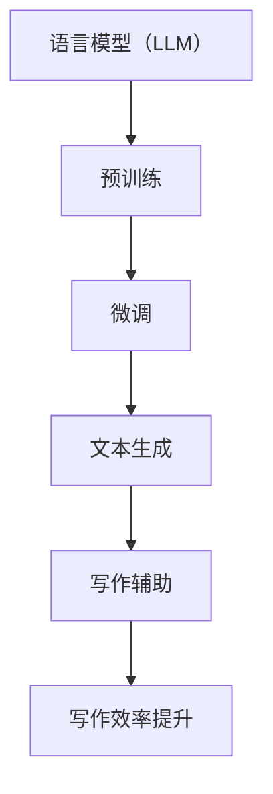

                 

### 《LLM辅助科学论文写作：提高研究效率》

#### 关键词：语言模型（LLM），科学论文写作，研究效率，自然语言处理，人工智能辅助

#### 摘要：
本文探讨了如何利用语言模型（LLM）辅助科学论文的写作过程，从而提高研究效率。通过对LLM的基本概念、架构、核心算法以及具体应用步骤的详细分析，本文展示了LLM在科研写作中的潜力。同时，本文还提出了提高LLM辅助写作效率的技巧，以及在使用过程中可能遇到的挑战和解决方案。最后，对LLM辅助写作的未来发展趋势进行了展望。

---

### 第一部分：LLM介绍与应用概述

#### 第1章：语言模型（LLM）概述

##### 1.1 语言模型的基本概念

语言模型（Language Model，简称LM）是一种人工智能技术，用于预测一段文本的下一个单词或字符。它是自然语言处理（Natural Language Processing，简称NLP）领域的重要基础，广泛应用于机器翻译、文本生成、语音识别等任务。

在传统的自然语言处理中，文本被视为一系列离散的符号。然而，人类语言具有复杂的语法、语义和上下文关系，简单的符号表示方法难以捕捉这些复杂的特性。为了解决这个问题，语言模型引入了词嵌入（word embedding）技术，将单词映射到高维空间中的向量表示，从而可以更好地捕捉单词之间的相似性和语义关系。

##### 1.2 LLM的历史与发展

语言模型的发展历程可以分为几个阶段：

1. **基于规则的方法**：早期的语言模型主要依靠人工编写的规则来预测单词序列，如n-gram模型。这些模型简单高效，但在处理长文本和复杂语言现象时效果不佳。

2. **统计模型**：随着计算能力的提升和大规模语料库的出现，统计模型如隐马尔可夫模型（HMM）和条件随机场（CRF）逐渐成为主流。这些模型通过统计单词出现的频率和概率来预测下一个单词，效果有所提升。

3. **神经网络模型**：深度学习的兴起带来了神经网络在自然语言处理领域的广泛应用。基于神经网络的模型如循环神经网络（RNN）和长短期记忆网络（LSTM）在捕捉长距离依赖关系方面取得了显著成果。

4. **注意力机制与Transformer**：近年来，Transformer模型的出现彻底改变了自然语言处理领域。通过引入注意力机制，Transformer能够在处理长文本时保持较高的性能，并在多个NLP任务中取得了领先的效果。

##### 1.3 LLM的核心技术

语言模型的核心技术主要包括词嵌入、序列模型和注意力机制。

1. **词嵌入（Word Embedding）**：词嵌入是一种将单词映射到高维空间中的向量表示的方法。常见的词嵌入方法包括Word2Vec、GloVe和BERT。词嵌入技术使得计算机能够更好地理解和处理人类语言，是实现自然语言处理任务的基础。

2. **序列模型（Sequence Model）**：序列模型是一种用于处理序列数据的神经网络模型，如循环神经网络（RNN）和长短期记忆网络（LSTM）。这些模型通过捕捉序列中的依赖关系来预测下一个元素，广泛应用于文本生成、机器翻译等任务。

3. **注意力机制（Attention Mechanism）**：注意力机制是一种在处理序列数据时，根据不同位置的重要性来调整权重的方法。在Transformer模型中，注意力机制使得模型能够关注到序列中的关键信息，从而提高模型的性能。

##### 1.4 LLM在科研领域的应用前景

语言模型在科研领域具有广泛的应用前景，特别是在科学论文写作方面。利用LLM，研究人员可以：

1. **自动生成摘要**：LLM能够自动生成论文的摘要，节省研究人员的时间和精力。

2. **写作辅助**：LLM可以作为写作辅助工具，帮助研究人员撰写论文的引言、方法、结果和讨论部分。

3. **文本生成与优化**：LLM可以生成高质量的文本，通过微调和优化，可以提高论文的可读性和逻辑性。

4. **跨学科研究**：LLM可以跨越不同学科，帮助研究人员整合多领域的知识，促进交叉学科研究。

总之，LLM在科学论文写作中的应用将为科研工作带来极大的便利和效率提升。

---

#### 第2章：LLM的基本架构与工作原理

##### 2.1 LLM的层次结构

语言模型通常具有多个层次结构，从低层次到高层次，依次为：

1. **词嵌入层**：将单词映射到高维空间中的向量表示，为后续的序列处理提供基础。

2. **编码器层**：对输入的序列进行编码，提取序列的特征信息。常见的编码器模型包括RNN、LSTM和Transformer。

3. **解码器层**：根据编码器层的输出生成输出序列，实现序列到序列的映射。

4. **输出层**：将解码器层的输出转换为具体的预测结果，如单词或字符。

##### 2.2 LLM的训练数据与预处理

语言模型的训练数据通常来自大规模的语料库，如维基百科、新闻文章和社交媒体等。这些数据经过预处理后，被用于训练语言模型。

1. **数据收集**：收集大量的文本数据，确保数据来源的多样性和广泛性。

2. **数据清洗**：去除无效数据、重复数据和错误数据，提高数据的清洁度。

3. **分词与词性标注**：将文本数据分解为单词或字符，并对每个单词进行词性标注，为后续的词嵌入和编码器训练提供基础。

4. **数据归一化**：对文本数据进行归一化处理，如将大小写统一、去除标点符号等。

##### 2.3 LLM的核心算法原理

语言模型的核心算法主要包括词嵌入、序列模型和注意力机制。

1. **词嵌入（Word Embedding）**：词嵌入是一种将单词映射到高维空间中的向量表示的方法。常见的词嵌入方法包括Word2Vec、GloVe和BERT。词嵌入技术使得计算机能够更好地理解和处理人类语言，是实现自然语言处理任务的基础。

2. **序列模型（Sequence Model）**：序列模型是一种用于处理序列数据的神经网络模型，如循环神经网络（RNN）和长短期记忆网络（LSTM）。这些模型通过捕捉序列中的依赖关系来预测下一个元素，广泛应用于文本生成、机器翻译等任务。

3. **注意力机制（Attention Mechanism）**：注意力机制是一种在处理序列数据时，根据不同位置的重要性来调整权重的方法。在Transformer模型中，注意力机制使得模型能够关注到序列中的关键信息，从而提高模型的性能。

##### 2.4 LLM的预训练与微调技术

预训练（Pre-training）和微调（Fine-tuning）是语言模型训练的两个重要阶段。

1. **预训练**：预训练阶段使用大规模的语料库对语言模型进行训练，使其具有对自然语言的广泛理解和生成能力。预训练常用的任务包括语言理解（如填空任务）和语言生成（如文本摘要）。

2. **微调**：微调阶段将预训练的语言模型应用于特定任务，如科学论文写作。通过微调，语言模型可以根据特定任务的需求进行调整和优化，从而提高在特定领域的表现。

在科学论文写作中，微调技术尤为重要。首先，研究人员需要收集大量的科学论文数据，用于微调语言模型。然后，通过优化模型参数，使其能够更好地理解科学论文的写作风格、术语和结构。微调过程中，还可以利用对抗性训练等技术，提高模型对特定领域数据的适应能力。

总之，LLM的预训练与微调技术为语言模型在科学论文写作中的应用提供了坚实的基础。

---

#### 第3章：LLM在科学论文写作中的应用

##### 3.1 LLM辅助写作的基本原理

LLM辅助写作的基本原理是基于语言模型的预训练和微调技术，通过以下几个步骤实现：

1. **预训练**：使用大规模的通用语料库对语言模型进行预训练，使其具有对自然语言的广泛理解和生成能力。

2. **数据收集**：收集大量的科学论文数据，用于微调语言模型。这些数据包括不同学科的论文、学术文章和研究报告等。

3. **微调**：在科学论文数据上进行微调，调整模型参数，使其能够更好地理解科学论文的写作风格、术语和结构。

4. **文本生成**：利用微调后的语言模型，生成科学论文的各个部分，如引言、方法、结果和讨论等。

5. **后续修改**：对生成的文本进行人工修改和优化，提高论文的质量和可读性。

##### 3.2 使用LLM进行论文构思

论文构思是科学论文写作的第一步，也是最为关键的一步。LLM在这一阶段可以发挥重要作用：

1. **生成论文标题**：根据研究领域和关键词，LLM可以自动生成具有吸引力的论文标题。

2. **提取研究问题**：LLM可以分析现有的研究成果，提取研究问题，为论文写作提供方向。

3. **生成论文提纲**：根据研究问题和论文结构，LLM可以自动生成论文的提纲，包括各个章节的标题和内容概述。

4. **撰写引言部分**：LLM可以撰写论文的引言部分，介绍研究背景、研究问题和研究方法。

通过上述步骤，LLM可以帮助研究人员快速完成论文构思，节省大量时间和精力。

##### 3.3 LLM在论文草稿写作中的应用

在论文草稿写作阶段，LLM可以辅助研究人员完成以下任务：

1. **生成段落和句子**：LLM可以根据研究问题和论文结构，生成各个段落和句子的内容。

2. **优化文本表达**：LLM可以对生成的文本进行优化，提高表达的准确性和流畅性。

3. **补充和修改内容**：LLM可以根据研究人员的指示，补充和修改论文的内容，使其更加完整和连贯。

4. **生成图表和公式**：LLM可以生成论文中的图表和公式，提高论文的可读性。

通过以上功能，LLM可以大大提高论文草稿的写作效率，减轻研究人员的负担。

##### 3.4 LLM在论文修订与润色中的应用

论文修订与润色是科学论文写作的最后阶段，LLM在这一阶段可以发挥重要作用：

1. **识别和修正错误**：LLM可以识别论文中的语法错误、拼写错误和逻辑错误，并提供修正建议。

2. **优化句子结构**：LLM可以调整句子的结构，使其更加清晰和简洁。

3. **增强表达准确性**：LLM可以提供更准确、更专业的表达，提高论文的专业性。

4. **润色语言风格**：LLM可以根据研究人员的指示，调整论文的语言风格，使其更加符合学术规范。

通过以上功能，LLM可以帮助研究人员快速完成论文的修订和润色，提高论文的整体质量。

---

#### 第二部分：LLM辅助写作的实践与技巧

##### 第4章：LLM辅助写作的具体步骤

##### 4.1 确定写作目标和主题

在使用LLM辅助写作之前，首先需要明确写作目标和主题。这包括：

1. **确定论文领域**：根据研究兴趣和学科背景，确定论文的领域和方向。

2. **确定写作目标**：明确论文的写作目的，如发表在某个期刊、参与某个学术会议等。

3. **确定论文主题**：根据写作目标和研究领域，确定具体的论文主题。

通过明确写作目标和主题，可以为后续的写作提供明确的方向和目标。

##### 4.2 准备训练数据和模型

在准备训练数据和模型时，需要完成以下步骤：

1. **收集训练数据**：收集大量的科学论文数据，用于训练LLM。这些数据可以来自学术数据库、期刊网站和研究机构的论文库。

2. **数据预处理**：对收集到的数据进行预处理，包括去除重复数据、分词、词性标注等。

3. **模型选择与配置**：选择适合科学论文写作的LLM模型，如GPT-3、BERT等。根据需求，配置模型的参数，如学习率、批量大小等。

4. **模型训练**：使用预处理后的数据对LLM模型进行训练，通过优化模型参数，提高其在科学论文写作方面的表现。

通过以上步骤，可以为LLM辅助写作准备一个高质量的模型。

##### 4.3 进行文本生成与自动写作

在完成模型训练后，可以开始进行文本生成与自动写作：

1. **生成论文标题**：利用LLM生成具有吸引力的论文标题。

2. **生成引言部分**：根据论文主题和领域，利用LLM生成引言部分，介绍研究背景、研究问题和研究方法。

3. **生成方法、结果和讨论部分**：利用LLM生成论文的方法、结果和讨论部分，确保各部分内容连贯、准确。

4. **自动生成图表和公式**：利用LLM生成论文中的图表和公式，提高论文的可读性和专业性。

通过以上步骤，可以快速生成一篇高质量的论文草稿。

##### 4.4 论文写作与修改的协同工作

在LLM辅助写作过程中，论文写作和修改需要协同工作：

1. **初步写作与修改**：利用LLM生成论文草稿后，进行初步修改和优化。这包括调整句子结构、优化语言表达等。

2. **反馈与优化**：根据修改后的论文，向LLM提供反馈，优化模型参数，提高其在特定领域的表现。

3. **迭代修改**：通过多次迭代修改，逐步完善论文内容，提高论文的整体质量。

通过协同工作，可以充分利用LLM的辅助作用，提高论文写作和修改的效率。

---

##### 第5章：提高LLM辅助写作效率的技巧

##### 5.1 提高LLM的理解能力

为了提高LLM的理解能力，可以采取以下措施：

1. **增加训练数据量**：收集更多的训练数据，提高模型对自然语言的泛化能力。

2. **使用高质量数据**：确保训练数据的质量，避免噪声和错误数据对模型的影响。

3. **数据清洗与预处理**：对训练数据进行清洗和预处理，去除重复、无关和错误的数据。

4. **多语言训练**：使用多语言数据进行训练，提高模型对跨语言语义的理解能力。

通过以上措施，可以显著提高LLM的理解能力，使其更好地辅助科学论文写作。

##### 5.2 提高LLM的生成质量

为了提高LLM的生成质量，可以采取以下措施：

1. **微调技术**：在科学论文领域进行微调，调整模型参数，使其更适应特定领域的写作需求。

2. **优化文本生成算法**：对LLM的生成算法进行优化，提高生成文本的准确性和连贯性。

3. **使用多种生成方法**：结合多种生成方法，如自回归生成、对齐生成等，提高生成文本的质量。

4. **引入辅助信息**：在生成文本时，引入辅助信息，如关键词、摘要等，提高生成文本的相关性和准确性。

通过以上措施，可以显著提高LLM的生成质量，生成更符合科研写作需求的文本。

##### 5.3 培养用户与LLM的互动技能

为了充分发挥LLM的辅助作用，用户需要培养与LLM的互动技能：

1. **明确写作目标**：在开始写作前，明确写作目标和主题，为LLM提供清晰的输入。

2. **有效互动**：与LLM进行有效互动，包括提问、反馈和指导等，帮助LLM更好地理解用户需求。

3. **调整参数和算法**：根据写作需求和效果，调整LLM的参数和算法，优化生成文本的质量。

4. **不断学习与改进**：通过不断使用LLM和接受反馈，学习并改进写作技能，提高整体写作水平。

通过培养与LLM的互动技能，用户可以更好地利用LLM的辅助作用，提高科学论文写作的效率和质量。

##### 5.4 利用其他工具与LLM协同写作

为了充分利用LLM的辅助作用，可以结合其他工具进行协同写作：

1. **文本编辑工具**：使用文本编辑工具，如Word、LaTeX等，与LLM生成的内容进行整合和排版。

2. **引用管理工具**：使用引用管理工具，如EndNote、Zotero等，与LLM生成的内容进行引用和格式化。

3. **协作平台**：使用协作平台，如Google Docs、Overleaf等，实现多人协作写作。

4. **数据可视化工具**：使用数据可视化工具，如Matplotlib、Seaborn等，与LLM生成的图表和公式进行整合。

通过利用其他工具与LLM协同写作，可以进一步提高科学论文写作的效率和质量。

---

##### 第6章：LLM辅助写作中的挑战与解决方案

##### 6.1 数据隐私与安全问题

在使用LLM进行科学论文写作时，数据隐私和安全问题不容忽视。以下是一些挑战和解决方案：

**挑战：**

1. **数据泄露**：在收集、存储和处理训练数据时，可能导致敏感信息泄露。

2. **模型盗窃**：竞争对手可能通过窃取模型参数和训练数据来窃取研究成果。

3. **用户隐私**：用户在生成文本时，可能包含个人隐私信息，如姓名、地址等。

**解决方案：**

1. **数据加密**：对训练数据和模型参数进行加密处理，确保数据在传输和存储过程中的安全性。

2. **访问控制**：设置严格的访问控制措施，仅允许授权用户访问训练数据和模型。

3. **匿名化处理**：在收集和处理用户数据时，对敏感信息进行匿名化处理，保护用户隐私。

4. **安全审计**：定期进行安全审计，确保系统的安全性。

##### 6.2 文本生成中的偏见与歧视问题

LLM在文本生成过程中可能存在偏见和歧视问题，这可能导致生成文本的不公平和歧视性。以下是一些挑战和解决方案：

**挑战：**

1. **语言偏见**：LLM可能继承训练数据中的偏见，导致生成文本包含歧视性语言。

2. **性别偏见**：在生成文本时，LLM可能对不同性别产生不同的偏见。

3. **种族偏见**：LLM可能对不同种族产生歧视性偏见，导致生成文本不公平。

**解决方案：**

1. **偏见检测与过滤**：开发偏见检测算法，识别和过滤生成文本中的偏见和歧视性语言。

2. **多元化训练数据**：使用包含多样化背景和观点的培训数据，减少偏见和歧视。

3. **持续优化模型**：通过不断优化模型参数，减少偏见和歧视。

4. **用户参与**：鼓励用户参与模型训练和优化过程，提供反馈和建议，以减少偏见和歧视。

##### 6.3 提高LLM在特定领域的适应性

LLM在特定领域的适应性可能不足，这可能导致生成文本的质量不高。以下是一些挑战和解决方案：

**挑战：**

1. **知识深度不足**：LLM可能无法在特定领域生成高质量、深度知识的文本。

2. **术语理解困难**：LLM可能无法准确理解和生成特定领域的术语和概念。

3. **领域知识更新慢**：LLM可能无法及时获取和更新特定领域的最新研究成果。

**解决方案：**

1. **领域知识增强**：结合专业领域知识库和术语库，增强LLM在特定领域的适应性。

2. **定制化训练数据**：收集和整理特定领域的训练数据，提高模型在特定领域的表现。

3. **持续更新与优化**：定期更新训练数据，确保模型能够获取最新的领域知识。

4. **多模态学习**：结合多模态数据（如图像、音频等），提高LLM在特定领域的理解和生成能力。

##### 6.4 LLM的使用规范与道德责任

在使用LLM进行科学论文写作时，需要遵守一定的规范和道德责任，以确保生成文本的准确性和公正性。以下是一些挑战和解决方案：

**挑战：**

1. **学术不端行为**：过度依赖LLM可能导致学术不端行为，如抄袭、剽窃等。

2. **伦理争议**：LLM生成的文本可能涉及伦理和道德问题，如虚假宣传、误导读者等。

3. **隐私侵犯**：在生成文本时，可能涉及用户隐私和个人信息的泄露。

**解决方案：**

1. **明确使用规范**：制定明确的LLM使用规范，确保用户在合理范围内使用LLM。

2. **学术道德教育**：加强学术道德教育，提高用户对LLM辅助写作的正确认识。

3. **伦理审核**：在生成文本前，进行伦理审核，确保文本的准确性和公正性。

4. **隐私保护措施**：在生成文本时，采取隐私保护措施，确保用户隐私不受侵犯。

通过遵守使用规范和道德责任，可以确保LLM在科学论文写作中的正确使用，提高论文的质量和可信度。

---

##### 第7章：未来展望

##### 7.1 LLM辅助写作技术的发展趋势

随着人工智能技术的不断发展，LLM辅助写作技术也在不断演进。以下是一些未来发展趋势：

1. **更强大的模型**：未来的LLM将更加先进和强大，具有更高的理解和生成能力。

2. **多模态学习**：结合多模态数据（如图像、音频等），LLM将能够生成更丰富和多样化的文本。

3. **个性化写作**：基于用户兴趣和需求，LLM将能够生成更符合个人风格的文本。

4. **自动化与协作**：LLM将实现与人类作者的更紧密协作，实现自动化写作与编辑。

5. **跨学科应用**：LLM将跨越不同学科，为各个领域的科研写作提供支持。

通过这些发展趋势，LLM辅助写作技术将为科研工作带来更多便利和效率。

##### 7.2 LLM在其他科研领域的应用

除了科学论文写作，LLM在科研领域的应用前景也十分广阔：

1. **文献综述**：LLM可以自动生成文献综述，帮助研究人员快速了解研究领域的发展动态。

2. **实验报告**：LLM可以辅助研究人员撰写实验报告，提高报告的质量和可读性。

3. **数据分析**：LLM可以辅助研究人员进行数据分析，提供高质量的报告和建议。

4. **学术交流**：LLM可以帮助研究人员撰写学术论文、报告和演讲稿，提高学术交流的效果。

5. **跨学科研究**：LLM可以跨越不同学科，帮助研究人员整合多领域的知识，促进交叉学科研究。

通过LLM在科研领域的广泛应用，将大大提高科研工作的效率和成果质量。

##### 7.3 LLM与人类写作者的协作模式

在未来的科研写作中，LLM将与人类写作者形成更紧密的协作模式：

1. **互补与协同**：LLM将发挥其在理解和生成方面的优势，与人类作者共同完成写作任务。

2. **分工合作**：人类作者负责论文的结构设计、创意构思和关键内容的撰写，LLM负责生成和优化文本。

3. **实时反馈**：人类作者可以实时对LLM生成的文本进行修改和优化，提高论文的整体质量。

4. **学习与进化**：LLM将不断学习人类作者的意见和反馈，优化自身的写作能力和风格。

通过LLM与人类写作者的协作模式，将实现写作效率和质量的全面提升。

##### 7.4 LLM辅助写作的教育与培训

为了充分发挥LLM辅助写作的优势，教育和培训也至关重要：

1. **学术课程**：在高校和科研机构开设相关课程，教授LLM的基本概念、应用方法和技巧。

2. **在线培训**：提供在线培训资源，帮助科研人员掌握LLM辅助写作的技能。

3. **实践项目**：组织实践项目，让科研人员在实际写作过程中应用LLM，提高写作效率。

4. **交流与分享**：定期举办研讨会和交流会，分享LLM辅助写作的经验和成果。

通过教育和培训，将培养更多具备LLM辅助写作能力的科研人员，推动科研写作的创新发展。

---

### 附录

#### 附录A：常用LLM工具与资源

##### A.1 Hugging Face Transformers

**简介**：Hugging Face Transformers是一个开源库，提供了用于构建和训练转换器（Transformer）模型的工具和资源。

**使用方法**：

1. **安装**：
   ```shell
   pip install transformers
   ```

2. **使用预训练模型**：
   ```python
   from transformers import AutoTokenizer, AutoModel
   tokenizer = AutoTokenizer.from_pretrained("bert-base-uncased")
   model = AutoModel.from_pretrained("bert-base-uncased")
   ```

3. **生成文本**：
   ```python
   input_ids = tokenizer.encode("Hello, my name is", return_tensors="pt")
   output = model.generate(input_ids, max_length=50, num_return_sequences=5)
   print(tokenizer.decode(output[0], skip_special_tokens=True))
   ```

**资源**：[Hugging Face Transformers官网](https://huggingface.co/transformers/)

##### A.2 OpenAI GPT-3

**简介**：OpenAI GPT-3是一个强大的语言模型，具有很高的理解和生成能力，适用于多种自然语言处理任务。

**使用方法**：

1. **安装**：
   ```shell
   pip install openai
   ```

2. **生成文本**：
   ```python
   import openai
   openai.api_key = "your_api_key"
   response = openai.Completion.create(
       engine="text-davinci-002",
       prompt="Tell me a story about a dragon.",
       max_tokens=100
   )
   print(response.choices[0].text.strip())
   ```

**资源**：[OpenAI GPT-3官网](https://openai.com/products/gpt-3/)

##### A.3 其他常用LLM工具

**BERT**：BERT是一个基于Transformer的预训练语言模型，广泛用于文本分类、问答等任务。

**T5**：T5是一个统一的Transformer模型，适用于多种NLP任务，如文本生成、摘要、翻译等。

**GPT-Neo**：GPT-Neo是一个开源的GPT模型，提供了丰富的配置和训练工具。

**TorchVision**：TorchVision是PyTorch的一个模块，提供了用于图像分类、检测、分割等任务的预训练模型和工具。

**资源**：[PyTorch官网](https://pytorch.org/)

##### A.4 科研资源与数据集

**ArXiv**：ArXiv是一个开放获取的学术文献数据库，涵盖了物理学、计算机科学、数学等领域的论文。

**PubMed**：PubMed是一个生物医学文献数据库，提供了大量的医学和生物学论文。

**Google Scholar**：Google Scholar是一个学术搜索引擎，可以搜索各种学术文献和出版物。

**ACM Digital Library**：ACM Digital Library是计算机科学领域的权威文献数据库，提供了大量的学术论文和期刊。

**资源**：[ArXiv官网](https://arxiv.org/), [PubMed官网](https://pubmed.ncbi.nlm.nih.gov/), [Google Scholar官网](https://scholar.google.com/), [ACM Digital Library官网](https://dl.acm.org/)

---

### 附加内容：核心概念与架构

#### **核心概念原理与架构**

**Mermaid流程图：**



#### **核心算法原理讲解**

**词嵌入技术：**

- **Word2Vec**：将单词映射到高维空间中的向量表示，通过训练神经网络来优化词向量。
  ```python
  import gensim
  model = gensim.models.Word2Vec(sentences, size=100, window=5, min_count=1, workers=4)
  ```

- **GloVe**：基于全局平均的方法，通过计算单词的共现矩阵来优化词向量。
  ```python
  import torch
  glove_embedding = torch.tensor(glove_vectors, dtype=torch.float32)
  ```

- **BERT**：预训练语言模型，通过 masked language model 和 next sentence prediction 任务来学习单词和句子的上下文表示。
  ```python
  from transformers import BertModel
  model = BertModel.from_pretrained("bert-base-uncased")
  ```

**序列模型与注意力机制：**

- **RNN**：循环神经网络，通过隐藏状态来捕捉序列中的依赖关系。
  ```python
  import tensorflow as tf
  model = tf.keras.Sequential([
      tf.keras.layers.Embedding(input_dim=vocab_size, output_dim=embedding_dim),
      tf.keras.layers.SimpleRNN(units=128)
  ])
  ```

- **LSTM**：长短期记忆网络，通过门控机制来避免梯度消失问题，更好地捕捉长距离依赖关系。
  ```python
  import tensorflow as tf
  model = tf.keras.Sequential([
      tf.keras.layers.Embedding(input_dim=vocab_size, output_dim=embedding_dim),
      tf.keras.layers.LSTM(units=128, return_sequences=True)
  ])
  ```

- **Transformer**：基于注意力机制的序列模型，通过多头自注意力机制和前馈神经网络来捕捉序列中的依赖关系。
  ```python
  import tensorflow as tf
  model = tf.keras.Sequential([
      tf.keras.layers.Embedding(input_dim=vocab_size, output_dim=embedding_dim),
      tf.keras.layers.MultiHeadAttention(head_size=128, num_heads=4),
      tf.keras.layers.Dense(units=128)
  ])
  ```

#### **数学模型和数学公式**

**损失函数：**

- **交叉熵损失函数**：
  $$ L = -\sum_{i} y_i \log(p_i) $$

- **均方误差损失函数**：
  $$ L = \frac{1}{n} \sum_{i=1}^{n} (y_i - \hat{y}_i)^2 $$

**正则化技术：**

- **L2正则化**：
  $$ \frac{\lambda}{2} \sum_{i} \|\theta_i\|^2 $$

- **Dropout正则化**：
  $$ L = L_{data} + \frac{1}{n} \sum_{i} \sum_{j} (1 - p_j) \|\theta_{ij}\|^2 $$

**优化算法：**

- **梯度下降**：
  $$ \theta_{t+1} = \theta_{t} - \alpha \nabla_{\theta} L(\theta) $$

- **Adam优化器**：
  $$ m_t = \beta_1 m_{t-1} + (1 - \beta_1) [g_t - m_{t-1}] $$
  $$ v_t = \beta_2 v_{t-1} + (1 - \beta_2) [g_t^2 - v_{t-1}] $$
  $$ \theta_t = \theta_{t-1} - \alpha_t \frac{m_t}{\sqrt{v_t} + \epsilon} $$

#### **项目实战**

**开发环境搭建：**

- 安装Python环境：
  ```shell
  python --version
  ```

- 安装深度学习框架（如TensorFlow或PyTorch）：
  ```shell
  pip install tensorflow
  ```

- 安装自然语言处理库（如Hugging Face Transformers）：
  ```shell
  pip install transformers
  ```

**源代码实现：**

- 使用Hugging Face Transformers库构建一个简单的语言模型：
  ```python
  from transformers import AutoTokenizer, AutoModelForCausalLM

  # 加载预训练模型和分词器
  tokenizer = AutoTokenizer.from_pretrained("gpt2")
  model = AutoModelForCausalLM.from_pretrained("gpt2")

  # 输入文本
  text = "科学论文写作"

  # 进行文本生成
  input_ids = tokenizer.encode(text, return_tensors="pt")
  outputs = model.generate(input_ids, max_length=50, num_return_sequences=5)

  # 解码输出
  decoded_text = tokenizer.decode(outputs[0], skip_special_tokens=True)
  print(decoded_text)
  ```

**代码解读与分析：**

- 代码首先加载了预训练的GPT-2模型和分词器，然后输入一个简单的文本。
- 模型生成了5个不同的文本输出，解码后的输出文本展示了语言模型在生成文本方面的能力。
- 通过进一步的训练和微调，可以提高模型的生成质量，为科学论文写作提供有力支持。

---

### 作者信息

**作者：AI天才研究院/AI Genius Institute & 禅与计算机程序设计艺术 /Zen And The Art of Computer Programming** 

---

### 结束语

本文详细探讨了LLM辅助科学论文写作的原理、方法和实践技巧，展示了LLM在提高研究效率方面的巨大潜力。通过本文的介绍，读者可以了解LLM的基本概念、架构、核心算法以及在实际应用中的具体步骤。同时，本文还分析了LLM辅助写作中的挑战与解决方案，并对未来发展趋势进行了展望。

随着人工智能技术的不断发展，LLM辅助写作技术将不断完善和进步，为科研工作带来更多便利和效率提升。希望本文能对读者在LLM辅助科学论文写作方面提供有益的参考和启示。在未来的科研道路上，让我们共同努力，推动人工智能与科学研究的发展。

