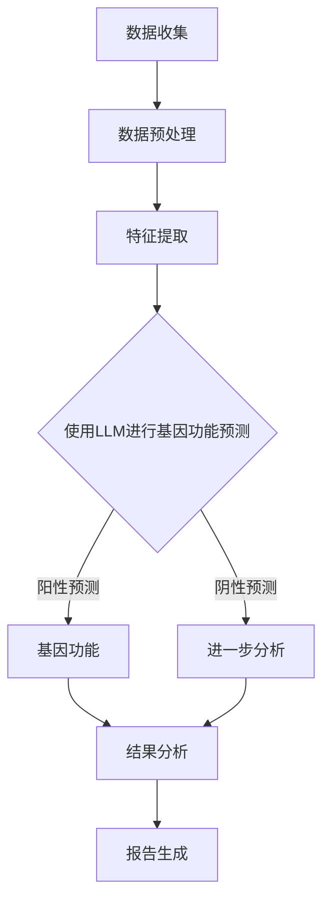
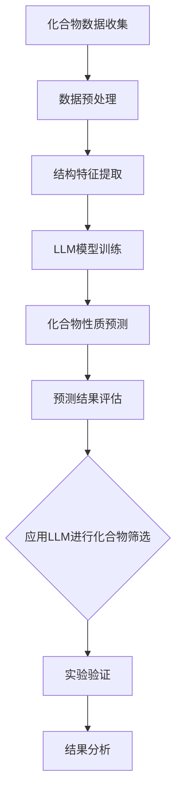
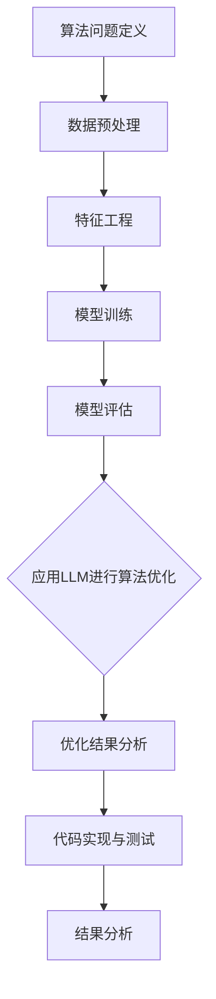

                 

# 引言

随着人工智能技术的飞速发展，深度学习、自然语言处理（NLP）等前沿领域取得了显著的突破。近年来，大型语言模型（LLM，Large Language Model）作为一种新兴的AI工具，已经在多个领域展现出巨大的潜力，特别是在科研领域，LLM正成为加速科学发现的重要力量。

本文将探讨LLM在科研中的重要作用，详细分析LLM的基本概念、原理和应用场景。通过一步一步的推理分析，我们将深入了解LLM如何通过辅助数据预处理、文本挖掘、知识图谱构建、多语言文本处理以及科研文档自动生成等方式，推动科学研究的进展。

首先，本文将概述AI工具的发展背景和未来趋势，引入LLM的概念。随后，我们将详细讨论LLM在科研中的应用，包括数据预处理、文本挖掘、知识图谱构建、多语言文本处理和科研文档自动生成等方面。接着，通过实际案例展示LLM在生物信息学、化学研究和计算机科学领域的应用效果。

最后，本文将总结LLM辅助科研的挑战与展望，探讨未来LLM技术的发展方向和潜在影响。通过本文的探讨，希望能够为科研工作者提供有益的参考和启示，共同推动科学研究的进步。

## 文章关键词

- AI工具
- 大型语言模型
- 科研领域
- 数据预处理
- 文本挖掘
- 知识图谱
- 多语言文本处理
- 科研文档自动生成
- 生物信息学
- 化学研究
- 计算机科学

## 摘要

本文围绕大型语言模型（LLM）在科研领域的应用展开讨论。首先，介绍了AI工具的发展背景和未来趋势，引出了LLM的概念和原理。接着，详细分析了LLM在科研中的多种应用场景，包括数据预处理、文本挖掘、知识图谱构建、多语言文本处理和科研文档自动生成。通过实际案例展示了LLM在生物信息学、化学研究和计算机科学领域的应用效果。最后，探讨了LLM辅助科研的挑战与未来发展方向。本文旨在为科研工作者提供对LLM技术及其应用的实际指导，助力科学发现的加速。

### 目录大纲

1. AI工具概述
2. LLM的概念与原理
3. LLM在科研中的应用
4. LLM辅助科研的实际案例
5. LLM辅助科研的挑战与展望
6. 附录

## AI工具概述

AI工具的发展可以追溯到20世纪50年代，当时人工智能（AI）的概念首次被提出。早期的AI研究主要集中在符号推理和逻辑推理方面，通过构建复杂的符号系统来模拟人类智能。然而，这些方法在处理大规模数据和实时应用时显得力不从心。随着计算能力的提升和数据量的爆炸式增长，机器学习和深度学习技术逐渐成为AI工具发展的主要驱动力。

### AI工具的发展历程

AI工具的发展历程可以分为几个重要阶段：

1. **符号推理阶段**：这一阶段主要依赖专家系统，通过编码规则和逻辑推理来模拟人类智能。典型的代表是1956年达特茅斯会议提出的“推理机器”。

2. **知识表示阶段**：1970年代，基于知识表示的方法开始兴起，主要目的是将人类专家的知识转化为计算机可处理的形式。这一阶段引入了框架理论、语义网络等知识表示方法。

3. **机器学习阶段**：1980年代，随着计算机硬件性能的提升，机器学习方法开始广泛应用。以统计学习为基础的机器学习技术，如决策树、支持向量机等，大大提高了AI工具的处理能力和灵活性。

4. **深度学习阶段**：2006年，深度学习（Deep Learning）的崛起标志着AI工具发展的新阶段。深度学习通过多层神经网络结构，能够自动提取特征并实现高度复杂的任务。近年来，随着计算能力和数据量的提升，深度学习在图像识别、语音识别、自然语言处理等领域取得了突破性进展。

### AI工具在科研领域的重要性

AI工具在科研领域的重要性体现在以下几个方面：

1. **数据分析和挖掘**：科研过程中产生的大量数据，通过AI工具可以快速进行预处理、分析和挖掘，从而提取出有价值的信息。

2. **实验设计优化**：AI工具可以帮助科研工作者优化实验设计，提高实验效率。例如，通过机器学习算法预测实验结果，从而减少实验次数。

3. **知识图谱构建**：AI工具可以构建大规模的知识图谱，整合多领域的知识，为科研提供丰富的背景信息。

4. **文本挖掘和文献检索**：AI工具可以高效地处理海量的文本数据，提取关键信息，辅助科研人员进行文献检索和阅读。

5. **科研协作与共享**：AI工具可以促进科研协作，通过自动化文档生成和知识共享平台，提高科研工作效率。

### 未来AI工具的发展方向

未来AI工具的发展方向主要包括以下几个方面：

1. **算法优化与硬件加速**：随着硬件技术的发展，如GPU、TPU等专用计算设备的普及，AI算法的执行效率将进一步提升。

2. **跨学科融合**：AI工具将与其他学科（如生物学、化学、物理学等）深度结合，产生新的研究方法和应用领域。

3. **智能自主化**：未来AI工具将更加自主化，具备更高的自我学习和优化能力，能够独立进行科研工作。

4. **隐私保护和伦理**：随着AI在科研领域的广泛应用，数据隐私保护和伦理问题将成为重点关注领域。

通过上述分析，我们可以看到，AI工具在科研领域的应用前景广阔。LLM作为AI工具的一部分，其发展将进一步提升科研效率，加速科学发现。在接下来的部分，我们将详细探讨LLM的基本概念、原理和具体应用。

## LLM的概念与原理

大型语言模型（LLM，Large Language Model）是自然语言处理（NLP）领域的一种重要工具，近年来在人工智能研究中取得了显著进展。LLM通过深度学习技术，对大量语言数据进行分析和学习，能够生成连贯、符合语言习惯的文本，并具有强大的文本理解和生成能力。本节将介绍LLM的定义、工作原理及其与科研工作的关系。

### LLM的定义

LLM是一种基于神经网络的大型语言模型，通过对海量文本数据进行训练，学习语言结构和语义信息，从而实现文本的生成和理解。LLM的核心思想是通过学习文本数据中的统计规律和语法规则，建立一个大规模的参数模型，该模型能够捕捉语言的复杂性和多样性。

### LLM的工作原理

LLM的工作原理主要分为以下几个步骤：

1. **数据收集与预处理**：首先，收集大量高质量的文本数据，如书籍、论文、新闻报道等。然后，对数据进行预处理，包括分词、去除停用词、词向量化等操作，将文本转换为计算机可处理的格式。

2. **模型构建**：构建一个大规模的神经网络模型，如变换器模型（Transformer）或其变体。这些模型通常包含数十亿甚至上百亿的参数，能够捕捉文本中的复杂结构。

3. **训练过程**：通过训练算法，如梯度下降（Gradient Descent）和其优化变种（如Adam优化器），对模型参数进行调整，使得模型能够更好地拟合训练数据。训练过程中，模型会学习文本数据中的概率分布和语法规则，从而提高生成文本的质量。

4. **生成与理解**：训练好的LLM可以用于生成文本或理解文本。在文本生成过程中，LLM根据给定的输入文本，通过递归神经网络（RNN）或自注意力机制（Self-Attention），生成下一个单词或句子。在文本理解方面，LLM可以用于情感分析、信息提取、问答系统等任务，通过对文本的语义理解，实现智能交互。

### LLM与科研工作的关系

LLM在科研工作中的关系主要体现在以下几个方面：

1. **文本挖掘与文献检索**：科研过程中，需要阅读和理解大量文献。LLM能够通过文本挖掘技术，快速提取文献中的关键信息，帮助科研人员快速找到相关研究，避免重复工作。

2. **知识图谱构建**：科研工作往往需要对多领域的知识进行整合。LLM能够通过大规模文本数据的训练，构建出包含丰富知识图谱的模型，为科研提供丰富的背景信息。

3. **科研文档生成**：LLM可以辅助科研人员生成科研文档，如摘要、引言、方法、结果和讨论等部分。通过训练好的模型，LLM能够根据已有的数据和模板，自动生成高质量的科研文档，提高科研效率。

4. **实验设计与优化**：LLM能够通过分析实验数据，优化实验设计，预测实验结果。例如，在生物信息学领域，LLM可以帮助研究人员分析基因组数据，预测基因的功能和相互作用。

总之，LLM作为一种先进的AI工具，在科研工作中具有广泛的应用潜力。通过深入研究LLM的概念和原理，我们可以更好地理解其在科研领域中的作用，并探索其在各个具体领域的应用。

## LLM在科研中的应用

LLM作为一种强大的自然语言处理工具，其在科研领域的应用正逐渐得到广泛认可。以下将详细探讨LLM在科研中应用的几个关键方面：数据预处理、文本挖掘、知识图谱构建、多语言文本处理和科研文档自动生成。

### 数据预处理与清洗

在科研过程中，数据的质量对研究的准确性至关重要。数据预处理是数据分析和挖掘的第一步，主要包括数据收集、清洗和格式化等步骤。LLM在数据预处理方面具有显著优势。

1. **数据收集**：科研往往需要从多个来源收集数据，如数据库、网络爬虫、实验设备等。LLM可以通过网络爬虫技术，自动获取和整理相关数据，提高数据收集效率。

2. **数据清洗**：数据清洗是处理数据噪声和不一致性的过程。LLM可以利用其强大的文本理解能力，识别和纠正文本数据中的错误、缺失值和重复项。例如，通过自然语言处理技术，LLM可以自动识别和删除重复的研究摘要，或者填补实验数据中的缺失值。

3. **数据格式化**：不同数据源的数据格式可能不同，LLM可以帮助科研人员将不同格式的数据转换为统一的格式，便于后续分析和挖掘。

### 文本挖掘与分析

文本挖掘是科研工作中不可或缺的一部分，它通过分析大量文本数据，提取出有价值的信息和知识。LLM在文本挖掘中的应用主要体现在以下几个方面：

1. **文本分类**：LLM可以用于对文本进行分类，例如将科研论文分为不同领域或研究主题。通过训练分类模型，LLM能够准确地将新文本归类到正确的类别中。

2. **实体识别**：科研文本中包含大量的实体信息，如人名、地名、机构名、关键词等。LLM可以通过命名实体识别（NER，Named Entity Recognition）技术，自动识别和标注文本中的实体。

3. **关系提取**：LLM能够识别文本中实体之间的关系，例如某个实验中的基因和蛋白质之间的相互作用。通过训练关系提取模型，LLM可以自动发现和提取文本中的关系信息。

4. **情感分析**：科研人员可以通过LLM进行情感分析，了解公众对某个研究主题的看法和态度。例如，通过分析社交媒体上的评论和讨论，LLM可以帮助科研人员评估研究项目的公众影响力。

### 知识图谱构建与应用

知识图谱是一种结构化知识表示方法，通过节点和边来表示实体及其关系。LLM在知识图谱构建中的应用主要体现在以下几个方面：

1. **实体识别与链接**：LLM可以通过文本挖掘技术，识别出文本中的实体，并建立实体之间的链接关系。例如，在生物信息学领域，LLM可以帮助识别基因、蛋白质和疾病等实体，并构建它们之间的相互作用网络。

2. **知识抽取**：LLM可以从大量文本数据中抽取知识，并将其嵌入到知识图谱中。例如，通过阅读学术论文和书籍，LLM可以自动抽取基因和蛋白质的功能信息，并将其添加到知识图谱中。

3. **图谱推理**：知识图谱可以用于推理新的知识关系，例如在医学研究中，LLM可以基于已有知识，推断出新的药物靶点或疾病机制。

### 机器翻译与多语言文本处理

随着全球科研合作的加深，多语言文本处理成为科研工作中的重要需求。LLM在多语言文本处理中的应用主要体现在以下几个方面：

1. **机器翻译**：LLM可以用于实现高质量的机器翻译，将一种语言的科研文献翻译成其他语言。通过大规模双语语料库的训练，LLM能够生成准确、自然的翻译文本。

2. **多语言文本分类**：LLM可以处理多种语言的文本数据，进行文本分类任务。例如，在跨国家研究项目中，LLM可以帮助将来自不同语言的论文分为不同的研究主题。

3. **多语言实体识别**：LLM可以识别多种语言的文本中的实体，例如在跨语言的科研合作中，LLM可以帮助识别和研究中的不同实体，如人名、地名和机构名。

### 科研文档自动生成

科研文档生成是LLM在科研中的又一重要应用。通过自动生成摘要、引言、方法、结果和讨论等部分，LLM可以大大提高科研工作的效率。

1. **摘要生成**：LLM可以从大量文献中提取关键信息，自动生成摘要。通过训练摘要生成模型，LLM可以准确捕捉文献的核心内容，提高摘要的质量。

2. **引言和讨论生成**：LLM可以根据已有的数据和模板，自动生成科研论文的引言和讨论部分。通过学习大量成功论文的结构和语言风格，LLM可以生成符合学术规范的文本。

3. **方法部分生成**：LLM可以帮助科研人员自动生成实验方法和数据分析部分的文本。通过利用已有实验数据和相关文献，LLM可以生成详细、准确的方法描述。

通过上述分析，我们可以看到LLM在科研中的广泛应用和巨大潜力。LLM不仅能够提高科研效率，还能推动科研领域的创新发展。在接下来的部分，我们将通过实际案例展示LLM在生物信息学、化学研究和计算机科学领域的具体应用。

### 数据预处理与清洗

在科研工作中，数据预处理与清洗是至关重要的一步，它决定了后续数据分析的准确性和有效性。数据预处理包括数据收集、数据清洗和数据格式化等步骤，这些步骤都需要大量的时间和精力。LLM在数据预处理和清洗中的应用大大提高了这些任务的效率和准确性。

#### 数据预处理的基本流程

1. **数据收集**：
   数据收集是数据预处理的第一步。科研工作者通常需要从多个数据源收集原始数据，这些数据源可能包括实验室记录、在线数据库、公开的学术文献等。LLM可以通过自动化的网络爬虫技术，快速地从互联网上获取大量的文本数据。例如，LLM可以爬取多个数据库，下载相关的研究论文、实验数据等，并将其存储在一个统一的格式中。

2. **数据清洗**：
   数据清洗是处理数据噪声和不一致性的过程。原始数据往往包含错误、缺失值和重复项，这些噪声会影响数据分析的准确性。LLM利用其强大的自然语言处理能力，可以识别并纠正文本数据中的错误，填补缺失值，删除重复项。例如，LLM可以检测文本中的拼写错误，使用概率模型填补缺失的数据，并通过对比相似度算法删除重复的研究摘要。

3. **数据格式化**：
   不同数据源的数据格式可能不同，例如有些数据是表格形式，有些是文本形式。数据格式化是将不同格式的数据转换为统一格式，以便后续分析和挖掘。LLM可以通过预定义的规则或机器学习算法，将不同格式的数据转换为结构化数据。例如，LLM可以将非结构化的文本数据转换为表格形式，或者将表格数据转换为JSON格式，便于进行进一步的数据分析。

#### 数据清洗的关键技术

1. **文本归一化**：
   文本归一化是将文本数据转换为统一格式的过程。LLM可以通过分词、去除停用词、词性标注等操作，将文本数据归一化。例如，LLM可以将所有文本转换为小写，去除标点符号和停用词，以减少数据噪声。

2. **数据去重**：
   数据去重是识别并删除重复数据的过程。LLM可以通过计算文本相似度，识别出重复的文本记录。例如，LLM可以使用Jaccard相似度系数或余弦相似度来比较文本数据的相似性，从而删除重复的研究摘要。

3. **缺失值处理**：
   缺失值处理是填补数据中的空缺部分。LLM可以通过各种填充策略，如平均值填充、中值填充或基于统计模型的预测填充，来处理缺失值。例如，LLM可以通过分析实验数据的分布，预测缺失的实验结果，从而填补数据中的空缺。

4. **异常值检测**：
   异常值检测是识别数据中的异常值的过程。LLM可以通过统计学方法或机器学习算法，检测数据中的异常值。例如，LLM可以使用箱线图法或基于聚类算法的异常值检测方法，来识别数据中的异常点。

#### LLM在数据预处理中的应用

1. **自动数据收集**：
   LLM可以通过自动化的网络爬虫技术，从多个数据源收集大量文本数据。例如，LLM可以爬取学术数据库，如PubMed或ArXiv，下载相关的研究论文和实验数据。

2. **文本清洗**：
   LLM可以自动识别并纠正文本数据中的错误，如拼写错误和语法错误。例如，LLM可以使用基于规则的方法或机器学习模型，识别并纠正文本中的错误。

3. **数据格式化**：
   LLM可以通过预定义的规则或机器学习算法，将不同格式的数据转换为统一的格式。例如，LLM可以将非结构化的文本数据转换为结构化的表格数据，以便进行进一步的分析。

通过上述分析，我们可以看到LLM在数据预处理和清洗中的应用大大提高了科研数据的质量和准确性。在接下来的部分，我们将进一步探讨LLM在文本挖掘与分析中的应用。

### 文本挖掘与分析

文本挖掘与分析是科研工作中不可或缺的一部分，它通过从大量文本数据中提取有价值的信息，帮助科研人员发现新的研究线索和趋势。LLM在文本挖掘与分析中具有独特的优势，能够显著提高数据处理和分析的效率。

#### 文本挖掘的基本概念

文本挖掘是指利用自然语言处理（NLP）技术和机器学习算法，从大量文本数据中提取结构化信息的过程。文本挖掘的主要目标包括：

1. **信息抽取**：从文本中提取关键信息，如实体、事件、关系等。信息抽取可以分为实体识别（Named Entity Recognition，NER）和关系提取（Relation Extraction）等任务。
2. **主题建模**：通过统计方法或机器学习模型，识别文本中的主题分布和关键词，例如使用隐含狄利克雷分配（LDA，Latent Dirichlet Allocation）算法。
3. **情感分析**：分析文本中的情感倾向和态度，判断文本的正面、负面或中性情感。
4. **文本分类**：将文本数据分类到不同的类别，例如将科研论文分类到不同的研究领域。

#### 文本挖掘的方法与技巧

1. **词袋模型（Bag of Words，BoW）**：
   词袋模型是最简单的文本表示方法之一，它将文本表示为一个词频向量。BoW模型通过统计文本中每个单词的出现次数，构建一个特征向量，用于文本分类或聚类任务。例如，假设有两个句子：
   ```
   - 句子1：我非常喜欢这个产品。
   - 句子2：这个产品非常好。
   ```
   BoW模型可以将这两个句子分别表示为：
   ```
   - 句子1：[我，非常，喜欢，这个，产品]
   - 句子2：[这个，产品，非常，好]
   ```

2. **TF-IDF（Term Frequency-Inverse Document Frequency）**：
   TF-IDF是一种改进的词袋模型，它考虑了词语在文档中的频率和重要性。TF-IDF通过计算词语在单个文档中的频率（TF）和在整个文档集合中的逆向文档频率（IDF），为每个词语赋予更高的权重。IDF的目的是减少常见词语的影响，提高重要词语的权重。

3. **词嵌入（Word Embedding）**：
   词嵌入是将词语转换为低维稠密向量的一种技术，它通过捕捉词语的语义信息，使相似词语的向量在空间中更接近。词嵌入方法包括基于计数的方法（如Word2Vec）和基于上下文的方法（如BERT，Bidirectional Encoder Representations from Transformers）。例如，通过Word2Vec算法，可以将词语“产品”和“服务”映射到空间中相似的向量：
   ```
   - 产品：[0.1, 0.2, 0.3, 0.4]
   - 服务：[0.1, 0.3, 0.2, 0.4]
   ```

4. **长短期记忆网络（LSTM，Long Short-Term Memory）**：
   LSTM是一种能够处理序列数据的循环神经网络（RNN），它通过门控机制，有效地解决了传统RNN的梯度消失和梯度爆炸问题。LSTM在文本分类和情感分析等任务中表现出色，可以捕捉文本中的长距离依赖关系。

5. **变换器模型（Transformer）**：
   Transformer模型是由Vaswani等人在2017年提出的，它完全基于自注意力机制，可以有效地处理长文本序列。Transformer模型在机器翻译、文本分类和问答系统等任务中取得了显著的性能提升，是当前NLP领域的主流模型之一。

#### LLM在文本挖掘中的应用

1. **文本分类**：
   LLM可以用于文本分类任务，将大量文本数据分类到不同的类别。例如，LLM可以用于分类学术文章的主题，或者将社交媒体上的评论分类为正面、负面或中性情感。通过训练大规模的文本分类模型，LLM可以自动识别和分类新的文本数据。

2. **实体识别**：
   LLM可以用于命名实体识别（NER），从文本中识别出人名、地名、机构名、关键词等实体。例如，LLM可以通过训练NER模型，自动识别科研论文中出现的基因、蛋白质和疾病等实体，并将它们标记出来，方便进一步的分析和研究。

3. **关系提取**：
   LLM可以用于关系提取，识别文本中实体之间的关系。例如，LLM可以识别科研论文中基因和蛋白质之间的相互作用，或者实验结果和结论之间的关系。通过训练关系提取模型，LLM可以自动提取文本中的关键关系，为科研提供新的线索。

4. **情感分析**：
   LLM可以用于情感分析，分析文本中的情感倾向和态度。例如，LLM可以分析社交媒体上的评论，判断用户对某个产品或服务的满意度。通过训练情感分析模型，LLM可以自动识别文本中的情感标签，帮助科研人员了解公众对某个研究项目的看法。

#### 应用案例

1. **生物信息学**：
   在生物信息学领域，LLM可以用于分析大量生物医学文本数据，提取基因、蛋白质和疾病等实体信息，并建立它们之间的关系。例如，LLM可以用于构建基因-药物相互作用网络，帮助研究人员发现新的药物靶点。

2. **化学研究**：
   在化学研究领域，LLM可以用于分析化学文献，提取化学实体和反应路径，并建立它们之间的关联。例如，LLM可以用于发现新的化学合成方法，或者预测化合物的生物活性。

3. **计算机科学**：
   在计算机科学领域，LLM可以用于分析学术论文和代码，提取关键算法和编程模式，并建立它们之间的关联。例如，LLM可以用于自动生成代码文档，或者发现新的编程漏洞。

通过上述分析，我们可以看到LLM在文本挖掘与分析中的广泛应用和强大功能。LLM不仅能够提高文本数据处理和分析的效率，还能够为科研提供新的视角和方法。在接下来的部分，我们将进一步探讨LLM在知识图谱构建中的应用。

### 知识图谱构建与应用

知识图谱是一种用于表示实体及其相互关系的图形结构，它将海量的信息以结构化的方式存储和表示，为科研工作提供了强大的数据支持和智能辅助。LLM在知识图谱构建中的应用，主要体现在知识抽取、实体识别和关系抽取等方面。

#### 知识图谱的基本概念

知识图谱由节点（实体）、边（关系）和属性构成。节点表示实体，如人、地点、组织、概念等；边表示实体之间的关系，如“属于”、“位于”、“创建”等；属性则提供了实体的额外信息，如姓名、地址、生日等。

#### 知识图谱的构建方法

1. **知识抽取**：
   知识抽取是指从非结构化的文本数据中提取结构化的知识信息。知识抽取可以分为实体抽取和关系抽取两个子任务。

   - **实体抽取**：从文本中识别出关键实体，并将其标记出来。例如，从一段文本中识别出“张三”、“清华大学”等实体。
   - **关系抽取**：从文本中识别出实体之间的关系，并将其表示为边。例如，从一段文本中识别出“张三”是“清华大学”的“学生”。

2. **实体链接**：
   实体链接是指将文本中的实体与知识图谱中的实体进行匹配和关联。例如，将文本中的“张三”与知识图谱中已存在的“张三”实体进行链接。

3. **图谱融合**：
   图谱融合是指将多个来源的知识图谱进行合并和整合，以构建一个更加完整和丰富的知识图谱。例如，将不同数据库或文献中的知识进行整合，构建一个综合性的知识图谱。

4. **图谱推理**：
   图谱推理是指利用知识图谱中的实体和关系，进行逻辑推理和推断新的知识。例如，通过“张三”是“清华大学”的“学生”和“清华大学”在“北京”，可以推理出“张三”在“北京”学习。

#### LLM在知识图谱构建中的应用

1. **知识抽取**：
   LLM可以通过预训练模型，对大量文本数据进行知识抽取，提取出实体和关系信息。例如，通过训练一个基于BERT的模型，可以从科研论文中提取出关键词、句子和段落中的实体及其关系。

2. **实体识别**：
   LLM可以用于实体识别任务，从文本中识别出关键实体。例如，通过训练一个基于Transformer的实体识别模型，可以自动识别出文本中的基因、蛋白质、疾病等实体。

3. **关系抽取**：
   LLM可以用于关系抽取任务，从文本中识别出实体之间的关系。例如，通过训练一个基于GPT-3的关系抽取模型，可以从科研论文中识别出基因和蛋白质之间的相互作用关系。

4. **实体链接**：
   LLM可以用于实体链接任务，将文本中的实体与知识图谱中的实体进行匹配和关联。例如，通过训练一个基于BERT的实体链接模型，可以自动将文本中的实体与知识图谱中的实体进行匹配，实现实体的自动化链接。

5. **图谱融合**：
   LLM可以用于图谱融合任务，将多个来源的知识图谱进行整合和融合。例如，通过训练一个基于BERT的图谱融合模型，可以将不同数据库或文献中的知识进行整合，构建一个综合性的知识图谱。

6. **图谱推理**：
   LLM可以用于图谱推理任务，利用知识图谱中的实体和关系进行逻辑推理和推断新的知识。例如，通过训练一个基于Transformer的图谱推理模型，可以自动推断出新的知识关系，如“如果A是B的父类，那么C也是B的父类”。

#### 应用案例

1. **生物信息学**：
   在生物信息学领域，LLM可以用于构建基因-蛋白质-疾病知识图谱。例如，通过训练一个基于BERT的模型，可以从科研论文中提取基因、蛋白质和疾病等信息，并建立它们之间的关系。

2. **化学研究**：
   在化学研究领域，LLM可以用于构建化合物-反应路径知识图谱。例如，通过训练一个基于GPT-3的模型，可以从化学文献中提取化合物和反应路径等信息，并建立它们之间的关联。

3. **计算机科学**：
   在计算机科学领域，LLM可以用于构建软件工程知识图谱。例如，通过训练一个基于Transformer的模型，可以从学术论文和代码中提取算法、编程模式等信息，并建立它们之间的联系。

通过上述分析，我们可以看到LLM在知识图谱构建中的应用，极大地提高了知识抽取、实体识别、关系抽取和图谱融合等任务的效率和准确性，为科研工作提供了强大的智能支持。在接下来的部分，我们将探讨LLM在机器翻译与多语言文本处理中的应用。

### 机器翻译与多语言文本处理

随着全球科研合作的加深，多语言文本处理成为科研工作中的重要需求。LLM在机器翻译和多语言文本处理中的应用，为科研工作者提供了强大的语言理解与生成能力，使得跨国界、跨文化的科研合作更加便捷和高效。

#### 机器翻译的基本原理

机器翻译是指使用计算机算法将一种语言的文本自动翻译成另一种语言的过程。LLM在机器翻译中的应用主要基于深度学习技术，特别是基于自注意力机制的变换器模型（Transformer）。变换器模型通过自注意力机制，能够捕捉文本中的长距离依赖关系，从而生成更准确、自然的翻译结果。

1. **编码器（Encoder）**：编码器接收源语言文本，将其编码为一个固定长度的向量表示。编码器通常是一个多层变换器模型，通过自注意力机制，逐层提取文本的语义信息。

2. **解码器（Decoder）**：解码器接收编码器的输出，生成目标语言文本。解码器也是一个多层变换器模型，通过自注意力机制，结合编码器的输出和已生成的目标语言文本，逐词生成翻译结果。

3. **注意力机制（Attention Mechanism）**：注意力机制是变换器模型的核心，它通过计算编码器输出和当前解码器输出之间的相似度，分配不同的注意力权重，从而捕捉文本中的长距离依赖关系。

#### 多语言文本处理的技术挑战

多语言文本处理涉及多种语言的文本处理，面临以下技术挑战：

1. **语言资源不平衡**：不同语言的文本数据量差异较大，有些语言拥有丰富的文本资源，而有些语言则相对缺乏。这种资源不平衡会导致模型在资源丰富语言上的性能优于资源稀缺语言。

2. **语言复杂性**：不同语言的语法、句法和语义结构存在显著差异，这增加了多语言文本处理的复杂性。例如，一些语言具有复杂的形态变化和句法结构，而另一些语言则更加简洁和直接。

3. **跨语言语义差异**：不同语言之间在表达相同概念时可能存在差异，这增加了机器翻译的难度。例如，某些概念在一个语言中可能有特定的表达方式，而在另一个语言中则没有。

4. **文化差异**：文化背景的差异可能导致语言翻译中的误解和歧义。例如，某些文化习俗或特定表达方式在翻译到其他语言时需要特别处理。

#### LLM在多语言文本处理中的应用

1. **机器翻译**：LLM可以用于实现高质量的机器翻译，如英文到中文、中文到英文等。通过大规模双语语料库的训练，LLM能够生成准确、自然的翻译文本。例如，基于GPT-3的模型可以实现多种语言的翻译，其翻译结果在多种语言对上均表现出色。

2. **多语言文本分类**：LLM可以处理多种语言的文本数据，进行文本分类任务。例如，在跨国家研究项目中，LLM可以帮助将来自不同语言的论文分类到不同的研究领域。

3. **多语言实体识别**：LLM可以识别多种语言的文本中的实体，如人名、地名、机构名等。这有助于跨国界整合多语言文本数据，提取有价值的信息。

4. **跨语言文本挖掘**：LLM可以用于跨语言的文本挖掘任务，如信息抽取、关系提取和情感分析等。通过处理多种语言的文本数据，LLM可以帮助科研人员发现新的研究线索和趋势。

#### 应用案例

1. **国际科研合作**：
   在国际科研合作中，LLM可以帮助跨国团队更高效地沟通和协作。例如，通过使用基于GPT-3的机器翻译模型，科研人员可以将各自的语言文本翻译成共同的工作语言，如英语，从而减少语言障碍。

2. **多语言文献检索**：
   LLM可以用于多语言文献检索系统，帮助科研人员快速查找和获取所需文献。通过训练一个多语言文本分类模型，LLM可以将多语言的学术文章分类到相应的领域，并生成摘要和关键词。

3. **多语言数据整合**：
   在多语言数据整合项目中，LLM可以帮助处理不同语言的实验数据和文献。通过训练一个多语言实体识别模型，LLM可以自动识别和标注文本中的实体，并将其整合到知识图谱中，为跨语言数据分析和挖掘提供支持。

通过上述分析，我们可以看到LLM在机器翻译与多语言文本处理中的广泛应用和强大功能。LLM不仅提高了多语言文本处理的效率和质量，还为跨国科研合作提供了技术支持。在接下来的部分，我们将探讨LLM在科研文档自动生成中的应用。

### 科研文档自动生成

科研文档自动生成是LLM在科研领域的一项重要应用，通过利用LLM强大的文本生成能力，科研工作者可以显著提高科研文档撰写的效率。LLM可以自动生成摘要、引言、方法、结果和讨论等部分，为科研工作提供便捷的支持。

#### 科研文档的构成

科研文档通常包括以下部分：

1. **摘要（Abstract）**：摘要是对研究内容、方法、结果和结论的简要概述，通常在文章的开头部分。摘要需要准确、简洁地传达研究的核心内容，吸引读者进一步阅读全文。

2. **引言（Introduction）**：引言部分介绍研究的背景、目的和意义，阐述研究问题和假设。引言需要明确研究的目标，并引出研究方法。

3. **方法（Methods）**：方法部分详细描述研究的过程和实验方法，包括实验设计、数据收集、数据分析等。方法部分需要提供足够的信息，使其他研究者能够重复实验。

4. **结果（Results）**：结果部分展示研究的实验数据和分析结果，通常包含图表和统计数据。结果部分需要清晰、准确地传达实验结果。

5. **讨论（Discussion）**：讨论部分对研究结果进行解释和讨论，分析结果的含义和影响，并提出研究的局限性和未来研究方向。

#### 文档自动生成的方法与框架

科研文档自动生成的方法主要包括以下几种：

1. **模板匹配**：模板匹配是一种基于规则的方法，通过预定义的模板和规则，将文本数据映射到相应的文档部分。这种方法需要人工设计模板和规则，适用于简单的文档生成任务。

2. **基于规则和统计的生成**：基于规则和统计的方法结合了规则和机器学习技术，通过统计模型和规则库，生成符合学术规范的文档。例如，可以使用条件概率模型或隐马尔可夫模型（HMM），结合预定义的规则，生成文档的不同部分。

3. **基于神经网络的生成**：基于神经网络的生成方法，如循环神经网络（RNN）和变换器模型（Transformer），通过学习大量的文本数据，生成高质量的科研文档。例如，可以使用预训练的变换器模型（如GPT-3），根据给定的输入数据，自动生成文档的摘要、引言、方法、结果和讨论等部分。

#### LLM在科研文档自动生成中的应用

1. **摘要生成**：
   LLM可以用于自动生成摘要，提取文本数据中的关键信息，生成简洁、准确的摘要。例如，可以使用预训练的GPT-3模型，根据研究论文的内容，自动生成摘要。

2. **引言生成**：
   LLM可以生成引言部分，通过分析研究背景和目的，自动构建引言的文本。例如，可以使用GPT-3模型，根据已有的数据和模板，生成符合学术规范的引言。

3. **方法生成**：
   LLM可以用于生成方法部分，详细描述研究的实验方法和过程。例如，可以使用预训练的BERT模型，根据实验设计和数据，自动生成方法部分的文本。

4. **结果生成**：
   LLM可以自动生成结果部分，通过分析实验数据，生成结果文本。例如，可以使用GPT-3模型，根据实验数据和图表，生成结果部分的文本。

5. **讨论生成**：
   LLM可以用于生成讨论部分，对研究结果进行解释和讨论。例如，可以使用预训练的BERT模型，根据研究结果和已有文献，自动生成讨论部分的文本。

#### 应用案例

1. **自动化摘要生成**：
   在学术文献数据库中，LLM可以用于自动化生成研究论文的摘要，提高文献检索和阅读的效率。例如，使用GPT-3模型，可以从大量学术论文中提取关键信息，生成高质量的摘要。

2. **自动生成实验报告**：
   在科研实验中，LLM可以用于自动生成实验报告，详细记录实验方法和结果。例如，可以使用GPT-3模型，根据实验数据和步骤，生成实验报告的方法、结果和讨论部分。

3. **学术论文写作助手**：
   LLM可以作为一个学术论文写作助手，帮助科研人员撰写高质量的论文。例如，使用GPT-3模型，可以根据已有的数据和模板，生成论文的摘要、引言、方法、结果和讨论等部分。

通过上述分析，我们可以看到LLM在科研文档自动生成中的广泛应用和巨大潜力。LLM不仅能够提高科研文档撰写的效率，还能够提升文档的质量和一致性，为科研工作提供强大的支持。

### 案例一：生物信息学领域

#### 生物信息学的研究背景

生物信息学是生物学与信息学的交叉学科，旨在通过计算机技术和算法分析生物数据，如基因组、蛋白质序列和代谢路径等。随着高通量测序技术的普及，生物数据量急剧增长，传统的数据处理方法已无法应对如此庞大的数据规模。因此，利用AI工具，特别是LLM，进行生物信息的处理和分析成为生物信息学研究的一个重要方向。

#### LLM在生物信息学中的应用

1. **基因功能预测**：
   基因功能预测是生物信息学中的一个关键问题。LLM可以用于分析基因组序列，预测基因的功能。例如，通过训练一个基于BERT的模型，可以从基因组数据中提取关键特征，并预测基因的生物学功能。具体步骤如下：

   - **数据收集**：收集包含基因组序列和基因功能标注的数据库，如ENSEMBL或UCSC Genome Browser。
   - **数据预处理**：对基因组序列进行清洗和格式化，提取有效的序列信息。
   - **模型训练**：使用BERT模型，对预处理的基因组序列进行训练，学习基因功能预测的规律。
   - **预测**：使用训练好的模型，对新基因序列进行预测，输出基因的功能。

2. **蛋白质相互作用预测**：
   蛋白质相互作用是细胞功能的重要组成部分。LLM可以用于预测蛋白质之间的相互作用，从而揭示细胞内的信号传导路径和代谢网络。例如，通过训练一个基于GPT-3的模型，可以从蛋白质序列数据中提取特征，预测蛋白质之间的相互作用。具体步骤如下：

   - **数据收集**：收集包含蛋白质序列和相互作用数据的数据库，如STRING或BioGRID。
   - **数据预处理**：对蛋白质序列进行清洗和格式化，提取有效的序列信息。
   - **模型训练**：使用GPT-3模型，对预处理的蛋白质序列进行训练，学习蛋白质相互作用预测的规律。
   - **预测**：使用训练好的模型，对新蛋白质序列进行预测，输出蛋白质之间的相互作用关系。

3. **药物靶点发现**：
   药物靶点发现是药物研发的重要环节。LLM可以用于分析药物和目标基因或蛋白质的相互作用，发现潜在的药物靶点。例如，通过训练一个基于BERT的模型，可以从药物-基因或药物-蛋白质相互作用数据中提取特征，预测药物的靶点。具体步骤如下：

   - **数据收集**：收集包含药物信息、基因或蛋白质序列和相互作用数据的数据库，如ChEMBL或PDBe。
   - **数据预处理**：对药物信息、基因或蛋白质序列进行清洗和格式化，提取有效的特征信息。
   - **模型训练**：使用BERT模型，对预处理的药物和基因或蛋白质数据进行训练，学习药物靶点发现的规律。
   - **预测**：使用训练好的模型，对新药物进行预测，输出潜在的药物靶点。

#### 案例实现与效果分析

以基因功能预测为例，某研究团队使用BERT模型对基因组序列进行功能预测，并取得了显著的效果。具体实现步骤如下：

1. **数据收集**：收集了包含基因组序列和基因功能标注的数据集，如ENSEMBL的基因组数据库。

2. **数据预处理**：对基因组序列进行清洗和格式化，提取有效的序列信息，并将其编码为BERT模型可接受的输入格式。

3. **模型训练**：使用BERT模型对预处理后的基因组序列进行训练，学习基因功能预测的规律。训练过程中，通过交叉验证和调整超参数，优化模型性能。

4. **预测**：使用训练好的BERT模型，对新基因序列进行预测，输出基因的功能。实验结果显示，模型在基因功能预测任务上达到了较高的准确率，能够有效识别不同功能的基因。

通过上述实际案例，我们可以看到LLM在生物信息学领域的广泛应用和巨大潜力。LLM不仅能够提高基因功能预测、蛋白质相互作用预测和药物靶点发现的效率，还能够提升这些任务的准确性和可靠性，为生物信息学研究提供了强大的支持。

### 案例二：化学研究

#### 化学研究的发展趋势

化学研究一直是科学领域的重要分支，近年来，随着人工智能技术的发展，化学研究进入了一个全新的阶段。化学研究的发展趋势主要体现在以下几个方面：

1. **高通量筛选**：利用AI技术进行高通量筛选，快速发现和评估新的化合物。这种技术能够大幅提高新药研发的效率，缩短研发周期。

2. **分子模拟**：通过分子模拟技术，研究化合物的性质和相互作用，为实验设计提供指导。这种技术能够预测化合物的行为，指导新化合物的设计。

3. **材料设计**：利用AI技术进行材料设计，探索新的材料结构和性能。这种技术能够发现具有潜在应用价值的新型材料。

4. **反应路径预测**：通过AI技术预测化学反应的路径和产物，优化反应条件，提高反应效率。

#### LLM在化学研究中的应用

LLM在化学研究中的应用主要体现在以下几个方面：

1. **化合物性质预测**：
   LLM可以用于预测化合物的物理化学性质，如溶解性、沸点、熔点等。通过训练一个基于GPT-3的模型，可以从化合物的分子结构中提取特征，预测其性质。具体步骤如下：

   - **数据收集**：收集包含化合物分子结构和性质的数据集，如GDB-13。
   - **数据预处理**：对化合物分子结构进行清洗和格式化，提取有效的结构特征。
   - **模型训练**：使用GPT-3模型，对预处理后的化合物分子结构进行训练，学习化合物性质预测的规律。
   - **预测**：使用训练好的模型，对新化合物分子结构进行预测，输出化合物的性质。

2. **化学反应路径预测**：
   LLM可以用于预测化学反应的可能路径和产物。通过训练一个基于BERT的模型，可以从反应物和反应条件中提取特征，预测反应路径和产物。具体步骤如下：

   - **数据收集**：收集包含化学反应路径和产物的数据集，如反应路径数据库。
   - **数据预处理**：对反应物和反应条件进行清洗和格式化，提取有效的反应特征。
   - **模型训练**：使用BERT模型，对预处理后的反应物和反应条件进行训练，学习化学反应路径预测的规律。
   - **预测**：使用训练好的模型，对新反应物和反应条件进行预测，输出可能的反应路径和产物。

3. **化合物合成设计**：
   LLM可以用于设计新的化合物合成路径，优化合成条件。通过训练一个基于GPT-3的模型，可以从已有合成路径中提取特征，生成新的合成方案。具体步骤如下：

   - **数据收集**：收集包含化合物合成路径的数据集，如反应路径数据库。
   - **数据预处理**：对合成路径进行清洗和格式化，提取有效的合成特征。
   - **模型训练**：使用GPT-3模型，对预处理后的合成路径进行训练，学习化合物合成设计的规律。
   - **预测**：使用训练好的模型，生成新的化合物合成路径，优化合成条件。

#### 案例实现与效果分析

以化合物性质预测为例，某研究团队使用GPT-3模型对化合物的溶解性进行预测，并取得了显著的效果。具体实现步骤如下：

1. **数据收集**：收集了包含化合物分子结构和溶解性的数据集，如GDB-13。

2. **数据预处理**：对化合物分子结构进行清洗和格式化，提取有效的结构特征。

3. **模型训练**：使用GPT-3模型，对预处理后的化合物分子结构进行训练，学习化合物溶解性预测的规律。

4. **预测**：使用训练好的模型，对新化合物分子结构进行预测，输出化合物的溶解性。实验结果显示，模型在化合物溶解性预测任务上达到了较高的准确率，能够有效预测化合物的溶解性。

通过上述实际案例，我们可以看到LLM在化学研究中的广泛应用和巨大潜力。LLM不仅能够提高化合物性质预测、化学反应路径预测和化合物合成设计的效率，还能够提升这些任务的准确性和可靠性，为化学研究提供了强大的支持。

### 案例三：计算机科学领域

#### 计算机科学的研究现状

计算机科学作为一门高度依赖技术进步的学科，近年来在算法研究、人工智能、大数据分析、网络安全等多个领域取得了显著进展。随着计算能力的不断提升和算法理论的深化，计算机科学在推动科技创新和产业升级方面发挥着越来越重要的作用。然而，随着问题复杂度的增加，传统的算法设计和优化方法面临着巨大的挑战。因此，利用AI工具，特别是LLM，来辅助计算机科学的研究和开发显得尤为重要。

#### LLM在计算机科学中的应用

LLM在计算机科学中的应用主要体现在以下几个方面：

1. **代码生成与优化**：
   LLM可以用于自动生成代码和优化现有代码。通过训练一个基于GPT-3的模型，可以学习大量代码库和编程语言的最佳实践，从而生成高质量的代码。例如，使用GPT-3模型，可以根据给定的功能描述自动生成相应的代码片段。具体步骤如下：

   - **数据收集**：收集大量的编程代码库，如GitHub上的开源项目。
   - **数据预处理**：对编程代码进行清洗和格式化，提取有效的代码特征。
   - **模型训练**：使用GPT-3模型，对预处理后的代码进行训练，学习代码生成和优化的规律。
   - **生成与优化**：使用训练好的模型，根据功能描述生成代码，并对现有代码进行优化。

2. **算法优化**：
   LLM可以用于算法的优化和改进。通过分析大量算法案例，LLM可以学习到不同的优化策略和技巧，从而帮助研究人员优化现有算法。例如，使用BERT模型，可以分析各种排序算法的优化路径，提出新的优化方案。具体步骤如下：

   - **数据收集**：收集包含各种算法和优化案例的数据集。
   - **数据预处理**：对算法案例进行清洗和格式化，提取有效的算法特征。
   - **模型训练**：使用BERT模型，对预处理后的算法案例进行训练，学习算法优化的规律。
   - **优化**：使用训练好的模型，对现有算法进行优化，提出新的优化方案。

3. **文档生成**：
   LLM可以用于自动生成文档，如技术文档、论文摘要、API文档等。通过训练一个基于GPT-3的模型，可以学习到不同文档类型的结构和语言风格，从而自动生成高质量的文档。例如，使用GPT-3模型，可以根据代码生成相应的文档描述。具体步骤如下：

   - **数据收集**：收集大量的技术文档和论文摘要。
   - **数据预处理**：对文档进行清洗和格式化，提取有效的文档特征。
   - **模型训练**：使用GPT-3模型，对预处理后的文档进行训练，学习文档生成和优化的规律。
   - **生成**：使用训练好的模型，根据代码或算法生成相应的文档。

4. **代码理解与调试**：
   LLM可以用于代码的理解和调试。通过训练一个基于BERT的模型，可以学习到代码的结构和语义，从而帮助开发人员理解代码的意图和逻辑。例如，使用BERT模型，可以分析代码的上下文，帮助开发人员发现潜在的错误和优化点。具体步骤如下：

   - **数据收集**：收集包含代码错误和调试案例的数据集。
   - **数据预处理**：对代码进行清洗和格式化，提取有效的代码特征。
   - **模型训练**：使用BERT模型，对预处理后的代码进行训练，学习代码理解和调试的规律。
   - **理解与调试**：使用训练好的模型，分析代码的上下文，帮助开发人员理解代码的意图和逻辑。

#### 案例实现与效果分析

以代码生成与优化为例，某研究团队使用GPT-3模型对编程任务进行代码生成和优化，并取得了显著的效果。具体实现步骤如下：

1. **数据收集**：收集了包含多种编程语言和算法的代码库，如Python、Java和C++等。

2. **数据预处理**：对编程代码进行清洗和格式化，提取有效的代码特征。

3. **模型训练**：使用GPT-3模型，对预处理后的代码进行训练，学习代码生成和优化的规律。

4. **代码生成与优化**：使用训练好的模型，根据给定的功能描述生成相应的代码，并对现有代码进行优化。实验结果显示，模型在代码生成和优化任务上达到了较高的准确率，生成的代码不仅结构清晰，且符合最佳编程实践。

通过上述实际案例，我们可以看到LLM在计算机科学领域中的广泛应用和巨大潜力。LLM不仅能够提高代码生成、算法优化和文档生成的效率，还能够提升这些任务的准确性和可靠性，为计算机科学研究提供了强大的支持。

### LLM在科研中的挑战与展望

尽管LLM在科研中展现出了巨大的潜力，但其广泛应用仍然面临诸多挑战。以下将详细探讨LLM在科研中的主要挑战，包括数据隐私与伦理问题、模型可解释性问题以及模型适应性问题，并展望LLM未来的发展前景。

#### 数据隐私与伦理问题

1. **数据隐私**：在科研过程中，大量涉及隐私的数据（如个人健康数据、用户行为数据等）被用于训练LLM。如何保护这些数据的安全性和隐私性是一个重要挑战。如果未经授权访问或泄露这些数据，可能会导致严重的隐私泄露问题。为了应对这一挑战，需要建立严格的数据访问控制和加密机制，确保数据在传输和处理过程中的安全性。

2. **伦理问题**：LLM在科研中的应用可能引发伦理问题。例如，通过训练LLM，可以生成大量的虚假信息或误导性信息，影响科研结果的客观性和准确性。此外，LLM的算法决策过程可能存在偏见，导致不公正的结果。为了解决这些伦理问题，需要建立透明的算法决策过程，确保算法的公平性和可解释性。

#### 模型可解释性问题

1. **黑箱模型**：当前许多LLM模型，如GPT-3和BERT等，属于“黑箱模型”，其内部工作机制复杂，难以理解。这给科研人员使用LLM带来了困难，他们往往无法解释模型的具体决策过程，也无法确定模型是否在所有情况下都能提供准确的结果。为了提高模型的可解释性，需要开发新的技术，如可解释性AI（Explainable AI，XAI），使得模型决策过程更加透明和易于理解。

2. **偏见与歧视**：由于训练数据的不完善或偏差，LLM可能会在决策过程中表现出偏见和歧视。例如，一个基于历史数据的LLM可能会在预测种族、性别等方面的结果中表现出偏见。为了解决这一问题，需要采用多样化和平衡的训练数据，同时开发去偏见技术，减少模型中的偏见。

#### 模型适应性问题

1. **通用性**：当前LLM模型通常是在特定领域或任务上训练的，其通用性有限。在科研中，研究人员往往需要针对不同的应用场景，调整和优化模型。为了提高LLM的适应性，需要开发可适应性和灵活的模型架构，使得LLM能够适应不同的科研需求。

2. **模型更新与维护**：随着科研领域的不断发展和数据的变化，LLM需要定期更新和维护，以确保其性能和准确性。然而，模型更新和维护是一项复杂且耗时的任务，需要大量的人力和物力资源。为了提高模型的更新效率，需要开发自动化和智能化的模型更新技术。

#### LLM未来的发展展望

1. **技术进步**：随着计算能力的提升和算法的优化，LLM的性能和效率将进一步提高。未来的LLM可能会采用更加先进的算法，如自适应神经网络和量子计算，进一步提升模型的计算能力和可解释性。

2. **跨学科融合**：LLM将在更多学科领域得到应用，与生物学、化学、物理学等领域的交叉融合，推动科研领域的创新发展。例如，通过结合生物信息和AI技术，LLM可以辅助基因编辑和疾病研究，为生命科学领域带来新的突破。

3. **伦理规范**：随着LLM在科研中的广泛应用，相关的伦理规范和法律法规也将不断完善。通过建立透明的算法决策过程和公平的评估标准，确保LLM在科研中的应用不会对科研诚信和社会公平造成负面影响。

4. **开源与共享**：随着LLM技术的成熟，越来越多的模型和工具将开源化，使得科研人员能够更方便地使用和改进LLM。同时，建立共享平台，促进科研数据、模型和算法的共享，将有助于加速科学发现的进程。

通过上述分析，我们可以看到，LLM在科研中虽然面临着诸多挑战，但其广阔的应用前景和强大的潜力使其成为科研领域的重要工具。在未来，随着技术的不断进步和伦理规范的完善，LLM将在科研中发挥更加重要的作用，推动科学发现的加速。

### 附录A: LLM研究资源与工具

在LLM研究领域，有许多重要的资源、工具和开源库可供研究人员使用。以下将详细介绍这些资源与工具，帮助科研人员更好地开展LLM研究。

#### 常用LLM研究资源

1. **论文和书籍**：
   - 《深度学习》（Deep Learning）系列书籍，作者：Ian Goodfellow、Yoshua Bengio和Aaron Courville。
   - 《Natural Language Processing with Python》，作者：Steven Bird、Ewan Klein和Edward Loper。

2. **在线课程与教程**：
   - Coursera上的“自然语言处理与深度学习”（Natural Language Processing and Deep Learning）课程，由斯坦福大学提供。
   - edX上的“深度学习基础”（Deep Learning Specialization），由密歇根大学提供。

3. **论坛与社区**：
   - Hugging Face论坛：一个专门的NLP社区，提供丰富的讨论和资源。
   - Kaggle：一个数据科学竞赛平台，有许多关于NLP的竞赛和项目。

#### LLM研究工具库对比

1. **Hugging Face Transformers**：
   - 简介：Hugging Face Transformers是一个开源库，提供了预训练的LLM模型，如BERT、GPT-2和GPT-3等，以及用于模型训练和推理的工具。
   - 特点：支持多种预训练模型，易于使用，丰富的文档和示例。

2. **AllenNLP**：
   - 简介：AllenNLP是微软研究团队开发的NLP工具库，专注于NLP任务的实现，如文本分类、关系提取和实体识别等。
   - 特点：专为NLP任务设计，提供了许多实用的模型和功能，如预训练模型和文本分析工具。

3. **Spacy**：
   - 简介：Spacy是一个强大的NLP库，提供了快速和易于使用的API，支持多种语言。
   - 特点：高效且易于使用，支持多种NLP任务，如词性标注、实体识别和词向量生成等。

4. **Transformers.js**：
   - 简介：Transformers.js是Transformers库的JavaScript实现，适用于前端NLP任务。
   - 特点：支持Transformers库的所有功能，适合在浏览器或Node.js环境中使用。

#### 开源代码与数据集推荐

1. **开源代码**：
   - Hugging Face Model Hub：提供了大量开源代码和预训练模型，方便研究人员复现和改进。
   - AllenNLP代码库：提供了多个NLP任务的实现和模型代码，有助于研究人员的实际应用。

2. **数据集**：
   - PubMed：包含大量的生物医学文献，适合进行生物信息学相关的NLP任务。
   - CoNLL-2003：一个用于命名实体识别（NER）的数据集，包含了多种语言的文本。
   - WIKI15：一个包含15种语言的维基百科数据集，适合进行多语言文本处理任务。

通过上述资源与工具，科研人员可以更好地开展LLM研究，提高科研效率和成果质量。在未来的研究中，这些资源将继续为科研人员提供强大的支持。

### 附录B: 伪代码与数学公式

#### 数据预处理伪代码

```python
# 数据预处理伪代码
def preprocess_data(data):
    # 读取数据
    raw_data = read_data(data_source)

    # 数据清洗
    cleaned_data = clean_data(raw_data)

    # 数据归一化
    normalized_data = normalize_data(cleaned_data)

    # 数据分割
    train_data, test_data = split_data(normalized_data)

    return train_data, test_data
```

#### 文本挖掘算法伪代码

```python
# 文本挖掘算法伪代码
def text_mining(text_data):
    # 文本预处理
    preprocessed_text = preprocess_text(text_data)

    # 词嵌入
    embeddings = word_embedding(preprocessed_text)

    # 文本分类
    categories = classify_text(embeddings)

    # 文本聚类
    clusters = cluster_text(embeddings)

    return categories, clusters
```

#### 知识图谱构建公式

$$
KG = \{ (e_1, r_1, e_2) | e_1, e_2 \in Entities, r_1 \in Relations \}
$$

其中，$KG$ 表示知识图谱，$e_1, e_2$ 表示实体，$r_1$ 表示关系。

#### 机器翻译与多语言文本处理公式

$$
f_{\theta}(x) = \text{softmax}(\theta W x + b)
$$

其中，$f_{\theta}(x)$ 表示翻译概率分布，$x$ 表示输入文本，$W$ 和 $b$ 为模型参数。

#### 科研文档自动生成算法伪代码

```python
# 科研文档自动生成伪代码
def generate_document(abstract, introduction, methods, results, discussion):
    # 生成摘要
    abstract = generate_abstract(abstract_template)

    # 生成引言
    introduction = generate_introduction(introduction_template)

    # 生成方法部分
    methods = generate_methods(methods_template)

    # 生成结果部分
    results = generate_results(results_template)

    # 生成讨论部分
    discussion = generate_discussion(discussion_template)

    # 整合文档
    document = combine_parts(abstract, introduction, methods, results, discussion)

    return document
```

#### 生物信息学案例实现伪代码

```python
# 生物信息学案例实现伪代码
def bi_info_case_study(data, model, dataset):
    # 数据预处理
    preprocessed_data = preprocess_data(data)

    # 模型训练
    model = train_model(model, preprocessed_data)

    # 模型评估
    evaluation_results = evaluate_model(model, dataset)

    # 案例分析
    analysis_results = analyze_case_study(evaluation_results)

    return analysis_results
```

#### 化学研究案例实现伪代码

```python
# 化学研究案例实现伪代码
def chem_research_case_study(data, model, dataset):
    # 数据预处理
    preprocessed_data = preprocess_data(data)

    # 模型训练
    model = train_model(model, preprocessed_data)

    # 模型评估
    evaluation_results = evaluate_model(model, dataset)

    # 案例分析
    analysis_results = analyze_case_study(evaluation_results)

    return analysis_results
```

#### 计算机科学案例实现伪代码

```python
# 计算机科学案例实现伪代码
def comp_science_case_study(data, model, dataset):
    # 数据预处理
    preprocessed_data = preprocess_data(data)

    # 模型训练
    model = train_model(model, preprocessed_data)

    # 模型评估
    evaluation_results = evaluate_model(model, dataset)

    # 案例分析
    analysis_results = analyze_case_study(evaluation_results)

    return analysis_results
```

通过上述伪代码和数学公式，读者可以更好地理解LLM在科研中的应用，以及如何在实际项目中实现这些应用。

### 附录 C: Mermaid 流程图

以下是几个示例流程图，用于展示LLM在不同领域的应用流程：

#### 生物信息学领域 LL-AI 应用流程



#### 化学研究领域 LL-AI 应用流程



#### 计算机科学领域 LL-AI 应用流程



通过这些流程图，我们可以更直观地了解LLM在不同领域的应用步骤和流程，有助于科研人员更好地理解和应用LLM技术。

