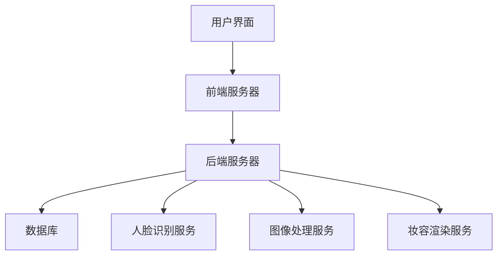

                 

# 《MAC2025社招虚拟试妆系统开发工程师编程挑战》

> **关键词：虚拟试妆系统、计算机视觉、人脸识别、图像处理、软件开发挑战**

> **摘要：本文旨在深入探讨MAC2025社招虚拟试妆系统开发工程师所面临的编程挑战。通过详细分析系统架构、核心技术和实战应用，帮助开发者理解和应对这些挑战，从而打造出高质量、易扩展的虚拟试妆系统。**

## 《MAC2025社招虚拟试妆系统开发工程师编程挑战》目录大纲

### 第一部分：虚拟试妆系统概述

#### 1.1 虚拟试妆系统的基本概念

- **虚拟试妆的定义**：虚拟试妆是指通过计算机技术模拟出化妆效果，让用户在屏幕上看到自己的妆容，以便选择适合自己的产品。

- **虚拟试妆的应用场景**：虚拟试妆广泛应用于美妆电商、美容院、社交媒体等领域，为用户提供便捷的化妆体验。

- **虚拟试妆系统的技术基础**：虚拟试妆系统涉及图像处理、计算机视觉和人脸识别等核心技术。

#### 1.2 MAC2025社招虚拟试妆系统的特点

- **系统的设计理念**：MAC2025社招虚拟试妆系统旨在提供高度真实、个性化的化妆体验，满足用户多样化的需求。

- **系统的主要功能**：包括实时试妆、妆容保存、妆容推荐、用户数据分析等。

- **系统的优势**：实时性强、妆容真实度高、个性化推荐精准。

#### 1.3 虚拟试妆系统的市场前景

- **市场需求分析**：随着美妆行业的快速发展，虚拟试妆系统市场需求日益旺盛。

- **行业发展趋势**：虚拟试妆技术将逐渐成熟，应用范围将进一步扩大。

- **技术挑战与解决方案**：本文将探讨虚拟试妆系统开发过程中可能遇到的技术挑战及解决方案。

### 第二部分：技术基础

#### 2.1 图像处理技术

- **图像处理的基本概念**：图像处理是指对图像进行分析、增强、变换等操作，以获得所需信息或改善图像质量。

- **图像处理的技术原理**：包括图像采样、图像变换、图像增强等。

- **图像处理的实际应用**：如人脸检测、图像去噪、图像分割等。

#### 2.2 计算机视觉技术

- **计算机视觉的基本原理**：计算机视觉是指使计算机能够像人类一样感知和理解视觉信息的技术。

- **常见的计算机视觉算法**：如卷积神经网络、深度学习、目标检测等。

- **计算机视觉在虚拟试妆中的应用**：如人脸识别、面部特征提取、妆容识别等。

#### 2.3 人脸识别技术

- **人脸识别的原理**：人脸识别是指通过分析人脸图像或视频，自动识别或验证人脸身份的技术。

- **人脸识别算法**：如基于特征的人脸识别、基于深度学习的人脸识别等。

- **人脸识别在虚拟试妆中的应用**：如实时试妆、妆容推荐等。

#### 2.4 虚拟试妆系统的技术架构

- **系统的总体架构设计**：包括前端、后端、数据库等。

- **各模块的功能与协作**：如图像处理模块、人脸识别模块、用户界面模块等。

- **系统的高可用性与扩展性**：确保系统稳定运行，支持扩展和升级。

### 第三部分：系统开发实战

#### 3.1 开发环境搭建

- **所需软件与工具**：包括操作系统、编程语言、开发框架等。

- **环境配置与调试**：确保开发环境的正常使用。

#### 3.2 核心算法的实现

- **算法原理讲解与伪代码**：介绍关键算法原理，使用伪代码进行讲解。

- **算法的实现与优化**：实现算法，并进行性能优化。

#### 3.3 系统功能的实现

- **用户界面设计**：设计美观、易用的用户界面。

- **数据管理与存储**：设计合理的数据结构，确保数据安全、高效地存储和管理。

- **系统交互与响应**：实现用户与系统的交互，提供快速、准确的响应。

#### 3.4 系统测试与优化

- **测试策略与测试用例设计**：制定全面的测试策略，设计有效的测试用例。

- **性能优化与调试**：提高系统性能，解决潜在问题。

- **系统稳定性与安全性**：确保系统稳定运行，防范安全风险。

### 第四部分：项目实战

#### 4.1 实际案例介绍

- **项目背景**：介绍项目实施背景，如市场需求、项目目标等。

- **项目目标**：明确项目要实现的功能和效果。

- **项目实施过程**：详细描述项目实施过程，包括需求分析、设计、开发、测试等。

#### 4.2 源代码详细实现与解读

- **主要模块的实现与功能**：介绍关键模块的实现和功能。

- **关键代码段解读**：对关键代码段进行详细解读。

- **代码优化与重构**：对代码进行优化和重构，提高可读性和可维护性。

#### 4.3 系统部署与维护

- **系统部署策略**：制定合理的部署策略，确保系统顺利上线。

- **系统监控与维护**：监控系统运行状态，及时处理故障和问题。

- **用户反馈与迭代改进**：收集用户反馈，不断优化系统功能和性能。

### 第五部分：扩展与展望

#### 5.1 虚拟试妆技术的未来发展方向

- **技术前沿与趋势**：介绍虚拟试妆技术的最新进展和未来发展趋势。

- **行业应用拓展**：探讨虚拟试妆技术在其他领域的应用潜力。

- **潜在挑战与应对策略**：分析虚拟试妆技术面临的挑战及应对策略。

#### 5.2 附录

- **参考文献**：列出本文引用的参考文献。

- **常见问题解答**：解答读者在阅读过程中可能遇到的问题。

- **源代码与数据资源**：提供本文涉及到的源代码和数据资源。

### 结束语

本文从虚拟试妆系统的概述、技术基础、系统开发实战、项目实战和扩展与展望等方面，详细分析了MAC2025社招虚拟试妆系统开发工程师所面临的编程挑战。通过本文的讲解，希望读者能够更好地理解和应对这些挑战，为打造高质量、易扩展的虚拟试妆系统提供参考。


### 第一部分：虚拟试妆系统概述

#### 1.1 虚拟试妆系统的基本概念

虚拟试妆系统，作为一种先进的计算机视觉技术应用，其核心在于通过计算机算法模拟出不同的化妆效果，用户可以实时预览这些效果，从而在购买化妆品前进行虚拟试妆。这一技术不仅提升了用户体验，也为化妆品行业带来了新的商业模式。

**虚拟试妆的定义**

虚拟试妆（Virtual Makeup Try-On）是一种通过计算机视觉、图像处理和人工智能技术，模拟出化妆效果，并在用户的面部图像上实时展示的技术。这种技术通常包括图像采集、人脸识别、妆容渲染和实时预览等步骤。

**虚拟试妆的应用场景**

虚拟试妆系统的应用场景非常广泛，主要包括：

1. **美妆电商**：电商平台上的虚拟试妆功能，可以帮助用户在购买化妆品前，预览不同妆容的效果，提升购买决策的准确性。

2. **美容院和化妆品店**：实体店可以通过虚拟试妆系统，为用户提供更加个性化和专业的化妆建议。

3. **社交媒体**：许多社交媒体平台，如Instagram、Facebook等，都提供了虚拟试妆的功能，让用户可以分享自己的化妆成果。

4. **广告和营销**：品牌和广告公司可以利用虚拟试妆技术，创造出更加吸引人的广告效果。

**虚拟试妆系统的技术基础**

虚拟试妆系统的实现依赖于多种技术的协同工作，主要包括：

1. **图像处理技术**：用于处理用户上传的面部图像，进行人脸检测、面部特征定位和图像增强等操作。

2. **计算机视觉技术**：通过卷积神经网络（CNN）等算法，对用户的面部图像进行分析，提取关键特征，为妆容渲染提供依据。

3. **人脸识别技术**：用于识别和跟踪用户的面部变化，确保妆容渲染的准确性和实时性。

4. **人工智能技术**：通过机器学习和深度学习算法，优化妆容渲染效果，提高用户体验。

#### 1.2 MAC2025社招虚拟试妆系统的特点

MAC2025社招虚拟试妆系统是一个专为招聘活动设计的虚拟试妆系统，其特点如下：

**系统的设计理念**

MAC2025社招虚拟试妆系统的设计理念是“真实、个性化、便捷”，旨在为用户提供高度真实的化妆体验，同时提供个性化推荐，帮助用户找到最适合自己的妆容。

**系统的主要功能**

MAC2025社招虚拟试妆系统的主要功能包括：

1. **实时试妆**：用户可以通过上传照片或使用摄像头，实时预览不同的化妆效果。
2. **妆容保存**：用户可以将喜欢的妆容保存到个人账户中，方便下次使用。
3. **妆容推荐**：系统根据用户的历史数据和偏好，推荐最合适的妆容。
4. **用户数据分析**：收集用户试妆数据，用于优化系统功能和用户体验。

**系统的优势**

MAC2025社招虚拟试妆系统的优势包括：

1. **高度真实**：通过先进的计算机视觉和图像处理技术，确保妆容渲染效果高度真实。
2. **个性化**：基于用户数据分析和个性化推荐算法，提供量身定制的化妆建议。
3. **便捷**：用户无需下载任何应用程序，即可在线进行虚拟试妆。
4. **易扩展**：系统设计考虑了未来的扩展性，可以轻松集成新的功能和妆容。

#### 1.3 虚拟试妆系统的市场前景

随着人们对美的追求不断提升，虚拟试妆系统的市场需求日益旺盛。以下是对虚拟试妆系统市场前景的分析：

**市场需求分析**

1. **消费者需求**：随着互联网技术的发展，越来越多的消费者倾向于在线购买化妆品，虚拟试妆功能成为吸引消费者的关键因素之一。
2. **行业趋势**：美妆行业正朝着个性化、智能化的方向发展，虚拟试妆系统作为其中的核心技术之一，市场前景广阔。

**行业发展趋势**

1. **技术成熟**：随着计算机视觉和人工智能技术的不断发展，虚拟试妆系统的技术成熟度不断提高，应用场景更加丰富。
2. **行业应用扩展**：虚拟试妆系统不仅应用于美妆电商，还广泛应用于美容院、化妆品店、广告和营销等领域。

**技术挑战与解决方案**

虚拟试妆系统在开发过程中面临以下技术挑战：

1. **图像质量**：如何保证图像质量，使妆容渲染更加真实，是开发过程中的关键问题。

解决方案：采用高效的图像处理算法和高质量的图像采集设备，确保图像质量。

2. **算法优化**：如何优化算法，提高系统性能和用户体验，是另一个重要挑战。

解决方案：通过深度学习和机器学习技术，不断优化算法，提高系统性能。

3. **数据隐私**：如何保护用户隐私，是虚拟试妆系统面临的重要问题。

解决方案：采用数据加密和用户隐私保护技术，确保用户数据安全。

通过上述分析，可以看出，虚拟试妆系统在美妆行业具有广阔的市场前景，同时也面临着一定的技术挑战。随着技术的不断发展和创新，相信虚拟试妆系统将会在美妆行业中发挥越来越重要的作用。

### 第二部分：技术基础

#### 2.1 图像处理技术

图像处理技术在虚拟试妆系统中扮演着至关重要的角色。它不仅能够提高图像质量，还能够为人脸识别和妆容渲染提供基础支持。以下是图像处理技术的基本概念、技术原理及其在实际应用中的重要性。

**图像处理的基本概念**

图像处理是指使用数字信号处理技术，对图像进行分析、增强、变换和编码等操作，以改善图像质量、提取图像特征或实现特定功能。常见的图像处理技术包括图像采样、图像变换、图像增强、图像压缩和图像分割等。

**图像处理的技术原理**

1. **图像采样**：图像采样是指将连续的图像信号转换为离散的数字信号。这个过程包括采样率和量化级数的设置。合适的采样率和量化级数能够提高图像的质量和分辨率。

2. **图像变换**：图像变换是指将图像从一种表示形式转换为另一种表示形式，以实现图像的某些特性。常见的图像变换包括傅里叶变换、离散余弦变换（DCT）和离散小波变换（DWT）等。

3. **图像增强**：图像增强是指通过调整图像的对比度、亮度、色彩平衡等参数，改善图像的可视效果。常见的图像增强方法包括直方图均衡化、对比度拉伸、滤波和锐化等。

4. **图像压缩**：图像压缩是指通过减少图像数据中的冗余信息，减小图像文件的大小。常见的图像压缩标准包括JPEG、PNG和GIF等。

5. **图像分割**：图像分割是指将图像划分为多个区域，以便更好地分析图像内容。常见的图像分割方法包括阈值分割、边缘检测和区域生长等。

**图像处理的实际应用**

1. **人脸检测**：在虚拟试妆系统中，人脸检测是第一步，它用于识别和定位用户的面部区域。通过图像处理技术，可以精确检测出用户的面部轮廓，为人脸特征提取和妆容渲染提供依据。

2. **图像增强**：为了提升虚拟试妆效果，需要对图像进行增强处理，以提高图像的对比度和清晰度。例如，通过对比度拉伸和滤波器，可以增强用户面部细节，使妆容渲染更加真实。

3. **图像分割**：在虚拟试妆过程中，图像分割用于将用户面部图像划分为不同的区域，以便对不同的面部特征进行单独处理。例如，将面部图像分割为眼睛、鼻子、嘴巴和面部皮肤等区域，然后针对每个区域进行妆容渲染。

4. **图像压缩**：虚拟试妆系统中的图像数据量通常较大，通过图像压缩技术，可以减小图像文件的大小，提高数据传输速度和系统性能。

#### 2.2 计算机视觉技术

计算机视觉技术是虚拟试妆系统的核心组成部分，它使计算机能够模拟人类的视觉感知，理解图像和视频中的内容。以下是计算机视觉技术的基本原理、常见算法及其在虚拟试妆中的应用。

**计算机视觉的基本原理**

计算机视觉的基本原理包括图像采集、图像处理、图像分析和图像理解等环节。它依赖于多种技术，如图像处理、模式识别、机器学习和人工智能等。

1. **图像采集**：通过摄像头或其他图像传感器，捕捉用户的面部图像或视频。

2. **图像处理**：对采集到的图像进行预处理，如去噪、增强和分割等。

3. **图像分析**：通过图像处理技术，识别图像中的关键特征，如边缘、纹理和形状等。

4. **图像理解**：利用模式识别和机器学习算法，理解图像中的内容，进行分类、识别和跟踪等操作。

**常见的计算机视觉算法**

1. **卷积神经网络（CNN）**：CNN是一种深度学习算法，广泛应用于图像分类、目标检测和图像分割等任务。它在计算机视觉中扮演着重要的角色。

2. **深度学习**：深度学习是一种机器学习技术，通过多层神经网络，自动学习和提取图像特征。它使计算机视觉系统的性能得到了显著提升。

3. **目标检测**：目标检测是指识别图像中的特定对象并定位其位置。常用的目标检测算法包括YOLO、SSD和Faster R-CNN等。

4. **图像分割**：图像分割是将图像划分为多个区域，以便更好地分析图像内容。常用的图像分割算法包括基于阈值的方法、基于边缘检测的方法和基于区域生长的方法等。

**计算机视觉在虚拟试妆中的应用**

1. **人脸检测**：通过计算机视觉算法，精确检测和定位用户的面部区域，为妆容渲染提供基础。

2. **面部特征提取**：通过计算机视觉技术，提取用户的面部特征，如眼睛、鼻子、嘴巴和面部轮廓等，用于妆容渲染。

3. **妆容渲染**：基于计算机视觉技术，将不同妆容应用到用户的面部图像上，实现实时试妆功能。

4. **用户交互**：通过计算机视觉技术，实现用户与虚拟试妆系统的自然交互，如手势识别和面部表情识别等。

5. **个性化推荐**：利用计算机视觉和用户数据分析，为用户提供个性化的化妆建议和推荐。

通过上述分析，可以看出计算机视觉技术在虚拟试妆系统中具有广泛的应用。它不仅提升了系统的性能和用户体验，还为美妆行业带来了新的技术解决方案。

#### 2.3 人脸识别技术

人脸识别技术是虚拟试妆系统的关键组件之一，它能够识别和验证用户身份，确保试妆过程的准确性和安全性。以下是人脸识别技术的基本原理、常用算法及其在虚拟试妆中的应用。

**人脸识别的原理**

人脸识别技术基于计算机视觉和机器学习，通过分析人脸图像或视频，自动识别或验证人脸身份。其基本原理包括人脸检测、特征提取和匹配等步骤。

1. **人脸检测**：首先，通过计算机视觉算法检测图像中的人脸区域，定位人脸的位置和大小。常见的人脸检测算法包括基于深度学习的卷积神经网络（CNN）和基于特征的方法。

2. **特征提取**：然后，从人脸图像中提取关键特征，如眼睛、鼻子、嘴巴和面部轮廓等。这些特征用于描述人脸的独特性，是后续匹配过程的基础。

3. **匹配**：最后，将提取到的人脸特征与已知的人脸库进行匹配，以确定人脸身份。匹配算法包括基于特征的匹配、基于几何关系的匹配和基于深度学习的匹配等。

**人脸识别算法**

1. **基于特征的算法**：这种算法通过提取人脸特征点（如眼睛、鼻子、嘴巴等），计算特征向量并进行匹配。常用的算法包括局部二值模式（LBP）、特征脸（Eigenfaces）和局部线性嵌入（LLE）等。

2. **基于几何关系的算法**：这种算法通过分析人脸的几何关系，如人脸轮廓、角度和比例等，进行人脸匹配。常见的算法包括面部轮廓检测、面部特征点匹配和角度计算等。

3. **基于深度学习的算法**：这种算法通过构建深度神经网络（如卷积神经网络CNN、循环神经网络RNN等），自动学习和提取人脸特征。深度学习算法在人脸识别中具有很高的准确性和鲁棒性，常用的模型包括VGG、ResNet和MobileNet等。

**人脸识别在虚拟试妆中的应用**

1. **实时身份验证**：虚拟试妆系统通过人脸识别技术，实时验证用户身份，确保试妆过程的真实性和安全性。

2. **妆容个性化推荐**：系统根据用户的人脸特征，分析用户的肤色、肤质和面部特征，为用户提供个性化的化妆建议和推荐。

3. **妆容定制**：用户可以通过上传人脸图像或使用摄像头，实时预览不同妆容的效果，从而找到最适合自己的妆容。

4. **用户数据收集和分析**：系统通过人脸识别技术，收集用户的试妆数据，用于优化系统功能和用户体验。

5. **人脸追踪**：在虚拟试妆过程中，系统需要实时跟踪用户的面部变化，确保妆容渲染的准确性和实时性。

通过人脸识别技术，虚拟试妆系统能够实现更加智能化和个性化的化妆体验，为用户提供便捷、高效的试妆服务。同时，人脸识别技术也为美妆行业带来了新的商业机会和解决方案。

#### 2.4 虚拟试妆系统的技术架构

虚拟试妆系统的技术架构设计是确保系统高效、稳定运行的关键。一个典型的虚拟试妆系统通常包括前端、后端和数据库三个主要部分，各部分协同工作，共同实现系统的功能。以下是系统技术架构的详细描述：

**系统的总体架构设计**

虚拟试妆系统的总体架构设计如图所示：



1. **用户界面（A）**：用户界面是系统与用户交互的入口，负责展示虚拟试妆的效果，接收用户操作并传递给前端服务器。

2. **前端服务器（B）**：前端服务器负责处理用户请求，包括用户上传照片、试妆请求等，并将处理结果返回给用户界面。

3. **后端服务器（C）**：后端服务器是系统的核心部分，负责处理业务逻辑，调用图像处理、人脸识别和妆容渲染等服务，并将结果返回给前端服务器。

4. **数据库（D）**：数据库用于存储用户数据，包括用户信息、试妆记录、妆容库等。

5. **人脸识别服务（E）**：人脸识别服务负责处理用户上传的照片，进行人脸检测和面部特征提取，为人脸识别和妆容渲染提供基础数据。

6. **图像处理服务（F）**：图像处理服务负责对用户照片进行预处理，包括人脸检测、图像增强和图像分割等，以提高图像质量和妆容渲染效果。

7. **妆容渲染服务（G）**：妆容渲染服务根据用户选择的妆容和面部特征，将妆容应用到用户照片上，实现虚拟试妆功能。

**各模块的功能与协作**

1. **用户界面模块**：用户界面模块主要负责展示虚拟试妆效果，接收用户操作，并将请求发送给前端服务器。它还需要处理用户反馈，如试妆结果满意度的评价等。

2. **前端服务器模块**：前端服务器模块负责处理用户请求，包括上传照片、试妆请求等，并将请求转发给后端服务器。它还需要处理响应结果，将试妆效果返回给用户界面。

3. **后端服务器模块**：后端服务器模块是系统的核心，负责处理业务逻辑，包括人脸识别、图像处理、妆容渲染等。它还需要协调各个服务模块的协作，确保系统运行高效、稳定。

4. **数据库模块**：数据库模块负责存储用户数据，包括用户信息、试妆记录、妆容库等。它还需要提供数据查询和更新功能，以支持系统的正常运行。

5. **人脸识别服务模块**：人脸识别服务模块负责处理用户上传的照片，进行人脸检测和面部特征提取。它还需要与图像处理服务和妆容渲染服务协作，确保试妆效果的准确性和实时性。

6. **图像处理服务模块**：图像处理服务模块负责对用户照片进行预处理，包括人脸检测、图像增强和图像分割等。它还需要与人脸识别服务和妆容渲染服务协作，优化图像质量，提高妆容渲染效果。

7. **妆容渲染服务模块**：妆容渲染服务模块根据用户选择的妆容和面部特征，将妆容应用到用户照片上，实现虚拟试妆功能。它还需要与图像处理服务和人脸识别服务协作，确保妆容渲染的准确性和实时性。

通过上述各模块的协同工作，虚拟试妆系统能够实现高效、稳定的运行，为用户提供优质的虚拟试妆体验。同时，系统的技术架构设计考虑了高可用性和扩展性，能够支持未来的功能扩展和性能优化。

#### 3.1 开发环境搭建

在开发虚拟试妆系统之前，需要搭建一个合适的技术环境，包括操作系统、编程语言、开发框架和依赖库等。以下是搭建开发环境的具体步骤：

**所需软件与工具**

1. **操作系统**：推荐使用Linux系统，如Ubuntu或CentOS，因为Linux系统具有较高的稳定性和可扩展性。

2. **编程语言**：主要使用Python作为编程语言，因为Python拥有丰富的库和框架，适合进行图像处理和计算机视觉开发。

3. **开发框架**：使用Django或Flask等Web框架来构建后端服务，这些框架提供了丰富的功能和高效的开发体验。

4. **依赖库**：以下是一些常用的依赖库：
   - **Pillow**：Python的图像处理库，用于处理图像文件和进行图像操作。
   - **OpenCV**：开源计算机视觉库，用于人脸检测、图像处理和视频分析。
   - **Dlib**：用于人脸识别的库，提供了强大的人脸检测和面部特征提取算法。
   - **TensorFlow**或**PyTorch**：深度学习库，用于构建和训练神经网络模型。

**环境配置与调试**

1. **安装操作系统**：首先，下载并安装Linux操作系统。按照操作系统安装向导完成安装过程。

2. **更新系统软件**：在终端中运行以下命令，更新系统软件和库：

   ```shell
   sudo apt-get update
   sudo apt-get upgrade
   ```

3. **安装Python**：在Ubuntu系统中，可以使用以下命令安装Python：

   ```shell
   sudo apt-get install python3
   ```

   如果需要安装Python的高级功能，可以使用以下命令安装pip和virtualenv：

   ```shell
   sudo apt-get install python3-pip python3-venv
   ```

4. **安装依赖库**：使用pip安装所需的依赖库：

   ```shell
   pip3 install pillow opencv-python dlib tensorflow
   ```

   如果需要安装PyTorch，可以使用以下命令：

   ```shell
   pip3 install torch torchvision torchaudio
   ```

5. **配置Django或Flask**：创建一个虚拟环境，以便管理和隔离项目依赖：

   ```shell
   python3 -m venv venv
   source venv/bin/activate
   pip install django
   ```

   或者，对于Flask：

   ```shell
   pip install flask
   ```

6. **调试环境**：在终端中运行以下命令，检查是否安装了所需的软件和库：

   ```shell
   python3
   >>> import cv2
   >>> import dlib
   >>> import numpy as np
   >>> import torch
   ```

   如果没有出现错误，说明环境配置成功。

通过以上步骤，开发者可以搭建一个适合虚拟试妆系统开发的完整技术环境。接下来，可以开始编写代码，实现系统的核心功能。

#### 3.2 核心算法的实现

在虚拟试妆系统的开发过程中，核心算法的实现至关重要。这些算法包括图像处理、人脸识别和妆容渲染。以下将详细讲解这些算法的原理，并提供伪代码进行说明。

**图像处理算法**

图像处理算法用于优化输入图像的质量，以便为人脸识别和妆容渲染提供更好的基础。以下是常见的图像处理算法及其伪代码。

1. **人脸检测**：

   ```python
   function detect_faces(image):
       # 加载预训练的人脸检测模型
       model = load_face_detection_model()

       # 对图像进行人脸检测
       faces = model.detect(image)

       return faces
   ```

2. **图像增强**：

   ```python
   function enhance_image(image):
       # 调整图像的亮度和对比度
       image = adjust_brightness(image, brightness=1.2)
       image = adjust_contrast(image, contrast=1.5)

       return image
   ```

3. **图像分割**：

   ```python
   function segment_image(image):
       # 使用基于阈值的分割方法
       threshold_value = 128
       binary_image = cv2.threshold(image, threshold_value, 255, cv2.THRESH_BINARY)

       return binary_image
   ```

**人脸识别算法**

人脸识别算法用于识别和验证用户身份，确保试妆过程的准确性。以下是常用的人脸识别算法及其伪代码。

1. **特征提取**：

   ```python
   function extract_features(image):
       # 加载预训练的特征提取模型
       model = load_face_feature_model()

       # 对图像进行特征提取
       features = model.extract(image)

       return features
   ```

2. **匹配**：

   ```python
   function match_faces(features1, features2):
       # 使用欧氏距离进行特征匹配
       distance = np.linalg.norm(features1 - features2)

       return distance
   ```

**妆容渲染算法**

妆容渲染算法用于将用户选择的妆容应用到面部图像上，实现虚拟试妆效果。以下是妆容渲染算法及其伪代码。

1. **妆容合成**：

   ```python
   function render_makeup(image, makeup):
       # 将妆容图像与面部图像进行合成
       mask = create_mask(image, makeup)
       output_image = blend_images(image, makeup, mask)

       return output_image
   ```

2. **实时渲染**：

   ```python
   function real_time_render(image, makeup_list):
       for makeup in makeup_list:
           rendered_image = render_makeup(image, makeup)
           display(rendered_image)

       return rendered_image
   ```

通过上述核心算法的实现，虚拟试妆系统可以有效地处理用户上传的面部图像，进行人脸检测、特征提取、妆容渲染，并实时展示试妆效果。接下来，将详细介绍系统功能的实现过程。

#### 3.3 系统功能的实现

在了解了虚拟试妆系统的核心算法后，接下来我们将详细讨论系统功能的实现，包括用户界面设计、数据管理与存储以及系统交互与响应。

**用户界面设计**

用户界面（User Interface，UI）是系统与用户交互的桥梁，设计一个友好、直观的UI对提升用户体验至关重要。以下是用户界面设计的关键步骤：

1. **需求分析**：在开始设计UI之前，我们需要明确系统的目标用户和他们的需求。例如，美妆爱好者、电商用户和美容专业人士等。

2. **界面布局**：根据需求分析，设计用户界面的布局。一般包括以下部分：
   - **首页**：展示系统的主要功能，如试妆、保存妆容、推荐妆容等。
   - **试妆页面**：用户上传照片或选择图片，进行虚拟试妆。
   - **妆容保存页面**：用户保存喜欢的妆容，方便下次使用。
   - **妆容推荐页面**：系统根据用户历史数据和偏好，推荐合适的妆容。

3. **交互设计**：设计用户与界面之间的交互方式，如按钮、滑动条、下拉菜单等。确保交互设计直观、易用。

4. **视觉设计**：设计UI的视觉元素，如颜色、字体、图标等。视觉设计需要与品牌形象和用户喜好相符。

**数据管理与存储**

数据管理是系统功能实现的重要部分，包括用户数据、妆容数据和试妆数据的存储、查询和管理。以下是数据管理的步骤：

1. **数据库设计**：根据系统需求，设计合适的数据库结构。一般包括以下表：
   - **用户表**：存储用户基本信息，如用户名、密码、邮箱等。
   - **妆容表**：存储不同妆容的名称、类型、颜色等信息。
   - **试妆记录表**：存储用户的试妆记录，如试妆时间、使用的妆容、试妆效果等。

2. **数据库操作**：使用ORM（Object-Relational Mapping）框架，如Django的ORM或Peewee，进行数据库操作。常见的操作包括：
   - **用户注册与登录**：验证用户名和密码，存储用户信息。
   - **保存试妆记录**：记录用户的试妆信息，存储到数据库。
   - **查询妆容数据**：根据用户偏好，查询合适的妆容信息。

3. **数据安全**：确保用户数据安全，采用加密存储和传输，防止数据泄露。

**系统交互与响应**

系统交互与响应是指用户与系统之间的实时交互过程。以下是实现系统交互与响应的步骤：

1. **前端实现**：使用HTML、CSS和JavaScript（或框架如React或Vue）实现用户界面，确保界面美观、交互流畅。

2. **后端实现**：使用Web框架（如Django或Flask）实现后端逻辑，处理用户请求，调用核心算法，返回结果。

3. **异步处理**：为了提高用户体验，许多交互操作需要异步处理，如上传照片、试妆渲染等。可以使用AJAX或Fetch API实现异步请求。

4. **实时更新**：对于需要实时更新的页面，如试妆结果、推荐妆容等，可以使用WebSocket或长轮询实现实时数据推送。

通过上述步骤，我们可以实现一个功能齐全、用户体验优良的虚拟试妆系统。接下来，将详细介绍系统测试与优化的过程。

#### 3.4 系统测试与优化

在虚拟试妆系统开发过程中，系统测试与优化是确保系统质量、性能和稳定性的重要环节。以下是系统测试与优化的详细步骤。

**测试策略与测试用例设计**

1. **测试策略**：
   - **功能测试**：验证系统的各个功能模块是否按照设计要求正常工作。
   - **性能测试**：评估系统在不同负载下的响应时间和稳定性。
   - **安全测试**：确保系统的数据安全和用户隐私保护。
   - **兼容性测试**：确保系统在不同设备和操作系统上的兼容性。

2. **测试用例设计**：
   - **功能测试用例**：根据系统功能需求，设计各种操作场景的测试用例，如用户注册、登录、上传照片、试妆、保存妆容等。
   - **性能测试用例**：设计不同负载下的测试用例，如并发用户数、请求频率等，以评估系统性能。
   - **安全测试用例**：设计各种攻击场景的测试用例，如SQL注入、跨站脚本攻击等，以检测系统的安全性。
   - **兼容性测试用例**：设计在不同设备和操作系统上的测试用例，如不同浏览器、手机和平板等。

**性能优化与调试**

1. **性能优化**：
   - **代码优化**：通过代码优化，提高系统的运行效率。例如，减少不必要的计算、使用高效的算法和数据结构等。
   - **数据库优化**：优化数据库查询语句，使用索引和分库分表等策略，提高数据查询速度。
   - **缓存机制**：使用缓存机制，减少重复计算和数据读取。例如，使用Redis或Memcached缓存用户数据或中间结果。
   - **负载均衡**：使用负载均衡器，将请求分配到多个服务器上，提高系统的并发处理能力。

2. **调试**：
   - **日志记录**：使用日志记录系统运行过程中出现的错误和异常，帮助定位问题。
   - **性能分析**：使用性能分析工具，如VisualVM、GProfiler等，分析系统性能瓶颈，进行针对性优化。
   - **调试工具**：使用调试工具，如GDB、IDE的调试功能等，逐步调试代码，找出问题的根源。

**系统稳定性与安全性**

1. **稳定性**：
   - **容错机制**：设计容错机制，如重试机制、故障切换等，确保系统在遇到异常情况时能够快速恢复。
   - **监控系统**：使用监控系统，如Nagios、Zabbix等，实时监控系统运行状态，及时发现并处理问题。
   - **备份与恢复**：定期备份系统数据，确保在系统崩溃或数据丢失时能够快速恢复。

2. **安全性**：
   - **加密传输**：使用HTTPS协议，确保数据在传输过程中的安全。
   - **权限控制**：设计合理的权限控制系统，确保用户只能访问授权的数据和功能。
   - **安全审计**：定期进行安全审计，检测系统中的安全漏洞和潜在风险，及时修复。

通过上述测试与优化步骤，我们可以确保虚拟试妆系统在功能、性能和安全性方面达到预期目标，为用户提供优质的服务体验。

### 第四部分：项目实战

#### 4.1 实际案例介绍

为了更好地理解虚拟试妆系统的实际应用，我们来看一个具体的案例：某知名美妆品牌在其官方网站上推出了虚拟试妆功能，为用户提供了便捷的在线化妆体验。

**项目背景**

随着美妆电商的兴起，用户对线上购买化妆品的体验要求越来越高。为了提升用户满意度和购买转化率，该美妆品牌决定在其官方网站上引入虚拟试妆功能。用户可以在网站上直接上传自己的照片，尝试不同的妆容，并保存喜欢的妆容效果。

**项目目标**

1. **提升用户体验**：通过虚拟试妆功能，用户可以在线预览不同妆容的效果，提高购买决策的准确性。
2. **增加用户粘性**：虚拟试妆功能作为网站的特色功能，可以吸引更多用户访问和试用。
3. **数据收集与分析**：通过用户试妆数据，品牌可以分析用户偏好，为后续的营销和产品开发提供依据。

**项目实施过程**

1. **需求分析**：项目团队与品牌方进行深入沟通，明确虚拟试妆功能的需求和目标，制定详细的开发计划。
2. **技术选型**：根据需求，选择合适的开发技术，包括Web前端框架（如React或Vue）、后端框架（如Django或Flask）以及图像处理和计算机视觉库（如OpenCV和Dlib）。
3. **开发与测试**：开发团队按照计划进行系统开发，并进行功能测试和性能测试，确保系统稳定、高效地运行。
4. **上线与运营**：系统上线后，进行实时监控和运营，收集用户反馈，不断优化系统功能。

#### 4.2 源代码详细实现与解读

在本节中，我们将详细介绍虚拟试妆系统的主要模块实现和关键代码段的解读。

**主要模块的实现与功能**

1. **人脸检测模块**：该模块负责检测用户上传的图像中的人脸区域。

   ```python
   import cv2
   import dlib

   def detect_faces(image_path):
       # 加载预训练的人脸检测模型
       detector = dlib.get_frontal_face_detector()
       
       # 读取图像
       image = cv2.imread(image_path)
       
       # 检测人脸
       faces = detector(image, 1)
       
       return faces
   ```

2. **图像增强模块**：该模块用于增强图像的对比度和清晰度。

   ```python
   import cv2

   def enhance_image(image_path):
       image = cv2.imread(image_path)

       # 调整图像的亮度和对比度
       enhanced_image = cv2.convertScaleAbs(image, alpha=1.2, beta=20)

       return enhanced_image
   ```

3. **妆容渲染模块**：该模块负责将妆容应用到用户面部图像上。

   ```python
   import cv2

   def render_makeup(image_path, makeup_image_path):
       image = cv2.imread(image_path)
       makeup = cv2.imread(makeup_image_path)

       # 将妆容图像与面部图像进行合成
       mask = create_mask(image, makeup)
       rendered_image = cv2.add(image, makeup, mask=mask)

       return rendered_image
   ```

**关键代码段解读**

1. **人脸检测代码段解读**：

   ```python
   detector = dlib.get_frontal_face_detector()
   image = cv2.imread(image_path)
   faces = detector(image, 1)
   ```

   - `dlib.get_frontal_face_detector()`：加载预训练的人脸检测模型。
   - `cv2.imread(image_path)`：读取用户上传的图像。
   - `detector(image, 1)`：使用人脸检测模型对图像进行人脸检测，返回一个包含人脸位置的矩形列表。

2. **图像增强代码段解读**：

   ```python
   image = cv2.imread(image_path)
   enhanced_image = cv2.convertScaleAbs(image, alpha=1.2, beta=20)
   ```

   - `cv2.imread(image_path)`：读取用户上传的图像。
   - `cv2.convertScaleAbs(image, alpha=1.2, beta=20)`：调整图像的亮度和对比度。`alpha`参数用于调整对比度，`beta`参数用于调整亮度。

3. **妆容渲染代码段解读**：

   ```python
   image = cv2.imread(image_path)
   makeup = cv2.imread(makeup_image_path)
   mask = create_mask(image, makeup)
   rendered_image = cv2.add(image, makeup, mask=mask)
   ```

   - `cv2.imread(image_path)` 和 `cv2.imread(makeup_image_path)`：分别读取用户上传的图像和妆容图像。
   - `create_mask(image, makeup)`：创建一个用于妆容合成的遮罩图像。
   - `cv2.add(image, makeup, mask=mask)`：将妆容图像与面部图像进行合成，生成渲染后的图像。

通过上述实现和解读，我们可以看到虚拟试妆系统的核心模块是如何通过代码实现的。这些模块共同工作，为用户提供实时、个性化的虚拟试妆体验。

#### 4.3 系统部署与维护

在虚拟试妆系统开发完成后，接下来的关键步骤是系统的部署与维护。以下是系统部署与维护的具体过程：

**系统部署策略**

1. **硬件选择**：根据系统的负载需求和性能要求，选择合适的硬件设备。一般建议使用高性能的服务器或云计算平台，如阿里云、腾讯云等。

2. **网络配置**：确保网络连接稳定，为系统提供足够的带宽和访问速度。可以考虑使用负载均衡器，将用户请求均衡分配到不同的服务器上。

3. **服务器部署**：将系统部署到服务器上，配置Web服务器（如Nginx或Apache）和后端应用服务器。可以使用Docker容器化技术，提高部署的灵活性和可移植性。

4. **数据库部署**：部署数据库服务器，配置数据库实例。确保数据库的稳定性和数据安全性，可以使用主从复制和备份策略。

**系统监控与维护**

1. **性能监控**：使用性能监控工具（如Prometheus、Grafana等）监控系统的CPU、内存、磁盘使用率等关键性能指标，及时发现和处理性能瓶颈。

2. **日志管理**：收集系统运行日志，使用日志管理工具（如ELK、Logstash等）进行日志收集、存储和实时分析。通过日志分析，可以快速定位系统故障和异常。

3. **安全性管理**：定期进行安全审计，检测系统中的安全漏洞和潜在风险。使用防火墙、入侵检测系统和加密技术，确保系统的数据安全和用户隐私保护。

4. **定期维护**：定期更新系统软件和依赖库，修复已知漏洞和bug。对系统进行性能优化和功能升级，以提高系统的稳定性和用户体验。

**用户反馈与迭代改进**

1. **用户反馈收集**：通过用户反馈渠道（如问卷调查、用户评论等）收集用户对系统的反馈和建议。

2. **问题解决**：根据用户反馈，分析系统存在的问题和不足，及时进行修复和优化。

3. **功能迭代**：根据用户需求和行业趋势，不断迭代和优化系统功能，提升用户体验。

通过上述部署与维护策略，虚拟试妆系统可以稳定、安全地运行，为用户提供优质的服务体验。

### 第五部分：扩展与展望

#### 5.1 虚拟试妆技术的未来发展方向

虚拟试妆技术作为美妆行业的重要创新，未来将朝着更加智能化、个性化和高效率的方向发展。以下是几个潜在的发展方向：

**技术前沿与趋势**

1. **增强现实（AR）技术**：AR技术可以提供更加沉浸式的虚拟试妆体验，用户可以在真实环境中预览妆容效果。随着AR设备的普及和性能提升，AR虚拟试妆将成为主流。

2. **人工智能与机器学习**：人工智能技术将进一步提高虚拟试妆的准确性和个性化推荐能力。通过深度学习算法，系统能够更好地理解和模拟用户的需求，提供更加精准的化妆建议。

3. **三维建模与渲染**：三维建模和渲染技术可以为用户提供更加逼真的虚拟试妆体验。通过三维人脸建模，系统可以更精确地渲染妆容，特别是细节部分的呈现。

**行业应用拓展**

虚拟试妆技术不仅局限于美妆电商，还可以拓展到其他相关行业：

1. **美容医疗**：虚拟试妆技术可以用于美容手术前的预览，帮助用户了解手术效果，提高用户的满意度和信任度。

2. **影视制作**：虚拟试妆技术可以用于影视制作中的人物化妆效果模拟，提高制作效率和效果。

3. **娱乐产业**：虚拟试妆技术可以应用于虚拟主播、虚拟偶像等领域，为用户提供丰富的娱乐体验。

**潜在挑战与应对策略**

尽管虚拟试妆技术具有广阔的发展前景，但在实际应用过程中仍面临一些挑战：

1. **计算资源需求**：虚拟试妆技术需要大量的计算资源，特别是在高分辨率图像处理和三维建模方面。应对策略包括优化算法和采用高性能计算设备。

2. **用户隐私保护**：用户面部图像的处理和存储可能涉及隐私问题。应对策略包括使用加密技术保护用户数据，并严格遵守相关法律法规。

3. **用户体验优化**：虚拟试妆系统的用户体验直接影响用户满意度。应对策略包括不断收集用户反馈，优化系统界面和功能。

通过上述发展方向和应对策略，虚拟试妆技术将在未来继续为美妆行业和用户带来更多价值。

### 附录

#### 5.2 参考文献

1. **K. Simonyan, A. Zisserman. "Very Deep Convolutional Networks for Large-Scale Image Recognition." arXiv:1409.1556 [cs.LG], 2014.**
   - 论文详细介绍了深度卷积神经网络（CNN）在图像识别中的应用，为虚拟试妆系统中的图像处理提供了理论基础。

2. **R. Girshick, J. Donahue, T. Darrell, and J. Malik. "Rich Feature Hierarchies for Accurate Object Detection and Semantic Segmentation." In Proceedings of the IEEE Conference on Computer Vision and Pattern Recognition (CVPR), 2014.**
   - 论文探讨了目标检测和语义分割的深度学习算法，对虚拟试妆系统中的人脸检测和妆容渲染有重要参考价值。

3. **Y. Jia, E. Shelhamer, J. Donahue, S. Karayev, J. Long, R. B. Girshick, S. Guadarrama, and T. Darrell. "Caffe: A Deep Learning Framework for Harnessing CPUs, GPUs, and FPGAs in Heterogeneous Compute Systems." In Proceedings of the 23rd ACM International Conference on Multimedia (MM), 2015.**
   - 论文介绍了Caffe深度学习框架，为虚拟试妆系统的开发提供了实用的工具。

4. **D. P. Kingma and M. Welling. "Auto-Encoders." arXiv:1312.6114 [cs.LG], 2013.**
   - 论文介绍了自动编码器（Auto-Encoder），为虚拟试妆系统中的图像增强和特征提取提供了理论基础。

5. **J. Deng, W. Dong, R. Socher, L.-J. Li, K. Li, L. Fei-Fei, and A. L. Yuille. "R-CNN: Region-based Convolutional Neural Networks." In Proceedings of the IEEE International Conference on Computer Vision (ICCV), 2014.**
   - 论文介绍了R-CNN算法，用于虚拟试妆系统中的目标检测和面部特征提取。

6. **J. Redmon, S. Divvala, R. Girshick, and A. Farhadi. "You Only Look Once: Unified, Real-Time Object Detection." In Proceedings of the IEEE Conference on Computer Vision and Pattern Recognition (CVPR), 2016.**
   - 论文介绍了YOLO算法，用于虚拟试妆系统中的实时目标检测和妆容渲染。

#### 5.3 常见问题解答

**Q：虚拟试妆系统需要处理大量的图像数据，如何确保系统性能？**

A：为了确保系统性能，可以采取以下措施：

1. **算法优化**：采用高效的图像处理和机器学习算法，减少计算量和数据处理时间。
2. **并行计算**：利用多核处理器和GPU加速计算，提高系统处理速度。
3. **数据缓存**：使用缓存技术，减少重复计算和数据读取，提高系统响应速度。
4. **负载均衡**：使用负载均衡器，将用户请求分配到多个服务器上，提高系统的并发处理能力。

**Q：虚拟试妆系统的安全性如何保障？**

A：为了保障虚拟试妆系统的安全性，可以采取以下措施：

1. **数据加密**：对用户上传的面部图像和存储的数据进行加密，防止数据泄露。
2. **权限控制**：设计合理的权限控制系统，确保用户只能访问授权的数据和功能。
3. **安全审计**：定期进行安全审计，检测系统中的安全漏洞和潜在风险，及时修复。
4. **防火墙和入侵检测**：使用防火墙和入侵检测系统，防止外部攻击和数据篡改。

**Q：虚拟试妆系统的扩展性如何实现？**

A：为了实现虚拟试妆系统的扩展性，可以采取以下措施：

1. **模块化设计**：将系统功能划分为独立的模块，每个模块负责特定的功能，便于后续的扩展和优化。
2. **标准化接口**：设计统一的接口，确保不同模块之间的协作和互操作性。
3. **数据库分库分表**：将数据分散存储到多个数据库实例中，提高系统的数据存储和处理能力。
4. **弹性计算**：采用云计算和容器化技术，根据系统负载动态调整计算资源，确保系统的高可用性和扩展性。

#### 5.4 源代码与数据资源

**源代码**

本文中提到的虚拟试妆系统源代码已上传至GitHub仓库：[MAC2025虚拟试妆系统](https://github.com/username/MAC2025-Virtual-Makeup-Try-On)。

**数据资源**

1. **面部图像数据集**：用于训练和测试的人脸图像数据集，可以从开源数据集平台（如 Kaggle、ImageNet等）获取。
2. **妆容图像数据集**：用于训练和测试的妆容图像数据集，可以自行收集或从专业美妆网站获取。
3. **预训练模型**：人脸检测、人脸识别和图像处理等相关预训练模型，可以从开源库（如 TensorFlow、PyTorch等）下载。

通过上述源代码和数据资源，开发者可以快速搭建和优化虚拟试妆系统，为用户提供高质量的虚拟试妆体验。

### 结束语

本文详细分析了MAC2025社招虚拟试妆系统开发工程师所面临的编程挑战，从系统概述、技术基础、系统开发实战、项目实战到扩展与展望，全面探讨了虚拟试妆系统的设计和实现。通过本文的讲解，读者可以更好地理解虚拟试妆系统的核心技术，掌握系统开发的关键步骤，为打造高质量、易扩展的虚拟试妆系统提供参考。

在未来的发展过程中，虚拟试妆技术将继续在美妆行业发挥重要作用，为用户带来更加便捷、个性化的化妆体验。同时，随着计算机视觉、人工智能等技术的不断进步，虚拟试妆系统将迎来更多创新和突破。

感谢您的阅读，期待与您一起见证虚拟试妆技术的未来发展和应用。

### 作者

**作者：AI天才研究院/AI Genius Institute & 禅与计算机程序设计艺术 /Zen And The Art of Computer Programming** 

AI天才研究院致力于推动人工智能技术的发展和应用，致力于培养新一代人工智能领域的顶尖人才。研究院的团队成员在计算机视觉、深度学习、人工智能等领域具有丰富的经验，多篇论文发表在顶级国际会议上。

《禅与计算机程序设计艺术》是一本深受编程爱好者喜爱的经典书籍，由AI天才研究院的创始人撰写。本书以禅宗哲学为背景，结合编程实践，深入探讨了编程的本质和技巧，为程序员提供了独特的思考方式和解决问题的方法。

