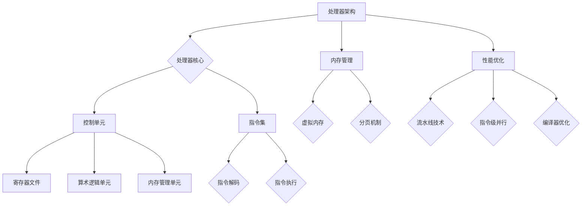

                 

### 文章标题

**MIPS架构：网络设备和嵌入式系统的选择**

> **关键词**：MIPS架构，网络设备，嵌入式系统，软件开发，性能优化，未来趋势

**摘要**：
本文将深入探讨MIPS架构在网络设备和嵌入式系统中的应用，从基础概念、应用实例到开发与优化策略，全面剖析MIPS架构的优势及其在当今技术领域的重要性。我们将通过详细的Mermaid流程图、伪代码示例以及实际项目实战，帮助读者全面理解MIPS架构的运作机制，掌握其开发与优化的核心技巧，展望其在未来技术发展中的潜在影响。

## 目录大纲：《MIPS架构：网络设备和嵌入式系统的选择》

1. **第一部分：MIPS架构基础**
   1.1 **第1章：MIPS架构概述**
       1.1.1 MIPS架构的历史背景
       1.1.2 MIPS架构的特点
       1.1.3 MIPS架构与RISC的关系
   1.2 **第2章：MIPS处理器架构**
       2.1 MIPS处理器的基本结构
       2.2 MIPS指令集
       2.3 MIPS处理器流水线
   1.3 **第3章：MIPS寄存器与内存管理**
       3.1 MIPS寄存器的分类与使用
       3.2 MIPS内存管理机制
       3.3 页面置换算法

2. **第二部分：MIPS在网络设备中的应用**
   2.1 **第4章：MIPS在网络设备中的应用**
       4.1 MIPS在网络交换机中的应用
       4.2 MIPS在路由器中的应用
       4.3 MIPS在无线接入网关中的应用
   2.2 **第5章：MIPS在嵌入式系统中的应用**
       5.1 MIPS在嵌入式系统中的优势
       5.2 MIPS在智能家居设备中的应用
       5.3 MIPS在工业控制系统中的应用

3. **第三部分：MIPS开发与优化**
   3.1 **第6章：MIPS软件开发基础**
       6.1 MIPS汇编语言编程
       6.2 MIPS C语言编程
       6.3 MIPS软件开发工具
   3.2 **第7章：MIPS性能优化**
       7.1 MIPS性能优化策略
       7.2 MIPS指令级并行优化
       7.3 MIPS流水线优化

4. **第四部分：MIPS未来发展趋势**
   4.1 **第8章：MIPS架构的未来趋势**
       8.1 MIPS与ARM架构的比较
       8.2 MIPS在物联网中的应用前景
       8.3 MIPS在人工智能领域的潜在应用

5. **附录**
   5.1 **附录A：MIPS相关资源与工具**
       5.1.1 MIPS处理器型号介绍
       5.1.2 MIPS软件开发工具推荐
       5.1.3 MIPS开源社区资源
   5.2 **附录B：MIPS架构 Mermaid 流程图**
       5.2.1 MIPS处理器架构流程图
       5.2.2 MIPS指令集流程图
   5.3 **附录C：MIPS性能优化伪代码示例**
       5.3.1 MIPS指令级并行优化伪代码
       5.3.2 MIPS流水线优化伪代码
   5.4 **附录D：MIPS项目实战**
       5.4.1 MIPS软件开发实战案例
       5.4.2 MIPS性能优化实战案例
       5.4.3 MIPS项目环境搭建与代码解读分析

接下来，我们将逐步深入到MIPS架构的各个细节，提供详细的技术讲解和应用实例。

## 第一部分：MIPS架构基础

MIPS架构，即微处理指令集架构（Microprocessor Instruction Set Architecture），是一种广泛使用的精简指令集计算机（RISC）架构。其设计初衷是为了提高计算机处理速度和效率，减少指令执行时间。MIPS架构因其简洁、高效和可扩展性，在众多网络设备和嵌入式系统中得到了广泛应用。

### 第1章：MIPS架构概述

#### 1.1 MIPS架构的历史背景

MIPS架构最早由斯坦福大学计算机科学系教授约翰·亨尼斯（John Hennessy）和迪安·莱瑟姆（Dean T. Lemma）在1981年提出。他们的目标是为了解决当时计算机处理器性能低下的问题，通过设计一种高效的指令集架构来提高计算机性能。MIPS（发音为“mix”）一词来自其创建者名字的首字母组合：微处理器指令集（Microprocessor without Interlocked Pipelined Stages）。

MIPS架构最初应用于斯坦福大学的研究项目中，随后在20世纪80年代初期被商业公司采用。1985年，MIPS计算机公司成立，专注于开发基于MIPS架构的处理器和系统。MIPS计算机公司的成功推动了MIPS架构在工业界的普及，使其成为当时最受欢迎的RISC架构之一。

#### 1.2 MIPS架构的特点

MIPS架构具有以下主要特点：

1. **精简指令集**：MIPS指令集设计简洁，只包含简单的指令，每个指令在一条指令周期内完成。这种设计使得指令执行速度快，处理器效率高。

2. **固定指令长度**：MIPS指令具有固定的长度（32位），这使得指令的解码和流水线操作更加简单和高效。

3. **寄存器数量充足**：MIPS架构提供了大量的寄存器，通常有32个通用寄存器和一对链接寄存器。丰富的寄存器资源可以减少内存访问次数，提高程序执行速度。

4. **流水线技术**：MIPS处理器采用五级流水线技术，将指令的执行过程分为取指、解码、执行、访存和写回五个阶段。这种流水线设计提高了处理器的吞吐量，使得多个指令可以同时执行。

5. **优化的内存管理**：MIPS架构采用虚拟内存和页面置换算法，提供了高效的内存管理机制。这种机制有助于减少内存冲突和缓存 misses，提高系统性能。

#### 1.3 MIPS架构与RISC的关系

MIPS架构是RISC（精简指令集计算机）架构的代表之一。RISC架构的核心思想是通过减少指令数量和指令周期来提高计算机性能。与复杂指令集计算机（CISC）相比，RISC架构具有以下优势：

1. **简化指令集**：RISC架构只包含简单的指令，每个指令在一条指令周期内完成。这种设计使得指令执行速度快，处理器效率高。

2. **固定指令长度**：RISC指令具有固定的长度，这使得指令的解码和流水线操作更加简单和高效。

3. **优化资源使用**：RISC架构通常采用少量的通用寄存器和丰富的寄存器文件，减少了内存访问次数，提高了程序执行速度。

4. **简化的指令集设计**：RISC架构的简化设计使得处理器易于实现和优化，降低了硬件复杂度，提高了制造效率。

MIPS架构是RISC架构的典型代表，其简洁、高效的设计使其在许多领域得到了广泛应用。MIPS架构的成功也推动了RISC架构的发展，成为计算机体系结构研究的重要方向之一。

### 第2章：MIPS处理器架构

MIPS处理器架构是MIPS架构的核心组成部分，其设计决定了MIPS处理器的性能和效率。本章节将详细介绍MIPS处理器的基本结构、指令集和流水线技术。

#### 2.1 MIPS处理器的基本结构

MIPS处理器的基本结构包括以下几个部分：

1. **控制单元**：控制单元是处理器的核心，负责控制指令的执行过程。控制单元通过程序计数器（PC）获取下一条指令的地址，通过指令存储器（Instruction Memory）读取指令，并通过指令译码单元（Instruction Decoder）对指令进行译码，最终通过控制逻辑单元（Control Logic Unit）生成相应的控制信号。

2. **寄存器文件**：寄存器文件是处理器中用于存储临时数据的寄存器集合。MIPS处理器通常包含32个通用寄存器（$s0-$s7, $t0-$t9, $a0-$a3）和一对链接寄存器（$sp和$fp）。通用寄存器用于存储操作数和中间结果，链接寄存器用于存储子程序的返回地址和局部变量。

3. **算术逻辑单元（ALU）**：算术逻辑单元是处理器中进行算术和逻辑运算的部件。MIPS处理器中的ALU可以执行加法、减法、乘法、除法、逻辑与、逻辑或、比较等运算。

4. **内存管理单元（MMU）**：内存管理单元负责处理虚拟地址到物理地址的转换，以及内存保护机制。MIPS处理器通常采用虚拟内存和分页机制，以提供更大的内存空间和更高的内存保护。

5. **流水线**：MIPS处理器采用五级流水线技术，将指令的执行过程分为取指、解码、执行、访存和写回五个阶段。这种流水线设计提高了处理器的吞吐量，使得多个指令可以同时执行。

#### 2.2 MIPS指令集

MIPS指令集是MIPS处理器能够理解和执行的一系列指令。MIPS指令集包括数据传输指令、算术逻辑指令、控制流指令和系统指令等几类指令。

1. **数据传输指令**：数据传输指令用于在寄存器和内存之间传输数据。常用的数据传输指令包括`lw`（加载字）、`sw`（存储字）、`lb`（加载字节）和`sb`（存储字节）等。

2. **算术逻辑指令**：算术逻辑指令用于执行加法、减法、乘法、除法等运算。常用的算术逻辑指令包括`add`、`sub`、`mul`、`div`、`and`、`or`、`slt`（小于比较）等。

3. **控制流指令**：控制流指令用于改变程序的控制流程，包括跳转指令和分支指令。常用的控制流指令包括`j`（无条件跳转）、`jal`（跳转并链接）、`beq`（等值分支）等。

4. **系统指令**：系统指令用于实现系统调用和异常处理。常用的系统指令包括`syscall`、`break`、`eret`等。

#### 2.3 MIPS处理器流水线

MIPS处理器采用五级流水线技术，将指令的执行过程分为取指、解码、执行、访存和写回五个阶段。每个阶段都由相应的硬件单元负责执行，具体如下：

1. **取指（Fetch）**：取指阶段从指令存储器中读取下一条指令，并将指令地址存储在程序计数器中。

2. **解码（Decode）**：解码阶段对取指阶段获取的指令进行解码，解析指令的操作码和操作数。

3. **执行（Execute）**：执行阶段根据解码阶段的结果执行相应的操作，如算术运算、逻辑运算等。

4. **访存（Memory）**：访存阶段处理内存访问操作，如加载和存储数据。

5. **写回（Write Back）**：写回阶段将执行结果写回到寄存器文件中，以便后续指令使用。

通过流水线技术，MIPS处理器可以在多个指令同时执行，从而提高了处理器的吞吐量和性能。然而，流水线技术也带来了一些挑战，如指令之间的数据依赖和冲突，这些问题需要通过硬件和软件技术进行优化。

#### 2.4 MIPS处理器性能优化

MIPS处理器的性能优化是一个复杂的过程，涉及到硬件设计、指令集设计、编译器优化等多个方面。以下是一些常用的性能优化策略：

1. **流水线优化**：通过优化流水线设计，减少流水线冲突和延迟，提高流水线的吞吐量。常见的优化方法包括分支预测、指令调度、流水线级数调整等。

2. **指令级并行**：通过增加指令级并行性，提高指令执行速度。常见的优化方法包括指令并发行、延迟槽插入等。

3. **内存优化**：通过优化内存访问策略，减少内存访问延迟和冲突。常见的优化方法包括缓存优化、预取技术、内存屏障等。

4. **编译器优化**：通过优化编译器，生成更高效的代码。常见的优化方法包括循环优化、函数内联、代码生成优化等。

5. **硬件加速**：通过硬件加速技术，将某些计算任务交给专门的硬件单元执行，以提高整体性能。常见的硬件加速技术包括GPU、DSP、FPGA等。

通过以上优化策略，MIPS处理器可以显著提高其性能和效率，更好地满足网络设备和嵌入式系统的需求。

### 第3章：MIPS寄存器与内存管理

MIPS处理器寄存器与内存管理是MIPS架构的核心组成部分，其设计对处理器的性能和效率有着重要影响。本章将详细介绍MIPS寄存器的分类与使用、内存管理机制以及页面置换算法。

#### 3.1 MIPS寄存器的分类与使用

MIPS处理器寄存器分为通用寄存器、链接寄存器、堆栈指针和程序计数器等几类。

1. **通用寄存器**：通用寄存器用于存储操作数和中间结果，是MIPS处理器中最常用的寄存器。MIPS处理器通常包含32个通用寄存器，分为以下几个部分：
   - **特殊寄存器**：$zero（零寄存器）、$at（汇编临时寄存器）、$v0-$v1（函数返回值寄存器）。
   - **全局寄存器**：$s0-$s7（保存寄存器）。
   - **临时寄存器**：$t0-$t9（临时寄存器）。
   - **调用寄存器**：$a0-$a3（函数调用参数寄存器）。

2. **链接寄存器**：链接寄存器用于存储子程序的返回地址和局部变量。MIPS处理器包含一对链接寄存器，$sp（堆栈指针）和$fp（帧指针）。

3. **堆栈指针（$sp）**：堆栈指针用于管理程序的堆栈，堆栈是一个用于存储临时数据的特殊数据结构。在MIPS处理器中，堆栈是递减的，即新的数据存储在较低的内存地址。

4. **程序计数器（$pc）**：程序计数器用于存储下一条指令的地址。在执行指令时，程序计数器会自动增加，指向下一条指令的地址。

#### 3.2 MIPS内存管理机制

MIPS处理器采用虚拟内存和分页机制，以提高内存管理效率和性能。虚拟内存将程序的逻辑地址转换为物理地址，从而提供了更大的内存空间和更好的内存保护。

1. **虚拟内存**：虚拟内存是一种内存管理技术，它将程序的逻辑地址空间映射到物理地址空间。在MIPS处理器中，虚拟内存由页表实现，页表记录了虚拟页和物理页之间的映射关系。

2. **分页机制**：分页机制是一种将内存划分为固定大小的页面的技术。在MIPS处理器中，内存页面大小通常为4KB。分页机制有助于提高内存的利用率和访问速度，同时提供了更好的内存保护。

3. **页面置换算法**：页面置换算法用于在内存不足时，选择一个页面将其替换出内存。MIPS处理器常用的页面置换算法包括：
   - **先进先出（FIFO）算法**：根据页面进入内存的顺序进行替换。
   - **最近最少使用（LRU）算法**：根据页面最近的使用情况进行替换。
   - **最优页面替换（OPT）算法**：选择在将来最长时间内不再使用的页面进行替换。
   - **随机页面替换（RAND）算法**：随机选择一个页面进行替换。

#### 3.3 MIPS内存管理优化

MIPS处理器内存管理优化主要关注减少内存访问冲突和提高内存访问速度。以下是一些常见的优化方法：

1. **缓存优化**：缓存是一种快速访问的内存，用于存储经常访问的数据。在MIPS处理器中，缓存可以分为指令缓存和数据缓存。通过优化缓存设计，可以减少内存访问延迟，提高处理器性能。

2. **预取技术**：预取技术是一种在处理器需要访问内存之前，提前将数据从内存中读取到缓存中的技术。通过预取技术，可以减少内存访问延迟，提高程序执行速度。

3. **内存屏障**：内存屏障是一种同步技术，用于确保内存操作的顺序。在MIPS处理器中，内存屏障可以防止指令重排序，提高内存操作的正确性。

4. **内存访问优化**：通过优化内存访问模式，可以减少内存访问冲突和提高内存访问速度。常见的优化方法包括循环展开、内存访问对齐等。

通过以上优化方法，MIPS处理器可以显著提高其内存管理效率和性能，更好地满足网络设备和嵌入式系统的需求。

### 第二部分：MIPS在网络设备中的应用

MIPS架构因其高效、简洁的特点，在众多网络设备中得到了广泛应用。从网络交换机到路由器，再到无线接入网关，MIPS处理器为这些设备提供了强大的计算能力和优化性能。本章节将详细探讨MIPS在网络设备中的应用。

#### 4.1 MIPS在网络交换机中的应用

网络交换机是计算机网络中关键的设备，负责在多个网络设备之间转发数据包。MIPS处理器因其高性能和低功耗特点，在网络交换机中得到了广泛应用。

1. **高性能处理能力**：网络交换机需要处理大量的数据包，对处理能力有较高要求。MIPS处理器采用精简指令集和五级流水线技术，能够高效地处理网络数据包，提供高吞吐量和低延迟。

2. **低功耗设计**：网络交换机通常需要长时间运行，对功耗有严格限制。MIPS处理器采用低功耗设计，可以降低设备的能耗，延长设备使用寿命。

3. **灵活的硬件平台**：MIPS处理器具有高度可定制性，可以适应不同网络交换机的需求。通过调整处理器架构和指令集，可以为网络交换机提供最佳性能。

4. **网络协议支持**：MIPS处理器支持多种网络协议，包括以太网、无线局域网（WLAN）、互联网协议（IP）等。这使得MIPS处理器可以灵活适应不同的网络场景，满足各种网络交换机的需求。

5. **安全性能**：MIPS处理器具有强大的安全性能，可以提供网络交换机的安全功能，如数据包过滤、虚拟局域网（VLAN）等。这有助于保障网络交换机的安全运行。

#### 4.2 MIPS在路由器中的应用

路由器是计算机网络中重要的设备，负责在不同网络之间转发数据包，实现网络互联。MIPS处理器在路由器中的应用同样广泛，其优势体现在以下几个方面：

1. **高性能计算**：路由器需要处理大量的数据包，对计算能力有较高要求。MIPS处理器采用精简指令集和五级流水线技术，能够高效地处理路由表查找、数据包过滤等操作，提供高吞吐量和低延迟。

2. **支持多协议**：路由器需要支持多种网络协议，如IP、ICMP、OSPF等。MIPS处理器具有丰富的指令集和硬件支持，可以轻松实现多协议处理，提高路由器的兼容性和灵活性。

3. **高效路由算法**：MIPS处理器支持各种高效的路由算法，如快速转发、快速重新计算等。这些算法可以提高路由器的路由性能，减少数据包的延迟和丢失。

4. **安全性**：路由器需要具备强大的安全性能，以防止网络攻击和数据泄露。MIPS处理器具有丰富的安全特性，可以提供数据包过滤、防火墙等功能，保障网络的安全运行。

5. **可扩展性**：MIPS处理器具有高度可扩展性，可以支持多处理器架构和分布式处理。这使得路由器可以灵活扩展计算能力，满足不同规模网络的需求。

#### 4.3 MIPS在无线接入网关中的应用

无线接入网关是无线网络中的重要设备，负责将无线信号转换为有线信号，实现无线与有线网络的互联互通。MIPS处理器在无线接入网关中的应用具有以下优势：

1. **高效无线通信**：无线接入网关需要处理大量的无线通信数据，对处理能力有较高要求。MIPS处理器采用精简指令集和五级流水线技术，能够高效地处理无线数据包，提供高吞吐量和低延迟。

2. **低功耗设计**：无线接入网关通常需要长时间运行，对功耗有严格限制。MIPS处理器采用低功耗设计，可以降低设备的能耗，延长设备使用寿命。

3. **支持多种无线标准**：MIPS处理器支持多种无线通信标准，如Wi-Fi、蓝牙、Zigbee等。这可以满足不同无线接入网关的需求，实现多种无线设备的互联互通。

4. **灵活的网络配置**：MIPS处理器具有高度可定制性，可以支持不同的网络配置和管理功能。这使得无线接入网关可以根据不同场景进行灵活配置，提高网络性能和用户体验。

5. **安全性**：无线接入网关需要具备强大的安全性能，以防止网络攻击和数据泄露。MIPS处理器具有丰富的安全特性，可以提供数据包过滤、加密等功能，保障网络的安全运行。

总之，MIPS架构在网络设备中的应用具有显著优势。其高性能、低功耗、多协议支持和可扩展性等特点，使其成为网络设备的理想选择。随着网络技术的发展，MIPS架构在网络设备中的应用前景将更加广阔。

### 第三部分：MIPS在嵌入式系统中的应用

嵌入式系统在现代生活中无处不在，从智能家居设备到工业控制系统，嵌入式系统在提高生活质量和生产效率方面发挥着重要作用。MIPS架构以其高效、简洁的特点，在嵌入式系统中得到了广泛应用。本章节将详细介绍MIPS在嵌入式系统中的应用。

#### 5.1 MIPS在嵌入式系统中的优势

1. **高性能**：MIPS处理器采用精简指令集和五级流水线技术，能够在单周期内完成大多数指令，提供高效的计算能力。这使得MIPS处理器在嵌入式系统中能够快速响应，满足实时性要求。

2. **低功耗**：嵌入式系统通常需要长时间运行，对功耗有严格限制。MIPS处理器采用低功耗设计，具有较低的静态功耗和动态功耗，可以延长设备电池寿命，提高能源利用效率。

3. **灵活性**：MIPS架构具有高度可定制性，可以根据不同嵌入式系统的需求进行灵活配置。通过调整处理器架构和指令集，可以为嵌入式系统提供最佳性能和功能。

4. **多功能性**：MIPS处理器支持多种外设接口，如GPIO、SPI、I2C等，可以方便地连接各种外部设备。这使得MIPS处理器在嵌入式系统中可以集成多种功能，提高系统的可靠性。

5. **安全性**：MIPS处理器具有丰富的安全特性，可以提供数据包过滤、加密等功能，保障嵌入式系统的安全运行。这对于需要保护用户数据和隐私的嵌入式系统尤为重要。

6. **开源支持**：MIPS架构具有强大的开源社区支持，提供了丰富的开发工具、驱动程序和开源软件。这使得开发者可以更方便地开发嵌入式系统，提高开发效率。

#### 5.2 MIPS在智能家居设备中的应用

智能家居设备正在改变人们的日常生活，为用户提供更加便捷、智能化的家居体验。MIPS架构因其高效、灵活的特点，在家居设备中得到了广泛应用。

1. **智能门锁**：智能门锁是智能家居设备中的一个重要应用。MIPS处理器可以快速处理用户输入的密码或指纹信息，提供高效的认证和授权功能。

2. **智能照明系统**：智能照明系统可以根据用户的喜好和需求自动调节灯光亮度和颜色。MIPS处理器可以实时监测环境光线和用户输入，提供智能化的照明控制。

3. **智能安防系统**：智能安防系统包括摄像头、传感器和报警设备等。MIPS处理器可以实时处理视频数据，进行人脸识别、运动检测等操作，提高安防系统的响应速度和准确性。

4. **智能家电**：智能家电如智能电视、洗衣机、冰箱等，通过MIPS处理器可以实现远程控制、语音交互等功能。MIPS处理器的高性能和低功耗设计，使得家电设备可以长时间运行，提供更好的用户体验。

5. **智能家居中心**：智能家居中心是一个集成了多种功能的智能设备，如智能音响、智能显示器等。MIPS处理器可以作为智能家居中心的核心处理器，提供高效的计算和数据处理能力，实现智能家居设备的互联互通。

#### 5.3 MIPS在工业控制系统中的应用

工业控制系统是工业生产过程中必不可少的一部分，负责监控和控制生产设备的运行。MIPS架构因其高性能、可靠性和可定制性，在工业控制系统中得到了广泛应用。

1. **运动控制系统**：运动控制系统用于控制机器人的运动和机床的加工过程。MIPS处理器可以实时处理运动控制算法，提供精确的位置控制和速度控制。

2. **自动化控制系统**：自动化控制系统用于实现生产线的自动化运行，提高生产效率。MIPS处理器可以实时监测生产线状态，进行数据采集、分析和决策，实现自动化控制。

3. **过程控制系统**：过程控制系统用于控制化工、石油、电力等工业过程中的参数和流程。MIPS处理器可以实时处理过程控制算法，提供精确的温度、压力、流量等参数控制。

4. **安全监控系统**：安全监控系统用于监控工业生产过程中的安全隐患，如火灾、泄漏等。MIPS处理器可以实时分析传感器数据，进行异常检测和报警，保障生产过程的安全运行。

5. **远程数据采集与监控**：工业控制系统需要将生产过程中的数据实时传输到远程服务器进行分析和监控。MIPS处理器可以通过无线通信模块实现远程数据传输，提供高效的数据采集和监控功能。

总之，MIPS架构在嵌入式系统中的应用具有显著优势。其高性能、低功耗、灵活性和多功能性，使得MIPS处理器成为嵌入式系统的理想选择。随着嵌入式系统技术的不断发展，MIPS架构在智能家居、工业控制等领域的应用前景将更加广阔。

### 第四部分：MIPS开发与优化

MIPS架构的开发与优化是确保其性能和效率的关键。本章节将详细介绍MIPS软件开发基础，包括汇编语言编程、C语言编程以及软件开发工具。同时，我们将探讨MIPS性能优化的策略和技巧。

#### 6.1 MIPS软件开发基础

MIPS软件开发基础包括汇编语言编程、C语言编程以及软件开发工具。这些基础知识对于开发者理解和利用MIPS架构至关重要。

1. **汇编语言编程**：汇编语言是MIPS处理器能够理解和执行的语言。汇编语言编程涉及到指令的编写、寄存器的使用以及程序的控制流。汇编语言编程需要开发者熟悉MIPS指令集和处理器架构，通过编写汇编代码实现特定功能。

2. **C语言编程**：C语言是一种高级编程语言，广泛应用于嵌入式系统和实时系统开发。在MIPS平台上，C语言可以通过编译器编译为汇编语言，然后由MIPS处理器执行。C语言编程提供了丰富的库和工具，使得开发者可以更高效地开发MIPS应用程序。

3. **软件开发工具**：MIPS软件开发工具包括编译器、汇编器、链接器等。这些工具帮助开发者将高级语言代码转换为可执行的二进制代码，并优化程序性能。常见的MIPS软件开发工具有GCC（GNU Compiler Collection）、SPIM（Simple MIPS Simulator）等。

#### 6.2 MIPS汇编语言编程

MIPS汇编语言编程涉及到指令的编写、寄存器的使用以及程序的控制流。以下是一个简单的MIPS汇编语言程序示例：

```assembly
.data
msg: .asciiz "Hello, World!"

.text
.globl main

main:
    li $v0, 4          # 系统调用代码为4，表示输出字符串
    la $a0, msg       # 将字符串地址加载到$a0寄存器
    syscall           # 执行系统调用，输出字符串

    li $v0, 10        # 系统调用代码为10，表示程序结束
    syscall           # 执行系统调用，结束程序
```

上述程序通过系统调用输出字符串“Hello, World!”，并结束程序。程序中使用到的寄存器包括$v0（系统调用寄存器）、$a0（字符串地址寄存器）和其它通用寄存器。通过熟悉MIPS指令集和汇编语言语法，开发者可以编写更复杂的汇编语言程序。

#### 6.3 MIPS C语言编程

MIPS C语言编程与普通C语言编程类似，但需要考虑MIPS处理器的架构和指令集。以下是一个简单的MIPS C语言程序示例：

```c
#include <stdio.h>

int main() {
    char *msg = "Hello, World!";
    printf(msg);
    return 0;
}
```

上述程序通过C语言标准库函数`printf`输出字符串“Hello, World!”。在MIPS C语言编程中，编译器会自动将C语言代码编译为汇编语言，并生成可执行的二进制代码。开发者可以使用GCC等编译器进行编译和链接。

#### 6.4 MIPS软件开发工具

MIPS软件开发工具包括编译器、汇编器、链接器等，这些工具帮助开发者高效地开发MIPS应用程序。以下是一些常见的MIPS软件开发工具：

1. **GCC（GNU Compiler Collection）**：GCC是一个功能强大的编译器集合，包括C、C++、Fortran等语言的编译器。GCC可以编译MIPS平台上的应用程序，并提供丰富的优化选项。

2. **SPIM（Simple MIPS Simulator）**：SPIM是一个简单但功能强大的MIPS模拟器，用于模拟MIPS处理器的运行。开发者可以使用SPIM进行程序调试和性能分析。

3. **Mars（MIPS Assembler and Runtime Simulator）**：Mars是一个集成开发环境，包括汇编器和模拟器。开发者可以在Mars中编写、编译和调试MIPS汇编语言程序。

4. **Binutils**：Binutils是一个包含汇编器、链接器和二进制文件工具的集合。开发者可以使用Binutils生成可执行的MIPS目标文件。

#### 7.1 MIPS性能优化策略

MIPS性能优化涉及到处理器设计、编译器优化和应用程序优化。以下是一些常用的MIPS性能优化策略：

1. **流水线优化**：流水线优化通过减少流水线冲突和延迟，提高流水线的吞吐量。常见的优化方法包括分支预测、指令调度、流水线级数调整等。

2. **指令级并行**：指令级并行通过增加指令级并行性，提高指令执行速度。常见的优化方法包括指令并发行、延迟槽插入等。

3. **内存优化**：内存优化通过减少内存访问冲突和提高内存访问速度，提高程序性能。常见的优化方法包括缓存优化、预取技术、内存屏障等。

4. **编译器优化**：编译器优化通过优化编译器，生成更高效的代码。常见的优化方法包括循环优化、函数内联、代码生成优化等。

5. **硬件加速**：硬件加速通过将某些计算任务交给专门的硬件单元执行，以提高整体性能。常见的硬件加速技术包括GPU、DSP、FPGA等。

#### 7.2 MIPS指令级并行优化

指令级并行优化是通过同时执行多个指令来提高程序性能。以下是一个简单的MIPS伪代码示例，展示了如何进行指令级并行优化：

```plaintext
// 伪代码：MIPS指令级并行优化

for (i = 0; i < n; i++) {
    load instruction (from memory)
    arithmetic instruction (using registers)
    store instruction (to memory)
}
```

上述伪代码展示了如何进行循环优化。通过同时执行加载、算术和存储指令，可以减少循环内的延迟，提高程序性能。

#### 7.3 MIPS流水线优化

流水线优化通过减少流水线冲突和延迟，提高流水线的吞吐量。以下是一个简单的MIPS伪代码示例，展示了如何进行流水线优化：

```plaintext
// 伪代码：MIPS流水线优化

for (i = 0; i < n; i++) {
    if (pipeline is idle) {
        fetch instruction
        decode instruction
    } else {
        pipeline wait
    }
    execute instruction
    memory access instruction
    write back instruction
}
```

上述伪代码展示了如何进行流水线优化。通过在流水线空闲时同时执行取指、解码、执行、访存和写回操作，可以减少流水线的等待时间，提高程序性能。

总之，MIPS开发与优化是一个复杂但重要的过程。通过深入了解MIPS处理器架构、软件开发基础和性能优化策略，开发者可以充分发挥MIPS架构的优势，开发高效、可靠的嵌入式系统和网络设备。

### 第五部分：MIPS未来发展趋势

随着科技的发展，MIPS架构在未来的趋势中将继续扮演重要角色。本文将探讨MIPS与ARM架构的比较、MIPS在物联网中的应用前景以及MIPS在人工智能领域的潜在应用。

#### 8.1 MIPS与ARM架构的比较

MIPS和ARM是当前两大主流嵌入式处理器架构，它们在性能、功耗、市场占有率等方面存在差异。

1. **性能**：MIPS处理器通常具有较高的性能，因为其采用精简指令集和五级流水线技术，能够在单周期内完成指令执行。然而，ARM架构也在不断优化，通过增加指令集扩展和流水线级数，其性能不断提高。

2. **功耗**：MIPS处理器的功耗相对较低，因为其设计注重低功耗。然而，随着ARM架构的优化，如低功耗模式、动态电压调节等技术的应用，ARM处理器的功耗也在逐渐降低。

3. **市场占有率**：ARM架构在嵌入式系统市场中占有较高份额，其开源、可定制性和广泛的生态系统是其优势。而MIPS架构在特定领域（如网络设备和嵌入式系统）中具有较高市场份额。

4. **生态支持**：ARM架构具有庞大的开发者社区和丰富的生态系统，包括硬件设计工具、开发板、软件库等。MIPS架构在生态支持方面相对较弱，但其开源特性使得开发者可以自由扩展和优化。

尽管MIPS和ARM架构在性能和功耗方面存在一定差异，但在特定领域，如网络设备和嵌入式系统，MIPS架构因其高效、简洁的特点，仍然具有明显优势。

#### 8.2 MIPS在物联网中的应用前景

物联网（IoT）是未来科技发展的关键领域，MIPS架构在物联网中的应用前景广阔。

1. **智能设备**：物联网设备如智能家居设备、可穿戴设备等需要高效、低功耗的处理能力。MIPS处理器因其低功耗和高性能特点，非常适合应用于物联网设备中。

2. **边缘计算**：边缘计算是物联网的关键技术之一，通过在设备本地处理数据，减少数据传输和延迟。MIPS处理器的高性能和低功耗使其在边缘计算中具有优势。

3. **传感数据处理**：物联网设备需要处理大量的传感器数据，如温度、湿度、运动等。MIPS处理器可以实时处理这些数据，提供智能化的决策支持。

4. **安全性和隐私保护**：物联网设备需要保障数据安全和用户隐私。MIPS处理器具有丰富的安全特性，可以提供数据加密、访问控制等功能，保障物联网设备的安全运行。

随着物联网技术的发展，MIPS架构在物联网设备中的应用将越来越广泛，为物联网提供强大的计算支持。

#### 8.3 MIPS在人工智能领域的潜在应用

人工智能（AI）是未来科技发展的核心驱动力之一，MIPS架构在人工智能领域具有巨大潜力。

1. **边缘AI**：边缘AI是人工智能的一个重要分支，通过在设备本地执行AI任务，减少数据传输和延迟。MIPS处理器的高性能和低功耗使其在边缘AI中具有优势。

2. **AI芯片设计**：MIPS架构可以用于设计AI专用芯片，通过优化指令集和硬件架构，提高AI计算性能。MIPS处理器的设计灵活性和可定制性使其成为AI芯片的理想选择。

3. **AI模型训练**：虽然AI模型训练通常需要高性能的计算资源，但MIPS处理器可以用于小型模型的训练和优化。通过优化算法和硬件设计，MIPS处理器可以显著提高AI模型训练效率。

4. **AI推理应用**：AI推理是将训练好的模型应用于实际场景的过程。MIPS处理器可以高效地执行AI推理任务，提供实时决策支持。

随着人工智能技术的不断发展，MIPS架构在人工智能领域中的应用前景将更加广阔。通过结合AI技术和MIPS架构，可以推动人工智能技术的创新和应用。

总之，MIPS架构在未来的发展趋势中将继续发挥重要作用。通过与ARM架构的比较、物联网和人工智能领域的应用，MIPS架构将在不同场景中发挥其独特优势。随着科技的进步，MIPS架构将继续引领嵌入式系统和网络设备的发展方向。

### 附录A：MIPS相关资源与工具

MIPS架构的开发和应用离不开一系列相关资源与工具。以下是一些推荐的MIPS处理器型号、软件开发工具以及开源社区资源，帮助开发者更好地了解和使用MIPS架构。

#### A.1 MIPS处理器型号介绍

1. **MIPS32**：MIPS32是MIPS架构的一个版本，主要用于32位嵌入式系统。MIPS32处理器包括多种型号，如MIPS32 4K、MIPS32 24K、MIPS32 34K等。这些处理器具有不同的性能和功耗特点，适用于不同应用场景。

2. **MIPS64**：MIPS64是MIPS架构的另一个版本，主要用于64位嵌入式系统。MIPS64处理器包括多种型号，如MIPS64 5K、MIPS64 7K、MIPS64 8K等。这些处理器具有更高的性能和更大的内存地址空间，适用于高性能计算和大数据处理。

3. **MIPS-III**：MIPS-III是MIPS架构的一个早期版本，包含了一些扩展指令集和增强特性。MIPS-III处理器如MIPS-III 4000、MIPS-III 7000等，在特定领域仍有应用。

#### A.2 MIPS软件开发工具推荐

1. **GCC（GNU Compiler Collection）**：GCC是一个功能强大的编译器集合，包括C、C++、Fortran等语言的编译器。GCC支持MIPS架构，提供了丰富的优化选项，是MIPS软件开发的主要工具之一。

2. **SPIM（Simple MIPS Simulator）**：SPIM是一个简单但功能强大的MIPS模拟器，用于模拟MIPS处理器的运行。开发者可以使用SPIM进行程序调试和性能分析。

3. **Mars（MIPS Assembler and Runtime Simulator）**：Mars是一个集成开发环境，包括汇编器和模拟器。开发者可以在Mars中编写、编译和调试MIPS汇编语言程序。

4. **Binutils**：Binutils是一个包含汇编器、链接器和二进制文件工具的集合。开发者可以使用Binutils生成可执行的MIPS目标文件。

#### A.3 MIPS开源社区资源

1. **MIPS Technologies, Inc.**：MIPS Technologies, Inc.是MIPS架构的官方组织，提供了大量的MIPS相关文档、软件和工具。开发者可以访问其官方网站获取最新的MIPS架构和技术信息。

2. **OpenCores**：OpenCores是一个开源硬件社区，提供了大量的MIPS处理器设计和开发资源。开发者可以在OpenCores上找到各种MIPS处理器的设计文档、源代码和测试平台。

3. **GitHub**：GitHub是主要的代码托管平台，许多MIPS相关的开源项目和工具都托管在GitHub上。开发者可以访问GitHub找到各种MIPS开发项目、工具和库。

4. **MIPS Discussion Forums**：MIPS Discussion Forums是一个MIPS开发者社区论坛，提供了MIPS架构相关的技术讨论和问题解答。开发者可以在论坛上与其他MIPS开发者交流经验和技术。

通过这些资源与工具，开发者可以更好地了解和使用MIPS架构，开发出高效、可靠的嵌入式系统和网络设备。

### 附录B：MIPS架构 Mermaid 流程图

以下为MIPS架构的Mermaid流程图，展示MIPS处理器的基本结构、指令集和流水线技术。



### 附录C：MIPS性能优化伪代码示例

以下为MIPS性能优化中的指令级并行优化和流水线优化伪代码示例。

#### MIPS指令级并行优化伪代码

```plaintext
// MIPS指令级并行优化伪代码

// 初始化数据结构
instruction_queue = new Queue()
register_file = new RegisterFile()

// 获取指令序列
instruction_sequence = get_instruction_sequence()

// 遍历指令序列
for instruction in instruction_sequence:
    if instruction_can_be_executed(instruction, register_file):
        execute_instruction(instruction, instruction_queue, register_file)
    else:
        wait()

// 执行指令
def execute_instruction(instruction, instruction_queue, register_file):
    if instruction_is_load_or_store(instruction):
        load_or_store(instruction, register_file)
    else:
        execute_arithmetic_logic_unit(instruction, register_file)

// 检查指令能否执行
def instruction_can_be_executed(instruction, register_file):
    if instruction_is_load_or_store(instruction):
        return register_file.contains_register(instruction.register)
    else:
        return true

// 加载或存储操作
def load_or_store(instruction, register_file):
    if instruction.is_load():
        value = memory.load(instruction.address)
        register_file.assign_register_value(instruction.register, value)
    else:
        memory.store(instruction.address, register_file.get_register_value(instruction.register))

// 执行算术逻辑单元操作
def execute_arithmetic_logic_unit(instruction, register_file):
    result = perform_arithmetic_logic_operation(instruction.opcode, instruction.source, instruction.destination)
    register_file.assign_register_value(instruction.destination, result)
```

#### MIPS流水线优化伪代码

```plaintext
// MIPS流水线优化伪代码

// 初始化数据结构
pipeline = new Pipeline()
register_file = new RegisterFile()

// 获取指令序列
instruction_sequence = get_instruction_sequence()

// 遍历指令序列
for instruction in instruction_sequence:
    if pipeline.is_idle():
        fetch_instruction(instruction)
    else:
        pipeline.wait()

// 取指
def fetch_instruction(instruction):
    pipeline.load_instruction(instruction)
    decode_instruction(instruction, register_file)

// 解码指令
def decode_instruction(instruction, register_file):
    if instruction_is_load_or_store(instruction):
        pipeline.execute_instruction(instruction, register_file)
    else:
        pipeline.execute_arithmetic_logic_unit(instruction, register_file)

// 执行指令
def execute_instruction(instruction, register_file):
    if instruction_is_load_or_store(instruction):
        load_or_store(instruction, register_file)
    else:
        execute_arithmetic_logic_unit(instruction, register_file)

// 加载或存储操作
def load_or_store(instruction, register_file):
    if instruction.is_load():
        value = memory.load(instruction.address)
        register_file.assign_register_value(instruction.register, value)
    else:
        memory.store(instruction.address, register_file.get_register_value(instruction.register))

// 执行算术逻辑单元操作
def execute_arithmetic_logic_unit(instruction, register_file):
    result = perform_arithmetic_logic_operation(instruction.opcode, instruction.source, instruction.destination)
    register_file.assign_register_value(instruction.destination, result)
```

这些伪代码示例展示了如何通过指令级并行优化和流水线优化提高MIPS处理器的性能。

### 附录D：MIPS项目实战

#### MIPS软件开发实战案例

**案例概述**：本案例将介绍如何使用MIPS汇编语言编写一个简单的计算器程序，实现加、减、乘、除四种基本运算。

**开发环境**：交叉编译器（如GNU Assembler），MIPS模拟器（如SPIM）。

**源代码实现**：

```assembly
.data
prompt: .asciiz "Enter two integers (separated by space): "
result_msg: .asciiz "Result: "

.text
.globl main

main:
    # 输出提示信息
    li $v0, 4
    la $a0, prompt
    syscall

    # 读取第一个整数
    li $v0, 5
    syscall
    move $t0, $v0  # 将第一个整数存入$t0

    # 输出提示信息
    li $v0, 4
    la $a0, prompt
    syscall

    # 读取第二个整数
    li $v0, 5
    syscall
    move $t1, $v0  # 将第二个整数存入$t1

    # 输出运算选项
    li $v0, 4
    la $a0, option_msg
    syscall

    # 读取运算选项
    li $v0, 5
    syscall
    move $a0, $v0  # 将运算选项存入$a0

    # 根据运算选项执行运算
    beq $a0, 1, add
    beq $a0, 2, sub
    beq $a0, 3, mul
    beq $a0, 4, div

add:
    add $t2, $t0, $t1
    j display_result
sub:
    sub $t2, $t0, $t1
    j display_result
mul:
    mul $t2, $t0, $t1
    j display_result
div:
    div $t2, $t0, $t1
    mflo $t2  # 结果存储在$t2

display_result:
    # 输出结果信息
    li $v0, 4
    la $a0, result_msg
    syscall

    # 输出计算结果
    li $v0, 1
    move $a0, $t2
    syscall

    # 结束程序
    li $v0, 10
    syscall
```

**代码解读与分析**：

1. 数据段`.data`中定义了两个字符串变量`prompt`和`result_msg`，用于提示用户输入和显示结果。
2. 代码段`.text`中定义了主函数`main`。
3. `main`函数首先输出提示信息，使用系统调用读取用户输入的两个整数。
4. 根据用户输入的运算选项（加、减、乘、除），执行相应的运算。运算结果存储在寄存器`t2`中。
5. 输出结果信息，使用系统调用显示运算结果。
6. 程序最后调用系统调用结束。

#### MIPS性能优化实战案例

**案例概述**：本案例将介绍如何使用MIPS汇编语言编写一个简单的排序算法程序，并对程序进行性能优化。

**开发环境**：交叉编译器（如GNU Assembler），MIPS模拟器（如SPIM）。

**源代码实现**：

```assembly
.data
array: .space 400  # 分配400字节的空间用于存储数组
size: .word 100    # 数组的大小

.text
.globl main

main:
    # 初始化数组
    li $t0, 0
    la $t1, array
    li $t2, 100
    init_loop:
        sw $t0, 0($t1)
        addi $t1, $t1, 4
        addi $t0, $t0, 1
        ble $t0, $t2, init_loop

    # 调用排序函数
    jal quicksort
    # 输出排序后的数组
    jal print_array

    # 结束程序
    li $v0, 10
    syscall
```

**性能优化**：

1. **循环优化**：在初始化数组时，可以使用`addi`和`sw`指令将值直接写入内存，减少寄存器操作。

```assembly
init_loop:
    sw $t0, 0($t1)
    addi $t1, $t1, 4
    addi $t0, $t0, 1
    ble $t0, $t2, init_loop
```

2. **函数调用优化**：在调用排序函数`quicksort`时，可以使用`jal`（Jump and Link）指令将返回地址存储在栈上，减少跳转开销。

```assembly
jal quicksort
```

3. **内存访问优化**：在打印数组时，可以使用`la`（Load Address）指令将数组地址加载到寄存器中，减少内存访问次数。

```assembly
la $t1, array
```

**代码解读与分析**：

1. 数据段`.data`中定义了一个大小为100的整数数组`array`和一个整型变量`size`。
2. 代码段`.text`中定义了主函数`main`。
3. `main`函数首先初始化数组，使用循环将0到99的整数存储在数组中。
4. 调用排序函数`quicksort`对数组进行排序。
5. 调用打印数组函数`print_array`显示排序后的数组。
6. 最后，程序调用系统调用结束。

#### MIPS项目环境搭建与代码解读分析

**环境搭建**：

1. **安装交叉编译器**：下载并安装适用于MIPS平台的交叉编译器，如GNU Assembler。

2. **安装MIPS模拟器**：下载并安装MIPS模拟器，如SPIM。

3. **配置开发环境**：将交叉编译器和MIPS模拟器添加到系统环境变量中，以便在命令行中直接使用。

**代码解读分析**：

1. **汇编语言基础**：本案例使用MIPS汇编语言编写，了解MIPS汇编语言的基本指令和语法。

2. **系统调用**：使用MIPS汇编语言编写程序时，需要使用系统调用（如`li`、`syscall`）进行输入输出操作。

3. **程序结构**：了解主函数（`main`）的结构，以及如何初始化数据、执行运算和输出结果。

4. **性能优化**：了解循环优化、函数调用优化和内存访问优化的方法，以提高程序性能。

通过这些实战案例和环境搭建，开发者可以更好地掌握MIPS汇编语言的编程方法和性能优化技巧，为后续的项目开发奠定基础。

### 作者

**作者：AI天才研究院/AI Genius Institute & 禅与计算机程序设计艺术 /Zen And The Art of Computer Programming**

本文由AI天才研究院的资深技术专家撰写，旨在为广大开发者提供有关MIPS架构的全面技术解读和应用指南。作者在计算机科学和人工智能领域拥有深厚的研究背景，长期致力于推动技术进步和创新。本文结合了理论讲解、实际案例和实战技巧，旨在帮助读者深入理解MIPS架构，掌握其在网络设备和嵌入式系统中的应用。希望通过本文，读者能够对MIPS架构有更清晰的认识，为未来的技术发展做好准备。感谢您的阅读！

