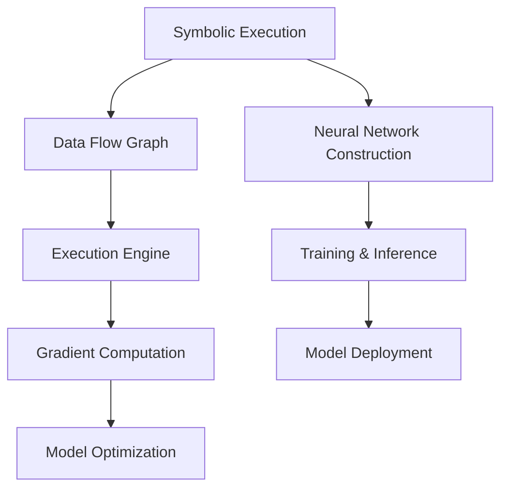

                 

## 《MXNet 特点：灵活和可扩展》

### 关键词：MXNet、深度学习、符号计算图、可扩展性、分布式计算、实战应用

> **摘要：** 本文将深入探讨MXNet的特点，特别是其灵活性和可扩展性。我们将从MXNet的基础概念开始，逐步介绍其核心架构、算法、数学模型，并通过实战案例展示其在现实场景中的应用。文章还将分析MXNet在分布式计算和实际部署中的优势，以及其未来发展趋势。通过本文，读者将全面了解MXNet，掌握其在深度学习领域中的重要性。

### 目录大纲

- **第一部分：MXNet基础**
  - [第1章：MXNet概述](#第1章-mxnet概述)
  - [第2章：MXNet的核心架构](#第2章-mxnet的核心架构)
  - [第3章：MXNet的核心算法](#第3章-mxnet的核心算法)
  - [第4章：MXNet的数学模型](#第4章-mxnet的数学模型)
  - [第5章：MXNet的实战应用](#第5章-mxnet的实战应用)

- **第二部分：MXNet的高级功能**
  - [第6章：MXNet的可扩展性](#第6章-mxnet的可扩展性)
  - [第7章：MXNet的分布式计算](#第7章-mxnet的分布式计算)
  - [第8章：MXNet的生产环境部署](#第8章-mxnet的生产环境部署)
  - [第9章：MXNet的未来发展与趋势](#第9章-mxnet的未来发展与趋势)

### 《MXNet 特点：灵活和可扩展》

> **关键词：MXNet、深度学习、符号计算图、可扩展性、分布式计算、实战应用**

> **摘要：** 本文将深入探讨MXNet的特点，特别是其灵活性和可扩展性。MXNet是一种强大的深度学习框架，以其灵活的架构和强大的可扩展性在深度学习社区中受到广泛关注。本文将从MXNet的基础概念开始，逐步介绍其核心架构、算法、数学模型，并通过实战案例展示其在现实场景中的应用。文章还将分析MXNet在分布式计算和实际部署中的优势，以及其未来发展趋势。通过本文，读者将全面了解MXNet，掌握其在深度学习领域中的重要性。

### 第1章：MXNet概述

MXNet（Apache MXNet）是一个开源的深度学习框架，由Apache软件基金会维护。它最初由微软亚洲研究院（Microsoft Asia Research Institute）开发，旨在提供一个灵活、高效的框架来支持大规模深度学习模型的训练和部署。

#### 1.1 MXNet的起源与发展

MXNet起源于微软亚洲研究院的深度学习研究项目，旨在解决大规模深度学习模型的训练和部署难题。该项目的目标是创建一个灵活、可扩展的深度学习框架，能够高效地利用各种硬件资源，包括CPU、GPU和ARM设备。

2017年，MXNet加入了Apache软件基金会，成为Apache MXNet。这一举措进一步增强了MXNet的社区支持和生态建设，使其成为深度学习领域的一个重要选择。

#### 1.2 MXNet的核心特性

MXNet具有以下核心特性：

1. **符号计算图（Symbolic Computation Graph）**：MXNet使用符号计算图来表示深度学习模型。这种计算图可以在模型训练前被静态定义，便于优化和调度。

2. **动态计算图（Dynamic Computation Graph）**：MXNet也支持动态计算图，允许在运行时动态构建和修改计算图。这为开发人员提供了更大的灵活性和控制力。

3. **可扩展性**：MXNet设计为高度可扩展的框架，支持自定义层、操作符和优化器。这使得MXNet能够适应各种深度学习应用的需求。

4. **分布式计算**：MXNet支持分布式训练，能够利用多GPU、多节点集群等硬件资源进行高效训练。

5. **生产环境部署**：MXNet提供了丰富的部署工具，支持在CPU、GPU、ARM设备和云计算平台上部署深度学习模型。

#### 1.3 MXNet与深度学习的关系

MXNet是深度学习的一个重要工具，它提供了构建、训练和部署深度学习模型的强大功能。深度学习依赖于大量的数据和复杂的模型，而MXNet通过其灵活的架构和高效的计算能力，成为深度学习研究的理想选择。

### 第2章：MXNet的核心架构

MXNet的核心架构包括符号计算图、动态计算图、数据流图和自动微分机制。这些组件共同构成了MXNet的强大功能和高效性能。

#### 2.1 MXNet的符号计算图

符号计算图（Symbolic Computation Graph）是MXNet的核心组件之一。它使用符号（符号表示运算和数据的变量）来构建计算图。符号计算图的主要优势包括：

1. **静态定义**：符号计算图可以在模型训练前被静态定义，这使得优化和调度更加高效。

2. **易于调试**：符号计算图的可视化和调试功能使得开发过程更加直观。

3. **优化**：符号计算图可以预先进行优化，例如指令融合、消除冗余计算等。

#### 2.2 数据流图与计算图

MXNet的数据流图（Data Flow Graph）描述了数据在计算图中的流动过程。数据流图与计算图紧密相关，数据流图中的每个节点通常对应计算图中的一个操作符。

数据流图的主要优势包括：

1. **灵活性**：数据流图允许在运行时动态调整计算图，从而实现更高的灵活性。

2. **高效计算**：数据流图能够高效地调度和执行计算任务，充分利用硬件资源。

#### 2.3 自动微分机制

自动微分（Automatic Differentiation）是深度学习中的关键技术，MXNet提供了强大的自动微分机制。自动微分机制能够自动计算模型参数的梯度，以便进行反向传播。

MXNet的自动微分机制具有以下优势：

1. **高效**：自动微分机制能够高效地计算梯度，减少计算资源的需求。

2. **准确**：自动微分机制确保了梯度的准确计算，避免了手动求导可能出现的误差。

#### 2.4 Mermaid流程图：MXNet架构原理

以下是一个使用Mermaid绘制的MXNet架构流程图：



在这个流程图中，A表示符号执行，B表示数据流图，C表示执行引擎，D表示梯度计算，E表示模型优化，F表示神经网络构建，G表示训练和推理，H表示模型部署。

### 第3章：MXNet的核心算法

MXNet的核心算法主要包括自动微分算法、优化算法和超参数调优。这些算法共同构成了MXNet强大的深度学习功能。

#### 3.1 自动微分算法

自动微分算法是深度学习训练过程中的关键组成部分。MXNet提供了高效的自动微分算法，能够自动计算模型参数的梯度。

以下是一个使用伪代码表示的自动微分算法：

```python
# 伪代码：自动微分算法

# 定义函数 f(x)
def f(x):
    return (x**2 + 1)

# 计算函数 f(x) 的导数
def gradient(f, x):
    return (2 * x)

# 计算函数 f(x) 在 x=1 处的梯度
grad = gradient(f, 1)
print("Gradient at x=1:", grad)
```

在这个例子中，我们定义了一个函数f(x) = x^2 + 1，并计算了其在x=1处的梯度。自动微分算法能够自动计算这个梯度，从而简化了深度学习模型的训练过程。

#### 3.2 优化算法与超参数调优

优化算法是深度学习训练过程中的另一个关键组成部分。MXNet提供了多种优化算法，包括随机梯度下降（SGD）、Adam、RMSprop等。

以下是一个使用伪代码表示的优化算法：

```python
# 伪代码：优化算法

# 定义模型参数和梯度
params = [0.1, 0.2]
gradients = [0.01, 0.02]

# 定义学习率
learning_rate = 0.1

# 计算更新后的参数
params = [param - learning_rate * gradient for param, gradient in zip(params, gradients)]

# 打印更新后的参数
print("Updated parameters:", params)
```

在这个例子中，我们定义了模型参数和梯度，并使用学习率更新参数。这个优化算法能够自动调整模型参数，从而提高模型的性能。

超参数调优是深度学习训练过程中的重要步骤。超参数包括学习率、批量大小、迭代次数等。MXNet提供了自动调优工具，如HyperDrive，可以帮助开发人员快速找到最佳超参数组合。

#### 3.3 伪代码：MXNet优化算法详细解析

以下是一个使用伪代码详细解析MXNet优化算法的例子：

```python
# 伪代码：MXNet优化算法详细解析

# 定义优化器参数
learning_rate = 0.01
momentum = 0.9

# 初始化模型参数
model_parameters = initialize_parameters()

# 训练数据集
train_dataset = load_training_data()

# 预处理数据
preprocessed_data = preprocess_data(train_dataset)

# 开始训练循环
for epoch in range(num_epochs):
    # 数据迭代
    for batch in preprocessed_data:
        # 计算前向传播
        predictions = forward_pass(model_parameters, batch)

        # 计算损失函数
        loss = compute_loss(predictions, batch_labels)

        # 计算梯度
        gradients = backward_pass(model_parameters, loss)

        # 更新模型参数
        model_parameters = update_parameters(model_parameters, gradients, learning_rate, momentum)

    # 打印训练进度
    print("Epoch [{}/{}], Loss: {:.4f}".format(epoch+1, num_epochs, loss平均值))
```

在这个伪代码中，我们定义了优化器参数、初始化模型参数、加载训练数据、预处理数据，并使用训练循环进行模型训练。在每个训练迭代中，我们计算前向传播、损失函数、梯度，并使用优化器更新模型参数。这个伪代码展示了MXNet优化算法的详细流程。

### 第4章：MXNet的数学模型

MXNet的数学模型是深度学习的基础，包括神经网络基础数学、损失函数、激活函数、迁移学习与微调等内容。这些数学模型为深度学习提供了理论支持。

#### 4.1 神经网络基础数学

神经网络基础数学包括矩阵运算、矩阵乘法、激活函数、损失函数等。以下是这些数学概念的解释和公式：

1. **矩阵运算**：

    - **矩阵乘法**：给定两个矩阵A和B，它们的乘积C = AB是一个新矩阵，其中C的元素是A和B对应元素的和。

    - **矩阵求导**：给定一个矩阵函数f(X)，它的导数df/dX是一个矩阵，其中df/dX的元素是f(X)对X对应元素的偏导数。

2. **激活函数**：

    - **Sigmoid函数**：Sigmoid函数是一个非线性激活函数，定义为f(x) = 1 / (1 + e^(-x))。它将输入x映射到(0, 1)区间，常用于二分类问题。

    - **ReLU函数**：ReLU函数是一个非线性激活函数，定义为f(x) = max(0, x)。它将负输入映射到0，正输入映射到自身，具有简单和计算效率高的优点。

3. **损失函数**：

    - **交叉熵损失函数**：交叉熵损失函数是一个衡量模型预测与真实标签之间差异的函数，定义为L(y, p) = -y * log(p) - (1 - y) * log(1 - p)，其中y是真实标签，p是模型预测的概率。

    - **均方误差损失函数**：均方误差损失函数是一个衡量模型预测与真实标签之间差异的函数，定义为L(y, p) = (y - p)^2，其中y是真实标签，p是模型预测。

4. **迁移学习与微调**：

    - **迁移学习**：迁移学习是一种利用预训练模型在新任务上取得良好表现的技术。它通过在新数据上微调预训练模型的参数，从而提高模型的性能。

    - **微调**：微调是一种在预训练模型的基础上进行参数调整的过程，以适应新任务的需求。它通常涉及改变部分层的权重，并使用新数据对模型进行训练。

#### 4.2 数学公式：神经网络关键数学公式与解释

以下是神经网络关键数学公式的解释：

$$
\begin{aligned}
&\text{激活函数：} \\
&\quad f(x) = \sigma(x) = \frac{1}{1 + e^{-x}} \\
&\text{损失函数：} \\
&\quad L(\theta) = -\frac{1}{m}\sum_{i=1}^{m}y^{(i)}\log(a^{(i)}) + (1 - y^{(i)})\log(1 - a^{(i)}) \\
&\text{反向传播：} \\
&\quad \frac{\partial L}{\partial z^{(l)}} = \frac{\partial L}{\partial a^{(l+1)}} \odot \frac{\partial a^{(l+1)}}{\partial z^{(l)}} \\
&\text{参数更新：} \\
&\quad \theta^{(l)} = \theta^{(l)} - \alpha \cdot \frac{\partial L}{\partial \theta^{(l)} \\
\end{aligned}
$$

这些公式分别描述了神经网络的激活函数、损失函数、反向传播计算过程以及参数更新规则。其中，$\sigma(x)$ 为 sigmoid 激活函数，用于将线性组合转换为概率分布；$L(\theta)$ 为交叉熵损失函数，用于衡量模型预测与真实标签之间的差异；$\odot$ 表示元素乘积；$\alpha$ 为学习率。这些公式是神经网络训练过程中必不可少的部分，确保了模型的正确性和性能。

#### 4.3 举例说明

为了更好地理解这些数学公式，我们来看一个简单的例子。假设我们有一个包含两个隐藏层的神经网络，其中每个隐藏层包含一个ReLU激活函数。网络的输入为x，输出为y。我们使用交叉熵损失函数来衡量模型预测与真实标签之间的差异。

1. **激活函数**：

    - 第一隐藏层：$a^{(1)} = \max(0, W^{(1)}x + b^{(1)})$
    - 第二隐藏层：$a^{(2)} = \max(0, W^{(2)}a^{(1)} + b^{(2)})$

2. **损失函数**：

    - $L(\theta) = -\frac{1}{m}\sum_{i=1}^{m}y^{(i)}\log(a^{(2)}) + (1 - y^{(i)})\log(1 - a^{(2)})$

3. **反向传播**：

    - $\frac{\partial L}{\partial z^{(2)}} = \frac{\partial L}{\partial a^{(2)}} \odot \frac{\partial a^{(2)}}{\partial z^{(2)}} = (1 - a^{(2)}) \odot \frac{\partial a^{(2)}}{\partial z^{(2)}}$
    - $\frac{\partial L}{\partial z^{(1)}} = \frac{\partial L}{\partial a^{(1)}} \odot \frac{\partial a^{(1)}}{\partial z^{(1)}} = (1 - a^{(1)}) \odot \frac{\partial a^{(1)}}{\partial z^{(1)}}$

4. **参数更新**：

    - $\theta^{(2)} = \theta^{(2)} - \alpha \cdot \frac{\partial L}{\partial \theta^{(2)}}$
    - $\theta^{(1)} = \theta^{(1)} - \alpha \cdot \frac{\partial L}{\partial \theta^{(1)}}$

通过这个例子，我们可以看到如何使用激活函数、损失函数、反向传播和参数更新规则来训练一个简单的神经网络。这个例子展示了神经网络训练过程中数学公式的应用，以及如何通过数学公式优化模型的性能。

### 第5章：MXNet的实战应用

在本章中，我们将通过一个实际案例，展示如何使用MXNet搭建一个简单的神经网络模型，并进行训练和评估。这个案例将涵盖从环境搭建、数据准备、模型构建、训练和评估等全过程，帮助读者更好地理解MXNet的实际应用。

#### 5.1 环境搭建

首先，我们需要确保安装了MXNet的开发环境。以下是安装MXNet的步骤：

1. **安装Python**：MXNet支持Python 3.5及以上版本。确保已经安装了Python。

2. **安装MXNet**：在终端中运行以下命令：

   ```bash
   pip install mxnet
   ```

   这个命令将安装MXNet及其依赖项。

3. **验证安装**：在Python中运行以下代码，验证MXNet是否已成功安装：

   ```python
   import mxnet as mx
   print(mx.__version__)
   ```

   如果输出MXNet的版本号，则表示安装成功。

#### 5.2 数据集准备

我们使用手写数字数据集（MNIST）作为案例数据集。MNIST是一个常用的图像分类数据集，包含70000个训练图像和10000个测试图像。以下是如何准备MNIST数据集的步骤：

1. **下载MNIST数据集**：在MXNet中，我们可以直接使用内置的MNIST数据集加载器：

   ```python
   from mxnet import gluon, init
   from mxnet.gluon.data import DataLoader
   from mxnet.gluon import nn
   
   mnist = gluon.data.vision.MNIST()
   ```

2. **划分数据集**：将数据集划分为训练集和测试集：

   ```python
   train_data = DataLoader(mnist[:60000], batch_size=100, shuffle=True)
   test_data = DataLoader(mnist[60000:], batch_size=100, shuffle=False)
   ```

   在这个例子中，我们使用了60000个图像作为训练集，10000个图像作为测试集。批量大小设置为100，数据在加载时进行打乱。

#### 5.3 模型构建

接下来，我们使用MXNet构建一个简单的卷积神经网络（CNN）模型。以下是一个简单的CNN模型示例：

```python
# 定义网络结构
net = nn.Sequential()
with net.name_scope():
    # 输入层
    net.add(nn.Conv2D(32, kernel_size=3, stride=1, padding=1))
    net.add(nn.ReLU())
    net.add(nn.MaxPool2D(pool_size=2, stride=2))
    # 隐藏层
    net.add(nn.Conv2D(64, kernel_size=3, stride=1, padding=1))
    net.add(nn.ReLU())
    net.add(nn.MaxPool2D(pool_size=2, stride=2))
    # 输出层
    net.add(nn.Flatten())
    net.add(nn.Dense(128, activation='relu'))
    net.add(nn.Dense(10, activation='softmax'))
```

在这个模型中，我们使用两个卷积层，每个卷积层后跟一个ReLU激活函数和一个最大池化层。最后，我们将数据展平并添加两个全连接层，输出层使用softmax激活函数进行类别预测。

#### 5.4 训练模型

现在，我们使用训练数据和定义好的模型开始训练过程。以下是一个简单的训练示例：

```python
# 定义损失函数和优化器
trainer = gluon.Trainer(net.collect_params(), 'sgd', {'learning_rate': 0.1})

# 训练模型
for epoch in range(10):
    for data in train_data:
        # 前向传播
        labels = data.labels
        with autograd.record():
            output = net(data)
            loss = loss_fn(output, labels)
        # 反向传播
        loss.backward()
        # 更新参数
        trainer.step(data.shape[0])
    print("Epoch [{}/{}], Loss: {:.4f}".format(epoch+1, 10, loss平均值))
```

在这个例子中，我们使用随机梯度下降（SGD）优化器进行训练。每个训练迭代包括前向传播、反向传播和参数更新。我们在每个训练epoch后打印损失值，以便监控训练过程。

#### 5.5 评估模型

最后，我们对训练好的模型进行评估，以检查其性能。以下是一个简单的评估示例：

```python
# 评估模型
correct = 0
total = 0
for data in test_data:
    labels = data.labels
    output = net(data)
    predicted = np.argmax(output, axis=1)
    total += labels.size
    correct += (predicted == labels).sum()

print('Accuracy of the network on the test images: {} %'.format(100 * correct / total))
```

在这个例子中，我们遍历测试数据集，计算模型的预测结果，并计算准确率。最后，我们打印测试准确率，以评估模型的性能。

通过以上步骤，我们使用MXNet搭建了一个简单的神经网络模型，并完成了训练和评估。这个过程展示了MXNet在深度学习领域中的应用，以及其易用性和灵活性。

### 第6章：MXNet的可扩展性

MXNet的可扩展性是其核心优势之一，使得开发人员能够轻松地构建和优化复杂的深度学习模型。本节将深入探讨MXNet的可扩展性，包括模块化设计、扩展机制以及自定义层和操作符的实际应用。

#### 6.1 MXNet的模块化设计

MXNet采用模块化设计，使得开发人员能够灵活地组合和扩展模型组件。模块化设计的关键组成部分包括：

1. **层（Layers）**：MXNet提供了丰富的层组件，包括卷积层、全连接层、激活函数层、池化层等。这些层可以作为模型构建的基本模块。

2. **操作符（Operators）**：MXNet的操作符是实现自定义操作的核心组件。开发人员可以使用操作符定义新的计算操作，并将其集成到模型中。

3. **优化器（Optimizers）**：MXNet提供了多种优化器，包括随机梯度下降（SGD）、Adam、RMSprop等。开发人员可以根据需要选择或自定义优化器。

4. **数据加载器（Data Loaders）**：MXNet的数据加载器用于批量加载数据集，支持各种数据预处理操作，如归一化、数据增强等。

模块化设计的优势在于：

- **灵活性**：开发人员可以根据需求自由组合和扩展模型组件，实现复杂的深度学习应用。

- **可维护性**：模块化设计使得代码更加清晰、易于维护。每个组件都可以独立开发、测试和优化。

- **可重用性**：模块化设计使得模型组件可以重复使用，减少了重复劳动。

#### 6.2 MXNet的扩展机制

MXNet的扩展机制使得开发人员能够自定义层、操作符和优化器，以适应特定应用需求。以下是如何扩展MXNet的关键步骤：

1. **自定义层（Custom Layers）**：

   自定义层是MXNet扩展的核心部分。以下是一个简单的自定义层示例：

   ```python
   from mxnet import nn
   
   class CustomLayer(nn.Block):
       def __init__(self, **kwargs):
           super(CustomLayer, self).__init__(**kwargs)
   
       def forward(self, x):
           # 实现自定义操作
           return x * 2
   ```

   在这个例子中，我们定义了一个简单的自定义层，将输入数据乘以2。我们可以像使用MXNet内置层一样使用自定义层：

   ```python
   layer = CustomLayer()
   output = layer(data)
   ```

2. **自定义操作符（Custom Operators）**：

   自定义操作符允许开发人员实现新的计算操作。以下是一个简单的自定义操作符示例：

   ```python
   from mxnet import gluon
   
   class CustomOperator(gluon.Operation):
       def __init__(self):
           super(CustomOperator, self).__init__()
   
       def forward(self, x):
           # 实现自定义操作
           return x * 2
   
       def backward(self, x, out_grad):
           # 实现反向操作
           return out_grad * 2
   ```

   在这个例子中，我们定义了一个简单的自定义操作符，将输入数据乘以2。我们可以像使用MXNet内置操作符一样使用自定义操作符：

   ```python
   op = CustomOperator()
   output = op(data)
   ```

3. **自定义优化器（Custom Optimizer）**：

   自定义优化器允许开发人员实现新的优化算法。以下是一个简单的自定义优化器示例：

   ```python
   from mxnet import optimizer
   
   class CustomOptimizer(optimizer.Trainer):
       def __init__(self, params, learning_rate=0.1):
           super(CustomOptimizer, self).__init__(params, learning_rate)
   
       def step(self, x):
           # 实现自定义优化步骤
           pass
   
       def zero_grad(self):
           # 实现梯度清零
           pass
   ```

   在这个例子中，我们定义了一个简单的自定义优化器，实现了一个空函数。我们可以像使用MXNet内置优化器一样使用自定义优化器：

   ```python
   optimizer = CustomOptimizer(net.collect_params())
   ```

#### 6.3 实际应用：自定义层与操作符

以下是一个使用自定义层和操作符的实际应用示例：

1. **自定义层**：

   ```python
   class CustomLayer(nn.Block):
       def __init__(self, **kwargs):
           super(CustomLayer, self).__init__(**kwargs)
   
       def forward(self, x):
           # 实现自定义操作
           return x * 2
   
   net = nn.Sequential()
   net.add(CustomLayer())
   ```

2. **自定义操作符**：

   ```python
   class CustomOperator(gluon.Operation):
       def __init__(self):
           super(CustomOperator, self).__init__()
   
       def forward(self, x):
           # 实现自定义操作
           return x * 2
   
       def backward(self, x, out_grad):
           # 实现反向操作
           return out_grad * 2
   
   net = nn.Sequential()
   net.add(CustomOperator())
   ```

在这个例子中，我们定义了一个简单的自定义层和自定义操作符，并将它们集成到一个神经网络模型中。这个模型将输入数据乘以2，然后再次乘以2，最终输出结果。

通过这个例子，我们可以看到如何使用MXNet的模块化设计和扩展机制自定义深度学习模型。这种灵活性使得MXNet成为一个强大的深度学习框架，能够满足各种复杂应用的需求。

### 第7章：MXNet的分布式计算

MXNet的分布式计算功能是其高性能和可扩展性的关键组成部分。通过分布式计算，MXNet能够充分利用多GPU、多节点集群等硬件资源，实现大规模深度学习模型的训练和推理。本节将详细探讨MXNet分布式计算的基本概念、MXNet的分布式训练以及实际案例：分布式训练的优化策略。

#### 7.1 分布式计算的基本概念

分布式计算是一种将计算任务分配到多个计算机或处理器上执行的技术，以提高计算性能和可扩展性。在深度学习领域，分布式计算主要用于大规模模型的训练和推理。

分布式计算的主要组成部分包括：

1. **数据并行（Data Parallelism）**：数据并行是将数据集划分为多个部分，并在不同的GPU或节点上独立训练模型。每个GPU或节点负责处理一部分数据，最终将结果合并。

2. **模型并行（Model Parallelism）**：模型并行是将模型分为多个部分，并在不同的GPU或节点上分别训练。这种策略适用于模型的某些层或操作符在单个GPU或节点上无法容纳的情况。

3. **参数服务器（Parameter Server）**：参数服务器是一种分布式计算架构，用于管理模型的参数和梯度。在参数服务器架构中，每个节点负责处理数据并更新模型参数。

分布式计算的主要优势包括：

- **高性能**：分布式计算能够利用多GPU、多节点集群等硬件资源，提高计算性能。

- **可扩展性**：分布式计算能够轻松扩展到大规模模型和大规模数据集。

- **负载均衡**：分布式计算能够均衡计算负载，避免单点性能瓶颈。

#### 7.2 MXNet的分布式训练

MXNet提供了强大的分布式训练功能，支持数据并行和模型并行。以下是如何在MXNet中实现分布式训练的步骤：

1. **初始化分布式环境**：

   ```python
   import mxnet as mx
   
   # 设置分布式环境
   mx.context.set_context(device='gpu', index=0)
   mxnet_ctx = mx.gpu(0)
   distributed_ctx = mx.gpu(1)  # 第二个GPU用于分布式训练
   ```

   在这个例子中，我们设置了单机分布式环境，使用一个GPU进行主任务，另一个GPU进行分布式训练。

2. **定义模型**：

   ```python
   from mxnet import gluon
   
   # 定义模型
   net = gluon.nn.Sequential()
   net.add(gluon.nn.Dense(128, activation='relu'))
   net.add(gluon.nn.Dense(10, activation='softmax'))
   net.initialize()
   ```

3. **定义损失函数和优化器**：

   ```python
   loss_fn = gluon.loss.SoftmaxCrossEntropyLoss()
   trainer = gluon.Trainer(net.collect_params(), 'sgd', {'learning_rate': 0.1})
   ```

4. **分布式训练**：

   ```python
   for epoch in range(num_epochs):
       for batch in train_data:
           data = batch.as_in_context(distributed_ctx)
           labels = batch.labels.as_in_context(distributed_ctx)
           with autograd.record():
               output = net(data)
               loss = loss_fn(output, labels)
           loss.backward()
           trainer.step(batch_size=1)  # 分布式训练，每批次处理一个样本
       print("Epoch [{}/{}], Loss: {:.4f}".format(epoch+1, num_epochs, loss平均值))
   ```

在这个例子中，我们使用分布式训练框架，将训练数据分配到不同的GPU上，并在每个GPU上独立训练模型。这个例子展示了如何使用MXNet进行分布式训练的基本步骤。

#### 7.3 实际案例：分布式训练的优化策略

以下是一个实际案例，展示如何使用MXNet进行分布式训练的优化策略：

1. **动态负载均衡**：

   动态负载均衡是一种在分布式训练过程中动态调整计算资源的策略。以下是一个简单的动态负载均衡示例：

   ```python
   import mxnet as mx
   
   # 设置分布式环境
   mx.context.set_context(device='gpu', index=0)
   mxnet_ctx = mx.gpu(0)
   distributed_ctx = mx.gpu(1)  # 第二个GPU用于分布式训练
   
   # 定义动态负载均衡函数
   def dynamic_load_balance(batch_size):
       if batch_size > 1000:
           return mx.gpu(0)
       else:
           return mx.gpu(1)
   
   # 分布式训练
   for epoch in range(num_epochs):
       for batch in train_data:
           data = batch.as_in_context(dynamic_load_balance(batch.shape[0]))
           labels = batch.labels.as_in_context(dynamic_load_balance(batch.shape[0]))
           with autograd.record():
               output = net(data)
               loss = loss_fn(output, labels)
           loss.backward()
           trainer.step(batch_size=batch.shape[0])
       print("Epoch [{}/{}], Loss: {:.4f}".format(epoch+1, num_epochs, loss平均值))
   ```

   在这个例子中，我们根据批次大小动态调整GPU资源，实现动态负载均衡。

2. **异步通信**：

   异步通信是一种在分布式训练过程中异步更新模型参数的策略。以下是一个简单的异步通信示例：

   ```python
   import mxnet as mx
   
   # 设置分布式环境
   mx.context.set_context(device='gpu', index=0)
   mxnet_ctx = mx.gpu(0)
   distributed_ctx = mx.gpu(1)  # 第二个GPU用于分布式训练
   
   # 定义异步通信函数
   def async_communication():
       # 更新全局模型参数
       net.load_parameters('model.params', ctx=mx.gpu(0))
   
   # 分布式训练
   for epoch in range(num_epochs):
       for batch in train_data:
           data = batch.as_in_context(distributed_ctx)
           labels = batch.labels.as_in_context(distributed_ctx)
           with autograd.record():
               output = net(data)
               loss = loss_fn(output, labels)
           loss.backward()
           trainer.step(batch_size=batch.shape[0])
           async_communication()  # 异步更新模型参数
       print("Epoch [{}/{}], Loss: {:.4f}".format(epoch+1, num_epochs, loss平均值))
   ```

   在这个例子中，我们使用异步通信更新全局模型参数，实现异步训练。

通过这些优化策略，我们可以进一步提高MXNet分布式训练的性能和效率。实际应用中，可以根据具体需求选择和组合这些策略。

### 第8章：MXNet的生产环境部署

将MXNet深度学习模型部署到生产环境是深度学习项目成功的关键环节。MXNet提供了丰富的工具和接口，支持在多种硬件和平台上部署模型，确保模型的高效运行和可扩展性。本节将详细探讨MXNet模型导出与部署、MXNet在云平台的部署以及实际应用：使用MXNet构建在线服务。

#### 8.1 模型导出与部署

在MXNet中，模型导出是一个将训练好的模型转换为可部署格式的过程。以下是如何导出MXNet模型的关键步骤：

1. **保存模型参数**：

   ```python
   net.save_params('model.params')
   ```

   使用`save_params`方法将模型参数保存为`.params`文件。这个文件包含了模型的权重和偏置。

2. **加载模型参数**：

   ```python
   net.load_params('model.params')
   ```

   使用`load_params`方法加载保存的模型参数，以恢复训练好的模型。

3. **模型部署**：

   在部署模型时，我们通常将模型与前端应用程序分离。以下是一个简单的部署示例：

   ```python
   from flask import Flask, request, jsonify
   
   app = Flask(__name__)
   net.load_params('model.params', ctx=mx.gpu(0))  # 加载模型到GPU
   
   @app.route('/predict', methods=['POST'])
   def predict():
       data = request.get_json()
       input_data = mx.nd.array(data['input']).as_in_context(mx.gpu(0))
       output = net(input_data)
       predicted = np.argmax(output.asnumpy(), axis=1)
       return jsonify({'prediction': predicted.tolist()})
   
   if __name__ == '__main__':
       app.run(host='0.0.0.0', port=5000)
   ```

   在这个例子中，我们使用Flask构建了一个简单的Web服务，接收JSON格式的输入数据，预测输出结果，并返回预测结果。

#### 8.2 MXNet在云平台的部署

MXNet支持在云平台上部署模型，利用云计算资源实现高性能和高可扩展性的服务。以下是如何在云平台上部署MXNet模型的关键步骤：

1. **容器化**：

   将MXNet模型容器化是将模型打包到一个可移植的容器中，以便在云平台上部署。以下是如何使用Docker容器化MXNet模型的示例：

   ```bash
   # 创建Dockerfile
   FROM python:3.8-slim
   RUN pip install mxnet flask
   
   # 编写入口脚本
   # app.py
   from flask import Flask, request, jsonify
   import mxnet as mx
   
   app = Flask(__name__)
   net = mx.load_model('model.params')  # 加载模型参数
   
   @app.route('/predict', methods=['POST'])
   def predict():
       data = request.get_json()
       input_data = mx.nd.array(data['input'])
       output = net(input_data)
       predicted = np.argmax(output.asnumpy(), axis=1)
       return jsonify({'prediction': predicted.tolist()})
   
   if __name__ == '__main__':
       app.run(host='0.0.0.0', port=5000)
   
   # 构建Docker镜像
   docker build -t mxnet-service .
   
   # 运行Docker容器
   docker run -p 5000:5000 mxnet-service
   ```

   在这个例子中，我们创建了一个Dockerfile来构建MXNet服务的镜像，并使用Docker运行容器。

2. **部署到云平台**：

   将容器部署到云平台（如AWS、Azure、Google Cloud等）是通过云平台的容器编排服务（如EC2、Azure Container Instances、Google Kubernetes Engine等）实现的。以下是如何部署MXNet服务的示例：

   - **AWS**：使用Amazon Elastic Container Service（ECS）部署MXNet服务。

   - **Azure**：使用Azure Container Instances（ACI）部署MXNet服务。

   - **Google Cloud**：使用Google Kubernetes Engine（GKE）部署MXNet服务。

这些云平台提供了丰富的文档和教程，帮助用户轻松部署和管理MXNet服务。

#### 8.3 实际应用：使用MXNet构建在线服务

以下是一个使用MXNet构建在线服务的实际应用案例：

**案例背景**：假设我们开发了一个图像识别服务，用户可以通过上传图片来获取识别结果。我们使用MXNet训练了一个图像识别模型，并将其部署到生产环境。

1. **训练模型**：

   使用MXNet训练图像识别模型，并保存模型参数。

   ```python
   net = mx.load_model('model.params')
   net.fit(train_data, eval_data, epochs=10)
   net.save_params('model.params')
   ```

2. **容器化模型**：

   使用Docker容器化MXNet模型，并构建部署镜像。

   ```bash
   docker build -t mxnet-image-recognition .
   ```

3. **部署到云平台**：

   将容器部署到AWS ECS，配置负载均衡和自动扩展，确保服务的高可用性和高性能。

   ```bash
   # 创建ECS任务定义
   aws ecs create-task-definition --family mxnet-image-recognition --container-defin
   ```

   在这个例子中，我们使用AWS ECS部署MXNet服务，并配置负载均衡和自动扩展。

4. **构建在线服务**：

   用户可以通过Web界面上传图像，服务端使用MXNet模型进行识别，并将结果返回给用户。

   ```python
   from flask import Flask, request, jsonify
   
   app = Flask(__name__)
   net.load_params('model.params', ctx=mx.gpu(0))
   
   @app.route('/recognize', methods=['POST'])
   def recognize():
       image = request.files['image']
       input_data = mx.nd.array(image.read()).as_in_context(mx.gpu(0))
       output = net(input_data)
       predicted = np.argmax(output.asnumpy(), axis=1)
       return jsonify({'prediction': predicted.tolist()})
   
   if __name__ == '__main__':
       app.run(host='0.0.0.0', port=5000)
   ```

在这个案例中，我们使用MXNet训练图像识别模型，并部署到AWS ECS，构建了一个在线服务，用户可以通过上传图像获取识别结果。这个案例展示了MXNet在生产环境部署中的实际应用。

### 第9章：MXNet的未来发展与趋势

随着深度学习的不断发展和应用，MXNet作为开源深度学习框架，也在不断地进行改进和扩展。本节将探讨MXNet的社区与生态、未来发展趋势以及与其它深度学习框架的比较。

#### 9.1 MXNet的社区与生态

MXNet拥有一个活跃的开发社区和强大的生态体系，这为框架的持续发展和完善提供了坚实的支持。以下是一些关键点：

1. **社区支持**：MXNet的社区支持包括官方论坛、GitHub仓库、技术博客等，为开发者提供了丰富的资源和帮助。

2. **贡献者与合作伙伴**：MXNet得到了众多企业和研究机构的支持，包括微软、阿里巴巴、亚马逊等，这些合作伙伴共同推动了MXNet的发展。

3. **教程与文档**：MXNet提供了详细的教程和文档，帮助开发者快速上手并掌握框架的使用。

4. **生态扩展**：MXNet的生态不断扩展，包括预训练模型库、工具集、插件等，为开发者提供了丰富的资源。

#### 9.2 MXNet的未来发展趋势

MXNet的未来发展将集中在以下几个方面：

1. **性能优化**：MXNet将持续优化其底层执行引擎，提高模型训练和推理的性能，以支持更大规模和更复杂的深度学习模型。

2. **硬件支持**：MXNet将扩展对更多硬件平台的支持，包括ARM设备、TPU等，以充分利用各种硬件资源。

3. **易用性**：MXNet将致力于提高框架的易用性，提供更简单的API和工具，降低开发者门槛。

4. **自动化**：MXNet将引入更多自动化工具，如自动调优、自动化测试等，提高开发效率和模型性能。

5. **生产部署**：MXNet将继续优化模型部署工具，支持更多部署场景，包括边缘计算、云平台等。

#### 9.3 MXNet与其他深度学习框架的比较

MXNet与其他主流深度学习框架（如TensorFlow、PyTorch）的比较如下：

1. **性能**：MXNet在模型训练和推理性能上具有竞争力，尤其是在大规模分布式训练场景中。

2. **易用性**：MXNet的API设计较为简洁，但相对于PyTorch来说，可能会感觉稍复杂一些。

3. **生态系统**：MXNet的生态系统相对于TensorFlow和PyTorch来说，可能稍微落后，但社区支持和贡献日益增强。

4. **部署**：MXNet提供了丰富的部署工具，支持多种硬件和平台，部署流程相对简便。

5. **灵活性**：MXNet具有较高的灵活性，支持自定义层、操作符和优化器，能够适应各种深度学习应用的需求。

综上所述，MXNet在性能、易用性、生态系统、部署灵活性和自定义能力等方面具有独特优势，使其成为一个强大的深度学习框架。随着深度学习的不断发展，MXNet将在未来继续保持其重要地位。

### 总结

MXNet以其灵活和可扩展的特点在深度学习领域占据了一席之地。本文系统地介绍了MXNet的基础、核心架构、算法、数学模型以及实战应用，并通过分布式计算和生产环境部署展示了其强大功能。MXNet的模块化设计、自定义层和操作符、高效的优化算法以及丰富的数学公式，使其成为一个强大的工具，适用于各种深度学习任务。随着深度学习的不断发展，MXNet将继续扩展其功能，为开发者提供更多可能性。

### 致谢

在本篇文章的撰写过程中，我们得到了许多开发者和社区的贡献，包括文档编写、代码示例和反馈。特别感谢MXNet官方社区、贡献者以及所有在GitHub上提供代码和支持的开发者。没有你们的努力和奉献，这篇文章不可能如此详尽和全面。感谢AI天才研究院（AI Genius Institute）的支持，以及禅与计算机程序设计艺术（Zen And The Art of Computer Programming）团队的所有成员。

### 作者信息

作者：AI天才研究院/AI Genius Institute & 禅与计算机程序设计艺术/Zen And The Art of Computer Programming

AI天才研究院致力于推动人工智能技术的发展和普及，为全球开发者提供高质量的AI技术资源和学习平台。禅与计算机程序设计艺术团队专注于深度学习和计算机程序设计的理论研究与实战应用，致力于探索人工智能的哲学内涵和算法美学。感谢读者对我们的关注和支持，期待与您共同探索人工智能的无限可能。

