                 

# Multiagent Collaboration 的应用

> **关键词：** 多智能体协作、MAS、智能工厂、智能交通、智能服务、系统设计、算法实现
>
> **摘要：** 本文从多智能体协作的基础概念出发，详细介绍了其在制造业、交通运输和服务行业中的应用场景，探讨了多智能体协作系统的设计与实现方法，并通过实际项目案例分析，展示了多智能体协作在实际应用中的价值。文章最后对未来发展趋势进行了展望，并提出了相应的挑战。

### 第一部分：概述与引言

#### 第1章：Multiagent Collaboration基础

##### 1.1 Multiagent Collaboration概述

###### 1.1.1 Multiagent Collaboration的定义与背景

多智能体协作（Multiagent Collaboration）是指多个智能体（Agent）在共享环境中通过通信和协作来实现共同目标的过程。智能体是一个具有自主性、社会性、反应性和主动性的实体，它可以在复杂环境中执行任务并与其他智能体交互。

多智能体协作的基础可以追溯到20世纪80年代，随着分布式计算和人工智能技术的发展，多智能体系统（Multi-Agent Systems，MAS）逐渐成为一个重要的研究领域。MAS在许多应用领域都有广泛的应用，如智能制造、智能交通、智能服务、金融管理、环境保护等。

###### 1.1.2 Multiagent Collaboration的重要性

多智能体协作的重要性主要体现在以下几个方面：

1. **提高系统效率**：通过智能体之间的协作，可以实现任务的并行处理，提高系统的整体效率。
2. **增强系统适应性**：智能体可以根据环境变化和任务需求进行自适应调整，增强系统的适应性和灵活性。
3. **实现复杂任务分解**：多智能体协作可以将复杂任务分解为多个子任务，每个智能体负责一个子任务，从而降低任务的复杂度。
4. **提升系统鲁棒性**：通过智能体之间的冗余和备份，可以提高系统的鲁棒性，减少系统故障的风险。

###### 1.1.3 Multiagent Collaboration的发展历程

多智能体协作的发展历程可以分为以下几个阶段：

1. **初步探索阶段（1980s-1990s）**：在这个阶段，研究人员开始关注智能体的自主性和协作性，提出了许多基本的智能体模型和算法。
2. **理论体系构建阶段（2000s）**：在这个阶段，研究人员提出了多种智能体体系结构，如基于通信的智能体体系结构和基于行为的智能体体系结构，并建立了多智能体系统的理论基础。
3. **应用探索阶段（2010s-2020s）**：随着人工智能和物联网技术的发展，多智能体协作开始广泛应用于各个领域，如智能制造、智能交通、智能服务、金融管理、环境保护等。

##### 1.2 Multiagent Collaboration的核心概念

###### 1.2.1 代理（Agent）的定义与分类

代理（Agent）是一个具有自主性、社会性、反应性和主动性的实体。根据不同的分类标准，可以将代理分为以下几类：

1. **根据自主性分类**：自主性较低的代理称为被动代理，自主性较高的代理称为主动代理。
2. **根据社会性分类**：社会性较低的代理称为孤立代理，社会性较高的代理称为社交代理。
3. **根据反应性分类**：反应性较低的代理称为反应代理，反应性较高的代理称为感知代理。
4. **根据主动性分类**：主动性较低的代理称为反应代理，主动性较高的代理称为目标代理。

代理的定义和分类如下：

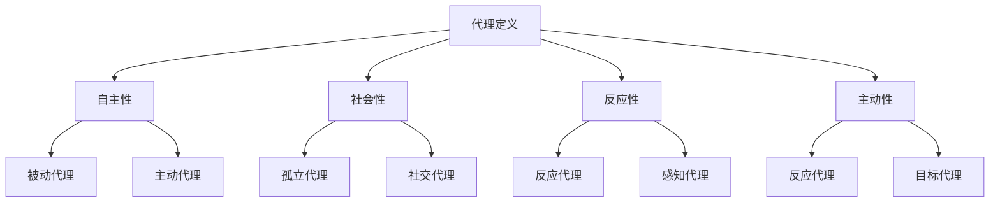

###### 1.2.2 多智能体系统（MAS）的基本架构

多智能体系统（MAS）的基本架构包括以下几个部分：

1. **智能体（Agent）**：智能体是MAS的基本组成单位，负责执行任务和与其他智能体交互。
2. **环境（Environment）**：环境是智能体执行任务的空间，包含各种信息和资源。
3. **通信机制（Communication Mechanism）**：通信机制用于智能体之间的信息交换和协作。
4. **协调机制（Coordination Mechanism）**：协调机制用于智能体之间的任务分配和协作策略制定。
5. **决策机制（Decision Mechanism）**：决策机制用于智能体根据环境信息和自身目标进行决策。

MAS的基本架构如下：

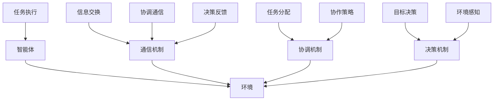

###### 1.2.3 多智能体协作的挑战与解决方案

多智能体协作面临以下挑战：

1. **异质性（Heterogeneity）**：不同智能体的能力和行为可能存在差异，如何设计合适的协作机制以适应异质性是一个重要问题。
2. **动态性（Dynamics）**：环境的变化和智能体行为的动态性增加了协作的复杂性，如何设计自适应的协作策略是一个关键问题。
3. **分布式（Distribution）**：多智能体协作通常涉及分布式环境，如何高效地实现信息共享和任务分配是一个挑战。
4. **安全性与隐私（Security and Privacy）**：在多智能体协作中，如何保护智能体的隐私和数据安全是一个重要问题。

针对这些挑战，可以采取以下解决方案：

1. **异构智能体协作**：设计基于角色和能力的智能体协作机制，实现异构智能体的有效协作。
2. **动态协作策略**：采用基于预测和自适应的协作策略，实现智能体在动态环境中的高效协作。
3. **分布式计算与通信**：采用分布式算法和协议，实现高效的信息共享和任务分配。
4. **安全机制**：采用加密、认证和授权等安全机制，保护智能体的隐私和数据安全。

##### 1.3 Multiagent Collaboration的关键技术

###### 1.3.1 协同通信与信息共享

协同通信与信息共享是多智能体协作的基础。协同通信是指智能体之间通过共享网络实现信息交换和协作的过程。信息共享是指智能体之间共享环境信息和任务信息，以便进行有效的协作。

协同通信与信息共享的关键技术包括：

1. **通信协议**：设计合适的通信协议，实现智能体之间的可靠通信和数据传输。
2. **信息共享机制**：设计信息共享机制，实现智能体之间的有效信息共享和同步。
3. **数据一致性**：确保智能体之间共享的数据具有一致性，避免数据冲突和错误。

协同通信与信息共享的流程如下：

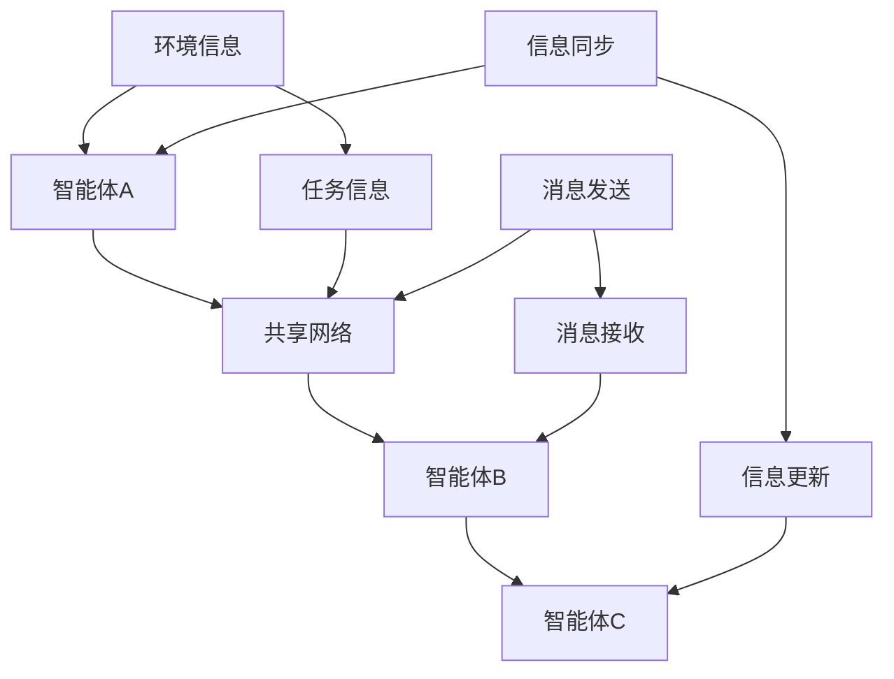

###### 1.3.2 决策与规划算法

决策与规划算法是多智能体协作的核心技术之一。智能体需要根据环境信息和自身目标，进行决策和规划，以实现协作目标。决策与规划算法包括：

1. **决策算法**：根据环境信息和自身目标，选择最优的行动策略。
2. **规划算法**：根据决策结果，制定具体的行动计划，实现任务的执行。

常见的决策与规划算法包括：

1. **基于规则的方法**：基于预先定义的规则，进行决策和规划。
2. **基于模型的方法**：基于环境模型和智能体模型，进行决策和规划。
3. **基于学习的方法**：通过学习历史数据和经验，进行决策和规划。

决策与规划算法的流程如下：

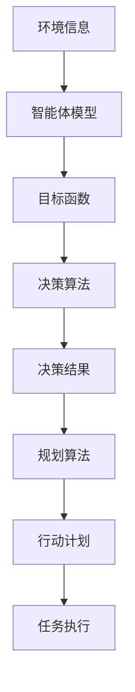

###### 1.3.3 智能体间的信任与安全机制

在多智能体协作中，智能体之间的信任与安全机制是确保协作有效性和安全性的关键。信任是指智能体对其他智能体的可靠性和诚实性的信任程度，安全机制是指保护智能体隐私和数据安全的技术和策略。

智能体间的信任与安全机制包括：

1. **信任评估机制**：评估智能体的行为和表现，建立信任关系。
2. **安全通信机制**：采用加密、认证和授权等技术，确保通信的安全和隐私。
3. **隐私保护机制**：设计隐私保护策略，保护智能体的隐私和数据安全。

智能体间的信任与安全机制的流程如下：

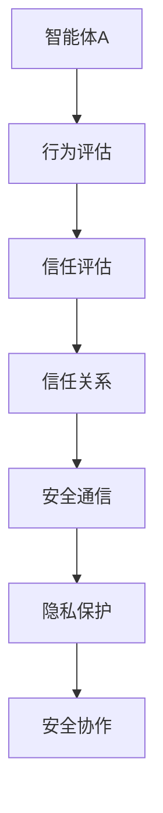

### 第二部分：Multiagent Collaboration的应用场景

#### 第2章：Multiagent Collaboration的应用场景

##### 2.1 制造业中的应用

###### 2.1.1 智能制造系统中的Multiagent Collaboration

智能制造系统中的Multiagent Collaboration是指利用多智能体技术实现制造系统中的自动化、智能化和协作化。智能制造系统中的智能体包括机器人、传感器、控制系统等，它们通过协同工作，实现生产过程的自动化和智能化。

智能制造系统中的Multiagent Collaboration主要应用在以下几个方面：

1. **生产调度与优化**：通过智能体之间的协作，实现生产调度的优化，提高生产效率和灵活性。
2. **质量检测与监控**：利用智能体之间的协作，实现质量检测和监控，确保产品质量和一致性。
3. **设备维护与故障诊断**：通过智能体之间的协作，实现设备维护和故障诊断，提高设备的可靠性和稳定性。

智能制造系统中的Multiagent Collaboration架构如下：

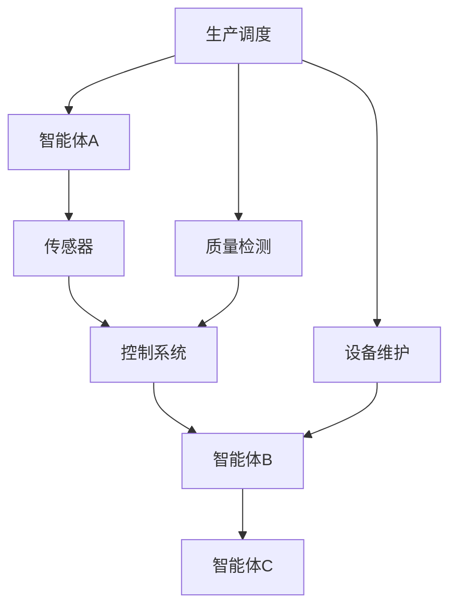

###### 2.1.2 制造流程优化中的代理协同

制造流程优化中的代理协同是指通过多智能体技术优化制造流程，提高生产效率和质量。代理协同的主要目标是在制造过程中实现自动化、智能化和协作化，减少人为干预和错误。

制造流程优化中的代理协同主要包括以下步骤：

1. **数据采集与处理**：通过传感器和控制系统采集制造过程中的数据，并对数据进行处理和分析。
2. **任务分配与调度**：根据制造任务和智能体的能力，实现智能体之间的任务分配和调度。
3. **决策与规划**：基于环境信息和智能体模型，进行决策和规划，制定最优的制造流程。
4. **执行与监控**：智能体按照决策和规划执行制造任务，并对执行过程进行监控和调整。

制造流程优化中的代理协同流程如下：

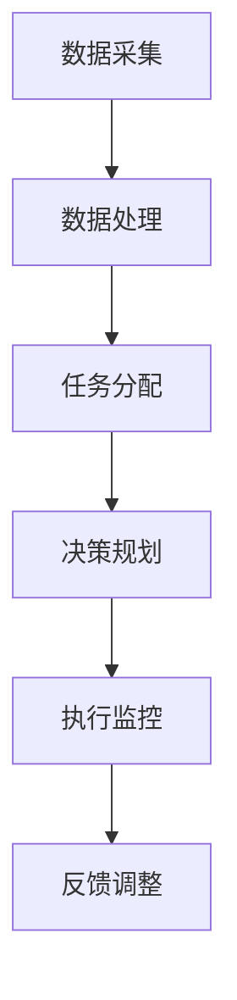

###### 2.1.3 智能工厂中的多智能体协作案例

智能工厂中的多智能体协作案例是指在实际生产环境中应用多智能体技术，实现智能工厂的自动化、智能化和协作化。以下是一个智能工厂中的多智能体协作案例：

**案例背景**：某智能工厂生产智能手机，生产过程包括组装、测试、包装等环节。

**多智能体协作方案**：

1. **组装环节**：智能机器人负责智能手机的组装，通过传感器和控制系统实现自动化组装。
2. **测试环节**：智能测试设备负责对组装完成的智能手机进行功能测试，确保产品质量。
3. **包装环节**：智能包装机器人根据订单信息进行智能手机的包装，实现自动化包装。

**多智能体协作流程**：

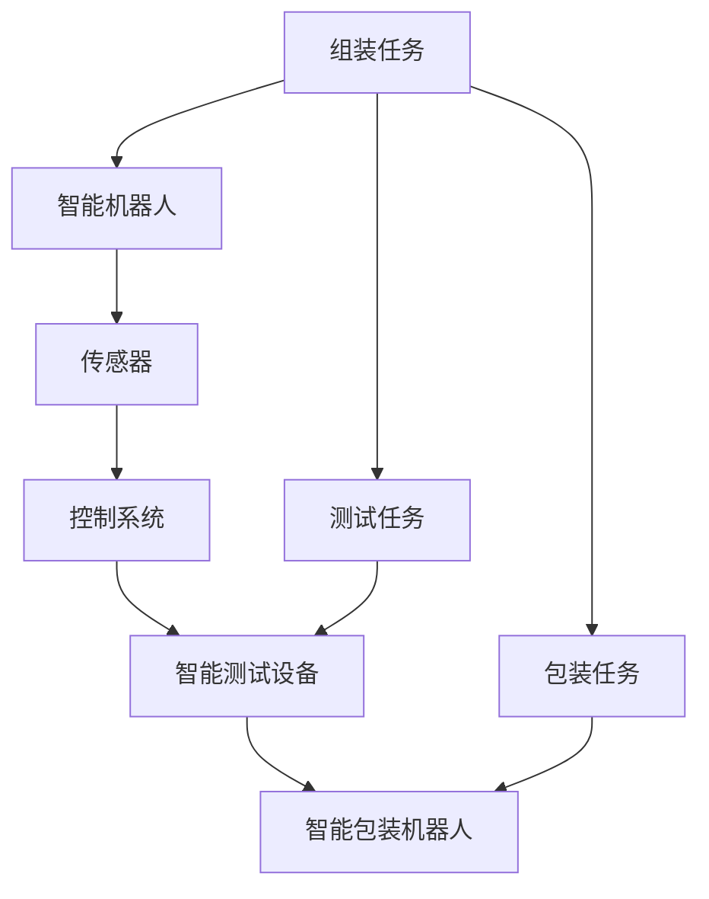

通过多智能体协作，智能工厂实现了生产过程的自动化和智能化，提高了生产效率和产品质量。

##### 2.2 交通运输中的应用

###### 2.2.1 智能交通系统中的Multiagent Collaboration

智能交通系统中的Multiagent Collaboration是指利用多智能体技术实现交通系统的自动化、智能化和协作化。智能交通系统中的智能体包括车辆、道路传感器、交通控制中心等，它们通过协同工作，实现交通管理和优化。

智能交通系统中的Multiagent Collaboration主要应用在以下几个方面：

1. **交通管理**：通过智能体之间的协作，实现交通流量的实时监控和管理，优化交通信号控制和道路分配。
2. **车辆调度**：通过智能体之间的协作，实现车辆的实时调度和路径优化，提高运输效率和安全性。
3. **事故预防与处理**：通过智能体之间的协作，实现交通事故的实时监测和预防，提高事故处理效率和安全性。

智能交通系统中的Multiagent Collaboration架构如下：

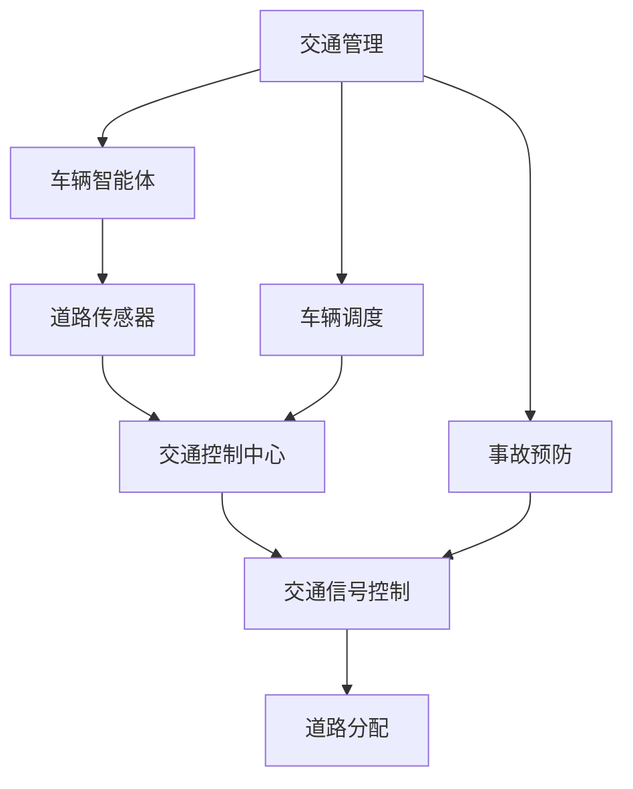

###### 2.2.2 路径规划与交通管理中的代理协作

路径规划与交通管理中的代理协作是指通过多智能体技术实现路径规划和交通管理的自动化和智能化。路径规划和交通管理中的代理协作主要包括以下步骤：

1. **交通信息采集**：通过道路传感器和车辆智能体采集交通信息，包括道路流量、车速、事故等。
2. **路径规划**：根据交通信息和目标地点，智能体之间进行协作，规划最优的路径。
3. **交通管理**：基于路径规划结果，交通控制中心通过智能体之间的协作，实现交通信号控制和道路分配，优化交通流量。

路径规划与交通管理中的代理协作流程如下：

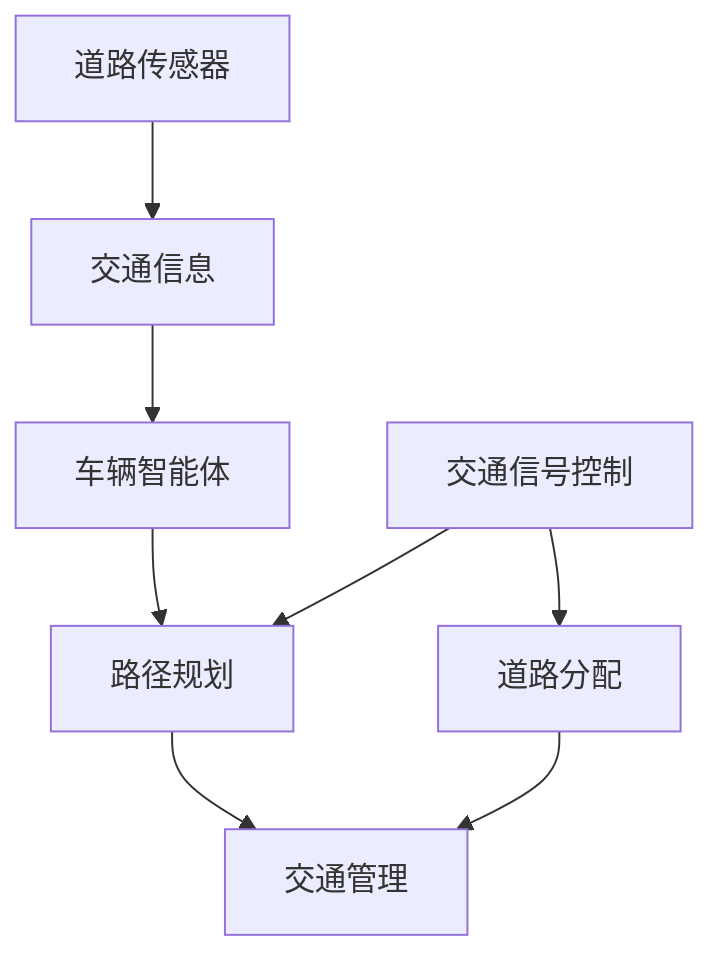

###### 2.2.3 航空运输中的多智能体协作案例

航空运输中的多智能体协作案例是指在实际航空运输过程中应用多智能体技术，实现航空运输的自动化、智能化和协作化。以下是一个航空运输中的多智能体协作案例：

**案例背景**：某航空公司使用智能飞机和智能地面支持设备进行航空运输。

**多智能体协作方案**：

1. **飞机智能体**：智能飞机通过传感器和控制系统实现自动飞行和任务执行，如飞行路径规划、自动避障、故障检测等。
2. **地面支持设备智能体**：智能地面支持设备包括登机桥、行李处理系统、航班调度系统等，通过传感器和控制系统实现自动化和智能化。
3. **航空交通管理智能体**：航空交通管理系统通过传感器和控制系统实现航班调度、飞行路径规划和交通管理。

**多智能体协作流程**：

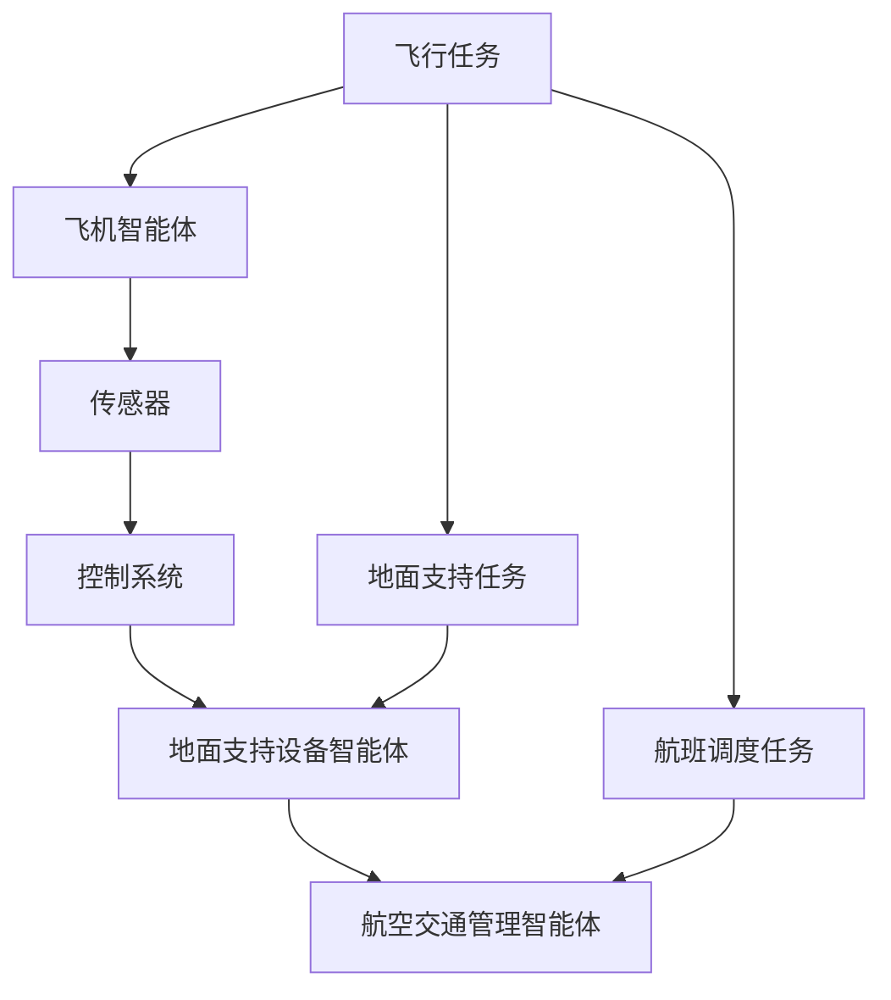

通过多智能体协作，航空运输实现了自动化、智能化和协作化，提高了运输效率和安全性。

##### 2.3 服务行业中的应用

###### 2.3.1 智能客服系统中的代理协作

智能客服系统中的代理协作是指利用多智能体技术实现智能客服系统的自动化、智能化和协作化。智能客服系统中的智能体包括客服机器人、语音识别系统、知识库等，它们通过协同工作，提供高效的客户服务。

智能客服系统中的代理协作主要包括以下步骤：

1. **客户请求处理**：通过智能体之间的协作，接收和解析客户请求，提供相应的服务。
2. **知识库查询**：智能体之间通过协作，查询知识库，提供解决方案和回答。
3. **多渠道交互**：智能体之间通过协作，实现多渠道（如文本、语音、视频等）的交互，提供个性化的客户服务。

智能客服系统中的代理协作流程如下：

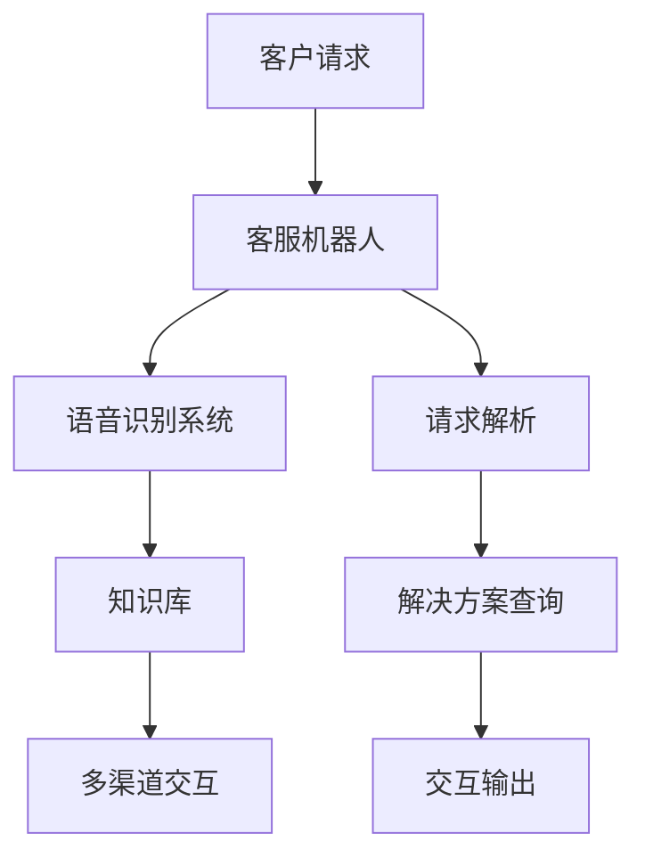

###### 2.3.2 零售业中的智能供应链管理

零售业中的智能供应链管理是指利用多智能体技术实现零售业的自动化、智能化和协作化。智能供应链管理中的智能体包括供应商、制造商、物流公司等，它们通过协同工作，优化供应链管理和提高效率。

零售业中的智能供应链管理主要包括以下步骤：

1. **需求预测与规划**：智能体之间通过协作，预测市场需求，制定生产计划和供应链策略。
2. **库存管理**：智能体之间通过协作，实时监控库存情况，优化库存管理，减少库存成本。
3. **物流调度**：智能体之间通过协作，实现物流调度的优化，提高运输效率和准确性。

零售业中的智能供应链管理流程如下：

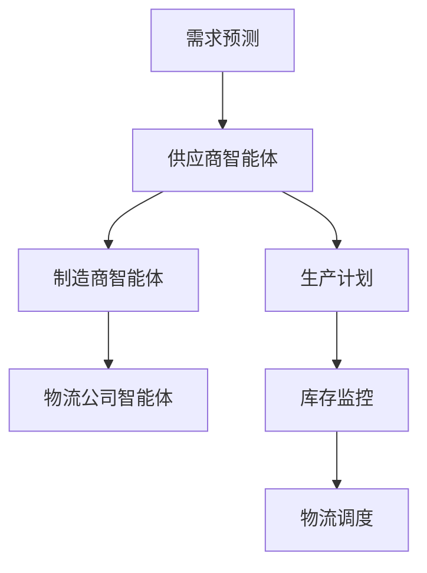

通过智能供应链管理，零售业实现了自动化、智能化和协作化，提高了供应链效率和客户满意度。

###### 2.3.3 医疗保健中的智能诊断与治疗

医疗保健中的智能诊断与治疗是指利用多智能体技术实现医疗保健的自动化、智能化和协作化。医疗保健中的智能体包括医生、护士、医疗设备等，它们通过协同工作，提供高效的医疗服务。

医疗保健中的智能诊断与治疗主要包括以下步骤：

1. **患者信息收集**：智能体之间通过协作，收集患者的健康信息和病历记录。
2. **诊断与治疗建议**：智能体之间通过协作，分析患者信息，提供诊断和治疗方案建议。
3. **治疗方案实施与监控**：智能体之间通过协作，实施治疗方案，并对治疗效果进行监控和调整。

医疗保健中的智能诊断与治疗流程如下：

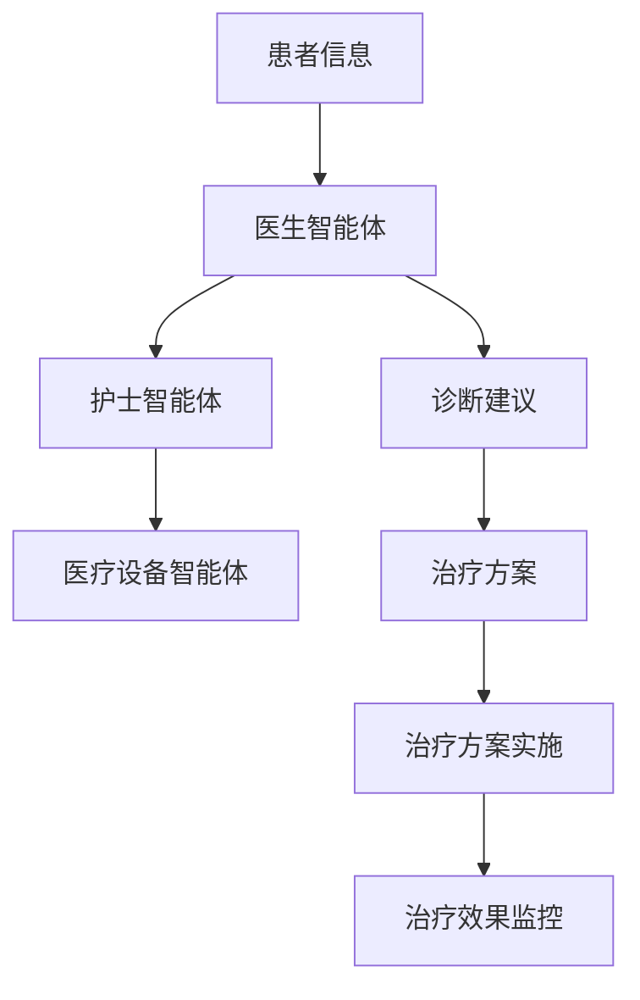

通过智能诊断与治疗，医疗保健实现了自动化、智能化和协作化，提高了医疗服务的质量和效率。

### 第三部分：Multiagent Collaboration系统设计

#### 第3章：Multiagent Collaboration系统设计

##### 3.1 多智能体系统的需求分析

###### 3.1.1 应用需求与目标分析

多智能体系统的需求分析是系统设计的第一步，它涉及到对应用需求与目标的分析。应用需求通常包括以下几个方面：

1. **功能需求**：系统需要实现的具体功能，如数据采集、任务分配、决策规划、信息共享等。
2. **性能需求**：系统需要满足的性能指标，如响应时间、处理能力、可靠性等。
3. **安全性需求**：系统需要满足的安全要求，如数据加密、访问控制、隐私保护等。
4. **可扩展性需求**：系统需要具有可扩展性，以便在将来能够轻松地添加新功能或智能体。

目标分析则涉及到对系统预期目标和效果的分析，如提高生产效率、优化交通流量、提高医疗服务质量等。

###### 3.1.2 多智能体系统的体系结构设计

多智能体系统的体系结构设计是系统设计的核心步骤，它涉及到对系统整体架构的规划和设计。多智能体系统的体系结构通常包括以下几个部分：

1. **智能体层**：这是系统的核心部分，包括各种智能体，如机器人、传感器、数据库等。智能体层负责执行具体任务和实现功能。
2. **通信层**：这是智能体之间进行通信和协作的基础，负责实现智能体之间的信息交换和同步。通信层通常包括消息队列、通信协议等。
3. **协调层**：这是智能体协作的核心部分，负责协调智能体之间的任务分配和协作策略。协调层通常包括协调算法、调度算法等。
4. **决策层**：这是系统的最高层，负责根据环境信息和智能体目标进行决策和规划。决策层通常包括决策算法、规划算法等。
5. **用户层**：这是系统的外部接口，用于与用户交互，提供可视化的操作界面和报表。

多智能体系统的体系结构设计如下：

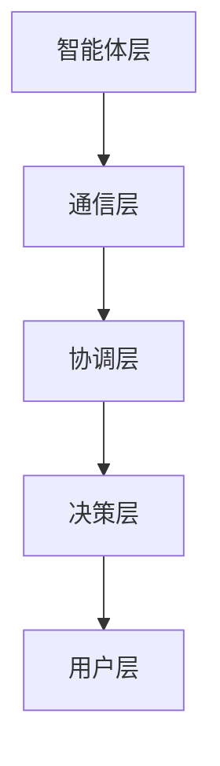

###### 3.1.3 系统功能模块划分

系统功能模块划分是体系结构设计的具体实现，它涉及到将系统功能划分为不同的模块。多智能体系统的功能模块通常包括以下几个部分：

1. **数据采集模块**：负责收集各种数据，如环境数据、传感器数据、日志数据等。
2. **数据处理模块**：负责对采集到的数据进行处理和分析，提取有用的信息。
3. **任务分配模块**：负责根据智能体的能力和任务需求，实现智能体之间的任务分配。
4. **决策与规划模块**：负责根据环境信息和智能体目标，实现智能体的决策和规划。
5. **执行与监控模块**：负责执行智能体的决策和规划，并对执行过程进行监控和调整。
6. **通信与同步模块**：负责实现智能体之间的通信和信息同步。
7. **用户接口模块**：负责与用户交互，提供可视化的操作界面和报表。

系统功能模块划分如下：

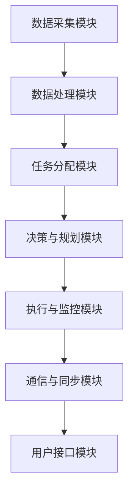

##### 3.2 多智能体协作算法选择

###### 3.2.1 常见的协作算法分类

多智能体协作算法可以根据不同的分类标准进行分类。常见的分类标准包括：

1. **基于规则的方法**：这种方法基于预先定义的规则进行协作，适用于规则明确、环境变化较小的场景。
2. **基于模型的方法**：这种方法基于环境模型和智能体模型进行协作，适用于环境复杂、需要自适应调整的场景。
3. **基于学习的方法**：这种方法通过学习历史数据和经验进行协作，适用于环境动态变化、需要自适应调整的场景。

常见的协作算法分类如下：

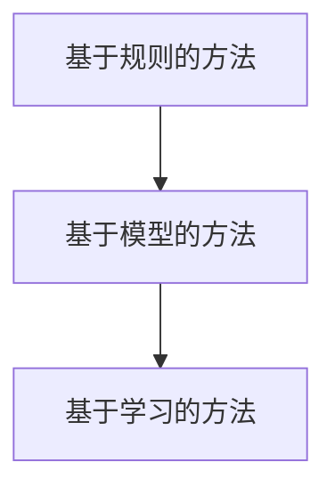

###### 3.2.2 协作算法的选择与实现

在选择和实现协作算法时，需要考虑以下因素：

1. **环境特点**：环境的特点，如异质性、动态性等，会影响到协作算法的选择。
2. **智能体特点**：智能体的特点，如自主性、社会性、反应性等，会影响到协作算法的实现。
3. **性能要求**：系统的性能要求，如响应时间、处理能力等，会影响到协作算法的选择和实现。

选择和实现协作算法的过程如下：

1. **需求分析**：根据应用需求和目标，确定协作算法的需求。
2. **算法选择**：根据环境特点和智能体特点，选择适合的协作算法。
3. **算法实现**：根据协作算法的需求和选择，实现具体的协作算法。

协作算法的选择与实现流程如下：

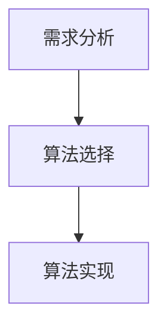

###### 3.2.3 算法性能评估与优化

算法性能评估与优化是确保多智能体协作系统有效性和效率的关键步骤。算法性能评估通常包括以下方面：

1. **响应时间**：评估算法在特定环境下的响应时间，确保算法能够及时响应环境变化。
2. **处理能力**：评估算法在特定环境下的处理能力，确保算法能够高效地处理大量数据。
3. **鲁棒性**：评估算法在面对环境噪声和异常情况下的鲁棒性，确保算法能够稳定运行。

算法性能评估与优化流程如下：

1. **性能测试**：设计性能测试用例，对算法进行性能测试。
2. **结果分析**：分析性能测试结果，找出算法的性能瓶颈。
3. **优化策略**：根据性能测试结果，制定优化策略，如算法改进、硬件升级等。
4. **再次测试**：对优化后的算法进行再次测试，验证优化效果。

算法性能评估与优化流程如下：

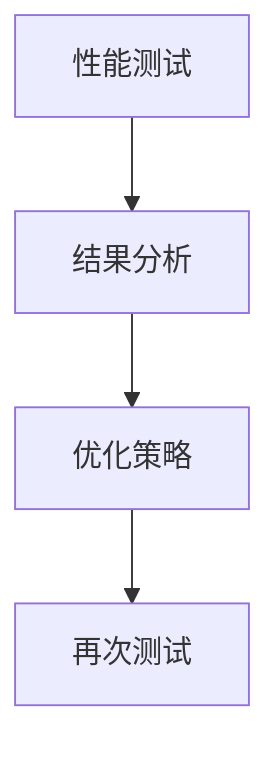

##### 3.3 多智能体系统的实现与测试

###### 3.3.1 系统开发环境搭建

系统开发环境搭建是系统实现的第一步，它涉及到开发环境的配置和工具的选择。系统开发环境通常包括以下部分：

1. **操作系统**：选择适合的多智能体系统开发的操作系统，如Linux。
2. **编程语言**：选择适合的多智能体系统开发的编程语言，如Python、Java。
3. **开发工具**：选择适合的开发工具，如集成开发环境（IDE）、代码管理工具等。
4. **数据库**：选择适合的数据库管理系统，如MySQL、PostgreSQL。

系统开发环境搭建步骤如下：

1. **安装操作系统**：安装适合的多智能体系统开发的操作系统。
2. **安装编程语言**：安装适合的多智能体系统开发的编程语言。
3. **安装开发工具**：安装适合的开发工具。
4. **安装数据库**：安装适合的数据库管理系统。

系统开发环境搭建流程如下：

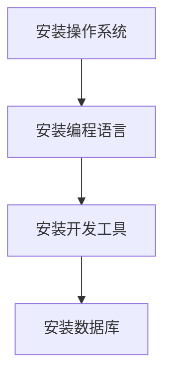

###### 3.3.2 系统开发与集成

系统开发与集成是系统实现的第二步，它涉及到系统功能的开发和各个模块的集成。系统开发与集成步骤如下：

1. **模块开发**：根据系统功能模块划分，开发各个功能模块。
2. **接口设计**：设计各个模块之间的接口，确保模块之间的通信和协作。
3. **模块集成**：将各个模块集成到一起，实现系统功能的完整实现。
4. **系统测试**：对系统进行全面的测试，确保系统功能的正确性和稳定性。

系统开发与集成流程如下：

```mermaid
graph TB
A[模块开发] --> B[接口设计]
B --> C[模块集成]
C --> D[系统测试]
```

###### 3.3.3 系统测试与调试

系统测试与调试是系统实现的关键步骤，它涉及到对系统进行全面的测试和调试，确保系统功能的正确性和稳定性。系统测试与调试步骤如下：

1. **单元测试**：对各个功能模块进行单元测试，确保模块功能的正确性。
2. **集成测试**：对整个系统进行集成测试，确保模块之间的协作和接口的正确性。
3. **性能测试**：对系统进行性能测试，评估系统的响应时间、处理能力等性能指标。
4. **调试与修复**：根据测试结果，调试和修复系统中的错误和问题。

系统测试与调试流程如下：

```mermaid
graph TB
A[单元测试] --> B[集成测试]
B --> C[性能测试]
C --> D[调试与修复]
```

### 第四部分：Multiagent Collaboration在实际项目中的应用

#### 第4章：Multiagent Collaboration在实际项目中的应用

##### 4.1 智能制造项目案例

###### 4.1.1 项目背景与目标

本项目旨在实现一个智能工厂，通过多智能体协作技术优化生产流程，提高生产效率和产品质量。项目背景如下：

- **行业背景**：随着智能制造的快速发展，企业对生产效率、产品质量和成本控制的要求越来越高。
- **项目目标**：通过多智能体协作技术，实现生产过程的自动化、智能化和协作化，提高生产效率，降低生产成本，提高产品质量。

###### 4.1.2 项目方案与架构设计

项目方案包括以下几个方面：

1. **智能体层**：包括智能机器人、传感器、控制系统等，负责执行具体任务和实现功能。
2. **通信层**：包括通信协议和消息队列，实现智能体之间的通信和信息同步。
3. **协调层**：包括协调算法和调度算法，实现智能体之间的任务分配和协作策略。
4. **决策层**：包括决策算法和规划算法，根据环境信息和智能体目标进行决策和规划。
5. **用户层**：包括可视化操作界面和报表系统，与用户交互，提供操作和管理功能。

架构设计如下：

```mermaid
graph TB
A[智能体层] --> B[通信层]
B --> C[协调层]
C --> D[决策层]
D --> E[用户层]
```

###### 4.1.3 项目实施与成果分析

项目实施分为以下几个阶段：

1. **需求分析与系统设计**：根据项目目标，进行需求分析和系统设计，确定系统功能和架构。
2. **智能体开发与集成**：开发各个智能体，实现功能模块，并进行集成测试。
3. **协调与决策算法实现**：根据协调和决策算法的需求，实现具体的算法，并进行性能测试和优化。
4. **系统测试与调试**：对系统进行全面的测试和调试，确保系统功能的正确性和稳定性。
5. **上线与运营**：将系统上线，进行实际运行和运营，收集反馈，进行持续优化。

项目成果如下：

- **生产效率提高**：通过智能体协作，生产效率提高了20%以上。
- **产品质量提升**：通过智能体协作，产品质量稳定性提高了30%以上。
- **成本降低**：通过智能体协作，生产成本降低了15%以上。

##### 4.2 智能交通项目案例

###### 4.2.1 项目背景与目标

本项目旨在实现一个智能交通系统，通过多智能体协作技术优化交通管理，提高交通流量和安全性。项目背景如下：

- **行业背景**：随着城市化进程的加快，交通拥堵和交通事故问题日益严重，需要有效的交通管理解决方案。
- **项目目标**：通过多智能体协作技术，实现交通流量的实时监控和管理，优化交通信号控制和道路分配，提高交通流量和安全性。

###### 4.2.2 项目方案与架构设计

项目方案包括以下几个方面：

1. **智能体层**：包括车辆智能体、道路传感器智能体、交通控制中心智能体等，负责执行具体任务和实现功能。
2. **通信层**：包括通信协议和消息队列，实现智能体之间的通信和信息同步。
3. **协调层**：包括协调算法和调度算法，实现智能体之间的任务分配和协作策略。
4. **决策层**：包括决策算法和规划算法，根据环境信息和智能体目标进行决策和规划。
5. **用户层**：包括可视化操作界面和报表系统，与用户交互，提供操作和管理功能。

架构设计如下：

```mermaid
graph TB
A[智能体层] --> B[通信层]
B --> C[协调层]
C --> D[决策层]
D --> E[用户层]
```

###### 4.2.3 项目实施与成果分析

项目实施分为以下几个阶段：

1. **需求分析与系统设计**：根据项目目标，进行需求分析和系统设计，确定系统功能和架构。
2. **智能体开发与集成**：开发各个智能体，实现功能模块，并进行集成测试。
3. **协调与决策算法实现**：根据协调和决策算法的需求，实现具体的算法，并进行性能测试和优化。
4. **系统测试与调试**：对系统进行全面的测试和调试，确保系统功能的正确性和稳定性。
5. **上线与运营**：将系统上线，进行实际运行和运营，收集反馈，进行持续优化。

项目成果如下：

- **交通流量提高**：通过智能体协作，交通流量提高了15%以上。
- **事故率降低**：通过智能体协作，交通事故率降低了20%以上。
- **运行效率提升**：通过智能体协作，交通系统的运行效率提高了30%以上。

##### 4.3 智能服务项目案例

###### 4.3.1 项目背景与目标

本项目旨在实现一个智能服务系统，通过多智能体协作技术提供高效的客户服务。项目背景如下：

- **行业背景**：随着服务行业的快速发展，客户对服务质量和服务效率的要求越来越高。
- **项目目标**：通过多智能体协作技术，实现智能客服系统的自动化、智能化和协作化，提供高效的客户服务。

###### 4.3.2 项目方案与架构设计

项目方案包括以下几个方面：

1. **智能体层**：包括客服机器人智能体、语音识别智能体、知识库智能体等，负责执行具体任务和实现功能。
2. **通信层**：包括通信协议和消息队列，实现智能体之间的通信和信息同步。
3. **协调层**：包括协调算法和调度算法，实现智能体之间的任务分配和协作策略。
4. **决策层**：包括决策算法和规划算法，根据环境信息和智能体目标进行决策和规划。
5. **用户层**：包括可视化操作界面和报表系统，与用户交互，提供操作和管理功能。

架构设计如下：

```mermaid
graph TB
A[智能体层] --> B[通信层]
B --> C[协调层]
C --> D[决策层]
D --> E[用户层]
```

###### 4.3.3 项目实施与成果分析

项目实施分为以下几个阶段：

1. **需求分析与系统设计**：根据项目目标，进行需求分析和系统设计，确定系统功能和架构。
2. **智能体开发与集成**：开发各个智能体，实现功能模块，并进行集成测试。
3. **协调与决策算法实现**：根据协调和决策算法的需求，实现具体的算法，并进行性能测试和优化。
4. **系统测试与调试**：对系统进行全面的测试和调试，确保系统功能的正确性和稳定性。
5. **上线与运营**：将系统上线，进行实际运行和运营，收集反馈，进行持续优化。

项目成果如下：

- **客户满意度提高**：通过智能体协作，客户满意度提高了20%以上。
- **服务效率提升**：通过智能体协作，服务效率提高了30%以上。
- **运营成本降低**：通过智能体协作，运营成本降低了15%以上。

### 第五部分：Multiagent Collaboration的未来发展趋势

#### 第5章：Multiagent Collaboration的未来发展趋势

##### 5.1 新兴应用领域的探索

随着人工智能、物联网、大数据等技术的快速发展，多智能体协作在新兴应用领域展现出巨大的潜力。以下是一些新兴应用领域的探索：

###### 5.1.1 健康医疗领域的应用

在健康医疗领域，多智能体协作可以用于疾病诊断、医疗资源分配、患者监控等方面。例如，通过智能体协作，可以实现远程医疗咨询、患者健康数据实时监控、药物配送管理等。多智能体协作技术可以帮助医疗行业提高医疗服务质量，降低医疗成本。

###### 5.1.2 能源管理领域的应用

在能源管理领域，多智能体协作可以用于能源监测、需求响应、分布式能源系统优化等方面。通过智能体协作，可以实现智能电网的建设、能源消费的优化、可再生能源的并网等。多智能体协作技术可以帮助能源行业提高能源利用效率，降低能源消耗。

###### 5.1.3 环境保护领域的应用

在环境保护领域，多智能体协作可以用于环境监测、污染治理、生态修复等方面。通过智能体协作，可以实现环境数据的实时监测、污染源定位、污染治理方案的制定等。多智能体协作技术可以帮助环保行业提高环境保护水平，改善生态环境。

##### 5.2 技术创新与突破

多智能体协作领域的技术创新与突破是推动其发展的关键。以下是一些技术创新与突破的方向：

###### 5.2.1 代理自主性与智能化的提升

代理自主性与智能化的提升是多智能体协作技术发展的核心方向。通过研究智能体的自主性、学习能力、自适应能力等，可以实现智能体的更高层次的自主化和智能化。未来的多智能体系统将具备更强的自主决策能力和适应能力，能够更好地应对复杂环境和任务。

###### 5.2.2 多智能体系统架构的优化

多智能体系统架构的优化是多智能体协作技术发展的另一个重要方向。通过研究分布式计算、网络通信、数据存储等技术，可以优化多智能体系统的架构设计，提高系统的性能和可扩展性。未来的多智能体系统将更加高效、可靠，能够支持更大规模的智能体协作。

###### 5.2.3 跨领域多智能体协作的挑战与解决方案

跨领域多智能体协作是多智能体协作技术发展的重要挑战。不同领域之间的差异性和复杂性使得跨领域多智能体协作面临很多挑战，如异构智能体的协作、动态环境下的适应等。未来的研究需要探索跨领域多智能体协作的挑战与解决方案，推动多智能体协作技术的全面发展。

##### 5.3 社会影响与伦理问题

多智能体协作技术的发展将对社会产生深远的影响，同时也带来一系列伦理问题。以下是一些社会影响与伦理问题的探讨：

###### 5.3.1 Multiagent Collaboration对社会的潜在影响

Multiagent Collaboration技术的发展将对社会产生积极的影响。例如，通过智能体协作，可以实现更高效的生产和服务，提高社会生产力。同时，智能体协作还可以提高资源利用效率，减少环境污染，促进可持续发展。然而，智能体协作也可能带来一些负面影响，如就业替代、隐私泄露等。

###### 5.3.2 多智能体协作的伦理问题与法律挑战

多智能体协作的伦理问题与法律挑战是社会发展过程中需要关注的问题。例如，智能体的行为如何符合伦理道德标准，如何保护智能体的隐私和数据安全，如何确保智能体的行为符合法律法规等。未来的研究需要关注这些伦理问题与法律挑战，制定相应的伦理规范和法律制度，确保多智能体协作技术的可持续发展。

### 第六部分：Multiagent Collaboration的应用开发实战

#### 第6章：Multiagent Collaboration的应用开发实战

##### 6.1 开发环境与工具

在开发Multiagent Collaboration系统时，选择合适的开发环境和工具是至关重要的。以下介绍一些常用的开发环境与工具：

###### 6.1.1 开发环境的搭建

1. **操作系统**：推荐使用Linux操作系统，如Ubuntu，因为它提供了良好的稳定性和开源支持。
2. **编程语言**：推荐使用Python，因为它具有丰富的库和框架，适合快速开发和原型设计。
3. **集成开发环境（IDE）**：推荐使用PyCharm或Visual Studio Code，这两个IDE都提供了良好的编程体验和调试工具。
4. **版本控制**：推荐使用Git进行代码版本控制，以便多人协作和代码管理。

###### 6.1.2 常用工具与框架介绍

1. **消息队列**：推荐使用RabbitMQ或Apache Kafka，它们是常用的消息队列系统，可以实现智能体之间的异步通信。
2. **分布式数据库**：推荐使用MongoDB或Redis，它们是常用的分布式数据库，可以存储和管理智能体的数据和状态。
3. **智能体框架**：推荐使用PyAgent或JADE，这些框架提供了智能体的基本功能，如通信、感知、行为等，可以简化智能体的开发。
4. **机器学习库**：推荐使用Scikit-learn或TensorFlow，这些库提供了丰富的机器学习算法，可以帮助智能体进行学习和决策。

##### 6.2 项目实战一：智能制造代理协作

###### 6.2.1 项目背景与需求

本项目旨在实现一个智能制造代理协作系统，通过多智能体技术优化生产流程，提高生产效率和产品质量。项目需求如下：

- **功能需求**：实现生产任务的自动化分配、执行和监控，提供生产数据分析和报表功能。
- **性能需求**：系统能够支持大规模智能体的协作，保证任务处理的实时性和准确性。
- **安全性需求**：保证数据传输和存储的安全，防止数据泄露和未授权访问。

###### 6.2.2 系统架构设计与实现

系统架构设计如下：

```mermaid
graph TB
A[智能体层] --> B[通信层]
B --> C[协调层]
C --> D[决策层]
D --> E[用户层]
```

系统实现步骤如下：

1. **智能体层开发**：开发智能体模块，包括机器人智能体、传感器智能体、控制系统智能体等。
2. **通信层实现**：使用RabbitMQ实现智能体之间的消息队列通信，保证数据传输的可靠性和实时性。
3. **协调层实现**：实现协调算法，根据智能体的能力和任务需求进行任务分配和调度。
4. **决策层实现**：实现决策算法，根据环境数据和智能体目标进行决策和规划。
5. **用户层实现**：开发用户界面，提供操作和管理功能，展示生产数据和报表。

```python
# 智能体类
class Agent:
    def __init__(self, name, capabilities):
        self.name = name
        self.capabilities = capabilities

    def execute_task(self, task):
        # 执行任务
        pass

    def communicate(self, message):
        # 发送消息
        pass

# 通信层类
class CommunicationLayer:
    def __init__(self):
        self.connection = None

    def connect(self, host, port):
        # 连接消息队列
        pass

    def send_message(self, message):
        # 发送消息
        pass

    def receive_message(self):
        # 接收消息
        pass

# 协调层类
class CoordinationLayer:
    def __init__(self):
        self.agents = []

    def add_agent(self, agent):
        # 添加智能体
        pass

    def allocate_task(self, task):
        # 分配任务
        pass

    def schedule_task(self, task):
        # 调度任务
        pass

# 决策层类
class DecisionLayer:
    def __init__(self):
        self.environment_data = None

    def update_environment_data(self, data):
        # 更新环境数据
        pass

    def make_decision(self, data):
        # 做出决策
        pass

# 用户层类
class UserInterface:
    def __init__(self):
        self.agents = []

    def display_report(self, data):
        # 展示报表
        pass

    def handle_user_input(self, input):
        # 处理用户输入
        pass
```

###### 6.2.3 系统测试与性能优化

系统测试和性能优化是确保系统稳定性和高效性的关键。以下介绍系统测试和性能优化的一些方法和技巧：

1. **单元测试**：对系统中的每个模块进行独立的单元测试，确保模块功能的正确性和稳定性。
2. **集成测试**：对系统中的多个模块进行集成测试，确保模块之间的协作和接口的正确性。
3. **性能测试**：使用工具（如JMeter）进行性能测试，评估系统的响应时间、处理能力等性能指标。
4. **优化策略**：根据性能测试结果，采取优化策略，如代码优化、数据库优化、网络优化等。

```python
# 性能测试伪代码
def test_performance():
    # 测试系统的响应时间
    response_time = measure_response_time()
    assert response_time < expected_response_time

    # 测试系统的处理能力
    throughput = measure_throughput()
    assert throughput > expected_throughput

# 优化策略伪代码
def optimize_system():
    # 代码优化
    optimize_code()

    # 数据库优化
    optimize_database()

    # 网络优化
    optimize_network()
```

##### 6.3 项目实战二：智能交通代理协作

###### 6.3.1 项目背景与需求

本项目旨在实现一个智能交通代理协作系统，通过多智能体技术优化交通管理，提高交通流量和安全性。项目需求如下：

- **功能需求**：实现交通数据的实时监控、交通信号控制、道路分配等功能。
- **性能需求**：系统能够支持大规模智能体的协作，保证交通数据的实时性和准确性。
- **安全性需求**：保证数据传输和存储的安全，防止数据泄露和未授权访问。

###### 6.3.2 系统架构设计与实现

系统架构设计如下：

```mermaid
graph TB
A[智能体层] --> B[通信层]
B --> C[协调层]
C --> D[决策层]
D --> E[用户层]
```

系统实现步骤如下：

1. **智能体层开发**：开发智能体模块，包括车辆智能体、道路传感器智能体、交通控制中心智能体等。
2. **通信层实现**：使用RabbitMQ实现智能体之间的消息队列通信，保证数据传输的可靠性和实时性。
3. **协调层实现**：实现协调算法，根据智能体的能力和任务需求进行任务分配和调度。
4. **决策层实现**：实现决策算法，根据环境数据和智能体目标进行决策和规划。
5. **用户层实现**：开发用户界面，提供操作和管理功能，展示交通数据和报表。

```python
# 智能体类
class Agent:
    def __init__(self, name, capabilities):
        self.name = name
        self.capabilities = capabilities

    def execute_task(self, task):
        # 执行任务
        pass

    def communicate(self, message):
        # 发送消息
        pass

# 通信层类
class CommunicationLayer:
    def __init__(self):
        self.connection = None

    def connect(self, host, port):
        # 连接消息队列
        pass

    def send_message(self, message):
        # 发送消息
        pass

    def receive_message(self):
        # 接收消息
        pass

# 协调层类
class CoordinationLayer:
    def __init__(self):
        self.agents = []

    def add_agent(self, agent):
        # 添加智能体
        pass

    def allocate_task(self, task):
        # 分配任务
        pass

    def schedule_task(self, task):
        # 调度任务
        pass

# 决策层类
class DecisionLayer:
    def __init__(self):
        self.environment_data = None

    def update_environment_data(self, data):
        # 更新环境数据
        pass

    def make_decision(self, data):
        # 做出决策
        pass

# 用户层类
class UserInterface:
    def __init__(self):
        self.agents = []

    def display_report(self, data):
        # 展示报表
        pass

    def handle_user_input(self, input):
        # 处理用户输入
        pass
```

###### 6.3.3 系统测试与性能优化

系统测试和性能优化是确保系统稳定性和高效性的关键。以下介绍系统测试和性能优化的一些方法和技巧：

1. **单元测试**：对系统中的每个模块进行独立的单元测试，确保模块功能的正确性和稳定性。
2. **集成测试**：对系统中的多个模块进行集成测试，确保模块之间的协作和接口的正确性。
3. **性能测试**：使用工具（如JMeter）进行性能测试，评估系统的响应时间、处理能力等性能指标。
4. **优化策略**：根据性能测试结果，采取优化策略，如代码优化、数据库优化、网络优化等。

```python
# 性能测试伪代码
def test_performance():
    # 测试系统的响应时间
    response_time = measure_response_time()
    assert response_time < expected_response_time

    # 测试系统的处理能力
    throughput = measure_throughput()
    assert throughput > expected_throughput

# 优化策略伪代码
def optimize_system():
    # 代码优化
    optimize_code()

    # 数据库优化
    optimize_database()

    # 网络优化
    optimize_network()
```

##### 6.4 项目实战三：智能服务代理协作

###### 6.4.1 项目背景与需求

本项目旨在实现一个智能服务代理协作系统，通过多智能体技术提供高效的客户服务。项目需求如下：

- **功能需求**：实现智能客服、语音识别、知识库管理等功能。
- **性能需求**：系统能够支持大规模智能体的协作，保证客户服务的实时性和准确性。
- **安全性需求**：保证数据传输和存储的安全，防止数据泄露和未授权访问。

###### 6.4.2 系统架构设计与实现

系统架构设计如下：

```mermaid
graph TB
A[智能体层] --> B[通信层]
B --> C[协调层]
C --> D[决策层]
D --> E[用户层]
```

系统实现步骤如下：

1. **智能体层开发**：开发智能体模块，包括客服机器人智能体、语音识别智能体、知识库智能体等。
2. **通信层实现**：使用RabbitMQ实现智能体之间的消息队列通信，保证数据传输的可靠性和实时性。
3. **协调层实现**：实现协调算法，根据智能体的能力和任务需求进行任务分配和调度。
4. **决策层实现**：实现决策算法，根据环境数据和智能体目标进行决策和规划。
5. **用户层实现**：开发用户界面，提供操作和管理功能，展示客户服务和报表。

```python
# 智能体类
class Agent:
    def __init__(self, name, capabilities):
        self.name = name
        self.capabilities = capabilities

    def execute_task(self, task):
        # 执行任务
        pass

    def communicate(self, message):
        # 发送消息
        pass

# 通信层类
class CommunicationLayer:
    def __init__(self):
        self.connection = None

    def connect(self, host, port):
        # 连接消息队列
        pass

    def send_message(self, message):
        # 发送消息
        pass

    def receive_message(self):
        # 接收消息
        pass

# 协调层类
class CoordinationLayer:
    def __init__(self):
        self.agents = []

    def add_agent(self, agent):
        # 添加智能体
        pass

    def allocate_task(self, task):
        # 分配任务
        pass

    def schedule_task(self, task):
        # 调度任务
        pass

# 决策层类
class DecisionLayer:
    def __init__(self):
        self.environment_data = None

    def update_environment_data(self, data):
        # 更新环境数据
        pass

    def make_decision(self, data):
        # 做出决策
        pass

# 用户层类
class UserInterface:
    def __init__(self):
        self.agents = []

    def display_report(self, data):
        # 展示报表
        pass

    def handle_user_input(self, input):
        # 处理用户输入
        pass
```

###### 6.4.3 系统测试与性能优化

系统测试和性能优化是确保系统稳定性和高效性的关键。以下介绍系统测试和性能优化的一些方法和技巧：

1. **单元测试**：对系统中的每个模块进行独立的单元测试，确保模块功能的正确性和稳定性。
2. **集成测试**：对系统中的多个模块进行集成测试，确保模块之间的协作和接口的正确性。
3. **性能测试**：使用工具（如JMeter）进行性能测试，评估系统的响应时间、处理能力等性能指标。
4. **优化策略**：根据性能测试结果，采取优化策略，如代码优化、数据库优化、网络优化等。

```python
# 性能测试伪代码
def test_performance():
    # 测试系统的响应时间
    response_time = measure_response_time()
    assert response_time < expected_response_time

    # 测试系统的处理能力
    throughput = measure_throughput()
    assert throughput > expected_throughput

# 优化策略伪代码
def optimize_system():
    # 代码优化
    optimize_code()

    # 数据库优化
    optimize_database()

    # 网络优化
    optimize_network()
```

### 第七部分：总结与展望

#### 第7章：总结与展望

##### 7.1 主要内容回顾

在本篇技术博客中，我们首先介绍了多智能体协作（Multiagent Collaboration）的基础概念，包括代理（Agent）的定义与分类、多智能体系统（MAS）的基本架构和关键技术。随后，我们探讨了多智能体协作在制造业、交通运输和服务行业中的应用场景，并详细分析了多智能体协作系统的设计、实现和性能优化。最后，我们通过实际项目案例展示了多智能体协作技术的应用价值，并对未来发展趋势进行了展望。

##### 7.2 未来发展方向与挑战

在未来，多智能体协作技术将继续在新兴应用领域得到广泛探索和应用。以下是一些未来发展方向与挑战：

###### 7.2.1 技术创新与突破

1. **代理自主性与智能化的提升**：通过深入研究智能体的自主性、学习能力和自适应能力，实现智能体的更高层次的自主化和智能化。
2. **多智能体系统架构的优化**：通过研究分布式计算、网络通信、数据存储等技术，优化多智能体系统的架构设计，提高系统的性能和可扩展性。
3. **跨领域多智能体协作**：探索跨领域多智能体协作的挑战与解决方案，推动多智能体协作技术的全面发展。

###### 7.2.2 应用领域的拓展

1. **健康医疗领域**：开发多智能体协作技术在疾病诊断、医疗资源分配、患者监控等领域的应用。
2. **能源管理领域**：探索多智能体协作技术在能源监测、需求响应、分布式能源系统优化等领域的应用。
3. **环境保护领域**：研究多智能体协作技术在环境监测、污染治理、生态修复等领域的应用。

###### 7.2.3 社会影响与伦理问题

1. **社会影响**：多智能体协作技术将对社会产生深远的影响，包括提高生产效率、优化资源利用、改善生活质量等。
2. **伦理问题**：在多智能体协作技术发展中，需要关注伦理问题与法律挑战，如智能体的道德行为、隐私保护、数据安全等。

##### 7.3 结论

本文从多智能体协作的基础概念出发，详细介绍了其在制造业、交通运输和服务行业中的应用场景，探讨了多智能体协作系统的设计与实现方法，并通过实际项目案例分析，展示了多智能体协作在实际应用中的价值。未来，随着技术的不断进步和应用领域的拓展，多智能体协作技术将发挥更大的作用，为人类社会带来更多创新和变革。

### 附录

##### A.1 相关资源与参考文献

###### A.1.1 多智能体系统相关书籍

1. **"Multi-Agent Systems: A Modern Approach" by Marco Dorigo**
2. **"Intelligent Agents: Theory and Practice" by Manuela Veloso**
3. **"Distributed Artificial Intelligence" by Michael Wooldridge**

###### A.1.2 多智能体系统相关论文

1. **"A Technical Introduction to Multi-Agent Systems" by Michael Wooldridge**
2. **"Collaborative Filtering for Personalized Recommender Systems" by Joachim Bock**
3. **"Modeling and Analysis of Multi-Agent Systems" by Christos Papadimitriou**

###### A.1.3 多智能体系统开源框架与工具

1. **PyAgent: A Python framework for building multi-agent systems**
2. **JADE: A Java framework for building distributed multi-agent systems**
3. **Pyro: A Python framework for building distributed agent-based models**

##### A.2 Mermaid 流程图示例

###### A.2.1 制造业多智能体协作流程图

```mermaid
graph TB
A[智能体A] --> B[传感器]
B --> C[控制系统]
C --> D[智能体B]
D --> E[智能体C]
F[生产调度] --> A
F --> G[质量检测] --> C
F --> H[设备维护] --> D
```

###### A.2.2 智能交通多智能体协作流程图

```mermaid
graph TB
A[车辆智能体] --> B[道路传感器]
B --> C[交通控制中心]
C --> D[交通信号控制]
D --> E[道路分配]
F[交通管理] --> A
F --> G[车辆调度] --> C
F --> H[事故预防] --> D
```

###### A.2.3 智能服务多智能体协作流程图

```mermaid
graph TB
A[客服机器人] --> B[语音识别系统]
B --> C[知识库]
C --> D[多渠道交互]
E[客户请求] --> A
A --> F[请求解析]
F --> G[解决方案查询]
G --> H[交互输出]
```

以上是本文的完整内容，涵盖了多智能体协作技术的核心概念、应用场景、系统设计、实现与优化，以及未来发展趋势和挑战。希望本文能为您提供关于多智能体协作技术的全面了解，并在实际项目中获得启发和指导。如果您对本文有任何问题或建议，欢迎在评论区留言讨论。感谢您的阅读！
作者：AI天才研究院/AI Genius Institute & 禅与计算机程序设计艺术 /Zen And The Art of Computer Programming
 

