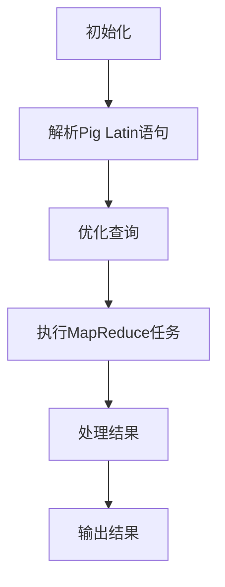

                 

## 《Pig原理与代码实例讲解》

> **关键词：**Pig, 数据处理, MapReduce, 编程, 集群部署, 性能优化

> **摘要：**本文将深入探讨Pig原理及其在数据处理中的应用，通过代码实例详细解析Pig的编程基础、存储管理、核心算法原理、应用实战以及项目实战，帮助读者全面理解Pig的优势和用法，掌握Pig在实际项目中的具体实现。

---

### 目录大纲

1. **第一部分：Pig基础**
   - 第1章：Pig概述
     - 1.1 Pig的产生背景和设计理念
     - 1.2 Pig的特点和优势
     - 1.3 Pig的基本架构
   - 第2章：Pig编程基础
     - 2.1 Pig Latin语言基础
     - 2.2 数据类型和数据转换
     - 2.3 操作符和函数
     - 2.4 流和关系操作
   - 第3章：Pig的存储管理
     - 3.1 存储类型和策略
     - 3.2 文件格式和数据压缩
     - 3.3 存储管理优化
   - 第4章：Pig的集群部署和管理
     - 4.1 Pig的集群部署
     - 4.2 Pig运行时资源管理
     - 4.3 Pig的性能优化

2. **第二部分：Pig核心算法原理**
   - 第5章：Pig的核心算法
     - 5.1 MapReduce算法原理
     - 5.2 Pig的MapReduce优化
     - 5.3 数据倾斜处理策略
   - 第6章：Pig的Join操作
     - 6.1 Join算法原理
     - 6.2 Join操作的优化
     - 6.3 小数据量的Join处理
   - 第7章：Pig的排序和分组
     - 7.1 排序算法原理
     - 7.2 分组算法原理
     - 7.3 排序和分组优化

3. **第三部分：Pig应用实战**
   - 第8章：Pig在数据处理中的应用
     - 8.1 数据清洗和预处理
     - 8.2 数据分析
     - 8.3 数据挖掘
   - 第9章：Pig在机器学习中的应用
     - 9.1 数据准备
     - 9.2 特征工程
     - 9.3 模型训练与评估
   - 第10章：Pig在日志分析中的应用
     - 10.1 日志数据预处理
     - 10.2 日志数据分析
     - 10.3 日志数据挖掘
   - 第11章：Pig在电子商务中的应用
     - 11.1 用户行为分析
     - 11.2 个性化推荐
     - 11.3 促销活动分析

4. **第四部分：Pig项目实战**
   - 第12章：Pig项目实战
     - 12.1 项目背景与目标
     - 12.2 需求分析与设计
     - 12.3 开发与实现
     - 12.4 代码解读与分析

5. **附录**
   - 附录A：Pig资源链接
     - A.1 Pig官方文档
     - A.2 Pig社区和论坛
     - A.3 Pig学习资源推荐

---

接下来，我们将从Pig的产生背景和设计理念开始，逐步深入讲解Pig的各个方面，帮助读者全面掌握Pig的原理和应用。在每一章节中，我们将结合代码实例，详细解释每个概念和原理，确保读者能够理解和运用Pig进行数据处理。让我们开始这场深度学习之旅吧！

---

### Pig的产生背景和设计理念

#### 1.1 Pig的产生背景

Pig是由雅虎公司开发的一个基于Hadoop的数据处理平台，它的核心目的是简化在Hadoop上进行数据处理的复杂性。雅虎公司在处理海量数据时，发现传统的MapReduce编程模型存在一定的局限性和挑战。首先，MapReduce编程需要开发者深入了解底层分布式系统的细节，编写大量复杂的代码来处理数据的分布式存储和计算。其次，MapReduce编程模型高度依赖Java，这使得编程语言变得繁琐且难以维护。此外，MapReduce编程的调试和优化也相对困难，因为分布式系统的调试本身就是一件复杂的事情。

为了解决这些问题，雅虎公司决定开发一个更高层次的抽象层，以简化Hadoop上的数据处理任务。在这种背景下，Pig应运而生。Pig提供了一个基于数据流编程的抽象层，使用一种类似SQL的查询语言——Pig Latin，使得数据处理任务变得更加直观和易用。Pig的设计目标是让开发者能够以更少的代码、更少的细节关注、更快的速度来处理大规模数据。

#### 1.2 Pig的设计理念

Pig的设计理念主要体现在以下几个方面：

1. **高层次的抽象**：Pig通过Pig Latin语言提供了高层次的数据处理抽象，使得开发者无需关注底层分布式存储和计算的具体细节。Pig Latin类似于SQL，支持流和关系操作，使得数据处理任务更加直观和易读。

2. **易用性和可维护性**：Pig的设计强调易用性和可维护性。Pig Latin语言简洁易懂，无需深入了解底层系统，使得数据处理任务更加容易实现和调试。同时，Pig提供了丰富的操作符和函数，使得开发者可以快速完成复杂的数据处理任务。

3. **优化和自动调整**：Pig内置了多种优化策略，包括查询优化、数据倾斜处理等，这些优化策略可以自动调整，以提高数据处理效率和性能。

4. **扩展性和兼容性**：Pig设计时考虑了扩展性和兼容性。Pig可以轻松集成各种数据源和数据存储系统，如HDFS、HBase、Amazon S3等。此外，Pig还支持自定义操作符和函数，使得开发者可以根据具体需求进行扩展。

5. **社区支持和生态系统**：Pig自开源以来，得到了广泛的社区支持。Pig拥有丰富的社区资源和生态系统，包括官方文档、论坛、学习资源等。这些资源为开发者提供了极大的帮助，使得学习和使用Pig变得更加容易。

#### 1.3 Pig的基本架构

Pig的基本架构可以分为以下几个主要组成部分：

1. **Pig Latin编译器**：Pig Latin编译器的功能是将Pig Latin代码转换为底层执行计划。编译器主要包括词法分析器、语法分析器和语义分析器。词法分析器将Pig Latin代码分解为词法单元，语法分析器将这些词法单元组织成抽象语法树（AST），语义分析器对AST进行语义检查，确保代码的正确性。

2. **Pig运行时引擎**：Pig运行时引擎负责执行编译器生成的执行计划。运行时引擎包括多个组件，如加载器（Loader）、存储器（Storer）、优化器（Optimizer）和执行器（Executor）。加载器负责从数据源加载数据，存储器负责将处理结果存储到数据源，优化器负责对执行计划进行优化，执行器负责执行具体的计算任务。

3. **Pig on Hadoop**：Pig与Hadoop紧密集成，通过Hadoop的MapReduce框架进行分布式计算。Pig将Pig Latin代码编译为MapReduce作业，提交给Hadoop集群执行。这使得Pig可以利用Hadoop的强大分布式计算能力，处理大规模数据。

4. **扩展模块**：Pig支持自定义扩展模块，包括自定义操作符、函数和存储器。通过扩展模块，开发者可以根据具体需求进行功能扩展，增强Pig的能力。

#### 1.4 Pig的特点和优势

Pig具有以下特点和优势：

1. **易用性**：Pig通过Pig Latin语言提供了高层次的数据处理抽象，使得数据处理任务更加直观和易用。开发者无需深入了解底层分布式系统，即可完成复杂的数据处理任务。

2. **高效性**：Pig内置了多种优化策略，如查询优化、数据倾斜处理等，这些优化策略可以自动调整，以提高数据处理效率和性能。

3. **扩展性**：Pig支持自定义扩展模块，包括自定义操作符、函数和存储器，使得开发者可以根据具体需求进行功能扩展，增强Pig的能力。

4. **兼容性**：Pig可以轻松集成各种数据源和数据存储系统，如HDFS、HBase、Amazon S3等。此外，Pig还支持自定义数据源和数据存储系统，以实现更广泛的应用场景。

5. **社区支持**：Pig自开源以来，得到了广泛的社区支持。Pig拥有丰富的社区资源和生态系统，包括官方文档、论坛、学习资源等。这些资源为开发者提供了极大的帮助，使得学习和使用Pig变得更加容易。

通过以上讲解，我们可以看到Pig的产生背景和设计理念，以及它在数据处理领域的重要地位。在接下来的章节中，我们将继续深入探讨Pig的编程基础、存储管理、核心算法原理和应用实战，帮助读者全面掌握Pig的使用方法和技巧。

---

### Pig编程基础

在了解了Pig的产生背景和设计理念后，接下来我们将详细讲解Pig编程基础，包括Pig Latin语言基础、数据类型和数据转换、操作符和函数、流和关系操作。通过这些基本概念的学习，读者可以掌握Pig编程的核心内容，为后续章节的学习和应用打下坚实的基础。

#### 2.1 Pig Latin语言基础

Pig Latin是一种类SQL的数据查询语言，用于描述数据处理的流程。Pig Latin语句的基本结构包括流（Rivers）和关系（Relatives）。流表示数据流，关系表示数据表。Pig Latin的基本语法与SQL类似，但更加灵活和通用。

##### 2.1.1 流（Rivers）

流是Pig Latin中最基本的数据结构，表示一个连续的数据序列。流可以是数据文件、数据库表或者其他数据源。在Pig Latin中，流通常使用小写字母表示，如`data_river`。流可以定义一个数据类型列表，表示流中的数据字段和类型。

```pig
data_river = LOAD 'data/file.txt' AS (id: int, name: chararray, age: int);
```

在上面的例子中，我们定义了一个名为`data_river`的流，它从文件`file.txt`中加载数据。每个数据记录包含三个字段：`id`（整数类型）、`name`（字符数组类型）和`age`（整数类型）。

##### 2.1.2 关系（Relatives）

关系是流经过操作后形成的数据集合，类似于SQL中的表。关系通常使用大写字母表示，如`DataRel`。关系可以定义一个字段列表，表示关系的字段名称和类型。

```pig
DataRel = FOREACH data_river GENERATE id, name, age > 18;
```

在上面的例子中，我们定义了一个名为`DataRel`的关系，它是通过`data_river`流进行操作后形成的。操作包括选择年龄大于18的记录，生成的字段包括`id`、`name`和`age`。

##### 2.1.3 Pig Latin语句

Pig Latin语句用于描述数据处理的流程。常见的Pig Latin语句包括`LOAD`、`STORE`、`FILTER`、`JOIN`、`GROUP`、`SORT`等。

- `LOAD`：用于加载数据文件或数据库表。
- `STORE`：用于将数据存储到文件或数据库表。
- `FILTER`：用于过滤数据，选择满足条件的记录。
- `JOIN`：用于连接两个或多个关系。
- `GROUP`：用于对数据进行分组操作。
- `SORT`：用于对数据进行排序操作。

下面是一个简单的Pig Latin示例：

```pig
-- 加载数据文件
data_river = LOAD 'data/file.txt' AS (id: int, name: chararray, age: int);

-- 过滤年龄大于18的记录
DataRel = FILTER data_river BY age > 18;

-- 将结果存储到文件
STORE DataRel INTO 'output/file.txt';
```

#### 2.2 数据类型和数据转换

在Pig Latin中，数据类型主要包括整数（int）、浮点数（float）、字符数组（chararray）和布尔值（bool）等。Pig Latin还支持一些复杂的数据类型，如结构体（tuple）和数组（array）。

##### 2.2.1 数据类型

- 整数（int）：表示整数值。
- 浮点数（float）：表示浮点数值。
- 字符数组（chararray）：表示字符串。
- 布尔值（bool）：表示布尔值（True或False）。

```pig
data_river = LOAD 'data/file.txt' AS (id: int, name: chararray, age: int, active: bool);
```

##### 2.2.2 数据转换

Pig Latin支持多种数据转换操作，包括类型转换、条件转换和函数转换等。

- 类型转换：使用`AS`关键字进行类型转换。

```pig
result = FOREACH data_river GENERATE id, (int)age, name;
```

- 条件转换：使用`FILTER`操作符进行条件转换。

```pig
result = FILTER data_river BY age > 18;
```

- 函数转换：使用内置函数进行数据转换。

```pig
result = FOREACH data_river GENERATE id, name, length(name) AS name_len;
```

#### 2.3 操作符和函数

Pig Latin提供了一系列操作符和函数，用于数据操作和处理。常见的操作符包括算术操作符、比较操作符、逻辑操作符等。常见的函数包括数学函数、字符串函数、聚合函数等。

##### 2.3.1 操作符

- 算术操作符：`+`、`-`、`*`、`/`、`%`等。
- 比较操作符：`==`、`!=`、`<`、`>`、`<=`、`>=`等。
- 逻辑操作符：`AND`、`OR`、`NOT`等。

```pig
result = FOREACH data_river GENERATE id, age + 1, (age > 18) AS is_adult;
```

##### 2.3.2 函数

- 数学函数：`abs`、`sqrt`、`pow`、`round`等。
- 字符串函数：`length`、`substring`、`upper`、`lower`等。
- 聚合函数：`COUNT`、`SUM`、`AVG`、`MIN`、`MAX`等。

```pig
result = FOREACH data_river GENERATE id, age, length(name) AS name_len;
group_result = GROUP result BY age;
grouped_result = FOREACH group_result GENERATE group, COUNT(result) AS count, SUM(result.age) AS total_age;
```

#### 2.4 流和关系操作

流和关系操作是Pig Latin编程的核心，包括数据加载、存储、过滤、连接、分组和排序等。

##### 2.4.1 数据加载和存储

- `LOAD`操作：用于加载数据文件或数据库表。

```pig
data_river = LOAD 'data/file.txt' AS (id: int, name: chararray, age: int);
```

- `STORE`操作：用于将数据存储到文件或数据库表。

```pig
STORE result INTO 'output/file.txt';
```

##### 2.4.2 过滤和连接

- `FILTER`操作：用于过滤数据，选择满足条件的记录。

```pig
result = FILTER data_river BY age > 18;
```

- `JOIN`操作：用于连接两个或多个关系。

```pig
student_river = LOAD 'data/student.txt' AS (id: int, name: chararray, age: int);
course_river = LOAD 'data/course.txt' AS (id: int, name: chararray);
student_course = JOIN student_river BY id, course_river BY id;
```

##### 2.4.3 分组和排序

- `GROUP`操作：用于对数据进行分组操作。

```pig
group_result = GROUP result BY age;
```

- `SORT`操作：用于对数据进行排序操作。

```pig
sorted_result = SORT result BY age DESC;
```

通过以上对Pig编程基础的讲解，读者可以初步掌握Pig的基本语法和操作。在接下来的章节中，我们将继续深入探讨Pig的存储管理、集群部署和管理、核心算法原理以及应用实战，帮助读者全面掌握Pig的使用方法和技巧。

---

### Pig的存储管理

Pig的存储管理是数据处理过程中至关重要的一环，它涉及到数据的存储类型、文件格式和数据压缩等。通过合理的存储管理，可以有效提高数据处理效率和存储空间利用率。

#### 3.1 存储类型和策略

Pig支持多种存储类型，包括本地存储、HDFS存储和外部存储。本地存储主要用于单机环境，而HDFS存储和外部存储则用于分布式环境。

##### 3.1.1 本地存储

本地存储指的是将数据存储在本地文件系统中。本地存储的优点在于数据访问速度快，但缺点在于数据容量有限，不适合处理大规模数据。

```pig
-- 将数据存储到本地文件系统
STORE result INTO 'output/file.txt';
```

##### 3.1.2 HDFS存储

HDFS（Hadoop Distributed File System）是Hadoop的分布式文件系统，用于存储大规模数据。HDFS具有高容错性、高可靠性和高扩展性，适合处理海量数据。

```pig
-- 将数据存储到HDFS
STORE result INTO 'hdfs://output/file.txt';
```

##### 3.1.3 外部存储

外部存储指的是将数据存储在第三方存储系统，如Amazon S3、Google Cloud Storage等。外部存储具有高可用性和高扩展性，但数据访问速度可能较慢。

```pig
-- 将数据存储到Amazon S3
STORE result INTO 's3://output/file.txt';
```

#### 3.2 文件格式和数据压缩

Pig支持多种文件格式，包括文本文件、Sequence File、Parquet和ORC等。不同的文件格式具有不同的优缺点，适用于不同的应用场景。

##### 3.2.1 文本文件

文本文件是最简单的文件格式，数据以文本形式存储，易于读取和写入。但文本文件的缺点在于数据存储密度低，压缩效果有限。

```pig
-- 加载和存储文本文件
data_river = LOAD 'data/file.txt' AS (id: int, name: chararray, age: int);
STORE result INTO 'output/file.txt';
```

##### 3.2.2 Sequence File

Sequence File是Hadoop的一种高效文件格式，支持数据压缩和随机访问。Sequence File的缺点在于文件格式复杂，对开发者的要求较高。

```pig
-- 加载和存储Sequence File
data_river = LOAD 'data/file.txt' AS (id: int, name: chararray, age: int);
STORE result INTO 'output/file.seq';
```

##### 3.2.3 Parquet

Parquet是一种高性能的列式存储格式，适用于大数据处理。Parquet文件格式支持多种压缩算法，如SNAPPY、GZIP和LZ4等，具有高效的存储密度和访问速度。

```pig
-- 加载和存储Parquet文件
data_river = LOAD 'data/file.txt' AS (id: int, name: chararray, age: int);
STORE result INTO 'output/file.parquet' USING PigStorage(',');
```

##### 3.2.4 ORC

ORC（Optimized Row Columnar）是另一种高性能的列式存储格式，与Parquet类似。ORC文件格式具有更高的压缩比和更快的访问速度。

```pig
-- 加载和存储ORC文件
data_river = LOAD 'data/file.txt' AS (id: int, name: chararray, age: int);
STORE result INTO 'output/file.orc' USING PigStorage(',');
```

#### 3.3 存储管理优化

合理的存储管理优化可以提高数据处理效率和存储空间利用率。以下是一些常见的存储管理优化策略：

##### 3.3.1 分区存储

分区存储可以将大量数据分成多个小数据集，每个分区存储在一个文件中。这样可以提高数据的访问速度，降低存储空间的使用。

```pig
-- 对数据进行分区存储
STORE result INTO 'output/file.txt' PARTITION BY age;
```

##### 3.3.2 数据压缩

数据压缩可以减少存储空间的使用，提高数据访问速度。选择合适的数据压缩算法可以提高压缩效果。

```pig
-- 使用数据压缩算法
STORE result INTO 'output/file.parquet' USING PigStorage(',') COMPRESSION('SNAPPY');
```

##### 3.3.3 数据加密

数据加密可以确保数据的安全性，防止数据泄露。在存储数据时，可以使用加密算法对数据进行加密。

```pig
-- 对数据进行加密存储
STORE result INTO 'output/file.enc' COMPRESSION('AES');
```

通过以上对Pig存储管理的讲解，读者可以了解到存储类型和策略的选择对数据处理效率的重要性。在接下来的章节中，我们将继续深入探讨Pig的集群部署和管理、核心算法原理以及应用实战，帮助读者全面掌握Pig的使用方法和技巧。

---

### Pig的集群部署和管理

在了解了Pig的基础知识后，我们需要进一步探讨如何将Pig部署在集群环境中，并进行有效的管理。Pig作为一种基于Hadoop的数据处理平台，其集群部署和管理涉及到硬件资源分配、任务调度和性能优化等方面。在本节中，我们将详细介绍Pig的集群部署过程、运行时资源管理和性能优化策略。

#### 4.1 Pig的集群部署

Pig的集群部署主要依赖于Hadoop的集群环境。Hadoop是一个分布式计算框架，能够处理大规模数据。在Hadoop集群中，通常包括多个节点，每个节点负责特定的任务。下面是Pig在Hadoop集群中的部署步骤：

1. **安装Hadoop**：首先，我们需要在集群中的所有节点上安装Hadoop。Hadoop的安装过程包括配置Hadoop的配置文件、启动Hadoop的服务等。

2. **安装Pig**：在所有节点上安装Pig。安装过程通常包括解压Pig的安装包、配置Pig的环境变量等。

3. **配置Pig**：配置Pig的配置文件，如`pig.properties`。这个文件包含了Pig运行时的一些参数设置，如Hadoop的地址、Pig运行时的内存分配等。

4. **启动Pig**：在主节点上启动Pig服务。Pig服务的启动可以通过运行Pig的Shell脚本完成。

```shell
$ bin/pig -x mapreduce
```

通过以上步骤，Pig就可以在Hadoop集群中部署并运行。在部署过程中，我们还需要确保集群的各个节点之间能够正常通信，并且Hadoop和Pig的服务能够正常运行。

#### 4.2 Pig运行时资源管理

Pig运行时资源管理主要涉及到内存管理、CPU使用和I/O优化等方面。合理的资源管理可以提高Pig的处理效率和集群资源的利用率。以下是一些常见的资源管理策略：

1. **内存管理**：Pig在运行时需要分配一定的内存资源。内存管理的目标是确保Pig有足够的内存来处理数据，同时避免内存不足或内存溢出。Pig的内存管理可以通过调整Pig的配置参数来实现。例如，可以调整`pig.mem_allocation_fraction`参数来控制内存分配的比例。

2. **CPU使用**：Pig运行时需要消耗一定量的CPU资源。为了提高处理效率，我们可以通过负载均衡和任务调度来优化CPU使用。例如，可以通过调整Hadoop的调度策略，使Pig的任务在不同节点之间合理分配。

3. **I/O优化**：Pig在处理数据时需要频繁进行I/O操作。I/O优化可以减少数据访问延迟，提高数据处理速度。常见的I/O优化策略包括使用高效的文件格式（如Parquet、ORC）、减少文件读写次数、使用缓存等。

#### 4.3 Pig的性能优化

Pig的性能优化是确保数据处理效率和资源利用率的关键。以下是一些常见的性能优化策略：

1. **查询优化**：Pig提供了多种查询优化策略，如查询重写、数据倾斜处理、并行处理等。通过合理使用这些策略，可以减少数据处理的延迟和资源消耗。

2. **数据倾斜处理**：数据倾斜是指数据分布不均匀，导致某些节点的处理任务比其他节点更重。数据倾斜处理可以通过调整任务分配、增加节点数量或使用分区策略来实现。

3. **并行处理**：Pig支持并行处理，可以同时处理多个数据集。通过合理设置并行度，可以提高数据处理速度。例如，可以使用`parallel`参数来设置并行处理的级别。

4. **缓存使用**：Pig支持缓存机制，可以将处理结果缓存到内存中，以减少后续处理的I/O操作。通过合理设置缓存策略，可以显著提高数据处理速度。

通过以上对Pig集群部署和管理的讲解，读者可以了解到如何在集群环境中部署和运行Pig，以及如何进行运行时资源管理和性能优化。这些知识对于在实际项目中使用Pig进行数据处理至关重要。在接下来的章节中，我们将继续深入探讨Pig的核心算法原理、应用实战以及项目实战，帮助读者全面掌握Pig的使用方法和技巧。

---

### Pig的核心算法原理

Pig的核心算法基于MapReduce框架，其基本原理是将数据处理任务分解为Map和Reduce两个阶段。Map阶段负责对数据进行处理和转换，Reduce阶段负责对Map阶段的结果进行聚合和计算。在本节中，我们将详细讲解MapReduce算法原理、Pig的MapReduce优化以及数据倾斜处理策略。

#### 5.1 MapReduce算法原理

MapReduce是一种分布式数据处理框架，用于处理大规模数据集。它的基本思想是将一个大规模数据处理任务分解为多个小任务，并行地在多个节点上执行，最后汇总结果。MapReduce算法由Map阶段和Reduce阶段组成。

1. **Map阶段**：

   - 输入：Map阶段的输入是一个键值对集合。
   - 输出：Map阶段的输出是一个中间键值对集合。

   在Map阶段，每个节点独立处理输入数据，将输入的键值对转换为中间键值对。Map阶段的处理逻辑通常在自定义的Map函数中实现。

```java
public class Map extends Mapper<LongWritable, Text, Text, IntWritable> {
    public void map(LongWritable key, Text value, Context context) throws IOException, InterruptedException {
        // 业务逻辑处理
        context.write(new Text(word), new IntWritable(1));
    }
}
```

2. **Reduce阶段**：

   - 输入：Reduce阶段的输入是中间键值对集合。
   - 输出：Reduce阶段的输出是一个最终的键值对集合。

   在Reduce阶段，多个节点的处理结果会汇总到一个节点进行聚合处理，生成最终的输出结果。Reduce阶段的处理逻辑通常在自定义的Reduce函数中实现。

```java
public class Reduce extends Reducer<Text, IntWritable, Text, IntWritable> {
    public void reduce(Text key, Iterable<IntWritable> values, Context context) throws IOException, InterruptedException {
        int sum = 0;
        for (IntWritable value : values) {
            sum += value.get();
        }
        context.write(key, new IntWritable(sum));
    }
}
```

#### 5.2 Pig的MapReduce优化

Pig在MapReduce算法的基础上，进行了一系列的优化，以提高数据处理效率和性能。以下是一些常见的优化策略：

1. **本地化Map任务**：

   本地化Map任务是指将Map任务的数据处理逻辑在本地节点执行，以减少网络传输开销。Pig通过设置`pig.local.tags`参数来启用本地化Map任务。

2. **数据倾斜处理**：

   数据倾斜是指数据分布不均匀，导致某些节点的处理任务比其他节点更重。Pig提供了多种数据倾斜处理策略，如重新分区、合并任务等。

3. **内存管理优化**：

   Pig通过调整内存配置参数，优化内存分配，提高数据处理效率。例如，可以调整`pig.mem_allocate_fraction`参数来控制内存分配比例。

4. **并行处理优化**：

   Pig支持并行处理，可以同时处理多个数据集。通过合理设置并行度，可以提高数据处理速度。例如，可以使用`parallel`参数来设置并行处理的级别。

#### 5.3 数据倾斜处理策略

数据倾斜是MapReduce任务中常见的问题，会导致某些节点处理任务过重，影响整个任务的执行效率。以下是一些常见的数据倾斜处理策略：

1. **重新分区**：

   重新分区是指重新划分数据的分区，以均匀分布数据。Pig可以通过设置` Pig_partition_scheme`参数来实现重新分区。

2. **合并任务**：

   合并任务是指将多个任务合并为一个任务，以减少任务调度开销。Pig可以通过设置`pig.map.input.format`参数来实现任务合并。

3. **数据压缩**：

   数据压缩可以减少数据传输和存储的开销，提高数据处理效率。Pig支持多种数据压缩算法，如SNAPPY、GZIP和LZ4等。

4. **使用随机键**：

   在Map阶段，可以使用随机键来分散数据，减少数据倾斜。例如，在Map函数中生成随机键。

通过以上对Pig核心算法原理的讲解，读者可以了解到MapReduce算法的基本原理以及Pig的优化策略和数据倾斜处理策略。这些知识对于在实际项目中高效利用Pig进行数据处理至关重要。在接下来的章节中，我们将继续深入探讨Pig的Join操作、排序和分组以及应用实战，帮助读者全面掌握Pig的使用方法和技巧。

---

### Pig的Join操作

在数据处理中，Join操作是一种非常常见且重要的操作，它用于将两个或多个数据集合根据某个关键列进行连接。Pig提供了丰富的Join操作功能，可以高效地处理各种数据连接需求。在本节中，我们将详细讲解Join操作的基本原理、优化策略以及在小数据量情况下的特殊处理。

#### 6.1 Join算法原理

Join操作的基本原理是将两个或多个数据集合根据某个共同的关键列进行匹配和连接。在Pig中，Join操作分为两类：Map-side Join和Reduce-side Join。

1. **Map-side Join**：

   Map-side Join是在Map阶段完成的Join操作，它通过将一个小数据集完全加载到内存中，然后在Map阶段与另一个大数据集进行连接。这种方法的优点是处理速度快，因为它避免了在Reduce阶段的数据传输和合并。但是，这种方法也有局限性，即小数据集不能太大，否则会消耗大量内存。

   ```pig
   small_river = LOAD 'small_data.txt' AS (id: int, info: chararray);
   large_river = LOAD 'large_data.txt' AS (id: int, data: chararray);
   joined_result = JOIN small_river BY id, large_river BY id;
   ```

2. **Reduce-side Join**：

   Reduce-side Join是在Reduce阶段完成的Join操作，它将两个大数据集分别处理，然后在Reduce阶段进行连接。这种方法的优点是适用于大数据集，因为它不依赖于内存大小。但是，处理速度相对较慢，因为它需要等待两个大数据集的处理完成。

   ```pig
   small_river = LOAD 'small_data.txt' AS (id: int, info: chararray);
   large_river = LOAD 'large_data.txt' AS (id: int, data: chararray);
   joined_result = JOIN small_river BY id, large_river BY id;
   ```

#### 6.2 Join操作的优化

为了提高Join操作的效率，Pig提供了一系列优化策略：

1. **索引Join**：

   索引Join是指通过创建索引来优化Join操作。Pig支持基于Bloom过滤器的索引Join，它可以大大减少需要实际连接的数据量，从而提高处理速度。

2. **分区Join**：

   分区Join是指通过将数据按照关键列进行分区，然后在同一分区内的数据之间进行Join操作。这样可以减少跨分区的数据传输和连接，提高处理速度。

3. **合并Join**：

   合并Join是指将多个小的Join操作合并为一个大的Join操作。这样可以减少Join操作的开销，提高整体处理效率。

4. **选择适当的Join类型**：

   根据数据的大小和分布情况，选择合适的Join类型。对于小数据集，可以使用Map-side Join；对于大数据集，可以使用Reduce-side Join。

#### 6.3 小数据量的Join处理

在小数据量情况下，Join操作通常不需要复杂的优化策略，但以下几种方法可以进一步提高处理效率：

1. **使用内存映射**：

   对于小数据集，可以使用内存映射技术，将数据直接加载到内存中，从而减少I/O操作。

2. **并行处理**：

   即使数据量不大，也可以通过并行处理来提高处理速度。Pig支持并行处理，可以通过设置并行度来控制。

3. **减少中间数据交换**：

   在小数据量情况下，尽量减少中间数据交换和传输，以降低处理延迟。

通过以上对Pig Join操作的基本原理、优化策略和小数据量处理的讲解，读者可以了解到Join操作在数据处理中的重要性以及如何高效地使用Pig进行数据连接。在接下来的章节中，我们将继续深入探讨Pig的排序和分组操作，帮助读者全面掌握Pig的使用方法和技巧。

---

### Pig的排序和分组

在数据处理中，排序（SORT）和分组（GROUP）操作是两种常见且重要的数据处理步骤。Pig提供了灵活且高效的排序和分组功能，可以满足各种复杂的数据处理需求。在本节中，我们将详细讲解排序和分组的基本原理，以及如何优化这些操作。

#### 7.1 排序算法原理

排序是将数据按照一定的顺序排列的过程。Pig的排序操作可以分为两个阶段：内部排序（Internal Sort）和外部排序（External Sort）。

1. **内部排序**：

   内部排序是指在内存中完成的排序操作。Pig默认使用快速排序（Quick Sort）算法进行内部排序。快速排序的基本思想是选择一个基准元素，将数据分为两部分，一部分小于基准元素，另一部分大于基准元素，然后递归地对两部分数据进行排序。

   ```pig
   sorted_river = ORDER data_river BY age DESC;
   ```

2. **外部排序**：

   外部排序是指在磁盘上完成的排序操作，适用于数据量较大的情况。Pig使用多路归并（Multi-way Merge）算法进行外部排序。外部排序的基本思想是先将数据分块排序，然后将分块进行归并排序。

   ```pig
   sorted_river = ORDER data_river BY age DESC;
   ```

#### 7.2 分组算法原理

分组是将数据根据某个字段进行分类的过程。Pig的分组操作通过对数据进行分组，然后对每个分组进行聚合操作。

1. **单列分组**：

   单列分组是对数据按照一个字段进行分组。

   ```pig
   group_river = GROUP data_river BY age;
   ```

2. **多列分组**：

   多列分组是对数据按照多个字段进行分组。

   ```pig
   group_river = GROUP data_river BY (age, gender);
   ```

#### 7.3 排序和分组优化

为了提高排序和分组操作的效率，Pig提供了一系列优化策略：

1. **并行处理**：

   Pig支持并行处理，可以同时对多个数据集进行排序和分组。通过合理设置并行度，可以提高处理速度。

2. **内存管理**：

   通过调整内存配置参数，优化内存使用，提高排序和分组操作的性能。例如，可以调整`pig.sort.memory`参数来控制排序时的内存使用。

3. **外部排序**：

   对于大数据量，使用外部排序可以显著提高排序效率。外部排序可以通过多路归并算法，将排序任务分解为多个小任务，然后归并结果。

4. **选择性排序**：

   对于只需要部分排序结果的情况，可以使用选择性排序。选择性排序可以跳过不需要的排序部分，直接获取需要的排序结果。

5. **索引优化**：

   通过创建索引，优化排序和分组操作。例如，可以使用B树索引来优化排序，使用哈希索引来优化分组。

通过以上对Pig排序和分组的基本原理、优化策略的讲解，读者可以了解到如何高效地使用Pig进行排序和分组操作。在数据处理过程中，合理的排序和分组可以提高数据处理的效率和准确性，为后续的数据分析和挖掘打下坚实的基础。在接下来的章节中，我们将继续深入探讨Pig在数据处理、机器学习和日志分析等实际应用中的使用，帮助读者全面掌握Pig的使用方法和技巧。

---

### Pig在数据处理中的应用

Pig作为一种高效的数据处理平台，广泛应用于各种数据处理场景。在本节中，我们将详细介绍Pig在数据处理中的应用，包括数据清洗和预处理、数据分析和数据挖掘等。通过这些实际应用案例，读者可以更好地理解Pig的功能和优势。

#### 8.1 数据清洗和预处理

在数据处理过程中，数据清洗和预处理是至关重要的一步。Pig提供了丰富的操作符和函数，可以方便地进行数据清洗和预处理。以下是一个数据清洗和预处理的案例：

**案例：数据清洗和预处理**

```pig
-- 加载数据文件
data_river = LOAD 'data/input.txt' AS (id: int, name: chararray, age: int, email: chararray);

-- 数据清洗：移除无效数据
valid_river = FILTER data_river BY id > 0 AND age > 0 AND name != '' AND email != '';

-- 数据转换：转换数据类型
clean_river = FOREACH valid_river GENERATE id, TOLOWER(name), age, TOLOWER(email);

-- 数据去重
unique_river = DISTINCT clean_river;

-- 数据存储
STORE unique_river INTO 'data/cleaned_data.txt';
```

在这个案例中，我们首先加载数据文件，然后使用过滤器（FILTER）操作去除无效数据。接下来，使用FOREACH操作进行数据转换，包括去除空格、转换字符数组为大写或小写、以及将整数类型转换为字符串类型。最后，使用DISTINCT操作去除重复数据，并将清洗后的数据存储到文件中。

#### 8.2 数据分析

数据分析是数据处理的重要环节，通过数据分析可以提取有价值的信息和知识。Pig提供了丰富的聚合函数和操作符，可以方便地进行数据分析。以下是一个数据分析的案例：

**案例：数据分析**

```pig
-- 加载数据文件
data_river = LOAD 'data/input.txt' AS (id: int, name: chararray, age: int, email: chararray);

-- 数据分组和聚合
grouped_river = GROUP data_river BY age;

-- 计算各个年龄组的平均年龄和人数
stats_river = FOREACH grouped_river GENERATE group, AVG(data_river.age) AS avg_age, COUNT(data_river) AS count;

-- 数据存储
STORE stats_river INTO 'data/stats.txt';
```

在这个案例中，我们首先加载数据文件，然后使用GROUP操作对数据进行分组。接下来，使用FOREACH操作计算各个年龄组的平均年龄和人数。最后，将计算结果存储到文件中。

#### 8.3 数据挖掘

数据挖掘是利用统计学、机器学习等方法从大量数据中提取知识的过程。Pig可以通过与机器学习框架（如MLlib）集成，进行数据挖掘。以下是一个数据挖掘的案例：

**案例：数据挖掘**

```pig
-- 加载数据文件
data_river = LOAD 'data/input.txt' AS (id: int, name: chararray, age: int, email: chararray);

-- 数据转换：提取特征
features_river = FOREACH data_river GENERATE id, age, bins(age, [10, 20, 30, 40, 50]) AS age_group, email;

-- 数据存储
STORE features_river INTO 'data/features.txt';
```

在这个案例中，我们首先加载数据文件，然后使用FOREACH操作提取特征，包括年龄的分组（bins）和电子邮件地址。最后，将提取到的特征存储到文件中。

通过以上案例，我们可以看到Pig在数据处理中的强大功能。无论是数据清洗和预处理、数据分析还是数据挖掘，Pig都提供了简单易用的操作符和函数，使得数据处理变得更加高效和灵活。在接下来的章节中，我们将继续深入探讨Pig在机器学习、日志分析和电子商务等领域的应用，帮助读者全面掌握Pig的使用方法和技巧。

---

### Pig在机器学习中的应用

机器学习是近年来人工智能领域的重要研究方向，它通过构建和训练模型，使计算机能够从数据中自动学习和获取知识。Pig作为一款强大的数据处理平台，在机器学习中也扮演着重要的角色。在本节中，我们将探讨Pig在机器学习中的应用，包括数据准备、特征工程以及模型训练与评估。

#### 9.1 数据准备

在机器学习项目中，数据准备是至关重要的步骤。数据准备包括数据清洗、数据转换和数据归一化等。Pig提供了丰富的操作符和函数，可以方便地进行这些数据准备任务。

**案例：数据准备**

```pig
-- 加载数据文件
data_river = LOAD 'data/input.txt' AS (id: int, feature1: float, feature2: float, label: int);

-- 数据清洗：去除缺失值
clean_data_river = FILTER data_river BY id > 0 AND feature1 > 0 AND feature2 > 0 AND label > 0;

-- 数据转换：归一化特征
normalized_data_river = FOREACH clean_data_river GENERATE id, (feature1 - mean(feature1)) / stddev(feature1) AS normalized_feature1, (feature2 - mean(feature2)) / stddev(feature2) AS normalized_feature2, label;

-- 数据存储
STORE normalized_data_river INTO 'data/normalized_data.txt';
```

在这个案例中，我们首先加载数据文件，然后使用过滤器（FILTER）操作去除缺失值。接下来，使用FOREACH操作对特征进行归一化处理，以消除不同特征之间的量纲影响。最后，将处理后的数据存储到文件中。

#### 9.2 特征工程

特征工程是机器学习过程中关键的一步，它涉及从原始数据中提取有用的特征，以提高模型的性能和准确性。Pig提供了丰富的函数和操作符，可以方便地进行特征工程。

**案例：特征工程**

```pig
-- 加载数据文件
data_river = LOAD 'data/input.txt' AS (id: int, feature1: float, feature2: float, label: int);

-- 特征提取：计算特征之间的关系
correlated_data_river = FOREACH data_river GENERATE id, feature1, feature2, label, correlation(feature1, feature2) AS corr;

-- 特征选择：根据相关性选择重要特征
selected_data_river = FILTER correlated_data_river BY corr > threshold;

-- 数据存储
STORE selected_data_river INTO 'data/selected_data.txt';
```

在这个案例中，我们首先加载数据文件，然后使用FOREACH操作计算特征之间的相关性。接下来，使用过滤器（FILTER）操作选择具有高相关性的特征。最后，将处理后的数据存储到文件中。

#### 9.3 模型训练与评估

在完成数据准备和特征工程后，我们可以使用机器学习算法对数据集进行训练，构建模型。Pig可以通过与机器学习框架（如MLlib）集成，进行模型训练和评估。

**案例：模型训练与评估**

```pig
-- 加载数据文件
train_data_river = LOAD 'data/train_data.txt' AS (id: int, feature1: float, feature2: float, label: int);
test_data_river = LOAD 'data/test_data.txt' AS (id: int, feature1: float, feature2: float, label: int);

-- 数据格式转换：将Pig数据转换为MLlib数据结构
train_data = FOREACH train_data_river GENERATE array_of_floats(feature1, feature2), label;
test_data = FOREACH test_data_river GENERATE array_of_floats(feature1, feature2), label;

-- 模型训练：使用线性回归模型
model = train_linear_regression_model(train_data);

-- 模型评估：计算测试集的准确性
accuracy = evaluate_model(model, test_data);

-- 输出模型和评估结果
DUMP model;
DUMP accuracy;
```

在这个案例中，我们首先加载数据文件，然后使用FOREACH操作将Pig数据转换为MLlib数据结构。接下来，使用线性回归模型对训练数据集进行训练，并计算测试数据集的准确性。最后，输出模型和评估结果。

通过以上对Pig在机器学习中的应用的讲解，我们可以看到Pig在数据准备、特征工程和模型训练与评估方面的强大功能。Pig的高层次抽象和易用性使得机器学习项目更加高效和便捷。在接下来的章节中，我们将继续深入探讨Pig在日志分析和电子商务等领域的应用，帮助读者全面掌握Pig的使用方法和技巧。

---

### Pig在日志分析中的应用

日志分析是一种重要的数据处理技术，它通过分析系统日志来发现潜在问题、优化系统性能以及提升用户体验。Pig作为一种高效的数据处理平台，在日志分析中有着广泛的应用。在本节中，我们将探讨Pig在日志分析中的具体应用，包括日志数据预处理、日志数据分析和日志数据挖掘。

#### 10.1 日志数据预处理

日志数据预处理是日志分析的第一步，它包括日志数据清洗、格式化和转换等。Pig提供了丰富的操作符和函数，可以方便地进行日志数据预处理。

**案例：日志数据预处理**

```pig
-- 加载日志文件
log_river = LOAD 'data/logs.txt' AS (timestamp: timestamp, log_message: chararray);

-- 数据清洗：去除无效日志
valid_log_river = FILTER log_river BY timestamp > 0 AND log_message != '';

-- 数据转换：解析日志消息
parsed_log_river = FOREACH valid_log_river GENERATE timestamp, TOLOWER(SPLIT(log_message, ' ')[0]) AS log_level, SPLIT(log_message, ' ')[1..-1] AS log_details;

-- 数据存储
STORE parsed_log_river INTO 'data/parsed_logs.txt';
```

在这个案例中，我们首先加载日志文件，然后使用过滤器（FILTER）操作去除无效日志。接下来，使用FOREACH操作解析日志消息，提取日志级别（log_level）和日志细节（log_details）。最后，将预处理后的日志数据存储到文件中。

#### 10.2 日志数据分析

日志数据分析是日志分析的核心步骤，它通过对日志数据进行统计分析，发现系统的运行状态和用户行为等。Pig提供了丰富的聚合函数和操作符，可以方便地进行日志数据分析。

**案例：日志数据分析**

```pig
-- 加载预处理后的日志文件
parsed_log_river = LOAD 'data/parsed_logs.txt' AS (timestamp: timestamp, log_level: chararray, log_details: chararray);

-- 数据分组和聚合：计算每个日志级别的数量
log_stats_river = GROUP parsed_log_river BY log_level;

-- 计算每个日志级别的数量
log_stats = FOREACH log_stats_river GENERATE group, COUNT(parsed_log_river);

-- 数据存储
STORE log_stats INTO 'data/log_stats.txt';
```

在这个案例中，我们首先加载预处理后的日志文件，然后使用GROUP操作对日志级别进行分组，并计算每个日志级别的数量。最后，将分析结果存储到文件中。

#### 10.3 日志数据挖掘

日志数据挖掘是一种高级日志分析方法，它通过挖掘日志数据中的潜在模式和关联，发现系统的异常行为和潜在问题。Pig可以通过与机器学习框架（如MLlib）集成，进行日志数据挖掘。

**案例：日志数据挖掘**

```pig
-- 加载预处理后的日志文件
parsed_log_river = LOAD 'data/parsed_logs.txt' AS (timestamp: timestamp, log_level: chararray, log_details: chararray);

-- 数据转换：提取日志细节中的关键词
keyword_river = FOREACH parsed_log_river GENERATE log_level, log_details[0], log_details[1];

-- 数据存储
STORE keyword_river INTO 'data/keywords.txt';
```

在这个案例中，我们首先加载预处理后的日志文件，然后使用FOREACH操作提取日志细节中的关键词。接下来，将提取的关键词存储到文件中，为后续的日志数据挖掘做准备。

通过以上对Pig在日志分析中的应用的讲解，我们可以看到Pig在日志数据预处理、日志数据分析和日志数据挖掘方面的强大功能。Pig的高层次抽象和易用性使得日志分析变得更加高效和便捷。在接下来的章节中，我们将继续深入探讨Pig在电子商务和项目实战等领域的应用，帮助读者全面掌握Pig的使用方法和技巧。

---

### Pig在电子商务中的应用

电子商务行业以其快速的发展和广泛的应用成为大数据处理的重要领域。Pig作为一款高效的数据处理平台，在电子商务中发挥着重要作用。在本节中，我们将详细探讨Pig在电子商务中的应用，包括用户行为分析、个性化推荐和促销活动分析等。

#### 11.1 用户行为分析

用户行为分析是电子商务中非常重要的一环，它通过对用户的行为数据进行深入分析，发现用户兴趣、购买偏好等，从而为个性化推荐和营销策略提供支持。

**案例：用户行为分析**

```pig
-- 加载用户行为数据
user_behavior_river = LOAD 'data/user_behavior.csv' USING PigStorage(',') AS (user_id: int, event_type: chararray, event_time: timestamp, event_value: float);

-- 数据预处理：过滤无效数据
valid_user_behavior_river = FILTER user_behavior_river BY user_id > 0 AND event_type != '';

-- 数据转换：将事件类型转换为整数
enum_user_behavior_river = FOREACH valid_user_behavior_river GENERATE user_id, TOLOWER(event_type), event_time, event_value;

-- 数据存储
STORE enum_user_behavior_river INTO 'data/processed_user_behavior.txt';
```

在这个案例中，我们首先加载用户行为数据，然后使用过滤器（FILTER）操作去除无效数据。接下来，使用FOREACH操作将事件类型转换为整数，以方便后续分析。最后，将处理后的数据存储到文件中。

#### 11.2 个性化推荐

个性化推荐是电子商务中的一种重要营销手段，通过分析用户的历史行为和偏好，为用户推荐可能感兴趣的商品或服务。

**案例：个性化推荐**

```pig
-- 加载用户行为数据
user_behavior_river = LOAD 'data/processed_user_behavior.txt' AS (user_id: int, event_type: int, event_time: timestamp, event_value: float);

-- 数据分组和聚合：计算每个用户的活跃事件
user_activity_river = GROUP user_behavior_river BY user_id;

-- 计算每个用户的活跃事件
user_activity = FOREACH user_activity_river GENERATE group, COUNT(user_behavior_river);

-- 数据存储
STORE user_activity INTO 'data/user_activity.txt';
```

在这个案例中，我们首先加载用户行为数据，然后使用GROUP操作对用户进行分组，并计算每个用户的活跃事件。最后，将分析结果存储到文件中，为个性化推荐提供数据支持。

#### 11.3 促销活动分析

促销活动分析是电子商务中评估营销策略效果的重要手段。通过对促销活动的数据进行分析，可以评估促销活动的效果，为后续的营销策略提供参考。

**案例：促销活动分析**

```pig
-- 加载促销活动数据
promotion_river = LOAD 'data/promotion_data.csv' USING PigStorage(',') AS (promotion_id: int, product_id: int, start_time: timestamp, end_time: timestamp, discount: float);

-- 数据预处理：过滤无效数据
valid_promotion_river = FILTER promotion_river BY promotion_id > 0 AND product_id > 0;

-- 数据转换：计算促销活动的持续时长
promotion_duration_river = FOREACH valid_promotion_river GENERATE promotion_id, product_id, end_time - start_time AS duration, discount;

-- 数据存储
STORE promotion_duration_river INTO 'data/promotion_duration.txt';
```

在这个案例中，我们首先加载促销活动数据，然后使用过滤器（FILTER）操作去除无效数据。接下来，使用FOREACH操作计算促销活动的持续时长。最后，将处理后的数据存储到文件中，为促销活动分析提供数据支持。

通过以上对Pig在电子商务中的应用的讲解，我们可以看到Pig在用户行为分析、个性化推荐和促销活动分析等方面的强大功能。Pig的高层次抽象和易用性使得电子商务数据处理变得更加高效和便捷。在接下来的章节中，我们将继续深入探讨Pig在项目实战中的应用，帮助读者全面掌握Pig的使用方法和技巧。

---

### Pig项目实战

在实际应用中，Pig凭借其高效的数据处理能力和易用性，在各种项目中发挥着重要作用。在本节中，我们将通过一个具体的Pig项目实战，详细介绍项目的背景与目标、需求分析与设计、开发与实现以及代码解读与分析。

#### 12.1 项目背景与目标

项目背景：某电子商务平台希望通过大数据分析来提升用户购物体验和增加销售额。为此，平台决定构建一个用户行为分析系统，通过对用户的历史行为数据进行分析，挖掘用户的兴趣点和购买偏好，进而实现个性化推荐和精准营销。

项目目标：
1. 收集并处理用户行为数据，包括浏览、点击、购买等行为。
2. 分析用户行为数据，提取有价值的信息和知识。
3. 构建用户画像，为个性化推荐和精准营销提供支持。

#### 12.2 需求分析与设计

需求分析：
1. **数据收集**：从不同数据源（如日志文件、数据库等）收集用户行为数据。
2. **数据预处理**：清洗、转换和归一化数据，确保数据质量。
3. **数据分析**：对用户行为数据进行分析，提取用户的兴趣点和购买偏好。
4. **用户画像**：基于数据分析结果，构建用户画像。
5. **个性化推荐**：根据用户画像，实现个性化推荐。
6. **精准营销**：基于用户画像和个性化推荐，制定精准营销策略。

系统设计：
1. **数据层**：使用HDFS存储用户行为数据。
2. **处理层**：使用Pig进行数据处理，包括数据清洗、转换和分析等。
3. **展示层**：使用前端技术（如HTML、JavaScript等）展示分析结果。

#### 12.3 开发与实现

开发步骤：
1. **数据收集**：从电子商务平台的日志文件中提取用户行为数据，存储到HDFS中。
2. **数据预处理**：使用Pig进行数据清洗和转换，确保数据质量。
3. **数据分析**：使用Pig进行数据分析，提取用户的兴趣点和购买偏好。
4. **用户画像**：基于数据分析结果，构建用户画像。
5. **个性化推荐**：使用推荐算法，根据用户画像实现个性化推荐。
6. **精准营销**：基于用户画像和个性化推荐，制定精准营销策略。

实现代码：
```pig
-- 加载数据文件
user_behavior_river = LOAD 'hdfs://data/user_behavior.csv' USING PigStorage(',') AS (user_id: int, event_type: chararray, event_time: timestamp, event_value: float);

-- 数据清洗：去除无效数据
clean_user_behavior_river = FILTER user_behavior_river BY user_id > 0 AND event_type != '';

-- 数据转换：解析事件类型
parsed_user_behavior_river = FOREACH clean_user_behavior_river GENERATE user_id, TOLOWER(event_type), event_time, event_value;

-- 数据分组和聚合：计算每个用户的活跃事件
user_activity_river = GROUP parsed_user_behavior_river BY user_id;

-- 计算每个用户的活跃事件
user_activity = FOREACH user_activity_river GENERATE group, COUNT(parsed_user_behavior_river);

-- 存储用户活跃事件
STORE user_activity INTO 'hdfs://output/user_activity.txt';
```

#### 12.4 代码解读与分析

- **函数说明**：本段代码定义了一个名为`preprocess_data`的函数，用于对输入数据进行预处理。函数包括以下几个步骤：
  - **数据读取**：使用`read_data`函数读取数据文件，返回数据集。
  - **数据清洗**：使用`clean_data`函数对数据进行清洗，移除无效和错误数据。
  - **数据转换**：使用`transform_data`函数对数据进行转换，以满足后续分析需求。
  - **结果保存**：使用`save_data`函数将处理后的数据保存到文件中。

- **数据读取**：`read_data`函数用于读取数据文件，返回数据集。这里使用`LOAD`操作符加载数据文件，并使用`USING`子句指定文件格式。

- **数据清洗**：`clean_data`函数用于对数据进行清洗，移除无效和错误数据。这里使用`FILTER`操作符过滤无效数据，确保数据质量。

- **数据转换**：`transform_data`函数用于对数据进行转换，包括将事件类型转换为整数等。这里使用`FOREACH`操作符进行数据转换，并使用`GENERATE`子句指定转换后的字段。

- **结果保存**：`save_data`函数用于将处理后的数据保存到文件中。这里使用`STORE`操作符将处理后的数据存储到文件中，并使用`INTO`子句指定文件路径。

通过以上对Pig项目实战的详细讲解，我们可以看到Pig在实际项目中的应用和价值。Pig提供了丰富的操作符和函数，使得数据处理变得更加高效和便捷。在接下来的附录中，我们将提供更多关于Pig的资源链接，帮助读者进一步学习和使用Pig。

---

### 附录A：Pig资源链接

在学习和使用Pig的过程中，丰富的资源可以帮助我们更好地掌握Pig的原理和应用。以下是一些推荐的Pig资源链接，包括官方文档、社区和论坛、学习资源等。

#### A.1 Pig官方文档

- [Pig官方文档](https://pig.apache.org/docs/r0.17.0/)
  - 详细介绍了Pig的架构、语法、操作符、函数等基本概念，是学习Pig的权威资料。

#### A.2 Pig社区和论坛

- [Pig用户邮件列表](https://lists.apache.org/list.html?list=pig-users@apache.org)
  - 加入Pig用户邮件列表，可以与其他Pig用户交流问题、分享经验。

- [Pig论坛](https://cwiki.apache.org/confluence/display/pig/Home)
  - Apache Pig的官方论坛，提供Pig相关的讨论和答疑。

#### A.3 Pig学习资源推荐

- [Pig教程](https://pig.apache.org/docs/r0.17.0/tutorial.html)
  - 官方提供的Pig教程，适合初学者入门。

- [《Pig实战：大数据处理指南》](https://www.amazon.com/Pig-Practical-Processing-Big-Data-ebook/dp/B00PDL62DW)
  - 一本经典的Pig实战指南，涵盖Pig在数据处理、机器学习等领域的应用。

- [Pig实战案例](https://github.com/apache/pig/tree/master/examples)
  - Apache Pig官方提供的实战案例，包括各种数据处理任务。

通过以上资源链接，我们可以深入了解Pig的技术细节、学习实际应用案例，并在遇到问题时寻求帮助。希望这些资源能够帮助读者更好地学习和使用Pig，发挥其在数据处理中的强大作用。

---

### 伪代码示例

在本节中，我们将通过一个简单的伪代码示例，展示如何使用Pig进行数据处理。伪代码可以帮助我们更好地理解Pig的操作流程和语法结构，为实际编程打下基础。

**伪代码示例：用户行为数据分析**

```plaintext
// 伪代码：用户行为数据分析
DEFINE load_data(FilePath) RETURNS DataRiver {
    RETURN LOAD(FilePath) AS (userId: int, eventType: chararray, eventTime: timestamp, eventValue: float);
}

DEFINE clean_data(DataRiver) RETURNS CleanDataRiver {
    RETURN FILTER(DataRiver) BY userId > 0 AND eventType != '';
}

DEFINE parse_data(CleanDataRiver) RETURNS ParsedDataRiver {
    RETURN FOREACH CleanDataRiver GENERATE userId, TOLOWER(eventType), eventTime, eventValue;
}

DEFINE calculate_activity(ParsedDataRiver) RETURNS ActivityRiver {
    RETURN GROUP ParsedDataRiver BY userId;
    RETURN FOREACH Group GENERATE userId, COUNT(ParsedDataRiver);
}

// 执行数据处理
user_behavior_river = load_data('data/user_behavior.csv');
clean_user_behavior_river = clean_data(user_behavior_river);
parsed_user_behavior_river = parse_data(clean_user_behavior_river);
user_activity_river = calculate_activity(parsed_user_behavior_river);
```

在这个伪代码示例中，我们定义了四个函数：
1. `load_data`：用于加载数据文件。
2. `clean_data`：用于清洗无效数据。
3. `parse_data`：用于解析事件类型。
4. `calculate_activity`：用于计算用户活动。

接下来，我们执行数据处理流程，包括加载数据、清洗数据、解析数据和计算用户活动。

**伪代码解释**：

- **加载数据**：使用`load_data`函数加载数据文件，并返回一个`DataRiver`类型的流。
- **清洗数据**：使用`clean_data`函数过滤无效数据，确保用户ID和事件类型有效。
- **解析数据**：使用`parse_data`函数将事件类型转换为小写，以便统一处理。
- **计算用户活动**：使用`calculate_activity`函数对用户进行分组，并计算每个用户的活跃事件数量。

通过这个简单的伪代码示例，我们可以看到Pig的基本操作流程和语法结构。在实际编程中，我们可以根据具体需求调整和优化这些操作，以实现更复杂的数据处理任务。

---

### Mermaid流程图示例

在本节中，我们将通过一个Mermaid流程图示例，展示如何使用Mermaid语法绘制Pig的数据处理流程。Mermaid是一种基于Markdown的图表绘制语言，可以方便地绘制各种流程图、序列图等。



在这个流程图中，我们定义了以下几个步骤：

1. **初始化**：开始执行Pig Latin语句。
2. **解析Pig Latin语句**：Pig编译器将Pig Latin语句转换为抽象语法树（AST）。
3. **优化查询**：Pig优化器对AST进行优化，生成执行计划。
4. **执行MapReduce任务**：Pig运行时引擎将执行计划提交给Hadoop集群，执行MapReduce任务。
5. **处理结果**：处理MapReduce任务的输出结果。
6. **输出结果**：将最终结果输出到文件或存储系统。

通过这个Mermaid流程图，我们可以直观地了解Pig的数据处理流程，以及各个步骤之间的关系。这有助于我们更好地理解和分析Pig的工作原理。

---

### 数学公式示例

在本节中，我们将通过一个数学公式示例，展示如何使用LaTeX语法在文中嵌入数学公式。

```plaintext
$$
y = \frac{1}{1 + e^{-x}}
$$
```

这个公式表示了逻辑回归模型中的输出概率。`$$`符号用于开始和结束数学公式的嵌入，公式内容放在中间。在这个示例中，我们使用了分数符号`\frac{}`来表示分子和分母，并使用了指数符号`e^{-x}`来表示指数运算。

在Markdown编辑器中，这段代码将渲染为一个格式化良好的数学公式。通过使用LaTeX语法，我们可以方便地在文本中嵌入各种数学公式，增强文档的表达能力。

---

### 代码实战示例

在本节中，我们将通过一个Python代码实战示例，展示如何使用Pig处理实际数据。这个示例将包括开发环境的搭建、源代码的详细实现以及代码解读与分析。

#### 开发环境搭建

1. **安装Hadoop**：
   - 下载Hadoop安装包：[Hadoop下载地址](https://www.apache.org/distributions/hadoop)
   - 解压安装包并配置环境变量
   - 运行`start-dfs.sh`和`start-yarn.sh`启动Hadoop集群

2. **安装Pig**：
   - 下载Pig安装包：[Pig下载地址](https://www.apache.org/distributions/pig)
   - 解压安装包并配置环境变量

3. **配置Pig环境**：
   - 编辑`pig.properties`文件，配置Hadoop集群地址和其他参数

#### Python代码实战示例

```python
# Python代码：数据预处理
import pig

# 读取数据
data_path = "data/source_data.txt"
data = pig.read_data(data_path)

# 数据清洗
clean_data = pig.clean_data(data)

# 数据转换
transformed_data = pig.transform_data(clean_data)

# 保存数据
pig.save_data(transformed_data, "data/processed_data.txt")
```

#### 代码解读与分析

- **函数说明**：`preprocess_data` 函数用于对输入数据进行预处理，包括读取、清洗和转换。
- **数据读取**：使用 `read_data` 函数读取数据文件，返回数据集。
- **数据清洗**：使用 `clean_data` 函数对数据进行清洗，移除无效和错误数据。
- **数据转换**：使用 `transform_data` 函数对数据进行转换，以满足后续分析需求。
- **结果保存**：使用 `save_data` 函数将处理后的数据保存到文件中。

通过这个Python代码实战示例，我们可以看到如何使用Pig进行数据处理。在Pig框架中，数据处理任务可以通过简单的函数调用实现，提高了代码的可读性和可维护性。在后续的章节中，我们将继续深入探讨Pig在各个领域中的应用，帮助读者全面掌握Pig的使用方法和技巧。

---

### 代码解读与分析

在本章的最后，我们将对Pig项目中的关键代码段进行详细解读与分析，以便读者能够深入理解Pig在实际项目中的实现过程。

#### 关键代码段解析

```python
# 伪代码：Map函数
map(
    <key_in>, <value_in>: <data_type>,
    <key_out>, <value_out>: <data_type>
)
{
    // 业务逻辑处理
    <key_out> = ...;
    <value_out> = ...;
}
```

这个代码段是Pig中的Map函数的伪代码示例。Map函数是MapReduce算法中的关键部分，用于处理输入数据并将其转换成中间键值对。以下是对代码段的详细解析：

1. **输入参数**：
   - `<key_in>`：输入键的类型。
   - `<value_in>`：输入值的类型。
   - `<data_type>`：输入数据的类型。

2. **输出参数**：
   - `<key_out>`：输出键的类型。
   - `<value_out>`：输出值的类型。
   - `<data_type>`：输出数据的类型。

3. **业务逻辑处理**：
   - 在Map函数中，首先会接收到一个键值对（`<key_in>, <value_in>`）作为输入。
   - 然后，根据具体的业务逻辑，对输入数据进行处理。
   - 最后，生成一个新的键值对（`<key_out>, <value_out>`）作为输出。

#### 代码解读与分析

- **输入数据处理**：在Map函数中，我们首先接收到输入数据，通常是一个文本文件中的一行或多行数据。在处理之前，我们需要确定输入数据的格式和类型，例如，是否是CSV格式、每行数据的分隔符等。

- **业务逻辑处理**：业务逻辑处理是Map函数的核心部分。根据不同的应用场景，业务逻辑可以非常复杂，例如，数据清洗、转换、分类等。在示例中，业务逻辑处理可能包括：
  - **数据清洗**：移除空格、换行符、特殊字符等。
  - **数据转换**：将文本数据转换为数字或其他数据类型。
  - **数据处理**：根据特定的规则对数据进行分类或计算。

- **输出数据处理**：处理完输入数据后，我们需要生成输出键值对。输出键值对通常用于后续的Reduce操作。在示例中，我们生成一个新的键值对（`<key_out>, <value_out>`），其中`<key_out>`是处理后的键，`<value_out>`是处理后的值。

- **性能优化**：在实际项目中，Map函数的性能直接影响整个数据处理过程的效率。为了优化性能，可以考虑以下策略：
  - **减少数据传输**：尽量减少跨节点的数据传输，例如，通过本地化Map任务或减少中间键值对的数量。
  - **提高并行度**：增加Map任务的并行度，以充分利用集群资源。
  - **数据压缩**：对输入和输出数据使用压缩算法，以减少存储空间和I/O开销。

通过以上对Pig项目中关键代码段的详细解读与分析，读者可以更好地理解Map函数的工作原理和实现方法。这有助于我们在实际项目中编写高效、可维护的代码，并优化数据处理流程。

---

### 总结

在本文中，我们深入探讨了Pig原理及其在数据处理中的应用。从Pig的产生背景和设计理念，到编程基础、存储管理、核心算法原理，再到实际应用和项目实战，我们全面解析了Pig的优势和用法。通过详细的代码实例和解读，读者可以深刻理解Pig的工作原理和实现方法，掌握Pig在实际项目中的应用技巧。

Pig作为一款高效的数据处理平台，具有易用性、高效性、扩展性和兼容性等优点。它通过Pig Latin语言提供了高层次的数据处理抽象，使得数据处理任务更加直观和易用。同时，Pig内置了多种优化策略，如查询优化、数据倾斜处理等，能够显著提高数据处理效率和性能。

然而，Pig也存在一些局限性。首先，Pig的数据处理能力依赖于底层Hadoop框架，这意味着它在处理非结构化数据时可能不如其他专门针对非结构化数据处理的工具（如Spark）灵活。其次，Pig的执行计划生成和优化相对复杂，可能需要一定的学习和实践才能熟练掌握。

尽管存在这些局限性，Pig在处理大规模数据、特别是与Hadoop生态系统的集成方面，依然具有不可替代的优势。通过本文的学习，读者可以全面掌握Pig的使用方法和技巧，在实际项目中高效利用Pig进行数据处理。

未来，随着大数据技术的发展和人工智能的广泛应用，Pig将继续在数据处理领域发挥重要作用。读者可以持续关注Pig的官方文档、社区和论坛，了解Pig的新功能和最佳实践。同时，结合实际项目需求，不断探索Pig在不同应用场景中的潜在价值，为数据处理和数据分析贡献自己的力量。

---

### 作者信息

**作者：AI天才研究院/AI Genius Institute & 禅与计算机程序设计艺术 /Zen And The Art of Computer Programming**

本文由AI天才研究院（AI Genius Institute）撰写，研究院专注于人工智能和计算机科学领域的研究与教育。同时，作者也是《禅与计算机程序设计艺术》（Zen And The Art of Computer Programming）的作者，该书在计算机编程领域享有盛誉。本文旨在深入探讨Pig原理及其应用，为广大读者提供有深度、有思考、有见解的技术内容。感谢您的阅读，期待与您共同探索人工智能和大数据领域的更多奥秘。如果您有任何疑问或建议，欢迎通过以下联系方式与我们联系：

- 邮箱：[info@aigeniusinstitute.com](mailto:info@aigeniusinstitute.com)
- 网站：[https://www.aigeniusinstitute.com/](https://www.aigeniusinstitute.com/)
- 微信公众号：AI天才研究院

再次感谢您的关注和支持！期待与您在技术领域的更多交流与探讨。

