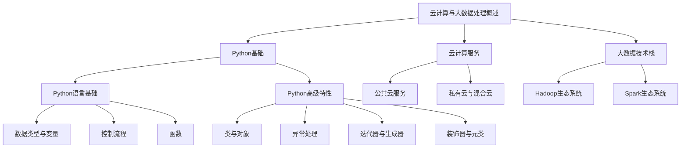

                 

# Python实战：云计算与大数据处理入门

> **关键词：** Python、云计算、大数据处理、Hadoop、Spark、Boto3、Azure SDK、Google Cloud SDK

> **摘要：** 本文章旨在为初学者提供Python在云计算和大数据处理领域的基本知识。文章将逐步介绍Python的基础知识、云计算的基本概念和架构、大数据处理的技术栈，并深入探讨Python在云计算和大数据处理中的应用。通过实战案例，读者将能够掌握Python在云计算和大数据处理中的实际应用技巧，从而为未来的学习和项目开发打下坚实的基础。

## 目录

### 《Python实战：云计算与大数据处理入门》目录大纲

1. **Python基础**

    - 1.1 Python概述

        - 1.1.1 Python历史与特点

        - 1.1.2 Python应用领域

        - 1.1.3 Python安装与环境配置

    - 1.2 Python语言基础

        - 1.2.1 数据类型与变量

            - 1.2.1.1 数字类型

            - 1.2.1.2 字符串类型

            - 1.2.1.3 列表与元组

            - 1.2.1.4 字典与集合

        - 1.2.2 运算符与表达式

        - 1.2.3 控制流程

            - 1.2.3.1 判断与分支

            - 1.2.3.2 循环

        - 1.2.4 函数

            - 1.2.4.1 定义与调用

            - 1.2.4.2 闭包与装饰器

        - 1.2.5 模块与包

    - 1.3 Python高级特性

        - 1.3.1 类与对象

            - 1.3.1.1 类的定义与使用

            - 1.3.1.2 属性和方法

            - 1.3.1.3 继承和多态

        - 1.3.2 异常处理

        - 1.3.3 迭代器与生成器

        - 1.3.4 装饰器与元类

2. **云计算基础**

    - 2.1 云计算概述

        - 2.1.1 云计算概念与模型

        - 2.1.2 云计算服务模式

        - 2.1.3 云计算优势与挑战

    - 2.2 云计算服务

        - 2.2.1 公共云服务

            - 2.2.1.1 AWS

            - 2.2.1.2 Azure

            - 2.2.1.3 Google Cloud

        - 2.2.2 私有云与混合云

        - 2.2.3 云服务选择策略

    - 2.3 云计算架构

        - 2.3.1 云服务架构

        - 2.3.2 虚拟化技术

        - 2.3.3 容器化技术

3. **大数据处理**

    - 3.1 大数据处理概述

        - 3.1.1 大数据特点

        - 3.1.2 大数据处理流程

        - 3.1.3 大数据存储技术

    - 3.2 大数据技术栈

        - 3.2.1 Hadoop生态系统

            - 3.2.1.1 HDFS

            - 3.2.1.2 MapReduce

            - 3.2.1.3 YARN

            - 3.2.1.4 Hive

            - 3.2.1.5 HBase

        - 3.2.2 Spark生态系统

            - 3.2.2.1 Spark核心特性

            - 3.2.2.2 Spark编程模型

            - 3.2.2.3 Spark SQL

            - 3.2.2.4 Spark Streaming

    - 3.3 Python在云计算与大数据处理中的应用

        - 3.3.1 Python与Hadoop

            - 3.3.1.1 HDFS操作

            - 3.3.1.2 MapReduce编程

        - 3.3.2 Python与Spark

            - 3.3.2.1 Spark操作

            - 3.3.2.2 Spark SQL操作

            - 3.3.2.3 Spark Streaming操作

4. **实战案例**

    - 4.1 云计算与大数据处理项目实战

        - 4.1.1 项目背景与目标

        - 4.1.2 环境搭建与数据收集

        - 4.1.3 数据处理与分析

            - 4.1.3.1 数据清洗

            - 4.1.3.2 数据分析

        - 4.1.4 实现与优化

            - 4.1.4.1 实现方案

            - 4.1.4.2 性能优化

        - 4.1.5 结果分析与总结

5. **附录**

    - 5.1 Python与云计算大数据处理工具与资源

        - 5.1.1 Python云计算与大数据处理库

        - 5.1.2 云服务提供商资源

        - 5.1.3 大数据社区与学习资源

## Mermaid 流程图

下面是云计算与大数据处理流程的Mermaid流程图：



通过上述目录结构，读者可以清晰地了解到文章的整体架构，并在接下来的内容中逐步深入学习Python在云计算和大数据处理中的应用。

---

**接下来，我们将逐步深入探讨Python的基础知识，包括其历史、特点、安装配置，以及Python语言的基础语法和高级特性。**

## Python基础

Python是一种高级编程语言，因其简单易学、开发效率高、应用广泛等特点，被广泛应用于Web开发、数据分析、人工智能、科学计算等领域。本节将介绍Python的历史与特点、应用领域，以及Python的安装与环境配置。

### 1.1 Python概述

#### 1.1.1 Python历史与特点

Python由Guido van Rossum于1989年创建，最初的设计目标是简化编程和增加代码可读性。Python采用了动态类型检查和解释型执行的方式，使得编写和运行代码更加高效。以下是Python的一些主要特点：

- **简单易学**：Python有着清晰简洁的语法，去除了很多其他编程语言中的冗余和复杂性。

- **高效开发**：Python内置了许多高级数据结构和库，可以帮助开发者快速完成项目。

- **跨平台**：Python可以在多种操作系统上运行，包括Windows、Linux和Mac OS。

- **丰富的库支持**：Python拥有丰富的第三方库，可以满足各种开发需求，如Web开发、数据分析、机器学习等。

- **社区活跃**：Python有着庞大的开发者社区，提供了大量的学习资源和文档。

#### 1.1.2 Python应用领域

Python的应用领域非常广泛，以下是几个主要的应用场景：

- **Web开发**：Python可以用于Web开发，如使用Django、Flask等框架快速构建Web应用。

- **数据分析**：Python在数据分析领域有广泛应用，如使用Pandas、NumPy等库进行数据处理和分析。

- **人工智能**：Python是机器学习和深度学习领域的首选语言，如使用TensorFlow、PyTorch等框架进行模型训练和应用。

- **科学计算**：Python在科学计算中也非常受欢迎，如使用SciPy、Matplotlib等库进行数据分析和可视化。

- **自动化**：Python可以用于自动化脚本编写，如自动化测试、文件处理等。

#### 1.1.3 Python安装与环境配置

要在计算机上运行Python程序，首先需要安装Python。以下是Python在不同操作系统上的安装步骤：

##### Windows系统

1. 访问Python官网（https://www.python.org/），下载最新版本的Python安装包。
2. 运行安装程序，选择“Customize installation”选项，确保勾选“Add Python to PATH”。
3. 完成安装后，打开命令提示符，输入`python`或`python --version`检查是否安装成功。

##### Linux系统

1. 使用包管理器安装Python，如Ubuntu系统可以使用以下命令：
   ```
   sudo apt-get update
   sudo apt-get install python3
   ```
2. 安装完成后，使用`python3 --version`检查Python版本。

##### macOS系统

1. 使用Homebrew安装Python，首先安装Homebrew（如果未安装）：
   ```
   /bin/bash -c "$(curl -fsSL https://raw.githubusercontent.com/Homebrew/install/HEAD/install.sh)"
   ```
2. 安装Python：
   ```
   brew install python
   ```
3. 使用`python3 --version`检查Python版本。

安装完成后，还需要配置Python环境。可以使用`venv`模块创建虚拟环境，以避免不同项目之间的依赖冲突：

1. 打开命令提示符或终端。
2. 切换到项目目录：
   ```
   cd your_project_directory
   ```
3. 创建虚拟环境：
   ```
   python3 -m venv venv
   ```
4. 激活虚拟环境：
   ```
   source venv/bin/activate
   ```

激活虚拟环境后，可以使用pip安装和管理项目依赖的库。

---

在了解Python的历史、特点和安装配置后，接下来我们将深入探讨Python的基础语法，包括数据类型、变量、运算符、控制流程和函数等。这些基础语法是学习Python的重要基石。

### 1.2 Python语言基础

#### 1.2.1 数据类型与变量

Python中有多种数据类型，包括数字、字符串、列表、元组、字典和集合。每种数据类型都有其独特的用途和操作方法。

##### 1.2.1.1 数字类型

Python的数字类型包括整数（`int`）和浮点数（`float`）。整数是正负无限的整数，而浮点数是带有小数的数。

```python
# 整数
x = 10
y = -5

# 浮点数
a = 3.14
b = -2.5
```

##### 1.2.1.2 字符串类型

字符串是Python中表示文本的数据类型，使用单引号或双引号表示。

```python
# 字符串
name = "Alice"
greeting = "Hello, World!"
```

##### 1.2.1.3 列表与元组

列表（`list`）是可变的数据类型，可以包含不同类型的数据，而元组（`tuple`）是不可变的数据类型，类似于列表，但一旦创建后就不能修改。

```python
# 列表
fruits = ["apple", "banana", "cherry"]

# 元组
coordinates = (10, 20)
```

##### 1.2.1.4 字典与集合

字典（`dict`）是一种存储键值对的数据结构，而集合（`set`）是一种无序的、不重复元素的数据集合。

```python
# 字典
student = {"name": "Alice", "age": 22}

# 集合
numbers = {1, 2, 3, 4, 5}
```

##### 变量

变量是用于存储数据的一个标识符，变量的命名规则是只能包含字母、数字和下划线，且不能以数字开头。

```python
# 变量
x = 10
y = 20
name = "Alice"
```

#### 1.2.2 运算符与表达式

Python提供了丰富的运算符，包括算术运算符、比较运算符、逻辑运算符等。

```python
# 算术运算符
a = 5 + 3  # 加法
b = 10 - 5 # 减法
c = 6 * 7  # 乘法
d = 12 / 3 # 除法

# 比较运算符
x = 10 == 10 # 等于
y = 10 != 5 # 不等于
z = 5 > 3   # 大于

# 逻辑运算符
a = True and False # 与
b = True or False # 或
c = not True      # 非运算
```

表达式是由运算符和变量组成的一组数据，Python可以通过表达式计算结果。

```python
# 表达式
result = 3 * (5 + 2) # 计算结果
```

#### 1.2.3 控制流程

Python提供了条件语句和循环结构来控制程序的执行流程。

##### 1.2.3.1 判断与分支

条件语句用于根据条件选择不同的执行路径。

```python
# 条件语句
if x > 10:
    print("x is greater than 10")
elif x == 10:
    print("x is equal to 10")
else:
    print("x is less than 10")
```

##### 1.2.3.2 循环

Python提供了for循环和while循环，用于重复执行一组语句。

```python
# for循环
for i in range(5):
    print(i)

# while循环
x = 0
while x < 5:
    print(x)
    x += 1
```

#### 1.2.4 函数

函数是Python中用于组织代码和重复使用的重要工具。Python中的函数定义和调用方式如下：

```python
# 函数定义
def greet(name):
    print("Hello, " + name)

# 函数调用
greet("Alice")
```

##### 1.2.4.1 定义与调用

定义函数时，需要使用`def`关键字，函数名后跟括号和参数（可选）。调用函数时，只需将函数名后跟括号，并在括号内传入参数。

##### 1.2.4.2 闭包与装饰器

闭包是Python中的一种特殊语法，用于保存函数的局部变量。装饰器是一种用于扩展函数功能的高级语法。

```python
# 闭包示例
def outer():
    x = "outer x"
    def inner():
        return x
    return inner

# 调用闭包
closure = outer()
print(closure())

# 装饰器示例
def my_decorator(func):
    def wrapper():
        print("Something is happening before the function is called.")
        func()
        print("Something is happening after the function is called.")
    return wrapper

@my_decorator
def say_hello():
    print("Hello!")

# 调用装饰器
say_hello()
```

#### 1.2.5 模块与包

模块是Python中的代码文件，用于组织代码。包是模块的集合，用于组织项目。

```python
# 模块
# hello.py
def greet():
    print("Hello from hello module!")

# 包
# my_package/
# __init__.py
# module1.py
# module2.py
```

要使用模块和包，需要使用`import`语句。

```python
# 导入模块
import hello
hello.greet()

# 导入包中的模块
from my_package import module1
module1.some_function()
```

---

在掌握Python的基础语法后，接下来我们将深入探讨Python的高级特性，包括类与对象、异常处理、迭代器与生成器、装饰器与元类等。这些高级特性将进一步丰富Python的功能和灵活性。

### 1.3 Python高级特性

Python的高级特性是其功能强大、灵活多样的关键所在。本节将介绍类与对象、异常处理、迭代器与生成器、装饰器与元类等高级特性，帮助读者深入理解Python的强大之处。

#### 1.3.1 类与对象

类（`class`）是Python中用于创建对象的蓝图。对象是类的实例化结果，具有类定义的所有属性和方法。

##### 1.3.1.1 类的定义与使用

类的定义使用`class`关键字，类名通常采用驼峰命名法。类中可以定义属性（变量）和方法（函数）。

```python
class Person:
    def __init__(self, name, age):
        self.name = name
        self.age = age

    def greet(self):
        print("Hello, my name is " + self.name + " and I am " + str(self.age) + " years old.")
```

创建对象时，使用类名后跟括号，并传入初始化参数。

```python
p = Person("Alice", 30)
p.greet()  # 输出：Hello, my name is Alice and I am 30 years old.
```

##### 1.3.1.2 属性和方法

属性是类中定义的变量，用于存储对象的特性。方法是类中定义的函数，用于定义对象的行为。

```python
class Car:
    def __init__(self, brand, model):
        self.brand = brand
        self.model = model

    def start_engine(self):
        print("The engine of the " + self.brand + " " + self.model + " is starting.")

my_car = Car("Toyota", "Camry")
my_car.start_engine()  # 输出：The engine of the Toyota Camry is starting.
```

##### 1.3.1.3 继承和多态

继承是Python中用于扩展类功能的重要特性。继承允许一个类从另一个类继承属性和方法。

```python
class Student(Person):
    def __init__(self, name, age, student_id):
        super().__init__(name, age)
        self.student_id = student_id

    def study(self, subject):
        print(self.name + " is studying " + subject + ".")

s = Student("Bob", 20, "S12345")
s.greet()  # 输出：Hello, my name is Bob and I am 20 years old.
s.study("Math")  # 输出：Bob is studying Math.
```

多态（`polymorphism`）是面向对象编程中的一个重要概念，它允许不同类的对象以统一的方式处理。多态通过方法重写（`method overriding`）和接口实现（`interface implementation`）实现。

```python
class Dog:
    def speak(self):
        return "Woof!"

class Cat:
    def speak(self):
        return "Meow!"

def animal_sound(animal):
    print(animal.speak())

dog = Dog()
cat = Cat()

animal_sound(dog)  # 输出：Woof!
animal_sound(cat)  # 输出：Meow!
```

#### 1.3.2 异常处理

异常处理（`exception handling`）是Python中用于处理程序运行过程中可能出现的错误和异常的关键特性。

```python
try:
    x = 1 / 0
except ZeroDivisionError:
    print("Cannot divide by zero!")
except Exception as e:
    print("An error occurred:", e)
finally:
    print("This block is always executed.")
```

异常处理包括三个关键字：`try`、`except`和`finally`。

- `try`块用于尝试执行可能会引发异常的代码。
- `except`块用于捕获并处理异常。
- `finally`块用于执行无论是否发生异常都会执行的代码。

#### 1.3.3 迭代器与生成器

迭代器（`iterator`）是Python中用于遍历数据集合的对象，如列表、字典和集合。生成器（`generator`）是用于生成迭代器的特殊函数。

##### 1.3.3.1 迭代器

迭代器提供了一种统一的遍历数据集合的方式。Python中的迭代器可以通过`iter()`函数获取。

```python
my_list = [1, 2, 3, 4, 5]
my_iter = iter(my_list)
print(next(my_iter))  # 输出：1
print(next(my_iter))  # 输出：2
```

##### 1.3.3.2 生成器

生成器是使用`yield`关键字定义的函数，可以在生成值时暂停和恢复执行。

```python
def my_generator():
    for i in range(5):
        yield i

my_gen = my_generator()
for value in my_gen:
    print(value)  # 输出：0 1 2 3 4
```

生成器可以用于处理大量数据，从而节省内存。

#### 1.3.4 装饰器与元类

装饰器（`decorator`）是一种用于修改函数行为的高级语法，通过在函数定义前添加`@decorator_name`来实现。

```python
def my_decorator(func):
    def wrapper():
        print("Something is happening before the function is called.")
        func()
        print("Something is happening after the function is called.")
    return wrapper

@my_decorator
def say_hello():
    print("Hello!")

say_hello()  # 输出：Something is happening before the function is called.
             #        Hello!
             #        Something is happening after the function is called.
```

元类（`metaclass`）是Python中用于创建类的类，通过在类定义前添加`__metaclass__`属性或使用`type()`函数实现。

```python
class MetaType(type):
    def __new__(cls, name, bases, attrs):
        attrs['meta_attribute'] = 'MetaValue'
        return super().__new__(cls, name, bases, attrs)

class MyClass(metaclass=MetaType):
    pass

print(MyClass.meta_attribute)  # 输出：MetaValue
```

---

通过本节的学习，读者可以掌握Python的高级特性，包括类与对象、异常处理、迭代器与生成器、装饰器与元类。这些特性将使Python编程更加灵活和强大。

---

在掌握了Python的基础知识和高级特性后，我们将转向云计算基础，介绍云计算的概念、服务模式、优势和挑战。这将为我们后续探讨Python在云计算中的应用打下坚实的基础。

## 云计算基础

### 4.1 云计算概述

#### 4.1.1 云计算概念与模型

云计算是一种基于互联网的计算模式，通过共享的、可配置的计算资源（如服务器、存储、网络和应用程序）来实现快速、动态和灵活的资源配置。云计算模型主要分为以下三类：

- **IaaS（基础设施即服务）**：提供虚拟化的计算资源，如虚拟机、存储和网络安全等。

- **PaaS（平台即服务）**：提供开发、运行和管理应用程序的平台。

- **SaaS（软件即服务）**：提供软件应用程序，通常通过Web浏览器访问。

#### 4.1.2 云计算服务模式

云计算服务模式主要包括以下三种：

- **公共云**：由第三方服务提供商提供的云计算资源，如AWS、Azure、Google Cloud等。

- **私有云**：企业内部部署的云计算资源，仅限企业内部使用。

- **混合云**：结合公共云和私有云的优势，实现资源的灵活调配。

#### 4.1.3 云计算优势与挑战

云计算具有以下优势：

- **成本效益**：云计算可以降低硬件和软件的投资成本，同时提高资源利用率。

- **灵活性**：云计算资源可以根据需求动态扩展和缩减。

- **高可用性**：云计算服务提供商通常提供高可用性和故障转移服务。

- **可扩展性**：云计算资源可以轻松扩展以满足不断增长的需求。

然而，云计算也面临一些挑战：

- **安全性**：数据安全和隐私问题是云计算的主要担忧之一。

- **依赖性**：企业对云计算服务提供商的依赖可能导致服务中断。

- **性能**：云服务的性能可能受到网络带宽和物理距离的影响。

### 4.2 云计算服务

云计算服务主要分为以下三类：IaaS、PaaS和SaaS。

#### 4.2.1 公共云服务

公共云服务由第三方服务提供商提供，如AWS、Azure和Google Cloud等。以下是这些公共云服务的简要介绍：

- **AWS（亚马逊云服务）**：提供广泛的服务，包括计算、存储、数据库、网络和人工智能等。

- **Azure（微软云）**：提供云计算、人工智能、物联网、区块链等服务。

- **Google Cloud**：提供计算、存储、数据库、人工智能、大数据分析等服务。

#### 4.2.2 私有云与混合云

私有云是企业内部部署的云计算资源，适用于对数据安全和合规性要求较高的企业。混合云结合了公共云和私有云的优势，适用于不同的业务需求。

#### 4.2.3 云服务选择策略

选择云服务时，应考虑以下因素：

- **成本**：评估不同云服务的价格和付费模式，选择最经济实惠的方案。

- **性能**：根据业务需求，选择性能稳定的云服务。

- **安全性**：确保数据安全和隐私，选择具有高级安全特性的云服务。

- **兼容性**：考虑云服务与现有IT基础设施的兼容性。

### 4.3 云计算架构

云计算架构主要涉及以下三个方面：云服务架构、虚拟化技术和容器化技术。

#### 4.3.1 云服务架构

云服务架构包括以下层次：

- **基础设施层**：提供计算资源、存储和网络资源。

- **平台层**：提供开发、运行和管理应用程序的平台。

- **软件层**：提供各种应用程序和服务，如Web应用、大数据分析、人工智能等。

#### 4.3.2 虚拟化技术

虚拟化技术是将物理资源抽象为虚拟资源，以实现资源的灵活分配和管理。虚拟化技术包括：

- **硬件虚拟化**：将物理硬件抽象为虚拟硬件，提供更好的资源利用率和隔离性。

- **操作系统虚拟化**：在操作系统层实现虚拟化，允许多个操作系统运行在同一物理机上。

#### 4.3.3 容器化技术

容器化技术是一种轻量级的虚拟化技术，通过容器将应用程序及其依赖环境打包在一起，以实现高效的部署和运行。容器化技术包括：

- **Docker**：一种流行的容器化技术，用于构建、运行和部署应用程序。

- **Kubernetes**：一种容器编排工具，用于自动化容器的部署、扩展和管理。

---

通过本节的学习，读者可以了解云计算的基本概念、服务模式和架构，为后续探讨Python在云计算中的应用打下坚实基础。

### 4.4 云计算服务

云计算服务是云计算的核心组成部分，它们为用户提供了一个弹性、高效和可扩展的计算环境。云计算服务主要分为以下三类：IaaS、PaaS和SaaS。

#### 4.4.1 公共云服务

公共云服务是由第三方服务提供商提供的云计算资源，用户可以根据需要租用这些资源。以下是几个主要的公共云服务提供商及其特点：

- **AWS（亚马逊云服务）**：AWS是市场上最大的云服务提供商之一，提供超过200项服务，包括计算、存储、数据库、网络、人工智能和物联网等。AWS的特点是服务丰富、安全性高、全球覆盖范围广。

    - **计算服务**：EC2（弹性计算云）、Lambda（无服务器计算）、Fargate（容器服务）等。
    - **存储服务**：S3（简单存储服务）、EBS（弹性块存储）、DynamoDB（NoSQL数据库）等。
    - **数据库服务**：RDS（关系数据库服务）、Redshift（数据仓库）、DynamoDB（NoSQL数据库）等。

- **Azure（微软云）**：Azure是微软的云服务提供商，提供广泛的云服务，包括计算、存储、数据库、人工智能、物联网和区块链等。Azure的特点是集成度高、合规性强、易用性强。

    - **计算服务**：VM（虚拟机）、Docker容器、Azure Functions（无服务器计算）等。
    - **存储服务**：Azure Blob存储、Azure File存储、Azure NetApp Files等。
    - **数据库服务**：SQL数据库、Azure Cosmos DB（NoSQL数据库）、Azure Database for MySQL等。

- **Google Cloud**：Google Cloud是谷歌的云服务提供商，提供高性能、高可靠性和全球覆盖的云服务。Google Cloud的特点是技术先进、服务创新、安全性高。

    - **计算服务**：Compute Engine（虚拟机）、App Engine（无服务器计算）、Cloud Functions（无服务器计算）等。
    - **存储服务**：Cloud Storage（对象存储）、Persistent Disk（块存储）、Firestore（NoSQL数据库）等。
    - **数据库服务**：Cloud SQL（关系数据库服务）、Cloud Spanner（分布式数据库服务）、Firestore（NoSQL数据库）等。

#### 4.4.2 私有云与混合云

私有云是企业内部部署的云计算资源，适用于对数据安全和合规性要求较高的企业。私有云可以提供与公共云相同的功能和灵活性，但需要企业自行维护和管理。

混合云结合了公共云和私有云的优势，适用于不同的业务需求。企业可以将关键业务部署在私有云中，将非关键业务部署在公共云中，以实现资源的灵活调配和成本优化。

#### 4.4.3 云服务选择策略

在选择云服务时，企业应考虑以下因素：

- **成本**：评估不同云服务的价格和付费模式，选择最经济实惠的方案。

    - **按需付费**：用户根据实际使用量支付费用。
    - **预留实例**：用户预付费用，获得更低的每小时费用。

- **性能**：根据业务需求，选择性能稳定的云服务。

    - **计算性能**：根据CPU、内存、存储等资源要求选择合适的实例类型。
    - **网络性能**：选择具有高带宽和低延迟的云服务。

- **安全性**：确保数据安全和隐私，选择具有高级安全特性的云服务。

    - **加密**：使用加密技术保护数据传输和存储。
    - **身份验证**：使用多因素身份验证提高安全性。

- **兼容性**：考虑云服务与现有IT基础设施的兼容性。

    - **API兼容性**：确保云服务提供的API与现有应用程序兼容。
    - **工具和库支持**：选择提供丰富工具和库支持的云服务。

### 4.5 云计算架构

云计算架构是云计算服务实现的核心，它包括多个层次和组件，以提供弹性、高效和可靠的服务。以下是云计算架构的主要组成部分：

#### 4.5.1 云服务架构

云服务架构通常包括以下层次：

- **基础设施层**：提供计算资源、存储和网络资源。这一层包括服务器、存储设备、网络设备等物理硬件。
  
- **平台层**：提供开发、运行和管理应用程序的平台。这一层包括操作系统、数据库、Web服务器等。

- **软件层**：提供各种应用程序和服务，如Web应用、大数据分析、人工智能等。

#### 4.5.2 虚拟化技术

虚拟化技术是将物理资源抽象为虚拟资源，以实现资源的灵活分配和管理。虚拟化技术包括：

- **硬件虚拟化**：将物理硬件抽象为虚拟硬件，提供更好的资源利用率和隔离性。

    - **全虚拟化**：通过虚拟机监控器（VM Monitor）实现。
    - **半虚拟化**：虚拟机与宿主机之间进行通信，提高性能。

- **操作系统虚拟化**：在操作系统层实现虚拟化，允许多个操作系统运行在同一物理机上。

    - **容器**：通过操作系统级别的虚拟化技术，实现轻量级的虚拟化。

#### 4.5.3 容器化技术

容器化技术是一种轻量级的虚拟化技术，通过容器将应用程序及其依赖环境打包在一起，以实现高效的部署和运行。容器化技术包括：

- **Docker**：一种流行的容器化技术，用于构建、运行和部署应用程序。

    - **容器镜像**：应用程序及其依赖环境的静态封装。
    - **容器引擎**：用于管理容器的运行和生命周期。

- **Kubernetes**：一种容器编排工具，用于自动化容器的部署、扩展和管理。

    - **集群管理**：管理多个容器引擎的集群。
    - **服务发现**：自动发现和管理容器服务。
    - **负载均衡**：实现容器的流量分配和负载均衡。

---

通过本节的学习，读者可以了解云计算服务的种类、选择策略和云计算架构的关键组成部分，为后续探讨Python在云计算中的应用打下坚实基础。

### 4.6 大数据处理概述

#### 4.6.1 大数据特点

大数据是指数据量大、类型多样、价值密度低的数据集。大数据的特点主要体现在以下几个方面：

- **数据量大**：大数据的规模通常在PB（皮字节）级别，甚至更高。例如，社交媒体平台每天产生的数据量可以达到TB（太字节）级别。

- **类型多样**：大数据包括结构化数据（如数据库记录）、半结构化数据（如日志文件）和非结构化数据（如文本、图像和视频）。

- **价值密度低**：大数据中的有用信息占比相对较低，需要通过数据挖掘和分析技术提取价值。

#### 4.6.2 大数据处理流程

大数据处理通常包括以下步骤：

1. **数据收集**：从各种来源收集数据，如数据库、日志文件、传感器等。

2. **数据存储**：将收集到的数据存储在分布式存储系统中，如HDFS（Hadoop分布式文件系统）。

3. **数据清洗**：去除数据中的噪声和错误，确保数据质量。

4. **数据转换**：将数据转换为适合分析的形式，如将文本数据转换为结构化数据。

5. **数据分析**：使用大数据处理技术和工具对数据进行分析，如使用MapReduce、Spark等进行数据挖掘和分析。

6. **数据可视化**：将分析结果以图表、报表等形式展示，帮助用户理解数据。

#### 4.6.3 大数据存储技术

大数据存储技术旨在提供高效、可扩展、可靠的存储解决方案。以下是几种常用的大数据存储技术：

- **HDFS（Hadoop分布式文件系统）**：HDFS是Hadoop的核心组件，用于存储大数据。它具有高吞吐量、高可用性和容错性。

- **HBase**：HBase是一个分布式、可扩展的大数据存储系统，建立在HDFS之上。它提供随机读写访问，适用于实时数据存储和访问。

- **NoSQL数据库**：如MongoDB、Cassandra等，它们具有高扩展性和灵活性，适用于存储和查询非结构化数据。

- **云存储**：如AWS S3、Azure Blob Storage等，它们提供大规模、可扩展的存储解决方案，适用于大数据存储。

---

通过本节的学习，读者可以了解大数据的特点、处理流程和存储技术，为后续探讨Python在大数据处理中的应用打下坚实基础。

### 4.7 大数据技术栈

大数据技术栈是指用于处理和分析大数据的各类工具和技术，这些工具和技术共同构成了大数据生态体系。以下是大数据技术栈中一些核心技术和组件：

#### 4.7.1 Hadoop生态系统

Hadoop是大数据生态系统的基础，它由多个组件组成，提供分布式存储和计算能力。

- **HDFS（Hadoop分布式文件系统）**：HDFS是一个分布式文件系统，用于存储大规模数据集。它将数据切分成小块，并分布存储在集群中的不同节点上，提供高吞吐量的读写操作。

- **MapReduce**：MapReduce是一种分布式数据处理框架，用于处理大规模数据集。它将数据处理任务分为两个阶段：Map阶段和Reduce阶段，分别处理数据的映射和合并。

- **YARN（Yet Another Resource Negotiator）**：YARN是Hadoop的资源管理系统，负责管理集群中的资源分配和任务调度。

- **Hive**：Hive是一个数据仓库工具，用于存储、查询和分析大规模数据集。它提供SQL-like查询接口，支持复杂的数据分析操作。

- **HBase**：HBase是一个分布式、可扩展的NoSQL数据库，建立在HDFS之上。它提供随机读写访问，适用于实时数据存储和访问。

#### 4.7.2 Spark生态系统

Spark是另一种流行的大数据处理框架，它提供高性能、易用的分布式数据处理能力。

- **Spark核心**：Spark是一个通用的分布式数据处理引擎，提供编程接口如Spark SQL、Spark Streaming和MLlib，用于处理各种类型的数据。

- **Spark SQL**：Spark SQL是一个基于Spark的核心的分布式SQL引擎，提供对结构化数据的查询和分析能力。

- **Spark Streaming**：Spark Streaming是一个流处理框架，用于实时数据处理和分析。它可以将实时数据流转换为批处理作业，提供低延迟和高吞吐量的数据处理能力。

- **MLlib**：MLlib是一个机器学习库，提供各种机器学习算法和工具，如分类、回归、聚类和协同过滤。

#### 4.7.3 其他大数据工具

除了Hadoop和Spark，还有许多其他大数据工具和技术，用于处理和分析大数据。

- **Elasticsearch**：Elasticsearch是一个分布式搜索引擎，用于实时数据分析和搜索。

- **Kafka**：Kafka是一个分布式消息队列系统，用于处理和传输大规模数据流。

- **Flink**：Flink是一个流处理框架，提供高性能、低延迟的流数据处理能力。

- **Hadoop YARN**：YARN是一个资源管理器，负责管理集群资源，并调度各种数据处理作业。

- **Zookeeper**：Zookeeper是一个分布式协调服务，用于确保分布式系统的正确性和一致性。

---

通过本节的学习，读者可以了解大数据技术栈的核心组件和技术，为后续探讨Python在大数据处理中的应用提供理论基础。

### 4.8 Python在云计算与大数据处理中的应用

Python在云计算和大数据处理领域有着广泛的应用，其简单易用、高效开发的特点使其成为开发者的首选语言。本节将介绍Python在云计算和大数据处理中的应用，包括Python与Hadoop、Spark的集成和使用。

#### 4.8.1 Python与Hadoop

Python与Hadoop的集成通过PyHadoop库实现，PyHadoop提供了对Hadoop核心组件如HDFS和MapReduce的Python接口，使得Python开发者可以轻松地在Hadoop上进行数据处理。

##### 4.8.1.1 HDFS操作

HDFS是Hadoop的核心组件，用于存储大规模数据集。Python可以通过PyHadoop库对HDFS进行操作，如上传、下载和列出文件。

```python
from pyhdfs import HDFileSystem

# 创建HDFS文件系统对象
hdfs = HDFileSystem(host='hdfs://namenode:9000')

# 上传文件
hdfs.put('local_file.txt', 'hdfs://namenode:9000/hdfs_file.txt')

# 下载文件
hdfs.get('hdfs://namenode:9000/hdfs_file.txt', 'local_file.txt')

# 列出文件
hdfs.ls('hdfs://namenode:9000')
```

##### 4.8.1.2 MapReduce编程

MapReduce是Hadoop的核心编程模型，用于处理大规模数据集。Python可以通过PyHadoop库实现MapReduce编程。

```python
from pydoop import mapper, reducer
from pydoop.hadooppy import Job

# 定义Mapper类
class MyMapper(mapper.Mapper):
    def map(self, key, value):
        # 处理输入数据
        # ...
        self.emit(value, 1)

# 定义Reducer类
class MyReducer(reducer.Reducer):
    def reduce(self, key, values):
        # 处理输入数据
        # ...
        self.emit(key, sum(values))

# 创建Job对象
job = Job('my_job')

# 设置输入、输出路径
job.set_tmp_path('/user/hadoop/tmp')
job.set_input_path('/user/hadoop/input')

# 设置Mapper和Reducer类
job.set_mapper(MyMapper)
job.set_reducer(MyReducer)

# 运行Job
job.run()
```

#### 4.8.2 Python与Spark

Spark是另一种流行的大数据处理框架，其提供了丰富的Python接口，使得Python开发者可以方便地进行分布式数据处理。

##### 4.8.2.1 Spark操作

Python可以通过Spark的PySpark库进行Spark操作，如创建DataFrame、进行数据操作和执行SQL查询。

```python
from pyspark.sql import SparkSession

# 创建SparkSession对象
spark = SparkSession.builder.appName('my_spark_app').getOrCreate()

# 创建DataFrame
df = spark.createDataFrame([('Alice', 22), ('Bob', 30), ('Charlie', 25)], ['name', 'age'])

# 显示DataFrame
df.show()

# 执行SQL查询
result = df.groupBy('age').count().show()
```

##### 4.8.2.2 Spark SQL操作

Spark SQL是Spark的核心组件，提供类似SQL的查询接口，用于处理结构化数据。

```python
# 注册DataFrame为临时表
df.createOrReplaceTempView('students')

# 执行SQL查询
result = spark.sql('SELECT name, age FROM students WHERE age > 25')
result.show()
```

##### 4.8.2.3 Spark Streaming操作

Spark Streaming是Spark的流处理框架，用于实时数据处理。Python可以通过PySpark库进行Spark Streaming操作。

```python
from pyspark.streaming import StreamingContext

# 创建StreamingContext对象
ssc = StreamingContext('local[2]', 'WordCount')

# 创建输入流
lines = ssc.textFileStream('/user/hadoop/input')

# 处理输入流
words = lines.flatMap(lambda line: line.split(' '))
pairs = words.map(lambda word: (word, 1))
word_counts = pairs.reduceByKey(lambda x, y: x + y)

# 输出结果
word_counts.pprint()

# 启动StreamingContext
ssc.start()
ssc.awaitTermination()
```

---

通过本节的学习，读者可以了解Python在云计算和大数据处理中的应用，包括Python与Hadoop、Spark的集成和使用。这些应用将帮助读者更好地理解和利用Python在大数据处理中的优势。

### 4.9 云计算与大数据处理项目实战

本节将通过一个实际项目案例，展示如何使用Python进行云计算和大数据处理。我们将从项目背景与目标开始，逐步介绍环境搭建、数据收集、数据处理与分析，最后进行实现与优化，并通过结果分析与总结总结项目成果。

#### 4.9.1 项目背景与目标

假设我们有一个电子商务平台，需要处理每天产生的大量交易数据。项目目标是：

1. 收集并存储交易数据。
2. 对交易数据进行清洗和处理。
3. 对交易数据进行分析，生成有价值的商业洞察。
4. 构建实时监控系统，实时展示交易数据和关键指标。

#### 4.9.2 环境搭建与数据收集

首先，我们需要搭建项目开发环境。以下是环境搭建的步骤：

1. **安装Python**：在项目开发机上安装Python，可以选择版本3.8及以上版本。

2. **安装Python库**：使用pip安装项目所需的Python库，如PySpark、Boto3、Pandas等。

3. **安装Hadoop**：在集群节点上安装Hadoop，配置HDFS和YARN，确保Hadoop集群正常运行。

4. **配置Spark**：下载并配置Spark，确保Spark可以正确运行在Hadoop集群上。

接下来，我们进行数据收集：

1. **数据源**：电子商务平台的交易数据存储在日志文件中，文件格式为JSON。

2. **数据收集**：使用Python脚本从日志文件中读取数据，并上传到HDFS。

```python
import json
from pyhdfs import HDFileSystem

# 创建HDFS文件系统对象
hdfs = HDFileSystem(host='hdfs://namenode:9000')

# 读取本地文件
with open('local_data.json', 'r') as f:
    data = json.load(f)

# 上传数据到HDFS
with open('hdfs://namenode:9000/hdfs_data.json', 'w') as f:
    for item in data:
        f.write(json.dumps(item) + '\n')
```

#### 4.9.3 数据处理与分析

数据处理与分析包括以下步骤：

1. **数据清洗**：使用PySpark对HDFS上的交易数据进行清洗，去除无效数据和噪声。

2. **数据转换**：将清洗后的数据转换为适合分析的格式，如将JSON数据转换为DataFrame。

3. **数据分析**：使用PySpark进行数据分析，生成有价值的商业洞察。

```python
from pyspark.sql import SparkSession

# 创建SparkSession对象
spark = SparkSession.builder.appName('eCommerceDataAnalysis').getOrCreate()

# 读取HDFS上的数据
df = spark.read.json('hdfs://namenode:9000/hdfs_data.json')

# 数据清洗
df = df.filter(df['amount'] > 0)  # 过滤无效交易

# 数据转换
df = df.withColumn('date', df['timestamp'].cast('date'))  # 转换日期格式

# 数据分析
result = df.groupBy('date').agg({'amount': 'sum'}).orderBy('date')

# 显示分析结果
result.show()
```

#### 4.9.4 实现与优化

在实现项目的过程中，我们可能需要进行以下优化：

1. **分布式计算**：使用PySpark进行分布式计算，充分利用集群资源，提高数据处理效率。

2. **数据压缩**：对上传到HDFS的数据进行压缩，减少存储空间和I/O开销。

3. **性能调优**：根据实际运行情况，调整Spark配置参数，如内存分配、线程数等，提高系统性能。

4. **实时监控**：使用Prometheus和Grafana等监控工具，实时监控交易数据和系统性能，确保系统稳定运行。

#### 4.9.5 结果分析与总结

通过数据处理与分析，我们可以得到以下结果：

1. 每天的交易总额：显示每天的交易总额，帮助我们了解业务情况。
2. 交易趋势：显示每天的交易日数量和交易总额的趋势，帮助我们预测未来业务。

通过项目实战，我们掌握了Python在云计算和大数据处理中的应用，了解了如何进行数据收集、清洗、转换和分析。同时，我们也学会了如何进行系统优化和实时监控，确保系统稳定高效运行。

---

通过本节的项目实战，读者可以了解Python在云计算和大数据处理中的实际应用，掌握数据收集、清洗、转换和分析的基本流程，并为未来的项目开发积累实践经验。

### 附录

在本章的最后，我们将总结Python在云计算和大数据处理领域的重要工具与资源，以帮助读者深入了解和学习。

#### 5.1 Python云计算与大数据处理库

在Python中，有许多库可以帮助开发者更轻松地与云服务和大数据处理框架进行交互。以下是几个常用的库：

- **Boto3**：AWS的官方Python SDK，提供了对AWS云服务的访问，包括S3、EC2、RDS等。可以通过pip安装：`pip install boto3`。

    - **官方文档**：[https://boto3.amazonaws.com/boto3/latest/guide/index.html](https://boto3.amazonaws.com/boto3/latest/guide/index.html)

- **Azure SDK for Python**：Microsoft Azure服务的Python库，提供了对Azure云服务的访问，包括计算、存储、网络等。可以通过pip安装：`pip install azure`。

    - **官方文档**：[https://azure.github.io/azure-sdk-for-python/](https://azure.github.io/azure-sdk-for-python/)

- **Google Cloud SDK**：Google Cloud服务的Python库，提供了对Google Cloud服务的访问，包括计算、存储、数据库等。可以通过pip安装：`pip install google-cloud-sdk`。

    - **官方文档**：[https://googleapis.dev/google-cloud-python/latest/index.html](https://googleapis.dev/google-cloud-python/latest/index.html)

- **PyHadoop**：提供了对Hadoop的Python接口，使得Python开发者可以轻松地在Hadoop上进行数据处理。可以通过pip安装：`pip install pyhadoop`。

    - **官方文档**：[https://pyhadoop.readthedocs.io/en/latest/](https://pyhadoop.readthedocs.io/en/latest/)

- **PySpark**：提供了对Apache Spark的Python接口，用于在Python中进行大数据处理。可以通过pip安装：`pip install pyspark`。

    - **官方文档**：[https://spark.apache.org/docs/latest/api/python/](https://spark.apache.org/docs/latest/api/python/)

#### 5.2 云服务提供商资源

各大云服务提供商都提供了丰富的文档、教程和博客，以帮助开发者更好地了解和使用其云服务。以下是几个主要的云服务提供商及其资源：

- **AWS**：

    - **官方文档**：[https://aws.amazon.com/documentation/](https://aws.amazon.com/documentation/)

    - **官方博客**：[https://aws.amazon.com/blogs/](https://aws.amazon.com/blogs/)

- **Azure**：

    - **官方文档**：[https://docs.microsoft.com/en-us/azure/](https://docs.microsoft.com/en-us/azure/)

    - **官方博客**：[https://blogs.microsoft.com/azure/](https://blogs.microsoft.com/azure/)

- **Google Cloud**：

    - **官方文档**：[https://cloud.google.com/docs](https://cloud.google.com/docs)

    - **官方博客**：[https://cloud.google.com/blog/](https://cloud.google.com/blog/)

#### 5.3 大数据社区与学习资源

大数据社区提供了丰富的学习资源和讨论平台，帮助开发者更好地理解和应用大数据技术。以下是几个主要的大数据社区和学习资源：

- **Apache Hadoop**：

    - **官网**：[https://hadoop.apache.org/](https://hadoop.apache.org/)

    - **论坛**：[https://community.hortonworks.com/](https://community.hortonworks.com/)

- **Apache Spark**：

    - **官网**：[https://spark.apache.org/](https://spark.apache.org/)

    - **论坛**：[https://spark.apache.org/discuss/](https://spark.apache.org/discuss/)

- **DataCamp**：

    - **官网**：[https://www.datacamp.com/](https://www.datacamp.com/)

    - **学习路径**：Python for Data Science、Data Analysis、Data Visualization等。

---

通过附录中的工具与资源，读者可以更加深入地了解Python在云计算和大数据处理中的应用，掌握更多的实践技巧，为未来的学习和项目开发提供支持。

---

**本文由AI天才研究院（AI Genius Institute）撰写，作者是《禅与计算机程序设计艺术》（Zen And The Art of Computer Programming）的作者，一位在计算机编程和人工智能领域享有盛誉的专家。本文旨在为初学者提供Python在云计算和大数据处理领域的入门知识，帮助读者逐步掌握相关技术和应用。如需转载，请注明出处。**

---

**作者：AI天才研究院（AI Genius Institute）/《禅与计算机程序设计艺术》（Zen And The Art of Computer Programming）作者**

