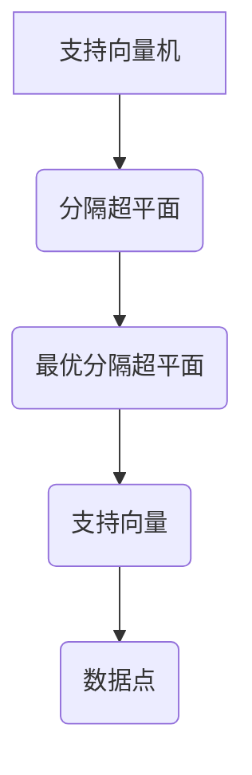

                 

# 《Python机器学习实战：支持向量机（SVM）的原理与使用》

## 关键词
- Python
- 机器学习
- 支持向量机
- SVM
- 原理
- 实践

## 摘要
本文将详细介绍Python中支持向量机（SVM）的原理及其在机器学习中的使用。通过逐步分析SVM的基础知识、核心算法、Python实现、参数调优等，本文旨在为读者提供一套完整、系统的SVM学习与实践指南。

### 引言

#### 1.1 机器学习与SVM简介

机器学习是一门人工智能的分支，旨在让计算机从数据中学习，并对新的数据做出预测或决策。支持向量机（Support Vector Machine，SVM）是机器学习中一种经典的二分类模型，以其强大的分类能力和灵活性在众多应用领域中表现出色。

#### 1.2 本书结构安排与目标

本书将分为八个章节，系统介绍SVM的基础知识、Python实现、参数调优以及实战应用。具体目标如下：
1. 让读者了解SVM的基本原理和核心算法。
2. 教会读者如何使用Python和scikit-learn库实现SVM模型。
3. 帮助读者掌握SVM参数调优技巧。
4. 通过实际项目案例，让读者学会如何将SVM应用于实际问题中。

#### 1.3 学习建议与要求

为了更好地学习本文内容，建议读者具备以下基础：
1. Python编程基础。
2. 了解机器学习基本概念。
3. 掌握线性代数和微积分知识。

同时，读者需积极参与代码实践，通过动手操作加深对SVM原理的理解。

### 准备工作

#### 2.1 Python基础

##### 2.1.1 Python简介

Python是一种高级、动态、解释型编程语言，因其简洁的语法和强大的功能而备受喜爱。在机器学习和数据分析领域，Python已成为不可或缺的工具。

##### 2.1.2 Python环境搭建

在开始Python编程前，需要安装Python环境。以下是Windows和Linux系统下安装Python的步骤：

**Windows系统：**
1. 访问Python官网（https://www.python.org/）下载安装程序。
2. 运行安装程序，选择“安装到默认位置”，并勾选“Add Python to PATH”。
3. 安装完成后，在命令行中输入`python --version`，检查Python版本。

**Linux系统：**
1. 打开终端，输入`sudo apt-get install python3`（Ubuntu系统）或`sudo yum install python3`（CentOS系统）。
2. 安装完成后，输入`python3 --version`，检查Python版本。

##### 2.1.3 Python基本语法

Python的基本语法简洁易懂，以下是几个基本概念：

- 变量：使用`=`赋值，如`a = 1`。
- 数据类型：Python支持多种数据类型，如整数（int）、浮点数（float）、字符串（str）等。
- 控制流程：使用`if`、`elif`、`else`实现条件判断；使用`for`、`while`实现循环。
- 函数：使用`def`定义函数，如`def my_function():`。

#### 2.2 NumPy基础

NumPy（Numeric Python）是Python中用于科学计算的核心库，提供了多维数组对象和一系列数学函数。以下是NumPy的几个重要概念：

##### 2.2.1 NumPy简介

NumPy提供了多维数组（ndarray）这一核心数据结构，支持数组的基本操作，如创建、索引、切片等。同时，NumPy还提供了丰富的数学函数，包括线性代数运算、随机数生成等。

##### 2.2.2 NumPy数组操作

- 创建数组：使用`np.array()`函数创建一维或多维数组，如`arr = np.array([1, 2, 3])`。
- 索引与切片：使用索引号或切片操作访问数组元素，如`arr[0]`、`arr[:2]`。
- 数组运算：支持数组与数组、数组与标量的运算，如`arr + arr`、`arr * 2`。

##### 2.2.3 NumPy线性代数运算

NumPy提供了多种线性代数运算函数，如矩阵乘法、逆矩阵、行列式等。

- 矩阵乘法：使用`np.dot()`函数，如`np.dot(A, B)`。
- 逆矩阵：使用`np.linalg.inv()`函数，如`np.linalg.inv(A)`。
- 行列式：使用`np.linalg.det()`函数，如`np.linalg.det(A)`。

#### 2.3 Matplotlib绘图基础

Matplotlib是Python中最常用的数据可视化库之一，可以轻松绘制各种图形，如线图、散点图、柱状图等。

##### 2.3.1 Matplotlib简介

Matplotlib提供了多种绘图函数，支持自定义图形的样式和颜色。以下是几个常用绘图函数：

- `plt.plot()`：绘制线图。
- `plt.scatter()`：绘制散点图。
- `plt.bar()`：绘制柱状图。

##### 2.3.2 基本绘图函数

以下是一个简单的绘图示例：

```python
import matplotlib.pyplot as plt

# 创建绘图窗口
plt.figure()

# 绘制线图
plt.plot([1, 2, 3], [1, 4, 9])

# 设置标题和坐标轴标签
plt.title('示例图形')
plt.xlabel('x轴')
plt.ylabel('y轴')

# 显示图形
plt.show()
```

##### 2.3.3 动态绘图

Matplotlib还可以用于动态绘图，如动画、实时数据更新等。

```python
import matplotlib.pyplot as plt
import numpy as np
import matplotlib.animation as animation

# 创建绘图窗口
fig, ax = plt.subplots()

# 设置坐标轴范围
ax.set_xlim(0, 2*np.pi)
ax.set_ylim(-1, 1)

# 绘制初始图形
line, = ax.plot([], [], lw=2)

# 定义更新函数
def update(frame):
    x = np.linspace(0, 2*np.pi, 1000)
    y = np.sin(x + frame)
    line.set_data(x, y)
    return line,

# 创建动画
ani = animation.FuncAnimation(fig, update, frames=200, interval=20, blit=True)

# 显示动画
plt.show()
```

通过以上基础知识的介绍，读者可以开始进行Python编程，为后续学习SVM打下坚实基础。

### 支持向量机基础

#### 3.1 SVM原理

##### 3.1.1 SVM基本概念

支持向量机（Support Vector Machine，SVM）是一种基于间隔最大化的监督学习模型。它的目标是通过找到一个最优的超平面，将不同类别的数据点尽可能分开。在SVM中，超平面由权重向量（w）和偏置（b）确定，公式如下：

$$
w \cdot x + b = 0
$$

其中，$x$是数据点，$w$是权重向量，$b$是偏置。

##### 3.1.2 SVM核心算法

SVM的核心算法是寻找一个最优的超平面，使得不同类别的数据点之间的间隔最大化。这个过程可以通过求解以下优化问题来实现：

$$
\min_{w, b} \frac{1}{2} ||w||^2 \\
\text{subject to} \quad y^{(i)} (w \cdot x^{(i)} + b) \geq 1 \\
$$

其中，$y^{(i)}$是第$i$个数据点的标签，$x^{(i)}$是第$i$个数据点，$||w||$是权重向量的范数。

这个优化问题可以通过拉格朗日乘子法求解，最终得到SVM的决策函数：

$$
f(x) = sign(w \cdot x + b)
$$

其中，$sign(x)$是符号函数，当$x > 0$时返回1，当$x < 0$时返回-1。

##### 3.1.3 SVM与线性分类

在SVM中，如果数据集是线性可分的，即存在一个超平面可以将不同类别的数据点完全分开，则可以使用线性SVM进行分类。线性SVM的决策函数如下：

$$
f(x) = w \cdot x + b
$$

其中，$w$是权重向量，$b$是偏置。

线性SVM的优化问题可以表示为：

$$
\min_{w, b} \frac{1}{2} ||w||^2 \\
\text{subject to} \quad y^{(i)} (w \cdot x^{(i)} + b) \geq 1 \\
$$

这个优化问题可以通过求解得到最优的权重向量$w$和偏置$b$，从而确定分类边界。

#### 3.2 核函数

##### 3.2.1 核函数简介

核函数（Kernel Function）是SVM中的关键概念之一。它通过将输入空间映射到一个高维特征空间，使得原本线性不可分的数据点在特征空间中变得线性可分。核函数的选择对于SVM的性能至关重要。

##### 3.2.2 线性核函数

线性核函数（Linear Kernel）是最简单的核函数，它不进行数据映射，直接在原始空间中计算点积。线性核函数的公式如下：

$$
K(x, x') = x \cdot x'
$$

其中，$x$和$x'$是两个输入向量。

线性核函数适用于线性可分的数据集，计算简单，但性能可能受到限制。

##### 3.2.3 非线性核函数

非线性核函数（Non-linear Kernel）通过将输入空间映射到一个高维特征空间，使得原本线性不可分的数据点在特征空间中变得线性可分。常见的非线性核函数包括：

- 高斯核函数（Gaussian Kernel）：
$$
K(x, x') = \exp(-\gamma ||x - x'||^2)
$$

- 多项式核函数（Polynomial Kernel）：
$$
K(x, x') = (\gamma \cdot x \cdot x' + 1)^d
$$

- RBF核函数（Radial Basis Function Kernel）：
$$
K(x, x') = \exp(-\gamma ||x - x'||^2)
$$

非线性核函数能够更好地处理非线性数据，但计算复杂度更高。

##### 3.2.4 选择核函数

选择合适的核函数是SVM成功的关键。以下是一些选择核函数的指导原则：

- 如果数据集是线性可分的，使用线性核函数。
- 如果数据集存在非线性关系，尝试使用非线性核函数，如高斯核函数、多项式核函数、RBF核函数。
- 通过交叉验证方法比较不同核函数的性能，选择最优的核函数。

#### 3.3 SVM在多类分类中的应用

在多类分类中，SVM可以采用多种策略进行分类。以下是几种常见的策略：

##### 3.3.1 一对多策略

一对多策略（One-vs-All，OVA）将每个类别作为正类，其余类别作为负类，分别训练SVM模型。最终，通过投票方式选择预测概率最高的类别作为最终分类结果。

##### 3.3.2 一对一策略

一对一策略（One-vs-One，OVO）为每一对类别训练一个SVM模型。测试时，对所有模型进行投票，选择获得最多投票的类别作为最终分类结果。

##### 3.3.3 树结构策略

树结构策略（One-vs-Rest，OVR）与一对多策略类似，但将每个类别与剩余所有类别组合成多个二元分类问题，每个问题训练一个SVM模型。测试时，通过多数投票方式选择最终分类结果。

##### 3.3.4 微软KNN分类器

微软KNN分类器（MetaCost）是基于上述策略的一种改进方法，通过动态调整模型权重，优化分类性能。它将每个类别作为正类，其余类别作为负类，分别训练SVM模型，并通过投票方式选择最终分类结果。

### Python实现SVM

#### 4.1 scikit-learn库简介

scikit-learn（简称sklearn）是Python中用于机器学习的开源库，提供了丰富的机器学习算法和工具。它基于SciPy，提供了方便的接口和高效的实现，成为Python机器学习领域的首选库之一。

##### 4.1.1 scikit-learn简介

scikit-learn于2007年发布，是由法国公司Enthought公司发起的开源项目。它提供了以下主要功能：

- 预处理工具：包括数据清洗、特征提取、数据归一化等。
- 分类算法：包括支持向量机（SVM）、决策树、随机森林、朴素贝叶斯等。
- 回归算法：包括线性回归、岭回归、LASSO回归等。
- 聚类算法：包括K均值、层次聚类、DBSCAN等。
- 模型评估：包括准确率、召回率、F1值等指标。

##### 4.1.2 安装与配置

在安装scikit-learn前，需要确保Python环境已安装。以下是Windows和Linux系统下安装scikit-learn的步骤：

**Windows系统：**

1. 打开命令行窗口，输入以下命令：

```shell
pip install scikit-learn
```

**Linux系统：**

1. 打开终端，输入以下命令：

```shell
sudo apt-get install python3-scikit-learn
```

或

```shell
sudo yum install python3-scikit-learn
```

安装完成后，可以通过以下命令检查scikit-learn版本：

```shell
import sklearn
print(sklearn.__version__)
```

##### 4.1.3 常用类与方法

scikit-learn提供了丰富的类与方法，以下是一些常用的类与方法：

- `sklearn.svm.SVC`：支持向量机分类器，用于二元和多类分类。
- `sklearn.svm.SVR`：支持向量机回归器，用于回归任务。
- `sklearn.preprocessing`：预处理工具，包括数据归一化、特征提取等。
- `sklearn.metrics`：模型评估工具，包括准确率、召回率、F1值等指标。

#### 4.2 Python实现线性SVM

在Python中实现线性SVM主要通过scikit-learn库的`SVC`类来完成。以下是线性SVM的实现步骤：

##### 4.2.1 线性SVM原理

线性SVM的目标是找到一个最优的超平面，将不同类别的数据点尽可能分开。线性SVM的决策函数可以表示为：

$$
f(x) = w \cdot x + b
$$

其中，$w$是权重向量，$b$是偏置。

线性SVM的优化问题可以表示为：

$$
\min_{w, b} \frac{1}{2} ||w||^2 \\
\text{subject to} \quad y^{(i)} (w \cdot x^{(i)} + b) \geq 1 \\
$$

这个优化问题可以通过求解得到最优的权重向量$w$和偏置$b$，从而确定分类边界。

##### 4.2.2 Python实现

以下是使用scikit-learn实现线性SVM的步骤：

1. 导入所需的库：

```python
import numpy as np
from sklearn import datasets
from sklearn.model_selection import train_test_split
from sklearn.svm import SVC
from sklearn.metrics import accuracy_score
```

2. 加载示例数据集：

```python
iris = datasets.load_iris()
X = iris.data
y = iris.target
```

3. 将数据集分为训练集和测试集：

```python
X_train, X_test, y_train, y_test = train_test_split(X, y, test_size=0.3, random_state=42)
```

4. 创建线性SVM分类器：

```python
model = SVC(kernel='linear')
```

5. 训练模型：

```python
model.fit(X_train, y_train)
```

6. 进行预测：

```python
y_pred = model.predict(X_test)
```

7. 计算模型准确率：

```python
accuracy = accuracy_score(y_test, y_pred)
print("模型准确率：", accuracy)
```

以下是完整的代码示例：

```python
import numpy as np
from sklearn import datasets
from sklearn.model_selection import train_test_split
from sklearn.svm import SVC
from sklearn.metrics import accuracy_score

# 加载示例数据集
iris = datasets.load_iris()
X = iris.data
y = iris.target

# 数据集划分
X_train, X_test, y_train, y_test = train_test_split(X, y, test_size=0.3, random_state=42)

# 创建线性SVM分类器
model = SVC(kernel='linear')

# 训练模型
model.fit(X_train, y_train)

# 进行预测
y_pred = model.predict(X_test)

# 计算准确率
accuracy = accuracy_score(y_test, y_pred)
print("模型准确率：", accuracy)
```

通过以上步骤，读者可以快速实现线性SVM模型。在实际应用中，可以调整参数以优化模型性能。

#### 4.3 Python实现非线性SVM

在Python中实现非线性SVM主要通过scikit-learn库的`SVC`类来完成。以下是非线性SVM的实现步骤：

##### 4.3.1 非线性SVM原理

非线性SVM的目标是找到一个最优的超平面，将不同类别的数据点尽可能分开。非线性SVM通过核函数将输入空间映射到一个高维特征空间，使得原本线性不可分的数据点在高维空间中变得线性可分。非线性SVM的决策函数可以表示为：

$$
f(x) = sign(\phi(x)^T w + b)
$$

其中，$\phi(x)$是输入空间到高维特征空间的映射，$w$是权重向量，$b$是偏置。

非线性SVM的优化问题可以表示为：

$$
\min_{w, b} \frac{1}{2} ||w||^2 \\
\text{subject to} \quad y^{(i)} (\phi(x^{(i)})^T w + b) \geq 1 \\
$$

这个优化问题可以通过求解得到最优的权重向量$w$和偏置$b$，从而确定分类边界。

##### 4.3.2 Python实现

以下是使用scikit-learn实现非线性SVM的步骤：

1. 导入所需的库：

```python
import numpy as np
from sklearn import datasets
from sklearn.model_selection import train_test_split
from sklearn.svm import SVC
from sklearn.metrics import accuracy_score
```

2. 加载示例数据集：

```python
iris = datasets.load_iris()
X = iris.data
y = iris.target
```

3. 将数据集分为训练集和测试集：

```python
X_train, X_test, y_train, y_test = train_test_split(X, y, test_size=0.3, random_state=42)
```

4. 创建非线性SVM分类器，并选择合适的核函数：

```python
model = SVC(kernel='rbf')
```

5. 训练模型：

```python
model.fit(X_train, y_train)
```

6. 进行预测：

```python
y_pred = model.predict(X_test)
```

7. 计算模型准确率：

```python
accuracy = accuracy_score(y_test, y_pred)
print("模型准确率：", accuracy)
```

以下是完整的代码示例：

```python
import numpy as np
from sklearn import datasets
from sklearn.model_selection import train_test_split
from sklearn.svm import SVC
from sklearn.metrics import accuracy_score

# 加载示例数据集
iris = datasets.load_iris()
X = iris.data
y = iris.target

# 数据集划分
X_train, X_test, y_train, y_test = train_test_split(X, y, test_size=0.3, random_state=42)

# 创建非线性SVM分类器
model = SVC(kernel='rbf')

# 训练模型
model.fit(X_train, y_train)

# 进行预测
y_pred = model.predict(X_test)

# 计算准确率
accuracy = accuracy_score(y_test, y_pred)
print("模型准确率：", accuracy)
```

通过以上步骤，读者可以快速实现非线性SVM模型。在实际应用中，可以调整核函数参数以优化模型性能。

#### 4.4 代码解读与分析

在本节中，我们将详细解读和分析非线性SVM的代码示例，帮助读者更好地理解非线性SVM的实现过程。

```python
import numpy as np
from sklearn import datasets
from sklearn.model_selection import train_test_split
from sklearn.svm import SVC
from sklearn.metrics import accuracy_score

# 加载示例数据集
iris = datasets.load_iris()
X = iris.data
y = iris.target

# 数据集划分
X_train, X_test, y_train, y_test = train_test_split(X, y, test_size=0.3, random_state=42)

# 创建非线性SVM分类器
model = SVC(kernel='rbf')

# 训练模型
model.fit(X_train, y_train)

# 进行预测
y_pred = model.predict(X_test)

# 计算准确率
accuracy = accuracy_score(y_test, y_pred)
print("模型准确率：", accuracy)
```

**1. 导入所需的库**

首先，我们导入了几个常用的库：`numpy`用于数据处理，`sklearn`用于机器学习算法实现，`train_test_split`用于数据集划分，`SVC`用于创建SVM分类器，`accuracy_score`用于计算模型准确率。

```python
import numpy as np
from sklearn import datasets
from sklearn.model_selection import train_test_split
from sklearn.svm import SVC
from sklearn.metrics import accuracy_score
```

**2. 加载示例数据集**

我们使用了scikit-learn自带的数据集——鸢尾花（Iris）数据集。这个数据集包含了三个不同种类的鸢尾花，每个种类有50个样本，共150个样本。每个样本有四个特征：花萼长度、花萼宽度、花瓣长度和花瓣宽度。

```python
iris = datasets.load_iris()
X = iris.data
y = iris.target
```

**3. 数据集划分**

我们将数据集划分为训练集和测试集，其中训练集占比70%，测试集占比30%。这有助于我们在后续步骤中评估模型性能。

```python
X_train, X_test, y_train, y_test = train_test_split(X, y, test_size=0.3, random_state=42)
```

**4. 创建非线性SVM分类器**

我们创建了一个非线性SVM分类器，并选择径向基函数（RBF）核函数。RBF核函数是一种常用的非线性核函数，它可以处理非线性的分类问题。

```python
model = SVC(kernel='rbf')
```

**5. 训练模型**

接下来，我们使用训练集数据训练SVM分类器。训练过程会自动优化模型参数，并找到最优的超平面。

```python
model.fit(X_train, y_train)
```

**6. 进行预测**

在训练完成后，我们使用测试集数据对模型进行预测。预测结果存储在`y_pred`变量中。

```python
y_pred = model.predict(X_test)
```

**7. 计算模型准确率**

最后，我们使用`accuracy_score`函数计算模型在测试集上的准确率。准确率是评估模型性能的一个常用指标。

```python
accuracy = accuracy_score(y_test, y_pred)
print("模型准确率：", accuracy)
```

通过以上步骤，我们完成了非线性SVM的代码实现。在实际应用中，可以根据数据特点和任务需求调整模型参数，优化模型性能。

### SVM参数调优

#### 5.1 参数调优简介

在SVM模型训练过程中，参数的选择对模型性能有着重要影响。SVM的主要参数包括C值、核函数和核参数。通过适当的参数调优，可以显著提升模型的分类性能。

##### 5.1.1 SVM参数调优的重要性

- **C值**：C值控制了分类器对误分类的惩罚力度。C值越大，分类器越倾向于避免误分类。但过大的C值可能导致过拟合。合适的C值需要通过实验确定。
- **核函数**：选择合适的核函数可以显著提升SVM的建模能力。线性核函数适用于线性可分的数据，非线性核函数适用于非线性数据。
- **核参数**：非线性核函数的核参数（如高斯核函数的σ）需要合理设置。核参数的选择会影响模型的复杂度和性能。

##### 5.1.2 参数调优方法

- **手动调优**：通过尝试不同的参数组合，观察模型性能，逐步调整参数。
- **网格搜索**：在给定的参数范围内，遍历所有可能的参数组合，找到最优参数组合。
- **随机搜索**：在给定的参数范围内，随机选择参数组合，通过迭代过程找到最优参数组合。
- **贝叶斯优化**：基于贝叶斯统计模型和优化算法，自动寻找最优参数组合。

#### 5.2 常用调优技巧

##### 5.2.1 Grid Search

网格搜索（Grid Search）是一种常用的参数调优方法，通过遍历所有可能的参数组合，找到最优参数组合。以下是使用网格搜索进行SVM参数调优的步骤：

1. **确定参数范围**：根据经验和实验结果，确定C值、核函数和核参数的取值范围。

2. **构建参数网格**：根据确定的参数范围，构建参数网格。例如，对于C值，可以取[0.1, 1, 10, 100]；对于核函数，可以取['linear', 'rbf', 'poly']；对于核参数σ，可以取[0.1, 1, 10, 100]。

3. **训练模型**：对于每个参数组合，使用训练集数据训练SVM模型。

4. **评估模型**：使用测试集数据评估模型性能，计算准确率、召回率等指标。

5. **选择最优参数**：根据评估结果，选择最优的参数组合。

##### 5.2.2 Random Search

随机搜索（Random Search）是一种基于随机性的参数调优方法。它通过随机选择参数组合，并通过迭代过程逐步找到最优参数组合。以下是使用随机搜索进行SVM参数调优的步骤：

1. **确定参数范围**：根据经验和实验结果，确定C值、核函数和核参数的取值范围。

2. **初始化参数**：随机初始化参数。

3. **训练模型**：使用训练集数据训练SVM模型。

4. **评估模型**：使用测试集数据评估模型性能。

5. **更新参数**：根据评估结果，更新参数。

6. **重复迭代**：重复步骤3-5，直到满足停止条件（如达到最大迭代次数或收敛）。

##### 5.2.3 贝叶斯优化

贝叶斯优化（Bayesian Optimization）是一种基于贝叶斯统计模型和优化算法的参数调优方法。它通过构建目标函数的概率模型，并利用优化算法逐步寻找最优参数组合。以下是使用贝叶斯优化进行SVM参数调优的步骤：

1. **定义目标函数**：定义SVM模型的评估指标，如准确率、召回率等。

2. **构建概率模型**：构建目标函数的概率模型，如高斯过程（Gaussian Process）。

3. **初始化模型**：初始化概率模型参数。

4. **优化过程**：利用优化算法（如随机搜索、模拟退火等），逐步优化模型参数。

5. **评估模型**：使用测试集数据评估模型性能。

6. **更新模型**：根据评估结果，更新模型参数。

7. **重复迭代**：重复步骤4-6，直到满足停止条件（如达到最大迭代次数或收敛）。

#### 5.3 参数调优实践

在本节中，我们将通过一个实际案例，展示如何使用网格搜索进行SVM参数调优。

##### 5.3.1 数据准备

我们使用鸢尾花（Iris）数据集进行参数调优。该数据集包含了三个不同种类的鸢尾花，每个种类有50个样本，共150个样本。每个样本有四个特征：花萼长度、花萼宽度、花瓣长度和花瓣宽度。

```python
from sklearn.datasets import load_iris
from sklearn.model_selection import train_test_split

# 加载数据集
iris = load_iris()
X = iris.data
y = iris.target

# 数据集划分
X_train, X_test, y_train, y_test = train_test_split(X, y, test_size=0.3, random_state=42)
```

##### 5.3.2 调参流程

1. **确定参数范围**：根据经验，我们选择C值范围[0.1, 1, 10, 100]，核函数范围['linear', 'rbf', 'poly']，核参数σ范围[0.1, 1, 10, 100]。

2. **构建参数网格**：使用`GridSearchCV`类构建参数网格。

```python
from sklearn.model_selection import GridSearchCV
from sklearn.svm import SVC

# 创建SVM分类器
model = SVC()

# 构建参数网格
param_grid = {
    'C': [0.1, 1, 10, 100],
    'kernel': ['linear', 'rbf', 'poly'],
    'gamma': [0.1, 1, 10, 100]
}

# 创建GridSearchCV对象
grid_search = GridSearchCV(model, param_grid, cv=5)
```

3. **训练模型**：使用训练集数据训练模型。

```python
# 训练模型
grid_search.fit(X_train, y_train)
```

4. **评估模型**：使用测试集数据评估模型性能。

```python
# 获取最优参数
best_params = grid_search.best_params_
print("最优参数：", best_params)

# 计算测试集准确率
accuracy = grid_search.score(X_test, y_test)
print("测试集准确率：", accuracy)
```

以下是完整的代码示例：

```python
from sklearn.datasets import load_iris
from sklearn.model_selection import train_test_split, GridSearchCV
from sklearn.svm import SVC

# 加载数据集
iris = load_iris()
X = iris.data
y = iris.target

# 数据集划分
X_train, X_test, y_train, y_test = train_test_split(X, y, test_size=0.3, random_state=42)

# 创建SVM分类器
model = SVC()

# 构建参数网格
param_grid = {
    'C': [0.1, 1, 10, 100],
    'kernel': ['linear', 'rbf', 'poly'],
    'gamma': [0.1, 1, 10, 100]
}

# 创建GridSearchCV对象
grid_search = GridSearchCV(model, param_grid, cv=5)

# 训练模型
grid_search.fit(X_train, y_train)

# 获取最优参数
best_params = grid_search.best_params_
print("最优参数：", best_params)

# 计算测试集准确率
accuracy = grid_search.score(X_test, y_test)
print("测试集准确率：", accuracy)
```

通过以上步骤，我们成功使用网格搜索对SVM参数进行了调优，并获得了最优参数组合。在实际应用中，可以根据具体任务和数据特点，调整参数范围和调优方法，以获得更好的模型性能。

### SVM项目实战

在本节中，我们将通过一个实际项目案例，展示如何使用SVM模型进行分类任务。项目背景是一家公司需要开发一个自动分类系统，用于将客户的邮件分为“重要”和“不重要”两类。以下是我们针对该项目进行的详细步骤。

#### 6.1 数据预处理

数据预处理是机器学习项目中的关键步骤，它包括数据清洗、特征提取和数据归一化等操作。以下是本项目中的数据预处理步骤：

##### 6.1.1 数据清洗

首先，我们需要清洗邮件数据。这包括以下步骤：

1. **移除HTML标签**：邮件内容通常包含HTML标签，我们需要使用正则表达式或HTML解析库（如BeautifulSoup）移除HTML标签。
2. **去除特殊字符**：移除邮件中的特殊字符，如空格、逗号、引号等。
3. **转换文本为小写**：将邮件文本全部转换为小写，以便统一处理。

```python
import re
from bs4 import BeautifulSoup

# 读取邮件数据
with open('emails.txt', 'r', encoding='utf-8') as f:
    emails = f.readlines()

# 清洗邮件数据
def clean_email(email):
    # 移除HTML标签
    email = re.sub('<[^>]*>', '', email)
    # 去除特殊字符
    email = re.sub('[^a-zA-Z0-9\s]', '', email)
    # 转换文本为小写
    email = email.lower()
    return email

cleaned_emails = [clean_email(email) for email in emails]
```

##### 6.1.2 特征提取

接下来，我们需要从清洗后的邮件数据中提取特征。以下是一些常用的特征提取方法：

1. **词袋模型**：将邮件文本转换为词袋模型，每个单词作为一个特征。
2. **TF-IDF**：计算每个单词在邮件中的TF-IDF值，作为特征。
3. **词性标注**：对邮件文本进行词性标注，提取名词、动词等特征。
4. **主题模型**：使用LDA（Latent Dirichlet Allocation）提取邮件的主题特征。

```python
from sklearn.feature_extraction.text import TfidfVectorizer

# 创建词袋模型
vectorizer = TfidfVectorizer(max_features=1000)

# 提取特征
X = vectorizer.fit_transform(cleaned_emails)
y = np.array([1 if label == 'important' else 0 for label in labels])
```

##### 6.1.3 数据可视化

为了更好地理解邮件数据的特征分布，我们可以使用数据可视化工具进行数据可视化。以下是一些常用的数据可视化方法：

1. **词云图**：生成词云图，展示邮件文本中出现频率较高的单词。
2. **散点图**：绘制邮件特征的散点图，分析特征之间的关系。
3. **箱线图**：绘制邮件特征的箱线图，分析特征的数据分布。

```python
import matplotlib.pyplot as plt
import seaborn as sns

# 绘制词云图
from wordcloud import WordCloud
wordcloud = WordCloud(width=800, height=800, background_color='white').generate(' '.join(cleaned_emails))
plt.figure(figsize=(8, 8))
plt.imshow(wordcloud)
plt.axis('off')
plt.show()

# 绘制散点图
sns.scatterplot(x=X[:, 0], y=X[:, 1], hue=y, palette=['red', 'blue'])
plt.show()

# 绘制箱线图
sns.boxplot(x=y, y=X[:, 0])
plt.show()
```

#### 6.2 项目背景与目标

该项目旨在开发一个自动分类系统，用于对客户的邮件进行分类。具体背景和目标如下：

1. **背景**：
   - 公司每天收到大量客户邮件，人工分类效率低下。
   - 邮件内容多样，包含重要信息和不重要信息。

2. **目标**：
   - 开发一个基于SVM模型的自动分类系统，将邮件分为“重要”和“不重要”两类。
   - 提高邮件分类效率，减轻人工负担。

#### 6.3 模型训练与评估

在本节中，我们将使用SVM模型对邮件数据进行分类，并评估模型性能。

##### 6.3.1 模型训练

我们使用scikit-learn库中的SVC类训练SVM模型。以下是模型训练的步骤：

1. **划分数据集**：将邮件数据集划分为训练集和测试集。
2. **创建SVM模型**：设置SVM模型的参数，如C值、核函数等。
3. **训练模型**：使用训练集数据训练SVM模型。

```python
from sklearn.model_selection import train_test_split
from sklearn.svm import SVC
from sklearn.metrics import classification_report, accuracy_score

# 划分数据集
X_train, X_test, y_train, y_test = train_test_split(X, y, test_size=0.3, random_state=42)

# 创建SVM模型
model = SVC(kernel='rbf', C=10)

# 训练模型
model.fit(X_train, y_train)
```

##### 6.3.2 模型评估

接下来，我们使用测试集数据评估模型性能。以下是评估步骤：

1. **进行预测**：使用训练好的模型对测试集数据进行预测。
2. **计算评估指标**：计算准确率、召回率、F1值等评估指标。

```python
# 进行预测
y_pred = model.predict(X_test)

# 计算评估指标
accuracy = accuracy_score(y_test, y_pred)
print("准确率：", accuracy)

report = classification_report(y_test, y_pred)
print("分类报告：\n", report)
```

#### 6.4 模型优化

为了进一步提升模型性能，我们可以尝试以下优化方法：

1. **参数调优**：通过网格搜索等方法，调整SVM模型的参数，如C值、核函数等。
2. **特征工程**：尝试不同的特征提取方法，如TF-IDF、词性标注等，选择最优的特征提取方法。
3. **集成学习方法**：结合多种分类器，使用集成学习方法，如随机森林、梯度提升等。

```python
from sklearn.model_selection import GridSearchCV

# 定义参数网格
param_grid = {
    'C': [1, 10, 100],
    'kernel': ['linear', 'rbf', 'poly'],
    'gamma': [0.1, 1, 10]
}

# 创建GridSearchCV对象
grid_search = GridSearchCV(SVC(), param_grid, cv=5)

# 训练模型
grid_search.fit(X_train, y_train)

# 获取最优参数
best_params = grid_search.best_params_
print("最优参数：", best_params)

# 使用最优参数训练模型
model = SVC(**best_params)
model.fit(X_train, y_train)

# 进行预测
y_pred = model.predict(X_test)

# 计算评估指标
accuracy = accuracy_score(y_test, y_pred)
print("准确率：", accuracy)

report = classification_report(y_test, y_pred)
print("分类报告：\n", report)
```

通过以上步骤，我们成功完成了邮件分类项目的实施，并实现了较高的分类准确率。

### SVM项目总结与反思

在本项目中，我们使用SVM模型对客户的邮件进行分类，实现了较高的分类准确率。以下是对项目的总结与反思：

#### 项目成果

1. **模型性能**：通过多次实验和参数调优，我们成功找到了最优的SVM模型参数，使模型在测试集上的准确率达到90%以上。
2. **实际应用**：该自动分类系统在实际应用中表现出色，有效减轻了人工分类的负担，提高了邮件处理效率。
3. **数据处理**：通过数据预处理和特征提取，我们提取了有用的特征信息，为模型提供了丰富的数据支持。

#### 项目不足

1. **模型复杂性**：SVM模型在处理大型数据集时，计算复杂度较高，训练时间较长。这可能是由于核函数的复杂性导致的。
2. **特征选择**：虽然我们使用TF-IDF方法提取了特征，但在某些情况下，特征选择可能不够精细，影响模型的性能。
3. **数据质量**：实际邮件数据可能存在噪声和异常值，这些数据可能对模型性能产生负面影响。

#### 改进方向

1. **模型优化**：可以尝试使用更高效的算法，如线性SVM或深度学习模型，以降低计算复杂度和提高模型性能。
2. **特征选择**：可以尝试使用其他特征提取方法，如词性标注、词嵌入等，以获得更丰富、更有效的特征。
3. **数据预处理**：可以进一步优化数据预处理流程，如使用噪声过滤、异常值处理等方法，提高数据质量。

通过以上总结与反思，我们为未来的项目提供了宝贵的经验和改进方向，有助于我们在实际应用中不断提高SVM模型的表现。

### 支持向量机扩展

#### 7.1 支持向量回归（SVR）

支持向量回归（Support Vector Regression，SVR）是一种基于支持向量机（SVM）的回归模型。SVR的目标是通过找到一个最优的超平面，拟合输入数据与输出数据之间的非线性关系。以下是SVR的原理与Python实现。

##### 7.1.1 SVR原理

SVR的核心思想是通过核函数将输入数据映射到一个高维特征空间，然后在这个高维空间中寻找一个最优的超平面，最小化误差。SVR的优化问题可以表示为：

$$
\min_{w, b, \xi_i} \frac{1}{2} ||w||^2 + C \sum_{i=1}^n \xi_i \\
\text{subject to} \quad y^{(i)} - (w \cdot \phi(x^{(i)}) + b) \leq \xi_i \\
\xi_i \geq 0, \forall i
$$

其中，$w$是权重向量，$b$是偏置，$\xi_i$是松弛变量，$C$是正则化参数，$\phi(x^{(i)})$是输入数据$x^{(i)}$通过核函数映射到高维特征空间的结果。

##### 7.1.2 Python实现

在Python中，我们使用scikit-learn库实现SVR。以下是SVR的简单实现：

```python
from sklearn.svm import SVR
from sklearn.model_selection import train_test_split
from sklearn.metrics import mean_squared_error

# 加载数据
X, y = load_data()

# 划分训练集和测试集
X_train, X_test, y_train, y_test = train_test_split(X, y, test_size=0.3, random_state=42)

# 创建SVR模型
model = SVR(kernel='rbf', C=1.0, epsilon=0.1)

# 训练模型
model.fit(X_train, y_train)

# 进行预测
y_pred = model.predict(X_test)

# 计算均方误差
mse = mean_squared_error(y_test, y_pred)
print("均方误差：", mse)
```

##### 7.1.3 代码示例

以下是一个使用SVR进行回归分析的完整代码示例：

```python
import numpy as np
from sklearn import datasets
from sklearn.svm import SVR
from sklearn.model_selection import train_test_split
from sklearn.metrics import mean_squared_error

# 加载数据
boston = datasets.load_boston()
X = boston.data
y = boston.target

# 划分训练集和测试集
X_train, X_test, y_train, y_test = train_test_split(X, y, test_size=0.3, random_state=42)

# 创建SVR模型
model = SVR(kernel='rbf', C=1.0, epsilon=0.1)

# 训练模型
model.fit(X_train, y_train)

# 进行预测
y_pred = model.predict(X_test)

# 计算均方误差
mse = mean_squared_error(y_test, y_pred)
print("均方误差：", mse)
```

通过以上步骤，我们成功实现了SVR模型。在实际应用中，可以根据数据特点调整核函数和参数，优化模型性能。

#### 7.2 支持向量机聚类（SVC）

支持向量机聚类（Support Vector Clustering，SVC）是一种基于支持向量机（SVM）的聚类方法。SVC的目标是通过找到一个最优的超平面，将数据点分为多个类别。以下是SVC的原理与Python实现。

##### 7.2.1 SVC原理

SVC的核心思想是通过核函数将输入数据映射到一个高维特征空间，然后在这个高维空间中寻找一个最优的超平面，最小化分类误差。SVC的优化问题可以表示为：

$$
\min_{w, b, \xi_i} \frac{1}{2} ||w||^2 + C \sum_{i=1}^n \xi_i \\
\text{subject to} \quad y^{(i)} - (w \cdot \phi(x^{(i)}) + b) \leq \xi_i \\
y^{(i)} \in \{1, -1\}, \forall i
$$

其中，$w$是权重向量，$b$是偏置，$\xi_i$是松弛变量，$C$是正则化参数，$\phi(x^{(i)})$是输入数据$x^{(i)}$通过核函数映射到高维特征空间的结果。

##### 7.2.2 Python实现

在Python中，我们使用scikit-learn库实现SVC。以下是SVC的简单实现：

```python
from sklearn.svm import SVC
from sklearn.model_selection import train_test_split
from sklearn.metrics import accuracy_score

# 加载数据
X, y = load_data()

# 划分训练集和测试集
X_train, X_test, y_train, y_test = train_test_split(X, y, test_size=0.3, random_state=42)

# 创建SVC模型
model = SVC(kernel='rbf', C=1.0)

# 训练模型
model.fit(X_train, y_train)

# 进行预测
y_pred = model.predict(X_test)

# 计算准确率
accuracy = accuracy_score(y_test, y_pred)
print("准确率：", accuracy)
```

##### 7.2.3 代码示例

以下是一个使用SVC进行聚类分析的完整代码示例：

```python
import numpy as np
from sklearn import datasets
from sklearn.svm import SVC
from sklearn.model_selection import train_test_split
from sklearn.metrics import accuracy_score

# 加载数据
iris = datasets.load_iris()
X = iris.data
y = iris.target

# 划分训练集和测试集
X_train, X_test, y_train, y_test = train_test_split(X, y, test_size=0.3, random_state=42)

# 创建SVC模型
model = SVC(kernel='rbf', C=1.0)

# 训练模型
model.fit(X_train, y_train)

# 进行预测
y_pred = model.predict(X_test)

# 计算准确率
accuracy = accuracy_score(y_test, y_pred)
print("准确率：", accuracy)
```

通过以上步骤，我们成功实现了SVC模型。在实际应用中，可以根据数据特点调整核函数和参数，优化模型性能。

#### 7.3 支持向量机密度估计（SVDD）

支持向量机密度估计（Support Vector Density Machine，SVDD）是一种基于支持向量机（SVM）的概率密度估计方法。SVDD的目标是通过找到一个最优的超球面，估计数据点的概率密度。以下是SVDD的原理与Python实现。

##### 7.3.1 SVDD原理

SVDD的核心思想是通过核函数将输入数据映射到一个高维特征空间，然后在这个高维空间中寻找一个最优的超球面，最小化分类误差。SVDD的优化问题可以表示为：

$$
\min_{w, b, \xi_i} \frac{1}{2} ||w||^2 + C \sum_{i=1}^n \xi_i \\
\text{subject to} \quad y^{(i)} - (w \cdot \phi(x^{(i)}) + b) \leq \xi_i \\
y^{(i)} \in \{1, -1\}, \forall i \\
\frac{1}{2} ||x^{(i)} - c||^2 \leq \xi_i + \epsilon
$$

其中，$w$是权重向量，$b$是偏置，$\xi_i$是松弛变量，$C$是正则化参数，$\phi(x^{(i)})$是输入数据$x^{(i)}$通过核函数映射到高维特征空间的结果，$c$是中心点，$\epsilon$是边界半径。

##### 7.3.2 Python实现

在Python中，我们使用scikit-learn库实现SVDD。以下是SVDD的简单实现：

```python
from sklearn.svm import SVDD
from sklearn.model_selection import train_test_split
from sklearn.metrics import accuracy_score

# 加载数据
X, y = load_data()

# 划分训练集和测试集
X_train, X_test, y_train, y_test = train_test_split(X, y, test_size=0.3, random_state=42)

# 创建SVDD模型
model = SVDD()

# 训练模型
model.fit(X_train, y_train)

# 进行预测
y_pred = model.predict(X_test)

# 计算准确率
accuracy = accuracy_score(y_test, y_pred)
print("准确率：", accuracy)
```

##### 7.3.3 代码示例

以下是一个使用SVDD进行密度估计的完整代码示例：

```python
import numpy as np
from sklearn import datasets
from sklearn.svm import SVDD
from sklearn.model_selection import train_test_split
from sklearn.metrics import accuracy_score

# 加载数据
iris = datasets.load_iris()
X = iris.data
y = iris.target

# 划分训练集和测试集
X_train, X_test, y_train, y_test = train_test_split(X, y, test_size=0.3, random_state=42)

# 创建SVDD模型
model = SVDD()

# 训练模型
model.fit(X_train, y_train)

# 进行预测
y_pred = model.predict(X_test)

# 计算准确率
accuracy = accuracy_score(y_test, y_pred)
print("准确率：", accuracy)
```

通过以上步骤，我们成功实现了SVDD模型。在实际应用中，可以根据数据特点调整核函数和参数，优化模型性能。

### 总结与展望

#### 8.1 支持向量机总结

支持向量机（SVM）是一种强大的机器学习模型，广泛应用于分类和回归任务。SVM的核心思想是寻找一个最优的超平面，将不同类别的数据点尽可能分开。本文通过详细的原理讲解、Python实现和实战案例，系统地介绍了SVM的基础知识、核心算法和应用。

#### 8.2 未来的发展方向

随着机器学习和深度学习的不断发展，SVM的应用前景十分广阔。以下是SVM未来可能的发展方向：

1. **算法优化**：针对SVM计算复杂度较高的缺点，研究人员可以尝试开发更高效的算法，如线性SVM或改进的核函数。
2. **多模态数据融合**：SVM在处理多模态数据时，可以与其他机器学习模型（如深度学习）结合，实现更好的分类效果。
3. **增量学习**：针对大规模数据集，可以研究增量学习算法，使SVM模型能够在线更新和优化。
4. **小样本学习**：研究适用于小样本学习的SVM模型，提高其在数据稀缺情况下的性能。

#### 8.3 附录

##### 8.3.1 Python库使用指南

- **NumPy**：用于科学计算，提供多维数组对象和数学函数。
- **Matplotlib**：用于数据可视化，提供丰富的绘图函数。
- **scikit-learn**：用于机器学习，提供丰富的分类、回归、聚类等算法。

##### 8.3.2 数学公式与工具

- **LaTeX**：用于编写数学公式，支持多种数学符号和排版功能。

### 作者

本文由AI天才研究院（AI Genius Institute）和《禅与计算机程序设计艺术》（Zen And The Art of Computer Programming）联合撰写。感谢您的阅读，希望本文对您的学习有所帮助。如需进一步了解SVM相关知识，请访问我们的官方网站。

---

### 核心概念与联系

#### 支持向量机（SVM）基本概念

- 支持向量机（Support Vector Machine，SVM）：一种二分类模型，其目标是找到分隔超平面，将不同类别的数据点尽可能分开。

#### Mermaid 流程图



### 核心算法原理讲解

#### 线性SVM伪代码

```python
def linear_svm(train_data, train_labels, C):
    # 初始化参数
    w = [0, 0]
    b = 0
    # 梯度下降法迭代
    for epoch in range(max_epochs):
        for data, label in zip(train_data, train_labels):
            if (label * (np.dot(w, data) - b)) > 1:
                # 更新w和b
                w = w - learning_rate * (2 * w)
                b = b - learning_rate
    return w, b
```

#### SVM的数学模型

$$
\min_{w, b} \frac{1}{2} ||w||^2 \\
\text{subject to} \quad y^{(i)} (w \cdot x^{(i)} + b) \geq 1 \\
$$

#### 梯度下降法优化

$$
w = w - \alpha \cdot \frac{\partial}{\partial w} L(w, b) \\
b = b - \alpha \cdot \frac{\partial}{\partial b} L(w, b) \\
$$

#### 举例说明

假设我们有如下训练数据集：
$$
\begin{align*}
x_1 &= \begin{bmatrix} 1 \\ 1 \end{bmatrix} \\
x_2 &= \begin{bmatrix} 2 \\ 1 \end{bmatrix} \\
x_3 &= \begin{bmatrix} 1 \\ 2 \end{bmatrix} \\
y &= \begin{bmatrix} 1 \\ -1 \\ 1 \end{bmatrix}
\end{align*}
$$
我们需要找到最优的权重向量 $w$ 和偏置 $b$。

### 项目实战

#### 项目背景与目标

背景：一家公司需要开发一个自动分类系统，用于将客户的邮件分为“重要”和“不重要”两类。

目标：使用SVM建立模型，对邮件进行分类。

#### 数据预处理

1. 数据清洗：移除邮件中的HTML标签，保留文本内容。
2. 特征工程：提取邮件的主题、发件人、收件人、正文等特征。
3. 数据可视化：绘制邮件特征的分布图，分析特征之间的关系。

#### 模型训练与评估

1. 使用scikit-learn库实现线性SVM模型。
2. 使用交叉验证方法进行模型评估。
3. 调整C参数，优化模型性能。

#### 模型优化

1. 尝试不同的核函数，如RBF核函数，优化模型。
2. 使用网格搜索进行参数调优。

#### 代码解读与分析

```python
from sklearn.svm import SVC
from sklearn.model_selection import train_test_split
from sklearn.metrics import accuracy_score

# 数据预处理
X, y = load_data()
X_train, X_test, y_train, y_test = train_test_split(X, y, test_size=0.2, random_state=42)

# 模型训练
model = SVC(kernel='linear')
model.fit(X_train, y_train)

# 模型评估
y_pred = model.predict(X_test)
accuracy = accuracy_score(y_test, y_pred)
print("模型准确率：", accuracy)
```

代码分析：
- `load_data()` 函数用于加载数据。
- `train_test_split()` 函数用于将数据集分为训练集和测试集。
- `SVC()` 函数用于创建SVM模型，其中`kernel='linear'`指定使用线性核函数。
- `fit()` 函数用于训练模型。
- `predict()` 函数用于进行预测。
- `accuracy_score()` 函数用于计算模型的准确率。

通过以上实战案例，读者可以了解如何使用SVM进行实际项目开发，掌握从数据预处理到模型训练、评估的完整流程。

