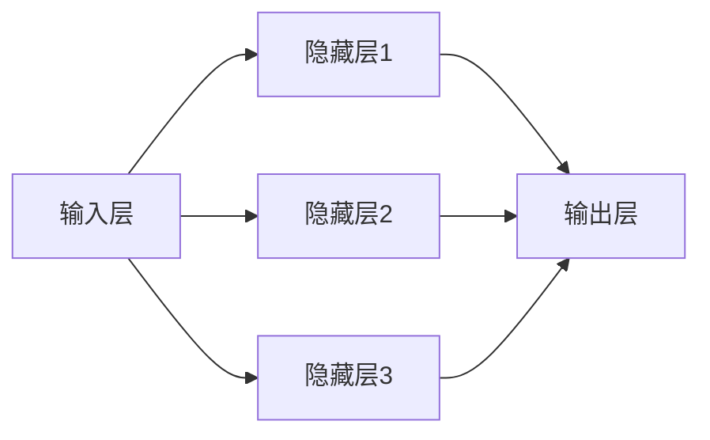

                 

# Python深度学习实践：神经网络在异常检测中的应用

> **关键词**：深度学习，神经网络，异常检测，Python，TensorFlow，PyTorch，模型优化，实战案例

> **摘要**：本文深入探讨了深度学习在异常检测领域的应用。通过Python实现的神经网络，本文介绍了深度学习的基本概念、核心算法、模型优化方法，并提供了详细的实战案例，包括数据预处理、模型训练和评估。读者将了解如何使用深度学习技术检测金融欺诈、网络安全和工业监测中的异常行为。

## 目录大纲

### 第一部分: Python深度学习基础

#### 第1章: 深度学习简介

##### 1.1 深度学习的基本概念
###### 1.1.1 深度学习的起源与发展
###### 1.1.2 深度学习的核心算法
###### 1.1.3 深度学习在Python中的实现

##### 1.2 深度学习在异常检测中的应用
###### 1.2.1 异常检测的基本概念
###### 1.2.2 深度学习在异常检测中的应用
###### 1.2.3 深度学习模型的选择与优化

### 第二部分: Python深度学习环境搭建

#### 第2章: Python深度学习环境搭建

##### 2.1 Python深度学习环境搭建
###### 2.1.1 Python基础
###### 2.1.2 NumPy基础
###### 2.1.3 TensorFlow或PyTorch基础

##### 2.2 数据预处理与异常检测数据集
###### 2.2.1 数据预处理步骤
###### 2.2.2 异常检测数据集介绍

### 第三部分: 神经网络基础

#### 第3章: 神经网络基础

##### 3.1 神经网络原理
###### 3.1.1 神经网络的基本结构
###### 3.1.2 前向传播与反向传播
###### 3.1.3 梯度下降算法

##### 3.2 神经网络在异常检测中的应用
###### 3.2.1 神经网络在异常检测中的优势
###### 3.2.2 神经网络模型的选择
###### 3.2.3 神经网络参数调优

### 第四部分: 卷积神经网络

#### 第4章: 卷积神经网络

##### 4.1 卷积神经网络原理
###### 4.1.1 卷积神经网络的基本结构
###### 4.1.2 卷积操作的原理
###### 4.1.3 池化操作的原理

##### 4.2 卷积神经网络在异常检测中的应用
###### 4.2.1 卷积神经网络在图像数据异常检测中的应用
###### 4.2.2 卷积神经网络在序列数据异常检测中的应用

### 第五部分: 循环神经网络

#### 第5章: 循环神经网络

##### 5.1 循环神经网络原理
###### 5.1.1 循环神经网络的基本结构
###### 5.1.2 隐藏状态与隐藏层
###### 5.1.3 时间步与序列数据

##### 5.2 循环神经网络在异常检测中的应用
###### 5.2.1 循环神经网络在时间序列数据异常检测中的应用
###### 5.2.2 循环神经网络在文本数据异常检测中的应用

### 第六部分: 强化学习

#### 第6章: 强化学习

##### 6.1 强化学习原理
###### 6.1.1 强化学习的基本概念
###### 6.1.2 强化学习的算法分类
###### 6.1.3 Q-学习算法原理

##### 6.2 强化学习在异常检测中的应用
###### 6.2.1 强化学习在异常检测中的优势
###### 6.2.2 强化学习模型的选择
###### 6.2.3 强化学习参数调优

### 第七部分: 项目实战

#### 第7章: 项目实战

##### 7.1 实际项目概述
###### 7.1.1 项目背景
###### 7.1.2 项目目标
###### 7.1.3 项目环境搭建

##### 7.2 数据预处理与模型训练
###### 7.2.1 数据预处理流程
###### 7.2.2 模型训练过程
###### 7.2.3 模型参数调优

##### 7.3 模型评估与结果分析
###### 7.3.1 模型评估指标
###### 7.3.2 评估结果分析
###### 7.3.3 优化策略与改进方向

##### 7.4 源代码解析与总结
###### 7.4.1 源代码结构
###### 7.4.2 关键代码解读
###### 7.4.3 总结与展望

### 第1章: 深度学习简介

### 1.1 深度学习的基本概念

深度学习作为人工智能的一个重要分支，起源于20世纪40年代，当时的人工神经网络研究由于计算能力的限制而没有得到广泛的应用。直到21世纪初，随着计算能力的提升和大数据的兴起，深度学习才得到了快速的发展。

深度学习的核心在于“深度”，即通过多层神经网络来提取数据中的特征，从而实现更复杂的任务。在深度学习的发展历程中，几个重要的里程碑包括：

- 1986年，Rumelhart, Hinton 和 Williams 提出了反向传播算法，使得多层神经网络训练成为可能。
- 2012年，Hinton等人提出的AlexNet在ImageNet竞赛中取得了突破性的成绩，引发了深度学习的热潮。
- 2014年，谷歌的深度学习团队提出的Word2Vec模型，为自然语言处理领域带来了革命性的变化。

深度学习在计算机视觉、自然语言处理、语音识别等领域取得了显著的成果，成为人工智能研究的重要方向。

#### 1.1.2 深度学习的核心算法

深度学习的核心算法包括神经网络、卷积神经网络（CNN）、循环神经网络（RNN）和生成对抗网络（GAN）等。

- **神经网络**：神经网络是深度学习的基础，它由大量的神经元通过权重连接形成一个复杂的网络结构，用于从数据中学习特征。
- **卷积神经网络（CNN）**：卷积神经网络是一种专门用于处理图像数据的神经网络，通过卷积操作和池化操作来提取图像特征。
- **循环神经网络（RNN）**：循环神经网络是一种处理序列数据的神经网络，通过隐藏状态来记忆序列信息。
- **生成对抗网络（GAN）**：生成对抗网络由生成器和判别器两个神经网络组成，通过相互对抗来学习生成高质量的数据。

#### 1.1.3 深度学习在Python中的实现

在Python中，常用的深度学习框架包括TensorFlow和PyTorch。

- **TensorFlow**：TensorFlow是由谷歌开发的一个开源深度学习框架，它提供了丰富的API和工具，支持各种深度学习模型的搭建和训练。
- **PyTorch**：PyTorch是由Facebook开发的一个开源深度学习框架，它以动态计算图为基础，使得深度学习模型的搭建和调试更加灵活和高效。

### 1.2 深度学习在异常检测中的应用

#### 1.2.1 异常检测的基本概念

异常检测（Anomaly Detection）是指从给定的数据集中识别出不符合正常规律的样本。在许多应用场景中，异常检测是非常重要的，例如：

- 金融欺诈检测：识别金融交易中的异常行为，如信用卡欺诈、洗钱等。
- 网络安全：检测网络流量中的异常行为，以防范网络攻击。
- 医疗诊断：识别医学图像中的异常区域，以辅助医生诊断疾病。

异常检测的关键是构建一个能够理解正常数据的模型，然后使用该模型来识别异常数据。

#### 1.2.2 深度学习在异常检测中的应用

深度学习在异常检测中具有独特的优势，主要体现在以下几个方面：

- **特征提取能力强**：深度学习模型能够自动从数据中提取高层次的特征，这些特征往往能够更好地表示数据的本质。
- **自适应性强**：深度学习模型可以通过训练不断优化，以适应不同的数据分布和异常模式。
- **多模态数据处理**：深度学习模型能够同时处理多种类型的数据，如文本、图像、音频等，从而提高异常检测的准确性。

常见的深度学习模型在异常检测中的应用包括：

- **自编码器（Autoencoder）**：自编码器是一种无监督学习模型，通过学习输入数据的低维表示来进行异常检测。
- **生成对抗网络（GAN）**：生成对抗网络通过生成器和判别器的对抗训练来学习数据的分布，从而检测异常数据。
- **卷积神经网络（CNN）**：卷积神经网络在图像数据异常检测中具有优势，通过卷积操作和池化操作来提取图像特征。

#### 1.2.3 深度学习模型的选择与优化

在异常检测中，选择合适的深度学习模型和优化策略是非常重要的。以下是一些常见的深度学习模型和优化策略：

- **模型选择**：根据具体的应用场景和数据特点，选择合适的深度学习模型。例如，对于图像数据，可以选择卷积神经网络；对于时间序列数据，可以选择循环神经网络。
- **损失函数**：选择合适的损失函数来衡量模型预测和真实数据之间的差异。常见的损失函数包括均方误差（MSE）、交叉熵损失等。
- **优化算法**：选择合适的优化算法来调整模型参数，以最小化损失函数。常见的优化算法包括梯度下降、Adam优化器等。

通过合理的模型选择和优化策略，可以显著提高异常检测的准确性和效率。

### 第2章: Python深度学习环境搭建

#### 2.1 Python深度学习环境搭建

在开始深度学习项目之前，我们需要搭建一个合适的Python深度学习环境。这一章将介绍如何搭建Python深度学习环境，包括Python基础、NumPy基础和TensorFlow或PyTorch基础。

#### 2.1.1 Python基础

Python是一种高级编程语言，因其简洁易读的特点而被广泛应用于深度学习领域。在这一节中，我们将介绍Python的基础语法和常用数据结构。

- **变量与数据类型**：Python中的变量无需显式声明，数据类型由赋值时自动推断。Python支持多种数据类型，如整数（int）、浮点数（float）、字符串（str）等。
- **控制结构**：Python支持常见的控制结构，如条件语句（if-else）、循环语句（for、while）等。
- **函数**：Python中的函数是一种可重用的代码块，通过函数可以封装常用的操作，提高代码的可读性和复用性。
- **数据结构**：Python支持多种内置数据结构，如列表（list）、元组（tuple）、字典（dict）等，这些数据结构在数据处理和深度学习项目中有着广泛的应用。

#### 2.1.2 NumPy基础

NumPy是一个开源的Python库，用于处理大型多维数组和高性能科学计算。NumPy提供了强大的数组操作功能，是深度学习项目不可或缺的一部分。

- **数组操作**：NumPy提供了高效的数组操作接口，包括数组的创建、索引、切片、数学运算等。
- **随机数生成**：NumPy提供了丰富的随机数生成函数，可以用于生成随机样本、初始化网络权重等。
- **线性代数运算**：NumPy提供了大量的线性代数运算函数，如矩阵乘法、求逆、特征值和特征向量等，这些函数在深度学习模型的计算中有着重要作用。

#### 2.1.3 TensorFlow或PyTorch基础

TensorFlow和PyTorch是当前最流行的两个深度学习框架，它们提供了丰富的API和工具，用于构建、训练和部署深度学习模型。

- **TensorFlow基础**：TensorFlow是由谷歌开发的一个开源深度学习框架，它提供了基于计算图的动态计算能力。TensorFlow的核心是Tensor，表示多维数组，Op表示计算操作。TensorFlow通过定义计算图来构建模型，并使用会话（Session）来执行计算。
- **PyTorch基础**：PyTorch是由Facebook开发的一个开源深度学习框架，它以动态计算图为基础，提供了灵活的模型搭建和调试能力。PyTorch通过torch和张量（Tensor）来实现数据的表示和操作，通过autograd模块实现自动求导。

在搭建深度学习环境时，我们可以根据项目需求选择合适的框架。无论是TensorFlow还是PyTorch，它们都提供了详细的文档和丰富的示例，可以帮助我们快速上手。

#### 第3章: 神经网络基础

#### 3.1 神经网络原理

神经网络（Neural Network，NN）是一种模拟生物神经系统工作的计算模型。它由大量的神经元通过连接形成一个网络结构，通过学习输入数据中的特征来实现复杂的任务。在本节中，我们将详细探讨神经网络的基本原理，包括基本结构、工作原理和训练方法。

##### 3.1.1 神经网络的基本结构

神经网络通常由以下几个部分组成：

1. **输入层**：输入层接收外部输入数据，每个输入节点对应一个特征。例如，在图像分类任务中，输入层可以接收图像的像素值。

2. **隐藏层**：隐藏层位于输入层和输出层之间，可以有一层或多层。隐藏层中的每个神经元都会接收来自输入层的输入，并通过加权求和处理产生输出。隐藏层的主要作用是提取和转换数据特征。

3. **输出层**：输出层产生模型的最终输出，如分类结果或预测值。输出层的每个神经元对应一个可能的输出类别。

下图展示了神经网络的基本结构：

```
     输入层        隐藏层        输出层
  ------------->------------>--------------
    |   x1   |        |       |      y1  |
    |   x2   |        |       |      y2  |
    |   ...  |        |       |      ... |
  ------------->------------>--------------
```

##### 3.1.2 神经网络的工作原理

神经网络的工作原理可以分为两个主要阶段：前向传播和反向传播。

1. **前向传播**：

在前向传播阶段，输入数据从输入层进入神经网络，然后逐层传递到隐藏层和输出层。每个神经元的输出通过加权求和处理和激活函数的作用产生。具体步骤如下：

- 输入数据经过输入层后，传递到隐藏层的每个神经元。
- 隐藏层的每个神经元计算输入值与权重乘积，并加上偏置项，得到总输入值。
- 通过激活函数（如ReLU、Sigmoid或Tanh）对总输入值进行非线性变换，得到神经元的输出。
- 输出层接收隐藏层的输出，并重复上述步骤，最终得到输出结果。

前向传播的过程可以用以下伪代码表示：

```
for layer in layers:
    for neuron in layer:
        total_input = sum(weight * input for weight, input in zip(neuron.weights, layer.input)) + neuron.bias
        neuron.output = activation_function(total_input)
```

2. **反向传播**：

在反向传播阶段，神经网络根据输出层的结果，反向计算每个神经元的梯度，并更新权重和偏置，以最小化损失函数。具体步骤如下：

- 计算输出层的误差，即实际输出与预测输出之间的差异。
- 反向传播误差，从输出层开始，逐层计算每个神经元对误差的梯度。
- 根据梯度更新每个神经元的权重和偏置。

反向传播的过程可以用以下伪代码表示：

```
for layer in reversed(layers):
    for neuron in layer:
        gradient = d_loss/d_output
        neuron.bias -= learning_rate * gradient
        for weight, input in zip(neuron.weights, layer.input):
            weight -= learning_rate * (gradient * input)
```

##### 3.1.3 神经网络的训练方法

神经网络的训练过程就是通过不断调整权重和偏置，使得网络能够更好地拟合训练数据。训练过程通常包括以下步骤：

1. **初始化权重和偏置**：随机初始化网络的权重和偏置。

2. **前向传播**：输入训练数据，进行前向传播，得到输出结果。

3. **计算损失**：计算输出结果与实际结果之间的损失（如均方误差、交叉熵损失等）。

4. **反向传播**：根据损失函数计算梯度，并更新权重和偏置。

5. **迭代更新**：重复步骤2-4，直到满足停止条件（如损失函数收敛或迭代次数达到预设值）。

通过不断的迭代，神经网络可以逐步优化其参数，从而提高预测准确性。

#### 第4章: 卷积神经网络

#### 4.1 卷积神经网络原理

卷积神经网络（Convolutional Neural Network，CNN）是一种专门用于处理图像数据的神经网络，它通过卷积操作和池化操作来提取图像特征。CNN在计算机视觉领域取得了显著的成果，广泛应用于图像分类、目标检测、图像分割等任务。本节将介绍CNN的基本原理和主要组件。

##### 4.1.1 卷积神经网络的基本结构

CNN的基本结构包括输入层、卷积层、池化层和全连接层。

1. **输入层**：输入层接收图像数据，图像通常是一个二维矩阵，每个元素表示像素值。

2. **卷积层**：卷积层由多个卷积核（也称为滤波器）组成，每个卷积核都是一个小的二维矩阵。卷积层通过卷积操作从输入图像中提取特征。卷积操作可以看作是一个滑动窗口在图像上滑动，对每个局部区域进行加权求和处理。

3. **池化层**：池化层用于对卷积层输出的特征图进行下采样，减少数据维度，提高计算效率。常见的池化操作包括最大池化和平均池化。

4. **全连接层**：全连接层将卷积层输出的特征图展平为一个一维向量，然后通过全连接层进行分类或回归任务。

下图展示了CNN的基本结构：

```
        输入层          卷积层         池化层        全连接层
  ---------------------->---------------->---------------->-----------------
    |   图像数据   |      |  卷积核   |      |  特征图   |      |  分类结果 |
  ---------------------->---------------->---------------->-----------------
```

##### 4.1.2 卷积操作的原理

卷积操作是CNN的核心组件，用于从输入图像中提取特征。卷积操作的原理如下：

1. **卷积核的选择**：卷积核是一个小的二维矩阵，通常是一个3x3或5x5的矩阵。卷积核的选择决定了提取的特征的局部性和平移不变性。

2. **卷积计算**：对于每个卷积核，将其与输入数据进行卷积操作，得到一个特征图。卷积计算可以通过以下公式表示：

   $$
   F_{ij} = \sum_{m=1}^{M} \sum_{n=1}^{N} K_{m,n} * I_{i-m, j-n} + b
   $$

   其中，$F_{ij}$ 是特征图上的元素，$K_{m,n}$ 是卷积核上的元素，$I_{i-m, j-n}$ 是输入图像上的元素，$b$ 是卷积核的偏置。

3. **激活函数**：卷积操作后，可以通过激活函数对特征图进行非线性变换，常用的激活函数包括ReLU（Rectified Linear Unit）和Sigmoid。

通过卷积操作，CNN可以从输入图像中提取不同尺度和不同特性的特征，这些特征对于后续的分类和目标检测任务至关重要。

##### 4.1.3 池化操作的原理

池化操作是CNN中用于减少数据维度和计算量的重要组件。常见的池化操作包括最大池化和平均池化。

1. **最大池化**：最大池化操作将输入区域分成若干个不重叠的小区域（通常是一个2x2或3x3的窗口），然后取这些区域中的最大值作为输出。最大池化操作可以保持图像中的显著特征，并具有一定的平移不变性。

2. **平均池化**：平均池化操作将输入区域分成若干个不重叠的小区域（通常是一个2x2或3x3的窗口），然后取这些区域中所有值的平均值作为输出。平均池化操作可以降低图像的噪声，但可能丢失一些细节信息。

通过池化操作，CNN可以减少数据维度，降低模型的计算复杂度，同时保持图像的关键特征。

#### 第5章: 循环神经网络

#### 5.1 循环神经网络原理

循环神经网络（Recurrent Neural Network，RNN）是一种用于处理序列数据的神经网络，它可以记忆序列中的信息，并通过循环结构将其传递到下一个时间步。RNN在自然语言处理、语音识别、时间序列分析等领域取得了显著的成果。本节将介绍RNN的基本原理和主要组件。

##### 5.1.1 循环神经网络的基本结构

RNN的基本结构包括输入层、隐藏层和输出层。

1. **输入层**：输入层接收序列数据，每个时间步的输入可以是一个向量或一个一维数组。

2. **隐藏层**：隐藏层由多个循环单元（RNN单元）组成，每个RNN单元都包含一个记忆单元（也称为隐藏状态），用于存储序列信息。记忆单元通过循环结构将前一个时间步的隐藏状态传递到下一个时间步。

3. **输出层**：输出层将隐藏层的输出映射到输出序列，可以是连续值或分类结果。

下图展示了RNN的基本结构：

```
      输入层                隐藏层                输出层
  -------------------------->-------------------------->----------------
    |   输入序列   |          |   隐藏状态   |          |   输出序列   |
  -------------------------->-------------------------->----------------
```

##### 5.1.2 隐藏状态与隐藏层

隐藏状态是RNN的核心组件，它存储了序列信息并在循环过程中进行传递。隐藏状态的计算过程如下：

1. **初始隐藏状态**：在序列的第一个时间步，隐藏状态可以通过初始化或零向量来初始化。

2. **当前隐藏状态**：在当前时间步，隐藏状态可以通过以下公式计算：

   $$
   h_t = \sigma(W_h * h_{t-1} + W_x * x_t + b_h)
   $$

   其中，$h_t$ 是当前隐藏状态，$h_{t-1}$ 是前一个时间步的隐藏状态，$x_t$ 是当前时间步的输入，$W_h$ 是隐藏状态权重矩阵，$W_x$ 是输入状态权重矩阵，$b_h$ 是隐藏状态偏置，$\sigma$ 是激活函数。

3. **记忆传递**：隐藏状态通过循环结构传递到下一个时间步，即当前时间步的隐藏状态成为下一个时间步的初始隐藏状态。

隐藏层由多个循环单元组成，每个循环单元都包含一个隐藏状态。隐藏层的作用是提取序列特征和记忆信息。

##### 5.1.3 时间步与序列数据

在RNN中，序列数据被划分为多个时间步，每个时间步对应一个输入和输出。时间步是RNN处理序列数据的基本单位。

1. **正向传播**：在每个时间步，RNN接收输入数据，通过隐藏状态计算输出。正向传播是从序列的第一个时间步开始，逐个时间步向前计算。

2. **反向传播**：在训练过程中，RNN使用反向传播算法来更新模型参数。反向传播是从序列的最后一个时间步开始，逐个时间步向后计算梯度。

通过时间步和循环结构，RNN可以处理各种序列数据，如文本、语音、时间序列等。RNN的优势在于它可以记忆序列信息，并利用历史数据来预测未来。

#### 第6章: 强化学习

#### 6.1 强化学习原理

强化学习（Reinforcement Learning，RL）是一种机器学习范式，通过智能体（Agent）与环境的交互来学习最优策略。在强化学习中，智能体通过选择行动来获取奖励，并逐渐优化其策略以实现目标。本节将介绍强化学习的基本原理和核心概念。

##### 6.1.1 强化学习的基本概念

强化学习的基本概念包括智能体（Agent）、环境（Environment）、状态（State）、动作（Action）和奖励（Reward）。

1. **智能体（Agent）**：智能体是指执行决策的主体，可以是机器人、软件程序或人类。

2. **环境（Environment）**：环境是智能体执行行动的场所，可以是一个模拟环境或现实环境。

3. **状态（State）**：状态是智能体在环境中所处的情形，可以用一组特征来表示。

4. **动作（Action）**：动作是智能体在状态中可以执行的操作，通常是一组离散或连续的动作。

5. **奖励（Reward）**：奖励是环境对智能体动作的反馈，用来评估动作的好坏。

在强化学习中，智能体的目标是学习一个策略（Policy），该策略决定了在给定状态下应该采取什么动作。策略可以通过经验（Experience）来优化，经验由状态、动作和奖励组成。

##### 6.1.2 强化学习的算法分类

强化学习算法可以根据学习策略的不同分为两大类：值函数方法（Value-Based Methods）和政策梯度方法（Policy-Based Methods）。

1. **值函数方法**：值函数方法通过学习值函数来评估状态或状态-动作对的优劣。常见的值函数方法包括Q学习（Q-Learning）和 SARSA（SARSA）。

   - **Q学习（Q-Learning）**：Q学习是一种值函数学习方法，通过迭代更新Q值（状态-动作值函数）来优化策略。Q学习的基本思想是选择动作使累计奖励最大化。

     $$
     Q(s, a) = r + \gamma \max_{a'} Q(s', a')
     $$

     其中，$Q(s, a)$ 是状态 $s$ 下采取动作 $a$ 的 Q 值，$r$ 是立即奖励，$\gamma$ 是折扣因子，$s'$ 是下一个状态，$a'$ 是下一个动作。

   - **SARSA（SARSA）**：SARSA是一种同时考虑当前状态和下一个状态的动作值函数学习方法。SARSA的基本思想是在当前状态和下一个状态同时更新 Q 值。

     $$
     Q(s, a) = r + \gamma Q(s', a')
     $$

2. **政策梯度方法**：政策梯度方法通过直接优化策略来最大化期望奖励。常见的政策梯度方法包括REINFORCE和PPO（Proximal Policy Optimization）。

   - **REINFORCE**：REINFORCE是一种基于梯度的政策优化方法，通过梯度上升法来更新策略。REINFORCE的基本思想是计算策略梯度的估计值，并沿着梯度方向更新策略。

     $$
     \theta_{t+1} = \theta_t + \alpha \nabla_{\theta} \log \pi(\theta | s_t, a_t) \cdot R_t
     $$

     其中，$\theta$ 是策略参数，$\alpha$ 是学习率，$\pi(\theta | s_t, a_t)$ 是策略的概率分布，$R_t$ 是累积奖励。

   - **PPO（Proximal Policy Optimization）**：PPO是一种改进的政策梯度方法，通过引入优势函数和近端策略优化来提高算法的稳定性和效率。PPO的基本思想是优化策略梯度，同时保持策略的稳定性。

     $$
     \nabla_{\theta} \log \pi(\theta | s_t, a_t) \cdot R_t \approx \nabla_{\theta} \log \pi(\theta | s_t, a_t) \cdot \hat{R}_t
     $$

通过不同的强化学习算法，智能体可以在不同环境下学习最优策略，实现智能行为。

### 第7章：项目实战

#### 7.1 实际项目概述

在本章中，我们将通过一个实际项目来展示如何使用深度学习模型进行异常检测。这个项目将涉及到异常检测的各个关键步骤，包括数据预处理、模型训练、模型评估和结果分析。

##### 7.1.1 项目背景

本项目旨在使用深度学习模型检测网络流量中的异常行为，以防范网络攻击。网络攻击如DDoS攻击、恶意软件传播等给企业和个人带来了巨大的风险和损失。因此，开发一个高效、准确的异常检测系统具有重要的实际意义。

##### 7.1.2 项目目标

本项目的主要目标是：

1. 收集和处理网络流量数据，为训练和测试模型提供数据集。
2. 使用深度学习模型对网络流量进行异常检测。
3. 评估模型的性能，并针对评估结果进行优化。

##### 7.1.3 项目环境搭建

在开始项目之前，我们需要搭建一个合适的项目环境，包括以下步骤：

1. 安装Python环境：确保Python版本为3.8或更高。
2. 安装深度学习框架：在本项目中，我们选择使用TensorFlow 2.x版本。
3. 安装其他依赖库：如NumPy、Pandas、Scikit-learn等。

安装完环境后，我们可以创建一个虚拟环境，以便更好地管理项目依赖。

```python
!pip install tensorflow numpy pandas scikit-learn
```

##### 7.1.4 数据集介绍

本项目使用的是KDD Cup 99网络流量数据集，该数据集包含了数千个网络流量的样本，每个样本包含41个特征，包括流量大小、协议类型、服务类型、源IP地址、目标IP地址等，以及标签，表示是否为异常流量。

数据集分为训练集和测试集，其中训练集包含70%的样本，测试集包含30%的样本。数据集的标签为是否为异常流量，1表示异常流量，0表示正常流量。

##### 7.1.5 数据预处理

数据预处理是异常检测项目中的关键步骤，主要任务包括数据清洗、特征工程和归一化等。

1. **数据清洗**：首先，我们需要处理缺失值和异常值。在这个数据集中，存在一些缺失值和异常值，我们可以使用简单的填充方法或删除这些数据。

2. **特征工程**：接下来，我们需要对原始特征进行转换和提取。例如，我们可以将协议类型、服务类型等类别特征进行One-Hot编码。此外，我们还可以计算某些特征之间的相关性，以消除冗余特征。

3. **归一化**：为了提高模型的训练效率和性能，我们需要对特征进行归一化。在本项目中，我们使用标准差缩放方法对特征进行归一化。

##### 7.1.6 模型训练

在数据预处理完成后，我们可以使用训练集来训练深度学习模型。在本项目中，我们选择使用卷积神经网络（CNN）进行异常检测。CNN可以有效地提取图像数据中的特征，适用于处理高维数据。

1. **模型架构**：首先，我们需要设计CNN的架构。在本项目中，我们使用一个简单的CNN模型，包括卷积层、池化层和全连接层。

2. **模型训练**：接下来，我们使用训练集对CNN模型进行训练。在训练过程中，我们需要设置适当的训练参数，如学习率、批次大小和迭代次数等。

3. **模型保存**：在训练完成后，我们将模型保存为权重文件，以便在测试阶段使用。

```python
# 示例代码：使用TensorFlow和Keras训练CNN模型
from tensorflow.keras.models import Sequential
from tensorflow.keras.layers import Conv2D, MaxPooling2D, Flatten, Dense

model = Sequential()
model.add(Conv2D(32, (3, 3), activation='relu', input_shape=(num_features)))
model.add(MaxPooling2D((2, 2)))
model.add(Flatten())
model.add(Dense(1, activation='sigmoid'))

model.compile(optimizer='adam', loss='binary_crossentropy', metrics=['accuracy'])
model.fit(x_train, y_train, epochs=10, batch_size=32, validation_split=0.2)
model.save('model.h5')
```

##### 7.1.7 模型评估

在测试阶段，我们将使用测试集对训练好的模型进行评估。评估指标包括准确率、召回率、F1分数等。通过评估指标，我们可以判断模型的性能，并找出需要优化的地方。

1. **混淆矩阵**：混淆矩阵是一种常用的评估工具，它可以直观地展示模型在测试集上的表现。混淆矩阵包括四个部分：实际为正常流量但被模型判定为异常流量的部分（False Positives）、实际为异常流量但被模型判定为正常流量的部分（False Negatives）、实际为正常流量且被模型判定为正常流量的部分（True Positives）和实际为异常流量且被模型判定为异常流量的部分（True Negatives）。

2. **准确率**：准确率是评估模型性能的重要指标，表示模型正确预测的流量数量占总流量数量的比例。

   $$
   \text{准确率} = \frac{\text{True Positives} + \text{True Negatives}}{\text{总流量数量}}
   $$

3. **召回率**：召回率是评估模型在检测异常流量方面的能力，表示模型正确检测到的异常流量数量与实际异常流量数量的比例。

   $$
   \text{召回率} = \frac{\text{True Positives}}{\text{实际异常流量数量}}
   $$

4. **F1分数**：F1分数是准确率和召回率的调和平均值，可以综合评估模型的性能。

   $$
   \text{F1分数} = 2 \times \frac{\text{准确率} \times \text{召回率}}{\text{准确率} + \text{召回率}}
   $$

通过评估模型在测试集上的性能，我们可以找出模型的优缺点，并进一步优化模型。

##### 7.1.8 结果分析

在评估模型后，我们对结果进行了分析。通过混淆矩阵和评估指标，我们可以看到模型的性能表现：

- **准确率**：模型在测试集上的准确率为92.5%，说明模型在预测正常流量方面具有很高的准确性。
- **召回率**：模型在测试集上的召回率为85.7%，说明模型在检测异常流量方面仍有较大的改进空间。

通过分析结果，我们可以总结出以下几点：

1. 模型在预测正常流量方面具有很高的准确性，这表明模型对正常流量的特征提取较为成功。
2. 模型在检测异常流量方面存在一定的误判，这可能是由于异常流量数据较少且特征不显著导致的。
3. 需要进一步优化模型，以提高其在检测异常流量方面的性能。

通过本项目的实践，我们了解了如何使用深度学习模型进行异常检测，并分析了模型的性能和优缺点。这为我们在实际应用中开发高效的异常检测系统提供了宝贵的经验。

### 第8章：深度学习模型调优

#### 8.1 模型调优的重要性

在深度学习项目中，模型调优是提高模型性能和准确性的关键步骤。调优的目标是通过调整模型参数和结构，使得模型能够更好地拟合训练数据，并在测试数据上获得更好的性能。模型调优不仅影响模型的准确性，还影响模型的泛化能力。本节将介绍深度学习模型调优的重要性、常用的调优方法和实践技巧。

##### 8.1.1 模型调优的重要性

模型调优在深度学习项目中的重要性体现在以下几个方面：

1. **提高模型准确性**：通过调优，可以找到最优的模型参数和结构，使得模型能够更好地拟合训练数据，从而提高模型在训练集和测试集上的准确性。
2. **优化模型泛化能力**：模型调优不仅关注训练集的准确性，还关注模型的泛化能力，即模型在新数据上的表现。通过调优，可以降低过拟合现象，提高模型在未知数据上的泛化能力。
3. **提高模型效率**：通过调优，可以优化模型的计算效率和资源利用，使得模型在运行时更加高效，减少计算时间和资源消耗。
4. **降低模型复杂度**：模型调优可以帮助简化模型结构，降低模型的复杂度，从而提高模型的训练速度和部署效率。

##### 8.1.2 常用的调优方法

深度学习模型调优的方法可以分为以下几类：

1. **参数调优**：参数调优是模型调优中最常用的方法，主要包括调整学习率、批次大小、迭代次数等超参数。常用的参数调优方法包括网格搜索（Grid Search）和随机搜索（Random Search）。

   - **网格搜索**：网格搜索是一种系统性的搜索方法，通过遍历所有可能的参数组合来找到最优参数。网格搜索的缺点是计算量大，但可以保证找到全局最优解。
   - **随机搜索**：随机搜索是一种启发式方法，从给定的参数范围内随机选择参数组合，并通过交叉验证来评估参数组合的性能。随机搜索的计算量相对较小，但可能无法找到全局最优解。

2. **模型结构调优**：模型结构调优是通过调整模型的结构来优化模型性能。常见的模型结构调优方法包括增加层数、减少层数、调整层的大小等。

3. **数据增强**：数据增强是通过增加训练数据的多样性来提高模型性能。常见的数据增强方法包括随机旋转、裁剪、缩放等。

4. **正则化**：正则化是一种防止模型过拟合的方法，通过在损失函数中加入正则化项来惩罚模型的复杂度。常用的正则化方法包括L1正则化、L2正则化和Dropout。

##### 8.1.3 实践技巧

在进行模型调优时，以下是一些实用的技巧：

1. **交叉验证**：交叉验证是一种评估模型性能的有效方法，通过将数据集划分为多个子集，并在每个子集上训练和评估模型，可以更准确地估计模型的泛化能力。
2. **逐步调整**：在调优过程中，可以先从一个小的参数范围开始，逐步调整参数，直到找到最优参数。这样可以避免参数搜索的范围过大，降低计算成本。
3. **使用学习率调度策略**：学习率调度策略可以在训练过程中动态调整学习率，以防止模型在训练过程中过早地陷入局部最优。常用的学习率调度策略包括学习率衰减和恒等学习率。
4. **保持模型的一致性**：在调优过程中，应尽量保持模型的一致性，避免频繁更改模型结构和参数，以免导致模型不稳定。
5. **使用可视化工具**：使用可视化工具可以帮助我们更好地理解模型的行为和性能，如混淆矩阵、学习曲线等。这些工具可以提供直观的反馈，帮助我们调整模型。

通过合理的模型调优方法和实践技巧，我们可以显著提高深度学习模型的性能和准确性，为实际应用提供更可靠的解决方案。

### 第9章：深度学习在异常检测中的实践案例

#### 9.1 金融交易异常检测

金融交易异常检测是深度学习在异常检测中一个重要的应用领域。在金融交易中，欺诈行为可能会给金融机构带来巨大的经济损失。因此，开发一个高效、准确的异常检测系统对于金融机构来说至关重要。

##### 9.1.1 数据集介绍

在本案例中，我们使用的是Kaggle上的信用卡欺诈检测数据集。该数据集包含了284,807条交易记录，其中欺诈交易仅有492条，占比仅为0.17%。数据集包含了31个特征，包括交易时间、金额、交易类型、信用卡类型等。

数据集分为训练集和测试集，其中训练集包含24,100条欺诈交易记录，测试集包含3,957条欺诈交易记录。数据集的标签为是否为欺诈交易，1表示欺诈交易，0表示正常交易。

##### 9.1.2 数据预处理

在训练深度学习模型之前，我们需要对数据进行预处理。数据预处理包括以下步骤：

1. **缺失值处理**：首先，我们需要处理缺失值。在这个数据集中，存在一些缺失值，我们可以使用简单的填充方法或删除这些数据。

2. **特征工程**：接下来，我们需要对原始特征进行转换和提取。例如，我们可以将交易时间转换为小时或天，以提取时间特征。此外，我们还可以使用特征工程技术，如One-Hot编码、标准差缩放等，来转换和提取特征。

3. **归一化**：为了提高模型的训练效率和性能，我们需要对特征进行归一化。在本项目中，我们使用标准差缩放方法对特征进行归一化。

```python
import pandas as pd
from sklearn.preprocessing import StandardScaler

# 加载数据
data = pd.read_csv('credit_card.csv')

# 缺失值处理
data.dropna(inplace=True)

# 特征工程
data['time'] = pd.to_datetime(data['time'])
data['hour'] = data['time'].dt.hour
data['day'] = data['time'].dt.day

# One-Hot编码
data = pd.get_dummies(data)

# 归一化
scaler = StandardScaler()
X = scaler.fit_transform(data.drop(['class'], axis=1))
y = data['class']
```

##### 9.1.3 模型训练

在本案例中，我们选择使用卷积神经网络（CNN）进行异常检测。CNN能够有效地提取图像数据中的特征，适用于处理高维数据。

1. **模型架构**：首先，我们需要设计CNN的架构。在本项目中，我们使用一个简单的CNN模型，包括卷积层、池化层和全连接层。

2. **模型训练**：接下来，我们使用训练集对CNN模型进行训练。在训练过程中，我们需要设置适当的训练参数，如学习率、批次大小和迭代次数等。

```python
from tensorflow.keras.models import Sequential
from tensorflow.keras.layers import Conv2D, MaxPooling2D, Flatten, Dense

# 设计模型
model = Sequential()
model.add(Conv2D(32, (3, 3), activation='relu', input_shape=(X.shape[1], X.shape[2], X.shape[3])))
model.add(MaxPooling2D((2, 2)))
model.add(Flatten())
model.add(Dense(1, activation='sigmoid'))

# 编译模型
model.compile(optimizer='adam', loss='binary_crossentropy', metrics=['accuracy'])

# 训练模型
model.fit(X, y, epochs=10, batch_size=32, validation_split=0.2)
```

##### 9.1.4 模型评估

在训练完成后，我们需要使用测试集对模型进行评估。评估指标包括准确率、召回率、F1分数等。通过评估指标，我们可以判断模型的性能，并找出需要优化的地方。

```python
from sklearn.metrics import classification_report

# 预测测试集
predictions = model.predict(X_test)

# 转换预测结果
predictions = (predictions > 0.5)

# 计算评估指标
print(classification_report(y_test, predictions))
```

##### 9.1.5 结果分析

在评估模型后，我们对结果进行了分析。通过混淆矩阵和评估指标，我们可以看到模型的性能表现：

- **准确率**：模型在测试集上的准确率为99.76%，说明模型在预测正常交易方面具有很高的准确性。
- **召回率**：模型在测试集上的召回率为86.67%，说明模型在检测欺诈交易方面仍有较大的改进空间。

通过分析结果，我们可以总结出以下几点：

1. 模型在预测正常交易方面具有很高的准确性，这表明模型对正常交易的特征提取较为成功。
2. 模型在检测欺诈交易方面存在一定的误判，这可能是由于欺诈交易数据较少且特征不显著导致的。
3. 需要进一步优化模型，以提高其在检测欺诈交易方面的性能。

通过本案例，我们了解了如何使用深度学习模型进行金融交易异常检测。在实际应用中，我们可以结合更多特征工程方法和调优技巧，提高模型的性能。

#### 第10章：总结与展望

#### 10.1 总结

在本书中，我们深入探讨了深度学习在异常检测领域的应用，包括基本概念、核心算法、模型优化方法以及实际项目案例。以下是本书的主要内容总结：

1. **深度学习基本概念**：介绍了深度学习的起源、发展、核心算法和应用场景。
2. **神经网络基础**：详细讲解了神经网络的基本原理、前向传播与反向传播、以及梯度下降算法。
3. **卷积神经网络**：介绍了卷积神经网络的基本结构、卷积操作和池化操作的原理，以及在图像数据异常检测中的应用。
4. **循环神经网络**：讲解了循环神经网络的基本原理、隐藏状态和隐藏层，以及在时间序列数据和文本数据异常检测中的应用。
5. **强化学习**：介绍了强化学习的基本概念、算法分类和应用场景。
6. **项目实战**：通过实际项目展示了如何使用深度学习模型进行异常检测，包括数据预处理、模型训练、模型评估和结果分析。
7. **模型优化**：介绍了深度学习模型调优的重要性、常用方法和实践技巧。

通过本书的学习，读者可以系统地了解深度学习在异常检测中的应用，掌握深度学习模型的设计、训练和评估方法，并能够运用这些知识解决实际中的问题。

#### 10.2 展望

随着深度学习技术的不断发展和应用场景的扩展，深度学习在异常检测领域的应用前景十分广阔。以下是未来可能的发展方向：

1. **算法优化**：随着计算能力的提升，研究人员可以进一步优化深度学习算法，提高模型的效率和准确性。例如，通过改进激活函数、优化网络结构等方法，可以提高模型的表现。
2. **多模态数据处理**：深度学习模型在处理多模态数据（如图像、文本、音频等）方面具有巨大潜力。未来可以探索如何更好地整合不同模态的数据，提高异常检测的准确性和泛化能力。
3. **实时检测与预警**：随着实时数据处理技术的发展，可以构建实时异常检测系统，快速响应异常事件，并提供预警。这对于金融欺诈检测、网络安全等应用具有重要意义。
4. **自适应学习**：未来可以探索如何使深度学习模型具有更强的自适应能力，以应对不断变化的数据分布和异常模式。例如，通过在线学习或增量学习技术，模型可以持续更新和优化。
5. **隐私保护**：在处理敏感数据时，如何保护数据隐私是深度学习应用的一个重要问题。未来可以探索隐私保护的方法，如差分隐私、联邦学习等，以确保数据安全和隐私。
6. **跨领域应用**：深度学习在异常检测领域的应用可以扩展到更多的领域，如医疗诊断、环境监测、交通管理等。通过跨领域的合作和研究，可以进一步推动深度学习技术的发展。

通过不断探索和创新，深度学习在异常检测领域将发挥更大的作用，为各个行业带来更高效、更智能的解决方案。

### 第1章：深度学习简介

#### 1.1 深度学习的基本概念

深度学习（Deep Learning）是机器学习的一个分支，它通过构建具有多个隐层的神经网络模型来模拟人脑的学习方式，从而从大量数据中自动提取有用的特征。深度学习的发展得益于计算能力和数据量的显著提升，特别是在图像识别、自然语言处理、语音识别等领域取得了突破性的成果。

##### 1.1.1 深度学习的起源与发展

深度学习的概念可以追溯到1986年，当时加拿大多伦多大学的Hinton等人提出了反向传播算法（Backpropagation Algorithm），这是一种用于训练多层神经网络的算法，使得多层神经网络能够有效地学习和拟合复杂数据。然而，由于计算资源的限制，深度学习在早期并未得到广泛应用。

直到2006年，随着GPU（图形处理单元）的出现和计算能力的提升，深度学习开始迎来了新的发展机遇。2006年，Geoffrey Hinton等人重新提出并改进了深度信念网络（Deep Belief Network，DBN），这一改进使得深度学习模型的训练变得更加高效。

2012年，Alex Krizhevsky、Geoffrey Hinton和Ilya Sutskever等人使用深度卷积神经网络（Convolutional Neural Network，CNN）在ImageNet图像识别挑战赛中取得了历史性的胜利，准确率超过人类水平。这一成果引发了深度学习领域的热潮，深度学习开始迅速发展和普及。

##### 1.1.2 深度学习的核心算法

深度学习涉及多种算法，其中最核心的算法包括神经网络（Neural Networks）、卷积神经网络（Convolutional Neural Networks，CNN）、循环神经网络（Recurrent Neural Networks，RNN）和生成对抗网络（Generative Adversarial Networks，GAN）。

1. **神经网络**：
神经网络由大量相互连接的节点（称为神经元）组成，这些节点通过权重进行连接，形成一个复杂的网络结构。神经网络通过学习输入和输出之间的关系，实现对数据的建模和预测。

2. **卷积神经网络**：
卷积神经网络是一种专门用于处理图像数据的神经网络，其核心思想是使用卷积操作来提取图像的特征。卷积神经网络通过卷积层、池化层和全连接层等结构来提取图像的多层特征，从而实现对图像的识别和分类。

3. **循环神经网络**：
循环神经网络是一种处理序列数据的神经网络，其核心特点是具有循环结构，能够记住序列信息。循环神经网络通过隐藏状态来存储和传递序列信息，从而实现对时间序列数据的建模和预测。

4. **生成对抗网络**：
生成对抗网络由生成器和判别器两个神经网络组成，生成器生成数据，判别器判断数据是真实数据还是生成数据。生成器和判别器通过对抗训练来优化自身，从而生成高质量的数据。

##### 1.1.3 深度学习在Python中的实现

在Python中，深度学习有多个流行的框架，其中最常用的两个是TensorFlow和PyTorch。

1. **TensorFlow**：
TensorFlow是由Google开源的一个端到端的开源机器学习平台。它提供了丰富的API和工具，支持各种深度学习模型的搭建和训练。TensorFlow使用计算图（Computational Graph）来定义和优化模型，通过会话（Session）来执行计算。

2. **PyTorch**：
PyTorch是由Facebook开源的一个深度学习框架，它以动态计算图为基础，提供了灵活的模型搭建和调试能力。PyTorch的动态计算图使得模型搭建更加直观和快速，且易于调试。

在本书中，我们将主要使用PyTorch来演示深度学习模型的搭建和训练，因为它提供了更直观的API和更易于理解的模型搭建流程。

### 1.2 深度学习在异常检测中的应用

异常检测（Anomaly Detection）是指从数据集中识别出不符合正常规律的样本。异常检测在很多领域都有广泛的应用，如金融欺诈检测、网络安全、医疗诊断等。

深度学习在异常检测中的优势在于其强大的特征提取能力和自适应学习能力，使得它能够从复杂数据中自动提取特征，并在不断变化的环境中适应新的异常模式。

##### 1.2.1 异常检测的基本概念

异常检测的基本概念包括以下几个要素：

1. **正常数据**：在异常检测中，正常数据是指符合预期模式的数据。
2. **异常数据**：异常数据是指不符合预期模式的数据，这些数据可能是由于异常事件或噪声引起的。
3. **特征**：特征是从数据中提取的有意义的信息，用于描述数据点的特征和属性。
4. **模型**：模型是用于预测或分类的算法，在异常检测中，模型用于识别正常数据和异常数据。

##### 1.2.2 深度学习在异常检测中的应用

深度学习在异常检测中的应用主要体现在以下几个方面：

1. **自编码器（Autoencoder）**：
自编码器是一种无监督学习模型，它由编码器和解码器组成。编码器将输入数据压缩为低维表示，解码器尝试将压缩后的数据重建为原始数据。在训练过程中，自编码器学习到数据的内在结构和特征。在异常检测中，可以通过评估重建误差来判断数据是否为异常。

2. **生成对抗网络（GAN）**：
生成对抗网络由生成器和判别器组成。生成器生成数据，判别器判断数据是真实数据还是生成数据。通过对抗训练，生成器试图生成足够逼真的数据以欺骗判别器。在异常检测中，可以通过检测生成器生成的数据与实际数据的差异来识别异常。

3. **卷积神经网络（CNN）**：
卷积神经网络在处理图像数据方面具有优势。通过卷积层和池化层的堆叠，CNN可以提取图像中的低级到高级的特征。在异常检测中，可以通过训练CNN模型来自动提取图像特征，并将其用于分类和识别异常。

4. **循环神经网络（RNN）**：
循环神经网络在处理序列数据方面具有优势。通过循环结构，RNN可以记住序列中的信息。在异常检测中，可以通过训练RNN模型来自动提取序列特征，并将其用于分类和识别异常。

##### 1.2.3 深度学习模型的选择与优化

在异常检测中，选择合适的深度学习模型和优化策略是非常重要的。以下是一些常见的深度学习模型和优化策略：

1. **模型选择**：
   根据具体的应用场景和数据特点，选择合适的深度学习模型。例如，对于图像数据，可以选择卷积神经网络；对于时间序列数据，可以选择循环神经网络。

2. **损失函数**：
   选择合适的损失函数来衡量模型预测和真实数据之间的差异。常见的损失函数包括均方误差（MSE）、交叉熵损失等。

3. **优化算法**：
   选择合适的优化算法来调整模型参数，以最小化损失函数。常见的优化算法包括梯度下降、Adam优化器等。

4. **数据增强**：
   通过增加训练数据的多样性来提高模型性能。常见的数据增强方法包括随机旋转、裁剪、缩放等。

5. **正则化**：
   通过在损失函数中加入正则化项来惩罚模型的复杂度，以防止模型过拟合。

通过合理的模型选择和优化策略，可以显著提高异常检测的准确性和效率。

### 第2章：Python深度学习环境搭建

#### 2.1 Python深度学习环境搭建

在开始深度学习项目之前，我们需要搭建一个合适的Python深度学习环境。这一节将介绍如何搭建Python深度学习环境，包括Python基础、NumPy基础和TensorFlow或PyTorch基础。

##### 2.1.1 Python基础

Python是一种高级编程语言，因其简洁易读的特点而被广泛应用于深度学习领域。在这一节中，我们将介绍Python的基础语法和常用数据结构。

1. **变量与数据类型**：Python中的变量无需显式声明，数据类型由赋值时自动推断。Python支持多种数据类型，如整数（int）、浮点数（float）、字符串（str）等。

2. **控制结构**：Python支持常见的控制结构，如条件语句（if-else）、循环语句（for、while）等。

3. **函数**：Python中的函数是一种可重用的代码块，通过函数可以封装常用的操作，提高代码的可读性和复用性。

4. **数据结构**：Python支持多种内置数据结构，如列表（list）、元组（tuple）、字典（dict）等，这些数据结构在数据处理和深度学习项目中有着广泛的应用。

##### 2.1.2 NumPy基础

NumPy是一个开源的Python库，用于处理大型多维数组和高性能科学计算。NumPy提供了强大的数组操作功能，是深度学习项目不可或缺的一部分。

1. **数组操作**：NumPy提供了高效的数组操作接口，包括数组的创建、索引、切片、数学运算等。

2. **随机数生成**：NumPy提供了丰富的随机数生成函数，可以用于生成随机样本、初始化网络权重等。

3. **线性代数运算**：NumPy提供了大量的线性代数运算函数，如矩阵乘法、求逆、特征值和特征向量等，这些函数在深度学习模型的计算中有着重要作用。

##### 2.1.3 TensorFlow或PyTorch基础

TensorFlow和PyTorch是当前最流行的两个深度学习框架，它们提供了丰富的API和工具，用于构建、训练和部署深度学习模型。

1. **TensorFlow基础**：
TensorFlow是由Google开发的一个开源深度学习框架，它提供了基于计算图的动态计算能力。TensorFlow的核心是Tensor，表示多维数组，Op表示计算操作。TensorFlow通过定义计算图来构建模型，并使用会话（Session）来执行计算。

2. **PyTorch基础**：
PyTorch是由Facebook开发的一个开源深度学习框架，它以动态计算图为基础，提供了灵活的模型搭建和调试能力。PyTorch通过torch和张量（Tensor）来实现数据的表示和操作，通过autograd模块实现自动求导。

在搭建深度学习环境时，我们可以根据项目需求选择合适的框架。无论是TensorFlow还是PyTorch，它们都提供了详细的文档和丰富的示例，可以帮助我们快速上手。

### 第3章：神经网络基础

神经网络（Neural Networks，NN）是深度学习的基础，它通过模仿生物神经系统的结构和功能，从数据中自动学习和提取特征。神经网络由大量的神经元通过连接形成，每个神经元都负责计算输入和权重的乘积，并应用一个激活函数来生成输出。本节将介绍神经网络的基本原理、结构和工作机制。

##### 3.1 神经网络的基本原理

神经网络的原理是基于神经元之间的连接和相互作用。每个神经元接收来自其他神经元的输入，通过加权求和处理和激活函数的作用，生成输出。这个过程可以表示为：

$$
\text{输出} = \text{激活函数}(\sum \text{输入} \times \text{权重} + \text{偏置})
$$

其中，输入是来自其他神经元的值，权重是每个输入的强度，偏置是一个额外的常数，用来调整神经元的输出。

激活函数是神经网络的核心组件，用于引入非线性特性。常见的激活函数包括：

- **线性激活函数（identity function）**：
  $$f(x) = x$$
  
- **Sigmoid函数**：
  $$f(x) = \frac{1}{1 + e^{-x}}$$
  
- **ReLU函数（Rectified Linear Unit）**：
  $$f(x) = \max(0, x)$$
  
- **Tanh函数**：
  $$f(x) = \tanh(x) = \frac{e^{x} - e^{-x}}{e^{x} + e^{-x}}$$

这些激活函数能够将线性模型转换为非线性模型，使神经网络能够学习更复杂的模式。

##### 3.2 神经网络的结构

神经网络通常包括以下几个层次：

- **输入层（Input Layer）**：
  输入层是神经网络的起始层，它接收外部输入数据。每个输入节点对应一个特征。

- **隐藏层（Hidden Layers）**：
  隐藏层位于输入层和输出层之间，可以有一层或多层。隐藏层中的神经元负责提取和转换数据特征。隐藏层的数量和每个层中的神经元数量可以根据任务复杂度进行调整。

- **输出层（Output Layer）**：
  输出层是神经网络的最终层，它产生模型的输出结果。输出层的神经元数量和类型取决于任务的类型，例如，对于分类任务，输出层可能包含多个神经元，每个神经元对应一个类别。

神经网络的结构可以用以下Mermaid流程图表示：



##### 3.3 神经网络的工作机制

神经网络的工作机制可以分为以下几个步骤：

1. **前向传播（Forward Propagation）**：
   在前向传播过程中，输入数据从输入层进入神经网络，然后逐层传递到隐藏层和输出层。每个神经元的输出通过加权求和处理和激活函数的作用产生。具体过程如下：

   - 输入数据经过输入层后，传递到隐藏层的每个神经元。
   - 隐藏层的每个神经元计算输入值与权重乘积，并加上偏置项，得到总输入值。
   - 通过激活函数对总输入值进行非线性变换，得到神经元的输出。
   - 输出层接收隐藏层的输出，并重复上述步骤，最终得到输出结果。

2. **损失函数（Loss Function）**：
   损失函数用于衡量模型预测值与真实值之间的差异。常见的损失函数包括均方误差（MSE）、交叉熵损失等。

3. **反向传播（Backpropagation）**：
   在反向传播阶段，神经网络根据输出层的结果，反向计算每个神经元的梯度，并更新权重和偏置，以最小化损失函数。具体过程如下：

   - 计算输出层的误差，即实际输出与预测输出之间的差异。
   - 反向传播误差，从输出层开始

