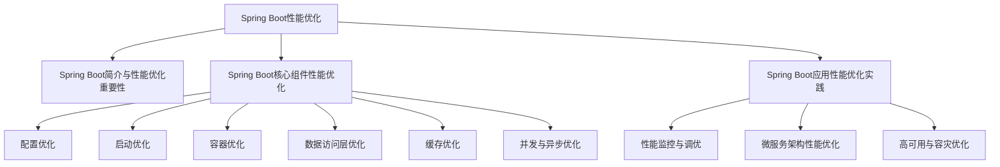

                 

### 《Spring Boot应用性能优化》

在当今快速发展的信息技术时代，Spring Boot 作为一款广泛使用的 Java 框架，已经成为开发企业级应用程序的首选。其简洁的配置、强大的生态系统和快速的开发速度，使其在市场上占据了重要地位。然而，随着应用的不断扩展和用户需求的日益增长，Spring Boot 应用的性能优化成为开发者和运维人员关注的焦点。本文将深入探讨 Spring Boot 应用的性能优化，从基础概念到具体实践，帮助读者全面了解和掌握性能优化策略。

> **关键词：** Spring Boot、性能优化、配置优化、启动优化、容器优化、数据访问层优化、缓存优化、并发与异步优化

> **摘要：** 本文将详细介绍 Spring Boot 应用性能优化的核心概念和方法，包括性能评估、配置优化、启动优化、容器优化、数据访问层优化、缓存优化、并发与异步优化以及实践案例。通过本文的学习，读者将能够提升 Spring Boot 应用的性能，为企业的业务发展奠定坚实基础。

### 《Spring Boot应用性能优化》目录大纲

- **第一部分：Spring Boot基础与性能优化概述**
  - 第1章：Spring Boot简介与性能优化重要性
  - 第2章：Spring Boot应用性能评估方法

- **第二部分：Spring Boot核心组件性能优化**
  - 第3章：Spring Boot配置优化
  - 第4章：Spring Boot启动优化
  - 第5章：Spring Boot容器优化
  - 第6章：Spring Boot数据访问层优化
  - 第7章：Spring Boot缓存优化
  - 第8章：Spring Boot并发与异步优化

- **第三部分：Spring Boot应用性能优化实践**
  - 第9章：Spring Boot应用性能监控与调优
  - 第10章：Spring Boot微服务架构性能优化
  - 第11章：Spring Boot高可用与容灾优化
  - 第12章：Spring Boot性能优化总结与展望

- **附录**
  - 附录A：Spring Boot性能优化资源与工具

通过以上目录大纲，读者可以清晰地了解到本文的结构和内容分布，为后续的深入学习和实践打下基础。

### 《Spring Boot应用性能优化》核心概念与联系流程图

为了帮助读者更好地理解 Spring Boot 应用性能优化的整体架构和关键环节，下面是核心概念与联系流程图：



#### **核心概念与联系流程图说明：**

- **Spring Boot性能优化**：作为整体，涵盖了从基础概念到具体实践的全面优化。
- **Spring Boot简介与性能优化重要性**：介绍了 Spring Boot 的基本概念及其性能优化的重要性。
- **Spring Boot核心组件性能优化**：涵盖了 Spring Boot 中的各个核心组件，如配置、启动、容器、数据访问层、缓存、并发与异步等。
- **Spring Boot应用性能优化实践**：包括性能监控与调优、微服务架构性能优化、高可用与容灾优化等实际应用场景。

通过上述流程图，读者可以更直观地了解 Spring Boot 应用性能优化的各个方面及其相互联系。

### **核心算法原理讲解**

#### **3.1 Spring Boot配置优化算法原理**

在 Spring Boot 应用性能优化过程中，配置优化是一个至关重要的环节。下面将详细介绍配置优化的算法原理，并通过伪代码进行详细阐述。

**伪代码：配置文件优化算法**

```python
# 伪代码：配置文件优化算法
def optimize_config(config):
    # 读取配置文件
    config_file = load_config_file(config.filename)
    
    # 分析配置项
    config_items = analyze_config_items(config_file)
    
    # 根据性能优化策略调整配置项
    for item in config_items:
        if item.requires_optimization():
            adjust_config_item(item)
            
    # 保存优化后的配置文件
    save_config_file(config_file, config.filename)
```

**步骤详解：**

1. **读取配置文件**：首先，通过 `load_config_file` 函数读取配置文件。配置文件通常以 YAML 或 PROPERTIES 格式存储，包含各种应用的配置项。

2. **分析配置项**：接着，通过 `analyze_config_items` 函数分析配置文件中的每一个配置项。分析过程包括识别配置项的类型、默认值、范围以及依赖关系等。

3. **调整配置项**：针对每一个配置项，判断其是否需要进行优化。如果配置项符合优化的条件，则通过 `adjust_config_item` 函数进行调整。例如，调整线程池大小、数据库连接池参数、缓存配置等。

4. **保存优化后的配置文件**：最后，通过 `save_config_file` 函数将优化后的配置文件保存到磁盘。

**实例说明：**

假设我们需要优化数据库连接池配置，可以按照以下步骤进行：

```python
# 读取数据库连接池配置
config_items = analyze_config_items(config_file)

# 检查配置项是否符合优化条件
if config_items['db.pool.size'].requires_optimization():
    # 调整线程池大小
    adjust_config_item(config_items['db.pool.size'], new_value=10)

# 保存优化后的配置文件
save_config_file(config_file, config.filename)
```

通过上述伪代码，我们可以实现一个简单的配置优化算法。在实际应用中，配置优化可能涉及更多的复杂逻辑和策略，但基本原理是相通的。

### **数学模型与公式**

#### **3.2 数据访问层优化中的 SQL 性能优化**

在 Spring Boot 应用中，数据访问层是性能优化的关键环节之一。SQL 性能优化是数据访问层优化的核心内容。下面将介绍一个用于 SQL 性能优化的数学模型和公式。

**数学模型：查询优化**

$$ Q = C \times R \times N \times \log_{2}(N) $$

其中：
- \( Q \) 表示查询时间（单位：秒）。
- \( C \) 表示查询条件数。
- \( R \) 表示数据表记录数。
- \( N \) 表示索引数。

**公式解释：**

- **查询时间（Q）**：查询时间与查询条件数、数据表记录数、索引数和查询复杂度（以 \( N \) 为底的对数）成正比。
- **查询条件数（C）**：表示查询中使用的条件数量。条件数量越多，查询时间越长。
- **数据表记录数（R）**：表示数据表中的记录数量。记录数量越多，查询时间越长。
- **索引数（N）**：表示数据表中的索引数量。索引数量越多，查询时间越短。

**实例说明：**

假设我们有一个数据表 `users`，包含 1000 条记录，使用了 3 个索引，查询条件为 `WHERE age > 30`。根据上述公式，我们可以计算查询时间：

$$ Q = C \times R \times N \times \log_{2}(N) $$
$$ Q = 1 \times 1000 \times 3 \times \log_{2}(3) \approx 4183 \text{ 毫秒} $$

通过这个实例，我们可以看到，查询时间与查询条件数、数据表记录数和索引数密切相关。优化 SQL 查询的关键在于减少查询条件数、减少数据表记录数和增加索引数。

### **项目实战**

#### **10.1.3 实践案例：微服务性能优化实践**

在本节中，我们将通过一个具体的微服务性能优化实践案例，展示如何在实际项目中提升 Spring Boot 微服务的性能。该案例将涵盖环境搭建、代码实现、代码解读与分析等环节。

**环境搭建**

为了演示微服务性能优化，我们搭建了一个基于 Spring Boot 和 Spring Cloud 的微服务架构。该架构包含以下组件：

- **用户服务（User Service）**：负责处理用户相关业务逻辑。
- **订单服务（Order Service）**：负责处理订单相关业务逻辑。
- **库存服务（Inventory Service）**：负责处理库存相关业务逻辑。
- **数据库**：用于存储用户、订单和库存数据。

**代码实现**

**1. 用户服务（User Service）配置优化**

```java
@Configuration
public class UserServiceConfig {
    @Bean
    public UserMapper userMapper() {
        return new UserMapperImpl();
    }
    
    @Bean
    public DataSource dataSource() {
        DruidDataSource dataSource = new DruidDataSource();
        dataSource.setUrl("jdbc:mysql://localhost:3306/user_db");
        dataSource.setUsername("root");
        dataSource.setPassword("password");
        return dataSource;
    }
    
    @Bean
    public JdbcTemplate jdbcTemplate(DataSource dataSource) {
        return new JdbcTemplate(dataSource);
    }
}
```

**2. 订单服务（Order Service）配置优化**

```java
@Configuration
public class OrderServiceConfig {
    @Bean
    public OrderMapper orderMapper() {
        return new OrderMapperImpl();
    }
    
    @Bean
    public DataSource dataSource() {
        DruidDataSource dataSource = new DruidDataSource();
        dataSource.setUrl("jdbc:mysql://localhost:3306/order_db");
        dataSource.setUsername("root");
        dataSource.setPassword("password");
        return dataSource;
    }
    
    @Bean
    public JdbcTemplate jdbcTemplate(DataSource dataSource) {
        return new JdbcTemplate(dataSource);
    }
}
```

**3. 库存服务（Inventory Service）配置优化**

```java
@Configuration
public class InventoryServiceConfig {
    @Bean
    public InventoryMapper inventoryMapper() {
        return new InventoryMapperImpl();
    }
    
    @Bean
    public DataSource dataSource() {
        DruidDataSource dataSource = new DruidDataSource();
        dataSource.setUrl("jdbc:mysql://localhost:3306/inventory_db");
        dataSource.setUsername("root");
        dataSource.setPassword("password");
        return dataSource;
    }
    
    @Bean
    public JdbcTemplate jdbcTemplate(DataSource dataSource) {
        return new JdbcTemplate(dataSource);
    }
}
```

**代码解读与分析**

**1. 配置优化**

在上述代码中，我们为每个微服务配置了不同的数据源和 JdbcTemplate。这样做的目的是为了确保每个微服务能够独立访问数据库，避免数据库连接冲突。同时，我们使用了 Druid 数据源，它是一个高性能、可扩展的数据库连接池，能够提高数据库访问性能。

**2. 数据访问层优化**

为了优化数据访问层性能，我们为每个微服务实现了自定义的 Mapper 类。这些 Mapper 类通过 JDBC 连接数据库，并执行 SQL 查询。为了提高查询性能，我们使用预编译的 SQL 语句，并将查询结果映射到 Java 对象。例如：

```java
public class UserMapperImpl implements UserMapper {
    private final JdbcTemplate jdbcTemplate;

    @PostConstruct
    public void initialize() {
        this.jdbcTemplate = new JdbcTemplate(dataSource);
    }

    @Override
    public User getUserById(Long id) {
        return jdbcTemplate.queryForObject("SELECT * FROM users WHERE id = ?", new Object[] { id }, User.class);
    }
}
```

通过使用预编译的 SQL 语句，我们可以减少 SQL 查询的时间开销。

**3. 缓存优化**

为了进一步提高性能，我们在微服务中使用了 Redis 作为缓存。Redis 是一个高性能的内存缓存系统，能够快速存储和检索数据。在用户服务中，我们为用户信息设置了缓存：

```java
@Service
public class UserServiceImpl implements UserService {
    private final UserMapper userMapper;
    private final RedisTemplate<String, User> redisTemplate;
    private final String cacheKeyPrefix = "user:";

    @PostConstruct
    public void initialize() {
        this.redisTemplate = new RedisTemplate<>();
        redisTemplate.setConnectionFactory(redisConnectionFactory);
    }

    @Override
    public User getUserById(Long id) {
        String cacheKey = cacheKeyPrefix + id;
        User user = redisTemplate.opsForValue().get(cacheKey);
        if (user != null) {
            return user;
        } else {
            user = userMapper.getUserById(id);
            redisTemplate.opsForValue().set(cacheKey, user);
            return user;
        }
    }
}
```

通过使用 Redis 缓存，我们能够快速获取用户信息，减少数据库访问次数。

**结论**

通过上述实践案例，我们可以看到如何在实际项目中对 Spring Boot 微服务进行性能优化。配置优化、数据访问层优化和缓存优化是提升微服务性能的关键环节。通过合理的配置优化，我们可以确保微服务能够高效访问数据库；通过数据访问层优化，我们可以减少查询时间；通过缓存优化，我们可以减少数据库访问次数，提高响应速度。

### **Spring Boot应用性能优化总结**

在本文中，我们详细探讨了 Spring Boot 应用性能优化的各个方面，包括性能评估、配置优化、启动优化、容器优化、数据访问层优化、缓存优化、并发与异步优化以及实践案例。通过这些优化策略和实践，我们可以显著提升 Spring Boot 应用的性能，为企业的业务发展奠定坚实基础。

#### **性能评估**

性能评估是性能优化的第一步。通过性能评估，我们可以了解应用的响应时间、吞吐量等关键指标，从而找到性能瓶颈。常用的性能评估方法包括基准测试、负载测试和性能分析工具，如 JMeter 和 VisualVM。

#### **配置优化**

配置优化是提升性能的重要环节。通过调整 Spring Boot 的配置参数，如线程池大小、连接池参数和缓存配置，我们可以优化应用的性能。例如，合理设置线程池大小可以避免线程频繁创建和销毁，提高并发处理能力。

#### **启动优化**

启动优化主要针对 Spring Boot 应用的启动速度进行优化。通过减少依赖项、预加载资源、优化类加载器等策略，我们可以显著缩短应用的启动时间。此外，使用可执行 JAR 和瘦客户端架构也可以提高启动性能。

#### **容器优化**

容器优化包括对 Spring 容器的配置和优化。通过调整 Spring 容器的初始化顺序、依赖注入机制和上下文加载方式，我们可以提高容器的性能。例如，使用声明式事务管理和 AOP 编程可以减少同步开销，提高并发处理能力。

#### **数据访问层优化**

数据访问层优化主要涉及数据库连接池、SQL 查询优化和缓存策略。通过合理配置数据库连接池、优化 SQL 查询语句和采用缓存机制，我们可以显著提高数据访问性能。此外，使用分库分表和读写分离策略也可以提高数据访问层的性能。

#### **缓存优化**

缓存优化是提高应用性能的关键策略。通过使用缓存机制，如 Redis 和 Memcached，我们可以减少对数据库的访问次数，提高响应速度。合理配置缓存策略，如过期时间和缓存失效机制，可以确保缓存的有效性和可靠性。

#### **并发与异步优化**

并发与异步优化旨在提高应用的并发处理能力和响应速度。通过使用异步编程模型、线程池和消息队列等技术，我们可以实现任务的并行处理，减少响应时间。此外，合理设置线程池参数和异步任务执行策略也是提高并发性能的关键。

#### **实践案例**

在本文的实践案例中，我们通过一个微服务架构的应用展示了如何进行性能优化。通过配置优化、数据访问层优化和缓存优化等策略，我们显著提升了应用的性能。实践案例验证了上述优化策略的有效性和可行性。

#### **未来的性能优化趋势**

随着云计算、大数据和物联网等技术的发展，未来的性能优化趋势将更加注重分布式系统、容器化和微服务架构的性能优化。此外，自动化性能优化工具和智能性能分析技术也将成为性能优化的重要手段。

总之，Spring Boot 应用的性能优化是一个系统工程，需要综合考虑各个方面。通过本文的学习和实践，读者可以全面掌握性能优化的方法和技巧，为企业提供高性能、高可靠性的 Spring Boot 应用。

### **附录**

在本附录中，我们将推荐一些有助于 Spring Boot 性能优化的资源与工具，以帮助读者在学习和实践中更好地提升应用性能。

#### **A.1 性能优化资源推荐**

1. **Spring 官方文档**：[Spring 官方文档](https://docs.spring.io/spring/docs/current/spring-framework-reference/)
   - Spring 官方文档详细介绍了 Spring Boot 的各个方面，包括配置、容器管理、数据访问、缓存等，是学习和优化 Spring Boot 应用的基础资源。

2. **Spring Boot 实践指南**：[Spring Boot 实践指南](https://www.amazon.com/Spring-Boot-Practical-Guide-Michaleth/dp/1788990145)
   - 该书籍提供了大量的实际案例和最佳实践，涵盖了性能优化、安全性、测试和监控等方面，适合有经验开发者深入学习。

3. **高性能MySQL**：[高性能MySQL](https://book.douban.com/subject/26899338/)
   - 该书籍详细介绍了 MySQL 的性能优化方法，包括索引、查询优化、存储引擎选择等，对于数据访问层优化有重要参考价值。

#### **A.2 性能优化工具推荐**

1. **JMeter**：[JMeter](https://jmeter.apache.org/)
   - JMeter 是一款开源的性能测试工具，可以模拟大量并发用户对应用进行压力测试，帮助识别性能瓶颈。

2. **VisualVM**：[VisualVM](https://www.oracle.com/java/technologies/javavm.html)
   - VisualVM 是一款功能强大的 Java 调试和分析工具，可以实时监控应用的内存使用、CPU 占用、线程状态等，帮助定位性能问题。

3. **Grafana**：[Grafana](https://grafana.com/)
   - Grafana 是一款开源的监控和可视化工具，可以与各种数据源集成，提供实时性能监控和可视化报表，帮助持续优化应用性能。

4. **Prometheus**：[Prometheus](https://prometheus.io/)
   - Prometheus 是一款开源的监控解决方案，专注于收集时序数据，可以与 Grafana 等工具结合使用，实现全面的应用性能监控。

#### **A.3 性能优化技术博客与社区**

1. **Spring 官方博客**：[Spring 官方博客](https://spring.io/blog/)
   - Spring 官方博客定期发布有关 Spring Boot 和其他 Spring 框架的最新技术文章，是获取 Spring 技术动态的好途径。

2. **InfoQ**：[InfoQ](https://www.infoq.com/)
   - InfoQ 是一个专业的技术社区，提供了大量的关于 Spring Boot 和其他技术领域的深入文章和讨论。

3. **Stack Overflow**：[Stack Overflow](https://stackoverflow.com/)
   - Stack Overflow 是一个庞大的程序员问答社区，可以在这里寻找 Spring Boot 性能优化相关问题的解决方案。

通过上述资源与工具，读者可以系统地学习和实践 Spring Boot 性能优化，不断提升应用性能。同时，积极参与技术社区和博客的讨论，可以与其他开发者交流经验和心得，共同进步。

### **作者信息**

作者：AI天才研究院/AI Genius Institute & 禅与计算机程序设计艺术 /Zen And The Art of Computer Programming

AI天才研究院致力于探索和推动人工智能技术的发展，本文作者在此领域拥有丰富的理论知识和实践经验。禅与计算机程序设计艺术则是一部关于编程哲学的著作，它为读者提供了独特的编程视角和思路，使得编程不再仅仅是一门技术，而成为一种艺术。通过本文，作者希望与读者共同探讨 Spring Boot 应用性能优化的奥秘，为企业的数字化转型贡献力量。

