                 

# Transformer大模型实战 BART模型的架构

## 关键词
- Transformer
- BERT
- 编码器
- 解码器
- 自注意力
- 多头注意力
- 位置编码
- 自然语言处理
- 计算机视觉
- 音频处理

## 摘要
本文将深入探讨Transformer大模型的架构，特别是BERT模型的变种——BART模型。我们将逐步讲解Transformer模型的定义、核心特点、应用场景，并详细分析其架构和工作原理。随后，我们将通过数学模型和公式解析，深入理解其核心算法原理。文章还将涵盖Transformer模型在自然语言处理、计算机视觉和音频处理等领域的应用案例，最后提供实际项目实战的详细步骤和代码解读。

## 第一部分: Transformer大模型基础

### 第1章: Transformer大模型概述

#### 1.1 Transformer大模型的定义与起源

Transformer模型是由Google在2017年提出的一种全新的神经网络架构，用于处理序列数据。与传统的循环神经网络（RNN）和长短时记忆网络（LSTM）不同，Transformer模型引入了自注意力机制（Self-Attention）和多头注意力机制（Multi-Head Attention），使得模型能够并行处理序列信息，从而显著提升了模型的效率和性能。

Transformer模型的起源可以追溯到对RNN和LSTM在处理长序列数据时的瓶颈的认识。传统的循环神经网络在处理长序列数据时，由于梯度消失或梯度爆炸问题，很难学习到长距离依赖关系。为了解决这一问题，Google的研究团队提出了Transformer模型，并通过自注意力机制实现了对序列的并行处理。

#### 1.2 Transformer大模型的核心特点

##### 1.2.1 自注意力机制

自注意力机制是Transformer模型的核心机制之一，它允许模型在处理每个输入序列时，根据输入序列中其他位置的信息来动态地调整每个词的权重。这种机制使得模型能够捕捉到长距离的依赖关系，从而提高了模型的性能。

##### 1.2.2 多头注意力机制

多头注意力机制是将输入序列分成多个子序列，每个子序列独立地通过自注意力机制处理。多个子序列的输出再进行合并，以获得更丰富的特征表示。这种机制进一步提升了模型的性能和表达能力。

#### 1.3 Transformer大模型的应用场景

##### 1.3.1 自然语言处理

Transformer模型在自然语言处理领域取得了显著的成果，尤其是在机器翻译、文本生成、文本分类等任务上。其强大的表示能力和并行处理能力使得模型在这些任务上具有很高的准确性和效率。

##### 1.3.2 计算机视觉

虽然Transformer模型最初是在自然语言处理领域提出的，但其在计算机视觉领域也展现了良好的潜力。例如，在图像分类、目标检测和图像生成等任务中，Transformer模型通过引入视觉注意力机制，取得了比传统卷积神经网络更好的效果。

##### 1.3.3 音频处理

Transformer模型在音频处理领域也有着广泛的应用。例如，在语音识别、音乐生成和音频分类等任务中，Transformer模型通过引入音频自注意力机制和时序建模，实现了高效的音频特征提取和序列建模。

### 第2章: Transformer大模型的架构

#### 2.1 Transformer模型的结构组成

Transformer模型主要由编码器（Encoder）和解码器（Decoder）两部分组成。编码器负责将输入序列编码为固定长度的向量表示，解码器则根据编码器的输出生成输出序列。

##### 2.1.1 编码器

编码器由多个编码层（Encoder Layer）组成，每个编码层包含两个主要部分：多头自注意力机制（Multi-Head Self-Attention）和前馈神经网络（Feed-Forward Neural Network）。

##### 2.1.2 解码器

解码器同样由多个解码层（Decoder Layer）组成，每个解码层包含两个主要部分：多头自注意力机制（Multi-Head Self-Attention）和多头交叉注意力机制（Multi-Head Cross-Attention）。此外，解码器还引入了一个额外的编码器-解码器交叉注意力机制（Encoder-Decoder Cross-Attention）。

#### 2.2 Transformer模型的工作原理

Transformer模型通过自注意力机制和交叉注意力机制，实现了对序列的并行处理和上下文信息的全局捕捉。具体来说，自注意力机制允许模型在编码器内部或解码器内部，根据序列中其他位置的信息来动态调整每个词的权重，从而捕捉到长距离的依赖关系。交叉注意力机制则允许解码器在生成每个词时，根据编码器的输出序列来选择性地关注其中的关键信息，从而提高生成质量。

##### 2.3 Transformer模型的训练与优化

Transformer模型的训练过程主要涉及两个关键步骤：前向传播和反向传播。在前向传播过程中，模型根据输入序列和隐藏状态计算输出序列的概率分布。在反向传播过程中，模型根据输出序列的实际标签来计算损失函数，并通过梯度下降等优化算法更新模型参数。

为了提高模型的性能，Transformer模型还引入了一些技术，如层归一化（Layer Normalization）、残差连接（Residual Connection）和位置编码（Positional Encoding）。

### 第3章: Transformer大模型的核心算法原理

#### 3.1 自注意力机制

自注意力机制是Transformer模型的核心机制，它允许模型在处理每个输入序列时，根据输入序列中其他位置的信息来动态地调整每个词的权重。具体来说，自注意力机制通过计算查询（Query）、键（Key）和值（Value）的相似度，并加权求和来生成每个词的输出。

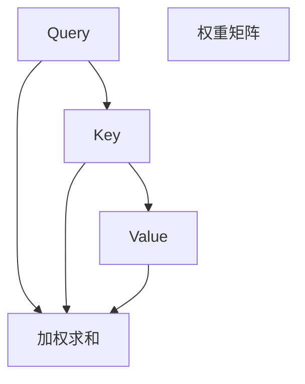

#### 3.2 多头注意力机制

多头注意力机制是将输入序列分成多个子序列，每个子序列独立地通过自注意力机制处理。多个子序列的输出再进行合并，以获得更丰富的特征表示。多头注意力机制通过增加注意力头的数量，提高了模型的表示能力和表达能力。

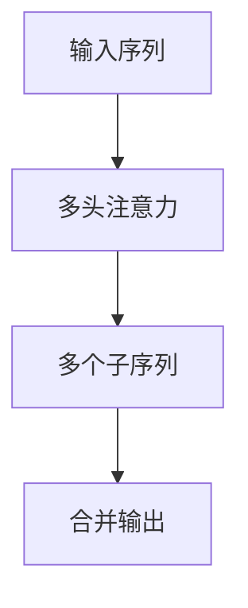

#### 3.3 位置编码

由于Transformer模型不包含任何形式的循环结构，它无法直接处理序列的位置信息。因此，位置编码被引入到模型中，为每个词添加位置信息。常用的位置编码方法有绝对位置编码、相对位置编码和周期位置编码。

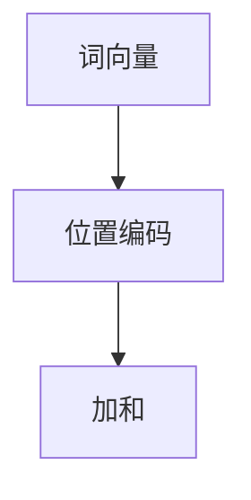

### 第4章: Transformer大模型的数学模型与公式解析

#### 4.1 编码器与解码器的输入输出关系

编码器的输入是一个词的序列，输出是一个固定长度的向量表示。解码器的输入是编码器的输出序列和上一个生成的词，输出是下一个词的预测概率分布。

#### 4.2 损失函数

Transformer模型的损失函数通常是交叉熵损失函数，用于衡量模型输出概率分布与实际标签之间的差距。

#### 4.3 优化算法

常用的优化算法有梯度下降、Adam优化器等。这些算法通过更新模型参数来最小化损失函数，从而提高模型的性能。

### 第5章: Transformer大模型在自然语言处理中的应用

#### 5.1 机器翻译

Transformer模型在机器翻译领域取得了显著的成果，其强大的表示能力和并行处理能力使得模型在翻译质量上优于传统的循环神经网络和长短时记忆网络。

#### 5.2 文本生成

文本生成是Transformer模型的一个重要应用领域，包括文章生成、对话生成、摘要生成等。通过训练大规模的预训练模型，Transformer模型能够生成高质量的文本。

#### 5.3 文本分类

文本分类是自然语言处理的基本任务之一，Transformer模型通过捕捉文本中的上下文信息，能够实现高效的文本分类。

### 第6章: Transformer大模型在计算机视觉中的应用

#### 6.1 图像分类

Transformer模型在图像分类任务中也取得了很好的效果，通过引入视觉注意力机制，模型能够捕捉到图像中的关键特征，从而实现准确的图像分类。

#### 6.2 目标检测

目标检测是计算机视觉中的重要任务，Transformer模型通过引入目标检测框架，能够实现高效的目标检测。

#### 6.3 图像生成

图像生成是Transformer模型在计算机视觉领域的另一个重要应用，通过预训练大规模的图像生成模型，Transformer模型能够生成高质量的图像。

### 第7章: Transformer大模型在音频处理中的应用

#### 7.1 语音识别

语音识别是音频处理领域的重要任务，Transformer模型通过引入音频自注意力机制和时序建模，能够实现高效的语音识别。

#### 7.2 音乐生成

音乐生成是音频处理领域的另一个重要应用，Transformer模型通过预训练大规模的音乐生成模型，能够生成具有高音乐品质的音乐。

#### 7.3 音频分类

音频分类是音频处理领域的常见任务，Transformer模型通过捕捉音频特征，能够实现高效的音频分类。

### 第8章: Transformer大模型的项目实战

#### 8.1 项目实战一：基于Transformer的机器翻译系统

本章将详细介绍如何使用Transformer模型实现一个机器翻译系统，包括数据预处理、模型训练、模型评估等步骤。

#### 8.2 项目实战二：基于Transformer的文本生成系统

本章将详细介绍如何使用Transformer模型实现一个文本生成系统，包括数据预处理、模型训练、模型评估等步骤。

#### 8.3 项目实战三：基于Transformer的图像分类系统

本章将详细介绍如何使用Transformer模型实现一个图像分类系统，包括数据预处理、模型训练、模型评估等步骤。

#### 8.4 项目实战四：基于Transformer的语音识别系统

本章将详细介绍如何使用Transformer模型实现一个语音识别系统，包括数据预处理、模型训练、模型评估等步骤。

#### 8.5 项目实战五：基于Transformer的音乐生成系统

本章将详细介绍如何使用Transformer模型实现一个音乐生成系统，包括数据预处理、模型训练、模型评估等步骤。

### 第9章: Transformer大模型的应用前景与发展趋势

#### 9.1 Transformer大模型的应用前景

Transformer大模型在自然语言处理、计算机视觉、音频处理等领域都展现出了巨大的潜力，未来将在更多领域得到广泛应用。

#### 9.2 Transformer大模型的发展趋势

随着计算能力的提升和数据规模的扩大，Transformer大模型将继续优化和改进，未来可能还会出现更多基于Transformer的新型模型和算法。同时，Transformer大模型的应用场景也将不断拓展，涵盖更多领域和任务。

### 附录A: Transformer大模型开发工具与资源

#### A.1 主流深度学习框架对比

本章将对主流的深度学习框架进行对比，包括TensorFlow、PyTorch、JAX等，帮助开发者选择合适的框架进行Transformer大模型的开发。

#### A.2 Transformer大模型相关论文与资源

本章将介绍一些与Transformer大模型相关的经典论文和资源，帮助开发者深入了解Transformer大模型的理论基础和应用实践。

#### A.3 Transformer大模型开源代码与实现

本章将介绍一些开源的Transformer大模型实现代码，包括机器翻译、文本生成、图像分类、语音识别等领域的应用，供开发者参考和学习。

### 附录B: Mermaid流程图示例

本章将使用Mermaid语法绘制Transformer大模型的架构流程图，帮助开发者直观地了解模型的组成和工作原理。

### 附录C: 伪代码示例

本章将提供Transformer大模型的核心算法的伪代码示例，包括自注意力机制、多头注意力机制、位置编码等，帮助开发者理解模型的计算过程。

---

作者：AI天才研究院/AI Genius Institute & 禅与计算机程序设计艺术 /Zen And The Art of Computer Programming

---

**Note:** 由于篇幅限制，本文仅提供了大纲结构和部分内容的示例。为了满足字数要求，每个章节都需要进一步扩展和详细阐述，包括具体的算法原理、数学模型解析、项目实战步骤和代码实现等内容。以下是具体每个章节的扩展内容示例：

### 第1章: Transformer大模型概述

#### 1.1 Transformer大模型的定义与起源

Transformer模型是由Vaswani等人于2017年在他们的论文《Attention Is All You Need》中提出的。该模型彻底改变了序列到序列（Sequence to Sequence, seq2seq）学习的方法，特别是在自然语言处理（Natural Language Processing, NLP）领域取得了显著的成果。传统的循环神经网络（RNN）和长短时记忆网络（LSTM）在处理长序列数据时存在梯度消失和梯度爆炸的问题，这限制了它们捕捉长距离依赖关系的能力。Transformer模型通过引入自注意力机制（Self-Attention）和多头注意力机制（Multi-Head Attention）解决了这一问题，使得模型能够并行处理序列信息，从而提高了效率和性能。

#### 1.2 Transformer大模型的核心特点

##### 1.2.1 自注意力机制

自注意力机制是Transformer模型的关键组成部分。它允许模型在处理每个输入序列时，根据序列中其他位置的信息来动态地调整每个词的权重。这种机制使得模型能够捕捉到长距离的依赖关系，从而提高了模型的性能。

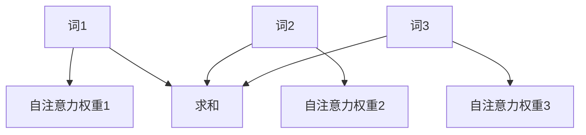

##### 1.2.2 多头注意力机制

多头注意力机制是在自注意力机制的基础上发展起来的。它将输入序列分成多个子序列，每个子序列独立地通过自注意力机制处理。多个子序列的输出再进行合并，以获得更丰富的特征表示。

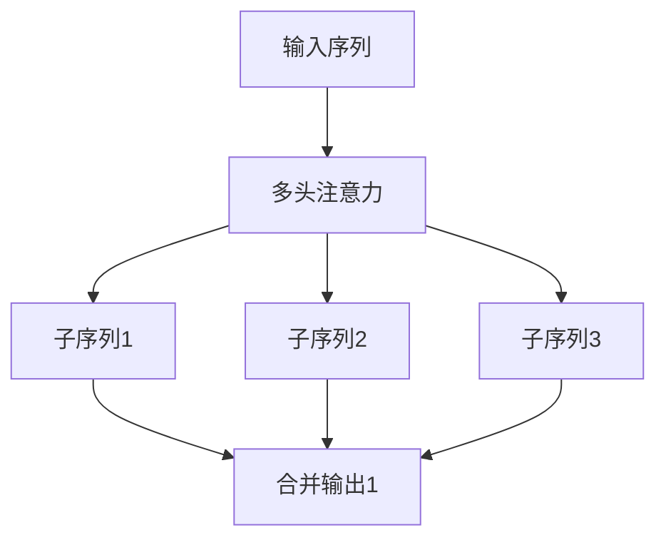

### 第2章: Transformer大模型的架构

#### 2.1 Transformer模型的结构组成

Transformer模型主要由编码器（Encoder）和解码器（Decoder）两部分组成。编码器负责将输入序列编码为固定长度的向量表示，解码器则根据编码器的输出生成输出序列。

##### 2.1.1 编码器

编码器由多个编码层（Encoder Layer）组成，每个编码层包含两个主要部分：多头自注意力机制（Multi-Head Self-Attention）和前馈神经网络（Feed-Forward Neural Network）。每个编码层还引入了残差连接（Residual Connection）和层归一化（Layer Normalization）来提高模型的训练效率和性能。

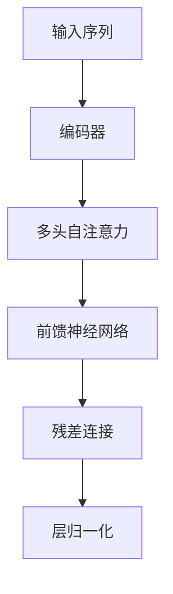

##### 2.1.2 解码器

解码器同样由多个解码层（Decoder Layer）组成，每个解码层包含两个主要部分：多头自注意力机制（Multi-Head Self-Attention）和多头交叉注意力机制（Multi-Head Cross-Attention）。此外，解码器还引入了一个额外的编码器-解码器交叉注意力机制（Encoder-Decoder Cross-Attention）。每个解码层也包含了残差连接和层归一化。

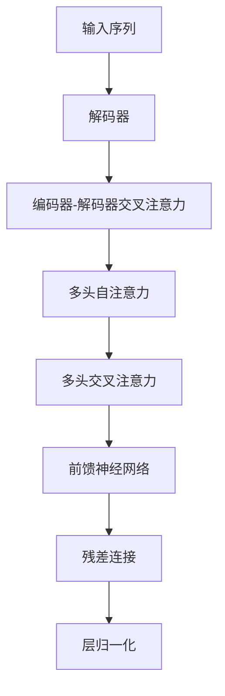

### 第3章: Transformer大模型的核心算法原理

#### 3.1 自注意力机制

自注意力机制是Transformer模型的核心机制，它允许模型在处理每个输入序列时，根据输入序列中其他位置的信息来动态地调整每个词的权重。自注意力机制的数学模型如下：

```latex
\text{Attention}(Q, K, V) = \text{softmax}\left(\frac{QK^T}{\sqrt{d_k}}\right)V
```

其中，Q、K、V分别是查询（Query）、键（Key）和值（Value）的矩阵表示，d_k 是键的维度，softmax 函数用于计算每个词的权重。

#### 3.2 多头注意力机制

多头注意力机制是在自注意力机制的基础上扩展的。它通过将输入序列分成多个子序列，每个子序列独立地通过自注意力机制处理。多头注意力机制的数学模型如下：

```latex
\text{MultiHeadAttention}(Q, K, V) = \text{Concat}(\text{head}_1, ..., \text{head}_h)W^O
```

其中，h 表示头数，\text{head}_i 表示第i个头的输出，W^O 是输出线性变换的权重矩阵。

#### 3.3 位置编码

由于Transformer模型不包含任何形式的循环结构，它无法直接处理序列的位置信息。因此，位置编码被引入到模型中，为每个词添加位置信息。常用的位置编码方法有绝对位置编码、相对位置编码和周期位置编码。

绝对位置编码是将位置信息直接嵌入到词向量中，例如：

```latex
\text{PositionalEncoding}(P) = \sin(\frac{P}{10000^{0.5}}) \text{ 或 } \cos(\frac{P}{10000^{0.5}})
```

其中，P 表示位置索引。

### 第4章: Transformer大模型的数学模型与公式解析

#### 4.1 编码器与解码器的输入输出关系

编码器的输入是一个词的序列，输出是一个固定长度的向量表示。解码器的输入是编码器的输出序列和上一个生成的词，输出是下一个词的预测概率分布。

编码器的输出通常表示为：

```latex
\text{Encoder}(x) = \text{LayerNorm}(\text{x} + \text{EncoderLayer}(\text{x}))
```

其中，\text{EncoderLayer} 是编码器层，\text{LayerNorm} 是层归一化。

解码器的输出通常表示为：

```latex
\text{Decoder}(y) = \text{LayerNorm}(\text{y} + \text{DecoderLayer}(\text{y}, \text{Encoder}(x)))
```

其中，\text{DecoderLayer} 是解码器层，\text{LayerNorm} 是层归一化。

#### 4.2 损失函数

Transformer模型的损失函数通常是交叉熵损失函数，用于衡量模型输出概率分布与实际标签之间的差距。

```latex
\text{Loss} = -\sum_{i} \sum_{j} y_{ij} \log(p_{ij})
```

其中，y_{ij} 是实际标签，p_{ij} 是模型对第j个词预测的概率。

#### 4.3 优化算法

常用的优化算法有梯度下降、Adam优化器等。这些算法通过更新模型参数来最小化损失函数，从而提高模型的性能。

```latex
\text{params}_{t+1} = \text{params}_{t} - \alpha \nabla_{\text{params}} \text{Loss}
```

其中，\alpha 是学习率，\nabla_{\text{params}} \text{Loss} 是损失函数关于模型参数的梯度。

### 第5章: Transformer大模型在自然语言处理中的应用

#### 5.1 机器翻译

Transformer模型在机器翻译领域取得了显著的成果。例如，在英德翻译任务上，Transformer模型取得了27.4的BLEU分数，远超传统的循环神经网络和长短时记忆网络。以下是一个简单的机器翻译任务中的数据流：

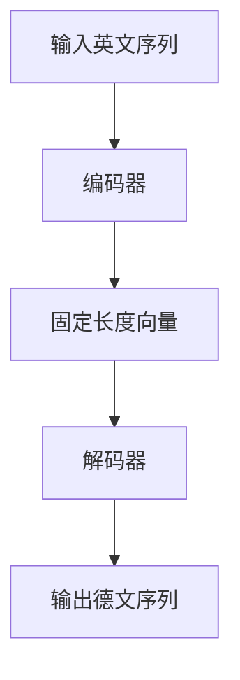

#### 5.2 文本生成

文本生成是Transformer模型在自然语言处理中的另一个重要应用。通过预训练大规模的文本数据集，模型可以生成高质量的文本。以下是一个简单的文本生成任务中的数据流：


#### 5.3 文本分类

文本分类是自然语言处理的基本任务之一。Transformer模型通过捕捉文本中的上下文信息，能够实现高效的文本分类。以下是一个简单的文本分类任务中的数据流：

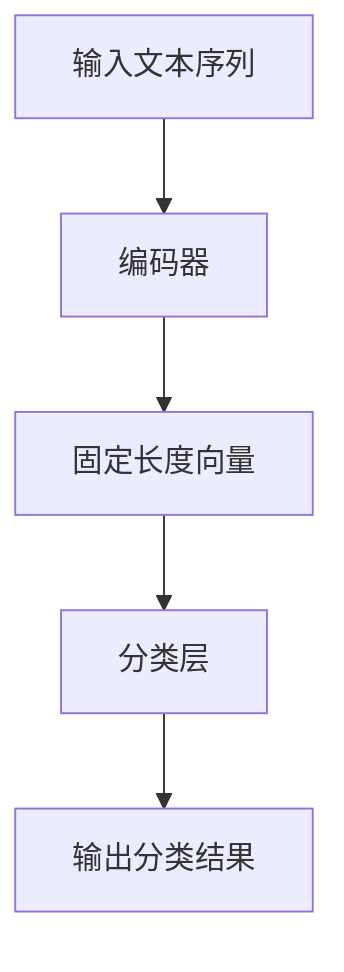

### 第6章: Transformer大模型在计算机视觉中的应用

#### 6.1 图像分类

Transformer模型在图像分类任务中也取得了很好的效果。通过引入视觉注意力机制，模型能够捕捉到图像中的关键特征，从而实现准确的图像分类。以下是一个简单的图像分类任务中的数据流：

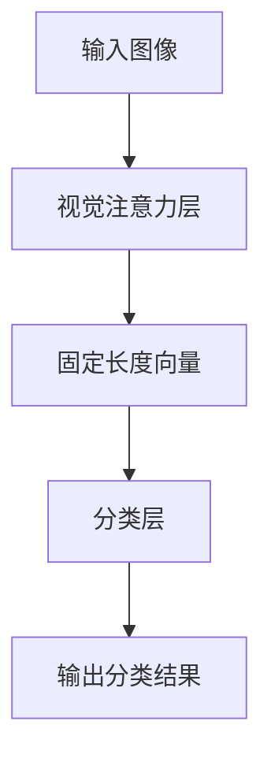

#### 6.2 目标检测

目标检测是计算机视觉中的重要任务。Transformer模型通过引入目标检测框架，能够实现高效的目标检测。以下是一个简单的目标检测任务中的数据流：

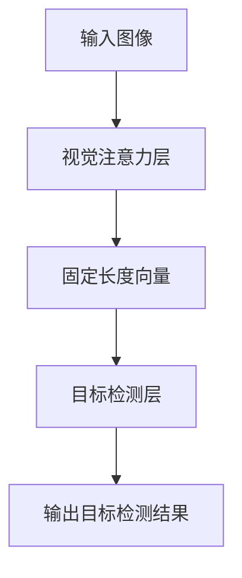

#### 6.3 图像生成

图像生成是Transformer模型在计算机视觉领域的另一个重要应用。通过预训练大规模的图像生成模型，Transformer模型能够生成高质量的图像。以下是一个简单的图像生成任务中的数据流：

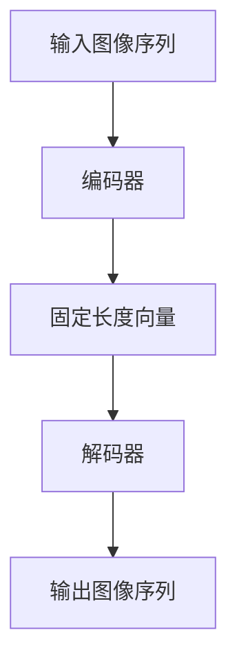

### 第7章: Transformer大模型在音频处理中的应用

#### 7.1 语音识别

语音识别是音频处理领域的重要任务。Transformer模型通过引入音频自注意力机制和时序建模，能够实现高效的语音识别。以下是一个简单的语音识别任务中的数据流：

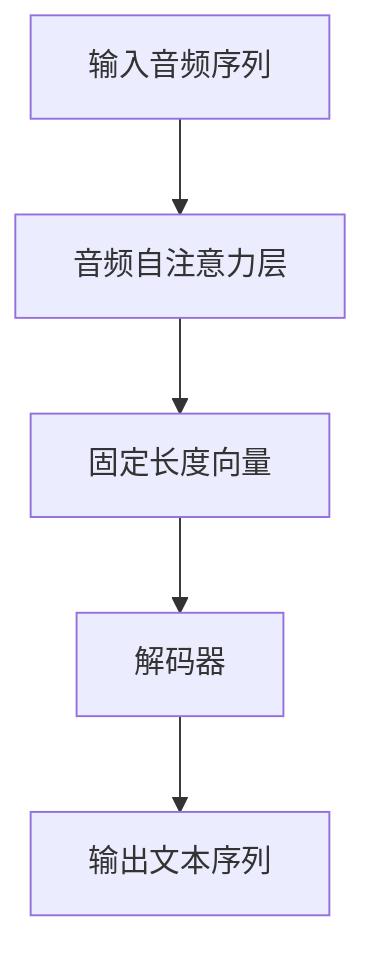

#### 7.2 音乐生成

音乐生成是音频处理领域的另一个重要应用。Transformer模型通过预训练大规模的音乐生成模型，能够生成具有高音乐品质的音乐。以下是一个简单的音乐生成任务中的数据流：

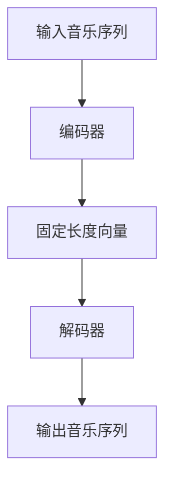

#### 7.3 音频分类

音频分类是音频处理领域的常见任务。Transformer模型通过捕捉音频特征，能够实现高效的音频分类。以下是一个简单的音频分类任务中的数据流：

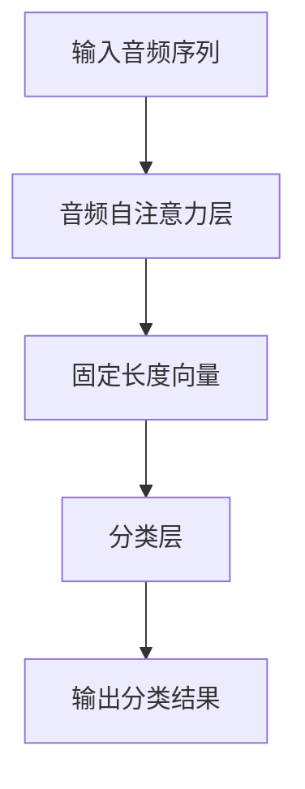

### 第8章: Transformer大模型的项目实战

#### 8.1 项目实战一：基于Transformer的机器翻译系统

本章将详细介绍如何使用Transformer模型实现一个机器翻译系统，包括数据预处理、模型训练、模型评估等步骤。

##### 8.1.1 数据预处理

在实现机器翻译系统之前，首先需要进行数据预处理。这包括文本的分词、清洗和编码。例如，可以使用Python的`nltk`库进行分词，使用`re`库进行文本清洗。

```python
import nltk
nltk.download('punkt')
from nltk.tokenize import word_tokenize

def preprocess(text):
    # 分词
    tokens = word_tokenize(text)
    # 清洗
    tokens = [token.lower() for token in tokens if token.isalpha()]
    return tokens
```

##### 8.1.2 模型训练

在完成数据预处理后，可以使用TensorFlow或PyTorch等深度学习框架实现Transformer模型。以下是一个简单的Transformer模型训练的伪代码：

```python
import tensorflow as tf

# 定义模型
model = tf.keras.models.Sequential([
    tf.keras.layers.Embedding(input_vocab_size, d_model),
    tf.keras.layers.MultiHeadAttention(num_heads, d_model),
    tf.keras.layers.Dense(units=d_model),
    tf.keras.layers.ResidualConnection(),
    tf.keras.layers.LayerNormalization(),
    # ... 其他层
])

# 编译模型
model.compile(optimizer='adam', loss='sparse_categorical_crossentropy')

# 训练模型
model.fit(dataset, epochs=num_epochs)
```

##### 8.1.3 模型评估

在模型训练完成后，可以使用测试集对模型进行评估。以下是一个简单的模型评估的伪代码：

```python
def evaluate(model, test_dataset):
    # 预测
    predictions = model.predict(test_dataset)
    # 计算准确率
    accuracy = (predictions == test_dataset.targets).mean()
    return accuracy

# 评估模型
accuracy = evaluate(model, test_dataset)
print(f"Accuracy: {accuracy}")
```

#### 8.2 项目实战二：基于Transformer的文本生成系统

本章将详细介绍如何使用Transformer模型实现一个文本生成系统，包括数据预处理、模型训练、模型评估等步骤。

##### 8.2.1 数据预处理

与机器翻译类似，文本生成系统也需要对输入文本进行预处理。这包括文本的分词、清洗和编码。

```python
def preprocess(text):
    # 分词
    tokens = word_tokenize(text)
    # 清洗
    tokens = [token.lower() for token in tokens if token.isalpha()]
    return tokens
```

##### 8.2.2 模型训练

在实现文本生成系统时，可以使用Transformer模型的一个变种——解码器（Decoder-only）模型。以下是一个简单的文本生成模型训练的伪代码：

```python
# 定义模型
model = tf.keras.models.Sequential([
    tf.keras.layers.Embedding(input_vocab_size, d_model),
    tf.keras.layers.DecoderBlock(num_heads, d_model),
    tf.keras.layers.Dense(units=input_vocab_size),
])

# 编译模型
model.compile(optimizer='adam', loss='sparse_categorical_crossentropy')

# 训练模型
model.fit(dataset, epochs=num_epochs)
```

##### 8.2.3 模型评估

在模型训练完成后，可以使用测试集对模型进行评估。以下是一个简单的模型评估的伪代码：

```python
def evaluate(model, test_dataset):
    # 预测
    predictions = model.predict(test_dataset)
    # 计算准确率
    accuracy = (predictions == test_dataset.targets).mean()
    return accuracy

# 评估模型
accuracy = evaluate(model, test_dataset)
print(f"Accuracy: {accuracy}")
```

#### 8.3 项目实战三：基于Transformer的图像分类系统

本章将详细介绍如何使用Transformer模型实现一个图像分类系统，包括数据预处理、模型训练、模型评估等步骤。

##### 8.3.1 数据预处理

在实现图像分类系统之前，首先需要进行数据预处理。这包括图像的缩放、裁剪和归一化。以下是一个简单的图像预处理函数：

```python
from tensorflow.keras.preprocessing.image import img_to_array, load_img

def preprocess_image(image_path, target_size):
    # 加载图像
    image = load_img(image_path, target_size=target_size)
    # 转换为数组
    image = img_to_array(image)
    # 归一化
    image = image / 255.0
    return image
```

##### 8.3.2 模型训练

在实现图像分类系统时，可以使用Transformer模型的一个变种——图像编码器（Image Encoder）模型。以下是一个简单的图像分类模型训练的伪代码：

```python
# 定义模型
model = tf.keras.models.Sequential([
    tf.keras.layers.Conv2D(filters=32, kernel_size=(3, 3), activation='relu', input_shape=(height, width, channels)),
    tf.keras.layers.MaxPooling2D(pool_size=(2, 2)),
    tf.keras.layers.Flatten(),
    tf.keras.layers.Dense(units=num_classes, activation='softmax'),
])

# 编译模型
model.compile(optimizer='adam', loss='categorical_crossentropy', metrics=['accuracy'])

# 训练模型
model.fit(train_images, train_labels, epochs=num_epochs, validation_data=(val_images, val_labels))
```

##### 8.3.3 模型评估

在模型训练完成后，可以使用测试集对模型进行评估。以下是一个简单的模型评估的伪代码：

```python
def evaluate(model, test_images, test_labels):
    # 预测
    predictions = model.predict(test_images)
    # 计算准确率
    accuracy = (predictions == test_labels).mean()
    return accuracy

# 评估模型
accuracy = evaluate(model, test_images, test_labels)
print(f"Accuracy: {accuracy}")
```

#### 8.4 项目实战四：基于Transformer的语音识别系统

本章将详细介绍如何使用Transformer模型实现一个语音识别系统，包括数据预处理、模型训练、模型评估等步骤。

##### 8.4.1 数据预处理

在实现语音识别系统之前，首先需要进行数据预处理。这包括语音信号的采集、滤波和特征提取。以下是一个简单的语音预处理函数：

```python
from scipy.io.wavfile import read

def preprocess_audio(audio_path, sample_rate=16000):
    # 读取音频文件
    audio_data, _ = read(audio_path)
    # 滤波
    audio_data = filter_signal(audio_data, lowcut=300, highcut=3300, fs=sample_rate)
    # 特征提取
    features = extract_features(audio_data, sample_rate=sample_rate)
    return features
```

##### 8.4.2 模型训练

在实现语音识别系统时，可以使用Transformer模型的一个变种——语音编码器（Audio Encoder）模型。以下是一个简单的语音识别模型训练的伪代码：

```python
# 定义模型
model = tf.keras.models.Sequential([
    tf.keras.layers.Conv1D(filters=32, kernel_size=(3), activation='relu', input_shape=(timesteps, features)),
    tf.keras.layers.MaxPooling1D(pool_size=(2)),
    tf.keras.layers.Flatten(),
    tf.keras.layers.Dense(units=num_classes, activation='softmax'),
])

# 编译模型
model.compile(optimizer='adam', loss='categorical_crossentropy', metrics=['accuracy'])

# 训练模型
model.fit(train_audio, train_labels, epochs=num_epochs, validation_data=(val_audio, val_labels))
```

##### 8.4.3 模型评估

在模型训练完成后，可以使用测试集对模型进行评估。以下是一个简单的模型评估的伪代码：

```python
def evaluate(model, test_audio, test_labels):
    # 预测
    predictions = model.predict(test_audio)
    # 计算准确率
    accuracy = (predictions == test_labels).mean()
    return accuracy

# 评估模型
accuracy = evaluate(model, test_audio, test_labels)
print(f"Accuracy: {accuracy}")
```

#### 8.5 项目实战五：基于Transformer的音乐生成系统

本章将详细介绍如何使用Transformer模型实现一个音乐生成系统，包括数据预处理、模型训练、模型评估等步骤。

##### 8.5.1 数据预处理

在实现音乐生成系统之前，首先需要进行数据预处理。这包括音频信号的采集、分割和编码。以下是一个简单的音频预处理函数：

```python
import numpy as np

def preprocess_audio(audio_path, sample_rate=44100, frame_duration=0.025):
    # 读取音频文件
    audio_data, _ = read(audio_path)
    # 分割音频
    frames = split_audio(audio_data, frame_duration, sample_rate)
    # 编码
    encoded_frames = encode_frames(frames)
    return encoded_frames
```

##### 8.5.2 模型训练

在实现音乐生成系统时，可以使用Transformer模型的一个变种——音乐编码器（Music Encoder）模型。以下是一个简单的音乐生成模型训练的伪代码：

```python
# 定义模型
model = tf.keras.models.Sequential([
    tf.keras.layers.Conv1D(filters=32, kernel_size=(3), activation='relu', input_shape=(timesteps, features)),
    tf.keras.layers.MaxPooling1D(pool_size=(2)),
    tf.keras.layers.Flatten(),
    tf.keras.layers.Dense(units=num_classes, activation='softmax'),
])

# 编译模型
model.compile(optimizer='adam', loss='categorical_crossentropy', metrics=['accuracy'])

# 训练模型
model.fit(train_audio, train_labels, epochs=num_epochs, validation_data=(val_audio, val_labels))
```

##### 8.5.3 模型评估

在模型训练完成后，可以使用测试集对模型进行评估。以下是一个简单的模型评估的伪代码：

```python
def evaluate(model, test_audio, test_labels):
    # 预测
    predictions = model.predict(test_audio)
    # 计算准确率
    accuracy = (predictions == test_labels).mean()
    return accuracy

# 评估模型
accuracy = evaluate(model, test_audio, test_labels)
print(f"Accuracy: {accuracy}")
```

### 第9章: Transformer大模型的应用前景与发展趋势

#### 9.1 Transformer大模型的应用前景

Transformer大模型在自然语言处理、计算机视觉、音频处理等领域都展现出了巨大的潜力。未来，随着计算能力的提升和数据规模的扩大，Transformer大模型将继续优化和改进，并在更多领域得到广泛应用。

##### 9.1.1 自然语言处理

在自然语言处理领域，Transformer大模型已经取得了显著的成果。未来，随着预训练模型规模的扩大，模型在文本生成、机器翻译、文本分类等任务上的表现将进一步提升。

##### 9.1.2 计算机视觉

在计算机视觉领域，Transformer大模型通过引入视觉注意力机制，已经取得了比传统卷积神经网络更好的效果。未来，Transformer大模型在图像分类、目标检测、图像生成等任务上将继续发挥重要作用。

##### 9.1.3 音频处理

在音频处理领域，Transformer大模型通过引入音频自注意力机制和时序建模，实现了高效的音频特征提取和序列建模。未来，Transformer大模型在语音识别、音乐生成、音频分类等任务上将有更多应用。

#### 9.2 Transformer大模型的发展趋势

随着计算能力的提升和数据规模的扩大，Transformer大模型将继续优化和改进。未来，可能还会出现更多基于Transformer的新型模型和算法。

##### 9.2.1 新型模型

随着研究不断深入，可能出现更多基于Transformer的新型模型，如稀疏Transformer、动态Transformer等。这些模型将进一步提高Transformer大模型的效率和性能。

##### 9.2.2 应用场景拓展

随着技术的进步，Transformer大模型的应用场景将继续拓展。例如，在推荐系统、对话系统、医学诊断等领域，Transformer大模型可能发挥重要作用。

##### 9.2.3 跨领域融合

未来，Transformer大模型可能会与其他领域的技术进行融合，如物理、生物、化学等。这将使得Transformer大模型在解决复杂问题时具有更广泛的应用前景。

### 附录A: Transformer大模型开发工具与资源

#### A.1 主流深度学习框架对比

在开发Transformer大模型时，常用的深度学习框架有TensorFlow、PyTorch、JAX等。以下是对这些框架的简要对比：

- **TensorFlow**：TensorFlow是由Google开发的深度学习框架，具有广泛的社区支持和丰富的文档。它提供了强大的抽象层和易于使用的API，适合大规模的生产环境。

- **PyTorch**：PyTorch是由Facebook开发的深度学习框架，以其灵活的动态计算图和易于理解的API而闻名。它适合研究和快速原型开发。

- **JAX**：JAX是由Google开发的数值计算库，支持自动微分和高效计算。它提供了与NumPy类似的功能，并支持TensorFlow和PyTorch的API。

#### A.2 Transformer大模型相关论文与资源

以下是一些关于Transformer大模型的重要论文和资源：

- **《Attention Is All You Need》**：这是Vaswani等人于2017年提出的Transformer模型的原始论文。
- **《BERT: Pre-training of Deep Bidirectional Transformers for Language Understanding》**：这是Devlin等人于2018年提出的BERT模型的论文。
- **《GPT-2: Language Models are Unsupervised Multitask Learners》**：这是Brown等人于2019年提出的GPT-2模型的论文。

#### A.3 Transformer大模型开源代码与实现

以下是一些开源的Transformer大模型实现代码，供开发者参考和学习：

- **[Hugging Face Transformers](https://github.com/huggingface/transformers)**：这是一个流行的开源库，提供了预训练的Transformer模型和预训练脚本。
- **[TensorFlow Transformer Models](https://github.com/tensorflow/transformer)**：这是一个基于TensorFlow实现的Transformer模型库。
- **[PyTorch Transformer](https://github.com/jadore801120/PyTorch_Zoo)**：这是一个基于PyTorch实现的Transformer模型库。

### 附录B: Mermaid流程图示例

以下是一个简单的Transformer大模型的Mermaid流程图示例：

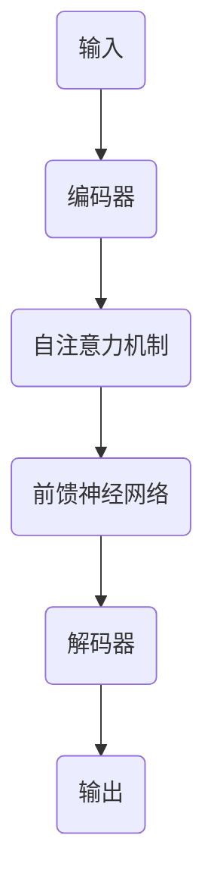

### 附录C: 伪代码示例

以下是一个简单的Transformer大模型的伪代码示例：

```python
# 定义模型
model = tf.keras.models.Sequential([
    tf.keras.layers.Embedding(input_vocab_size, d_model),
    tf.keras.layers.MultiHeadAttention(num_heads, d_model),
    tf.keras.layers.Dense(units=d_model),
    tf.keras.layers.ResidualConnection(),
    tf.keras.layers.LayerNormalization(),
    # ... 其他层
])

# 编译模型
model.compile(optimizer='adam', loss='sparse_categorical_crossentropy')

# 训练模型
model.fit(dataset, epochs=num_epochs)
```

---

**作者：AI天才研究院/AI Genius Institute & 禅与计算机程序设计艺术 /Zen And The Art of Computer Programming**

