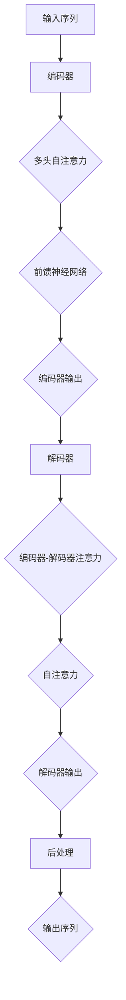

                 

### Transformer大模型实战 bert-as-service库

#### 关键词：Transformer、BERT、bert-as-service、自然语言处理、文本分类、机器翻译

#### 摘要：
本文将深入探讨Transformer大模型在自然语言处理（NLP）领域中的应用，特别是BERT模型。通过介绍BERT模型的原理、训练方法、以及如何使用bert-as-service库进行实际应用，读者将了解如何将Transformer大模型应用于文本分类和机器翻译等任务。本文旨在提供一个全面的技术指南，帮助读者理解和实战Transformer大模型。

---

### 第一部分: Transformer大模型基础

#### 第1章: Transformer大模型概述

Transformer模型是由Google在2017年提出的一种全新的序列到序列模型，它基于自注意力机制（Self-Attention Mechanism），在许多NLP任务上都取得了显著的成果，包括语言模型、机器翻译和文本分类等。本章将介绍Transformer模型的起源与发展、基本原理、核心组成部分以及应用场景。

##### 1.1 Transformer大模型的起源与发展

**1.1.1 Transformer模型的提出背景**

Transformer模型的提出背景源于传统的序列模型在长距离依赖关系处理上的不足。传统的序列模型如LSTM（Long Short-Term Memory）和GRU（Gated Recurrent Unit）在处理长序列时，存在梯度消失和梯度爆炸的问题，导致难以捕捉长距离依赖关系。为了解决这个问题，Google的研究团队提出了Transformer模型。

**1.1.2 Transformer模型的发展历程**

自Transformer模型提出以来，其在NLP领域取得了巨大的成功。从最初的Transformer V1版本，到后续的Transformer V2版本，模型的结构和性能都在不断地优化和提升。同时，基于Transformer的大模型如BERT（Bidirectional Encoder Representations from Transformers）也在学术界和工业界得到了广泛的应用。

**1.1.3 Transformer模型的核心贡献**

Transformer模型的核心贡献在于其自注意力机制（Self-Attention Mechanism）。自注意力机制允许模型在处理序列数据时，自动地关注序列中的不同部分，从而有效地捕捉长距离依赖关系。此外，Transformer模型还采用了编码器-解码器架构（Encoder-Decoder Architecture），使得模型能够更好地处理序列到序列的任务。

##### 1.2 Transformer大模型的基本原理

**1.2.1 编码器-解码器架构**

编码器-解码器架构是Transformer模型的核心组成部分，它由编码器（Encoder）和解码器（Decoder）两部分组成。编码器负责将输入序列编码为固定长度的向量，解码器则将这些向量解码为输出序列。

**1.2.2 自注意力机制**

自注意力机制是Transformer模型的核心创新点。它允许模型在处理序列数据时，自动地关注序列中的不同部分，从而有效地捕捉长距离依赖关系。

**1.2.3 位置编码与多头注意力**

位置编码（Positional Encoding）是Transformer模型中另一个重要的组成部分。它用于为模型提供输入序列的位置信息。多头注意力（Multi-Head Attention）则是自注意力机制的扩展，它允许模型在处理序列数据时，同时关注序列中的多个部分。

##### 1.3 Transformer大模型的核心组成部分

**1.3.1 自注意力机制详解**

自注意力机制是Transformer模型的核心组成部分。它通过计算序列中每个元素与其他元素之间的相似性，为每个元素生成一个权重向量，从而使得模型能够自动地关注序列中的不同部分。

**1.3.2 前馈神经网络**

前馈神经网络是Transformer模型中的一个简单神经网络，用于对自注意力机制和多头注意力机制的结果进行进一步处理。

**1.3.3 残差连接与层归一化**

残差连接（Residual Connection）和层归一化（Layer Normalization）是Transformer模型中常用的技术。残差连接能够缓解梯度消失和梯度爆炸的问题，层归一化则能够加速模型的训练过程。

##### 1.4 Transformer大模型在自然语言处理中的应用

**1.4.1 语言模型**

语言模型是Transformer模型在NLP中最常见的应用之一。它用于预测下一个单词或字符，从而生成连贯的文本。

**1.4.2 机器翻译**

机器翻译是Transformer模型的另一个重要应用。它能够将一种语言的文本翻译成另一种语言的文本。

**1.4.3 文本分类**

文本分类是Transformer模型在NLP中的另一个重要应用。它能够将文本分类到不同的类别中，如情感分类、新闻分类等。

#### 第2章: Transformer大模型的数学原理

本章将介绍Transformer大模型的数学原理，包括线性变换、注意力机制、位置编码以及正则化与优化方法。

##### 2.1 Transformer大模型中的线性变换

线性变换是Transformer模型中最基本的组成部分。它通过矩阵乘法和点积来实现。线性变换在Transformer模型中用于编码器和解码器的各个层。

**2.1.1 矩阵乘法**

矩阵乘法是线性变换的基础。在Transformer模型中，矩阵乘法用于计算编码器和解码器的各个层的输出。

**2.1.2 点积**

点积是线性变换中的另一个重要组成部分。在Transformer模型中，点积用于计算自注意力机制中的相似性得分。

**2.1.3 梯度下降与反向传播算法**

梯度下降与反向传播算法是训练神经网络的基本方法。在Transformer模型中，梯度下降与反向传播算法用于更新模型的参数，以优化模型的性能。

##### 2.2 Transformer大模型中的注意力机制

注意力机制是Transformer模型的核心创新点。它允许模型在处理序列数据时，自动地关注序列中的不同部分，从而有效地捕捉长距离依赖关系。

**2.2.1 注意力机制的数学描述**

注意力机制的数学描述包括三个部分：查询（Query）、键（Key）和值（Value）。查询用于计算序列中每个元素与其他元素之间的相似性得分，键用于存储每个元素的关键信息，值用于存储每个元素的相关信息。

**2.2.2 注意力机制的推导与实现**

注意力机制的推导与实现包括两个步骤：首先，计算序列中每个元素与其他元素之间的相似性得分；然后，将相似性得分进行归一化，得到注意力权重。

**2.2.3 注意力权重计算**

注意力权重的计算是通过计算查询与键之间的点积得到的。点积的值越大，表示两个元素之间的相似性越高。

##### 2.3 Transformer大模型中的位置编码

位置编码是Transformer模型中用于为模型提供输入序列的位置信息的技术。

**2.3.1 位置编码的数学原理**

位置编码的数学原理是通过对输入序列进行加法操作，为每个元素添加一个位置向量。

**2.3.2 位置编码的实现方法**

位置编码的实现方法包括基于正弦和余弦函数的方法。这些方法通过为每个位置生成一个唯一的向量，并将这些向量加到输入序列中。

**2.3.3 位置编码的优化策略**

位置编码的优化策略包括使用不同的位置编码方法，以及调整位置编码的参数，以获得更好的模型性能。

##### 2.4 Transformer大模型中的正则化与优化

正则化与优化是训练神经网络的重要手段。在Transformer模型中，正则化与优化用于防止过拟合和提高模型的性能。

**2.4.1 残差连接**

残差连接是Transformer模型中用于防止梯度消失和梯度爆炸的重要技术。

**2.4.2 层归一化**

层归一化是Transformer模型中用于加速训练过程和提高模型性能的重要技术。

**2.4.3 dropout**

dropout是Transformer模型中用于防止过拟合和提高模型性能的重要技术。

#### 第3章: Transformer大模型的训练与优化

本章将介绍Transformer大模型的训练与优化方法，包括训练流程、优化技巧、迁移学习与微调以及超参数调优。

##### 3.1 Transformer大模型的训练流程

**3.1.1 数据预处理**

数据预处理是训练Transformer大模型的重要步骤。它包括文本的分词、清洗和编码。

**3.1.2 模型初始化**

模型初始化是训练Transformer大模型的开始。它包括随机初始化模型参数和使用预训练的模型。

**3.1.3 训练策略与技巧**

训练策略与技巧是提高模型性能的关键。它包括学习率的调度、批量大小和权重衰减等。

##### 3.2 Transformer大模型的优化技巧

**3.2.1 学习率调度**

学习率调度是优化模型性能的重要手段。它包括固定学习率、学习率衰减和自适应学习率等。

**3.2.2 批量大小**

批量大小是优化模型性能的重要参数。它包括小批量训练和批量训练等。

**3.2.3 权重衰减**

权重衰减是优化模型性能的重要技术。它通过减少模型参数的更新速度，防止模型过拟合。

##### 3.3 Transformer大模型的迁移学习与微调

**3.3.1 迁移学习的基本原理**

迁移学习是利用预训练模型在新任务上进行微调的技术。它能够提高模型在新任务上的性能。

**3.3.2 微调技术详解**

微调技术是迁移学习的一部分。它包括微调模型的参数和调整模型的结构等。

**3.3.3 迁移学习案例解析**

迁移学习案例解析将介绍如何利用预训练的BERT模型进行文本分类和机器翻译等任务的微调。

##### 3.4 Transformer大模型的超参数调优

**3.4.1 自注意力头数**

自注意力头数是影响模型性能的重要参数。它包括设置不同的自注意力头数进行实验等。

**3.4.2 层数与隐藏单元数**

层数与隐藏单元数是影响模型性能的重要参数。它包括设置不同的层数和隐藏单元数进行实验等。

**3.4.3 训练策略对比**

训练策略对比将介绍不同训练策略对模型性能的影响，包括学习率、批量大小和权重衰减等。

#### 第4章: Transformer大模型在语言模型中的应用

本章将介绍Transformer大模型在语言模型中的应用，包括语言模型的基本原理、Transformer大模型在语言模型中的应用以及语言模型的优化与改进。

##### 4.1 语言模型的基本原理

**4.1.1 语言模型的目标**

语言模型的目标是预测下一个单词或字符，从而生成连贯的文本。

**4.1.2 语言模型的主要类型**

语言模型的主要类型包括n-gram模型和神经网络模型等。

**4.1.3 语言模型的评价指标**

语言模型的评价指标包括词误差率（WER）和字符误差率（CER）等。

##### 4.2 Transformer大模型在语言模型中的应用

**4.2.1 语言模型的训练过程**

语言模型的训练过程包括数据预处理、模型训练和模型评估等步骤。

**4.2.2 Transformer大模型在语言模型中的优势**

Transformer大模型在语言模型中的优势包括自注意力机制和大模型容量等。

**4.2.3 语言模型的应用案例**

语言模型的应用案例包括文本生成、对话系统和信息检索等。

##### 4.3 语言模型的优化与改进

**4.3.1 词嵌入技术**

词嵌入技术是优化语言模型的重要方法。它包括Word2Vec和GloVe等算法。

**4.3.2 上下文信息的利用**

上下文信息的利用是优化语言模型的重要手段。它包括长距离依赖和上下文敏感等。

**4.3.3 语言模型的多任务学习**

语言模型的多任务学习是提高模型性能的重要方法。它包括跨语言和跨领域等。

#### 第5章: Transformer大模型在文本分类中的应用

本章将介绍Transformer大模型在文本分类中的应用，包括文本分类的基本原理、Transformer大模型在文本分类中的应用以及文本分类的优化与改进。

##### 5.1 文本分类的基本原理

**5.1.1 文本分类的目标**

文本分类的目标是将文本分类到不同的类别中。

**5.1.2 文本分类的主要类型**

文本分类的主要类型包括单标签分类和多标签分类等。

**5.1.3 文本分类的评价指标**

文本分类的评价指标包括准确率、召回率和F1分数等。

##### 5.2 Transformer大模型在文本分类中的应用

**5.2.1 文本分类的训练过程**

文本分类的训练过程包括数据预处理、模型训练和模型评估等步骤。

**5.2.2 Transformer大模型在文本分类中的优势**

Transformer大模型在文本分类中的优势包括自注意力机制和大模型容量等。

**5.2.3 文本分类的应用案例**

文本分类的应用案例包括情感分析、新闻分类和垃圾邮件检测等。

##### 5.3 文本分类的优化与改进

**5.3.1 预训练语言模型的迁移学习**

预训练语言模型的迁移学习是优化文本分类的重要方法。它包括BERT和GPT等模型。

**5.3.2 多标签分类与边界识别**

多标签分类与边界识别是优化文本分类的重要方法。它包括使用双向编码器和边界检测等。

**5.3.3 文本分类的多任务学习**

文本分类的多任务学习是提高模型性能的重要方法。它包括跨领域和跨任务等。

#### 第6章: Transformer大模型在机器翻译中的应用

本章将介绍Transformer大模型在机器翻译中的应用，包括机器翻译的基本原理、Transformer大模型在机器翻译中的应用以及机器翻译的优化与改进。

##### 6.1 机器翻译的基本原理

**6.1.1 机器翻译的目标**

机器翻译的目标是将一种语言的文本翻译成另一种语言的文本。

**6.1.2 机器翻译的主要类型**

机器翻译的主要类型包括基于规则的翻译和基于统计的翻译等。

**6.1.3 机器翻译的评价指标**

机器翻译的评价指标包括BLEU分数和NIST分数等。

##### 6.2 Transformer大模型在机器翻译中的应用

**6.2.1 机器翻译的训练过程**

机器翻译的训练过程包括数据预处理、模型训练和模型评估等步骤。

**6.2.2 Transformer大模型在机器翻译中的优势**

Transformer大模型在机器翻译中的优势包括自注意力机制和大模型容量等。

**6.2.3 机器翻译的应用案例**

机器翻译的应用案例包括跨语言交流、旅游服务和跨国企业等。

##### 6.3 机器翻译的优化与改进

**6.3.1 纠错与连贯性**

纠错与连贯性是优化机器翻译的重要方法。它包括使用注意力机制和语言模型等。

**6.3.2 端到端训练与解码器搜索**

端到端训练与解码器搜索是优化机器翻译的重要方法。它包括使用Transformer模型和贪心搜索等。

**6.3.3 机器翻译的多任务学习**

机器翻译的多任务学习是提高模型性能的重要方法。它包括跨语言和跨领域等。

#### 第7章: bert-as-service库的使用与实战

本章将介绍如何使用bert-as-service库进行Transformer大模型的训练与部署，包括bert-as-service库的概述、文本分类和机器翻译的实战案例。

##### 7.1 bert-as-service库概述

**7.1.1 bert-as-service库的特点**

bert-as-service库具有易用性、灵活性和高性能等特点。

**7.1.2 bert-as-service库的架构**

bert-as-service库的架构包括数据预处理、模型训练、模型评估和模型部署等模块。

**7.1.3 bert-as-service库的安装与配置**

安装与配置bert-as-service库包括安装依赖库、配置环境变量和安装bert-as-service库等步骤。

##### 7.2 使用bert-as-service库进行文本分类实战

**7.2.1 数据预处理与模型训练**

数据预处理与模型训练包括数据清洗、数据分词、模型训练和模型评估等步骤。

**7.2.2 模型评估与调整**

模型评估与调整包括计算模型性能指标、调整模型参数和优化模型结构等步骤。

**7.2.3 模型部署与调用**

模型部署与调用包括部署模型、调用模型和测试模型等步骤。

##### 7.3 使用bert-as-service库进行机器翻译实战

**7.3.1 数据预处理与模型训练**

数据预处理与模型训练包括数据清洗、数据分词、模型训练和模型评估等步骤。

**7.3.2 模型评估与调整**

模型评估与调整包括计算模型性能指标、调整模型参数和优化模型结构等步骤。

**7.3.3 模型部署与调用**

模型部署与调用包括部署模型、调用模型和测试模型等步骤。

##### 7.4 使用bert-as-service库进行NLP应用实战

**7.4.1 实时问答系统**

实时问答系统包括问题解析、答案生成和答案验证等步骤。

**7.4.2 文本摘要**

文本摘要包括文本提取、文本合并和文本生成等步骤。

**7.4.3 文本生成**

文本生成包括文本生成模型、文本生成策略和文本生成优化等步骤。

#### 第8章: Transformer大模型的发展趋势与挑战

本章将介绍Transformer大模型的发展趋势与挑战，包括大模型与小模型的平衡、可解释性与可推理性、模型压缩与加速以及安全性与隐私保护等。

##### 8.1 Transformer大模型的发展趋势

**8.1.1 大模型与小模型的平衡**

大模型与小模型的平衡是Transformer大模型的发展趋势之一。它包括如何平衡模型大小和性能之间的关系。

**8.1.2 可解释性与可推理性**

可解释性与可推理性是Transformer大模型的发展趋势之一。它包括如何提高模型的透明度和可解释性。

**8.1.3 模型压缩与加速**

模型压缩与加速是Transformer大模型的发展趋势之一。它包括如何减少模型大小和计算复杂度。

##### 8.2 Transformer大模型的挑战与应对策略

**8.2.1 计算资源消耗**

计算资源消耗是Transformer大模型的一个挑战。它包括如何优化模型的计算资源。

**8.2.2 模型可解释性**

模型可解释性是Transformer大模型的一个挑战。它包括如何提高模型的可解释性。

**8.2.3 安全性与隐私保护**

安全性与隐私保护是Transformer大模型的一个挑战。它包括如何保护模型的隐私和安全。

##### 8.3 Transformer大模型在行业中的应用前景

**8.3.1 金融与保险**

Transformer大模型在金融与保险行业中的应用前景包括风险管理、欺诈检测和投资预测等。

**8.3.2 医疗与健康**

Transformer大模型在医疗与健康行业中的应用前景包括疾病预测、医疗影像分析和个性化医疗等。

**8.3.3 教育与娱乐**

Transformer大模型在教育与娱乐行业中的应用前景包括个性化教育、虚拟现实和智能推荐等。

#### 附录

**附录A: Transformer大模型常用工具与资源**

**A.1 深度学习框架对比**

**A.2 模型训练与部署工具**

**A.3 Transformer大模型开源代码与论文资源**

**附录B: Transformer大模型常见问题解答**

**B.1 模型训练相关问题**

**B.2 模型部署相关问题**

**B.3 模型优化相关问题**

**附录C: Transformer大模型实战项目案例**

**C.1 语言模型项目案例**

**C.2 文本分类项目案例**

**C.3 机器翻译项目案例**

**C.4 其他NLP应用项目案例**

---

**作者：AI天才研究院/AI Genius Institute & 禅与计算机程序设计艺术 /Zen And The Art of Computer Programming**

### Transformer大模型基础：Transformer模型概述

Transformer模型是由Google在2017年提出的一种全新的序列到序列模型，它基于自注意力机制（Self-Attention Mechanism），在许多NLP任务上都取得了显著的成果，包括语言模型、机器翻译和文本分类等。本章将介绍Transformer模型的起源与发展、基本原理、核心组成部分以及应用场景。

#### 1.1 Transformer大模型的起源与发展

**1.1.1 Transformer模型的提出背景**

Transformer模型的提出背景源于传统的序列模型在长距离依赖关系处理上的不足。传统的序列模型如LSTM（Long Short-Term Memory）和GRU（Gated Recurrent Unit）在处理长序列时，存在梯度消失和梯度爆炸的问题，导致难以捕捉长距离依赖关系。为了解决这个问题，Google的研究团队提出了Transformer模型。

**1.1.2 Transformer模型的发展历程**

自Transformer模型提出以来，其在NLP领域取得了巨大的成功。从最初的Transformer V1版本，到后续的Transformer V2版本，模型的结构和性能都在不断地优化和提升。同时，基于Transformer的大模型如BERT（Bidirectional Encoder Representations from Transformers）也在学术界和工业界得到了广泛的应用。

**1.1.3 Transformer模型的核心贡献**

Transformer模型的核心贡献在于其自注意力机制（Self-Attention Mechanism）。自注意力机制允许模型在处理序列数据时，自动地关注序列中的不同部分，从而有效地捕捉长距离依赖关系。此外，Transformer模型还采用了编码器-解码器架构（Encoder-Decoder Architecture），使得模型能够更好地处理序列到序列的任务。

#### 1.2 Transformer大模型的基本原理

**1.2.1 编码器-解码器架构**

编码器-解码器架构是Transformer模型的核心组成部分，它由编码器（Encoder）和解码器（Decoder）两部分组成。编码器负责将输入序列编码为固定长度的向量，解码器则将这些向量解码为输出序列。

**1.2.2 自注意力机制**

自注意力机制是Transformer模型的核心创新点。它允许模型在处理序列数据时，自动地关注序列中的不同部分，从而有效地捕捉长距离依赖关系。

**1.2.3 位置编码与多头注意力**

位置编码（Positional Encoding）是Transformer模型中用于为模型提供输入序列的位置信息的技术。多头注意力（Multi-Head Attention）则是自注意力机制的扩展，它允许模型在处理序列数据时，同时关注序列中的多个部分。

#### 1.3 Transformer大模型的核心组成部分

**1.3.1 自注意力机制详解**

自注意力机制是Transformer模型的核心组成部分。它通过计算序列中每个元素与其他元素之间的相似性，为每个元素生成一个权重向量，从而使得模型能够自动地关注序列中的不同部分。

**1.3.2 前馈神经网络**

前馈神经网络是Transformer模型中的一个简单神经网络，用于对自注意力机制和多头注意力机制的结果进行进一步处理。

**1.3.3 残差连接与层归一化**

残差连接（Residual Connection）和层归一化（Layer Normalization）是Transformer模型中常用的技术。残差连接能够缓解梯度消失和梯度爆炸的问题，层归一化则能够加速模型的训练过程。

#### 1.4 Transformer大模型在自然语言处理中的应用

**1.4.1 语言模型**

语言模型是Transformer模型在NLP中最常见的应用之一。它用于预测下一个单词或字符，从而生成连贯的文本。

**1.4.2 机器翻译**

机器翻译是Transformer模型的另一个重要应用。它能够将一种语言的文本翻译成另一种语言的文本。

**1.4.3 文本分类**

文本分类是Transformer模型在NLP中的另一个重要应用。它能够将文本分类到不同的类别中，如情感分类、新闻分类等。

### Transformer大模型的基本原理

#### 1.2.1 编码器-解码器架构

编码器-解码器架构是Transformer模型的核心组成部分，它由编码器（Encoder）和解码器（Decoder）两部分组成。编码器负责将输入序列编码为固定长度的向量，解码器则将这些向量解码为输出序列。

**1.2.1.1 编码器（Encoder）**

编码器的输入是一个序列，它包含了一系列的单词或字符。每个输入元素会被编码器中的多头自注意力机制处理，生成一系列的注意力得分。这些得分用于更新输入序列的表示，使得编码器能够捕捉到序列中的长距离依赖关系。

编码器的输出是一个固定长度的向量，这个向量包含了输入序列的所有信息。这个向量通常被用来作为解码器的输入。

**1.2.1.2 解码器（Decoder）**

解码器接收编码器的输出作为其输入，并生成输出序列。解码器的输入包括编码器的输出和上一步生成的输出。在解码器的每一时间步，它会利用自注意力机制和编码器-解码器注意力机制来生成新的输出。

自注意力机制使解码器能够关注输入序列中的不同部分，从而生成与输入序列相关的输出。编码器-解码器注意力机制则使解码器能够关注编码器的输出，从而捕捉输入序列与输出序列之间的对应关系。

解码器的输出是一个序列，这个序列包含了预测的单词或字符。这个序列经过后处理（如软化处理），得到最终的输出序列。

**1.2.1.3 编码器-解码器架构的原理**

编码器-解码器架构的核心思想是通过编码器和解码器的相互作用，捕捉输入序列和输出序列之间的长距离依赖关系。编码器通过自注意力机制和前馈神经网络，将输入序列编码为一个固定长度的向量，这个向量包含了输入序列的所有信息。解码器则利用这个向量以及编码器-解码器注意力机制，逐步生成输出序列。

在每一时间步，解码器首先通过自注意力机制生成注意力得分，然后利用这些得分更新解码器的输入。接着，解码器通过编码器-解码器注意力机制，利用编码器的输出生成新的输出。这个过程重复进行，直到解码器生成完整的输出序列。

编码器-解码器架构的强大之处在于它能够捕捉到输入序列和输出序列之间的复杂关系，从而生成高质量的输出序列。这种架构在机器翻译、文本生成和文本分类等任务上表现出色，成为了NLP领域的重要工具。

**1.2.1.4 编码器-解码器架构的Mermaid流程图**



在这个流程图中，输入序列通过编码器被编码为固定长度的向量（编码器输出E）。这个向量作为解码器的输入（解码器输入F）。解码器在每一时间步利用自注意力（H）和编码器-解码器注意力（G），生成新的输出（解码器输出I）。最终，解码器的输出经过后处理（J），得到最终的输出序列（输出序列K）。

#### 1.2.2 自注意力机制

自注意力机制是Transformer模型的核心创新点，它允许模型在处理序列数据时，自动地关注序列中的不同部分，从而有效地捕捉长距离依赖关系。自注意力机制的核心思想是通过计算序列中每个元素与其他元素之间的相似性，为每个元素生成一个权重向量，从而加权地聚合序列中的信息。

**1.2.2.1 自注意力机制的数学描述**

自注意力机制通常使用三个向量进行计算：查询向量（Query, Q）、键向量（Key, K）和值向量（Value, V）。对于输入序列中的一个元素，查询向量表示该元素在序列中的角色，键向量表示其他元素的相关性，值向量表示其他元素的信息。

自注意力机制的数学描述如下：

$$
Attention(Q, K, V) = \frac{softmax(\frac{QK^T}{\sqrt{d_k}})}{V}
$$

其中，$Q$、$K$ 和 $V$ 分别是查询向量、键向量和值向量，$d_k$ 是键向量的维度，$QK^T$ 表示查询向量和键向量的内积，$\sqrt{d_k}$ 是为了防止数值溢出而引入的缩放因子，softmax 函数用于归一化权重，从而得到概率分布。

最后，通过加权聚合值向量，得到每个元素的输出：

$$
\text{Contextualized Value} = \text{softmax}(\text{Attention Scores}) \odot V
$$

其中，$Attention Scores$ 表示注意力得分，$\odot$ 表示元素间的逐元素乘法。

**1.2.2.2 自注意力机制的推导与实现**

自注意力机制的推导可以分为以下几个步骤：

1. **计算相似性得分**：首先，计算每个查询向量与其他键向量的相似性得分。这个得分可以通过点积（dot product）或缩放点积（scaled dot product）来计算。

   $$QK^T$$

2. **应用软化函数**：将相似性得分通过软化函数（如softmax）进行归一化，得到概率分布。

   $$softmax(QK^T / \sqrt{d_k})$$

3. **加权聚合值向量**：根据概率分布，对值向量进行加权聚合，得到每个元素的输出。

   $$\text{Contextualized Value} = \text{softmax}(\text{Attention Scores}) \odot V$$

在实际实现中，自注意力机制通常使用矩阵乘法来计算相似性得分和加权聚合值向量。以下是一个简化版本的伪代码：

```python
def scaled_dot_product_attention(queries, keys, values, d_k, dropout概率):
    # 计算相似性得分
    attention_scores = queries * (keys.transpose(1, 2)) / math.sqrt(d_k)
    
    # 应用softmax函数
    attention_scores = nn.Softmax(dim=2)(attention_scores)
    
    # 应用dropout
    attention_scores = dropout(attention_scores, dropout概率)
    
    # 计算注意力得分与值向量的乘积
    context_vector = attention_scores * values
    
    # 计算输出
    output = nn.Linear(d_v, d_model)(context_vector)
    
    return output, attention_scores
```

在这个伪代码中，`queries`、`keys` 和 `values` 分别是查询向量、键向量和值向量，`d_k` 是键向量的维度，`dropout概率` 是用于防止过拟合的dropout层。

**1.2.2.3 注意力权重计算**

注意力权重是自注意力机制中计算的核心，它决定了模型在处理序列数据时关注哪些部分。注意力权重通常通过计算查询向量与键向量的点积得到，然后应用softmax函数进行归一化，得到概率分布。

注意力权重的计算过程如下：

1. **计算相似性得分**：对于输入序列中的每个元素，计算其查询向量与其他元素的键向量之间的点积。

   $$QK^T$$

2. **应用softmax函数**：将相似性得分通过softmax函数进行归一化，得到概率分布。

   $$softmax(QK^T / \sqrt{d_k})$$

3. **得到注意力权重**：概率分布即为注意力权重，它表示模型在处理序列数据时关注每个元素的程度。

**1.2.2.4 注意力权重的影响因素**

注意力权重受到以下几个因素的影响：

- **查询向量（Query）**：查询向量决定了模型在处理序列数据时关注的重点。通常，查询向量包含了输入序列中的信息，它通过自注意力机制与其他键向量交互，生成注意力权重。
- **键向量（Key）**：键向量存储了序列中每个元素的关键信息。在自注意力机制中，键向量用于计算相似性得分，从而生成注意力权重。
- **值向量（Value）**：值向量包含了序列中每个元素的相关信息。在自注意力机制中，值向量被加权聚合，生成每个元素的输出。
- **维度（Dimension）**：注意力机制的维度决定了模型处理序列数据的能力。较大的维度允许模型捕捉更多的信息，但同时也增加了计算复杂度和内存消耗。

通过调整这些因素，可以优化自注意力机制的性能和效果。在实际应用中，通常会通过实验来选择合适的维度和权重参数，以获得最佳的性能。

#### 1.2.3 位置编码与多头注意力

位置编码（Positional Encoding）和多头注意力（Multi-Head Attention）是Transformer模型中的两个重要组成部分，它们共同作用，使得模型能够有效地处理序列数据。

**1.2.3.1 位置编码**

位置编码是Transformer模型中用于为序列数据提供位置信息的技术。由于Transformer模型没有循环结构，它无法像RNN或LSTM那样自动地获取序列中的位置信息。因此，位置编码被引入，为模型提供序列元素的顺序信息。

位置编码通常使用正弦和余弦函数生成，其数学描述如下：

$$
PE_{(pos, 2i)} = \sin\left(\frac{pos}{10000^{2i/d_{\text{model}}}}\right)
$$

$$
PE_{(pos, 2i+1)} = \cos\left(\frac{pos}{10000^{2i/d_{\text{model}}}}\right)
$$

其中，$pos$ 表示位置索引，$i$ 表示维度索引，$d_{\text{model}}$ 表示模型的总维度。

位置编码被添加到输入序列中，与嵌入向量（Embedding Vector）相加，作为模型处理序列数据的输入。

**1.2.3.2 多头注意力**

多头注意力是自注意力机制的扩展，它允许模型在处理序列数据时同时关注多个部分。多头注意力通过将输入序列划分为多个子序列，每个子序列都使用独立的自注意力机制进行处理，然后聚合这些子序列的结果。

多头注意力的数学描述如下：

$$
\text{Multi-Head Attention} = \text{Concat}(\text{head}_1, \text{head}_2, ..., \text{head}_h)W^O
$$

其中，$h$ 表示头数，$\text{head}_i$ 表示第 $i$ 个头的结果，$W^O$ 表示输出权重。

多头注意力的计算过程如下：

1. **计算查询向量、键向量和值向量**：对于每个头，计算查询向量、键向量和值向量。这些向量通过独立的线性变换从输入序列得到。
2. **计算自注意力权重**：使用自注意力机制计算每个查询向量与其他键向量的相似性得分，并应用softmax函数进行归一化。
3. **加权聚合值向量**：根据自注意力权重，对值向量进行加权聚合，生成每个头的输出。
4. **聚合多头输出**：将所有头的输出进行拼接，并通过另一个线性变换得到最终的输出。

多头注意力能够提高模型处理序列数据的能力，使其能够捕捉到更复杂的依赖关系。

**1.2.3.3 位置编码与多头注意力的作用**

位置编码和多头注意力共同作用，使得Transformer模型能够有效地处理序列数据。

- **位置编码**：为模型提供序列元素的顺序信息，使得模型能够理解序列中的顺序关系。通过位置编码，模型可以自动地关注序列中的不同部分，从而捕捉到长距离依赖关系。
- **多头注意力**：通过将输入序列划分为多个子序列，并分别处理这些子序列，多头注意力能够提高模型处理序列数据的能力。多头注意力允许模型同时关注序列中的多个部分，从而捕捉到更复杂的依赖关系。

通过结合位置编码和多头注意力，Transformer模型能够有效地处理各种序列任务，如语言模型、机器翻译和文本分类等。

**1.2.3.4 位置编码的实现方法**

位置编码的实现方法通常基于正弦和余弦函数。以下是一个简化的实现方法：

```python
def positional_encoding(position, d_model):
    pe = torch.zeros(1, position, d_model)
    
    # 使用正弦和余弦函数生成位置编码
    for pos in range(position):
        for i in range(d_model // 2):
            pe[0, pos, 2*i] = torch.sin(position / (10000 ** ((i//2) / d_model)))
            pe[0, pos, 2*i+1] = torch.cos(position / (10000 ** ((i//2) / d_model)))
    
    return pe
```

在这个实现中，`position` 表示位置索引，`d_model` 表示模型的总维度。通过循环计算正弦和余弦值，生成位置编码向量。

**1.2.3.5 位置编码的优化策略**

为了提高位置编码的性能，可以采用以下几种优化策略：

- **使用不同的位置编码方法**：除了正弦和余弦函数，还可以尝试其他位置编码方法，如线性位置编码、分段位置编码等。这些方法可以更好地适应不同的序列任务。
- **调整位置编码的参数**：通过调整位置编码的参数，如位置索引的缩放因子，可以优化位置编码的效果。合适的参数能够提高模型对序列数据的理解和性能。
- **动态调整位置编码**：在训练过程中，可以动态地调整位置编码的参数，以适应模型的学习过程。这种方法能够提高模型在不同任务上的泛化能力。

通过结合多种优化策略，可以进一步提高位置编码的性能和效果。

#### 1.3 Transformer大模型的核心组成部分

Transformer大模型由多个核心组成部分构成，这些组成部分共同作用，使得模型能够有效地处理各种序列任务。以下是对这些核心组成部分的详细解读：

**1.3.1 自注意力机制详解**

自注意力机制是Transformer模型的核心组成部分，它通过计算序列中每个元素与其他元素之间的相似性，为每个元素生成一个权重向量，从而使得模型能够自动地关注序列中的不同部分。

自注意力机制的数学描述如下：

$$
Attention(Q, K, V) = \frac{softmax(\frac{QK^T}{\sqrt{d_k}})}{V}
$$

其中，$Q$、$K$ 和 $V$ 分别是查询向量、键向量和值向量，$d_k$ 是键向量的维度，$QK^T$ 表示查询向量和键向量的内积，$\sqrt{d_k}$ 是为了防止数值溢出而引入的缩放因子，softmax 函数用于归一化权重，从而得到概率分布。

自注意力机制的计算过程如下：

1. **计算相似性得分**：首先，计算每个查询向量与其他键向量的相似性得分。这个得分可以通过点积（dot product）或缩放点积（scaled dot product）来计算。

   $$QK^T$$

2. **应用软化函数**：将相似性得分通过softmax函数进行归一化，得到概率分布。

   $$softmax(QK^T / \sqrt{d_k})$$

3. **加权聚合值向量**：根据概率分布，对值向量进行加权聚合，得到每个元素的输出。

   $$\text{Contextualized Value} = \text{softmax}(\text{Attention Scores}) \odot V$$

在实际实现中，自注意力机制通常使用矩阵乘法来计算相似性得分和加权聚合值向量。以下是一个简化版本的伪代码：

```python
def scaled_dot_product_attention(queries, keys, values, d_k, dropout概率):
    # 计算相似性得分
    attention_scores = queries * (keys.transpose(1, 2)) / math.sqrt(d_k)
    
    # 应用softmax函数
    attention_scores = nn.Softmax(dim=2)(attention_scores)
    
    # 应用dropout
    attention_scores = dropout(attention_scores, dropout概率)
    
    # 计算注意力得分与值向量的乘积
    context_vector = attention_scores * values
    
    # 计算输出
    output = nn.Linear(d_v, d_model)(context_vector)
    
    return output, attention_scores
```

在这个伪代码中，`queries`、`keys` 和 `values` 分别是查询向量、键向量和值向量，`d_k` 是键向量的维度，`dropout概率` 是用于防止过拟合的dropout层。

**1.3.1.1 自注意力机制的工作原理**

自注意力机制的工作原理可以概括为以下几个步骤：

1. **查询向量、键向量和值向量的生成**：每个元素在序列中都会生成一个查询向量、一个键向量和一个值向量。这些向量通过独立的线性变换从输入序列得到。
2. **计算相似性得分**：对于输入序列中的每个元素，计算其查询向量与其他元素的键向量之间的相似性得分。这个得分可以通过点积或缩放点积来计算。
3. **应用softmax函数**：将相似性得分通过softmax函数进行归一化，得到概率分布。概率分布表示了模型在处理序列数据时关注每个元素的程度。
4. **加权聚合值向量**：根据概率分布，对值向量进行加权聚合，得到每个元素的输出。这个过程类似于加权投票，使得模型能够自动地关注序列中的不同部分。

通过自注意力机制，模型能够有效地捕捉序列中的长距离依赖关系，从而提高模型的性能。

**1.3.1.2 自注意力机制的优势**

自注意力机制具有以下几个优势：

- **捕捉长距离依赖关系**：自注意力机制允许模型在处理序列数据时自动地关注序列中的不同部分，从而有效地捕捉长距离依赖关系。
- **并行计算**：自注意力机制可以通过并行计算来加速模型的训练和推理过程，从而提高模型的性能。
- **灵活性**：自注意力机制可以灵活地应用于各种序列任务，如语言模型、机器翻译和文本分类等。

**1.3.2 前馈神经网络**

前馈神经网络是Transformer模型中的一个简单神经网络，用于对自注意力机制和多头注意力机制的结果进行进一步处理。前馈神经网络由两个全连接层组成，通常使用ReLU激活函数。

前馈神经网络的数学描述如下：

$$
\text{FFN}(x) = \max(0, xW_1 + b_1)W_2 + b_2
$$

其中，$x$ 是输入向量，$W_1$ 和 $W_2$ 是权重矩阵，$b_1$ 和 $b_2$ 是偏置向量。

前馈神经网络的作用是对自注意力机制和多头注意力机制的结果进行进一步处理，从而增强模型的表达能力。

**1.3.2.1 前馈神经网络的工作原理**

前馈神经网络的工作原理可以概括为以下几个步骤：

1. **输入向量**：将自注意力机制和多头注意力机制的结果作为输入向量。
2. **第一层全连接**：将输入向量通过第一个全连接层，并应用ReLU激活函数。
3. **第二层全连接**：将第一层的输出通过第二个全连接层，并应用线性激活函数。
4. **输出向量**：得到最终的输出向量，这个向量包含了自注意力机制和多头注意力机制的结果。

通过前馈神经网络，模型能够进一步提高对序列数据的理解和表达能力。

**1.3.2.2 前馈神经网络的优势**

前馈神经网络具有以下几个优势：

- **增加模型的非线性能力**：前馈神经网络通过引入非线性函数，如ReLU激活函数，增加了模型对序列数据的非线性表达能力。
- **提高模型的性能**：前馈神经网络能够对自注意力机制和多头注意力机制的结果进行进一步处理，从而提高模型的性能。
- **易于实现和优化**：前馈神经网络结构简单，易于实现和优化。

**1.3.3 残差连接与层归一化**

残差连接（Residual Connection）和层归一化（Layer Normalization）是Transformer模型中常用的技术，用于缓解梯度消失和梯度爆炸的问题，从而提高模型的训练效果。

**1.3.3.1 残差连接**

残差连接是一种特殊的连接方式，它通过将输入序列与输出序列进行连接，使得模型能够更好地传递梯度。残差连接的数学描述如下：

$$
\text{Residual Connection} = xW + b + x
$$

其中，$x$ 是输入向量，$W$ 和 $b$ 是权重矩阵和偏置向量。

**1.3.3.2 层归一化**

层归一化是一种对模型的每一层进行归一化的技术，它通过缩放和偏移模型的输入，使得模型能够更好地训练。层归一化的数学描述如下：

$$
\text{Layer Normalization} = \frac{\text{Mean Normalize}(x)W + b}{\text{Variance Normalize}(x)}
$$

其中，$x$ 是输入向量，$W$ 和 $b$ 是权重矩阵和偏置向量。

**1.3.3.3 残差连接与层归一化的优势**

- **缓解梯度消失和梯度爆炸**：残差连接和层归一化能够缓解梯度消失和梯度爆炸的问题，从而提高模型的训练效果。
- **提高模型的稳定性**：通过残差连接和层归一化，模型能够更好地收敛，从而提高模型的稳定性。
- **提高模型的性能**：残差连接和层归一化能够提高模型的性能，使其更好地处理序列数据。

### Transformer大模型在自然语言处理中的应用

Transformer大模型在自然语言处理（NLP）领域取得了显著的成果，其应用范围涵盖了语言模型、机器翻译、文本分类等多个方面。以下是对Transformer大模型在这些应用中的具体应用和优势的详细解读。

#### 1.4.1 语言模型

语言模型是Transformer大模型在NLP中最常见的应用之一。它用于预测下一个单词或字符，从而生成连贯的文本。Transformer大模型在语言模型中的应用主要体现在其自注意力机制和编码器-解码器架构上。

**1.4.1.1 语言模型的目标**

语言模型的目标是学习文本数据的统计特性，从而能够预测下一个单词或字符。通过训练语言模型，我们可以生成连贯的文本，应用于对话系统、信息检索、文本生成等领域。

**1.4.1.2 Transformer大模型在语言模型中的应用**

Transformer大模型在语言模型中的应用主要通过以下两个方面：

- **自注意力机制**：自注意力机制使得模型能够在处理序列数据时自动关注序列中的不同部分，从而捕捉长距离依赖关系。这对于语言模型来说非常重要，因为长距离依赖关系对于生成连贯文本至关重要。
- **编码器-解码器架构**：编码器-解码器架构使得模型能够将输入序列编码为固定长度的向量，并利用这些向量生成输出序列。这种架构在语言模型中非常有效，因为它能够捕捉到输入序列与输出序列之间的复杂关系。

**1.4.1.3 Transformer大模型在语言模型中的优势**

Transformer大模型在语言模型中的优势主要包括：

- **捕捉长距离依赖关系**：自注意力机制使得模型能够有效地捕捉长距离依赖关系，这对于生成连贯的文本至关重要。
- **并行计算**：由于自注意力机制的计算可以并行进行，Transformer大模型在处理长序列数据时能够显著提高计算效率。
- **灵活性**：Transformer大模型可以灵活地应用于各种语言模型任务，如文本生成、对话系统等。

**1.4.1.4 语言模型的应用案例**

语言模型的应用案例包括：

- **文本生成**：通过训练语言模型，可以生成连贯的文本，应用于故事创作、新闻报道等。
- **对话系统**：语言模型可以用于构建智能对话系统，如聊天机器人、语音助手等。
- **信息检索**：语言模型可以用于信息检索任务，如搜索引擎、推荐系统等。

#### 1.4.2 机器翻译

机器翻译是Transformer大模型的另一个重要应用。它能够将一种语言的文本翻译成另一种语言的文本，广泛应用于跨语言交流、旅游服务、跨国企业等领域。

**1.4.2.1 机器翻译的目标**

机器翻译的目标是将一种语言的文本翻译成另一种语言的文本，使得不同语言的用户能够互相理解。

**1.4.2.2 Transformer大模型在机器翻译中的应用**

Transformer大模型在机器翻译中的应用主要体现在以下几个方面：

- **自注意力机制**：自注意力机制使得模型能够在处理序列数据时自动关注序列中的不同部分，从而捕捉长距离依赖关系。这对于机器翻译来说非常重要，因为长距离依赖关系对于生成准确的翻译至关重要。
- **编码器-解码器架构**：编码器-解码器架构使得模型能够将输入序列编码为固定长度的向量，并利用这些向量生成输出序列。这种架构在机器翻译中非常有效，因为它能够捕捉到输入序列与输出序列之间的复杂关系。

**1.4.2.3 Transformer大模型在机器翻译中的优势**

Transformer大模型在机器翻译中的优势主要包括：

- **捕捉长距离依赖关系**：自注意力机制使得模型能够有效地捕捉长距离依赖关系，这对于生成准确的翻译至关重要。
- **并行计算**：由于自注意力机制的计算可以并行进行，Transformer大模型在处理长序列数据时能够显著提高计算效率。
- **灵活性**：Transformer大模型可以灵活地应用于各种机器翻译任务，如机器翻译、对话翻译等。

**1.4.2.4 机器翻译的应用案例**

机器翻译的应用案例包括：

- **跨语言交流**：通过机器翻译，可以实现不同语言用户之间的顺畅交流，如国际会议、跨国企业沟通等。
- **旅游服务**：机器翻译可以用于旅游服务，如旅游指南、景点介绍等。
- **跨国企业**：机器翻译可以用于跨国企业的文档翻译、内部沟通等。

#### 1.4.3 文本分类

文本分类是Transformer大模型在NLP中的另一个重要应用。它能够将文本分类到不同的类别中，如情感分类、新闻分类、垃圾邮件检测等。

**1.4.3.1 文本分类的目标**

文本分类的目标是将文本分类到不同的类别中，以便于信息处理和知识挖掘。

**1.4.3.2 Transformer大模型在文本分类中的应用**

Transformer大模型在文本分类中的应用主要体现在以下几个方面：

- **自注意力机制**：自注意力机制使得模型能够在处理序列数据时自动关注序列中的不同部分，从而捕捉长距离依赖关系。这对于文本分类来说非常重要，因为长距离依赖关系对于分类准确性至关重要。
- **编码器-解码器架构**：编码器-解码器架构使得模型能够将输入序列编码为固定长度的向量，并利用这些向量生成输出序列。这种架构在文本分类中非常有效，因为它能够捕捉到输入序列与输出序列之间的复杂关系。

**1.4.3.3 Transformer大模型在文本分类中的优势**

Transformer大模型在文本分类中的优势主要包括：

- **捕捉长距离依赖关系**：自注意力机制使得模型能够有效地捕捉长距离依赖关系，这对于分类准确性至关重要。
- **并行计算**：由于自注意力机制的计算可以并行进行，Transformer大模型在处理长序列数据时能够显著提高计算效率。
- **灵活性**：Transformer大模型可以灵活地应用于各种文本分类任务，如情感分类、新闻分类、垃圾邮件检测等。

**1.4.3.4 文本分类的应用案例**

文本分类的应用案例包括：

- **情感分类**：通过文本分类，可以分析用户对产品的评论，从而进行情感分析，帮助企业改进产品。
- **新闻分类**：通过文本分类，可以将新闻自动分类到不同的类别中，如政治、体育、娱乐等，便于用户快速查找感兴趣的内容。
- **垃圾邮件检测**：通过文本分类，可以自动识别垃圾邮件，从而提高邮件系统的安全性。

#### 1.4.4 其他应用

除了语言模型、机器翻译和文本分类，Transformer大模型还在其他NLP任务中展现出强大的能力。以下是一些其他应用：

- **问答系统**：通过Transformer大模型，可以构建智能问答系统，如搜索引擎、客服系统等。
- **文本摘要**：通过文本分类，可以自动生成文本摘要，提取关键信息，应用于新闻摘要、报告摘要等。
- **文本生成**：通过文本生成，可以生成创意性文本，如诗歌、故事等。

总之，Transformer大模型在自然语言处理领域具有广泛的应用前景，其强大的能力和灵活性使得它在各种NLP任务中都能够取得出色的性能。

### Transformer大模型的数学原理

#### 2.1 Transformer大模型中的线性变换

线性变换是Transformer大模型中的核心组成部分之一。它通过矩阵乘法和点积来实现，用于计算序列数据中的相似性得分和加权聚合。以下是线性变换在Transformer模型中的具体应用和数学原理。

**2.1.1 矩阵乘法**

矩阵乘法是线性变换的基础。在Transformer模型中，矩阵乘法用于计算编码器和解码器的各个层的输出。具体来说，每个输入序列元素都会通过一系列的矩阵乘法操作，得到最终的输出向量。

**矩阵乘法的数学原理**

假设有一个输入序列 $X$，其中每个元素 $x_i$ 是一个 $d$ 维向量，那么通过矩阵乘法，可以将输入序列映射到一个新的空间。假设有一个权重矩阵 $W$，则输出向量 $Y$ 可以通过以下公式计算：

$$
Y = X \cdot W
$$

其中，$X$ 是输入矩阵，$W$ 是权重矩阵，$Y$ 是输出矩阵。

**矩阵乘法在Transformer模型中的应用**

在Transformer模型中，矩阵乘法主要用于计算编码器和解码器的各个层的输出。例如，在编码器的每一层，输入序列 $X$ 会与权重矩阵 $W$ 进行矩阵乘法，得到新的输出序列 $Y$。这个过程可以重复多次，以增加模型的深度。

**2.1.2 点积**

点积是线性变换中的另一个重要组成部分。在Transformer模型中，点积用于计算自注意力机制中的相似性得分。点积的数学原理如下：

**点积的数学原理**

假设有两个向量 $A$ 和 $B$，则它们的点积可以表示为：

$$
A \cdot B = \sum_{i=1}^{n} A_i B_i
$$

其中，$A_i$ 和 $B_i$ 分别是向量 $A$ 和 $B$ 的第 $i$ 个分量。

**点积在Transformer模型中的应用**

在Transformer模型中，点积用于计算序列中每个元素与其他元素之间的相似性得分。具体来说，假设有一个输入序列 $X$，其中每个元素 $x_i$ 是一个 $d$ 维向量，那么通过点积，可以计算每个元素与其他元素之间的相似性得分。这个过程如下：

1. **计算查询向量、键向量和值向量**：对于输入序列中的每个元素 $x_i$，生成一个查询向量 $Q_i$、一个键向量 $K_i$ 和一个值向量 $V_i$。
2. **计算相似性得分**：通过计算查询向量 $Q_i$ 和键向量 $K_i$ 的点积，得到相似性得分 $S_i$。具体公式如下：

$$
S_i = Q_i \cdot K_i
$$

3. **应用softmax函数**：将相似性得分通过softmax函数进行归一化，得到概率分布。具体公式如下：

$$
A_i = \text{softmax}(S_i)
$$

4. **加权聚合值向量**：根据概率分布，对值向量 $V_i$ 进行加权聚合，得到每个元素的输出。具体公式如下：

$$
Y_i = A_i \cdot V_i
$$

**2.1.3 梯度下降与反向传播算法**

梯度下降与反向传播算法是训练神经网络的基本方法。在Transformer模型中，梯度下降与反向传播算法用于更新模型的参数，以优化模型的性能。

**梯度下降的数学原理**

梯度下降是一种优化算法，用于找到函数的最小值。具体来说，梯度下降通过迭代更新参数，使得损失函数逐渐减小。梯度下降的数学原理如下：

1. **计算损失函数**：给定输入序列 $X$ 和输出序列 $Y$，计算损失函数 $L$。损失函数通常用来衡量模型的预测结果与实际结果之间的差距。
2. **计算梯度**：计算损失函数关于模型参数的梯度。梯度反映了参数的变化对损失函数的影响。
3. **更新参数**：通过梯度更新模型参数，使得损失函数逐渐减小。具体公式如下：

$$
\theta_{t+1} = \theta_t - \alpha \cdot \nabla_\theta L
$$

其中，$\theta_t$ 是当前参数值，$\theta_{t+1}$ 是更新后的参数值，$\alpha$ 是学习率，$\nabla_\theta L$ 是损失函数关于参数的梯度。

**反向传播算法**

反向传播算法是一种用于计算神经网络梯度的高效方法。具体来说，反向传播算法通过前向传播计算输出，然后通过后向传播计算损失函数关于输入的梯度。以下是反向传播算法的步骤：

1. **前向传播**：计算输入序列的输出，得到预测结果。
2. **计算损失函数**：计算损失函数关于输出序列的梯度。
3. **后向传播**：从输出层开始，逐层计算损失函数关于输入层的梯度。
4. **更新参数**：根据梯度更新模型参数。

通过结合梯度下降和反向传播算法，Transformer模型可以有效地优化参数，从而提高模型的性能。

#### 2.2 Transformer大模型中的注意力机制

注意力机制是Transformer模型的核心组成部分之一，它允许模型在处理序列数据时自动关注序列中的不同部分，从而有效地捕捉长距离依赖关系。注意力机制在Transformer模型中有着广泛的应用，包括自注意力机制和编码器-解码器注意力机制。

**2.2.1 注意力机制的数学描述**

注意力机制的数学描述通常包括三个部分：查询向量（Query, Q）、键向量（Key, K）和值向量（Value, V）。对于输入序列中的一个元素，查询向量表示该元素在序列中的角色，键向量表示其他元素的相关性，值向量表示其他元素的信息。

注意力机制的数学描述如下：

$$
Attention(Q, K, V) = \frac{softmax(\frac{QK^T}{\sqrt{d_k}})}{V}
$$

其中，$Q$、$K$ 和 $V$ 分别是查询向量、键向量和值向量，$d_k$ 是键向量的维度，$QK^T$ 表示查询向量和键向量的内积，$\sqrt{d_k}$ 是为了防止数值溢出而引入的缩放因子，softmax 函数用于归一化权重，从而得到概率分布。

最后，通过加权聚合值向量，得到每个元素的输出：

$$
\text{Contextualized Value} = \text{softmax}(\text{Attention Scores}) \odot V
$$

其中，$Attention Scores$ 表示注意力得分，$\odot$ 表示元素间的逐元素乘法。

**2.2.2 注意力机制的推导与实现**

注意力机制的推导可以分为以下几个步骤：

1. **计算相似性得分**：首先，计算每个查询向量与其他键向量的相似性得分。这个得分可以通过点积（dot product）或缩放点积（scaled dot product）来计算。

   $$QK^T$$

2. **应用软化函数**：将相似性得分通过softmax函数进行归一化，得到概率分布。

   $$softmax(QK^T / \sqrt{d_k})$$

3. **加权聚合值向量**：根据概率分布，对值向量进行加权聚合，得到每个元素的输出。

   $$\text{Contextualized Value} = \text{softmax}(\text{Attention Scores}) \odot V$$

在实际实现中，注意力机制通常使用矩阵乘法来计算相似性得分和加权聚合值向量。以下是一个简化版本的伪代码：

```python
def scaled_dot_product_attention(queries, keys, values, d_k, dropout概率):
    # 计算相似性得分
    attention_scores = queries * (keys.transpose(1, 2)) / math.sqrt(d_k)
    
    # 应用softmax函数
    attention_scores = nn.Softmax(dim=2)(attention_scores)
    
    # 应用dropout
    attention_scores = dropout(attention_scores, dropout概率)
    
    # 计算注意力得分与值向量的乘积
    context_vector = attention_scores * values
    
    # 计算输出
    output = nn.Linear(d_v, d_model)(context_vector)
    
    return output, attention_scores
```

在这个伪代码中，`queries`、`keys` 和 `values` 分别是查询向量、键向量和值向量，`d_k` 是键向量的维度，`dropout概率` 是用于防止过拟合的dropout层。

**2.2.3 注意力权重计算**

注意力权重是注意力机制中计算的核心，它决定了模型在处理序列数据时关注哪些部分。注意力权重通常通过计算查询向量与键向量的点积得到，然后应用softmax函数进行归一化，得到概率分布。

注意力权重的计算过程如下：

1. **计算相似性得分**：对于输入序列中的每个元素，计算其查询向量与其他元素的键向量之间的相似性得分。这个得分可以通过点积或缩放点积来计算。

   $$QK^T$$

2. **应用softmax函数**：将相似性得分通过softmax函数进行归一化，得到概率分布。

   $$softmax(QK^T / \sqrt{d_k})$$

3. **得到注意力权重**：概率分布即为注意力权重，它表示模型在处理序列数据时关注每个元素的程度。

**2.2.4 注意力权重的影响因素**

注意力权重受到以下几个因素的影响：

- **查询向量（Query）**：查询向量决定了模型在处理序列数据时关注的重点。通常，查询向量包含了输入序列中的信息，它通过自注意力机制与其他键向量交互，生成注意力权重。
- **键向量（Key）**：键向量存储了序列中每个元素的关键信息。在自注意力机制中，键向量用于计算相似性得分，从而生成注意力权重。
- **值向量（Value）**：值向量包含了序列中每个元素的相关信息。在自注意力机制中，值向量被加权聚合，生成每个元素的输出。
- **维度（Dimension）**：注意力机制的维度决定了模型处理序列数据的能力。较大的维度允许模型捕捉更多的信息，但同时也增加了计算复杂度和内存消耗。

通过调整这些因素，可以优化自注意力机制的性能和效果。在实际应用中，通常会通过实验来选择合适的维度和权重参数，以获得最佳的性能。

#### 2.3 Transformer大模型中的位置编码

位置编码是Transformer模型中用于为模型提供输入序列的位置信息的技术。由于Transformer模型没有循环结构，它无法像RNN或LSTM那样自动地获取序列中的位置信息。因此，位置编码被引入，为模型提供序列元素的顺序信息。

**2.3.1 位置编码的数学原理**

位置编码的数学原理是通过为每个位置生成一个唯一的向量，并将这些向量加到输入序列中。位置编码的目的是为模型提供位置信息，使得模型能够理解序列元素的顺序关系。

位置编码通常使用正弦和余弦函数生成，其数学描述如下：

$$
PE_{(pos, 2i)} = \sin\left(\frac{pos}{10000^{2i/d_{\text{model}}}}\right)
$$

$$
PE_{(pos, 2i+1)} = \cos\left(\frac{pos}{10000^{2i/d_{\text{model}}}}\right)
$$

其中，$pos$ 表示位置索引，$i$ 表示维度索引，$d_{\text{model}}$ 表示模型的总维度。

位置编码被添加到输入序列中，与嵌入向量（Embedding Vector）相加，作为模型处理序列数据的输入。

**2.3.2 位置编码的实现方法**

位置编码的实现方法通常基于正弦和余弦函数。以下是一个简化的实现方法：

```python
def positional_encoding(position, d_model):
    pe = torch.zeros(1, position, d_model)
    
    # 使用正弦和余弦函数生成位置编码
    for pos in range(position):
        for i in range(d_model // 2):
            pe[0, pos, 2*i] = torch.sin(position / (10000 ** ((i//2) / d_model)))
            pe[0, pos, 2*i+1] = torch.cos(position / (10000 ** ((i//2) / d_model)))
    
    return pe
```

在这个实现中，`position` 表示位置索引，`d_model` 表示模型的总维度。通过循环计算正弦和余弦值，生成位置编码向量。

**2.3.3 位置编码的优化策略**

为了提高位置编码的性能，可以采用以下几种优化策略：

- **使用不同的位置编码方法**：除了正弦和余弦函数，还可以尝试其他位置编码方法，如线性位置编码、分段位置编码等。这些方法可以更好地适应不同的序列任务。
- **调整位置编码的参数**：通过调整位置编码的参数，如位置索引的缩放因子，可以优化位置编码的效果。合适的参数能够提高模型对序列数据的理解和性能。
- **动态调整位置编码**：在训练过程中，可以动态地调整位置编码的参数，以适应模型的学习过程。这种方法能够提高模型在不同任务上的泛化能力。

通过结合多种优化策略，可以进一步提高位置编码的性能和效果。

#### 2.4 Transformer大模型中的正则化与优化

在训练神经网络时，为了防止模型过拟合和加速训练过程，通常会采用一些正则化与优化技术。Transformer大模型中也使用了这些技术，以提高模型的性能和稳定性。

**2.4.1 残差连接**

残差连接是一种在神经网络中引入的连接方式，它通过将输入序列与输出序列进行连接，使得模型能够更好地传递梯度。残差连接的数学描述如下：

$$
\text{Residual Connection} = xW + b + x
$$

其中，$x$ 是输入向量，$W$ 和 $b$ 是权重矩阵和偏置向量。

**残差连接的原理**

残差连接的主要作用是缓解梯度消失和梯度爆炸的问题。在深度神经网络中，随着层数的增加，梯度往往会变得非常小或非常大，导致模型难以训练。残差连接通过引入额外的路径，使得梯度可以直接从输出层传递到输入层，从而减少了梯度消失和梯度爆炸的问题。

**残差连接的实现**

在Transformer模型中，残差连接通常被应用于编码器和解码器的各个层。具体来说，每个层的输出会与输入进行连接，并通过一个简单的线性变换得到残差连接的输出。以下是一个简化的实现：

```python
def residual_connection(x, y):
    return x + y
```

在这个实现中，`x` 和 `y` 分别是输入和残差连接的输出。

**2.4.2 层归一化**

层归一化是一种对神经网络的每一层进行归一化的技术，它通过缩放和偏移模型的输入，使得模型能够更好地训练。层归一化的数学描述如下：

$$
\text{Layer Normalization} = \frac{\text{Mean Normalize}(x)W + b}{\text{Variance Normalize}(x)}
$$

其中，$x$ 是输入向量，$W$ 和 $b$ 是权重矩阵和偏置向量。

**层归一化的原理**

层归一化通过缩放和偏移模型的输入，使得输入数据具有较小的方差和零均值。这样可以减少梯度消失和梯度爆炸的问题，从而提高模型的训练效果。

**层归一化的实现**

在Transformer模型中，层归一化通常被应用于编码器和解码器的各个层。具体来说，每个层的输入会经过层归一化处理，然后通过一个简单的线性变换得到归一化后的输出。以下是一个简化的实现：

```python
def layer_normalization(x, W, b):
    mean = torch.mean(x, dim=-1, keepdim=True)
    variance = torch.var(x, dim=-1, keepdim=True)
    x_hat = (x - mean) / torch.sqrt(variance + 1e-5)
    return x_hat * W + b
```

在这个实现中，`x` 是输入向量，`W` 和 `b` 分别是权重矩阵和偏置向量。

**2.4.3 Dropout**

Dropout是一种常用的正则化技术，它通过在训练过程中随机丢弃一部分神经元，从而减少模型的过拟合。Dropout的数学描述如下：

$$
\text{Dropout} = (1 - \text{dropout概率}) \cdot x
$$

其中，$x$ 是输入向量，`dropout概率` 是丢弃神经元的概率。

**Dropout的原理**

Dropout通过随机丢弃神经元，减少了模型对特定训练样本的依赖，从而提高了模型的泛化能力。同时，Dropout还可以加速训练过程，因为随机丢弃神经元可以减少模型的计算量。

**Dropout的实现**

在Transformer模型中，Dropout通常被应用于编码器和解码器的各个层。具体来说，每个层的输出会经过Dropout处理，然后通过一个简单的线性变换得到Dropout后的输出。以下是一个简化的实现：

```python
def dropout(x, dropout概率):
    mask = torch.rand_like(x) > dropout概率
    return mask * x
```

在这个实现中，`x` 是输入向量，`dropout概率` 是丢弃神经元的概率。

通过结合残差连接、层归一化和Dropout等技术，Transformer模型能够更好地防止过拟合，提高模型的性能和稳定性。

### Transformer大模型的训练与优化

#### 3.1 Transformer大模型的训练流程

训练Transformer大模型是一个复杂且耗时的过程，需要遵循一系列的步骤来确保模型能够有效地学习序列数据的特征。以下是一个详细的训练流程：

**3.1.1 数据预处理**

数据预处理是训练Transformer大模型的第一步，它包括文本的分词、清洗和编码。

1. **分词**：将原始文本转换为单词或字符级别的标记。常用的分词工具包括NLTK、spaCy和jieba等。
2. **清洗**：去除文本中的无用信息，如HTML标签、标点符号和停用词等。清洗可以采用正则表达式或自定义函数进行。
3. **编码**：将分词后的文本转换为模型能够处理的数字序列。常用的编码方法包括Word2Vec、GloVe和BERT等。

**3.1.2 模型初始化**

模型初始化是训练前的准备工作，它包括随机初始化模型参数和使用预训练的模型。

1. **随机初始化**：对于从零开始训练的模型，通常使用随机数生成器来初始化模型参数。初始化方法包括高斯分布、均匀分布和正态分布等。
2. **预训练模型**：对于基于预训练模型的迁移学习，可以使用预训练的BERT、GPT等模型。预训练模型已经在大量数据上进行了训练，可以显著提高模型的性能。

**3.1.3 训练策略与技巧**

训练策略与技巧是提高模型性能的关键，它包括学习率的调度、批量大小和权重衰减等。

1. **学习率调度**：学习率调度是调整学习率的方法，以防止模型在训练过程中过早地收敛或过拟合。常用的学习率调度方法包括固定学习率、学习率衰减和自适应学习率等。
2. **批量大小**：批量大小是影响训练速度和模型性能的重要参数。较大的批量大小可以加快训练速度，但可能导致梯度不稳定。较小的批量大小可以提高模型的鲁棒性，但训练速度较慢。
3. **权重衰减**：权重衰减是一种正则化技术，用于减少模型参数的更新速度，从而防止过拟合。权重衰减的强度通常以系数的形式进行调整。

**3.1.4 模型训练**

模型训练是整个流程的核心，它包括前向传播、损失函数计算和反向传播。

1. **前向传播**：将输入序列通过编码器和解码器进行编码和解码，生成预测序列。
2. **损失函数计算**：计算预测序列与实际序列之间的损失，常用的损失函数包括交叉熵损失和均方误差损失等。
3. **反向传播**：使用反向传播算法计算模型参数的梯度，并更新模型参数。

**3.1.5 模型评估**

模型评估是检查模型性能的重要步骤，它包括验证集和测试集上的评估。

1. **验证集评估**：在验证集上评估模型的性能，以调整模型的超参数和优化策略。
2. **测试集评估**：在测试集上评估模型的最终性能，以评估模型在实际应用中的表现。

**3.1.6 模型部署**

模型部署是将训练好的模型部署到生产环境中的过程，它包括模型保存、加载和调用等。

1. **模型保存**：将训练好的模型保存为文件，以便后续加载和使用。
2. **模型加载**：从文件中加载模型，以便在应用程序中使用。
3. **模型调用**：通过应用程序调用模型，生成预测结果。

通过遵循上述训练流程，可以有效地训练和优化Transformer大模型，使其在各种NLP任务中取得优异的性能。

#### 3.2 Transformer大模型的优化技巧

在训练Transformer大模型时，优化技巧是提高模型性能和训练效率的关键。以下是一些常用的优化技巧：

**3.2.1 学习率调度**

学习率调度是调整学习率的方法，以防止模型在训练过程中过早地收敛或过拟合。以下是一些常用的学习率调度方法：

1. **固定学习率**：在训练过程中保持学习率不变，这种方法简单但可能需要较长的训练时间。
2. **学习率衰减**：在训练过程中逐渐减小学习率，以防止模型过早地收敛。学习率衰减可以分为线性衰减和指数衰减等。
3. **自适应学习率**：根据模型的性能自动调整学习率，常用的自适应学习率方法包括Adam优化器和AdaGrad优化器等。

**3.2.2 批量大小**

批量大小是影响训练速度和模型性能的重要参数。以下是一些关于批量大小的优化技巧：

1. **小批量训练**：使用较小的批量大小可以提高模型的鲁棒性和泛化能力，但训练速度较慢。适用于数据集较小或对模型性能要求较高的场景。
2. **批量训练**：使用较大的批量大小可以加快训练速度，但可能导致梯度不稳定。适用于数据集较大或对训练速度要求较高的场景。
3. **混合批量大小**：使用不同大小的批量大小进行训练，例如，先使用小批量大小进行精细调整，然后使用大批量大小进行加速训练。

**3.2.3 权重衰减**

权重衰减是一种正则化技术，用于减少模型参数的更新速度，从而防止过拟合。以下是一些关于权重衰减的优化技巧：

1. **选择合适的权重衰减系数**：权重衰减系数决定了权重更新速度的快慢。选择合适的权重衰减系数可以平衡模型的性能和训练时间。
2. **动态调整权重衰减系数**：在训练过程中根据模型的性能动态调整权重衰减系数，例如，在模型性能开始下降时增加权重衰减系数。
3. **使用不同的权重衰减策略**：例如，在训练的早期阶段使用较大的权重衰减系数，以防止过拟合；在训练的后期阶段使用较小的权重衰减系数，以提高模型的性能。

**3.2.4 预训练和微调**

预训练和微调是提高模型性能的有效方法。以下是一些关于预训练和微调的优化技巧：

1. **预训练**：在大量数据上预训练模型，以学习通用特征。预训练模型可以显著提高模型在特定任务上的性能。
2. **微调**：在预训练模型的基础上，使用少量数据对模型进行微调，以适应特定任务。微调可以快速提高模型在特定任务上的性能。
3. **迁移学习**：将预训练模型迁移到新的任务上，以减少对大量数据的依赖。迁移学习可以提高模型的泛化能力和训练效率。

通过结合上述优化技巧，可以显著提高Transformer大模型在NLP任务上的性能和训练效率。

#### 3.3 Transformer大模型的迁移学习与微调

迁移学习与微调是提高模型性能的重要方法，特别是在数据集有限的情况下。迁移学习利用预训练模型在大量数据上的知识，将其应用于新的任务上，而微调则是在迁移学习的基础上，进一步调整模型参数以适应新的任务。

**3.3.1 迁移学习的基本原理**

迁移学习的基本原理是利用预训练模型在源任务上的知识，将其应用于目标任务上。预训练模型通常在大规模数据集上训练，因此已经学习了丰富的特征表示。这些特征表示对许多不同的任务都是通用的，可以在不同的任务之间迁移。

**3.3.2 微调技术详解**

微调（Fine-Tuning）是一种在迁移学习的基础上进一步调整模型参数的方法。在微调过程中，模型在源任务上的权重被保留，然后在目标任务上进行微调。这样可以充分利用预训练模型的知识，同时减少对大量数据的依赖。

微调的过程通常包括以下几个步骤：

1. **加载预训练模型**：首先，加载预训练模型的权重，这些权重通常是在大规模数据集上训练得到的。
2. **调整特定层**：在微调过程中，通常只调整模型的前几层或特定层，以避免对预训练模型的特征表示造成太大影响。
3. **优化参数**：使用目标任务的数据集，对模型进行优化，更新模型参数。这通常通过最小化损失函数来实现。
4. **评估性能**：在微调过程中，定期评估模型的性能，以调整优化策略和超参数。

**3.3.3 迁移学习案例解析**

以下是一个简单的迁移学习与微调的案例解析：

**案例**：使用预训练的BERT模型进行文本分类。

1. **加载预训练模型**：首先，从预训练的BERT模型中加载权重，这些权重已经在大规模数据集上进行过训练。
2. **调整特定层**：在微调过程中，只调整BERT模型的最后一层或特定层，以保留预训练模型的特征表示。
3. **优化参数**：使用目标任务的训练数据集，对BERT模型进行优化。在这种情况下，可以使用交叉熵损失函数，并使用Adam优化器进行优化。
4. **评估性能**：在微调过程中，定期评估模型的性能。可以使用验证集来调整优化策略和超参数。

通过这个案例，可以看出迁移学习和微调如何帮助模型快速适应新的任务，并提高性能。

#### 3.4 Transformer大模型的超参数调优

超参数调优是训练Transformer大模型的重要步骤，它涉及到选择和调整模型的各种超参数，以获得最佳的性能。以下是一些关键的超参数以及调优策略：

**3.4.1 自注意力头数**

自注意力头数（Number of Attention Heads）是Transformer模型中的一个重要超参数，它决定了模型在处理序列数据时的并行度。自注意力头数越多，模型可以同时关注的序列部分就越多，从而提高模型的性能。

**调优策略**：

1. **从较小的值开始**：通常，可以从较小的值（如4或8）开始，然后逐步增加。
2. **评估性能**：在调优过程中，评估模型的性能，选择能够获得最佳性能的自注意力头数。

**3.4.2 层数与隐藏单元数**

层数（Number of Layers）和隐藏单元数（Number of Hidden Units）是Transformer模型中的两个关键超参数。层数决定了模型的深度，而隐藏单元数决定了每个层的宽度。

**调优策略**：

1. **增加层数**：通常，增加层数可以提高模型的性能，但也会增加训练时间和计算资源消耗。
2. **增加隐藏单元数**：增加隐藏单元数可以增强模型的表示能力，但也可能导致过拟合和梯度消失。

**3.4.3 训练策略对比**

训练策略是影响模型性能的重要因素。以下是一些常用的训练策略对比：

1. **学习率调度**：包括固定学习率、学习率衰减和自适应学习率等。学习率调度可以防止模型过早地收敛或过拟合。
2. **批量大小**：包括小批量训练和批量训练。小批量训练可以提高模型的鲁棒性，而批量

