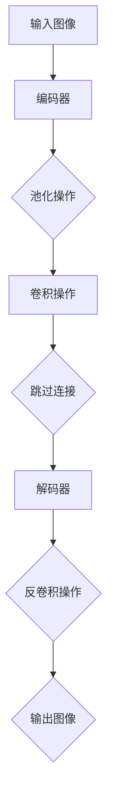
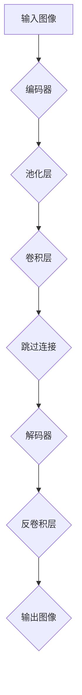

                 

### 第一部分: UNet原理

UNet是一种用于图像分割的卷积神经网络架构，因其简单有效的结构而被广泛用于医学图像处理、自动驾驶等领域。在这一部分，我们将详细讲解UNet的起源、基本概念、架构以及核心算法原理。

#### 第1章: UNet概述

##### 1.1 UNet的起源与发展

UNet最初由O. Ronneberger等人在2015年的论文《Unet: Convolutional Networks for Biomedical Image Segmentation》中提出。其设计初衷是为了解决生物医学图像分割的问题，特别是在医学影像处理领域。自提出以来，UNet因其结构简单、效果显著，迅速在计算机视觉领域得到广泛应用，并不断发展演化。

##### 1.1.1 UNet的提出背景

医学图像分割是一个重要的研究领域，它对于诊断、治疗、预后评估等都有重要作用。传统的医学图像分割方法通常依赖于复杂的算法，如随机森林、支持向量机等，但效果往往不理想。随着深度学习技术的发展，特别是卷积神经网络（CNN）的广泛应用，人们开始尝试将其应用于医学图像分割。UNet正是在这样的背景下被提出的。

##### 1.1.2 UNet的发展历程

自UNet提出以来，研究者们对其进行了多种改进和扩展，如引入跳跃连接（Skip Connection）来增强模型对特征的学习能力，提出不同版本的UNet以适应不同的应用场景等。这些改进使得UNet在多个领域的性能得到进一步提升。

##### 1.1.3 UNet的应用领域

UNet不仅广泛应用于医学图像分割，还应用于其他领域，如自动驾驶环境识别、自然图像分割等。其结构简单、效果显著的特点，使得UNet成为许多研究和项目中的首选架构。

##### 1.2 UNet的基本概念

要理解UNet，我们需要了解其几个核心概念：输入与输出、编码器与解码器、跳过连接。

###### 1.2.1 输入与输出

UNet的输入是一个二维图像，输出是一个与输入同样大小的二值图像，其中每个像素点的值表示该像素点是否属于目标区域。

###### 1.2.2 编码器与解码器

UNet由编码器和解码器两部分组成。编码器负责将输入图像逐渐压缩，提取高层次的语义特征；解码器则负责将压缩后的特征逐渐扩展，恢复图像的细节信息。

###### 1.2.3 跳过连接

跳过连接（Skip Connection）是UNet中的一个重要特性，它将编码器和解码器之间直接连接起来，使得解码器可以直接利用编码器提取的高层次特征，从而提高模型的性能。

##### 1.3 UNet的架构

UNet的架构如图所示：

###### 1.3.1 编码器部分

编码器部分通常由多个卷积层和池化层组成，用于逐步压缩输入图像，提取高层次的语义特征。

###### 1.3.2 解码器部分

解码器部分则由多个反卷积层和卷积层组成，用于逐步扩展编码器提取的特征，恢复图像的细节信息。

###### 1.3.3 跳过连接机制

跳过连接机制将编码器和解码器之间的特征图进行拼接，从而使得解码器可以直接利用编码器提取的高层次特征。

###### 1.3.4 Mermaid流程图

下面是一个简单的Mermaid流程图，用于描述UNet的架构：

通过这一章节，我们对UNet的起源、基本概念和架构有了初步的了解。在接下来的章节中，我们将深入探讨UNet的核心算法原理，包括卷积神经网络的基础知识、反卷积操作、跳过连接机制以及U-Net架构的详细讲解。这将帮助我们更好地理解UNet的工作原理，为后续的实践应用打下基础。在下一章，我们将首先介绍卷积神经网络的基础知识，让我们继续深入探讨。

