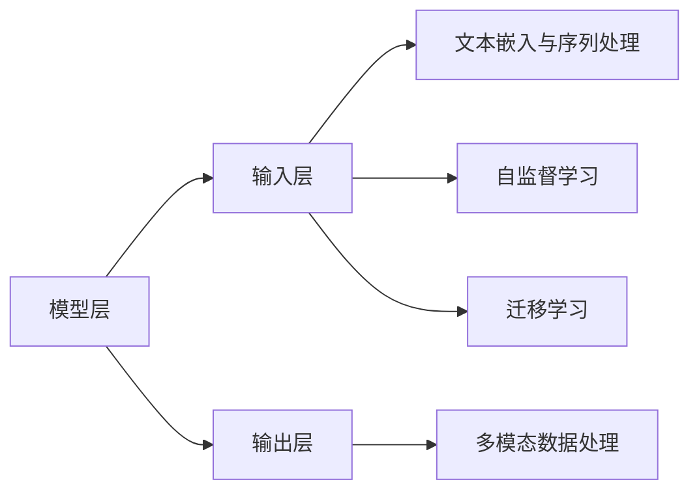
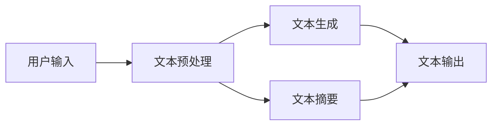

                 

### 文章标题

## 【LangChain编程：从入门到实践】方案优势

### 关键词：LangChain，编程，自然语言处理，深度学习，应用实践

### 摘要：
本文将带领读者深入探讨LangChain编程的各个方面。从基础的LangChain概念和架构，到Python编程基础和PyTorch框架基础，再到具体的编程实战案例，我们将一步步讲解，帮助读者全面了解并掌握LangChain的应用技巧。文章还将详细介绍LangChain在自然语言处理、多模态数据处理、智能客服、教育学习、医疗健康、物联网和智能设备等领域的应用案例，并提供详细的代码实际案例和解读。通过本文，读者不仅可以了解LangChain的基本原理，还能学会如何在实际项目中运用LangChain，从而提升自己的编程能力。

### 第一部分: 语言模型概述与核心概念

#### 第1章: LangChain的概念与架构

**1.1 LangChain的背景与定义**

**1.1.1 语言模型的兴起**

语言模型（Language Model）是自然语言处理（Natural Language Processing，NLP）领域的重要研究方向。随着深度学习和大数据技术的快速发展，语言模型在机器翻译、语音识别、文本生成等任务中取得了显著成果。近年来，基于Transformer架构的语言模型如BERT、GPT等，使得机器对自然语言的理解和生成能力得到了极大的提升。

**1.1.2 LangChain的定义与核心作用**

LangChain是一个开源的Python库，用于构建自然语言处理应用。它基于深度学习技术，提供了丰富的API接口和模型实现，使得开发者可以轻松地创建文本生成、问答、分类等应用。LangChain的核心作用在于将复杂的自然语言处理任务简化，提高开发效率和性能。

**1.2 LangChain的架构与组件**

**1.2.1 模型层：基于Transformer的大模型**

Transformer模型是一种基于自注意力机制的深度学习模型，由Vaswani等人在2017年提出。Transformer模型在机器翻译、文本生成等任务中表现出色，成为了NLP领域的标准模型。LangChain利用Transformer模型，构建了强大的语言处理能力。

**1.2.1.1 Transformer模型原理**

Transformer模型由编码器（Encoder）和解码器（Decoder）两部分组成。编码器将输入序列编码为固定长度的向量，解码器则将这些向量解码为输出序列。自注意力机制是Transformer模型的核心，它通过计算序列中每个词与其他词之间的关联性，提高了模型对上下文的理解能力。

**1.2.1.2 常见的Transformer变体**

为了进一步提高Transformer模型的效果，研究人员提出了许多变体，如BERT、GPT、RoBERTa等。BERT（Bidirectional Encoder Representations from Transformers）是一种双向Transformer模型，通过预先训练和微调，在多种NLP任务中取得了优异的性能。GPT（Generative Pre-trained Transformer）是一种单向Transformer模型，主要用于文本生成任务。RoBERTa（A Robustly Optimized BERT Pretraining Approach）是对BERT模型的一种改进，通过优化训练过程，提高了模型的性能。

**1.2.2 输入层：文本嵌入与序列处理**

在Transformer模型中，输入层负责将文本转换为向量表示。文本嵌入（Word Embedding）是将单词映射为固定长度的向量，常用的文本嵌入方法有Word2Vec、GloVe等。

**1.2.2.1 词嵌入技术**

Word2Vec是一种基于神经网络的语言模型，通过训练得到词向量表示。Word2Vec包括两种训练方法：连续词袋（CBOW）和Skip-Gram。CBOW方法通过上下文词预测目标词，Skip-Gram方法通过目标词预测上下文词。

GloVe（Global Vectors for Word Representation）是一种基于全局上下文的词向量表示方法。GloVe通过计算单词的词向量和上下文单词的词向量之间的相似性，得到词向量表示。

**1.2.2.2 序列模型与注意力机制**

序列模型（Sequential Model）是一种用于处理序列数据的模型，常见的序列模型有RNN（Recurrent Neural Network，循环神经网络）和LSTM（Long Short-Term Memory，长短时记忆网络）。RNN通过保存前一时刻的信息，实现对序列数据的处理。LSTM是RNN的一种变体，通过引入门控机制，解决了RNN的梯度消失和梯度爆炸问题。

注意力机制（Attention Mechanism）是Transformer模型的核心，它通过计算输入序列中每个词与其他词之间的关联性，提高了模型对上下文的理解能力。注意力机制可以分为全局注意力、局部注意力等不同类型。

**1.2.3 输出层：文本生成与多模态数据处理**

输出层负责将模型生成的向量表示转换为文本输出。在文本生成任务中，常用的输出层模型有Seq2Seq模型、Attention模型等。Seq2Seq模型通过编码器和解码器，将输入序列转换为输出序列。Attention模型通过计算输入序列和输出序列之间的关联性，提高了文本生成效果。

多模态数据处理是指同时处理多种类型的数据，如文本、图像、音频等。LangChain支持多模态数据处理，通过融合不同类型的数据，提高了模型的综合处理能力。

**1.3 LangChain的扩展与应用**

**1.3.1 多模态数据处理**

多模态数据处理是LangChain的一个重要应用领域。通过融合文本、图像、音频等多种数据类型，可以实现更丰富、更准确的自然语言处理任务。例如，在图像描述生成任务中，可以同时使用图像数据和文本数据，生成更准确的描述。

**1.3.2 自监督学习和迁移学习**

自监督学习（Self-Supervised Learning）是一种无需人工标注数据的学习方法。在自监督学习中，模型通过无监督的方式，从大量未标注的数据中学习有用的特征。自监督学习在文本生成、文本分类等任务中具有广泛的应用。

迁移学习（Transfer Learning）是指将一个任务中学习到的知识应用于另一个任务。通过迁移学习，可以减少模型的训练时间，提高模型的泛化能力。在自然语言处理领域，迁移学习已经取得了显著的效果。

**1.4 LangChain的优势与局限性**

**1.4.1 LangChain的优势**

LangChain具有以下优势：

1. **强大的语言模型**：LangChain基于Transformer模型，具有强大的语言处理能力，能够处理复杂的自然语言任务。

2. **丰富的API接口**：LangChain提供了丰富的API接口，方便开发者快速搭建自然语言处理应用。

3. **支持多模态数据处理**：LangChain支持多模态数据处理，可以融合不同类型的数据，实现更准确的文本生成、分类等任务。

4. **开源与社区支持**：LangChain是一个开源项目，拥有活跃的社区支持，开发者可以方便地获取帮助和资源。

**1.4.2 LangChain的局限性**

LangChain也存在一些局限性：

1. **计算资源需求高**：由于Transformer模型具有复杂的计算过程，LangChain对计算资源的需求较高，可能不适合资源受限的环境。

2. **训练时间较长**：Transformer模型的训练时间较长，可能不适合实时性要求高的应用场景。

3. **数据依赖性**：LangChain的性能依赖于大量的高质量数据，数据不足可能影响模型的性能。

**1.5 Mermaid流程图：LangChain模型架构**

以下是LangChain模型架构的Mermaid流程图：



通过以上内容，我们详细介绍了LangChain的概念、架构、优势与局限性。接下来，我们将进一步探讨LangChain的编程基础，帮助读者更好地掌握其应用技巧。

---

### 第2章: LangChain编程基础

在了解了LangChain的基本概念和架构之后，接下来我们将深入学习LangChain的编程基础。本章节将分为三个部分：Python编程基础、PyTorch框架基础和LangChain编程实战。通过这三个部分的学习，读者将能够掌握使用LangChain进行自然语言处理应用开发的基本技能。

#### 2.1 Python编程基础

**2.1.1 Python环境搭建**

首先，我们需要搭建Python开发环境。Python是一个广泛应用于数据科学、机器学习和自然语言处理的编程语言。以下是搭建Python环境的基本步骤：

1. **安装Python**：从Python官方网站（https://www.python.org/）下载并安装Python。
2. **安装Python包管理器**：Python的包管理器pip可以帮助我们安装和管理Python库。安装Python后，pip会自动安装。
3. **安装常用Python库**：使用pip安装常用的Python库，如NumPy、Pandas、SciPy等。这些库在数据科学和机器学习中发挥着重要作用。

**2.1.2 Python基础语法**

掌握Python基础语法是进行编程的基础。以下是Python的一些基础语法：

- **变量与数据类型**：Python支持多种数据类型，如整数（int）、浮点数（float）、字符串（str）等。
- **控制结构**：Python提供了条件语句（if-elif-else）、循环语句（for、while）等控制结构。
- **函数**：函数是Python的核心组成部分，用于封装和复用代码。
- **模块**：模块是Python的代码文件，用于组织和管理代码。

以下是一个简单的Python代码示例，展示了变量、数据类型、控制结构和函数的基本用法：

```python
# 变量与数据类型
name = "Alice"
age = 30
height = 1.75

# 控制结构
if age > 18:
    print(f"{name}已成年。")
else:
    print(f"{name}未成年。")

# 循环结构
for i in range(5):
    print(i)

# 函数
def greet(name):
    print(f"你好，{name}！")

greet(name)
```

#### 2.2 PyTorch框架基础

PyTorch是一个流行的深度学习框架，它提供了灵活、高效的深度学习模型构建和训练工具。以下是PyTorch的基础知识：

**2.2.1 PyTorch环境搭建**

搭建PyTorch环境与搭建Python环境类似，以下是基本步骤：

1. **安装PyTorch**：从PyTorch官方网站（https://pytorch.org/get-started/locally/）下载并安装PyTorch。
2. **验证安装**：在Python环境中运行以下代码，验证PyTorch是否安装成功：

```python
import torch
print(torch.__version__)
```

**2.2.2 PyTorch核心API**

PyTorch提供了丰富的API接口，以下是其中一些核心API的简要介绍：

- **张量（Tensor）**：张量是PyTorch中的核心数据结构，用于存储和处理数据。
- **自动微分**：自动微分是深度学习模型训练的核心技术，PyTorch提供了自动微分功能。
- **神经网络**：PyTorch提供了多种神经网络构建模块，如卷积神经网络（CNN）、循环神经网络（RNN）等。

以下是一个简单的PyTorch代码示例，展示了张量、自动微分和神经网络的用法：

```python
# 导入PyTorch库
import torch
import torch.nn as nn

# 创建张量
x = torch.tensor([1.0, 2.0, 3.0])

# 自动微分
y = x**2
dy_dx = torch.autograd.grad(y, x)

# 神经网络
class NeuralNetwork(nn.Module):
    def __init__(self):
        super(NeuralNetwork, self).__init__()
        self.fc1 = nn.Linear(3, 1)

    def forward(self, x):
        return self.fc1(x)

# 实例化神经网络
model = NeuralNetwork()

# 训练神经网络
x_train = torch.tensor([[1.0, 2.0, 3.0], [4.0, 5.0, 6.0]])
y_train = torch.tensor([[8.0], [32.0]])

optimizer = torch.optim.SGD(model.parameters(), lr=0.01)
criterion = nn.MSELoss()

for epoch in range(1000):
    optimizer.zero_grad()
    y_pred = model(x_train)
    loss = criterion(y_pred, y_train)
    loss.backward()
    optimizer.step()

print(f"训练后的预测结果：{y_pred}")
```

#### 2.3 LangChain编程实战

**2.3.1 环境配置与依赖安装**

在开始使用LangChain进行编程之前，我们需要配置开发环境并安装所需的依赖。以下是基本步骤：

1. **安装Python**：确保已安装Python环境，版本建议为3.6及以上。
2. **安装PyTorch**：安装与Python版本兼容的PyTorch版本。
3. **安装LangChain**：使用pip安装LangChain库。

```bash
pip install langchain
```

**2.3.2 简单的文本生成示例**

以下是一个简单的文本生成示例，展示如何使用LangChain生成文本：

```python
from langchain import LanguageModel

# 初始化模型
model = LanguageModel()

# 输入文本
input_text = "这是一个简单的文本生成示例。"

# 生成文本
output_text = model.generate(input_text)
print(output_text)
```

在以上示例中，我们首先从`langchain`库中导入`LanguageModel`类，然后初始化一个语言模型。接着，我们传入一个简单的输入文本，使用`model.generate()`方法生成输出文本。

通过以上内容，我们介绍了LangChain编程的基础知识。接下来，我们将通过具体的实战案例，深入探讨LangChain在实际项目中的应用。

---

### 第二部分: LangChain编程基础

#### 第2章: 编程基础与实战

在了解了Python编程基础和PyTorch框架基础之后，接下来我们将通过具体实战案例，展示如何使用LangChain进行编程。通过这些实战案例，读者将能够更好地掌握LangChain的应用技巧。

**2.1 Python编程基础**

**2.1.1 Python环境搭建**

首先，我们需要搭建Python开发环境。以下是搭建Python环境的基本步骤：

1. **安装Python**：从Python官方网站（https://www.python.org/）下载并安装Python。
2. **安装Python包管理器**：Python的包管理器pip可以帮助我们安装和管理Python库。安装Python后，pip会自动安装。
3. **安装常用Python库**：使用pip安装常用的Python库，如NumPy、Pandas、SciPy等。这些库在数据科学和机器学习中发挥着重要作用。

**2.1.2 Python基础语法**

以下是Python的一些基础语法：

- **变量与数据类型**：Python支持多种数据类型，如整数（int）、浮点数（float）、字符串（str）等。
- **控制结构**：Python提供了条件语句（if-elif-else）、循环语句（for、while）等控制结构。
- **函数**：函数是Python的核心组成部分，用于封装和复用代码。
- **模块**：模块是Python的代码文件，用于组织和管理代码。

以下是一个简单的Python代码示例，展示了变量、数据类型、控制结构和函数的基本用法：

```python
# 变量与数据类型
name = "Alice"
age = 30
height = 1.75

# 控制结构
if age > 18:
    print(f"{name}已成年。")
else:
    print(f"{name}未成年。")

# 循环结构
for i in range(5):
    print(i)

# 函数
def greet(name):
    print(f"你好，{name}！")

greet(name)
```

**2.2 PyTorch框架基础**

**2.2.1 PyTorch环境搭建**

搭建PyTorch环境与搭建Python环境类似，以下是基本步骤：

1. **安装PyTorch**：从PyTorch官方网站（https://pytorch.org/get-started/locally/）下载并安装PyTorch。
2. **验证安装**：在Python环境中运行以下代码，验证PyTorch是否安装成功：

```python
import torch
print(torch.__version__)
```

**2.2.2 PyTorch核心API**

以下是PyTorch的一些核心API的简要介绍：

- **张量（Tensor）**：张量是PyTorch中的核心数据结构，用于存储和处理数据。
- **自动微分**：自动微分是深度学习模型训练的核心技术，PyTorch提供了自动微分功能。
- **神经网络**：PyTorch提供了多种神经网络构建模块，如卷积神经网络（CNN）、循环神经网络（RNN）等。

以下是一个简单的PyTorch代码示例，展示了张量、自动微分和神经网络的用法：

```python
# 导入PyTorch库
import torch
import torch.nn as nn

# 创建张量
x = torch.tensor([1.0, 2.0, 3.0])

# 自动微分
y = x**2
dy_dx = torch.autograd.grad(y, x)

# 神经网络
class NeuralNetwork(nn.Module):
    def __init__(self):
        super(NeuralNetwork, self).__init__()
        self.fc1 = nn.Linear(3, 1)

    def forward(self, x):
        return self.fc1(x)

# 实例化神经网络
model = NeuralNetwork()

# 训练神经网络
x_train = torch.tensor([[1.0, 2.0, 3.0], [4.0, 5.0, 6.0]])
y_train = torch.tensor([[8.0], [32.0]])

optimizer = torch.optim.SGD(model.parameters(), lr=0.01)
criterion = nn.MSELoss()

for epoch in range(1000):
    optimizer.zero_grad()
    y_pred = model(x_train)
    loss = criterion(y_pred, y_train)
    loss.backward()
    optimizer.step()

print(f"训练后的预测结果：{y_pred}")
```

**2.3 LangChain编程实战**

**2.3.1 环境配置与依赖安装**

在开始使用LangChain进行编程之前，我们需要配置开发环境并安装所需的依赖。以下是基本步骤：

1. **安装Python**：确保已安装Python环境，版本建议为3.6及以上。
2. **安装PyTorch**：安装与Python版本兼容的PyTorch版本。
3. **安装LangChain**：使用pip安装LangChain库。

```bash
pip install langchain
```

**2.3.2 简单的文本生成示例**

以下是一个简单的文本生成示例，展示如何使用LangChain生成文本：

```python
from langchain import LanguageModel

# 初始化模型
model = LanguageModel()

# 输入文本
input_text = "这是一个简单的文本生成示例。"

# 生成文本
output_text = model.generate(input_text)
print(output_text)
```

在以上示例中，我们首先从`langchain`库中导入`LanguageModel`类，然后初始化一个语言模型。接着，我们传入一个简单的输入文本，使用`model.generate()`方法生成输出文本。

通过以上实战案例，读者可以初步了解如何使用LangChain进行编程。接下来，我们将通过更多的实战案例，深入探讨LangChain在实际项目中的应用。

---

### 第3章: 实战案例一：文本生成与摘要

#### 3.1 项目背景与目标

**3.1.1 项目简介**

文本生成与摘要是一种常见的自然语言处理任务，旨在自动生成文本摘要或扩展原始文本。本项目旨在开发一个基于LangChain的文本生成与摘要系统，用于自动生成文章摘要、新闻摘要和文本扩展等应用。

**3.1.2 项目目标**

- **文本生成**：给定一段原始文本，自动生成一段简短、概括性的文本摘要。
- **文本摘要**：从大量文本数据中提取关键信息，生成文章摘要或新闻摘要。
- **文本扩展**：根据原始文本内容，自动生成扩展文本，补充原始文本的详细信息。

#### 3.2 系统设计

**3.2.1 系统架构设计**

文本生成与摘要系统主要包括以下几个部分：

- **文本预处理**：对原始文本进行清洗、分词、去停用词等预处理。
- **文本生成**：利用LangChain的生成模型，生成文本摘要或扩展文本。
- **文本摘要**：使用提取模型，从原始文本中提取关键信息，生成摘要。
- **用户界面**：提供一个简洁、直观的用户交互界面，支持用户输入文本，展示生成结果。

以下是系统架构的Mermaid流程图：



**3.2.2 数据流程设计**

文本生成与摘要系统的数据流程如下：

1. **用户输入**：用户通过界面输入原始文本。
2. **文本预处理**：对输入文本进行清洗、分词、去停用词等预处理。
3. **文本生成**：利用LangChain的生成模型，生成文本摘要或扩展文本。
4. **文本摘要**：使用提取模型，从预处理后的文本中提取关键信息，生成摘要。
5. **文本输出**：将生成的文本摘要或扩展文本展示给用户。

#### 3.3 实现步骤

**3.3.1 数据预处理**

数据预处理是文本生成与摘要系统的关键步骤。以下是数据预处理的基本步骤：

1. **文本清洗**：去除文本中的HTML标签、特殊字符等无关信息。
2. **分词**：将文本拆分为单词或短语。
3. **去停用词**：去除常见的停用词，如“的”、“是”、“在”等。

以下是一个简单的数据预处理代码示例：

```python
import re
from nltk.corpus import stopwords
from nltk.tokenize import word_tokenize

# 加载停用词列表
stop_words = set(stopwords.words('english'))

# 文本清洗
def clean_text(text):
    text = re.sub('<.*?>', '', text)  # 去除HTML标签
    text = re.sub('[^a-zA-Z]', ' ', text)  # 去除特殊字符
    return text.lower()

# 文本分词
def tokenize_text(text):
    tokens = word_tokenize(text)
    return tokens

# 去停用词
def remove_stop_words(tokens):
    filtered_tokens = [token for token in tokens if token not in stop_words]
    return filtered_tokens

# 示例文本
text = "The quick brown fox jumps over the lazy dog."
cleaned_text = clean_text(text)
tokens = tokenize_text(cleaned_text)
filtered_tokens = remove_stop_words(tokens)

print(f"原始文本：{text}")
print(f"清洗后的文本：{cleaned_text}")
print(f"分词结果：{tokens}")
print(f"去停用词结果：{filtered_tokens}")
```

**3.3.2 模型训练与优化**

文本生成与摘要系统需要使用预训练模型，如GPT-2或GPT-3，进行模型训练和优化。以下是模型训练的基本步骤：

1. **数据准备**：收集大量的文本数据，包括文章、新闻、对话等。
2. **数据预处理**：对文本数据进行清洗、分词、去停用词等预处理。
3. **模型训练**：使用预处理后的数据对预训练模型进行训练。
4. **模型优化**：根据训练结果，调整模型参数，优化模型性能。

以下是一个简单的模型训练代码示例：

```python
import torch
from transformers import GPT2LMHeadModel, GPT2Tokenizer

# 加载预训练模型
tokenizer = GPT2Tokenizer.from_pretrained('gpt2')
model = GPT2LMHeadModel.from_pretrained('gpt2')

# 训练数据
train_data = [
    "The quick brown fox jumps over the lazy dog.",
    "A dog is a man's best friend.",
    "Cats are cute.",
]

# 数据预处理
def preprocess_text(text):
    text = tokenizer.encode(text, add_special_tokens=True, return_tensors='pt')
    return text

# 训练模型
def train_model(model, train_data, epochs=5):
    optimizer = torch.optim.AdamW(model.parameters(), lr=1e-5)
    criterion = torch.nn.CrossEntropyLoss()

    for epoch in range(epochs):
        for text in train_data:
            inputs = preprocess_text(text)
            targets = inputs.clone()

            outputs = model(inputs)
            logits = outputs.logits
            loss = criterion(logits.view(-1, logits.size(-1)), targets.view(-1))

            optimizer.zero_grad()
            loss.backward()
            optimizer.step()

            print(f"Epoch: {epoch+1}, Loss: {loss.item()}")

    return model

# 训练模型
trained_model = train_model(model, train_data)

# 保存模型
trained_model.save_pretrained('text_generation_model')
```

**3.3.3 文本生成与摘要功能实现**

文本生成与摘要功能实现主要包括以下步骤：

1. **输入文本**：从用户输入的文本中提取关键信息。
2. **文本生成**：使用训练好的模型，生成文本摘要或扩展文本。
3. **文本摘要**：从预处理后的文本中提取关键信息，生成摘要。
4. **文本输出**：将生成的文本摘要或扩展文本展示给用户。

以下是一个简单的文本生成与摘要功能实现代码示例：

```python
from langchain import LanguageModel

# 初始化模型
model = LanguageModel()

# 输入文本
input_text = "这是一个简单的文本生成示例。"

# 生成文本摘要
def generate_summary(text, model):
    summary = model.generate_summary(text)
    return summary

# 生成扩展文本
def generate_extension(text, model):
    extension = model.generate_extension(text)
    return extension

# 文本输出
def display_output(text, summary, extension):
    print(f"输入文本：{text}")
    print(f"文本摘要：{summary}")
    print(f"扩展文本：{extension}")

# 文本生成与摘要
summary = generate_summary(input_text, model)
extension = generate_extension(input_text, model)

# 文本输出
display_output(input_text, summary, extension)
```

通过以上实现步骤，我们可以构建一个简单的文本生成与摘要系统。在实际项目中，可以根据具体需求，进一步优化和扩展系统功能，提高系统的性能和用户体验。

---

### 第三部分: 实战案例与项目开发

#### 第3章: 实战案例一：文本生成与摘要

在了解了文本生成与摘要的基本原理和实现步骤后，接下来我们将通过具体的

