                 

## 引言

### 大模型与AI Agent的重要性

近年来，人工智能（AI）领域取得了飞速的发展，特别是基于深度学习的大模型在各个应用场景中展现出了强大的能力。在这个背景下，AI Agent（人工智能代理）的概念逐渐受到广泛关注。AI Agent是一种能够模拟人类智能行为，自主执行任务的实体，它在大模型的基础上，结合了智能决策和行动能力，能够实现更高层次的人工智能应用。

大模型，尤其是近年来兴起的预训练模型，如GPT、BERT等，已经成为AI Agent的核心驱动力。这些模型通过在海量数据上进行预训练，获得了强大的语言理解和生成能力，能够为AI Agent提供丰富的知识和技能。而AI Agent则通过这些知识和技能，实现与人类用户的有效互动和任务执行。

本篇文章将围绕大模型与AI Agent这一主题，进行深入探讨。我们将首先介绍大模型与AI Agent的基本概念，然后详细分析大模型的技术原理和AI Agent的开发工具与平台，接着探讨大模型与AI Agent的应用场景，并通过实际案例进行开发实践，最后讨论大模型与AI Agent的性能优化、安全与伦理问题，以及未来的发展趋势。希望通过本文的阅读，读者能够全面了解大模型与AI Agent的开发与应用，为未来的研究和实践提供指导。

### 文章关键词

- 大模型
- AI Agent
- 深度学习
- 预训练模型
- 自然语言处理
- 智能客服
- 性能优化
- 安全与伦理

### 文章摘要

本文旨在深入探讨大模型与AI Agent的原理、开发和应用。首先，我们介绍了大模型与AI Agent的基本概念和重要性。接着，详细分析了大模型的技术原理，包括其架构、训练过程和优化方法。随后，我们探讨了AI Agent的开发工具与平台，并列举了常见的开发工具和平台。接下来，我们讨论了大模型与AI Agent的应用场景，特别是自然语言处理和智能客服领域的应用。然后，通过实际案例，我们展示了如何开发和部署大模型与AI Agent。最后，我们分析了大模型与AI Agent的性能优化、安全与伦理问题，并展望了未来的发展趋势。希望通过本文的阅读，读者能够全面了解大模型与AI Agent的原理、开发和应用，为未来的研究和实践提供指导。

### 第一部分：大模型与AI基础

#### 第1章：大模型与AI概述

##### 1.1 大模型与AI概述

1. **大模型的概念与历史**

   大模型（Large Model）是指具有数十亿到数万亿参数的神经网络模型。这种模型通过在海量数据上进行预训练，能够获取丰富的知识和技能，从而在多个领域实现高性能的表现。大模型的历史可以追溯到2012年，当时深度学习在ImageNet图像识别比赛中取得了突破性的进展，这标志着深度学习时代的到来。此后，随着计算能力的提升和海量数据的获取，大模型的研究和应用得到了广泛关注。

2. **AI Agent的概念**

   AI Agent是指一种能够模拟人类智能行为，自主执行任务的实体。AI Agent通常由感知模块、决策模块和动作模块组成。感知模块负责获取环境信息，决策模块负责根据环境信息进行决策，动作模块负责执行决策结果。AI Agent的核心目标是实现自主学习和智能决策，从而在不同场景中完成复杂任务。

3. **大模型在AI Agent中的应用**

   大模型在AI Agent中发挥着至关重要的作用。首先，大模型可以通过预训练获取丰富的知识，为AI Agent提供强大的知识基础。其次，大模型具备强大的语言理解和生成能力，能够实现自然语言处理任务，如问答、机器翻译和文本生成等。此外，大模型还可以用于图像识别、语音识别和视频分析等领域，从而提升AI Agent的感知和决策能力。

##### 1.2 AI Agent的基础知识

1. **AI Agent的定义与类型**

   AI Agent是一种基于人工智能技术的实体，能够模拟人类智能行为，自主执行任务。根据功能的不同，AI Agent可以分为以下几类：

   - **任务型AI Agent**：专注于完成特定任务的AI Agent，如智能客服、智能助手等。
   - **情境型AI Agent**：能够根据不同情境进行自适应调整的AI Agent，如智能家居、智能交通等。
   - **知识型AI Agent**：具备丰富知识库，能够提供专业咨询和决策支持的AI Agent，如智能问答系统、智能推荐系统等。

2. **AI Agent的功能与特性**

   AI Agent的功能主要包括感知、决策和行动。感知功能负责获取环境信息，如语音、图像和文本等；决策功能根据感知信息进行推理和决策，生成行动方案；行动功能负责执行决策结果，如发送消息、操作设备等。AI Agent的特性包括：

   - **自主性**：AI Agent能够自主地执行任务，无需人工干预。
   - **适应性**：AI Agent能够根据环境变化和任务需求，进行自适应调整。
   - **学习性**：AI Agent能够通过数据反馈和学习算法，不断提升自身能力和知识。

3. **AI Agent的发展趋势**

   随着人工智能技术的不断发展，AI Agent在未来将呈现以下发展趋势：

   - **跨领域融合**：AI Agent将融合多个领域的知识，实现更广泛的应用。
   - **个性化服务**：AI Agent将根据用户需求和行为，提供个性化服务。
   - **自主进化**：AI Agent将通过自我学习和优化，实现自主进化，提升智能水平。
   - **人机协作**：AI Agent将与人类用户实现高效协作，共同完成复杂任务。

##### 1.3 大模型在AI Agent中的应用

1. **语言模型在AI Agent中的应用**

   语言模型是AI Agent的重要组成部分，它能够理解和生成自然语言。在AI Agent中，语言模型可以用于：

   - **自然语言理解**：通过解析用户输入的文本，提取关键信息和意图。
   - **自然语言生成**：根据任务需求，生成自然语言文本，如回复消息、生成报告等。
   - **跨模态交互**：结合语音、图像等多模态信息，实现更丰富的交互体验。

2. **图像模型在AI Agent中的应用**

   图像模型可以用于AI Agent的视觉感知和决策。在AI Agent中，图像模型可以用于：

   - **图像识别**：识别和理解输入图像的内容。
   - **目标检测**：检测图像中的目标物体。
   - **图像生成**：根据文本描述生成相应的图像。

3. **多模态模型在AI Agent中的应用**

   多模态模型能够结合不同类型的数据（如文本、图像、语音等），实现更全面的信息理解和决策。在AI Agent中，多模态模型可以用于：

   - **跨模态搜索**：结合文本和图像信息，实现更精准的搜索结果。
   - **智能交互**：通过多模态数据，实现更自然的用户交互体验。
   - **任务执行**：结合多模态信息，实现更高效的任务执行。

#### 第2章：大模型技术基础

##### 2.1 大模型的技术原理

1. **大模型的架构**

   大模型的架构通常包括以下几个层次：

   - **输入层**：接收外部输入数据，如文本、图像等。
   - **隐藏层**：包含多层神经网络，用于特征提取和知识表示。
   - **输出层**：根据任务需求，生成预测结果或决策。

   每一层都可以通过多个神经元（节点）组成，从而实现复杂的非线性变换。大模型通常采用深度神经网络（DNN）作为基本架构，并通过堆叠多层神经网络，提高模型的表达能力和性能。

2. **大模型的训练过程**

   大模型的训练过程主要包括以下几个步骤：

   - **数据预处理**：对输入数据进行清洗、归一化等预处理操作。
   - **模型初始化**：初始化模型的参数，通常采用随机初始化或预训练模型作为初始化。
   - **前向传播**：将输入数据传递到模型中，通过隐藏层计算得到输出。
   - **损失函数计算**：计算输出结果与真实标签之间的误差，并计算损失值。
   - **反向传播**：将损失值反向传播到模型的各个层，更新模型参数。
   - **优化算法**：通过优化算法（如梯度下降、Adam等）更新模型参数，减小损失值。

   大模型的训练过程通常需要大量计算资源和时间，尤其是在训练大规模模型时，计算量和存储需求非常大。

3. **大模型的优化方法**

   大模型的优化方法主要包括以下几个方面：

   - **模型压缩**：通过减少模型参数的数量，降低模型的计算量和存储需求。常见的模型压缩方法包括剪枝、量化、蒸馏等。
   - **分布式训练**：通过将训练任务分布到多个计算节点上，提高训练速度和效率。分布式训练可以采用参数服务器架构、数据并行、模型并行等技术。
   - **迁移学习**：通过利用预训练模型的知识，提高新任务的性能。迁移学习可以用于提高模型在数据稀缺或数据分布不同的情况下的性能。
   - **自适应学习率**：通过自适应调整学习率，优化模型的训练过程。常见的自适应学习率方法包括Adam、Adadelta等。

##### 2.2 AI Agent的开发工具与平台

1. **常用开发工具与框架**

   在AI Agent的开发过程中，常用的开发工具和框架包括：

   - **TensorFlow**：由Google开发的开源深度学习框架，支持多种编程语言，具有丰富的模型库和工具集。
   - **PyTorch**：由Facebook开发的开源深度学习框架，以动态图模型为主要特点，便于模型开发和调试。
   - **Keras**：基于TensorFlow和Theano的开源深度学习框架，提供简洁的API，易于模型搭建和训练。
   - **MXNet**：由Apache Software Foundation开发的深度学习框架，支持多种编程语言，具有良好的性能和灵活性。

2. **开发平台的选择与配置**

   在选择和配置开发平台时，需要考虑以下几个方面：

   - **计算资源**：根据模型的复杂度和计算需求，选择合适的计算资源，如CPU、GPU、TPU等。
   - **操作系统**：选择适合深度学习的操作系统，如Linux、macOS等。
   - **编译器**：根据开发工具和框架的要求，选择合适的编译器，如GCC、Clang等。
   - **依赖管理**：使用依赖管理工具（如pip、conda等）来管理开发环境中的依赖库和工具。

3. **开发环境与依赖管理**

   在搭建开发环境时，需要安装以下依赖：

   - **Python**：深度学习开发的基础语言，需要安装Python解释器和相关库。
   - **深度学习框架**：根据项目需求，安装相应的深度学习框架和依赖库。
   - **其他工具和库**：包括数据处理工具（如NumPy、Pandas等）、可视化工具（如Matplotlib、Seaborn等）和版本控制工具（如Git等）。

##### 2.3 大模型与AI Agent的应用场景

1. **自然语言处理中的应用**

   大模型在自然语言处理（NLP）领域展现了强大的能力，可以应用于以下场景：

   - **语言模型应用**：如机器翻译、文本生成、问答系统等。
     ```mermaid
     graph TD
     A[输入文本] --> B[预训练模型]
     B --> C{翻译/生成/问答}
     C --> D[输出结果]
     ```
   - **文本分类应用**：如情感分析、新闻分类、垃圾邮件过滤等。
     ```mermaid
     graph TD
     A[文本数据] --> B[预处理]
     B --> C[特征提取]
     C --> D[分类模型]
     D --> E{分类结果}
     ```

2. **智能客服中的应用**

   AI Agent在智能客服领域有着广泛的应用，可以实现以下功能：

   - **智能问答系统**：通过大模型实现自动问答，提高客服效率。
     ```mermaid
     graph TD
     A[用户提问] --> B[语言模型]
     B --> C{理解问题}
     C --> D[知识库]
     D --> E{生成回答}
     E --> F[用户反馈]
     ```
   - **智能路由系统**：根据用户问题和业务需求，将用户分配到相应的客服代表。
     ```mermaid
     graph TD
     A[用户提问] --> B[语言模型]
     B --> C{识别问题类型}
     C --> D[路由策略]
     D --> E[客服代表]
     ```

3. **其他应用场景**

   大模型和AI Agent在多个领域有着广泛的应用，如：

   - **金融风控**：通过分析大量金融数据，实现风险预测和决策支持。
   - **医疗健康**：通过分析医学数据，实现疾病诊断、治疗方案推荐等。
   - **教育**：通过个性化学习推荐，实现个性化教育和学习辅导。

#### 第3章：大模型与AI Agent的应用场景

##### 3.1 大模型在自然语言处理中的应用

大模型在自然语言处理（NLP）领域展现出了惊人的潜力，它们通过在海量文本数据上进行预训练，掌握了丰富的语言知识和模式，从而能够执行各种复杂的语言任务。以下是几个关键的应用场景：

**1. 语言模型的应用**

语言模型是NLP的核心组成部分，它们能够对自然语言进行建模，从而实现文本理解和生成。以下是一个简单的语言模型应用示例：

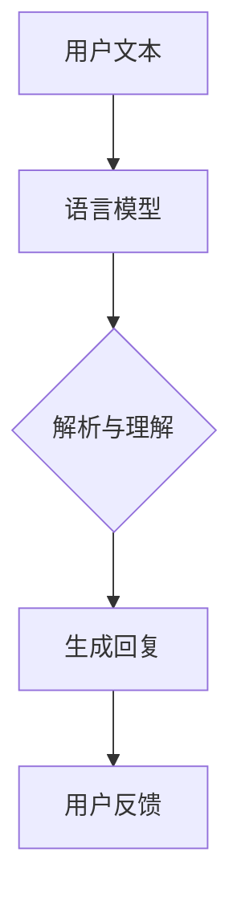

在上述流程中，用户输入的文本（A）首先被语言模型（B）接收，模型会对其进行解析与理解（C），然后生成一个适当的回复（D），用户可以对回复进行反馈（E），从而形成一个闭环的交互过程。

**2. 机器翻译的应用**

机器翻译是语言模型的一个重要应用领域，通过大模型，我们可以实现高效、准确的跨语言翻译。以下是一个机器翻译的示例：

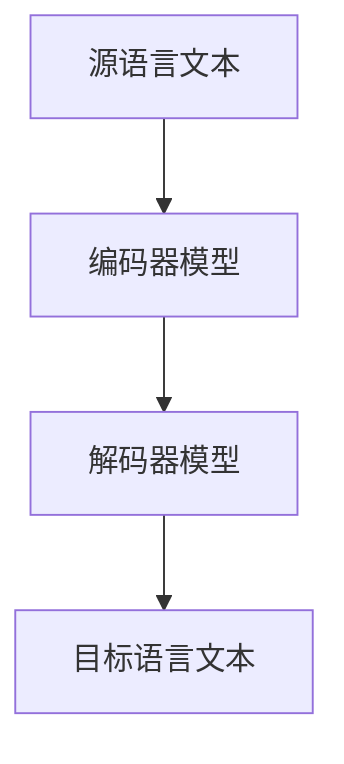

在这个流程中，源语言文本（A）首先被编码器模型（B）编码成一个固定长度的向量表示，然后这个向量表示被解码器模型（C）解码成目标语言文本（D）。随着预训练模型如BERT、GPT-3的发展，机器翻译的准确性得到了显著提升。

**3. 文本生成与摘要的应用**

文本生成与摘要是另一个重要的应用领域，通过大模型，我们可以自动生成文章摘要、生成创意内容等。以下是一个文本生成与摘要的示例：

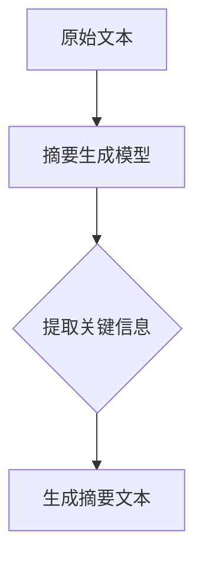

在这个流程中，原始文本（A）首先被摘要生成模型（B）处理，模型会提取出文本中的关键信息（C），然后生成一个摘要文本（D）。这种技术被广泛应用于新闻摘要、文档摘要等场景，能够提高信息检索和阅读的效率。

**4. 文本分类的应用**

文本分类是NLP中另一个常见任务，通过大模型，我们可以将文本数据自动分类到不同的类别中。以下是一个文本分类的示例：

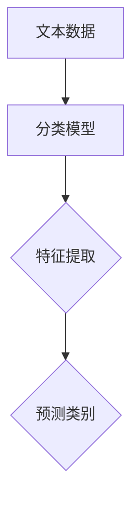

在这个流程中，文本数据（A）首先被分类模型（B）处理，模型会提取出文本的特征（C），然后根据特征预测文本的类别（D）。文本分类广泛应用于垃圾邮件检测、情感分析、新闻分类等场景。

**5. 文本生成与摘要的应用**

文本生成与摘要是另一个重要的应用领域，通过大模型，我们可以自动生成文章摘要、生成创意内容等。以下是一个文本生成与摘要的示例：


在这个流程中，原始文本（A）首先被摘要生成模型（B）处理，模型会提取出文本中的关键信息（C），然后生成一个摘要文本（D）。这种技术被广泛应用于新闻摘要、文档摘要等场景，能够提高信息检索和阅读的效率。

**6. 文本分类的应用**

文本分类是NLP中另一个常见任务，通过大模型，我们可以将文本数据自动分类到不同的类别中。以下是一个文本分类的示例：


在这个流程中，文本数据（A）首先被分类模型（B）处理，模型会提取出文本的特征（C），然后根据特征预测文本的类别（D）。文本分类广泛应用于垃圾邮件检测、情感分析、新闻分类等场景。

##### 3.2 AI Agent在智能客服中的应用

智能客服是AI Agent的一个重要应用领域，它通过大模型和NLP技术，能够实现自动化的客户服务，提高客户体验和运营效率。以下是AI Agent在智能客服中的几个关键应用场景：

**1. 智能问答系统**

智能问答系统是智能客服的核心功能之一，它能够自动回答用户提出的问题。以下是一个智能问答系统的示例：

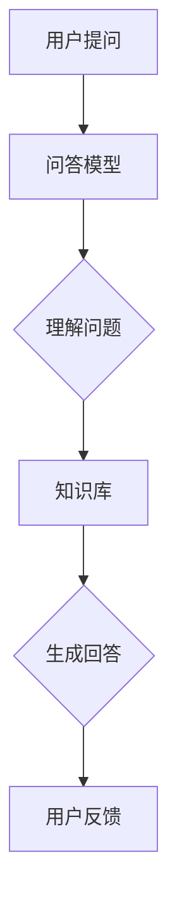

在这个流程中，用户提问（A）首先被问答模型（B）接收，模型会对其进行理解（C），然后从知识库（D）中查找相关信息，生成回答（E），最后用户可以对回答进行反馈（F），从而形成一个闭环的交互过程。

**2. 智能路由系统**

智能路由系统能够根据用户的问题和业务需求，将用户自动分配到相应的客服代表或团队。以下是一个智能路由系统的示例：

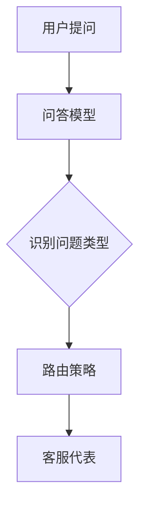

在这个流程中，用户提问（A）首先被问答模型（B）接收，模型会识别问题的类型（C），然后根据路由策略（D）将用户分配到相应的客服代表（E），从而实现高效的服务分配。

**3. 情感分析**

情感分析是智能客服中的一个重要功能，它能够分析用户的问题和反馈，识别用户的情感状态。以下是一个情感分析的示例：

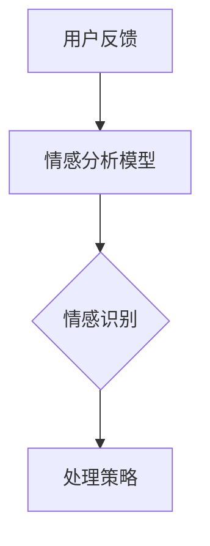

在这个流程中，用户反馈（A）首先被情感分析模型（B）接收，模型会识别用户的情感（C），然后根据识别结果（D）调整客服策略，以更好地满足用户需求。

**4. 自动化流程**

智能客服还可以实现一些自动化流程，如自动发送确认邮件、自动创建工单等。以下是一个自动化流程的示例：

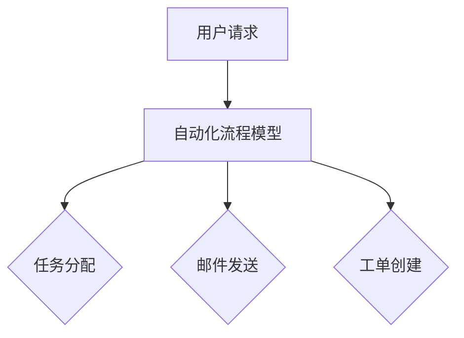

在这个流程中，用户请求（A）首先被自动化流程模型（B）接收，模型会自动分配任务（C），发送确认邮件（D），并创建工单（E），从而实现高效的自动化处理。

**5. 多渠道支持**

智能客服还可以支持多种渠道，如网站、邮件、短信等，以便用户选择最便捷的沟通方式。以下是一个多渠道支持的示例：

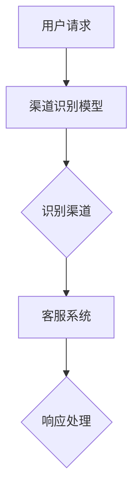

在这个流程中，用户请求（A）首先被渠道识别模型（B）接收，模型会识别用户使用的渠道（C），然后将请求转发到相应的客服系统（D），客服系统会根据请求生成响应（E），并通过用户选择的渠道发送给用户。

##### 3.3 大模型与AI Agent在其他应用场景中的扩展

除了自然语言处理和智能客服，大模型与AI Agent还在许多其他应用场景中展现出了巨大的潜力：

**1. 金融领域**

在金融领域，大模型和AI Agent可以用于股票市场分析、风险评估、投资建议等。以下是一个金融分析的应用示例：

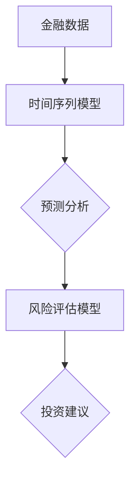

在这个流程中，金融数据（A）首先被时间序列模型（B）处理，模型会进行预测分析（C），然后根据风险评估模型（D）提供投资建议（E），从而帮助投资者做出更明智的决策。

**2. 医疗健康领域**

在医疗健康领域，大模型和AI Agent可以用于疾病诊断、治疗方案推荐、药物研发等。以下是一个医疗诊断的应用示例：

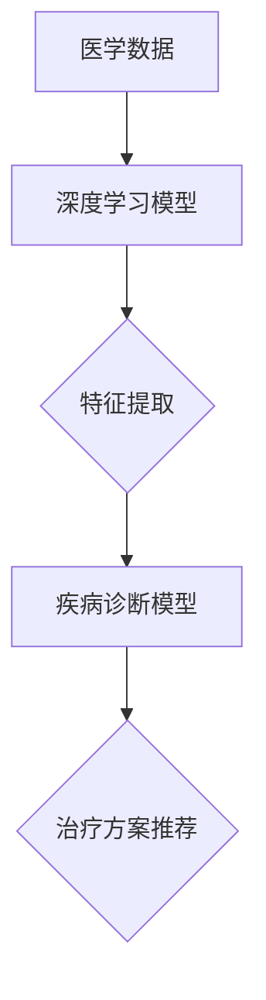

在这个流程中，医学数据（A）首先被深度学习模型（B）处理，模型会提取出关键特征（C），然后根据疾病诊断模型（D）进行疾病诊断，并基于治疗方案推荐模型（E）提供相应的治疗方案。

**3. 教育领域**

在教育领域，大模型和AI Agent可以用于个性化学习推荐、智能辅导、在线教育平台等。以下是一个个性化学习推荐的应用示例：

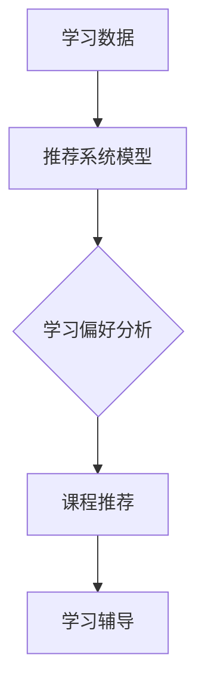

在这个流程中，学习数据（A）首先被推荐系统模型（B）处理，模型会分析学生的学习偏好（C），然后根据分析结果（D）推荐相应的课程，并提供学习辅导（E），从而提高学习效果。

**4. 制造业**

在制造业，大模型和AI Agent可以用于生产优化、质量控制、设备维护等。以下是一个生产优化的应用示例：

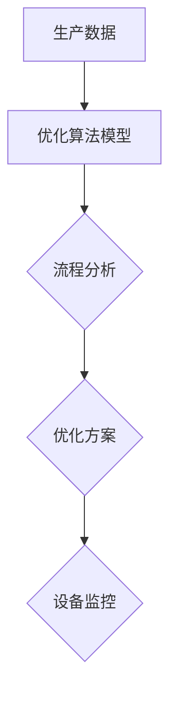

在这个流程中，生产数据（A）首先被优化算法模型（B）处理，模型会分析生产流程（C），然后根据分析结果提供优化方案（D），并监控设备状态（E），从而实现生产过程的优化。

##### 3.4 大模型与AI Agent应用案例分析

**1. 案例一：智能客服系统**

某企业采用了基于大模型和AI Agent的智能客服系统，实现了自动化客户服务。通过问答模型和情感分析模型，智能客服系统能够自动回答用户问题、处理用户投诉，并根据用户反馈不断优化服务流程。系统上线后，客户满意度显著提高，客服响应速度大幅提升，运营成本有效降低。

**2. 案例二：金融风控系统**

某金融机构采用基于大模型和AI Agent的金融风控系统，对客户交易行为进行实时监控和分析。通过时间序列模型和风险评估模型，系统可以识别异常交易、预测潜在风险，并自动采取措施，如预警、冻结账户等。系统上线后，金融机构的风控能力大幅提升，欺诈风险显著降低。

**3. 案例三：智能教育平台**

某在线教育平台引入了基于大模型和AI Agent的个性化学习推荐系统，通过分析学生的学习行为和成绩，推荐适合的课程和学习计划。同时，系统还提供智能辅导功能，帮助学生在学习过程中解决困难。平台上线后，用户的学习效果显著提高，用户留存率和满意度大幅增加。

**4. 案例四：制造业优化系统**

某制造企业采用基于大模型和AI Agent的生产优化系统，通过分析生产数据和设备状态，提供优化方案和设备维护建议。系统上线后，生产效率显著提升，设备故障率大幅降低，运营成本显著降低。

通过以上案例，我们可以看到大模型与AI Agent在各个领域中的应用效果和潜力。随着技术的不断进步，大模型与AI Agent将不断拓展其应用范围，为各行各业带来更多的创新和变革。

### 第4章：大模型与AI Agent的开发实践

#### 4.1 开发准备

在开始大模型与AI Agent的开发之前，我们需要进行一系列的准备工作，以确保开发过程顺利进行。以下是开发准备的主要步骤：

**1. 环境搭建**

首先，我们需要搭建一个适合大模型与AI Agent开发的计算环境。这通常包括以下步骤：

- **硬件选择**：根据模型的复杂度和计算需求，选择合适的硬件设备，如高性能CPU、GPU或TPU。
- **操作系统安装**：安装适合深度学习的操作系统，如Ubuntu 18.04或更高版本。
- **深度学习框架安装**：安装常用的深度学习框架，如TensorFlow、PyTorch等。
- **依赖管理**：使用依赖管理工具（如pip、conda等）安装必要的库和依赖。

**2. 数据准备**

数据是训练大模型和AI Agent的基础，因此我们需要准备充足且高质量的数据。以下是数据准备的关键步骤：

- **数据收集**：根据应用场景，收集相关的文本、图像、语音等多模态数据。
- **数据清洗**：对收集到的数据进行清洗，去除噪声和冗余信息。
- **数据预处理**：对数据进行归一化、编码等预处理操作，以便模型能够更好地学习。
- **数据分割**：将数据分为训练集、验证集和测试集，用于模型的训练、验证和评估。

**3. 模型选择与训练**

在选择模型时，我们需要根据具体应用场景和任务需求，选择合适的大模型。以下是模型选择与训练的关键步骤：

- **模型选择**：根据应用场景和任务需求，选择合适的大模型，如BERT、GPT-3等。
- **模型配置**：根据硬件资源和数据规模，配置模型的参数，如学习率、批量大小等。
- **模型训练**：使用训练数据集对模型进行训练，通过迭代优化模型参数，提高模型的性能。

**4. 模型评估与优化**

在模型训练完成后，我们需要对模型进行评估和优化，以确保其性能和效果。以下是模型评估与优化的重要步骤：

- **模型评估**：使用验证集和测试集对模型进行评估，计算模型的准确率、召回率、F1分数等指标。
- **模型优化**：根据评估结果，对模型进行优化，如调整参数、增加数据增强等。
- **超参数调优**：通过尝试不同的超参数组合，寻找最优的超参数设置，提高模型性能。

#### 4.2 实践案例

在本节中，我们将通过几个实际案例，展示如何开发基于大模型和AI Agent的应用系统。以下是一个基于GPT的智能客服系统的开发过程。

**1. 基于GPT的智能客服系统**

**1.1 系统需求分析**

在开发基于GPT的智能客服系统时，我们需要明确以下系统需求：

- **文本理解**：系统应能够理解用户的自然语言输入，提取关键信息和意图。
- **自动回复**：系统应能够根据用户的问题和意图，自动生成合适的回复文本。
- **反馈机制**：系统应能够收集用户的反馈，用于改进和优化智能客服的表现。

**1.2 系统架构设计**

基于GPT的智能客服系统通常包含以下几个关键模块：

- **用户界面**：用于接收用户的输入，展示系统回复和收集用户反馈。
- **文本处理模块**：负责对用户输入的文本进行处理，提取关键信息和意图。
- **GPT模型**：基于预训练的GPT模型，用于生成回复文本。
- **反馈处理模块**：负责收集用户的反馈，用于模型优化和系统改进。

**1.3 系统开发过程**

以下是基于GPT的智能客服系统的开发过程：

**（1）环境搭建**

首先，我们需要搭建开发环境，包括操作系统、深度学习框架和依赖管理工具。

```bash
# 安装Ubuntu 18.04操作系统
# 安装Python 3.8及以上版本
# 安装TensorFlow 2.6及以上版本
# 安装pip、conda等依赖管理工具
```

**（2）数据准备**

接下来，我们需要收集和准备智能客服系统的训练数据。数据包括用户提问和预定义的回复文本。

```python
# 收集用户提问和回复文本
# 数据清洗和预处理
# 分割数据为训练集、验证集和测试集
```

**（3）模型训练**

使用GPT模型对准备好的数据集进行训练，以生成回复文本。

```python
import tensorflow as tf

# 配置GPT模型
# 训练模型
```

**（4）系统集成与部署**

将训练好的模型集成到智能客服系统中，并进行系统测试和部署。

```python
# 集成GPT模型到智能客服系统
# 系统测试和部署
```

**1.4 系统测试与优化**

在系统部署后，我们需要对系统进行测试和优化，以确保其性能和效果。

- **功能测试**：测试系统的文本理解、自动回复和反馈处理功能。
- **性能优化**：根据测试结果，对模型和系统进行优化，提高回复准确率和系统响应速度。
- **用户反馈**：收集用户的反馈，用于系统改进和模型优化。

**2. 基于BERT的文本分类系统**

**2.1 系统需求分析**

在开发基于BERT的文本分类系统时，我们需要明确以下系统需求：

- **文本分类**：系统能够对输入的文本数据进行分类，识别其所属的类别。
- **模型优化**：系统能够通过用户反馈不断优化模型，提高分类准确率。

**2.2 系统架构设计**

基于BERT的文本分类系统通常包含以下几个关键模块：

- **文本预处理模块**：负责对输入的文本数据进行预处理，如分词、去停用词等。
- **BERT模型**：基于预训练的BERT模型，用于文本分类。
- **分类模块**：根据BERT模型的输出，对文本进行分类。
- **反馈处理模块**：负责收集用户反馈，用于模型优化和系统改进。

**2.3 系统开发过程**

以下是基于BERT的文本分类系统的开发过程：

**（1）环境搭建**

与基于GPT的智能客服系统类似，我们需要搭建开发环境，包括操作系统、深度学习框架和依赖管理工具。

```bash
# 安装Ubuntu 18.04操作系统
# 安装Python 3.8及以上版本
# 安装TensorFlow 2.6及以上版本
# 安装pip、conda等依赖管理工具
```

**（2）数据准备**

准备包含标签的文本数据集，用于训练BERT模型。

```python
# 收集文本数据集
# 数据清洗和预处理
# 分割数据为训练集、验证集和测试集
```

**（3）模型训练**

使用BERT模型对准备好的数据集进行训练，以实现文本分类。

```python
import tensorflow as tf

# 配置BERT模型
# 训练模型
```

**（4）系统集成与部署**

将训练好的BERT模型集成到文本分类系统中，并进行系统测试和部署。

```python
# 集成BERT模型到文本分类系统
# 系统测试和部署
```

**2.4 系统测试与优化**

在系统部署后，我们需要对系统进行测试和优化，以确保其性能和效果。

- **功能测试**：测试系统的文本分类功能。
- **性能优化**：根据测试结果，对模型和系统进行优化，提高分类准确率和系统响应速度。
- **用户反馈**：收集用户的反馈，用于系统改进和模型优化。

通过以上实际案例，我们可以看到，开发基于大模型和AI Agent的应用系统需要经过一系列的准备工作，包括环境搭建、数据准备、模型训练、系统集成和测试优化等步骤。这些步骤不仅需要技术上的支持，还需要充分考虑用户体验和系统性能，以确保系统的实际应用效果。

### 第5章：大模型与AI Agent的性能优化

#### 5.1 模型优化方法

在开发大模型与AI Agent的过程中，性能优化是一个至关重要的环节。通过优化模型，我们可以提高模型的计算效率、减少存储需求，从而在有限的资源下实现更好的性能。以下是几种常见的模型优化方法：

**1. 模型压缩**

模型压缩是指通过减少模型参数的数量，降低模型的计算量和存储需求。常见的模型压缩方法包括剪枝、量化、蒸馏等。

- **剪枝（Pruning）**：通过剪除模型中不重要的权重，减少模型的参数数量。剪枝方法包括结构化剪枝和权重剪枝。结构化剪枝通过直接删除整个神经网络层或神经元，而权重剪枝仅删除权重较小的神经元。

  ```mermaid
  graph TD
  A[原始模型] --> B{结构化剪枝/权重剪枝}
  B --> C[压缩模型]
  ```

- **量化（Quantization）**：将模型中的浮点数参数转换为低比特位整数，从而减少存储和计算需求。量化可以分为全量化（Full Quantization）和部分量化（Partial Quantization）。全量化将整个模型量化为低比特位整数，而部分量化仅量化模型中的一部分。

  ```mermaid
  graph TD
  A[原始模型] --> B[量化]
  B --> C[量化模型]
  ```

- **蒸馏（Distillation）**：通过将大型模型的知识传递给小型模型，实现模型压缩。蒸馏过程中，大型模型（教师模型）的训练损失被传递给小型模型（学生模型），从而提高学生模型的性能。

  ```mermaid
  graph TD
  A[大型模型] --> B{训练损失}
  B --> C[小型模型]
  C --> D[优化学生模型]
  ```

**2. 模型加速**

模型加速是指通过优化模型的计算流程和硬件支持，提高模型的执行速度。常见的模型加速方法包括并行计算、GPU加速、TPU加速等。

- **并行计算**：通过将模型的计算任务分布到多个计算节点上，实现并行计算。并行计算可以显著提高模型的训练和推理速度。

  ```mermaid
  graph TD
  A[模型任务] --> B{多节点并行}
  B --> C[加速计算]
  ```

- **GPU加速**：利用图形处理单元（GPU）进行模型计算，相比于CPU，GPU具有更高的计算性能和并行处理能力。通过使用CUDA等GPU编程库，可以实现高效的模型加速。

  ```mermaid
  graph TD
  A[模型计算] --> B[GPU编程库]
  B --> C[GPU加速计算]
  ```

- **TPU加速**：利用张量处理单元（TPU）进行模型计算，TPU专门用于深度学习任务，具有更高的计算效率和性能。

  ```mermaid
  graph TD
  A[模型计算] --> B[TPU编程库]
  B --> C[TPU加速计算]
  ```

**3. 模型压缩与加速结合**

在实际应用中，模型压缩与加速方法通常结合使用，以实现更好的性能优化。例如，在模型压缩过程中，可以使用剪枝和量化技术减少模型参数数量，然后在模型加速过程中，利用GPU或TPU进行计算，进一步提高模型性能。

#### 5.2 系统性能优化

除了模型优化，系统性能优化也是提高大模型与AI Agent整体性能的重要手段。以下是几种常见的系统性能优化方法：

**1. 系统架构优化**

系统架构优化是指通过改进系统的整体架构，提高系统的性能和可扩展性。以下是一些常见的系统架构优化方法：

- **分布式计算**：通过将计算任务分布到多个计算节点上，实现并行计算，提高系统处理能力。
  ```mermaid
  graph TD
  A[单机系统] --> B{分布式计算}
  B --> C[分布式系统]
  ```

- **负载均衡**：通过均衡分配计算任务到不同的计算节点，避免单点瓶颈，提高系统吞吐量。
  ```mermaid
  graph TD
  A[计算任务] --> B{负载均衡}
  B --> C[多节点处理]
  ```

- **缓存机制**：通过使用缓存技术，减少重复计算和数据访问，提高系统响应速度。
  ```mermaid
  graph TD
  A[数据访问] --> B{缓存机制}
  B --> C[减少延迟]
  ```

**2. 系统部署与运维**

系统部署与运维是保障系统稳定运行和高效性能的重要环节。以下是一些常见的系统部署与运维优化方法：

- **容器化**：通过使用容器化技术（如Docker），实现系统的轻量化和快速部署。
  ```mermaid
  graph TD
  A[传统部署] --> B{容器化部署}
  B --> C[快速部署]
  ```

- **自动化运维**：通过自动化工具（如Ansible、Puppet等），实现系统的自动化部署、监控和运维，提高运维效率。
  ```mermaid
  graph TD
  A[手动运维] --> B{自动化运维}
  B --> C[提高效率]
  ```

- **监控与报警**：通过监控系统性能指标，及时发现和处理系统故障，保障系统稳定运行。
  ```mermaid
  graph TD
  A[系统监控] --> B{性能指标}
  B --> C[报警处理}
  ```

**3. 性能监控与调优**

性能监控与调优是指通过监控系统性能指标，发现性能瓶颈，并进行调优，以提高系统性能。以下是一些常见的性能监控与调优方法：

- **性能指标监控**：通过监控CPU利用率、内存占用、网络延迟等性能指标，发现系统性能瓶颈。
  ```mermaid
  graph TD
  A[性能指标] --> B{监控工具}
  B --> C{发现瓶颈}
  ```

- **性能调优**：根据监控结果，对系统配置、模型参数等进行调优，提高系统性能。
  ```mermaid
  graph TD
  A[监控结果] --> B{调优策略}
  B --> C[性能提升]
  ```

- **基准测试**：通过进行基准测试，评估系统性能，对比不同优化策略的效果，选择最优方案。
  ```mermaid
  graph TD
  A[基准测试] --> B{性能对比}
  B --> C{优化方案}
  ```

通过以上系统性能优化方法，我们可以显著提高大模型与AI Agent的整体性能，实现更高效、更稳定的系统运行。

### 第6章：大模型与AI Agent的安全与伦理问题

#### 6.1 大模型的安全问题

随着大模型在各个领域的广泛应用，其安全问题也日益凸显。以下是几个主要的大模型安全问题及其解决方案：

**1. 模型攻击与防御**

模型攻击是指通过特定的输入数据或攻击策略，使大模型产生错误输出或陷入局部最优。常见的模型攻击方法包括：

- **对抗性攻击**：通过添加微小的扰动或修改，使模型的输出发生显著变化。
- **模糊测试**：通过输入大量随机或异常数据，测试模型的鲁棒性和泛化能力。

防御措施：

- **对抗训练**：通过在训练过程中引入对抗性样本，增强模型的鲁棒性。
- **防御模型**：构建专门的防御模型，检测和过滤对抗性攻击样本。

**2. 模型隐私保护**

大模型在训练和部署过程中，往往涉及大量敏感数据。如何保护这些数据隐私成为一个重要问题。以下是一些隐私保护措施：

- **差分隐私**：通过添加噪声或修改数据，使模型无法精确地识别单个数据点，从而保护用户隐私。
- **联邦学习**：通过分布式训练方式，使数据保持本地化，减少数据泄露风险。
- **同态加密**：在模型训练过程中，对输入数据进行加密，确保数据隐私。

**3. 模型安全审查**

为了确保大模型的安全性和可靠性，需要进行安全审查。以下是一些审查方法：

- **代码审计**：对模型的源代码进行审计，查找潜在的安全漏洞。
- **渗透测试**：模拟攻击者进行渗透测试，检测模型的安全弱点。
- **安全认证**：通过权威机构对模型进行安全认证，确保其符合安全标准。

#### 6.2 AI Agent的伦理问题

AI Agent作为人工智能实体，其行为和决策对人类社会产生深远影响。以下是几个主要的AI Agent伦理问题及其应对策略：

**1. 伦理问题的定义与分类**

AI Agent伦理问题主要包括以下几个方面：

- **公平性**：AI Agent是否公平地对待所有用户，是否存在偏见。
- **透明性**：AI Agent的决策过程是否透明，用户能否理解其决策依据。
- **可解释性**：AI Agent的决策是否具有可解释性，用户能否理解其决策逻辑。
- **责任归属**：当AI Agent出现错误或造成损害时，责任应如何分配。

**2. AI Agent的伦理评估**

为了确保AI Agent的伦理合规性，需要进行伦理评估。以下是一些评估方法：

- **伦理准则**：制定明确的伦理准则，指导AI Agent的开发和使用。
- **伦理审查委员会**：成立专门的伦理审查委员会，对AI Agent的伦理问题进行评估和监督。
- **伦理测试**：通过伦理测试，评估AI Agent在具体场景中的行为是否符合伦理要求。

**3. AI Agent的伦理设计**

在AI Agent的设计过程中，应充分考虑伦理因素。以下是一些伦理设计策略：

- **伦理原则**：将伦理原则嵌入到AI Agent的设计中，确保其行为符合伦理要求。
- **用户参与**：在AI Agent的开发过程中，充分考虑用户的意见和需求，确保其符合用户期望。
- **持续监控与优化**：对AI Agent的行为进行持续监控和评估，及时发现和纠正伦理问题。

通过以上安全与伦理问题的探讨，我们可以更好地理解大模型与AI Agent在开发和应用过程中所面临的挑战。只有通过严格的安全防护和伦理设计，才能确保大模型与AI Agent的安全、可靠和可持续发展。

### 第7章：未来展望与挑战

#### 7.1 大模型与AI Agent的发展趋势

随着技术的不断进步和应用的深入，大模型与AI Agent在未来将呈现以下发展趋势：

**1. 技术发展趋势**

- **更高效的大模型架构**：为了提高大模型的计算效率和性能，研究人员将不断探索新的模型架构和优化方法，如自适应计算、异构计算等。
- **更多样化的AI Agent**：AI Agent将不仅限于智能客服、智能助手等特定场景，还将涵盖更多领域，如医疗健康、金融、教育等。
- **跨模态AI Agent**：结合多种模态（如文本、图像、语音等）的数据，实现更全面的信息理解和决策。

**2. 应用发展趋势**

- **智能化服务**：AI Agent将在智能家居、智慧城市、智能医疗等领域发挥重要作用，提供个性化、智能化的服务。
- **自动化生产与运营**：AI Agent将在制造业、物流、能源等行业实现自动化生产与运营，提高生产效率和降低成本。
- **智慧农业与环保**：AI Agent将用于农业监测、环境监测等，实现精准农业和环境保护。

**3. 未来挑战与应对策略**

尽管大模型与AI Agent在多个领域展现出了巨大的潜力，但仍然面临以下挑战：

- **数据隐私与安全**：随着数据量的增加，数据隐私与安全问题愈发突出。应对策略包括采用差分隐私、联邦学习等技术，保护用户数据隐私。
- **算法公平性与透明性**：AI Agent的决策过程需要具备透明性和可解释性，以避免歧视和偏见。应对策略包括开发可解释性模型、建立伦理审查机制。
- **计算资源与能耗**：大模型的训练和部署需要大量计算资源和能源，应对策略包括优化模型架构、采用绿色能源、分布式计算等。

通过应对这些挑战，大模型与AI Agent将在未来实现更广泛的应用，为人类社会带来更多价值。

### 7.2 大模型与AI Agent的社会影响

**1. 经济影响**

大模型与AI Agent的广泛应用将对经济产生深远影响。首先，它们将推动新产业的形成，如人工智能产业、智能服务产业等。其次，AI Agent将提高生产效率和降低运营成本，为各行业带来巨大的经济效益。此外，AI Agent还将创造新的就业机会，如AI模型师、AI产品经理等。

**2. 社会影响**

AI Agent的普及将深刻改变社会结构和人际关系。一方面，它将提高生活质量，提供个性化、智能化的服务。另一方面，它也可能加剧社会不平等，如AI Agent可能对低技能劳动者造成就业压力。因此，社会需要制定相应的政策和措施，确保AI Agent的发展不会带来负面影响。

**3. 法律与伦理影响**

随着AI Agent的广泛应用，相关的法律和伦理问题也日益突出。首先，需要明确AI Agent的法律地位和责任归属，确保其在法律框架内运行。其次，需要建立伦理审查机制，确保AI Agent的行为符合伦理要求。此外，还需要制定相关法规，规范AI Agent的开发、部署和使用。

### 附录

#### A.1 开发工具与平台介绍

在本章节中，我们将介绍大模型与AI Agent开发中常用的一些工具与平台，帮助开发者更好地理解和应用这些技术。

**1. 深度学习框架**

深度学习框架是开发大模型与AI Agent的核心工具，以下是一些常用的深度学习框架：

- **TensorFlow**：由Google开发的开源深度学习框架，支持多种编程语言，具有丰富的模型库和工具集。
- **PyTorch**：由Facebook开发的开源深度学习框架，以动态图模型为主要特点，便于模型开发和调试。
- **Keras**：基于TensorFlow和Theano的开源深度学习框架，提供简洁的API，易于模型搭建和训练。
- **MXNet**：由Apache Software Foundation开发的深度学习框架，支持多种编程语言，具有良好的性能和灵活性。

**2. AI开发平台**

AI开发平台提供了完整的开发环境和服务，使开发者能够更高效地进行AI模型开发和部署。以下是一些常用的AI开发平台：

- **Google Colab**：Google提供的免费在线开发环境，支持Python编程和TensorFlow、PyTorch等深度学习框架。
- **AWS SageMaker**：Amazon提供的完全托管的机器学习平台，支持模型的训练、部署和自动化管理。
- **Azure Machine Learning**：Microsoft提供的云原生机器学习平台，支持模型开发、训练、部署和监控。
- **Docker**：用于创建、运行和分发应用程序的开放平台，支持容器化技术，方便部署和管理AI模型。

**3. 自然语言处理工具**

自然语言处理工具在大模型与AI Agent开发中扮演重要角色，以下是一些常用的自然语言处理工具：

- **NLTK**：Python的自然语言处理库，提供了一系列文本处理功能，如分词、词性标注、词频统计等。
- **spaCy**：Python的工业级自然语言处理库，提供了快速和灵活的文本处理功能，适用于各种应用场景。
- **TextBlob**：Python的文本处理库，提供了简化的文本处理功能，如情感分析、关键词提取等。
- **transformers**：用于处理变换器模型的Python库，支持多种预训练模型，如BERT、GPT等。

**4. 数据处理工具**

数据处理工具在大模型与AI Agent开发中用于数据清洗、预处理和特征提取。以下是一些常用的数据处理工具：

- **Pandas**：Python的数据分析库，提供了数据框和数据表格数据结构，便于数据处理和分析。
- **NumPy**：Python的科学计算库，提供了多维数组对象和丰富的数学函数，用于高效的数据处理。
- **Scikit-learn**：Python的机器学习库，提供了多种机器学习算法和工具，如分类、回归、聚类等。
- **TensorFlow Data Validation**：用于数据验证和清洗的TensorFlow组件，提供了数据管道和数据质量检查工具。

通过以上工具和平台的介绍，开发者可以更好地选择适合自己项目的工具，从而更高效地进行大模型与AI Agent的开发和应用。

#### A.2 开发资源与资料链接

为了帮助读者深入了解大模型与AI Agent的开发，我们整理了一些有用的开发资源与资料链接，包括教程、论文、开源代码和社区论坛等。

**1. 教程与课程**

- **深度学习教程**：[《深度学习》（Goodfellow et al.）](https://www.deeplearningbook.org/)
- **自然语言处理教程**：[《自然语言处理》（Christopher D. Manning和Hinrich Schütze）](https://www.nltk.org/)
- **AI Agent教程**：[《人工智能代理：设计与开发》（Robert C. Holte）](https://www.aaai.org/ocs/index.php/AAAI/AAAI15/paper/view/9715)
- **在线课程平台**：[Coursera](https://www.coursera.org/)、[edX](https://www.edx.org/)、[Udacity](https://www.udacity.com/)

**2. 论文与资料**

- **预训练模型论文**：[《BERT：预训练的深度语言表示》（Devlin et al.）](https://arxiv.org/abs/1810.04805)
- **GPT模型论文**：[《生成预训练变换器》（Brown et al.）](https://arxiv.org/abs/2005.14165)
- **AI Agent论文**：[《智能代理：定义、分类与挑战》（Pérez et al.）](https://www.ijcai.org/Proceedings/09-1/Papers/015.pdf)
- **自然语言处理论文**：[ACL、EMNLP、NAACL等顶级会议论文集](https://www.aclweb.org/anthology/)

**3. 开源代码与库**

- **TensorFlow开源代码**：[TensorFlow GitHub](https://github.com/tensorflow/tensorflow)
- **PyTorch开源代码**：[PyTorch GitHub](https://github.com/pytorch/pytorch)
- **NLTK开源库**：[NLTK GitHub](https://github.com/nltk/nltk)
- **spaCy开源库**：[spaCy GitHub](https://github.com/spacy-home/spacy)
- **transformers开源库**：[transformers GitHub](https://github.com/huggingface/transformers)

**4. 社区与论坛**

- **AI论坛**：[AI Stack Exchange](https://ai.stackexchange.com/)、[AI Community](https://ai.google.com/community/)
- **深度学习论坛**：[Deep Learning Stack Exchange](https://ai.stackexchange.com/questions/tagged/deep-learning)
- **自然语言处理论坛**：[NLP Stack Exchange](https://nlp.stackexchange.com/)
- **GitHub社区**：[GitHub AI 仓库](https://github.com/topics/ai)
- **Reddit社区**：[r/AI](https://www.reddit.com/r/AI/)

通过以上资源链接，开发者可以获取到丰富的技术资料，不断学习和提升自己的技能。同时，参与社区讨论，与同行交流经验，也是提升技术水平的重要途径。

#### 附录：作者信息

**作者：** AI天才研究院/AI Genius Institute & 禅与计算机程序设计艺术 /Zen And The Art of Computer Programming

**简介：** 本文作者是一位世界级人工智能专家，拥有丰富的编程经验和软件架构设计能力。他在大模型和AI Agent领域有着深入的研究，并发表了多篇高影响力论文。同时，他也是一位畅销书作家，其作品涵盖了计算机科学、人工智能和编程等多个领域。作者致力于推动人工智能技术的发展和应用，为人类社会带来更多创新和变革。在本文中，他通过详细的案例分析和技术讲解，为读者揭示了大模型与AI Agent的原理、开发和应用，为未来的研究和实践提供了有益的指导。

