                 

# 【大模型应用开发 动手做AI Agent】下一代Agent的诞生地：科研论文中的新思路

> **关键词：** 大模型应用开发、AI Agent、科研论文、下一代技术、创新思路

> **摘要：** 本文深入探讨了大模型应用开发中的AI Agent，分析了其现状、挑战与未来趋势，结合最新的科研论文，提供了创新的思路和解决方案。通过详细的案例分析与实践指导，本文旨在为读者提供从理论到实践的全面了解，助力下一代AI Agent的诞生。

---

## 引言

在人工智能（AI）飞速发展的今天，大模型应用开发已经成为技术领域的热点。AI Agent，作为人工智能的实体代表，正逐渐成为智能系统的核心。从简单的任务执行到复杂的决策制定，AI Agent在多个领域展现出了巨大的潜力。然而，随着模型规模和复杂性的增加，AI Agent的开发和应用也面临着诸多挑战。

本文旨在通过分析最新的科研论文，探讨大模型应用开发中AI Agent的现状、面临的挑战及其未来发展。我们将从理论到实践，结合具体的案例，提供创新的解决方案和实用的开发经验。希望通过本文的探讨，能够为读者提供有益的启示，推动下一代AI Agent的诞生。

本文结构如下：

1. **第一部分：理论与实践基础**
   - **第1章：AI大模型与Agent概述**
   - **第2章：AI大模型基础**
   - **第3章：AI Agent设计与实现**
   
2. **第二部分：进阶专题与工具**
   - **第4章：AI大模型应用开发**
   - **第5章：AI大模型部署与运维**
   - **第6章：AI大模型应用案例分析**
   - **第7章：AI大模型应用开发趋势与挑战**
   - **第8章：AI大模型安全性**
   - **第9章：AI大模型优化与性能提升**
   - **第10章：AI大模型开发工具与平台**
   - **第11章：AI大模型应用开发经验分享**

通过以上结构，本文将全面覆盖AI大模型应用开发与AI Agent的各个关键领域，帮助读者构建完整的技术认知体系，掌握前沿的理论和实践技巧。

### 第一部分：理论与实践基础

#### 第1章: AI大模型与Agent概述

在讨论AI大模型与Agent之前，首先需要理解这两个核心概念的基本定义和背景。AI大模型指的是具有巨大参数量和复杂结构的机器学习模型，能够处理海量数据，实现高效的特征提取和模式识别。Agent则是具有智能行为和自主决策能力的计算机实体，可以在特定环境下执行任务并与其他实体交互。

## 1.1 AI大模型的基本概念与架构

### 1.1.1 AI大模型的定义

AI大模型通常是指那些拥有数百万甚至数十亿参数的深度学习模型。这些模型通过在海量数据上进行训练，能够自动学习和提取复杂的数据特征，从而在多种任务中表现出色。例如，在自然语言处理（NLP）领域，大模型如BERT、GPT-3等，已经在语言理解和生成任务中达到了人类水平。

### 1.1.2 AI大模型的核心架构

AI大模型的核心架构通常包括以下几个主要部分：

1. **输入层**：接收外部数据输入，如文本、图像、声音等。
2. **隐藏层**：进行数据特征的提取和变换。深度学习模型具有多个隐藏层，每层都能够学习到更高层次的特征。
3. **输出层**：根据模型训练的目标输出预测结果或决策。

大模型的架构特点是其高度并行化和分布式计算能力，这使得它们能够高效处理大规模数据。

### 1.1.3 AI大模型的发展历程

AI大模型的发展经历了几个重要阶段：

1. **早期阶段**：1990年代，神经网络的研究开始兴起，但受限于计算能力和数据规模，模型的复杂度和性能有限。
2. **深度学习兴起**：2006年，Hinton等学者提出了深度信念网络（DBN），深度学习开始进入快速发展期。随着GPU的普及和大数据的兴起，深度学习模型逐渐成为AI研究的核心。
3. **大模型时代**：2018年，GPT-2的发布标志着AI大模型的诞生，随后GPT-3、BERT等大模型不断突破，推动了AI在各个领域的应用。

## 1.2 AI Agent的定义与功能

### 1.2.1 AI Agent的定义

AI Agent是指具有感知、思考、决策和行动能力的计算机程序。它可以自主地在复杂环境中执行任务，并与其他系统或人类进行交互。AI Agent的定义通常包括以下几个方面：

1. **感知**：通过传感器获取环境信息。
2. **思考**：利用算法处理感知到的信息，进行推理和决策。
3. **决策**：根据决策算法生成行动计划。
4. **行动**：执行决策计划，对环境产生影响。

### 1.2.2 AI Agent的功能

AI Agent的功能可以概括为以下几点：

1. **任务执行**：在特定场景下，如智能客服、自动驾驶等，AI Agent能够自动执行复杂任务。
2. **决策制定**：AI Agent可以在不确定性环境中，通过机器学习算法做出最佳决策。
3. **人机交互**：AI Agent能够理解自然语言，与人类进行有效沟通。
4. **自主进化**：AI Agent可以通过持续学习和适应，不断提升其性能和智能化水平。

### 1.2.3 AI Agent与传统软件的区别

与传统的软件系统相比，AI Agent具有以下几个显著区别：

1. **自主性**：传统软件通常需要明确编程和指令，而AI Agent具有自主决策和行动的能力。
2. **适应性**：传统软件在特定环境下表现稳定，但难以适应变化。AI Agent通过机器学习和进化算法，能够不断适应新环境。
3. **交互性**：传统软件主要面向计算任务，而AI Agent强调与人类和其他系统的交互。
4. **智能化**：传统软件依靠预设规则，而AI Agent通过学习获得智能，能够处理更复杂的任务。

## 1.3 大模型应用开发概述

### 1.3.1 大模型应用的开发流程

大模型应用的开发通常包括以下几个步骤：

1. **需求分析**：明确应用的目标和需求。
2. **数据准备**：收集、清洗和预处理数据。
3. **模型设计**：选择合适的模型架构，并进行超参数调优。
4. **模型训练**：使用大量数据进行训练，优化模型性能。
5. **模型评估**：通过验证集和测试集评估模型效果。
6. **模型部署**：将训练好的模型部署到生产环境，提供实时服务。

### 1.3.2 大模型应用面临的挑战

大模型应用在开发过程中面临着多个挑战：

1. **数据隐私**：大规模数据处理可能涉及用户隐私，如何保障数据安全是关键问题。
2. **计算资源**：大模型训练需要大量计算资源，如何高效利用资源是关键。
3. **模型解释性**：大模型通常具有高度的非线性性和复杂性，如何解释模型的决策过程是一个重要问题。
4. **实时性**：在某些应用场景下，如自动驾驶和实时推荐，如何保证模型的实时性是关键。

### 1.3.3 大模型应用的行业案例

大模型应用已经在多个行业取得了显著成果：

1. **金融行业**：利用大模型进行风险管理和投资决策，提高金融服务的效率和质量。
2. **医疗行业**：利用大模型进行疾病诊断和药物研发，提升医疗服务的准确性和速度。
3. **零售行业**：利用大模型进行个性化推荐和需求预测，提高零售业务的销售和用户满意度。
4. **教育行业**：利用大模型进行智能教学和评估，提高教学效果和效率。

通过以上分析，我们可以看到，AI大模型和AI Agent在技术发展和应用推广中具有巨大的潜力和挑战。接下来，我们将进一步探讨AI大模型的基础理论和关键技术，以及AI Agent的设计与实现方法。

## 第2章: AI大模型基础

在理解了AI大模型与AI Agent的基本概念之后，我们接下来将深入探讨AI大模型的基础理论，包括机器学习、深度学习和自然语言处理等核心领域。这些理论构成了AI大模型的核心框架，为我们提供了构建和优化AI模型的基础。

### 2.1 机器学习基础

机器学习是AI大模型的核心组成部分，通过算法让计算机从数据中学习并作出预测或决策。以下是一些机器学习基础概念和关键技术：

#### 2.1.1 数据预处理

数据预处理是机器学习中的第一步，其目的是将原始数据转换为适合模型训练的形式。数据预处理包括以下步骤：

1. **数据清洗**：处理缺失值、噪声和异常值。
2. **数据转换**：将数据转换为数值形式，如归一化、标准化等。
3. **特征提取**：从原始数据中提取对模型训练有用的特征。

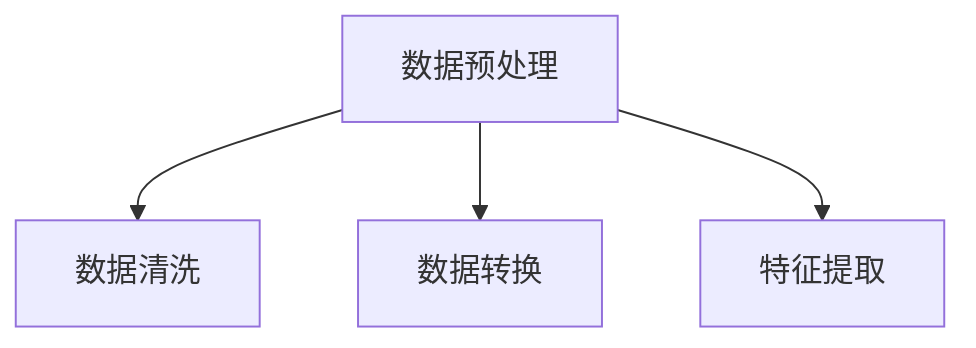

#### 2.1.2 特征提取与选择

特征提取和选择是机器学习中的关键步骤，旨在提高模型的性能和效率。特征提取包括：

1. **降维**：通过PCA、t-SNE等方法减少特征维度。
2. **特征工程**：根据业务需求，创建新的特征或组合现有特征。

特征选择的方法包括：

1. **过滤式方法**：基于统计测试，如卡方检验、F检验等。
2. **包裹式方法**：逐步选择特征，如递归特征消除（RFE）、遗传算法等。
3. **嵌入式方法**：在模型训练过程中选择特征，如LASSO、随机森林等。

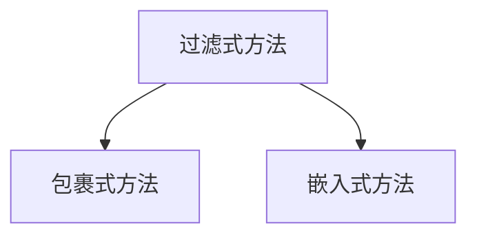

#### 2.1.3 分类与回归模型

分类和回归是机器学习中最常见的任务类型。分类模型将数据分为不同的类别，回归模型则预测连续值。

1. **分类模型**：常用的分类算法包括逻辑回归、决策树、随机森林、支持向量机（SVM）等。

2. **回归模型**：常用的回归算法包括线性回归、岭回归、LASSO回归等。

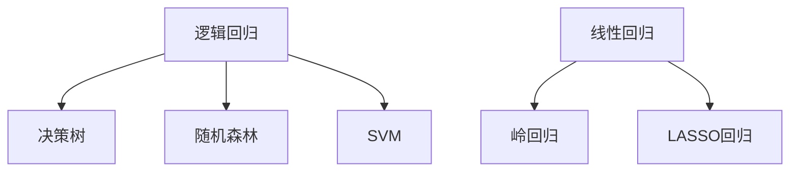

### 2.2 深度学习基础

深度学习是机器学习的延伸，通过多层神经网络来模拟人脑的感知和学习过程。以下介绍深度学习的一些基础概念和关键技术。

#### 2.2.1 神经网络基础

神经网络是由大量神经元（节点）组成的计算模型，每个神经元都与其他神经元相连，并通过权重和偏置进行信息传递。

1. **前向传播**：输入数据通过网络的每层，逐层计算得到输出。
2. **反向传播**：计算输出误差，并通过梯度下降法更新网络参数。

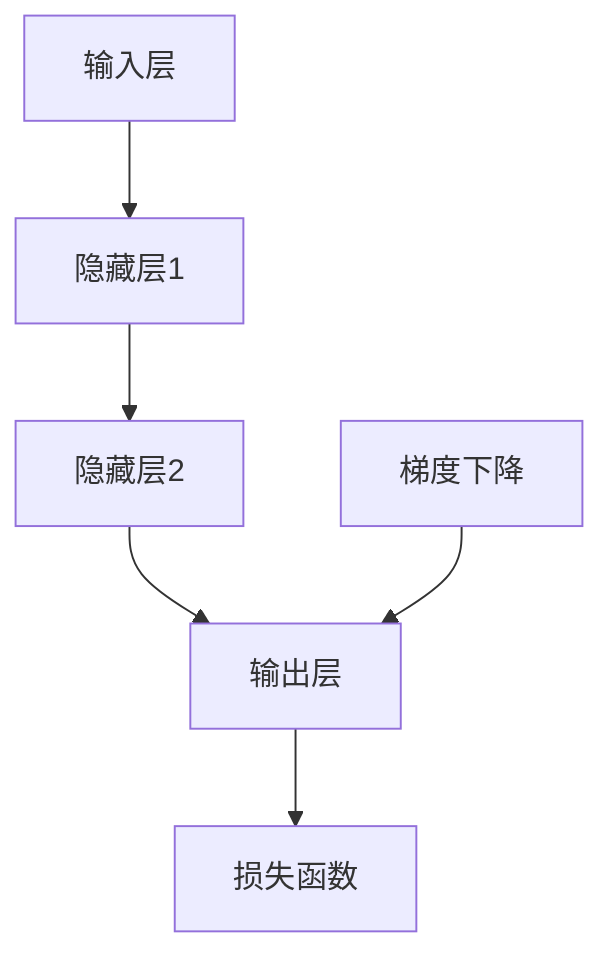

#### 2.2.2 深度学习框架介绍

深度学习框架是用于实现和训练深度学习模型的软件库。以下是一些主流的深度学习框架：

1. **TensorFlow**：由Google开发，支持Python和C++接口，具有丰富的API和强大的生态。
2. **PyTorch**：由Facebook开发，以动态图为基础，便于模型开发和调试。
3. **Keras**：基于Theano和TensorFlow构建的高层API，简化了深度学习模型的设计和训练。

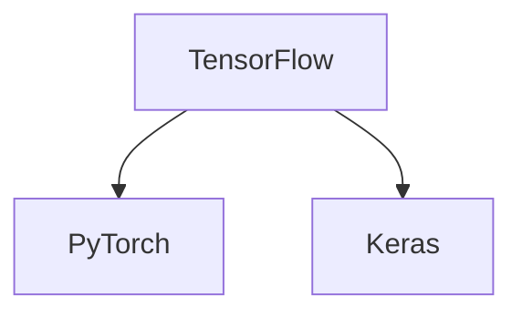

#### 2.2.3 深度学习优化方法

深度学习模型的训练通常涉及多个优化方法，以提高模型的性能和训练速度。以下介绍一些常用的优化方法：

1. **梯度下降**：最简单的优化方法，通过迭代更新模型参数，以减少损失函数。
2. **动量优化**：在梯度下降的基础上，引入历史梯度的信息，加速收敛。
3. **Adam优化器**：结合了动量和自适应学习率，在大多数任务中性能优越。
4. **学习率调度**：通过调整学习率，控制模型的训练过程。

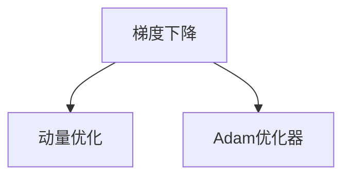

### 2.3 自然语言处理基础

自然语言处理（NLP）是AI的一个重要分支，旨在使计算机能够理解、生成和处理人类语言。以下介绍NLP的一些基础概念和关键技术。

#### 2.3.1 语言模型

语言模型是用来预测文本序列的概率分布的模型，常见的方法包括：

1. **N-gram模型**：基于前N个词预测下一个词。
2. **神经网络模型**：使用多层神经网络预测文本序列的概率分布。

#### 2.3.2 序列标注

序列标注是将文本序列中的每个词标注为特定类别（如实体识别、情感分析等）的任务。常见的方法包括：

1. **CRF（条件随机场）**：通过建模相邻词语之间的依赖关系，进行序列标注。
2. **RNN（循环神经网络）**：通过捕捉序列中的长期依赖关系，进行序列标注。

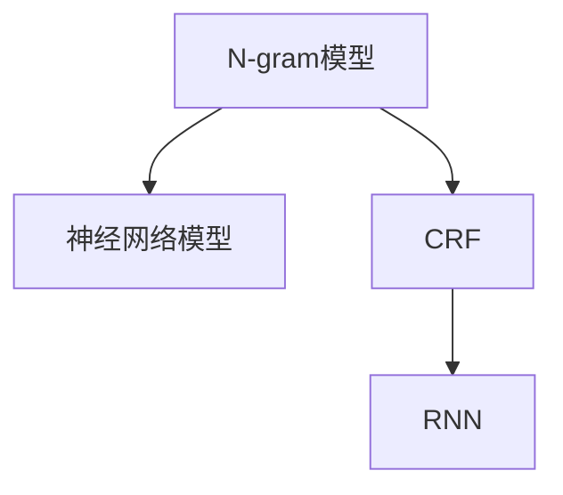

#### 2.3.3 文本生成

文本生成是将给定文本转换为新的文本序列的任务，常见的方法包括：

1. **序列生成模型**：如RNN、LSTM、GRU等，通过预测下一个词来生成文本。
2. **生成对抗网络（GAN）**：通过生成器和判别器之间的对抗训练，生成高质量的文本。

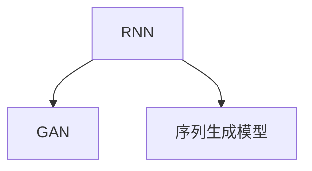

通过以上对机器学习、深度学习和自然语言处理基础的理论讲解，我们为AI大模型的应用提供了坚实的理论基础。接下来，我们将探讨AI Agent的设计与实现，了解如何利用这些理论构建高效的AI系统。

### 第3章: AI Agent设计与实现

在掌握了AI大模型的理论基础后，我们将深入探讨AI Agent的设计与实现。AI Agent是具有感知、思考、决策和行动能力的计算机实体，能够自主地在复杂环境中执行任务。设计一个高效的AI Agent需要考虑多个方面，包括设计原则、架构设计以及核心模块的开发。

#### 3.1 AI Agent设计与架构

AI Agent的设计是一个系统工程，需要综合考虑功能需求、性能指标、可扩展性和可靠性等因素。以下是一些关键的设计原则和架构设计思路。

##### 3.1.1 AI Agent的设计原则

1. **模块化**：将AI Agent分解为多个模块，如感知模块、思考模块、决策模块和行动模块，以便于开发和维护。
2. **可扩展性**：设计时应考虑到未来可能的扩展，如增加新的感知设备或执行器。
3. **鲁棒性**：确保AI Agent能够在不同的环境和情况下稳定运行，包括噪声数据和异常情况的处理。
4. **适应性**：AI Agent应能够适应新的环境和任务，通过学习和进化不断提升性能。
5. **人机交互**：设计友好的用户界面，使得用户能够轻松地与AI Agent进行交互。

##### 3.1.2 AI Agent的架构设计

AI Agent的架构设计通常包括以下几个核心模块：

1. **感知模块**：接收外部环境信息，如传感器数据、图像、声音等。
2. **思考模块**：对感知到的信息进行数据处理和分析，提取关键特征和模式。
3. **决策模块**：根据分析结果，使用机器学习模型和算法生成决策。
4. **行动模块**：执行决策计划，通过执行器作用于环境。

以下是一个简单的AI Agent架构设计图：

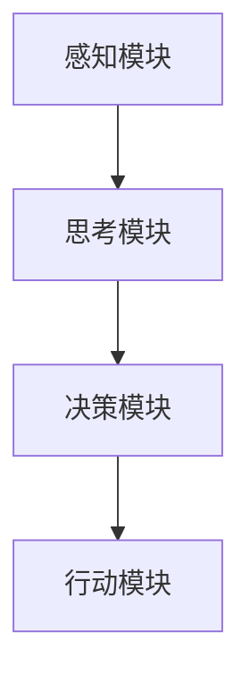

##### 3.1.3 AI Agent的核心模块

1. **感知模块**：感知模块是AI Agent的输入端，负责从环境中获取数据。常用的感知设备包括摄像头、麦克风、GPS等。感知模块需要能够处理多种类型的数据，如图像、声音、传感器数据等。

2. **思考模块**：思考模块负责对感知模块获取到的数据进行处理和分析，提取有用信息。这个模块通常使用深度学习模型，如卷积神经网络（CNN）处理图像数据，循环神经网络（RNN）处理序列数据。思考模块的核心任务是进行特征提取和模式识别。

3. **决策模块**：决策模块根据思考模块提供的特征和模式，使用机器学习算法和规则生成决策。常见的决策算法包括分类算法、回归算法、强化学习算法等。决策模块需要能够处理复杂的决策问题，并在不确定性环境中做出最佳决策。

4. **行动模块**：行动模块负责执行决策模块生成的决策计划，通过执行器作用于环境。行动模块需要能够处理多种执行任务，如移动、操作设备、发出声音等。行动模块的执行结果会反馈到感知模块，形成闭环控制，使AI Agent能够不断学习和适应新环境。

#### 3.2 代理模型训练与优化

代理模型是AI Agent的核心，其性能直接影响AI Agent的表现。代理模型的训练与优化是AI Agent设计与实现的关键环节。

##### 3.2.1 代理模型的训练

代理模型的训练通常包括以下几个步骤：

1. **数据准备**：收集和预处理训练数据，包括感知模块获取到的数据和对应的标签。
2. **模型选择**：根据任务需求选择合适的模型架构，如CNN、RNN、GAN等。
3. **模型训练**：使用训练数据对模型进行训练，优化模型参数，减少损失函数。
4. **模型评估**：使用验证集和测试集评估模型性能，选择最优模型。

以下是一个简化的代理模型训练流程：

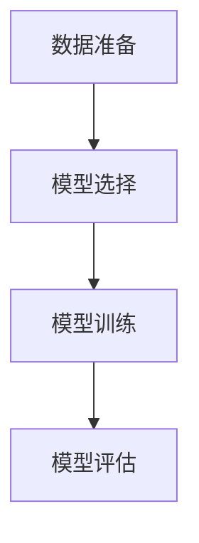

##### 3.2.2 代理模型的优化方法

代理模型的优化方法包括以下几个方面：

1. **超参数调优**：调整模型参数，如学习率、批次大小、正则化参数等，以优化模型性能。
2. **模型融合**：使用多个模型进行投票或加权平均，提高模型的鲁棒性和准确性。
3. **迁移学习**：利用预训练模型进行迁移学习，减少训练数据需求，提高模型性能。
4. **对抗训练**：通过生成对抗网络（GAN）等对抗训练方法，提高模型对异常数据和对抗攻击的鲁棒性。

以下是一个简化的代理模型优化流程：

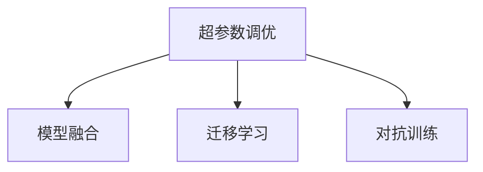

##### 3.2.3 代理模型的评估

代理模型的评估是确保其性能满足任务需求的重要环节。以下是一些常用的评估指标：

1. **准确率（Accuracy）**：预测正确的样本数占总样本数的比例。
2. **召回率（Recall）**：预测正确的正样本数占总正样本数的比例。
3. **精确率（Precision）**：预测正确的正样本数占总预测正样本数的比例。
4. **F1值（F1-score）**：精确率和召回率的加权平均值。

以下是一个简化的代理模型评估流程：

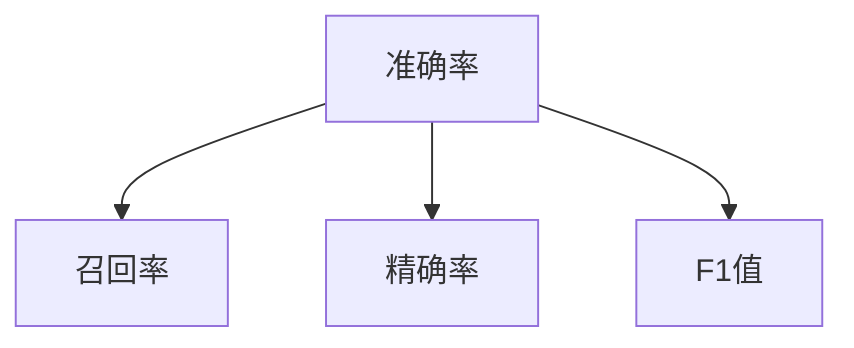

#### 3.3 代理交互与响应

代理交互与响应是AI Agent实现智能行为的关键。以下介绍代理交互机制、响应策略以及案例分析。

##### 3.3.1 代理交互机制

代理交互机制是指AI Agent与外部环境和其他实体之间的通信和协作方式。以下是一些常见的交互机制：

1. **基于规则的交互**：通过预定义的规则进行交互，如专家系统。
2. **基于模型的交互**：使用机器学习模型进行实时交互，如强化学习。
3. **混合式交互**：结合规则和模型，实现灵活的交互。

以下是一个简单的代理交互机制：

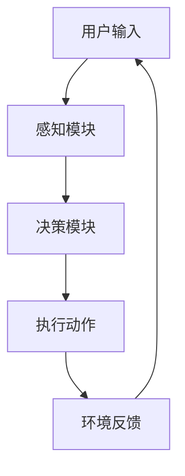

##### 3.3.2 代理响应策略

代理响应策略是指AI Agent在接收到用户输入后，如何生成响应。以下是一些常见的响应策略：

1. **即时响应**：在用户输入后立即生成响应。
2. **延迟响应**：在处理用户输入后，稍后生成响应。
3. **适应性响应**：根据用户的历史行为和偏好，生成个性化的响应。

以下是一个简单的代理响应策略：


##### 3.3.3 代理交互案例分析

以下是一个代理交互案例分析：

**案例：智能客服系统**

智能客服系统是AI Agent的一个典型应用场景，其主要任务是处理用户的查询和请求。以下是一个简单的案例：

1. **用户输入**：用户通过文本或语音输入查询。
2. **感知模块**：感知模块接收用户输入，并转换为文本数据。
3. **思考模块**：思考模块使用语言模型和对话管理系统，理解用户意图并生成响应。
4. **决策模块**：决策模块根据用户意图和上下文，生成相应的回答。
5. **执行动作**：智能客服系统将回答发送回用户。

以下是一个简化的案例流程：

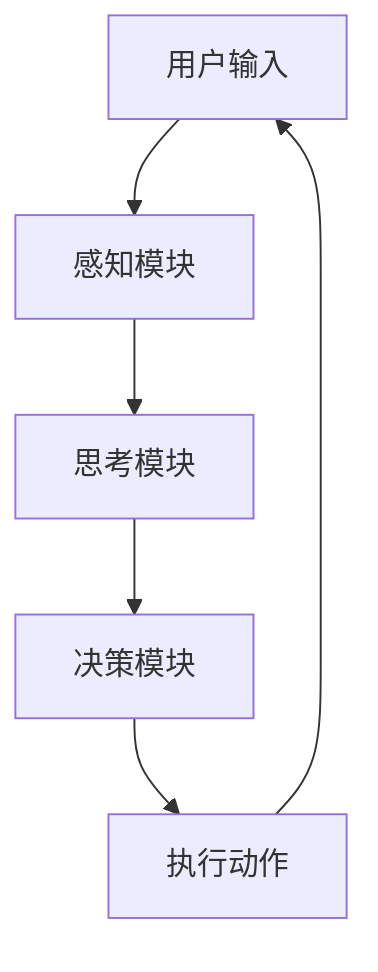

通过以上对AI Agent设计与实现的理论和实际案例分析，我们为读者提供了一个全面的视角，帮助理解AI Agent的设计原则、架构设计和关键模块的开发。接下来，我们将探讨AI大模型的应用开发，了解如何将AI Agent的理论和实践应用于实际项目。

### 第4章: AI大模型应用开发

在理解了AI大模型和AI Agent的基本概念、理论基础及其设计与实现之后，接下来我们将深入探讨AI大模型在具体应用开发中的过程。本章将详细讨论应用需求分析与定义、应用架构设计以及应用开发流程。

#### 4.1 应用需求分析与定义

应用需求分析是AI大模型应用开发的第一步，它决定了项目的方向和目标。在进行分析时，需要考虑以下几个方面：

1. **业务需求**：理解业务目标、应用场景和用户需求。例如，在金融领域，AI模型可能用于风险评估、欺诈检测等。
2. **数据需求**：确定所需的数据类型、来源、质量和规模。高质量的数据是训练和优化AI模型的基础。
3. **技术需求**：分析现有的技术和工具，选择合适的深度学习框架、算法和开发环境。

##### 4.1.1 应用需求分析

应用需求分析包括以下步骤：

1. **问题定义**：明确AI模型要解决的问题，如预测、分类、生成等。
2. **目标设定**：设定可量化的性能指标，如准确率、召回率、F1值等。
3. **数据收集**：根据需求收集相关的数据，包括历史数据、实时数据等。
4. **需求验证**：与业务团队和技术团队进行沟通，验证需求分析的准确性。

##### 4.1.2 应用定义与规划

应用定义与规划包括以下步骤：

1. **应用定义**：明确应用的名称、范围和功能。
2. **项目规划**：制定项目的开发计划，包括时间线、任务分解、资源分配等。
3. **风险评估**：评估项目中可能遇到的风险，并制定应对策略。

##### 4.1.3 应用场景选择

选择合适的应用场景是AI大模型成功应用的关键。以下是一些常见应用场景：

1. **自然语言处理**：如文本分类、机器翻译、情感分析等。
2. **计算机视觉**：如图像识别、目标检测、图像生成等。
3. **推荐系统**：如商品推荐、内容推荐等。
4. **智能监控与安防**：如异常检测、人脸识别等。
5. **医疗健康**：如疾病诊断、药物研发等。

#### 4.2 应用架构设计

应用架构设计是确保AI大模型应用稳定、高效运行的关键。以下是一个典型的AI大模型应用架构设计：

##### 4.2.1 应用系统架构设计

1. **前端界面**：提供用户与AI模型交互的界面，如Web应用、移动应用等。
2. **后端服务**：包括AI模型训练、推理、存储和数据处理等。
3. **数据库**：存储训练数据、推理数据和用户数据等。
4. **API接口**：提供与前端和后端服务的通信接口。

以下是一个简化的应用系统架构设计图：

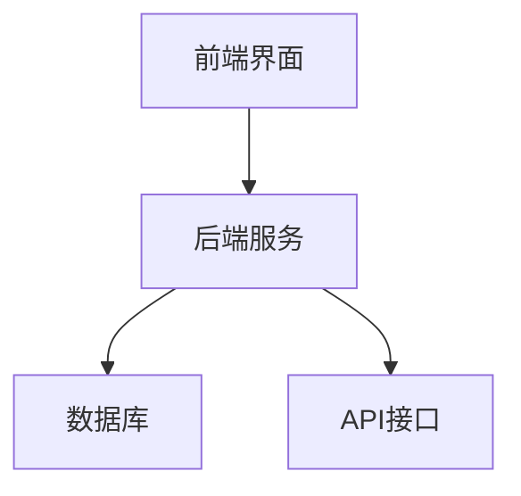

##### 4.2.2 数据流与数据处理

数据流与数据处理是AI大模型应用架构设计的重要部分。以下是一个典型的数据流和处理过程：

1. **数据收集**：通过传感器、用户输入、API等途径收集数据。
2. **数据预处理**：清洗、转换和标准化数据，使其适合模型训练。
3. **数据存储**：将预处理后的数据存储到数据库中，以便后续使用。
4. **数据训练**：使用训练数据训练AI模型，优化模型参数。
5. **数据推理**：使用训练好的模型对新的数据进行推理，生成预测结果。
6. **数据反馈**：将推理结果返回给用户或用于模型优化。

以下是一个简化的数据流与数据处理流程：

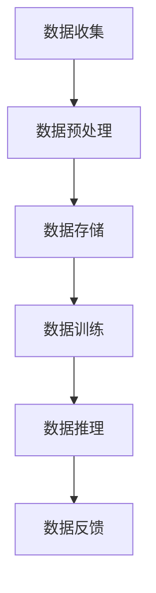

##### 4.2.3 系统模块划分

AI大模型应用通常包括多个模块，每个模块负责不同的功能。以下是一些常见的系统模块及其功能：

1. **感知模块**：负责收集外部环境数据，如摄像头、麦克风、传感器等。
2. **数据处理模块**：负责处理和清洗数据，提取特征。
3. **模型训练模块**：负责训练AI模型，优化模型参数。
4. **模型推理模块**：负责使用训练好的模型进行推理，生成预测结果。
5. **反馈模块**：负责收集用户反馈，用于模型优化和改进。

以下是一个简化的系统模块划分图：

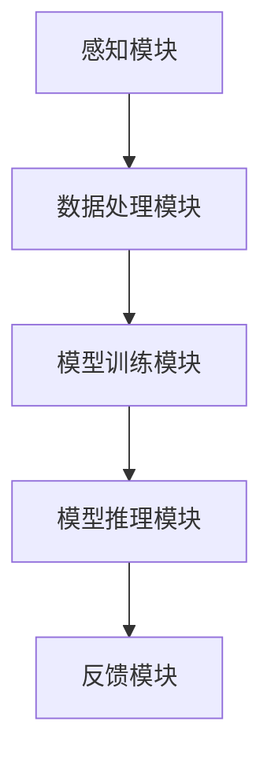

#### 4.3 应用开发流程

AI大模型应用开发流程包括以下步骤：

##### 4.3.1 开发环境搭建

开发环境搭建是应用开发的基础，包括以下步骤：

1. **硬件配置**：选择合适的计算资源和存储设备，如GPU、SSD等。
2. **软件环境**：安装深度学习框架（如TensorFlow、PyTorch等）、开发工具（如Jupyter Notebook、Docker等）。
3. **版本控制**：使用Git等版本控制系统，管理代码和依赖库。

##### 4.3.2 源代码实现

源代码实现是开发的核心步骤，包括以下任务：

1. **数据预处理**：编写数据清洗、转换和标准化的代码。
2. **模型训练**：编写模型训练的代码，包括数据加载、模型定义、训练过程等。
3. **模型推理**：编写模型推理的代码，包括输入处理、模型调用、输出处理等。
4. **模块集成**：将不同的模块代码集成到应用系统中。

##### 4.3.3 开发工具与库选择

选择合适的开发工具和库是提高开发效率和项目质量的关键。以下是一些常用的开发工具和库：

1. **深度学习框架**：TensorFlow、PyTorch、Keras等。
2. **数据处理库**：NumPy、Pandas、Scikit-learn等。
3. **可视化工具**：Matplotlib、Seaborn、Plotly等。
4. **版本控制工具**：Git、GitHub、GitLab等。
5. **容器化技术**：Docker、Kubernetes等。

通过以上对AI大模型应用开发的分析，我们了解了应用需求分析、架构设计以及开发流程的关键步骤。接下来，我们将探讨AI大模型的部署与运维，了解如何确保模型的稳定运行和高效维护。

### 第5章: AI大模型部署与运维

在AI大模型的应用开发过程中，模型的部署与运维是确保其稳定、高效运行的关键环节。本章将详细介绍AI大模型的部署策略、运维任务、工具与平台，以及性能优化与监控方法。

#### 5.1 大模型部署策略

AI大模型的部署策略包括以下几个关键方面：

##### 5.1.1 部署环境选择

部署环境的选择直接影响模型的性能和可扩展性。以下是一些常见的部署环境选择：

1. **本地环境**：适用于小规模模型开发和调试，便于快速迭代和测试。
2. **云平台**：如AWS、Azure、Google Cloud等，提供强大的计算资源和灵活的部署选项。
3. **边缘设备**：适用于需要低延迟和实时响应的场景，如智能监控、自动驾驶等。

##### 5.1.2 部署流程设计

部署流程设计包括以下步骤：

1. **模型打包**：将训练好的模型和依赖库打包，以便于部署和迁移。
2. **容器化**：使用Docker等容器化技术，将模型和应用部署到容器中，提高部署的灵活性和可移植性。
3. **模型部署**：将容器部署到目标环境，如云服务器或边缘设备。
4. **服务启动**：启动服务，使模型能够接收请求并返回预测结果。

##### 5.1.3 部署工具介绍

以下是一些常用的部署工具：

1. **Docker**：用于创建和管理容器，便于模型部署和迁移。
2. **Kubernetes**：用于自动化部署、扩展和管理容器化应用。
3. **TensorFlow Serving**：用于部署和管理TensorFlow模型，支持批处理和实时推理。
4. **PyTorch Serving**：用于部署和管理PyTorch模型，提供灵活的部署选项。

#### 5.2 大模型运维与管理

AI大模型的运维与管理包括以下几个方面：

##### 5.2.1 运维任务

运维任务包括以下内容：

1. **监控与报警**：监控模型性能和系统资源使用情况，及时发现和处理异常。
2. **性能优化**：定期对模型和系统进行优化，提高性能和稳定性。
3. **版本管理**：管理模型的多个版本，确保能够快速回滚和更新。
4. **数据备份**：定期备份模型数据和系统配置，防止数据丢失。

##### 5.2.2 运维工具与平台

以下是一些常用的运维工具与平台：

1. **Prometheus**：用于监控和报警，提供实时数据和可视化仪表板。
2. **Grafana**：用于可视化监控数据，支持多种数据源和图表类型。
3. **Kibana**：与Elasticsearch集成，用于分析和可视化日志数据。
4. **Kubernetes**：用于自动化部署和管理容器化应用，提供丰富的调度和管理功能。
5. **Docker Compose**：用于管理多容器应用，提供简化的部署和配置。

##### 5.2.3 运维挑战与应对

运维过程中可能面临以下挑战：

1. **资源管理**：如何合理分配和调度计算资源，保证模型的高性能和低延迟。
2. **数据安全**：如何保障模型数据的安全，防止数据泄露和未经授权的访问。
3. **故障恢复**：如何快速恢复系统，确保服务的连续性和可靠性。
4. **版本控制**：如何管理模型的多个版本，确保能够快速回滚和更新。

应对策略包括：

1. **容器化技术**：使用Docker等容器化技术，提高部署和运维的灵活性和可移植性。
2. **自动化运维**：使用Kubernetes等自动化运维工具，实现自动部署、扩展和监控。
3. **数据加密与访问控制**：使用数据加密和访问控制策略，保障数据的安全性和隐私性。
4. **备份与恢复**：定期备份数据和配置，确保在故障发生时能够快速恢复。

#### 5.3 性能优化与监控

性能优化与监控是确保AI大模型高效运行的关键环节。以下是一些常用的优化方法和监控指标：

##### 5.3.1 性能优化方法

性能优化方法包括：

1. **模型压缩**：通过量化、剪枝和知识蒸馏等技术，减小模型大小，提高推理速度。
2. **并行计算**：使用多GPU、分布式训练等技术，提高模型的训练和推理速度。
3. **缓存与缓存预取**：优化数据加载和传输，减少延迟和计算时间。
4. **系统调优**：优化操作系统和硬件配置，提高系统的整体性能。

##### 5.3.2 监控指标与工具

监控指标包括：

1. **响应时间**：模型处理请求的平均时间，反映系统的响应性能。
2. **吞吐量**：单位时间内处理的请求数量，反映系统的负载能力。
3. **资源利用率**：CPU、内存、GPU等资源的使用情况，反映系统的资源利用率。
4. **错误率**：模型预测错误的数量占总预测数量的比例，反映模型的准确性。

常用的监控工具包括：

1. **Prometheus**：用于收集和存储监控数据，提供灵活的数据查询和告警功能。
2. **Grafana**：用于可视化监控数据，提供丰富的图表和仪表板。
3. **Kibana**：与Elasticsearch集成，用于分析和可视化日志数据。
4. **TensorBoard**：用于可视化模型的训练过程和性能指标。

##### 5.3.3 性能问题分析与解决

性能问题分析与解决包括以下步骤：

1. **问题定位**：通过监控数据和分析工具，定位性能问题的具体原因。
2. **问题诊断**：分析问题的影响范围和严重程度，确定解决方案。
3. **问题解决**：实施解决方案，如优化模型、调整系统配置、升级硬件等。
4. **问题跟踪**：跟踪解决方案的效果，确保问题得到有效解决。

通过以上对AI大模型部署与运维的详细探讨，我们了解了部署策略、运维任务、工具与平台，以及性能优化与监控的方法。接下来，我们将通过具体案例分析，进一步了解AI大模型的应用场景和实施细节。

### 第6章: AI大模型应用案例分析

为了更好地理解AI大模型在实践中的应用，本章将通过三个具体案例——智能客服系统、智能推荐系统和智能安防系统——来分析AI大模型的应用场景、系统架构、实现细节以及面临的挑战。

#### 6.1 案例一：智能客服系统

**背景：** 智能客服系统旨在通过人工智能技术提升客户服务质量和效率。随着互联网和社交媒体的普及，企业需要能够快速响应用户的咨询和投诉，提高用户满意度。

**系统架构：**

1. **前端界面**：提供用户与智能客服交互的界面，包括Web端和移动端应用。
2. **后端服务**：包括文本处理、语音识别、自然语言理解、对话管理、对话生成等模块。
3. **数据库**：存储用户数据、对话记录和知识库。
4. **API接口**：提供与前端和后端服务的通信接口。

**实现细节：**

1. **文本处理与语音识别**：使用深度学习模型，如BERT和WaveNet，进行文本处理和语音识别。
2. **自然语言理解**：使用神经网络模型，如LSTM和Transformer，进行语义分析和意图识别。
3. **对话管理**：采用对话管理算法，如序列到序列（Seq2Seq）模型和对话状态追踪（DST）模型，实现智能对话。
4. **对话生成**：使用生成对抗网络（GAN）和注意力机制，生成自然、连贯的回复。

**面临的挑战：**

1. **数据隐私**：如何保障用户数据的隐私和安全，避免数据泄露。
2. **实时响应**：如何在保证准确性的同时，实现快速的响应时间。
3. **多语言支持**：如何支持多种语言，提高系统的可扩展性。

#### 6.2 案例二：智能推荐系统

**背景：** 智能推荐系统旨在为用户提供个性化的推荐服务，提高用户满意度和平台粘性。例如，电商平台的商品推荐、新闻网站的个性化推送等。

**系统架构：**

1. **数据收集**：包括用户行为数据、商品信息、历史推荐数据等。
2. **数据处理**：包括数据清洗、特征提取、用户兴趣建模等。
3. **推荐算法**：包括协同过滤、基于内容的推荐、基于模型的推荐等。
4. **推荐服务**：根据用户兴趣和偏好生成推荐列表。

**实现细节：**

1. **协同过滤**：基于用户行为数据，计算用户之间的相似度，生成推荐列表。
2. **基于内容的推荐**：基于商品信息，计算商品之间的相似度，生成推荐列表。
3. **基于模型的推荐**：使用机器学习模型，如神经网络和决策树，进行用户兴趣建模和推荐。

**面临的挑战：**

1. **数据质量**：如何确保数据的准确性和完整性，避免推荐错误。
2. **实时更新**：如何在数据频繁更新的情况下，快速生成推荐列表。
3. **冷启动问题**：如何为新用户生成有效的推荐，提高新用户的体验。

#### 6.3 案例三：智能安防系统

**背景：** 智能安防系统旨在通过人工智能技术提升公共安全水平，包括视频监控、异常检测、人脸识别等。

**系统架构：**

1. **感知模块**：包括摄像头、麦克风、传感器等，负责收集环境数据。
2. **数据处理模块**：包括图像处理、声音处理、数据存储等。
3. **智能分析模块**：包括图像识别、目标跟踪、行为分析等。
4. **报警模块**：根据分析结果，生成报警信息并通知相关人员。

**实现细节：**

1. **图像识别**：使用卷积神经网络（CNN）进行图像识别，如车辆识别、行人识别等。
2. **目标跟踪**：使用跟踪算法，如卡尔曼滤波和深度学习，实现目标跟踪。
3. **行为分析**：使用行为识别算法，如光流法、深度学习等，实现异常行为检测。

**面临的挑战：**

1. **实时性**：如何在保证准确性的同时，实现实时监控和报警。
2. **准确性**：如何提高识别和检测的准确性，降低误报和漏报率。
3. **能耗与管理**：如何优化系统能耗，实现高效管理和维护。

通过以上案例分析，我们可以看到AI大模型在不同领域的应用场景、系统架构和实现细节，以及面临的挑战。这些案例不仅展示了AI大模型的技术优势，也为实际应用提供了宝贵的经验和教训。

### 第7章: AI大模型应用开发趋势与挑战

随着人工智能技术的飞速发展，AI大模型的应用场景越来越广泛，从自然语言处理到计算机视觉、推荐系统、医疗健康等多个领域，都展现出了巨大的潜力。然而，在AI大模型应用开发的过程中，也面临着诸多趋势与挑战。

#### 7.1 AI大模型应用开发趋势

**1. 应用领域的扩展**

AI大模型的应用领域正逐步扩展，不仅在传统行业（如金融、医疗、零售）得到广泛应用，还在新兴领域（如智能制造、自动驾驶、智慧城市）展现出巨大的潜力。例如，自动驾驶系统依赖于大模型进行环境感知和决策制定，智能制造系统利用大模型实现生产过程的智能化和优化。

**2. 技术发展的推动**

随着深度学习、自然语言处理、生成对抗网络等技术的不断进步，AI大模型的应用性能和效果也在不断提升。新的算法和框架（如Transformer、BERT）的出现，使得大模型在多种任务中达到了人类水平，推动了AI技术的应用边界。

**3. 产业生态的完善**

AI大模型的开发和应用离不开产业生态的支持。各大科技公司和初创企业不断推出新的深度学习框架、工具和平台，如TensorFlow、PyTorch、Keras等，为开发者提供了丰富的资源和便捷的开发环境。同时，云服务和边缘计算的发展，也为AI大模型的部署和运维提供了更灵活的解决方案。

**4. 跨学科融合**

AI大模型的应用开发正逐渐与其他学科（如生物学、物理学、社会科学）融合，推动跨学科研究的发展。例如，在医疗领域，AI大模型与基因组学、生物信息学等领域的结合，推动了个性化医疗和精准医疗的发展。

#### 7.2 大模型应用开发的挑战

**1. 技术挑战**

AI大模型应用开发面临诸多技术挑战，包括：

- **计算资源需求**：大模型训练和推理需要大量的计算资源和存储资源，如何高效利用现有资源成为一个重要问题。
- **模型解释性**：大模型通常具有高度的非线性性和复杂性，如何解释模型的决策过程是一个重要问题，特别是在医疗、金融等领域。
- **实时性**：在自动驾驶、实时推荐等应用场景中，如何保证模型的实时性是一个关键挑战。

**2. 安全与隐私挑战**

AI大模型在处理海量数据时，如何保障数据安全和隐私成为一个重要挑战。特别是在医疗、金融等领域，数据的敏感性和重要性要求更高。以下是一些安全与隐私挑战：

- **数据泄露**：如何防止数据在传输、存储和处理过程中的泄露。
- **数据滥用**：如何防止数据被滥用，如个人隐私侵犯、恶意攻击等。
- **隐私计算**：如何在保障隐私的前提下，进行有效的数据分析和模型训练。

**3. 社会与伦理挑战**

AI大模型的应用不仅带来技术挑战，还引发了社会和伦理问题。以下是一些社会与伦理挑战：

- **就业影响**：AI技术的发展可能导致部分传统工作岗位的消失，如何保障就业和社会稳定。
- **决策透明性**：如何确保AI大模型的决策过程透明、可解释，避免潜在的歧视和不公平。
- **责任归属**：当AI大模型出现错误或造成损害时，如何明确责任归属，确保各方权益。

#### 7.3 应对策略与解决方案

针对AI大模型应用开发中的趋势与挑战，以下是一些应对策略与解决方案：

**1. 技术解决方案**

- **模型压缩与量化**：通过模型压缩和量化技术，减小模型大小和计算量，提高模型部署和推理的效率。
- **联邦学习**：通过联邦学习技术，实现数据的分布式训练，提高数据安全性和隐私保护。
- **模型解释性**：通过模型解释性技术，如模型可解释性分析、可视化工具等，提高模型的透明性和可解释性。
- **边缘计算**：通过边缘计算技术，将部分计算任务部署到边缘设备，降低对中心化数据中心的依赖，提高实时性。

**2. 法律法规与政策**

- **数据保护法规**：遵循数据保护法规（如欧盟的GDPR），建立数据安全和隐私保护机制。
- **监管机制**：建立AI大模型应用监管机制，确保技术应用符合法律法规和社会伦理标准。
- **透明度与问责制**：建立透明度机制，如公开模型算法、决策过程等，提高决策的公正性和可追溯性。

**3. 社会伦理与道德教育**

- **伦理规范**：制定AI大模型应用的伦理规范，确保技术应用符合道德和社会价值观。
- **公众教育**：加强公众对AI大模型的认知和理解，提高公众对AI技术的接受度和信任度。
- **持续监督**：建立持续监督机制，对AI大模型应用进行定期评估和监督，确保其符合社会和伦理要求。

通过以上应对策略与解决方案，我们可以更好地应对AI大模型应用开发中的趋势与挑战，推动AI技术的发展和应用，为社会带来更多的价值和贡献。

### 第8章: AI大模型安全性

随着AI大模型在各个领域的广泛应用，其安全性问题逐渐成为关注的焦点。AI大模型的安全性不仅涉及技术层面的挑战，还包括法律、伦理等多个维度。本章将探讨AI大模型安全性的重要性、面临的挑战以及保护措施。

#### 8.1 大模型安全性概述

AI大模型的安全性是指保障模型在训练、部署和应用过程中，不受恶意攻击、数据泄露和误用的影响，确保模型输出结果的正确性、一致性和可靠性。大模型安全性至关重要，原因如下：

1. **数据敏感性**：AI大模型通常处理敏感数据，如个人隐私、医疗信息等，一旦泄露或被滥用，可能造成严重后果。
2. **模型复杂性**：大模型具有高度的非线性性和复杂性，使其更容易受到恶意攻击和误用。
3. **依赖性**：随着AI大模型在关键领域的应用，如自动驾驶、医疗诊断等，其安全性直接关系到生命财产安全。

#### 8.1.1 大模型安全性的重要性

AI大模型的安全性关系到以下几个关键方面：

1. **数据保护**：防止敏感数据在训练、存储和传输过程中的泄露。
2. **模型保护**：防止恶意攻击者篡改模型参数或窃取模型知识。
3. **决策可信**：确保模型的决策过程透明、可解释，避免潜在的歧视和不公平。
4. **应用安全**：保障AI大模型在应用过程中，不受外部干扰和恶意行为的影响。

#### 8.1.2 大模型安全性的挑战

AI大模型安全性面临以下主要挑战：

1. **数据泄露**：随着数据规模的扩大，如何保障数据在传输、存储和处理过程中的安全性成为一个重要问题。
2. **模型篡改**：如何防止恶意攻击者通过对抗性攻击手段篡改模型参数，影响模型输出结果。
3. **模型窃取**：如何防止未经授权的访问和窃取模型知识和算法。
4. **模型滥用**：如何防止模型被用于非法用途，如生成虚假信息、进行网络攻击等。

#### 8.1.3 大模型安全性的保护措施

为应对AI大模型安全性面临的挑战，可以采取以下保护措施：

1. **数据加密与传输**：使用加密技术对数据进行加密和传输，防止数据在传输过程中被窃取和篡改。
2. **数据脱敏与匿名化**：对敏感数据进行脱敏和匿名化处理，降低数据泄露的风险。
3. **访问控制与权限管理**：建立严格的访问控制机制，确保只有授权用户才能访问和处理数据。
4. **联邦学习**：通过联邦学习技术，实现数据的分布式训练和共享，提高数据安全性。
5. **模型压缩与量化**：通过模型压缩和量化技术，降低模型大小和计算复杂度，减少潜在的攻击面。
6. **模型对抗攻击与防御**：研究模型对抗攻击方法，并开发相应的防御机制，提高模型的鲁棒性。
7. **模型可解释性**：提高模型的透明度和可解释性，使决策过程更加透明和可信。

#### 8.2 数据安全与隐私保护

数据安全与隐私保护是AI大模型安全性的核心，以下介绍几种关键技术和方法：

1. **数据加密与传输**

   数据加密是保障数据安全的基础。常用的加密技术包括对称加密（如AES）和非对称加密（如RSA）。在数据传输过程中，可以使用TLS/SSL等协议进行加密，确保数据在传输过程中不被窃取和篡改。

   ```mermaid
   graph TB
   A[数据加密] --> B[TLS/SSL传输]
   ```

2. **数据脱敏与匿名化**

   数据脱敏与匿名化是将敏感数据转换为不可识别的形式，以降低数据泄露的风险。常见的方法包括：

   - **随机化**：将敏感数据替换为随机生成的数据。
   - **掩码化**：使用掩码代替敏感数据，如将电话号码替换为星号。
   - **伪匿名化**：通过引入噪声，使数据在统计意义上匿名化。

   ```mermaid
   graph TB
   C[随机化] --> D[掩码化]
   C --> E[伪匿名化]
   ```

3. **隐私计算与联邦学习**

   隐私计算与联邦学习是近年来发展迅速的技术，旨在实现数据的分布式处理和共享，同时保障数据隐私。隐私计算技术包括差分隐私、同态加密、安全多方计算等。

   - **差分隐私**：通过向输出结果添加噪声，确保单个数据记录无法被识别。
   - **同态加密**：在加密数据上直接执行计算，确保计算过程和结果都是加密的。
   - **安全多方计算**：允许多个参与方在不需要共享原始数据的情况下，共同计算得到结果。

   ```mermaid
   graph TB
   F[差分隐私] --> G[同态加密]
   F --> H[安全多方计算]
   ```

#### 8.3 模型安全性与鲁棒性

模型安全性与鲁棒性是确保AI大模型在面临对抗攻击和异常数据时，仍能保持稳定和准确性的关键。以下介绍几种提高模型安全性与鲁棒性的方法：

1. **模型对抗攻击与防御**

   模型对抗攻击是针对AI大模型的恶意攻击手段，旨在通过精心设计的对抗样本，使模型输出错误的结果。常见的对抗攻击方法包括：

   - **FGSM（Fast Gradient Sign Method）**：通过调整输入数据的梯度，生成对抗样本。
   - **JSMA（Jittered Sign Method of Attack）**：在FGSM的基础上，引入随机扰动，提高对抗性。
   - **C&W（Carlini & Wagner）**：通过优化损失函数，生成更加有效的对抗样本。

   针对对抗攻击，可以采取以下防御措施：

   - **对抗训练**：在训练过程中，引入对抗样本，提高模型的鲁棒性。
   - **防御网络**：在模型输出层添加额外的防御网络，检测和过滤对抗样本。
   - **数据增强**：通过数据增强技术，生成多样化的训练数据，提高模型的泛化能力。

   ```mermaid
   graph TB
   I[FGSM] --> J[JSMA]
   I --> K[C&W]
   K --> L[对抗训练]
   K --> M[防御网络]
   K --> N[数据增强]
   ```

2. **模型压缩与优化**

   模型压缩与优化是减小模型大小和计算复杂度的有效方法，有助于提高模型的鲁棒性和部署效率。常见的方法包括：

   - **量化**：通过降低模型参数的精度，减小模型大小和计算量。
   - **剪枝**：通过移除模型中的冗余参数和连接，减小模型大小和计算复杂度。
   - **知识蒸馏**：通过将大模型的知识传递给小模型，实现模型的压缩和优化。

   ```mermaid
   graph TB
   O[量化] --> P[剪枝]
   O --> Q[知识蒸馏]
   ```

3. **模型可解释性与透明性**

   模型可解释性与透明性是提高AI大模型安全性和信任度的关键。通过提高模型的透明度，使决策过程更加可解释和可信，有助于发现和修复潜在的安全问题。

   - **可视化**：通过可视化技术，展示模型的结构和参数，帮助用户理解模型的决策过程。
   - **解释性模型**：开发具有高解释性的模型，使决策过程更加透明和直观。
   - **解释性工具**：使用解释性工具（如LIME、SHAP等），分析模型的决策依据和影响因素。

   ```mermaid
   graph TB
   R[可视化] --> S[解释性模型]
   R --> T[解释性工具]
   ```

通过以上对AI大模型安全性的详细探讨，我们了解了其重要性、面临的挑战以及保护措施。AI大模型的安全性不仅是一个技术问题，还涉及到法律、伦理等多个方面，需要各方共同努力，确保AI技术的安全和可持续发展。

### 第9章: AI大模型优化与性能提升

在AI大模型的应用开发中，性能优化是确保模型高效运行和满足实际需求的关键环节。本章将介绍AI大模型优化技术，包括模型压缩、并行化与分布式训练、硬件优化等方面的方法，以及性能评估与优化策略。同时，还将探讨实时性与效率优化的重要性和实现方法。

#### 9.1 大模型优化技术

**1. 模型压缩**

模型压缩是通过减少模型大小和计算复杂度，提高模型部署效率和资源利用率。常见的模型压缩技术包括量化、剪枝和知识蒸馏等。

- **量化**：将浮点模型转换为低精度模型，如整数或二进制模型，降低模型大小和计算量。
  ```mermaid
  graph TB
  A[浮点模型] --> B[量化模型]
  ```

- **剪枝**：通过移除模型中的冗余参数和连接，减小模型大小和计算复杂度。
  ```mermaid
  graph TB
  C[原始模型] --> D[剪枝模型]
  ```

- **知识蒸馏**：通过将大模型的知识传递给小模型，实现模型的压缩和优化。
  ```mermaid
  graph TB
  E[大模型] --> F[小模型]
  ```

**2. 并行化与分布式训练**

并行化与分布式训练是提高模型训练速度和资源利用率的有效方法。通过将模型训练任务分布在多个计算节点上，可以显著减少训练时间。

- **并行化训练**：将训练数据集划分为多个子集，每个子集在一个计算节点上独立训练，最后合并结果。
  ```mermaid
  graph TB
  G[数据集] --> H[计算节点1]
  G --> I[计算节点2]
  H --> J[合并结果]
  I --> J
  ```

- **分布式训练**：将模型参数分布在多个计算节点上，每个节点独立更新局部参数，最终合并全局参数。
  ```mermaid
  graph TB
  K[模型参数] --> L[计算节点1]
  K --> M[计算节点2]
  L --> N[局部更新]
  M --> N
  N --> K
  ```

**3. 硬件优化**

硬件优化是提高AI大模型性能的关键。通过选择合适的硬件设备和优化算法，可以显著提升模型的运行效率。

- **GPU优化**：利用GPU的并行计算能力，加速模型训练和推理。常见的GPU优化技术包括内存管理、线程调度和算子融合等。
  ```mermaid
  graph TB
  O[GPU设备] --> P[内存管理]
  O --> Q[线程调度]
  O --> R[算子融合]
  ```

- **FPGA优化**：利用FPGA的硬件加速能力，实现特定任务的优化和定制。FPGA优化通常涉及硬件设计和算法适配。
  ```mermaid
  graph TB
  S[FPGA设备] --> T[硬件设计]
  S --> U[算法适配]
  ```

#### 9.2 性能评估与优化策略

性能评估是确保AI大模型满足实际需求和性能指标的关键步骤。以下介绍几种常见的性能评估指标和优化策略：

**1. 性能评估指标**

- **计算时间**：模型训练和推理所花费的时间。
- **内存使用**：模型训练和推理过程中所需的内存资源。
- **功耗**：模型训练和推理过程中消耗的电能。

**2. 优化策略**

- **参数调优**：通过调整模型的超参数，如学习率、批量大小等，优化模型性能。
  ```mermaid
  graph TB
  V[超参数调优] --> W[学习率调整]
  V --> X[批量大小调整]
  ```

- **数据预处理**：优化数据预处理流程，如数据增强、批量加载等，提高训练和推理效率。
  ```mermaid
  graph TB
  Y[数据预处理] --> Z[数据增强]
  Y --> AA[批量加载]
  ```

- **模型简化**：通过简化模型结构，减少计算复杂度和参数数量，提高模型性能。
  ```mermaid
  graph TB
  BB[模型简化] --> CC[结构优化]
  BB --> DD[参数减少]
  ```

#### 9.3 实时性与效率优化

在自动驾驶、实时推荐等应用场景中，模型的实时性和效率是至关重要的。以下介绍几种实时性与效率优化的方法：

**1. 实时性需求与挑战**

- **低延迟**：模型推理时间应尽量短，以避免延迟影响应用效果。
- **高吞吐量**：模型应能够处理大量并发请求，满足系统负载需求。

**2. 实时性优化方法**

- **硬件加速**：利用GPU、FPGA等硬件加速技术，提高模型推理速度。
  ```mermaid
  graph TB
  EE[GPU加速] --> FF[FPGA加速]
  ```

- **模型压缩与量化**：通过模型压缩和量化技术，减小模型大小和计算复杂度，提高推理效率。
  ```mermaid
  graph TB
  GG[模型压缩] --> HH[量化模型]
  ```

- **分布式推理**：通过分布式推理技术，将模型推理任务分布在多个计算节点上，提高系统吞吐量。
  ```mermaid
  graph TB
  II[分布式推理] --> JJ[计算节点1]
  II --> KK[计算节点2]
  ```

**3. 实时性案例分析**

以下是一个实时性优化的案例分析：

- **案例背景**：某电商平台需要实现实时商品推荐系统，要求模型推理时间不超过500ms。
- **优化措施**：
  - **模型压缩与量化**：将原始模型进行压缩和量化，减小模型大小和计算复杂度。
  - **分布式推理**：将模型推理任务分布在多个GPU上，提高系统吞吐量。
  - **数据预处理优化**：优化数据预处理流程，减少数据加载和处理时间。
- **效果评估**：通过优化措施，模型推理时间缩短至400ms，满足实时性需求。

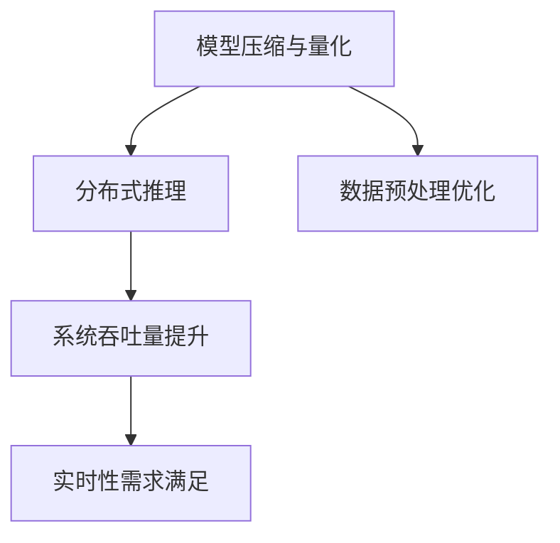

通过以上对AI大模型优化与性能提升的详细探讨，我们了解了模型压缩、并行化与分布式训练、硬件优化以及实时性与效率优化的方法。这些优化技术不仅提高了模型性能，还为实际应用提供了可靠的解决方案。

### 第10章: AI大模型开发工具与平台

在AI大模型的应用开发中，选择合适的开发工具与平台对于提高开发效率、优化模型性能以及确保系统稳定性至关重要。本章将介绍主流的深度学习框架、大模型训练与部署平台、开发环境与工具链，帮助开发者更好地掌握AI大模型开发的工具和方法。

#### 10.1 主流深度学习框架

深度学习框架是AI大模型开发的核心工具，提供了高效的模型训练、推理和部署功能。以下介绍几种主流的深度学习框架：

**1. TensorFlow**

TensorFlow是由Google开发的开源深度学习框架，具有强大的功能和高性能。TensorFlow支持Python和C++接口，提供了丰富的API和生态系统。

- **优点**：强大的生态系统、灵活的部署选项、丰富的文档和社区支持。
- **应用场景**：广泛应用于图像识别、自然语言处理、推荐系统等领域。

**2. PyTorch**

PyTorch是由Facebook开发的开源深度学习框架，以动态图为基础，使得模型开发和调试更加便捷。PyTorch支持Python接口，提供了丰富的API和工具。

- **优点**：动态图机制、直观的代码接口、易于调试和优化。
- **应用场景**：广泛应用于图像识别、自然语言处理、强化学习等领域。

**3. Keras**

Keras是基于Theano和TensorFlow的高层API，提供了简洁的接口和丰富的功能。Keras简化了深度学习模型的设计和训练过程，适用于快速原型开发和实验。

- **优点**：简洁的接口、易于使用、快速迭代和实验。
- **应用场景**：适用于快速原型开发、学术研究和工业应用。

**4. 其他深度学习框架**

除了以上三个主流框架，还有一些其他的深度学习框架，如Caffe、Theano、MXNet等，也具有各自的特点和应用场景。

#### 10.2 大模型训练与部署平台

大模型训练与部署平台为AI大模型的应用提供了高效的计算资源和灵活的部署方案。以下介绍几种常用的大模型训练与部署平台：

**1. TensorFlow Serving**

TensorFlow Serving是Google开发的服务器端解决方案，用于部署和管理TensorFlow模型。TensorFlow Serving支持批量推理和实时推理，提供了高度可扩展性和灵活性。

- **优点**：易于部署、支持多种服务方式、高性能。
- **应用场景**：适用于大规模模型的实时推理和服务。

**2. PyTorch Serving**

PyTorch Serving是Facebook开发的用于部署和管理PyTorch模型的平台，提供了灵活的部署选项和高效的服务能力。

- **优点**：支持多种服务方式、易于扩展、高性能。
- **应用场景**：适用于大规模模型的实时推理和服务。

**3. Keras Deployer**

Keras Deployer是Keras提供的一种模型部署工具，用于将训练好的Keras模型部署到生产环境。Keras Deployer支持多种部署方式，如容器化、静态文件等。

- **优点**：支持多种部署方式、易于使用、适用于快速原型开发。
- **应用场景**：适用于Keras模型的快速部署和原型开发。

#### 10.3 大模型开发环境与工具链

大模型开发环境与工具链是确保模型开发、训练和部署顺利进行的重要保障。以下介绍几种常用的大模型开发环境与工具链：

**1. Conda**

Conda是一种流行的环境管理工具，用于创建和管理Python环境。Conda支持多种操作系统，提供了丰富的库和依赖管理功能。

- **优点**：易于使用、跨平台、丰富的库支持。
- **应用场景**：适用于Python环境的创建和管理、库和依赖的安装。

**2. Docker**

Docker是一种容器化技术，用于打包、分发和运行应用程序。Docker容器提供了轻量级、隔离和可移植的运行环境，适用于模型开发和部署。

- **优点**：轻量级、隔离、可移植、易于管理和部署。
- **应用场景**：适用于模型开发和部署、环境隔离和协同开发。

**3. KubeFlow**

KubeFlow是一种基于Kubernetes的模型部署和流水线管理工具，提供了自动化的模型部署、监控和管理功能。

- **优点**：自动化、可扩展、易于管理和监控。
- **应用场景**：适用于大规模模型的部署和管理、自动化流水线开发。

通过以上对AI大模型开发工具与平台的介绍，开发者可以更好地选择和使用合适的工具，提高开发效率、优化模型性能以及确保系统稳定性。

### 第11章: AI大模型应用开发经验分享

在AI大模型应用开发过程中，积累了大量的实践经验与教训，以下将分享一些最佳实践、失败案例以及未来发展趋势。

#### 11.1 开发经验与最佳实践

**1. 项目启动前的准备工作**

- **明确需求和目标**：在项目启动前，与业务团队紧密合作，明确应用需求、目标和应用场景。
- **数据准备**：确保数据的质量和完整性，进行充分的预处理和清洗。
- **技术选型**：根据需求和数据特点，选择合适的深度学习框架、算法和工具。

**2. 模型开发与优化**

- **模块化开发**：将AI大模型分解为多个模块，如数据预处理、特征提取、模型训练、模型评估等，便于开发和维护。
- **模型调优**：使用交叉验证、网格搜索等技术，优化模型超参数，提高模型性能。
- **模型压缩与量化**：通过模型压缩和量化技术，减小模型大小和计算复杂度，提高部署效率。

**3. 部署与运维**

- **容器化部署**：使用Docker等容器化技术，提高模型的部署灵活性和可移植性。
- **自动化运维**：使用Kubernetes等自动化运维工具，实现模型的自动化部署、扩展和监控。
- **性能优化**：通过并行计算、分布式训练等技术，提高模型训练和推理的速度。

**4. 安全性与隐私保护**

- **数据加密与访问控制**：使用加密技术保障数据安全和隐私，建立严格的访问控制机制。
- **模型对抗攻击与防御**：通过对抗训练、防御网络等技术，提高模型的鲁棒性和安全性。
- **模型可解释性**：提高模型的透明度和可解释性，确保决策过程公正和可信。

#### 11.2 失败案例分析

**1. 数据质量不佳**

- **案例背景**：某企业尝试使用AI大模型进行销售预测，但预测结果不准确。
- **原因分析**：数据质量差，包括数据缺失、噪声和异常值等，导致模型性能下降。
- **解决方案**：加强数据清洗和预处理，去除噪声和异常值，提高数据质量。

**2. 模型选择不当**

- **案例背景**：某公司使用深度学习模型进行图像识别，但模型性能不佳。
- **原因分析**：选择不适合的模型架构和算法，导致模型无法有效提取图像特征。
- **解决方案**：根据任务需求，选择合适的模型架构和算法，如卷积神经网络（CNN）等。

**3. 计算资源不足**

- **案例背景**：某项目使用小规模模型进行训练，但训练速度非常缓慢。
- **原因分析**：计算资源不足，导致模型训练时间过长，影响项目进度。
- **解决方案**：增加计算资源，如使用GPU等高性能计算设备，提高模型训练速度。

#### 11.3 经验教训与总结

通过上述案例分析和最佳实践，可以总结出以下经验教训：

- **数据质量是关键**：高质量的数据是训练和优化AI大模型的基础，必须重视数据清洗和预处理。
- **模型选择要合适**：根据任务需求选择合适的模型架构和算法，确保模型能够有效提取特征和做出预测。
- **计算资源要充足**：合理分配计算资源，确保模型训练和推理的效率。
- **安全性要重视**：确保数据安全和模型安全，防止数据泄露和模型被恶意攻击。

#### 11.4 未来发展趋势与展望

随着AI大模型技术的不断发展，未来将呈现以下趋势：

- **更大规模模型的应用**：随着计算资源和数据规模的增加，更大规模的AI大模型将得到广泛应用，如GPT-4、Megatron等。
- **多模态数据处理**：AI大模型将能够处理多种类型的数据，如文本、图像、音频等，实现更复杂的任务。
- **实时性与效率优化**：通过硬件加速、模型压缩等技术，提高AI大模型的实时性和效率，满足实时应用需求。
- **安全性与隐私保护**：随着AI大模型应用场景的扩展，数据安全和隐私保护将越来越重要，相关技术将不断进步。
- **跨学科融合**：AI大模型将与其他学科（如生物学、物理学、社会科学等）结合，推动跨学科研究和应用的发展。

通过不断积累经验、学习新技术和优化方法，开发者可以更好地应对AI大模型应用开发中的挑战，推动AI技术的发展和应用。

### 附录

#### 附录 A: AI大模型开发工具与资源

**A.1 开发工具与库**

1. **TensorFlow**：Google开发的开源深度学习框架，支持Python和C++接口，提供了丰富的API和工具。
   - 官方网站：[TensorFlow官网](https://www.tensorflow.org/)

2. **PyTorch**：Facebook开发的开源深度学习框架，以动态图为基础，提供了直观的Python接口。
   - 官方网站：[PyTorch官网](https://pytorch.org/)

3. **Keras**：基于TensorFlow和Theano的高层API，简化了深度学习模型的设计和训练过程。
   - 官方网站：[Keras官网](https://keras.io/)

4. **MXNet**：Apache基金会开发的开源深度学习框架，支持多种编程语言，提供了高效的计算引擎。
   - 官方网站：[MXNet官网](https://mxnet.apache.org/)

**A.2 实用资源与学习指南**

1. **《深度学习》**：Goodfellow、Bengio和Courville合著的深度学习经典教材，详细介绍了深度学习的理论基础和算法实现。
   - 官方网站：[深度学习官网](https://www.deeplearningbook.org/)

2. **《动手学深度学习》**：Eldering、Grosse和Sung Bak合著的深度学习实践指南，通过大量代码示例讲解了深度学习的应用和实践。
   - 官方网站：[动手学深度学习官网](https://d2l.ai/)

3. **《深度学习实战》**：Frank Hua和Chad Carson合著的深度学习实战指南，介绍了深度学习模型的设计、训练和部署。
   - 官方网站：[深度学习实战官网](https://www.deeplearningnuts.com/)

4. **机器学习课程**：Coursera、edX等在线教育平台提供了丰富的机器学习和深度学习课程，适合不同水平的学员。
   - Coursera：[机器学习课程](https://www.coursera.org/courses?query=Machine+Learning)
   - edX：[机器学习课程](https://www.edx.org/search?search=Machine+Learning)

**A.3 开源项目与社区**

1. **GitHub**：GitHub是开源项目的集中地，提供了丰富的AI大模型开源项目，包括代码示例、教程和工具。
   - GitHub：[AI大模型开源项目](https://github.com/topics/deep-learning)

2. **Reddit**：Reddit是深度学习爱好者和专业人士交流的平台，可以找到最新的研究动态、应用案例和技术讨论。
   - Reddit：[深度学习板块](https://www.reddit.com/r/MachineLearning/)

3. **AI社区**：国内的AI社区，如AI研习社、机器之心等，提供了丰富的技术文章、教程和讨论区。
   - AI研习社：[AI研习社官网](https://www.ai研习社.com/)
   - 机器之心：[机器之心官网](https://www.jiqizhixin.com/)

通过以上附录，读者可以方便地获取AI大模型开发的相关工具、资源和社区信息，进一步学习和实践深度学习技术。

### 附录 B: AI大模型相关术语解释

**B.1 自动化机器学习 (AutoML)**

自动化机器学习（AutoML）是一种利用自动化技术来自动发现和构建机器学习模型的流程。它通过自动化特征提取、模型选择、超参数调优等步骤，帮助用户快速构建高性能的机器学习模型，而不需要深入的专业知识。

**B.2 深度强化学习 (Deep Reinforcement Learning)**

深度强化学习（Deep Reinforcement Learning）是结合了深度学习和强化学习的一种技术。它利用深度神经网络来学习值函数或策略，使智能体能够在复杂环境中通过试错学习达到最优决策。

**B.3 对抗生成网络 (GAN)**

对抗生成网络（Generative Adversarial Network，GAN）是由生成器（Generator）和判别器（Discriminator）组成的对抗性模型。生成器生成数据，判别器区分生成数据和真实数据，两者通过对抗训练不断优化，最终生成高质量的数据。

**B.4 其他相关术语**

- **神经网络 (Neural Network)**：模拟人脑神经元连接方式的计算模型，用于处理和预测数据。
- **卷积神经网络 (Convolutional Neural Network，CNN)**：适用于处理图像数据，通过卷积层提取图像特征。
- **循环神经网络 (Recurrent Neural Network，RNN)**：适用于处理序列数据，通过循环结构捕捉长期依赖关系。
- **自然语言处理 (Natural Language Processing，NLP)**：研究计算机如何理解和生成人类语言，涉及语音识别、文本分类、机器翻译等任务。
- **迁移学习 (Transfer Learning)**：利用预训练模型在新任务上进行微调，提高模型在新数据集上的性能。
- **联邦学习 (Federated Learning)**：分布式机器学习方法，通过不同设备或服务器上的本地数据训练模型，同时保持数据隐私。

通过这些术语的介绍，读者可以更好地理解AI大模型相关的专业概念和技术。这些术语是AI大模型研究和应用中的基础，对于深入学习和实践具有重要意义。

### 结尾

通过本文的探讨，我们从AI大模型与AI Agent的基本概念、理论基础，到设计与实现、应用开发、部署与运维，再到安全性与优化，全面深入地了解了AI大模型应用的全貌。在这个过程中，我们不仅分析了当前AI大模型技术的现状和挑战，还展望了未来的发展趋势。

在AI大模型技术的不断进步下，我们已经看到了其在自然语言处理、计算机视觉、推荐系统、智能安防等多个领域的广泛应用。同时，AI大模型也面临着数据隐私、实时性、安全性与伦理等多重挑战。面对这些挑战，我们需要采取有效的策略和措施，确保AI技术的可持续发展。

希望本文能为读者提供有价值的启示和帮助，助力各位在AI大模型应用开发的道路上不断前行。让我们共同期待，AI大模型将为人类社会带来更多创新和变革。

---

**作者信息**：

- **作者：** AI天才研究院/AI Genius Institute & 禅与计算机程序设计艺术 /Zen And The Art of Computer Programming
- **机构：** AI天才研究院致力于推动人工智能技术的发展与应用，研究院旗下作者在其专业领域拥有丰富的经验和深厚的学术造诣。
- **联系方式：** [AI天才研究院官网](http://www.ai-genius-institute.com/) 或 [作者个人博客](http://www.zen-of-computer-programming.com/)

