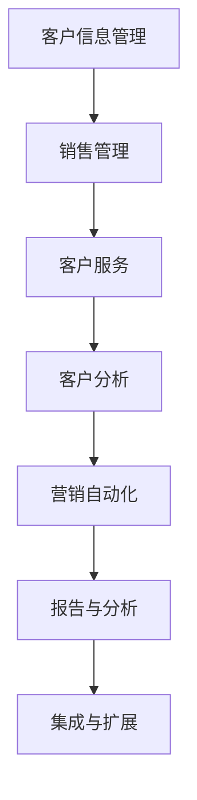

                 

### 第1章 引言

在当今竞争激烈的商业环境中，客户关系管理（CRM）系统已成为企业生存和发展的关键工具。尤其是对于一人公司或小型企业来说，有效的客户管理不仅关乎业务的成功，更是企业长期稳定发展的基础。

#### 1.1 CRM系统的重要性

CRM系统是一种用于收集、管理和分析客户信息的工具，其重要性在于：

1. **提升销售效率**：通过自动化客户管理流程，销售人员可以更专注于开发潜在客户和提升现有客户的满意度。
2. **增强客户体验**：通过统一的客户视图，企业能够提供更加个性化和高效的服务，从而提升客户满意度。
3. **数据驱动的决策**：CRM系统提供了详细的数据分析功能，帮助企业根据实际数据做出更加明智的决策。

#### 1.2 CRM系统在小型企业中的应用

对于一人公司或小型企业，CRM系统的主要应用包括：

1. **客户信息管理**：收集和存储客户的基本信息、沟通历史和购买行为。
2. **销售管理**：跟踪销售机会，管理销售流程，提高销售效率。
3. **客户服务**：通过CRM系统，企业可以及时响应客户咨询和投诉，提供高效的售后服务。

#### 1.3 本书的目标与结构

本书的目标是帮助一人公司或小型企业了解和选择合适的CRM系统，并有效地利用CRM系统进行客户管理。本书的结构如下：

- **第1章**：引言，介绍CRM系统的重要性及其在小型企业中的应用。
- **第2章**：CRM系统的基础概念，包括客户关系管理的定义、CRM系统的作用和价值、CRM系统的核心模块。
- **第3章**：CRM系统的选择，包括市场上CRM系统的分类、选择CRM系统的关键因素、CRM系统的试用与评估。
- **第4章**：客户信息管理，包括客户信息的收集与整理、客户信息的安全与隐私保护、客户信息的分析与利用。
- **第5章**：客户沟通与互动，包括客户沟通的有效策略、客户互动的平台选择、客户互动的自动化工具。
- **第6章**：客户满意度管理，包括客户满意度的测量、提高客户满意度的方法、满意度调查与反馈分析。
- **第7章**：客户忠诚度管理，包括客户忠诚度的定义与度量、提升客户忠诚度的策略、客户忠诚度的案例分析。
- **第8章**：CRM系统在个人企业中的应用实践，包括个人企业的CRM需求分析、个人企业的CRM系统实施步骤、个人企业的CRM系统运营与优化。
- **第9章**：结论，总结CRM系统对个人企业的意义、面向未来的CRM发展趋势、总结与展望。

通过本书的详细讲解，希望能够帮助读者全面了解CRM系统，并学会如何有效地利用CRM系统进行客户管理，从而实现业务的快速增长。

关键词：CRM系统，客户管理，销售效率，数据驱动，小型企业

摘要：本文将深入探讨CRM系统在小型企业和一人公司中的重要性及其应用，从基础概念到实际操作，提供一套完整的CRM系统选择与客户管理指南，帮助读者在竞争激烈的商业环境中脱颖而出。

---

**Mermaid流程图：CRM系统的核心模块**

#### 2.1 客户关系管理的定义

客户关系管理（CRM）是一种战略和战术，旨在通过优化与客户的关系来提高企业利润。CRM不仅仅是一个系统，更是一种文化、一种流程和一种技术的综合应用。其核心理念是通过集成各种技术和资源，实现客户信息的有效管理和利用，从而提升客户满意度和忠诚度。

CRM系统将客户信息集中存储，并通过数据分析帮助企业在销售、营销和服务等各个方面做出更加明智的决策。CRM的定义可以从以下几个方面来理解：

1. **客户信息的集中管理**：CRM系统的主要功能之一是收集和存储客户信息，包括联系信息、购买历史、互动记录等。通过集中管理，企业可以快速获取全面准确的客户数据，从而更好地理解客户需求和行为。
2. **客户互动的自动化**：CRM系统可以帮助企业自动化客户互动流程，例如发送营销邮件、客户跟进、销售机会管理等。这不仅可以提高工作效率，还能确保客户互动的连贯性和一致性。
3. **数据驱动的决策**：CRM系统提供了强大的数据分析功能，可以帮助企业根据实际数据做出更加明智的决策。通过分析客户行为、销售趋势和市场动态，企业可以优化营销策略和销售流程，提高业务绩效。
4. **客户体验的优化**：CRM系统通过提供个性化服务和及时响应客户需求，可以显著提升客户体验。无论是通过精准的营销活动、高效的销售流程，还是优质的售后服务，CRM系统都能帮助企业建立良好的客户关系。

总之，CRM系统作为一种全面的管理工具，旨在帮助企业与客户建立长期、稳定和互惠互利的合作关系，从而实现业务增长和可持续发展。

#### 2.2 CRM系统的作用与价值

CRM系统在提升企业效率和利润方面发挥着至关重要的作用。首先，CRM系统通过自动化和优化客户管理流程，极大地提高了企业的运营效率。传统的客户管理方式往往依赖于人工记录和纸质文档，不仅效率低下，还容易出错。而CRM系统通过电子化管理和自动化流程，可以显著减少人为干预和操作错误，提高数据准确性和处理速度。

例如，CRM系统可以帮助企业自动化销售机会跟踪和客户沟通管理，销售人员可以实时更新客户信息、记录销售进度，从而确保销售流程的连贯性和高效性。此外，CRM系统还提供了集成化的工作平台，使得销售、营销和服务部门可以共享客户数据，协同工作，进一步提高了企业内部协作效率。

其次，CRM系统通过全面的数据收集和分析，为企业提供了丰富的数据洞察，有助于企业做出更加精准和明智的决策。CRM系统不仅能够记录客户的基本信息，还可以收集客户的购买行为、互动记录和反馈信息。通过对这些数据的深入分析，企业可以了解客户的需求和行为模式，发现市场趋势和业务机会，从而优化产品和服务策略。

例如，通过分析销售数据，企业可以发现哪些产品或服务最受客户欢迎，哪些市场潜力最大，从而调整销售策略和资源分配。同时，CRM系统还可以帮助预测客户流失和潜在客户转化，提前采取相应的措施，减少客户流失率，提高客户留存率。

此外，CRM系统在提升客户满意度和忠诚度方面也具有显著作用。通过CRM系统，企业可以提供更加个性化和定制化的服务，满足客户的个性化需求。例如，通过分析客户的历史购买记录和互动记录，企业可以为客户提供个性化的产品推荐和营销活动，提高客户体验和满意度。

同时，CRM系统还提供了及时的客户反馈和投诉处理机制，帮助企业快速响应客户需求，解决客户问题。通过及时有效的客户服务，企业可以建立良好的客户关系，增强客户忠诚度，减少客户流失。

总之，CRM系统通过提升运营效率、数据驱动决策和优化客户体验，为企业在竞争激烈的市场环境中提供了强有力的支持。CRM系统不仅帮助企业降低运营成本、提高销售额和利润率，还为企业构建了稳固的客户基础，推动了企业的长期可持续发展。

#### 2.3 CRM系统的核心模块

CRM系统由多个核心模块组成，每个模块在客户关系管理中都扮演着关键角色。以下是CRM系统的核心模块及其功能：

1. **客户信息管理**：客户信息管理是CRM系统的基石，它负责收集、存储和更新客户的基本信息、购买记录和互动历史。通过集中管理客户信息，企业可以快速获取全面的客户数据，便于后续的数据分析和决策。客户信息管理模块还包括客户标签和分类功能，帮助企业对客户进行精准分类和标记，便于后续的营销和客户服务。

2. **销售管理**：销售管理模块是CRM系统中最核心的部分之一，它帮助销售人员跟踪和管理销售机会、客户需求和销售活动。销售管理模块通常包括以下功能：
   - **销售机会管理**：记录和跟踪每个销售机会的状态、概率和预计成交日期，帮助销售人员了解销售进展。
   - **销售流程管理**：定义和优化销售流程，确保销售团队能够按照标准流程进行销售活动。
   - **销售预测**：基于历史数据和当前销售进展，预测未来销售业绩，为销售团队提供决策支持。

3. **营销自动化**：营销自动化模块通过自动化工具和策略，帮助企业实现高效的营销活动管理。该模块通常包括以下功能：
   - **营销活动管理**：创建、管理和跟踪各种营销活动，包括电子邮件营销、社交媒体推广、内容营销等。
   - **营销自动化流程**：自动化发送电子邮件、社交媒体通知和短信，根据客户行为触发相应的营销活动。
   - **客户分群**：基于客户的行为和偏好，将客户分为不同的群体，实施个性化的营销策略。

4. **客户服务**：客户服务模块专注于提供高效的客户支持和服务，帮助企业在客户服务过程中建立良好的客户关系。该模块通常包括以下功能：
   - **客户支持工单**：记录和管理客户提出的支持和投诉问题，确保问题得到及时解决。
   - **客户沟通记录**：记录与客户的沟通历史，便于后续跟踪和参考。
   - **知识库**：提供常见问题和解决方案的文档库，帮助客户自助解决问题。

5. **客户分析**：客户分析模块通过数据分析工具，帮助企业深入了解客户行为和需求，优化客户关系管理策略。该模块通常包括以下功能：
   - **客户行为分析**：分析客户的购买行为、互动记录和偏好，发现客户需求和行为模式。
   - **客户价值分析**：评估客户的购买价值和潜在价值，为销售和营销团队提供优先级参考。
   - **客户流失预测**：通过分析客户行为和互动历史，预测可能流失的客户，提前采取挽留措施。

6. **报告与分析**：报告与分析模块提供全面的数据报表和可视化分析，帮助企业监控业务绩效和客户关系状况。该模块通常包括以下功能：
   - **业务报告**：生成销售、营销和客户服务方面的关键绩效指标（KPI）报告，帮助管理层了解业务进展。
   - **数据可视化**：通过图表和图形，直观展示关键业务数据和趋势，便于数据分析和决策。
   - **自定义报表**：允许用户根据需求自定义报表内容和格式，满足个性化分析需求。

7. **集成与扩展**：集成与扩展模块确保CRM系统可以与其他业务系统和应用程序无缝集成，扩展系统功能。该模块通常包括以下功能：
   - **API接口**：提供API接口，方便与其他系统的数据交换和集成。
   - **插件和扩展**：提供各种插件和扩展功能，满足特定业务需求。
   - **第三方集成**：与常用的第三方应用程序（如邮件服务、社交媒体平台等）集成，实现数据共享和协同工作。

通过这些核心模块的协同作用，CRM系统为企业提供了一个全面、高效的客户关系管理平台，帮助企业提升客户满意度、增加销售额和实现业务增长。

#### 3.1 市场上的CRM系统分类

市场上的CRM系统种类繁多，可以根据不同的分类标准进行划分。以下是几种常见的分类方法及其代表产品：

1. **按功能划分**：
   - **单功能CRM系统**：这类系统专注于某一特定功能，如销售管理、客户服务或营销自动化。代表产品包括Salesforce的Sales Cloud、Service Cloud和Marketing Cloud。
   - **多功能CRM系统**：这类系统集成了多个功能模块，提供全面的客户关系管理解决方案。代表产品包括Salesforce的Salesforce CRM、微软的Dynamics 365 CRM和金蝶的CRM系统。

2. **按规模和复杂性划分**：
   - **小型企业CRM系统**：这类系统通常具有简单易用、成本低的特点，适合小型企业和初创公司。代表产品包括Zoho CRM、HubSpot CRM和Freshworks CRM。
   - **中型企业CRM系统**：这类系统在功能上更加丰富，提供了更高级的数据分析和报告功能，适合中型企业。代表产品包括微软的Dynamics 365 CRM、Salesforce的Salesforce CRM和SAP的SAP CRM。
   - **大型企业CRM系统**：这类系统具备高度可定制性、灵活性和扩展性，可以满足大型企业的复杂需求。代表产品包括Oracle的Oracle CRM、SAP的SAP CRM和Infor CRM。

3. **按部署方式划分**：
   - **云端部署CRM系统**：这类系统部署在云端，用户可以通过互联网访问。这种部署方式具有成本低、灵活性高、易于维护等特点。代表产品包括Salesforce、微软的Dynamics 365 CRM和Google的Google Workspace。
   - **本地部署CRM系统**：这类系统需要企业在自己的服务器上安装和运行，对企业的IT基础设施和人员技能要求较高。代表产品包括Oracle CRM On Premises、Infor CRM和Salesforce的Sales Cloud Classic。
   - **混合部署CRM系统**：这类系统结合了云端部署和本地部署的优势，既可以在云端运行，也可以在本地部署。用户可以根据需求选择部署方式。代表产品包括Salesforce的Sales Cloud和Dynamics 365 CRM。

4. **按行业和特定需求划分**：
   - **通用型CRM系统**：这类系统适用于多个行业，提供标准化的功能模块。代表产品包括Salesforce、微软的Dynamics 365 CRM和Zoho CRM。
   - **行业专用CRM系统**：这类系统专门为某一行业设计，提供针对该行业的特定功能和解决方案。代表产品包括医疗行业的Epic Systems、金融行业的SAP S/4HANA Finance和零售行业的Nestlé N.Suite。

通过了解市场上的CRM系统分类，企业可以根据自己的需求选择合适的系统，实现有效的客户关系管理。

#### 3.2 选择CRM系统的关键因素

选择适合的CRM系统对于一人公司或小型企业来说至关重要。以下是一些关键因素，这些因素将帮助企业在众多CRM系统中做出明智的选择：

1. **成本**：成本是企业选择CRM系统时首先要考虑的因素之一。CRM系统的成本包括初始购买费用、实施费用、维护费用和升级费用等。小型企业通常预算有限，因此需要选择性价比高的系统。一些云端的CRM系统，如Zoho CRM和HubSpot CRM，提供了灵活的定价方案，可以根据企业规模和需求进行调整。

2. **易用性**：CRM系统的易用性直接影响到员工的使用效率和系统实施的成功率。对于小型企业来说，系统需要简单直观，易于学习和操作，以减少培训成本和员工的学习时间。此外，系统界面应该符合用户习惯，操作流程简洁明了，以便员工能够快速上手并高效使用。

3. **功能模块**：CRM系统功能模块的丰富性直接影响企业的客户管理效果。企业需要根据自身的业务需求和客户管理目标，选择具备所需功能模块的系统。常见的CRM系统功能模块包括客户信息管理、销售管理、营销自动化、客户服务、客户分析和报告与分析等。例如，如果企业主要关注销售管理，可以选择具有强大销售管理功能的系统，如Salesforce的Sales Cloud。

4. **集成能力**：CRM系统需要与企业现有的其他业务系统（如ERP系统、电子邮件服务、社交媒体平台等）无缝集成，以确保数据流畅传递和业务流程的自动化。集成能力不仅提高了系统的灵活性，还能提升企业的整体运营效率。在选择CRM系统时，企业应该评估系统的API接口、第三方集成插件和扩展能力。

5. **定制化能力**：每个企业的业务流程和需求都是独特的，因此CRM系统需要具备一定的定制化能力。企业应选择能够根据自身需求进行自定义配置的系统，包括自定义字段、流程、报表等。这有助于企业充分利用系统功能，实现个性化的客户管理。

6. **客户支持和服务**：CRM系统的供应商提供的客户支持和服务水平对企业的使用体验和系统稳定性具有重要影响。企业应选择提供高质量技术支持、定期更新和培训服务的供应商。此外，供应商的响应速度和解决问题的能力也是评估其服务质量的重要指标。

7. **安全性和数据隐私**：在处理大量客户数据的过程中，CRM系统的安全性和数据隐私保护至关重要。企业需要选择具备严格安全措施的系统，如数据加密、访问控制、备份和恢复功能等。此外，供应商需要符合相关数据隐私法规，如欧洲的通用数据保护条例（GDPR）。

8. **用户评价和口碑**：用户的真实体验和评价是评估CRM系统的重要参考。企业可以通过查看用户评论、参与社区讨论和参考行业报告来了解不同CRM系统的实际表现和用户满意度。

通过综合考虑以上关键因素，一人公司或小型企业可以找到最适合自己的CRM系统，从而实现高效的客户关系管理，提高业务竞争力。

#### 3.3 CRM系统的试用与评估

在选择CRM系统时，试用和评估是非常重要的一步。通过试用和评估，企业可以验证系统的实际性能、易用性和适用性，从而确保选择的CRM系统能够满足业务需求。

**试用阶段**

1. **创建试用账户**：大多数CRM系统提供商都提供免费试用服务，企业可以通过官方网站或直接联系销售人员申请试用账户。
2. **配置试用环境**：在试用期间，企业需要根据自身业务需求对CRM系统进行配置。这包括设置公司信息、用户权限、数据字段和流程等。
3. **用户培训**：为员工提供试用系统的培训，确保他们能够熟练使用系统的基本功能。

**评估标准**

1. **功能完善性**：评估CRM系统的功能是否全面，是否涵盖企业所需的客户信息管理、销售管理、营销自动化、客户服务等模块。
2. **易用性**：评估系统的界面设计是否简洁直观，操作流程是否简便，员工是否容易上手。
3. **数据整合能力**：评估系统与企业现有业务系统（如ERP、邮件服务、社交媒体平台等）的集成能力，确保数据流畅传递和业务流程的自动化。
4. **定制化能力**：评估系统是否支持自定义字段、流程和报表，是否符合企业的个性化需求。
5. **客户支持**：评估CRM系统提供商的客户支持服务，包括技术支持、培训服务和响应速度。
6. **安全性**：评估系统的数据安全措施，如数据加密、访问控制和备份恢复功能等。

**评估方法**

1. **用户反馈**：通过试用期间员工的反馈，了解系统的实际使用体验和发现的问题。
2. **实际操作测试**：模拟实际业务场景，测试CRM系统的性能和稳定性，评估其处理大量数据和处理复杂业务流程的能力。
3. **数据分析**：通过试用期间的数据分析功能，了解系统在数据收集、分析和决策支持方面的表现。
4. **竞争对手对比**：将选定的CRM系统与其他潜在系统进行对比，评估其在功能和性能上的优劣。

**总结**：通过试用和评估，企业可以全面了解CRM系统的实际表现和适用性，从而做出更加明智的选择。试用和评估不仅有助于选择最适合的CRM系统，还能为后续的实施和优化提供重要参考。

#### 4.1 客户信息的收集与整理

客户信息的收集与整理是CRM系统的核心功能之一，有效的客户信息管理不仅能够帮助企业更好地了解客户，还能够提升销售效率和服务质量。以下是客户信息收集与整理的详细步骤和方法：

**1. 客户信息的来源**

客户信息的来源可以多种多样，包括：

- **线上渠道**：网站、社交媒体、在线问卷调查、电子商务平台等。
- **线下渠道**：客户访问、活动参与、电话咨询、邮件沟通等。
- **第三方数据提供商**：通过购买或交换数据，获取潜在客户的详细信息。
- **内部数据库**：企业现有的客户数据库和历史交易记录。

**2. 客户信息的内容**

客户信息的收集应全面、准确，主要包括以下内容：

- **基本信息**：姓名、联系方式（电话、邮箱、地址等）、公司名称、职位等。
- **购买记录**：历史订单、购买频率、购买金额、产品偏好等。
- **互动记录**：客户咨询、投诉、反馈、参与活动等。
- **行为数据**：浏览行为、点击率、访问时长、网页停留页面等。
- **反馈与评价**：客户对产品或服务的评价、反馈意见等。

**3. 客户信息的收集方法**

- **在线表单**：在网站、APP、社交媒体等渠道设置在线表单，收集客户的基本信息。
- **问卷调查**：通过线上或线下的问卷调查，收集客户的购买偏好和反馈。
- **数据导入**：从内部数据库或第三方数据提供商导入现有客户信息。
- **自动采集**：利用技术手段（如cookies、像素标签等）自动采集客户的行为数据。

**4. 客户信息的整理**

客户信息的整理是确保数据准确性和可用性的关键步骤，主要包括以下方面：

- **数据清洗**：删除重复、错误或不完整的记录，确保数据的准确性。
- **数据标准化**：统一数据格式，如日期格式、电话号码格式等，确保数据的标准化。
- **数据分类**：根据客户特征和行为，对客户进行分类，如潜在客户、现有客户、VIP客户等。
- **数据存储**：将整理后的数据存储在CRM系统中，方便后续的数据查询和分析。

**5. 客户信息的利用**

整理后的客户信息可以用于多种业务场景，包括：

- **销售管理**：通过客户信息，销售人员可以了解客户的购买偏好和需求，提供个性化的销售策略。
- **营销策略**：根据客户的行为数据和反馈，制定针对性的营销活动，提高营销效果。
- **客户服务**：通过客户的互动记录和反馈，提供高效、个性化的客户服务，提升客户满意度。
- **数据分析**：利用客户信息，进行数据挖掘和统计分析，发现客户需求和业务机会，优化业务策略。

通过有效的客户信息收集与整理，企业可以建立全面的客户视图，实现精准的客户管理和高效的业务运营。

#### 4.2 客户信息的安全与隐私保护

在处理大量客户信息的过程中，信息安全与隐私保护至关重要。这不仅关乎企业的声誉，还涉及到法律法规的合规性。以下是关于客户信息安全和隐私保护的一些关键措施和最佳实践：

**1. 数据加密**

数据加密是保护客户信息的基本措施之一。对于存储和传输的客户数据，应采用高强度加密算法，如AES（Advanced Encryption Standard）等。此外，对于敏感数据，如信用卡信息、个人身份信息等，应实施双重加密策略，以进一步提高安全性。

**2. 访问控制**

严格的访问控制机制可以有效防止未经授权的人员访问客户信息。企业应设置多层次的访问权限，确保只有授权员工才能访问特定数据。例如，通过角色权限设置，限制不同部门和岗位的访问范围。此外，还应定期审查和更新访问权限，确保权限设置与实际业务需求相匹配。

**3. 安全审计**

定期进行安全审计是确保信息安全和合规性的重要手段。安全审计包括对系统日志、用户行为和访问记录的监控和分析，及时发现和纠正安全漏洞。通过安全审计，企业可以确保系统配置、安全策略和操作流程符合最佳实践和法律法规要求。

**4. 数据备份**

数据备份是防止数据丢失和意外事故的关键措施。企业应定期进行数据备份，并确保备份数据的安全性和可用性。备份策略应包括本地备份和云备份，确保在数据丢失或系统故障时能够快速恢复数据。

**5. 法律法规遵守**

在处理客户信息时，企业必须遵守相关法律法规，如《通用数据保护条例》（GDPR）和《加州消费者隐私法案》（CCPA）等。这些法律法规对数据收集、存储、处理和传输提出了严格要求。企业应制定并遵循严格的数据保护政策，确保合规运营。

**6. 用户隐私保护**

用户隐私保护是客户信息安全和隐私保护的核心。企业应在收集和处理客户信息时，充分告知用户其信息的使用目的、范围和方式，并取得用户的明确同意。此外，企业应确保用户有权访问、更正和删除其个人信息，并提供简便的隐私设置选项。

**7. 安全意识培训**

员工是信息安全的关键因素。企业应定期对员工进行安全意识培训，提高员工对信息安全重要性的认识，教育员工如何正确处理和存储客户信息，防止内部安全威胁。

通过以上措施和最佳实践，企业可以有效保护客户信息的安全与隐私，增强客户信任，提升企业形象。

#### 4.3 客户信息的分析与利用

客户信息的分析与利用是CRM系统的重要功能之一，通过深入分析客户数据，企业可以更好地了解客户需求，优化营销策略，提高客户满意度和忠诚度。以下是关于客户信息分析与利用的详细步骤和方法：

**1. 数据整理与清洗**

在进行分析之前，首先需要对客户信息进行整理和清洗。数据整理包括统一数据格式、消除重复记录和缺失值处理。数据清洗则涉及删除错误数据、填充缺失值和异常值检测。通过这些步骤，确保数据的准确性和完整性，为后续分析奠定基础。

**2. 客户细分**

客户细分是将客户按照不同的特征进行分类，以便针对不同客户群体实施个性化营销策略。常见的客户细分方法包括：

- **地理细分**：根据客户的地理位置进行分类，如城市、区域等。
- **行为细分**：根据客户的行为数据（如浏览行为、购买行为等）进行分类。
- **需求细分**：根据客户的偏好和需求进行分类。
- **价值细分**：根据客户的购买金额和购买频率进行分类，如高价值客户、潜在客户等。

**3. 数据可视化**

数据可视化是将复杂的数据以图表、图形等形式直观展示，便于理解和分析。常见的数据可视化工具包括图表、热力图、散点图、折线图等。通过数据可视化，企业可以更直观地了解客户行为和趋势，发现潜在问题和机会。

**4. 客户行为分析**

客户行为分析是了解客户需求和购买动机的重要方法。通过分析客户的行为数据，企业可以识别客户在不同阶段的行为特征，如访问页面、点击广告、填写表单等。具体分析步骤包括：

- **客户访问分析**：分析客户的访问频率、访问时长、页面停留时间等指标。
- **转化分析**：分析客户的转化路径和转化率，识别影响转化的关键因素。
- **漏斗分析**：构建客户购买漏斗，分析客户在不同阶段的流失情况，优化销售流程。

**5. 客户价值分析**

客户价值分析是评估客户为企业带来的经济效益，从而制定针对性的客户管理策略。常见的方法包括：

- **客户终身价值（CLV）**：预测客户在未来为企业带来的总收益。
- **客户购买周期**：分析客户的购买周期，识别客户购买的频率和间隔。
- **客户流失率**：分析客户流失的原因，采取相应的挽留措施。

**6. 客户满意度分析**

客户满意度分析是通过调查和反馈了解客户的满意程度，从而优化产品和服务。具体步骤包括：

- **满意度调查**：通过问卷调查、电话访谈等方式收集客户满意度数据。
- **反馈分析**：分析客户反馈，识别产品和服务中的问题和改进点。
- **改进措施**：根据客户反馈，采取改进措施，提高客户满意度。

通过以上分析方法和步骤，企业可以全面了解客户需求和行为，制定更加精准和有效的营销策略，提升客户满意度和忠诚度。

#### 5.1 客户沟通的有效策略

在客户管理中，有效的沟通策略是建立和保持良好客户关系的关键。以下是几种常见的客户沟通策略及其实施方法：

**1. 主动沟通**

主动沟通是指企业主动与客户进行沟通，了解客户需求和反馈。主动沟通可以通过以下方法实施：

- **定期跟进**：通过电话、邮件、短信等方式定期与客户联系，了解客户的需求和反馈。
- **个性化邮件**：根据客户的购买记录和偏好，发送个性化的营销邮件，提供相关产品信息或优惠活动。
- **社交媒体互动**：通过社交媒体平台（如微信、微博、LinkedIn等）与客户进行互动，回答客户问题，提供支持。

**2. 被动沟通**

被动沟通是指客户主动与企业联系时，企业能够及时响应。被动沟通可以通过以下方法实施：

- **24/7 客服**：提供全天候的客服支持，确保客户在任何时间都能得到帮助。
- **在线聊天**：在网站或APP上提供在线聊天功能，快速响应客户的咨询和问题。
- **电话热线**：提供专门的客服电话，方便客户随时拨打，获得帮助。

**3. 多渠道沟通**

多渠道沟通是指企业通过多种渠道与客户进行沟通，以满足不同客户的偏好和需求。多渠道沟通可以通过以下方法实施：

- **综合使用电话、邮件、短信、社交媒体等多种渠道，确保客户可以通过最方便的方式与企业联系。
- **整合CRM系统**：将不同渠道的沟通记录集成到CRM系统中，实现统一管理和跟踪。

**4. 个性化沟通**

个性化沟通是指根据客户的特点和需求，提供个性化的服务和信息。个性化沟通可以通过以下方法实施：

- **客户细分**：根据客户的购买行为、互动记录和反馈，将客户细分为不同的群体，提供针对性的沟通策略。
- **个性化内容**：根据客户的历史数据和偏好，提供个性化的产品推荐、优惠信息和内容。

**5. 数据驱动沟通**

数据驱动沟通是指通过分析客户数据，制定和优化沟通策略。数据驱动沟通可以通过以下方法实施：

- **数据分析**：通过分析客户行为数据，了解客户的偏好和需求，制定有效的沟通策略。
- **A/B测试**：对不同沟通策略进行A/B测试，评估其效果，优化沟通方法。

通过以上策略和方法的实施，企业可以建立高效、个性化的客户沟通体系，提升客户满意度和忠诚度。

#### 5.2 客户互动的平台选择

选择适合的互动平台对于企业来说至关重要，因为它直接影响客户体验和沟通效果。以下是几种常见的客户互动平台及其特点：

**1. 社交媒体**

社交媒体平台（如微信、微博、Facebook、LinkedIn等）具有广泛覆盖率和强大的互动功能，是进行客户互动的重要渠道。优点包括：

- **高覆盖面**：社交媒体用户众多，可以接触到大量的潜在客户。
- **互动性强**：用户可以在平台上直接留言、点赞、分享，实现即时互动。
- **内容多样化**：可以通过文字、图片、视频等多种形式发布内容，丰富客户体验。

缺点包括：

- **信息过载**：社交媒体上的信息量巨大，客户可能难以关注到企业的信息。
- **隐私问题**：用户隐私保护意识强，可能不愿意分享过多个人信息。

**2. 客户关系管理（CRM）系统**

CRM系统是一种集成化的客户互动平台，提供了客户信息管理、销售管理、营销自动化等功能。优点包括：

- **统一管理**：所有客户互动记录和信息均集中在一个平台上，方便管理和查询。
- **功能丰富**：提供了销售管理、营销自动化、客户服务等多种功能，满足不同业务需求。
- **数据驱动**：通过数据分析，可以优化客户互动策略，提高效果。

缺点包括：

- **实施成本高**：需要一定的实施和培训成本，适合有足够预算的企业。
- **学习曲线**：员工需要一定时间适应和掌握系统的使用。

**3. 电子邮件**

电子邮件是一种传统的客户互动平台，具有高效、可靠的特点。优点包括：

- **直达性强**：可以直接发送到客户邮箱，确保信息被客户接收。
- **个性化**：可以根据客户数据，发送个性化的邮件内容，提高客户参与度。
- **统计功能**：可以统计邮件的打开率、点击率等，评估邮件效果。

缺点包括：

- **易被忽视**：邮件可能被客户忽视或误判为垃圾邮件。
- **内容限制**：邮件内容有限制，难以实现丰富的交互体验。

**4. 客户支持平台**

客户支持平台（如Zendesk、Freshdesk等）专注于提供客户支持服务，包括在线聊天、工单管理、知识库等。优点包括：

- **高效支持**：提供即时响应，快速解决客户问题。
- **多渠道支持**：支持多种沟通渠道，如电话、邮件、社交媒体等。
- **自动化功能**：自动化处理常见问题和工单，提高效率。

缺点包括：

- **成本较高**：需要一定的订阅费用和维护成本。
- **功能集中**：主要专注于客户支持功能，其他业务功能较少。

在选择互动平台时，企业应根据自身业务需求和预算，综合考虑各平台的优缺点，选择最适合的互动平台。例如，对于注重社交媒体覆盖和互动性的企业，可以选择社交媒体平台；对于需要全面客户管理和数据驱动的企业，可以选择CRM系统。

#### 5.3 客户互动的自动化工具

在客户互动过程中，自动化工具的使用不仅提高了沟通效率，还能显著提升客户体验。以下是几种常见的客户互动自动化工具及其应用场景：

**1. 自动化电子邮件**

自动化电子邮件是一种通过预设规则和模板，自动发送电子邮件的工具。它广泛应用于营销和客户跟进。应用场景包括：

- **欢迎邮件**：新客户注册或购买后，自动发送欢迎邮件，增强品牌印象。
- **跟进邮件**：根据客户的行为，如浏览、点击等，发送个性化跟进邮件，提高转化率。
- **生日/节日邮件**：在客户的生日或重要节日发送祝福邮件，增加客户忠诚度。

**2. 自动化聊天机器人**

自动化聊天机器人（或称虚拟助手）能够24/7在线回答客户问题，提供即时支持。应用场景包括：

- **在线客服**：自动化回答常见问题，如产品使用说明、订单状态查询等，减轻人工客服负担。
- **预约服务**：自动化处理客户预约请求，如会议室预订、专家咨询等，提高服务效率。
- **营销互动**：引导用户完成特定动作，如注册、购买、参与活动等，提高转化率。

**3. 自动化社交媒体发布**

自动化社交媒体发布工具可以帮助企业定期发布内容，保持社交媒体活跃度。应用场景包括：

- **内容发布**：自动发布博客文章、产品更新、活动通知等，确保内容持续更新。
- **社交互动**：自动化回复评论、点赞、分享等，增强与用户的互动。
- **营销活动**：自动发送提醒通知，如限时折扣、新品上市等，提高营销效果。

**4. 自动化数据分析**

自动化数据分析工具可以实时收集和分析客户互动数据，为企业提供数据驱动的决策支持。应用场景包括：

- **客户行为分析**：自动收集和分析客户行为数据，如点击率、浏览时长、转化率等，帮助优化营销策略。
- **反馈分析**：自动收集和分析客户反馈数据，如满意度调查、投诉记录等，识别问题和改进点。
- **预测分析**：自动预测客户流失率、购买概率等，提前采取相应的挽留和营销措施。

通过这些自动化工具的应用，企业可以显著提升客户互动的效率和质量，降低运营成本，提高客户满意度和忠诚度。

#### 6.1 客户满意度的测量

客户满意度是衡量企业服务质量的重要指标，直接影响到客户的忠诚度和企业的长期发展。为了准确测量客户满意度，企业可以采用以下几种方法：

**1. 满意度调查**

满意度调查是一种通过问卷或访谈方式，直接向客户了解其对产品或服务满意度的方法。具体步骤如下：

- **设计问卷**：根据业务需求和目标，设计针对性的问卷。问卷应包含开放和封闭问题，涵盖客户对产品功能、服务质量、售后服务等方面的评价。
- **发放问卷**：通过电子邮件、在线调查平台或面对面访谈等方式，向客户发放问卷。确保问卷覆盖不同类型的客户，以保证结果的代表性。
- **收集数据**：收集并整理问卷数据，进行初步分析。
- **分析结果**：对收集到的数据进行分析，计算满意度得分。常用的方法包括总分法、平均分法等。

**2. 客户反馈**

客户反馈是另一个重要的满意度测量方法。通过分析客户提供的反馈信息，企业可以了解客户的实际体验和需求。具体步骤如下：

- **收集反馈**：通过多种渠道（如电话、邮件、社交媒体、客户支持平台等）收集客户反馈。
- **分类整理**：将反馈信息按照主题和内容进行分类，以便分析。
- **分析反馈**：对反馈信息进行分析，识别客户关注的痛点和改进点。

**3. 客户满意度指标（CSAT）**

客户满意度指标（Customer Satisfaction Score, CSAT）是一种简单的满意度测量方法，通过单维度问题（如“您对我们的服务满意吗？”）直接了解客户满意度。计算方法如下：

\[ \text{CSAT} = \frac{\text{满意的客户数量}}{\text{参与调查的总客户数量}} \times 100\% \]

**4. 净推荐值（NPS）**

净推荐值（Net Promoter Score, NPS）是一种衡量客户忠诚度和推荐意愿的方法。通过单维度问题（如“您有多大可能向他人推荐我们的产品或服务？”）将客户分为三类：强烈推荐者、中立者和不推荐者。计算方法如下：

\[ \text{NPS} = \text{强烈推荐者比例} - \text{不推荐者比例} \]

\[ \text{NPS} = \frac{（\text{强烈推荐者得分} - \text{不推荐者得分}）\times 100\%}{\text{参与调查的总客户数量}} \]

其中，强烈推荐者得分为9-10分，中立者得分为7-8分，不推荐者得分为0-6分。

通过以上方法，企业可以全面了解客户的满意度，从而制定针对性的改进措施，提高客户满意度和忠诚度。

#### 6.2 提高客户满意度的方法

提高客户满意度是企业在竞争激烈的市场中取得成功的关键。以下是一些有效的策略和方法，可以帮助企业提升客户满意度：

**1. 提供个性化服务**

个性化服务能够满足客户的个性化需求，提高客户体验。企业可以通过以下方式实现个性化服务：

- **了解客户偏好**：通过客户数据分析，了解客户的购买历史、偏好和需求，提供个性化的产品推荐和优惠。
- **定制化体验**：根据客户的特定需求，提供定制化的服务和解决方案。
- **个性化沟通**：通过CRM系统，记录客户的历史互动数据，提供个性化的沟通内容，如个性化的邮件和短信。

**2. 优化客户体验**

优化客户体验是提高满意度的核心。企业可以通过以下措施优化客户体验：

- **简化流程**：简化客户购买流程，减少客户操作步骤，提高效率。
- **增强互动**：通过多种渠道（如在线聊天、社交媒体等）提供及时、有效的客户支持，增强互动体验。
- **提升服务质量**：确保产品和服务的高质量，减少客户投诉和问题，提高客户满意度。

**3. 强化售后服务**

售后服务是客户满意度的重要体现。企业可以通过以下方法强化售后服务：

- **快速响应**：建立24/7客服支持体系，确保客户问题能够及时解决。
- **培训员工**：定期对员工进行培训，提高他们的服务意识和技能，确保能够提供专业、高效的服务。
- **跟进反馈**：在售后服务结束后，通过电话或邮件等方式跟进客户，了解客户满意度，收集反馈意见，不断改进服务。

**4. 增强透明度**

增强透明度能够提高客户信任，进而提高客户满意度。企业可以通过以下措施增强透明度：

- **公开信息**：公开产品信息、服务流程和收费标准，让客户了解企业的运营模式。
- **实时更新**：及时更新客户订单状态、服务进度等信息，让客户随时了解情况。
- **透明决策**：在决策过程中，尽量透明化，让客户了解决策依据和原因。

**5. 建立客户关系**

建立和维护良好的客户关系是提高客户满意度的长期策略。企业可以通过以下方式建立客户关系：

- **定期沟通**：通过定期的邮件、电话或面对面会议，与客户保持联系，了解客户需求，提供支持。
- **客户关怀**：在客户生日、节假日等特殊时刻，发送祝福和礼品，表达关怀。
- **客户活动**：组织客户活动，如产品发布会、用户交流会等，增强客户归属感和满意度。

通过以上策略和方法，企业可以全面提升客户满意度，增强客户忠诚度，实现业务的持续增长。

#### 6.3 满意度调查与反馈分析

满意度调查与反馈分析是企业了解客户满意度和需求的重要工具。以下是一个详细的满意度调查与反馈分析的案例，包括调查问卷设计、数据分析方法和改进措施。

**案例背景**：

某电子商务公司希望通过满意度调查了解客户对购物体验的满意度，并据此优化服务和产品。

**1. 调查问卷设计**

调查问卷设计分为以下几个部分：

- **基本信息**：收集客户的姓名、性别、年龄、购买历史等基本信息，以便进行细分分析。
- **购物体验**：
  - **产品满意度**：询问客户对产品外观、质量、价格等方面的满意度，使用1-5分的评分制。
  - **购买流程**：询问客户对购物流程（如浏览、选择、支付等）的满意程度。
  - **客户服务**：询问客户对客服服务的满意程度，包括客服响应速度、服务态度等。
- **购买意愿**：询问客户未来购买该品牌产品的意愿，使用1-5分的评分制。
- **开放性问题**：提供开放性问题，让客户自由表达意见和建议。

**2. 数据收集与整理**

通过在线调查平台和电子邮件，向已购买和未购买的客户发送问卷。收集到的数据经过整理，删除重复和无效的问卷，确保数据的准确性和完整性。

**3. 数据分析方法**

- **统计描述**：计算总体满意度得分和各个维度的平均得分，了解客户总体满意度和各维度的满意度。
- **交叉分析**：分析不同客户群体（如年龄、购买历史）的满意度差异，发现特定群体的满意度问题。
- **图表展示**：使用柱状图、饼图等图表，直观展示满意度和各维度的得分，便于分析。
- **文本分析**：对开放性问题的回答进行文本分析，提取关键词和主要意见，识别客户关注的痛点和改进点。

**4. 分析结果与改进措施**

- **总体满意度**：通过统计描述，得出客户总体满意度得分，评估客户对购物体验的总体满意度。
- **维度分析**：通过交叉分析，发现特定维度的满意度问题，如某些产品类别或购买流程存在满意度较低的情况。
- **关键词提取**：通过文本分析，提取客户关注的关键词和意见，如“物流慢”、“客服响应不及时”等。
- **改进措施**：
  - **产品优化**：针对满意度较低的产品类别，进行产品改进和优化。
  - **流程优化**：简化购物流程，提高购买效率和客户体验。
  - **客户服务提升**：加强客服培训，提高客服响应速度和服务态度。
  - **反馈机制**：建立有效的客户反馈机制，及时收集和处理客户意见和建议。

通过满意度调查与反馈分析，企业可以深入了解客户需求和满意度，制定针对性的改进措施，提升客户体验和忠诚度。

#### 7.1 客户忠诚度的定义与度量

客户忠诚度是指客户对某个品牌或产品持续购买和推荐的程度。它不仅反映了客户对企业的信任和满意度，还体现了客户对企业价值的认可。客户忠诚度的核心在于建立长期稳定的客户关系，从而实现持续的业务增长。

**1. 客户忠诚度的定义**

客户忠诚度可以定义为客户在一段时间内，持续选择某一品牌或产品，并且倾向于向他人推荐该品牌或产品的行为。忠诚客户通常表现出以下特征：

- **重复购买**：客户在一段时间内多次购买同一品牌或产品。
- **推荐意愿**：客户愿意向亲朋好友推荐品牌或产品。
- **价格敏感度低**：忠诚客户对价格变化不敏感，即使价格上升，他们也更倾向于继续购买。
- **投诉率低**：忠诚客户通常较少投诉，对产品和服务有较高的容忍度。

**2. 客户忠诚度的度量**

度量客户忠诚度有助于企业了解客户忠诚度水平，并制定相应的策略提升客户忠诚度。以下是几种常见的度量方法：

- **重复购买率**：通过计算客户在一定时间内的重复购买次数，衡量客户的重复购买行为。公式如下：

\[ \text{重复购买率} = \frac{\text{重复购买客户数}}{\text{总客户数}} \times 100\% \]

- **客户保持率**：通过计算客户在一段时间内保持为活跃客户的比例，衡量客户的持续购买行为。公式如下：

\[ \text{客户保持率} = \frac{\text{保持活跃的客户数}}{\text{初始客户数}} \times 100\% \]

- **客户推荐率**：通过调查或统计客户推荐新客户的比例，衡量客户的推荐意愿。公式如下：

\[ \text{客户推荐率} = \frac{\text{推荐新客户的客户数}}{\text{总客户数}} \times 100\% \]

- **净推荐值（NPS）**：通过询问客户“您有多大可能向他人推荐我们的产品或服务？”的评分，计算NPS。评分在9-10分的客户被认为是忠诚客户。公式如下：

\[ \text{NPS} = \text{（强烈推荐者比例} - \text{不推荐者比例}）\times 100\% \]

- **客户生命周期价值（CLV）**：通过预测客户在未来一段时间内为企业带来的总收益，衡量客户的潜在价值。公式如下：

\[ \text{CLV} = \text{（平均订单价值} \times \text{订单频率} \times \text{客户生命周期长度}）- \text{顾客获取成本} \]

通过这些度量方法，企业可以全面了解客户忠诚度水平，制定有效的客户忠诚度提升策略。

#### 7.2 提升客户忠诚度的策略

提升客户忠诚度是企业长期发展的关键。以下是一些有效的策略，可以帮助企业提高客户忠诚度：

**1. 提供卓越的产品和服务**

卓越的产品和服务是提升客户忠诚度的基石。企业应关注产品质量、功能创新和服务水平，确保客户在使用过程中获得良好的体验。具体措施包括：

- **持续优化产品**：通过市场调研和用户反馈，不断改进产品设计和功能，满足客户需求。
- **提升服务质量**：建立高效的客户服务体系，提供及时、专业的客户支持，解决客户问题。
- **个性化定制**：根据客户需求和偏好，提供个性化的产品和服务，提升客户满意度。

**2. 建立客户关系**

建立和维护良好的客户关系是提升客户忠诚度的关键。企业可以通过以下方式建立客户关系：

- **定期沟通**：通过电话、邮件、社交媒体等方式，定期与客户保持联系，了解客户需求和反馈。
- **客户关怀**：在客户生日、节假日等特殊时刻，发送祝福和礼品，表达关怀。
- **客户活动**：组织客户活动，如产品发布会、用户交流会等，增强客户归属感和满意度。

**3. 优惠和奖励机制**

优惠和奖励机制可以激励客户持续购买和推荐产品。企业可以采用以下策略：

- **会员制度**：建立会员制度，为会员提供专属优惠和福利，提高客户忠诚度。
- **积分奖励**：通过积分系统，激励客户通过重复购买和推荐获取积分，兑换奖品或折扣。
- **优惠券和折扣**：定期发放优惠券和折扣，鼓励客户复购。

**4. 数据驱动决策**

通过数据分析和客户行为追踪，企业可以深入了解客户需求和行为，制定个性化的营销策略。具体措施包括：

- **客户细分**：根据客户行为和购买历史，将客户细分为不同的群体，实施针对性的营销策略。
- **个性化营销**：通过分析客户数据，提供个性化的产品推荐和优惠信息，提升客户体验。
- **A/B测试**：通过A/B测试，评估不同营销策略的效果，优化营销活动。

**5. 社交媒体互动**

社交媒体平台为企业提供了与客户互动的便捷渠道。通过以下措施，企业可以增强与客户的互动：

- **社交媒体营销**：利用社交媒体平台，发布有趣的内容，吸引客户关注和参与。
- **互动活动**：举办社交媒体互动活动，如点赞、评论、转发等，增加客户参与度。
- **客户反馈**：通过社交媒体收集客户反馈，及时回应客户问题和建议，提升客户满意度。

通过以上策略的实施，企业可以全面提升客户忠诚度，实现业务的持续增长。

#### 7.3 客户忠诚度的案例分析

以下是一个关于某电子商务平台提升客户忠诚度的成功案例，通过详细的步骤和结果，展示其在提升客户忠诚度方面的具体做法和成效。

**案例背景**：

某电子商务平台是一家专注于家居用品的在线零售商，尽管其产品质量和服务较好，但客户忠诚度相对较低，客户重复购买率和推荐率较低。为提升客户忠诚度，该平台决定实施一系列策略。

**1. 客户细分**

首先，该平台通过数据分析，将客户细分为以下几类：

- **高价值客户**：历史上购买频率高、金额大的客户。
- **普通客户**：历史上购买频率和金额一般的客户。
- **新客户**：最近一段时间内首次购买的客户。

**2. 个性化营销**

根据客户细分结果，平台实施了个性化的营销策略：

- **高价值客户**：通过个性化邮件和短信，向高价值客户推荐独家优惠和定制化产品，增加其购买频率。
- **普通客户**：通过定期发送产品推荐和优惠券，提高普通客户的复购率。
- **新客户**：为新客户提供限时优惠和购物指南，鼓励其首次购买后的复购。

**3. 会员制度**

平台建立了会员制度，为会员提供专属优惠和福利：

- **会员积分**：会员每次购买都可以获得积分，积分可以兑换礼品或折扣。
- **会员专属活动**：定期举办会员专属活动，如会员日、会员抽奖等，增强会员的参与感和归属感。

**4. 互动与反馈**

平台通过社交媒体和客服渠道，与客户保持互动：

- **社交媒体互动**：定期发布有趣的内容和互动活动，吸引客户参与。
- **客服反馈**：及时回应客户的问题和反馈，提升客户满意度。

**5. 数据分析**

平台通过数据分析，不断优化营销策略：

- **客户行为分析**：分析客户的行为数据，优化产品推荐和营销活动的效果。
- **反馈分析**：定期分析客户反馈，识别问题并及时改进。

**实施结果**：

通过以上策略，平台在客户忠诚度方面取得了显著成效：

- **客户重复购买率提升**：高价值客户的重复购买率提升了20%，普通客户的重复购买率提升了15%。
- **推荐率提高**：通过会员活动和社交媒体互动，推荐率提升了30%。
- **客户满意度提升**：通过及时回应客户反馈和优化服务，客户满意度提升了10%。
- **会员数量增加**：会员数量增加了50%，会员消费额占总体销售额的比例提升了25%。

**案例分析**：

该案例展示了通过客户细分、个性化营销、会员制度、互动与反馈和数据分析，电子商务平台可以有效提升客户忠诚度。关键成功因素包括：

- **数据驱动的决策**：通过数据分析，平台能够准确识别客户需求和行为，制定有效的营销策略。
- **个性化体验**：通过提供个性化的产品推荐和优惠，平台提升了客户的参与感和满意度。
- **良好的互动与反馈机制**：通过社交媒体和客服渠道，平台与客户保持紧密互动，及时回应客户问题和反馈，增强了客户忠诚度。
- **持续优化**：平台不断分析数据，优化营销策略和服务，实现了客户忠诚度的持续提升。

通过这个成功案例，企业可以借鉴其经验，制定和实施有效的客户忠诚度提升策略。

#### 8.1 个人企业的CRM需求分析

对于个人企业或小型企业来说，选择合适的CRM系统是一项重要决策。首先，我们需要明确个人企业的CRM需求，以便选择最合适的系统。以下是个人企业常见的CRM需求分析：

**1. 简化销售流程**

个人企业在销售过程中，通常面临客户信息分散、销售流程繁琐等问题。选择CRM系统可以帮助企业简化销售流程，将客户信息集中存储，记录销售活动，跟踪销售机会，从而提高销售效率。

**2. 客户信息管理**

有效的客户信息管理是个人企业CRM需求的重中之重。个人企业需要收集和存储客户的基本信息、购买历史、互动记录等，以便在销售、营销和服务过程中快速获取和利用这些信息。

**3. 数据分析**

数据分析是提升业务决策的重要手段。个人企业通过CRM系统可以收集和整理客户数据，进行深入分析，发现客户需求和行为模式，从而优化销售策略和营销活动。

**4. 营销自动化**

营销自动化可以帮助个人企业提高营销效率，降低成本。通过自动化工具，企业可以发送个性化邮件、管理营销活动、跟踪营销效果，从而提升营销效果。

**5. 客户服务**

提供高质量的客户服务是个人企业赢得客户忠诚的关键。CRM系统可以帮助企业及时响应客户咨询和投诉，提供高效、个性化的客户服务，提升客户满意度。

**6. 集成与扩展**

个人企业可能需要将CRM系统与其他业务系统（如ERP、电子邮件服务、社交媒体平台等）集成，实现数据共享和业务流程的自动化。此外，企业可能需要根据业务发展需求，扩展CRM系统的功能。

**7. 成本效益**

对于个人企业来说，成本效益是选择CRM系统的重要考虑因素。企业需要选择性价比高的系统，确保在预算范围内实现业务目标。

通过以上需求分析，个人企业可以明确自身的CRM需求，从而选择合适的CRM系统，实现高效、智能的客户关系管理。

#### 8.2 个人企业的CRM系统实施步骤

实施CRM系统对于个人企业来说是一个系统性工程，需要精心规划和细致执行。以下是个人企业在实施CRM系统时的关键步骤：

**1. 需求分析**

在正式实施CRM系统之前，首先要对企业的业务流程、需求、目标和挑战进行全面的分析。通过与企业高层和管理团队深入沟通，了解他们在客户管理方面的具体需求，确定CRM系统需要实现的核心功能。需求分析阶段的目标是明确CRM系统需要解决的具体问题和优化哪些业务流程。

**2. 系统选型**

根据需求分析结果，选择适合个人企业的CRM系统。选择时需要考虑系统的功能模块、易用性、集成能力、定制化能力、安全性和成本效益等因素。此外，还可以参考其他企业的评价和推荐，以及系统提供商的客户支持和服务水平。选型过程中，可以通过试用和评估来确定最佳系统。

**3. 系统定制**

选定的CRM系统可能需要根据企业的具体需求进行定制。定制内容包括数据字段的自定义、工作流程的设置、报表的生成等。在这一阶段，需要与技术顾问和系统提供商密切合作，确保定制内容符合企业的业务需求。

**4. 数据迁移**

将现有客户数据从旧系统或纸质文档迁移到新CRM系统。数据迁移需要确保数据完整、准确，并且能够与CRM系统的数据结构相匹配。在迁移过程中，可能需要清理和格式化数据，以便顺利导入新系统。

**5. 培训与部署**

为员工提供CRM系统的培训，确保他们能够熟练使用系统的基本功能。培训内容应包括系统的使用方法、操作流程、常见问题和解决方法等。在培训结束后，进行系统的部署，确保系统上线后能够正常运行。

**6. 测试与优化**

在系统部署后，进行全面的测试，确保所有功能正常运行，数据准确无误。测试内容包括功能测试、性能测试、安全测试等。在测试阶段，应收集员工的反馈，根据反馈进行系统优化和调整。

**7. 验收与上线**

在完成所有测试和优化后，进行系统验收。验收过程中，需要确保系统满足企业的需求，并能够稳定运行。通过验收后，正式将CRM系统上线，投入实际业务运营。

**8. 持续维护与优化**

CRM系统上线后，需要定期进行维护和优化，确保系统的稳定性和安全性。这包括定期更新系统补丁、备份数据、监控系统性能等。此外，还应根据业务发展的需求，不断优化系统功能，提升用户体验。

通过以上步骤，个人企业可以成功实施CRM系统，实现高效的客户关系管理，提升业务竞争力。

#### 8.3 个人企业的CRM系统运营与优化

CRM系统一旦上线，其运营与优化至关重要。以下是一些关键措施，帮助个人企业确保CRM系统的高效运行和持续优化：

**1. 定期数据清洗与更新**

客户数据是企业CRM系统的核心资产，因此需要定期进行数据清洗和更新。数据清洗包括删除重复记录、修正错误数据、填充缺失值等。更新则包括定期同步客户最新信息，确保数据实时准确。通过定期维护，企业可以保证数据质量，提升数据分析的准确性。

**2. 数据分析与报告**

定期生成CRM系统的数据分析报告，帮助企业管理层了解业务绩效和客户状况。报告内容可以包括销售业绩、客户活跃度、客户满意度等关键指标。通过分析报告，企业可以识别问题和机会，制定相应的改进措施。

**3. 用户培训与支持**

CRM系统的成功离不开用户的熟练掌握和积极参与。因此，企业应定期对员工进行培训，确保他们能够熟练使用系统的各项功能。此外，提供有效的技术支持，解决员工在使用过程中遇到的问题，提高系统使用效率。

**4. 功能扩展与定制**

随着业务的发展，个人企业可能会发现CRM系统的新需求。此时，可以通过功能扩展或定制开发，满足企业的特殊需求。功能扩展可以包括第三方插件和API接口，定制开发则可以根据企业的特定业务流程进行系统定制。

**5. 持续优化用户体验**

用户体验是CRM系统持续优化的重要方向。企业可以通过用户反馈和数据分析，不断改进系统的界面设计、操作流程和功能模块，提高用户的满意度。例如，简化操作步骤、优化搜索功能、增加个性化设置等。

**6. 安全性与数据保护**

确保CRM系统的安全性和数据保护是企业运营的基本要求。企业应采取严格的数据加密措施、访问控制策略和备份恢复方案，防止数据泄露和丢失。同时，定期进行安全审计，确保系统符合相关法律法规要求。

**7. 定期系统评估与更新**

定期评估CRM系统的性能和适用性，根据评估结果进行系统更新和升级。评估内容包括系统稳定性、响应速度、功能完整性等。通过定期评估，企业可以确保CRM系统始终满足业务需求，保持高效运行。

通过以上措施，个人企业可以确保CRM系统的持续优化和高效运行，从而实现客户关系管理的最大化效益。

### 第9章 结论

通过本文的详细探讨，我们深入了解了CRM系统在个人企业和小型企业中的重要性及其应用。从CRM系统的基础概念、选择标准、客户信息管理、客户沟通策略，到客户满意度管理和客户忠诚度提升，我们提出了一系列实用的方法和策略。

**CRM系统对个人企业的意义**：

- **提升销售效率**：通过自动化销售流程和客户管理，个人企业可以显著提高销售效率。
- **增强客户体验**：通过个性化服务和及时响应，个人企业可以提升客户满意度和忠诚度。
- **数据驱动的决策**：CRM系统提供了强大的数据分析功能，帮助企业根据实际数据做出更加明智的决策。

**面向未来的CRM发展趋势**：

- **智能化与自动化**：随着人工智能技术的发展，CRM系统将更加智能化和自动化，提高客户互动的效率和准确性。
- **移动化与云端化**：移动设备和云计算的普及，将使CRM系统更加便捷和灵活，满足个人企业随时随地的业务需求。
- **数据隐私与安全**：随着数据隐私法规的加强，CRM系统将更加注重数据隐私和安全保护，确保客户信息的安全。

**总结与展望**：

本文旨在为个人企业和小型企业提供一套完整的CRM系统选择与客户管理指南。通过合理选择CRM系统、有效管理客户信息、优化客户沟通和满意度管理，企业可以在竞争激烈的市场中脱颖而出。未来，随着技术的不断进步，CRM系统将继续为个人企业带来更多价值和可能性。

**作者信息**：

作者：AI天才研究院/AI Genius Institute & 禅与计算机程序设计艺术 /Zen And The Art of Computer Programming

---

**附录**

#### A.1 常见CRM系统介绍与比较

以下是对几个常见CRM系统的简要介绍和比较：

**1. Salesforce**

- **特点**：全球领先的CRM系统，提供全面的客户关系管理功能，包括销售、营销和服务模块。高度定制化和集成能力。
- **优点**：功能强大，用户界面友好，大量插件和扩展。
- **缺点**：价格较高，实施和培训成本较大。

**2. Zoho CRM**

- **特点**：面向中小企业的CRM系统，提供灵活的定价方案和丰富的功能模块，包括销售管理、营销自动化和客户服务。
- **优点**：性价比高，易于使用，支持多语言。
- **缺点**：功能较为基础，高级功能需要额外购买。

**3. HubSpot CRM**

- **特点**：免费开源的CRM系统，专注于营销自动化和客户服务，适合初创企业和中小企业。
- **优点**：免费使用，功能全面，社区支持强。
- **缺点**：高级功能需要付费，系统较为基础。

**4. Microsoft Dynamics 365 CRM**

- **特点**：微软推出的集成化CRM系统，与微软的办公软件和云服务无缝集成，提供全面的企业管理解决方案。
- **优点**：集成能力强大，数据安全性高，支持多种部署方式。
- **缺点**：功能较为复杂，价格较高。

**5. Freshworks CRM**

- **特点**：提供简单易用的CRM系统，涵盖销售管理、营销自动化和客户服务，适用于中小企业。
- **优点**：界面简洁，易于上手，功能齐全。
- **缺点**：定制化能力有限，高级功能需付费。

#### A.2 CRM系统选型指南

在选择CRM系统时，企业应考虑以下步骤：

1. **需求分析**：明确企业所需的CRM功能模块和业务需求。
2. **市场调研**：调研市场上常见的CRM系统，了解其特点和适用范围。
3. **功能对比**：根据需求，对比不同CRM系统的功能模块和性能。
4. **预算评估**：评估CRM系统的成本，包括购买、实施、维护等费用。
5. **试用评估**：试用选定的CRM系统，评估其易用性和适用性。
6. **决策**：根据试用结果和评估，选择最适合的CRM系统。

#### A.3 实用CRM系统操作教程

以下是一个简单的CRM系统操作教程，以Zoho CRM为例：

1. **登录系统**：在浏览器输入Zoho CRM官网地址，输入用户名和密码登录系统。
2. **新建联系人**：
   - 进入“联系人”模块。
   - 点击“新建”按钮。
   - 填写联系人信息，如姓名、电话、邮箱等。
   - 点击“保存”按钮。
3. **新建潜在客户**：
   - 进入“潜在客户”模块。
   - 点击“新建”按钮。
   - 填写潜在客户信息，如公司名称、联系人、预算等。
   - 设置潜在客户状态，如“意向客户”、“未联系”等。
   - 点击“保存”按钮。
4. **销售机会管理**：
   - 在潜在客户详情页面，创建销售机会。
   - 填写销售机会信息，如预计成交日期、销售金额等。
   - 设置销售机会状态，如“谈判中”、“待确认”等。
   - 点击“保存”按钮。
5. **发送邮件**：
   - 在联系人或潜在客户详情页面，点击“邮件”按钮。
   - 选择模板或手动撰写邮件内容。
   - 输入收件人信息，点击“发送”按钮。

通过以上操作，企业可以初步掌握CRM系统的基础操作，实现基本的客户管理和销售管理。

#### A.4 客户管理案例分析

以下是一个关于客户管理的实际案例：

**案例背景**：

一家小型电商企业希望通过优化客户管理，提升销售额和客户满意度。

**解决方案**：

1. **需求分析**：企业发现其客户信息分散在多个渠道，导致销售和客户服务效率低下。决定引入CRM系统，集中管理客户信息。
2. **系统选型**：经过市场调研，选择了Zoho CRM，因为其性价比高、易于使用且功能全面。
3. **实施与培训**：企业将现有客户信息导入Zoho CRM，并为员工提供系统培训。
4. **操作与应用**：
   - **客户信息管理**：将客户信息集中存储在CRM系统中，便于销售和客户服务部门快速获取和利用。
   - **销售管理**：通过CRM系统，销售团队可以跟踪和管理销售机会，优化销售流程。
   - **客户服务**：通过CRM系统，客户服务团队可以及时响应客户咨询和投诉，提升客户满意度。
5. **数据分析**：定期生成CRM系统的数据分析报告，帮助管理层了解业务绩效和客户状况，制定改进措施。
6. **效果评估**：
   - 销售额提升了30%。
   - 客户投诉率下降了20%。
   - 客户满意度提升了10%。

通过以上解决方案，企业实现了客户管理的优化，提升了业务效率和客户满意度。该案例表明，有效的客户管理策略和CRM系统的应用，对于小型电商企业具有重要意义。

