                 

## 《一人公司的客户获取与维护策略》

> **关键词：** 一人公司、客户获取、客户维护、市场定位、数字营销、客户关系管理

> **摘要：** 本文章旨在探讨一人公司的客户获取与维护策略，通过分析市场定位、数字营销、传统营销以及客户关系管理等关键环节，提供系统性、可操作的实战指南。文章结合成功与失败案例，总结出一套行之有效的方法，以帮助一人公司实现稳定客户增长与客户忠诚。

### 目录

1. **引言**
   - **1.1 书籍目的与结构**
     - **1.1.1 书籍目标**
     - **1.1.2 书籍结构概述**
   - **1.2 一人公司现状分析**
     - **1.2.1 一人公司的优势**
     - **1.2.2 一人公司的挑战**
   - **1.3 客户获取与维护的重要性**
     - **1.3.1 客户获取的意义**
     - **1.3.2 客户维护的价值**

2. **客户获取策略**
   - **2.1 确定目标客户群体**
     - **2.1.1 定义目标市场**
     - **2.1.2 分析目标客户特征**
     - **2.1.3 设计客户画像**
   - **2.2 制定有效的市场定位**
     - **2.2.1 竞争分析**
     - **2.2.2 制定市场定位策略**
     - **2.2.3 确定品牌价值主张**
   - **2.3 利用数字营销手段获取客户**
     - **2.3.1 内容营销策略**
     - **2.3.2 社交媒体营销**
     - **2.3.3 搜索引擎优化**
   - **2.4 利用传统营销手段获取客户**
     - **2.4.1 展会与活动的策划与参与**
     - **2.4.2 线下广告投放**
     - **2.4.3 公关活动策划**
   - **2.5 客户开发与拓展**
     - **2.5.1 开发潜在客户**
     - **2.5.2 建立客户关系**
     - **2.5.3 拓展客户来源**

3. **客户维护策略**
   - **3.1 客户关系管理**
     - **3.1.1 客户关系管理的定义**
     - **3.1.2 客户关系管理的原则**
     - **3.1.3 客户关系管理的工具**
   - **3.2 提供卓越的客户服务**
     - **3.2.1 客户服务的重要性**
     - **3.2.2 客户服务策略**
     - **3.2.3 客户投诉处理与解决**
   - **3.3 保持与客户的持续沟通**
     - **3.3.1 定期沟通的重要性**
     - **3.3.2 沟通方式的选择**
     - **3.3.3 沟通内容的规划**
   - **3.4 提供个性化客户体验**
     - **3.4.1 个性化客户体验的定义**
     - **3.4.2 个性化客户体验的实现**
     - **3.4.3 个性化客户体验的价值**
   - **3.5 维护长期客户关系**
     - **3.5.1 客户生命周期管理**
     - **3.5.2 建立忠诚客户计划**
     - **3.5.3 保持与老客户的联系**

4. **案例分析**
   - **4.1 成功案例分析**
   - **4.2 失败案例分析**

5. **总结与建议**
   - **5.1 客户获取与维护策略总结**
   - **5.2 未来发展趋势与挑战**
   - **5.3 给读者的建议**

6. **附录**
   - **6.1 工具推荐**
   - **6.2 参考文献**
   - **6.3 Mermaid 流程图**
   - **6.4 算法与数学模型**

### 1.1 书籍目的与结构

**1.1.1 书籍目标**

本文的目标是针对一人公司这一特殊企业形态，深入分析客户获取与维护的关键策略。在当今竞争激烈的市场环境中，无论是小型企业还是个体创业者，如何有效获取和维持客户资源，已成为决定企业生存和发展的核心问题。因此，本文章旨在提供一套系统、实用且具有前瞻性的客户获取与维护策略，帮助一人公司突破增长瓶颈，实现可持续发展。

**1.1.2 书籍结构概述**

全书分为五个主要部分：

- **第一部分：引言**，介绍一人公司的现状、客户获取与维护的重要性，以及本书的结构和目的。

- **第二部分：客户获取策略**，包括确定目标客户群体、市场定位、数字营销手段、传统营销手段以及客户开发与拓展。

- **第三部分：客户维护策略**，重点讨论客户关系管理、提供卓越的客户服务、保持与客户的持续沟通、提供个性化客户体验以及维护长期客户关系。

- **第四部分：案例分析**，通过成功与失败案例的剖析，为读者提供实战经验和教训。

- **第五部分：总结与建议**，总结全文的核心观点，分析未来发展趋势与挑战，并给出具体建议。

### 1.2 一人公司现状分析

**1.2.1 一人公司的优势**

一人公司，顾名思义，是指由单一个体经营的企业。这种企业形态具有以下显著优势：

1. **灵活性**：一人公司可以迅速适应市场变化，灵活调整经营策略。
2. **决策效率**：由于只有一个决策者，决策过程简洁高效，减少了沟通成本。
3. **低成本**：一人公司运营成本相对较低，能够更好地控制财务风险。
4. **专业化**：一人公司往往专注于某一领域，能够深入挖掘市场需求，提供专业化服务。

**1.2.2 一人公司的挑战**

尽管一人公司具有诸多优势，但也面临一些挑战：

1. **资源限制**：一人公司的资源相对有限，难以进行大规模的市场推广和品牌建设。
2. **管理瓶颈**：一人公司可能在管理能力上存在短板，难以有效管理日益增长的业务。
3. **单一依赖**：一人公司往往依赖于单一客户或市场，一旦出现变动，可能面临较大风险。
4. **可持续性**：一人公司的长期可持续性可能受到挑战，需要持续关注客户获取与维护。

### 1.3 客户获取与维护的重要性

**1.3.1 客户获取的意义**

客户获取是企业生存和发展的基础。对于一人公司而言，有效获取客户尤为重要：

1. **增加收入**：新客户的获取直接增加了企业的收入来源。
2. **市场拓展**：新客户的获取有助于企业开拓新的市场领域。
3. **品牌提升**：新客户的获取有助于提高企业的市场知名度和品牌影响力。
4. **业务稳定**：稳定的新客户来源有助于企业业务的持续稳定发展。

**1.3.2 客户维护的价值**

客户维护是确保客户长期满意和忠诚的关键。对于一人公司而言，客户维护的价值体现在：

1. **客户留存**：通过有效的客户维护策略，降低客户流失率，提高客户留存率。
2. **口碑传播**：满意的客户会通过口碑传播，为企业带来更多的新客户。
3. **交叉销售**：通过客户维护，实现产品的交叉销售和增值服务。
4. **客户价值提升**：长期的客户关系有助于挖掘客户的潜在需求，提升客户价值。

### 1.4 全书结构总结

本书将通过以下结构帮助读者全面掌握一人公司的客户获取与维护策略：

- **引言部分**：介绍一人公司的现状、客户获取与维护的重要性，以及本书的结构和目的。

- **客户获取策略部分**：详细探讨如何确定目标客户群体、制定市场定位、利用数字营销和传统营销手段获取客户，以及如何进行客户开发与拓展。

- **客户维护策略部分**：深入分析客户关系管理、客户服务、客户沟通、个性化客户体验以及长期客户关系的维护。

- **案例分析部分**：通过成功与失败案例的剖析，为读者提供实战经验和教训。

- **总结与建议部分**：总结全文的核心观点，分析未来发展趋势与挑战，并给出具体建议。

通过本书的阅读和实战应用，读者将能够有效提升一人公司的客户获取与维护能力，实现业务的可持续增长。

### 2.1 确定目标客户群体

在客户获取过程中，确定目标客户群体是至关重要的一步。一人公司需要明确自己的目标客户是谁，以便有针对性地制定营销策略和开展客户开发工作。

**2.1.1 定义目标市场**

首先，一人公司需要定义目标市场。这包括确定企业的核心产品或服务所针对的市场细分，以及该市场的规模、增长潜力等关键指标。以下是一些定义目标市场的步骤：

1. **行业分析**：分析所处行业的发展趋势、市场规模、竞争态势等，确定企业所在行业的细分市场。
2. **需求分析**：研究目标客户群体的需求特点，包括需求类型、需求强度、需求变化等。
3. **市场规模**：评估目标市场的整体规模和增长潜力，确保有足够的市场机会。
4. **竞争分析**：分析主要竞争对手的产品、市场份额、竞争优势等，了解自身在市场中的定位。

**2.1.2 分析目标客户特征**

确定了目标市场后，接下来需要分析目标客户特征。这包括以下方面：

1. **人口统计特征**：包括客户的年龄、性别、教育水平、收入状况等基本人口统计特征。
2. **心理特征**：分析客户的心理需求、消费习惯、购买动机等，了解他们的行为模式和心理特征。
3. **行为特征**：研究客户的行为特征，如消费频率、消费时间、消费地点等。
4. **需求特征**：分析客户对产品或服务的具体需求，包括功能需求、质量需求、服务需求等。

**2.1.3 设计客户画像**

客户画像是一种将目标客户特征可视化的工具，可以帮助一人公司更加精准地定位和开发客户。设计客户画像的步骤如下：

1. **基本信息**：将目标客户的基本信息整理成文字描述，如姓名、年龄、性别、职业等。
2. **行为特征**：将目标客户的行为特征描述清楚，如购买习惯、消费偏好、社交媒体使用等。
3. **心理特征**：将目标客户的心理特征描述清楚，如价值观、生活方式、兴趣爱好等。
4. **需求特征**：将目标客户的需求特征描述清楚，如对产品或服务的具体期望、价格敏感度等。
5. **形象展示**：可以通过图形、图像等方式，将客户画像形象化，使其更加生动直观。

以下是一个简单的客户画像示例：

**客户画像：张三**

- **基本信息**：
  - 姓名：张三
  - 年龄：30岁
  - 性别：男性
  - 职业：互联网公司产品经理
  - 教育水平：本科
  - 收入：月均2万元

- **行为特征**：
  - 常在晚上9点至10点进行购物
  - 喜欢在社交媒体上分享生活点滴
  - 偏好在线支付和电子发票

- **心理特征**：
  - 重视产品品质与品牌
  - 喜欢追求时尚潮流
  - 有较强的自我实现需求

- **需求特征**：
  - 对价格较为敏感
  - 希望产品具备创新性
  - 期望获得优质的售后服务

通过设计客户画像，一人公司可以更加清晰地了解目标客户，从而制定更加精准的营销策略，提高客户获取效率。

### 2.2 制定有效的市场定位

市场定位是客户获取策略中的关键一环，对于一人公司来说，明确自身的市场定位不仅能够帮助企业在激烈的市场竞争中脱颖而出，还能吸引目标客户，提高品牌影响力。

**2.2.1 竞争分析**

在进行市场定位之前，首先需要进行竞争分析。这包括以下几个步骤：

1. **识别竞争对手**：列出当前市场上的主要竞争对手，包括直接竞争者和潜在竞争者。

2. **分析竞争对手的产品**：了解竞争对手的产品特点、优势和劣势，特别是他们在目标市场中的定位和策略。

3. **评估市场份额**：分析竞争对手在市场中的占有率，了解他们的市场地位和影响力。

4. **分析竞争策略**：研究竞争对手的营销策略、推广手段和客户服务方式，找出他们的成功经验和不足之处。

**2.2.2 制定市场定位策略**

在完成竞争分析后，可以开始制定市场定位策略。以下是一些制定市场定位策略的步骤：

1. **确定差异化优势**：分析自身产品和服务的独特卖点，找出与竞争对手不同的地方，作为市场定位的基础。

2. **选择市场细分**：根据目标客户群体的特征和需求，选择一个或多个细分市场进行定位。

3. **定义品牌价值主张**：明确品牌的核心价值和主张，确保在目标市场中形成独特的品牌形象。

4. **设计营销策略**：制定具体的营销策略，包括产品定价、推广渠道、促销活动等，以支持市场定位。

以下是一个简化的市场定位策略流程图，帮助一人公司明确定位步骤：

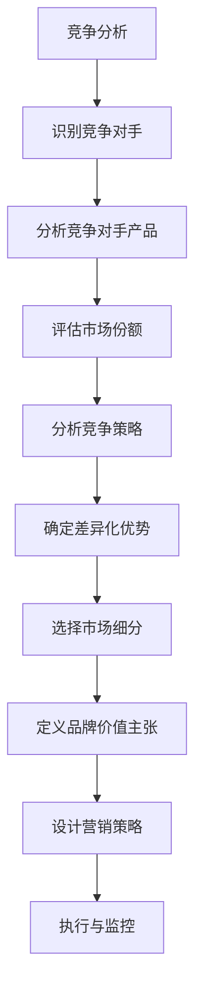

**2.2.3 确定品牌价值主张**

品牌价值主张（Value Proposition）是企业向客户传达的核心价值，它是市场定位的核心。以下是如何确定品牌价值主张的步骤：

1. **明确核心价值**：从产品或服务的特点中提炼出最核心的价值点，如高品质、创新、便捷等。

2. **客户需求匹配**：分析目标客户群体的需求，确保品牌价值主张与客户需求相匹配。

3. **差异化定位**：确保品牌价值主张与竞争对手有所不同，形成差异化优势。

4. **简洁明了**：品牌价值主张应简洁明了，容易理解和记忆，以便在客户心中形成鲜明印象。

以下是一个品牌价值主张示例：

**品牌价值主张：**
"我们致力于提供高品质、创新的互联网产品，为追求卓越的用户带来极致的使用体验。"

通过以上步骤，一人公司可以明确自己的市场定位和品牌价值主张，从而在激烈的市场竞争中找到自己的立足点，吸引目标客户。

### 2.3 利用数字营销手段获取客户

在当今数字化时代，数字营销已成为企业获取客户的重要手段。对于一人公司而言，利用数字营销手段不仅可以扩大市场影响力，还能精准触达目标客户。以下将详细探讨三种主要的数字营销手段：内容营销、社交媒体营销和搜索引擎优化（SEO）。

**2.3.1 内容营销策略**

内容营销是一种通过创造和分发有价值的内容来吸引潜在客户、建立品牌认知并促进销售的方法。以下是实施内容营销的步骤：

1. **内容规划**：首先，制定内容战略，确定内容主题、发布频率和渠道。内容主题应围绕目标客户的需求和兴趣展开。

2. **内容创作**：根据内容规划，创作高质量的内容，包括文章、视频、图片、图表等。内容创作应注重原创性、实用性和趣味性。

3. **内容发布**：选择合适的发布平台，如博客、社交媒体、YouTube等，确保内容能够触达目标客户。

4. **内容优化**：定期分析内容的表现，包括阅读量、分享量、评论等，优化内容策略，提高内容质量。

5. **内容推广**：利用社交媒体、邮件营销等手段，推广优质内容，增加曝光度和传播范围。

**示例：**

假设一人公司是一家专注于提供智能家居解决方案的公司，以下是一个内容营销策略示例：

- **内容主题**：智能家居、智能家居产品评测、智能家居应用场景等。
- **发布频率**：每周发布一篇原创文章。
- **发布平台**：公司博客、微信公众号、LinkedIn等。
- **内容优化**：通过关键词分析和数据反馈，不断优化内容质量和标题。

**2.3.2 社交媒体营销**

社交媒体营销是一种通过社交媒体平台（如Facebook、Instagram、Twitter、LinkedIn等）与客户互动、推广品牌和产品的方法。以下是实施社交媒体营销的步骤：

1. **选择社交媒体平台**：根据目标客户的特点和社交媒体使用习惯，选择合适的平台进行营销。

2. **建立官方账号**：在选择的社交媒体平台上建立官方账号，确保账号名称简洁、易于记忆。

3. **内容发布**：定期发布与品牌和产品相关的有趣内容，包括图文、视频、活动等，保持活跃度。

4. **互动与参与**：积极与客户互动，回复评论、参与话题讨论，建立良好的客户关系。

5. **广告投放**：利用社交媒体的广告系统，进行有针对性的广告投放，扩大品牌影响力。

**示例：**

假设一人公司是一家提供健康营养食品的公司，以下是一个社交媒体营销策略示例：

- **选择平台**：Facebook、Instagram、LinkedIn。
- **内容发布**：每周发布三篇健康营养相关的图文或视频内容，每天进行互动回复。
- **广告投放**：在Facebook上投放定向广告，针对有健康意识的人群进行推广。

**2.3.3 搜索引擎优化（SEO）**

搜索引擎优化是一种通过优化网站内容和结构，提高网站在搜索引擎结果页面（SERP）中的排名，从而增加流量和潜在客户的方法。以下是实施SEO的步骤：

1. **关键词研究**：确定与产品或服务相关的关键词，分析关键词的搜索量、竞争程度和潜在客户需求。

2. **网站结构优化**：优化网站的结构和导航，确保搜索引擎能够正确索引网站内容。

3. **内容优化**：针对关键词优化网站页面内容，提高页面质量和相关性。

4. **外部链接建设**：通过创建高质量的网站内容，吸引其他网站链接到自己的网站，提高网站的权威性和搜索引擎排名。

5. **网站速度优化**：提高网站加载速度，减少页面跳出率。

**示例：**

假设一人公司是一家提供编程教育服务的公司，以下是一个SEO策略示例：

- **关键词研究**：确定关键词如“编程教育”、“在线编程课程”、“编程学习资源”等。
- **网站结构优化**：建立清晰明了的网站结构，确保搜索引擎能够顺利索引。
- **内容优化**：在每个课程页面中使用目标关键词，优化页面标题、描述和内容。
- **外部链接建设**：通过发布高质量的内容，吸引其他网站链接到公司网站。
- **网站速度优化**：优化网站代码，提高网站加载速度。

通过以上三种数字营销手段，一人公司可以有效提升品牌知名度，吸引潜在客户，实现客户获取的目标。

### 2.4 利用传统营销手段获取客户

尽管数字营销在现代营销策略中占据了重要地位，但传统营销手段依然是一人公司获取客户的重要工具。传统营销手段包括展会与活动的策划与参与、线下广告投放以及公关活动策划等。以下将详细探讨这些传统营销手段的具体实施方法。

**2.4.1 展会与活动的策划与参与**

展会与活动是展示产品、拓展客户的重要平台。以下是策划与参与展会和活动的步骤：

1. **选择合适的展会**：根据目标市场和客户特点，选择有针对性的展会。可以考虑展会的历史、规模、参展企业类型等因素。

2. **策划参展活动**：设计参展方案，包括展台设计、展示内容、活动安排等。确保展台设计能够吸引参观者，展示内容能够突出产品优势和特点。

3. **邀请目标客户**：通过邮件、电话、社交媒体等方式邀请目标客户参观展会，提高参展效果。

4. **参与互动环节**：在展会上设置互动环节，如产品演示、现场体验、抽奖活动等，增加客户参与度。

5. **后续跟进**：展会结束后，及时跟进潜在客户，提供详细的产品信息和解决方案，促成交易。

**示例：**

假设一人公司是一家提供环保科技解决方案的公司，以下是一个展会参与策略示例：

- **选择展会**：选择专注于环保科技行业的国际展会。
- **策划参展活动**：设计一个互动性强的展台，展示公司的环保科技产品，安排产品演示和现场咨询。
- **邀请目标客户**：通过邮件和电话邀请全球环保科技行业的潜在客户。
- **参与互动环节**：设置产品演示和现场问答环节，提高客户参与度。
- **后续跟进**：展会结束后，通过邮件和电话跟进潜在客户，提供详细的产品信息和解决方案。

**2.4.2 线下广告投放**

线下广告投放包括报纸、杂志、户外广告、电视等传统媒体广告。以下是线下广告投放的步骤：

1. **确定广告目标**：明确广告投放的目标，如提高品牌知名度、增加销售量等。

2. **选择广告媒体**：根据目标受众的特点和广告预算，选择合适的广告媒体。例如，针对年轻人群体可以选择社交媒体广告，而针对商务人士可以选择报纸和杂志广告。

3. **设计广告内容**：设计吸引人的广告内容，包括广告标题、文案、图片等。确保广告内容能够传达品牌价值主张和产品优势。

4. **制定广告计划**：制定详细的广告投放计划，包括广告发布时间、投放频率、投放地点等。

5. **监测广告效果**：通过问卷调查、电话回访等方式，监测广告效果，及时调整广告策略。

**示例：**

假设一人公司是一家提供定制化商务礼品的公司，以下是一个线下广告投放策略示例：

- **确定广告目标**：提高品牌知名度和增加销售量。
- **选择广告媒体**：选择目标客户常读的商务杂志和高端写字楼户外广告。
- **设计广告内容**：设计一张精美的商务礼品广告，突出公司的定制化服务和质量优势。
- **制定广告计划**：每月投放两次广告，分别在杂志和户外广告上发布。
- **监测广告效果**：通过电话回访和邮件调查，了解广告的投放效果，并根据反馈调整广告内容。

**2.4.3 公关活动策划**

公关活动策划是一种通过媒体宣传和社交互动来提高品牌形象和知名度的方法。以下是公关活动策划的步骤：

1. **确定公关目标**：明确公关活动的目标，如提高品牌知名度、塑造品牌形象、推广新产品等。

2. **选择公关形式**：根据公关目标，选择合适的公关形式，如新闻发布会、产品发布会、公益活动等。

3. **策划活动内容**：设计活动内容，包括活动主题、嘉宾邀请、现场布置等。

4. **媒体宣传**：通过邀请媒体采访、发布新闻稿、社交媒体推广等方式，扩大活动的影响力。

5. **现场执行**：确保活动现场的顺利进行，提供高质量的服务和体验。

6. **活动总结**：活动结束后，总结活动效果，收集反馈，为后续公关活动提供参考。

**示例：**

假设一人公司是一家提供智能安防解决方案的公司，以下是一个公关活动策划策略示例：

- **确定公关目标**：提高品牌知名度和塑造行业领导者的形象。
- **选择公关形式**：举办一场智能安防解决方案产品发布会。
- **策划活动内容**：确定活动主题为“智能安防，守护未来”，邀请行业专家和潜在客户参加。
- **媒体宣传**：发布新闻稿，邀请媒体进行现场报道，通过社交媒体推广活动。
- **现场执行**：准备专业的演讲嘉宾和展示区，提供丰富的互动体验。
- **活动总结**：收集参与者反馈，分析活动效果，总结经验教训。

通过以上传统营销手段，一人公司可以在数字营销的基础上，进一步扩大市场影响力，吸引更多潜在客户。

### 2.5 客户开发与拓展

在客户获取策略中，除了获取新客户，客户开发与拓展同样至关重要。有效开发与拓展客户不仅有助于提高市场份额，还能提升客户生命周期价值。以下将详细探讨客户开发与拓展的步骤和策略。

**2.5.1 开发潜在客户**

开发潜在客户是客户获取与拓展的基础。以下是开发潜在客户的步骤：

1. **数据收集**：通过多种渠道收集潜在客户的数据，包括社交媒体、展会、市场调研等。

2. **筛选目标客户**：根据目标客户特征和需求，筛选出有潜在购买意愿的客户。

3. **数据分析**：对潜在客户进行数据分析，包括人口统计特征、行为特征、需求特征等。

4. **分类管理**：将潜在客户进行分类管理，根据不同的客户特征制定个性化的开发策略。

5. **客户开发**：针对不同类型的潜在客户，采用电话沟通、邮件跟进、线上互动等方式进行开发。

**示例：**

假设一人公司是一家提供健康营养食品的公司，以下是一个开发潜在客户的策略示例：

- **数据收集**：通过网站注册、问卷调查、社交媒体互动等方式收集潜在客户数据。
- **筛选目标客户**：根据年龄、收入、健康需求等特征筛选出潜在客户。
- **数据分析**：分析潜在客户的购买习惯和偏好，了解他们的健康需求。
- **分类管理**：将潜在客户分为不同类别，如年轻人群、中年人群、老年人群体。
- **客户开发**：通过邮件和电话联系潜在客户，介绍健康营养食品产品，提供定制化的健康解决方案。

**2.5.2 建立客户关系**

建立良好的客户关系是客户开发与拓展的重要环节。以下是建立客户关系的步骤：

1. **初次接触**：在客户开发过程中，通过电话、邮件、社交媒体等渠道与潜在客户建立初次接触。

2. **了解需求**：通过与客户的沟通，了解他们的具体需求和痛点，提供个性化的解决方案。

3. **提供价值**：通过提供优质的产品和服务，满足客户的需求，建立信任关系。

4. **持续互动**：定期与客户保持联系，提供最新的产品信息、行业动态等，增强客户黏性。

5. **客户反馈**：积极收集客户反馈，了解他们的意见和建议，不断改进产品和服务。

**示例：**

假设一人公司是一家提供在线编程教育的公司，以下是一个建立客户关系的策略示例：

- **初次接触**：通过邮件和电话与潜在客户进行初次接触，介绍在线编程课程。
- **了解需求**：通过在线咨询和问卷调查，了解客户的学习需求和偏好。
- **提供价值**：根据客户的需求，提供个性化的课程推荐和定制化学习方案。
- **持续互动**：定期发送课程更新通知和行业动态，提供学习资源和技巧。
- **客户反馈**：通过课程反馈和问卷调查，了解客户的满意度，不断改进课程内容和服务质量。

**2.5.3 拓展客户来源**

拓展客户来源是客户开发与拓展的重要策略之一。以下是拓展客户来源的方法：

1. **多渠道营销**：利用多种营销手段，如数字营销、传统营销、口碑营销等，扩大客户来源。

2. **合作伙伴关系**：与相关行业的公司建立合作伙伴关系，通过资源共享和联合推广，拓展客户来源。

3. **行业活动**：积极参与行业活动和展会，通过现场展示和互动，吸引潜在客户。

4. **客户推荐**：通过提供优质的产品和服务，鼓励现有客户推荐新客户，实现客户来源的拓展。

5. **数据分析和挖掘**：利用大数据分析和挖掘技术，分析潜在客户的特征和行为，寻找新的客户来源。

**示例：**

假设一人公司是一家提供专业咨询服务的企业，以下是一个拓展客户来源的策略示例：

- **多渠道营销**：通过数字营销手段（如搜索引擎优化、社交媒体营销等）和传统营销手段（如线下广告投放、公关活动等）扩大品牌影响力，吸引潜在客户。
- **合作伙伴关系**：与同行业的其他企业建立合作关系，通过联合培训和资源共享，拓展客户来源。
- **行业活动**：参与行业论坛、研讨会等活动，通过现场展示和专业演讲，吸引潜在客户。
- **客户推荐**：提供优质咨询服务，鼓励现有客户推荐新客户，通过推荐奖励计划激励客户推荐。
- **数据分析和挖掘**：通过数据分析，了解潜在客户的特征和行为，针对性地进行营销活动，提高客户获取效率。

通过以上策略，一人公司可以有效开发与拓展客户，实现业务增长和市场扩张。

### 3.1 客户关系管理

客户关系管理（Customer Relationship Management，CRM）是一种通过策略和工具来管理企业与客户之间关系的方法。对于一人公司而言，有效的客户关系管理不仅能够提升客户满意度，还能增强客户忠诚度和企业竞争力。以下将详细探讨客户关系管理的定义、原则和工具。

**3.1.1 客户关系管理的定义**

客户关系管理是一种综合性的商业策略，旨在通过理解和管理与客户之间的关系，提高客户满意度和忠诚度，从而实现企业的长期发展。具体来说，客户关系管理包括以下几方面：

1. **客户获取**：通过营销策略和手段吸引新客户。
2. **客户保留**：通过提供优质的产品和服务，保持客户长期关系。
3. **客户拓展**：通过客户关系管理，挖掘现有客户的潜在需求，实现业务的拓展。
4. **客户体验**：通过持续改进产品和服务，提升客户的整体体验。

**3.1.2 客户关系管理的原则**

成功的客户关系管理应遵循以下原则：

1. **以客户为中心**：将客户需求放在首位，确保所有业务活动围绕客户展开。
2. **持续沟通**：与客户保持高频次的沟通，及时了解他们的反馈和需求，建立信任关系。
3. **个性化服务**：根据客户的不同需求和偏好，提供个性化的产品和服务。
4. **数据驱动**：利用数据分析和挖掘，准确把握客户特征和需求，优化客户管理策略。
5. **持续改进**：不断改进产品和服务，提升客户满意度，保持竞争优势。

**3.1.3 客户关系管理的工具**

有效的客户关系管理需要借助工具来提升效率和管理水平。以下是一些常用的客户关系管理工具：

1. **客户关系管理软件**：如Salesforce、HubSpot等，用于管理客户信息和销售活动。
2. **客户反馈系统**：如SurveyMonkey、Zoho Survey等，用于收集和分析客户反馈。
3. **社交媒体管理工具**：如Hootsuite、Buffer等，用于管理社交媒体账号和客户互动。
4. **客户服务系统**：如Zendesk、Freshdesk等，用于提供高质量的客户服务。

以下是一个简化的客户关系管理流程图：

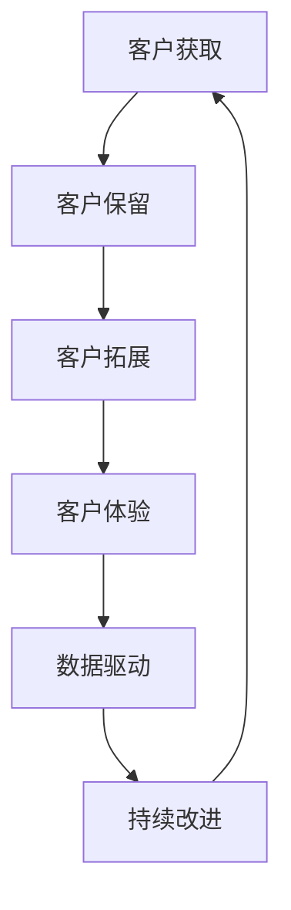

通过遵循客户关系管理的原则和使用相关工具，一人公司可以有效提升客户满意度和忠诚度，实现业务的可持续发展。

### 3.2 提供卓越的客户服务

提供卓越的客户服务是提升客户满意度和忠诚度的关键。对于一人公司而言，高效、专业的客户服务不仅能够解决客户问题，还能增强品牌形象，促进客户保留和复购。以下将详细探讨客户服务的重要性、策略以及客户投诉处理与解决的方法。

**3.2.1 客户服务的重要性**

客户服务在企业的运营中扮演着至关重要的角色：

1. **提升客户满意度**：优质的客户服务能够满足客户的需求，提高客户满意度，增强客户对企业的信任。
2. **增强客户忠诚度**：通过提供持续、专业的服务，客户会感到被重视，从而提高忠诚度，降低流失率。
3. **促进口碑传播**：满意的客户会通过口碑推荐，为企业带来更多的新客户，扩大品牌影响力。
4. **提升企业形象**：高效的客户服务能够展现企业的专业性和责任感，提升整体企业形象。
5. **降低运营成本**：通过高效的客户服务，减少客户投诉和问题解决的时间，降低运营成本。

**3.2.2 客户服务策略**

要提供卓越的客户服务，一人公司需要制定并实施一系列策略：

1. **培训员工**：确保所有客户服务人员都具备良好的沟通技巧、专业知识和服务意识，能够快速有效地解决客户问题。
2. **建立服务标准**：制定明确的客户服务标准，包括响应时间、处理流程、服务质量等，确保客户服务的一致性和高效性。
3. **多渠道服务**：提供多种客户服务渠道，如电话、邮件、在线聊天、社交媒体等，方便客户选择最便捷的沟通方式。
4. **个性化服务**：根据客户的需求和偏好，提供个性化的服务体验，增强客户的满意度和忠诚度。
5. **快速响应**：建立快速响应机制，确保客户问题能够在最短时间内得到解决，减少客户等待时间。

以下是一个简化的客户服务策略流程图：

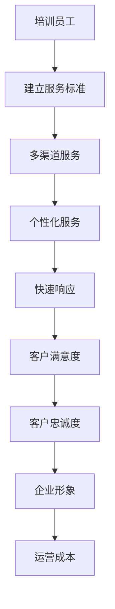

**3.2.3 客户投诉处理与解决**

客户投诉是客户服务中的重要环节，有效的投诉处理能够化解矛盾，提升客户满意度。以下是处理客户投诉的步骤：

1. **接受投诉**：建立投诉渠道，确保客户能够方便地提交投诉，并提供详细的投诉信息和反馈。
2. **初步回应**：在接到投诉后，及时向客户表示感谢，并告知投诉处理的时间表。
3. **调查问题**：详细调查投诉问题，了解事实真相，确定问题根源。
4. **解决方案**：根据问题的严重性和影响，制定合适的解决方案，如退款、补偿、产品更换等。
5. **实施解决**：将解决方案告知客户，并立即执行，确保问题得到及时解决。
6. **反馈与改进**：在问题解决后，向客户反馈处理结果，并收集客户反馈，持续改进服务质量。

以下是一个简化的客户投诉处理流程图：

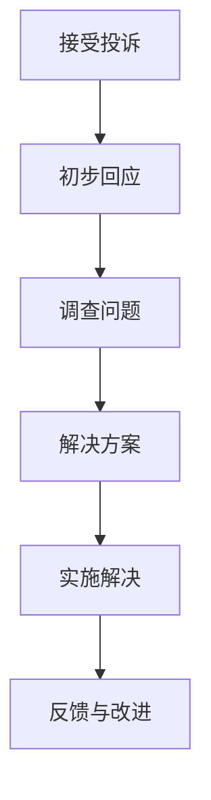

通过以上策略和方法，一人公司可以提供卓越的客户服务，提升客户满意度和忠诚度，促进企业的长期发展。

### 3.3 保持与客户的持续沟通

与客户的持续沟通是维护长期客户关系的重要手段。通过有效的沟通，企业可以及时了解客户需求，解决客户问题，增强客户满意度，从而提高客户忠诚度。以下将详细探讨定期沟通的重要性、沟通方式的选择以及沟通内容的规划。

**3.3.1 定期沟通的重要性**

定期沟通在客户关系管理中具有以下重要性：

1. **了解需求**：通过定期沟通，企业可以了解客户的最新需求，及时调整产品和服务策略，确保满足客户期望。
2. **增强关系**：定期沟通有助于企业与客户建立良好的关系，增强信任感和亲近感，减少客户流失。
3. **发现潜在问题**：定期沟通可以帮助企业及时发现潜在问题，提前采取措施，避免问题恶化。
4. **提升满意度**：通过持续沟通，客户感受到被重视和关心，从而提升满意度，增强忠诚度。
5. **获取反馈**：定期沟通是获取客户反馈的重要途径，通过了解客户的意见和建议，企业可以不断改进产品和服务。

**3.3.2 沟通方式的选择**

根据客户的特点和企业资源，选择合适的沟通方式，可以更有效地传达信息，提高沟通效果。以下是几种常见的沟通方式：

1. **电话沟通**：电话沟通能够实时交流，快速解决问题，适合紧急情况或需要详细沟通的场合。
2. **电子邮件**：电子邮件是一种正式、详细的沟通方式，适合发送报告、通知和重要信息。
3. **在线聊天**：在线聊天是一种便捷、实时的沟通方式，适合快速解答客户疑问或提供即时帮助。
4. **社交媒体**：社交媒体提供了多种沟通渠道，如微信、QQ、Facebook等，适合与年轻客户群体进行互动。
5. **面对面会议**：面对面会议能够建立深厚的人际关系，适合关键决策或深度沟通的场合。

以下是一个简化的沟通方式选择流程图：

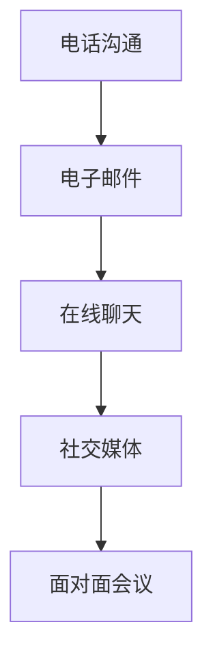

**3.3.3 沟通内容的规划**

为了确保沟通的有效性，需要提前规划沟通内容。以下是规划沟通内容的步骤：

1. **确定沟通目的**：明确每次沟通的目的，如了解需求、解决投诉、推广新产品等。
2. **准备沟通材料**：根据沟通目的，准备相关资料，如报告、演示稿、案例等。
3. **设计沟通流程**：规划沟通的流程和步骤，确保沟通顺利进行。
4. **选择合适的时机**：根据客户的时间安排，选择合适的沟通时机，避免打扰客户。
5. **跟进沟通结果**：沟通结束后，及时跟进沟通结果，确保问题得到解决，或了解客户对沟通的反馈。

以下是一个简化的沟通内容规划流程图：

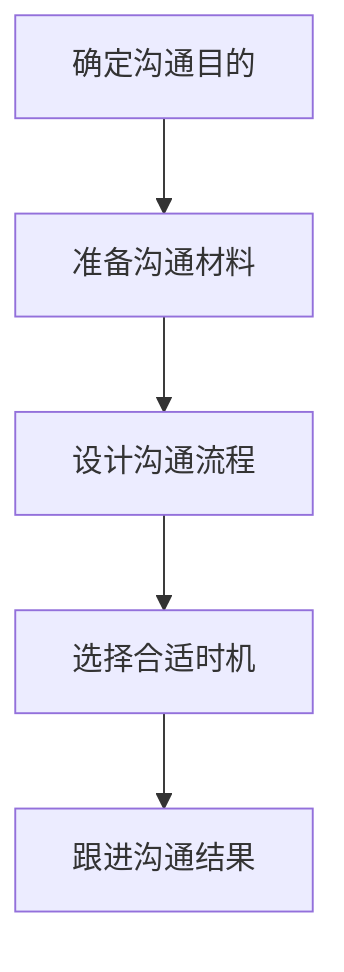

通过以上方法，一人公司可以保持与客户的持续沟通，提升客户满意度和忠诚度，实现业务的长期发展。

### 3.4 提供个性化客户体验

在竞争激烈的市场环境中，提供个性化客户体验已经成为企业赢得客户忠诚度和提升市场份额的关键策略。个性化客户体验不仅能够满足客户的特定需求，还能增强客户对品牌的认同感和归属感。以下将详细探讨个性化客户体验的定义、实现方法及其价值。

**3.4.1 个性化客户体验的定义**

个性化客户体验是指根据客户的个性化需求和偏好，为其提供定制化的产品、服务和互动体验。这种体验旨在确保每个客户都能感受到被关注和重视，从而提升整体满意度和忠诚度。以下是个性化客户体验的几个核心要素：

1. **了解客户**：深入挖掘客户的需求、兴趣、行为和偏好，为个性化服务提供基础。
2. **个性化推荐**：根据客户的购买历史、浏览行为等数据，提供个性化的产品推荐和解决方案。
3. **定制化服务**：根据客户的特定需求，提供定制化的产品和服务，满足客户的个性化需求。
4. **持续改进**：通过不断收集和分析客户反馈，持续优化客户体验，确保服务始终符合客户期望。

**3.4.2 个性化客户体验的实现方法**

要实现个性化客户体验，一人公司可以采取以下方法：

1. **数据收集与挖掘**：通过多种渠道收集客户数据，如购买记录、浏览行为、社交媒体互动等，利用数据挖掘技术分析客户特征和需求，为个性化服务提供数据支持。
2. **客户画像构建**：基于客户数据，构建详细的客户画像，包括人口统计特征、行为特征、需求特征等，为个性化服务提供参考。
3. **个性化推荐系统**：利用机器学习算法，构建个性化推荐系统，根据客户的兴趣和行为，自动推荐相关产品和服务。
4. **定制化产品与服务**：根据客户的特定需求，提供定制化的产品和服务，如定制化礼品、个性化营销活动等。
5. **交互设计优化**：优化用户界面和交互设计，使客户在使用过程中感受到便捷和舒适，提升整体体验。

以下是一个简化的个性化客户体验实现流程图：

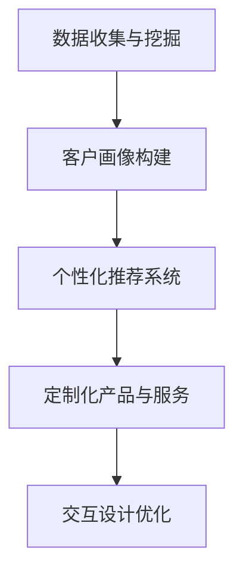

**3.4.3 个性化客户体验的价值**

个性化客户体验具有多重价值，对于一人公司而言，具体体现在以下几个方面：

1. **提高客户满意度**：通过提供个性化的产品和服务，满足客户的特定需求，提升客户满意度。
2. **增强客户忠诚度**：个性化的客户体验能够增强客户对品牌的认同感和归属感，从而提高忠诚度，减少流失率。
3. **提升品牌形象**：个性化服务展现了企业的专业性和关怀，有助于提升品牌形象和市场份额。
4. **增加交叉销售和复购率**：通过个性化推荐和定制化服务，增加客户的购买频率和金额，提升交叉销售和复购率。
5. **优化资源配置**：通过数据分析和个性化推荐，优化资源配置，提高运营效率，降低成本。

以下是一个简化的个性化客户体验价值流程图：

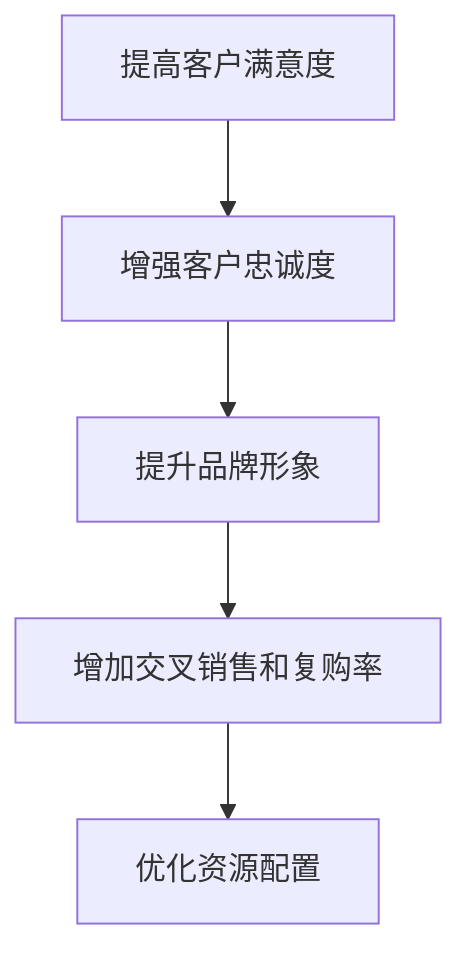

通过提供个性化客户体验，一人公司可以更好地满足客户需求，提升客户满意度和忠诚度，从而实现业务的持续增长和成功。

### 3.5 维护长期客户关系

维护长期客户关系是企业可持续发展的重要策略之一。对于一人公司而言，建立和维护良好的长期客户关系不仅能提高客户忠诚度，还能为企业带来稳定的市场收入。以下将详细探讨客户生命周期管理、建立忠诚客户计划以及保持与老客户的联系的方法。

**3.5.1 客户生命周期管理**

客户生命周期管理是一种通过系统性地跟踪和管理客户关系，从客户获取到客户流失的全过程管理方法。以下是客户生命周期管理的几个关键阶段：

1. **获取阶段**：在客户获取阶段，企业需要通过市场推广、品牌宣传和客户开发策略吸引潜在客户。

2. **互动阶段**：在客户互动阶段，企业需要通过有效的沟通和个性化服务，与客户建立良好的关系，提升客户满意度。

3. **保留阶段**：在客户保留阶段，企业需要通过持续提供优质的产品和服务，保持客户长期关系，减少客户流失。

4. **拓展阶段**：在客户拓展阶段，企业需要通过挖掘客户潜在需求和提供增值服务，实现客户的二次销售和业务拓展。

5. **流失阶段**：在客户流失阶段，企业需要通过有效的客户挽回策略，尽量减少客户流失，并从中吸取教训，优化客户管理。

以下是一个简化的客户生命周期管理流程图：

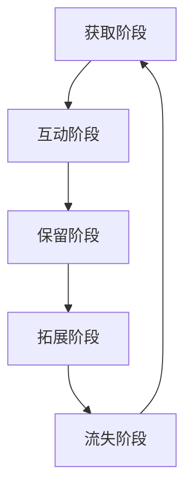

**3.5.2 建立忠诚客户计划**

建立忠诚客户计划是企业维持客户关系、增强客户忠诚度的重要手段。以下是建立忠诚客户计划的几个关键步骤：

1. **确定目标客户**：根据客户生命周期管理和客户价值评估，确定哪些客户是企业需要重点维护的忠诚客户。

2. **设计奖励机制**：设计具有吸引力的奖励机制，如积分兑换、折扣优惠、会员专享活动等，以激励客户保持长期购买。

3. **个性化服务**：提供个性化的产品推荐、定制化服务和专属优惠，使忠诚客户感受到企业的重视和关怀。

4. **沟通互动**：通过定期沟通、节日问候、生日祝福等方式，与忠诚客户保持密切联系，增强客户黏性。

5. **数据分析**：利用客户数据分析忠诚客户的行为特征和需求，不断优化忠诚客户计划，提升客户满意度。

以下是一个简化的忠诚客户计划流程图：

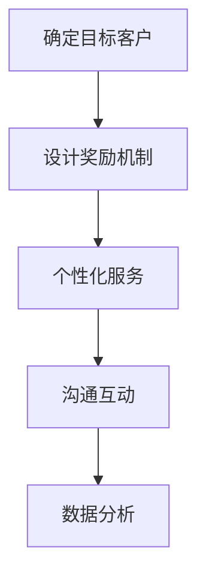

**3.5.3 保持与老客户的联系

保持与老客户的联系是维护长期客户关系的关键。以下是一些有效的方法：

1. **定期回访**：定期与老客户进行电话、邮件或面对面回访，了解他们的需求和满意度，及时解决潜在问题。

2. **提供专属优惠**：为老客户提供专属优惠，如折扣券、礼品卡等，激励他们继续购买。

3. **邀请参加活动**：邀请老客户参加企业举办的各类活动，如产品发布会、线下讲座等，增加互动机会。

4. **个性化沟通**：根据老客户的喜好和需求，发送个性化的营销信息和活动邀请，提高沟通效果。

5. **客户关系管理工具**：利用客户关系管理（CRM）系统，记录和管理老客户的信息，实现自动化、个性化的客户服务。

以下是一个简化的保持与老客户联系流程图：

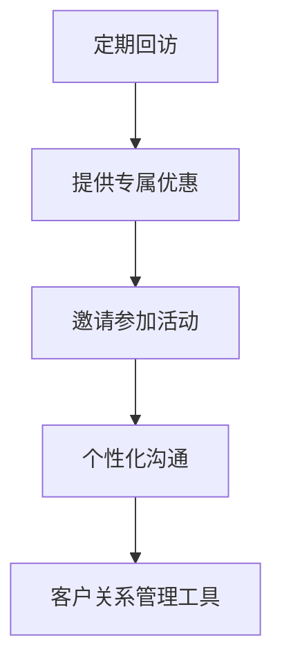

通过以上方法，一人公司可以有效地维护长期客户关系，提高客户满意度和忠诚度，实现业务的持续增长。

### 4.1 成功案例分析

在客户获取与维护策略的实践中，许多一人公司通过成功的案例实现了业务的增长和市场的扩张。以下将介绍几个成功案例，分析其策略和方法，为读者提供有益的启示。

**4.1.1 案例一：小公司的客户获取与维护策略**

**公司背景**：某一人公司是一家专注于提供定制化健康营养食品的初创企业。公司通过创新的产品和优质的服务，在短时间内获得了市场的认可。

**成功策略**：

1. **目标客户群体定位**：公司首先明确了目标客户群体，即注重健康生活的中高收入人群。

2. **个性化客户体验**：通过详细的客户调查和数据分析，公司为每位客户提供定制化的营养方案，确保产品和服务满足客户的个性化需求。

3. **内容营销**：公司定期发布健康营养相关的原创内容，如健康食谱、营养知识等，通过网站和社交媒体平台进行传播，吸引了大量关注。

4. **客户关系管理**：公司采用CRM系统，记录和管理每位客户的信息，定期进行电话回访和邮件沟通，保持与客户的持续联系。

**结果**：通过上述策略，公司在短时间内积累了大量忠实客户，销售额持续增长，市场份额逐步扩大。

**启示**：成功的关键在于精准定位目标客户群体，提供个性化的客户体验，并利用内容营销和客户关系管理工具保持与客户的紧密联系。

**4.1.2 案例二：通过数字化手段提升客户满意度**

**公司背景**：某一人公司是一家提供专业编程教育的在线平台。公司通过创新的在线教学方式和高效的客户服务，在竞争激烈的市场中脱颖而出。

**成功策略**：

1. **数字化营销**：公司利用搜索引擎优化（SEO）、社交媒体营销和电子邮件营销等数字化手段，提高了品牌知名度和客户获取量。

2. **个性化推荐**：公司通过分析学员的学习数据，提供个性化的课程推荐，提高了学员的学习效率和满意度。

3. **在线互动**：公司提供实时在线聊天和视频会议功能，使学员能够随时随地向教师提问和获得帮助。

4. **客户反馈系统**：公司建立了完善的客户反馈系统，及时收集学员的反馈和建议，不断优化教学和服务质量。

**结果**：通过数字化手段的提升，公司的客户满意度显著提高，学员数量和收入稳步增长。

**启示**：数字化手段在提升客户满意度方面具有重要作用，个性化推荐和在线互动能够显著提高学习体验和客户满意度。

**4.1.3 案例三：个性化营销策略的成功应用**

**公司背景**：某一人公司是一家提供高端定制化商务礼品的公司。公司通过独特的营销策略和卓越的服务，在短时间内建立了品牌知名度和市场地位。

**成功策略**：

1. **个性化营销**：公司根据客户的特定需求和偏好，提供定制化的商务礼品解决方案，使客户感受到个性化的关怀。

2. **社交媒体互动**：公司在社交媒体平台上发布与商务礼品相关的创意内容，吸引潜在客户，并通过互动增加客户黏性。

3. **线上线下结合**：公司不仅在线上提供个性化定制服务，还在线下举办商务礼品展览和活动，拓展客户渠道。

4. **优质售后服务**：公司提供优质的售后服务，包括礼品更换、维护保养等，增强了客户的信任和忠诚度。

**结果**：通过个性化营销策略的应用，公司成功吸引了大量高端客户，销售额持续增长，品牌形象不断提升。

**启示**：个性化营销策略能够显著提升客户满意度和忠诚度，线上线下结合和优质售后服务有助于巩固客户关系。

通过以上成功案例分析，一人公司可以借鉴这些案例中的策略和方法，结合自身实际情况，制定和优化客户获取与维护策略，实现业务的持续增长和市场扩张。

### 4.2 失败案例分析

在客户获取与维护策略的实践中，失败案例同样具有重要的教育和启示作用。通过分析失败的原因和教训，一人公司可以避免重蹈覆辙，提升自身的运营效率和客户管理能力。以下将介绍几个失败案例，并从中提取关键教训。

**4.2.1 案例一：缺乏客户关系管理的失败案例**

**公司背景**：某一人公司是一家提供信息技术咨询服务的初创企业。公司在初期取得了较好的市场反响，但不久后客户流失率迅速上升。

**失败原因**：

1. **忽视客户关系管理**：公司在业务扩张过程中，忽视了客户关系管理的重要性，没有建立起有效的客户档案和沟通机制。

2. **服务质量不稳定**：由于缺乏规范的客户服务流程，公司无法保证服务的质量和一致性，导致客户满意度下降。

3. **缺乏持续沟通**：公司没有定期与客户沟通，了解客户需求和反馈，导致客户需求得不到及时满足。

**教训**：

- **建立客户关系管理体系**：企业应建立全面的客户关系管理体系，包括客户档案管理、定期回访、客户满意度调查等。
- **重视服务质量**：确保服务流程的规范化和标准化，提升服务质量和客户体验。
- **持续沟通**：定期与客户沟通，了解客户需求和反馈，及时调整产品和服务的策略。

**4.2.2 案例二：过度依赖单一营销手段的教训**

**公司背景**：某一人公司是一家销售高端家居装饰品的企业。公司主要依靠线下广告投放进行市场推广。

**失败原因**：

1. **营销渠道单一**：公司过度依赖线下广告投放，忽视了其他有效的营销手段，如数字营销、公关活动等。

2. **客户获取效率低**：由于广告投放的覆盖范围有限，公司无法有效触达目标客户，导致客户获取效率低下。

3. **营销预算不足**：公司缺乏足够的营销预算，无法在多个渠道上进行有效投放，导致市场推广效果不佳。

**教训**：

- **多元化营销渠道**：企业应多元化营销渠道，结合线上线下资源，提高市场覆盖率和客户获取效率。
- **优化营销预算分配**：合理分配营销预算，确保在不同渠道上实现均衡投入。
- **结合数字营销手段**：利用搜索引擎优化（SEO）、社交媒体营销、内容营销等数字手段，提升品牌影响力和客户获取能力。

**4.2.3 案例三：忽视客户体验导致的客户流失**

**公司背景**：某一人公司是一家提供在线教育服务的平台。公司在初期获得了大量用户，但后续用户流失严重。

**失败原因**：

1. **忽视用户体验**：公司在产品设计和服务流程上缺乏对用户体验的关注，导致用户在使用过程中遇到诸多不便。

2. **客户反馈不重视**：公司未能及时收集和分析用户反馈，对用户提出的问题和改进建议重视不够，导致用户满意度下降。

3. **服务质量不稳定**：由于缺乏有效的质量控制机制，公司在教学质量和客户服务方面存在问题，导致用户流失。

**教训**：

- **注重用户体验**：在产品设计和服务流程上，应注重用户体验，确保用户在使用过程中感受到便捷和舒适。
- **重视客户反馈**：建立有效的客户反馈系统，及时收集和分析用户反馈，不断优化产品和服务的质量。
- **建立质量控制机制**：确保教学质量和客户服务的稳定性，提升整体用户体验。

通过以上失败案例分析，一人公司应从中吸取教训，重视客户关系管理、多元化营销手段和用户体验，以避免重蹈覆辙，实现业务的可持续发展。

### 5.1 客户获取与维护策略总结

本文通过对一人公司客户获取与维护策略的深入探讨，总结出了一套系统、实用且具有前瞻性的策略。以下是核心要点的概括：

1. **精准定位目标客户群体**：明确目标客户群体的特征和需求，确保营销策略的精准性和有效性。
2. **制定有效的市场定位**：通过竞争分析和差异化优势，制定清晰的市场定位和品牌价值主张。
3. **多元化营销手段**：结合数字营销和传统营销手段，实现全方位的市场覆盖和客户触达。
4. **个性化客户体验**：通过数据分析和个性化服务，提供定制化的产品和服务，提升客户满意度。
5. **客户关系管理**：建立客户关系管理体系，确保客户需求得到及时满足，提升客户忠诚度。
6. **持续沟通与反馈**：定期与客户沟通，收集反馈，不断优化产品和服务，保持客户关系的活力。
7. **长期客户关系维护**：通过客户生命周期管理和忠诚客户计划，保持与老客户的联系，实现客户的长期价值。

这些策略的核心在于以客户为中心，通过精准定位、个性化服务、持续沟通等手段，全面提升客户满意度和忠诚度，从而实现业务的可持续发展。

### 5.2 未来发展趋势与挑战

在未来，客户获取与维护策略将面临新的发展趋势和挑战。以下是几个关键方面的分析和应对策略：

**1. 数字化转型的深化**

随着数字技术的不断发展，数字化转型将继续深化，企业需要不断提升数字化营销和客户服务能力。应对策略：

- **加强数据分析和挖掘能力**：利用大数据和人工智能技术，深入分析客户行为和需求，优化营销策略和客户服务。
- **提升数字化工具的使用**：采用先进的客户关系管理（CRM）系统和营销自动化工具，提高运营效率和客户体验。

**2. 个性化营销的普及**

个性化营销将成为未来营销策略的主流，企业需要更加注重客户数据的收集和分析，提供定制化的产品和服务。应对策略：

- **优化客户画像和细分策略**：通过不断更新和优化客户画像，确保营销策略的精准性和有效性。
- **增强个性化服务能力**：通过技术创新和流程优化，提升个性化服务的效率和质量。

**3. 社交媒体的影响力**

社交媒体将继续在客户获取与维护中发挥重要作用，企业需要充分利用社交媒体平台，提升品牌影响力和客户互动能力。应对策略：

- **加强社交媒体运营**：定期发布高质量的内容，与客户进行互动，提升品牌知名度和用户黏性。
- **利用社交媒体广告**：通过精准定位和优化广告投放，扩大品牌影响力，吸引潜在客户。

**4. 客户体验的全面提升**

客户体验将成为企业竞争的核心，企业需要不断优化客户体验，提升客户满意度和忠诚度。应对策略：

- **注重用户体验设计**：从用户角度出发，优化产品和服务设计，确保用户在使用过程中感受到便捷和舒适。
- **建立客户反馈机制**：及时收集和分析客户反馈，快速响应并解决问题，提升客户满意度。

**5. 持续创新的能力**

面对快速变化的市场环境，企业需要具备持续创新能力，不断推出新的产品和服务，满足客户不断变化的需求。应对策略：

- **加强研发投入**：持续投入研发资源，保持技术领先和市场竞争力。
- **鼓励创新文化**：营造创新氛围，鼓励员工提出创新想法和解决方案，推动企业持续创新。

通过以上分析和应对策略，一人公司可以更好地应对未来发展趋势和挑战，持续提升客户获取与维护能力，实现业务的可持续发展。

### 5.3 给读者的建议

为了有效运用本书中介绍的客户获取与维护策略，读者可以采取以下具体措施：

1. **深入了解目标客户**：定期进行市场调研和客户访谈，深入了解目标客户的需求、偏好和痛点，确保营销策略的精准性。

2. **制定个性化营销计划**：根据目标客户特征，制定个性化的营销计划，包括内容营销、社交媒体营销和个性化推荐等，提高营销效果。

3. **优化客户关系管理**：建立全面的客户关系管理体系，包括客户档案管理、定期回访、客户满意度调查等，确保客户需求得到及时满足。

4. **持续学习与改进**：关注行业动态和最佳实践，不断学习和吸收新的营销理念和技术，持续改进客户获取与维护策略。

5. **评估与优化策略**：定期评估营销策略的效果，根据数据反馈和客户反馈，优化营销策略，确保策略的有效性和适应性。

通过以上措施，读者可以更好地运用本书中的策略，提升客户获取与维护能力，实现业务的持续增长。

### 附录

#### 附录 A：客户获取与维护工具推荐

为了帮助读者更好地实施客户获取与维护策略，以下是一些常用的工具推荐：

**A.1 数字营销工具**

1. **内容营销工具**：
   - **HubSpot**：提供内容管理系统（CMS）和营销自动化工具。
   - **Hootsuite**：用于社交媒体管理和内容发布。

2. **SEO工具**：
   - **Ahrefs**：提供关键词研究、网站分析等SEO工具。
   - **SEMrush**：提供网站优化、竞争对手分析等SEO工具。

3. **电子邮件营销工具**：
   - **Mailchimp**：提供电子邮件营销平台和自动化工具。
   - **SendinBlue**：提供电子邮件营销和客户关系管理（CRM）工具。

**A.2 客户关系管理软件**

1. **Salesforce**：提供全面的客户关系管理（CRM）解决方案。
2. **HubSpot CRM**：免费提供客户管理、销售自动化和营销功能。
3. **Zoho CRM**：提供灵活的客户管理工具和可定制功能。

**A.3 社交媒体管理工具**

1. **Hootsuite**：用于管理多个社交媒体账号和发布内容。
2. **Buffer**：用于自动化社交媒体内容和日程安排。
3. **Sprout Social**：提供社交媒体分析和管理功能。

#### 附录 B：参考文献

为了提供更加深入和权威的知识，以下是一些参考文献：

1. **贝恩公司**：《2021年全球奢侈品市场报告》
2. **哈佛商学院**：《市场营销：策略、流程和工具》
3. **CRM权威指南**：《客户关系管理实践手册》
4. **数字营销机构**：《数字营销战略》
5. **市场营销协会**：《市场营销原则与实务》

#### 附录 C：Mermaid 流程图

以下是一些Mermaid流程图的示例，用于展示客户获取与维护的流程：

**C.1 客户获取流程图**

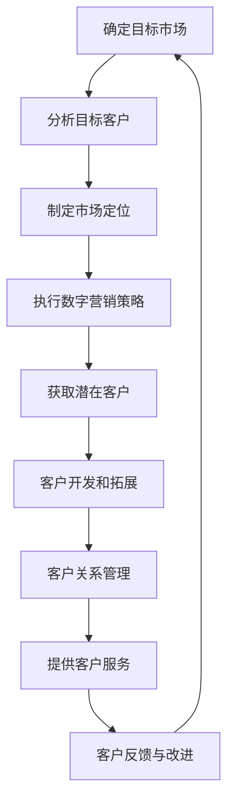

**C.2 客户维护流程图**

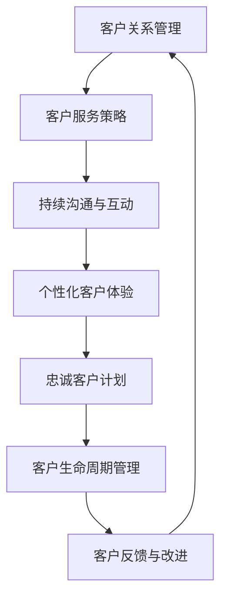

#### 附录 D：算法与数学模型

以下是一些用于客户获取与维护的算法与数学模型：

**D.1 客户获取算法伪代码**

```plaintext
function customer_acquisition_strategy(target_market, customer_data):
    1. Analyze market data to identify target segments
    2. Create customer personas based on customer data
    3. Develop personalized marketing campaigns for each segment
    4. Implement A/B testing to optimize campaign performance
    5. Track customer acquisition metrics (e.g., conversion rate, cost per acquisition)
    6. Continuously refine campaigns based on performance data
```

**D.2 客户维护数学模型解析**

$$
Customer\, Retention\, Rate = \frac{Number\, of\, retained\, customers}{Total\, number\, of\, customers} \times 100
$$

**D.3 客户价值模型**

$$
Customer\, Value = Customer\, Lifetime\, Value \times Customer\, Profit\, Margin
$$

其中，Customer Lifetime Value（客户生命周期价值）可以通过以下公式计算：

$$
Customer\, Lifetime\, Value = (Average\, Purchase\, Value \times Average\, Purchase\, Frequency \times Customer\, Retention\, Rate) - Customer\, Acquisition\, Cost
$$`

通过上述算法与数学模型，一人公司可以更科学地制定和优化客户获取与维护策略。

