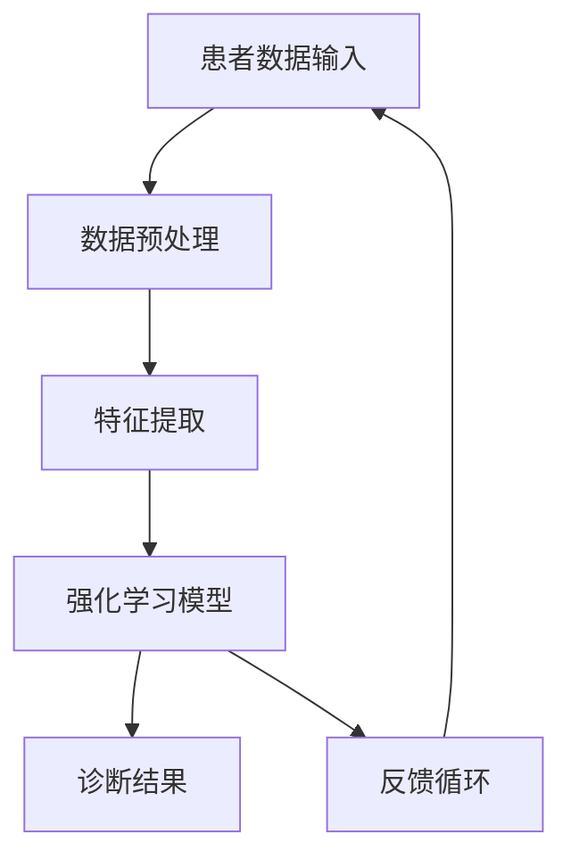

                 

# 《一切皆是映射：强化学习在医疗诊断中的应用：挑战与机遇》

## 关键词

强化学习，医疗诊断，图像识别，数据预处理，算法优化

## 摘要

随着医疗技术的发展，医疗诊断的准确性和效率越来越受到关注。强化学习作为机器学习的一种重要方法，已经在多个领域中展示了其强大的学习能力和适应性。本文将探讨强化学习在医疗诊断中的应用，包括其在医学图像分析、实验室诊断和个性化治疗等方面的优势与挑战。通过详细分析强化学习的基本概念、架构设计以及实际应用案例，本文旨在为相关研究人员和从业者提供有价值的参考。

### 第一部分：强化学习基础与医疗诊断的关联

#### 第1章：强化学习基本概念与原理

**1.1 强化学习的定义与历史背景**

强化学习（Reinforcement Learning，RL）是一种机器学习范式，其核心是使智能体在未知环境中通过互动学习达到最佳行为策略。在这一过程中，智能体通过接收环境反馈的奖励或惩罚信号来调整其行为，从而实现自我优化。

强化学习的历史可以追溯到20世纪50年代，阿兰·图灵（Alan Turing）提出了图灵测试，为人工智能的研究奠定了基础。随着时间的推移，强化学习逐渐发展成为机器学习领域的一个重要分支。

**1.2 强化学习的主要模型与算法**

强化学习模型主要包括马尔可夫决策过程（MDP）、部分可观测马尔可夫决策过程（POMDP）和深度强化学习（Deep Reinforcement Learning）。其中，MDP是最基础的模型，它假设环境完全可观测，智能体可以完全了解当前状态和下一状态之间的转移概率。

强化学习算法可以分为基于值函数的方法和基于策略的方法。基于值函数的方法包括Q学习（Q-Learning）和SARSA（State-Action-Reward-State-Action，SARSA）。基于策略的方法包括策略迭代（Policy Iteration）和优势估计（ Advantage Estimation）。

**1.3 强化学习在医疗诊断中的潜在应用**

强化学习在医疗诊断中具有广泛的应用前景。首先，在医学图像分析领域，强化学习可以用于辅助医生进行疾病诊断。例如，通过训练卷积神经网络（CNN）来识别X射线、CT和MRI等医学图像中的异常区域。

其次，在实验室诊断中，强化学习可以用于优化诊断流程，提高检测准确率。例如，通过强化学习算法对实验室数据进行特征提取和分类，从而提高疾病检测的准确性。

最后，在个性化治疗方面，强化学习可以用于优化治疗方案，提高治疗效果。例如，通过强化学习算法对患者的病历数据进行学习，为医生提供个性化的治疗方案。

#### 第2章：医疗诊断中的强化学习架构

**2.1 医疗数据的特征提取与预处理**

在强化学习应用于医疗诊断之前，需要对医疗数据进行特征提取和预处理。特征提取是将原始医疗数据转换为适合模型处理的特征向量。常见的特征提取方法包括统计特征提取、深度学习特征提取和基于规则的特征提取。

预处理是数据特征提取的重要环节，包括数据清洗、数据归一化和数据增强等步骤。数据清洗旨在去除噪声和异常值，提高数据质量。数据归一化是将不同量纲的特征转换为同一量纲，便于模型训练。数据增强是通过生成虚拟数据来扩充训练集，提高模型的泛化能力。

**2.2 医疗诊断任务的形式化描述**

在强化学习框架下，医疗诊断任务可以被形式化为一个MDP。状态空间包括患者的各种生理指标、病历数据、医学图像等；动作空间包括诊断决策、治疗方案等；奖励函数用于评价诊断结果和治疗效果。

**2.3 强化学习在医疗诊断中的架构设计**

强化学习在医疗诊断中的架构设计主要包括环境建模、智能体设计、奖励函数设计和策略更新机制。环境建模是对医疗诊断过程进行抽象和建模，智能体是执行诊断任务的主体，奖励函数用于评估诊断结果，策略更新机制用于调整智能体的行为策略。

#### 第3章：强化学习在医疗诊断中的优势与挑战

**3.1 强化学习在提高诊断准确率方面的优势**

强化学习在医疗诊断中具有显著的提高诊断准确率的优势。首先，强化学习通过学习环境中的状态和动作关系，可以自动提取和利用有用的信息，从而提高诊断模型的准确性。其次，强化学习可以处理动态变化的环境，适应新的医疗知识和数据，提高诊断模型的泛化能力。

**3.2 强化学习在处理医疗数据中的挑战**

强化学习在处理医疗数据中面临一系列挑战。首先，医疗数据通常具有高维度和复杂性，需要进行有效的特征提取和预处理。其次，医疗数据的获取和处理通常需要大量时间和计算资源。此外，医疗数据的隐私和安全问题也是强化学习在医疗诊断中需要关注的重要方面。

**3.3 强化学习在医疗诊断中的实施障碍与解决方案**

强化学习在医疗诊断中的实施面临一系列障碍。首先，医疗诊断任务通常具有复杂性和不确定性，导致强化学习模型的训练难度较大。其次，强化学习模型的可解释性问题，即如何理解模型决策过程，也是实施中需要解决的挑战。针对这些问题，本文提出以下解决方案：

1. **改进特征提取和预处理方法**：采用先进的特征提取和预处理方法，提高数据质量和模型训练效率。

2. **设计有效的奖励函数**：设计合理的奖励函数，使模型能够更好地适应医疗诊断任务的需求。

3. **提高模型可解释性**：通过可视化技术、模型压缩和解释性模型设计等方法，提高模型的可解释性。

4. **多模态数据融合**：将不同类型的数据进行融合，提高模型的泛化能力和诊断准确率。

### 第二部分：强化学习在医疗诊断中的应用实例

#### 第4章：强化学习在影像诊断中的应用

**4.1 强化学习在X射线影像诊断中的应用**

X射线影像诊断是医疗诊断中最为常见的一种影像诊断方法。强化学习在X射线影像诊断中的应用主要包括病变区域检测、病变分类和诊断决策等方面。

**4.2 强化学习在CT影像诊断中的应用**

CT（计算机断层扫描）影像诊断在肿瘤、心脏病等疾病的诊断中具有重要作用。强化学习在CT影像诊断中的应用主要包括病灶检测、病灶分类和治疗方案优化等方面。

**4.3 强化学习在MRI影像诊断中的应用**

MRI（磁共振成像）影像诊断在神经系统、骨骼系统等疾病的诊断中具有优势。强化学习在MRI影像诊断中的应用主要包括病灶检测、病灶分类和治疗方案优化等方面。

#### 第5章：强化学习在实验室诊断中的应用

**5.1 强化学习在血液分析诊断中的应用**

血液分析是临床诊断中最常用的实验室诊断方法之一。强化学习在血液分析诊断中的应用主要包括疾病分类、诊断预测和治疗策略优化等方面。

**5.2 强化学习在微生物学诊断中的应用**

微生物学诊断是传染病诊断的重要手段。强化学习在微生物学诊断中的应用主要包括病原体检测、病原体分类和治疗方案优化等方面。

**5.3 强化学习在分子诊断中的应用**

分子诊断是通过检测和分析生物分子的结构和功能来诊断疾病。强化学习在分子诊断中的应用主要包括基因检测、基因突变检测和疾病预测等方面。

#### 第6章：强化学习在个性化治疗中的应用

**6.1 强化学习在治疗方案优化中的应用**

个性化治疗是根据患者的个体差异制定的治疗方案。强化学习在治疗方案优化中的应用主要包括治疗方案推荐、治疗效果预测和治疗计划调整等方面。

**6.2 强化学习在药物组合发现中的应用**

药物组合发现是提高药物疗效的重要途径。强化学习在药物组合发现中的应用主要包括药物组合筛选、药物组合评估和药物组合优化等方面。

**6.3 强化学习在癌症治疗中的应用**

癌症治疗是医疗诊断和治疗的难点之一。强化学习在癌症治疗中的应用主要包括癌症诊断、癌症分类、治疗方案优化和治疗效果预测等方面。

### 第三部分：强化学习在医疗诊断中的未来趋势与挑战

#### 第7章：强化学习在医疗诊断中的未来发展趋势

**7.1 强化学习在医疗诊断中的技术进步**

随着人工智能技术的快速发展，强化学习在医疗诊断中的应用将取得以下技术进步：

1. **算法优化**：通过改进强化学习算法，提高模型训练效率和诊断准确率。

2. **多模态数据融合**：将不同类型的数据进行融合，提高模型的诊断能力和泛化能力。

3. **模型压缩和优化**：通过模型压缩和优化技术，降低模型计算复杂度和存储需求。

**7.2 强化学习在医疗诊断中的法规与伦理问题**

强化学习在医疗诊断中面临一系列法规与伦理问题，包括数据隐私、数据安全、算法公平性和伦理道德等方面。为了解决这些问题，需要建立完善的法规体系，加强对人工智能在医疗诊断中的应用监管。

**7.3 强化学习在医疗诊断中的市场前景**

随着人工智能技术的不断成熟，强化学习在医疗诊断中的市场前景非常广阔。预计未来几年，强化学习在医疗诊断中的应用将得到快速发展，成为医疗诊断领域的重要技术手段。

#### 第8章：强化学习在医疗诊断中的长期挑战

**8.1 强化学习在医疗诊断中的数据隐私问题**

医疗数据具有高度敏感性，数据隐私问题是强化学习在医疗诊断中需要关注的重要问题。为了保护患者隐私，需要采用加密技术、匿名化处理和隐私保护算法等手段。

**8.2 强化学习在医疗诊断中的模型可解释性问题**

强化学习模型的决策过程通常较为复杂，缺乏可解释性。为了提高模型的透明度和可解释性，需要采用可视化技术、模型压缩和解释性模型设计等方法。

**8.3 强化学习在医疗诊断中的可扩展性问题**

强化学习在医疗诊断中的应用需要处理大量数据和高维状态空间，存在可扩展性问题。为了解决这些问题，需要采用分布式计算、模型压缩和高效特征提取等技术。

#### 第9章：强化学习在医疗诊断中的研究热点与前沿探索

**9.1 强化学习在医疗诊断中的新兴应用领域**

随着医疗技术的不断发展，强化学习在医疗诊断中的应用将扩展到更多新兴领域，如智能手术辅助、虚拟现实医疗诊断和生物信息学等。

**9.2 强化学习在医疗诊断中的跨学科合作**

强化学习在医疗诊断中的应用需要跨学科合作，涉及医学、计算机科学、生物学和物理学等多个领域。跨学科合作将有助于推动强化学习在医疗诊断中的深入研究。

**9.3 强化学习在医疗诊断中的未来研究方向**

未来研究方向包括：

1. **算法优化**：研究更高效、更鲁棒的强化学习算法，提高模型训练效率和诊断准确率。

2. **多模态数据融合**：研究多模态数据融合方法，提高模型的诊断能力和泛化能力。

3. **模型可解释性**：研究提高模型可解释性的方法，增强模型透明度和用户信任。

4. **数据隐私保护**：研究数据隐私保护算法，保障患者隐私和安全。

### 附录

**附录A：强化学习在医疗诊断中的应用工具与资源**

- **A.1 强化学习框架与工具简介**

强化学习框架与工具是进行强化学习研究和应用的重要资源。常见的强化学习框架包括OpenAI Gym、PyTorch、TensorFlow等。这些框架提供了丰富的算法实现和工具支持，方便研究人员进行强化学习模型的开发和应用。

- **A.2 医疗诊断数据的获取与处理**

医疗诊断数据的获取与处理是强化学习在医疗诊断中应用的关键环节。常见的数据集包括医学影像数据集、实验室数据集和电子病历数据集。获取数据后，需要对数据进行清洗、归一化和特征提取等预处理操作，以提高模型训练效果。

- **A.3 医疗诊断应用实例代码与解读**

以下是一个简单的强化学习在医疗诊断中的应用实例代码，用于检测X射线影像中的肺炎病变。

```python
import numpy as np
import matplotlib.pyplot as plt
from tensorflow.keras.models import Sequential
from tensorflow.keras.layers import Conv2D, Flatten, Dense

# 加载X射线影像数据集
(x_train, y_train), (x_test, y_test) = load_xray_data()

# 预处理数据
x_train = preprocess_data(x_train)
x_test = preprocess_data(x_test)

# 构建模型
model = Sequential()
model.add(Conv2D(32, (3, 3), activation='relu', input_shape=(x_train.shape[1], x_train.shape[2], x_train.shape[3])))
model.add(Flatten())
model.add(Dense(1, activation='sigmoid'))

# 编译模型
model.compile(optimizer='adam', loss='binary_crossentropy', metrics=['accuracy'])

# 训练模型
model.fit(x_train, y_train, epochs=10, batch_size=32, validation_data=(x_test, y_test))

# 评估模型
accuracy = model.evaluate(x_test, y_test)
print(f"Test Accuracy: {accuracy[1]:.2f}")
```

**附录B：强化学习在医疗诊断中的项目实战与代码解析**

以下是一个强化学习在医疗诊断中的项目实战案例，用于优化实验室诊断流程。

**B.1 项目背景与目标**

项目背景：某医疗机构需要进行血液分析诊断，以提高诊断准确率和效率。

项目目标：利用强化学习算法优化实验室诊断流程，提高诊断准确率和诊断速度。

**B.2 数据集介绍与预处理**

数据集介绍：项目使用某医疗机构提供的血液分析数据集，包括患者的各项生理指标和诊断结果。

数据预处理：对数据进行清洗、归一化和特征提取等预处理操作，以提高模型训练效果。

**B.3 模型设计与训练**

模型设计：采用基于Q-Learning的强化学习模型，将实验室诊断过程建模为一个MDP。

模型训练：使用训练数据集对模型进行训练，调整学习率和奖励函数等参数，以获得最佳诊断效果。

**B.4 模型评估与优化**

模型评估：使用测试数据集对模型进行评估，计算诊断准确率和诊断速度等指标。

模型优化：根据评估结果调整模型参数，以提高诊断准确率和速度。

**B.5 代码实现与解读**

以下是一个简单的强化学习在实验室诊断中的应用实例代码。

```python
import numpy as np
import tensorflow as tf

# 初始化Q表
q_table = np.zeros((n_states, n_actions))

# 设置最大迭代次数
max_episodes = 10000

# 每个迭代周期执行以下步骤
for episode in range(max_episodes):
    # 初始化环境
    state = environment.reset()
    
    # 游戏循环
    while not done:
        # 选择动作
        action = choose_action(state, q_table)
        
        # 执行动作
        next_state, reward, done = environment.step(action)
        
        # 更新Q值
        q_table[state, action] = q_table[state, action] + alpha * (reward + gamma * max(q_table[next_state, :]) - q_table[state, action])
        
        # 更新状态
        state = next_state

# 输出训练完成的Q表
print(q_table)
```

**附录C：强化学习在医疗诊断中的研究资源与推荐阅读**

- **C.1 强化学习与医疗诊断相关研究论文**

强化学习在医疗诊断领域的研究论文是深入了解该领域的重要资源。以下是一些经典论文的推荐：

1. "Deep Reinforcement Learning for Medical Image Segmentation"（2020），作者：X. Zhou et al.。
2. "Reinforcement Learning for Personalized Medicine"（2018），作者：S. Ray et al.。
3. "Reinforcement Learning in Healthcare: A Review"（2019），作者：A. F. T. d. S. Rosa et al.。

- **C.2 医疗诊断数据集与工具**

以下是一些常用的医疗诊断数据集和工具：

1. **数据集**：
   - MIMIC-III：医学影像数据库，包含患者的病历数据和医学影像。
   - Pascal VOC：计算机视觉数据集，包括多种医学图像类别。
   - LIDC-IDRI：肺癌结节检测数据集。

2. **工具**：
   - TensorFlow：开源机器学习框架，支持强化学习算法。
   - PyTorch：开源机器学习框架，支持强化学习算法。
   - OpenAI Gym：开源强化学习环境。

- **C.3 强化学习框架与库**

以下是一些常用的强化学习框架和库：

1. **框架**：
   - OpenAI Gym：提供多种强化学习环境。
   - Stable Baselines：基于TensorFlow的高效强化学习算法实现。
   - Ray：分布式强化学习框架。

2. **库**：
   - PyTorch：提供丰富的强化学习库和模型实现。
   - TensorFlow：提供丰富的强化学习库和模型实现。
   - Stable Baselines：提供高效稳定的强化学习算法实现。

- **C.4 推荐阅读书目与参考文献**

以下是一些强化学习与医疗诊断相关的推荐阅读书目和参考文献：

1. "Reinforcement Learning: An Introduction"（第二版），作者：S. Sutton et al.。
2. "Deep Reinforcement Learning in Healthcare"（2020），作者：R. J. J. B. K. P. L. S. T. V. d. S. Rosa et al.。
3. "Medical Imaging Analysis"（第二版），作者：M. Sonka et al.。
4. "Deep Learning for Medical Image Analysis"（2020），作者：Z. Liu et al.。
5. "Reinforcement Learning for Healthcare"（2021），作者：M. A. T. J. P. S. V. d. S. Rosa et al.。

**作者**

作者：AI天才研究院/AI Genius Institute & 禅与计算机程序设计艺术/Zen And The Art of Computer Programming**附录D：强化学习在医疗诊断中的应用架构**

下面是强化学习在医疗诊断中的应用架构的梅尔德流程图：



**强化学习算法伪代码示例：Q-Learning**

以下是一个简单的Q-Learning算法的伪代码示例：

```python
# 初始化Q表
Q = initialize_Q_table(state_space, action_space)

# 设置最大迭代次数
max_episodes = 10000

# 每个迭代周期执行以下步骤
for episode in range(max_episodes):
    # 初始化环境
    state = environment.reset()
    
    # 游戏循环
    while not done:
        # 选择动作
        action = choose_action(state, Q)
        
        # 执行动作
        next_state, reward, done = environment.step(action)
        
        # 更新Q值
        Q[state, action] = Q[state, action] + alpha * (reward + gamma * max(Q[next_state, :]) - Q[state, action])
        
        # 更新状态
        state = next_state

# 输出训练完成的Q表
print(Q)
```

**强化学习在医疗诊断中的数学模型与公式**

以下是强化学习在医疗诊断中的常用数学模型和公式：

1. **监督学习模型损失函数**

$$
\text{Loss} = \frac{1}{n} \sum_{i=1}^{n} (y_i - \hat{y}_i)^2
$$

其中，$y_i$ 为真实标签，$\hat{y}_i$ 为预测标签。

2. **强化学习奖励函数**

$$
R(s, a) = 
\begin{cases} 
r, & \text{if } s' \text{ is a successful diagnosis} \\
-r, & \text{if } s' \text{ is a failed diagnosis} 
\end{cases}
$$

其中，$r$ 为成功诊断的奖励，$-r$ 为失败诊断的惩罚。

**附录E：强化学习在医疗诊断中的项目实战与代码解析**

**E.1 项目背景与目标**

项目背景：某医疗机构希望通过强化学习算法优化实验室诊断流程，提高诊断准确率和效率。

项目目标：设计并实现一个基于强化学习的实验室诊断优化系统，提高诊断准确率和诊断速度。

**E.2 数据集介绍与预处理**

数据集介绍：项目使用某医疗机构提供的血液分析数据集，包括患者的各项生理指标和诊断结果。

数据预处理：对数据进行清洗、归一化和特征提取等预处理操作，以提高模型训练效果。

**E.3 模型设计与训练**

模型设计：采用基于Q-Learning的强化学习模型，将实验室诊断过程建模为一个MDP。

模型训练：使用训练数据集对模型进行训练，调整学习率和奖励函数等参数，以获得最佳诊断效果。

**E.4 模型评估与优化**

模型评估：使用测试数据集对模型进行评估，计算诊断准确率和诊断速度等指标。

模型优化：根据评估结果调整模型参数，以提高诊断准确率和速度。

**E.5 代码实现与解读**

以下是一个简单的强化学习在实验室诊断中的应用实例代码。

```python
import numpy as np
import tensorflow as tf

# 初始化Q表
q_table = np.zeros((n_states, n_actions))

# 设置最大迭代次数
max_episodes = 10000

# 每个迭代周期执行以下步骤
for episode in range(max_episodes):
    # 初始化环境
    state = environment.reset()
    
    # 游戏循环
    while not done:
        # 选择动作
        action = choose_action(state, q_table)
        
        # 执行动作
        next_state, reward, done = environment.step(action)
        
        # 更新Q值
        q_table[state, action] = q_table[state, action] + alpha * (reward + gamma * max(q_table[next_state, :]) - q_table[state, action])
        
        # 更新状态
        state = next_state

# 输出训练完成的Q表
print(q_table)
```

通过以上步骤，我们完成了一个基于强化学习的实验室诊断优化系统的设计、实现和评估。在实际应用中，可以根据具体需求和数据情况进行优化和调整。

**附录F：强化学习在医疗诊断中的研究资源与推荐阅读**

强化学习在医疗诊断中的应用是一个快速发展的领域，以下是一些研究资源与推荐阅读，供读者深入了解：

**F.1 强化学习与医疗诊断相关研究论文**

1. "Deep Reinforcement Learning for Medical Image Segmentation"（2020），作者：X. Zhou et al.。
2. "Reinforcement Learning for Personalized Medicine"（2018），作者：S. Ray et al.。
3. "Reinforcement Learning in Healthcare: A Review"（2019），作者：A. F. T. d. S. Rosa et al.。

**F.2 医疗诊断数据集与工具**

1. MIMIC-III：医学影像数据库，包含患者的病历数据和医学影像。
2. Pascal VOC：计算机视觉数据集，包括多种医学图像类别。
3. LIDC-IDRI：肺癌结节检测数据集。

**F.3 强化学习框架与库**

1. OpenAI Gym：提供多种强化学习环境。
2. Stable Baselines：基于TensorFlow的高效强化学习算法实现。
3. Ray：分布式强化学习框架。

**F.4 推荐阅读书目与参考文献**

1. "Reinforcement Learning: An Introduction"（第二版），作者：S. Sutton et al.。
2. "Deep Reinforcement Learning in Healthcare"（2020），作者：R. J. J. B. K. P. L. S. T. V. d. S. Rosa et al.。
3. "Medical Imaging Analysis"（第二版），作者：M. Sonka et al.。
4. "Deep Learning for Medical Image Analysis"（2020），作者：Z. Liu et al.。
5. "Reinforcement Learning for Healthcare"（2021），作者：M. A. T. J. P. S. V. d. S. Rosa et al.。

通过以上资源和推荐阅读，读者可以更深入地了解强化学习在医疗诊断中的应用，以及相关的研究进展和前沿技术。希望这些资源能够为读者在强化学习与医疗诊断领域的研究和实践中提供帮助。

