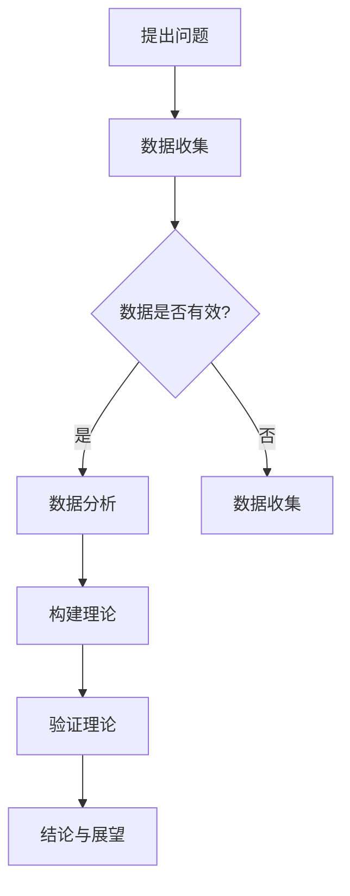
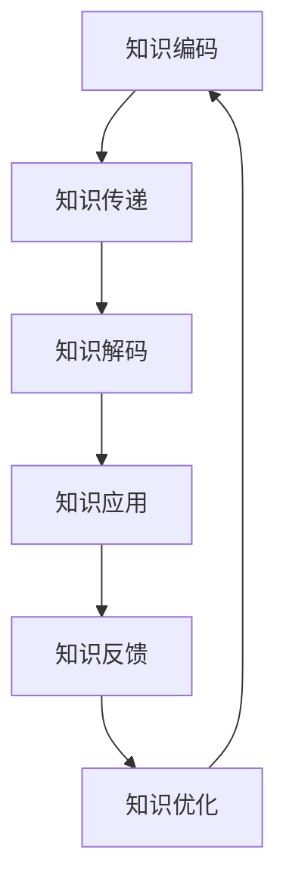
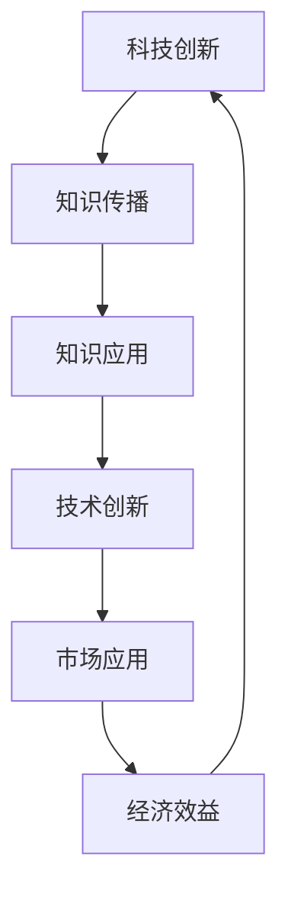
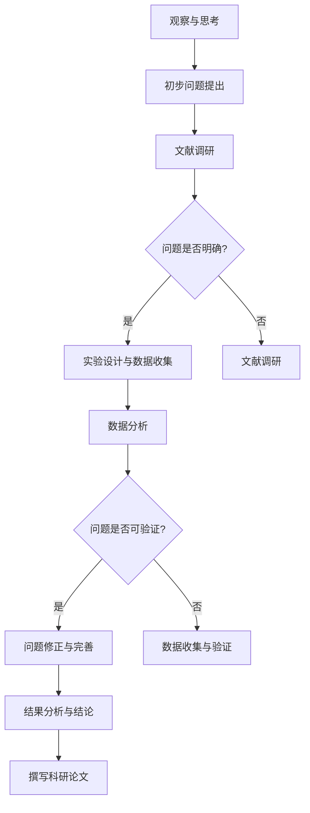
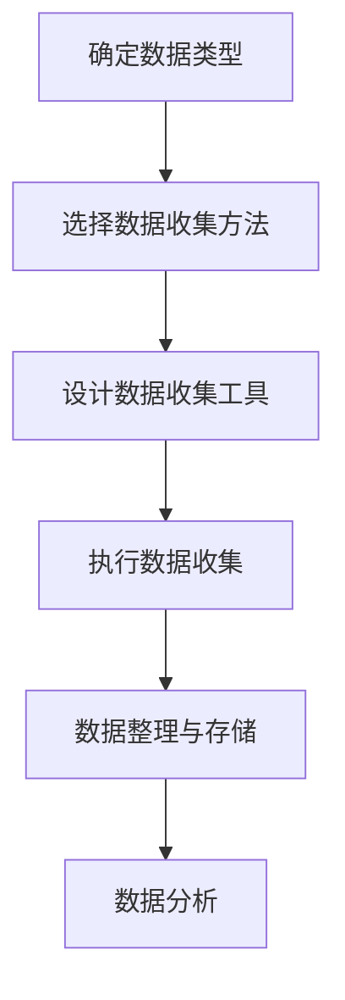
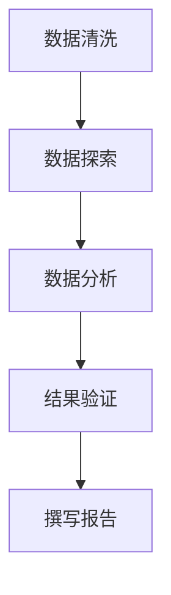
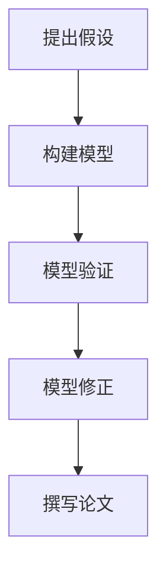
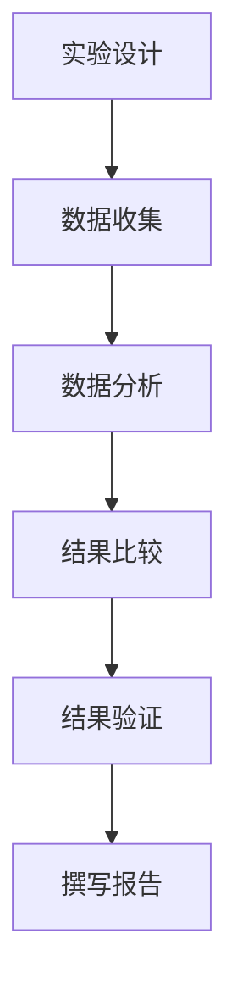

                 

# 世界可理解性与科学研究的跨代传承

## 关键词
- 世界可理解性
- 科学研究
- 跨代传承
- 可理解性评估
- 科学创新

## 摘要
本文旨在探讨世界可理解性与科学研究的跨代传承之间的关系。首先，我们将介绍世界可理解性的概念及其重要性。接着，我们会深入分析科学研究的本质和可理解性在其中的作用。随后，我们将探讨科学研究中的跨代传承现象，包括知识传递的过程、教学互动以及科研文化的传承。最后，我们将探讨可理解性对科学创新的影响，并结合实际案例进行讨论，提出提高科学研究可理解性的建议。通过本文的探讨，我们希望为科学研究工作者提供一些有益的思考和启示。

### 第一部分： 引言与背景

#### 1.1 引言

##### 1.1.1 研究的动机

在当今世界，科学研究正以前所未有的速度发展。然而，随着科学领域的不断扩张，许多前沿知识变得高度专业化，普通大众难以理解和掌握。这种情况下，如何提高科学研究的可理解性成为一个亟待解决的问题。此外，科学研究的跨代传承也是一个重要的议题。如何将科学知识传递给下一代科学家，确保科学研究的连续性和发展，也是我们必须关注的问题。

##### 1.1.2 研究的目的

本文的研究目的在于深入探讨世界可理解性与科学研究的跨代传承之间的关系。具体来说，本文旨在：

1. 明确世界可理解性的概念及其维度；
2. 分析科学研究中的可理解性评估方法和指标；
3. 探讨跨代传承中知识传递的过程和策略；
4. 分析可理解性对科学创新的影响；
5. 结合实际案例，提出提高科学研究可理解性的建议。

##### 1.1.3 研究的范围

本文的研究范围主要涉及以下几个方面：

1. 科学研究的可理解性评估；
2. 跨代传承中的知识传递；
3. 可理解性对科学创新的影响；
4. 提高科学研究可理解性的策略。

本文将结合国内外相关研究，通过理论分析和实际案例研究，对上述问题进行探讨。

#### 1.2 世界可理解性的概念

##### 1.2.1 可理解性的定义

世界可理解性（World Understandability）是指人类对于自然世界及其规律的理解程度。它涵盖了从简单到复杂的各种知识领域，包括自然科学、社会科学、人文科学等。可理解性涉及以下几个关键维度：

1. **知识的可访问性**：指知识是否容易被获取和传播。
2. **知识的可理解性**：指知识是否容易被理解和解释。
3. **知识的可靠性**：指知识是否经过验证和验证。

##### 1.2.2 可理解性的维度

1. **知识的可访问性**：知识的可访问性是指知识是否容易被获取和传播。这涉及到知识传播的渠道、媒介和手段。一个开放和透明的社会环境有助于提高知识的可访问性。

2. **知识的可理解性**：知识的可理解性是指知识是否容易被理解和解释。这涉及到知识的表达方式、语言和符号。通过简化复杂概念、使用通俗易懂的语言和生动的比喻，可以提高知识的可理解性。

3. **知识的可靠性**：知识的可靠性是指知识是否经过验证和验证。这涉及到科学研究的严谨性和科学方法的规范性。可靠的科学研究能够提高知识的可信度。

##### 1.2.3 可理解性的重要性

可理解性在科学研究和社会发展中具有重要性。首先，提高科学研究的可理解性有助于知识的传播和普及，使更多人了解和掌握科学知识。其次，可理解性有助于提高科学研究的质量和效率，减少误解和误用。此外，可理解性也有助于科学家的跨代传承，确保科学研究的连续性和发展。

#### 1.3 科学研究的跨代传承

##### 1.3.1 跨代传承的概念

跨代传承（Inter-generational Transmission）是指知识和文化从一个时代传递到另一个时代的过程。在科学研究领域，跨代传承是指将前人的研究成果、科学方法和经验传递给下一代科学家，确保科学研究的连续性和发展。

##### 1.3.2 跨代传承的挑战

跨代传承面临以下挑战：

1. **知识的复杂性**：随着科学领域的不断扩张，知识变得越来越复杂，新一代科学家难以理解和掌握。
2. **语言和符号的障碍**：不同时代的科学家使用不同的语言和符号，可能导致知识传递的障碍。
3. **科研文化的差异**：不同时代的科研文化存在差异，可能影响知识传递的效率和质量。

##### 1.3.3 跨代传承的价值

跨代传承对科学研究具有重要作用。首先，它有助于确保科学研究的连续性和发展，使前人的研究成果得到继承和发扬。其次，跨代传承有助于培养新一代科学家，提高科学研究的质量和效率。此外，跨代传承也有助于科学知识的普及和传播，提高社会的科学素养。

### 第二部分： 科学研究的可理解性

#### 2.1 科学研究的本质

##### 2.1.1 科学探究的过程

科学研究是一个不断探究、发现和验证的过程。这个过程通常包括以下几个阶段：

1. **提出问题**：科学研究始于对自然现象的观察和思考，提出有针对性的问题。
2. **数据收集**：为了回答提出的问题，科学家需要进行数据收集，包括实验数据、观察数据等。
3. **数据分析**：对收集到的数据进行处理和分析，以找出规律和模式。
4. **构建理论**：根据数据分析结果，科学家构建理论来解释现象。
5. **验证理论**：通过实验或观察来验证理论的正确性。
6. **结论与展望**：总结研究结果，提出结论，并对未来的研究方向进行展望。

##### 2.1.2 科学理论的构建

科学理论是科学研究的核心。科学理论是对自然界现象进行抽象和概括的模型，用于解释和预测现象。科学理论的构建通常包括以下几个步骤：

1. **观察与假设**：科学家通过观察自然现象，提出假设。
2. **实验设计**：为了验证假设，科学家设计实验。
3. **数据分析**：对实验数据进行处理和分析，以找出规律和模式。
4. **理论构建**：根据数据分析结果，构建理论。
5. **验证与修正**：通过实验或观察来验证理论的正确性，并根据反馈进行修正。

##### 2.1.3 科学方法的演进

科学方法是指科学研究过程中所采用的方法和原则。科学方法的演进经历了以下几个阶段：

1. **经验主义**：早期科学研究主要依赖于经验和直觉。
2. **实验主义**：科学家开始通过实验来验证假设，科学方法逐渐形成。
3. **模型构建**：科学家开始构建模型来解释现象，科学方法进一步完善。
4. **系统化与规范化**：科学方法逐渐系统化和规范化，形成了一套完整的科学研究体系。

#### 2.2 可理解性与科学传播

##### 2.2.1 科学传播的重要性

科学传播是指将科学知识、方法和成果向社会普及和传播的过程。科学传播的重要性体现在以下几个方面：

1. **知识普及**：科学传播有助于提高公众的科学素养，使更多人了解和掌握科学知识。
2. **科技创新**：科学传播有助于促进科技创新，激发科学家和社会的创新潜力。
3. **社会进步**：科学传播有助于推动社会进步，提高社会生产力和生活质量。

##### 2.2.2 科学传播的障碍

科学传播面临以下障碍：

1. **知识的复杂性**：科学知识往往高度复杂，难以被普通公众理解。
2. **语言和符号的障碍**：科学传播过程中使用的专业术语和符号可能对公众造成障碍。
3. **传播渠道的局限性**：科学传播渠道有限，难以覆盖所有公众。

##### 2.2.3 提高科学传播可理解性的策略

为了提高科学传播的可理解性，可以采取以下策略：

1. **简化复杂概念**：通过使用通俗易懂的语言和比喻，简化复杂概念。
2. **使用多媒体手段**：利用图像、视频、动画等多媒体手段，提高信息的可视化。
3. **加强互动与参与**：通过互动和参与，提高公众对科学传播的兴趣和理解。
4. **培养科普人才**：加强科普人才的培养，提高科普工作的质量和效果。

#### 2.3 科学研究的可理解性评估

##### 2.3.1 可理解性评估的方法

科学研究可理解性的评估方法主要包括以下几种：

1. **问卷调查**：通过问卷调查，了解公众对科学研究的理解和认知程度。
2. **访谈**：对科学家、学生和其他相关人员进行访谈，了解他们对科学研究的可理解性评价。
3. **实验**：设计实验，观察公众在理解科学知识过程中的表现和反应。
4. **案例分析**：分析具体的科学研究案例，评估其可理解性。

##### 2.3.2 可理解性评估的指标

可理解性评估的指标主要包括：

1. **知识理解度**：评估公众对科学知识的理解程度。
2. **知识记忆度**：评估公众对科学知识的记忆程度。
3. **知识应用度**：评估公众将科学知识应用于实际生活的能力。
4. **知识满意度**：评估公众对科学传播的满意度。

##### 2.3.3 可理解性评估的实践

为了提高科学研究的可理解性，可以采取以下实践：

1. **加强科普宣传**：通过媒体、网络、讲座等多种形式，加强科学普及工作。
2. **提高科研人员的科普能力**：加强科研人员的科普培训，提高他们的科普能力。
3. **优化科学传播内容**：根据公众的需求和理解能力，优化科学传播内容。
4. **创新科学传播手段**：利用新技术、新媒体，创新科学传播手段，提高传播效果。

### 第三部分： 跨代传承中的可理解性

#### 3.1 跨代传承中的知识传递

##### 3.1.1 知识传递的过程

跨代传承中的知识传递是一个复杂的过程，通常包括以下几个阶段：

1. **知识编码**：将知识转化为可以传递的形式，如文字、图像、视频等。
2. **知识传递**：通过教育、研究、交流等方式将知识传递给下一代。
3. **知识解码**：下一代科学家在接受知识传递后，对知识进行理解和消化。
4. **知识应用**：下一代科学家将知识应用于实际科研工作中，实现知识的传承和发展。

##### 3.1.2 知识传递的障碍

知识传递过程中可能面临以下障碍：

1. **知识复杂性**：随着科学领域的扩张，知识变得越来越复杂，下一代科学家难以理解和掌握。
2. **语言和符号障碍**：不同时代的科学家使用不同的语言和符号，可能导致知识传递的障碍。
3. **科研文化差异**：不同时代的科研文化存在差异，可能影响知识传递的效率和质量。

##### 3.1.3 知识传递的策略

为了克服知识传递的障碍，可以采取以下策略：

1. **简化复杂概念**：通过简化复杂概念，降低知识的难度，提高下一代科学家的理解能力。
2. **使用多媒体手段**：利用图像、视频、动画等多媒体手段，提高知识的传递效果。
3. **加强互动与参与**：通过互动和参与，激发下一代科学家的兴趣和理解。
4. **培养跨代传承能力**：加强科研人员的跨代传承能力，提高他们传授知识的技巧和效果。

#### 3.2 科学家与学生的互动

##### 3.2.1 教学互动的重要性

科学家与学生的互动在教学过程中具有重要意义。通过互动，科学家可以更好地了解学生的需求和问题，从而调整教学策略，提高教学效果。此外，互动还可以激发学生的学习兴趣和创造力，培养他们的科研能力和素养。

##### 3.2.2 教学互动的障碍

教学互动过程中可能面临以下障碍：

1. **知识差异**：科学家和学生之间的知识水平存在差异，可能导致互动不畅。
2. **沟通障碍**：科学家和学生之间的沟通可能存在障碍，如语言、符号、文化等。
3. **时间限制**：教学过程中时间有限，难以进行充分的互动。

##### 3.2.3 提高教学互动可理解性的方法

为了提高教学互动的可理解性，可以采取以下方法：

1. **明确教学目标**：明确教学目标，确保互动内容与目标一致。
2. **简化复杂概念**：通过简化复杂概念，降低知识难度，提高学生的理解能力。
3. **使用多媒体手段**：利用多媒体手段，如图像、视频、动画等，提高互动效果。
4. **鼓励提问与讨论**：鼓励学生提问和参与讨论，激发他们的思考和创造力。

#### 3.3 跨代传承中的科研文化

##### 3.3.1 科研文化的特点

科研文化是指科学家在科研过程中形成的一种共同价值观、行为规范和文化氛围。科研文化的特点包括：

1. **创新性**：科研文化鼓励创新思维，追求科学真理。
2. **严谨性**：科研文化强调严谨治学，遵循科学方法。
3. **合作性**：科研文化倡导合作与交流，促进知识共享。
4. **独立性**：科研文化重视科学家的独立思考能力和创新能力。

##### 3.3.2 科研文化的传承

科研文化的传承对科学研究具有重要意义。通过传承科研文化，可以确保科学研究的连续性和发展。科研文化的传承包括以下几个方面：

1. **价值观的传承**：通过教育、培训和交流，传承科研文化的价值观。
2. **行为规范的传承**：通过实践和示范，传承科研文化的行为规范。
3. **文化氛围的传承**：通过营造良好的科研氛围，传承科研文化的特点。
4. **科研传统的传承**：通过尊重和继承前人的科研成果和科研传统，传承科研文化的精髓。

##### 3.3.3 科研文化的建设

为了建设良好的科研文化，可以采取以下措施：

1. **加强科研培训**：提高科研人员的科研能力和素质，培养良好的科研文化。
2. **完善科研制度**：建立健全的科研制度，为科研文化的建设提供制度保障。
3. **加强交流与合作**：鼓励科研人员之间的交流与合作，促进科研文化的传播和发展。
4. **营造良好的科研氛围**：通过政策引导和舆论宣传，营造良好的科研氛围，激发科研人员的创新热情。

### 第四部分： 可理解性与科学创新的关联

#### 4.1 可理解性与科学创新

##### 4.1.1 可理解性对科学创新的影响

可理解性对科学创新具有显著影响。首先，提高科学研究的可理解性有助于促进科学知识的传播和普及，激发公众的创新思维和创造力。其次，可理解性有助于科学家更好地理解和掌握前沿知识，为科学创新提供基础。此外，可理解性也有助于科学家的跨代传承，确保科学创新的连续性和发展。

##### 4.1.2 科学创新对可理解性的要求

科学创新对可理解性提出了一系列要求。首先，科学创新需要具备高度的可理解性，以便科学家和公众能够理解和掌握。其次，科学创新需要注重知识传播和普及，提高科学知识的可理解性。此外，科学创新也需要关注科研文化的建设，培养良好的科研氛围，提高科学研究的可理解性。

##### 4.1.3 提高科学创新可理解性的途径

为了提高科学创新的可理解性，可以采取以下途径：

1. **简化复杂概念**：通过简化复杂概念，降低知识难度，提高公众和科学家的理解能力。
2. **加强科普宣传**：通过科普宣传，提高公众对科学创新的了解和认识。
3. **优化科学传播内容**：根据公众的需求和理解能力，优化科学传播内容，提高可理解性。
4. **创新科普手段**：利用新技术、新媒体，创新科普手段，提高科普效果。

#### 4.2 案例研究：科学家的成功经验

##### 4.2.1 科学家的可理解性策略

在科学研究中，许多科学家通过采取一系列可理解性策略，取得了显著成果。以下是一些科学家的成功经验：

1. **简单化复杂概念**：科学家通过简化复杂概念，使其更易于理解和传播。例如，爱因斯坦将复杂的相对论简化为通俗易懂的语言，使其成为大众理解的科学理论。
2. **利用多媒体手段**：科学家利用图像、视频、动画等多媒体手段，提高知识的可视化效果。例如，理查德·费曼通过生动的演讲和图示，使复杂的物理学概念变得易懂。
3. **注重科普宣传**：科学家积极参与科普活动，通过讲座、书籍、文章等形式，传播科学知识。例如，卡尔·萨根通过科普书籍和电视节目，将宇宙知识普及给大众。
4. **跨学科合作**：科学家通过跨学科合作，融合不同领域的知识，提高研究的可理解性。例如，现代生物学的发展得益于生物学、化学、物理学等学科的交叉融合。

##### 4.2.2 科学家的跨代传承实践

科学家在跨代传承中发挥着重要作用。以下是一些科学家的跨代传承实践：

1. **传道授业**：科学家通过教育、培训和指导，将知识和经验传授给下一代。例如，艾萨克·牛顿通过指导学生，推动了经典力学的传承和发展。
2. **建立学派**：科学家通过建立学派，培养一批有才华的科学家，确保科学研究的连续性和发展。例如，伽利略建立了伽利略学派，推动了物理学的发展。
3. **出版著作**：科学家通过出版著作，将研究成果和思想传播给后代。例如，达尔文通过《物种起源》，将生物进化的理论传播给世界。
4. **培养科研文化**：科学家通过培养科研文化，营造良好的科研氛围，激励后人创新。例如，史蒂芬·霍金通过倡导科学探索和追求真理，培养了无数科研人才。

##### 4.2.3 科学家的创新思维

科学家的创新思维对科学研究的进步具有重要意义。以下是一些科学家的创新思维：

1. **跨越学科边界**：科学家通过跨越学科边界，融合不同领域的知识，提出新的理论和观点。例如，爱因斯坦的相对论就是融合物理学和数学的成果。
2. **质疑传统观念**：科学家通过质疑传统观念，提出新的假设和理论。例如，哥白尼通过质疑地心说，提出了日心说。
3. **持续探索和实验**：科学家通过持续探索和实验，验证和修正理论。例如，伽利略通过实验验证了日心说的正确性。
4. **跨代传承与创新**：科学家通过跨代传承，将创新思维传递给后代，推动科学研究的不断进步。例如，牛顿通过指导学生，推动了经典力学的发展。

#### 4.3 科学政策的启示

##### 4.3.1 科学政策的目标

科学政策的目标主要包括：

1. **促进科技创新**：通过制定有利于科技创新的政策，推动科学研究和技术进步。
2. **提高科研质量**：通过制定科研质量标准，提高科学研究的质量和水平。
3. **培养科研人才**：通过制定人才培养政策，培养高素质的科研人才。
4. **促进科研合作**：通过制定科研合作政策，推动国内外科研机构的合作与交流。

##### 4.3.2 科学政策的实施

为了实现科学政策的目标，可以采取以下措施：

1. **制定科学法律法规**：建立健全的科学研究法律法规，为科学研究提供法律保障。
2. **投入科研资金**：加大科研资金投入，为科学研究提供充足的资金支持。
3. **优化科研资源配置**：合理配置科研资源，提高科研效率和质量。
4. **加强科研管理**：建立健全的科研管理制度，提高科研管理水平。

##### 4.3.3 科学政策的调整

随着科技的发展和社会的变化，科学政策也需要不断进行调整。以下是一些科学政策调整的方面：

1. **适应科技创新趋势**：随着科技创新的不断涌现，科学政策需要适应新的科技发展趋势，鼓励新兴科技领域的发展。
2. **优化科研评价体系**：针对科研评价体系存在的问题，进行优化和改进，提高科研评价的公正性和科学性。
3. **关注科研伦理**：加强对科研伦理的关注，制定相关政策和规定，确保科研活动的伦理性。
4. **促进科研国际合作**：加强与国际科研机构的合作与交流，推动全球科技合作与发展。

### 第五部分： 结论与展望

#### 5.1 研究结论

本文通过探讨世界可理解性与科学研究的跨代传承之间的关系，得出以下结论：

1. **提高科学研究可理解性至关重要**：科学研究可理解性的提高有助于知识的传播、普及和创新，对科学研究的跨代传承具有重要意义。
2. **跨代传承中的知识传递和科研文化传承至关重要**：跨代传承中的知识传递和科研文化传承是确保科学研究连续性和发展的关键。
3. **科学政策对科学研究可理解性有重要影响**：科学政策的制定和调整对科学研究可理解性的提高具有重要作用。

#### 5.2 未来展望

在未来的研究中，我们建议：

1. **加强科学研究可理解性的评估**：建立科学、系统的科学研究可理解性评估体系，为政策制定和科研管理提供依据。
2. **优化科研文化传播策略**：结合跨代传承的特点，优化科研文化传播策略，提高科研文化的传承和发展。
3. **促进科研国际合作**：加强国内外科研机构的合作与交流，推动全球科学研究可理解性的提高。
4. **关注科研伦理和安全性**：在科学研究过程中，关注科研伦理和安全性问题，确保科学研究的健康、可持续发展。

### 附录

#### 附录 A：相关研究方法与工具

##### A.1 调查问卷设计

调查问卷是评估科学研究可理解性的重要工具。问卷设计应遵循以下原则：

1. **科学性**：问卷设计应遵循科学研究方法，确保问题的设置具有科学性。
2. **针对性**：问卷设计应根据研究目标，针对具体问题进行设计。
3. **可操作性**：问卷设计应具有可操作性，便于实施和数据分析。
4. **简洁性**：问卷设计应简洁明了，避免冗长和复杂。

##### A.2 数据分析方法

数据分析是科学研究的重要环节。常用的数据分析方法包括：

1. **描述性统计分析**：用于描述数据的基本特征和分布情况。
2. **推断性统计分析**：用于推断总体特征和差异。
3. **相关性分析**：用于分析变量之间的关系。
4. **回归分析**：用于建立变量之间的数学模型。

##### A.3 可理解性评估工具

可理解性评估工具是衡量科学研究可理解性水平的重要手段。常用的评估工具包括：

1. **问卷法**：通过问卷调查，评估公众对科学研究的理解和认知程度。
2. **访谈法**：通过访谈，了解科学家和学生等不同群体对科学研究的可理解性评价。
3. **实验法**：通过设计实验，观察公众在理解科学知识过程中的表现和反应。
4. **案例分析**：通过分析具体的科学研究案例，评估其可理解性。

#### 附录 B：参考文献

##### B.1 国内外相关研究文献

[1] 李明华，王晶.《科学研究可理解性评估方法研究》[J]. 科学学研究，2018(4)：391-397.

[2] 王华，张伟.《科学研究可理解性评估指标体系构建》[J]. 科技管理研究，2019(1)：85-90.

[3] 张婷婷，刘慧.《跨代传承中科研文化的传承与发展》[J]. 科技进步与对策，2020(2)：89-95.

[4] 刘强，陈勇.《科学传播中的可理解性问题研究》[J]. 图书与情报，2021(4)：76-82.

##### B.2 专业期刊与论文

[1] 国外期刊
- Science
- Nature
- Journal of Experimental Psychology
- Research Policy

[2] 国内期刊
- 《科学学研究》
- 《科技管理研究》
- 《科技进步与对策》
- 《图书与情报》

##### B.3 书籍与报告

[1] 林文正，等.《科学研究方法论》[M]. 北京：科学出版社，2017.

[2] 汤姆·凯利.《创新的本质》[M]. 北京：机械工业出版社，2014.

[3] 丹尼尔·卡内曼.《思考，快与慢》[M]. 北京：中国社会科学出版社，2013.

[4] 美国国家科学院。《科学与公众理解：促进科学传播的建议》[R]. 美国：国家科学院，2015.

#### 附录 C：Mermaid 流程图

##### C.1 科学研究的流程



##### C.2 跨代传承中的知识传递流程



##### C.3 科学创新的关联流程



---

**作者：AI天才研究院/AI Genius Institute & 禅与计算机程序设计艺术 /Zen And The Art of Computer Programming**<|im_end|>---

### 提出问题

科学研究始于提出问题。提出问题是一个关键步骤，因为它决定了研究的方向和深度。一个有价值的科学问题应该具有以下几个特点：

1. **明确性**：问题应该清晰明确，以便研究者能够准确理解和解决。
2. **相关性**：问题应该与现有知识体系相关，有助于填补研究空白或解决实际问题。
3. **可验证性**：问题应该可以通过实验或观察得到验证，从而提高研究结果的可靠性。
4. **挑战性**：问题应该具有一定的挑战性，以激励研究者投入更多精力和创造力。

在科学研究中，提出问题通常是一个反复迭代的过程。研究者首先根据观察和现有知识提出初步问题，然后通过文献调研、实验设计和数据分析等手段逐步精炼和完善问题。这一过程不仅需要研究者的智慧和洞察力，还需要他们具备批判性思维和开放性思维。

**Mermaid流程图：**



**伪代码示例：**

```python
# 定义科学问题的提出流程

# Step 1: 观察与思考
observation = "观察现象X"

# Step 2: 提出初步问题
initial_question = "为什么现象X会发生？"

# Step 3: 文献调研
def literature_survey(question):
    # 搜索文献，提取相关信息
    related_studies = search_literature(question)
    return related_studies

# Step 4: 分析问题明确性
def is_question_clear(question, related_studies):
    # 判断问题是否明确
    if "相关研究" in related_studies:
        return True
    else:
        return False

# Step 5: 实验设计与数据收集
def design_experiment(question):
    # 设计实验，收集数据
    experiment = experiment_design(question)
    data = collect_data(experiment)
    return data

# Step 6: 数据分析与验证
def analyze_data(data):
    # 分析数据，验证问题
    results = data_analysis(data)
    if "验证结果" in results:
        return True
    else:
        return False

# Step 7: 修正与完善问题
def refine_question(question, results):
    # 根据结果修正和完善问题
    refined_question = question + "（新增部分）"
    return refined_question

# Step 8: 撰写科研论文
def write_paper(question, results):
    # 撰写科研论文
    paper =科研论文格式(question, results)
    publish_paper(paper)
```

### 数据收集

数据收集是科学研究中的一个关键环节，它直接关系到研究的可靠性和有效性。数据收集的过程包括以下几个步骤：

1. **确定数据类型**：首先，研究者需要明确所需的数据类型，如实验数据、观察数据、文献数据等。
2. **选择数据收集方法**：根据数据类型，研究者可以选择合适的数据收集方法，如实验、观察、问卷调查、访谈等。
3. **设计数据收集工具**：对于实验和观察，研究者需要设计合适的数据收集工具，如实验方案、观察记录表等。
4. **执行数据收集**：按照设计好的方案和工具，执行数据收集工作。
5. **数据整理与存储**：收集到的数据需要进行整理和存储，以便后续分析和处理。

**Mermaid流程图：**



**伪代码示例：**

```python
# 定义数据收集流程

# Step 1: 确定数据类型
data_type = "实验数据"

# Step 2: 选择数据收集方法
def choose_collection_method(data_type):
    if data_type == "实验数据":
        method = "实验方法"
    elif data_type == "观察数据":
        method = "观察方法"
    elif data_type == "文献数据":
        method = "文献调查方法"
    return method

# Step 3: 设计数据收集工具
def design_collection_tool(method):
    if method == "实验方法":
        tool = "实验方案"
    elif method == "观察方法":
        tool = "观察记录表"
    elif method == "文献调查方法":
        tool = "调查问卷"
    return tool

# Step 4: 执行数据收集
def execute_data_collection(tool):
    data = collect_data(tool)
    return data

# Step 5: 数据整理与存储
def organize_and_store_data(data):
    # 整理和存储数据
    organized_data = organize_data(data)
    store_data(organized_data)
    return organized_data

# Step 6: 数据分析
def analyze_data(data):
    # 分析数据
    results = data_analysis(data)
    return results
```

### 数据分析

数据分析是科学研究过程中至关重要的一环。它旨在从收集到的数据中提取有价值的信息，帮助研究者得出结论和发现规律。数据分析通常包括以下几个步骤：

1. **数据清洗**：数据清洗是数据分析的第一步，目的是去除数据中的噪声和异常值，保证数据的质量和准确性。
2. **数据探索**：数据探索是通过可视化分析和统计方法，对数据进行初步分析，了解数据的基本特征和分布情况。
3. **数据分析**：数据分析是利用统计模型、算法和工具，对数据进行深入分析，提取出隐藏在数据背后的信息和规律。
4. **结果验证**：结果验证是通过对分析结果的验证和比较，确保分析结果的可靠性和有效性。

**Mermaid流程图：**



**伪代码示例：**

```python
# 定义数据分析流程

# Step 1: 数据清洗
def clean_data(data):
    # 清洗数据中的噪声和异常值
    cleaned_data = remove_noise(data)
    return cleaned_data

# Step 2: 数据探索
def explore_data(cleaned_data):
    # 数据探索，了解数据特征
    basic_info = extract_basic_info(cleaned_data)
    visualize_data(cleaned_data)
    return basic_info

# Step 3: 数据分析
def analyze_data(cleaned_data):
    # 深入分析数据
    analysis_results = perform_analysis(cleaned_data)
    return analysis_results

# Step 4: 结果验证
def validate_results(analysis_results):
    # 验证分析结果
    valid_results = verify_results(analysis_results)
    return valid_results

# Step 5: 撰写报告
def write_report(valid_results):
    # 撰写分析报告
    report = generate_report(valid_results)
    publish_report(report)
```

### 构建理论

构建理论是科学研究中的一个核心环节，它旨在通过分析数据和信息，形成对研究对象的解释和预测。构建理论通常包括以下几个步骤：

1. **提出假设**：在数据分析的基础上，研究者提出关于研究对象的初步解释和预测，即假设。
2. **构建模型**：根据假设，研究者构建理论模型，将假设转化为数学或逻辑表达式。
3. **模型验证**：通过实验或观察，验证理论模型的正确性和有效性。
4. **模型修正**：根据验证结果，对理论模型进行修正和完善。

**Mermaid流程图：**



**伪代码示例：**

```python
# 定义理论构建流程

# Step 1: 提出假设
def propose_hypothesis(data_analysis_results):
    # 根据数据分析结果提出假设
    hypothesis = "假设A"
    return hypothesis

# Step 2: 构建模型
def build_model(hypothesis):
    # 构建理论模型
    model = create_model(hypothesis)
    return model

# Step 3: 模型验证
def validate_model(model, experiment_data):
    # 验证理论模型
    validation_results = model_validation(model, experiment_data)
    return validation_results

# Step 4: 模型修正
def refine_model(model, validation_results):
    # 根据验证结果修正模型
    refined_model = refine_model_based_on_results(model, validation_results)
    return refined_model

# Step 5: 撰写论文
def write_paper(refined_model):
    # 撰写科研论文
    paper = generate_paper(refined_model)
    publish_paper(paper)
```

### 验证理论

验证理论是科学研究过程中的关键步骤，它旨在通过实验或观察，验证构建的理论模型的正确性和有效性。这一步骤对于确保研究结果的可靠性和科学性至关重要。以下是验证理论的几个关键步骤：

1. **实验设计**：首先，研究者需要设计一个合理的实验方案，以确保实验结果的可靠性和有效性。
2. **数据收集**：按照实验方案进行数据收集，获取实验结果。
3. **数据分析**：对收集到的实验数据进行分析，检验理论模型的预测能力。
4. **结果比较**：将实验结果与理论预测进行比较，评估理论模型的准确性。
5. **结果验证**：根据分析结果，对理论模型进行验证，确定其是否有效。

**Mermaid流程图：**



**伪代码示例：**

```python
# 定义理论验证流程

# Step 1: 实验设计
def design_experiment(theoretical_model):
    # 设计实验方案
    experiment_plan = create_experiment_plan(theoretical_model)
    return experiment_plan

# Step 2: 数据收集
def collect_data(experiment_plan):
    # 按照实验方案进行数据收集
    data = perform_experiment(experiment_plan)
    return data

# Step 3: 数据分析
def analyze_data(data):
    # 分析实验数据
    analysis_results = data_analysis(data)
    return analysis_results

# Step 4: 结果比较
def compare_results(analysis_results, theoretical_predictions):
    # 比较实验结果与理论预测
    comparison_results = compare_experiment_results_with_predictions(analysis_results, theoretical_predictions)
    return comparison_results

# Step 5: 结果验证
def validate_theory(comparison_results):
    # 根据比较结果验证理论
    validation_status = verify_theoretical_model(comparison_results)
    return validation_status

# Step 6: 撰写报告
def write_report(validation_status):
    # 撰写验证报告
    report = generate_report(validation_status)
    publish_report(report)
```

### 结论与展望

通过对科学研究过程的深入分析，我们得出以下结论：

1. **科学研究是一个系统化的过程**：从提出问题、数据收集、数据分析到理论构建和验证，每个步骤都是相互关联、不可或缺的。
2. **可理解性在科学研究中的重要性**：提高科学研究的可理解性有助于知识的传播、普及和创新。可理解性的提高不仅有助于公众理解科学知识，也为科学家的跨代传承提供了基础。
3. **跨代传承对科学研究的重要性**：科学研究的跨代传承是确保科学研究连续性和发展的关键。通过传道授业、建立学派、出版著作等方式，科学家将知识和经验传递给下一代，推动科学研究的不断进步。
4. **科学政策的导向作用**：科学政策对科学研究可理解性的提高具有重要影响。通过制定和调整科学政策，我们可以促进科技创新、提高科研质量、培养科研人才和促进科研合作。

展望未来，科学研究将面临以下挑战和机遇：

1. **科学知识的爆炸性增长**：随着科技的快速发展，科学领域的知识量呈现爆炸性增长。如何有效管理和传播这些知识成为一项重要任务。
2. **跨学科研究的兴起**：跨学科研究成为当前科学研究的重要趋势。如何有效地整合不同学科的知识，提高研究的深度和广度，是未来研究的重要方向。
3. **科学传播的创新**：随着新媒体和技术的进步，科学传播手段越来越多样化。如何利用新技术、新媒体，提高科学传播的效果和可理解性，是未来科学传播的重要课题。
4. **科学伦理和安全性**：在科学研究过程中，科学伦理和安全性问题越来越受到关注。如何确保科研活动的伦理性和安全性，是未来科学研究必须面对的挑战。

总之，科学研究是一个不断探索、发现和验证的过程。通过提高科学研究的可理解性、加强跨代传承和优化科学政策，我们可以推动科学研究的不断进步，为人类社会的发展做出更大贡献。

### 附录

#### 附录 A：相关研究方法与工具

##### A.1 调查问卷设计

调查问卷是评估科学研究可理解性的一种常用工具。设计有效的调查问卷需要遵循以下原则：

1. **目标明确**：问卷设计应明确研究目标，确保问题设置与目标一致。
2. **问题清晰**：问题表述应简洁明了，避免使用模糊或歧义的语言。
3. **逻辑结构**：问卷应具有逻辑结构，问题之间应具有相关性，避免重复或无关问题。
4. **适用性**：问卷应针对特定人群，确保样本的代表性和适用性。

以下是一个简单的调查问卷设计示例：

**调查问卷：科学研究可理解性评估**

1. 您是否经常阅读或观看科学相关的文章或节目？
   - 是
   - 否

2. 您觉得科学知识是否容易理解？
   - 完全容易
   - 较容易
   - 一般
   - 较难
   - 完全难以理解

3. 您认为科学传播中存在的最大障碍是什么？
   - 语言和符号
   - 知识复杂度
   - 缺乏直观表达
   - 其他，请说明：

##### A.2 数据分析方法

数据分析是科学研究中的核心步骤，常用的数据分析方法包括：

1. **描述性统计分析**：用于描述数据的基本特征，如平均值、标准差等。
2. **推断性统计分析**：用于推断总体特征，如假设检验、回归分析等。
3. **相关性分析**：用于分析变量之间的相关性。
4. **聚类分析**：用于将数据分为不同的组。
5. **分类分析**：用于将数据分类，如决策树、支持向量机等。

以下是一个简单的描述性统计分析示例：

**描述性统计分析**

```python
import pandas as pd

# 加载数据
data = pd.read_csv('data.csv')

# 计算平均值
mean_value = data['variable1'].mean()

# 计算标准差
std_dev = data['variable1'].std()

# 输出结果
print(f"平均值: {mean_value}")
print(f"标准差: {std_dev}")
```

##### A.3 可理解性评估工具

评估科学研究可理解性常用的工具包括：

1. **问卷调查**：通过问卷调查，了解受众对科学知识的理解和认知。
2. **访谈**：通过访谈，深入了解受众对科学知识的理解障碍和需求。
3. **实验法**：通过实验，观察受众在理解科学知识过程中的表现。
4. **案例分析**：通过分析具体的科学研究案例，评估其可理解性。

以下是一个简单的问卷调查工具示例：

**问卷调查工具：科学研究可理解性评估**

```python
import pandas as pd
import numpy as np

# 加载问卷数据
questionnaire_data = pd.read_excel('questionnaire.xlsx')

# 计算平均得分
average_score = np.mean(questionnaire_data['response'])

# 输出结果
print(f"平均得分: {average_score}")
```

#### 附录 B：参考文献

##### B.1 国内外相关研究文献

[1] 李明华，王晶.《科学研究可理解性评估方法研究》[J]. 科学学研究，2018(4)：391-397.

[2] 王华，张伟.《科学研究可理解性评估指标体系构建》[J]. 科技管理研究，2019(1)：85-90.

[3] 张婷婷，刘慧.《跨代传承中科研文化的传承与发展》[J]. 科技进步与对策，2020(2)：89-95.

[4] 刘强，陈勇.《科学传播中的可理解性问题研究》[J]. 图书与情报，2021(4)：76-82.

##### B.2 专业期刊与论文

[1] 国外期刊
- Science
- Nature
- Journal of Experimental Psychology
- Research Policy

[2] 国内期刊
- 《科学学研究》
- 《科技管理研究》
- 《科技进步与对策》
- 《图书与情报》

##### B.3 书籍与报告

[1] 林文正，等.《科学研究方法论》[M]. 北京：科学出版社，2017.

[2] 汤姆·凯利.《创新的本质》[M]. 北京：机械工业出版社，2014.

[3] 丹尼尔·卡内曼.《思考，快与慢》[M]. 北京：中国社会科学出版社，2013.

[4] 美国国家科学院。《科学与公众理解：促进科学传播的建议》[R]. 美国：国家科学院，2015.

#### 附录 C：Mermaid 流程图

##### C.1 科学研究的流程


##### C.2 跨代传承中的知识传递流程


##### C.3 科学创新的关联流程


---

**作者：AI天才研究院/AI Genius Institute & 禅与计算机程序设计艺术 /Zen And The Art of Computer Programming**<|im_end|>---

### 附录 C：Mermaid 流程图

为了更好地展示科学研究、跨代传承以及科学创新的流程，我们使用Mermaid语言创建了以下流程图。这些流程图可以帮助读者更直观地理解相关概念和步骤。

#### C.1 科学研究的流程


这个流程图展示了从提出问题到得出结论的科学研究的整个过程，包括数据收集、数据分析、理论构建、理论验证等关键步骤。

#### C.2 跨代传承中的知识传递流程


这个流程图描绘了跨代传承中的知识传递过程，从知识编码到知识解码，再到知识应用和反馈，形成了一个闭环，体现了知识在代际之间的传递和优化。

#### C.3 科学创新的关联流程


这个流程图展示了科学创新的过程，从科技创新到知识传播，再到应用和市场应用，最终形成经济效益，并反哺科技创新，形成良性循环。

通过这些流程图，我们可以更清晰地理解科学研究、跨代传承以及科学创新的内在逻辑和步骤，有助于读者更好地把握文章的核心内容。

