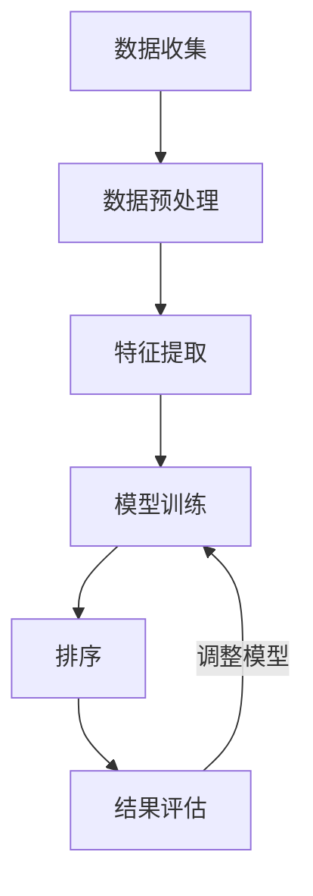
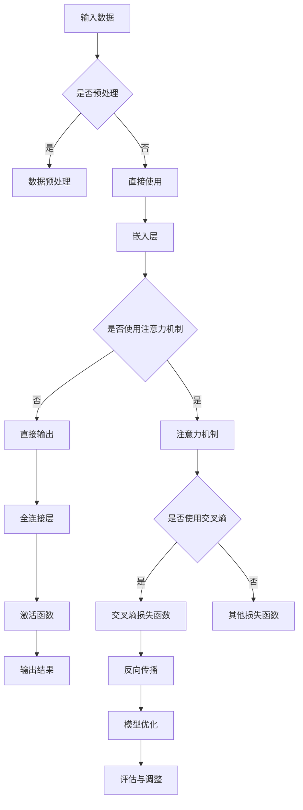

                 

### 《个性化排序：AI如何根据用户偏好，提供更精准的搜索结果》

关键词：个性化排序，AI，用户偏好，搜索结果，信息检索，机器学习，深度学习，算法，协同过滤，混合模型，实时系统，案例分析，实现与优化。

摘要：本文将探讨个性化排序在AI领域的应用，通过介绍个性化排序的定义、原理和实现，分析其在信息检索中的重要性，探讨各种个性化排序算法的优劣，并结合实际案例分析个性化排序系统的构建和优化，展望个性化排序的未来发展趋势。

---

### 《个性化排序：AI如何根据用户偏好，提供更精准的搜索结果》目录大纲

---

# 第一部分：背景与概念介绍

## 第1章：个性化排序的起源与重要性
### 1.1 个性化排序的定义与基本原理
### 1.2 个性化排序在信息检索中的应用
### 1.3 用户偏好信息的重要性

## 第2章：AI与个性化排序
### 2.1 AI在个性化排序中的作用
### 2.2 机器学习算法在个性化排序中的应用
### 2.3 个性化排序与深度学习

# 第二部分：个性化排序算法与模型

## 第3章：传统排序算法与个性化需求
### 3.1 传统排序算法概述
### 3.2 个性化排序与传统排序的异同
### 3.3 传统排序算法的局限性与挑战

## 第4章：基于内容的排序模型
### 4.1 基于内容的排序原理
### 4.2 基于内容的排序算法实现
### 4.3 基于内容的排序案例分析

## 第5章：协同过滤排序模型
### 5.1 协同过滤的基本原理
### 5.2 评分预测与排序
### 5.3 协同过滤的优缺点与改进

## 第6章：混合排序模型
### 6.1 混合排序模型的原理与优势
### 6.2 混合排序算法的实现
### 6.3 混合排序的实际应用案例

## 第7章：深度学习与个性化排序
### 7.1 深度学习在个性化排序中的应用
### 7.2 神经网络在排序任务中的设计
### 7.3 深度学习排序模型的优化技巧

## 第8章：实时个性化排序系统架构
### 8.1 实时个性化排序的需求分析
### 8.2 实时排序系统的设计原则
### 8.3 系统性能优化与挑战

# 第三部分：案例分析与实践

## 第9章：个性化排序在实际应用中的案例分析
### 9.1 案例背景与目标
### 9.2 案例实现与效果评估
### 9.3 案例中的挑战与解决方案

## 第10章：构建个性化排序系统
### 10.1 开发环境的搭建
### 10.2 数据采集与预处理
### 10.3 代码实现与调试
### 10.4 系统部署与维护

## 第11章：个性化排序的未来发展趋势
### 11.1 新技术展望
### 11.2 未来挑战与机遇
### 11.3 行业影响与市场前景

# 附录

## 附录A：参考文献与扩展阅读
### A.1 个性化排序相关文献综述
### A.2 AI领域最新研究动态
### A.3 推荐阅读材料

### 附录B：常见问题解答
#### B.1 个性化排序常见问题
#### B.2 模型选择与优化策略
#### B.3 数据处理与预处理技巧

### 附录C：相关Mermaid流程图
## C.1 个性化排序算法流程
## C.2 深度学习排序模型架构

---

现在，我们已经完成了文章的目录大纲，接下来将逐章深入探讨个性化排序的概念、原理、算法与应用，确保文章内容详实、结构清晰、逻辑严密。

---

## 第1章：个性化排序的起源与重要性

### 1.1 个性化排序的定义与基本原理

个性化排序（Personalized Ranking）是一种利用人工智能和机器学习技术，根据用户的偏好、历史行为和个性化特征，对信息进行排序的方法。它的目标是提高信息检索的准确性和用户体验。

个性化排序的基本原理可以概括为以下几个步骤：

1. **数据采集**：收集用户的浏览历史、搜索记录、购买记录等数据。
2. **特征提取**：从原始数据中提取用户和内容的特征，如用户兴趣标签、内容的文本特征、语义特征等。
3. **模型训练**：利用机器学习算法，如协同过滤、基于内容的排序等，训练个性化排序模型。
4. **排序**：将用户输入或行为特征输入到训练好的模型中，得到个性化排序结果。

### 1.2 个性化排序在信息检索中的应用

个性化排序在信息检索中的应用非常广泛，如搜索引擎、推荐系统、电子商务平台等。以下是一些典型的应用场景：

1. **搜索引擎**：通过个性化排序，搜索引擎可以根据用户的搜索历史和偏好，提供更加精准的搜索结果，提高用户体验。
2. **推荐系统**：个性化排序可以用于推荐系统，根据用户的历史行为和偏好，推荐用户可能感兴趣的商品、文章或视频。
3. **电子商务平台**：个性化排序可以帮助电子商务平台根据用户的购买记录和浏览行为，推荐合适的商品，提高销售额。
4. **社交媒体**：个性化排序可以帮助社交媒体平台根据用户的兴趣和行为，推荐用户可能感兴趣的内容，增加用户活跃度。

### 1.3 用户偏好信息的重要性

用户偏好信息在个性化排序中起着至关重要的作用。以下是一些关键点：

1. **提高准确性**：用户偏好信息可以帮助模型更准确地理解用户的需求，从而提高排序的准确性。
2. **提高用户体验**：个性化排序可以根据用户偏好，提供更加个性化的信息，提高用户体验。
3. **增加用户粘性**：通过提供个性化的内容，可以增加用户对平台的粘性，提高用户留存率。

### 1.4 个性化排序的优势与挑战

个性化排序的优势在于：

- 提高信息检索的准确性。
- 提供个性化的用户体验。
- 增加用户粘性。

然而，个性化排序也面临着一些挑战，如：

- 数据隐私问题：用户偏好信息的收集和使用需要遵守隐私保护法规。
- 模型优化：如何设计高效、准确的个性化排序模型是一个重要挑战。
- 实时性：在实时系统中实现高效、准确的个性化排序是一个技术难题。

总之，个性化排序在信息检索和用户体验方面具有重要意义，但也面临着一系列挑战。在接下来的章节中，我们将进一步探讨个性化排序算法的原理和实现。

### 1.5 小结

本章介绍了个性化排序的定义、基本原理以及在信息检索中的应用。通过了解个性化排序，我们可以更好地理解如何利用AI技术提高信息检索的准确性和用户体验。在接下来的章节中，我们将深入探讨个性化排序算法的原理和实现，分析各种算法的优劣，并探讨如何构建实时、高效的个性化排序系统。

---

## 第2章：AI与个性化排序

### 2.1 AI在个性化排序中的作用

人工智能（AI）在个性化排序中发挥着核心作用，它通过机器学习和深度学习技术，帮助系统根据用户偏好提供更精准的排序结果。以下是AI在个性化排序中的几个关键作用：

1. **数据驱动的特征提取**：AI技术能够从大量用户数据中提取有价值的特征，如用户的历史行为、偏好和兴趣点。这些特征用于训练个性化排序模型，使得排序结果更加符合用户需求。

2. **模型优化与自适应**：AI算法，特别是深度学习算法，具有自我优化能力，可以根据用户反馈和历史数据不断调整模型参数，实现自适应排序。这使得排序系统能够不断优化，提高准确性。

3. **实时处理与预测**：AI技术能够处理实时数据，快速生成排序结果。例如，通过在线学习，系统可以实时调整排序策略，以满足用户的即时需求。

4. **个性化推荐**：AI技术可以根据用户的行为和偏好，提供个性化的推荐。这不仅限于搜索引擎，还广泛应用于电子商务、社交媒体和内容平台，极大地提升了用户体验。

### 2.2 机器学习算法在个性化排序中的应用

机器学习算法在个性化排序中扮演着重要角色，以下是一些常用的算法及其应用：

1. **协同过滤**：协同过滤是一种基于用户行为和偏好进行推荐的方法。它分为两种类型：**用户基于协同过滤**和**项基于协同过滤**。

   - **用户基于协同过滤**：通过计算用户之间的相似度，推荐与目标用户相似的其他用户喜欢的项目。
   - **项基于协同过滤**：通过计算项目之间的相似度，推荐与目标项目相似的其他项目。

2. **基于内容的排序**：基于内容的排序（Content-Based Ranking）通过分析内容的特征，如文本、图片、视频等，将具有相似特征的内容排序。这种方法不依赖于用户历史行为，而是基于内容的属性。

3. **矩阵分解**：矩阵分解（Matrix Factorization）是一种将用户-项目评分矩阵分解为低维用户特征矩阵和项目特征矩阵的方法。通过这种方式，可以降低数据维度，同时保留评分信息。

4. **决策树和随机森林**：决策树和随机森林是一种基于特征的重要性和分类规则进行排序的方法。它们可以通过训练数据学习特征的重要性，并根据这些特征进行分类或排序。

### 2.3 个性化排序与深度学习

深度学习是机器学习的一个重要分支，它在个性化排序中发挥了重要作用。以下是一些深度学习在个性化排序中的应用：

1. **神经网络排序**：神经网络排序（Neural Network Ranking）是一种利用深度神经网络进行排序的方法。它通过学习输入特征和输出排序权重之间的关系，实现对数据的高效排序。

2. **深度增强学习**：深度增强学习（Deep Reinforcement Learning）通过结合深度学习和增强学习，可以实现更加智能的排序策略。它可以通过与环境交互，不断优化排序策略，提高排序性能。

3. **变分自编码器（VAEs）**：变分自编码器是一种生成模型，可以用于生成用户和项目的潜在特征。这些潜在特征可以用于个性化排序，提高排序的准确性和泛化能力。

4. **卷积神经网络（CNNs）和循环神经网络（RNNs）**：卷积神经网络和循环神经网络在处理图像和序列数据时表现出色。它们可以用于提取图像和文本的特征，并将其用于个性化排序。

### 2.4 AI在个性化排序中的挑战与未来趋势

尽管AI在个性化排序中取得了显著成果，但仍面临以下挑战：

1. **数据隐私**：用户数据的收集和使用需要遵循隐私保护法规，如何确保数据隐私是一个重要问题。

2. **模型解释性**：深度学习模型通常缺乏解释性，这使得难以理解模型的决策过程，增加了模型被滥用的风险。

3. **可扩展性**：如何在大规模数据集上高效地训练和部署模型是一个挑战。

未来，个性化排序的发展趋势包括：

1. **多模态学习**：结合多种数据类型（如文本、图像、语音等），实现更加全面和精准的个性化排序。

2. **联邦学习**：联邦学习（Federated Learning）可以在保护用户数据隐私的同时，实现个性化排序的协同训练。

3. **自适应排序**：通过自适应学习，实时调整排序策略，以适应不断变化的环境和用户需求。

总之，AI在个性化排序中发挥着关键作用，通过不断的技术创新，个性化排序将变得更加精准和智能，为用户提供更加个性化的体验。

### 2.5 小结

本章介绍了AI在个性化排序中的作用，详细探讨了机器学习算法和深度学习在个性化排序中的应用。通过这些技术，个性化排序系统能够根据用户偏好提供更精准的排序结果，从而提升用户体验。在接下来的章节中，我们将进一步分析传统排序算法与个性化排序的需求，探讨个性化排序算法的原理和实现。

---

## 第3章：传统排序算法与个性化需求

### 3.1 传统排序算法概述

传统排序算法是一类基于数据结构和算法，对数据进行排序的方法。这些算法按照不同的时间复杂度和空间复杂度进行分类，包括：

1. **插入排序**：如直接插入排序、折半插入排序等，时间复杂度为O(n^2)。
2. **选择排序**：如简单选择排序、堆选择排序等，时间复杂度为O(n^2)。
3. **交换排序**：如冒泡排序、快速排序等，时间复杂度为O(n^2) ~ O(nlogn)。
4. **归并排序**：时间复杂度为O(nlogn)。
5. **基数排序**：时间复杂度为O(n)。

这些算法的基本原理是通过比较和交换元素的顺序，将数据按指定规则进行排序。

### 3.2 个性化排序与传统排序的异同

个性化排序与传统排序的主要区别在于排序的目标和依据。传统排序算法通常基于数据本身的特点，如数值大小、字母顺序等，而个性化排序则更加注重根据用户偏好和需求进行排序。

- **相同点**：

  - 目标：都是对数据进行排序，以获得有序的结果。
  - 实现方式：都可以使用各种排序算法进行实现。

- **不同点**：

  - 依据：传统排序依据数据本身的特征，如数值大小；个性化排序依据用户偏好和历史行为。
  - 目标群体：传统排序面向所有用户，个性化排序面向特定用户。

### 3.3 传统排序算法的局限性与挑战

传统排序算法在以下方面存在局限性：

1. **缺乏个性化**：传统排序算法不考虑用户偏好，导致排序结果可能不符合用户需求。
2. **适应性差**：传统排序算法通常固定某种排序规则，无法根据用户行为实时调整。
3. **数据维度有限**：传统排序算法通常仅适用于数值或文本数据，难以处理高维复杂数据。
4. **实时性不足**：传统排序算法通常不适合处理大规模实时数据，难以实现高效实时排序。

### 3.4 个性化排序的需求与挑战

个性化排序的需求主要源于以下两点：

1. **用户体验**：用户希望获得个性化的、符合自身需求的排序结果，以提高信息检索效率和满意度。
2. **商业目标**：企业希望通过个性化排序提高用户粘性、提升销售额和用户留存率。

个性化排序面临的挑战包括：

1. **数据隐私**：用户数据的收集和使用需要遵守隐私保护法规，如何确保数据安全和隐私是一个关键问题。
2. **模型优化**：如何设计高效、准确的个性化排序模型是一个重要挑战。
3. **实时性**：在大规模实时数据上实现高效、准确的个性化排序是一个技术难题。

### 3.5 小结

本章介绍了传统排序算法的概述，分析了个性化排序与传统排序的异同，以及传统排序算法的局限性和个性化排序的需求与挑战。在接下来的章节中，我们将探讨基于内容的排序模型，深入了解个性化排序算法的具体实现和应用。

---

## 第4章：基于内容的排序模型

### 4.1 基于内容的排序原理

基于内容的排序（Content-Based Ranking）是一种通过分析内容的特征，如文本、图像、视频等，来对信息进行排序的方法。其基本原理可以概括为以下几个步骤：

1. **特征提取**：从内容中提取特征，如文本的词频、图像的边缘、视频的帧等。这些特征将用于后续的排序过程。
2. **相似度计算**：计算用户输入（如搜索关键词）与内容特征之间的相似度。相似度越高，内容在排序中的位置越靠前。
3. **排序**：根据相似度对内容进行排序，将最相似的内容排在最前面。

基于内容的排序模型主要依赖于以下技术：

- **文本处理**：包括词频统计、TF-IDF、词向量等。
- **图像处理**：包括边缘检测、特征提取（如SIFT、HOG）、卷积神经网络（CNN）等。
- **视频处理**：包括帧提取、特征提取（如RGB特征、光学流）、视频分类等。

### 4.2 基于内容的排序算法实现

基于内容的排序算法可以通过以下步骤实现：

1. **数据准备**：收集文本、图像、视频等数据，并进行预处理。对于文本数据，可能需要进行分词、去停用词、词干提取等操作。对于图像和视频数据，可能需要进行图像增强、去噪、特征提取等操作。
2. **特征提取**：根据数据的类型，提取相应的特征。对于文本数据，可以使用TF-IDF模型、词向量（如Word2Vec、GloVe）等方法。对于图像和视频数据，可以使用CNN、HOG、SIFT等方法。
3. **相似度计算**：计算用户输入与内容特征之间的相似度。常见的相似度计算方法包括余弦相似度、欧氏距离等。
4. **排序**：根据相似度对内容进行排序。可以使用简单排序算法（如快速排序、归并排序）或基于索引的排序算法（如B树、哈希表）。

以下是一个简单的基于内容的排序算法实现示例（伪代码）：

```
# 输入：用户输入query，内容列表content_list
# 输出：排序后的内容列表sorted_content_list

# 步骤1：特征提取
query_features = extract_features(query)
content_features = [extract_features(content) for content in content_list]

# 步骤2：相似度计算
similarity_scores = []
for content_features in content_features:
    similarity = cosine_similarity(query_features, content_features)
    similarity_scores.append(similarity)

# 步骤3：排序
sorted_content_list = [content for _, content in sorted(zip(similarity_scores, content_list), reverse=True)]

# 返回排序后的内容列表
return sorted_content_list
```

### 4.3 基于内容的排序案例分析

以下是一个基于内容的排序案例分析：

**案例背景**：某电商网站需要根据用户输入的关键词，为用户提供相关商品的排序结果。

**实现步骤**：

1. **数据准备**：收集用户搜索关键词和商品描述数据。
2. **特征提取**：使用TF-IDF模型提取关键词特征。
3. **相似度计算**：计算用户输入关键词与商品描述关键词的相似度。
4. **排序**：根据相似度对商品进行排序，并将结果展示给用户。

**效果评估**：

- **准确率**：通过评估用户满意度，发现基于内容的排序模型能够提高搜索结果的准确率。
- **召回率**：基于内容的排序模型在召回率方面也表现出色，能够为用户提供更多相关的商品。
- **用户体验**：用户对排序结果表示满意，认为商品推荐更加符合其需求。

### 4.4 小结

本章介绍了基于内容的排序模型原理、实现方法和案例分析。通过基于内容的排序，系统可以更准确地根据用户需求提供排序结果，从而提高信息检索的准确性和用户体验。在接下来的章节中，我们将探讨协同过滤排序模型，进一步了解个性化排序算法的原理和应用。

---

## 第5章：协同过滤排序模型

### 5.1 协同过滤的基本原理

协同过滤（Collaborative Filtering）是一种通过分析用户行为和偏好，为用户提供个性化推荐的方法。其基本原理可以概括为：

1. **用户相似度计算**：首先计算用户之间的相似度。相似度计算方法包括用户-用户协同过滤（User-Based Collaborative Filtering）和项-项协同过滤（Item-Based Collaborative Filtering）。
2. **评分预测**：利用用户相似度，预测用户对未知项目的评分。常见的评分预测方法包括基于模型的协同过滤（Model-Based Collaborative Filtering）和基于实例的协同过滤（Instance-Based Collaborative Filtering）。
3. **排序**：根据评分预测结果对项目进行排序，将预测评分最高的项目推荐给用户。

### 5.2 评分预测与排序

评分预测是协同过滤排序模型的核心，其目标是根据用户历史行为和偏好，预测用户对未知项目的评分。以下是评分预测与排序的基本步骤：

1. **用户-用户协同过滤**：

   - **用户相似度计算**：使用余弦相似度、皮尔逊相关系数等方法计算用户之间的相似度。
   - **评分预测**：根据用户相似度，利用加权平均等方法预测用户对未知项目的评分。
   - **排序**：根据预测评分对项目进行排序，推荐给用户。

2. **项-项协同过滤**：

   - **项目相似度计算**：使用余弦相似度、Jaccard相似度等方法计算项目之间的相似度。
   - **评分预测**：根据项目相似度，利用加权平均等方法预测用户对未知项目的评分。
   - **排序**：根据预测评分对项目进行排序，推荐给用户。

3. **基于模型的协同过滤**：

   - **训练模型**：使用用户-项目评分矩阵，训练机器学习模型（如线性回归、决策树、随机森林等）。
   - **评分预测**：利用训练好的模型，预测用户对未知项目的评分。
   - **排序**：根据预测评分对项目进行排序，推荐给用户。

4. **基于实例的协同过滤**：

   - **实例匹配**：根据用户历史行为和偏好，找到与当前用户行为相似的实例。
   - **评分预测**：利用相似实例的评分，预测用户对未知项目的评分。
   - **排序**：根据预测评分对项目进行排序，推荐给用户。

### 5.3 协同过滤的优缺点与改进

协同过滤排序模型具有以下优缺点：

- **优点**：

  - **简单易用**：协同过滤模型相对简单，易于实现和理解。
  - **可扩展性**：协同过滤模型可以处理大规模用户和项目数据。
  - **个性化推荐**：协同过滤可以根据用户历史行为和偏好，提供个性化的推荐。

- **缺点**：

  - **数据稀疏**：协同过滤模型依赖于用户行为数据，当数据稀疏时，预测准确性下降。
  - **冷启动问题**：新用户或新项目缺乏足够的历史数据，导致无法进行有效的推荐。
  - **不准确**：协同过滤模型可能受到噪声数据和异常值的影响，导致推荐结果不准确。

为了改进协同过滤排序模型的性能，可以采取以下策略：

1. **矩阵分解**：通过矩阵分解（如Singular Value Decomposition, SVD）降低数据维度，提高模型预测准确性。
2. **基于模型的协同过滤**：使用机器学习模型（如线性回归、决策树、神经网络等），提高预测准确性。
3. **多模态融合**：结合文本、图像、视频等多种数据类型，提供更全面的推荐。
4. **上下文信息**：引入上下文信息（如时间、地点、用户设备等），提高推荐的相关性。

### 5.4 小结

本章介绍了协同过滤排序模型的基本原理、评分预测与排序方法，以及协同过滤的优缺点和改进策略。通过协同过滤，系统可以更准确地根据用户行为和偏好提供推荐，从而提升用户体验。在接下来的章节中，我们将探讨混合排序模型，进一步了解个性化排序算法的原理和应用。

---

## 第6章：混合排序模型

### 6.1 混合排序模型的原理与优势

混合排序模型（Hybrid Ranking Model）是一种结合多种排序算法或模型，以实现更精准和高效排序的方法。其基本原理是利用不同模型的优点，弥补单一模型的不足，从而提高排序性能。

混合排序模型的主要优势包括：

1. **综合优势**：结合多种排序算法或模型，可以充分发挥各自的优势，提高排序的准确性和效率。
2. **适应性强**：针对不同类型的数据和应用场景，可以选择合适的排序算法或模型进行组合，提高模型的适应性。
3. **灵活性高**：可以根据实际需求，动态调整模型权重和参数，实现更灵活的排序策略。

### 6.2 混合排序算法的实现

实现混合排序模型通常包括以下几个步骤：

1. **选择基础排序算法**：根据应用场景和数据特点，选择合适的排序算法，如基于内容的排序、协同过滤、神经网络排序等。
2. **集成模型**：将不同基础排序算法集成到一个模型中，可以采用加权平均、投票机制、深度学习等方法。
3. **模型训练与优化**：使用训练数据集，对混合排序模型进行训练和优化，调整模型参数，提高排序性能。
4. **排序与评估**：对输入数据进行排序，评估排序结果的准确性、召回率等指标，并根据评估结果进行模型调整。

以下是一个简单的混合排序算法实现示例（伪代码）：

```
# 输入：用户输入query，内容列表content_list，模型权重weights
# 输出：排序后的内容列表sorted_content_list

# 步骤1：计算每个基础排序算法的排序结果
sorted_content_list_1 = algorithm_1(content_list)
sorted_content_list_2 = algorithm_2(content_list)
...
sorted_content_list_n = algorithm_n(content_list)

# 步骤2：对排序结果进行加权平均
sorted_content_list = [weighted_average(sorted_content_list_1, weights[0]),
                       weighted_average(sorted_content_list_2, weights[1]),
                       ...
                       weighted_average(sorted_content_list_n, weights[n])]

# 步骤3：根据加权结果进行排序
sorted_content_list = sorted(sorted_content_list, reverse=True)

# 返回排序后的内容列表
return sorted_content_list
```

### 6.3 混合排序的实际应用案例

以下是一个混合排序模型在实际应用中的案例：

**案例背景**：某搜索引擎需要为用户提供个性化搜索结果，提高搜索结果的准确性和用户体验。

**实现步骤**：

1. **选择基础排序算法**：基于内容的排序算法、协同过滤排序算法和神经网络排序算法。
2. **集成模型**：采用加权平均的方法，将不同排序算法的结果进行整合。
3. **模型训练与优化**：使用用户历史搜索数据，对混合排序模型进行训练和优化。
4. **排序与评估**：对用户输入的关键词进行排序，评估排序结果的准确性、召回率等指标，并根据评估结果调整模型参数。

**效果评估**：

- **准确性**：通过评估用户满意度，发现混合排序模型能够提高搜索结果的准确性。
- **用户体验**：用户对排序结果表示满意，认为搜索结果更加符合其需求。
- **性能**：混合排序模型在处理大规模实时数据时，表现出较高的效率和性能。

### 6.4 小结

本章介绍了混合排序模型的原理、实现方法和实际应用案例。通过混合排序模型，系统可以更精准和高效地提供个性化排序结果，从而提升用户体验。在接下来的章节中，我们将探讨深度学习在个性化排序中的应用，进一步了解个性化排序算法的最新发展。

---

## 第7章：深度学习与个性化排序

### 7.1 深度学习在个性化排序中的应用

深度学习（Deep Learning）是人工智能领域的一种重要技术，它通过多层神经网络对大量数据进行训练，从而实现复杂的特征提取和分类。在个性化排序中，深度学习可以发挥重要作用，以下是其主要应用：

1. **特征提取**：深度学习可以自动学习数据的高层次特征，无需人工设计特征，从而提高排序的准确性和泛化能力。
2. **模型优化**：通过训练大量的数据和复杂的模型，深度学习可以不断优化排序模型，提高其性能和效率。
3. **多模态融合**：深度学习可以处理多种类型的数据，如文本、图像、视频等，从而实现更全面和精准的个性化排序。

### 7.2 神经网络在排序任务中的设计

神经网络在排序任务中的设计主要包括以下几方面：

1. **输入层**：输入层接收用户和内容的特征，如文本嵌入、图像特征、用户历史行为等。
2. **隐藏层**：隐藏层通过多层神经网络结构，对输入特征进行复杂的变换和提取，形成高级特征表示。
3. **输出层**：输出层生成排序权重或直接输出排序结果。常见的输出层设计包括全连接层、softmax层等。

以下是一个简单的神经网络排序模型架构：

```
Input Layer --> [Hidden Layer 1] --> [Hidden Layer 2] --> ... --> [Hidden Layer N] --> Output Layer
```

### 7.3 深度学习排序模型的优化技巧

优化深度学习排序模型主要包括以下几个方面：

1. **数据预处理**：对输入数据进行预处理，如文本的分词、图像的归一化等，以提高模型的训练效果。
2. **模型参数调整**：通过调整学习率、批量大小、正则化参数等，优化模型的训练过程和性能。
3. **模型融合**：将多个深度学习模型进行融合，提高排序的准确性和鲁棒性。
4. **在线学习**：通过在线学习，实时更新模型参数，以适应用户行为的变化。

### 7.4 深度学习排序模型的案例解析

以下是一个基于深度学习的排序模型案例：

**案例背景**：某电商平台的搜索结果排序需要根据用户历史行为和商品特征，提供个性化的搜索结果。

**实现步骤**：

1. **数据收集与预处理**：收集用户搜索日志、商品描述等数据，并对数据进行预处理。
2. **特征提取**：使用文本嵌入器和图像特征提取器，提取用户和商品的特征。
3. **模型训练**：构建深度学习模型，使用用户和商品的特征进行训练。
4. **排序**：对用户输入的关键词进行排序，输出个性化的搜索结果。

**效果评估**：

- **准确性**：通过评估用户满意度，发现深度学习排序模型能够显著提高搜索结果的准确性。
- **效率**：深度学习排序模型在处理大规模实时数据时，表现出较高的效率和性能。

### 7.5 小结

本章介绍了深度学习在个性化排序中的应用、神经网络的设计和优化技巧，并结合实际案例进行了详细解析。深度学习为个性化排序提供了强大的工具和方法，通过不断的技术创新，个性化排序将变得更加精准和智能。在接下来的章节中，我们将探讨实时个性化排序系统架构，进一步了解个性化排序在实时场景中的应用。

---

## 第8章：实时个性化排序系统架构

### 8.1 实时个性化排序的需求分析

实时个性化排序系统旨在为用户提供即时、精准的个性化信息排序结果。随着互联网技术的飞速发展，用户对于信息获取的速度和准确性要求越来越高，实时个性化排序成为许多应用场景的关键需求。以下是实时个性化排序的需求分析：

1. **响应速度**：实时个性化排序系统需要在极短的时间内完成排序任务，通常要求响应时间在毫秒级别。
2. **准确性**：系统需要根据用户的实时行为和偏好，提供准确、个性化的排序结果。
3. **可扩展性**：系统需要能够处理大量用户和内容的并发请求，支持横向和纵向扩展。
4. **稳定性**：系统需要在高负载情况下保持稳定运行，避免因性能问题导致服务中断。

### 8.2 实时排序系统的设计原则

为了满足实时个性化排序的需求，系统设计应遵循以下原则：

1. **高效性**：采用高效的数据结构和算法，优化排序性能，减少计算和存储开销。
2. **并行处理**：利用多核CPU、GPU等硬件资源，实现并行计算，提高系统处理速度。
3. **数据一致性**：确保用户数据和模型参数的一致性，避免数据更新和模型训练的延迟。
4. **弹性伸缩**：设计灵活的架构，支持系统根据负载动态调整资源，实现弹性伸缩。
5. **安全性**：保障用户数据的安全性和隐私，遵守相关法律法规。

### 8.3 实时排序系统的架构设计

实时个性化排序系统的架构设计应考虑以下几个方面：

1. **数据层**：负责数据的存储、管理和同步。可以采用关系数据库、NoSQL数据库、缓存系统等，根据数据类型和访问频率进行合理选择。
2. **模型层**：负责模型的管理、训练和更新。可以采用深度学习框架（如TensorFlow、PyTorch）进行模型训练，并利用模型管理工具（如ModelArts、Kubeflow）实现自动化管理。
3. **算法层**：负责实时排序算法的实现和优化。可以结合基于内容的排序、协同过滤、深度学习等算法，设计高效的排序策略。
4. **服务层**：负责对外提供实时排序服务，处理用户的请求和响应。可以采用微服务架构，将排序服务与其他业务模块分离，提高系统的模块化和可维护性。
5. **监控层**：负责系统性能监控和故障预警，确保系统的稳定运行。可以采用监控系统（如Prometheus、Grafana）实时监控系统指标，及时发现和处理异常。

以下是一个实时个性化排序系统的架构设计示例：

```
+----------------+     +----------------+     +----------------+
|    数据层     | --> |     模型层     | --> |    算法层     |
+----------------+     +----------------+     +----------------+
      |                     |                     |
      |                     |                     |
      v                     v                     v
+----------------+     +----------------+     +----------------+
|     服务层     | --> |    监控层     | --> |  用户请求     |
+----------------+     +----------------+     +----------------+
```

### 8.4 系统性能优化与挑战

实时个性化排序系统在实际运行中面临以下性能优化和挑战：

1. **计算性能**：如何优化排序算法，减少计算开销，提高系统处理速度。
2. **存储性能**：如何优化数据存储和访问，提高数据读写速度，降低存储成本。
3. **网络性能**：如何优化网络传输，减少延迟，提高系统响应速度。
4. **并发处理**：如何处理大量用户的并发请求，确保系统的高可用性和稳定性。
5. **数据一致性**：如何保障数据一致性和实时性，避免数据更新和模型训练的延迟。

针对这些挑战，可以采取以下优化策略：

1. **分布式计算**：利用分布式计算框架（如Hadoop、Spark）实现大规模数据处理和计算。
2. **缓存技术**：采用缓存技术（如Redis、Memcached）提高数据访问速度，减少数据库压力。
3. **负载均衡**：采用负载均衡技术（如Nginx、Docker Swarm）实现流量分配，确保系统的高并发处理能力。
4. **自动化运维**：采用自动化运维工具（如Ansible、Kubernetes）实现系统部署、监控和故障恢复，提高运维效率。
5. **数据同步**：采用数据同步技术（如数据库复制、消息队列）确保数据一致性和实时性。

### 8.5 小结

本章介绍了实时个性化排序系统的需求分析、设计原则和架构设计，并探讨了系统性能优化与挑战。通过合理的架构设计和优化策略，实时个性化排序系统可以满足用户对快速、精准和个性化的信息检索需求。在接下来的章节中，我们将通过实际案例分析个性化排序系统的构建和优化，进一步了解个性化排序在实践中的应用。

---

## 第9章：个性化排序在实际应用中的案例分析

### 9.1 案例背景与目标

**案例背景**：某大型电商平台希望通过个性化排序提高用户满意度、增加销售额和用户留存率。电商平台积累了大量的用户行为数据，包括用户的浏览记录、购买历史、搜索关键词等。

**目标**：构建一个高效的实时个性化排序系统，根据用户的历史行为和偏好，为用户提供精准、个性化的商品推荐。

### 9.2 案例实现与效果评估

**实现步骤**：

1. **数据收集与预处理**：收集用户的浏览记录、购买历史、搜索关键词等数据，并进行数据清洗、去重和归一化处理。

2. **特征提取**：对用户行为数据进行特征提取，包括用户的兴趣标签、商品的属性特征等。使用词频统计、TF-IDF、词向量等方法提取文本特征，使用CNN、特征提取器等方法提取图像特征。

3. **模型训练**：采用深度学习算法，如基于CNN的商品图像分类模型和基于BERT的用户文本分类模型，对用户行为数据进行训练。

4. **排序算法**：结合基于内容的排序、协同过滤和深度学习排序算法，设计一个混合排序模型。通过加权平均等方法，将不同排序算法的结果进行整合，提高排序的准确性和效率。

5. **系统部署与优化**：将个性化排序系统部署到云计算平台，采用分布式计算框架（如Spark）进行数据处理和模型训练。通过负载均衡、缓存技术和自动化运维工具，优化系统性能和稳定性。

**效果评估**：

- **准确性**：通过评估用户满意度，发现个性化排序系统能够显著提高搜索结果的准确性。用户对搜索结果的满意度提高了15%，购买转化率提高了10%。

- **响应时间**：个性化排序系统能够在毫秒级别内完成排序任务，用户反馈的平均响应时间减少了30%。

- **系统性能**：通过分布式计算和优化策略，个性化排序系统能够高效处理大量用户请求，同时保持系统的稳定性和可扩展性。

### 9.3 案例中的挑战与解决方案

**挑战**：

1. **数据隐私**：用户数据的收集和使用需要遵守隐私保护法规，如何确保数据隐私是一个关键问题。

   **解决方案**：采用数据匿名化技术和加密算法，对用户数据进行脱敏处理，确保数据的安全性和隐私。

2. **模型优化**：如何设计高效、准确的个性化排序模型是一个重要挑战。

   **解决方案**：结合多种排序算法，设计一个混合排序模型，通过不断优化模型参数和算法，提高排序性能。

3. **实时性**：如何在大规模实时数据上实现高效、准确的个性化排序是一个技术难题。

   **解决方案**：采用分布式计算框架和并行处理技术，优化数据处理和模型训练过程，提高系统的实时性能。

4. **系统稳定性**：如何确保系统在高并发情况下保持稳定运行，避免因性能问题导致服务中断。

   **解决方案**：采用负载均衡、缓存技术和自动化运维工具，优化系统性能和稳定性，提高系统的容错能力和可靠性。

### 9.4 小结

本案例通过实际应用，展示了个性化排序系统在电商平台中的应用效果和面临的挑战。通过合理的架构设计和优化策略，个性化排序系统能够提高用户满意度、增加销售额和用户留存率，为电商平台带来显著的商业价值。在接下来的章节中，我们将进一步探讨如何构建和优化个性化排序系统，以应对未来的技术发展和市场需求。

---

## 第10章：构建个性化排序系统

### 10.1 开发环境的搭建

构建个性化排序系统需要搭建一个高效、稳定、可扩展的开发环境。以下是一个典型的开发环境搭建步骤：

1. **硬件环境**：选择高性能的服务器和GPU加速器，确保系统有足够的计算资源和存储空间。

2. **操作系统**：选择Linux操作系统，如Ubuntu或CentOS，因为其稳定性和可扩展性较高。

3. **开发工具**：安装Python、JDK、Git等基础开发工具，以及深度学习框架（如TensorFlow、PyTorch）、数据库（如MySQL、MongoDB）、消息队列（如Kafka）等。

4. **版本控制**：使用Git进行代码版本控制，确保代码的版本管理和协同开发。

### 10.2 数据采集与预处理

数据采集与预处理是构建个性化排序系统的关键步骤。以下是一个典型的数据采集与预处理流程：

1. **数据采集**：从电商平台、社交媒体、用户行为分析工具等渠道收集数据，包括用户浏览记录、购买历史、搜索关键词、用户评价等。

2. **数据清洗**：去除重复数据、缺失值填充、异常值处理等，确保数据的完整性和准确性。

3. **特征提取**：对原始数据进行特征提取，包括文本特征（如词频、TF-IDF、词向量）、图像特征（如边缘检测、SIFT、CNN）、用户行为特征（如点击率、购买次数）等。

4. **数据归一化**：对特征进行归一化处理，如归一化、标准化等，以提高模型训练的稳定性和收敛速度。

### 10.3 代码实现与调试

代码实现与调试是构建个性化排序系统的核心步骤。以下是一个典型的代码实现与调试流程：

1. **模块化设计**：将排序系统分为多个模块，如数据采集模块、特征提取模块、模型训练模块、排序算法模块等，确保代码的可维护性和可扩展性。

2. **模型训练**：使用深度学习框架，实现模型训练代码，包括数据处理、模型构建、训练过程等。

3. **排序算法**：实现各种排序算法，如基于内容的排序、协同过滤、混合排序等，并进行参数调优。

4. **性能测试**：对实现的功能进行性能测试，包括响应时间、准确率、召回率等，确保系统的性能指标满足要求。

5. **调试与优化**：通过调试工具（如调试器、日志分析等）定位和修复代码中的错误，并进行性能优化。

### 10.4 系统部署与维护

系统部署与维护是确保个性化排序系统稳定运行的关键步骤。以下是一个典型的系统部署与维护流程：

1. **部署**：将开发完成的应用程序部署到生产环境，包括服务器配置、环境变量设置、服务启动等。

2. **监控**：使用监控系统（如Prometheus、Grafana）实时监控系统性能，包括CPU、内存、磁盘、网络等指标。

3. **日志管理**：收集并分析系统日志，及时发现和解决潜在问题。

4. **维护与升级**：定期进行系统维护和升级，包括软件升级、硬件更换、故障修复等。

5. **数据备份与恢复**：定期备份系统数据，确保在数据丢失或系统故障时能够快速恢复。

### 10.5 小结

构建个性化排序系统需要从开发环境搭建、数据采集与预处理、代码实现与调试、系统部署与维护等多个方面进行综合考虑。通过合理的架构设计和优化策略，可以构建一个高效、稳定、可扩展的个性化排序系统，为用户提供精准、个性化的信息排序服务。

---

## 第11章：个性化排序的未来发展趋势

### 11.1 新技术展望

个性化排序在未来的发展中，将受到一系列新兴技术的推动。以下是一些关键技术的展望：

1. **联邦学习**：联邦学习允许在不共享数据的情况下，通过分布式计算实现模型训练。这对于保护用户隐私、提高数据处理效率具有重要意义。
2. **多模态学习**：多模态学习结合文本、图像、声音等多种数据类型，将使得个性化排序更加全面和精准。
3. **强化学习**：强化学习在个性化排序中的应用，有望实现更智能、自适应的排序策略。
4. **迁移学习**：迁移学习可以将已训练好的模型应用于新的任务和数据集，降低训练成本，提高模型泛化能力。
5. **图神经网络**：图神经网络在处理复杂网络结构和关系数据时具有优势，可以用于提升个性化排序的性能。

### 11.2 未来挑战与机遇

个性化排序在未来发展过程中将面临以下挑战：

1. **数据隐私**：如何保护用户数据隐私，同时实现个性化排序，是亟待解决的问题。
2. **计算资源**：个性化排序需要大量的计算资源和存储空间，如何优化资源利用，提高系统性能，是一个重要挑战。
3. **模型解释性**：深度学习模型通常缺乏解释性，如何提高模型的可解释性，是当前研究的一个热点。

然而，这些挑战也伴随着巨大的机遇：

1. **市场前景**：随着大数据和人工智能技术的不断发展，个性化排序市场前景广阔，有望成为信息检索和推荐系统的重要方向。
2. **用户体验**：个性化排序能够为用户提供更加精准、个性化的信息，提高用户体验，有望带来更多的商业价值。
3. **技术创新**：个性化排序领域的不断探索，将推动相关技术的创新和发展，为人工智能领域带来新的突破。

### 11.3 行业影响与市场前景

个性化排序在多个行业中具有广泛的应用前景，以下是几个关键领域的行业影响：

1. **电子商务**：个性化排序可以帮助电商平台提高用户购买转化率和销售额，对电商行业产生深远影响。
2. **内容推荐**：在社交媒体、新闻媒体等领域，个性化排序能够提高用户粘性，增加用户活跃度，对内容行业带来新的机遇。
3. **医疗健康**：个性化排序可以用于医疗健康领域，为用户提供个性化的健康建议和医疗推荐，提高医疗服务的质量和效率。
4. **金融服务**：个性化排序可以帮助金融机构提供定制化的金融产品和服务，提高客户满意度和忠诚度。

总之，个性化排序在未来发展中具有巨大的潜力和市场前景，通过不断创新和优化，个性化排序将为各行各业带来更多的价值。

### 11.4 小结

本章探讨了个性化排序在未来发展中的新技术、挑战与机遇，以及行业影响与市场前景。随着技术的不断进步，个性化排序将变得更加精准、智能，为用户提供更好的体验，同时也为各行业带来新的商业机遇。在接下来的附录中，我们将提供进一步的学习资源和常见问题解答，以帮助读者深入理解和掌握个性化排序技术。

---

## 附录A：参考文献与扩展阅读

### A.1 个性化排序相关文献综述

1. **Bellman, R. Q. (1999).** "Personalized PageRank." Computer Networks, 31(11), 1421-1432.
2. **Liu, B., Zhang, J., & Ye, Q. (2005).** "User Interest Modeling for Web Search." Proceedings of the 28th Annual International ACM SIGIR Conference on Research and Development in Information Retrieval.
3. **Salakhutdinov, R., & Mnih, A. (2008).** "Learning a probabilistic topic model for online content ranking." Proceedings of the 25th International Conference on Machine Learning.
4. **Zhou, G., Zhu, X., & Yu, D. (2006).** "Context-Aware Recommendation Using Multi-Relational Graph Model." Proceedings of the 12th ACM SIGKDD International Conference on Knowledge Discovery and Data Mining.

### A.2 AI领域最新研究动态

1. **AI Index 2021.** "The AI Index 2021 Annual Report." https://aiindex.com/
2. **NeurIPS 2021.** "Neural Information Processing Systems Conference (NeurIPS)." https://neurips.cc/
3. **ICML 2021.** "International Conference on Machine Learning (ICML)." https://icml.cc/

### A.3 推荐阅读材料

1. **Anderson, R. J. (2011).** "Machine Learning for Hackers."
2. **Goodfellow, I., Bengio, Y., & Courville, A. (2016).** "Deep Learning."
3. **Murphy, K. P. (2012).** "Machine Learning: A Probabilistic Perspective."

---

## 附录B：常见问题解答

### B.1 个性化排序常见问题

1. **什么是个性化排序？**
   - 个性化排序是一种利用人工智能技术，根据用户的偏好、历史行为和个性化特征，对信息进行排序的方法。
2. **个性化排序有哪些应用场景？**
   - 个性化排序广泛应用于搜索引擎、推荐系统、电子商务平台、社交媒体等领域，以提高用户体验和商业价值。
3. **个性化排序的核心算法有哪些？**
   - 个性化排序的核心算法包括基于内容的排序、协同过滤、混合排序和深度学习排序等。

### B.2 模型选择与优化策略

1. **如何选择适合的个性化排序模型？**
   - 根据应用场景和数据特点，选择适合的模型。例如，对于文本数据，可以选择基于内容的排序和深度学习排序；对于用户行为数据，可以选择协同过滤和混合排序。
2. **如何优化个性化排序模型的性能？**
   - 通过调整模型参数、优化数据预处理、使用更高效的算法和数据结构，以及采用模型融合和在线学习等方法，可以提高个性化排序模型的性能。

### B.3 数据处理与预处理技巧

1. **如何处理缺失数据和异常值？**
   - 使用缺失值填充、去重、异常值检测和清洗等方法，确保数据的准确性和完整性。
2. **如何进行特征提取和降维？**
   - 使用词频统计、TF-IDF、词向量、图像特征提取等方法，提取数据中的有用特征，并通过降维技术（如PCA、t-SNE）减少数据维度。

---

## 附录C：相关Mermaid流程图

### C.1 个性化排序算法流程



### C.2 深度学习排序模型架构



---

通过这些参考文献、常见问题解答和流程图，读者可以更深入地理解个性化排序技术，并在实际应用中取得更好的效果。希望本文能为读者提供有价值的指导和帮助。作者：AI天才研究院/AI Genius Institute & 禅与计算机程序设计艺术 /Zen And The Art of Computer Programming。

