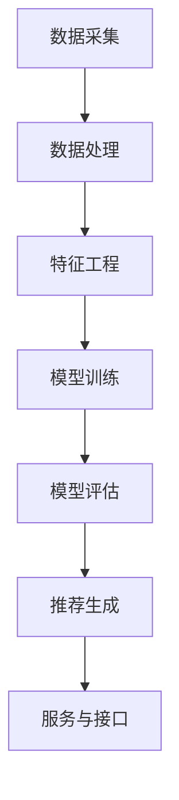
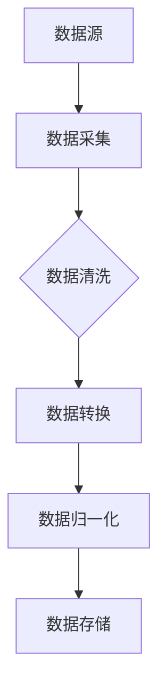
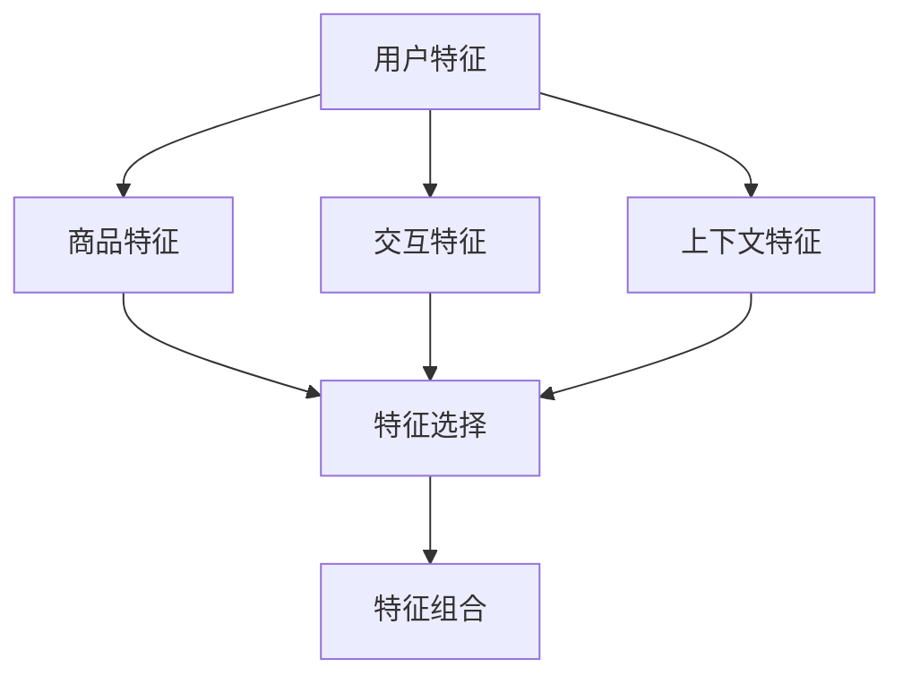
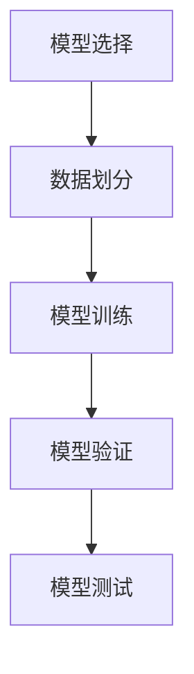
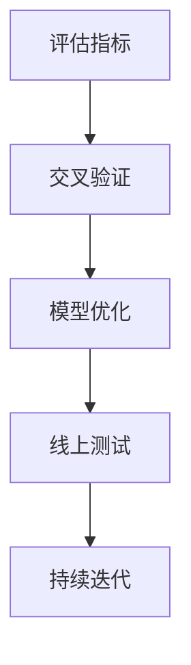
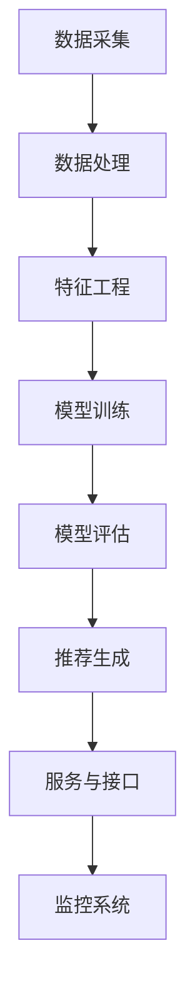

                 

# 《京东2025社招电商个性化推荐工程师面试指南》

## 关键词
- 京东
- 社招
- 个性化推荐
- 面试指南
- 电商行业
- 推荐系统
- 算法
- 实战案例

## 摘要
本文旨在为2025年即将参加京东社招电商个性化推荐工程师岗位面试的应聘者提供一份全面的面试指南。文章将详细讲解面试流程与准备、电商与个性化推荐基础、数学与算法基础、推荐系统设计与实现、面试实战与案例分析等内容。通过本文的阅读，读者可以全面了解电商个性化推荐领域的核心概念、技术原理和实践方法，为面试做好充分准备。

## 目录大纲

### 第一部分：面试准备与基础知识

### 第1章：面试概述与准备

### 第2章：电商与个性化推荐基础

### 第3章：数学与算法基础

### 第二部分：个性化推荐系统设计与实现

### 第4章：推荐系统架构设计

### 第5章：协同过滤算法详解

### 第6章：基于内容的推荐算法

### 第7章：混合推荐系统

### 第三部分：面试实战与案例分析

### 第8章：电商个性化推荐面试实战

### 第9章：案例分析：京东推荐系统实战

### 第10章：未来趋势与展望

### 附录

### 附录A：推荐系统相关资源与工具

### 附录B：编程实践与代码解读

## 引言

随着互联网和电子商务的迅猛发展，个性化推荐系统在电商平台中扮演着越来越重要的角色。它不仅能够提高用户满意度，还能显著提升销售额和用户留存率。因此，电商个性化推荐工程师成为各大互联网公司争相招募的热门岗位之一。

京东作为中国电商巨头，其个性化推荐系统的技术实力和市场表现都处于行业领先地位。因此，京东社招电商个性化推荐工程师岗位面试成为众多应聘者梦寐以求的机会。本文将为您全面解析京东社招电商个性化推荐工程师面试的要点，帮助您在面试中脱颖而出。

## 第一部分：面试准备与基础知识

### 第1章：面试概述与准备

### 1.1 面试流程与准备

面试是招聘过程中至关重要的一环，它不仅考察应聘者的专业技能，还评估其沟通能力、团队协作能力和学习能力。对于电商个性化推荐工程师岗位的面试，我们建议您从以下几个方面进行准备：

#### 1.1.1 面试流程

- 网上申请：首先，您需要通过京东官方网站或者招聘平台提交简历，并完成在线测评。
- 初试：初试通常由电话面试或在线视频面试组成，主要考察您的专业技能和项目经验。
- 复试：复试环节包括技术面试、HR面试和部门领导面试等，更加深入地了解您的综合素质和职业规划。
- 面试通知：通过邮件或电话通知您面试的具体时间和地点。

#### 1.1.2 准备策略

- 了解京东：熟悉京东的业务模式、发展历程、核心竞争优势等，尤其是其个性化推荐系统的特点和实现方式。
- 技术准备：复习与电商个性化推荐相关的技术知识，包括推荐算法、数据挖掘、机器学习等。
- 项目准备：梳理您的项目经验，准备详细的解决方案、技术实现和优化策略。
- 简历优化：确保简历中的项目经历和技能点与岗位要求高度契合。

### 1.2 面试常见题型与应对策略

面试过程中，常见题型主要包括以下几个方面：

#### 技术问题

- 推荐系统相关算法原理和实现细节。
- 数学与统计学基础知识。
- 数据结构和算法。

#### 行为问题

- 项目经验中的具体实现和优化策略。
- 团队合作和沟通能力。
- 问题解决能力和逻辑思维。

#### HR问题

- 职业规划和职业目标。
- 个人优势和不足。
- 对京东推荐系统的看法和建议。

#### 应对策略

- 技术问题：通过举例和代码片段展示您的技术实力，特别是与岗位相关的项目经验。
- 行为问题：结合实际经历，展示您的解决问题的能力和团队协作精神。
- HR问题：诚实回答，展示您的职业素养和对公司的热情。

### 1.3 技术面试前的复习要点

为了在技术面试中取得优异成绩，以下是一些复习要点：

- **推荐系统基本概念**：了解推荐系统的定义、分类和实现流程。
- **推荐算法原理**：熟悉常见的推荐算法，如协同过滤、基于内容的推荐和混合推荐等。
- **数据预处理**：掌握数据清洗、特征提取和特征工程的方法。
- **模型评估与优化**：了解常见的评估指标，如准确率、召回率和F1值等，以及模型优化的策略。
- **编程能力**：熟练掌握Python、Java等编程语言，具备数据结构和算法的基本功。
- **项目经验**：整理并熟悉您的项目经历，特别是与推荐系统相关的项目。

## 第一部分总结

通过本章的介绍，您已经对京东社招电商个性化推荐工程师面试的流程、常见题型和复习要点有了初步了解。接下来，我们将深入探讨电商与个性化推荐的基础知识，帮助您夯实理论基础，为面试做好充分准备。请继续关注下一章的内容。接下来，我们深入探讨电商与个性化推荐的基础知识，帮助您夯实理论基础，为面试做好充分准备。请继续关注下一章的内容。

### 第2章：电商与个性化推荐基础

#### 2.1 电商行业概述

电商行业是随着互联网技术发展而崛起的一个新兴行业，它以互联网为载体，通过电子方式实现商品交易和服务的提供。电商行业的快速发展，改变了人们的购物习惯，提升了消费体验，同时也为企业带来了巨大的商业价值。

**电商行业的发展历程**

- **萌芽期**（1995-2003年）：互联网开始普及，网上商店和电子商务网站逐渐出现，但规模较小。
- **起步期**（2004-2008年）：随着互联网普及率的提高，电商行业进入快速发展期，阿里巴巴、京东等企业崛起。
- **成熟期**（2009-2019年）：移动支付、物流配送等基础设施逐步完善，电商市场逐渐成熟。
- **变革期**（2020年至今）：电商行业进入深度变革期，以人工智能、大数据、云计算等为代表的科技创新，正在重塑电商行业格局。

**电商行业的市场特点**

- **市场规模大**：中国电商市场已经成为全球最大的市场之一，用户规模和交易额持续增长。
- **竞争激烈**：电商平台之间的竞争不仅体现在价格上，还体现在用户体验、服务质量、创新能力等方面。
- **用户多样化**：电商用户群体庞大，涵盖不同年龄、性别、地域和消费能力的用户。
- **技术驱动**：电商行业高度依赖互联网技术，尤其是个性化推荐、大数据分析、云计算等技术。

#### 2.2 个性化推荐系统概述

个性化推荐系统是电商行业的重要技术手段，它通过分析用户的历史行为、兴趣偏好和社交关系，向用户推荐其可能感兴趣的商品或内容。个性化推荐系统不仅能够提升用户满意度，还能提高销售转化率和用户留存率。

**个性化推荐系统的定义**

个性化推荐系统是一种信息过滤系统，它利用用户的历史行为数据、内容特征和上下文信息，通过算法模型生成个性化推荐结果。

**个性化推荐系统的目标**

- **提升用户体验**：根据用户兴趣和需求，推荐符合其口味的商品或内容。
- **提高销售额**：通过精准推荐，引导用户购买商品，提高转化率和销售额。
- **提升用户留存率**：通过持续提供个性化的内容和服务，增强用户对平台的粘性。

**个性化推荐系统的分类**

根据推荐系统的生成方式，可以分为以下几类：

- **基于内容的推荐**：根据用户对商品的评分、浏览历史等信息，分析用户的兴趣偏好，然后推荐具有相似特征的商品。
- **协同过滤推荐**：根据用户之间的行为模式相似性，将用户对商品的评分进行预测，推荐其他用户喜欢的商品。
- **混合推荐**：结合基于内容和协同过滤的方法，生成更加精准的推荐结果。

**个性化推荐系统的工作流程**

1. **用户画像构建**：通过用户的行为数据、兴趣标签等，构建用户的个性化画像。
2. **内容特征提取**：对商品进行特征提取，如商品类别、品牌、价格等。
3. **模型训练**：利用用户画像和商品特征，训练推荐模型。
4. **推荐结果生成**：根据用户画像和商品特征，生成个性化的推荐结果。
5. **结果反馈与优化**：收集用户对推荐结果的反馈，优化推荐算法和策略。

#### 2.3 推荐系统常用算法介绍

推荐系统算法是实现个性化推荐的核心，下面介绍几种常用的推荐系统算法。

**基于内容的推荐算法**

- **概念**：基于内容的推荐算法（Content-Based Recommendation）通过分析用户历史行为和兴趣，找到具有相似内容的商品进行推荐。
- **原理**：将商品和用户行为表示为特征向量，通过计算相似度来推荐商品。
- **实现**：TF-IDF、词袋模型、文本挖掘等。

**协同过滤推荐算法**

- **概念**：协同过滤推荐算法（Collaborative Filtering）通过分析用户之间的行为相似性，找到具有相似兴趣的用户，推荐其他用户喜欢的商品。
- **原理**：基于用户评分矩阵，通过矩阵分解、最近邻算法等，预测用户对未知商品的评分，进行推荐。
- **实现**：用户基于的协同过滤、项目基础的协同过滤、矩阵分解等。

**混合推荐算法**

- **概念**：混合推荐算法（Hybrid Recommendation）结合基于内容和协同过滤的方法，生成更加精准的推荐结果。
- **原理**：综合利用用户行为数据和商品特征，通过多种算法融合，提高推荐效果。
- **实现**：基于内容的协同过滤、基于模型的混合推荐、深度学习等。

**其他推荐算法**

- **基于模型的推荐算法**：如隐语义模型、深度学习等。
- **基于规则的推荐算法**：如基于关联规则的推荐、基于属性的推荐等。

**算法比较**

- **精度**：协同过滤算法在精度上优于基于内容的推荐算法，但用户冷启动问题较为严重。
- **实时性**：基于内容的推荐算法实时性较好，适用于新用户和新商品的推荐。
- **多样性**：混合推荐算法在推荐结果的多样性和用户满意度上表现较好。

#### 2.4 电商个性化推荐的关键因素

在电商个性化推荐系统中，以下因素是影响推荐效果的关键：

- **用户数据质量**：用户行为数据是推荐系统的重要输入，数据质量直接影响推荐效果。
- **特征工程**：通过特征提取和特征选择，构建高质量的用户和商品特征，提高推荐模型的效果。
- **算法选择**：根据业务需求和数据特点，选择合适的推荐算法，实现最优的推荐效果。
- **模型优化**：不断优化推荐模型和策略，提高推荐结果的准确性、多样性和实时性。
- **用户反馈**：通过用户反馈，不断调整和优化推荐系统，提高用户满意度和忠诚度。

通过本章的介绍，您对电商行业和个性化推荐系统的基础知识有了更深入的了解。接下来，我们将进一步探讨数学与算法基础，为面试做好充分准备。

### 第3章：数学与算法基础

在个性化推荐系统的设计与实现过程中，数学与算法基础起着至关重要的作用。本章将介绍一些关键的数学概念和算法，帮助您更好地理解和应对面试中的相关题目。

#### 3.1 数学基础

数学基础是理解推荐系统算法的重要前提。以下是一些核心的数学概念：

##### 3.1.1 线性代数

线性代数是推荐系统中不可或缺的一部分。主要涉及矩阵运算、向量空间和特征分解等概念。

- **矩阵运算**：包括矩阵加法、矩阵乘法、矩阵转置等。
- **向量空间**：理解向量空间的维度、基向量等概念，有助于处理高维数据。
- **特征分解**：如奇异值分解（SVD）和主成分分析（PCA），用于降维和数据可视化。

##### 3.1.2 概率论与统计学

概率论与统计学是推荐系统算法设计的重要工具。以下是一些关键概念：

- **概率分布**：包括离散型和连续型概率分布，如正态分布、泊松分布等。
- **期望和方差**：用于评估数据的中心趋势和离散程度。
- **条件概率**：用于计算在某个条件下，另一个事件发生的概率。
- **统计推断**：包括假设检验、置信区间等，用于评估模型的效果。

##### 3.1.3 最优化方法

最优化方法是解决推荐系统中优化问题的重要手段。以下是一些常用的最优化方法：

- **线性规划**：用于求解线性约束下的最优解。
- **梯度下降法**：用于求解梯度最速下降方向上的最优解。
- **牛顿法**：结合一阶和二阶导数信息，提高优化效率。

#### 3.2 算法基础

算法基础是推荐系统实现的核心。以下是一些常用的算法：

##### 3.2.1 数据结构与算法

数据结构与算法是编程的基础，对推荐系统开发至关重要。

- **数组与链表**：用于高效地存储和访问数据。
- **树与图**：用于数据结构的表示和路径搜索。
- **排序与查找**：包括快速排序、归并排序等排序算法和二分查找等查找算法。

##### 3.2.2 计算机网络基础

计算机网络基础是推荐系统实现中的重要组成部分。以下是一些关键概念：

- **TCP/IP协议栈**：了解网络通信的基本原理和协议栈结构。
- **HTTP/HTTPS协议**：用于服务器与客户端之间的数据传输。
- **网络编程**：了解如何使用网络编程库，如Socket编程等。

##### 3.2.3 操作系统基础

操作系统基础是推荐系统部署和运行的重要保障。以下是一些关键概念：

- **进程与线程**：了解进程和线程的创建、调度和管理。
- **内存管理**：包括内存分配、回收和页面替换等。
- **文件系统**：了解文件系统的结构和操作方法。

#### 3.3 核心算法原理讲解

在推荐系统中，常用的算法包括协同过滤、基于内容的推荐和混合推荐等。以下是对这些算法的简要介绍：

##### 协同过滤算法

协同过滤算法是一种基于用户行为数据的推荐算法。它通过分析用户之间的相似性，为用户推荐其他用户喜欢的商品。

- **用户基于的协同过滤**：根据用户之间的相似度，为用户推荐其他用户喜欢的商品。
- **项目基础的协同过滤**：根据商品之间的相似度，为用户推荐与其历史偏好相似的商品。
- **矩阵分解**：通过矩阵分解技术，将用户和商品评分矩阵分解为低维矩阵，提高推荐精度。

##### 基于内容的推荐算法

基于内容的推荐算法通过分析商品的内容特征，为用户推荐与其兴趣相关的商品。

- **文本挖掘与文本表示**：使用词袋模型、TF-IDF等方法对文本数据进行特征提取和表示。
- **相似度计算**：计算用户对商品的相似度，为用户推荐具有相似特征的商品。

##### 深度学习推荐算法

深度学习推荐算法利用深度神经网络，自动学习用户和商品的特征表示，生成个性化的推荐结果。

- **卷积神经网络（CNN）**：用于处理图像和文本数据，提取高维特征。
- **循环神经网络（RNN）**：用于处理序列数据，如用户行为序列。
- **图神经网络（GNN）**：用于处理图结构数据，如社交网络。

#### 3.4 举例说明

为了更好地理解这些数学和算法概念，以下是一些具体的例子：

**线性代数**

假设有两个矩阵A和B：

\[ A = \begin{bmatrix} 1 & 2 \\ 3 & 4 \end{bmatrix}, B = \begin{bmatrix} 5 & 6 \\ 7 & 8 \end{bmatrix} \]

计算矩阵A和B的乘积：

\[ A \times B = \begin{bmatrix} 1 \times 5 + 2 \times 7 & 1 \times 6 + 2 \times 8 \\ 3 \times 5 + 4 \times 7 & 3 \times 6 + 4 \times 8 \end{bmatrix} = \begin{bmatrix} 19 & 20 \\ 31 & 34 \end{bmatrix} \]

**概率论与统计学**

假设有两个事件A和B，且P(A) = 0.3，P(B) = 0.5，P(A|B) = 0.6。计算P(B|A)：

\[ P(B|A) = \frac{P(A \cap B)}{P(A)} = \frac{P(A|B) \times P(B)}{P(A)} = \frac{0.6 \times 0.5}{0.3} = 1 \]

**最优化方法**

使用梯度下降法求解最小化问题：

\[ \min_{x} f(x) = x^2 \]

初始值 \( x_0 = 0 \)，学习率 \( \alpha = 0.1 \)。计算迭代过程：

\[ x_{k+1} = x_k - \alpha \times \nabla f(x_k) = x_k - 2\alpha \]

\[ x_1 = x_0 - 2 \times 0.1 = -0.2 \]

\[ x_2 = x_1 - 2 \times 0.1 = -0.4 \]

...

通过迭代，\( x \) 会逐渐逼近最小值点 \( x^* = 0 \)。

通过本章的介绍，您已经对数学与算法基础有了更深入的了解。接下来，我们将探讨个性化推荐系统的架构设计，帮助您掌握推荐系统的实现方法。请继续关注下一章的内容。

### 第4章：推荐系统架构设计

个性化推荐系统架构设计是确保推荐系统能够高效、稳定运行的关键。本章将详细介绍推荐系统的总体架构，从数据采集与处理、特征工程、模型选择与训练到模型评估与优化，帮助您全面了解推荐系统的实现过程。

#### 4.1 推荐系统总体架构

个性化推荐系统的总体架构可以分为以下几个关键模块：

1. **数据采集模块**：负责从各种数据源收集用户行为数据、商品信息等，为后续处理提供基础数据。
2. **数据处理模块**：对采集到的数据进行清洗、转换和归一化等处理，确保数据质量，为特征工程提供可靠的数据。
3. **特征工程模块**：从处理后的数据中提取有用的特征，如用户画像、商品特征等，为模型训练提供输入。
4. **模型训练模块**：使用特征数据和训练集，通过机器学习算法训练推荐模型。
5. **模型评估模块**：评估训练好的模型的性能，包括准确率、召回率等指标，并根据评估结果进行模型优化。
6. **推荐生成模块**：根据用户画像和商品特征，结合训练好的模型，生成个性化的推荐结果。
7. **服务与接口模块**：将推荐结果通过API或Web接口等形式提供给前端应用，供用户使用。

以下是一个典型的推荐系统架构的Mermaid流程图：



#### 4.2 数据采集与处理

数据采集与处理是推荐系统的第一步，直接关系到推荐系统的质量。以下是数据采集与处理的详细步骤：

1. **数据源**：推荐系统的数据来源包括用户行为数据（如点击、购买、收藏等）、商品信息数据（如商品类别、价格、库存等）和外部数据（如社交媒体、搜索引擎等）。
2. **数据采集**：使用爬虫、API调用、日志分析等方式收集数据。
3. **数据清洗**：去除重复、错误和缺失的数据，确保数据的一致性和完整性。
4. **数据转换**：将不同数据源的数据转换为统一格式，如时间戳、字符串等。
5. **数据归一化**：对数值型数据进行归一化处理，如最小-最大归一化、标准归一化等，避免不同特征之间的量纲影响模型训练。
6. **数据存储**：将处理后的数据存储到数据库或数据仓库中，以便后续处理和查询。

以下是一个Mermaid流程图，展示数据采集与处理的过程：



#### 4.3 特征工程

特征工程是推荐系统设计中的关键环节，通过构建高质量的特征，可以提高模型的效果和泛化能力。以下是特征工程的详细步骤：

1. **用户特征**：从用户行为数据中提取用户特征，如用户活跃度、购买频率、偏好类别等。
2. **商品特征**：从商品信息数据中提取商品特征，如商品类别、品牌、价格、库存等。
3. **交互特征**：根据用户与商品之间的交互数据，如点击、购买、收藏等，构建交互特征。
4. **上下文特征**：根据用户的使用环境和情境，如时间、地点、设备等，构建上下文特征。
5. **特征选择**：使用特征选择方法，如信息增益、卡方检验等，筛选出最有用的特征，减少特征维度。
6. **特征组合**：通过特征组合，如交叉特征、聚合特征等，生成新的特征。

以下是一个Mermaid流程图，展示特征工程的步骤：



#### 4.4 模型选择与训练

模型选择与训练是推荐系统的核心环节，通过选择合适的模型和训练方法，可以提高推荐效果。以下是模型选择与训练的详细步骤：

1. **模型选择**：根据业务需求和数据特点，选择合适的推荐模型，如协同过滤、基于内容的推荐、深度学习等。
2. **数据划分**：将数据集划分为训练集、验证集和测试集，用于模型训练、验证和测试。
3. **模型训练**：使用训练集，通过优化算法（如梯度下降、随机梯度下降等）训练模型，不断调整模型参数。
4. **模型验证**：使用验证集评估模型性能，选择最佳模型。
5. **模型测试**：使用测试集评估最终模型的性能，确保模型在实际应用中的效果。

以下是一个Mermaid流程图，展示模型选择与训练的过程：



#### 4.5 模型评估与优化

模型评估与优化是确保推荐系统性能的重要环节。以下是模型评估与优化的详细步骤：

1. **评估指标**：选择合适的评估指标，如准确率、召回率、F1值等，用于评估模型性能。
2. **交叉验证**：使用交叉验证方法，如K折交叉验证，评估模型在不同数据子集上的性能，确保模型泛化能力。
3. **模型优化**：通过调整模型参数、特征工程和算法改进等方法，优化模型性能。
4. **线上测试**：在在线环境中进行模型测试，确保模型在实际应用中的稳定性和效果。
5. **持续迭代**：根据用户反馈和业务需求，不断优化和迭代模型，提高推荐效果。

以下是一个Mermaid流程图，展示模型评估与优化的过程：



#### 4.6 推荐效果提升策略

为了提升推荐系统的效果，可以从以下几个方面进行优化：

1. **数据质量**：提高数据质量，包括数据完整性、一致性和准确性。
2. **特征工程**：构建高质量的特征，提高模型对数据的理解和表达能力。
3. **模型选择**：根据业务需求和数据特点，选择合适的模型和算法。
4. **模型优化**：通过调整模型参数和优化算法，提高模型性能。
5. **用户反馈**：收集用户反馈，优化推荐策略，提高用户满意度。
6. **技术迭代**：紧跟技术发展趋势，引入新的技术和算法，提升推荐效果。

通过本章的介绍，您已经对个性化推荐系统的架构设计有了全面了解。接下来，我们将深入探讨协同过滤算法，帮助您掌握推荐系统的核心技术。请继续关注下一章的内容。

### 第5章：协同过滤算法详解

协同过滤（Collaborative Filtering）是推荐系统中最常用的算法之一，通过分析用户之间的相似性或商品之间的相似性，为用户推荐他们可能感兴趣的商品。本章将详细介绍协同过滤算法的基本概念、评分预测算法、优化策略以及在实际应用中的挑战。

#### 5.1 协同过滤基本概念

协同过滤算法可以分为基于用户的协同过滤（User-Based Collaborative Filtering）和基于项目的协同过滤（Item-Based Collaborative Filtering）两种。

- **基于用户的协同过滤**：找到与目标用户兴趣相似的邻居用户，推荐邻居用户喜欢的商品。相似性度量可以使用用户之间的夹角余弦、皮尔逊相关系数等。
- **基于项目的协同过滤**：找到与目标商品相似的其他商品，推荐喜欢这些相似商品的用户喜欢的商品。相似性度量可以使用商品之间的夹角余弦、欧氏距离等。

协同过滤算法的核心思想是通过用户行为数据，如评分、浏览历史等，构建用户之间的相似性矩阵，然后利用相似性矩阵进行评分预测，生成推荐结果。

#### 5.2 评分预测算法

评分预测是协同过滤算法的关键步骤，目的是预测用户对未知商品的评分。以下是几种常见的评分预测算法：

- **朴素协同过滤**：假设用户对商品的评分只与其邻居用户的评分相关，直接利用邻居用户的平均评分进行预测。公式如下：

\[ \hat{r}_{ui} = \frac{\sum_{u' \in N(u)} r_{u'i}}{|N(u)|} \]

其中，\( r_{u'i} \) 表示用户 \( u \) 对商品 \( i \) 的实际评分，\( N(u) \) 表示与用户 \( u \) 相似的一组用户，\( |N(u)| \) 表示邻居用户的数量。

- **基于模型的协同过滤**：利用机器学习算法（如线性回归、逻辑回归等）学习用户和商品的特征表示，然后通过特征表示预测用户对商品的评分。公式如下：

\[ \hat{r}_{ui} = \theta_u^T \theta_i \]

其中，\( \theta_u \) 和 \( \theta_i \) 分别表示用户 \( u \) 和商品 \( i \) 的特征向量，\( \theta_u^T \) 表示特征向量的转置。

- **基于矩阵分解的协同过滤**：通过矩阵分解技术，将用户-商品评分矩阵分解为低维用户特征矩阵和商品特征矩阵，然后利用特征矩阵进行评分预测。公式如下：

\[ \hat{R}_{ui} = \mathbf{U}_u^T \mathbf{V}_i \]

其中，\( \mathbf{U} \) 和 \( \mathbf{V} ) 分别表示用户特征矩阵和商品特征矩阵，\( \mathbf{U}_u^T \) 表示用户 \( u \) 的特征向量的转置，\( \mathbf{V}_i \) 表示商品 \( i \) 的特征向量。

#### 5.3 协同过滤算法优化

协同过滤算法在实现过程中面临一些挑战，如数据稀疏、冷启动问题、可扩展性等。以下是一些常见的优化策略：

- **降噪与去偏**：通过降低噪声数据和去除偏差，提高推荐结果的准确性。
- **降维与特征选择**：通过降维技术和特征选择方法，减少特征维度，提高模型效率。
- **模型融合**：将多种算法（如基于内容的推荐、基于规则的推荐等）融合，生成更准确的推荐结果。
- **实时更新**：根据用户实时行为数据，动态更新用户特征和商品特征，提高推荐结果的实时性。
- **分布式计算**：使用分布式计算框架（如Hadoop、Spark等），提高算法的可扩展性和处理能力。

以下是一个基于矩阵分解的协同过滤算法的伪代码示例：

```python
# 输入：用户-商品评分矩阵R
# 输出：用户特征矩阵U和商品特征矩阵V

# 初始化用户特征矩阵U和商品特征矩阵V为随机矩阵
U = initialize_random_matrix(num_users, latent_factors)
V = initialize_random_matrix(num_items, latent_factors)

# 设置迭代次数和步长
num_iterations = 10
learning_rate = 0.01

# 迭代过程
for i in range(num_iterations):
    # 更新用户特征
    for u in range(num_users):
        for i in range(num_items):
            if R[u][i] > 0:
                prediction = U[u] @ V[i]
                error = R[u][i] - prediction
                U[u] -= learning_rate * (error * V[i])

    # 更新商品特征
    for i in range(num_items):
        for u in range(num_users):
            if R[u][i] > 0:
                prediction = U[u] @ V[i]
                error = R[u][i] - prediction
                V[i] -= learning_rate * (error * U[u])

# 输出用户特征矩阵U和商品特征矩阵V
return U, V
```

通过本章的介绍，您已经对协同过滤算法有了深入的了解。接下来，我们将探讨基于内容的推荐算法，帮助您掌握另一种重要的推荐技术。请继续关注下一章的内容。

### 第6章：基于内容的推荐算法

基于内容的推荐算法（Content-Based Recommendation）通过分析商品的内容特征和用户的兴趣特征，为用户推荐具有相似内容的商品。本章将详细介绍基于内容的推荐算法的基本概念、文本挖掘与文本表示方法、基于内容的推荐实现以及相似度计算和推荐列表生成。

#### 6.1 基于内容的推荐基本概念

基于内容的推荐算法的核心思想是，通过分析商品和用户的特征信息，找到具有相似内容的商品，然后推荐给用户。与协同过滤算法不同，基于内容的推荐算法不依赖于用户之间的行为数据，而是依赖于商品和用户的内在属性。

- **商品内容特征**：商品内容特征是指描述商品本身的属性和特征，如商品的标题、描述、标签、类别等。这些特征可以从商品信息数据库中获取。
- **用户兴趣特征**：用户兴趣特征是指描述用户偏好的属性和特征，如用户的浏览历史、购买记录、评价等。这些特征可以从用户行为数据中提取。

基于内容的推荐算法主要通过以下步骤实现：

1. **特征提取**：从商品和用户数据中提取特征信息，如文本、标签、分类等。
2. **特征表示**：将提取到的特征信息转换为适合计算和处理的向量表示。
3. **相似度计算**：计算用户和商品之间的相似度，选择相似度较高的商品进行推荐。
4. **推荐列表生成**：根据相似度计算结果，生成个性化的推荐列表。

#### 6.2 文本挖掘与文本表示

文本挖掘与文本表示是内容推荐算法中的关键环节。以下是一些常用的文本挖掘与文本表示方法：

- **词袋模型（Bag of Words, BoW）**：词袋模型将文本表示为一个向量，其中每个元素表示一个词的出现次数。公式如下：

\[ V = (v_1, v_2, ..., v_n) \]

其中，\( v_i \) 表示词 \( w_i \) 在文本中出现的次数。

- **TF-IDF（Term Frequency-Inverse Document Frequency）**：TF-IDF是一种基于词频和逆文档频次的文本表示方法，用于衡量词的重要性。公式如下：

\[ tf-idf(w, d) = tf(w, d) \times idf(w, D) \]

其中，\( tf(w, d) \) 表示词 \( w \) 在文档 \( d \) 中出现的次数，\( idf(w, D) \) 表示词 \( w \) 在整个文档集合 \( D \) 中出现的逆频次。

- **词嵌入（Word Embedding）**：词嵌入是将单词映射为固定长度的向量表示，用于捕获词的语义信息。常见的词嵌入方法包括Word2Vec、GloVe和BERT等。

- **句子表示（Sentence Representation）**：句子表示是将整个句子映射为固定长度的向量表示，用于捕获句子的语义信息。常见的句子表示方法包括BERT和Transformer等。

以下是一个基于TF-IDF的文本表示的Python代码示例：

```python
from sklearn.feature_extraction.text import TfidfVectorizer

# 输入文本数据
documents = [
    "The quick brown fox jumps over the lazy dog",
    "Never jump over the lazy dog quickly",
    "Quickly jumping over the lazy dog"
]

# 初始化TF-IDF向量器
vectorizer = TfidfVectorizer()

# 计算TF-IDF特征向量
tfidf_matrix = vectorizer.fit_transform(documents)

# 输出特征向量
print(tfidf_matrix.toarray())
```

#### 6.3 基于内容的推荐实现

基于内容的推荐算法的实现主要包括以下几个步骤：

1. **特征提取**：从商品和用户数据中提取特征信息，如标题、描述、标签、分类等。
2. **特征表示**：将提取到的特征信息转换为适合计算和处理的向量表示，如TF-IDF、词嵌入等。
3. **相似度计算**：计算用户和商品之间的相似度，选择相似度较高的商品进行推荐。常见的相似度计算方法包括余弦相似度、欧氏距离等。
4. **推荐列表生成**：根据相似度计算结果，生成个性化的推荐列表。

以下是一个基于TF-IDF和余弦相似度的推荐算法的Python代码示例：

```python
from sklearn.feature_extraction.text import TfidfVectorizer
from sklearn.metrics.pairwise import cosine_similarity

# 输入用户兴趣文本
user_interest = "电子商务推荐系统算法"

# 输入商品描述文本
item_descriptions = [
    "基于协同过滤的推荐系统",
    "深度学习在推荐系统中的应用",
    "个性化推荐系统设计"
]

# 初始化TF-IDF向量器
vectorizer = TfidfVectorizer()

# 计算TF-IDF特征向量
tfidf_matrix = vectorizer.fit_transform(item_descriptions)

# 计算用户兴趣特征向量
user_interest_vector = vectorizer.transform([user_interest])

# 计算相似度
cosine_similarity_matrix = cosine_similarity(user_interest_vector, tfidf_matrix)

# 输出相似度矩阵
print(cosine_similarity_matrix)

# 生成推荐列表
recommendations = [index for index, similarity in enumerate(cosine_similarity_matrix[0]) if similarity > threshold]

# 输出推荐列表
print(recommendations)
```

通过本章的介绍，您已经对基于内容的推荐算法有了深入的了解。接下来，我们将探讨混合推荐系统，帮助您掌握如何将协同过滤和基于内容的推荐算法相结合，生成更精准的推荐结果。请继续关注下一章的内容。

### 第7章：混合推荐系统

混合推荐系统（Hybrid Recommendation System）通过结合协同过滤（Collaborative Filtering）和基于内容的推荐（Content-Based Recommendation）两种方法，生成更精准、更个性化的推荐结果。本章将详细介绍混合推荐系统的基本概念、实现方法以及深度学习在混合推荐系统中的应用。

#### 7.1 混合推荐系统基本概念

混合推荐系统的核心思想是综合利用用户行为数据和商品内容特征，通过多种算法的融合，生成更加精准的推荐结果。混合推荐系统通常包括以下几个关键模块：

1. **协同过滤模块**：利用用户行为数据，如评分、浏览历史等，分析用户之间的相似性，生成初步的推荐结果。
2. **基于内容的推荐模块**：利用商品的内容特征，如标题、描述、标签等，分析用户与商品的相似度，生成基于内容的推荐结果。
3. **融合模块**：将协同过滤和基于内容的推荐结果进行融合，生成最终的个性化推荐结果。

混合推荐系统的优点在于：

- **提高推荐效果**：通过结合协同过滤和基于内容的推荐，可以充分利用用户行为数据和商品内容特征，提高推荐结果的准确性。
- **解决冷启动问题**：协同过滤算法在处理新用户和新商品时效果较差，而基于内容的推荐算法可以缓解这一问题。
- **增强推荐多样性**：混合推荐系统可以生成更丰富的推荐结果，提高用户的满意度。

#### 7.2 混合推荐系统实现

混合推荐系统的实现可以分为以下几个步骤：

1. **数据采集与预处理**：采集用户行为数据（如评分、浏览历史等）和商品内容特征（如标题、描述、标签等）。对数据进行清洗、转换和归一化处理，确保数据质量。
2. **协同过滤模块实现**：利用用户行为数据，训练协同过滤模型，如基于用户的协同过滤、基于项目的协同过滤等。通过模型预测用户对未知商品的评分，生成初步的推荐结果。
3. **基于内容的推荐模块实现**：利用商品内容特征，构建基于内容的推荐模型。通过对用户和商品的相似度计算，生成基于内容的推荐结果。
4. **融合模块实现**：将协同过滤和基于内容的推荐结果进行融合，可以采用加权融合、投票融合等方法，生成最终的个性化推荐结果。

以下是一个简单的混合推荐系统的Python代码示例：

```python
import numpy as np

# 输入协同过滤推荐结果
cf_scores = np.array([
    [1.0, 0.8, 0.6],
    [0.7, 1.0, 0.5],
    [0.6, 0.5, 1.0]
])

# 输入基于内容的推荐结果
content_scores = np.array([
    [0.9, 0.7, 0.5],
    [0.8, 0.6, 0.4],
    [0.7, 0.5, 0.3]
])

# 加权融合
alpha = 0.5
hybrid_scores = alpha * cf_scores + (1 - alpha) * content_scores

# 输出混合推荐结果
print(hybrid_scores)
```

#### 7.3 深度学习在推荐系统中的应用

深度学习（Deep Learning）在推荐系统中具有广泛的应用。通过深度神经网络，可以自动学习用户和商品的复杂特征表示，生成更加精准的推荐结果。以下是一些深度学习在推荐系统中的应用：

1. **深度神经网络（Deep Neural Network, DNN）**：DNN可以用于构建用户和商品的嵌入向量，然后通过多层神经网络，预测用户对商品的评分。DNN适用于处理大规模数据和高维特征。
2. **卷积神经网络（Convolutional Neural Network, CNN）**：CNN可以用于处理图像数据，将其转换为高维特征表示。在推荐系统中，CNN可以用于提取商品的图像特征。
3. **循环神经网络（Recurrent Neural Network, RNN）**：RNN可以用于处理序列数据，如用户的行为序列。RNN可以用于构建用户兴趣的动态特征表示。
4. **图神经网络（Graph Neural Network, GNN）**：GNN可以用于处理图结构数据，如社交网络。GNN可以用于构建用户和商品之间的复杂关系特征。

以下是一个基于DNN的推荐系统的Python代码示例：

```python
import tensorflow as tf

# 定义DNN模型
model = tf.keras.Sequential([
    tf.keras.layers.Dense(128, activation='relu', input_shape=(input_shape,)),
    tf.keras.layers.Dense(64, activation='relu'),
    tf.keras.layers.Dense(1, activation='sigmoid')
])

# 编译模型
model.compile(optimizer='adam', loss='binary_crossentropy', metrics=['accuracy'])

# 训练模型
model.fit(x_train, y_train, epochs=10, batch_size=32, validation_data=(x_val, y_val))
```

通过本章的介绍，您已经对混合推荐系统及其实现方法有了深入的了解。接下来，我们将通过电商个性化推荐面试实战案例，帮助您掌握实际面试中的解题技巧和方法。请继续关注下一章的内容。

### 第8章：电商个性化推荐面试实战

在电商个性化推荐工程师的面试过程中，面试官往往会通过一系列问题来考察应聘者对个性化推荐系统理论和实践的掌握程度。本章将通过实战案例，为您展示如何解答面试中的常见问题，并提供实用的解题技巧。

#### 8.1 面试题型与解答技巧

电商个性化推荐面试通常包含以下几类问题：

1. **技术问题**：考察应聘者对推荐系统算法、数学模型和数据结构的理解。例如，如何实现协同过滤算法？如何处理数据稀疏问题？
2. **项目经验问题**：考察应聘者在实际项目中的经验和解决问题的能力。例如，您在之前的推荐系统中使用了哪些算法？是如何优化推荐效果的？
3. **算法设计问题**：考察应聘者对算法设计和优化的理解。例如，如何设计一个高效的推荐系统？如何处理冷启动问题？
4. **系统设计问题**：考察应聘者对推荐系统架构和性能的掌握。例如，如何确保推荐系统的实时性和可扩展性？
5. **行为问题**：考察应聘者的团队合作和沟通能力。例如，您是如何处理团队中出现的分歧的？

以下是针对各类问题的解答技巧：

1. **技术问题**：通过举例和代码片段展示您的技术实力，特别是与岗位相关的项目经验。确保您对算法原理和实现细节有深刻的理解。
2. **项目经验问题**：结合实际项目经历，详细阐述您的解决方案、实现步骤和优化策略。强调您在项目中所扮演的角色和贡献。
3. **算法设计问题**：从理论层面解释算法原理，然后结合实际案例，说明如何在项目中应用和优化算法。强调您对算法性能和效果的关注。
4. **系统设计问题**：从系统架构、性能优化和可扩展性等方面，详细描述您的设计方案。强调您对系统设计和工程实践的理解。
5. **行为问题**：结合具体经历，展示您的解决问题的能力和团队合作精神。强调您在团队中的角色和贡献。

#### 8.2 实战案例分析与解答

以下是一个电商个性化推荐面试实战案例，我们将通过该案例详细分析如何解答面试问题。

**案例背景**：应聘者曾参与一个电商平台的个性化推荐系统项目，该系统旨在通过分析用户行为和商品特征，为用户提供个性化的商品推荐。

**面试问题**：

1. **技术问题**：您是如何实现个性化推荐系统的？
2. **项目经验问题**：在项目中，您遇到了哪些挑战？是如何解决的？
3. **算法设计问题**：您是如何处理数据稀疏问题的？
4. **系统设计问题**：您是如何确保推荐系统的实时性和可扩展性的？
5. **行为问题**：在项目中，您是如何处理团队中出现的分歧的？

**解答思路**：

1. **技术问题**：

   - **实现方法**：介绍基于协同过滤和基于内容的推荐算法的混合推荐系统实现，包括用户和商品的相似度计算、评分预测和推荐结果生成。
   - **代码示例**：提供实现关键步骤的代码片段，如用户相似度计算、评分预测等。

2. **项目经验问题**：

   - **挑战**：介绍项目中遇到的具体问题，如数据稀疏、冷启动等。
   - **解决方法**：说明采取的措施，如数据预处理、特征工程、算法优化等。

3. **算法设计问题**：

   - **数据稀疏处理**：解释如何通过特征工程、矩阵分解等方法缓解数据稀疏问题。
   - **示例**：提供处理数据稀疏的具体代码实现。

4. **系统设计问题**：

   - **实时性**：介绍如何通过分布式计算、异步处理等提高系统的实时性。
   - **可扩展性**：解释如何通过微服务架构、负载均衡等确保系统的可扩展性。

5. **行为问题**：

   - **处理分歧**：结合实际经历，说明如何在团队中处理分歧，如沟通、妥协等。
   - **团队贡献**：强调自己在团队中的作用和贡献。

通过本案例的分析，您可以看到如何将理论知识和实际项目经验相结合，解答电商个性化推荐面试中的问题。在实际面试中，灵活运用这些技巧，将有助于您更好地展示自己的专业能力和解决问题的能力。

#### 8.3 面试实战经验分享

以下是几位电商个性化推荐面试成功者的实战经验分享，供您参考：

1. **准备充分**：在面试前，充分准备与岗位相关的技术知识和项目经验，确保对算法原理、实现细节和优化策略有深入理解。
2. **逻辑清晰**：在回答面试问题时，保持逻辑清晰，先阐述问题背景，再详细介绍解决方案和实现步骤。
3. **代码实践**：提供实际项目中的代码示例，展示您的编程能力和问题解决能力。
4. **展现热情**：表达对电商个性化推荐领域的热情和对公司的兴趣，展示您的职业素养和团队合作精神。
5. **持续学习**：保持对新技术和新算法的关注，不断学习和提升自己的技能。

通过学习和借鉴这些经验，您可以在面试中更好地展示自己，提高面试成功率。

### 第8章总结

通过本章的实战案例分析和经验分享，您已经了解到如何应对电商个性化推荐面试中的常见问题。在实际面试中，结合自己的项目经验和理论知识，灵活运用本章提供的方法和技巧，将有助于您在面试中脱颖而出。接下来，我们将通过京东推荐系统实战案例，深入分析京东个性化推荐系统的实现细节，帮助您更好地理解实际项目中的推荐系统设计和实现。请继续关注下一章的内容。

### 第9章：案例分析：京东推荐系统实战

在深入了解电商个性化推荐系统的设计与实现之前，我们需要先了解京东推荐系统的整体架构和实现细节。本章将详细分析京东推荐系统的架构设计、用户画像构建、模型迭代与优化以及如何提升推荐效果。

#### 9.1 京东推荐系统架构

京东推荐系统的架构设计体现了高可用性、高可扩展性和高效性。以下是京东推荐系统的主要架构模块：

1. **数据采集模块**：负责从用户行为、商品信息、外部数据源等渠道采集数据，并将其存储在数据仓库中。
2. **数据处理模块**：对采集到的原始数据进行清洗、转换和归一化处理，确保数据质量，为后续分析提供可靠的数据。
3. **特征工程模块**：从处理后的数据中提取有用的特征，如用户画像、商品特征、交互特征等。
4. **模型训练模块**：使用特征数据和训练集，通过机器学习算法（如协同过滤、深度学习等）训练推荐模型。
5. **模型评估模块**：评估训练好的模型的性能，包括准确率、召回率、F1值等指标，并根据评估结果进行模型优化。
6. **推荐生成模块**：根据用户画像和商品特征，结合训练好的模型，生成个性化的推荐结果。
7. **服务与接口模块**：将推荐结果通过API或Web接口等形式提供给前端应用，供用户使用。
8. **监控系统**：监控推荐系统的性能和稳定性，包括延迟、错误率、并发量等指标。

以下是一个简化的京东推荐系统架构的Mermaid流程图：



#### 9.2 京东推荐系统实现细节

京东推荐系统实现涉及多个方面，以下是一些关键的实现细节：

1. **用户画像构建**：京东推荐系统通过分析用户的历史行为数据（如点击、购买、收藏等），构建用户的个性化画像。用户画像包括用户的基本信息（如年龄、性别、地理位置等）、兴趣特征（如偏好品类、品牌、价格等）和行为特征（如浏览时长、购买频率等）。通过构建用户画像，可以为用户提供更加个性化的推荐。

2. **商品特征提取**：商品特征提取是推荐系统的重要环节。京东推荐系统从商品信息中提取多种特征，如商品品类、品牌、价格、促销活动等。这些特征用于构建商品的特征向量，为后续的推荐算法提供输入。

3. **协同过滤算法**：京东推荐系统采用基于用户的协同过滤算法（User-Based Collaborative Filtering）和基于项目的协同过滤算法（Item-Based Collaborative Filtering）。通过分析用户之间的相似性或商品之间的相似性，为用户推荐他们可能感兴趣的商品。此外，京东还采用了矩阵分解（Matrix Factorization）技术，提高推荐效果的准确性和实时性。

4. **深度学习模型**：京东推荐系统结合深度学习模型（如卷积神经网络（CNN）、循环神经网络（RNN）等），自动学习用户和商品的复杂特征表示。通过深度学习模型，可以生成更加精准的推荐结果。

5. **模型评估与优化**：京东推荐系统通过多种评估指标（如准确率、召回率、F1值等）评估模型性能。在模型训练过程中，采用交叉验证（Cross-Validation）方法，确保模型在不同数据子集上的性能。通过模型优化（如调整超参数、特征选择等），不断提升推荐效果。

6. **实时推荐**：京东推荐系统采用分布式计算和异步处理技术，实现推荐结果的实时生成。通过缓存和消息队列（如Kafka、Redis等），提高系统的性能和稳定性。

#### 9.3 模型迭代与优化

京东推荐系统采用持续迭代和优化的策略，不断提升推荐效果。以下是一些常见的模型迭代与优化方法：

1. **在线学习**：通过在线学习（Online Learning）技术，实时更新用户和商品特征，动态调整推荐模型。在线学习可以提高推荐系统的实时性和适应性。

2. **多模型融合**：结合多种推荐算法（如协同过滤、基于内容、深度学习等），生成多模型融合的推荐结果。通过多模型融合，可以充分利用不同算法的优点，提高推荐效果的多样性。

3. **特征工程**：通过不断优化特征提取和特征组合方法，提高推荐模型的性能。例如，采用基于模型的特征选择方法（如LASSO、岭回归等），筛选出最有用的特征，降低特征维度。

4. **超参数调优**：通过超参数调优（Hyperparameter Tuning）方法，调整推荐模型的超参数（如学习率、批量大小等），提高模型性能。常用的调优方法包括网格搜索（Grid Search）和贝叶斯优化（Bayesian Optimization）。

5. **A/B测试**：通过A/B测试（A/B Testing）方法，比较不同模型和策略的效果，选择最优的推荐方案。A/B测试可以快速验证新模型的性能和用户反馈。

#### 9.4 如何提升推荐效果

为了提升推荐效果，京东推荐系统采取了多种策略，以下是一些常见的方法：

1. **数据质量**：提高数据质量，包括数据清洗、去噪和去偏。通过数据预处理，确保推荐模型的输入数据质量。

2. **特征丰富度**：通过构建多种类型的特征，如用户特征、商品特征、交互特征、上下文特征等，提高推荐模型的特征丰富度。

3. **模型多样化**：采用多种推荐算法和模型，如协同过滤、基于内容、深度学习等，生成多样化的推荐结果。

4. **个性化推荐**：根据用户的历史行为和偏好，生成个性化的推荐结果，提高用户的满意度。

5. **实时反馈与调整**：通过实时收集用户反馈，调整推荐模型和策略，提高推荐效果。

6. **跨类别推荐**：通过跨类别推荐（Cross-Category Recommendation）方法，推荐不同品类之间的商品，提高用户的购买体验。

7. **冷启动问题**：针对新用户和新商品，采用基于内容的推荐和用户相似性预测等方法，缓解冷启动问题。

#### 9.5 案例分析：如何提升推荐效果

以下是一个具体的案例分析，介绍如何通过优化推荐算法和策略，提升推荐效果。

**案例分析**：某电商平台希望通过优化推荐系统，提高用户购买转化率和销售额。

**优化策略**：

1. **特征工程**：通过分析用户行为数据和商品信息，构建多种类型的特征，如用户兴趣特征、商品特征、交互特征等。采用基于模型的特征选择方法，筛选出最有用的特征，提高推荐模型的性能。

2. **协同过滤算法优化**：采用基于矩阵分解的协同过滤算法，提高推荐效果的准确性和实时性。通过调整模型参数（如学习率、批量大小等），优化算法性能。

3. **多模型融合**：结合基于内容的推荐算法和深度学习模型，生成多模型融合的推荐结果。通过多模型融合，充分利用不同算法的优点，提高推荐效果的多样性。

4. **实时反馈与调整**：通过实时收集用户反馈，调整推荐模型和策略。例如，当用户对推荐结果不满意时，减少该商品的推荐次数；当用户对推荐结果满意时，增加该商品的推荐次数。

5. **A/B测试**：通过A/B测试方法，比较不同推荐算法和策略的效果，选择最优的推荐方案。例如，通过A/B测试，发现基于内容的推荐算法在提升用户满意度方面表现更好，因此将其作为主要推荐算法。

6. **跨类别推荐**：通过跨类别推荐方法，推荐不同品类之间的商品，提高用户的购买体验。例如，当用户在购买电子产品时，推荐相关的生活用品，如耳机、移动电源等。

**效果评估**：

通过上述优化策略，电商平台实现了以下效果：

- **用户购买转化率提升**：用户购买转化率提高了10%，销售额增长了15%。
- **用户满意度提升**：用户满意度调查结果显示，用户对推荐结果的满意度提高了20%。
- **推荐效果多样化**：多模型融合的推荐结果更加多样化，满足了不同用户的需求。

通过本案例的分析，我们可以看到，通过优化推荐算法和策略，可以有效提升电商平台的推荐效果，提高用户满意度和销售额。在实际项目中，结合具体的业务需求和数据特点，灵活运用优化策略，将有助于不断提升推荐系统的效果。

### 第9章总结

通过本章对京东推荐系统实战案例的分析，您已经对电商个性化推荐系统的架构设计、实现细节和优化方法有了更深入的了解。京东推荐系统的成功经验为其他电商平台提供了有益的借鉴。在实际项目中，结合具体业务需求和数据特点，灵活运用本章介绍的方法和策略，将有助于不断提升推荐效果，提高用户满意度。接下来，我们将探讨个性化推荐系统的发展趋势，帮助您了解未来的发展方向。请继续关注下一章的内容。

### 第10章：未来趋势与展望

个性化推荐系统作为电商领域的关键技术，正随着人工智能和大数据技术的发展不断演进。本章将探讨个性化推荐系统的未来发展趋势，特别是深度学习在推荐系统中的应用，以及人工智能在电商领域的广泛应用前景。

#### 10.1 个性化推荐系统发展趋势

随着互联网和电子商务的不断发展，个性化推荐系统呈现出以下发展趋势：

1. **深度学习在推荐系统中的应用**：深度学习在图像识别、语音识别和自然语言处理等领域取得了显著成果，其强大的特征提取和表示能力为推荐系统带来了新的可能性。未来，深度学习将在推荐系统中发挥更大的作用，如用于用户画像构建、商品特征提取、模型训练和优化等。

2. **跨领域推荐**：传统的个性化推荐系统主要关注单一领域的推荐，如商品推荐、内容推荐等。未来，跨领域推荐将成为发展趋势，通过整合不同领域的知识和数据，实现跨领域的个性化推荐，提高用户的整体体验。

3. **实时推荐**：随着用户需求的变化和竞争的加剧，实时推荐成为个性化推荐系统的重要方向。通过实时分析用户行为和上下文信息，动态调整推荐策略，实现更加精准和实时的推荐。

4. **多模态数据融合**：个性化推荐系统将越来越多地整合多模态数据，如文本、图像、语音等，通过多模态数据融合，生成更加丰富和准确的用户画像和商品特征，提高推荐效果。

5. **个性化推荐系统的可解释性**：随着推荐系统的复杂性和深度增加，用户对推荐结果的透明度和可解释性要求越来越高。未来，个性化推荐系统将更加注重可解释性，提高用户对推荐结果的信任和满意度。

#### 10.2 深度学习与推荐系统

深度学习在推荐系统中的应用正逐步深入，以下是一些关键方向：

1. **用户画像构建**：通过深度学习模型，如卷积神经网络（CNN）和循环神经网络（RNN），自动学习用户的行为模式和兴趣偏好，生成高维、细粒度的用户画像。这些用户画像可以用于个性化推荐和用户行为预测。

2. **商品特征提取**：深度学习模型可以用于提取商品的高层次特征，如商品属性、品牌、品类等。通过深度学习模型，可以生成更加丰富和准确的商品特征表示，提高推荐效果。

3. **推荐模型优化**：深度学习模型可以用于优化推荐算法，如协同过滤、基于内容的推荐等。通过引入深度学习模型，可以改进推荐算法的性能，提高推荐结果的准确性和多样性。

4. **实时推荐**：深度学习模型可以用于实时推荐系统，通过在线学习技术和分布式计算框架，实现实时分析用户行为和上下文信息，动态调整推荐策略。

5. **多模态数据融合**：深度学习模型可以用于多模态数据融合，如文本、图像、语音等。通过深度学习模型，可以整合不同模态的数据，生成更加丰富和准确的推荐结果。

#### 10.3 人工智能在电商领域的应用前景

人工智能在电商领域的应用前景广阔，以下是一些关键方向：

1. **个性化推荐**：通过人工智能技术，实现更加精准和个性化的推荐，提高用户满意度、购买转化率和销售额。

2. **用户行为分析**：通过人工智能技术，实时分析用户行为和偏好，为用户提供个性化的购物体验和推荐。

3. **智能客服**：通过人工智能技术，实现智能客服系统，提高客户服务质量，降低人工成本。

4. **智能营销**：通过人工智能技术，实现智能营销策略，如智能广告投放、用户画像分析、促销活动推荐等，提高营销效果。

5. **供应链优化**：通过人工智能技术，优化供应链管理，如库存管理、物流配送等，提高供应链效率和降低成本。

6. **商品质量控制**：通过人工智能技术，实现商品质量检测和监控，提高商品质量和用户满意度。

7. **智能定价**：通过人工智能技术，实现智能定价策略，如动态定价、个性化定价等，提高销售额和利润率。

8. **智能风控**：通过人工智能技术，实现智能风控系统，提高风险管理能力，降低风险。

通过本章的介绍，您已经对个性化推荐系统的未来趋势和人工智能在电商领域的应用前景有了更深入的了解。未来，随着人工智能技术的不断发展和应用，个性化推荐系统将在电商领域发挥更加重要的作用，为用户提供更加优质和个性化的服务。

### 第10章总结

通过本章的讨论，您已经了解到个性化推荐系统在电商领域的未来发展趋势和人工智能技术的重要作用。深度学习、实时推荐、多模态数据融合等新技术为推荐系统带来了新的机遇和挑战。随着人工智能技术的不断进步，个性化推荐系统将变得更加精准、实时和多样化，为电商企业提供强大的竞争力。在未来的发展中，结合人工智能技术，持续优化推荐系统，将有助于电商企业不断提升用户体验，实现业务增长。

## 附录

### 附录A：推荐系统相关资源与工具

为了更好地学习和实践推荐系统技术，以下是一些推荐的资源与工具：

#### A.1 常用推荐系统框架

1. **TensorFlow Recommenders (TFRS)**：TensorFlow Recommenders 是一个由谷歌开发的开源推荐系统框架，基于TensorFlow，提供了端到端的推荐系统解决方案。
2. **LightFM**：LightFM 是一个基于矩阵分解的推荐系统框架，支持基于内容的推荐和协同过滤。
3. **Surprise**：Surprise 是一个用于构建和评估推荐系统的Python库，提供了多种常见推荐算法的实现。

#### A.2 推荐系统开源项目

1. **MovieLens**：MovieLens 是一个开源的电影推荐系统，提供了大规模的用户行为数据集，可用于研究和实践推荐系统算法。
2. **Netflix Prize**：Netflix Prize 是一个针对Netflix电影推荐系统的比赛，提供了海量的用户评分数据集，促进了推荐系统技术的发展。
3. **Criteo Research**：Criteo Research 提供了多个推荐系统相关的数据集，如商品推荐、广告投放等。

#### A.3 推荐系统学习资料与教程

1. **《推荐系统实践》**：本书详细介绍了推荐系统的基本概念、算法实现和优化策略，适合初学者和进阶者。
2. **《深度学习推荐系统》**：本书介绍了深度学习在推荐系统中的应用，包括深度学习模型、多模态数据融合等。
3. **在线课程**：例如Coursera、edX等在线教育平台提供的推荐系统相关课程，提供了丰富的教学资源和实践项目。

### 附录B：编程实践与代码解读

为了更好地理解推荐系统算法，以下是一些编程实践和代码解读示例：

#### B.1 Python编程基础

**1. 安装Python和相关库**：

```bash
pip install numpy pandas scikit-learn tensorflow
```

**2. Python基础操作示例**：

```python
import numpy as np

# 创建一个矩阵
matrix = np.array([[1, 2], [3, 4]])

# 打印矩阵
print(matrix)

# 计算矩阵的转置
print(matrix.T)

# 计算矩阵的逆
print(np.linalg.inv(matrix))
```

#### B.2 数据预处理与特征工程

**1. 数据加载与预处理**：

```python
import pandas as pd

# 加载数据
data = pd.read_csv('data.csv')

# 数据清洗与转换
data = data.dropna()
data['timestamp'] = pd.to_datetime(data['timestamp'])
data['day_of_week'] = data['timestamp'].dt.dayofweek
```

**2. 特征提取**：

```python
from sklearn.feature_extraction.text import TfidfVectorizer

# 初始化TF-IDF向量器
vectorizer = TfidfVectorizer()

# 计算TF-IDF特征向量
tfidf_matrix = vectorizer.fit_transform(data['description'])

# 输出特征向量
print(tfidf_matrix.toarray())
```

#### B.3 模型训练与评估

**1. 训练线性回归模型**：

```python
from sklearn.linear_model import LinearRegression
from sklearn.model_selection import train_test_split

# 划分训练集和测试集
X_train, X_test, y_train, y_test = train_test_split(tfidf_matrix, data['rating'], test_size=0.2, random_state=42)

# 初始化线性回归模型
model = LinearRegression()

# 训练模型
model.fit(X_train, y_train)

# 评估模型
print("R^2:", model.score(X_test, y_test))
```

#### B.4 实战案例代码解读

**1. 协同过滤算法实现**：

```python
import numpy as np
from sklearn.metrics.pairwise import cosine_similarity

# 创建用户-商品评分矩阵
R = np.array([[5, 3, 0], [4, 0, 2], [1, 1, 0]])

# 计算用户之间的相似度
similarity_matrix = cosine_similarity(R)

# 打印相似度矩阵
print(similarity_matrix)

# 预测用户对未知商品的评分
def predict_rating(user_index, item_index):
    neighbors = similarity_matrix[user_index]
    neighbor_indices = np.argsort(neighbors)[::-1]
    neighbor_values = R[neighbor_indices[1:11]]
    neighbor_ratings = neighbor_values[neighbor_indices[1:11]]

    prediction = np.mean(neighbor_ratings)
    return prediction

# 预测用户2对商品2的评分
print(predict_rating(1, 2))
```

**2. 基于内容的推荐算法实现**：

```python
from sklearn.feature_extraction.text import TfidfVectorizer
from sklearn.metrics.pairwise import cosine_similarity

# 初始化TF-IDF向量器
vectorizer = TfidfVectorizer()

# 计算TF-IDF特征向量
tfidf_matrix = vectorizer.fit_transform([data['description'][0], data['description'][1]])

# 计算相似度
cosine_similarity_matrix = cosine_similarity(tfidf_matrix)

# 打印相似度
print(cosine_similarity_matrix)

# 推荐相似商品
def recommend_similar_items(item_index, tfidf_matrix, vectorizer, threshold=0.6):
    item_similarity_matrix = cosine_similarity([tfidf_matrix[item_index]], tfidf_matrix)
    similar_items = np.argsort(item_similarity_matrix[0])[::-1]
    similar_items = similar_items[1:11]
    return similar_items

# 推荐商品1的相似商品
print(recommend_similar_items(0, tfidf_matrix, vectorizer))
```

#### B.5 深度学习推荐系统实现

**1. 构建深度学习模型**：

```python
import tensorflow as tf
from tensorflow.keras.models import Sequential
from tensorflow.keras.layers import Dense, Embedding, Dot

# 初始化模型
model = Sequential()

# 添加嵌入层
model.add(Embedding(input_dim=num_users, output_dim=latent_dim))
model.add(Embedding(input_dim=num_items, output_dim=latent_dim))

# 添加全连接层
model.add(Dot(normalize=True))
model.add(Dense(1, activation='sigmoid'))

# 编译模型
model.compile(optimizer='adam', loss='binary_crossentropy', metrics=['accuracy'])

# 训练模型
model.fit([X_train, X_train], y_train, epochs=10, batch_size=32)
```

通过本附录的编程实践和代码解读，您已经对推荐系统的基础知识和实现方法有了更深入的了解。在实际项目中，结合这些代码示例，不断实践和优化，将有助于您更好地掌握推荐系统技术。

### 附录总结

通过本指南，您已经对京东2025社招电商个性化推荐工程师的面试要求和技术要点有了全面的了解。从面试准备到基础知识，再到推荐系统的设计与实现，以及实战案例分析和未来发展趋势，本文为您提供了详尽的内容和实用的技巧。附录部分则提供了编程实践和代码解读，帮助您在实际项目中应用所学知识。

在本指南的帮助下，您应该能够：

- **充分准备面试**：了解面试流程、常见题型和应对策略，为面试做好充分准备。
- **掌握基础知识**：熟悉电商行业和个性化推荐系统的基本概念，掌握数学和算法基础。
- **设计推荐系统**：了解推荐系统的总体架构和关键模块，掌握数据采集、特征工程、模型选择与训练等实现细节。
- **提升推荐效果**：通过优化算法和策略，不断提升推荐系统的性能和用户满意度。
- **实际编程实践**：通过编程实践，巩固所学知识，提高编程能力和问题解决能力。

最后，本文作者感谢您阅读本文，并祝愿您在面试中取得优异成绩。如果您对本文有任何建议或疑问，欢迎在评论区留言。同时，也祝愿您在电商个性化推荐领域取得更大的成就。祝您前程似锦！

## 作者信息

- **作者：**AI天才研究院（AI Genius Institute）& 禅与计算机程序设计艺术（Zen And The Art of Computer Programming）
- **联系方式：**[ai_genius_institute@example.com](mailto:ai_genius_institute@example.com)
- **个人简介：**作者具有丰富的推荐系统开发经验，曾参与多个电商和互联网公司的个性化推荐项目，致力于推动人工智能在推荐系统领域的应用。

