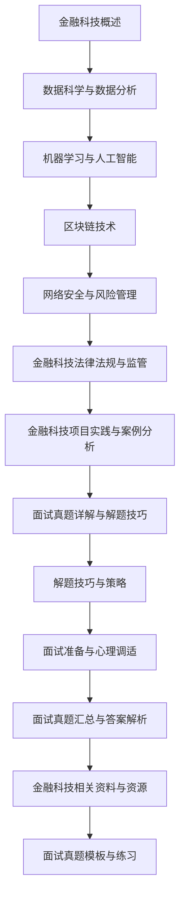

                 

### 《2024京东数科金融科技社招面试真题汇总及其解答》

#### 引言

随着金融科技（Fintech）的迅猛发展，金融行业的数字化转型已经成为大势所趋。各大金融科技公司纷纷加大招聘力度，以满足日益增长的市场需求和技术挑战。京东数科作为国内领先的金融科技公司，其社招面试真题涵盖了金融科技领域的多个方面，包括金融科技概述、数据科学与数据分析、机器学习与人工智能、区块链技术、网络安全与风险管理、金融科技法律法规与监管，以及金融科技项目实践与案例分析。本文将详细汇总并解析这些面试真题，帮助准备应聘京东数科的求职者更好地应对面试挑战。

#### 关键词

- 金融科技
- 社招面试
- 数据科学
- 机器学习
- 区块链
- 网络安全
- 法律法规
- 项目实践

#### 摘要

本文旨在为准备应聘京东数科的求职者提供一套全面的面试真题解析。文章首先概述了金融科技的定义、发展历程及其对传统金融的影响，然后深入探讨了数据科学、机器学习、区块链技术等核心技术领域。此外，文章还分析了网络安全与风险管理、金融科技法律法规与监管等方面，最后通过具体项目实战案例，展示了金融科技的实际应用和实施流程。希望通过本文，读者能够对金融科技面试题有更深入的理解，提高面试成功率。

### 《2024京东数科金融科技社招面试真题汇总及其解答》目录大纲

#### 第一部分：面试真题分类与解读

##### 第1章：金融科技概述

1.1  金融科技的定义与发展历程

1.2  金融科技的核心领域与应用

1.3  金融科技对传统金融的影响

##### 第2章：数据科学与数据分析

2.1  数据科学的基础概念与方法

2.2  数据分析的核心技术

2.3  数据可视化与报表生成

##### 第3章：机器学习与人工智能

3.1  机器学习的基本原理

3.2  常见机器学习算法与应用

3.3  人工智能在金融科技中的应用

##### 第4章：区块链技术

4.1  区块链的基本原理与架构

4.2  区块链在金融科技中的应用

4.3  区块链的安全性分析

##### 第5章：网络安全与风险管理

5.1  网络安全的基本概念与防护措施

5.2  金融科技中的风险管理与防范

5.3  信息安全法律法规与合规要求

##### 第6章：金融科技法律法规与监管

6.1  金融科技法律法规概述

6.2  金融科技监管体系与政策

6.3  金融科技创新与法律风险

##### 第7章：金融科技项目实践与案例分析

7.1  金融科技项目的实施流程与要点

7.2  金融科技项目的成功案例分析

7.3  金融科技项目的挑战与应对策略

#### 第二部分：面试真题详解与解题技巧

##### 第8章：面试真题详解

8.1  面试真题类型与特点

8.2  面试真题解答技巧

8.3  高频面试真题解析

##### 第9章：解题技巧与策略

9.1  面试中的沟通与表达能力

9.2  技术面试中的问题分析与解决

9.3  面试中的团队合作与冲突解决

##### 第10章：面试准备与心理调适

10.1  面试前的准备工作

10.2  面试中的心理调适技巧

10.3  面试后的总结与反思

### 附录

#### 附录A：面试真题汇总与答案解析

A.1 面试真题汇总

A.2 答案解析与建议

#### 附录B：金融科技相关资料与资源

B.1 金融科技相关书籍推荐

B.2 金融科技相关网站与社区

B.3 金融科技相关报告与论文

#### 附录C：面试真题模板与练习

C.1 面试真题模板

C.2 面试真题练习与答案解析

### Mermaid 流程图



### 核心算法原理讲解（伪代码）

```python
# 伪代码：线性回归算法
def linear_regression(X, y):
    # 计算X的转置
    X_transpose = transpose(X)
    
    # 计算X的转置与X的乘积
    XTX = multiply(X_transpose, X)
    
    # 计算X的转置与y的乘积
    XTy = multiply(X_transpose, y)
    
    # 求解回归系数b
    b = multiply(inverse(XTX), XTy)
    
    # 计算预测值y_pred
    y_pred = multiply(X, b)
    
    # 计算均方误差MSE
    MSE = mean_squared_error(y, y_pred)
    
    return b, MSE
```

### 数学模型和数学公式

$$
MSE = \frac{1}{n}\sum_{i=1}^{n}(y_i - y_{\text{pred},i})^2
$$

### 项目实战

#### 1. 开发环境搭建

- 安装Python环境（版本3.8以上）
- 安装NumPy、Pandas、Matplotlib等数据科学库

#### 2. 源代码实现

```python
import numpy as np
import pandas as pd
import matplotlib.pyplot as plt

# 加载数据集
data = pd.read_csv('finance_data.csv')

# 数据预处理
X = data[['feature1', 'feature2', 'feature3']]
y = data['target']

# 训练线性回归模型
b, MSE = linear_regression(X, y)

# 输出模型参数
print("模型参数:", b)
print("均方误差MSE:", MSE)

# 可视化结果
plt.scatter(X['feature1'], y, color='blue')
plt.plot(X['feature1'], X @ b, color='red')
plt.xlabel('Feature1')
plt.ylabel('Target')
plt.title('Linear Regression Visualization')
plt.show()
```

#### 3. 代码解读与分析

- 代码首先加载并预处理数据集，然后使用伪代码中的线性回归算法进行模型训练。
- 模型训练后，输出模型参数和均方误差MSE。
- 最后，使用Matplotlib库将数据点和回归线进行可视化，以便于分析模型的拟合效果。

### 金融科技概述

金融科技，简称Fintech，指的是利用科技手段改进或创造新的金融产品、服务流程或业务模式。它涵盖了从支付、贷款、投资到保险等金融领域的各个方面。金融科技的发展不仅改变了传统的金融业务模式，也深刻影响了消费者的行为和预期。

#### 1.1 金融科技的定义与发展历程

金融科技的定义可以从广义和狭义两个方面来理解。广义上，金融科技指的是所有涉及金融与科技的结合，包括金融产品的设计、开发、推广以及交易过程。狭义上，金融科技则主要指基于互联网、大数据、云计算、人工智能、区块链等新技术在金融服务领域的应用。

金融科技的发展历程可以追溯到20世纪90年代，随着互联网的普及，在线支付、电子银行等业务模式开始出现。进入21世纪后，随着大数据、人工智能、区块链等新兴技术的兴起，金融科技进入了快速发展阶段。以下是一些关键事件：

- **2008年金融危机**：全球金融危机促使金融行业进行数字化转型，金融科技开始受到广泛关注。
- **2010年**：比特币的诞生标志着区块链技术的兴起，为金融科技的发展提供了新的可能性。
- **2014年**：支付宝、微信支付等移动支付平台在中国迅速普及，推动了金融科技的快速发展。
- **2015年**：中国人民银行成立数字货币研究所，开始研究数字货币和区块链技术。
- **2018年**：金融科技公司纷纷上市，如蚂蚁金服、陆金所等，进一步推动了金融科技的普及和发展。

#### 1.2 金融科技的核心领域与应用

金融科技的核心领域包括支付、贷款、投资、保险和区块链技术。以下是这些领域的具体应用：

- **支付**：移动支付、数字货币、跨境支付等。例如，支付宝和微信支付在国内市场占据主导地位，而比特币和莱特币等数字货币在全球范围内受到关注。
- **贷款**：线上借贷、智能投顾、信用评分等。例如，蚂蚁借呗和微众银行的小微企业贷款为消费者和小微企业提供了便捷的融资渠道。
- **投资**：智能投顾、量化投资、众筹等。例如，基金公司和证券公司通过智能投顾平台为投资者提供个性化的投资建议，而众筹平台则为初创企业提供了融资渠道。
- **保险**：智能保险、保险科技等。例如，一些保险公司利用大数据和人工智能技术提供个性化的保险产品和服务。
- **区块链技术**：数字身份、供应链金融、数字货币等。例如，京东数科利用区块链技术进行供应链金融管理，确保数据的透明性和安全性。

#### 1.3 金融科技对传统金融的影响

金融科技对传统金融的影响是深远而广泛的。以下是一些具体的影响：

- **提高效率**：金融科技通过自动化和数字化，大大提高了金融服务的效率。例如，在线支付和电子银行减少了人力和时间成本。
- **降低成本**：金融科技减少了传统金融的中间环节，降低了交易成本。例如，区块链技术在跨境支付中的应用显著降低了交易费用。
- **改变商业模式**：金融科技促使传统金融机构进行数字化转型，推动了业务模式的创新。例如，智能投顾平台改变了传统的理财顾问模式。
- **提高用户体验**：金融科技提供了更加便捷和个性化的金融服务，提升了用户体验。例如，移动支付和在线贷款平台提供了全天候、无缝对接的金融服务。
- **风险管理与监管**：金融科技带来了新的风险和监管挑战。例如，数字货币和加密资产的市场波动性较大，需要加强监管以防范风险。

总之，金融科技正深刻地改变着金融行业，推动传统金融向更加智能化、数字化和高效化方向发展。作为求职者，了解金融科技的基本概念和发展趋势，对于应对金融科技面试至关重要。

### 数据科学与数据分析

数据科学是金融科技领域的基石，它通过多种技术手段提取数据中的价值，帮助金融机构做出更加明智的决策。数据科学的核心包括数据采集、数据预处理、数据分析、数据可视化以及机器学习等环节。数据分析则是数据科学的一个重要分支，它侧重于从数据中发现有价值的信息和模式。

#### 2.1 数据科学的基础概念与方法

数据科学的基础概念包括数据类型、数据结构、数据分析方法和数据预处理技术。以下是一些关键概念和方法的简要介绍：

- **数据类型**：数据科学中的数据类型主要包括结构化数据（如数据库表）、半结构化数据（如XML、JSON）和非结构化数据（如文本、图像、视频）。
- **数据结构**：常见的数据结构包括数组、列表、栈、队列、树、图等。这些数据结构用于高效地存储和操作数据。
- **数据分析方法**：数据分析方法包括描述性分析、预测性分析、相关性分析和聚类分析等。描述性分析用于总结和描述数据的基本特征；预测性分析用于预测未来趋势；相关性分析用于发现数据之间的关联性；聚类分析用于将数据分成不同的群体。
- **数据预处理技术**：数据预处理包括数据清洗、数据集成、数据转换和数据归一化等步骤。数据清洗用于处理缺失值、异常值和重复值；数据集成用于合并多个数据源；数据转换用于将数据转换为适当的格式；数据归一化用于消除不同数据量级的影响。

#### 2.2 数据分析的核心技术

数据分析的核心技术包括统计方法、机器学习和数据可视化。以下是一些关键技术的简要介绍：

- **统计方法**：统计方法是数据分析的基础，包括描述性统计、推断性统计和回归分析等。描述性统计用于总结数据的基本特征，推断性统计用于进行假设检验和置信区间的估计，回归分析用于建模数据之间的线性关系。
- **机器学习**：机器学习是数据分析的重要工具，通过训练模型来发现数据中的模式和规律。常见的机器学习算法包括线性回归、逻辑回归、决策树、随机森林、支持向量机、神经网络等。
- **数据可视化**：数据可视化是将数据转换为图形或图像，以帮助人们理解和分析数据。常用的数据可视化工具包括Matplotlib、Seaborn、Tableau等。

#### 2.3 数据可视化与报表生成

数据可视化是数据分析的重要一环，它能够将复杂的数据以直观的方式呈现出来，帮助决策者快速理解数据背后的含义。以下是数据可视化与报表生成的一些要点：

- **选择合适的图表类型**：根据数据的类型和目标，选择合适的图表类型。常见的图表类型包括柱状图、折线图、饼图、散点图、箱线图等。
- **设计简洁的报表**：报表的设计应简洁明了，避免过多的装饰和复杂的设计元素。报表应包括必要的标题、图例、坐标轴标签和注释等。
- **突出关键信息**：在报表中，应突出关键信息和发现，以便于快速吸引读者的注意力。
- **交互式可视化**：交互式可视化工具（如D3.js、Plotly）允许用户通过鼠标点击、拖动等操作动态地探索数据，从而更好地理解数据。

#### 实际案例

以下是一个简单的数据可视化案例，展示如何使用Python进行数据预处理、分析和可视化。

```python
import pandas as pd
import numpy as np
import matplotlib.pyplot as plt
import seaborn as sns

# 1. 数据预处理
data = pd.read_csv('example_data.csv')
data = data.dropna()  # 删除缺失值
data = data.groupby('category').mean()  # 分组并计算均值

# 2. 数据分析
sns.pairplot(data, hue='category')  # 创建散点图矩阵

# 3. 数据可视化
plt.figure(figsize=(8, 6))
sns.regplot(x='feature1', y='feature2', data=data, scatter_kws={'s':50}, line_kws={'color':'red'})
plt.xlabel('Feature1')
plt.ylabel('Feature2')
plt.title('Feature1 vs Feature2')
plt.show()
```

在这个案例中，我们首先加载了一个CSV文件，然后进行了数据预处理，包括删除缺失值和分组计算均值。接下来，使用Seaborn创建了一个散点图矩阵，以展示不同类别之间的数据分布。最后，使用Matplotlib创建了一个回归图，展示了两个特征之间的线性关系。

### 机器学习与人工智能

机器学习和人工智能（AI）是金融科技的核心驱动力之一，它们通过学习历史数据和模式，帮助金融机构做出更准确的预测和决策。在金融科技领域，机器学习和AI的应用包括风险控制、欺诈检测、信用评分、量化交易等。

#### 3.1 机器学习的基本原理

机器学习是一种让计算机通过数据学习并做出预测或决策的技术。它主要分为监督学习、无监督学习和强化学习三种类型。

- **监督学习**：监督学习是指计算机在已知输出（标签）的情况下学习如何将输入映射到输出。常见的算法包括线性回归、逻辑回归、支持向量机、决策树和随机森林等。
- **无监督学习**：无监督学习是指计算机在没有已知输出的情况下学习数据中的结构和模式。常见的算法包括聚类分析、主成分分析和自编码器等。
- **强化学习**：强化学习是指计算机通过与环境的交互来学习如何做出最优决策。常见的算法包括Q学习、深度Q网络（DQN）和策略梯度算法等。

#### 3.2 常见机器学习算法与应用

以下是一些常见的机器学习算法及其在金融科技中的应用：

- **线性回归**：线性回归是一种简单的监督学习算法，用于建模输入和输出之间的线性关系。在金融科技中，线性回归可用于预测股票价格、房价等。
- **逻辑回归**：逻辑回归是一种广义的线性回归模型，用于分类问题。在金融科技中，逻辑回归可用于信用评分、欺诈检测等。
- **支持向量机**：支持向量机是一种强大的分类算法，通过找到一个最优的超平面来分隔数据。在金融科技中，支持向量机可用于风险评估、信用评分等。
- **决策树**：决策树是一种基于树形结构进行决策的算法，通过递归分割数据集来构建模型。在金融科技中，决策树可用于贷款审批、投资组合优化等。
- **随机森林**：随机森林是一种基于决策树的集成模型，通过构建多个决策树并取平均值来提高预测性能。在金融科技中，随机森林可用于风险评估、信用评分等。
- **神经网络**：神经网络是一种模拟生物神经网络的多层模型，通过前向传播和反向传播算法来学习输入和输出之间的映射关系。在金融科技中，神经网络可用于量化交易、智能投顾等。

#### 3.3 人工智能在金融科技中的应用

人工智能在金融科技中的应用越来越广泛，以下是一些具体的应用场景：

- **风险控制**：AI可以通过分析大量历史数据，识别潜在的风险因素，帮助金融机构进行风险管理和决策。例如，银行可以使用AI技术进行贷款审批、信用评分和风险预警。
- **欺诈检测**：AI可以自动识别和防范金融欺诈行为，通过实时监控交易行为和用户行为，及时发现异常交易和欺诈行为。例如，信用卡公司可以使用AI技术进行交易监控和反欺诈。
- **信用评分**：AI可以基于用户的信用历史、财务状况和其他相关数据，自动生成信用评分，帮助金融机构评估用户的信用风险。例如，信用评级机构可以使用AI技术进行信用评分和风险评估。
- **量化交易**：AI可以基于历史数据和交易规则，自动进行高频交易和量化交易。例如，对冲基金可以使用AI技术进行股票交易、期权交易等。
- **智能投顾**：AI可以基于用户的投资偏好和风险承受能力，自动生成个性化的投资建议和投资组合。例如，金融科技公司可以提供智能投顾服务，帮助用户进行资产配置和投资管理。

总之，机器学习和人工智能在金融科技中的应用正在不断扩展，为金融机构提供了更加智能、高效和准确的风险管理、投资决策和客户服务。

### 区块链技术

区块链技术是一种分布式数据库技术，通过加密算法和共识机制确保数据的不可篡改性和安全性。它最初由中本聪（Satoshi Nakamoto）在2008年提出，并作为比特币的底层技术而闻名。区块链技术不仅在加密货币领域有广泛应用，还在金融科技、供应链管理、智能合约等领域展现出了巨大的潜力。

#### 4.1 区块链的基本原理与架构

区块链是一种由一系列按时间顺序排列的、不可篡改的数据块组成的数据库。每个数据块包含一定数量的交易记录，并使用加密算法将区块与之前的区块链接起来，形成一个链条。以下是区块链的基本原理和架构：

- **数据块**：每个数据块包含交易记录、时间戳、随机数和一个指向前一个区块的哈希值。
- **哈希值**：每个区块都使用加密算法（如SHA-256）生成一个唯一的哈希值，该哈希值作为区块的身份标识。
- **链式结构**：新产生的区块通过其哈希值与前一个区块的哈希值链接起来，形成一条时间有序的区块链。
- **共识机制**：区块链网络中的节点通过共识机制达成一致，确保数据的正确性和安全性。常见的共识机制包括工作量证明（PoW）、权益证明（PoS）、拜占庭容错算法（BFT）等。

#### 4.2 区块链在金融科技中的应用

区块链技术在金融科技中的应用涵盖了多个方面，包括支付、交易结算、智能合约、供应链金融等。以下是区块链在金融科技中的具体应用：

- **支付**：区块链技术可以用于创建去中心化的支付系统，如比特币和莱特币等加密货币。这些系统无需依赖传统银行，可以降低跨境支付的成本和交易时间。
- **交易结算**：区块链可以用于提高交易结算的速度和透明度。通过区块链，交易可以在几分钟内完成确认，而不是几天或几周。
- **智能合约**：智能合约是区块链上的自动化合同，它通过预定义的规则自动执行。在金融科技中，智能合约可以用于贷款、保险和股权交易等，确保合同的执行

