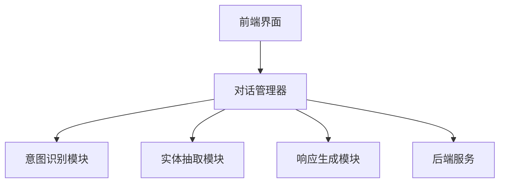

                 

# 人工智能 原理与代码实例讲解

> 关键词：人工智能，机器学习，深度学习，自然语言处理，计算机视觉，项目实战

> 摘要：本文旨在为读者提供全面的人工智能基础知识及实践指南。我们将从人工智能的基本概念出发，逐步深入探讨机器学习、深度学习、自然语言处理和计算机视觉等领域，并通过实际项目案例，展示如何将理论知识应用于实践。最后，我们还将探讨人工智能的伦理问题及未来发展。

### 目录大纲

## 第一部分：人工智能基础

### 第1章：人工智能概述

#### 1.1 人工智能的定义和发展历程

#### 1.2 人工智能的分类

#### 1.3 人工智能的应用领域

### 第2章：机器学习基础

#### 2.1 机器学习概述

#### 2.2 监督学习算法

#### 2.3 非监督学习算法

#### 2.4 强化学习算法

### 第3章：深度学习原理

#### 3.1 深度学习概述

#### 3.2 神经网络架构

#### 3.3 深度学习优化算法

### 第4章：自然语言处理

#### 4.1 语言模型与文本分类

#### 4.2 机器翻译与文本生成

#### 4.3 对话系统与聊天机器人

### 第5章：计算机视觉

#### 5.1 图像处理基础

#### 5.2 卷积神经网络

#### 5.3 目标检测与图像识别

### 第6章：人工智能伦理与未来展望

#### 6.1 人工智能伦理问题

#### 6.2 人工智能的发展趋势

#### 6.3 人工智能的未来影响

## 第二部分：人工智能项目实战

### 第7章：项目实战一——手写数字识别

#### 7.1 项目背景与目标

#### 7.2 数据预处理

#### 7.3 模型训练与优化

#### 7.4 评估与优化

### 第8章：项目实战二——推荐系统

#### 8.1 项目背景与目标

#### 8.2 用户行为数据收集与预处理

#### 8.3 构建推荐模型

#### 8.4 评估与优化

### 第9章：项目实战三——智能聊天机器人

#### 9.1 项目背景与目标

#### 9.2 对话系统架构设计

#### 9.3 语言模型训练

#### 9.4 聊天机器人实现与优化

### 第10章：项目实战四——自动驾驶系统

#### 10.1 项目背景与目标

#### 10.2 数据收集与预处理

#### 10.3 模型训练与优化

#### 10.4 自动驾驶系统实现与测试

## 附录

### 附录A：人工智能开发工具与资源

#### A.1 Python与TensorFlow

#### A.2 PyTorch与Keras

#### A.3 其他常用工具与资源

## 引言

### 人工智能：定义与历史

人工智能（AI，Artificial Intelligence）是计算机科学的一个分支，旨在研究、开发和应用使计算机系统能够执行通常需要人类智能才能完成的任务的技术。这些任务包括识别图像、理解自然语言、解决问题、做出决策等。

人工智能的历史可以追溯到20世纪50年代，当时计算机科学家首次提出制造能够模仿人类智能的机器的概念。1956年，在达特茅斯会议上，人工智能被正式定义为一个科学领域，旨在通过机器模拟人类智能，解决复杂问题。

随着时间的推移，人工智能经历了多个发展阶段。早期的人工智能研究主要集中在符号主义方法上，这种方法依赖于逻辑和符号表示来模拟人类智能。然而，由于局限性，如对大数据和复杂问题的处理能力不足，符号主义方法逐渐被更强大的方法所取代。

20世纪80年代，专家系统成为人工智能的主流方法。专家系统是一种基于规则的知识表示和推理系统，能够模拟专家的知识和决策过程。然而，专家系统的性能仍然受限于规则的复杂性和可维护性。

21世纪初，机器学习特别是深度学习的出现，标志着人工智能进入了新的时代。深度学习利用神经网络的结构，通过学习大量数据自动提取特征，取得了在图像识别、语音识别、自然语言处理等领域的突破性成果。

### 人工智能的分类与应用领域

人工智能可以根据其实现方式和技术特点分为多个子领域，其中最重要的包括机器学习、深度学习、自然语言处理和计算机视觉。

#### 机器学习

机器学习（Machine Learning）是一种让计算机通过数据学习并改进自身性能的方法。它通过训练算法从数据中学习规律，然后使用这些规律进行预测或决策。机器学习可以分为以下几类：

- **监督学习（Supervised Learning）**：训练数据包含输入和输出，模型通过学习输入和输出之间的关系进行预测。
- **非监督学习（Unsupervised Learning）**：训练数据没有标签，模型通过发现数据内在的结构或分布来进行聚类或降维。
- **强化学习（Reinforcement Learning）**：模型通过与环境的交互学习最优策略，通常用于决策问题和游戏。

#### 深度学习

深度学习（Deep Learning）是机器学习的一个分支，它依赖于多层神经网络来学习数据的复杂结构。深度学习在图像识别、语音识别和自然语言处理等领域取得了显著成果。深度学习的主要组成部分包括：

- **神经网络（Neural Networks）**：一种模拟人脑神经元连接的模型。
- **卷积神经网络（Convolutional Neural Networks，CNN）**：用于图像处理。
- **递归神经网络（Recurrent Neural Networks，RNN）**：用于处理序列数据。
- **生成对抗网络（Generative Adversarial Networks，GAN）**：用于生成逼真的图像和数据。

#### 自然语言处理

自然语言处理（Natural Language Processing，NLP）是研究如何让计算机理解和生成自然语言的领域。NLP在文本分类、机器翻译、情感分析和对话系统等方面有广泛应用。NLP的关键技术包括：

- **语言模型（Language Models）**：用于生成或理解自然语言。
- **词向量（Word Vectors）**：将词汇映射到向量空间，以捕捉词汇之间的关系。
- **文本分类（Text Classification）**：将文本数据分类到预定义的类别。

#### 计算机视觉

计算机视觉（Computer Vision）是使计算机能够从图像或视频中提取信息的一个领域。计算机视觉在图像识别、视频监控、自动驾驶和医学图像分析等方面有广泛应用。计算机视觉的关键技术包括：

- **图像处理（Image Processing）**：对图像进行增强、滤波、分割等操作。
- **目标检测（Object Detection）**：识别图像中的物体并定位其位置。
- **图像识别（Image Recognition）**：识别图像中的内容。

### 应用领域

人工智能在多个领域有着广泛的应用：

- **医疗健康**：用于诊断、治疗和健康监测。
- **金融**：用于风险评估、欺诈检测和投资策略。
- **制造业**：用于自动化、质量控制和供应链管理。
- **交通**：用于自动驾驶、智能交通系统和车辆安全。
- **娱乐**：用于游戏开发、视频分析和虚拟现实。

### 结论

人工智能是一门涉及多个学科、具有广泛应用的领域。通过本文，我们介绍了人工智能的定义、历史、分类及主要应用领域。在后续章节中，我们将深入探讨人工智能的核心技术，并通过实际项目案例展示如何将理论知识应用于实践。让我们一起探索这个充满机遇和挑战的领域。

## 第一部分：人工智能基础

### 第1章：人工智能概述

人工智能（AI）作为计算机科学的一个重要分支，已经成为现代科技领域中的一个关键驱动力。在本章节中，我们将对人工智能的定义、发展历程、分类和应用领域进行详细探讨，为后续章节的技术深入奠定基础。

#### 1.1 人工智能的定义

人工智能，简称AI，是指通过计算机程序模拟人类智能行为和思维过程的科学技术。AI系统可以执行各种复杂的任务，如语音识别、图像识别、决策制定、问题解决和自然语言理解等。AI的定义强调了计算机模拟人类智能的能力，而不是简单地实现特定任务的自动化。

#### 1.2 人工智能的发展历程

人工智能的发展历程可以分为以下几个阶段：

1. **早期探索阶段（1956年-1969年）**：
   1956年，达特茅斯会议上，约翰·麦卡锡（John McCarthy）等人首次提出了人工智能的概念，标志着人工智能作为一个独立学科的诞生。这一阶段的主要研究方向是符号主义人工智能，试图通过编写规则和逻辑推理来模拟人类智能。

2. **繁荣时期（1970年-1980年）**：
   1970年代，人工智能进入了快速发展的阶段。专家系统的出现使得AI在医学诊断、金融咨询等领域取得了显著的成果。然而，由于受限于计算能力和数据规模，这一阶段的AI发展逐渐陷入停滞。

3. **低谷时期（1980年-1990年）**：
   随着人工智能的发展遭遇瓶颈，加之计算能力的限制，人工智能进入了一个相对低谷的时期。许多人工智能项目被取消，研究人员转向其他领域。

4. **复兴阶段（1990年-2010年）**：
   进入1990年代，随着计算机性能的提升和互联网的普及，机器学习开始崛起。通过学习大量数据，机器学习算法在语音识别、图像识别等领域取得了突破性进展。

5. **深度学习时代（2010年至今）**：
   2010年后，深度学习作为机器学习的一个分支，取得了巨大的成功。深度学习通过多层神经网络模拟人脑神经元连接，使得图像识别、语音识别、自然语言处理等领域取得了革命性的进展。

#### 1.3 人工智能的分类

人工智能可以根据其实现方式和技术特点分为以下几类：

1. **符号主义人工智能（Symbolic AI）**：
   符号主义人工智能依赖于逻辑推理和知识表示，通过编写规则和逻辑来模拟人类智能。这种方法在早期人工智能研究中占据主导地位，但由于其复杂性和局限性，逐渐被其他方法取代。

2. **统计人工智能（Statistical AI）**：
   统计人工智能依赖于数据驱动的方法，通过学习数据中的统计规律进行预测和决策。机器学习和深度学习都是统计人工智能的重要分支。

3. **基于模型的AI（Model-Based AI）**：
   基于模型的AI通过构建数学模型来模拟现实世界，如物理模型、生物模型等。这种方法的代表性应用包括机器人、自动驾驶系统等。

4. **混合式人工智能（Hybrid AI）**：
   混合式人工智能结合了符号主义人工智能和数据驱动方法，旨在发挥各自的优势，解决复杂问题。这种方法在智能决策、智能控制等领域有广泛应用。

#### 1.4 人工智能的应用领域

人工智能在多个领域有着广泛的应用：

1. **医疗健康**：
   人工智能在医学诊断、药物研发、疾病预测等方面发挥着重要作用。例如，通过深度学习算法，可以自动识别医学图像中的病灶，提高诊断的准确性和效率。

2. **金融**：
   人工智能在金融领域的应用包括风险评估、欺诈检测、投资策略等。例如，机器学习算法可以分析大量的交易数据，识别潜在的欺诈行为，降低金融风险。

3. **制造业**：
   人工智能在制造业中的应用包括自动化生产、质量控制、供应链管理等。例如，通过机器视觉系统，可以自动检测生产线上出现的缺陷产品，提高生产效率。

4. **交通**：
   人工智能在交通领域的应用包括自动驾驶、智能交通系统、车辆安全等。例如，自动驾驶技术利用深度学习和计算机视觉技术，实现车辆的自主驾驶。

5. **娱乐**：
   人工智能在娱乐领域的应用包括游戏开发、视频分析、虚拟现实等。例如，通过自然语言处理技术，可以实现智能对话和情感分析，提升用户体验。

#### 1.5 人工智能的挑战与未来趋势

尽管人工智能取得了巨大的进步，但仍面临许多挑战：

1. **数据隐私和安全**：
   人工智能系统通常需要大量的数据来进行训练，这引发了数据隐私和安全的问题。如何保护用户数据的安全和隐私，是一个亟待解决的问题。

2. **算法透明性和可解释性**：
   人工智能系统，尤其是深度学习模型，往往被视为“黑盒”模型，其内部决策过程难以理解。提高算法的透明性和可解释性，是未来的一个重要研究方向。

3. **计算资源需求**：
   人工智能模型，尤其是深度学习模型，需要大量的计算资源进行训练和推理。如何优化计算资源的使用，是一个重要的挑战。

4. **伦理和道德问题**：
   人工智能的应用引发了许多伦理和道德问题，如歧视、偏见、失业等。如何在人工智能的发展过程中，充分考虑伦理和道德问题，是一个重要的议题。

未来，人工智能将继续朝着以下趋势发展：

1. **更加智能化和自适应**：
   人工智能系统将更加智能化和自适应，能够更好地理解和应对复杂的环境和任务。

2. **跨领域融合**：
   人工智能将与其他领域（如生物医学、物理学等）进行深度融合，推动跨学科研究的发展。

3. **人机协作**：
   人工智能将更多地与人类进行协作，实现人机共生，提高生产效率和生活质量。

4. **自主化和自动化**：
   人工智能系统将实现更高程度的自主化和自动化，减少对人类干预的依赖。

总之，人工智能作为一门迅速发展的学科，将在未来继续改变我们的生活和生产方式。通过本文的介绍，我们希望读者能够对人工智能有一个全面而深刻的理解，为后续章节的学习和实践奠定基础。

### 第2章：机器学习基础

机器学习（Machine Learning，ML）是人工智能（AI）的一个重要分支，旨在通过数据和算法，使计算机系统能够自动学习和改进性能。在本章节中，我们将详细介绍机器学习的基本概念、主要类型及其在各个领域中的应用。

#### 2.1 机器学习概述

机器学习是一种使计算机系统能够从数据中学习并做出预测或决策的方法。与传统的编程不同，机器学习不依赖于手动编写具体的规则，而是通过训练算法，从大量数据中自动提取特征和模式。

机器学习的基本流程包括以下步骤：

1. **数据收集**：收集用于训练的数据集，这些数据可以是结构化的（如表格数据）或非结构化的（如图像、文本等）。
2. **数据预处理**：对收集到的数据进行清洗、归一化和特征提取，以便模型可以更好地学习。
3. **模型训练**：使用训练数据集，通过优化算法调整模型的参数，使其能够准确预测或决策。
4. **模型评估**：使用验证数据集评估模型的性能，包括准确率、召回率、F1分数等指标。
5. **模型部署**：将训练好的模型部署到生产环境中，进行实际应用。

#### 2.2 监督学习算法

监督学习（Supervised Learning）是机器学习中最常见的类型之一，其核心思想是通过已知的输入和输出数据，训练模型预测未知数据的输出。

**监督学习的主要算法包括**：

1. **线性回归（Linear Regression）**：
   线性回归是一种简单的监督学习算法，用于预测连续值输出。其模型形式为 \(y = wx + b\)，其中 \(w\) 是权重，\(b\) 是偏置，\(x\) 是输入特征，\(y\) 是输出值。

2. **逻辑回归（Logistic Regression）**：
   逻辑回归是一种用于分类问题的监督学习算法，其输出是概率值。逻辑回归的模型形式为 \(P(y=1) = \frac{1}{1 + e^{-(wx + b)}}\)，其中 \(P(y=1)\) 是目标为1的概率。

3. **支持向量机（Support Vector Machine，SVM）**：
   支持向量机是一种强大的分类算法，其目标是在特征空间中找到一个最优的超平面，使得不同类别的数据点分隔得尽可能远。SVM的决策边界由支持向量决定。

4. **决策树（Decision Tree）**：
   决策树是一种树形结构模型，通过一系列的判断条件来对数据进行分类。决策树的每个节点表示一个特征，每个分支表示特征的不同取值。

5. **随机森林（Random Forest）**：
   随机森林是一种集成学习方法，通过构建多棵决策树，并对预测结果进行投票来提高分类和回归任务的性能。

**监督学习在各个领域的应用**：

- **医疗健康**：用于疾病诊断、药物研发和患者健康监测。
- **金融**：用于信用评分、风险管理和投资策略。
- **零售**：用于需求预测、库存管理和市场营销。
- **交通**：用于交通流量预测、事故预警和自动驾驶。

#### 2.3 非监督学习算法

非监督学习（Unsupervised Learning）是机器学习的另一种类型，其核心思想是在没有标签数据的情况下，通过发现数据内在的结构或分布，对数据进行分析。

**非监督学习的主要算法包括**：

1. **聚类（Clustering）**：
   聚类是将数据分为若干个类别的过程，每个类别内的数据点相似度较高，而不同类别之间的数据点相似度较低。常见的聚类算法包括K-means、DBSCAN和层次聚类等。

2. **降维（Dimensionality Reduction）**：
   降维是一种减少数据维度而不损失太多信息的方法，常用的降维算法包括主成分分析（PCA）和t-SNE等。

3. **关联规则学习（Association Rule Learning）**：
   关联规则学习用于发现数据之间的关联关系，常见的算法包括Apriori算法和FP-Growth算法。

**非监督学习在各个领域的应用**：

- **推荐系统**：用于发现用户之间的相似性，提供个性化推荐。
- **文本分析**：用于提取文本数据中的主题和关键词。
- **图像处理**：用于图像分类和图像分割。

#### 2.4 强化学习算法

强化学习（Reinforcement Learning，RL）是一种机器学习范式，通过学习在环境中的交互策略，实现最优行为。强化学习的主要特点是学习过程中存在反馈机制，即通过奖励或惩罚来指导学习。

**强化学习的主要算法包括**：

1. **Q学习（Q-Learning）**：
   Q学习是一种基于值函数的强化学习算法，通过学习状态-动作值函数 \(Q(s,a)\)，选择最优动作 \(a\)。

2. **策略梯度（Policy Gradient）**：
   策略梯度是一种直接优化策略的强化学习算法，通过学习策略参数来优化策略。

3. **深度强化学习（Deep Reinforcement Learning）**：
   深度强化学习是将深度学习与强化学习相结合的方法，通过神经网络来表示值函数或策略，适用于复杂环境。

**强化学习在各个领域的应用**：

- **游戏**：用于实现智能游戏玩家。
- **机器人**：用于实现智能机器人自主导航和任务执行。
- **推荐系统**：用于发现用户行为模式，提供个性化推荐。

#### 2.5 机器学习在实际项目中的应用

机器学习在各个领域有着广泛的应用，以下是一些典型的实际项目案例：

1. **手写数字识别**：
   利用监督学习算法，如卷积神经网络（CNN），对手写数字进行识别，应用于银行支票识别和智能写作辅助。

2. **推荐系统**：
   利用协同过滤算法和基于内容的推荐算法，为用户推荐感兴趣的商品、音乐、电影等。

3. **智能聊天机器人**：
   利用自然语言处理技术，实现与用户的自然对话，应用于客户服务、教育辅导等。

4. **自动驾驶系统**：
   利用深度学习算法，实现车辆在复杂环境中的自主导航和障碍物检测。

5. **医疗诊断**：
   利用图像识别和深度学习技术，实现疾病的自动诊断和预测，如癌症筛查和糖尿病视网膜病变检测。

通过以上对机器学习基础内容的介绍，我们希望读者能够对机器学习有一个全面的了解，为后续章节的深入学习打下基础。在下一章中，我们将进一步探讨深度学习原理和应用。

### 第3章：深度学习原理

深度学习（Deep Learning，DL）是机器学习的一个重要分支，通过构建深层神经网络来模拟人脑的神经元连接和功能。在本章节中，我们将深入探讨深度学习的核心概念、神经网络架构及其优化算法。

#### 3.1 深度学习概述

深度学习通过多层神经网络（Neural Networks）对数据进行处理，从而自动提取特征和模式。与传统的机器学习方法相比，深度学习在处理复杂任务时表现更为出色，特别是在图像识别、自然语言处理和语音识别等领域。

深度学习的核心思想是多层神经网络通过逐层提取数据中的抽象特征，从而实现对数据的理解。这些特征在训练过程中自动学习，不需要人工进行特征工程。

#### 3.2 神经网络架构

神经网络是深度学习的核心组成部分，它由多个层次组成，包括输入层、隐藏层和输出层。每个层次包含多个神经元（也称为节点），神经元之间通过权重（weights）和偏置（bias）进行连接。

1. **输入层（Input Layer）**：
   输入层是神经网络的起始点，接收外部输入数据。每个输入数据对应一个神经元。

2. **隐藏层（Hidden Layers）**：
   隐藏层是神经网络的核心部分，负责对输入数据进行处理和提取特征。隐藏层可以有一个或多个，层数越多，模型能够提取的特征层次越丰富。

3. **输出层（Output Layer）**：
   输出层是神经网络的终点，负责生成最终的输出结果。输出层的神经元数量和类型取决于具体任务。

**常见的神经网络架构**：

1. **全连接神经网络（Fully Connected Neural Network）**：
   全连接神经网络是深度学习中最常见的架构，每个神经元的输入是前一层所有神经元的输出，每个神经元与后一层的所有神经元相连。

2. **卷积神经网络（Convolutional Neural Network，CNN）**：
   卷积神经网络是专门用于图像处理的神经网络，通过卷积操作提取图像的局部特征。CNN在图像识别、目标检测和图像生成等领域有广泛应用。

3. **递归神经网络（Recurrent Neural Network，RNN）**：
   递归神经网络是用于处理序列数据的神经网络，能够通过递归结构记住历史信息。RNN在自然语言处理、语音识别和时间序列预测等领域有广泛应用。

4. **长短期记忆网络（Long Short-Term Memory，LSTM）**：
   长短期记忆网络是RNN的一种改进，通过门控机制解决了传统RNN的长期依赖问题。LSTM在时间序列预测、机器翻译和文本生成等领域有广泛应用。

5. **生成对抗网络（Generative Adversarial Network，GAN）**：
   生成对抗网络是由两个神经网络组成的对抗性模型，一个生成器网络和一个判别器网络。生成器网络试图生成与真实数据相似的数据，而判别器网络试图区分生成数据和真实数据。GAN在图像生成、数据增强和风格迁移等领域有广泛应用。

#### 3.3 深度学习优化算法

深度学习模型的训练过程实际上是一个优化过程，目标是调整网络的权重和偏置，使模型在训练数据上达到最佳的预测性能。常见的深度学习优化算法包括随机梯度下降（SGD）、Adam优化器等。

1. **随机梯度下降（Stochastic Gradient Descent，SGD）**：
   随机梯度下降是最常用的优化算法之一，其核心思想是使用每个样本的梯度来更新模型的权重。SGD通过随机抽样数据集来计算梯度，从而加快收敛速度。

2. **Adam优化器（Adam Optimizer）**：
   Adam优化器是一种基于SGD的改进算法，它结合了AdaGrad和RMSProp的优点，通过自适应调整学习率来提高训练效率。Adam在许多深度学习任务中表现出色。

3. **其他优化算法**：
   除了SGD和Adam，还有一些其他的优化算法，如AdaGrad、RMSProp和AdamW等，这些算法通过不同的策略调整学习率，以提高训练性能。

#### 3.4 深度学习在实际项目中的应用

深度学习在各个领域有着广泛的应用，以下是一些典型的实际项目案例：

1. **图像识别**：
   利用卷积神经网络（CNN）进行图像分类和目标检测，如ImageNet图像识别挑战赛。

2. **自然语言处理**：
   利用递归神经网络（RNN）和长短期记忆网络（LSTM）进行文本分类、机器翻译和情感分析。

3. **语音识别**：
   利用深度神经网络（DNN）和卷积神经网络（CNN）进行语音信号的自动识别和转录。

4. **自动驾驶**：
   利用深度学习算法进行道路环境感知、障碍物检测和路径规划。

5. **医疗诊断**：
   利用深度学习技术进行医学图像分析、疾病诊断和药物研发。

通过以上对深度学习原理的介绍，我们希望读者能够对深度学习有一个全面而深入的理解，为后续章节的学习和实践打下基础。在下一章中，我们将探讨自然语言处理的基础知识。

### 第4章：自然语言处理

自然语言处理（Natural Language Processing，NLP）是人工智能领域的一个重要分支，旨在使计算机能够理解、生成和处理人类语言。在本章节中，我们将探讨自然语言处理的核心概念、关键技术及其应用。

#### 4.1 语言模型与文本分类

语言模型（Language Model）是自然语言处理的基础，用于预测文本中的下一个单词或字符。语言模型在许多NLP任务中扮演着重要角色，如自动完成、语音识别和机器翻译。

1. **N元语言模型**：
   N元语言模型是一种基于N个历史单词来预测下一个单词的方法。最常见的N元语言模型是三元语言模型，它使用三个历史单词来预测下一个单词。N元语言模型通过统计方法学习单词之间的概率分布，从而生成自然语言。

2. **神经网络语言模型**：
   神经网络语言模型通过多层神经网络来学习单词之间的概率分布。与传统的N元语言模型相比，神经网络语言模型能够更好地捕捉单词之间的复杂关系，从而生成更自然的语言。

文本分类（Text Classification）是将文本数据按照预定义的类别进行分类的过程。文本分类在信息检索、情感分析和舆情监测等领域有广泛应用。

1. **朴素贝叶斯分类器**：
   朴素贝叶斯分类器是一种基于概率论的分类算法，通过计算每个类别条件概率的最大值来确定文本的类别。朴素贝叶斯分类器假设特征之间相互独立，这在实际应用中是一个简化但有效的假设。

2. **支持向量机（SVM）**：
   支持向量机是一种强大的分类算法，通过找到一个最优的超平面来分隔不同类别的数据点。SVM在文本分类任务中取得了显著的性能。

3. **深度学习分类器**：
   深度学习分类器通过构建深层神经网络来学习文本的特征表示，并在分类任务中取得良好的效果。常见的深度学习分类器包括卷积神经网络（CNN）和递归神经网络（RNN）。

#### 4.2 机器翻译与文本生成

机器翻译（Machine Translation）是将一种语言的文本翻译成另一种语言的过程。机器翻译在跨语言交流、全球化业务和辅助翻译等领域有重要应用。

1. **规则基机器翻译**：
   规则基机器翻译通过编写手工规则来翻译文本，这种方法在早期机器翻译研究中占据主导地位。规则基机器翻译依赖于语言学知识和翻译经验，但这种方法在处理复杂句子和语境时效果不佳。

2. **统计机器翻译**：
   统计机器翻译通过学习大量双语文本数据，统计源语言和目标语言之间的映射关系。统计机器翻译利用概率模型和统计方法，如N元语法和隐马尔可夫模型（HMM），来生成目标语言文本。

3. **神经网络机器翻译**：
   神经网络机器翻译通过构建深层神经网络来学习源语言和目标语言之间的映射关系。与统计机器翻译相比，神经网络机器翻译能够更好地捕捉语言中的复杂结构，从而生成更自然的翻译文本。常见的神经网络机器翻译模型包括序列到序列（Seq2Seq）模型和注意力机制（Attention Mechanism）。

文本生成（Text Generation）是将文本数据转换为自然语言表达的过程。文本生成在生成式对话系统、自动写作和创意写作等领域有广泛应用。

1. **模板生成**：
   模板生成通过将变量替换为实际内容来生成文本。模板生成适用于结构化数据，但在生成自由文本时效果有限。

2. **基于规则的生成**：
   基于规则的生成通过编写规则来生成文本。这种方法适用于特定领域或场景的文本生成，但生成文本的多样性和灵活性有限。

3. **生成对抗网络（GAN）**：
   生成对抗网络是一种通过对抗性训练生成高质量文本的方法。生成对抗网络由生成器和判别器组成，生成器试图生成与真实文本相似的数据，而判别器试图区分生成数据和真实数据。通过这种对抗性训练，生成对抗网络能够生成具有较高自然度和多样性的文本。

#### 4.3 对话系统与聊天机器人

对话系统（Dialogue System）是一种与人类进行自然语言交互的计算机系统。对话系统在客户服务、虚拟助理和娱乐等领域有广泛应用。

1. **任务型对话系统**：
   任务型对话系统专注于完成特定任务，如订票、查询信息等。任务型对话系统通常采用基于模板的方法，通过预定义的对话流程和用户输入的解析来生成响应。

2. **闲聊型对话系统**：
   闲聊型对话系统能够与用户进行无特定目标的闲聊，提供娱乐和陪伴。闲聊型对话系统通常采用生成式对话方法，通过学习大量的对话数据来生成自然流畅的对话。

聊天机器人（Chatbot）是一种基于对话系统的自动化交互代理，用于模拟人类对话。聊天机器人广泛应用于客户服务、市场营销和用户支持等领域。

1. **规则驱动型聊天机器人**：
   规则驱动型聊天机器人通过预定义的规则和条件来生成响应。这种方法适用于简单和明确的对话场景，但灵活性较低。

2. **基于机器学习型聊天机器人**：
   基于机器学习型聊天机器人通过学习大量的对话数据来生成响应。这种方法能够更好地应对复杂和多样化的对话场景，但需要大量的训练数据和计算资源。

3. **深度学习驱动型聊天机器人**：
   深度学习驱动型聊天机器人通过构建深层神经网络来学习对话数据，从而生成更自然和流畅的对话。深度学习驱动型聊天机器人是未来的发展方向，能够提供更智能和个性化的服务。

通过以上对自然语言处理基础知识的介绍，我们希望读者能够对NLP的核心概念和关键技术有一个全面的理解。在下一章中，我们将探讨计算机视觉的基本原理和应用。

### 第5章：计算机视觉

计算机视觉（Computer Vision，CV）是人工智能领域的一个重要分支，旨在使计算机能够从图像和视频中提取信息，并对其进行理解和处理。在本章节中，我们将介绍计算机视觉的基本原理、关键技术和应用领域。

#### 5.1 图像处理基础

图像处理是计算机视觉的基础，它涉及对图像的增强、滤波、分割和特征提取等操作。

1. **图像增强（Image Enhancement）**：
   图像增强的目的是改善图像的质量，使其更适合后续的处理和分析。常见的图像增强技术包括对比度增强、锐化、噪声抑制等。

2. **图像滤波（Image Filtering）**：
   图像滤波是一种用于去除图像噪声和细节的方法。常见的滤波器包括均值滤波、高斯滤波和中值滤波等。

3. **图像分割（Image Segmentation）**：
   图像分割是将图像划分为不同的区域或对象的过程。常见的分割方法包括基于阈值的方法、基于边缘的方法和基于区域生长的方法等。

4. **特征提取（Feature Extraction）**：
   特征提取是从图像中提取具有区分性的特征，用于后续的分类和识别。常见的特征提取方法包括边缘检测、角点检测、纹理分析等。

#### 5.2 卷积神经网络

卷积神经网络（Convolutional Neural Network，CNN）是计算机视觉的核心技术，它通过多层卷积和池化操作，自动提取图像中的高层次特征。

1. **卷积操作（Convolution Operation）**：
   卷积操作是将卷积核（filter）与图像进行卷积运算，从而生成新的特征图。卷积核通过学习图像中的局部特征，如边缘、纹理等。

2. **池化操作（Pooling Operation）**：
   池化操作是对特征图进行下采样，从而减少参数数量和计算复杂度。常见的池化操作包括最大池化和平均池化等。

3. **网络结构（Network Architecture）**：
   常见的CNN架构包括卷积层、池化层和全连接层。卷积层用于提取图像特征，池化层用于下采样和特征压缩，全连接层用于分类和回归任务。

4. **典型的CNN模型**：
   - **LeNet**：最早的CNN模型之一，用于手写数字识别。
   - **AlexNet**：引入了ReLU激活函数和大数据集训练，显著提升了图像识别的性能。
   - **VGGNet**：通过增加网络的深度和宽度，进一步提升了图像识别的性能。
   - **ResNet**：引入了残差连接，解决了深层网络中的梯度消失问题。
   - **InceptionNet**：通过构建多尺度的卷积操作，提高了网络的特征提取能力。

#### 5.3 目标检测与图像识别

目标检测（Object Detection）是计算机视觉的重要任务之一，旨在从图像中检测出特定的目标物体并定位其位置。

1. **区域建议（Region Proposal）**：
   区域建议是在图像中生成可能包含目标的区域。常见的区域建议方法包括基于滑动窗口的方法、基于深度学习的方法等。

2. **分类与定位（Classification and Localization）**：
   在目标检测中，每个区域建议需要进行分类，判断是否为目标物体，并定位目标在图像中的位置。常见的目标检测算法包括YOLO、SSD、Faster R-CNN等。

图像识别（Image Recognition）是计算机视觉的另一个重要任务，旨在识别图像中的对象和场景。

1. **特征提取与分类**：
   图像识别通常通过特征提取算法（如图像特征点、SIFT、HOG等）提取图像特征，然后使用分类器（如图像分类器、SVM等）进行分类。

2. **深度学习方法**：
   深度学习方法在图像识别任务中取得了显著的效果。常见的深度学习图像识别模型包括CNN、Inception模型等。

#### 5.4 计算机视觉在实际项目中的应用

计算机视觉在多个领域有着广泛的应用，以下是一些典型的实际项目案例：

1. **自动驾驶**：
   自动驾驶系统利用计算机视觉技术进行道路环境感知、障碍物检测和路径规划。通过摄像头和激光雷达等传感器，自动驾驶系统能够实时获取道路信息，确保车辆的自主驾驶。

2. **医疗诊断**：
   计算机视觉技术在医疗诊断中有着重要的应用，如通过图像识别技术进行病变检测、疾病诊断和药物研发。

3. **安防监控**：
   安防监控系统利用计算机视觉技术进行实时监控、人脸识别和异常行为检测，提高监控效率和安全性。

4. **零售**：
   计算机视觉技术在零售领域有广泛的应用，如通过图像识别和目标检测技术进行库存管理、商品识别和顾客行为分析。

5. **娱乐**：
   计算机视觉技术在娱乐领域有广泛的应用，如通过动作捕捉技术进行虚拟现实和增强现实游戏，提供沉浸式的娱乐体验。

通过以上对计算机视觉基本原理和应用的介绍，我们希望读者能够对计算机视觉有一个全面而深入的理解。在下一章中，我们将探讨人工智能伦理与未来展望。

### 第6章：人工智能伦理与未来展望

随着人工智能（AI）技术的迅猛发展，其在社会各个领域的应用越来越广泛，同时也引发了许多伦理和道德问题。在本章节中，我们将探讨人工智能伦理的核心问题，以及人工智能未来发展的趋势和影响。

#### 6.1 人工智能伦理问题

人工智能伦理问题主要涉及以下几个方面：

1. **隐私保护**：
   人工智能系统通常需要大量的数据来进行训练和运行，这引发了隐私保护的问题。如何确保用户的隐私不被泄露，是一个亟待解决的伦理问题。

2. **算法偏见**：
   人工智能算法可能会因训练数据的不公平或偏差而产生偏见，导致对某些人群的不公平对待。例如，人脸识别系统可能会对某些种族或性别的人产生误识别。

3. **安全性**：
   人工智能系统可能成为黑客攻击的目标，从而导致严重的安全问题。例如，自动驾驶汽车的安全性问题引起了广泛关注。

4. **就业影响**：
   人工智能技术的发展可能会对就业市场产生重大影响，特别是对那些重复性、低技能的工作岗位。如何应对这种就业变化，是另一个重要的伦理问题。

#### 6.2 人工智能的发展趋势

人工智能的未来发展将继续呈现出以下几个趋势：

1. **更加智能化和自适应**：
   人工智能系统将变得更加智能化和自适应，能够更好地理解和应对复杂的环境和任务。通过深度学习和强化学习等技术，人工智能系统将实现更高级的智能。

2. **跨领域融合**：
   人工智能技术将继续与其他领域（如生物医学、物理学等）进行深度融合，推动跨学科研究的发展。例如，利用人工智能技术进行医学图像分析和药物研发。

3. **人机协作**：
   人工智能系统将更多地与人类进行协作，实现人机共生，提高生产效率和生活质量。人机协作将使人工智能系统在复杂任务中发挥更大的作用。

4. **自主化和自动化**：
   人工智能系统将实现更高程度的自主化和自动化，减少对人类干预的依赖。例如，自动驾驶技术将使交通系统更加高效和可靠。

#### 6.3 人工智能的未来影响

人工智能将对社会、经济、文化等各个方面产生深远的影响：

1. **经济领域**：
   人工智能技术将推动经济增长，提高生产效率和服务质量。同时，人工智能也可能会改变就业结构，对某些行业产生冲击。

2. **社会领域**：
   人工智能技术将改变人们的生活方式，提供更便捷、高效的公共服务。然而，人工智能也可能会引发隐私和安全问题，需要制定相应的政策和法规。

3. **文化领域**：
   人工智能技术的发展将带来新的文化形态和艺术形式，如虚拟现实、增强现实等。人工智能还将促进文化交流和全球化发展。

4. **伦理与法律**：
   人工智能的快速发展引发了许多伦理和法律问题，需要建立相应的伦理准则和法律法规来规范人工智能的发展和应用。

通过以上对人工智能伦理与未来展望的探讨，我们希望读者能够对人工智能的伦理问题和发展趋势有更深入的认识。在下一部分中，我们将通过实际项目案例，展示如何将人工智能的理论知识应用于实践。

## 第二部分：人工智能项目实战

### 第7章：项目实战一——手写数字识别

手写数字识别是一个经典的人工智能项目，旨在通过机器学习算法，识别和分类手写的数字图像。在本章中，我们将通过一个实际项目案例，详细讲解手写数字识别的步骤，包括数据预处理、模型选择、训练和评估。

#### 7.1 项目背景与目标

手写数字识别是计算机视觉和机器学习领域的常见任务，它广泛应用于自动识别银行支票、手写文档扫描、智能手写输入等领域。本项目旨在实现一个能够准确识别和分类手写数字的模型，具体目标如下：

1. **数据预处理**：对输入的手写数字图像进行预处理，包括图像增强、大小调整和灰度化等。
2. **模型选择**：选择适合手写数字识别的模型，如卷积神经网络（CNN）。
3. **模型训练**：使用训练数据集，训练所选模型，优化模型的参数。
4. **模型评估**：使用验证数据集和测试数据集，评估模型的准确性和泛化能力。
5. **模型部署**：将训练好的模型部署到生产环境中，实现实时手写数字识别。

#### 7.2 数据预处理

数据预处理是机器学习项目的关键步骤，它直接影响模型的性能。在手写数字识别项目中，我们需要对输入图像进行以下预处理操作：

1. **图像增强**：
   图像增强的目的是提高图像的质量，使其更适合后续的处理。常用的图像增强方法包括对比度增强、亮度调整、噪声抑制等。例如，可以使用以下Python代码进行对比度增强：
   
   ```python
   import cv2
   import numpy as np

   def enhance_contrast(image, alpha=1.5, beta=0):
       enhanced_image = cv2.addWeighted(image, alpha, np.zeros(image.shape, image.dtype), 0, beta)
       return enhanced_image
   ```

2. **大小调整**：
   为了统一输入图像的尺寸，我们需要对图像进行大小调整。常见的调整方法包括缩放、裁剪等。例如，可以使用以下Python代码将图像调整为固定大小：
   
   ```python
   def resize_image(image, size=(28, 28)):
       resized_image = cv2.resize(image, size, interpolation=cv2.INTER_AREA)
       return resized_image
   ```

3. **灰度化**：
   将彩色图像转换为灰度图像，可以简化模型处理的复杂性。例如，可以使用以下Python代码将彩色图像转换为灰度图像：
   
   ```python
   def convert_to_grayscale(image):
       grayscale_image = cv2.cvtColor(image, cv2.COLOR_BGR2GRAY)
       return grayscale_image
   ```

#### 7.3 模型选择

在手写数字识别项目中，卷积神经网络（CNN）是一个常见的模型选择。CNN能够自动提取图像的特征，特别适合处理图像识别任务。以下是一个简单的CNN模型示例，使用TensorFlow和Keras构建：

```python
from tensorflow.keras.models import Sequential
from tensorflow.keras.layers import Conv2D, MaxPooling2D, Flatten, Dense

def build_cnn_model(input_shape=(28, 28, 1)):
    model = Sequential()
    model.add(Conv2D(32, kernel_size=(3, 3), activation='relu', input_shape=input_shape))
    model.add(MaxPooling2D(pool_size=(2, 2)))
    model.add(Conv2D(64, kernel_size=(3, 3), activation='relu'))
    model.add(MaxPooling2D(pool_size=(2, 2)))
    model.add(Flatten())
    model.add(Dense(128, activation='relu'))
    model.add(Dense(10, activation='softmax'))
    model.compile(optimizer='adam', loss='categorical_crossentropy', metrics=['accuracy'])
    return model
```

#### 7.4 模型训练

在模型训练过程中，我们需要准备训练数据和验证数据。MNIST数据集是一个常用的手写数字数据集，包含60000个训练样本和10000个测试样本。以下是如何使用MNIST数据集训练CNN模型：

```python
from tensorflow.keras.datasets import mnist
from tensorflow.keras.utils import to_categorical

# 加载MNIST数据集
(train_images, train_labels), (test_images, test_labels) = mnist.load_data()

# 数据预处理
train_images = train_images / 255.0
test_images = test_images / 255.0
train_images = np.expand_dims(train_images, -1)
test_images = np.expand_dims(test_images, -1)

# 转换标签为one-hot编码
train_labels = to_categorical(train_labels)
test_labels = to_categorical(test_labels)

# 构建和编译模型
model = build_cnn_model()

# 模型训练
model.fit(train_images, train_labels, epochs=10, batch_size=64, validation_split=0.1)
```

#### 7.5 模型评估

在模型训练完成后，我们需要使用验证数据集和测试数据集来评估模型的性能。以下是如何使用MNIST测试数据集评估模型：

```python
# 评估模型
test_loss, test_accuracy = model.evaluate(test_images, test_labels)
print(f"Test accuracy: {test_accuracy:.2f}")
```

通过以上步骤，我们可以实现一个手写数字识别的模型。在实际应用中，我们可能需要调整模型结构、训练参数等，以提高模型的性能。

#### 7.6 评估与优化

在项目实战中，评估和优化是模型训练的重要环节。以下是一些常见的评估和优化方法：

1. **交叉验证**：
   交叉验证是一种评估模型性能的方法，通过将数据集划分为多个子集，多次训练和验证，以获得更准确的性能评估。

2. **调整超参数**：
   调整模型超参数（如学习率、批量大小等）可以显著影响模型的性能。常用的超参数调整方法包括网格搜索和随机搜索。

3. **数据增强**：
   数据增强是一种通过生成虚拟数据来提高模型性能的方法。常用的数据增强方法包括旋转、缩放、裁剪等。

4. **集成学习**：
   集成学习是一种将多个模型结合起来，以提高整体性能的方法。常见的集成学习方法包括随机森林、梯度提升树等。

通过以上方法，我们可以进一步提高手写数字识别模型的性能，使其在实际应用中更加准确和可靠。

总之，手写数字识别项目是一个典型的机器学习和计算机视觉应用案例。通过本项目的实战讲解，我们介绍了从数据预处理到模型训练、评估和优化的完整流程，希望读者能够掌握实际项目开发的关键技能。

### 第8章：项目实战二——推荐系统

推荐系统是人工智能领域的一个重要应用，旨在根据用户的兴趣和行为，为其推荐相关的商品、音乐、电影等。在本章中，我们将通过一个实际项目案例，详细讲解推荐系统的构建过程，包括用户行为数据收集与预处理、构建推荐模型、评估与优化。

#### 8.1 项目背景与目标

推荐系统广泛应用于电子商务、音乐流媒体、视频点播等领域，其目标是提高用户满意度和购买转化率。本项目旨在构建一个简单的推荐系统，实现以下目标：

1. **用户行为数据收集与预处理**：收集用户在网站上的浏览、搜索、购买等行为数据，并进行预处理，以便用于构建推荐模型。
2. **构建推荐模型**：选择合适的推荐算法，如基于内容的推荐和协同过滤算法，构建推荐模型。
3. **评估与优化**：评估推荐模型的效果，并通过调整模型参数和特征工程，优化模型性能。

#### 8.2 用户行为数据收集与预处理

用户行为数据是构建推荐系统的基础，以下是收集和预处理用户行为数据的步骤：

1. **数据收集**：
   收集用户在网站上的行为数据，包括浏览记录、搜索关键词、购买历史等。这些数据通常存储在数据库中，可以定期导出为CSV或JSON格式。

2. **数据预处理**：
   - **缺失值处理**：检查数据中是否存在缺失值，对于缺失的数据，可以选择填充或删除。
   - **数据清洗**：去除重复的数据和噪声数据，确保数据的准确性。
   - **特征工程**：
     - **用户特征**：提取用户的年龄、性别、地理位置、历史行为等特征。
     - **商品特征**：提取商品的相关信息，如类别、价格、销量等。
     - **行为特征**：将用户行为转化为特征，如浏览时间、浏览频次、购买频次等。

以下是使用Python进行用户行为数据预处理的一个简单示例：

```python
import pandas as pd

# 读取数据
data = pd.read_csv('user_behavior_data.csv')

# 缺失值处理
data.fillna(-1, inplace=True)

# 数据清洗
data.drop_duplicates(inplace=True)

# 特征提取
data['age'] = data['age'].astype(int)
data['gender'] = data['gender'].map({'M': 1, 'F': 0})
data['location'] = data['location'].astype(str)

# 分离用户特征、商品特征和行为特征
user_features = data[['user_id', 'age', 'gender', 'location']]
item_features = data[['item_id', 'category', 'price', 'sales']]
behavior_features = data[['user_id', 'item_id', 'action', 'timestamp']]

# 存储预处理后的数据
user_features.to_csv('user_features.csv', index=False)
item_features.to_csv('item_features.csv', index=False)
behavior_features.to_csv('behavior_features.csv', index=False)
```

#### 8.3 构建推荐模型

构建推荐模型是推荐系统的核心步骤，以下是基于内容的推荐和协同过滤算法的简单实现：

1. **基于内容的推荐**：
   基于内容的推荐通过分析商品和用户的特征，推荐与用户兴趣相似的商品。以下是使用Python实现基于内容推荐的简单示例：

```python
from sklearn.feature_extraction.text import TfidfVectorizer

# 加载商品描述数据
item_descriptions = pd.read_csv('item_descriptions.csv')

# 构建TF-IDF向量器
vectorizer = TfidfVectorizer()

# 训练TF-IDF向量器
tfidf_matrix = vectorizer.fit_transform(item_descriptions['description'])

# 推荐函数
def content_recommender(user_id, top_n=5):
    user_item_vector = vectorizer.transform([item_descriptions['description'][user_id]])
    similarity_scores = user_item_vector.dot(tfidf_matrix).toarray().flatten()
    recommended_items = np.argsort(similarity_scores)[-top_n:]
    return recommended_items

# 测试推荐
print(content_recommender(0))
```

2. **协同过滤算法**：
   协同过滤通过分析用户之间的行为相似度，推荐与目标用户行为相似的其他用户喜欢的商品。以下是使用Python实现基于用户的协同过滤算法的简单示例：

```python
from sklearn.metrics.pairwise import cosine_similarity

# 加载用户行为数据
behavior_data = pd.read_csv('behavior_data.csv')

# 计算用户之间的相似度
user_similarity_matrix = cosine_similarity(behavior_data.iloc[:, 1:].values)

# 推荐函数
def collaborative_filter_recommender(user_id, top_n=5):
    user_similarity_scores = user_similarity_matrix[user_id]
    recommended_items = np.argsort(user_similarity_scores)[-top_n:]
    return recommended_items

# 测试推荐
print(collaborative_filter_recommender(0))
```

#### 8.4 评估与优化

评估和优化推荐模型是确保推荐系统效果的关键步骤。以下是一些常用的评估指标和优化方法：

1. **评估指标**：
   - **准确率（Accuracy）**：预测正确的推荐数量与总推荐数量的比值。
   - **召回率（Recall）**：预测正确的推荐数量与实际喜欢的商品数量的比值。
   - **F1分数（F1 Score）**：准确率和召回率的调和平均。
   - **覆盖率（Coverage）**：推荐系统中未被推荐的商品数量与总商品数量的比值。

2. **优化方法**：
   - **特征工程**：通过添加或删除特征，调整特征的权重，提高模型的性能。
   - **模型调整**：调整模型的参数，如学习率、批量大小等，以提高模型的性能。
   - **集成学习**：将多个模型结合，提高整体性能。例如，可以使用随机森林、梯度提升树等集成学习方法。

通过以上步骤和优化方法，我们可以构建一个简单的推荐系统，并在实际应用中不断改进，以提高推荐效果。

总之，推荐系统项目是一个涉及数据预处理、模型构建和评估优化的综合应用案例。通过本章的实战讲解，我们介绍了构建推荐系统的基本流程和常用方法，希望读者能够掌握推荐系统的开发技能，并在实际项目中运用。

### 第9章：项目实战三——智能聊天机器人

智能聊天机器人（Chatbot）是人工智能在自然语言处理领域的典型应用，通过模拟人类对话，为用户提供信息查询、咨询解答、娱乐互动等服务。在本章中，我们将通过一个实际项目案例，详细讲解智能聊天机器人的构建过程，包括对话系统架构设计、语言模型训练、聊天机器人实现与优化。

#### 9.1 项目背景与目标

智能聊天机器人广泛应用于客户服务、在线咨询、娱乐互动等领域。本项目旨在构建一个简单的智能聊天机器人，实现以下目标：

1. **对话系统架构设计**：设计一个清晰的对话系统架构，包括意图识别、实体抽取、响应生成等模块。
2. **语言模型训练**：使用大规模对话语料库，训练语言模型，用于对话系统中的意图识别和响应生成。
3. **聊天机器人实现**：使用训练好的语言模型，实现聊天机器人的对话功能。
4. **优化与评估**：通过用户反馈和评估指标，优化聊天机器人的性能，提高用户满意度。

#### 9.2 对话系统架构设计

一个典型的智能聊天机器人系统包括以下几个关键模块：

1. **前端界面**：用户与聊天机器人交互的界面，可以使用Web页面、移动应用或微信小程序等。
2. **对话管理器**：负责处理用户的输入，识别对话意图和实体，并生成响应。
3. **意图识别模块**：根据用户的输入，识别用户想要实现的功能或意图。
4. **实体抽取模块**：从用户的输入中提取关键信息，如日期、时间、地点等。
5. **响应生成模块**：根据意图和实体信息，生成合适的响应。
6. **后端服务**：提供与聊天机器人交互所需的数据和接口，如数据库、API服务等。

以下是聊天机器人系统的一个基本架构图：



#### 9.3 语言模型训练

语言模型是智能聊天机器人的核心组件，用于意图识别和响应生成。常见的语言模型包括基于规则的方法和基于深度学习的方法。在本项目中，我们使用基于深度学习的BERT（Bidirectional Encoder Representations from Transformers）模型进行训练。

1. **数据准备**：
   首先需要准备大量的对话语料库，包括用户提问和系统回答。数据集可以从公开数据集或自行收集的对话记录中获得。数据集格式通常为CSV或JSON，包含对话的意图、实体和文本内容。

2. **数据预处理**：
   - **文本清洗**：去除数据中的噪声，如HTML标签、特殊字符等。
   - **分词**：将文本数据划分为单词或子词，以便模型学习。
   - **编码**：将文本数据编码为数字序列，以便输入到模型中。

3. **模型训练**：
   使用PyTorch或TensorFlow等深度学习框架，加载预训练的BERT模型，并在自定义的数据集上进行微调。以下是一个简单的BERT模型训练示例：

```python
from transformers import BertTokenizer, BertModel
from torch.utils.data import DataLoader, TensorDataset

# 加载BERT模型和分词器
tokenizer = BertTokenizer.from_pretrained('bert-base-chinese')
model = BertModel.from_pretrained('bert-base-chinese')

# 数据预处理
inputs = tokenizer(texts, padding=True, truncation=True, return_tensors='pt')

# 创建数据集和数据加载器
dataset = TensorDataset(inputs['input_ids'], inputs['attention_mask'])
dataloader = DataLoader(dataset, batch_size=16)

# 模型训练
for epoch in range(num_epochs):
    for batch in dataloader:
        inputs, labels = batch
        outputs = model(inputs)
        loss = outputs.loss
        loss.backward()
        optimizer.step()
        optimizer.zero_grad()
```

#### 9.4 聊天机器人实现

基于训练好的语言模型，我们可以实现聊天机器人的对话功能。以下是一个简单的聊天机器人实现示例：

```python
def chatbot_response(input_text):
    # 数据预处理
    inputs = tokenizer.encode(input_text, return_tensors='pt')

    # 生成响应
    with torch.no_grad():
        outputs = model(inputs)
        response = tokenizer.decode(outputs.logits.argmax(-1), skip_special_tokens=True)

    return response

# 测试聊天机器人
user_input = "今天天气怎么样？"
print(chatbot_response(user_input))
```

#### 9.5 优化与评估

为了提高聊天机器人的性能和用户体验，我们需要对模型进行持续优化和评估。

1. **用户反馈**：
   通过收集用户反馈，分析用户对聊天机器人回答的满意度，识别改进的方向。

2. **模型评估**：
   使用指标如准确率、召回率、F1分数等，评估模型在不同任务上的性能。

3. **持续学习**：
   定期使用新的对话数据进行模型微调，以适应不断变化的用户需求。

4. **自动化测试**：
   设计自动化测试脚本，对聊天机器人进行持续测试，确保系统的稳定性和可靠性。

通过以上步骤，我们可以构建一个简单的智能聊天机器人，并在实际应用中不断优化，提高其性能和用户体验。

总之，智能聊天机器人项目是一个涉及自然语言处理、深度学习和对话系统开发的综合应用案例。通过本章的实战讲解，我们介绍了构建智能聊天机器人的基本流程和关键组件，希望读者能够掌握智能聊天机器人的开发技能，并在实际项目中实现应用。

### 第10章：项目实战四——自动驾驶系统

自动驾驶系统是人工智能在交通领域的典型应用，旨在通过计算机视觉、传感器融合和深度学习等技术，实现车辆的自主驾驶。在本章中，我们将通过一个实际项目案例，详细讲解自动驾驶系统的构建过程，包括数据收集与预处理、模型训练与优化、自动驾驶系统实现与测试。

#### 10.1 项目背景与目标

自动驾驶系统具有减少交通事故、提高交通效率和降低能源消耗的潜力。本项目旨在构建一个简单的自动驾驶系统，实现以下目标：

1. **数据收集与预处理**：收集车辆行驶过程中产生的传感器数据，包括摄像头图像、激光雷达数据等，并进行预处理，以便用于训练和测试。
2. **模型训练与优化**：使用收集到的数据训练自动驾驶模型，通过调整模型结构和超参数，优化模型性能。
3. **自动驾驶系统实现**：将训练好的模型集成到自动驾驶系统中，实现车辆在复杂环境中的自主驾驶。
4. **测试与评估**：在模拟环境和实际道路上测试自动驾驶系统的性能和安全性，确保系统的稳定性和可靠性。

#### 10.2 数据收集与预处理

数据收集是自动驾驶系统开发的重要环节，需要收集大量的传感器数据，包括摄像头图像、激光雷达数据、GPS数据、车速等。以下是如何进行数据收集与预处理：

1. **传感器数据收集**：
   - **摄像头图像**：使用安装在车辆前方的摄像头，采集行驶过程中的图像数据。
   - **激光雷达数据**：使用激光雷达（LiDAR）设备，获取车辆周围环境的3D点云数据。
   - **GPS数据**：通过GPS模块获取车辆的地理位置信息。
   - **其他传感器数据**：如速度传感器、加速度传感器、方向盘角度传感器等。

2. **数据预处理**：
   - **图像数据预处理**：对摄像头图像进行预处理，包括大小调整、灰度化、去噪等。例如，可以使用以下Python代码对图像进行灰度化：

     ```python
     import cv2

     def preprocess_image(image):
         grayscale_image = cv2.cvtColor(image, cv2.COLOR_BGR2GRAY)
         return grayscale_image
     ```

   - **激光雷达数据预处理**：对激光雷达点云数据进行预处理，包括去噪、降采样、点云滤波等。例如，可以使用以下Python代码对点云数据进行滤波：

     ```python
     import numpy as np
     from scipy.spatial import KDTree

     def lidar_data_filter(point_cloud, radius=0.2):
         tree = KDTree(point_cloud)
         indices = tree.query_ball_point(point_cloud, radius)
         filtered_points = point_cloud[indices]
         return filtered_points
     ```

   - **GPS数据预处理**：对GPS数据进行预处理，包括数据清洗、时间同步等。例如，可以使用以下Python代码对GPS数据进行时间同步：

     ```python
     import pandas as pd

     def sync_gps_data(gps_data):
         gps_data['timestamp'] = pd.to_datetime(gps_data['timestamp'])
         return gps_data.set_index('timestamp')
     ```

   - **其他传感器数据预处理**：对其他传感器数据（如速度、加速度等）进行归一化、去噪等处理。

#### 10.3 模型训练与优化

自动驾驶模型通常基于深度学习和强化学习构建，以下是如何进行模型训练与优化：

1. **模型选择**：
   - **深度学习模型**：如卷积神经网络（CNN）、递归神经网络（RNN）等，用于处理图像和点云数据。
   - **强化学习模型**：如深度确定性政策梯度（DDPG）、深度Q网络（DQN）等，用于学习车辆的控制策略。

2. **模型训练**：
   - **数据集划分**：将收集到的数据集划分为训练集、验证集和测试集，用于模型训练、验证和测试。
   - **模型训练**：使用训练数据集，通过优化算法（如随机梯度下降、Adam等）训练模型，调整模型参数。
   - **模型验证**：使用验证数据集，评估模型性能，选择性能最佳的模型。

3. **模型优化**：
   - **超参数调整**：调整学习率、批量大小、迭代次数等超参数，以提高模型性能。
   - **模型架构调整**：通过增加层数、增加神经元数量等，调整模型架构，优化模型性能。
   - **数据增强**：通过旋转、缩放、裁剪等数据增强方法，增加训练数据集的多样性，提高模型泛化能力。

以下是使用TensorFlow和Keras训练自动驾驶模型的一个简单示例：

```python
import tensorflow as tf
from tensorflow.keras.models import Sequential
from tensorflow.keras.layers import Conv2D, MaxPooling2D, Flatten, Dense

# 构建模型
model = Sequential([
    Conv2D(32, kernel_size=(3, 3), activation='relu', input_shape=(64, 64, 3)),
    MaxPooling2D(pool_size=(2, 2)),
    Flatten(),
    Dense(128, activation='relu'),
    Dense(1, activation='tanh')
])

# 编译模型
model.compile(optimizer='adam', loss='mean_squared_error')

# 训练模型
model.fit(x_train, y_train, epochs=10, batch_size=32, validation_data=(x_val, y_val))
```

#### 10.4 自动驾驶系统实现与测试

在模型训练完成后，我们需要将模型集成到自动驾驶系统中，并在模拟环境和实际道路上进行测试。

1. **系统集成**：
   - **传感器融合**：将摄像头图像、激光雷达数据、GPS数据等传感器数据进行融合，生成统一的环境感知数据。
   - **控制策略**：根据环境感知数据，使用训练好的自动驾驶模型生成车辆的控制策略。
   - **决策执行**：将控制策略转化为具体的车辆操作，如加速、减速、转向等。

2. **模拟环境测试**：
   - **测试场景设计**：设计各种复杂交通场景，如城市道路、高速公路、交叉路口等，以评估自动驾驶系统的性能和鲁棒性。
   - **测试脚本编写**：编写测试脚本，模拟车辆在测试场景中的行驶过程，记录测试数据。
   - **性能评估**：使用测试数据，评估自动驾驶系统的行驶轨迹、速度、加速度等指标，确保系统的稳定性。

3. **实际道路测试**：
   - **道路选择**：选择具有代表性的实际道路，进行自动驾驶测试。
   - **测试车辆准备**：安装自动驾驶系统，确保车辆具备安全行驶能力。
   - **测试监控**：在测试过程中，实时监控车辆的行驶状态，记录测试数据。
   - **数据分析**：分析测试数据，评估自动驾驶系统的实际性能和安全性能。

通过以上步骤，我们可以实现一个简单的自动驾驶系统，并在模拟环境和实际道路上进行测试，以确保系统的稳定性和可靠性。

总之，自动驾驶系统项目是一个涉及计算机视觉、传感器融合和深度学习等多领域技术的复杂应用案例。通过本章的实战讲解，我们介绍了构建自动驾驶系统的基本流程和关键组件，希望读者能够掌握自动驾驶系统的开发技能，并在实际项目中实现应用。

## 附录A：人工智能开发工具与资源

在人工智能（AI）领域，开发者需要使用一系列工具和资源来构建和优化模型。以下是一些常用的开发工具与资源，包括编程语言、深度学习框架、数据集和在线平台。

### A.1 Python与TensorFlow

Python是人工智能领域最受欢迎的编程语言之一，其简洁的语法和强大的库支持使其成为开发者的首选。TensorFlow是一个由Google开发的开源深度学习框架，广泛应用于各种AI项目。

- **Python**：[官方网站](https://www.python.org/)
- **TensorFlow**：[官方网站](https://www.tensorflow.org/)

### A.2 PyTorch与Keras

PyTorch和Keras也是深度学习领域的重要框架，它们各自具有独特的优势和适用场景。

- **PyTorch**：[官方网站](https://pytorch.org/)
- **Keras**：[官方网站](https://keras.io/)

### A.3 其他常用工具与资源

除了Python和深度学习框架，还有许多其他工具和资源在AI开发中起到关键作用。

- **NumPy**：[官方网站](https://numpy.org/)，一个用于数值计算的库。
- **Pandas**：[官方网站](https://pandas.pydata.org/)，一个用于数据操作和分析的库。
- **Matplotlib**：[官方网站](https://matplotlib.org/)，一个用于数据可视化的库。
- **Scikit-learn**：[官方网站](https://scikit-learn.org/)，一个用于机器学习的库。
- **OpenCV**：[官方网站](https://opencv.org/)，一个用于计算机视觉的库。
- **Kaggle**：[官方网站](https://www.kaggle.com/)，一个用于数据科学竞赛和项目分享的平台。
- **Google Colab**：[官方网站](https://colab.research.google.com/)，一个免费的在线编程平台，支持TensorFlow和PyTorch等深度学习框架。

### A.4 数据集

高质量的数据集对于AI模型的训练至关重要。以下是一些常用的公开数据集：

- **MNIST**：手写数字识别数据集。
- **ImageNet**：大规模的图像识别数据集。
- **CIFAR-10/100**：小型图像识别数据集。
- **CoIL**：用于跨模态学习的多模态数据集。
- **AG News**：新闻分类数据集。
- **Sentiment140**：情感分析数据集。

### A.5 在线课程与资料

为了帮助开发者深入学习人工智能，以下是一些优秀的在线课程和资料：

- **Coursera**：[课程列表](https://www.coursera.org/courses?query=artificial%20intelligence)
- **Udacity**：[AI课程](https://www.udacity.com/course/intro-to-artificial-intelligence--ud240)
- **edX**：[AI课程](https://www.edx.org/course/ai)
- **DeepLearning.AI**：[在线课程](https://www.deeplearning.ai/)

通过使用这些工具和资源，开发者可以更好地进行人工智能项目的开发和优化，不断探索和实现AI技术的创新应用。

