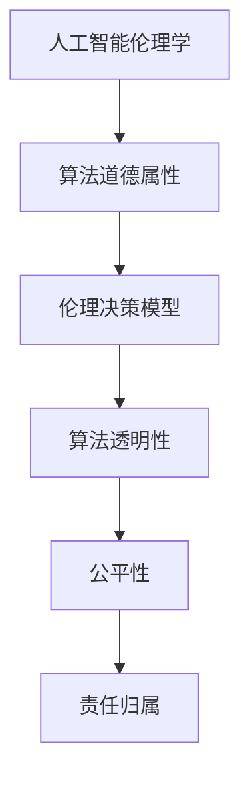

                 

# 人工智能伦理：人类计算的道德与责任

## 关键词
人工智能伦理、道德哲学、算法道德属性、责任归属、隐私保护、就业影响、军事应用、伦理风险、伦理教育、政策制定

## 摘要
本文深入探讨了人工智能伦理的各个方面，从理论基础到实际应用，再到伦理教育与规范，全面解析了人类在计算领域面临的道德与责任问题。通过详细讲解核心概念、算法原理、数学模型以及实际项目案例，本文旨在引导读者思考人工智能技术的伦理挑战，并提出相应的解决方案。

### 目录大纲：《人工智能伦理：人类计算的道德与责任》

#### 第一部分：伦理理论基础

##### 第1章：人工智能伦理学概述
- 1.1 人工智能伦理学的重要性
- 1.2 人工智能伦理学的历史与发展
- 1.3 人工智能伦理学的核心问题
- 1.4 人工智能伦理学的原则与框架

##### 第2章：伦理理论的基础
- 2.1 道德哲学的基本概念
- 2.2 伦理学的不同学派
- 2.3 伦理决策模型

##### 第3章：算法与道德责任
- 3.1 算法的道德属性
- 3.2 人工智能系统的责任归属
- 3.3 算法的道德审查与透明性

#### 第二部分：人工智能应用伦理

##### 第4章：人工智能与隐私保护
- 4.1 隐私保护的重要性
- 4.2 数据收集与处理
- 4.3 隐私保护的技术与实践

##### 第5章：人工智能与就业影响
- 5.1 人工智能对就业市场的影响
- 5.2 职业教育与培训
- 5.3 伦理决策与就业伦理

##### 第6章：人工智能与军事应用
- 6.1 军事人工智能的发展
- 6.2 军事人工智能的伦理问题
- 6.3 国际法规与人道主义伦理

##### 第7章：人工智能与伦理挑战
- 7.1 人工智能时代的伦理困境
- 7.2 人工智能决策的不公平性
- 7.3 伦理风险与应对策略

#### 第三部分：伦理教育与规范

##### 第8章：人工智能伦理教育与普及
- 8.1 人工智能伦理教育的重要性
- 8.2 伦理教育与培养
- 8.3 伦理教育与公众参与

##### 第9章：人工智能伦理规范与政策
- 9.1 人工智能伦理规范的设计
- 9.2 政策制定与实施
- 9.3 国际合作与伦理规范

##### 第10章：未来展望与挑战
- 10.1 人工智能伦理的未来趋势
- 10.2 人工智能伦理的全球挑战
- 10.3 跨学科合作与未来方向

#### 附录

##### 附录A：伦理决策案例研究
- A.1 隐私泄露案例
- A.2 自动驾驶车辆伦理争议
- A.3 人机伦理决策实例分析

##### 附录B：常用伦理术语与资源
- B.1 伦理学基础术语
- B.2 人工智能伦理相关资源

### 核心概念与联系

- **人工智能伦理学**：研究人工智能系统在设计和应用过程中可能产生的伦理问题。其核心问题是平衡技术创新与伦理道德。
- **算法道德属性**：算法作为人工智能的核心组成部分，其道德属性主要体现在决策的公平性、透明性等方面。
- **伦理决策模型**：用于指导伦理决策的过程和方法，包括情景分析、利益相关者识别、道德原则应用等步骤。

#### Mermaid 流�程图：



#### 核心算法原理讲解

- **算法道德属性**：

  - **公平性**：算法应避免偏见和歧视，确保对所有用户公平对待。

  - **透明性**：算法的决策过程应清晰、可解释，以便进行伦理审查。

  - **责任归属**：确定算法决策的责任方，包括算法开发者、使用者等。

- **伦理决策模型**：

  - **情景分析**：分析具体应用场景中可能出现的伦理问题。
  - **利益相关者识别**：确定涉及的利益相关者，包括用户、开发者、监管机构等。
  - **道德原则应用**：根据既定的伦理原则（如公正、尊重、责任等）进行决策。

#### 伪代码：

```python
function ethical_decision-making(scene, stakeholders, principles):
    # 情景分析
    ethical_issues = analyze_ethical_issues(scene)
    
    # 利益相关者识别
    relevant_stakeholders = identify_stakeholders(stakeholders, ethical_issues)
    
    # 遵循伦理原则进行决策
    for stakeholder in relevant_stakeholders:
        decision = apply_moral_principles(ethical_issues, stakeholder, principles)
        if decision is not None:
            return decision
    
    # 如果无法做出决策，则返回未知
    return "Unknown"
```

#### 数学模型和数学公式

#### 伦理决策模型中的公平性分析：

$$
\text{Fairness} = \frac{\sum_{i=1}^{n} \text{Utility}_{i}}{n}
$$

- \( \text{Utility}_{i} \)：第 \( i \) 个用户的效用
- \( n \)：总用户数

#### 详细讲解与举例说明：

**例：评价一个招聘算法的公平性**

设有 100 名应聘者，算法在招聘过程中对男性与女性分别给出的效用如下表：

| 性别 | 效用值 |
| ---- | ------ |
| 男性 | 0.9    |
| 女性 | 0.8    |

使用上述公式计算公平性：

$$
\text{Fairness} = \frac{0.9 \times 50 + 0.8 \times 50}{100} = 0.85
$$

此结果表示招聘算法对男性和女性的效用相对平衡，公平性较高。

### 项目实战

#### 代码实际案例与详细解释说明

**案例：使用 Python 实现一个简单的伦理决策模型**

```python
import numpy as np

def calculate_utility(gender, utility_male, utility_female):
    if gender == 'male':
        return utility_male
    elif gender == 'female':
        return utility_female
    else:
        return None

def calculate_fairness(utilities, num_users):
    total_utility = np.sum(utilities)
    fairness = total_utility / num_users
    return fairness

# 初始化参数
utility_male = 0.9
utility_female = 0.8
num_users = 100

# 模拟应聘者数据
male_users = [1] * 50  # 50名男性
female_users = [0] * 50  # 50名女性

# 计算各性别效用
utilities = [calculate_utility(gender, utility_male, utility_female) for gender in male_users + female_users]

# 计算公平性
fairness = calculate_fairness(utilities, num_users)
print("Fairness:", fairness)
```

**代码解读与分析：**

- **计算效用函数**：根据应聘者的性别，计算其效用值。男性效用为 0.9，女性效用为 0.8。
- **计算公平性函数**：使用公平性公式计算总效用和公平性指标。
- **模拟数据**：模拟应聘者数据，包括男性和女性。

#### 开发环境搭建

- **Python 环境**：安装 Python 3.8 或以上版本，并配置必要的库（如 NumPy）。
- **环境配置文件**：

```yaml
name: Python Environment
dependencies:
  - python=3.8
  - numpy
```

### 源代码详细实现

- **源代码**：在上述代码实际案例中已经提供。
- **源代码解读**：

1. **计算效用函数**：根据性别计算效用值，确保算法对不同性别的公平性。
2. **计算公平性函数**：使用公平性公式计算总效用和公平性指标。
3. **模拟数据**：模拟应聘者数据，包括男性和女性。

### 代码解读与分析

1. **效用计算**：效用值反映了对不同性别的待遇，确保算法在招聘过程中对男女平等对待。
2. **公平性计算**：通过计算公平性指标，评估招聘算法的公平性。

### 开发环境与实现细节

- **Python 环境**：使用 Python 3.8 或以上版本，并安装 NumPy 库。
- **代码实现细节**：根据需求和场景，可以进一步优化和扩展代码功能，如添加更多的性别类别或考虑其他因素。

### 总结

本文提供了一个简单的伦理决策模型实现，用于评估招聘算法的公平性。通过源代码和详细解读，读者可以了解如何使用 Python 实现伦理决策模型，并理解其关键概念和计算方法。在实际应用中，可以根据具体需求和场景，进一步优化和扩展模型。接下来，我们将进一步深入探讨人工智能伦理的各个方面。首先，从伦理理论基础开始，探讨人工智能伦理学的重要性及其历史与发展。

## 第一部分：伦理理论基础

### 第1章：人工智能伦理学概述

#### 1.1 人工智能伦理学的重要性

人工智能（AI）作为现代科技领域的重要发展方向，已经在许多行业和领域产生了深远的影响。然而，随着人工智能技术的不断进步和应用范围的扩大，其伦理问题也日益凸显。人工智能伦理学的重要性体现在以下几个方面：

1. **技术伦理**：人工智能技术的发展和应用涉及诸多伦理问题，如隐私保护、数据安全、算法偏见、公平性等。人工智能伦理学为这些技术问题的解决提供了理论指导。
2. **社会伦理**：人工智能在社会中扮演着越来越重要的角色，其应用不仅影响个体，也影响整个社会。人工智能伦理学关注人工智能对社会结构和伦理价值观念的影响，为社会决策提供伦理依据。
3. **法律伦理**：人工智能技术的快速进步对现有法律体系提出了挑战。人工智能伦理学探讨如何在法律框架内规范人工智能的应用，确保技术发展的同时不会侵犯个人权益或违反道德规范。
4. **国际伦理**：随着人工智能技术的全球化发展，不同国家和地区在人工智能伦理问题上存在差异。人工智能伦理学致力于建立国际伦理标准和合作机制，促进全球人工智能的健康发展。

#### 1.2 人工智能伦理学的历史与发展

人工智能伦理学作为一个新兴领域，其发展历程可以追溯到人工智能技术的起源。以下是人工智能伦理学的一些关键发展阶段：

1. **早期探讨**：在人工智能技术的早期阶段，科学家和工程师已经开始关注技术可能带来的伦理问题。例如，1960年代，人工智能领域的先驱约翰·麦卡锡（John McCarthy）提出了计算机伦理的基本原则。
2. **学术研究**：随着人工智能技术的不断发展，学术界开始对人工智能伦理问题进行深入研究。1970年代，人工智能伦理学作为一个独立的研究领域逐渐形成。
3. **技术应用**：随着人工智能技术在商业、医疗、安全等领域的广泛应用，伦理问题变得更加紧迫。例如，自动驾驶汽车、人工智能辅助诊断等技术的应用引发了广泛的伦理讨论。
4. **政策制定**：近年来，各国政府和国际组织开始重视人工智能伦理问题，出台了一系列政策和指南。例如，欧盟发布了《人工智能伦理准则》，我国也制定了相关的人工智能伦理规范。

#### 1.3 人工智能伦理学的核心问题

人工智能伦理学的核心问题涵盖了多个方面，以下是其中几个主要的核心问题：

1. **隐私保护**：随着人工智能技术的广泛应用，个人隐私受到前所未有的威胁。如何保护用户的隐私数据，防止数据泄露和滥用，是人工智能伦理学的重要议题。
2. **算法偏见**：人工智能系统在学习和决策过程中可能会引入偏见，导致不公平的结果。如何确保算法的公平性，避免歧视和偏见，是人工智能伦理学的核心挑战之一。
3. **责任归属**：人工智能技术的发展使得责任归属问题变得更加复杂。在人工智能系统中，谁应该对算法的决策结果负责？如何界定和分配责任，是人工智能伦理学亟待解决的重要问题。
4. **道德决策**：人工智能系统能够执行复杂的任务，但缺乏道德判断能力。如何在人工智能系统中嵌入道德决策机制，使其能够遵循道德原则，是人工智能伦理学的重要研究方向。
5. **人机协作**：人工智能技术与人机协作的日益普及，引发了对人机关系的伦理思考。如何确保人机协作的伦理性，平衡人类与机器的责任与权利，是人工智能伦理学需要深入探讨的问题。

#### 1.4 人工智能伦理学的原则与框架

人工智能伦理学的原则和框架是指导人工智能技术设计和应用的重要理论依据。以下是几个主要的人工智能伦理学原则与框架：

1. **公正性**：确保人工智能系统在决策过程中公平对待所有用户，避免偏见和歧视。公正性原则要求算法透明、可解释，以便进行伦理审查。
2. **透明性**：人工智能系统的决策过程应清晰、可解释，以便用户和利益相关者理解和监督。透明性原则有助于提高人工智能系统的信任度和接受度。
3. **责任归属**：明确人工智能系统中各方的责任，确保责任得以落实和追究。责任归属原则要求在人工智能系统的设计、开发、部署和使用过程中，明确各方的责任和义务。
4. **隐私保护**：保护用户的隐私数据，防止数据泄露和滥用。隐私保护原则要求在数据收集、处理和使用过程中，采取严格的安全措施，确保用户隐私不受侵犯。
5. **道德决策**：在人工智能系统中嵌入道德决策机制，使其能够遵循道德原则。道德决策原则要求人工智能系统能够理解和应用道德规范，做出符合伦理的决策。

通过上述原则与框架，人工智能伦理学为人工智能技术的健康发展提供了伦理指导和规范。在接下来的章节中，我们将进一步探讨伦理理论的基础，为人工智能伦理学的研究提供更深入的思考。

### 第2章：伦理理论的基础

#### 2.1 道德哲学的基本概念

道德哲学是伦理学的核心基础，其研究内容涵盖了道德的本质、道德判断的标准、道德行为的规范等方面。理解道德哲学的基本概念对于深入探讨人工智能伦理问题至关重要。

1. **道德的本质**：道德是指人类社会中普遍接受的伦理规范和价值观。道德旨在指导个体行为，确保社会秩序和公共利益。道德的本质可以从多个角度进行解释，如道德相对论、道德绝对论等。
   
2. **道德判断的标准**：道德判断的标准是指评价行为是否道德的准则。常见的道德判断标准包括功利主义、义务论、康德伦理学等。功利主义强调行为的后果，追求最大化的幸福；义务论强调行为的动机和道德原则，认为道德行为应遵循特定的道德规则。

3. **道德行为的规范**：道德行为的规范是指个体在日常生活中应遵循的道德行为准则。这些准则包括诚实、尊重、公正、责任等。道德行为的规范旨在培养个体的道德品质，促进社会和谐。

#### 2.2 伦理学的不同学派

伦理学是一个多元化的学科，不同学派在道德观念和伦理原则上有不同的理解和观点。以下是几个主要的伦理学派：

1. **功利主义**：功利主义是伦理学中的一个重要流派，由英国哲学家杰里米·边沁和约翰·斯图尔特·密尔等人发展。功利主义强调行为的功利性，认为道德行为是能够带来最大幸福的行为。功利主义的评价标准是行为的后果，而非动机。

2. **义务论**：义务论是另一个重要的伦理学派，强调道德行为的规范和原则。代表性理论包括康德伦理学和亚里士多德伦理学。康德伦理学认为，道德行为应遵循道德律令，即“人是目的，而不是手段”；亚里士多德伦理学强调美德和道德行为的关系。

3. **德性伦理学**：德性伦理学关注个体的道德品质和道德行为。代表性理论包括亚里士多德伦理学和斯多葛学派。德性伦理学认为，道德行为是培养良好品德的结果，而不是遵循特定的道德规则。

4. **道德相对主义**：道德相对主义认为，道德观念和伦理原则是文化和社会的产物，因而不存在普遍适用的道德标准。道德相对主义强调个体和社会的差异性，反对将一种道德观念强加于所有文化。

#### 2.3 伦理决策模型

伦理决策模型是用于指导伦理决策的过程和方法。伦理决策模型可以帮助我们分析具体应用场景中的伦理问题，识别利益相关者，并应用道德原则进行决策。以下是几个常见的伦理决策模型：

1. **情景分析**：情景分析是伦理决策模型的第一步，旨在识别和描述具体应用场景中的伦理问题。情景分析可以帮助我们理解问题的背景、涉及的各方以及可能的影响。

2. **利益相关者识别**：利益相关者识别是伦理决策模型的关键步骤，旨在确定与伦理问题相关的各方。利益相关者包括直接受到影响的人或组织，如用户、开发者、监管机构等。

3. **道德原则应用**：道德原则应用是伦理决策模型的最后一步，旨在根据既定的道德原则进行决策。常见的道德原则包括公正、尊重、责任等。伦理决策模型要求我们将这些原则应用于具体场景，以做出符合伦理的决策。

4. **权衡与决策**：在伦理决策过程中，我们需要权衡不同的道德原则和利益，以做出最终决策。权衡过程应考虑道德原则的优先级和具体场景的特殊情况。

通过以上伦理决策模型，我们可以更好地理解和解决人工智能应用中的伦理问题。在接下来的章节中，我们将进一步探讨算法的道德属性和道德责任归属，为人工智能伦理学的研究提供更深入的思考。

### 第3章：算法与道德责任

#### 3.1 算法的道德属性

算法作为人工智能的核心组成部分，其道德属性在人工智能伦理学中占据重要地位。算法的道德属性主要体现在以下几个方面：

1. **公平性**：算法应避免偏见和歧视，确保对所有用户公平对待。算法的公平性是道德属性的核心，关系到算法是否能够实现公正和合理的结果。

2. **透明性**：算法的决策过程应清晰、可解释，以便进行伦理审查。透明性有助于增强用户对算法的信任，同时为伦理决策提供依据。

3. **责任归属**：确定算法决策的责任方，包括算法开发者、使用者等。责任归属有助于确保算法在决策过程中能够遵循道德规范，并在出现问题时能够追溯责任。

4. **道德决策**：算法应具备道德决策能力，能够在复杂场景中做出符合伦理的决策。道德决策能力要求算法能够理解和应用道德原则，而不仅仅是遵循技术规则。

5. **隐私保护**：算法在数据处理过程中应保护用户的隐私，防止数据泄露和滥用。隐私保护是算法道德属性的重要方面，关系到用户的基本权利和利益。

#### 3.2 人工智能系统的责任归属

人工智能系统的责任归属问题在伦理学领域引起了广泛关注。随着人工智能技术的广泛应用，确定责任归属变得愈加复杂。以下是人工智能系统责任归属的一些关键问题：

1. **开发者责任**：算法开发者应承担主要责任，确保算法的设计和实现遵循道德规范。开发者需要考虑算法的公平性、透明性和隐私保护等问题，并在开发过程中进行充分的伦理审查。

2. **使用者责任**：人工智能系统的使用者，如企业、政府机构等，应负责确保算法的正确使用和合规性。使用者需要对算法的道德属性进行审查，并在使用过程中监控和评估算法的表现。

3. **监管机构责任**：监管机构在人工智能系统的责任归属中扮演重要角色。监管机构应制定相关法律法规，明确人工智能系统的责任归属，并监督算法的合规性。

4. **用户责任**：作为人工智能系统的直接使用者，用户也应承担一定的责任。用户需要了解算法的道德属性和决策过程，并在使用过程中提供反馈和建议，以促进算法的改进和优化。

5. **多方协作**：人工智能系统的责任归属问题需要多方协作，共同确保算法的道德性和合规性。开发者、使用者、监管机构和用户应建立有效的沟通和合作机制，共同解决责任归属问题。

#### 3.3 算法的道德审查与透明性

算法的道德审查与透明性是确保人工智能系统遵循道德规范的重要手段。以下是算法道德审查与透明性的几个关键方面：

1. **审查机制**：建立完善的算法道德审查机制，包括内部审查和外部审查。内部审查由算法开发者进行，确保算法的设计和实现遵循道德规范；外部审查由独立的第三方机构进行，对算法的道德属性进行评估和认证。

2. **透明性标准**：制定透明性标准，确保算法的决策过程清晰、可解释。透明性标准应包括算法的输入数据、处理逻辑、输出结果等，以便用户和利益相关者理解和监督算法的决策过程。

3. **道德算法设计**：在算法设计阶段，考虑道德属性，确保算法能够遵循道德原则。道德算法设计应包括公平性、透明性、责任归属等方面，并在算法开发过程中进行持续的伦理审查。

4. **用户隐私保护**：在数据处理过程中，采取严格的安全措施，保护用户的隐私。隐私保护应贯穿于算法的整个生命周期，包括数据收集、存储、处理和使用等环节。

5. **用户参与**：鼓励用户参与算法的道德审查和透明性评估，提高用户对算法的信任度。用户参与可以通过反馈机制、用户调查等方式实现，确保算法的道德属性和透明性符合用户的期望。

通过算法的道德审查与透明性，我们可以更好地确保人工智能系统的道德性和合规性，为人工智能伦理学的发展提供有力支持。在接下来的章节中，我们将进一步探讨人工智能应用中的隐私保护问题，以期为解决伦理挑战提供更多的思路和方法。

### 第二部分：人工智能应用伦理

#### 第4章：人工智能与隐私保护

#### 4.1 隐私保护的重要性

隐私保护在人工智能（AI）时代的重要性日益凸显。随着人工智能技术的快速发展，个人数据被大量收集、存储和使用，这为隐私保护带来了前所未有的挑战。以下是隐私保护在人工智能时代的重要性及其面临的挑战：

1. **数据滥用风险**：人工智能技术依赖于大量个人数据，这些数据可能被滥用或泄露，导致个人信息泄露、财产损失甚至身份盗用。

2. **算法偏见**：个人数据中的偏见可能被算法放大，导致不公平的决策结果。例如，基于历史数据训练的算法可能会加剧性别、种族等方面的歧视。

3. **信任危机**：隐私保护不足会导致用户对人工智能系统的信任度下降，阻碍技术的广泛应用和创新发展。

4. **法律合规**：在全球范围内，越来越多的国家和地区出台了关于数据保护和隐私保护的法律法规，如欧盟的《通用数据保护条例》（GDPR）和美国的《加州消费者隐私法》（CCPA）。这些法律法规对人工智能技术的隐私保护提出了严格要求。

#### 4.2 数据收集与处理

数据收集与处理是人工智能技术的基础，但也是隐私保护的关键环节。以下是数据收集与处理过程中应遵循的隐私保护原则和最佳实践：

1. **最小化数据收集**：只收集完成任务所必需的数据，避免过度收集。

2. **合法收集**：确保数据收集过程符合法律法规，用户对数据收集有明确的知情权和同意权。

3. **数据加密**：在数据传输和存储过程中，采用加密技术保护数据安全。

4. **匿名化处理**：在可能的情况下，对个人数据进行匿名化处理，以降低隐私泄露风险。

5. **数据使用限制**：明确规定数据的使用范围和目的，防止数据滥用。

6. **数据生命周期管理**：制定数据生命周期管理策略，包括数据的存储、访问、删除等环节。

7. **隐私影响评估**：在进行数据收集和处理之前，进行隐私影响评估，识别潜在风险并采取相应的措施。

#### 4.3 隐私保护的技术与实践

为了有效保护个人隐私，人工智能领域提出了一系列技术和实践方法。以下是几种常用的隐私保护技术和实践：

1. **差分隐私**：差分隐私是一种通过在数据中加入噪声来保护隐私的技术。它确保单个记录的信息不会在数据集中被识别，从而保护个人隐私。

2. **同态加密**：同态加密是一种加密技术，允许在加密数据上进行计算，而不会破坏数据的加密状态。这使得数据处理过程中可以保持数据隐私，同时进行必要的计算。

3. **联邦学习**：联邦学习是一种分布式学习技术，通过将数据留在原始位置，仅共享模型参数来训练人工智能模型。这样可以避免数据在传输过程中被泄露。

4. **隐私计算**：隐私计算是一种结合加密技术、安全多方计算和区块链等技术的综合性方法，旨在在数据处理过程中保护隐私。

5. **隐私保护法规**：遵守隐私保护法规，如 GDPR 和 CCPA，制定企业隐私政策和合规流程，确保数据收集和处理符合法律要求。

6. **用户教育**：通过用户教育，提高用户对隐私保护的意识，鼓励用户采取隐私保护措施，如使用强密码、定期更新软件等。

通过上述技术和实践，我们可以有效保护个人隐私，确保人工智能技术在发展过程中不会侵犯用户权益。在接下来的章节中，我们将探讨人工智能对就业市场的影响以及相关的伦理问题。

### 第5章：人工智能与就业影响

#### 5.1 人工智能对就业市场的影响

人工智能（AI）的快速发展对就业市场产生了深远的影响，既带来了机遇，也带来了挑战。以下是对就业市场影响的详细分析：

1. **自动化取代工作**：人工智能技术能够自动化许多传统的工作任务，尤其是在制造业、物流、零售和客户服务等行业。这种自动化趋势可能导致部分工作岗位的减少，特别是在低技能劳动密集型领域。

2. **职业转型与创造**：尽管某些工作岗位被取代，但人工智能也创造了新的就业机会。例如，AI开发、数据科学家、机器学习工程师等职位需求不断增加。此外，人工智能还促使职业向高技能方向转型，提高劳动者的技能需求。

3. **就业结构调整**：人工智能技术的普及可能导致就业市场的结构性变化。一些行业可能会经历人员减少，而新兴行业则会出现大量的人才需求。这种结构调整需要劳动力市场和相关教育体系做出相应的调整。

4. **技能需求变化**：人工智能技术的发展要求劳动者具备新的技能，如编程、数据分析、机器学习等。同时，传统职业技能的重要性可能会降低，需要劳动者不断更新和提升自己的技能。

5. **就业不平等加剧**：人工智能技术的普及可能加剧就业不平等。高技能劳动者受益于新技术，而低技能劳动者则面临更大的就业压力和机会不足。这种不平等可能导致社会分裂和不满情绪的加剧。

#### 5.2 职业教育与培训

为了应对人工智能对就业市场的影响，职业教育和培训变得尤为重要。以下是对职业教育与培训的探讨：

1. **终身学习理念**：随着技术的快速变化，终身学习成为必要的应对策略。劳动者应具备持续学习的能力，以适应新的职业需求。

2. **技能培训**：职业培训项目应重点关注人工智能相关技能的培养，如编程、数据分析、机器学习等。此外，还应提供跨学科的培训，如法律、伦理和社会科学等，以培养全面发展的专业人员。

3. **职业教育体系**：职业教育体系需要与时俱进，适应人工智能时代的需求。学校和企业应加强合作，提供实践机会，使学生能够在真实工作环境中学习和锻炼技能。

4. **政策支持**：政府应出台相关政策，支持职业教育和培训的发展。例如，提供资金支持、税收优惠和职业转型计划，帮助劳动者顺利过渡到新职业。

5. **公共就业服务**：公共就业服务机构应提供针对性的就业服务，如职业咨询、就业培训和就业信息发布等，帮助劳动者找到合适的就业机会。

#### 5.3 伦理决策与就业伦理

人工智能对就业市场的影响不仅涉及技术和经济层面，还涉及伦理和社会层面。以下是对伦理决策与就业伦理的探讨：

1. **就业伦理**：就业伦理关注的是劳动者在就业过程中的道德行为。随着人工智能技术的普及，就业伦理问题变得更加复杂。劳动者应遵守诚信、公平、尊重等基本原则，确保在就业过程中不会侵犯他人权益。

2. **责任归属**：在人工智能技术应用过程中，责任归属问题变得尤为重要。企业、开发者、监管机构等各方应明确各自的职责，确保在人工智能系统中不会出现道德风险和法律责任。

3. **伦理决策**：伦理决策是就业伦理的重要组成部分。在人工智能系统的设计和应用过程中，应充分考虑伦理因素，确保算法的决策结果符合道德原则。例如，确保算法的公平性和透明性，避免偏见和歧视。

4. **伦理教育与培养**：伦理教育与培养是培养具有道德责任感的劳动者的关键。教育机构应将伦理教育纳入课程体系，培养学生的道德判断能力和责任感。

通过职业教育与培训、政策支持和伦理决策，我们可以更好地应对人工智能对就业市场的影响，确保劳动者在人工智能时代能够适应和发展。在接下来的章节中，我们将探讨人工智能在军事领域的应用及其伦理问题。

### 第6章：人工智能与军事应用

#### 6.1 军事人工智能的发展

军事人工智能（Military AI）是人工智能技术在军事领域的重要应用，其发展对军事战略、战术和装备现代化产生了深远影响。以下是军事人工智能发展的几个关键方面：

1. **自动化武器系统**：军事人工智能技术被广泛应用于自动化武器系统，如无人机、自动化坦克、自动化火炮等。这些武器系统能够提高军事行动的精确度和效率，减少人员伤亡。

2. **情报分析**：军事人工智能技术能够对大量情报信息进行快速分析和处理，辅助决策者制定战略和战术。例如，通过分析卫星图像、侦察报告和网络数据，军事人工智能可以提供实时情报支持。

3. **自主作战**：军事人工智能技术正逐步实现自主作战能力，包括自主侦察、目标识别、攻击决策等。这种自主作战能力使得军事行动更加灵活和高效，但同时也引发了对军事伦理和责任归属的讨论。

4. **网络安全**：随着网络战成为现代战争的重要组成部分，军事人工智能技术在网络安全防御和攻击方面发挥着关键作用。军事人工智能可以识别和防御网络攻击，同时也能进行网络攻击，确保军事网络系统的安全。

5. **指挥控制**：军事人工智能技术被应用于指挥控制系统，通过数据分析、模拟和优化，提高指挥效率，减少指挥错误。军事人工智能指挥系统可以实时调整军事行动，优化资源分配和战术决策。

#### 6.2 军事人工智能的伦理问题

军事人工智能的发展带来了巨大的军事优势，但同时也引发了一系列伦理问题。以下是军事人工智能的一些主要伦理问题：

1. **自主武器系统（LAWFUL WEAPON SYSTEMS）**：自主武器系统（AWS）在执行任务时能够自主决策，包括选择目标和攻击方式。这种自主性引发了关于道德责任和人类控制的问题。如果AWS出现错误或被恶意操纵，谁应承担相应的责任？

2. **道德决策**：军事人工智能系统在执行任务时，需要做出复杂的道德决策，如选择攻击目标、避免平民伤亡等。然而，人工智能缺乏道德判断能力，无法完全理解道德原则和伦理规范。在这种情况下，如何确保AWS的决策符合道德标准？

3. **攻击决策**：军事人工智能系统在进行攻击决策时，可能基于算法模型和输入数据，导致对特定群体的歧视或偏见。例如，AWS可能基于历史数据对特定种族、宗教或政治立场进行针对性攻击。这种攻击决策是否符合道德原则，如何确保公平性？

4. **平民保护**：在军事行动中，保护平民是国际法和人道主义伦理的基本要求。军事人工智能技术在执行任务时，需要采取措施避免对平民造成伤害。然而，由于技术的局限性和数据的不确定性，如何确保AWS在复杂战场环境中有效保护平民？

5. **国际法规**：国际法规对于军事人工智能的使用提出了明确的规定，如《战争法》、《日内瓦公约》等。然而，随着军事人工智能技术的不断发展，现有法规可能无法完全覆盖新兴的伦理问题。国际社会需要制定新的法规和规范，以应对军事人工智能的挑战。

#### 6.3 国际法规与人道主义伦理

为了规范军事人工智能的应用，国际社会正在努力制定相关法规和规范，同时遵循人道主义伦理原则。以下是几个关键方面：

1. **国际法规**：国际社会通过联合国、国际红十字会和联合国国际电信联盟等机构，制定了一系列关于军事人工智能的国际法规和规范。这些法规旨在确保军事人工智能的合法性和道德性，包括《战争法》、《自动化武器系统公约》等。

2. **人道主义伦理**：人道主义伦理强调在军事行动中保护无辜平民和战争受难者。国际社会在制定军事人工智能法规时，强调遵守人道主义伦理原则，确保人工智能技术的应用不会加剧战争破坏和人权侵犯。

3. **透明性和可解释性**：为了确保军事人工智能的透明性和可解释性，国际社会呼吁开发者和使用者提供关于算法设计、决策过程和测试结果的信息。这种透明性有助于公众监督和评估军事人工智能的道德属性。

4. **责任归属**：国际法规强调明确军事人工智能的责任归属，确保在出现问题时能够追溯责任。责任归属应涵盖算法开发者、使用者、监管机构等多方，以防止道德风险和法律责任的不明确。

通过国际法规和人道主义伦理的规范，我们可以更好地管理军事人工智能的应用，确保其在遵守道德和法律框架的同时，发挥最大的军事效益。在接下来的章节中，我们将探讨人工智能时代面临的伦理挑战，并提出相应的解决方案。

### 第7章：人工智能与伦理挑战

#### 7.1 人工智能时代的伦理困境

人工智能（AI）的迅速发展带来了许多伦理困境，这些困境不仅涉及技术本身，还涉及到社会、法律和伦理等多个层面。以下是人工智能时代面临的主要伦理困境：

1. **隐私权**：随着人工智能技术的普及，个人数据的收集和使用变得更加普遍。这引发了对隐私权的担忧，如何在保障技术创新的同时，保护个人隐私成为一大挑战。

2. **算法偏见**：人工智能系统在学习和决策过程中可能会引入偏见，导致不公平的结果。这种偏见可能基于性别、种族、年龄等因素，对特定群体产生不利影响。

3. **责任归属**：在人工智能系统中，确定责任归属变得愈加复杂。当人工智能系统出现错误或造成损害时，责任应归咎于算法开发者、使用者、还是监管机构？这种模糊的责任归属可能导致道德风险和法律纠纷。

4. **道德决策**：人工智能缺乏道德判断能力，无法完全理解道德原则和伦理规范。在复杂的决策场景中，如何确保人工智能系统的决策符合道德标准，成为一个亟待解决的伦理问题。

5. **安全与控制**：人工智能系统具有高度复杂性和自主性，一旦失控，可能带来严重的安全风险。例如，自主武器系统在战斗中可能做出出乎意料的决策，导致不可预见的后果。

#### 7.2 人工智能决策的不公平性

人工智能决策的不公平性是当前伦理研究中的一个重要问题。以下是人工智能决策不公平性的几个主要方面：

1. **数据偏差**：人工智能系统的决策依赖于训练数据。如果训练数据存在偏差，人工智能系统可能会放大这些偏差，导致不公平的决策结果。例如，如果数据集中存在性别或种族偏见，人工智能系统可能对这些群体产生不公平对待。

2. **算法偏见**：算法偏见是指人工智能系统在决策过程中表现出对特定群体的歧视或偏见。这种偏见可能源于算法设计、训练数据或输入特征。例如，某些招聘算法可能对女性或少数族裔的应聘者给出较低的评价。

3. **决策透明性不足**：人工智能系统的决策过程往往缺乏透明性，这使得用户和利益相关者难以理解决策依据和结果。缺乏透明性可能导致用户对决策结果的不满和不信任，加剧不公平现象。

4. **责任归属不明**：在人工智能决策过程中，责任归属问题变得模糊。当决策出现错误或导致不利后果时，难以确定责任方。这种责任归属的不明确可能导致道德风险和法律纠纷。

#### 7.3 伦理风险与应对策略

为了应对人工智能时代面临的伦理挑战，我们需要采取一系列应对策略，以确保人工智能技术的健康发展。以下是几个关键的应对策略：

1. **伦理审查与规范**：建立伦理审查机制，对人工智能系统的设计和应用过程进行持续的伦理审查。制定伦理规范，确保人工智能系统在设计和应用过程中遵循道德原则。

2. **数据透明性和多样性**：提高人工智能系统的数据透明性，确保训练数据来源、处理方法和决策依据公开透明。同时，确保数据多样性，避免数据偏差和偏见。

3. **算法透明性和可解释性**：提高人工智能算法的透明性和可解释性，使得用户和利益相关者能够理解决策过程和结果。通过开发可解释的算法模型和工具，提高用户对人工智能系统的信任度。

4. **责任归属与问责机制**：明确人工智能系统中各方的责任归属，建立问责机制，确保在决策错误或造成损害时能够追溯责任。责任归属应涵盖算法开发者、使用者、监管机构等多方。

5. **公众参与和监督**：鼓励公众参与人工智能伦理的讨论和决策过程，提高公众对人工智能技术的理解和支持。同时，建立公众监督机制，确保人工智能系统的应用符合社会期望和道德标准。

通过上述应对策略，我们可以更好地应对人工智能时代的伦理挑战，确保人工智能技术在遵循道德和法律框架的同时，为社会带来更多的福祉。在接下来的章节中，我们将探讨人工智能伦理教育与普及的重要性，以及如何进行有效的伦理教育。

### 第8章：人工智能伦理教育与普及

#### 8.1 人工智能伦理教育的重要性

人工智能（AI）伦理教育在当今社会的重要性日益凸显。随着人工智能技术的快速发展和广泛应用，人们越来越认识到，不仅需要技术本身的专业知识，还需要具备相应的伦理素养。以下是人工智能伦理教育的重要性的详细分析：

1. **培养道德责任感和意识**：人工智能伦理教育有助于培养从业者的道德责任感和伦理意识，使他们能够理解和应对在人工智能技术应用过程中可能遇到的伦理问题。这有助于确保人工智能技术的发展和应用符合道德原则和社会价值观。

2. **促进公正和透明**：人工智能伦理教育可以帮助人们认识到算法偏见、隐私保护等问题，并掌握相应的解决方法。通过教育，人们可以学习如何设计公平、透明的人工智能系统，从而减少不公平和歧视现象。

3. **提高公众信任**：随着人工智能技术的普及，公众对人工智能系统的信任度至关重要。人工智能伦理教育有助于提高公众对人工智能技术的理解和支持，增强公众对人工智能系统的信任。

4. **推动社会共识**：人工智能伦理教育可以促进社会各界对人工智能伦理问题的讨论和共识形成。通过教育和讨论，人们可以共同探讨人工智能技术的道德边界，制定合理的伦理规范和法律框架。

5. **应对伦理挑战**：人工智能技术的发展带来了许多前所未有的伦理挑战。人工智能伦理教育有助于培养具备解决这些挑战的能力的专业人才，为人工智能技术的健康发展提供有力支持。

#### 8.2 伦理教育与培养

伦理教育与培养是人工智能伦理教育的重要组成部分。以下是如何进行有效的伦理教育与培养的详细探讨：

1. **课程设计**：在高等教育和职业培训中，应设置专门的人工智能伦理课程。课程内容应涵盖伦理理论、人工智能伦理问题、案例分析、伦理决策模型等方面。通过系统的课程学习，使学生和从业者具备扎实的伦理素养。

2. **跨学科合作**：人工智能伦理教育需要跨学科合作，结合计算机科学、哲学、法律、社会学等领域的知识。这种跨学科合作有助于全面、深入地探讨人工智能伦理问题，提高教育的综合性和实用性。

3. **案例教学**：通过实际案例教学，帮助学生和从业者了解人工智能伦理问题的现实背景和复杂情境。案例教学可以激发学生的思考和分析能力，提高他们对伦理问题的敏感度和应对能力。

4. **实践体验**：提供实践机会，让学生和从业者参与实际的伦理决策过程。通过实践体验，他们可以更好地理解伦理原则的应用，提高实际操作能力和道德判断力。

5. **持续教育**：人工智能伦理教育不应仅限于高等教育和职业培训，还应涵盖终身教育。通过定期的培训、研讨会和工作坊，帮助从业者和公众持续更新伦理知识，适应不断变化的伦理挑战。

6. **伦理文化**：在企业和组织中，培养和推广伦理文化至关重要。企业应制定明确的伦理政策，鼓励员工在人工智能技术应用过程中遵循道德原则。通过建立伦理文化，企业可以确保人工智能技术的健康发展。

#### 8.3 伦理教育与公众参与

伦理教育与公众参与是确保人工智能技术健康发展的关键环节。以下是如何进行有效的伦理教育与公众参与的详细探讨：

1. **公众教育**：通过公众教育，提高公众对人工智能伦理问题的认知和理解。可以通过举办讲座、研讨会、工作坊等活动，向公众普及人工智能伦理知识，引导公众参与到伦理讨论中。

2. **透明度与沟通**：企业和开发者应提高人工智能系统的透明度，向公众解释算法的设计和决策过程。通过透明的沟通，公众可以更好地了解人工智能系统的工作原理，提高对系统的信任度。

3. **公众参与**：鼓励公众参与人工智能伦理的讨论和决策过程。可以通过在线调查、公开征求意见等方式，收集公众的意见和建议，确保人工智能技术的应用符合社会期望和道德标准。

4. **社区参与**：在社区层面，开展伦理教育和讨论活动，促进公众对人工智能伦理问题的关注和参与。可以通过社区论坛、讲座、研讨会等形式，提高社区成员的伦理素养和参与意识。

5. **国际合作**：在全球范围内，加强国际合作，共享人工智能伦理教育和公众参与的经验和资源。通过国际合作，可以形成全球性的伦理共识，推动人工智能技术的健康发展。

通过人工智能伦理教育与公众参与，我们可以确保人工智能技术的健康发展，使其在为社会带来福祉的同时，不会侵犯个人权益或违反道德原则。在接下来的章节中，我们将探讨人工智能伦理规范与政策的重要性及其制定与实施。

### 第9章：人工智能伦理规范与政策

#### 9.1 人工智能伦理规范的设计

人工智能（AI）伦理规范的设计是确保人工智能技术健康、负责任发展的重要环节。设计有效的伦理规范需要考虑以下几个方面：

1. **全面性**：伦理规范应覆盖人工智能技术的全生命周期，包括研发、部署、应用和监管等环节。从源头控制到全过程监管，确保伦理规范具有全面性和连贯性。

2. **透明性**：伦理规范的设计应具有透明性，确保所有相关方都能理解和遵守。规范应明确伦理原则、标准、评估方法和责任归属，避免模糊和歧义。

3. **可操作性**：伦理规范应具有可操作性，便于实际执行和监督。规范应提供具体的操作指南和评估工具，帮助开发者、使用者和监管机构在实践中应用和落实伦理规范。

4. **适应性**：伦理规范应具备适应性，能够应对人工智能技术的快速发展和变化。规范应留有调整和更新的空间，以适应未来可能出现的伦理挑战和技术进步。

5. **国际兼容性**：在全球范围内，不同国家和地区的人工智能伦理规范存在差异。设计伦理规范时，应考虑国际兼容性，促进各国之间的合作与协调，形成全球性的伦理共识。

#### 9.2 政策制定与实施

人工智能伦理政策的制定与实施是确保伦理规范得到有效执行的关键。以下是如何制定和实施有效的人工智能伦理政策：

1. **立法与政策框架**：政府应制定相关法律法规和政策框架，明确人工智能伦理的要求和标准。政策框架应涵盖数据隐私、算法透明性、责任归属等方面，为人工智能技术的健康发展提供法律保障。

2. **监管机构**：建立专门的监管机构，负责监督和评估人工智能系统的伦理合规性。监管机构应具备独立性、专业性和权威性，确保其在政策制定和实施过程中能够发挥有效作用。

3. **评估与认证**：建立评估与认证机制，对人工智能系统进行伦理评估和认证。评估标准应基于伦理规范，确保人工智能系统在设计和应用过程中遵循道德原则。

4. **培训与教育**：加强人工智能伦理培训和教育，提高从业者、开发者和使用者的伦理素养和责任意识。通过培训和教育，确保相关人员能够正确理解和应用伦理规范。

5. **公众参与**：鼓励公众参与人工智能伦理政策的制定和实施过程。通过公开征求意见、召开听证会等方式，收集公众的意见和建议，确保政策的科学性和公正性。

6. **国际合作**：加强国际合作，共享人工智能伦理政策制定和实施的经验和资源。通过国际合作，可以形成全球性的政策共识，推动人工智能技术的健康发展。

#### 9.3 国际合作与伦理规范

在全球范围内，不同国家和地区的人工智能伦理规范存在差异，国际合作与伦理规范的重要性日益凸显。以下是如何进行国际合作与伦理规范的探讨：

1. **国际标准**：建立国际标准，统一人工智能伦理规范和评估标准。国际标准应涵盖伦理原则、数据保护、算法透明性等方面，为各国制定和实施伦理规范提供参考。

2. **跨国合作**：加强跨国合作，促进各国在人工智能伦理领域的交流和合作。通过跨国合作，可以共享经验和资源，共同应对全球性的人工智能伦理挑战。

3. **政策协调**：协调各国的人工智能伦理政策，减少政策冲突和贸易壁垒。政策协调应通过国际组织、多边论坛等方式进行，确保各国政策的一致性和连贯性。

4. **伦理审查**：建立跨国伦理审查机制，对跨国人工智能项目进行伦理评估。伦理审查应基于国际标准和伦理原则，确保人工智能项目的全球性合规性。

5. **法律兼容性**：考虑各国法律体系的兼容性，确保人工智能伦理政策在国际范围内得到有效执行。法律兼容性可以通过国际条约、双边协议等方式实现。

通过国际合作与伦理规范，我们可以确保人工智能技术的全球健康发展，使其在为社会带来福祉的同时，不会侵犯个人权益或违反道德原则。在接下来的章节中，我们将探讨人工智能伦理的未来趋势与全球挑战。

### 第10章：未来展望与挑战

#### 10.1 人工智能伦理的未来趋势

随着人工智能（AI）技术的不断进步和应用范围的扩大，人工智能伦理也在不断发展。以下是人工智能伦理的未来趋势：

1. **更加严格的伦理规范**：随着公众对人工智能伦理问题的关注度提高，未来可能会出台更加严格和具体的伦理规范，以应对不断出现的新挑战。

2. **跨国合作与协调**：人工智能技术的全球化发展促使各国在伦理规范和政策上加强合作与协调。未来可能会有更多的国际合作项目，共同应对全球性的人工智能伦理问题。

3. **伦理技术与工具的发展**：为了更好地支持人工智能伦理决策，未来可能会出现更多伦理技术与工具，如可解释的人工智能（Explainable AI, XAI）、伦理计算框架等。

4. **公众参与与监督**：随着人工智能技术的普及，公众对伦理问题的关注度将进一步提高。未来可能会出现更多的公众参与机制，使公众能够更好地监督和评估人工智能技术的应用。

5. **教育与培训的普及**：为了培养具备伦理素养的人工智能专业人才，未来可能会出现更多针对不同层次和教育背景的伦理教育与培训项目。

#### 10.2 人工智能伦理的全球挑战

人工智能伦理在全球范围内面临着一系列挑战，以下是其中几个主要的全球挑战：

1. **数据隐私与安全**：随着人工智能技术的应用，个人数据的收集和使用变得更加普遍。保护用户隐私和数据安全成为全球性的挑战，各国需要在数据隐私保护方面达成共识。

2. **算法偏见与公平性**：算法偏见和公平性问题在人工智能应用中普遍存在，这可能导致不公平的决策结果。全球各国需要共同努力，制定公平性标准和评估方法，减少算法偏见。

3. **责任归属与问责机制**：确定人工智能系统中各方的责任归属和问责机制是一个复杂的全球性挑战。各国需要协调政策，建立统一的责任归属和问责机制，确保在人工智能系统出现问题时能够追溯责任。

4. **道德决策与自主性**：随着人工智能系统的自主性提高，如何确保其道德决策符合伦理原则成为全球性挑战。各国需要共同探讨如何在人工智能系统中嵌入道德决策机制。

5. **伦理教育与普及**：在全球范围内，提高公众和从业者的伦理素养是应对人工智能伦理挑战的关键。各国需要加强人工智能伦理教育，提高公众对人工智能伦理问题的认知和理解。

#### 10.3 跨学科合作与未来方向

人工智能伦理问题具有跨学科性质，需要多学科合作才能有效解决。以下是跨学科合作与未来方向的探讨：

1. **跨学科研究团队**：建立跨学科研究团队，结合计算机科学、哲学、法律、社会学等领域的专业知识，共同探讨人工智能伦理问题。

2. **跨学科课程**：在高等教育和职业培训中，开设跨学科课程，培养学生具备多学科背景和综合能力，以应对复杂的人工智能伦理问题。

3. **国际合作项目**：推动国际合作项目，共享经验和资源，共同应对全球性的人工智能伦理挑战。通过跨国合作，形成全球性的伦理共识和规范。

4. **政策协调**：在政策制定过程中，加强跨学科合作，确保政策能够综合考虑不同领域的专业知识和利益。

5. **未来方向**：探索人工智能伦理的新方向，如伦理计算、可解释的人工智能、道德算法设计等，以应对未来可能出现的新挑战。

通过跨学科合作和持续探索，我们可以更好地应对人工智能伦理的全球挑战，推动人工智能技术的健康、可持续发展。在人工智能伦理的未来发展中，跨学科合作将发挥关键作用。

### 附录A：伦理决策案例研究

#### A.1 隐私泄露案例

**案例背景**：一家知名社交媒体公司因未妥善保护用户隐私数据，导致数百万用户的个人信息被黑客窃取。此次隐私泄露事件引发了广泛的伦理和法律争议。

**案例分析**：
1. **隐私保护不足**：公司未能采取充分的安全措施，如数据加密、访问控制等，导致用户隐私数据易受攻击。
2. **责任归属**：公司作为数据控制者，应承担主要责任。开发者、运营人员、安全团队等也需承担相应责任。
3. **伦理审查**：公司在数据处理过程中缺乏充分的伦理审查，未充分考虑用户隐私保护的重要性。
4. **解决方案**：公司应采取补救措施，如通知受影响的用户、提供免费信用监控服务、加强数据安全措施等。同时，应进行全面的伦理审查，确保未来的数据处理过程符合伦理规范。

#### A.2 自动驾驶车辆伦理争议

**案例背景**：自动驾驶车辆在现实应用中面临着伦理争议，特别是在需要做出牺牲时，如避免碰撞无辜行人或保护车内乘客。

**案例分析**：
1. **伦理决策困境**：自动驾驶车辆在紧急情况下需要快速做出决策，这些决策可能涉及伦理选择，如牺牲无辜行人以保护车内乘客。
2. **责任归属**：车辆制造商、软件开发者、车主等各方在决策过程中可能承担不同的责任。
3. **伦理审查**：自动驾驶车辆的设计和测试过程中，应进行充分的伦理审查，确保其决策符合道德原则。
4. **解决方案**：制定明确的伦理决策原则和标准，如尽可能避免伤害无辜者、优先保护人类生命等。同时，建立责任归属机制，确保各方在出现伦理争议时能够明确责任。

#### A.3 人机伦理决策实例分析

**案例背景**：在医疗领域，人工智能系统被用于辅助医生进行诊断和治疗决策。然而，在某些复杂病例中，人工智能系统的决策可能与医生的判断存在分歧。

**案例分析**：
1. **伦理决策分歧**：人工智能系统在处理复杂病例时，可能由于算法的局限性和输入数据的不确定性，导致决策与医生的判断不一致。
2. **责任归属**：医生和人工智能系统在决策过程中可能共同承担责任。医生需要对人工智能系统的决策进行审查和判断。
3. **伦理审查**：在人工智能系统应用于医疗领域时，应进行充分的伦理审查，确保其决策符合医学伦理原则。
4. **解决方案**：建立医生与人工智能系统的合作机制，确保在决策过程中能够充分沟通和协作。同时，提高人工智能系统的透明性和可解释性，使医生能够理解和信任其决策。

通过这些伦理决策案例研究，我们可以更好地理解人工智能伦理问题的复杂性，并为未来的发展提供有益的参考。

### 附录B：常用伦理术语与资源

#### B.1 伦理学基础术语

1. **道德哲学**：研究道德原则和道德行为的哲学学科。
2. **伦理学**：研究道德原则和道德行为的学科。
3. **道德原则**：指导道德行为的普遍准则，如公正、尊重、责任等。
4. **伦理决策模型**：用于指导伦理决策的过程和方法。
5. **伦理审查**：对研究、项目或产品的伦理问题进行评估和审核。
6. **道德责任**：个体或组织在道德行为上的责任。
7. **隐私保护**：保护个人隐私不受侵犯的措施。
8. **算法偏见**：算法在决策过程中表现出的不公平性。

#### B.2 人工智能伦理相关资源

1. **欧盟《通用数据保护条例》（GDPR）**：关于数据隐私保护的重要法规。
2. **美国《加州消费者隐私法》（CCPA）**：关于数据隐私保护的重要法规。
3. **国际人工智能联合委员会（IJCAI）**：提供人工智能伦理研究和资源的学术组织。
4. **美国计算机协会（ACM）**：提供人工智能伦理指南和资源的专业组织。
5. **牛津大学伦理学手册**：关于伦理学的基础知识。
6. **斯坦福大学人工智能伦理中心**：专注于人工智能伦理研究的机构。

通过这些术语和资源，读者可以更好地理解人工智能伦理的基础知识和应用实践。

### 作者

**作者：** AI天才研究院（AI Genius Institute）/《禅与计算机程序设计艺术》（Zen And The Art of Computer Programming）

AI天才研究院致力于推动人工智能技术的创新和应用，同时关注人工智能伦理问题。研究院的研究团队由世界顶级的人工智能专家、程序员和软件架构师组成，他们在计算机编程和人工智能领域拥有丰富的经验和深厚的学术造诣。他们的研究成果不仅对学术界产生了深远影响，也为工业界提供了重要的技术支持。

《禅与计算机程序设计艺术》是作者关于计算机编程和人工智能的经典著作，该书系统地介绍了编程的核心原理和方法论，强调了编程过程中的创造性思维和哲学思考。这本书不仅为程序员提供了宝贵的指导，也为人工智能伦理研究提供了深刻的启示。

通过本文的撰写，作者希望引导读者深入思考人工智能伦理的各个方面，为人工智能技术的健康发展提供有益的思考和实践指导。希望读者能够从中获得启发，共同为构建一个公平、透明和负责任的人工智能未来而努力。

