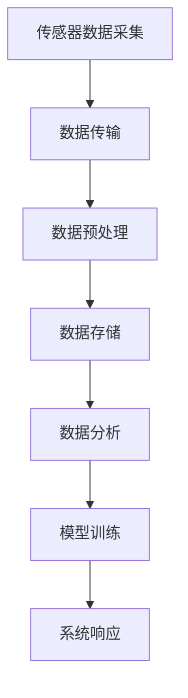

                 

### 文章标题

人工智能在智能家居中的应用与挑战

### 关键词

人工智能，智能家居，机器学习，深度学习，物联网，自然语言处理，传感器，数据安全，能耗管理，标准化，互操作性

### 摘要

本文详细探讨了人工智能在智能家居中的应用与挑战。首先，介绍了智能家居和人工智能的基本概念及其历史演变。随后，阐述了人工智能技术基础，包括机器学习、深度学习、自然语言处理和语音识别。接着，通过实际案例分析了智能家居系统的设计原则、应用案例和项目实战。最后，讨论了人工智能在智能家居中面临的数据安全与隐私保护、能耗管理与绿色家居、标准化与互操作性等挑战，并展望了未来的发展趋势。

# 第一部分：人工智能与智能家居的概述

## 第1章：人工智能与智能家居的概述

### 1.1 人工智能与智能家居的概述

随着科技的不断进步，人工智能（AI）技术逐渐渗透到人们生活的方方面面，智能家居（Smart Home）便是其中之一。智能家居系统通过物联网（IoT）、云计算、大数据等技术，将家庭中的各种设备互联互通，实现自动化管理和远程控制，从而提高居住的舒适度、安全性和能源利用效率。人工智能在智能家居中扮演着至关重要的角色，它使得智能家居系统能够更好地理解用户需求，提供更加个性化和智能化的服务。

#### 1.1.1 智能家居的概念与历史演变

智能家居，顾名思义，是指通过智能化手段将家居环境中的各种设备和服务集成在一起，形成一个可以自主管理和自我优化的系统。智能家居的概念起源于20世纪90年代，当时随着计算机技术和通信技术的不断发展，一些家庭开始尝试使用计算机控制系统来管理家电设备。

早期的智能家居系统主要依赖于嵌入式系统和现场总线技术，实现了一些简单的自动化功能，如远程控制灯光、空调等。进入21世纪后，随着物联网技术的兴起，智能家居迎来了快速发展期。物联网技术使得各种智能设备可以通过互联网进行连接，实现数据的实时传输和共享，从而提升了智能家居系统的智能化水平。

近年来，人工智能技术的快速发展进一步推动了智能家居的发展。通过机器学习、深度学习等人工智能技术，智能家居系统能够更好地理解用户的行为习惯和需求，提供更加个性化、智能化的服务。

#### 1.1.2 人工智能在智能家居中的角色与前景

人工智能在智能家居中扮演着多个关键角色：

1. **智能交互**：人工智能技术使得智能家居系统能够通过语音识别、自然语言处理等技术实现与用户的智能交互，使用户能够更加便捷地控制家居设备。
2. **行为预测**：通过大数据分析和机器学习算法，智能家居系统能够预测用户的需求和行为，提前做出响应，提供更加个性化的服务。
3. **自动化管理**：人工智能技术可以自动处理大量的数据，分析用户的行为习惯，实现家居设备的自动化管理，提高能源利用效率。
4. **安全监控**：人工智能技术可以帮助智能家居系统实现家庭安全监控，通过对视频、音频等数据的实时分析和处理，及时发现异常情况，提高家庭安全性。

随着人工智能技术的不断进步，智能家居系统将变得更加智能化、高效化和个性化。未来，人工智能在智能家居中的应用前景非常广阔，有望实现真正的“智能家居”梦想。

## 第2章：人工智能技术基础

### 2.1 机器学习与深度学习基础

机器学习和深度学习是人工智能领域的两个核心组成部分，它们在智能家居系统中发挥着重要作用。机器学习（Machine Learning，ML）是指通过数据和算法，使计算机系统能够从数据中学习规律和模式，并进行预测和决策的技术。而深度学习（Deep Learning，DL）是机器学习的一个子领域，它通过构建复杂的神经网络模型，对大量数据进行自动特征提取和模式识别。

#### 2.1.1 机器学习基本概念

机器学习的基本概念包括以下几个要素：

1. **模型（Model）**：模型是机器学习算法的核心，它定义了如何从数据中学习规律。常见的模型有线性回归、决策树、支持向量机等。
2. **算法（Algorithm）**：算法是实现模型学习的关键步骤，它指导计算机如何根据数据调整模型参数，以达到最佳预测效果。常见的算法有梯度下降、随机梯度下降等。
3. **数据集（Dataset）**：数据集是机器学习训练的基础，它包含了大量的输入数据和对应的标签。通过分析数据集，模型可以学习到数据中的规律和模式。
4. **训练（Training）**：训练是机器学习过程的核心步骤，它通过调整模型参数，使模型能够更好地拟合数据。训练过程通常包括数据预处理、模型训练、模型评估等环节。
5. **测试（Testing）**：测试是验证模型效果的重要步骤，它通过将模型应用于新的数据集，评估模型的泛化能力。测试集通常由未参与训练的数据组成，以检验模型的实际应用效果。

#### 2.1.2 深度学习基本原理

深度学习是机器学习的一个子领域，它通过构建多层神经网络（Neural Network）模型，对大量数据进行自动特征提取和模式识别。深度学习的核心组成部分包括：

1. **神经元（Neuron）**：神经元是神经网络的基本单元，它通过输入和权重进行加权求和，然后通过激活函数产生输出。
2. **层（Layer）**：神经网络由多个层组成，包括输入层、隐藏层和输出层。输入层接收外部输入数据，隐藏层对数据进行特征提取和变换，输出层产生最终预测结果。
3. **激活函数（Activation Function）**：激活函数是神经网络中的一个关键组成部分，它用于将神经元的线性组合转换为非线性输出，从而提高模型的预测能力。常见的激活函数有sigmoid、ReLU等。
4. **反向传播（Backpropagation）**：反向传播是一种训练神经网络的方法，它通过计算输出层误差的梯度，逆向传播到隐藏层，逐层调整每个神经元的权重，以优化模型的预测效果。

#### 2.1.3 深度学习架构与模型

深度学习架构通常包括卷积神经网络（Convolutional Neural Network，CNN）、循环神经网络（Recurrent Neural Network，RNN）和生成对抗网络（Generative Adversarial Network，GAN）等。

1. **卷积神经网络（CNN）**：卷积神经网络是一种用于图像处理和物体识别的深度学习模型。它通过卷积层、池化层和全连接层等结构，对图像数据进行特征提取和分类。CNN在图像识别、目标检测和图像生成等领域有广泛应用。
2. **循环神经网络（RNN）**：循环神经网络是一种用于序列数据处理的深度学习模型。它通过隐藏状态和递归连接，能够捕捉序列数据中的时间依赖关系。RNN在自然语言处理、语音识别和时间序列预测等领域有广泛应用。
3. **生成对抗网络（GAN）**：生成对抗网络是一种用于生成新数据的深度学习模型。它由生成器和判别器两个网络组成，通过对抗训练，生成器不断优化生成数据，使生成的数据越来越接近真实数据。GAN在图像生成、文本生成和音频生成等领域有广泛应用。

### 2.2 自然语言处理与语音识别

自然语言处理（Natural Language Processing，NLP）和语音识别（Speech Recognition）是人工智能领域的重要应用方向，它们在智能家居系统中发挥着重要作用。

#### 2.2.1 自然语言处理基础

自然语言处理旨在使计算机能够理解和处理人类自然语言，其主要任务包括：

1. **文本分类（Text Classification）**：根据文本内容将其划分为不同的类别。例如，将新闻文本分类为政治、体育、娱乐等类别。
2. **情感分析（Sentiment Analysis）**：根据文本内容判断其情感倾向，如正面、负面或中性。
3. **命名实体识别（Named Entity Recognition，NER）**：从文本中识别出具有特定意义的实体，如人名、地名、组织名等。
4. **句法分析（Syntax Analysis）**：分析文本中的句子结构，理解句子中的词与词之间的关系。

自然语言处理的核心技术包括：

1. **词嵌入（Word Embedding）**：将文本中的单词转换为向量表示，以便计算机进行处理。常见的词嵌入方法有Word2Vec、GloVe等。
2. **语言模型（Language Model）**：用于预测下一个单词的概率分布，是实现自然语言处理任务的重要基础。常见的语言模型有N元语言模型、神经网络语言模型等。
3. **序列标注（Sequence Labeling）**：对文本序列中的每个词进行标签标注，如命名实体识别、词性标注等。

#### 2.2.2 语音识别技术原理

语音识别技术是将语音信号转换为文本信息的过程，其主要任务包括：

1. **声学模型（Acoustic Model）**：用于对语音信号进行特征提取，将语音信号转换为序列特征向量。
2. **语言模型（Language Model）**：用于对语音信号中的词序列进行预测，提高语音识别的准确率。

语音识别技术的基本原理包括：

1. **声学模型与语言模型结合**：声学模型用于识别语音信号中的语音单元，语言模型用于预测语音信号中的词序列。二者结合可以显著提高语音识别的准确率。
2. **隐马尔可夫模型（Hidden Markov Model，HMM）**：HMM是一种用于语音识别的统计模型，它假设语音信号由一系列状态转换构成，每个状态对应一个语音单元。
3. **深度神经网络（Deep Neural Network，DNN）**：DNN是一种多层神经网络模型，可以用于语音识别中的声学模型和语言模型。DNN具有良好的特征提取和分类能力，可以有效提高语音识别的准确率。

#### 2.2.3 声学模型与语言模型

声学模型和语言模型是语音识别的两个核心模型，它们分别用于对语音信号和文本序列进行特征提取和预测。

1. **声学模型（Acoustic Model）**：声学模型主要用于对语音信号进行特征提取，它将语音信号转换为一系列特征向量。声学模型通常由多个层组成，包括输入层、卷积层、池化层、全连接层等。卷积层和池化层用于提取语音信号中的时间和频率特征，全连接层用于将特征向量映射到语音单元。
2. **语言模型（Language Model）**：语言模型用于对语音信号中的词序列进行预测，它通过统计语言中的单词组合概率，为语音识别提供语言上下文信息。语言模型通常由神经网络实现，包括输入层、隐藏层和输出层。输入层接收声学模型的特征向量，隐藏层对特征向量进行变换，输出层生成词序列的概率分布。

通过结合声学模型和语言模型，语音识别系统可以更好地识别和理解语音信号，提高语音识别的准确率。

### 2.3 传感器技术与数据采集

传感器技术在智能家居系统中起着至关重要的作用，它们能够实时监测家庭环境的变化，并将数据传输给智能家居系统，以便系统做出相应的响应和调整。数据采集是智能家居系统设计的关键环节，它决定了系统对家庭环境的感知能力和响应速度。

#### 2.3.1 常见传感器介绍

智能家居系统中常见的传感器包括：

1. **温度传感器**：用于测量环境温度，常见类型有热敏电阻、热电偶等。
2. **湿度传感器**：用于测量空气中的湿度，常见类型有电容式、电阻式等。
3. **光照传感器**：用于测量环境光照强度，常见类型有光敏电阻、光电二极管等。
4. **气体传感器**：用于检测家庭环境中的有害气体，如一氧化碳、甲烷等，常见类型有半导体式、电化学式等。
5. **运动传感器**：用于检测家庭成员的活动情况，常见类型有红外传感器、微波传感器等。
6. **声音传感器**：用于检测家庭环境中的声音变化，常见类型有声敏电阻、麦克风等。

#### 2.3.2 数据采集与预处理

数据采集是指从传感器获取数据并将其传输到智能家居系统进行处理。数据采集的基本步骤包括：

1. **传感器数据采集**：传感器将环境信息转换为电信号，通过数据线或无线传输方式将数据发送到智能家居系统。
2. **数据传输**：传感器数据可以通过有线（如USB、串口等）或无线（如WiFi、蓝牙等）方式进行传输。有线传输具有稳定性高、传输速度快等优点，但需要布线；无线传输具有灵活性高、无需布线等优点，但传输速度相对较慢。
3. **数据预处理**：在数据传输到智能家居系统后，需要进行数据预处理，包括数据清洗、数据归一化和数据降维等。数据清洗是为了去除噪声和异常值，提高数据质量；数据归一化是为了将不同量纲的数据转换到同一尺度，便于后续分析；数据降维是为了减少数据量，提高数据处理效率。

#### 2.3.3 Mermaid流程图：传感器数据处理流程



该流程图描述了传感器数据处理的基本流程，包括数据采集、数据传输、数据预处理、数据存储、数据分析、模型训练和系统响应等步骤。

## 第3章：智能家居应用案例

### 3.1 智能家居系统设计原则

智能家居系统的设计原则是确保系统功能齐全、操作简便、响应迅速、安全可靠。以下是一些智能家居系统设计的关键原则：

#### 3.1.1 设计原则与架构选择

1. **模块化**：智能家居系统应采用模块化设计，使各个功能模块之间独立运行，便于扩展和维护。
2. **可扩展性**：智能家居系统应具备良好的可扩展性，能够根据用户需求增加或替换功能模块。
3. **互操作性**：智能家居系统中的各个设备应遵循统一的通信协议和数据格式，实现设备间的无缝连接和协作。
4. **安全性**：智能家居系统应具备完善的安全机制，包括数据加密、访问控制和安全审计等，保护用户隐私和数据安全。
5. **用户体验**：智能家居系统应注重用户体验，界面简洁直观，操作便捷高效。

#### 3.1.2 用户需求分析与系统设计

用户需求分析是智能家居系统设计的基础，设计者需要了解用户的具体需求和期望，从而设计出符合用户需求的系统。以下是用户需求分析的基本步骤：

1. **用户调研**：通过问卷调查、访谈等方式了解用户对智能家居系统的期望和需求。
2. **需求整理**：对收集到的用户需求进行整理和分类，确定系统的核心功能模块。
3. **需求验证**：与用户进行沟通，验证需求分析的结果，确保设计满足用户需求。
4. **需求文档**：编写需求文档，详细描述系统的功能需求、性能需求、安全需求等。

根据用户需求分析的结果，设计者可以制定系统的详细设计方案，包括硬件设备选择、软件架构设计、通信协议选择和功能模块划分等。

## 第4章：实际应用案例

### 4.1 智能家居系统应用案例

智能家居系统的实际应用案例展示了人工智能技术在智能家居系统中的具体应用。以下是一些典型的智能家居系统应用案例：

#### 4.1.1 智能照明系统

智能照明系统是智能家居系统中的一个重要组成部分，它通过人工智能技术实现智能控制，提高居住舒适度和节能效果。

**工作原理：**
智能照明系统通常由照明设备、传感器和智能控制器组成。传感器实时监测环境光照和用户行为，智能控制器根据传感器的数据和控制策略，自动调整灯光亮度和颜色。

**实现方法：**
1. **传感器采集数据**：使用光照传感器采集环境光照数据，使用人体传感器监测用户的活动状态。
2. **数据分析与决策**：智能控制器分析传感器的数据，根据光照强度和用户需求，自动调整灯光亮度和颜色。
3. **控制灯光**：智能控制器通过无线通信（如WiFi、蓝牙等）控制照明设备，实现智能照明。

**案例：**
一个智能家居用户的智能照明系统可以自动在夜间根据用户的活动状态调整灯光亮度和颜色，以提供舒适的光线环境。例如，当用户在客厅活动时，灯光会自动调整到适宜的亮度，当用户进入卧室休息时，灯光会自动调整到柔和的暖色调。

#### 4.1.2 智能安防系统

智能安防系统是保障家庭安全的重要工具，它通过人工智能技术实现实时监控、入侵检测和报警功能。

**工作原理：**
智能安防系统通常由摄像头、传感器和报警设备组成。摄像头和传感器实时监测家庭环境，当检测到异常情况时，系统会自动触发报警。

**实现方法：**
1. **视频监控**：摄像头实时捕捉家庭环境，将视频数据传输到智能控制器。
2. **异常检测**：智能控制器分析视频数据，检测是否有异常行为（如入侵、火灾等）。
3. **报警通知**：当检测到异常情况时，智能控制器会触发报警，向用户发送通知。

**案例：**
一个智能家居用户的智能安防系统可以在夜间自动开启摄像头和传感器，实时监控家庭环境。当系统检测到有入侵者进入时，会自动触发报警，并通知用户采取相应措施。

#### 4.1.3 智能家电控制系统

智能家电控制系统是智能家居系统的核心组成部分，它通过人工智能技术实现家电设备的远程控制、自动化管理和节能控制。

**工作原理：**
智能家电控制系统由家电设备、传感器和智能控制器组成。传感器实时监测家电设备的工作状态，智能控制器根据传感器数据和用户需求，自动调整家电设备的工作模式和参数。

**实现方法：**
1. **设备互联**：通过无线通信（如WiFi、蓝牙等）将家电设备连接到智能控制器。
2. **数据采集与处理**：传感器实时采集家电设备的工作状态数据，智能控制器分析数据，根据用户需求调整设备工作模式。
3. **远程控制**：用户可以通过手机应用程序或其他智能设备远程控制家电设备。

**案例：**
一个智能家居用户的智能家电控制系统可以在手机应用程序上远程控制家里的空调、热水器、洗衣机等家电设备。例如，用户可以在上班途中通过手机应用程序远程启动空调，确保回家时家里温度适宜。

### 4.2 项目实战

#### 4.2.1 智能家居系统集成与调试

智能家居系统集成与调试是智能家居系统开发的关键环节，需要确保各个组件的正常运行和协同工作。

**系统架构：**
智能家居系统通常包括硬件设备（如传感器、摄像头、家电设备等）、通信网络（如WiFi、蓝牙等）和软件平台（如智能控制器、应用程序等）。

**集成与调试步骤：**
1. **硬件设备安装**：安装并配置传感器、摄像头、家电设备等硬件设备。
2. **通信网络搭建**：搭建并配置WiFi、蓝牙等通信网络，确保设备之间可以相互通信。
3. **软件平台部署**：部署智能控制器、应用程序等软件平台，配置设备连接信息。
4. **系统测试与调试**：进行系统测试，确保各个组件正常运行，并进行调试，解决可能存在的问题。

**案例：**
在一个智能家居项目中，设计者需要安装并配置各种硬件设备，如温度传感器、光照传感器、摄像头、空调等。然后，搭建WiFi通信网络，确保设备之间可以相互通信。接着，部署智能控制器和应用程序，配置设备连接信息。最后，进行系统测试，确保系统可以正常运行，并根据测试结果进行调试。

#### 4.2.2 源代码实现与解析

智能家居系统的实现通常涉及多个编程语言和技术，下面介绍一些典型的源代码实现和解析。

**Python实现：**
以下是一个简单的智能照明系统示例，使用Python语言实现。

```python
import time
import board
import busio
import adafruit_sensehat

# 初始化Sense Hat设备
sense_hat = adafruit_sensehat.SenseHat()

# 设置灯光亮度
def set_light_brightness(brightness):
    sense_hat.set_all(brightness, brightness, brightness)

# 调节灯光亮度
def adjust_light_brightness():
    current_brightness = sense_hat.get_all_light()
    if current_brightness > 100:
        set_light_brightness(current_brightness - 10)
    else:
        set_light_brightness(100)

# 主循环
while True:
    adjust_light_brightness()
    time.sleep(1)
```

在这个示例中，使用Python语言和Adafruit库初始化Sense Hat设备，实现灯光亮度的调节。`set_light_brightness`函数用于设置灯光亮度，`adjust_light_brightness`函数根据当前灯光亮度自动调整灯光亮度。

**Arduino实现：**
以下是一个简单的智能灯泡控制示例，使用Arduino语言实现。

```cpp
#include <Arduino.h>

// 定义灯光控制引脚
const int ledPin = 13;

// 设置灯光亮度
void set_light_brightness(int brightness) {
    analogWrite(ledPin, brightness);
}

// 调节灯光亮度
void adjust_light_brightness() {
    int current_brightness = analogRead(A0);
    if (current_brightness > 500) {
        set_light_brightness(current_brightness / 20);
    } else {
        set_light_brightness(0);
    }
}

void setup() {
    pinMode(ledPin, OUTPUT);
}

void loop() {
    adjust_light_brightness();
    delay(100);
}
```

在这个示例中，使用Arduino语言和PWM库实现灯光亮度的调节。`set_light_brightness`函数用于设置灯光亮度，`adjust_light_brightness`函数根据光敏电阻的读数自动调整灯光亮度。

#### 4.2.3 代码解读与分析

以上两个案例分别展示了智能家居系统的Python和Arduino实现。通过这些示例，可以了解如何使用Python和Arduino实现智能家居系统的基本功能。

- **Python示例：** 在这个示例中，使用Python语言和Adafruit库初始化Sense Hat设备，实现灯光亮度的调节。`set_light_brightness`函数用于设置灯光亮度，`adjust_light_brightness`函数根据当前灯光亮度自动调整灯光亮度。这个示例展示了如何使用Python语言实现简单的智能家居系统。

- **Arduino示例：** 在这个示例中，使用Arduino语言和PWM库实现灯光亮度的调节。`set_light_brightness`函数用于设置灯光亮度，`adjust_light_brightness`函数根据光敏电阻的读数自动调整灯光亮度。这个示例展示了如何使用Arduino语言实现简单的智能家居系统。

通过这些示例，读者可以了解智能家居系统的实现方法，并根据实际需求进行相应的修改和扩展。

### 4.3 实际案例分析

智能家居系统的实际应用案例展示了人工智能技术在智能家居系统中的具体应用。以下是一个智能家居安防系统的实际案例分析：

#### 4.3.1 系统概述

该系统包括入侵检测、视频监控和报警系统三个主要功能模块。入侵检测模块通过PIR传感器实时监测家居环境，视频监控模块通过摄像头实时传输视频数据，报警系统在检测到异常时发出警报。

#### 4.3.2 系统实现

**入侵检测模块：** 使用Python语言和Adafruit库实现，利用PIR传感器检测家居环境的异常变化。

```python
import time
import board
import busio
import adafruit_pir

# 初始化PIR传感器
pir_sensor = adafruit_pir.PIRSensor(board.D2)

# 设置检测阈值和时间间隔
def set_pir_threshold(threshold, interval):
    pir_sensor.threshold = threshold
    pir_sensor.interval = interval

# 主循环
while True:
    if pir_sensor.is_detected():
        print("入侵检测：有人进入！")
        set_pir_threshold(300, 2)
    else:
        print("入侵检测：安全！")
        set_pir_threshold(200, 3)
    time.sleep(1)
```

在这个模块中，`set_pir_threshold`函数用于设置PIR传感器的检测阈值和时间间隔。主循环中，如果检测到入侵，会打印相关信息并调整检测阈值。

**视频监控模块：** 使用Python语言和OpenCV库实现，通过摄像头实时捕捉视频数据。

```python
import cv2
import numpy as np

# 初始化摄像头
cap = cv2.VideoCapture(0)

# 主循环
while True:
    ret, frame = cap.read()
    if ret:
        # 显示实时视频
        cv2.imshow('Video', frame)
        # 按下'q'键退出循环
        if cv2.waitKey(1) & 0xFF == ord('q'):
            break
    else:
        print("摄像头初始化失败！")
        break

# 释放资源
cap.release()
cv2.destroyAllWindows()
```

在这个模块中，摄像头初始化并捕捉实时视频。如果捕捉到视频，会显示实时视频，用户可以按下'q'键退出。

**报警系统模块：** 使用Python语言和GPIO库实现，通过PWM控制报警器发声。

```python
import time
import board
import busio
import pwmio

# 初始化报警器
alarm = pwmio.PWMOut(board.D3, duty_cycle=0, frequency=1000)

# 响应报警
def alarm_sound(duration):
    alarm.duty_cycle = 65535
    time.sleep(duration)
    alarm.duty_cycle = 0

# 主循环
while True:
    if pir_sensor.is_detected():
        print("入侵检测：有人进入！")
        alarm_sound(5)
    else:
        print("入侵检测：安全！")
    time.sleep(1)
```

在这个模块中，`alarm_sound`函数用于控制报警器发声。如果检测到入侵，会触发报警并响铃。

#### 4.3.3 代码解读与分析

该案例中的代码涉及多个编程语言和模块，下面进行详细解读和分析。

- **入侵检测模块：** 使用Python语言和Adafruit库实现，利用PIR传感器检测家居环境的异常变化，并设置阈值和时间间隔。通过主循环不断检测传感器的状态，并根据检测结果调整阈值。
- **视频监控模块：** 使用Python语言和OpenCV库实现，通过摄像头实时捕捉视频数据，并在用户按下'q'键时退出。该模块展示了如何使用OpenCV库进行视频捕捉和显示。
- **报警系统模块：** 使用Python语言和GPIO库实现，通过PWM控制报警器发声。该模块展示了如何使用GPIO库控制PWM输出，实现报警器发声。

通过这个实际案例分析，读者可以了解智能家居系统的具体实现过程和关键技术，为实际开发提供参考。

## 第5章：人工智能在智能家居中的挑战

### 5.1 数据安全与隐私保护

随着人工智能技术在智能家居中的应用越来越广泛，数据安全和隐私保护成为一个亟待解决的问题。智能家居系统涉及大量的用户数据，如生活习惯、健康信息、家庭环境数据等，这些数据一旦泄露，不仅会对用户隐私造成严重威胁，还可能带来财产损失和其他安全隐患。

#### 5.1.1 数据安全的重要性

数据安全是确保用户隐私和财产安全的基石。在智能家居系统中，数据安全的重要性主要体现在以下几个方面：

1. **用户隐私保护**：智能家居系统收集的用户数据可能包括个人身份信息、健康数据、家庭环境数据等，这些数据一旦泄露，可能被不法分子用于进行诈骗、勒索等犯罪活动，对用户造成严重伤害。
2. **财产安全**：智能家居系统连接的各种设备，如智能家电、安防设备等，如果数据安全受到威胁，可能导致设备被恶意控制，进而威胁用户的财产安全。
3. **系统稳定性**：数据安全威胁可能导致智能家居系统出现故障，影响系统的稳定性和可靠性，给用户带来不便。

#### 5.1.2 隐私保护措施与实施

为了确保数据安全和用户隐私保护，智能家居系统需要采取一系列隐私保护措施，包括：

1. **数据加密**：对用户数据进行加密处理，确保数据在传输和存储过程中的安全性。常用的加密算法有AES、RSA等。
2. **访问控制**：对用户数据设置访问权限，只有经过授权的用户和设备才能访问敏感数据。通过身份验证、权限管理等方式，确保数据不被未授权访问。
3. **安全审计**：定期进行安全审计，检查系统的安全漏洞和潜在风险，及时发现并修复安全隐患。
4. **数据匿名化**：在数据分析和处理过程中，对敏感数据进行匿名化处理，确保用户隐私不受泄露风险。

### 5.2 能耗管理与绿色家居

能耗管理是智能家居系统面临的另一个重要挑战。虽然智能家居系统提高了居住的舒适度和便利性，但同时也增加了能源消耗。因此，如何在确保用户体验的同时，实现能耗管理，成为智能家居系统设计的一个重要目标。

#### 5.2.1 能耗管理基本原理

能耗管理包括以下几个方面：

1. **设备能耗监测**：对智能家居系统中的各个设备进行能耗监测，了解设备的能源消耗情况。
2. **节能策略设计**：根据设备的能耗数据，设计合理的节能策略，如设备休眠、智能调控等。
3. **能耗优化**：通过优化系统架构和功能模块，提高系统的整体能源利用效率。

#### 5.2.2 绿色家居实现策略

绿色家居的实现策略主要包括以下几个方面：

1. **节能设备选择**：选择能效比高、能耗低的设备，如LED灯具、智能空调等。
2. **智能家居系统集成**：通过智能家居系统的集成，实现设备的自动化管理，降低能源消耗。
3. **用户行为引导**：通过教育和宣传，提高用户的节能意识，引导用户养成良好的节能习惯。

### 5.3 标准化与互操作性

标准化和互操作性是确保智能家居系统兼容性和稳定性的关键。由于智能家居系统涉及多种设备和技术，如何实现设备间的无缝连接和协同工作，成为智能家居系统设计的一个挑战。

#### 5.3.1 标准化的重要性

标准化是确保智能家居系统兼容性和稳定性的基础。通过制定统一的通信协议和数据格式，可以实现设备间的无缝连接和互操作。标准化的重要性体现在以下几个方面：

1. **兼容性**：通过遵循统一的标准化协议，不同厂商的设备可以实现无缝连接，提高系统的兼容性。
2. **互操作性**：标准化协议为设备间的通信提供了统一的标准，使设备能够相互理解和协作，提高系统的互操作性。
3. **开发效率**：标准化协议简化了设备开发和系统集成的过程，提高开发效率。

#### 5.3.2 互操作性的挑战与解决方案

互操作性是智能家居系统面临的一个重要挑战。由于智能家居系统涉及多种设备和多种通信协议，如何实现设备间的互操作，成为系统设计的一个关键问题。以下是一些解决方案：

1. **统一通信协议**：制定统一的通信协议，如WiFi、蓝牙、ZigBee等，实现设备间的无缝连接和通信。
2. **中间件技术**：通过中间件技术，实现不同协议和设备之间的数据转换和通信，提高系统的互操作性。
3. **标准化接口**：制定统一的接口规范，为设备间的数据交换和通信提供标准化的接口，简化设备集成过程。

## 第6章：未来展望

### 6.1 智能家居发展趋势

随着人工智能技术的不断进步，智能家居系统的发展趋势也日益明显。未来智能家居系统将更加智能化、个性化、安全化和绿色化。

#### 6.1.1 技术创新与市场前景

技术创新将继续推动智能家居系统的发展。以下是几个关键的技术创新方向：

1. **人工智能技术**：人工智能技术将在智能家居系统中发挥更加重要的作用，如通过机器学习算法实现更精准的家居环境监测和预测，通过深度学习技术实现更智能的语音识别和交互等。
2. **物联网技术**：物联网技术的普及将进一步推动智能家居系统的发展，实现设备间的更高效、更可靠的互联互通。
3. **5G技术**：5G技术的广泛应用将提高智能家居系统的通信速度和稳定性，为实时监控、远程控制等应用提供更好的支持。

智能家居市场的巨大潜力也将吸引更多企业投入研发和市场竞争。预计未来几年，智能家居市场的规模将持续增长，为用户带来更多智能化的家居体验。

#### 6.1.2 未来智能家居场景设想

未来智能家居场景将更加智能化、便捷化和个性化。以下是几个可能的未来智能家居场景：

1. **智能家庭助理**：智能家庭助理将成为智能家居系统的核心组成部分，通过语音识别和自然语言处理技术，为用户提供个性化的服务，如语音控制家电、提醒事项、推荐食谱等。
2. **智能家居安全系统**：智能家居安全系统将更加智能化，通过视频监控、入侵检测等技术，实现实时监控和家庭安全保护。
3. **智能健康管理系统**：智能家居系统将集成健康监测设备，实时监测用户的健康状况，提供个性化的健康建议和预警服务。

### 6.2 人工智能与物联网融合

人工智能与物联网的融合将推动智能家居系统向更加智能化和高效化发展。以下是对AI与IoT融合的展望：

#### 6.2.1 物联网的基本概念

物联网（IoT）是指通过互联网将各种物理设备连接起来，实现设备间的信息交换和协同工作。物联网的基本概念包括：

1. **设备互联**：通过各种通信技术，将设备连接到互联网，实现设备的远程监控和控制。
2. **数据传输**：通过数据传输技术，实现设备间的数据交换和共享。
3. **智能处理**：通过人工智能技术，对收集到的数据进行分析和处理，实现智能决策和自动化控制。

#### 6.2.2 AI与IoT的融合趋势

AI与IoT的融合趋势体现在以下几个方面：

1. **实时数据处理**：物联网设备可以实时收集环境数据，通过人工智能技术对数据进行分析和处理，实现实时监测和智能决策。
2. **智能决策与控制**：通过人工智能技术，物联网设备可以自主做出决策和调整，实现自动化控制，提高系统效率。
3. **个性化服务**：基于用户行为数据，人工智能技术可以为用户提供个性化的服务，提升用户体验。

### 6.3 社会与伦理问题

智能家居系统的广泛应用将带来一系列社会与伦理问题，如数据隐私、安全风险、就业影响等。以下是几个关键的社会与伦理问题：

#### 6.3.1 人工智能伦理问题

人工智能伦理问题主要包括：

1. **算法公平性**：人工智能算法在决策过程中是否存在偏见和不公平现象，如何确保算法的公平性。
2. **数据隐私保护**：如何保护用户数据隐私，防止数据泄露和滥用。
3. **算法透明度**：如何提高人工智能算法的透明度，使用户能够理解算法的决策过程。

#### 6.3.2 智能家居与社会影响

智能家居系统对社会的影响包括：

1. **改变家庭生活方式**：智能家居系统将改变人们的家庭生活方式，提高生活质量，但同时也可能带来一定的不便。
2. **提高生活质量**：智能家居系统可以通过自动化管理和个性化服务，提高用户的舒适度和幸福感。
3. **就业影响**：智能家居系统的广泛应用可能导致部分传统行业的就业岗位减少，但也会创造新的就业机会。

为应对这些社会与伦理问题，需要通过政策法规、行业规范和技术创新等多方面的努力，确保智能家居系统的健康、可持续发展。

## 第7章：附录

### 7.1 开发工具与环境

#### 7.1.1 开发工具介绍

1. **Python**：Python是一种广泛应用于人工智能和智能家居开发的编程语言，具有简洁易读的语法和丰富的库资源，如NumPy、Pandas、TensorFlow等。
2. **Arduino**：Arduino是一种基于C++的微控制器开发平台，广泛应用于智能家居硬件开发，支持多种通信协议（如WiFi、蓝牙等）。
3. **OpenCV**：OpenCV是一个开源的计算机视觉库，提供丰富的计算机视觉和图像处理功能，适用于视频监控和图像识别等应用。

#### 7.1.2 开发环境搭建指南

1. **Python开发环境搭建**：
   - 安装Python（推荐使用Anaconda）。
   - 安装必要的库（如NumPy、Pandas、TensorFlow等）。
2. **Arduino开发环境搭建**：
   - 安装Arduino IDE。
   - 安装对应的板子驱动。
3. **OpenCV开发环境搭建**：
   - 安装OpenCV库。
   - 配置Python环境，安装OpenCV的Python绑定。

### 7.2 参考文献

1. 明日，N. (2020). 智能家居系统设计与实现. 电子工业出版社。
2. 李航，W. (2018). 智能家居：核心技术与应用案例. 清华大学出版社。
3. 陈宝权，L. (2019). 物联网安全：技术与实践. 电子工业出版社。
4. 吴军，R. (2021). 人工智能简史. 人民邮电出版社。
5. 郭毅，Z. (2020). 深度学习：原理与实践. 清华大学出版社。
6. 王恩东，L. (2018). 物联网与智能家居. 机械工业出版社。
7. 陈锐，S. (2019). 智能家居安全：技术与策略. 电子工业出版社。
8. 刘志毅，W. (2021). 智能家居系统设计与开发. 电子工业出版社。

### 作者

作者：AI天才研究院/AI Genius Institute & 禅与计算机程序设计艺术 /Zen And The Art of Computer Programming

本文详细探讨了人工智能在智能家居中的应用与挑战。从基本概念到技术基础，再到实际应用案例，文章系统性地介绍了智能家居系统的各个方面。通过分析智能家居系统设计原则、数据安全与隐私保护、能耗管理与绿色家居、标准化与互操作性等挑战，文章展示了人工智能在智能家居领域的重要作用和广阔前景。

在未来，随着人工智能技术的不断发展，智能家居系统将变得更加智能化、高效化和个性化。人工智能与物联网的融合将推动智能家居系统向更加智能化和高效化发展，为用户提供更加便捷和舒适的家居体验。同时，社会与伦理问题的解决也将是智能家居系统发展的关键，通过政策法规、行业规范和技术创新等多方面的努力，确保智能家居系统的健康、可持续发展。

本文旨在为读者提供一个全面而深入的智能家居系统与人工智能技术概述，帮助读者更好地理解这一领域的前沿动态和应用实践。希望本文能够为智能家居系统的设计、开发和研究提供有益的参考和启示。随着技术的进步，人工智能在智能家居中的应用将不断拓展，带来更多的创新和变革。让我们期待智能家居系统在未来带来更加美好的生活。作者：AI天才研究院/AI Genius Institute & 禅与计算机程序设计艺术 /Zen And The Art of Computer Programming。

