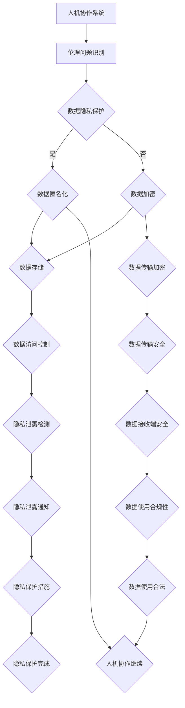

                 

## 第一部分：引言与背景

### 第1章：人机协作概述

#### 1.1 人机协作的定义与重要性

**1.1.1 人机协作的定义**

人机协作，简而言之，是指人类与机器系统之间的协同工作。它涉及人工智能系统（如机器人、自动化工具、智能软件等）与人类在信息处理、决策制定、任务执行等方面的互动。人机协作的核心理念是通过结合人类的创造力和判断力以及机器的计算能力和效率来提升整体的工作效率和质量。

**1.1.2 人机协作的发展历程**

人机协作的历史可以追溯到20世纪中期，随着计算机技术的迅猛发展，人工智能（AI）逐渐成为可能。早期的尝试主要集中在工业自动化和军事应用上，例如，1960年代初期，机器人开始被应用于汽车制造领域。随着技术的进步，人机协作的应用领域不断扩大，包括医疗诊断、金融服务、教育、家庭服务等。

**1.1.3 人机协作在现代社会中的重要性**

在现代社会，人机协作的重要性日益凸显。首先，它显著提高了生产效率。在制造业中，自动化机器能够以更高的精度和速度完成任务，减少了人为错误和劳动强度。其次，人机协作有助于推动创新。人工智能系统能够处理大量数据，发现趋势和模式，从而为人类提供创新的解决方案。

#### 1.2 人机协作的挑战与机遇

**1.2.1 人机协作面临的主要挑战**

尽管人机协作带来了许多好处，但它也面临一些挑战。首先，技术挑战包括系统的可靠性和安全性。人工智能系统必须能够在各种复杂环境下稳定运行，且不会受到恶意攻击。其次，伦理挑战体现在数据隐私、决策透明性和责任归属等方面。如何确保系统的决策过程透明、公正，并且保护用户的隐私，是当前亟待解决的问题。

**1.2.2 人机协作带来的机遇**

人机协作也为未来的科技发展带来了巨大的机遇。首先，它有望解决许多复杂的现实问题，如医疗诊断、环境保护等。其次，人机协作有望改变工作方式，提高生活质量。通过智能化工具，人们可以更高效地完成工作，有更多时间专注于创造性活动和个人生活。

**1.2.3 人机协作的未来趋势**

未来，人机协作将继续向智能化、个性化、自适应化方向发展。随着5G、物联网、区块链等技术的应用，人机协作系统将变得更加智能和互联。此外，人工智能伦理规范的建立和完善也将为人机协作提供更加坚实的法律和道德基础。

**总结**

人机协作作为一种新型的互动模式，正逐步改变我们的工作和生活方式。尽管面临诸多挑战，但其所带来的机遇和前景令人期待。在接下来的章节中，我们将深入探讨人机协作中的伦理问题，以及如何制定和实施相应的伦理规范。

#### 1.1.1 伦理学的定义与原则

伦理学，又称道德哲学，是哲学的一个分支，主要研究道德行为、道德原则和道德价值的本质与基础。伦理学的定义可以从多个角度进行阐述。首先，伦理学是关于道德观念和道德行为的学科，它探讨的是人们应该如何行动以实现善的生活。其次，伦理学是研究道德原则和规范的科学，它旨在为人们提供判断行为正确与否的标准。

伦理学的基本原则主要包括以下几方面：

1. **公正性（Justice）**：公正性原则要求我们在分配资源、权利和机会时，要公平对待每个人，不偏袒任何一方。公正性的实现依赖于正义的制度设计和社会结构的支持。

2. **尊重（Respect）**：尊重原则强调每个人都有其固有的尊严和价值，不应被轻视或忽视。尊重不仅体现在对待他人的态度上，还包括对个体权利和自由的尊重。

3. **责任（Responsibility）**：责任原则要求个体和集体在行为和决策中承担相应的后果。责任不仅是对行为的约束，更是对行为后果的反思和调整。

4. **同情（Compassion）**：同情原则强调对他人困境的关注和关心，要求我们在行动中体现对他人的同情和怜悯。

伦理决策的基本框架通常包括以下几个步骤：

1. **识别道德问题**：首先要明确决策所涉及的道德问题，理解问题的背景和影响。

2. **收集信息和数据**：通过调查、研究等方式，收集与道德问题相关的信息，形成对问题的全面理解。

3. **制定备选方案**：根据问题的性质，设计可能的解决方案或行动方案。

4. **评估备选方案**：对每个备选方案进行评估，考虑其道德原则、可行性、影响等。

5. **选择最佳方案**：在综合评估的基础上，选择最符合道德原则和实际情况的方案。

6. **实施和反思**：执行方案，并在执行过程中不断反思和调整，确保方案的有效性和道德性。

**伦理学与科技发展的关系**

伦理学与科技发展密切相关。科技的发展不仅带来了新的道德问题和挑战，也推动了伦理学的研究和进步。一方面，科技的进步往往伴随着伦理问题的出现。例如，人工智能、基因编辑、大数据等技术的应用，都带来了关于隐私、安全、公正等伦理问题的讨论。另一方面，伦理学的研究也为科技发展提供了指导和规范。通过伦理学的分析和讨论，可以识别科技应用中的潜在风险，提出相应的解决方案和伦理准则。

**举例说明**

例如，在自动驾驶汽车的发展中，伦理决策的制定和执行显得尤为重要。在面临生死抉择的情境下，如何确保自动驾驶汽车做出公正、合理的决策，成为了伦理学家和工程师共同关注的问题。再如，在医疗领域，基因编辑技术的应用引发了关于生命伦理、隐私保护等方面的讨论。这些讨论不仅有助于科技发展中的伦理决策，也为科技应用提供了道德和法律的框架。

通过上述分析，我们可以看出，伦理学在科技发展中的重要性不可忽视。它不仅为科技提供了道德指导，也为我们解决科技发展带来的伦理问题提供了理论支持和实践方法。在接下来的章节中，我们将进一步探讨人机协作中的伦理问题，以及如何制定和实施相应的伦理规范。

#### 2.2 人机协作中的伦理问题

随着人机协作的不断发展，这一领域也逐渐暴露出了一系列的伦理问题。这些问题不仅涉及到技术层面的挑战，还涉及到社会、法律和道德层面的考量。以下是人机协作中常见的几种伦理问题：

**2.2.1 数据隐私与安全问题**

数据隐私和安全是人机协作中最突出的伦理问题之一。在人工智能系统中，大量的个人数据被收集、存储和使用。这些数据包括个人信息、行为数据、生物特征数据等。如果这些数据得不到妥善保护，可能会导致隐私泄露、数据滥用等问题。

- **隐私泄露**：个人数据在传输、存储和处理过程中，可能会因为安全漏洞而被未授权的人员访问。这种隐私泄露不仅侵犯了个人隐私，还可能对个人造成经济损失和心理创伤。

- **数据滥用**：未经授权的个人或组织可能会利用收集到的数据，进行商业竞争、诈骗等非法活动。例如，通过对用户购物行为的分析，企业可能进行不公平的市场营销，或者利用用户数据制定歧视性政策。

- **数据安全风险**：随着人工智能系统的复杂性和规模不断扩大，数据安全风险也在增加。网络攻击、数据丢失、系统漏洞等问题都可能对数据安全构成威胁。

**2.2.2 人机决策的透明性与公正性**

人机协作中的决策过程通常涉及人工智能系统的参与。然而，这些决策的透明性和公正性常常受到质疑。以下是一些相关的问题：

- **决策透明性**：人工智能系统在决策过程中，往往采用复杂的算法和模型。这些算法和模型对于外行人来说可能难以理解。因此，如何确保决策过程的透明性，使其可被用户和监管机构理解，成为一个重要的伦理问题。

- **决策公正性**：在涉及人类利益的决策中，如何确保决策的公正性是一个关键问题。例如，在医疗诊断、信用评估等应用中，人工智能系统可能会因算法偏见而导致歧视性决策。这种不公正的决策不仅损害了当事人的权益，还可能引发社会不公。

**2.2.3 人机协作中的道德责任与角色定位**

在人机协作中，如何明确各方的道德责任和角色定位，也是一个复杂的伦理问题。以下是一些相关的问题：

- **开发者责任**：人工智能系统的开发者有责任确保系统的安全性和道德性。他们需要设计出既高效又符合伦理规范的系统，并在开发过程中进行充分的伦理评估。

- **用户责任**：用户在使用人工智能系统时，也有责任遵守相关的伦理规范。例如，他们需要妥善保护个人数据，不滥用系统功能。

- **监管者责任**：政府和其他监管机构有责任制定和实施相关的法律法规，监督人工智能系统的应用，确保其符合伦理标准。

- **企业责任**：企业在开发和应用人工智能系统时，需要承担社会责任，确保其产品和服务符合道德和法律要求。

**总结**

人机协作中的伦理问题涉及到数据隐私与安全、决策透明性与公正性，以及各方的道德责任与角色定位。这些问题不仅影响人工智能系统的应用和发展，还关系到社会的公平、正义和可持续发展。在接下来的章节中，我们将探讨如何制定和实施伦理规范，以解决这些问题。

#### 2.3 伦理规范的制定与实施

伦理规范在确保人机协作系统的安全、透明和公正中扮演着至关重要的角色。制定和实施有效的伦理规范，不仅有助于解决上述伦理问题，还能为科技发展提供法律和道德的保障。以下是人机协作伦理规范的制定与实施过程。

**2.3.1 伦理规范的重要性**

伦理规范在科技领域的应用具有以下几个重要作用：

1. **指导科技发展**：伦理规范为科技发展提供了道德指导，确保技术进步不会违背人类的基本价值观和道德原则。

2. **规范技术应用**：通过明确各方的责任和义务，伦理规范为科技应用提供了行为准则，避免技术滥用和不当使用。

3. **保护用户权益**：伦理规范关注用户隐私、数据安全和公正性，保护用户的合法权益，提高用户对技术的信任度。

4. **促进社会公平**：伦理规范有助于消除歧视和偏见，促进社会的公平与正义。

**2.3.2 伦理规范的制定原则**

制定伦理规范应遵循以下原则：

1. **科学性**：伦理规范应基于科学研究，充分考虑技术特点、应用场景和社会影响。

2. **公正性**：伦理规范应确保各方利益平衡，不偏袒任何一方。

3. **透明性**：伦理规范的制定过程应公开透明，接受公众监督和反馈。

4. **适应性**：伦理规范应具有灵活性，能够适应技术发展和应用环境的变化。

5. **可执行性**：伦理规范应具有可操作性，确保在实际应用中能够有效执行。

**2.3.3 伦理规范的实施策略**

实施伦理规范需要采取一系列策略，包括：

1. **法律法规支持**：政府应制定相关法律法规，确保伦理规范的实施有法可依。

2. **行业自律**：行业协会和组织应制定行业规范，推动企业遵守伦理规范。

3. **教育培训**：加强对技术开发者、用户和监管人员的伦理教育，提高他们的伦理意识和素养。

4. **技术监管**：加强对人工智能系统的监管，确保其符合伦理规范。

5. **公众参与**：鼓励公众参与伦理决策，提高伦理规范的社会认可度和执行力。

**具体措施**

1. **数据隐私保护**：制定数据隐私保护法规，要求企业对收集的数据进行匿名化处理，并设置数据安全保护机制。

2. **决策透明性要求**：要求人工智能系统提供决策过程的透明性报告，确保用户和监管机构能够理解决策过程。

3. **公正性评估**：建立公正性评估机制，定期对人工智能系统进行伦理审查，确保其决策不带有偏见。

4. **责任归属明确**：明确各方的道德责任，如开发者、用户、企业等，确保在发生伦理问题时有明确的责任主体。

**总结**

伦理规范在确保人机协作系统的安全和公正中发挥着关键作用。通过科学、公正、透明的制定和实施过程，伦理规范能够为科技发展提供有力的道德和法律保障。在接下来的章节中，我们将通过具体案例，进一步探讨伦理规范在解决人机协作中的伦理问题中的应用。

### 第3章：人机协作伦理案例分析

#### 3.1 案例背景与情境

在人机协作的快速发展中，许多实际应用场景逐渐暴露出一系列伦理问题。以下我们将通过三个具体的案例，深入分析人机协作中的伦理困境，并提出相应的解决方案。

**3.1.1 案例一：自动驾驶汽车中的伦理困境**

自动驾驶汽车是人工智能技术的重要应用之一，但其在实际应用中也面临诸多伦理挑战。其中一个典型的伦理困境是“撞人决策”问题。在紧急情况下，自动驾驶汽车需要快速做出决策，例如在无法避免碰撞时，是选择撞向行人还是车辆？这一决策不仅涉及到技术层面，还涉及到道德和法律层面。

**3.1.2 案例二：医疗辅助诊断系统中的伦理问题**

医疗辅助诊断系统利用人工智能技术对医疗数据进行分析，以提高诊断的准确性。然而，这一系统也带来了一些伦理问题，如数据隐私、算法偏见和责任归属等。例如，如果一个医疗辅助诊断系统对某些种族或性别存在偏见，那么可能会导致不公平的诊断结果。

**3.1.3 案例三：社交媒体平台上的用户数据伦理**

社交媒体平台通过收集和分析用户数据，提供个性化服务和广告推送。然而，这也引发了一系列伦理问题，如用户数据隐私、数据滥用和算法歧视等。例如，某些社交媒体平台可能利用用户数据进行商业交易，或者在推送广告时对某些用户进行歧视性对待。

#### 3.2 案例分析

**3.2.1 案例一：自动驾驶汽车中的伦理决策分析**

在自动驾驶汽车中，面临的最主要伦理困境是“撞人决策”问题。为了解决这个问题，可以从以下几个方面进行分析：

1. **技术层面**：自动驾驶汽车需要具备实时感知、分析和决策的能力。通过高级传感器（如雷达、激光雷达等）和复杂的算法，汽车可以快速评估周围环境，并在紧急情况下做出决策。

2. **道德层面**：在“撞人决策”中，道德原则如功利主义、义务论和公正性原则都可能被应用到决策过程中。例如，功利主义可能会建议选择最小化伤害的方案，而公正性原则则要求不偏袒任何一方。

3. **法律层面**：自动驾驶汽车的法律责任归属也是一个关键问题。在发生交通事故时，如何界定各方责任，是法律专家和技术专家共同需要解决的问题。

**3.2.2 案例二：医疗辅助诊断系统中的伦理挑战**

医疗辅助诊断系统中的伦理挑战主要表现在以下几个方面：

1. **数据隐私**：医疗数据是高度敏感的信息，需要严格保护用户的隐私。在数据收集、存储和使用过程中，必须遵循数据隐私保护法规，确保用户数据不被泄露。

2. **算法偏见**：如果医疗辅助诊断系统在训练过程中存在偏见，可能会导致不公平的诊断结果。为了避免算法偏见，需要在系统设计、数据收集和算法选择等方面进行充分考虑。

3. **责任归属**：在诊断过程中，如果系统出现错误，如何界定责任是一个关键问题。这需要法律和道德框架来明确各方的责任和义务。

**3.2.3 案例三：社交媒体平台用户数据的伦理考量**

社交媒体平台用户数据的伦理问题主要表现在以下几个方面：

1. **数据隐私**：用户在社交媒体平台上分享的信息是个人隐私的重要组成部分。平台需要确保用户数据的安全，并遵循数据隐私保护法规。

2. **数据滥用**：平台可能利用用户数据进行分析和营销，但必须确保这种使用方式符合用户意愿，不侵犯用户的隐私权。

3. **算法歧视**：在推送广告和信息时，平台可能会基于用户数据进行个性化推荐，但必须确保这种推荐不带有歧视性，不侵犯用户的平等权。

#### 3.3 案例启示与解决方案

通过对以上三个案例的分析，我们可以得出以下启示和解决方案：

1. **加强伦理教育和培训**：技术开发者、用户和监管人员都需要具备一定的伦理意识和素养，才能在科技应用中做出正确的道德决策。

2. **制定明确的伦理规范**：政府、行业组织和企业应共同制定伦理规范，明确各方的责任和义务，为科技发展提供法律和道德保障。

3. **加强监管和执法**：政府和监管机构应加强对人工智能系统和社交媒体平台的监管，确保其遵守伦理规范，保护用户的合法权益。

4. **提升技术透明度和公正性**：通过技术手段提升决策过程的透明度和公正性，使用户和监管机构能够理解和监督系统的运行。

5. **推动公众参与**：鼓励公众参与伦理决策，提高伦理规范的社会认可度和执行力。

**总结**

人机协作在实际应用中面临诸多伦理挑战，如自动驾驶汽车中的决策困境、医疗辅助诊断系统的数据隐私和算法偏见，以及社交媒体平台上的用户数据伦理问题。通过加强伦理教育和培训、制定明确的伦理规范、加强监管和执法、提升技术透明度和公正性，以及推动公众参与，我们可以更好地解决这些伦理问题，实现人机协作的可持续发展。

### 4.1 人工智能行业的伦理规范

随着人工智能技术的快速发展，其伦理问题也日益受到广泛关注。人工智能行业的伦理规范旨在确保技术发展不违背社会道德和法律原则，同时保护用户的权益和隐私。以下将分析人工智能行业伦理规范的发展现状、主要领域及其实施与监督。

**4.1.1 人工智能伦理规范的发展现状**

人工智能伦理规范的发展历程可以追溯到20世纪末和21世纪初。当时，随着人工智能技术的兴起，学术界和工业界开始关注其潜在的社会影响和伦理问题。以下是一些关键的发展节点：

1. **2000年代初**：学术界开始发表关于人工智能伦理问题的研究论文，探讨人工智能技术可能带来的负面影响，如失业、隐私侵犯和算法偏见等。

2. **2010年代**：人工智能技术逐渐从理论研究走向实际应用，引发了对伦理规范的需求。多家科技公司和学术机构开始制定内部伦理准则，如谷歌的AI原则和麻省理工学院的AI伦理倡议。

3. **2020年代**：随着人工智能技术的进一步普及，国际社会开始重视人工智能伦理规范的制定和实施。多个国家和地区颁布了相关法律法规，如欧盟的通用数据保护条例（GDPR）和美国的算法问责法案（Algorithmic Accountability Act）。

**4.1.2 人工智能伦理规范的主要领域**

人工智能伦理规范涉及多个领域，以下是一些主要领域：

1. **数据隐私与安全**：确保个人数据在收集、存储和使用过程中的隐私和安全。这包括数据匿名化、加密和访问控制等。

2. **算法公平性与透明性**：防止算法偏见和歧视，确保算法决策的公正性和透明性。这需要算法的可解释性和用户对算法决策的信任。

3. **责任与问责**：明确人工智能系统的责任归属，确保在发生错误或损害时，责任能够得到追究。这涉及到法律、道德和技术层面的责任。

4. **社会影响**：评估人工智能技术对就业、教育、医疗和社会公平等方面的影响，确保其发展符合社会的整体利益。

**4.1.3 人工智能伦理规范的实施与监督**

实施人工智能伦理规范需要政府、行业组织、企业和研究机构的共同努力。以下是一些关键的实施和监督措施：

1. **法律法规**：政府应制定和实施相关法律法规，确保人工智能技术的应用符合伦理要求。例如，数据隐私保护法和算法问责法等。

2. **行业自律**：行业协会和组织应制定行业规范和标准，推动企业遵守伦理规范。例如，人工智能行业协会（AIIA）和欧洲人工智能联盟（euAIC）等。

3. **认证与评估**：建立认证和评估机制，对人工智能系统进行伦理审查和认证。这可以确保系统的设计和应用符合伦理标准。

4. **教育培训**：加强对技术开发者、用户和监管人员的伦理教育，提高他们的伦理意识和素养。

5. **公众参与**：鼓励公众参与伦理决策，提高伦理规范的社会认可度和执行力。

**具体措施**

1. **数据隐私保护**：企业应遵循数据隐私保护法规，采用数据匿名化和加密技术，确保用户数据不被泄露。

2. **算法公平性评估**：开发人工智能系统时，应进行算法公平性评估，确保系统不带有偏见和歧视。

3. **责任与问责机制**：明确人工智能系统的责任归属，建立责任追究机制，确保在发生错误或损害时，责任能够得到追究。

4. **伦理审查**：在人工智能系统开发和应用前，进行伦理审查，确保系统设计和应用符合伦理要求。

5. **伦理培训**：对技术开发者、用户和监管人员进行伦理培训，提高他们的伦理意识和素养。

**总结**

人工智能行业的伦理规范对于确保技术发展不违背社会道德和法律原则具有重要意义。通过政府、行业组织、企业和研究机构的共同努力，我们可以制定和实施有效的伦理规范，推动人工智能技术的可持续发展。在接下来的章节中，我们将进一步探讨不同行业的人机协作伦理规范。

### 4.2 不同行业的人机协作伦理规范

随着人工智能技术的广泛应用，不同行业在制定和实施人机协作伦理规范时，面临的具体问题和挑战也各不相同。以下将分别探讨制造业、服务业和医疗行业在制定和实施人机协作伦理规范时的具体案例。

#### 4.2.1 制造业的伦理规范

制造业是人机协作的重要应用领域之一。在制造业中，人机协作主要涉及自动化生产线、机器人辅助装配和质量检测等方面。以下是一些制造业人机协作伦理规范的具体案例：

**案例一：自动化生产线的伦理规范**

1. **数据隐私与安全**：在自动化生产线的运行过程中，会涉及大量的生产数据。企业需遵循数据隐私保护法规，确保员工和客户的数据安全。

2. **机器人伦理使用**：企业需确保机器人不用于替代人类劳动力，而是作为辅助工具，提高生产效率和安全性。例如，机器人应仅用于执行危险或重复性工作。

3. **员工培训与过渡**：企业在引入自动化技术时，应对员工进行充分培训，帮助他们适应新技术。同时，企业应制定员工过渡政策，确保受影响的员工能够获得再培训和就业机会。

**案例二：机器人辅助装配的伦理规范**

1. **工作环境安全**：在机器人辅助装配过程中，企业需确保工作环境符合安全标准，避免机器人对员工造成伤害。

2. **人机协作设计**：机器人应设计为与人类工人协作，而不是取代他们。例如，机器人应具备感知和响应人类工人的能力，确保工作过程中的人机交互安全、高效。

3. **算法公平性与透明性**：在机器人辅助装配系统中，算法的决策过程应公开透明，确保决策的公正性。例如，应进行算法公平性评估，防止因算法偏见导致不公平待遇。

#### 4.2.2 服务业的伦理规范

服务业是人机协作的另一个重要领域，包括客户服务、餐饮、金融等领域。以下是一些服务业人机协作伦理规范的具体案例：

**案例一：客户服务的伦理规范**

1. **数据隐私与保护**：企业需确保客户个人信息的安全，不进行非法收集、存储和使用。

2. **算法公平性**：在客户服务过程中，人工智能系统应避免对某些用户群体进行歧视性对待。例如，在客户投诉处理中，应确保系统对所有客户一视同仁，不因用户的性别、年龄、种族等因素产生偏见。

3. **员工监督与反馈**：企业应对人工智能系统的决策进行监督，确保其符合伦理规范。同时，应鼓励员工提供反馈，帮助改进系统性能和伦理表现。

**案例二：餐饮服务的伦理规范**

1. **员工福利与培训**：餐饮服务企业应确保员工的劳动条件和福利待遇符合伦理标准，包括合理的工资、休息时间和培训机会。

2. **人机协作设计**：在餐饮服务中，机器人应设计为辅助人类服务员，提高服务效率和顾客体验。例如，机器人可以用于送餐、清洁等工作，但应避免替代人类服务员的核心职能。

3. **隐私保护**：在餐厅环境中，企业应确保顾客的隐私不被侵犯。例如，避免在餐厅内安装过多的监控设备，保护顾客的隐私权益。

#### 4.2.3 医疗行业的伦理规范

医疗行业是人机协作的重要应用领域之一，涉及医疗诊断、治疗、药物研发等多个方面。以下是一些医疗行业人机协作伦理规范的具体案例：

**案例一：医疗诊断系统的伦理规范**

1. **数据隐私与安全**：在医疗诊断过程中，患者的医疗数据是高度敏感的信息。医院和医疗机构需确保患者数据的安全，遵循数据隐私保护法规。

2. **算法公平性与透明性**：医疗诊断系统应确保算法的决策过程透明，确保诊断结果的公正性和准确性。例如，应进行算法公平性评估，防止因算法偏见导致错误的诊断结果。

3. **患者参与**：在医疗诊断系统中，患者应有权了解诊断过程和结果，并提供反馈。这有助于增强患者对诊断系统的信任，提高诊断质量。

**案例二：药物研发的伦理规范**

1. **数据共享与开放**：在药物研发过程中，企业应遵循数据共享和开放的原则，促进科学研究和合作。

2. **伦理审查**：药物研发项目应经过伦理审查，确保研究过程符合伦理标准。例如，临床试验应在伦理委员会的监督下进行，确保参与者的权益。

3. **责任归属**：在药物研发过程中，企业、研究机构和政府机构应明确各自的责任和义务，确保在发生问题时，责任能够得到追究。

**总结**

不同行业在制定和实施人机协作伦理规范时，面临的具体问题和挑战有所不同。通过结合行业特点，制定和实施有针对性的伦理规范，可以更好地保障人机协作的伦理性和公正性，促进技术的可持续发展。

### 4.3 行业伦理规范案例解析

在前文中，我们探讨了制造业、服务业和医疗行业在制定和实施人机协作伦理规范时的具体案例。以下将结合实际案例，进一步解析这些行业伦理规范的实施效果和挑战。

#### 4.3.1 制造业人机协作伦理规范案例

**案例一：丰田汽车公司的自动化生产线**

丰田汽车公司在生产制造过程中，广泛应用了自动化技术。为了确保人机协作的伦理规范，丰田制定了以下措施：

1. **员工培训与过渡**：在引入自动化生产线时，丰田为员工提供了全面的技术培训，帮助他们适应新的工作环境。同时，丰田还制定了员工过渡政策，为受影响的员工提供再培训和就业机会。

2. **人机协作设计**：丰田的自动化机器人设计为与人类工人协作，而不是取代他们。例如，丰田的机器人具备高度的人体感知能力，能够避免碰撞和伤害。

3. **伦理审查**：在引入新系统之前，丰田进行了详细的伦理审查，确保系统设计和应用符合伦理规范。

**实施效果与挑战**

- **实施效果**：丰田的自动化生产线提高了生产效率和安全性，减少了人为错误。员工的技能得到了提升，工作环境更加安全。

- **挑战**：在实施过程中，丰田面临了员工适应新技术和自动化技术带来的就业压力。此外，确保自动化机器人完全安全仍是一个技术挑战。

#### 4.3.2 服务业人机协作伦理规范案例

**案例二：亚马逊的客服机器人**

亚马逊在客户服务领域广泛应用了人工智能技术，以提供高效的客户支持。为了确保人机协作的伦理规范，亚马逊采取了以下措施：

1. **数据隐私与保护**：亚马逊遵循数据隐私保护法规，确保客户数据的保密和安全。

2. **算法公平性**：亚马逊对客服机器人进行了算法公平性评估，确保系统不带有歧视性对待。

3. **员工监督与反馈**：亚马逊建立了监督机制，对客服机器人的决策进行实时监控。同时，员工可以提供反馈，帮助改进系统性能和伦理表现。

**实施效果与挑战**

- **实施效果**：亚马逊的客服机器人提高了客户服务的响应速度和效率，减少了人力成本。用户对客服机器人的满意度较高。

- **挑战**：尽管客服机器人具有高效性和便利性，但用户可能对机器人的响应存在疑虑。此外，如何确保机器人的决策完全公正和透明，仍是一个挑战。

#### 4.3.3 医疗行业人机协作伦理规范案例

**案例三：IBM Watson的癌症诊断系统**

IBM Watson的癌症诊断系统在医疗行业中引起了广泛关注。为了确保系统符合伦理规范，IBM采取了以下措施：

1. **数据隐私与安全**：IBM确保患者的医疗数据在收集、存储和使用过程中得到严格保护。

2. **算法公平性与透明性**：IBM对系统进行了算法公平性评估，确保系统不带有偏见和歧视。同时，系统设计为透明，医生可以查看诊断过程的详细信息和数据来源。

3. **患者参与**：IBM鼓励患者参与诊断过程，提供反馈和建议，以提高系统的诊断准确性和用户体验。

**实施效果与挑战**

- **实施效果**：IBM Watson的癌症诊断系统提高了诊断的准确性和效率，为医生提供了有力的辅助工具。患者对系统的信任度较高，有助于改善治疗效果。

- **挑战**：尽管系统在技术层面表现优异，但在实际应用中，医生和患者可能对系统的决策过程和结果存在疑虑。此外，如何确保系统在不同文化背景和医疗体系中的一致性和可解释性，仍是一个挑战。

**总结**

通过以上案例分析，我们可以看到，不同行业在实施人机协作伦理规范时，采取了多种措施和策略。虽然取得了一定的效果，但同时也面临诸多挑战。在未来的发展中，行业需要继续探索和完善伦理规范，确保人机协作的可持续发展。

### 第5章：人机协作伦理准则的制定

#### 5.1 伦理准则的定义与作用

伦理准则是指为行为设定的一系列道德标准和规范，旨在引导个体和组织在决策和行为中遵循道德原则和价值观。在人机协作领域，伦理准则尤为重要，因为人工智能系统的广泛应用带来了许多新的伦理挑战，如数据隐私、算法偏见、责任归属等。制定和遵循伦理准则，不仅有助于解决这些伦理问题，还能为科技发展提供道德和法律保障。

**5.1.1 伦理准则的定义**

伦理准则，即道德规范，是一套行为指南，用于指导个体和组织在特定情境中的行为选择。这些准则通常基于道德哲学的基本原则，如公正、尊重、责任和同情等。在人机协作领域，伦理准则则具体涉及到人工智能系统的设计、开发、部署和应用过程中，如何平衡技术进步与伦理道德之间的关系。

**5.1.2 伦理准则在科技发展中的作用**

伦理准则在科技发展中的作用主要体现在以下几个方面：

1. **规范行为**：伦理准则为技术开发者、使用者和监管机构提供了明确的行为规范，确保技术发展符合道德和法律要求。

2. **指导决策**：伦理准则为科技项目的决策过程提供了道德指导，帮助开发者在面临复杂伦理问题时，做出符合道德原则的决策。

3. **增强信任**：通过遵循伦理准则，可以增强公众对人工智能技术的信任，提高技术接受度，促进科技与社会的和谐发展。

4. **防范风险**：伦理准则有助于识别和预防潜在的技术风险，如数据隐私泄露、算法偏见等，确保技术应用的负责任和可持续性。

**5.1.3 伦理准则的制定原则**

为了确保伦理准则的有效性和适用性，制定伦理准则时应遵循以下原则：

1. **全面性**：伦理准则应涵盖人机协作的各个阶段，从设计、开发、部署到应用，确保全过程符合伦理要求。

2. **科学性**：伦理准则的制定应基于科学研究，充分考虑技术特点、应用场景和社会影响。

3. **公正性**：伦理准则应确保各方利益平衡，不偏袒任何一方，特别是在涉及社会公平和正义的问题上。

4. **适应性**：伦理准则应具有灵活性，能够适应技术发展和应用环境的变化。

5. **透明性**：伦理准则的制定和执行过程应公开透明，接受公众监督和反馈。

#### 5.2 伦理准则的制定过程

制定伦理准则是一个复杂的过程，涉及多个阶段和参与方。以下简要介绍伦理准则的制定过程：

1. **需求分析**：首先，需要分析人机协作领域面临的主要伦理问题，明确准则的制定需求和目标。

2. **专家咨询**：邀请伦理学、法学、心理学、计算机科学等领域的专家，进行深入讨论和咨询，以确保准则的科学性和全面性。

3. **草案制定**：根据需求分析和专家意见，制定伦理准则的初步草案。

4. **公众参与**：通过公众咨询、研讨会、在线投票等方式，广泛收集公众意见，提高伦理准则的社会认可度和执行力。

5. **审查与修订**：对初步草案进行多次审查和修订，确保准则的公正性、透明性和适应性。

6. **正式发布**：经过充分讨论和修订后，正式发布伦理准则。

7. **持续更新**：伦理准则应定期进行评估和更新，以适应技术发展和应用环境的变化。

**5.2.1 伦理准则的制定步骤**

具体而言，伦理准则的制定过程可以分为以下几个步骤：

1. **问题识别**：明确人机协作领域面临的伦理问题，如数据隐私、算法偏见、责任归属等。

2. **原则确立**：基于伦理学原则和科学研究成果，确立伦理准则的基本原则，如公正性、尊重、责任等。

3. **准则制定**：根据基本原则，制定具体的伦理准则，包括行为规范、责任分配、决策框架等。

4. **案例研究**：通过案例分析，验证伦理准则的适用性和有效性。

5. **公众反馈**：收集公众意见，对伦理准则进行修订和优化。

6. **正式发布**：正式发布伦理准则，并推广应用。

**5.2.2 伦理准则的参与方**

在伦理准则的制定过程中，涉及多个参与方，包括政府、行业组织、企业、技术开发者、用户等。以下为各方的角色和责任：

1. **政府**：政府负责制定相关法律法规，为伦理准则的实施提供法律保障。政府还应推动公众参与伦理决策，提高伦理准则的社会认可度。

2. **行业组织**：行业组织负责制定行业规范和标准，推动企业遵守伦理准则。行业组织还可以组织专家咨询和公众参与，提高准则的科学性和透明性。

3. **企业**：企业是伦理准则的主要执行者，应制定内部伦理政策和流程，确保技术研发和应用符合伦理准则。企业还应承担社会责任，推动行业伦理规范的发展。

4. **技术开发者**：技术开发者应遵循伦理准则，确保其设计、开发和应用的系统符合道德和法律要求。技术开发者还应积极参与伦理准则的制定和修订，提供专业意见和建议。

5. **用户**：用户是伦理准则的受益者和监督者，应了解和遵守伦理准则，确保自己的行为符合道德原则。用户还可以通过反馈和参与，推动伦理准则的不断完善。

**总结**

伦理准则的制定是一个复杂而重要的过程，它需要各方共同参与和努力。通过明确伦理准则的定义、原则和制定过程，我们可以为科技发展提供有力的道德和法律保障，确保人机协作的可持续发展。

### 5.3 典型伦理准则分析

在人工智能和自动化技术的快速发展中，许多国家和组织已经制定了具体的伦理准则来规范相关行为。以下将分析几个典型的伦理准则，包括欧盟通用数据保护条例（GDPR）、美国人工智能伦理准则和中国人工智能伦理准则。

**5.3.1 欧盟通用数据保护条例（GDPR）**

欧盟通用数据保护条例（GDPR）是世界上最全面的数据隐私保护法规之一，于2018年5月25日正式生效。GDPR的主要目标是加强个人数据的保护，确保数据隐私和透明度。以下是GDPR的核心内容：

1. **数据控制者与处理者的责任**：GDPR明确了数据控制者（决定数据使用目的和方式的人或组织）和处理者（负责数据处理的人或组织）的责任。数据控制者需要确保数据处理活动符合GDPR的要求，并选择可靠的数据处理者。

2. **数据主体的权利**：GDPR赋予数据主体（数据的所有者，即个人）一系列权利，包括访问权、修正权、删除权（被遗忘权）、限制处理权、数据可携带权等。这些权利确保数据主体对其数据的控制权。

3. **数据处理的合法性**：GDPR规定了六种合法的数据处理方式，包括同意、合同履行、法律义务、公共利益、保护生命和合法利益等。数据处理者需要确定数据处理的法律基础。

4. **数据安全**：GDPR要求数据处理者采取适当的技术和组织措施，确保数据的安全性和完整性。这些措施包括数据加密、匿名化、访问控制等。

5. **数据泄露通知**：GDPR要求数据处理者在发现数据泄露时，应在72小时内通知数据控制者和相关数据主体，除非泄露不会对数据主体造成风险。

**5.3.2 美国人工智能伦理准则**

美国在人工智能伦理方面也有一系列准则和倡议。以下是几个主要的人工智能伦理准则：

1. **美国国家人工智能计划**：2016年，美国发布了《国家人工智能计划》，提出了人工智能发展的目标、原则和策略。该计划强调了人工智能的安全性、透明性、公正性和可解释性。

2. **美国计算机协会（ACM）人工智能伦理准则**：ACM在2019年发布了人工智能伦理准则，提出了五个核心原则，包括尊重个人隐私、确保数据的公正性和透明性、避免算法偏见和歧视、确保安全和保护用户利益、促进人工智能的可持续发展和普及。

3. **人工智能治理倡议**：多个美国科技公司和组织发起了人工智能治理倡议，旨在制定行业标准和最佳实践，推动人工智能的负责任发展。

**5.3.3 中国人工智能伦理准则**

中国在人工智能伦理方面也进行了积极探索，以下是中国人工智能伦理准则的主要特点：

1. **《新一代人工智能治理原则》**：2019年，中国发布了《新一代人工智能治理原则》，提出了数据治理、公平公正、安全可控、合作共赢、尊重伦理道德等五个方面的原则。

2. **《人工智能发展规划》**：中国制定了《人工智能发展规划》，明确了人工智能发展的目标和路径，强调了伦理道德和安全问题。

3. **行业自律**：中国多个行业协会和企业在人工智能伦理方面进行了自律，制定了相应的行业规范和准则，如中国人工智能学会的《人工智能伦理规范》等。

**总结**

以上几个典型的伦理准则体现了全球在人工智能和自动化技术发展中的共同关注和努力。GDPR注重数据隐私保护，ACM提出了人工智能伦理的核心原则，中国则从国家层面制定了全面的治理原则。这些准则不仅为人工智能技术的发展提供了法律和道德保障，也为全球人工智能伦理标准的制定提供了参考。

### 5.4 伦理准则实施的重要性

伦理准则的实施是确保人机协作系统符合道德和法律要求的关键环节。有效的实施不仅可以解决伦理问题，还能提升系统的可靠性和公信力。以下将详细阐述伦理准则实施的重要性、面临的挑战以及实现策略。

**5.4.1 伦理准则实施的重要性**

1. **保障用户权益**：伦理准则的实施能够有效保护用户的隐私、数据安全和公正性，确保用户在人工智能系统的使用过程中不受侵害。

2. **提高系统可靠性**：通过实施伦理准则，可以确保人机协作系统的设计和开发过程遵循科学和公正的原则，减少系统错误和故障，提高系统的可靠性和稳定性。

3. **增强公众信任**：伦理准则的实施能够增强公众对人工智能系统的信任，促进技术的普及和应用，推动社会对人工智能的接受和认可。

4. **促进技术发展**：伦理准则的实施为人工智能技术的发展提供了明确的道德和法律框架，有助于技术创新与伦理发展的平衡，推动技术的可持续发展。

**5.4.2 伦理准则实施面临的挑战**

1. **技术复杂性**：人工智能系统的技术复杂度高，涉及多学科交叉和高度集成的算法，使得伦理准则的实施变得更加复杂。

2. **执行力度不足**：虽然许多国家和地区制定了伦理准则，但在实际执行过程中，法律法规的执行力度和监督机制可能不够完善，导致伦理准则未能得到有效实施。

3. **利益冲突**：在利益驱动下，企业和开发者可能倾向于忽视伦理准则，以追求经济利益。这种利益冲突使得伦理准则的实施面临挑战。

4. **公众参与度低**：伦理准则的实施需要广泛的公众参与和反馈，但实际过程中，公众参与度可能较低，导致准则的制定和执行缺乏社会基础。

**5.4.3 伦理准则实施策略**

1. **法律法规支持**：政府应制定和实施相关法律法规，明确伦理准则的法律地位和执行力度，为伦理准则的实施提供法律保障。

2. **行业自律**：行业协会和组织应制定行业规范和标准，推动企业遵守伦理准则。通过行业自律，可以形成统一的伦理规范，提高整体行业水平。

3. **教育培训**：加强伦理教育和培训，提高技术开发者、用户和监管人员的伦理意识和素养，使他们能够自觉遵守伦理准则。

4. **技术监管**：加强对人工智能系统的监管，建立监管机制，确保伦理准则在技术实施过程中得到有效执行。

5. **公众参与**：鼓励公众参与伦理准则的制定和实施，通过公众咨询、研讨会、在线投票等方式，提高公众的参与度和对伦理准则的认同感。

6. **技术手段**：利用先进的技术手段，如区块链、智能合约等，提高伦理准则的可操作性和透明度，确保其在实际应用中得以有效执行。

**5.4.4 实施效果评估**

为了确保伦理准则的有效实施，需要建立一套评估体系，对实施效果进行定期评估。以下是一些关键评估指标：

1. **合规性评估**：评估伦理准则在具体项目和技术应用中的合规性，确保各项要求得到满足。

2. **效果评估**：评估伦理准则实施后，对系统性能、用户满意度、社会影响等方面的改善情况。

3. **反馈机制**：建立反馈机制，收集用户、开发者和监管机构的意见和建议，不断优化伦理准则的实施策略。

4. **持续改进**：根据评估结果，对伦理准则进行修订和完善，确保其适应技术发展和应用环境的变化。

**总结**

伦理准则的实施对于确保人机协作系统的安全、透明和公正至关重要。通过法律法规支持、行业自律、教育培训、技术监管和公众参与等多种策略，可以有效地推动伦理准则的实施，保障人工智能技术的可持续发展。

### 6.1 伦理准则实施的策略

为了确保人机协作伦理准则的有效实施，需要从组织层面、项目层面以及法律法规支持等多个维度制定和执行策略。以下将详细阐述这些策略的具体内容。

**6.1.1 组织层面的伦理准则实施策略**

1. **制定内部伦理政策**：企业应制定一套详细的内部伦理政策，明确伦理准则在公司内部的应用范围和实施步骤。这些政策应涵盖数据隐私、算法透明性、公正性等多个方面。

2. **建立伦理委员会**：企业可以设立伦理委员会，负责监督和评估公司的伦理准则执行情况。伦理委员会应由内外部专家组成，确保其独立性和专业性。

3. **员工培训与教育**：企业应对员工进行定期的伦理培训，提高他们的伦理意识和素养。通过案例分析和实战演练，帮助员工理解伦理准则的重要性和实施方法。

4. **伦理文化建设**：企业应积极营造一个重视伦理的文化氛围，将伦理准则融入到企业文化中。通过宣传、表彰等方式，鼓励员工遵守伦理规范。

5. **持续监控与改进**：企业应建立持续监控机制，定期检查伦理准则的实施情况，及时发现和解决存在的问题。同时，根据技术发展和应用环境的变化，不断优化伦理准则。

**6.1.2 项目层面的伦理准则实施策略**

1. **项目伦理审查**：在项目启动阶段，应对项目进行伦理审查，评估项目可能带来的伦理风险。审查应包括数据隐私、算法偏见、决策透明性等方面。

2. **伦理规范嵌入**：在项目设计和开发过程中，将伦理准则融入到系统的设计和实现中。例如，在数据收集和处理过程中，确保遵循数据隐私保护法规，在算法开发过程中，进行算法公平性评估。

3. **用户参与**：在项目实施过程中，鼓励用户参与，通过问卷调查、用户访谈等方式，了解用户对系统的看法和反馈，确保系统的设计和应用符合用户需求和伦理要求。

4. **透明性和可解释性**：在项目开发过程中，应确保系统的决策过程透明，提供详细的算法说明和解释，使用户和监管机构能够理解和监督系统的运行。

5. **责任归属明确**：在项目责任分配中，应明确各方的伦理责任和义务，确保在发生伦理问题时，责任能够得到追究。

**6.1.3 法律法规的支持与实施**

1. **法律法规制定**：政府应制定和完善相关法律法规，为伦理准则的实施提供法律依据。例如，可以制定数据隐私保护法、算法问责法等。

2. **法律法规宣传**：政府应通过多种渠道，广泛宣传伦理准则和相关法律法规，提高公众的法律意识和伦理素养。

3. **法律法规执行**：政府应加强对伦理准则和法律法规的执行力度，建立监管机制，确保企业和项目严格遵守伦理规范。

4. **执法监督**：建立执法监督机制，对违反伦理准则和法律法规的行为进行查处，确保法律和伦理规范得到有效执行。

5. **国际合作**：在全球化背景下，政府应积极参与国际合作，制定和推广全球性的伦理准则和法律法规，确保跨国人工智能系统的合规性和互操作性。

**总结**

通过组织层面的伦理准则实施策略、项目层面的伦理准则实施策略以及法律法规的支持与实施，可以有效地推动人机协作伦理准则的实施。这些策略不仅有助于解决伦理问题，还能提高系统的可靠性和公信力，推动人工智能技术的可持续发展。

### 6.2 伦理准则实施的案例研究

为了更好地理解伦理准则在实际项目中的应用效果，以下将通过三个具体案例，详细分析伦理准则在人工智能系统实施过程中的应用情况。

**6.2.1 人工智能伦理准则实施案例一：自动驾驶汽车**

自动驾驶汽车是人工智能技术的重要应用之一，其伦理准则的实施对于确保交通安全和社会信任至关重要。以下是某个自动驾驶汽车项目中的伦理准则实施情况：

1. **数据隐私保护**：项目团队在设计和开发自动驾驶系统时，高度重视数据隐私保护。他们采用了数据匿名化技术，确保车辆收集的数据不包含个人身份信息。同时，系统中的数据传输和存储都进行了加密处理，以防止数据泄露。

2. **决策透明性**：自动驾驶系统采用了透明的决策框架，确保每个决策步骤都有据可查。项目团队开发了一套可解释的AI模型，允许技术人员和监管机构查看和审核系统的决策过程，确保其公正性和透明性。

3. **责任归属**：在事故责任归属方面，项目团队明确了制造商、开发者、运营商和驾驶员的各自责任。一旦发生事故，将根据责任认定机制，由相关方承担相应的责任。

**实施效果与反馈**：

- **实施效果**：通过严格的伦理准则实施，自动驾驶汽车在数据隐私保护、决策透明性和责任归属方面表现出色，获得了监管机构和公众的广泛认可。

- **反馈**：用户和监管机构对自动驾驶汽车的伦理准则实施给予了高度评价，认为其有助于提升自动驾驶汽车的安全性和可信度。

**6.2.2 人工智能伦理准则实施案例二：医疗辅助诊断系统**

医疗辅助诊断系统在医疗领域具有重要作用，但其算法偏见和决策透明性问题引起了广泛关注。以下是某个医疗辅助诊断系统项目中的伦理准则实施情况：

1. **算法公平性评估**：项目团队在开发过程中，进行了严格的算法公平性评估，确保系统不会对某些患者群体产生偏见。他们使用了多种数据集进行测试，并对算法进行了持续优化，以消除潜在的偏见。

2. **用户参与**：在系统开发和测试过程中，项目团队积极邀请医疗专家和患者代表参与，确保系统的设计和应用符合实际需求和伦理要求。

3. **决策透明性**：项目团队开发了一套透明的决策系统，允许医生查看和审核诊断结果，了解诊断过程和依据。此外，系统还提供了详细的算法解释，帮助医生更好地理解诊断结果。

**实施效果与反馈**：

- **实施效果**：通过严格的伦理准则实施，医疗辅助诊断系统在算法公平性和决策透明性方面得到了显著提升，提高了诊断准确性和患者满意度。

- **反馈**：医疗专家和患者对系统的伦理准则实施给予了积极评价，认为其有助于提高医疗服务的质量和信任度。

**6.2.3 人工智能伦理准则实施案例三：社交媒体平台**

社交媒体平台通过收集用户数据提供个性化服务，但数据隐私和安全问题备受关注。以下是某个社交媒体平台项目中的伦理准则实施情况：

1. **数据隐私保护**：项目团队制定了严格的数据隐私保护政策，确保用户数据在收集、存储和使用过程中的安全。他们采用了加密技术和访问控制措施，防止数据泄露。

2. **用户同意与透明度**：在用户数据收集和使用前，项目团队要求用户明确同意，并提供详细的隐私政策说明。用户可以随时访问和修改自己的数据，确保其拥有对数据的控制权。

3. **算法公平性**：项目团队对平台推荐算法进行了严格的公平性评估，确保算法不带有偏见和歧视。他们还建立了算法审计机制，定期对算法进行审查和优化。

**实施效果与反馈**：

- **实施效果**：通过严格的伦理准则实施，社交媒体平台在数据隐私保护、用户同意和算法公平性方面取得了显著进展，用户对平台的信任度有所提高。

- **反馈**：用户对平台的数据隐私保护政策和算法公平性表示满意，认为其有助于保护个人隐私和提升用户体验。

**总结**

通过以上案例，我们可以看到伦理准则在人工智能系统的实施过程中发挥了重要作用。严格的伦理准则不仅有助于解决数据隐私、算法偏见和责任归属等伦理问题，还能提高系统的安全性和用户信任度。未来，随着人工智能技术的不断发展，伦理准则的实施将更加重要，需要不断优化和完善。

### 第7章：人机协作伦理的未来趋势

随着人工智能和自动化技术的迅猛发展，人机协作正在深刻地改变我们的生活方式和社会结构。在这一章中，我们将探讨人机协作伦理的未来趋势，包括技术进步、伦理准则的发展以及未来面临的伦理挑战。

#### 7.1 未来人机协作的发展方向

**7.1.1 技术进步**

未来人机协作的发展将依赖于技术的进步，尤其是以下几个方面的突破：

1. **更智能的人工智能**：随着深度学习、自然语言处理和强化学习等技术的不断发展，人工智能系统将变得更加智能，能够更好地理解和应对复杂环境。

2. **更高效的数据处理**：随着计算能力的提升和大数据技术的应用，人工智能系统将能够处理和分析海量数据，从而提供更精准的决策支持。

3. **更强大的机器人技术**：机器人技术将朝着更高灵活性和自主性的方向发展，能够在更加复杂的场景中执行任务，与人类更加紧密地协作。

**7.1.2 伦理准则的发展**

随着技术的进步，伦理准则也将不断发展以适应新的挑战。未来伦理准则的发展趋势包括：

1. **跨领域合作**：未来的人机协作将涉及多个领域，如医疗、金融、教育等，这要求伦理准则具备跨领域的适用性。

2. **更细致的责任界定**：在复杂的人机协作系统中，责任归属问题将变得更加重要。未来伦理准则将更加细致地界定各方的责任，确保在发生问题时能够明确责任主体。

3. **更注重社会影响**：未来伦理准则将更加关注技术对社会结构和伦理价值观的影响，确保技术的应用符合社会的整体利益。

**7.1.3 未来的挑战**

尽管人机协作带来了许多机遇，但未来仍将面临一系列伦理挑战：

1. **数据隐私与安全**：随着人工智能系统对数据的依赖性增加，如何保护用户数据隐私和确保数据安全将成为一个重要挑战。

2. **算法偏见与歧视**：人工智能系统的决策过程可能受到算法偏见的影响，导致对某些群体产生不公平对待。未来需要更加严格的算法公平性评估。

3. **人机交互的伦理问题**：随着人机交互的日益复杂，如何确保人机交互的伦理性，防止技术滥用和误导，将成为一个重要问题。

4. **责任归属的模糊性**：在复杂的人机协作系统中，责任归属可能变得模糊，未来需要建立更加明确的责任归属机制。

#### 7.2 未来人机协作的伦理问题

未来人机协作将面临一系列新的伦理问题，以下为几个关键问题：

**7.2.1 新兴技术的应用**

随着新兴技术的不断涌现，如量子计算、区块链和增强现实等，人机协作将变得更加复杂。这些技术的应用将带来新的伦理挑战，如数据隐私保护、算法透明性和责任归属等。

**7.2.2 跨境数据流动**

随着全球化的发展，跨境数据流动变得越来越频繁。这带来了数据隐私和安全的新挑战，如何在跨境数据流动中保护用户隐私，将是一个重要的伦理问题。

**7.2.3 社会公平与正义**

人机协作的发展可能导致某些群体的就业机会减少，从而引发社会不公。未来需要制定相应的政策和措施，确保技术发展不会加剧社会不平等。

#### 7.3 未来人机协作伦理的解决方案

为了应对未来人机协作中的伦理问题，以下为几种可能的解决方案：

**7.3.1 全球合作与协调**

在全球化背景下，需要加强国际合作和协调，制定全球性的伦理准则和法律法规，确保各国在技术发展和应用中的公平和一致性。

**7.3.2 科技伦理教育**

加强对技术开发者、用户和监管人员的伦理教育，提高他们的伦理意识和素养，使他们能够更好地理解和应对伦理问题。

**7.3.3 公众参与**

鼓励公众参与伦理决策，通过公众咨询、研讨会和在线投票等方式，提高公众对伦理问题的认识和参与度，确保伦理准则的社会认可度。

**7.3.4 技术透明性**

提高人工智能系统的透明性，确保用户和监管机构能够理解和监督系统的决策过程，增强系统的公信力。

**总结**

未来人机协作的发展将面临一系列新的伦理问题，但通过全球合作、科技伦理教育、公众参与和技术透明性等多种策略，我们可以更好地应对这些挑战，推动人机协作的可持续发展。

### 7.4 人机协作伦理的持续发展与创新

在人机协作伦理领域，持续的发展和不断创新是确保技术与应用相适应、符合社会道德和法律要求的关键。以下将探讨几个重要的领域，包括伦理研究的持续关注、伦理准则的创新与实践，以及伦理教育的持续进步。

#### 7.4.1 伦理研究的持续关注

伦理研究在人机协作领域至关重要，它不仅有助于识别和解决当前存在的伦理问题，还能为未来技术的伦理发展提供指导。以下是一些伦理研究的重要领域：

1. **算法公平性与透明性**：随着人工智能技术的广泛应用，算法偏见和歧视问题越来越受到关注。未来研究应重点探讨如何通过改进算法设计、增加数据多样性以及算法可解释性，提高算法的公平性和透明性。

2. **数据隐私保护**：数据隐私保护是另一个重要领域。随着数据规模的不断扩大和数据种类的增多，研究应关注如何在数据收集、存储、传输和处理过程中实现隐私保护，如采用差分隐私、同态加密等技术。

3. **社会影响评估**：人机协作技术对社会结构和伦理价值观的影响也是一个关键研究课题。未来研究应深入探讨技术如何影响就业、教育、医疗等领域，以及如何制定和实施相应的伦理准则，确保技术发展符合社会的整体利益。

4. **责任归属**：在复杂的人机协作系统中，责任归属问题日益复杂。未来研究应探讨如何在技术、法律和道德层面明确各方的责任和义务，确保在发生问题时能够公正地追究责任。

#### 7.4.2 伦理准则的创新与实践

伦理准则的创新与实践是确保人机协作系统符合伦理要求的重要手段。以下是一些创新方向和实践案例：

1. **跨学科合作**：伦理准则的制定应融合不同学科的知识和视角，如计算机科学、法学、心理学和社会学等。通过跨学科合作，可以形成更全面、更科学的伦理准则。

2. **社区参与**：伦理准则的制定和实施应鼓励社区参与，确保准则能够反映不同群体的需求和期望。通过社区参与，可以增强伦理准则的社会认可度和执行力。

3. **案例研究与经验分享**：通过案例分析，总结和分享不同领域和情境下的伦理实践，可以为其他项目提供参考和借鉴。例如，医疗辅助诊断系统、自动驾驶汽车和社交媒体平台的伦理案例研究，可以为其他领域提供宝贵的经验。

4. **技术工具与平台**：开发专门用于伦理评估和监控的技术工具和平台，可以帮助企业和开发者更有效地实施伦理准则。例如，开发可解释的人工智能系统、算法透明性工具和伦理监控平台等。

#### 7.4.3 伦理教育的持续进步

伦理教育在人机协作伦理的持续发展中扮演着关键角色。以下是一些伦理教育的重要方向：

1. **基础课程与专业培训**：在高等教育和职业教育中，应设立专门的伦理课程，提高学生的伦理意识和素养。同时，对技术开发者和从业者进行定期的专业培训，确保他们具备处理伦理问题的能力和知识。

2. **案例教学与模拟练习**：通过案例教学和模拟练习，让学生和从业者更好地理解和应用伦理原则。例如，通过分析真实的伦理案例，讨论和制定解决方案，可以提高他们的伦理决策能力。

3. **跨学科教育**：伦理教育应注重跨学科合作，将伦理学与其他学科知识相结合，提高学生的综合素养。例如，结合计算机科学、法律和社会学等领域的知识，为学生提供更全面的教育。

4. **公众参与**：伦理教育不仅面向专业人士，也应面向公众，提高公众的伦理意识和参与度。通过公众参与，可以增强社会对伦理问题的关注和讨论，推动伦理准则的广泛实施。

#### 7.4.4 创新伦理准则的设计原则

为了推动伦理准则的创新与实践，以下为一些设计原则：

1. **前瞻性**：伦理准则应具备前瞻性，能够预见未来可能出现的伦理问题，并提前制定相应的解决方案。

2. **灵活性**：伦理准则应具有灵活性，能够适应技术发展和应用环境的变化，确保其长期适用性。

3. **实用性**：伦理准则应具有实用性，能够实际应用于技术开发和项目实施中，解决实际问题。

4. **透明性**：伦理准则的制定和实施过程应透明，接受公众监督和反馈，确保其公正性和有效性。

5. **可操作性**：伦理准则应具有可操作性，提供明确的行动指南和执行步骤，确保各方可遵循。

#### 总结

人机协作伦理的持续发展与创新是一个复杂而长期的过程，涉及多个领域和层面的努力。通过持续关注伦理研究、创新伦理准则和实践、推进伦理教育，我们可以更好地应对未来人机协作中的伦理挑战，推动技术和社会的可持续发展。

### 8.3 伦理教育与公众参与

伦理教育在人工智能和自动化技术的伦理发展中起着至关重要的作用。它不仅能够提升技术开发者、用户和监管人员的伦理意识和素养，还能为公众参与伦理决策提供必要的知识和工具。以下将详细讨论伦理教育的重要性、公众参与伦理决策的途径，以及如何评估公众参与伦理决策的效果。

#### 8.3.1 伦理教育的重要性

伦理教育是确保技术开发者和用户具备处理伦理问题能力的关键。以下是伦理教育的重要性和目标：

1. **提升伦理素养**：通过伦理教育，技术开发者可以更好地理解伦理原则和价值观，从而在设计、开发和部署人工智能和自动化技术时，能够主动考虑伦理因素。

2. **促进责任意识**：伦理教育可以帮助技术开发者明确自身的伦理责任，确保他们的行为不仅符合技术规范，也符合社会道德和法律要求。

3. **增强决策能力**：通过伦理教育，技术开发者可以学习到如何进行伦理决策，如何评估不同方案的可能影响，并选择最符合伦理标准的解决方案。

4. **提高公众信任**：伦理教育不仅针对技术开发者，也应面向公众。通过提高公众对伦理问题的认识和了解，可以增强他们对人工智能和自动化技术的信任，促进技术的普及和应用。

#### 8.3.2 公众参与伦理决策的途径

公众参与伦理决策是确保人工智能和自动化技术发展符合社会利益的重要途径。以下是一些有效的公众参与途径：

1. **公开咨询**：政府、企业和研究机构可以在技术项目启动阶段，通过公开咨询征求公众意见。这可以通过在线问卷、研讨会、公众论坛等方式进行。

2. **社区参与**：在社区层面，组织公众参与讨论和决策，例如通过社区委员会、公民论坛等形式，确保不同群体的声音得到听取和尊重。

3. **公众听证会**：在涉及重大伦理决策时，可以举行公众听证会，邀请公众代表、专家学者、媒体等参与，共同讨论和决定。

4. **教育和培训**：通过教育和培训项目，提高公众对伦理问题的认识和参与能力。例如，开设伦理课程、组织伦理讲座和研讨会等。

5. **透明报告**：企业和研究机构应定期发布伦理报告，公开项目的伦理评估和决策过程，接受公众监督和反馈。

#### 8.3.3 评估公众参与伦理决策的效果

为了评估公众参与伦理决策的效果，以下为几种评估方法：

1. **参与度评估**：评估公众参与伦理决策的参与度，包括参与人数、参与频率、参与深度等。可以通过问卷调查、在线讨论数据等方式进行。

2. **满意度评估**：通过调查公众对伦理决策的满意度和接受度，了解公众对决策过程和结果的看法。可以采用满意度调查问卷、用户反馈等方式进行。

3. **影响力评估**：评估公众参与对伦理决策的影响，包括决策内容、决策过程和执行效果等。可以通过对比分析决策前后的数据，评估公众参与对决策的影响程度。

4. **效果评估**：评估公众参与伦理决策的实际效果，如决策的公正性、透明性和可行性等。可以通过专家评估、用户反馈等方式进行。

5. **反馈机制**：建立反馈机制，收集公众对伦理决策的反馈和建议，不断优化和改进公众参与过程。

#### 8.3.4 伦理教育与公众参与的融合

为了更好地实现伦理教育和公众参与的融合，以下为一些策略：

1. **跨学科教育**：在伦理教育中，融入计算机科学、法律、社会学等跨学科知识，提高学生的综合素养，使他们能够更好地理解复杂伦理问题。

2. **互动式教学**：采用互动式教学方法，如案例教学、角色扮演和模拟练习等，提高学生的参与度和实践能力。

3. **案例研究**：通过分析真实的伦理案例，探讨不同决策方案的影响和后果，提高学生的伦理决策能力。

4. **社区参与项目**：组织学生参与社区伦理项目，与公众互动，了解公众需求和意见，将伦理教育与实践相结合。

5. **政策建议**：鼓励学生和公众参与政策制定，提出针对伦理问题的建议和解决方案，推动伦理决策的公众参与。

#### 总结

伦理教育与公众参与是确保人工智能和自动化技术发展符合社会道德和法律要求的关键。通过系统的伦理教育和广泛的公众参与，我们可以提高技术开发者、用户和监管人员的伦理素养，增强公众对技术的信任，推动人机协作伦理的持续发展和创新。

### 附录A：人机协作伦理相关资源

在人机协作伦理领域，大量的研究报告、政策文件、学术期刊和在线课程等资源为研究者、政策制定者和公众提供了丰富的信息和支持。以下列举了一些重要的人机协作伦理相关资源。

#### A.1 研究报告与政策文件

1. **欧盟委员会**：《人工智能伦理指南》
   - 描述了人工智能在伦理、法律和社会影响方面的关键问题和挑战。
   - 链接：[European Commission - Ethics Guidelines for Trustworthy AI](https://ec.europa.eu/ai/european-ai-policy/ethics_en)

2. **美国国家科学院**：《人工智能的未来：机遇与挑战》
   - 探讨了人工智能的潜在影响，包括社会、经济和伦理方面的问题。
   - 链接：[National Academy of Sciences - The Future of Humanity and the Ethics of Artificial Intelligence](https://www.nap.edu/catalog/25710/the-future-of-humanity-and-the-ethics-of-artificial-intelligence)

3. **联合国教科文组织**：《人工智能伦理建议》
   - 提出了人工智能伦理的基本原则，包括尊重人权、公正性和透明性。
   - 链接：[UNESCO - Recommendation on the Ethics of Artificial Intelligence](https://en.unesco.org/themes/artificial-intelligence/recommendation-ethics-artificial-intelligence)

#### A.2 学术期刊与出版物

1. **《人工智能与法律》**（AI & Law）
   - 专注于人工智能在法律和伦理方面的研究，涵盖数据隐私、算法偏见、责任归属等主题。
   - 链接：[AI & Law Journal](http://www.aiandlaw.com/)

2. **《计算机伦理与社会》**（Computers and Society）
   - 探讨计算机技术在伦理和社会影响方面的研究，包括人工智能、网络安全和数据隐私。
   - 链接：[Computers and Society Journal](https://www.springer.com/journal/11950)

3. **《人工智能杂志》**（Journal of Artificial Intelligence）
   - 专注于人工智能的基础研究和应用，包括伦理问题的探讨。
   - 链接：[Journal of Artificial Intelligence Research](http://www.jair.org/)

#### A.3 国际组织与专业协会

1. **国际人工智能联合会议（IJCAI）**
   - 国际人工智能领域的重要学术会议，涉及伦理问题的讨论和研究。
   - 链接：[International Joint Conference on Artificial Intelligence (IJCAI)](https://ijcai.org/)

2. **国际人工智能与法律协会（AAAI/Law）**
   - 专注于人工智能在法律和伦理方面的研究，提供学术会议和研讨会。
   - 链接：[AAAI/Law Special Interest Group](https://www.aaai.org/ SIGs/law.php)

3. **欧洲人工智能协会（EUROAI）**
   - 欧洲地区的人工智能专业组织，涉及伦理问题的研究和讨论。
   - 链接：[European Association for Artificial Intelligence (EUROAI)](https://www.european-ai.org/)

#### A.4 网络资源与在线课程

1. **麻省理工学院（MIT）开放课程**
   - 提供了关于人工智能伦理的在线课程，包括《人工智能伦理》等。
   - 链接：[MIT OpenCourseWare - Ethics and AI](https://ocw.mit.edu/courses/electrical-engineering-and-computer-science/6-894-ethics-and-ai-spring-2019/)

2. **斯坦福大学人工智能伦理课程**
   - 提供了关于人工智能伦理的深入课程，涵盖伦理原则、决策框架等。
   - 链接：[Stanford University - AI Ethics Course](http://aiethics.stanford.edu/)

3. **Coursera上的伦理学课程**
   - Coursera提供了多个关于伦理学的在线课程，涉及人工智能伦理等问题。
   - 链接：[Coursera - Ethics](https://www.coursera.org/courses?query=ethics)

通过这些资源，研究者、政策制定者和公众可以更好地了解人机协作伦理的现状和发展趋势，为制定有效的伦理规范提供参考和指导。

### 附录B：人机协作伦理流程图与数学公式

为了更好地理解人机协作伦理的核心概念和架构，以下通过Mermaid流程图和数学公式展示人机协作伦理的相关流程和模型。

#### B.1 人机协作流程图



#### B.2 数据隐私保护数学模型

以下是一个用于数据隐私保护的数学模型，使用差分隐私技术来确保数据匿名化。

$$
\text{Privacy-Preserving Data Publication Model}:
\quad
\begin{aligned}
\text{Input}: & \; \mathcal{D} = \{d_1, d_2, ..., d_n\} \; \text{(原始数据集)} \\
\text{Output}: & \; \mathcal{D}' = \{d_1', d_2', ..., d_n'\} \; \text{(匿名化数据集)} \\
\text{Algorithm}: & \; \\
& \quad \text{for } i = 1 \text{ to } n \text{ do} \\
& \quad \quad \text{sample } \epsilon_i \sim \text{Uniform}([0, 1]) \\
& \quad \quad d_i' = d_i + \epsilon_i \\
& \quad \text{end for} \\
& \quad \text{return } \mathcal{D}'
\end{aligned}
$$

#### B.3 人机决策透明性数学模型

为了提高人机决策的透明性，以下是一个用于决策透明性的数学模型，通过可解释的AI模型来展示决策过程。

$$
\text{Explainable AI Decision Model}:
\quad
\begin{aligned}
\text{Input}: & \; x \; \text{(输入特征向量)} \\
\text{Output}: & \; y \; \text{(决策结果)} \\
\text{Algorithm}: & \; \\
& \quad \text{Initialize } \theta \; \text{(模型参数)} \\
& \quad \text{for } i = 1 \text{ to } T \text{ (训练迭代次数) do} \\
& \quad \quad \text{Compute } \theta \; \text{using gradient descent} \\
& \quad \text{end for} \\
& \quad \text{Compute } y = f(x; \theta) \\
& \quad \text{return } y \\
\end{aligned}
$$

其中，$f(x; \theta)$ 是决策函数，$\theta$ 是模型参数，$T$ 是训练迭代次数。

#### B.4 公平性与正义性数学模型

为了评估人机协作系统的公平性和正义性，以下是一个用于公平性和正义性的数学模型，通过评估算法的偏见来确保决策的公正性。

$$
\text{Fairness and Justice Assessment Model}:
\quad
\begin{aligned}
\text{Input}: & \; \mathcal{D} = \{d_1, d_2, ..., d_n\} \; \text{(训练数据集)} \\
\text{Output}: & \; \text{Fairness Score} \\
\text{Algorithm}: & \; \\
& \quad \text{Define } \text{Bias Function} \; \text{that measures the bias in decision outcomes} \\
& \quad \text{for } i = 1 \text{ to } n \text{ do} \\
& \quad \quad \text{Compute } b_i = \text{Bias Function}(\text{Decision for } d_i) \\
& \quad \text{end for} \\
& \quad \text{Compute } \text{Average Bias} = \frac{1}{n} \sum_{i=1}^{n} b_i \\
& \quad \text{if } \text{Average Bias} \text{ is close to } 0 \text{ then } \text{the system is fair} \\
& \quad \text{else } \text{the system exhibits bias and needs correction} \\
& \quad \text{return } \text{Fairness Score} \\
\end{aligned}
$$`

通过这些流程图和数学模型，我们可以更好地理解和实施人机协作伦理的相关原则和方法，为实际应用提供有效的指导和工具。

### B.5 伪代码示例

以下是关于数据隐私保护、决策透明性和公平性与正义性的伪代码示例，以帮助理解相关算法的实现过程。

#### 数据隐私保护伪代码

```python
# 数据隐私保护伪代码
def DataPrivacyProtect(data):
  # 数据清洗
  cleanedData = CleanData(data)
  
  # 数据匿名化
  anonymizedData = Anonymize(cleanedData)
  
  # 数据加密
  encryptedData = Encrypt(anonymizedData)
  
  return encryptedData
```

#### 决策透明性伪代码

```python
# 决策透明性伪代码
def DecisionTransparency(model):
  # 输出决策过程
  processOutput = ModelProcess(model)
  
  # 显示决策细节
  Display(processOutput)
  
  return model
```

#### 公平性与正义性伪代码

```python
# 公平性与正义性伪代码
def FairnessAndJustice(model, dataset):
  # 检测偏见
  bias = DetectBias(model, dataset)
  
  # 修正偏见
  correctedModel = CorrectBias(model, bias)
  
  # 评估公平性
  fairness = AssessFairness(correctedModel, dataset)
  
  return correctedModel
```

通过上述伪代码示例，我们可以更直观地理解数据隐私保护、决策透明性和公平性与正义性的算法设计和实现过程，这些伪代码为实际编程提供了基础框架和思路。在实际应用中，需要根据具体的技术和环境进一步开发和优化这些算法。

