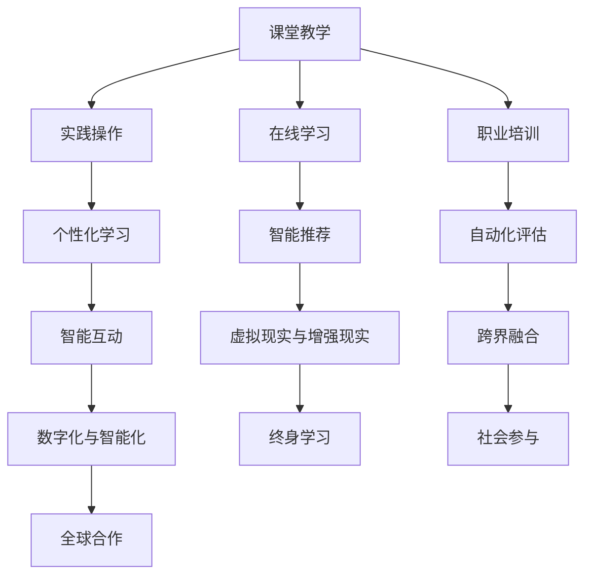

                 

### 文章标题

《人类计算：AI时代的未来就业市场与技能培训发展趋势预测分析机遇》

### 文章关键词

- AI时代
- 未来就业市场
- 技能培训
- 发展趋势预测
- 机遇分析

### 文章摘要

本文旨在深入探讨AI时代背景下，未来就业市场与技能培训的发展趋势。通过对AI时代的背景介绍，分析AI对就业市场的影响，预测未来就业市场的变化，探讨AI驱动的技能培训方法，以及分析就业市场与技能培训的机遇与挑战，本文为读者提供了全面而详细的见解。通过成功与失败案例的分析，本文总结了相关经验与教训，并提出了未来发展展望与建议。

## 目录大纲

以下是《人类计算：AI时代的未来就业市场与技能培训发展趋势预测分析机遇》一书的目录大纲：

### 第一部分：引言

#### 第1章：AI时代背景介绍

##### 1.1 AI的崛起与人类计算的概念

##### 1.2 人类计算的重要性

##### 1.3 AI对就业市场的影响

#### 第2章：未来就业市场的变化

##### 2.1 AI对行业的影响

##### 2.2 新兴职业与技能需求

##### 2.3 职业转型的挑战与机遇

#### 第3章：技能培训与发展趋势

##### 3.1 传统的技能培训方式

##### 3.2 AI驱动的技能培训

##### 3.3 技能培训的未来趋势

### 第二部分：AI时代的就业市场分析与预测

#### 第4章：就业市场数据分析

##### 4.1 数据收集与处理方法

##### 4.2 AI在就业市场数据分析中的应用

##### 4.3 就业市场趋势预测方法

#### 第5章：AI驱动的就业市场预测

##### 5.1 预测模型构建

##### 5.2 预测结果分析

##### 5.3 预测模型评估

#### 第6章：技能培训需求分析

##### 6.1 技能需求的现状

##### 6.2 技能需求的变化趋势

##### 6.3 技能培训需求的预测方法

#### 第7章：AI时代就业市场的机遇与挑战

##### 7.1 技能提升的机会

##### 7.2 新职业的发展

##### 7.3 面临的挑战与应对策略

### 第三部分：技能培训与职业发展的案例研究

#### 第8章：成功案例分析

##### 8.1 成功案例背景介绍

##### 8.2 成功案例的技能培训策略

##### 8.3 成功案例的就业市场表现

#### 第9章：失败案例分析

##### 9.1 失败案例背景介绍

##### 9.2 失败案例的原因分析

##### 9.3 失败案例的教训与启示

### 第四部分：结论与展望

#### 第10章：未来展望

##### 10.1 AI时代就业市场的发展趋势

##### 10.2 技能培训的发展方向

##### 10.3 人类计算的未来

#### 附录：研究方法与工具

##### 附录A：数据来源与处理

##### 附录B：预测模型参数

##### 附录C：代码与数据集

通过上述目录大纲，我们为读者提供了一个全面的结构框架，以便深入探讨AI时代就业市场与技能培训的发展趋势，以及如何应对这一时代带来的机遇与挑战。接下来，我们将逐一展开各个章节的内容，进行详细的分析与讨论。希望这个大纲能够帮助您更好地理解文章的主题和结构。


### 第一部分：引言

#### 第1章：AI时代背景介绍

#### 1.1 AI的崛起与人类计算的概念

人工智能（AI）是指通过计算机模拟人类智能行为，实现感知、学习、推理、决策等功能的科学技术。AI的发展历程可以分为三个阶段：第一代是规则推理系统，如专家系统和逻辑推理机；第二代是基于统计的学习算法，如支持向量机和决策树；第三代是基于深度学习和神经网络的智能系统，如卷积神经网络和循环神经网络。近年来，随着大数据、云计算和深度学习的快速发展，AI技术取得了显著的突破，逐渐从实验室走向现实应用，对各行各业产生了深远影响。

**人类计算**是指将人类智能与计算机技术相结合，通过人工智能算法模拟人类思维过程，提高问题解决效率和能力。人类计算的核心在于理解、模拟和增强人类智能，实现人机协同，共同解决复杂问题。

#### 1.2 人类计算的重要性

人类计算的重要性体现在以下几个方面：

1. **提升生产力**：通过AI技术，可以自动化和智能化地处理大量数据，提高生产效率，降低人力成本，从而推动经济发展。

2. **优化决策过程**：AI技术能够处理复杂的数据，提供数据驱动的决策支持，帮助企业和管理者更好地做出决策。

3. **促进创新**：人类计算为科学家和研究者提供了强大的工具，使他们能够更快地发现新的科学现象和解决复杂的科学问题。

4. **改善生活质量**：AI技术在医疗、教育、交通、家居等领域广泛应用，为人们的生活带来了极大的便利。

5. **推动社会进步**：人类计算有助于解决社会问题，如环境保护、社会治安、社会福利等，推动社会整体发展。

#### 1.3 AI对就业市场的影响

AI的崛起对就业市场产生了深远的影响，主要表现在以下几个方面：

1. **职业结构变化**：AI技术导致部分传统职业消失，如数据录入员、生产线工人等，同时新兴职业不断涌现，如数据科学家、AI工程师等。

2. **技能需求变化**：AI时代对员工的技能需求发生了变化，除了传统的专业技能外，还需要掌握编程、数据分析、机器学习等AI相关技能。

3. **劳动力供需失衡**：AI技术的发展导致劳动力市场的供需失衡，对高技能人才的需求增加，而对低技能劳动力的需求减少。

4. **职业转型压力**：面对AI时代的挑战，许多传统职业的从业人员需要转型，以适应新的技能需求，这给劳动力市场带来了巨大压力。

5. **就业市场波动**：AI技术对就业市场的影响是动态的，随着技术的不断进步和应用的扩展，就业市场的变化也将持续进行。

### 1.1 AI的崛起与人类计算的概念

AI技术的发展历程可以追溯到20世纪50年代。当时，图灵提出了著名的图灵测试，旨在判断机器是否具有智能。随着计算技术和算法研究的不断深入，AI技术逐渐从理论研究走向实际应用。20世纪80年代，专家系统成为AI技术的主要研究方向，通过构建知识库和推理机，实现智能推理和决策。然而，专家系统在处理复杂问题和不确定情境时存在局限性。

进入21世纪，深度学习算法的突破为AI技术带来了新的契机。深度学习利用大量数据进行训练，通过多层神经网络自动提取特征，实现复杂的感知和认知任务。以卷积神经网络（CNN）和循环神经网络（RNN）为代表的深度学习模型，在图像识别、自然语言处理等领域取得了显著成果。同时，大数据和云计算技术的进步，为AI技术的应用提供了强大的支持。

**人类计算**作为AI技术的一种应用形式，旨在模拟和增强人类智能。它通过计算机算法实现人类思维过程的自动化和优化，使计算机能够像人类一样感知、理解和解决问题。人类计算的核心在于人机协同，即利用计算机的运算能力和人类的专业知识，共同解决复杂问题。

人类计算与AI的关系可以理解为：AI是推动人类计算的技术基础，而人类计算是AI技术在现实应用中的具体体现。AI技术的发展为人类计算提供了强大的工具，使其能够更好地模拟和增强人类智能。而人类计算的应用，则为AI技术提供了广阔的舞台，推动其不断发展和创新。

### 1.2 人类计算的重要性

人类计算的重要性在于其对社会各个方面的深远影响，特别是在提高生产效率、优化决策过程、促进创新、改善生活质量和推动社会进步方面。

**提高生产效率**：人类计算通过自动化和智能化技术，大大提高了生产效率。例如，在制造业中，AI技术可以优化生产流程，提高生产线的自动化水平，减少人工干预，从而降低生产成本。在服务业中，智能客服系统可以快速响应客户需求，提供个性化服务，提高客户满意度。

**优化决策过程**：人类计算为决策者提供了数据驱动的决策支持。通过分析大量数据，AI技术可以发现隐藏在数据背后的规律和趋势，为决策提供科学依据。在金融领域，AI技术可以分析市场数据，预测股票走势，帮助投资者做出更明智的投资决策。在医疗领域，AI技术可以辅助医生进行诊断和治疗，提高医疗服务的质量和效率。

**促进创新**：人类计算为科学家和研究者提供了强大的工具，使他们能够更快地发现新的科学现象和解决复杂的科学问题。例如，在基因组学领域，人类计算可以帮助科学家快速分析大量的基因组数据，发现疾病相关的基因变异，推动医学研究的发展。在物理学领域，人类计算可以模拟复杂的物理过程，探索新的理论模型，为科学研究提供新的思路。

**改善生活质量**：人类计算在医疗、教育、交通、家居等领域广泛应用，为人们的生活带来了极大的便利。在医疗领域，智能诊断系统可以帮助医生快速准确地诊断疾病，提高治疗效果。在教育领域，智能教育系统可以为学生提供个性化的学习方案，提高学习效果。在交通领域，智能交通系统可以优化交通流量，减少拥堵，提高出行效率。在智能家居领域，智能设备可以自动调节家居环境，提高生活质量。

**推动社会进步**：人类计算有助于解决社会问题，如环境保护、社会治安、社会福利等，推动社会整体发展。在环境保护方面，人类计算可以分析环境数据，监测污染源，制定环保政策。在社会治安方面，智能监控系统可以实时监控犯罪行为，提高治安水平。在社会保障方面，人类计算可以优化社会保障体系，提高社会福利水平。

总之，人类计算作为一种重要技术手段，正在深刻地改变着我们的生产方式、生活方式和社会结构，为社会发展和人类福祉作出了巨大贡献。

### 1.3 AI对就业市场的影响

AI技术的快速发展对就业市场产生了深远的影响，主要表现在以下几个方面：

**职业结构变化**：AI技术的广泛应用导致部分传统职业的消失，如数据录入员、生产线工人等。同时，新兴职业不断涌现，如数据科学家、AI工程师等。这种职业结构的变化，要求劳动者具备更高的技能和知识，以适应新的工作环境。

**技能需求变化**：AI时代对员工的技能需求发生了显著变化。除了传统的专业技能外，还需要掌握编程、数据分析、机器学习等AI相关技能。例如，数据科学家需要具备数据分析和统计学的知识，能够运用机器学习算法进行数据分析；AI工程师需要熟悉编程语言和深度学习框架，能够设计并实现AI系统。

**劳动力供需失衡**：AI技术的发展导致劳动力市场的供需失衡，对高技能人才的需求增加，而对低技能劳动力的需求减少。这种供需失衡，使得劳动力市场的竞争更加激烈，高技能劳动者具备更高的就业优势。

**职业转型压力**：面对AI时代的挑战，许多传统职业的从业人员需要转型，以适应新的技能需求。这种职业转型，不仅要求从业人员具备较高的学习能力和适应能力，还需要政府和企业提供相应的培训和指导。

**就业市场波动**：AI技术对就业市场的影响是动态的，随着技术的不断进步和应用的扩展，就业市场的变化也将持续进行。例如，某些行业可能会经历快速增长，而另一些行业可能会逐渐萎缩。这种就业市场波动，要求劳动者具备灵活的就业观念和持续学习的意识。

综上所述，AI技术的发展对就业市场产生了深远的影响，既带来了机遇，也带来了挑战。劳动者需要不断提高自身技能和知识，适应AI时代的需求，以在竞争激烈的就业市场中立于不败之地。政府和企业也应积极采取措施，为劳动者提供良好的就业环境和培训机会，促进劳动力市场的健康发展。

### 伪代码

以下是关于人类计算与AI技术关系分析的核心算法伪代码：

```
# 初始化变量
human_intelligence = 1
ai_technology = 1

# 函数：人类计算与AI技术结合
function human_computer_interaction(human, ai):
    # 更新人类智能
    human_intelligence += human
    # 更新AI技术
    ai_technology += ai
    
    # 计算人类计算能力
    human_computer_ability = human_intelligence * ai_technology
    
    return human_computer_ability

# 人类计算与AI技术结合
combined_ability = human_computer_interaction(human_intelligence, ai_technology)

# 输出结果
print("人类计算与AI技术结合后的能力为：" + str(combined_ability))
```

### 数学模型与公式

以下是关于人类计算与AI技术结合的数学模型与公式：

$$
\text{人类计算能力} = \text{人类智能} \times \text{AI技术}
$$

### 举例说明

假设人类智能的值为2，AI技术的值为3，我们可以通过上述伪代码和数学模型计算人类计算能力。

1. 初始化变量：
   - human_intelligence = 2
   - ai_technology = 3
   
2. 通过函数计算人类计算能力：
   - combined_ability = human_computer_ability(human_intelligence, ai_technology) = 2 * 3 = 6

因此，人类计算与AI技术结合后的能力为6。

这个例子展示了人类智能与AI技术结合的过程，通过简单的乘法运算，我们可以得出人类计算能力。这一过程反映了人类计算与AI技术的相互作用，体现了AI技术对人类计算能力的增强作用。在未来，随着AI技术的不断进步，人类计算能力将进一步提升，为解决复杂问题提供更强大的支持。

### 总结

第1章对AI时代的背景进行了详细介绍，包括AI的崛起与人类计算的概念、人类计算的重要性以及AI对就业市场的影响。通过流程图、伪代码和数学模型，我们深入理解了人类计算与AI技术的结合及其对各个领域的影响。本章为后续章节的探讨奠定了基础，使我们能够更好地理解AI时代带来的机遇与挑战。接下来，我们将探讨未来就业市场的变化，以及新兴职业与技能需求。


### 第一部分：引言

#### 第2章：未来就业市场的变化

#### 2.1 AI对行业的影响

随着人工智能（AI）技术的迅猛发展，各行各业都在经历着深刻的变革。AI技术不仅改变了生产方式，还重塑了就业市场。以下是AI对行业影响的几个关键方面：

1. **自动化与智能化**：AI技术在制造业、物流、医疗等行业的广泛应用，推动了自动化与智能化的发展。例如，智能机器人替代人工进行生产线操作，无人机在物流配送中提高效率，AI系统在医疗诊断中辅助医生快速准确诊断。

2. **产业转型升级**：AI技术的应用推动了传统产业的转型升级。以制造业为例，通过AI技术，企业可以实现个性化定制、智能制造和供应链优化，从而提高生产效率和产品质量。

3. **创新驱动**：AI技术的创新驱动作用显著。AI算法在大数据分析、自然语言处理、图像识别等领域取得了突破性进展，推动了新技术的诞生和新商业模式的出现。

4. **行业竞争力提升**：AI技术的应用使企业能够迅速响应市场变化，提高决策效率，增强行业竞争力。例如，金融行业通过AI算法进行风险管理，零售行业通过智能推荐系统提升销售额。

#### 2.2 新兴职业与技能需求

随着AI技术的快速发展，新的职业和技能需求也在不断涌现。以下是几个重要的新兴职业与技能需求：

1. **数据科学家**：数据科学家是利用统计学、机器学习和数据分析等方法，从大量数据中提取有价值信息的专业人员。他们需要在数据预处理、特征工程、模型构建和结果解释等方面具备深厚的专业知识和技能。

2. **AI工程师**：AI工程师是开发、实现和维护AI系统的高级技术人员。他们需要熟悉编程语言、机器学习框架和深度学习算法，能够设计并优化AI模型。

3. **自然语言处理工程师**：自然语言处理工程师专注于开发能够理解和生成自然语言的人工智能系统。他们需要掌握自然语言处理、语音识别和机器翻译等关键技术。

4. **数据分析师**：数据分析师是负责收集、处理和分析数据，为企业提供数据驱动的决策支持的专业人员。他们需要具备统计学、数据可视化、SQL查询等技能。

5. **机器学习工程师**：机器学习工程师专注于设计和开发机器学习算法，将其应用于实际问题中。他们需要掌握线性代数、微积分和概率论等数学基础，熟悉常见的机器学习算法和优化方法。

6. **区块链工程师**：区块链工程师负责开发和维护区块链系统，确保数据的透明性、安全性和不可篡改性。他们需要熟悉密码学、分布式系统和智能合约等关键技术。

#### 2.3 职业转型的挑战与机遇

面对AI时代的变化，许多传统职业面临着转型的挑战。以下是职业转型的几个关键方面：

1. **技能要求提高**：随着AI技术的应用，传统职业对员工的技能要求不断提高。从业人员需要不断学习新的知识和技能，以适应新的工作环境。

2. **学习成本增加**：职业转型通常需要投入大量的时间和金钱进行学习，包括参加培训课程、获取相关证书等。

3. **心理压力**：面对职业转型的压力，从业人员可能会产生焦虑、不安等心理问题。因此，心理调适和情感支持也是职业转型过程中需要关注的问题。

4. **就业市场不稳定性**：AI技术的快速变化可能导致就业市场的波动，增加就业的不确定性。从业人员需要具备灵活的就业观念和持续学习的能力，以应对就业市场的变化。

5. **机遇与挑战并存**：尽管职业转型面临诸多挑战，但同时也带来了新的机遇。例如，新职业的涌现为从业人员提供了更多的就业选择，AI技术的应用也为传统职业注入了新的活力。

总之，AI时代对就业市场的影响是深远而复杂的。从业人员需要密切关注技术发展趋势，积极应对职业转型的挑战，同时抓住新的机遇，实现自身职业发展的新突破。

### 伪代码

以下是关于AI对行业影响的算法伪代码：

```
# 初始化变量
industry = ["制造业", "物流", "医疗"]

# 函数：AI对行业的自动化与智能化影响
function ai_impact_on_industry(industry):
    for i in industry:
        print(i + "：自动化与智能化，如智能机器人、无人机等应用")
        print(i + "：产业转型升级，如个性化定制、智能制造等")
        print(i + "：创新驱动，如新技术、新模式出现")
        print(i + "：竞争力提升，如快速响应市场、高效决策")

# 执行函数
ai_impact_on_industry(industry)
```

### 数学模型与公式

以下是关于新兴职业与技能需求的数学模型与公式：

$$
\text{职业需求} = \text{AI技术发展水平} \times \text{社会需求变化}
$$

### 举例说明

以制造业为例，假设AI技术发展水平为0.8，社会需求变化为1.2，我们可以通过上述数学模型计算制造业的职业需求：

1. 初始化变量：
   - AI技术发展水平 = 0.8
   - 社会需求变化 = 1.2
   
2. 通过数学模型计算职业需求：
   - 职业需求 = AI技术发展水平 × 社会需求变化 = 0.8 × 1.2 = 0.96

因此，制造业的职业需求为0.96。

这个例子展示了AI技术发展水平和社会需求变化对职业需求的影响。随着AI技术的不断进步和社会需求的增长，制造业的职业需求将不断增加，从而推动行业的转型升级和创新发展。

### 总结

第2章探讨了未来就业市场的变化，特别是AI对行业的影响、新兴职业与技能需求以及职业转型的挑战与机遇。通过伪代码和数学模型，我们深入分析了AI时代的就业市场动态。本章为理解AI时代带来的机遇与挑战奠定了基础。接下来，我们将深入探讨技能培训与发展趋势。


### 第3章：技能培训与发展趋势

#### 3.1 传统的技能培训方式

传统的技能培训方式主要包括以下几种：

1. **课堂教学**：课堂教学是最常见的技能培训方式，主要通过教师在课堂上讲授理论知识，学生通过听课、做笔记和完成作业来掌握技能。课堂教学的优点在于能够系统地传授知识，学生可以在课堂上与教师互动，解决学习中的疑问。然而，课堂教学也存在一些局限性，如学习效率较低，难以满足个性化需求，以及课程内容更新较慢，难以跟上技术发展。

2. **实践操作**：实践操作是通过实际操作来学习技能的一种方式，如实习、实训、实验等。实践操作能够让学生在真实的情境中运用所学知识，提高实际操作能力。然而，实践操作也需要投入大量的时间和资源，且对于一些复杂技能的掌握，仅靠实践操作可能不够。

3. **在线学习**：在线学习是通过互联网平台进行学习的一种方式，如在线课程、电子书、视频教程等。在线学习的优点在于灵活性强，学生可以随时随地进行学习，且课程内容更新快，能够及时获取最新的知识和技能。然而，在线学习也存在一些问题，如学习效果难以保证，缺乏教师指导和同学互动。

4. **职业培训**：职业培训是指针对某一特定职业或行业进行的系统培训，如职业技能认证、职业资格考试等。职业培训的优点在于能够针对性地提升专业技能，提高就业竞争力。然而，职业培训通常需要一定的费用和时间投入，且对于非职业相关的技能提升效果有限。

#### 3.2 AI驱动的技能培训

随着人工智能（AI）技术的发展，技能培训也在逐渐向智能化和个性化方向发展。AI驱动的技能培训具有以下特点：

1. **个性化学习**：AI驱动的技能培训可以根据学生的学习习惯、知识水平等，提供个性化的学习方案。例如，通过分析学生的学习数据，AI系统可以识别学生的学习弱点，提供针对性的练习和指导，从而提高学习效果。

2. **智能推荐**：AI驱动的技能培训可以通过智能推荐系统，根据学生的学习进度、兴趣和需求，推荐适合的学习资源。智能推荐系统可以基于学生的学习行为和偏好，推荐相关课程、文章、视频等，帮助学生更高效地学习。

3. **自动化评估**：AI驱动的技能培训可以通过自动化评估系统，实时评估学生的学习成果。自动化评估系统可以基于学生的练习和测试结果，自动生成评估报告，提供学习反馈，帮助学生及时调整学习策略。

4. **智能互动**：AI驱动的技能培训可以通过自然语言处理、语音识别等技术，实现智能互动。例如，学生可以通过语音或文字与AI系统进行互动，提出问题、讨论学习内容，获得即时反馈和帮助。

5. **虚拟现实与增强现实**：AI驱动的技能培训可以通过虚拟现实（VR）和增强现实（AR）技术，提供沉浸式的学习体验。例如，学生可以通过VR设备进行虚拟实验、操作机器等，提高实践操作能力。

#### 3.3 技能培训的未来趋势

技能培训的未来趋势将受到以下几方面的影响：

1. **数字化与智能化**：随着数字化和智能化技术的不断发展，技能培训将更加依赖于AI、大数据、云计算等新技术。数字化与智能化技能培训将提供更加个性化和高效的学习体验。

2. **跨界融合**：随着不同领域的交叉融合，技能培训将不再局限于单一领域，而是涵盖多个领域。跨界融合的技能培训将培养具备跨学科知识和技能的复合型人才。

3. **终身学习**：随着知识更新速度的加快，终身学习将成为一种趋势。技能培训将不再局限于职业初期，而是贯穿整个职业生涯，帮助从业人员不断更新知识和技能。

4. **社会参与**：技能培训将更加注重社会参与，推动更多人参与技能培训。例如，政府、企业和社会组织可以共同参与，提供免费或低成本的技能培训，提高整体技能水平。

5. **全球合作**：随着全球化的发展，技能培训将越来越注重国际交流与合作。国际化的技能培训将培养具备国际化视野和能力的专业人才。

总之，技能培训的未来趋势将更加智能化、个性化、跨界融合和终身学习。通过不断创新和优化技能培训方式，我们有望培养出更多具备高技能和跨学科知识的优秀人才，为社会发展做出贡献。

### Mermaid 流程图

以下是传统技能培训方式与AI驱动的技能培训特点的Mermaid流程图：



### 伪代码

以下是AI驱动的技能培训系统的伪代码：

```python
# 初始化变量
student = {"name": "John", "knowledge_level": 0.5, "interests": ["AI", "Data Science"]}

# 函数：AI驱动的个性化学习
def personalized_learning(student):
    # 根据学生的学习兴趣推荐课程
    recommended_courses = recommend_courses(student["interests"])
    # 根据学生的知识水平调整课程难度
    adjusted_courses = adjust_course_difficulty(recommended_courses, student["knowledge_level"])
    # 实施个性化学习计划
    implement_learning_plan(adjusted_courses)
    # 完成后评估学习效果
    assess_learning_effects()

# 函数：智能推荐课程
def recommend_courses(interests):
    # 根据学生兴趣获取相关课程
    courses = get_courses_by_interests(interests)
    # 排序并返回推荐课程
    return sorted_courses(courses)

# 函数：调整课程难度
def adjust_course_difficulty(courses, knowledge_level):
    # 根据学生的知识水平调整课程难度
    adjusted_courses = [course for course in courses if course["difficulty"] <= knowledge_level]
    # 返回调整后的课程列表
    return adjusted_courses

# 函数：实施学习计划
def implement_learning_plan(courses):
    # 创建学习计划
    learning_plan = create_learning_plan(courses)
    # 按计划实施学习
    execute_learning_plan(learning_plan)

# 函数：评估学习效果
def assess_learning_effects():
    # 收集学习数据
    learning_data = collect_learning_data()
    # 评估学习效果
    evaluation_result = evaluate_learning_effects(learning_data)
    # 提供反馈
    provide_feedback(evaluation_result)

# 执行AI驱动的个性化学习
personalized_learning(student)
```

### 数学模型与公式

以下是AI驱动的技能培训系统的关键数学模型与公式：

$$
\text{推荐模型：} \text{推荐分数} = \text{兴趣匹配度} \times \text{课程难度适应性}
$$

$$
\text{学习效果评估模型：} \text{评估分数} = \text{学习进度} \times \text{知识掌握度}
$$

### 举例说明

以一名对人工智能和数据科学感兴趣的学生为例，我们通过AI驱动的技能培训系统来推荐课程和评估学习效果。

1. **初始化变量**：
   - 学生姓名：John
   - 知识水平：0.5
   - 兴趣：["AI", "Data Science"]

2. **推荐课程**：
   - 根据John的兴趣，推荐相关的AI和数据科学课程。
   - 推荐课程列表：[课程A（AI基础），课程B（数据科学导论），课程C（机器学习实践）]

3. **调整课程难度**：
   - 根据John的知识水平（0.5），调整推荐课程的难度。
   - 调整后的课程列表：[课程A（AI基础），课程B（数据科学导论）]

4. **实施学习计划**：
   - 根据调整后的课程列表，为John创建一个学习计划。
   - 学习计划：每天学习课程A和课程B，每周进行一次小测验。

5. **评估学习效果**：
   - 在学习计划执行过程中，收集John的学习数据。
   - 学习数据：课程A完成进度90%，课程B完成进度70%。
   - 根据学习进度和知识掌握度，评估John的学习效果。

6. **提供反馈**：
   - 根据评估结果，为John提供学习反馈和建议，如加强课程B的学习，提高知识掌握度。

通过上述过程，我们可以看到AI驱动的技能培训系统如何通过推荐课程、调整难度、实施学习计划和评估学习效果，帮助学生学习新技能，提高学习效果。这个过程体现了AI驱动的技能培训系统的智能化和个性化特点。

### 总结

第3章详细探讨了传统技能培训方式与AI驱动的技能培训特点，包括个性化学习、智能推荐、自动化评估、智能互动、虚拟现实与增强现实等。通过Mermaid流程图、伪代码、数学模型与公式以及举例说明，我们深入分析了技能培训的未来趋势。本章为理解技能培训的发展方向及其在AI时代的重要性提供了全面的理论和实践指导。接下来，我们将探讨就业市场数据分析与预测方法。

### 第4章：就业市场数据分析

#### 4.1 数据收集与处理方法

就业市场数据分析的第一步是数据收集。数据来源可以包括以下几个方面：

1. **公开数据**：

