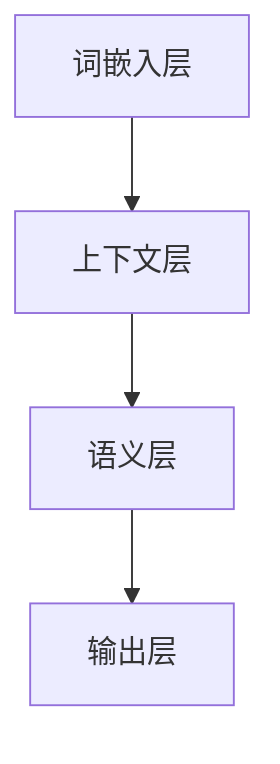
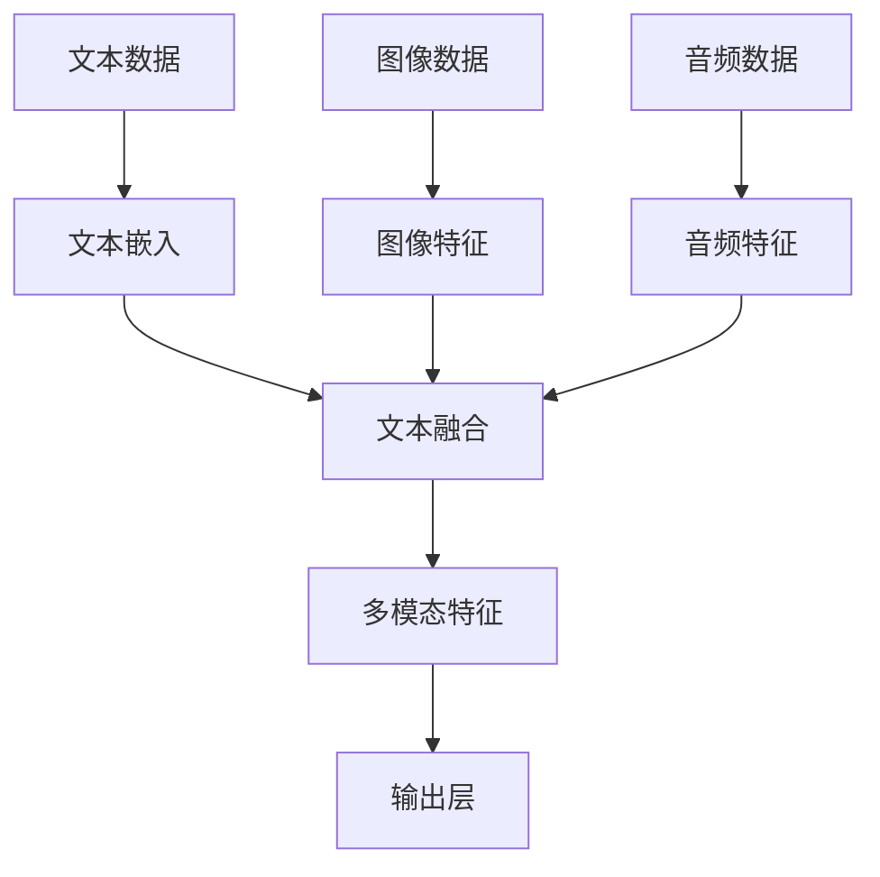

                 

### 《从功能到颠覆，大模型创业者展望AI未来》

#### 核心关键词：
- 大模型
- AI创业
- 技术原理
- 架构设计
- 实践案例
- 未来展望

#### 摘要：
本文将深入探讨大模型在AI领域的重要性，分析其技术原理和架构设计，并探讨大模型在创业中的实践与应用。通过案例解析，文章将揭示大模型创业者的成长路径和未来展望，为AI创业提供深刻的见解和实用的指导。

---

### 目录大纲

- **第一部分：大模型概述与背景**
  - **1.1 大模型的崛起：从功能到颠覆**
  - **1.2 AI革命：大模型的角色与价值**
- **第二部分：大模型的核心原理与架构**
  - **3. 大模型核心技术**
  - **4. 大模型的架构设计**
- **第三部分：大模型在创业中的实践与应用**
  - **5. 大模型创业：从0到1**
  - **6. 大模型创业案例解析**
  - **7. 大模型创业的风险与挑战**
- **第四部分：大模型创业者的成长与展望**
  - **8. 大模型创业者的成长路径**
  - **9. 大模型创业的未来展望**
- **附录**
  - **附录 A：大模型相关资源与工具**

---

### 导言

人工智能（AI）正在经历一场革命，而大模型则是这场革命的核心驱动力。从早期的简单规则应用到现代的复杂算法，AI已经从一个功能性的工具逐渐演变为具有变革性的技术力量。大模型，作为AI技术的最新成果，不仅在技术层面产生了深远影响，也在创业领域掀起了巨大的波澜。

本文旨在探讨大模型在AI领域的崛起，分析其核心原理和架构设计，并通过创业案例展示其在实际应用中的价值。我们还将探讨大模型创业所面临的挑战和风险，以及创业者的成长路径和未来展望。

本文将按以下结构展开：

1. **大模型概述与背景**：介绍大模型的概念、发展历程及其在不同行业的影响。
2. **大模型的核心原理与架构**：深入探讨大模型的核心技术，包括深度学习、预训练与微调，以及大模型的架构设计。
3. **大模型在创业中的实践与应用**：分析大模型创业的关键步骤、成功案例以及创业者面临的风险与挑战。
4. **大模型创业者的成长与展望**：探讨创业者的成长路径、持续学习的重要性以及大模型创业的未来趋势。

通过本文的阅读，读者将全面了解大模型的技术原理和创业实践，为进入AI创业领域提供有益的指导。接下来，我们将从大模型的崛起开始，逐步深入分析这一领域的关键概念和技术。

---

### 第一部分：大模型概述与背景

#### 1.1 大模型的崛起：从功能到颠覆

大模型，作为人工智能（AI）的核心组成部分，正在逐步改变我们所生活的世界。要理解大模型的崛起，首先需要回顾AI的发展历程。从早期的专家系统到现代的深度学习，AI经历了从功能导向到变革性的巨大转变。

在AI的早期，研究者们致力于开发能够模拟人类专家决策能力的系统。这些系统依赖于明确的规则和逻辑推理，被称为“弱AI”或“窄AI”。尽管这些系统在某些特定领域表现出色，但它们缺乏泛化能力，无法应用于更广泛的场景。随着计算机性能的提升和海量数据的积累，AI开始从弱AI向强AI转变。

强AI，也被称作“通用人工智能”（AGI），是指具有人类智能水平的AI系统。然而，实现强AI仍是一个长期的目标，当前的AI技术主要以“狭义AI”或“弱AI”为主，即专注于特定任务的AI系统。大模型就是在这种背景下崛起的。

大模型的定义可以理解为一种能够处理大量数据、具有高度复杂性的机器学习模型。这些模型通过深度学习等技术，能够自动从数据中学习特征和模式，并在多种任务上实现高性能。大模型通常具有数亿甚至数万亿个参数，远远超过传统机器学习模型的规模。

大模型的崛起可以追溯到2012年的一个重要突破：AlexNet，一个用于图像分类的深度卷积神经网络（CNN）。AlexNet在ImageNet图像识别比赛中取得了前所未有的准确率，激发了人们对深度学习的浓厚兴趣。随后，谷歌发布了基于深度神经网络的TensorFlow，Facebook推出了PyTorch，这些开源框架的兴起极大地推动了深度学习的研究和应用。

大模型在技术上的突破不仅体现在模型规模和参数数量的增加，还包括了训练算法的改进和多模态数据的处理能力。例如，自注意力机制（Self-Attention）的引入使得模型能够更好地处理序列数据，从而在自然语言处理（NLP）领域取得了显著进展。此外，预训练与微调技术的结合，使得模型能够从大规模预训练数据中提取通用特征，并在特定任务中进行微调，从而实现高效的模型训练。

大模型的崛起不仅改变了AI的技术轨迹，也在各个行业引发了深远的变革。从图像识别到自然语言处理，从医疗诊断到自动驾驶，大模型的应用几乎无处不在。大模型的出现使得AI从简单的规则应用走向了复杂场景的深度学习，从功能性的工具走向了变革性的技术力量。

#### 1.2 AI革命：大模型的角色与价值

大模型在AI革命中的角色不可忽视。首先，大模型是推动AI技术发展的重要引擎。大模型的规模和复杂性使得它们能够处理更大量的数据，挖掘更深层次的特征，从而实现更高的准确率和更广的适用范围。这不仅提升了AI系统的性能，也推动了AI技术的进步。

其次，大模型在各个行业中的应用价值显著。在医疗领域，大模型可以通过分析海量医疗数据，帮助医生进行疾病诊断和治疗方案的制定，提高医疗服务的质量和效率。在金融领域，大模型可以用于风险评估、欺诈检测和智能投顾，为金融机构提供更加精准和高效的服务。在制造业，大模型可以用于质量检测、生产优化和供应链管理，提高生产效率和降低成本。

此外，大模型在社交媒体、智能家居、智能客服等领域的应用也日益广泛。通过分析用户数据，大模型可以提供个性化的推荐和服务，提升用户体验。在自动驾驶领域，大模型可以用于环境感知、路径规划和决策控制，为自动驾驶技术的发展提供关键支持。

然而，大模型的价值不仅限于技术层面，还体现在商业和社会层面。在商业领域，大模型可以帮助企业进行市场分析、客户洞察和业务优化，从而提高竞争力。大模型的应用还可以带来新的商业模式和商业机会，例如AI驱动的智能客服、智能营销等。

在社会层面，大模型的应用有助于解决一些复杂的社会问题。例如，通过大模型对自然灾害、疫情传播等数据的分析，可以提供更准确的预警和应对策略，保护公众的安全和健康。大模型还可以用于教育领域，通过个性化教学和智能辅导，提升教育质量和学习效果。

总的来说，大模型在AI革命中扮演了至关重要的角色。它不仅是AI技术发展的核心驱动力，也是各个行业和社会进步的重要力量。随着大模型技术的不断进步和应用场景的拓展，大模型的价值将更加凸显，为人类社会带来更多的变革和创新。

### 1.3 大模型的定义与特点

大模型，作为一种特殊的机器学习模型，具有独特的定义和特点。首先，大模型的核心特征在于其庞大的参数规模。这些模型通常包含数亿到数万亿个参数，远远超过传统机器学习模型的规模。例如，谷歌的BERT模型包含超过3亿个参数，而OpenAI的GPT-3模型更是达到了惊人的1750亿个参数。

其次，大模型的复杂结构是其另一个显著特点。大模型通常采用深度神经网络（DNN）作为基础架构，并通过堆叠多个隐藏层来实现复杂的特征提取和模式识别。这些隐藏层可以捕获数据中的深层次特征，从而提高模型的泛化能力和性能。

第三，大模型的训练和推理过程需要大量的计算资源。由于模型参数众多，训练过程中需要处理大量数据，并进行多次迭代。这通常需要使用高性能计算硬件，如GPU和TPU，以及分布式计算技术，以保证训练过程的效率和速度。

第四，大模型具有高度的灵活性和适应性。通过预训练和微调技术，大模型可以在多个任务上实现高性能，从而避免重复训练的繁琐过程。预训练阶段，模型在大规模数据集上学习通用特征，然后在特定任务中进行微调，以达到更好的性能。

第五，大模型在多模态数据处理方面表现出色。通过结合文本、图像、音频等多种数据类型，大模型可以实现更全面的信息理解和处理。例如，BERT模型可以同时处理文本和图像，从而在多种任务上实现高性能。

总的来说，大模型通过其庞大的参数规模、复杂的结构、高效的训练和推理过程以及多模态数据处理能力，成为AI领域的核心驱动力，推动着技术的不断进步和应用场景的拓展。

#### 1.4 大模型在不同行业的影响

大模型在不同行业的应用已经带来了深刻的变革和巨大的影响。以下是几个主要行业的大模型应用及其影响的概述：

**医疗领域**：大模型在医疗领域的应用包括疾病诊断、个性化治疗和健康监测。通过分析海量的医疗数据，大模型可以帮助医生进行更准确的疾病诊断，提供个性化的治疗方案。例如，IBM的Watson for Oncology系统能够通过分析患者的病历、基因信息和最新的医学研究，为医生提供辅助诊断和治疗建议。此外，大模型还可以用于健康监测，通过分析日常健康数据，预测疾病风险并给出健康建议，从而提高公众的健康水平。

**金融领域**：大模型在金融领域的应用广泛，包括风险评估、欺诈检测和智能投顾。通过分析历史交易数据、客户行为和市场动态，大模型可以识别潜在的风险并给出投资建议，帮助金融机构做出更明智的决策。例如，摩根大通（JPMorgan）使用大模型进行信用评分和欺诈检测，提高了金融服务的安全性和效率。此外，大模型还可以用于智能投顾，通过分析客户的风险偏好和财务目标，提供个性化的投资组合建议，从而提高客户的投资回报率。

**制造业**：大模型在制造业中的应用包括质量控制、生产优化和供应链管理。通过分析生产数据、设备状态和供应链信息，大模型可以帮助企业提高生产效率、降低成本和减少故障。例如，西门子（Siemens）使用大模型对生产线进行实时监控和故障预测，从而提高生产线的可靠性和效率。此外，大模型还可以用于优化供应链管理，通过预测市场需求和供应链动态，优化库存管理和物流计划，从而提高供应链的灵活性和响应速度。

**零售业**：大模型在零售业中的应用包括推荐系统、客户关系管理和库存管理。通过分析客户购买历史、浏览行为和社交媒体数据，大模型可以提供个性化的产品推荐，提高客户的购买转化率和满意度。例如，亚马逊（Amazon）使用大模型构建其推荐系统，为用户推荐相关产品，从而提高销售额。此外，大模型还可以用于客户关系管理，通过分析客户互动数据和反馈信息，提供更优质的客户服务和体验。在库存管理方面，大模型可以通过预测市场需求和库存水平，优化库存策略，减少库存积压和缺货情况。

**交通领域**：大模型在交通领域的应用包括自动驾驶、交通流量优化和智能交通管理。通过分析交通数据、地图信息和车辆状态，大模型可以实现自动驾驶汽车的安全运行和高效交通管理。例如，特斯拉（Tesla）的自动驾驶系统使用大模型进行环境感知和路径规划，从而提高驾驶的安全性和舒适性。此外，大模型还可以用于优化交通流量，通过分析实时交通数据，提供最优的出行路线和交通信号控制策略，从而减少拥堵和提高交通效率。

总的来说，大模型在不同行业的应用不仅提高了各行业的生产效率和服务质量，也带来了新的商业模式和创新机会。随着大模型技术的不断进步和应用场景的拓展，大模型将在更多行业中发挥重要作用，推动社会的持续发展和进步。

### 2. AI的演变：从弱AI到强AI

人工智能（AI）的发展历程可以分为多个阶段，从早期的弱AI到现今探讨中的强AI，每个阶段都有其独特的技术进步和应用场景。

#### 弱AI（窄AI）

弱AI，也称为窄AI或专用AI，是指专注于特定任务的AI系统。这些系统通过预先定义的规则和算法，在特定领域内表现出色，但缺乏泛化能力。例如，早期的专家系统（Expert Systems）是一种典型的弱AI应用，它们通过模拟人类专家的决策能力，在医学诊断、金融分析和法律咨询等领域发挥作用。

弱AI的主要特点包括：
- **领域特定**：弱AI系统专注于特定任务，如语音识别、图像分类或自然语言处理。
- **规则驱动**：系统通过预定义的规则和逻辑进行推理和决策。
- **缺乏泛化能力**：弱AI系统无法将知识迁移到其他领域或任务。

尽管弱AI在某些特定任务上表现出色，但其应用范围受到限制，难以实现广泛的应用。

#### 强AI（通用人工智能）

强AI，也称为通用人工智能（AGI），是一种具有人类智能水平的AI系统。强AI不仅能够在特定任务上表现出色，还能够自主学习和理解新知识，具备跨领域的智能能力。强AI的目标是实现与人类相似的智能水平，从而在多种复杂任务中发挥作用。

强AI的主要特点包括：
- **通用性**：强AI能够理解和执行各种复杂任务，而不仅仅是特定任务。
- **自学习能力**：强AI可以通过自主学习新知识和经验，不断优化其性能。
- **跨领域智能**：强AI能够跨越不同领域，实现跨领域的知识迁移和应用。

尽管强AI在理论和技术上具有巨大潜力，但目前仍处于研究阶段，尚未实现广泛应用。

#### 大模型在AI演变中的作用

大模型在AI的演变中起到了关键作用。大模型通过深度学习技术和大规模数据的训练，显著提升了AI系统的性能和泛化能力。以下是几个关键因素：

- **大规模数据**：大模型通过利用海量的训练数据，可以学习到更多的特征和模式，从而提高模型的泛化能力。
- **深度神经网络**：大模型采用深度神经网络结构，可以捕获数据中的深层次特征，从而实现更高的性能和准确性。
- **预训练与微调**：大模型通过预训练阶段在大规模数据集上学习通用特征，然后通过微调阶段在特定任务上进行优化，从而实现高效和准确的模型训练。

大模型的崛起不仅推动了AI技术的发展，也使得AI在多个领域实现了突破性应用，从弱AI向强AI迈进了一步。尽管强AI尚未实现，但大模型的应用已经极大地改变了AI的应用场景和商业模式。

### 2.2 大模型在AI生态系统中的地位

大模型在AI生态系统中的地位至关重要，其独特的价值体现在多个方面。首先，大模型作为AI技术的核心组件，承担了从数据到智能的桥梁作用。通过深度学习技术和大规模数据的训练，大模型能够提取和利用数据中的深层次特征，从而实现高准确率和泛化能力。这使得大模型在各个AI应用场景中成为不可或缺的工具。

大模型的价值不仅限于技术层面，还体现在商业和社会层面。在商业领域，大模型的应用带来了显著的商业价值。例如，在金融领域，大模型可以帮助银行和金融机构进行信用评估、风险控制和欺诈检测，从而提高运营效率和客户满意度。在零售领域，大模型可以用于个性化推荐、客户关系管理和供应链优化，提高销售额和客户体验。

在社会领域，大模型的应用同样具有重要意义。在医疗领域，大模型可以通过分析患者的病历和基因数据，辅助医生进行疾病诊断和治疗方案制定，提高医疗服务的质量和效率。在教育领域，大模型可以用于智能辅导、个性化教学和考试评估，提升教育质量和学习效果。

此外，大模型在公共安全、交通管理和环境保护等领域也发挥着重要作用。通过分析大量数据，大模型可以预测和预防自然灾害、优化交通流量和减少环境污染，为社会提供更安全、更高效和更可持续的服务。

总的来说，大模型在AI生态系统中的地位不可替代。它不仅推动了AI技术的发展和应用，也为各个领域带来了深刻的变革和巨大的商业价值。随着大模型技术的不断进步和应用场景的拓展，其地位将更加凸显，成为AI生态系统的核心驱动力。

### 2.3 大模型带来的商业机会与挑战

大模型的发展不仅带来了巨大的技术进步，也为商业领域带来了前所未有的机会与挑战。以下是关于大模型在商业领域带来的机会和挑战的深入探讨。

#### 商业机会

1. **创新性产品与服务**：大模型的应用使得企业能够开发出更加智能和创新的产品和服务。例如，在金融领域，大模型可以用于智能投顾，为用户提供个性化的投资建议；在医疗领域，大模型可以帮助医生进行精准诊断和治疗方案的制定。这些创新性的产品和服务不仅提高了用户体验，也增加了企业的市场竞争力。

2. **提高运营效率**：大模型可以自动处理大量的数据，从而提高企业的运营效率。在零售领域，大模型可以用于销售预测、库存管理和供应链优化，帮助企业降低库存成本、提高库存周转率。此外，大模型还可以用于生产流程优化和设备故障预测，减少生产中断和维修成本。

3. **降低成本**：大模型的自动化能力可以帮助企业降低人力成本和运营成本。例如，在客服领域，大模型可以自动处理大量的客户查询，减轻客服人员的工作负担；在制造业，大模型可以用于实时监控生产设备，提前预警设备故障，减少停机时间和维修成本。

4. **拓展市场**：大模型的应用使得企业能够进入新的市场领域。例如，通过大模型在图像识别和自然语言处理领域的应用，企业可以开发出面向新兴市场的智能产品和服务，如智能家居、智能安防和智能医疗设备。这些新兴市场不仅为企业带来了新的收入来源，也提升了企业的全球竞争力。

#### 挑战

1. **数据隐私与安全**：大模型对大量数据的依赖带来了数据隐私和安全方面的挑战。企业需要确保数据的收集、存储和使用过程符合法律法规的要求，保护用户隐私和信息安全。此外，大模型可能面临数据泄露和滥用的风险，需要采取有效的安全措施来防范。

2. **技术迭代与更新**：大模型的技术更新速度非常快，企业需要不断跟进最新的技术趋势和研究成果，保持其在市场上的竞争力。然而，技术迭代也带来了巨大的时间和资金投入，企业需要在技术更新和业务运营之间找到平衡。

3. **人才短缺**：大模型开发和应用的复杂性和专业性要求企业拥有高素质的AI人才。然而，当前AI人才的供应远不能满足市场需求，企业面临着人才短缺的挑战。为了吸引和留住AI人才，企业需要提供有竞争力的薪资和福利，并创造良好的工作环境。

4. **法律和伦理问题**：随着大模型在各个领域的广泛应用，法律和伦理问题日益突出。例如，大模型在医疗和金融等敏感领域的应用可能引发伦理和法律争议，需要制定相应的法规和伦理准则来指导大模型的应用。此外，大模型可能带来就业机会的减少和自动化带来的失业问题，需要社会政策和企业责任的共同努力来缓解这些负面影响。

总的来说，大模型在商业领域带来了巨大的机会，但同时也带来了诸多挑战。企业需要在充分利用大模型带来的优势的同时，积极应对其带来的挑战，确保在快速变化的AI领域中保持竞争力。

### 第二部分：大模型的核心原理与架构

#### 3. 大模型核心技术

大模型的实现依赖于一系列核心技术和算法，这些技术构成了大模型能够处理复杂任务的基础。以下是几个关键的核心技术：

##### 3.1.1 神经网络

神经网络（Neural Networks）是构建大模型的基础。神经网络模仿生物神经系统的结构和功能，通过多个相互连接的神经元（节点）进行信息传递和计算。神经网络由输入层、隐藏层和输出层组成，每层中的神经元都与前一层的神经元相连，通过权重和偏置进行信息传递。神经网络的训练过程就是不断调整这些权重和偏置，以最小化预测误差。

神经网络的核心算法包括：

- **前向传播（Forward Propagation）**：在训练过程中，输入数据通过输入层传递到隐藏层，然后逐层传递到输出层，每个神经元计算其输出值。
- **反向传播（Backpropagation）**：通过计算输出层到输入层的误差梯度，反向调整每个神经元的权重和偏置，以减小预测误差。

以下是一个简单的神经网络伪代码：

```python
# 输入数据
input_data = ...

# 初始化权重和偏置
weights, biases = initialize_weights_and_biases()

# 前向传播
outputs = []
for layer in range(number_of_layers):
    output = sigmoid(dot_product(input_data, weights[layer]) + biases[layer])
    outputs.append(output)

# 计算误差
error = outputs[-1] - target

# 反向传播
deltas = [error * sigmoid_derivative(output)]
for layer in reversed(range(number_of_layers - 1)):
    error = dot_product(deltas[0], weights[layer].T)
    deltas.insert(0, error * sigmoid_derivative(outputs[layer]))

# 更新权重和偏置
for layer in range(number_of_layers):
    weights[layer] -= learning_rate * deltas[layer]
    biases[layer] -= learning_rate * deltas[layer]
```

##### 3.1.2 卷积神经网络（CNN）

卷积神经网络（Convolutional Neural Networks，CNN）是专门用于处理图像数据的一种神经网络结构。CNN通过卷积层（Convolutional Layers）实现图像数据的特征提取，通过池化层（Pooling Layers）降低数据维度，从而提高模型效率和计算速度。

CNN的核心组件包括：

- **卷积层**：卷积层通过卷积操作提取图像中的局部特征，卷积核（Convolutional Kernels）在图像上滑动，计算卷积结果。
- **池化层**：池化层通过下采样操作降低数据维度，减少模型参数数量，提高计算效率。
- **全连接层**：全连接层将卷积层和池化层提取的特征映射到分类结果。

以下是一个简单的CNN伪代码：

```python
# 输入图像数据
image = ...

# 初始化卷积核和偏置
conv_kernels, biases = initialize_conv_kernels_and_biases()

# 卷积操作
conv_outputs = []
for conv_kernel in conv_kernels:
    conv_output = dot_product(image, conv_kernel) + biases
    conv_outputs.append(conv_output)

# 池化操作
pool_outputs = []
for conv_output in conv_outputs:
    pool_output = max_pooling(conv_output)
    pool_outputs.append(pool_output)

# 全连接层
fc_output = dot_product(pool_outputs[-1], fc_weights) + fc_biases
```

##### 3.1.3 递归神经网络（RNN）

递归神经网络（Recurrent Neural Networks，RNN）是用于处理序列数据的一种神经网络结构。RNN通过在时间步上递归地计算，可以捕捉序列数据中的长期依赖关系。RNN的核心组件包括：

- **隐藏层**：隐藏层通过递归连接，将前一时间步的信息传递到当前时间步。
- **输入门、遗忘门和输出门**：这些门控机制（Gates）用于控制信息的输入、遗忘和输出，从而提高模型的灵活性和性能。

以下是一个简单的RNN伪代码：

```python
# 输入序列数据
sequence = ...

# 初始化权重和偏置
weights, biases = initialize_weights_and_biases()

# RNN循环
outputs = []
for t in range(sequence_length):
    hidden = sigmoid(dot_product(sequence[t], weights["input"]) + biases["input"])
    hidden = tanh(dot_product(hidden, weights["hidden"]) + biases["hidden"])
    output = sigmoid(dot_product(hidden, weights["output"]) + biases["output"])
    outputs.append(output)

# 计算误差和更新权重
error = outputs[-1] - target
deltas = [error * sigmoid_derivative(output)]
for t in reversed(range(sequence_length - 1)):
    error = dot_product(deltas[0], weights["output"].T)
    hidden_derivative = error * sigmoid_derivative(hidden)
    hidden = tanh_derivative(hidden)
    error = dot_product(deltas[0], weights["hidden"].T)
    input_derivative = error * sigmoid_derivative(sequence[t])
    hidden_derivative = error * sigmoid_derivative(hidden)
```

##### 3.1.4 自注意力机制（Self-Attention）

自注意力机制（Self-Attention）是近年来在自然语言处理（NLP）领域取得显著进展的一种技术。自注意力机制通过计算序列中每个元素之间的关系，提高了模型在处理长序列数据时的性能。自注意力机制的核心组件包括：

- **查询（Query）、键（Key）和值（Value）**：查询、键和值通常来自同一序列的不同位置。自注意力机制通过计算查询和键之间的相似性，得到加权后的值序列。
- **注意力权重**：自注意力机制通过计算查询和所有键之间的相似性，得到一组注意力权重，用于加权值序列。

以下是一个简单的自注意力机制伪代码：

```python
# 输入序列数据
sequence = ...

# 初始化查询、键和值权重
query_weights, key_weights, value_weights = initialize_query_key_value_weights()

# 计算注意力权重
attention_weights = softmax(dot_product(query, key_weights))

# 加权值序列
context = dot_product(attention_weights, value_weights)

# 输出
output = sigmoid(dot_product(context, output_weights) + output_biases)
```

通过这些核心技术的组合，大模型可以处理复杂的数据类型，实现各种任务，如图像识别、自然语言处理、语音识别等。

#### 3.2 大模型的预训练与微调

预训练与微调（Pre-training and Fine-tuning）是大模型训练过程中至关重要的一环。预训练是指在大规模数据集上对模型进行初步训练，使其学习到通用的特征表示；微调则是在特定任务上对模型进行进一步的训练，使其适应特定的任务需求。

##### 3.2.1 预训练技术

预训练技术的关键在于利用大规模无监督数据（如互联网上的文本、图像、音频等）对模型进行训练。通过预训练，模型可以学习到丰富的语义和特征表示，从而在后续的任务中实现更好的性能。

预训练技术的步骤包括：

1. **数据预处理**：对大规模数据进行预处理，如文本的分词、图像的标准化等，以适应模型的输入要求。
2. **模型初始化**：初始化大模型的参数，通常使用随机初始化或预训练模型进行迁移学习。
3. **预训练过程**：在预训练数据集上对模型进行多轮训练，通过优化算法（如SGD、Adam等）不断调整模型参数，以最小化预训练损失函数。
4. **模型评估**：在预训练过程中，定期评估模型的性能，以监测训练进展和防止过拟合。

##### 3.2.2 微调技术

微调是在预训练基础上，对模型进行特定任务的任务特定的训练。微调的目的是通过在特定任务上的训练，调整模型的参数，使其适应特定任务的需求。

微调技术的步骤包括：

1. **任务定义**：定义具体任务的输入和输出格式，如文本分类任务的输入是文本序列，输出是分类标签。
2. **模型调整**：在预训练模型的基础上，对部分层或全部层进行微调，通常只调整特定层或部分参数，以避免对预训练效果的破坏。
3. **训练过程**：在特定任务数据集上对模型进行训练，通过优化算法调整模型参数，以最小化训练损失函数。
4. **模型评估**：在微调过程中，定期评估模型的性能，以监测训练进展和防止过拟合。

##### 3.2.3 零样本学习与少样本学习

零样本学习（Zero-shot Learning）和少样本学习（Few-shot Learning）是在小样本数据条件下，大模型能够泛化到新类别的学习技术。

零样本学习的核心思想是，模型在训练过程中从未见过新类别的数据，但在测试时能够正确分类新类别。零样本学习的实现通常依赖于词嵌入技术和元学习（Meta-learning）算法，如匹配网络（Matching Networks）和原型网络（Prototypical Networks）。

少样本学习的核心思想是，模型在训练过程中仅使用少量样本，但在测试时能够泛化到大量样本。少样本学习的实现通常依赖于模型的可解释性和知识蒸馏（Knowledge Distillation）技术，如匹配网络和迁移学习（Transfer Learning）。

通过预训练与微调技术，大模型能够从大规模数据中学习到通用的特征表示，并在特定任务上实现高效的任务特定训练。零样本学习和少样本学习进一步扩展了模型的泛化能力，使其在小样本数据条件下也能实现良好的性能。

#### 3.3 大模型的架构设计

大模型的架构设计是确保其性能和效率的关键。大模型的架构设计通常包括分层结构、模块化设计、多模态融合等几个方面。

##### 3.3.1 大模型的分层结构

大模型的分层结构是指模型从输入层到输出层逐步提取和抽象特征的过程。通常，大模型分为以下几个层次：

1. **词嵌入层（Word Embedding Layer）**：将输入的文本序列转换为固定长度的向量表示，这些向量通常通过预训练的语言模型（如Word2Vec、BERT等）得到。
2. **上下文层（Contextual Layer）**：通过深度神经网络，对词嵌入层生成的向量进行进一步处理，提取上下文信息，使模型能够理解文本的语义和语法结构。
3. **语义层（Semantic Layer）**：在上下文层的基础上，模型进一步提取语义信息，形成对文本的整体理解，用于生成文本摘要、回答问题或进行分类等任务。

以下是一个简单的分层结构Mermaid流程图：



##### 3.3.2 多模态融合

多模态融合（Multimodal Fusion）是指将多种不同类型的数据（如文本、图像、音频等）进行整合，以生成更丰富和全面的特征表示。多模态融合在大模型中尤为重要，因为它能够充分利用不同类型数据的优势，提高模型的性能和泛化能力。

多模态融合的方法主要包括以下几种：

1. **串联式融合**：将不同类型的数据串联起来，形成一个完整的数据流。例如，将文本和图像数据进行拼接，形成一个多维输入向量。
2. **并行式融合**：同时处理不同类型的数据，然后将其结果进行融合。例如，使用卷积神经网络处理图像数据，使用循环神经网络处理文本数据，最后将两者的输出进行融合。
3. **注意力机制融合**：通过自注意力机制（Self-Attention）或互注意力机制（Cross-Attention）对不同类型的数据进行加权融合。注意力机制可以动态地调整不同类型数据的权重，从而提高融合效果。

以下是一个简单的多模态融合Mermaid流程图：



通过合理的架构设计，大模型能够充分利用不同层次的特征表示和多模态数据的优势，实现高性能和泛化能力的提升。这一部分内容为我们理解大模型的架构设计提供了详细的背景和技术细节。

### 4. 大模型在创业中的实践与应用

#### 5.1 创业者应具备的AI素养

在AI领域创业，创业者需要具备多方面的AI素养，以确保项目能够成功落地并取得市场认可。以下是创业者应具备的几种关键素养：

**AI基础知识**：创业者需要对AI的基本概念、原理和算法有深入理解。这包括对神经网络、深度学习、机器学习、自然语言处理等核心技术的了解。创业者应掌握如何构建、训练和优化AI模型，以及如何处理和解释模型输出。

**数据分析能力**：数据分析是AI项目成功的关键环节。创业者需要具备从数据预处理、特征提取到模型评估的全流程数据分析能力。这包括数据清洗、数据可视化、特征工程、模型调参等技能。通过熟练的数据分析，创业者能够从海量数据中提取有价值的信息，为模型训练提供高质量的数据支持。

**产品思维**：AI创业不仅仅是技术竞赛，更是一个商业挑战。创业者需要具备产品思维，能够将技术优势转化为商业价值。这意味着创业者应关注用户需求，设计易于使用、功能强大的产品，并不断迭代和优化产品以满足市场变化和用户反馈。

**商业洞察**：创业者需要具备敏锐的商业洞察力，能够识别市场趋势、理解用户需求，并制定有效的商业策略。这包括对竞争对手、市场环境和潜在客户的研究，以及如何通过产品差异化、市场营销和渠道策略获取市场份额。

**团队合作能力**：AI创业往往需要跨学科、多领域的团队合作。创业者需要具备良好的团队合作能力，能够组建一支高效、协同的团队，并协调团队成员之间的工作。这包括沟通能力、领导力和项目管理能力，以确保项目顺利进行并达到预期目标。

通过具备这些AI素养，创业者能够在激烈的市场竞争中脱颖而出，实现AI技术的商业化和可持续发展。

#### 5.2 大模型创业的关键步骤

在AI领域创业，成功的大模型项目不仅需要先进的技术，还需要明确的步骤和严谨的规划。以下是创业者在启动大模型项目时应遵循的关键步骤：

**1. 项目选题与定位**：选择合适的项目主题是创业成功的第一步。创业者应考虑市场需求、技术可行性、竞争环境等因素。例如，在医疗领域，创业者可以开发一款基于AI的疾病诊断系统，利用大模型对医学影像进行分析，提高诊断准确率。在选择项目主题时，创业者应确保项目具有明确的商业价值和社会意义。

**2. 团队建设与分工**：一个高效团队是项目成功的关键。创业者需要根据项目需求，招聘并组建一支具备跨学科背景的团队。团队成员应包括AI算法工程师、数据科学家、产品经理、前端开发工程师等。分工明确、各司其职的团队能够提高项目推进的速度和质量。

**3. 技术选型与研发**：选择合适的技术栈对于大模型项目的成功至关重要。创业者应根据项目需求和技术可行性，选择最佳的AI框架和工具。例如，对于深度学习项目，可以选择TensorFlow或PyTorch等开源框架。在技术选型过程中，创业者还应关注模型的训练效率和推理性能，确保所选技术能够满足项目需求。

**4. 数据集准备与处理**：大模型的训练依赖于大量高质量的数据。创业者需要收集和准备相关领域的数据集，并进行数据清洗、预处理和标注。数据的质量和多样性直接影响模型的性能和泛化能力。因此，创业者应投入足够的时间和资源来处理数据，确保数据集的全面性和准确性。

**5. 模型训练与优化**：在数据准备完成后，创业者开始对大模型进行训练。模型训练是一个复杂且耗时的过程，需要不断调整超参数、优化模型结构，以提高模型的性能。创业者应运用先进的训练技术，如分布式训练、迁移学习和多模态数据融合，以提高模型效率和效果。

**6. 商业模式探索与验证**：在技术实现完成后，创业者需要制定并验证商业模式。这包括确定产品定价策略、市场推广方案和收入来源。创业者可以通过市场调研、用户访谈和试点项目等方式，了解用户需求和反馈，不断优化商业模式，确保项目具有可持续的商业价值。

**7. 测试与迭代**：在项目初步完成后，创业者需要对产品进行测试和迭代。这包括功能测试、性能测试和用户体验测试等。通过不断测试和优化，创业者能够发现并解决产品中的问题，提高产品的稳定性和用户体验。

通过遵循这些关键步骤，创业者可以确保大模型项目的顺利推进和成功落地。这些步骤不仅帮助创业者实现技术突破，也为项目的商业化和可持续发展奠定了坚实基础。

#### 6. 大模型创业案例解析

在探索大模型创业的过程中，许多成功的案例为我们提供了宝贵的经验和启示。以下是两个典型的大模型创业案例解析。

**案例一：图像识别公司—— 图像识别科技有限公司**

**公司背景**：图像识别科技有限公司成立于2016年，专注于利用AI技术开发先进的图像识别系统。公司成立初期，团队成员主要来自知名高校和科研机构，具有深厚的AI技术背景。公司初期项目主要聚焦于医疗影像识别和工业检测领域。

**技术路线**：图像识别科技有限公司采用深度卷积神经网络（CNN）作为核心技术，通过大规模数据集进行模型预训练，并在特定任务中进行微调。公司开发了自主研发的图像识别算法，实现了高精度、高效率的图像分类和检测。此外，公司还利用自注意力机制（Self-Attention）和多模态数据融合技术，提高了模型的性能和泛化能力。

**商业模式**：图像识别科技有限公司采用B2B商业模式，为客户提供定制化的图像识别解决方案。公司通过提供技术支持和服务，帮助企业优化生产流程、提高产品质量和降低成本。同时，公司也通过与医疗机构合作，开发医疗影像识别系统，助力医学诊断的智能化。

**创业经验与教训**：图像识别科技有限公司在创业过程中积累了丰富的经验。首先，技术团队的专业能力和创新精神是项目成功的关键。其次，公司注重与客户的紧密合作，不断根据客户需求优化产品，确保产品能够真正解决实际问题。最后，公司注重数据安全和隐私保护，确保客户数据的安全性和合规性。

**案例二：自然语言处理公司—— 智能语言科技有限公司**

**公司背景**：智能语言科技有限公司成立于2018年，专注于自然语言处理（NLP）技术的研发和应用。公司由多位自然语言处理领域的专家和创业者组建，拥有丰富的NLP研究经验和商业运营经验。

**技术路线**：智能语言科技有限公司采用预训练和微调相结合的技术路线，开发了基于Transformer架构的大型语言模型。公司利用大规模互联网文本数据对模型进行预训练，并在特定任务上进行微调，实现了在文本分类、情感分析、机器翻译等任务上的高性能。此外，公司还开发了多模态数据融合技术，实现了文本和图像、视频等多种数据类型的联合处理。

**商业模式**：智能语言科技有限公司采用B2B2C商业模式，通过与企业和政府机构合作，为客户提供定制化的NLP解决方案。公司为金融、医疗、教育等领域的企业提供智能客服、文本分析、翻译服务等，同时面向个人用户推出智能助手产品。公司通过技术授权、服务订阅和产品销售等多种方式实现收入。

**创业经验与教训**：智能语言科技有限公司在创业过程中，注重技术积累和创新。公司通过持续的技术研发和人才引进，不断提升模型性能和应用范围。此外，公司注重市场需求和用户体验，确保产品能够满足客户的实际需求。同时，公司高度重视数据安全和隐私保护，建立了严格的数据安全管理体系。

通过这两个案例，我们可以看到大模型创业的成功离不开技术创新、市场需求和商业模式的紧密结合。创业者需要具备专业的技术背景、敏锐的市场洞察力和严谨的商业规划，才能在竞争激烈的市场中脱颖而出。

### 7. 大模型创业的风险与挑战

在大模型创业过程中，虽然技术突破带来了巨大的商业机会，但同时也伴随着诸多风险和挑战。以下将详细分析大模型创业所面临的主要风险与挑战。

#### 7.1 技术风险

技术风险是所有AI创业公司面临的首要挑战。首先，大模型开发需要大量的计算资源和数据支持，这不仅增加了企业的成本压力，还可能因为计算资源的不足或数据质量的问题导致模型性能下降。例如，如果训练数据存在偏差或噪声，模型可能会在学习过程中产生误导性结论，影响最终应用效果。

其次，技术迭代速度非常快，新算法、新模型和新工具层出不穷。创业公司需要不断跟进最新的技术趋势，否则可能面临被淘汰的风险。此外，技术不稳定性也是一个重要问题。大模型通常涉及复杂的神经网络结构和大量的参数调整，这些因素可能导致模型在特定条件下出现不稳定的行为，影响系统的可靠性和稳定性。

**应对策略**：为了应对技术风险，创业公司可以采取以下策略：

- **持续投资研发**：保持对技术研发的持续投资，确保团队具备跟进新技术的能力。
- **合作与开放**：与其他研究机构和企业建立合作关系，共享技术资源和数据，提升技术积累。
- **严格测试与验证**：在模型开发和部署过程中，进行严格的测试和验证，确保模型在不同条件下都能保持稳定和高效。

#### 7.2 法律与伦理风险

大模型的广泛应用带来了新的法律和伦理挑战。首先，数据隐私保护是法律和伦理风险的重要方面。大模型通常需要处理大量的个人数据，包括医疗信息、财务记录和用户行为数据等。这些数据的收集和使用必须符合相关的隐私保护法规，如《通用数据保护条例》（GDPR）和《加州消费者隐私法案》（CCPA）。

其次，大模型的应用还可能涉及知识产权问题。例如，模型训练中使用的数据集可能包含受版权保护的内容，需要确保数据的合法使用。此外，大模型在做出决策时，可能需要考虑公平性和透明性，避免算法偏见和歧视问题。

**应对策略**：为了应对法律与伦理风险，创业公司可以采取以下策略：

- **合规性审查**：在数据收集和使用过程中，进行全面的合规性审查，确保符合相关法律法规的要求。
- **建立伦理委员会**：设立专门的伦理委员会，评估和监督大模型的应用，确保技术应用符合伦理标准。
- **透明化与解释性**：提高模型的可解释性，使决策过程透明，方便用户和监管机构进行监督和评估。

#### 7.3 市场与竞争风险

市场风险和竞争风险也是大模型创业的重要挑战。首先，市场风险主要体现在市场需求的不确定性上。创业公司在开发产品时，难以准确预测市场对产品的接受程度和需求规模，可能导致产品定位和市场策略的不准确。

其次，大模型领域竞争激烈，技术水平和市场地位较高的企业具有明显的竞争优势。创业公司可能面临技术实力强、市场份额大的竞争对手的挤压，难以在市场中脱颖而出。

**应对策略**：为了应对市场与竞争风险，创业公司可以采取以下策略：

- **市场调研与定位**：进行详细的市场调研，准确了解市场需求和用户痛点，制定明确的产品定位和市场策略。
- **差异化竞争**：通过技术创新和产品差异化，打造独特的产品优势，提高市场竞争力。
- **建立生态系统**：与合作伙伴建立广泛的生态系统，形成互利共赢的合作关系，提高市场进入壁垒。

总的来说，大模型创业在带来巨大机遇的同时，也伴随着一系列风险和挑战。创业公司需要具备前瞻性的技术视野、严谨的商业策略和强大的执行力，才能在激烈的市场竞争中脱颖而出。通过合理的风险管理策略，创业公司可以降低风险，实现可持续发展。

### 8. 大模型创业者的成长路径

在大模型创业的道路上，成功并不是一蹴而就的，创业者需要经历一个持续成长和积累的过程。以下是关于大模型创业者成长路径的探讨，包括从技术专家到创业者的转变、所需技能的提升以及心态的调整。

#### 8.1 从技术专家到创业者

大模型创业者的成长通常始于技术领域的深入钻研。作为一名技术专家，创业者需要具备扎实的技术基础和丰富的实践经验。然而，从技术专家成功转型为创业者，不仅需要技术能力，还需要更多的商业智慧和领导力。

**技术积累**：技术专家需要不断学习和更新自己的技术知识，以保持在这一快速发展的领域中的竞争力。这包括掌握最新的AI算法、框架和工具，了解技术前沿的发展趋势。创业者还应具备解决复杂技术问题的能力，为创业项目提供坚实的技术支持。

**商业理解**：技术专家向创业者转变的关键在于对商业的理解。创业者需要了解市场需求、用户痛点以及商业模式的构建。这包括市场调研、竞品分析、用户访谈和商业计划书撰写等。创业者需要学会如何将技术优势转化为商业价值，找到市场切入点。

**领导力**：作为创业者，领导力至关重要。创业者需要具备激发团队潜力、协调各方资源的能力，以及应对压力和挑战的心理素质。这包括团队管理、决策制定、沟通协调和风险管理等方面的技能。创业者需要从单纯的技术领导者转变为具备全局视野的领导者。

**转型策略**：技术专家向创业者转变的过程可以分为以下几个阶段：

1. **技术积累阶段**：通过不断学习和实践，建立深厚的专业知识和技能。
2. **跨界学习阶段**：参加商业培训、创业课程，了解商业模式、市场营销和团队管理等商业知识。
3. **初步创业阶段**：尝试加入创业团队或参与初创项目，积累实际创业经验。
4. **独立创业阶段**：建立自己的创业项目，组建团队，制定并执行商业计划。

#### 8.2 技能提升

大模型创业者的成功离不开多方面的技能提升。以下是几种关键技能：

**技术技能**：大模型创业者需要掌握深度学习、机器学习、自然语言处理等核心AI技术。这包括了解神经网络结构、算法优化、模型训练和推理等。创业者还应具备编程能力，熟练使用Python、TensorFlow、PyTorch等开发工具。

**数据分析能力**：数据分析是AI项目的重要组成部分。创业者需要掌握数据预处理、特征工程、模型评估等技能，以从海量数据中提取有价值的信息，指导模型训练和产品优化。

**产品思维**：产品思维是创业者成功的关键。创业者需要学会从用户需求出发，设计易于使用、功能强大的产品。这包括用户研究、产品规划、需求分析和用户体验设计等。

**商业技能**：大模型创业者需要具备市场分析、商业模式设计、融资策略和团队管理等商业技能。这包括了解市场趋势、竞争环境、用户行为以及如何通过营销策略和销售渠道扩大市场份额。

**领导力与沟通能力**：领导力是创业者的重要素质。创业者需要具备领导团队、制定战略和应对挑战的能力。同时，良好的沟通能力也是创业者成功的关键，创业者需要能够与团队成员、投资者、合作伙伴和客户有效沟通。

#### 8.3 心态调整

在大模型创业的道路上，心态的调整至关重要。以下是几种关键的心态：

**积极乐观**：创业过程充满挑战，创业者需要保持积极乐观的心态。积极乐观的心态可以帮助创业者克服困难，保持对项目的热情和信心。

**适应变化**：创业环境变化多端，创业者需要具备快速适应变化的能力。这包括灵活调整战略、应对市场变化和快速学习新技能。

**坚持不懈**：创业过程充满艰辛，创业者需要坚持不懈，不断努力。坚持不懈是实现目标的关键，只有持之以恒，才能在创业道路上取得成功。

**团队合作**：创业者需要建立强大的团队，并与团队成员保持良好的合作关系。团队合作可以集中各方优势，共同应对挑战，提高项目成功率。

**接受失败**：创业过程中难免会遇到失败和挫折，创业者需要学会接受失败。失败是成功的前提，创业者应从失败中吸取教训，不断调整和改进。

通过从技术专家到创业者的转变、技能的提升和心态的调整，大模型创业者可以在创业道路上不断成长，实现创业梦想。

### 9. 大模型创业的未来展望

#### 9.1 AI与实体经济融合

未来，大模型将在实体经济中发挥更为重要的作用，推动各行业的数字化转型和智能化升级。以下是几个关键领域的展望：

**农业智能化**：大模型可以通过对作物生长环境、气象数据等进行分析，实现精准农业。通过预测病虫害、优化灌溉和施肥策略，提高农作物产量和质量，降低农业生产的成本和资源消耗。

**医疗健康**：随着大模型技术的发展，医疗健康领域将实现更加精准的诊断和治疗。例如，通过分析患者的基因数据、病历记录和医学图像，大模型可以提供个性化的治疗方案，提高疾病预防、诊断和治疗的效果。

**制造业自动化**：大模型在制造业中的应用将进一步提升生产效率和产品质量。通过预测设备故障、优化生产流程和供应链管理，企业可以实现智能化的生产模式，降低生产成本和资源浪费。

**金融服务**：大模型可以帮助金融机构进行风险控制、欺诈检测和个性化服务。通过分析客户的交易行为、信用记录和市场动态，大模型可以提供更加精准的信用评估和投资建议，提高金融服务的质量和效率。

**物流与交通**：大模型在物流和交通领域的应用将大幅提升运输效率和交通安全。通过预测交通流量、优化路线规划和自动驾驶技术的结合，大模型可以帮助实现智能化的物流和交通管理，减少交通拥堵和事故发生率。

#### 9.2 大模型的未来发展

未来，大模型的发展将呈现出以下几个趋势：

**端到端模型**：随着计算能力和数据资源的提升，端到端模型（End-to-End Models）将成为主流。端到端模型可以直接从原始数据中学习到端到端的映射关系，减少了传统机器学习中的多个中间步骤，从而提高模型的效率和性能。

**多模态交互**：未来的大模型将更加关注多模态数据的处理能力。通过结合文本、图像、音频等多种数据类型，大模型可以实现更加全面的信息理解和处理，为复杂任务提供强大的支持。

**强化学习**：强化学习（Reinforcement Learning）将在大模型中发挥重要作用。通过结合深度学习和强化学习，大模型可以在动态环境中进行学习和决策，实现更高效的智能体设计和应用。

**量子计算**：量子计算（Quantum Computing）的快速发展将为大模型提供新的计算范式。量子计算具有超强的计算能力，可以在大模型训练和推理过程中大幅降低计算时间和资源消耗，推动AI技术的进一步突破。

**分布式训练与推理**：随着大模型规模的不断扩大，分布式训练与推理（Distributed Training and Inference）将成为主流。通过分布式计算和并行处理技术，大模型可以在多个节点上进行训练和推理，提高训练效率和推理速度，满足大规模应用需求。

#### 9.3 大模型创业的未来趋势

未来，大模型创业将继续蓬勃发展，并呈现出以下几个趋势：

**跨界融合**：大模型创业将更加注重跨界融合，结合多种技术手段实现创新。例如，将AI与物联网、区块链等技术相结合，开发出更加智能化和去中心化的应用。

**生态合作**：大模型创业将更加依赖生态合作，创业者将通过与科研机构、企业和政府等各方建立合作关系，共享技术资源和市场机会，实现互利共赢。

**用户导向**：未来的大模型创业将更加注重用户需求，通过用户研究和市场调研，开发出更加符合用户需求的产品和服务，提升用户体验和满意度。

**商业模式创新**：随着大模型技术的不断进步，创业者将在商业模式上进行创新，探索新的盈利模式和服务模式，如按需付费、订阅制和平台化运营等。

**全球化布局**：大模型创业将更加注重全球化布局，通过拓展海外市场和建立国际合作关系，提升企业的全球影响力和竞争力。

总的来说，未来大模型创业将迎来更多的发展机遇和挑战。创业者需要紧跟技术发展趋势，不断探索和创新，才能在激烈的市场竞争中脱颖而出，实现可持续发展。

### 附录 A：大模型相关资源与工具

为了帮助读者更好地了解大模型的相关知识和技术，以下是几个常用的大模型相关资源与工具的介绍。

#### A.1 开源框架介绍

1. **TensorFlow**：由谷歌开发的开源深度学习框架，支持多种类型的深度神经网络模型。TensorFlow具有丰富的API和工具，方便用户进行模型设计、训练和部署。

2. **PyTorch**：由Facebook AI研究院开发的开源深度学习框架，以其动态计算图和简洁的API设计受到广泛欢迎。PyTorch在学术研究和工业应用中都有广泛应用。

3. **Hugging Face Transformers**：基于PyTorch的开源库，用于预训练和微调大型Transformer模型。Hugging Face Transformers提供了大量预训练模型和工具，方便用户进行自然语言处理任务。

#### A.2 数据集与资源

1. **COCO**：一个广泛使用的图像识别数据集，包含了大量真实场景的图像和标注，常用于目标检测和图像分割任务。

2. **GLUE**：一个用于自然语言处理任务的基准数据集，包含了多种语言和任务的数据，方便用户进行模型评估和比较。

3. **Common Crawl**：一个开源的互联网文本数据集，包含了大量的网页文本数据，可用于自然语言处理、信息检索等任务。

#### A.3 相关书籍与文章推荐

1. **《深度学习》**：由Ian Goodfellow、Yoshua Bengio和Aaron Courville合著，是深度学习的经典教材，详细介绍了深度学习的理论基础和应用。

2. **《AI创业》**：由Andrew Ng等合著，介绍了AI在创业中的应用，包括技术趋势、商业模式和市场策略等。

3. **《AI与商业》**：由Victor M. Veitch等合著，探讨了AI技术在商业领域的应用和影响，提供了丰富的案例和实战经验。

通过这些资源与工具，读者可以更深入地了解大模型的技术原理和应用，为AI学习和创业提供有益的指导。

### 结论

通过本文的深入探讨，我们从功能到颠覆的角度全面分析了大模型在AI领域的崛起、核心原理与架构设计、创业实践与应用，以及创业者的成长路径和未来展望。我们首先回顾了AI从弱AI到强AI的演变历程，探讨了大模型在AI生态系统中的关键角色和商业机会。接着，我们详细介绍了大模型的核心技术，如神经网络、卷积神经网络、递归神经网络和自注意力机制，以及预训练与微调技术。我们还通过具体案例展示了大模型在创业中的实践与应用，分析了创业者面临的挑战和风险。最后，我们对大模型创业的未来趋势进行了展望，包括AI与实体经济的融合、大模型的发展方向以及创业者的成长路径。

大模型作为AI领域的关键驱动力，不仅推动了技术的进步，也在各个行业和应用场景中带来了深刻的变革。随着大模型技术的不断发展和应用场景的拓展，其价值将愈发凸显，成为推动社会进步和商业创新的重要力量。对于有兴趣进入AI领域的创业者来说，理解大模型的技术原理和创业实践至关重要。通过本文的阅读，读者可以更好地把握大模型的发展趋势，为AI创业做好准备。

在未来的AI领域，我们期待看到更多创新性应用的出现，同时也期待创业者能够克服挑战，实现大模型技术的商业化和可持续发展。让我们共同期待AI为人类社会带来的更多变革和美好未来。

