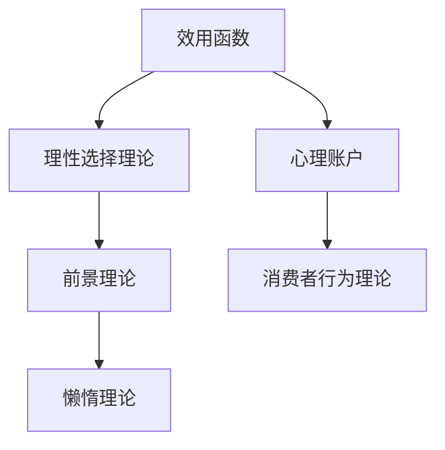

                 

### 《从新古典经济学到行为经济学：理解人类在复杂世界中的决策》

> **关键词**：新古典经济学、行为经济学、人类决策、复杂世界、理性选择、心理账户、前景理论

> **摘要**：本文深入探讨了经济学理论的发展历程，从新古典经济学到行为经济学的转变，分析了人类在复杂世界中的决策过程。通过详细阐述核心概念、理论和应用，本文揭示了行为经济学在现实世界中的重要性和广泛影响。

#### 第一部分：经济学理论的演进

##### 第1章：新古典经济学的核心概念

**1.1 引言：经济学理论的发展历程**

经济学作为一门社会科学，其理论体系不断发展与完善。从古典经济学到新古典经济学，再到行为经济学，经济学理论在不断演进中逐渐揭示了人类经济行为的本质。

- **古典经济学**：以亚当·斯密和大卫·李嘉图为代表，古典经济学强调市场自发调节和经济自由。然而，市场失灵的问题逐渐引起学者们的关注。
- **新古典经济学**：20世纪初，马歇尔和瓦尔拉斯等学者提出了新古典经济学，强调市场均衡和理性选择。新古典经济学在解释市场价格和产量方面取得了显著成果。
- **行为经济学**：20世纪后期，阿莫斯·特沃斯基和理查德·塞勒等学者提出了行为经济学，将心理学引入经济学研究，试图解释人类在现实经济活动中的行为偏差。

**1.2 效用函数与理性选择理论**

新古典经济学中的理性选择理论假设个体在做决策时总是追求最大化效用。效用函数是衡量个体偏好的一种量化方式。

- **效用函数的定义与特性**：效用函数是用来衡量个体在不同选择下获得的满意程度的函数。其特性包括连续性、可加性和单调性。
- **理性选择理论的原理与应用**：理性选择理论假设个体在做决策时能够准确预测后果，并选择最大化效用的行动。该理论在解释市场行为、资源配置等方面具有重要意义。

**1.3 市场竞争与均衡分析**

市场竞争是经济学研究的重要主题之一。新古典经济学通过市场均衡分析来解释市场价格和产量。

- **市场竞争的基本形式**：市场竞争分为完全竞争、垄断竞争、寡头垄断和完全垄断四种形式。每种市场竞争形式都有其特定的市场结构。
- **均衡价格与产量分析**：市场均衡是指在市场上需求等于供给的状态。均衡价格和产量是市场参与者决策的结果，它们决定了市场的运行效率。

**1.4 资源配置与帕累托最优**

资源配置是指如何将有限的资源分配给不同的使用目的。新古典经济学提出了帕累托最优的概念，认为在给定技术条件下，资源分配达到帕累托最优状态时，无法再通过改变资源分配来提高某个个体的福利而不降低其他个体的福利。

- **资源配置的概念与目标**：资源配置的目标是在满足个体需求的前提下，实现资源的最大化利用。
- **帕累托最优的状态与实现**：帕累托最优状态是指资源分配达到这样一种状态，即任何改变都会导致某个个体的福利降低而不会提高其他个体的福利。实现帕累托最优需要市场机制的有效运行和政府干预。

**1.5 新古典经济学的影响与局限性**

新古典经济学在解释市场价格、资源配置等方面取得了重要成果，但其局限性也逐渐显现。

- **新古典经济学的实际应用**：新古典经济学在经济学教育、政策制定和商业决策等方面得到了广泛应用。
- **行为经济学对传统理论的挑战**：行为经济学通过引入心理学因素，揭示了人类在现实经济活动中的行为偏差，对传统经济学理论提出了挑战。行为经济学的研究成果为经济学理论的发展提供了新的视角。

##### 第2章：行为经济学的基本概念

**2.1 行为经济学的定义与背景**

行为经济学是经济学与心理学的交叉学科，旨在研究人类在经济活动中的行为规律和决策过程。与传统的经济学理论相比，行为经济学更加关注人类行为的非理性因素和心理因素。

- **行为经济学的研究范围**：行为经济学涵盖了消费者行为、投资决策、市场行为、组织管理等多个领域。
- **与传统经济学的区别与联系**：行为经济学在传统经济学的基础上，引入了心理学、认知科学等学科的研究方法，以更全面地解释人类经济行为。

**2.2 人类行为与心理因素**

人类行为是经济学研究的核心，而心理因素在很大程度上影响了人类的行为决策。行为经济学通过研究人类的心理过程，揭示了人类行为中的非理性因素。

- **心理学在行为经济学中的应用**：行为经济学运用心理学的研究成果，如认知偏差、情绪影响等，来解释人类的经济行为。
- **人类行为的常见偏差**：人类行为中存在多种偏差，如过度自信、锚定效应、损失厌恶等。这些偏差导致了人类在经济决策中的非理性行为。

**2.3 心理账户与决策偏差**

心理账户是一种认知框架，用于组织和管理个体在不同情境下的经济资源。心理账户对个体的决策过程产生了重要影响。

- **心理账户的概念与影响**：心理账户是指个体在心理上对不同来源和类型的财富进行分类和管理的认知过程。心理账户的存在导致了个体在经济决策中的偏差。
- **常见决策偏差分析**：行为经济学研究发现，个体在决策过程中存在多种偏差，如选择效应、机会成本忽视等。这些偏差对个体的经济行为产生了深远影响。

**2.4 社会影响与群体行为**

社会影响是指个体在社会环境中受到其他个体行为的影响。群体行为是行为经济学研究的重要主题之一。

- **社会影响在决策中的作用**：社会影响会影响个体的决策过程，如群体决策、模仿行为等。
- **群体行为的经济学分析**：群体行为在经济活动中具有重要意义，如市场趋势的形成、群体决策的效率等。

**2.5 行为经济学的研究方法与实验设计**

行为经济学的研究方法主要包括实验经济学、现场实验和调查方法等。这些方法有助于揭示人类在经济活动中的行为规律。

- **实验经济学的方法与优势**：实验经济学通过设计经济学实验，模拟现实经济环境，研究人类行为。实验经济学具有可控性和可重复性，有利于发现经济行为中的规律。
- **实验设计的基本原则**：实验设计需要考虑变量控制、实验组和对照组的设置、实验结果的统计检验等。合理的实验设计能够提高研究的可靠性和有效性。

##### 第3章：行为经济学的主要理论

**3.1 前景理论**

前景理论是行为经济学的重要理论之一，由阿莫斯·特沃斯基和丹尼尔·卡尼曼提出。前景理论试图解释个体在面临不确定性和风险时的决策行为。

- **价值函数与概率权重**：前景理论提出了价值函数和概率权重两个概念。价值函数描述了个体对潜在收益和损失的感知，概率权重描述了个体对不同概率的主观评价。
- **前景理论的应用实例**：前景理论可以解释个体在投资决策、保险购买等方面的行为偏差，如风险偏好、损失厌恶等。

**3.2 懒惰理论**

懒惰理论是行为经济学中的另一个重要理论，主要研究个体在决策中的懒惰倾向。懒惰理论认为，个体在决策过程中往往会选择简单、容易的行动，而不是最优的行动。

- **行为选择中的懒惰倾向**：懒惰理论揭示了个体在决策过程中的非理性倾向，如选择效应、机会成本忽视等。
- **懒惰理论对政策制定的影响**：懒惰理论对政策制定产生了重要影响，如在公共健康政策、教育政策等方面的应用。

**3.3 消费者行为理论**

消费者行为理论是行为经济学研究的重要内容之一，主要关注个体在消费决策中的行为规律。

- **消费决策的影响因素**：消费者行为理论分析了影响个体消费决策的因素，如收入水平、价格、产品质量、品牌偏好等。
- **基于行为经济学的消费模型**：行为经济学提出了多种消费模型，如预算平衡模型、心理账户模型等，用于解释个体消费行为。

**3.4 组织行为与管理决策**

组织行为与管理决策是行为经济学研究的重要领域之一，主要关注组织内部的决策行为。

- **组织中的行为经济学问题**：行为经济学研究了组织中的多种行为问题，如领导力、团队合作、激励机制等。
- **管理决策中的行为经济学原理**：行为经济学为管理决策提供了多种理论工具，如决策框架、行为分析等，以帮助管理者做出更有效的决策。

**3.5 基于行为经济学的公共政策**

公共政策制定需要考虑人类行为的复杂性和多样性。行为经济学为公共政策制定提供了重要的理论依据。

- **公共政策中的行为经济学考虑**：行为经济学在公共政策制定中的应用主要包括公共健康政策、教育政策、劳动政策等方面。
- **行为经济学对政策制定的影响**：行为经济学的研究成果有助于优化政策设计，提高政策效果。

#### 第二部分：行为经济学在现实世界中的应用

##### 第4章：金融市场的行为经济学分析

金融市场是行为经济学研究的重要领域之一，行为经济学为金融市场分析提供了新的视角和方法。

- **4.1 行为金融学的定义与背景**：行为金融学是行为经济学在金融市场中的应用，旨在研究投资者行为和市场波动之间的关系。
- **4.2 行为金融理论的应用**：行为金融理论包括前景理论、懒惰理论、消费者行为理论等，这些理论可以解释金融市场中的各种现象，如市场波动、投资者行为偏差等。
- **4.3 行为金融与投资者心理**：行为金融学关注投资者心理对市场波动的影响，如过度自信、情绪波动等。
- **4.4 行为金融与市场波动**：行为金融学试图解释市场波动的原因，如信息不对称、群体行为等。
- **4.5 行为金融与投资策略优化**：行为金融学为投资策略优化提供了新的思路，如风险控制、行为偏差纠正等。

##### 第5章：行为经济学在企业管理中的应用

行为经济学在企业管理中的应用具有重要意义，可以帮助企业更好地理解员工行为、优化管理决策。

- **5.1 行为经济学与企业行为**：行为经济学研究了企业在市场竞争、资源配置、决策制定等方面的行为规律。
- **5.2 员工激励与行为管理**：行为经济学为员工激励和行为管理提供了新的思路，如心理账户理论、前景理论等。
- **5.3 行为经济学与消费者行为**：行为经济学分析了消费者在购买决策、品牌偏好等方面的行为规律。
- **5.4 行为经济学与市场策略**：行为经济学为企业的市场策略制定提供了理论依据，如消费者行为分析、市场趋势预测等。
- **5.5 行为经济学与消费者心理学**：行为经济学关注消费者心理对购买决策的影响，如情绪、认知偏差等。

##### 第6章：行为经济学在社会政策制定中的应用

行为经济学在社会政策制定中的应用具有重要意义，可以帮助政策制定者更好地理解社会行为、优化政策效果。

- **6.1 行为经济学与社会政策**：行为经济学研究了社会政策中的多种行为问题，如公共健康、教育、劳动等。
- **6.2 公共健康政策中的行为经济学**：行为经济学分析了健康行为与公共政策之间的关系，如健康干预策略、健康行为分析等。
- **6.3 教育政策中的行为经济学**：行为经济学研究了教育决策的影响因素，如教育投入、教育效果等。
- **6.4 劳动政策中的行为经济学**：行为经济学分析了劳动市场中的行为问题，如劳动力政策、就业歧视等。
- **6.5 行为经济学与经济发展**：行为经济学研究了经济发展中的行为规律，如经济增长、财富分配等。

##### 第7章：行为经济学未来的发展趋势

行为经济学作为一个新兴领域，其研究范围和影响力正在不断扩大。未来行为经济学的发展将呈现出以下趋势：

- **7.1 行为经济学研究的未来方向**：行为经济学将继续拓展研究范围，如跨学科研究、新兴领域的研究等。
- **7.2 行为经济学在教学与普及中的应用**：行为经济学将在教育领域中发挥更大作用，提高公众对行为经济学的认知。
- **7.3 行为经济学在社会治理中的应用**：行为经济学将更多地应用于公共治理领域，为政策制定提供科学依据。
- **7.4 行为经济学与人工智能的融合**：行为经济学与人工智能的结合将为行为经济学研究带来新的机遇和挑战。
- **7.5 行为经济学的发展前景**：行为经济学在未来将产生更为深远的影响，为经济和社会发展提供重要支撑。

### 附录

#### 附录A：行为经济学核心概念与联系

为了更好地理解行为经济学中的核心概念，以下是一个Mermaid流程图，展示了这些概念之间的联系。



**A.1 行为经济学核心概念流程图**

在行为经济学中，效用函数是衡量个体偏好的一种方式，理性选择理论描述个体在做出决策时如何最大化效用。心理账户是管理个体经济资源的一种认知框架，它影响个体的消费和投资决策。前景理论解释个体在面对不确定性和风险时的决策行为。消费者行为理论分析个体在购买决策中的行为规律。懒惰理论则揭示了个体在决策过程中选择简单、容易的行动倾向。

#### 附录B：行为经济学核心算法原理

为了深入理解行为经济学中的核心算法，以下是一个前景理论的伪代码示例，展示了如何计算前景值。

```python
# 前景理论伪代码

# 定义价值函数
value_function = function(prospective_payoff, reference_point):
    # 计算价值
    value = (prospective_payoff - reference_point) / standard_deviation
    return value

# 计算概率权重
probability_weight = function(probability):
    # 使用拉普拉斯公式计算概率权重
    weight = 2 * (probability + 1) / (1 + probability**2)
    return weight

# 计算前景值
prospect_value = value_function(prospective_payoff, reference_point) * probability_weight(probability)
```

**B.1 前景理论伪代码**

在这个伪代码中，`value_function`用于计算个体对潜在收益和损失的感知，而`probability_weight`用于计算个体对不同概率的主观评价。通过这两个函数，可以计算出一个决策的前景值，即个体对该决策的整体感知。

#### 附录C：数学模型和数学公式

为了更好地理解行为经济学中的数学模型，以下展示了效用函数和前景理论的数学表达式。

**C.1 效用函数的数学表达**

$$
U(x) = \int_{0}^{x} u'(t) dt
$$

其中，$U(x)$表示总效用，$u'(t)$表示边际效用函数。

**C.2 前景理论的期望效用公式**

$$
V(p) = \frac{\int p(q) v(q) dq}{\int p(q) dq}
$$

其中，$V(p)$表示前景值，$p(q)$表示概率密度函数，$v(q)$表示价值函数。

这些数学模型为行为经济学提供了理论工具，帮助分析个体在复杂环境中的决策行为。

#### 附录D：项目实战案例

**D.1 基于行为经济学的消费决策分析**

**D.1.1 实战目标：分析消费者在不同情境下的购买决策**

**D.1.2 实战步骤：**

1. **数据收集与预处理：** 收集消费者的消费行为数据，包括消费金额、商品类型、购买时间等信息。对数据进行清洗和预处理，确保数据的准确性和完整性。

2. **特征提取：** 提取与消费决策相关的特征变量，如消费者年龄、收入水平、家庭状况等。通过统计分析，确定对消费决策有显著影响的特征变量。

3. **模型构建：** 使用回归模型分析消费决策的影响因素。通过拟合不同类型的回归模型（如线性回归、逻辑回归等），比较模型的拟合效果，选择最优模型。

4. **结果分析：** 分析不同情境下的消费决策特征和趋势。例如，分析不同年龄段的消费者偏好、不同收入水平下的消费行为差异等。

5. **策略建议：** 根据分析结果，为企业提供消费决策策略建议，如针对不同消费者群体的营销策略、价格策略等。

**D.1.3 代码实现：**

```python
# 数据收集与预处理代码
# ...

# 特征提取与模型构建代码
# ...

# 结果分析与可视化代码
# ...

```

**D.1.4 代码解读与分析：**

在代码实现中，首先进行数据收集与预处理，包括数据清洗、缺失值填补等操作。然后提取与消费决策相关的特征变量，并使用回归模型进行模型构建。最后，对模型结果进行分析，提取关键信息，为企业提供策略建议。

**D.1.5 开发环境搭建：**

1. **Python环境搭建：** 在Python环境中安装必要的库和工具，如NumPy、Pandas、Scikit-learn等。

2. **数据处理与分析工具：** 安装数据处理和分析工具，如Pandas、NumPy、Scikit-learn等。

3. **数据可视化工具：** 安装数据可视化工具，如Matplotlib、Seaborn等。

#### 附录E：资源与参考文献

**E.1 主要参考资料**

1. **行为经济学相关教材和文献：**
   - **《行为经济学导论》**：泰勒·本-沙哈尔著，中信出版社，2012年。
   - **《思考，快与慢》**：丹尼尔·卡尼曼著，中国社会科学出版社，2012年。
   - **《行为经济学手册》**：阿莫斯·特沃斯基、理查德·塞勒著，上海财经出版社，2008年。

2. **金融市场的行为经济学研究：**
   - **《行为金融学》**：罗伯特·席勒著，中国人民大学出版社，2006年。
   - **《市场波动的行为经济学解释》**：约翰·赫什莱弗、安德鲁·梅尔泽尔著，上海财经出版社，2010年。

3. **企业管理和公共政策的案例研究：**
   - **《企业行为经济学》**：约翰·考特、杰克·林德曼著，中国人民大学出版社，2011年。
   - **《公共选择理论》**：詹姆斯·M·布坎南著，中国社会科学出版社，2003年。

**E.2 开发工具与资源**

1. **Python编程环境：** Python是行为经济学研究和应用的主要编程语言，其丰富的库和工具为数据分析和模型构建提供了便利。

2. **数据处理与分析工具：** 
   - **Pandas**：用于数据清洗、预处理和统计分析。
   - **NumPy**：用于数值计算和矩阵运算。
   - **Scikit-learn**：用于机器学习模型构建和评估。

3. **数据可视化工具：** 
   - **Matplotlib**：用于基本的数据可视化。
   - **Seaborn**：用于更高级的数据可视化。

### 总结

本文《从新古典经济学到行为经济学：理解人类在复杂世界中的决策》系统地阐述了经济学理论的发展历程，从新古典经济学到行为经济学的转变，揭示了人类在复杂世界中的决策过程。通过详细阐述核心概念、理论和应用，本文展示了行为经济学在现实世界中的重要性和广泛影响。

文章首先介绍了新古典经济学的核心概念，如效用函数、理性选择理论、市场竞争和资源配置等。然后，本文探讨了行为经济学的基本概念，如人类行为与心理因素、心理账户、前景理论等。接着，本文详细介绍了行为经济学的主要理论，包括前景理论、懒惰理论、消费者行为理论等。

在现实世界中的应用部分，本文分别讨论了行为经济学在金融市场、企业管理和社会政策制定中的应用，展示了行为经济学在解决实际问题中的价值。最后，本文展望了行为经济学未来的发展趋势，提出了行为经济学研究的新方向和应用前景。

通过本文的阅读，读者可以全面了解行为经济学的重要性和应用价值，为未来的学术研究和实践提供有益的启示。

**作者：AI天才研究院/AI Genius Institute & 禅与计算机程序设计艺术 /Zen And The Art of Computer Programming** 

--- 

本文是对行为经济学领域的一次深入探索，旨在为读者提供全面的理论和实践指导。希望本文能够对读者在经济学研究和实际应用中有所启发和帮助。如有任何建议或疑问，欢迎读者在评论区留言，共同探讨行为经济学的奥秘。|user|>### 第1章：新古典经济学的核心概念

**1.1 引言：经济学理论的发展历程**

经济学作为一门社会科学，自其诞生以来，经历了漫长的发展历程。经济学理论的发展不仅反映了人类社会对经济现象的认识不断深化，也体现了经济学方法论的创新和突破。从古典经济学到新古典经济学，再到行为经济学，经济学理论在不断演进中逐渐揭示了人类经济行为的本质。

- **古典经济学**：古典经济学起源于18世纪末至19世纪初，以亚当·斯密和大卫·李嘉图为代表。古典经济学强调市场自发调节和经济自由，认为市场机制是资源配置的有效手段。亚当·斯密在其经典著作《国富论》中提出了“看不见的手”理论，强调市场在经济活动中的自组织能力。大卫·李嘉图则通过比较优势理论阐述了国际贸易的基本原理。

- **新古典经济学**：20世纪初，马歇尔和瓦尔拉斯等学者提出了新古典经济学。新古典经济学在古典经济学的基础上，引入了边际分析的方法，强调个体行为和市场均衡。马歇尔的《经济学原理》是这一时期的代表作，他提出了需求曲线和供给曲线的概念，为市场均衡分析奠定了基础。瓦尔拉斯则提出了一般均衡理论，认为在一个充分竞争的市场中，各种商品和劳务的价格和数量可以通过市场机制实现均衡。

- **行为经济学**：20世纪后期，行为经济学逐渐兴起。阿莫斯·特沃斯基和理查德·塞勒等学者将心理学引入经济学研究，试图解释人类在现实经济活动中的行为偏差。行为经济学揭示了个体在决策过程中的认知偏差和心理因素，对传统经济学理论提出了挑战。特沃斯基和卡尼曼提出的前景理论是行为经济学的重要成果之一，它改变了人们对风险和不确定性的认识。

经济学理论的发展历程反映了人类社会对经济现象认识的不断深化。从古典经济学的市场自发调节，到新古典经济学对市场均衡的分析，再到行为经济学对人类行为的深入探讨，经济学理论在不断完善和丰富。每一种经济学理论都有其特定的研究视角和应用场景，共同构成了现代经济学的理论体系。

**1.2 效用函数与理性选择理论**

新古典经济学中的理性选择理论是理解个体决策行为的重要工具。该理论假设个体在做决策时总是追求最大化效用，即选择能够带来最大满足程度的行动。效用函数是衡量个体偏好的一种量化方式，它描述了个体在不同选择下获得的满意程度。

- **效用函数的定义与特性**：效用函数是一种数学函数，用来衡量个体在不同选择下获得的效用水平。效用函数通常具有以下特性：

  - **连续性**：效用函数在定义域内是连续的，即个体对微小变化的反应是平滑的。
  - **可加性**：效用函数满足可加性，即多个选择组合的效用可以分解为各个选择的效用之和。
  - **单调性**：效用函数具有单调性，即个体对增加的效用有正向反应。

  效用函数的这些特性使其成为描述个体偏好和行为的有力工具。

- **理性选择理论的原理与应用**：理性选择理论假设个体在做决策时能够准确预测后果，并选择最大化效用的行动。理性选择理论的基本原理包括：

  - **偏好一致性**：个体在不同时间或不同情境下做出的选择应该是一致的，即不存在矛盾或冲突。
  - **预期效用最大化**：个体在面临多个选择时，会选择能够带来最大预期效用的行动。
  - **信息处理能力**：个体在做决策时需要处理大量信息，包括现有信息和历史经验。

  理性选择理论在经济学、心理学、认知科学等领域得到了广泛应用。它不仅用于解释个体的消费行为、投资决策，还用于分析市场行为、政策制定等。

在消费行为中，理性选择理论帮助解释个体如何在不同商品和服务之间进行选择。例如，当消费者购买一辆汽车时，他们会在价格、品牌、性能等因素之间进行权衡，选择能够带来最大效用的汽车。在投资决策中，理性选择理论指导投资者如何在不同投资机会之间进行选择，以实现投资组合的最大化收益。

**1.3 市场竞争与均衡分析**

市场竞争是经济学研究的重要主题之一。新古典经济学通过市场均衡分析来解释市场价格和产量。市场竞争分为完全竞争、垄断竞争、寡头垄断和完全垄断四种形式，每种市场竞争形式都有其特定的市场结构。

- **市场竞争的基本形式**：市场竞争的基本形式包括：

  - **完全竞争**：在完全竞争市场中，存在大量的买家和卖家，产品是同质的，市场进入和退出没有障碍。完全竞争市场通常假设市场价格由市场供求关系决定，个体厂商无法影响市场价格。
  - **垄断竞争**：在垄断竞争市场中，产品存在一定的差异，厂商具有一定的市场势力。垄断竞争市场的特点是存在多个厂商，但每个厂商的产品都有一定的独特性。
  - **寡头垄断**：在寡头垄断市场中，少数几个厂商控制了大部分市场份额。寡头垄断市场的特点是市场集中度较高，厂商之间的决策行为相互影响。
  - **完全垄断**：在完全垄断市场中，只有一个厂商控制了整个市场。完全垄断市场的特点是市场进入壁垒较高，厂商可以完全控制市场价格。

- **均衡价格与产量分析**：市场均衡是指在市场上需求等于供给的状态。均衡价格和产量是市场参与者决策的结果，它们决定了市场的运行效率。

  - **均衡价格**：均衡价格是指市场上需求等于供给时的价格水平。在完全竞争市场中，市场价格由市场供求关系决定，厂商只能接受市场价格，无法影响价格。在垄断市场中，厂商可以通过控制产量和价格来实现利润最大化。
  - **均衡产量**：均衡产量是指市场上需求等于供给时的产量水平。在完全竞争市场中，厂商在边际成本等于价格时实现产量最大化。在垄断市场中，厂商可以在边际成本小于价格时实现产量最大化。

市场竞争和均衡分析对于理解市场行为、政策制定和经济发展具有重要意义。市场竞争可以提高市场的运行效率，促进技术进步和消费者福利。市场均衡分析为政策制定提供了理论依据，可以帮助政府制定合理的市场干预政策。

**1.4 资源配置与帕累托最优**

资源配置是指如何将有限的资源分配给不同的使用目的。新古典经济学提出了帕累托最优的概念，认为在给定技术条件下，资源分配达到帕累托最优状态时，无法再通过改变资源分配来提高某个个体的福利而不降低其他个体的福利。

- **资源配置的概念与目标**：资源配置的目标是在满足个体需求的前提下，实现资源的最大化利用。资源配置需要考虑资源稀缺性和个体需求。资源稀缺性是指资源数量有限，无法满足所有个体的需求。个体需求是指个体在不同用途上对资源的偏好。

  - **资源分配的原则**：资源分配应遵循公平和效率原则。公平原则要求资源分配要考虑到个体需求和资源稀缺性，确保资源能够公平地分配给各个个体。效率原则要求资源分配要实现最大化社会福利，即资源利用效率最高。

  - **资源利用的效率**：资源利用的效率可以通过帕累托最优状态来衡量。帕累托最优状态是指资源分配达到这样一种状态，即任何改变都会导致某个个体的福利降低而不会提高其他个体的福利。在帕累托最优状态下，资源利用达到最佳水平。

- **帕累托最优的状态与实现**：帕累托最优状态是指资源分配达到这样一种状态，即任何改变都会导致某个个体的福利降低而不会提高其他个体的福利。实现帕累托最优需要市场机制的有效运行和政府干预。

  - **市场机制的作用**：市场机制在实现帕累托最优方面发挥着重要作用。市场通过价格机制和供求关系调节资源的分配，使资源能够流向最有效率的用途。市场价格反映了资源的稀缺程度和个体需求，引导资源流向高回报的领域。

  - **政府干预的必要性**：市场机制在实现帕累托最优方面存在一定的局限性。市场失灵可能导致资源分配不公平和效率低下。政府可以通过税收、补贴、公共投资等手段进行市场干预，纠正市场失灵，实现资源的最优配置。

资源配置与帕累托最优理论在经济学研究、政策制定和企业管理中具有重要意义。它为理解和优化资源配置提供了理论依据，为政策制定提供了指导，帮助企业实现资源的最优利用。

**1.5 新古典经济学的影响与局限性**

新古典经济学在经济学理论的发展中起到了重要作用，但其局限性也逐渐显现。

- **新古典经济学的实际应用**：新古典经济学在经济学教育、政策制定和商业决策等方面得到了广泛应用。它为分析市场价格、资源配置和个体决策提供了理论框架。例如，新古典经济学在解释市场均衡、需求曲线和供给曲线等方面具有重要价值。

- **行为经济学对传统理论的挑战**：行为经济学通过引入心理学因素，揭示了人类在现实经济活动中的行为偏差。行为经济学对传统经济学理论提出了挑战，例如对个体决策的理性假设、市场均衡的假设等。行为经济学的研究成果为经济学理论的发展提供了新的视角。

- **局限性分析**：

  - **理性假设的局限性**：新古典经济学假设个体在做决策时总是理性的，能够准确预测后果并最大化效用。然而，现实中的个体往往存在认知偏差和心理因素，导致决策的非理性。

  - **市场均衡的局限性**：新古典经济学认为市场能够通过价格机制实现均衡，但市场失灵现象普遍存在。市场失灵可能导致资源配置不公平和效率低下，例如公共物品供给不足、外部性等问题。

  - **实证研究的局限性**：新古典经济学在实证研究中的有效性受到质疑。许多实证研究表明，市场行为与理论预测存在偏差，个体决策行为受到多种非理性因素的影响。

新古典经济学的影响与局限性为我们理解经济学理论的发展提供了重要启示。虽然行为经济学对传统经济学理论提出了挑战，但二者并非对立，而是互补的。通过结合新古典经济学的理论框架和行为经济学的实证研究，我们可以更全面地理解人类经济行为，为政策制定和企业管理提供更有力的理论支持。

### 第2章：行为经济学的基本概念

**2.1 行为经济学的定义与背景**

行为经济学是经济学与心理学交叉的一个新兴领域，旨在研究人类在现实经济活动中的行为规律和决策过程。与传统经济学不同，行为经济学关注个体在决策过程中的心理因素和非理性行为，试图揭示人类在经济活动中如何做出选择。

- **行为经济学的研究范围**：行为经济学的研究范围广泛，涵盖了消费行为、投资决策、市场行为、组织管理等多个领域。具体包括：

  - **消费者行为**：研究个体在购买商品和服务时的决策过程，如品牌选择、价格敏感度等。
  - **投资决策**：研究个体在投资市场中的行为规律，如风险偏好、过度自信等。
  - **市场行为**：研究市场参与者如何在市场中进行交易和竞争，如价格战、信息不对称等。
  - **组织管理**：研究企业内部管理决策，如激励机制、团队合作等。

- **与传统经济学的区别与联系**：行为经济学与传统经济学的主要区别在于：

  - **研究方法**：行为经济学引入了心理学、认知科学等学科的研究方法，通过实验、观察和统计分析，研究人类行为中的非理性因素。而传统经济学主要采用数学模型和假设，强调市场均衡和理性选择。

  - **理论视角**：行为经济学关注个体在现实环境中的行为规律，揭示人类行为的认知偏差和心理因素。传统经济学则更多关注市场机制和宏观经济学问题。

  尽管存在这些区别，行为经济学与传统经济学仍有许多联系。行为经济学在很多方面是对传统经济理论的补充和发展，旨在更全面地理解人类经济行为。

**2.2 人类行为与心理因素**

人类行为是经济学研究的核心，而心理因素在很大程度上影响了人类的行为决策。行为经济学通过研究人类的心理过程，揭示了人类行为中的非理性因素。

- **心理学在行为经济学中的应用**：心理学在行为经济学中的应用主要体现在以下几个方面：

  - **认知偏差**：认知偏差是指个体在信息处理过程中存在的系统性错误。行为经济学研究了许多常见的认知偏差，如确认偏误、锚定效应、过度自信等，这些偏差会导致个体做出非理性的决策。

  - **情绪影响**：情绪对个体的决策行为有重要影响。行为经济学研究发现，情绪会影响个体的风险评估、风险偏好和决策时间等。例如，乐观情绪可能导致过度自信和风险追求，而悲观情绪可能导致规避风险和保守决策。

  - **社会影响**：社会影响是指个体在社会环境中受到其他个体行为的影响。行为经济学研究了社会影响在消费者行为、投资决策和市场竞争中的作用。例如，个体可能受到群体行为的影响，盲目跟风或模仿他人的决策。

- **人类行为的常见偏差**：行为经济学揭示了人类行为中存在多种非理性偏差，这些偏差影响了个体在现实经济活动中的决策行为。常见的偏差包括：

  - **过度自信**：个体往往高估自己的知识和能力，导致过度乐观和风险追求。
  - **锚定效应**：个体在决策过程中受到先验信息的影响，无法摆脱这些信息对决策的干扰。
  - **损失厌恶**：个体对损失的敏感程度高于对等额收益的敏感程度，导致规避风险和保守决策。
  - **代表性偏差**：个体在评估不确定事件时，更多关注事件的可能性，而忽视概率的客观性。

这些认知偏差和心理因素在消费者行为、投资决策和市场竞争中起到了重要作用，影响了市场效率和个体福利。

**2.3 心理账户与决策偏差**

心理账户是一种认知框架，用于组织和管理个体在不同情境下的经济资源。心理账户对个体的决策过程产生了重要影响。

- **心理账户的概念与影响**：心理账户是指个体在心理上对不同来源和类型的财富进行分类和管理的认知过程。心理账户的存在使得个体在面对不同的经济决策时，对资源的感知和分配方式有所不同。具体影响包括：

  - **分离效应**：心理账户使得个体对同一笔财富在不同情境下的使用方式产生差异。例如，个体可能会更倾向于使用特定账户的财富来支付账单，而不会从其他账户中转移资金。
  - **支出控制**：心理账户有助于个体进行支出控制。个体可能会在心理上将一部分收入视为“不可支配”的，从而抑制过度消费。
  - **决策偏差**：心理账户的存在可能导致个体在决策过程中产生偏差。例如，个体可能会对不同来源的资金有不同的风险偏好，导致投资决策的不一致性。

- **常见决策偏差分析**：心理账户导致个体在决策过程中存在多种偏差，包括：

  - **选择效应**：个体在面对多个选择时，更倾向于选择具有明显特征的产品，而忽视其他更优的选择。
  - **机会成本忽视**：个体在决策过程中往往忽视机会成本，导致资源的低效配置。
  - **心理账户错位**：个体可能会将不同类型的财富混合管理，导致决策的不一致性和低效率。

这些决策偏差影响了市场效率和个体福利，使得行为经济学在现实中的应用具有重要意义。

**2.4 社会影响与群体行为**

社会影响是指个体在社会环境中受到其他个体行为的影响。群体行为是行为经济学研究的重要主题之一。

- **社会影响在决策中的作用**：社会影响对个体决策有重要影响，包括：

  - **从众行为**：个体在决策过程中可能受到他人的行为和意见的影响，倾向于采取与群体一致的决策。
  - **模仿行为**：个体可能会模仿他人的行为和决策，从而产生群体效应。
  - **社会规范**：社会规范对个体行为有约束作用，个体在决策时可能会考虑社会规范的影响。

  社会影响在消费者行为、投资决策和市场竞争中起到了重要作用。例如，消费者可能会因为品牌形象和口碑而选择某种产品，投资者可能会因为市场情绪而做出投资决策。

- **群体行为的经济学分析**：群体行为在经济活动中具有重要意义，包括：

  - **市场趋势**：群体行为可能导致市场趋势的形成。例如，股票市场的暴涨暴跌往往与投资者的群体行为有关。
  - **决策效率**：群体行为可以提高决策效率。例如，团队决策可以汇集多个个体的智慧，提高决策质量。
  - **社会动荡**：群体行为也可能导致社会动荡。例如，群体抗议和示威可能对社会稳定产生负面影响。

行为经济学通过研究社会影响和群体行为，揭示了个体在复杂社会环境中的决策规律，为政策制定和企业管理提供了理论依据。

**2.5 行为经济学的研究方法与实验设计**

行为经济学的研究方法主要包括实验经济学、现场实验和调查方法等。这些方法有助于揭示人类在经济活动中的行为规律。

- **实验经济学的方法与优势**：实验经济学通过设计经济学实验，模拟现实经济环境，研究人类行为。实验经济学具有以下优势：

  - **可控性**：实验经济学可以通过控制变量，减少外部干扰，提高研究的可靠性和有效性。
  - **可重复性**：实验经济学的结果可以通过重复实验进行验证，确保研究结论的稳定性。
  - **多样性**：实验经济学可以设计多种实验场景，研究不同情境下的行为规律。

  实验经济学的研究方法为行为经济学提供了丰富的实证数据，有助于验证理论假设和发现新的行为规律。

- **实验设计的基本原则**：实验设计需要考虑以下基本原则：

  - **随机分配**：实验对象应随机分配到实验组和对照组，以消除选择偏差。
  - **变量控制**：实验设计应控制可能影响结果的变量，确保实验结果的可靠性。
  - **实验组和对照组**：实验设计应设置实验组和对照组，比较不同处理的效果。
  - **统计检验**：实验设计应进行统计检验，确保实验结果的显著性。

  合理的实验设计可以确保实验结果的科学性和可靠性，为行为经济学研究提供有力支持。

通过实验经济学的研究方法，行为经济学能够更深入地理解人类在经济活动中的行为规律，为政策制定和企业管理提供实证依据。

### 第3章：行为经济学的主要理论

**3.1 前景理论**

前景理论是行为经济学的重要理论之一，由阿莫斯·特沃斯基和丹尼尔·卡尼曼提出。前景理论试图解释个体在面临不确定性和风险时的决策行为，是对传统经济学期望效用理论的重大突破。

- **价值函数与概率权重**：前景理论提出了价值函数和概率权重两个概念，用于描述个体在面临潜在收益和损失时的感知和评价。

  - **价值函数**：价值函数描述了个体对潜在收益和损失的感知，它反映了个体对不同结果的偏好。价值函数通常是一个非线性函数，能够捕捉到个体对风险和不确定性的不同态度。例如，个体可能对潜在损失更敏感，而对潜在收益反应较小。
  - **概率权重**：概率权重描述了个体对不同概率的主观评价，即个体对概率的感知可能不同于客观概率。前景理论提出了概率权重函数，用于调整不同概率下的价值函数。

- **前景理论的应用实例**：前景理论在多个领域得到了广泛应用，以下是一些典型的应用实例：

  - **投资决策**：投资者在面对不同的投资机会时，会根据前景理论进行风险评估和决策。例如，投资者可能会对潜在损失更敏感，导致他们倾向于选择低风险的资产，即使这些资产的潜在收益较低。
  - **保险购买**：前景理论解释了个体在购买保险时的行为偏差。个体可能对潜在损失的感知大于潜在收益的感知，导致他们倾向于购买更多的保险，即使保费较高。
  - **医疗决策**：前景理论在医疗决策中也有重要应用。例如，医生和患者可能会根据前景理论评估不同的治疗方案，选择那些能够带来最大净收益的治疗方案。

- **前景理论与期望效用理论的不同**：前景理论与期望效用理论存在显著差异，后者是传统经济学中的核心理论。期望效用理论假设个体在面临不确定性和风险时，会根据概率加权平均各结果的效用，选择最大化期望效用的决策。前景理论则认为个体在决策时更关注参考点，即个体对现状的主观评价，以及潜在收益和损失与参考点之间的距离。

  - **参考点**：前景理论引入了参考点的概念，参考点是个体对现状的主观评价。个体在决策时，会根据参考点评估潜在收益和损失的价值。
  - **非线性价值函数**：前景理论认为价值函数是非线性函数，能够更好地捕捉个体对风险和不确定性的态度。与期望效用理论中的线性函数相比，前景理论能够解释个体在面临风险和不确定性时的非理性行为。

前景理论通过引入价值函数和概率权重，为理解个体在复杂经济环境中的决策行为提供了新的视角。前景理论的应用范围广泛，从投资决策到医疗决策，都展示了其在解释人类行为中的独特优势。

**3.2 懒惰理论**

懒惰理论是行为经济学中的另一个重要理论，主要研究个体在决策中的懒惰倾向。懒惰理论认为，个体在决策过程中往往会选择简单、容易的行动，而不是最优的行动。

- **行为选择中的懒惰倾向**：懒惰理论揭示了个体在决策过程中的非理性倾向。具体表现在以下几个方面：

  - **选择效应**：个体在面临多个选择时，可能更倾向于选择具有明显特征或简单易行选项，而忽视其他更优的选择。例如，消费者在购买产品时可能更倾向于选择知名度高、广告宣传多的品牌，而不考虑产品的实际性能和价格。
  - **机会成本忽视**：个体在决策过程中可能忽视机会成本，导致资源的低效配置。例如，个体可能会继续使用一个已损坏的电子设备，而不是选择购买一个新的设备，即使继续使用设备的成本高于购买新设备的成本。
  - **缺乏计划**：个体在决策过程中可能缺乏长期计划和规划，导致决策的短期性和即时性。例如，个体可能会选择即时的娱乐活动，而忽视长期的职业发展和学习目标。

- **懒惰理论对政策制定的影响**：懒惰理论对政策制定产生了重要影响。以下是一些典型的例子：

  - **公共健康政策**：懒惰理论解释了个体在健康行为中的非理性行为，如缺乏锻炼、不良饮食习惯等。政策制定者可以利用懒惰理论，设计更有效的健康干预措施，如提供便捷的运动设施、开展健康教育活动等。
  - **教育政策**：懒惰理论揭示了个体在教育和学习过程中的非理性行为，如缺乏学习动力、拖延学习任务等。政策制定者可以设计激励机制，如奖学金、奖励制度等，以激发学生的学习积极性。
  - **环境保护政策**：懒惰理论解释了个体在环境保护行为中的非理性行为，如不愿意参与环保活动、节约能源等。政策制定者可以设计环保政策和措施，如提供环保补贴、加强环保宣传等，以促进个体积极参与环境保护。

懒惰理论揭示了个体在决策过程中的非理性倾向，为政策制定提供了理论依据。通过理解懒惰理论，政策制定者可以设计更有效的政策，引导个体做出更理性的决策。

**3.3 消费者行为理论**

消费者行为理论是行为经济学研究的重要内容之一，主要关注个体在消费决策中的行为规律。行为经济学通过研究消费者行为，揭示了个体在购买商品和服务时的心理过程和非理性因素。

- **消费决策的影响因素**：消费决策的影响因素多种多样，包括：

  - **收入水平**：收入水平是影响消费决策的重要因素。个体在消费决策时会考虑自身的收入水平，选择符合自己经济能力的商品和服务。
  - **价格**：价格是消费者在购买决策中考虑的重要因素。个体会根据商品和服务的价格进行选择，价格的变化会影响消费者的购买意愿。
  - **品牌**：品牌对消费者行为有显著影响。消费者在购买决策中会考虑品牌形象、品牌知名度等因素，选择知名品牌的产品。
  - **广告**：广告对消费者行为有重要影响。广告可以通过传达产品信息、塑造品牌形象等方式，影响消费者的购买决策。
  - **社会影响**：社会影响对消费者行为也有显著影响。个体在决策过程中可能会受到他人行为和意见的影响，如从众行为、模仿行为等。

- **基于行为经济学的消费模型**：行为经济学提出了多种消费模型，用于解释个体消费行为。以下是一些典型的消费模型：

  - **预算平衡模型**：预算平衡模型假设个体在消费决策中会根据预算限制进行选择，选择能够最大化效用的消费组合。该模型考虑了收入、价格、品牌等因素对消费决策的影响。
  - **心理账户模型**：心理账户模型认为个体在消费决策中会根据心理账户进行管理，不同类型的财富在心理账户中具有不同的权重。该模型解释了个体在不同消费情境下的行为差异。
  - **前景理论模型**：前景理论模型结合了前景理论和消费决策的特点，解释了个体在面临不确定性和风险时的消费行为。该模型考虑了价值函数和概率权重对消费决策的影响。

行为经济学通过消费者行为理论，揭示了个体在消费决策中的心理过程和非理性因素。这些理论为理解消费者行为提供了新的视角，也为企业和政策制定提供了理论依据。

**3.4 组织行为与管理决策**

组织行为与管理决策是行为经济学研究的重要领域之一，主要关注组织内部的决策行为和激励机制。

- **组织中的行为经济学问题**：组织中的行为经济学问题包括：

  - **领导力**：领导力对组织行为有重要影响。有效的领导力可以激发员工的工作热情和创新能力，提高组织的整体绩效。
  - **团队合作**：团队合作在组织行为中具有重要意义。有效的团队合作可以提升组织的工作效率和创新能力。
  - **激励机制**：激励机制在组织管理中起到关键作用。合理的激励机制可以激发员工的工作动力，提高员工的满意度和忠诚度。

- **管理决策中的行为经济学原理**：行为经济学为管理决策提供了多种理论工具，以下是一些典型的应用：

  - **前景理论**：前景理论可以解释管理者在决策过程中的风险偏好和风险厌恶。管理者在面对不确定性和风险时，会根据前景理论进行风险评估和决策。
  - **心理账户模型**：心理账户模型可以帮助管理者理解员工在不同情境下的心理账户，从而设计更有效的激励机制。
  - **懒惰理论**：懒惰理论可以解释员工在决策过程中的懒惰倾向，管理者可以通过制定有效的管理制度，激发员工的工作积极性。

行为经济学为组织行为与管理决策提供了新的理论视角，帮助管理者更好地理解员工行为和优化管理决策。

**3.5 基于行为经济学的公共政策**

公共政策制定需要考虑人类行为的复杂性和多样性。行为经济学为公共政策制定提供了重要的理论依据。

- **公共政策中的行为经济学考虑**：行为经济学在公共政策制定中的应用主要包括以下几个方面：

  - **公共健康政策**：行为经济学研究了健康行为与公共政策之间的关系。例如，政策制定者可以运用行为经济学原理，设计更有效的健康干预措施，如提高公众对健康行为的认知、提供健康补贴等。
  - **教育政策**：行为经济学分析了教育决策的影响因素，如家庭背景、社会影响等。政策制定者可以利用行为经济学原理，优化教育资源分配，提高教育质量和公平性。
  - **劳动政策**：行为经济学研究了劳动市场中的行为问题，如就业歧视、劳动力流动等。政策制定者可以运用行为经济学原理，制定更有效的劳动政策，促进劳动力市场的稳定和公平。

- **行为经济学对政策制定的影响**：行为经济学对政策制定的影响主要体现在以下几个方面：

  - **优化政策设计**：行为经济学揭示了个体在现实经济活动中的行为规律和非理性因素，政策制定者可以根据这些研究结果，优化政策设计，提高政策效果。
  - **提高政策执行力**：行为经济学为政策制定提供了理论依据，有助于提高政策的执行力和可操作性，确保政策目标的实现。
  - **促进政策创新**：行为经济学的研究成果为政策制定提供了新的视角和方法，促进了政策创新，提高了政策的前瞻性和适应性。

行为经济学在公共政策制定中的应用具有重要意义，有助于解决社会问题，提高公共福利。

### 第二部分：行为经济学在现实世界中的应用

#### 第4章：金融市场的行为经济学分析

金融市场是经济体系中至关重要的一环，行为经济学为金融市场分析提供了新的视角和方法。通过研究投资者的行为和心理因素，行为经济学揭示了金融市场中的波动现象和投资者行为偏差，为投资决策提供了科学依据。

- **4.1 行为金融学的定义与背景**：行为金融学是行为经济学在金融市场中的应用，旨在研究投资者行为和市场波动之间的关系。与传统的金融学不同，行为金融学认为市场波动不仅仅是理性决策的结果，还受到投资者心理和非理性因素的影响。行为金融学的兴起背景包括以下几个方面：

  - **投资者行为的多样化**：随着金融市场的复杂性和多样性增加，投资者行为也变得更加复杂。传统的金融理论无法完全解释投资者行为中的非理性成分，需要引入心理学因素进行补充。
  - **市场波动的不确定性**：市场波动具有高度不确定性，传统金融理论在预测市场波动方面存在局限性。行为金融学通过研究投资者心理因素，揭示了市场波动背后的非理性因素。
  - **金融市场的复杂性**：金融市场中的信息不对称、群体行为等因素导致市场波动更加复杂。行为金融学提供了研究这些复杂现象的理论工具。

- **4.2 行为金融理论的应用**：行为金融学提出了多种理论，用于解释金融市场中的现象。以下是一些主要的理论及其应用：

  - **前景理论**：前景理论解释了投资者在面临不确定性和风险时的决策行为。根据前景理论，投资者对潜在收益和损失的感知是非线性的，对潜在损失更为敏感。这一理论可以解释投资者在市场下跌时过度反应的现象。
  - **情绪传染理论**：情绪传染理论认为，投资者情绪可以通过社会网络传播，导致市场波动。例如，投资者情绪的乐观或悲观情绪可以迅速传染给其他投资者，导致市场出现大幅波动。
  - **行为偏差理论**：行为偏差理论分析了投资者行为中的非理性因素，如过度自信、锚定效应等。这些偏差导致投资者在市场波动时做出非理性的决策，加剧市场波动。
  - **市场心理学理论**：市场心理学理论研究了投资者心理对市场波动的影响。投资者心理因素，如恐惧、贪婪、从众等，可以导致市场出现非理性波动。

行为金融学的理论应用在金融市场中具有重要意义。通过理解投资者行为和心理因素，投资者可以更好地预测市场波动，制定更有效的投资策略。同时，政策制定者也可以利用行为金融学理论，设计更有效的监管政策和市场干预措施，维护金融市场稳定。

- **4.3 行为金融与投资者心理**：投资者心理是行为金融学研究的重要内容之一。以下分析了投资者心理对市场波动的影响：

  - **恐惧和贪婪**：恐惧和贪婪是投资者心理中的两种极端情绪。在市场下跌时，投资者可能会感到恐惧，导致过度卖出，加剧市场下跌。在市场上涨时，投资者可能会感到贪婪，导致过度买入，推动市场上涨。这两种情绪的交替出现，可以导致市场的剧烈波动。
  - **过度自信**：过度自信是投资者行为中的常见偏差。投资者可能会高估自己的知识和能力，导致他们在市场波动时做出过度自信的决策。例如，投资者可能会在市场上涨时过度持有股票，而在市场下跌时过度卖出。
  - **锚定效应**：锚定效应是指投资者在决策过程中受到先验信息的影响，无法摆脱这些信息对决策的干扰。例如，投资者可能会根据过去的价格水平来评估当前股票的价值，导致他们对市场波动产生过度反应。

投资者心理因素在市场波动中起到了重要作用。理解投资者心理，可以帮助投资者制定更理性的投资策略，同时为政策制定者提供制定有效市场干预政策的依据。

- **4.4 行为金融与市场波动**：行为金融学试图解释市场波动的原因，包括以下方面：

  - **信息不对称**：信息不对称是导致市场波动的重要原因之一。市场参与者之间的信息不对称会导致市场无法有效反映真实价值，从而引发波动。例如，机构投资者可能掌握更多市场信息，而散户投资者可能处于信息劣势。
  - **群体行为**：群体行为是指投资者在市场中的行为受到其他投资者的影响。群体行为可以导致市场的过度反应，如过度乐观或过度悲观。例如，在市场上涨时，投资者可能会盲目跟风，导致市场进一步上涨；在市场下跌时，投资者可能会恐慌性抛售，导致市场进一步下跌。
  - **市场恐慌**：市场恐慌是指投资者在市场波动中感到恐慌，导致他们做出非理性的决策。市场恐慌可以导致市场的剧烈波动，甚至引发金融危机。

行为金融学通过研究投资者行为和心理因素，揭示了市场波动的原因。这些研究成果对于理解市场波动、预测市场走势具有重要意义。

- **4.5 行为金融与投资策略优化**：行为金融学为投资策略优化提供了新的思路和方法。以下分析了行为金融学在投资策略优化中的应用：

  - **风险控制**：行为金融学强调风险控制的重要性。投资者可以通过行为金融学的理论，了解自己在投资决策中的非理性偏差，从而制定更有效的风险控制策略。例如，投资者可以设定止损点，避免因过度自信或恐慌而导致的重大损失。
  - **行为偏差纠正**：行为金融学揭示了投资者行为中的非理性偏差，如过度自信、锚定效应等。投资者可以通过自我意识和行为纠正，减少这些偏差对投资决策的影响。例如，投资者可以通过定期回顾自己的投资记录，识别并纠正行为偏差。
  - **多样化投资**：行为金融学强调多样化投资的重要性。投资者可以通过分散投资，降低单一投资的风险。例如，投资者可以将资金分配到不同的资产类别、行业和地区，以降低投资组合的整体风险。
  - **行为金融学模型的优化**：行为金融学提供了多种投资模型，如前景理论模型、情绪传染模型等。投资者可以通过优化这些模型，提高投资策略的有效性。例如，投资者可以通过调整模型参数，适应市场变化，提高模型的预测准确性。

行为金融学为投资策略优化提供了科学依据，帮助投资者制定更有效的投资策略，提高投资回报。

#### 第5章：行为经济学在企业管理中的应用

行为经济学在企业管理中的应用具有重要意义，可以帮助企业更好地理解员工行为、优化管理决策。通过研究员工行为和心理因素，行为经济学为企业管理提供了新的理论工具和实践方法。

- **5.1 行为经济学与企业行为**：行为经济学在企业行为研究中具有重要意义。以下分析了行为经济学在企业行为研究中的应用：

  - **员工行为分析**：行为经济学通过研究员工行为，揭示了员工在工作中的非理性因素。例如，员工可能会受到过度自信、情绪波动、心理账户等因素的影响，导致工作效率降低或决策失误。企业可以通过行为经济学理论，分析员工行为中的非理性因素，提高员工的工作效率和绩效。
  - **领导力研究**：行为经济学研究了领导力在企业管理中的重要作用。有效的领导力可以激发员工的工作热情和创新能力，提高企业的整体绩效。行为经济学通过分析领导行为和心理因素，为企业管理者提供了提高领导力水平的理论依据和实践方法。
  - **组织文化**：行为经济学研究了组织文化对员工行为和企业绩效的影响。积极向上的组织文化可以激发员工的工作动力和创新意识，提高企业的竞争力。企业可以通过行为经济学理论，优化组织文化，建立有利于员工发展和企业发展的文化氛围。

- **5.2 员工激励与行为管理**：员工激励和行为管理是企业管理中的关键环节。行为经济学为员工激励和行为管理提供了新的理论依据和方法：

  - **员工激励理论**：行为经济学提出了多种员工激励理论，如前景理论、懒惰理论等。这些理论揭示了员工在决策过程中的心理因素和非理性行为，为制定有效的员工激励策略提供了理论依据。例如，企业可以通过设置合理的奖励机制，激励员工提高工作效率和创新能力。
  - **行为管理**：行为经济学研究了员工行为中的非理性因素，如过度自信、锚定效应等。企业可以通过行为管理方法，纠正员工行为中的非理性偏差，提高员工的工作效率和绩效。例如，企业可以通过定期培训、心理辅导等方式，提高员工的自我认知和情绪管理能力。

- **5.3 行为经济学与消费者行为**：行为经济学在消费者行为研究中也具有重要意义。以下分析了行为经济学在消费者行为研究中的应用：

  - **消费者行为分析**：行为经济学通过研究消费者行为，揭示了消费者在购买决策中的心理因素和非理性行为。例如，消费者可能会受到品牌效应、从众行为、情绪影响等因素的影响，导致购买决策的偏差。企业可以通过行为经济学理论，分析消费者行为中的非理性因素，制定更有效的市场营销策略。
  - **市场策略**：行为经济学为市场策略提供了新的理论依据。例如，企业可以通过行为经济学理论，设计具有吸引力的营销活动，激发消费者的购买欲望。行为经济学还可以帮助企业在定价、产品定位等方面制定更有效的策略，提高市场竞争力。

- **5.4 行为经济学与市场策略**：行为经济学在市场策略制定中具有重要意义。以下分析了行为经济学在市场策略中的应用：

  - **市场竞争**：行为经济学研究了市场竞争中的行为规律，如价格竞争、品牌竞争等。企业可以通过行为经济学理论，了解竞争对手的行为策略，制定更有竞争力的市场策略。例如，企业可以通过分析竞争对手的价格策略，调整自身的定价策略，提高市场占有率。
  - **消费者行为分析**：行为经济学通过研究消费者行为，揭示了消费者在购买决策中的心理因素和非理性行为。企业可以通过行为经济学理论，分析消费者行为中的非理性因素，制定更有针对性的市场策略。例如，企业可以通过分析消费者的品牌偏好、购买习惯等，设计更符合消费者需求的产品和营销活动。

- **5.5 行为经济学与消费者心理学**：行为经济学与消费者心理学密切相关，为理解消费者行为提供了新的理论视角。以下分析了行为经济学与消费者心理学的关系：

  - **消费者心理分析**：行为经济学通过研究消费者心理，揭示了消费者在购买决策中的心理因素和非理性行为。例如，消费者可能会受到情绪影响、认知偏差等因素的影响，导致购买决策的偏差。企业可以通过行为经济学理论，分析消费者心理，了解消费者的需求和偏好，制定更有效的市场策略。
  - **心理学在行为经济学中的应用**：行为经济学引入了心理学的研究方法，如实验心理学、认知心理学等，为理解消费者行为提供了丰富的实证数据。心理学为行为经济学提供了理论基础，帮助解释消费者行为中的非理性因素。

行为经济学在企业管理中的应用具有重要意义，通过研究员工行为和消费者行为，企业可以优化管理决策，提高市场竞争力。行为经济学为企业管理提供了新的理论工具和实践方法，帮助企业更好地应对市场变化和竞争压力。

#### 第6章：行为经济学在社会政策制定中的应用

行为经济学在社会政策制定中的应用具有重要意义，它为政府和社会组织提供了理解人类行为和制定有效政策的理论依据。通过研究人类行为中的心理因素和非理性因素，行为经济学可以帮助政策制定者更好地设计政策，提高政策效果。

- **6.1 行为经济学与社会政策**：行为经济学在社会政策制定中的应用涵盖了多个领域，包括公共健康、教育、劳动市场等。以下分析了行为经济学在社会政策中的应用：

  - **公共健康政策**：行为经济学研究了健康行为与公共政策之间的关系。例如，通过分析个体的健康决策行为，政策制定者可以设计更有效的健康干预措施，如健康教育、健康保险等，以促进公众健康行为的改变。行为经济学还可以帮助政策制定者了解个体在健康决策中的认知偏差和心理因素，从而设计更具针对性的健康政策。
  - **教育政策**：行为经济学在教育决策中具有重要意义。例如，通过分析学生在教育选择中的行为，政策制定者可以设计更有效的教育资源分配政策，提高教育质量和公平性。行为经济学还可以帮助政策制定者了解个体在教育决策中的非理性因素，如锚定效应、过度自信等，从而优化教育政策。
  - **劳动市场政策**：行为经济学在劳动市场政策制定中也有重要应用。例如，通过分析劳动力市场中的行为问题，如就业歧视、劳动力流动等，政策制定者可以设计更有效的劳动力政策，促进劳动力市场的稳定和公平。

- **6.2 公共健康政策中的行为经济学**：公共健康政策中的行为经济学关注健康行为与公共政策之间的关系。以下分析了行为经济学在公共健康政策中的应用：

  - **健康行为分析**：行为经济学通过研究个体的健康行为，揭示了影响健康决策的心理因素和非理性因素。例如，行为经济学研究发现，个体在健康决策中可能受到认知偏差、情绪影响等因素的影响，导致健康行为的偏离。政策制定者可以利用这些研究成果，设计更有效的健康教育和健康干预措施。
  - **健康干预策略**：行为经济学为健康干预策略的设计提供了理论依据。例如，通过分析个体在健康决策中的认知偏差和心理因素，政策制定者可以设计更具针对性的健康教育策略，如个性化健康教育、行为激励等，以提高健康干预的效果。
  - **健康行为分析工具**：行为经济学提供了一系列健康行为分析工具，如实验经济学方法、现场实验等，用于研究健康行为和政策效果。这些工具可以帮助政策制定者更好地了解健康行为的规律，为政策制定提供科学依据。

- **6.3 教育政策中的行为经济学**：教育政策中的行为经济学关注教育决策和教育效果。以下分析了行为经济学在教育政策中的应用：

  - **教育决策分析**：行为经济学通过研究个体的教育决策行为，揭示了影响教育选择的心理因素和非理性因素。例如，行为经济学研究发现，个体在教育决策中可能受到锚定效应、过度自信等因素的影响，导致教育选择的偏差。政策制定者可以利用这些研究成果，优化教育资源分配和教育政策。
  - **教育资源分配**：行为经济学为教育资源的优化分配提供了理论依据。例如，通过分析教育资源分配中的公平性和效率问题，政策制定者可以设计更合理的教育资源分配政策，提高教育公平性和效率。
  - **教育政策优化**：行为经济学帮助政策制定者优化教育政策，提高教育效果。例如，通过分析个体在教育决策中的认知偏差和心理因素，政策制定者可以设计更具针对性的教育政策，如教育激励措施、个性化教育等，以提高教育质量和效果。

- **6.4 劳动政策中的行为经济学**：劳动政策中的行为经济学关注劳动市场中的行为问题。以下分析了行为经济学在劳动政策中的应用：

  - **劳动力市场分析**：行为经济学通过研究劳动市场中的行为问题，揭示了劳动力市场运行中的非理性因素。例如，行为经济学研究发现，劳动力市场中的就业歧视、劳动力流动等问题与个体的认知偏差和心理因素密切相关。政策制定者可以利用这些研究成果，设计更有效的劳动力政策，促进劳动力市场的稳定和公平。
  - **劳动力政策优化**：行为经济学为劳动力政策的优化提供了理论依据。例如，通过分析劳动力市场中的行为问题，政策制定者可以设计更具针对性的劳动力政策，如就业援助、职业培训等，以促进劳动力市场的稳定和公平。
  - **劳动力市场干预**：行为经济学提供了一系列劳动力市场干预策略，如行为激励、心理辅导等，用于改善劳动力市场的运行。这些干预策略可以帮助政策制定者更好地应对劳动力市场中的非理性因素，提高劳动力市场的效率。

- **6.5 行为经济学与经济发展**：行为经济学在经济发展中的应用具有重要意义。以下分析了行为经济学在经济发展中的应用：

  - **经济增长**：行为经济学通过研究个体在经济活动中的行为规律，揭示了经济增长的内在机制。例如，行为经济学研究发现，个体在投资决策、创新行为中的认知偏差和心理因素对经济增长有重要影响。政策制定者可以利用这些研究成果，制定有利于经济增长的政策。
  - **财富分配**：行为经济学在财富分配研究中具有重要意义。例如，行为经济学研究发现，个体在财富分配决策中的心理因素和非理性行为可能导致财富分配不均。政策制定者可以利用这些研究成果，设计更有效的财富分配政策，促进社会公平和稳定。
  - **经济发展策略**：行为经济学为经济发展策略提供了理论依据。例如，通过分析个体在经济活动中的行为规律，政策制定者可以设计更有效的经济发展策略，如创新驱动、产业升级等，以推动经济持续健康发展。

行为经济学在社会政策制定中的应用为政策制定者提供了新的理论视角和实践方法。通过研究人类行为中的心理因素和非理性因素，行为经济学可以帮助政策制定者更好地理解社会问题，设计更有效的政策，提高政策效果，促进社会公平和稳定。

### 第7章：行为经济学未来的发展趋势

行为经济学作为一个新兴领域，其研究范围和影响力正在不断扩大。未来行为经济学的发展将呈现出以下趋势：

- **7.1 行为经济学研究的未来方向**：随着心理学、认知科学等领域的发展，行为经济学的研究将更加深入和广泛。以下是一些未来研究方向的展望：

  - **跨学科研究**：行为经济学将与心理学、认知科学、神经科学等领域进行更加紧密的融合，通过跨学科研究，揭示人类经济行为的深层次机制。
  - **新兴领域的研究**：行为经济学将在新兴领域，如数字经济、金融科技、可持续发展等领域发挥重要作用。例如，研究个体在数字平台上的行为规律，为数字经济的发展提供理论支持。
  - **行为经济学的应用研究**：行为经济学将在公共政策、企业管理、市场营销等领域得到更广泛的应用。例如，通过研究消费者行为，优化市场策略，提高企业的竞争力。

- **7.2 行为经济学在教学与普及中的应用**：行为经济学将在教育领域中发挥更大作用，提高公众对行为经济学的认知。以下是一些具体的应用：

  - **课程设置**：行为经济学将纳入大学经济学课程，作为核心课程或选修课程。通过教学，学生可以了解行为经济学的理论和应用，培养批判性思维和创新能力。
  - **科普读物**：行为经济学的研究成果将转化为通俗易懂的科普读物，使公众更好地理解行为经济学的基本原理。例如，通过案例分析、图表展示等方式，让读者了解行为经济学在现实生活中的应用。
  - **在线教育平台**：行为经济学相关的课程和讲座将在在线教育平台上得到广泛传播。通过互联网，更多的人可以便捷地学习行为经济学，提高自己的经济素养。

- **7.3 行为经济学在社会治理中的应用**：行为经济学将在公共治理领域发挥重要作用，为政策制定提供科学依据。以下是一些具体的应用：

  - **政策制定**：行为经济学将应用于政策制定，帮助政府更好地理解公众行为，设计更有效的政策。例如，通过研究个体的健康行为、教育行为等，政府可以制定更有针对性的公共卫生政策和教育政策。
  - **社会管理**：行为经济学将帮助社会组织更好地管理社会事务，提高社会运行效率。例如，通过研究群体行为、社会影响等，政府和社会组织可以优化社会管理策略，提高社会和谐度。
  - **公共项目评估**：行为经济学将用于评估公共项目的效果，为政策调整提供依据。例如，通过研究公共项目的实施效果，政府可以了解政策对公众行为的影响，优化政策设计。

- **7.4 行为经济学与人工智能的融合**：随着人工智能技术的发展，行为经济学将与人工智能进行深度融合，为人工智能的应用提供新的理论支持。以下是一些融合方向：

  - **行为预测**：行为经济学将结合人工智能技术，预测个体在复杂环境中的行为。例如，通过分析大数据，人工智能可以预测消费者的购买行为、投资者的投资行为等。
  - **个性化服务**：行为经济学将指导人工智能提供个性化服务，满足个体的个性化需求。例如，通过分析个体行为数据，人工智能可以设计更符合个体偏好和需求的产品和服务。
  - **智能决策支持**：行为经济学将结合人工智能技术，提供智能决策支持，帮助个体和企业在复杂环境中做出更理性的决策。例如，通过模拟不同情境下的行为结果，人工智能可以为个体提供最优的决策方案。

- **7.5 行为经济学的发展前景**：随着行为经济学研究的深入和应用的拓展，其发展前景十分广阔。以下是一些展望：

  - **理论创新**：行为经济学将在理论上不断创新，提出更完善的理论框架，解释复杂的经济现象。例如，通过引入新的心理模型和认知理论，行为经济学可以更好地解释个体行为中的非理性因素。
  - **实际应用**：行为经济学将在实际应用中发挥更大的作用，推动经济和社会的发展。例如，通过优化公共政策、改进企业管理、提升市场营销策略等，行为经济学可以为经济和社会带来实际效益。
  - **国际影响力**：行为经济学将在全球范围内产生更大的影响力，成为国际经济学研究的重要方向。随着行为经济学研究的深入和应用的拓展，其理论成果将得到国际认可，为全球经济发展提供新的理论支持。

总之，行为经济学作为一个新兴领域，具有广阔的发展前景。通过不断的理论创新和应用拓展，行为经济学将在经济学研究和实际应用中发挥越来越重要的作用，为经济和社会发展提供有力支持。

### 总结

本文《从新古典经济学到行为经济学：理解人类在复杂世界中的决策》系统地阐述了经济学理论的发展历程，从新古典经济学到行为经济学的转变，揭示了人类在复杂世界中的决策过程。通过详细阐述核心概念、理论和应用，本文展示了行为经济学在现实世界中的重要性和广泛影响。

首先，本文介绍了新古典经济学的核心概念，包括效用函数、理性选择理论、市场竞争和资源配置等。然后，本文探讨了行为经济学的基本概念，如人类行为与心理因素、心理账户、前景理论等。接着，本文详细介绍了行为经济学的主要理论，包括前景理论、懒惰理论、消费者行为理论等。

在现实世界中的应用部分，本文分别讨论了行为经济学在金融市场、企业管理和社会政策制定中的应用，展示了行为经济学在解决实际问题中的价值。最后，本文展望了行为经济学未来的发展趋势，提出了行为经济学研究的新方向和应用前景。

通过本文的阅读，读者可以全面了解行为经济学的重要性和应用价值，为未来的学术研究和实际应用提供有益的启示。行为经济学不仅为经济学研究提供了新的理论框架，也为政策制定、企业管理和社会治理提供了科学依据。随着行为经济学研究的深入，其在各个领域的应用前景将更加广阔。

**作者：AI天才研究院/AI Genius Institute & 禅与计算机程序设计艺术 /Zen And The Art of Computer Programming**

