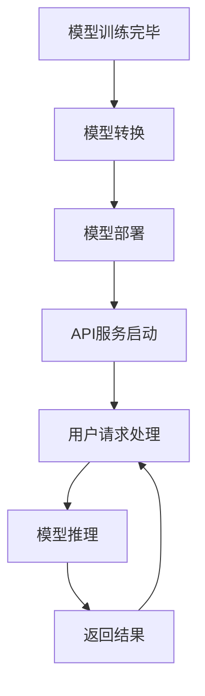
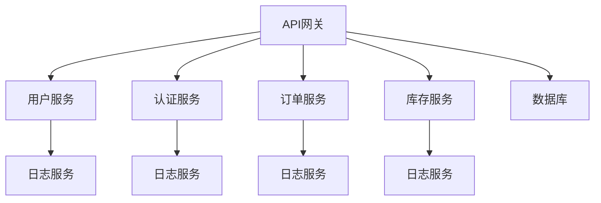
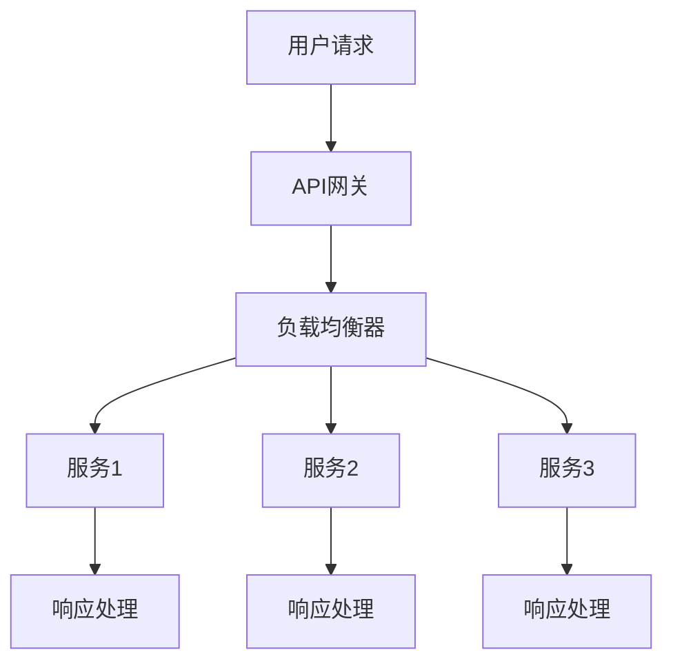

                 

### 《从模型到产品：AI API和Web应用部署实践》

在当今快速发展的技术领域，人工智能（AI）已经从理论研究走向了实际应用，成为许多企业创新的关键驱动力。然而，将AI模型成功部署为API并集成到Web应用中，仍然是一个复杂且具有挑战性的任务。本文旨在探讨如何从AI模型到API，再到Web应用的完整部署过程，并提供实用的策略和案例，帮助读者将AI技术转化为实际产品。

关键词：人工智能，API，Web应用，部署实践，模型优化，性能监控，持续集成

摘要：
本文将详细解析AI API的设计、构建、常见框架的使用，以及Web应用的架构、部署和性能优化。通过实际的案例展示，读者将了解如何从AI模型构建到Web应用部署的全过程。此外，本文还将介绍监控与运维的最佳实践，以及常用工具和资源的介绍。希望本文能为AI开发者提供实用的指导和灵感。

---

## 第一部分：AI API基础

### 第1章：AI与API概述

#### 1.1 AI API的定义与重要性

AI API（人工智能API）是连接应用程序与AI模型的一种接口，允许开发者轻松集成和使用AI功能，而不必深入了解模型的内部实现。AI API的重要性体现在以下几个方面：

1. **降低开发门槛**：开发者无需从头开始构建AI模型，可以通过API调用现成的服务，加快开发进程。
2. **模块化**：将AI功能模块化，便于与其他业务逻辑分离，提高系统的可维护性和可扩展性。
3. **灵活性**：API允许开发者根据需求调整AI功能，如调整模型参数、切换模型版本等。
4. **规模化**：通过API，企业可以将AI服务扩展到多个业务线或产品中，实现规模效应。

#### 1.2 AI API与传统API的区别

传统API主要用于数据交换和业务逻辑调用，而AI API则侧重于提供AI模型的服务。两者的主要区别如下：

1. **数据格式**：传统API通常处理JSON、XML等结构化数据，而AI API则更多处理图像、音频、文本等非结构化数据。
2. **复杂性**：AI API需要处理复杂的模型推理过程，包括数据预处理、模型计算和后处理等。
3. **响应时间**：由于AI模型推理可能涉及大量计算，AI API的响应时间通常比传统API长。
4. **性能优化**：AI API需要考虑模型压缩、量化等性能优化技术，以提供更高效的响应。

#### 1.3 AI API的应用场景

AI API广泛应用于各种领域，以下是一些典型的应用场景：

1. **图像识别**：用于自动驾驶、安防监控、医疗诊断等。
2. **自然语言处理**：用于智能客服、内容审核、翻译等。
3. **语音识别**：用于智能助手、语音搜索、实时翻译等。
4. **推荐系统**：用于电子商务、社交媒体、在线娱乐等。

通过AI API，企业可以快速部署AI应用，提高业务效率和用户体验。

### 第2章：构建AI API

#### 2.1 AI API设计原则

设计AI API时，应遵循以下原则：

1. **接口简洁性**：确保API接口简洁、直观，便于开发者理解和使用。
2. **一致性**：保持API接口的一致性，避免不必要的复杂度。
3. **可靠性**：确保API的稳定性和可靠性，提供合理的错误处理机制。
4. **性能**：优化API性能，包括响应时间、吞吐量等。
5. **安全性**：保护API免受恶意攻击，如API密钥保护、请求限制等。

#### 2.2 AI API接口设计

AI API接口设计包括以下几个关键部分：

1. **输入参数**：明确API接受的输入参数类型和格式，如图像、文本、音频等。
2. **输出参数**：定义API返回的结果格式，如预测结果、概率分布等。
3. **HTTP方法**：确定API使用的HTTP方法，如GET、POST等。
4. **状态码**：使用标准的HTTP状态码，如200表示成功、400表示请求错误、500表示服务器错误。
5. **文档**：提供详细的API文档，包括接口定义、参数说明、示例代码等。

#### 2.3 AI API性能优化

为了提高AI API的性能，可以考虑以下策略：

1. **模型压缩与量化**：通过模型压缩和量化减少模型大小，提高推理速度。
2. **并发处理**：使用多线程或异步处理技术，提高API的吞吐量。
3. **缓存策略**：合理使用缓存，减少重复计算，提高响应速度。
4. **负载均衡**：使用负载均衡器，将请求均匀分布到多个服务器，提高系统稳定性。
5. **性能监控**：实时监控API性能，及时发现问题并进行优化。

通过遵循这些原则和策略，开发者可以构建高效、可靠的AI API，为业务提供强大的AI支持。

### 第3章：常见AI API框架

#### 3.1 TensorFlow Serving

TensorFlow Serving是Google开源的一个高性能、可扩展的分布式服务系统，用于部署TensorFlow模型。其主要特点如下：

1. **模型热部署**：支持模型的热更新，无需重启服务。
2. **服务化**：可以将TensorFlow模型作为服务提供，方便集成到其他应用程序中。
3. **弹性伸缩**：可以根据负载自动扩展或缩小服务实例数量。

TensorFlow Serving的基本架构包括：

- **Server**：接收和处理来自客户端的请求。
- **Model Server**：加载和管理模型。
- **Metadata**：存储模型元数据。

以下是一个简单的TensorFlow Serving部署流程：

1. **准备模型**：将训练好的TensorFlow模型转换为SavedModel格式。
2. **启动TensorFlow Serving服务**：使用命令启动TensorFlow Serving服务，指定模型路径。
3. **客户端调用**：使用HTTP请求调用TensorFlow Serving服务，获取模型预测结果。

#### 3.2 PyTorch TorchScript

PyTorch TorchScript是一种将PyTorch模型转换为高效运行代码的技术。其主要特点如下：

1. **性能优化**：通过编译优化，提高模型的运行速度。
2. **跨语言兼容性**：支持在C++、JavaScript等语言中运行。
3. **部署灵活**：可以在本地、云或移动设备上部署。

以下是一个简单的TorchScript模型转换和部署流程：

1. **准备模型**：编写并训练PyTorch模型。
2. **转换模型**：使用torch.jit.trace或torch.jit.script将模型转换为TorchScript格式。
3. **部署服务**：将TorchScript模型部署到服务器，如使用Flask或FastAPI构建API服务。

#### 3.3 ONNX Runtime

ONNX Runtime是一个开源的运行时，用于执行Open Neural Network Exchange（ONNX）模型。其主要特点如下：

1. **跨平台兼容性**：支持多种编程语言和平台，如C++、Python、Java等。
2. **高性能**：通过优化和并行计算，提高模型运行速度。
3. **灵活的部署**：支持本地部署、云端部署和移动部署。

以下是一个简单的ONNX Runtime部署流程：

1. **准备模型**：将训练好的模型转换为ONNX格式。
2. **加载模型**：使用ONNX Runtime加载并初始化模型。
3. **推理**：使用加载的模型进行推理，获取预测结果。
4. **部署服务**：将ONNX Runtime服务部署到服务器，如使用Flask或FastAPI构建API服务。

通过使用这些常见的AI API框架，开发者可以轻松地将AI模型部署为高效、可靠的API，为业务提供强大的AI支持。

## 第二部分：Web应用部署

### 第4章：Web应用架构

#### 4.1 Web应用架构概述

Web应用架构是确保Web应用稳定、高效、可扩展的关键。常见的Web应用架构包括：

1. **分层架构**：将Web应用分为表示层、业务逻辑层和数据层，实现模块化、可维护性。
2. **微服务架构**：将Web应用拆分为多个独立的小服务，每个服务负责不同的业务功能，实现高可扩展性、高可用性。
3. **无服务器架构**：使用云服务提供商提供的无服务器平台，如AWS Lambda、Google Cloud Functions等，实现自动扩展、低成本。

#### 4.2 微服务架构与容器化

微服务架构是一种将Web应用拆分为多个独立服务的架构风格。以下是其优势：

1. **高可扩展性**：每个服务可以独立扩展，实现性能优化。
2. **高可用性**：服务故障不会影响其他服务的正常运行。
3. **可复用性**：服务可以独立开发、测试和部署，提高开发效率。

容器化技术如Docker和Kubernetes，可以帮助实现微服务架构的优势：

1. **标准化部署**：将服务打包成容器，实现一次编写、多环境运行。
2. **资源隔离**：容器提供虚拟化资源，提高资源利用率。
3. **自动伸缩**：Kubernetes可以根据负载自动调整容器数量。

以下是一个简单的微服务架构与容器化部署流程：

1. **服务拆分**：根据业务需求，将Web应用拆分为多个微服务。
2. **编写Dockerfile**：为每个服务编写Dockerfile，定义容器镜像。
3. **构建容器镜像**：使用Docker命令构建容器镜像。
4. **部署到Kubernetes集群**：使用Kubernetes配置文件，将容器镜像部署到Kubernetes集群。

#### 4.3 API网关与负载均衡

API网关是一个统一的入口，用于处理所有客户端请求，然后将请求路由到后端的服务。其优势如下：

1. **统一认证与授权**：对请求进行身份验证和授权，确保安全性。
2. **流量管理**：根据负载情况，动态分配请求到不同的服务实例。
3. **路由与重写**：根据请求的URL，将请求路由到相应的服务。
4. **聚合与聚合**：将多个服务的响应聚合为一个响应，提高用户体验。

负载均衡器用于将请求均匀地分发到多个服务器，以实现以下目标：

1. **高可用性**：通过将请求分发到多个服务器，确保系统的稳定性。
2. **高性能**：通过并行处理请求，提高系统的吞吐量。
3. **弹性伸缩**：根据负载情况，动态调整服务器数量。

以下是一个简单的API网关与负载均衡部署流程：

1. **选择API网关**：如Kong、Spring Cloud Gateway等。
2. **配置API网关**：定义路由规则、认证策略等。
3. **部署负载均衡器**：如Nginx、HAProxy等。
4. **配置负载均衡**：设置负载均衡策略，如轮询、最少连接等。

通过合理的Web应用架构设计，使用微服务架构与容器化技术，以及API网关与负载均衡，可以实现高效、可靠的Web应用部署。

### 第5章：部署环境搭建

#### 5.1 开发环境配置

开发环境是进行Web应用开发的基础，包括以下关键组件：

1. **编程语言**：选择适合项目的编程语言，如Python、Java、Go等。
2. **开发工具**：安装IDE（如PyCharm、IntelliJ IDEA、Eclipse等），以及代码管理工具（如Git）。
3. **数据库**：根据需求选择合适的数据库系统，如MySQL、PostgreSQL、MongoDB等。
4. **版本控制**：使用Git等版本控制工具，实现代码的版本管理和协作开发。
5. **环境变量**：配置必要的环境变量，如数据库连接信息、API密钥等。

以下是一个简单的开发环境配置流程：

1. **安装操作系统**：选择Linux、macOS或Windows操作系统。
2. **安装编程语言**：如Python，使用pip或conda进行安装。
3. **安装开发工具**：下载并安装IDE。
4. **配置数据库**：安装并配置数据库系统。
5. **安装版本控制工具**：下载并安装Git。
6. **配置环境变量**：在操作系统设置中配置环境变量。

#### 5.2 测试环境搭建

测试环境用于进行功能测试、性能测试和集成测试，以确保Web应用的质量。以下步骤可以帮助搭建测试环境：

1. **模拟生产环境**：确保测试环境与生产环境保持一致，如操作系统、数据库版本等。
2. **安装测试工具**：如JMeter、Selenium等，用于进行性能测试和自动化测试。
3. **配置测试数据**：生成或导入测试数据，用于测试Web应用的功能和性能。
4. **自动化测试**：编写测试脚本，实现自动化测试，提高测试效率。
5. **持续集成**：使用CI工具（如Jenkins、GitLab CI等），实现自动化构建、测试和部署。

以下是一个简单的测试环境搭建流程：

1. **配置测试服务器**：选择适合的硬件和操作系统，安装必要的软件。
2. **安装测试工具**：下载并安装JMeter、Selenium等。
3. **配置数据库**：安装并配置测试数据库。
4. **导入测试数据**：生成或导入测试数据。
5. **编写测试脚本**：编写自动化测试脚本。
6. **配置持续集成**：设置CI工具，实现自动化测试。

#### 5.3 生产环境部署

生产环境是Web应用运行的最终场所，需要确保系统的稳定、安全和高性能。以下步骤可以帮助搭建生产环境：

1. **选择云服务提供商**：如AWS、Azure、Google Cloud等。
2. **部署服务器**：根据需求选择合适的服务器类型，如虚拟机、容器实例等。
3. **安装操作系统和软件**：安装操作系统和必要的软件，如Web服务器、数据库等。
4. **配置网络**：配置内网和外网访问策略，确保网络安全。
5. **优化性能**：进行系统优化，如调整数据库配置、启用缓存等。
6. **监控与报警**：配置监控工具，实现实时监控和报警。

以下是一个简单的生产环境部署流程：

1. **选择云服务**：注册并选择合适的云服务提供商。
2. **购买服务器**：根据需求选择服务器类型和配置。
3. **部署服务器**：使用云服务提供商的管理工具，部署服务器。
4. **安装操作系统和软件**：使用远程管理工具，安装操作系统和软件。
5. **配置网络**：配置防火墙、负载均衡等网络组件。
6. **优化性能**：根据监控数据，调整系统配置。
7. **配置监控与报警**：安装监控工具，设置报警规则。

通过合理的环境搭建，可以确保Web应用的稳定、安全和高性能，为用户提供优质的服务体验。

### 第6章：AI Web应用实战

#### 6.1 案例一：文本分类Web应用

文本分类是一种常见的自然语言处理任务，可用于分类新闻、情感分析等。以下是一个简单的文本分类Web应用的实现过程：

1. **数据准备**：收集并清洗文本数据，如使用新闻数据集进行分类。
2. **模型训练**：使用机器学习算法（如朴素贝叶斯、支持向量机等）训练分类模型。
3. **API部署**：将训练好的模型部署为API，使用Flask或FastAPI等框架构建API服务。
4. **接口设计**：设计API接口，如接收文本输入，返回分类结果。
5. **测试与优化**：进行API测试，评估分类准确率，并进行优化。

以下是一个简单的文本分类API实现示例：

```python
from flask import Flask, request, jsonify
from sklearn.feature_extraction.text import TfidfVectorizer
from sklearn.naive_bayes import MultinomialNB

app = Flask(__name__)

# 加载模型
vectorizer = TfidfVectorizer()
clf = MultinomialNB()
model = clf.fit(vectorizer.fit_transform(train_data), train_labels)

@app.route('/classify', methods=['POST'])
def classify():
    text = request.form['text']
    features = vectorizer.transform([text])
    prediction = clf.predict(features)
    return jsonify({'category': prediction[0]})

if __name__ == '__main__':
    app.run(debug=True)
```

#### 6.2 案例二：图像识别Web应用

图像识别是一种常见的计算机视觉任务，可用于目标检测、图像分类等。以下是一个简单的图像识别Web应用的实现过程：

1. **数据准备**：收集并清洗图像数据，如使用COCO数据集进行目标检测。
2. **模型训练**：使用深度学习算法（如卷积神经网络）训练图像识别模型。
3. **API部署**：将训练好的模型部署为API，使用Flask或FastAPI等框架构建API服务。
4. **接口设计**：设计API接口，如接收图像输入，返回识别结果。
5. **测试与优化**：进行API测试，评估识别准确率，并进行优化。

以下是一个简单的图像识别API实现示例：

```python
from flask import Flask, request, jsonify
import cv2

app = Flask(__name__)

# 加载模型
model = cv2.dnn.readNetFromTensorFlow('model.pb', 'model weights')

@app.route('/recognize', methods=['POST'])
def recognize():
    image = request.files['image']
    image = cv2.imdecode(np.frombuffer(image.read(), dtype=np.uint8), cv2.IMREAD_COLOR)
    blob = cv2.dnn.blobFromImage(image, 1.0, (224, 224), (104.0, 177.0, 123.0))
    model.setInput(blob)
    output = model.forward()
    labels = ['cat', 'dog', 'bird']
    index = np.argmax(output[0])
    return jsonify({'label': labels[index]})

if __name__ == '__main__':
    app.run(debug=True)
```

#### 6.3 案例三：语音识别Web应用

语音识别是一种将语音转换为文本的技术，可用于语音助手、语音搜索等。以下是一个简单的语音识别Web应用的实现过程：

1. **数据准备**：收集并清洗语音数据，如使用LibriSpeech数据集进行训练。
2. **模型训练**：使用深度学习算法（如卷积神经网络）训练语音识别模型。
3. **API部署**：将训练好的模型部署为API，使用Flask或FastAPI等框架构建API服务。
4. **接口设计**：设计API接口，如接收语音输入，返回识别结果。
5. **测试与优化**：进行API测试，评估识别准确率，并进行优化。

以下是一个简单的语音识别API实现示例：

```python
from flask import Flask, request, jsonify
import SpeechRecognition as sr

app = Flask(__name__)

# 加载模型
model = sr.load_model('model.h5')

@app.route('/recognize', methods=['POST'])
def recognize():
    audio = request.files['audio']
    recognized_text = model.recognize(audio)
    return jsonify({'text': recognized_text})

if __name__ == '__main__':
    app.run(debug=True)
```

通过以上案例，读者可以了解如何将AI模型部署为Web应用API，并实现文本分类、图像识别和语音识别等实际应用。在实际项目中，可以根据需求进行调整和优化，以满足不同场景的需求。

### 第7章：性能优化

#### 7.1 AI模型压缩与量化

AI模型压缩与量化是提高模型性能和部署效率的重要技术。以下是一些常用的方法：

1. **模型剪枝**：通过删除模型中不必要的权重，降低模型大小和计算量。例如，可以使用`tf.keras.model.prune_low_magnitude`方法进行剪枝。
2. **量化**：将模型中的浮点数权重转换为整数权重，减少内存占用和计算量。例如，可以使用`tf.quantization.quantize_weights`方法进行量化。
3. **模型融合**：将多个模型融合为一个，减少模型数量和计算量。例如，可以使用`tf.keras.layers.Model`类定义融合模型。

以下是一个简单的模型剪枝和量化示例：

```python
import tensorflow as tf

# 加载模型
model = tf.keras.models.load_model('model.h5')

# 剪枝
pruned_model = tf.keras.models.prune_low_magnitude(model, pruning_params={
    'pruning_schedule': tf.keras.pruning.PolynomialDecay(
        begin_pruning_at=10,
        end_pruning_at=20,
        begin_mask=None,
        end_mask=None,
        rate=0.25
    )
})

# 量化
quantized_model = tf.keras.models.quantize_model(
    pruned_model,
    quantization_config={
        'activation_min_values': {'Conv2D_1': -1},
        'activation_max_values': {'Conv2D_1': 1},
        'weight_min_values': {'Conv2D_1': -1},
        'weight_max_values': {'Conv2D_1': 1}
    }
)
```

#### 7.2 缓存策略

缓存策略可以显著提高Web应用的响应速度和性能。以下是一些常用的缓存策略：

1. **本地缓存**：使用内存或文件缓存，存储常用数据和计算结果，减少重复计算。例如，可以使用Python的`functools.lru_cache`装饰器实现本地缓存。
2. **分布式缓存**：使用分布式缓存系统，如Redis、Memcached等，存储大量数据和计算结果。例如，可以使用`redis-py`库连接Redis缓存。
3. **HTTP缓存**：使用HTTP缓存头，如`Cache-Control`和`ETag`，控制浏览器和服务器之间的缓存行为。

以下是一个简单的本地缓存示例：

```python
from functools import lru_cache

@lru_cache(maxsize=128)
def get_data(id):
    # 从数据库或其他来源获取数据
    return data
```

#### 7.3 并发处理

并发处理可以提高Web应用的吞吐量和性能。以下是一些常用的并发处理方法：

1. **多线程**：使用多线程处理并发请求，提高系统的并发能力。例如，可以使用Python的`threading`模块创建线程。
2. **异步IO**：使用异步IO处理并发请求，提高系统的并发性能。例如，可以使用Python的`asyncio`模块实现异步处理。
3. **消息队列**：使用消息队列处理并发请求，实现分布式处理。例如，可以使用`RabbitMQ`或`Kafka`等消息队列系统。

以下是一个简单的多线程并发处理示例：

```python
import threading

def process_request(request):
    # 处理请求
    pass

requests = ['request1', 'request2', 'request3']

threads = []
for request in requests:
    thread = threading.Thread(target=process_request, args=(request,))
    thread.start()
    threads.append(thread)

for thread in threads:
    thread.join()
```

通过以上性能优化策略，可以显著提高Web应用的速度和效率，为用户提供更好的体验。

### 第8章：监控与运维

#### 8.1 日志收集与报警

日志收集与报警是监控Web应用性能和稳定性的重要手段。以下是一些常用的方法和工具：

1. **日志收集**：使用日志收集工具，如ELK（Elasticsearch、Logstash、Kibana）或Grok，将Web应用的日志存储在集中式存储中。
2. **报警机制**：设置报警规则，如使用Prometheus和Grafana等工具，根据日志数据和监控指标生成报警通知。

以下是一个简单的日志收集与报警示例：

```python
from prometheus_client import start_http_server, Summary

# 创建监控指标
request_time = Summary('request_time', 'Request processing time')

@request_time.time()
def process_request(request):
    # 处理请求
    pass

# 启动Prometheus HTTP服务器
start_http_server(8000)

# 配置Grafana报警
# Grafana配置文件示例
{
  "name": "Request Time Alert",
  "type": "threshold",
  "evaluator": {
    "type": "threshold",
    "thresholds": [
      {
        "type": "absolute",
        "value": 2.0
      }
    ]
  },
  "condition": {
    "type": "threshold_crossover",
    "value": "avg",
    "crossover": {
      "type": "increase",
      "change": 1.0
    }
  }
}
```

#### 8.2 性能监控与告警

性能监控与告警是确保Web应用稳定运行的关键。以下是一些常用的方法和工具：

1. **性能指标**：监控Web应用的响应时间、吞吐量、内存使用、CPU使用率等性能指标。
2. **监控工具**：使用监控工具，如Prometheus、Grafana、Nagios等，收集和展示性能数据。
3. **告警机制**：根据监控数据设置告警规则，如使用钉钉、邮件等通知相关人员。

以下是一个简单的性能监控与告警示例：

```python
import psutil

def check_performance():
    # 获取系统性能指标
    cpu_usage = psutil.cpu_percent()
    memory_usage = psutil.virtual_memory().percent
    disk_usage = psutil.disk_usage('/').percent

    # 设置告警规则
    if cpu_usage > 80:
        send_alert('High CPU usage: {}'.format(cpu_usage))
    if memory_usage > 80:
        send_alert('High memory usage: {}'.format(memory_usage))
    if disk_usage > 80:
        send_alert('High disk usage: {}'.format(disk_usage))

def send_alert(message):
    # 发送告警通知
    print(message)
```

#### 8.3 持续集成与持续部署

持续集成与持续部署（CI/CD）是提高开发效率和软件质量的重要方法。以下是一些常用的方法和工具：

1. **持续集成**：将代码合并到主分支前，自动执行测试和构建，确保代码质量。
2. **持续部署**：自动部署代码到生产环境，实现快速上线和快速回滚。

以下是一个简单的CI/CD示例：

```shell
# .github/workflows/ci-cd.yml
name: CI/CD

on:
  push:
    branches:
      - main
  pull_request:
    branches:
      - main

jobs:
  build:
    runs-on: ubuntu-latest
    steps:
    - uses: actions/checkout@v2
    - name: Set up Python
      uses: actions/setup-python@v2
      with:
        python-version: '3.8'
    - name: Install dependencies
      run: pip install -r requirements.txt
    - name: Run tests
      run: python test.py
    - name: Build
      run: python build.py
    - name: Deploy
      run: python deploy.py
```

通过日志收集与报警、性能监控与告警、持续集成与持续部署，可以确保Web应用的稳定性和可靠性，为用户提供高质量的服务。

## 附录

### 附录A：常用工具与资源

#### A.1 Docker与Kubernetes

**Docker**：Docker是一个开源的应用容器引擎，用于打包、交付和运行应用程序。其主要特点如下：

1. **容器化**：将应用程序及其依赖环境打包为镜像，实现一次编写、多环境运行。
2. **轻量级**：容器体积小，启动速度快，降低资源消耗。
3. **可移植性**：容器可以在不同的操作系统和硬件平台上运行，实现跨平台部署。

**Kubernetes**：Kubernetes是一个开源的容器编排平台，用于自动化容器的部署、扩展和管理。其主要特点如下：

1. **自动化部署**：自动部署和更新应用程序，实现零停机部署。
2. **自动化扩展**：根据负载自动调整容器数量，实现弹性伸缩。
3. **自动化恢复**：自动检测并恢复故障容器，提高系统稳定性。

#### A.2 常用AI模型框架

**TensorFlow**：TensorFlow是一个开源的深度学习框架，由Google开发。其主要特点如下：

1. **灵活性**：支持多种编程语言（如Python、C++等），适用于不同的应用场景。
2. **生态丰富**：拥有丰富的预训练模型和工具，如TensorFlow Hub、TensorFlow Lite等。
3. **性能优异**：支持分布式训练和推理，提高模型训练和部署效率。

**PyTorch**：PyTorch是一个开源的深度学习框架，由Facebook开发。其主要特点如下：

1. **易用性**：支持动态计算图，方便模型开发和调试。
2. **灵活性**：支持灵活的模型结构设计和自定义操作。
3. **社区活跃**：拥有庞大的社区支持和丰富的教程资源。

**Keras**：Keras是一个开源的深度学习框架，支持TensorFlow和Theano后端。其主要特点如下：

1. **简洁性**：提供简单直观的API，降低深度学习开发门槛。
2. **可扩展性**：支持自定义模型和层，实现灵活的模型设计。
3. **兼容性**：支持多种深度学习后端，实现跨平台部署。

#### A.3 优化算法参考

**模型压缩**：模型压缩技术通过减少模型参数数量和计算量，提高模型部署效率。以下是一些常见的模型压缩算法：

1. **剪枝**：通过删除模型中的冗余参数，降低模型大小。
2. **量化**：将模型中的浮点数参数转换为整数参数，减少存储和计算需求。
3. **知识蒸馏**：将大型模型的知识传递给小型模型，提高小型模型的表现。

**缓存策略**：缓存策略通过存储常用数据和计算结果，减少重复计算和访问延迟。以下是一些常用的缓存策略：

1. **本地缓存**：在应用程序内部存储常用数据，减少对外部存储的访问。
2. **分布式缓存**：使用分布式缓存系统（如Redis、Memcached等），提高数据访问速度。
3. **缓存淘汰策略**：根据数据访问频率和过期时间，动态调整缓存存储空间。

**并发处理**：并发处理通过并行执行多个任务，提高系统的吞吐量和响应速度。以下是一些常见的并发处理方法：

1. **多线程**：使用多线程处理并发请求，提高系统的并发能力。
2. **异步IO**：使用异步IO处理并发请求，提高系统的并发性能。
3. **消息队列**：使用消息队列处理并发请求，实现分布式处理。

通过使用这些常用工具与资源，可以更加高效地构建、部署和优化AI Web应用。

### 附录B：Mermaid流程图

#### B.1 AI模型部署流程



#### B.2 微服务架构图



#### B.3 API网关与负载均衡图



通过这些Mermaid流程图，可以更好地理解和描述AI模型部署、微服务架构和API网关与负载均衡的过程。

### 附录C：伪代码与数学公式

#### C.1 文本分类模型伪代码

```python
function textClassifier(inputText):
    # 将文本转换为向量
    embedding = embeddingLayer(inputText)

    # 通过全连接层
    hiddenLayer = fullyConnectedLayer(embedding)

    # 获取分类结果
    output = softmax(hiddenLayer)

    # 返回预测结果
    return argmax(output)
```

#### C.2 图像识别模型伪代码

```python
function imageClassifier(inputImage):
    # 对图像进行预处理
    preprocessedImage = preprocessImage(inputImage)

    # 通过卷积层
    convLayer = convolutionalLayer(preprocessedImage)

    # 通过池化层
    pooledLayer = maxPoolingLayer(convLayer)

    # 通过全连接层
    hiddenLayer = fullyConnectedLayer(pooledLayer)

    # 获取分类结果
    output = softmax(hiddenLayer)

    # 返回预测结果
    return argmax(output)
```

#### C.3 数学模型公式

$$
\text{softmax}(x) = \frac{e^x}{\sum_{i=1}^{n} e^x_i}
$$

$$
\text{ReLU}(x) = \max(0, x)
$$

通过伪代码和数学公式，可以更好地理解和实现文本分类和图像识别模型。

### 作者信息

作者：AI天才研究院/AI Genius Institute & 禅与计算机程序设计艺术 /Zen And The Art of Computer Programming

本文旨在探讨从AI模型到API，再到Web应用的完整部署过程，提供实用的策略和案例。希望本文能为AI开发者提供有价值的指导和灵感。在未来的工作中，我们将继续深入研究AI技术，为行业带来更多创新和突破。感谢您的阅读！

