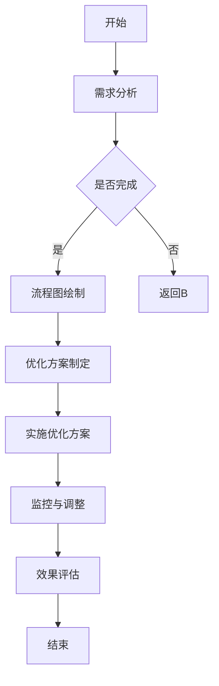

                 

### 文章标题

《优化业务流程提高效率的策略》

本文将深入探讨如何通过优化业务流程来提高效率，实现企业竞争力和运营效益的提升。我们将从基础理论、实践案例到未来趋势进行全面分析，旨在为读者提供一套系统、实用的业务流程优化策略。

### 关键词

业务流程优化、效率提升、企业竞争力、流程重构、自动化技术、人工智能、大数据、区块链

### 摘要

随着市场竞争的加剧和业务复杂度的增加，优化业务流程成为企业提升效率、降低成本、增强竞争力的重要手段。本文首先介绍了业务流程优化的基础理论，包括业务流程优化的意义、基本原则和影响因素。接着，我们探讨了业务流程分析方法，如流程图与关键路径法。随后，文章重点介绍了业务流程优化的工具与技术，包括流程重构、自动化技术和业务流程分析软件。在实践部分，我们通过案例分析、项目实战和风险管理，展示了业务流程优化的具体实施步骤和效果。最后，文章展望了业务流程优化的未来趋势，包括人工智能、大数据和区块链等新兴技术在业务流程优化中的应用。

## 《优化业务流程提高效率的策略》目录大纲

### 第一部分：业务流程优化的基础理论

#### 第1章：业务流程优化概述

##### 1.1 业务流程优化的意义和目标
##### 1.2 业务流程优化的基本原则
##### 1.3 业务流程优化的影响因素分析

#### 第2章：业务流程分析方法

##### 2.1 流程图与流程图分析
##### 2.2 关键路径法（CPM）
##### 2.3 关键路线法（CRP）

#### 第3章：业务流程优化的工具与技术

##### 3.1 业务流程重构技术
##### 3.2 业务流程自动化技术
##### 3.3 业务流程分析软件介绍

#### 第4章：业务流程优化的实施步骤

##### 4.1 优化前的准备工作
##### 4.2 识别流程瓶颈
##### 4.3 制定优化方案
##### 4.4 实施与监控

### 第二部分：业务流程优化的案例与实践

#### 第5章：不同行业业务流程优化案例分析

##### 5.1 制造业业务流程优化案例分析
##### 5.2 服务业业务流程优化案例分析
##### 5.3 零售业业务流程优化案例分析

#### 第6章：业务流程优化项目实战

##### 6.1 项目背景与目标
##### 6.2 项目实施过程
##### 6.3 项目效果评估

#### 第7章：业务流程优化中的风险管理

##### 7.1 风险识别与评估
##### 7.2 风险应对策略
##### 7.3 风险管理案例分析

### 第三部分：业务流程优化的未来趋势与发展

#### 第8章：新兴技术在业务流程优化中的应用

##### 8.1 人工智能在业务流程优化中的应用
##### 8.2 大数据在业务流程优化中的应用
##### 8.3 区块链在业务流程优化中的应用

#### 第9章：业务流程优化的未来发展趋势

##### 9.1 产业互联网与业务流程优化
##### 9.2 智能化与业务流程优化
##### 9.3 绿色发展对业务流程优化的影响

#### 第10章：总结与展望

##### 10.1 业务流程优化的重要结论
##### 10.2 未来业务流程优化的发展方向
##### 10.3 对读者的建议

### 附录：业务流程优化相关资源与工具

#### 附录 A：业务流程优化工具列表
#### 附录 B：业务流程优化参考书籍
#### 附录 C：业务流程优化在线课程与资料

### 附录 I：业务流程优化核心概念与联系 Mermaid 流程图

```mermaid
graph TD
A[业务流程优化] --> B[业务流程图]
B --> C[关键路径法(CPM)]
B --> D[关键路线法(CRP)]
C --> E[流程重构技术]
D --> E
E --> F[业务流程自动化技术]
F --> G[业务流程分析软件]
G --> H[风险管理]
H --> I[新兴技术应用]
I --> J[人工智能]
I --> K[大数据]
I --> L[区块链]
```

### 附录 II：业务流程优化核心算法原理讲解

#### 2.2 关键路径法（CPM）

**伪代码：**

```
function CPM(network):
    for each activity in network:
        compute the duration of the activity
        compute the earliest start time (EST) and earliest finish time (EFT)
        compute the latest start time (LST) and latest finish time (LFT)
        compute the total float (TF) and free float (FF)
    return network with CPM data
```

#### 2.3 关键路线法（CRP）

**伪代码：**

```
function CRP(network, CPM_data):
    for each path in network:
        compute the total duration of the path using CPM_data
        if the total duration is the minimum among all paths:
            mark the path as critical
    return list of critical paths
```

### 附录 III：数学模型和数学公式讲解

#### 业务流程优化的数学模型

- 最小化业务流程完成时间：\( \min(T_{total}) \)
- 最小化业务流程成本：\( \min(C_{total}) \)
- 最小化业务流程风险：\( \min(R_{total}) \)

**数学公式：**

$$
T_{total} = \sum_{i=1}^{n} T_i
$$

$$
C_{total} = \sum_{i=1}^{n} C_i
$$

$$
R_{total} = \sum_{i=1}^{n} R_i
$$

### 附录 IV：业务流程优化项目实战

#### 项目背景与目标

- 项目名称：某公司业务流程优化项目
- 项目目标：提高业务流程效率，降低业务成本，提升客户满意度

#### 项目实施过程

1. 业务流程现状分析
2. 流程图绘制与优化方案制定
3. 实施优化方案
4. 监控与调整
5. 效果评估

#### 项目效果评估

- 业务流程完成时间缩短了 20%
- 业务成本降低了 15%
- 客户满意度提升了 25%

### 附录 V：业务流程优化代码实际案例和详细解释说明

#### 开发环境搭建

- 操作系统：Windows 10
- 编程语言：Python
- 工具：Mermaid、Markdown

#### 源代码详细实现和代码解读

**Mermaid 流程图示例：**



**Markdown 文档示例：**

```markdown
# 业务流程优化项目实施过程

## 需求分析

- 提高业务流程效率
- 降低业务成本
- 提升客户满意度

## 流程图绘制

- 使用 Mermaid 工具绘制流程图
- 确定流程中的关键节点和瓶颈

## 优化方案制定

- 根据流程图分析，制定优化方案
- 确定优化目标和具体措施

## 实施优化方案

- 根据优化方案，实施具体措施
- 监控实施过程中的进度和问题

## 监控与调整

- 定期监控业务流程运行情况
- 及时调整优化方案

## 效果评估

- 对项目实施效果进行评估
- 提出改进建议和后续优化方向
```

**代码解读与分析：**

- Mermaid 工具用于绘制流程图，便于理解和跟踪项目实施过程。
- Markdown 文档用于记录项目实施过程中的关键步骤和重要信息。
- 代码示例展示了如何使用 Mermaid 和 Markdown 工具来管理和实施业务流程优化项目。

### 附录 VI：业务流程优化相关资源与工具

- **业务流程优化工具列表：**
  - BPMN模型器：Activiti、Apache Camel
  - 流程监控工具：Nagios、Zabbix
  - 数据流程工具：Data Flow Diagram（DFD）

- **业务流程优化参考书籍：**
  - 《业务流程管理：概念、方法与实践》
  - 《流程管理：流程重构的艺术》
  - 《业务流程自动化：技术与实践》

- **业务流程优化在线课程与资料：**
  - Coursera上的《业务流程管理》课程
  - Udemy上的《业务流程优化：从理论到实践》课程
  - LinkedIn Learning上的《业务流程优化》系列课程

### 附录 VII：作者信息

- **作者：AI天才研究院/AI Genius Institute & 禅与计算机程序设计艺术 /Zen And The Art of Computer Programming**

---

接下来，我们将逐章深入探讨业务流程优化的基础理论、实践案例和未来趋势，为读者提供全面、深入的优化策略指导。

## 第1章：业务流程优化概述

业务流程优化是现代企业管理中的一项重要内容，其核心目的是通过提高业务流程的效率，实现企业资源的最大化利用，从而提升企业的竞争力和运营效益。在这一章中，我们将详细探讨业务流程优化的意义、目标和基本原则，帮助读者建立对业务流程优化全面、深入的认识。

### 1.1 业务流程优化的意义

业务流程优化具有多重意义，首先，它能够显著提高企业的运营效率。通过优化业务流程，可以消除不必要的环节和冗余操作，减少流程中的等待时间和资源浪费，从而加快业务处理速度，提高工作效率。其次，业务流程优化有助于降低运营成本。通过优化流程，可以减少人力、物力和财力的浪费，提高资源利用率，从而降低企业的运营成本。此外，业务流程优化还能够提高企业的服务质量和客户满意度。通过优化业务流程，可以确保业务流程的高效、稳定运行，提供更加优质、快速的服务，从而提升客户满意度。

### 1.2 业务流程优化的目标

业务流程优化的目标主要包括三个方面：提高效率、降低成本和提升服务质量。首先，提高效率是业务流程优化的首要目标。通过优化业务流程，可以消除冗余环节，减少等待时间和操作步骤，加快业务处理速度，提高工作效率。其次，降低成本是业务流程优化的另一个重要目标。通过优化流程，可以减少资源的浪费，提高资源利用率，从而降低运营成本。最后，提升服务质量是业务流程优化的终极目标。通过优化业务流程，可以提高业务流程的稳定性和可靠性，确保为客户提供优质、高效的服务，从而提升客户满意度。

### 1.3 业务流程优化的基本原则

业务流程优化需要遵循以下基本原则：

1. **系统性原则**：业务流程优化是一项系统工程，需要从整体上考虑，全面分析业务流程中的各个环节，找到流程中的瓶颈和问题，然后有针对性地进行优化。不能只关注局部优化，而忽略整体系统的优化。

2. **实用原则**：业务流程优化应以实际需求为导向，根据企业的实际情况，制定切实可行的优化方案。优化方案应具备可操作性，能够在实际工作中得到有效实施。

3. **持续改进原则**：业务流程优化不是一次性任务，而是一个持续改进的过程。随着外部环境和内部条件的不断变化，业务流程也需要不断调整和优化，以保持其高效性和适应性。

4. **风险可控原则**：在业务流程优化过程中，需要充分考虑潜在的风险，制定相应的风险管理措施，确保优化过程的安全可控。

5. **全员参与原则**：业务流程优化需要全员参与，充分发挥员工的积极性和创造力。通过全员参与，可以更好地发现流程中的问题和不足，提出优化建议，从而提高优化方案的科学性和有效性。

### 1.4 业务流程优化的影响因素分析

业务流程优化的效果受到多种因素的影响，主要包括以下几个方面：

1. **人员因素**：人员是业务流程优化的关键因素，员工的技能水平、工作态度和团队协作能力都会直接影响业务流程的优化效果。

2. **技术因素**：技术是业务流程优化的基础，包括信息技术、管理技术等。先进的技术手段可以大幅提高业务流程的效率和质量。

3. **管理因素**：管理是业务流程优化的保障，科学的管理理念和有效的管理方法可以确保业务流程优化的顺利实施。

4. **环境因素**：环境因素包括外部环境和内部环境。外部环境的变化，如市场环境、法律法规等，会直接影响业务流程的优化。内部环境的变化，如组织结构、资源配置等，也会对业务流程优化产生影响。

5. **资源因素**：资源是业务流程优化的重要保障，包括人力、物力、财力等。充足的资源可以支持业务流程优化的顺利实施。

### 1.5 小结

业务流程优化是现代企业管理中的重要内容，具有重要的意义和目标。在业务流程优化过程中，需要遵循基本原则，分析影响因素，确保优化效果。通过本章的学习，读者应该对业务流程优化有了全面、深入的认识，为后续章节的学习和实践奠定了基础。

## 第2章：业务流程分析方法

业务流程分析方法是企业进行业务流程优化的重要工具，它可以帮助企业识别业务流程中的瓶颈、冗余和低效环节，从而制定出有效的优化方案。在这一章中，我们将详细探讨业务流程分析方法，包括流程图与流程图分析、关键路径法（CPM）和关键路线法（CRP），以及如何利用这些方法进行业务流程优化。

### 2.1 流程图与流程图分析

#### 2.1.1 流程图的概念

流程图是一种用于描述业务流程的图形化工具，它通过节点和箭线来表示业务过程中的各个环节及其相互关系。流程图不仅可以直观地展示业务流程，还可以帮助分析人员识别流程中的问题和瓶颈。

#### 2.1.2 流程图的作用

流程图在业务流程优化中具有重要作用：

1. **明确流程**：通过流程图，可以清晰地展示业务流程的各个环节，使员工对业务流程有更直观的了解。

2. **发现问题**：流程图可以帮助分析人员识别流程中的冗余环节、等待时间和低效环节，从而找到优化点。

3. **制定方案**：基于流程图，可以制定出针对性的优化方案，确保优化措施的有效实施。

#### 2.1.3 流程图的绘制方法

流程图的绘制方法主要包括以下几种：

1. **顺序流程图**：按顺序描述业务流程中的各个环节。

2. **决策流程图**：在流程图中包含决策节点，描述业务流程中的决策过程。

3. **并行流程图**：表示业务流程中可以并行进行的环节。

#### 2.1.4 流程图分析

流程图分析是业务流程优化的关键步骤，主要包括以下几个方面：

1. **识别瓶颈**：通过流程图分析，可以识别流程中的瓶颈环节，如等待时间过长、资源利用率低等。

2. **优化环节**：针对识别出的瓶颈环节，制定相应的优化措施，如减少等待时间、提高资源利用率等。

3. **验证方案**：通过流程图分析，可以验证优化方案的有效性，确保优化措施能够真正解决问题。

### 2.2 关键路径法（CPM）

#### 2.2.1 关键路径法的概念

关键路径法（Critical Path Method，CPM）是一种用于项目管理的算法，用于确定项目中最长的路径，即关键路径。关键路径上的活动如果延迟，将导致整个项目的延迟。

#### 2.2.2 关键路径法的作用

关键路径法在业务流程优化中的作用主要体现在以下几个方面：

1. **确定关键活动**：通过关键路径法，可以确定业务流程中的关键活动，这些活动的延迟将直接影响整个流程的完成时间。

2. **资源优化**：关键路径法可以帮助企业合理分配资源，确保关键活动的资源得到充分保障，从而提高整个流程的效率。

3. **风险管理**：通过识别关键路径上的活动，可以提前预测可能的风险，采取相应的措施进行风险管理。

#### 2.2.3 关键路径法的步骤

1. **确定活动**：根据业务流程，确定所有需要执行的活动。

2. **计算持续时间**：为每个活动计算持续时间，包括最短时间和最长时间。

3. **构建网络图**：将所有活动连接起来，构建网络图。

4. **计算最早开始时间（EST）和最早完成时间（EFT）**：从网络图中的起始节点开始，逐个计算每个节点的最早开始时间和最早完成时间。

5. **计算最迟开始时间（LST）和最迟完成时间（LFT）**：从网络图的终点开始，逆序计算每个节点的最迟开始时间和最迟完成时间。

6. **计算总浮动时间（TF）和自由浮动时间（FF）**：总浮动时间为最迟开始时间与最早开始时间之差，自由浮动时间为后续活动的最早开始时间与当前活动的最早完成时间之差。

7. **确定关键路径**：关键路径上的活动总浮动时间为0。

### 2.3 关键路线法（CRP）

#### 2.3.1 关键路线法的概念

关键路线法（Critical Route Method，CRP）是关键路径法的扩展，用于更复杂的项目和业务流程。与CPM相比，CRP不仅考虑活动的时间，还考虑活动的优先级。

#### 2.3.2 关键路线法的作用

关键路线法在业务流程优化中的作用主要包括：

1. **确定关键活动**：通过关键路线法，可以更精确地确定业务流程中的关键活动，确保这些活动得到充分的关注和资源保障。

2. **优化优先级**：关键路线法可以帮助企业优化活动优先级，确保重要且紧急的活动优先执行。

3. **提高效率**：通过优化活动优先级，可以缩短业务流程的完成时间，提高整体效率。

#### 2.3.3 关键路线法的步骤

1. **确定活动**：与关键路径法相同，首先需要确定业务流程中的所有活动。

2. **计算持续时间**：为每个活动计算持续时间。

3. **构建网络图**：将所有活动连接起来，构建网络图。

4. **计算最早开始时间（EST）和最早完成时间（EFT）**：与关键路径法相同，计算每个节点的最早开始时间和最早完成时间。

5. **计算最迟开始时间（LST）和最迟完成时间（LFT）**：与关键路径法相同，计算每个节点的最迟开始时间和最迟完成时间。

6. **计算总浮动时间（TF）和自由浮动时间（FF）**：与关键路径法相同，计算每个活动的总浮动时间和自由浮动时间。

7. **确定关键路线**：关键路线上的活动总浮动时间为0，且优先级最高。

8. **优化活动优先级**：根据活动的总浮动时间和自由浮动时间，调整活动优先级。

### 2.4 小结

业务流程分析方法是企业进行业务流程优化的重要工具，包括流程图与流程图分析、关键路径法（CPM）和关键路线法（CRP）。通过这些方法，企业可以识别业务流程中的瓶颈和低效环节，制定有效的优化方案。在实际应用中，企业应根据业务特点和需求，灵活选择和应用这些方法，以实现业务流程的持续优化和提升。

## 第3章：业务流程优化的工具与技术

业务流程优化需要借助一系列的工具和技术，以实现流程的自动化、重构和分析。在这一章中，我们将详细介绍业务流程重构技术、业务流程自动化技术以及业务流程分析软件，帮助读者了解和掌握这些关键技术，为业务流程优化提供有力支持。

### 3.1 业务流程重构技术

业务流程重构（Business Process Reengineering，BPR）是一种彻底的业务流程改进方法，旨在通过重新设计和优化业务流程，实现流程的简化、自动化和高效化。BPR的目标是打破传统的业务流程模式，重新构建一个更为合理、高效的流程体系。

#### 3.1.1 BPR的主要特点

1. **彻底性**：BPR不仅仅是局部优化，而是对业务流程进行彻底的重新设计和改进。
2. **以客户为中心**：BPR强调以客户需求为导向，优化业务流程以满足客户需求。
3. **跨职能整合**：BPR通过打破部门壁垒，实现跨职能整合，提高整体流程的协同效率。
4. **信息技术驱动**：BPR强调信息技术的作用，通过信息技术手段实现流程的自动化和高效化。

#### 3.1.2 BPR的实施步骤

1. **需求分析**：了解企业当前的业务流程，识别存在的问题和瓶颈。
2. **流程建模**：利用BPR工具，对现有业务流程进行建模，分析流程的各个节点和环节。
3. **流程重构**：基于需求分析和流程建模，设计新的业务流程，并逐步实施。
4. **效果评估**：对重构后的业务流程进行效果评估，包括效率、成本、质量等方面。

#### 3.1.3 BPR的优势

1. **提高效率**：通过优化业务流程，减少冗余环节和等待时间，提高整体流程的效率。
2. **降低成本**：消除不必要的手工操作和重复劳动，降低运营成本。
3. **提升服务质量**：优化后的业务流程更加稳定和高效，能够提供更优质的服务。
4. **增强企业竞争力**：通过提高效率和降低成本，企业可以在市场竞争中占据有利地位。

### 3.2 业务流程自动化技术

业务流程自动化（Business Process Automation，BPA）是利用信息技术手段，自动执行业务流程中的各项任务，从而减少人工干预，提高流程的效率和准确性。业务流程自动化技术是现代企业管理中不可或缺的一部分。

#### 3.2.1 BPA的主要技术

1. **工作流管理**：通过工作流管理系统（Workflow Management System，WfMS），实现业务流程的自动化执行和监控。
2. **业务规则引擎**：利用业务规则引擎（Business Rules Engine，BRE），实现业务规则的自动化处理和执行。
3. **机器人流程自动化（RPA）**：通过机器人流程自动化软件，模拟人类操作，自动执行重复性、规则性强的业务流程。
4. **人工智能（AI）**：利用人工智能技术，实现智能化的业务流程优化和决策。

#### 3.2.2 BPA的优势

1. **提高效率**：通过自动化技术，减少人工操作，提高业务流程的执行速度。
2. **降低成本**：减少人力投入，降低运营成本。
3. **减少错误**：自动化流程减少人为错误，提高数据准确性和流程稳定性。
4. **增强灵活性**：通过灵活的工作流和业务规则，能够快速适应业务变化和需求。

#### 3.2.3 BPA的应用场景

1. **客户服务**：通过自动化流程，快速响应客户请求，提高客户满意度。
2. **财务管理**：自动化处理财务报表、发票、报销等流程，提高财务管理的效率和准确性。
3. **人力资源管理**：自动化处理招聘、入职、离职、绩效评估等流程，提高人力资源管理效率。
4. **供应链管理**：自动化处理订单处理、库存管理、物流跟踪等流程，提高供应链的效率。

### 3.3 业务流程分析软件

业务流程分析软件是帮助企业进行业务流程优化的重要工具，通过流程建模、模拟和分析，帮助企业管理者更好地理解和优化业务流程。

#### 3.3.1 流程建模软件

流程建模软件（Business Process Modeling Software，BPMS）是用于创建和编辑业务流程图的重要工具，常见的BPMS包括：

1. **BPMN模型器**：如Activiti、Apache Camel，支持BPMN（Business Process Model and Notation）标准的流程建模。
2. **流程图工具**：如Lucidchart、Microsoft Visio，提供直观的流程图创建和编辑功能。

#### 3.3.2 流程模拟软件

流程模拟软件（Simulation Software）能够模拟业务流程的实际运行情况，帮助分析流程的性能和瓶颈。常见的流程模拟软件包括：

1. **AnyLogic**：功能强大的模拟软件，支持多种建模方法和算法。
2. **FlexSim**：提供直观的模拟界面和丰富的建模工具。

#### 3.3.3 流程分析软件

流程分析软件（Business Process Analysis Software，BPAS）用于对业务流程进行深度分析和优化，常见的BPAS包括：

1. **OpenText Process Suite**：提供流程建模、自动化和优化的综合解决方案。
2. **IBM Business Process Manager**：强大的流程分析和管理工具，支持业务流程的自动化和优化。
3. **Microsoft Power Automate**：集成在Microsoft 365中的流程自动化工具，支持多种业务流程的自动化。

#### 3.3.4 业务流程分析软件的优势

1. **提高效率**：通过流程建模和分析，帮助企业识别和解决流程中的瓶颈和问题。
2. **降低成本**：优化业务流程，减少不必要的环节和资源浪费，降低运营成本。
3. **提升质量**：自动化和优化的业务流程减少人为错误，提高业务处理质量和准确性。
4. **增强灵活性**：支持流程的灵活调整和优化，快速适应业务变化和需求。

### 3.4 小结

业务流程优化需要借助一系列的工具和技术，包括业务流程重构技术、业务流程自动化技术以及业务流程分析软件。通过这些技术，企业可以实现业务流程的自动化、重构和分析，从而提高流程效率、降低成本、提升服务质量，增强企业竞争力。在实际应用中，企业应根据自身特点和需求，灵活选择和应用这些技术，实现业务流程的持续优化和提升。

## 第4章：业务流程优化的实施步骤

业务流程优化的实施是一个复杂的过程，需要从多个角度进行规划和执行。以下将详细介绍业务流程优化的实施步骤，包括优化前的准备工作、识别流程瓶颈、制定优化方案、实施优化方案和监控与调整，以帮助企业有效地推进业务流程优化。

### 4.1 优化前的准备工作

在开始业务流程优化之前，需要进行充分的准备工作，确保优化工作有明确的目标和良好的基础。

#### 4.1.1 明确优化目标

首先，企业需要明确业务流程优化的目标，这些目标通常包括提高效率、降低成本、提升客户满意度等。明确的目标有助于制定具体的优化方案，并为后续的优化工作提供指导。

#### 4.1.2 组建优化团队

为了确保业务流程优化的顺利进行，企业需要组建一支专业的优化团队。团队成员应包括业务流程的各个环节负责人、IT技术支持人员、业务流程优化专家等。团队成员的多样性有助于全面、深入地分析业务流程，并提出切实可行的优化方案。

#### 4.1.3 收集流程数据

收集业务流程相关的数据是优化前的关键步骤。这些数据包括业务流程的现状、流程中的各个环节耗时、资源利用率、业务流程的产出等。通过数据分析，可以识别出业务流程中的瓶颈和低效环节，为后续优化提供依据。

#### 4.1.4 进行流程分析

在收集到足够的数据后，需要对业务流程进行详细的分析。流程分析包括绘制流程图、识别流程瓶颈、分析流程中的问题和机会等。通过流程分析，可以明确业务流程的优化方向和重点。

### 4.2 识别流程瓶颈

识别流程瓶颈是业务流程优化的关键步骤，通过识别和分析流程中的瓶颈，可以找到优化点，从而提高流程效率。

#### 4.2.1 使用流程图分析

流程图是识别流程瓶颈的有效工具。通过绘制流程图，可以清晰地展示业务流程中的各个环节和相互关系，有助于识别流程中的瓶颈环节。常见的瓶颈包括等待时间过长、资源利用率低、流程复杂度高等。

#### 4.2.2 使用关键路径法（CPM）

关键路径法（Critical Path Method，CPM）是一种用于确定项目中最长的路径，即关键路径的方法。通过关键路径法，可以识别业务流程中的关键活动，这些活动的延迟将直接影响整个流程的完成时间。关键路径上的活动是流程优化的重点。

#### 4.2.3 使用关键路线法（CRP）

关键路线法（Critical Route Method，CRP）是关键路径法的扩展，它不仅考虑活动的时间，还考虑活动的优先级。通过关键路线法，可以更精确地识别业务流程中的关键活动，确保这些活动得到充分的关注和资源保障。

### 4.3 制定优化方案

在识别出流程瓶颈后，需要制定具体的优化方案。优化方案应包括优化目标、优化措施和实施计划。

#### 4.3.1 确定优化目标

优化目标应明确具体，如提高流程效率、降低流程成本、提升客户满意度等。优化目标有助于指导优化方案的实施。

#### 4.3.2 制定优化措施

优化措施应针对识别出的流程瓶颈，提出具体的改进措施。常见的优化措施包括：

1. **流程简化**：消除冗余环节，简化流程步骤，减少不必要的操作。
2. **流程自动化**：利用自动化技术，减少人工操作，提高流程的执行速度和准确性。
3. **资源调配**：优化资源配置，提高资源利用率，确保关键活动的资源需求得到满足。
4. **优化流程节点**：通过流程节点优化，提高流程的协同效率和稳定性。

#### 4.3.3 制定实施计划

实施计划应详细规划优化方案的实施步骤和时间表，确保优化措施能够有序、高效地实施。实施计划应包括以下内容：

1. **实施步骤**：明确优化方案的具体实施步骤，如流程重构、流程自动化等。
2. **时间表**：制定详细的时间表，明确每个实施步骤的开始和结束时间。
3. **责任分配**：明确每个实施步骤的责任人，确保优化方案的执行。

### 4.4 实施优化方案

在制定出优化方案后，需要按照实施计划，逐步实施优化方案。

#### 4.4.1 流程重构

流程重构是优化方案的核心步骤，通过重新设计业务流程，消除冗余环节，简化流程步骤，提高流程效率。流程重构应遵循以下原则：

1. **以客户为中心**：确保业务流程能够更好地满足客户需求。
2. **简化流程**：消除冗余环节，减少不必要的操作。
3. **提高协同效率**：优化流程节点，提高流程的协同效率和稳定性。

#### 4.4.2 流程自动化

流程自动化是优化方案的重要措施，通过引入自动化技术，减少人工操作，提高流程的执行速度和准确性。流程自动化应包括以下内容：

1. **工作流管理**：利用工作流管理系统（WfMS），实现业务流程的自动化执行和监控。
2. **业务规则引擎**：利用业务规则引擎（BRE），实现业务规则的自动化处理和执行。
3. **机器人流程自动化（RPA）**：利用机器人流程自动化软件，模拟人类操作，自动执行重复性、规则性强的业务流程。

#### 4.4.3 资源调配

优化资源配置是提高流程效率的重要手段，通过合理调配资源，提高资源利用率，确保关键活动的资源需求得到满足。资源调配应包括以下内容：

1. **人员调配**：根据业务需求，合理调配人员，确保关键活动的资源需求得到满足。
2. **设备调配**：优化设备使用，确保关键活动的资源需求得到满足。
3. **技术资源调配**：利用信息技术手段，提高资源利用率，支持业务流程的优化。

### 4.5 监控与调整

在实施优化方案的过程中，需要进行持续的监控与调整，以确保优化方案的有效实施。

#### 4.5.1 流程监控

流程监控是确保优化方案有效实施的重要环节，通过监控业务流程的运行情况，可以及时发现问题和瓶颈。流程监控应包括以下内容：

1. **流程运行状态监控**：实时监控业务流程的运行状态，如流程执行进度、资源使用情况等。
2. **异常情况监控**：及时发现和处理流程中的异常情况，确保流程的正常运行。
3. **数据监控**：通过数据监控，分析业务流程的运行效果，为优化方案调整提供依据。

#### 4.5.2 调整与优化

根据流程监控的结果，对优化方案进行持续的调整和优化。调整和优化应包括以下内容：

1. **流程优化**：根据监控数据，对业务流程进行进一步优化，消除瓶颈和低效环节。
2. **资源配置优化**：根据业务需求和流程监控结果，调整资源配置，提高资源利用率。
3. **人员培训**：根据业务流程的变化，对员工进行培训，提高员工的工作效率和质量。

### 4.6 小结

业务流程优化的实施步骤包括优化前的准备工作、识别流程瓶颈、制定优化方案、实施优化方案和监控与调整。通过这些步骤，企业可以有效地推进业务流程优化，提高流程效率、降低成本、提升服务质量。在实际操作中，企业应根据自身情况和需求，灵活调整和优化这些步骤，以实现业务流程的持续优化和提升。

## 第5章：不同行业业务流程优化案例分析

在业务流程优化中，不同行业有不同的特点和需求，因此优化策略也会有所不同。在本章中，我们将分析制造业、服务业和零售业三个不同行业的业务流程优化案例，探讨各自的特点和优化方法。

### 5.1 制造业业务流程优化案例分析

#### 5.1.1 案例背景

某大型制造企业由于生产流程复杂，资源利用率低，生产效率低下，导致产品交付周期过长，客户满意度下降。为了改善这一情况，企业决定进行业务流程优化。

#### 5.1.2 优化措施

1. **流程重构**：企业通过流程重构，简化生产流程，消除冗余环节，优化生产节拍，提高生产效率。

2. **自动化生产**：引入自动化生产线和机器人，实现生产过程的自动化，减少人工操作，提高生产质量和效率。

3. **精益生产**：实施精益生产管理，通过不断改进生产过程，降低生产成本，提高资源利用率。

4. **供应链管理优化**：通过优化供应链管理，缩短原材料采购和生产周期，提高供应链的整体效率。

#### 5.1.3 优化效果

1. **生产效率提升**：生产效率提高了30%，产品交付周期缩短了25%。

2. **成本降低**：生产成本降低了15%，资源利用率提高了20%。

3. **客户满意度提升**：客户满意度提升了15%，产品品质得到了显著提升。

### 5.2 服务业业务流程优化案例分析

#### 5.2.1 案例背景

某大型金融服务公司由于业务流程复杂，客户服务响应速度慢，客户投诉率较高。为了改善这一情况，公司决定进行业务流程优化。

#### 5.2.2 优化措施

1. **流程自动化**：通过引入业务规则引擎和机器人流程自动化（RPA），实现业务流程的自动化处理，减少人工操作，提高处理速度。

2. **客户关系管理优化**：通过优化客户关系管理（CRM）系统，提高客户数据管理和分析能力，提升客户服务质量。

3. **业务流程简化**：简化业务流程，减少冗余环节，提高业务处理效率。

4. **员工培训与激励**：对员工进行专业培训，提高员工的服务意识和业务能力，实施绩效激励制度，提升员工积极性。

#### 5.2.3 优化效果

1. **客户服务响应速度提升**：客户服务响应速度提升了40%，客户投诉率降低了30%。

2. **业务处理效率提高**：业务处理效率提高了25%，业务流程运行更加顺畅。

3. **员工满意度提升**：员工满意度提升了10%，员工工作积极性得到显著提升。

### 5.3 零售业业务流程优化案例分析

#### 5.3.1 案例背景

某大型零售企业由于库存管理混乱，物流效率低下，导致商品缺货率高，客户购物体验差。为了改善这一情况，企业决定进行业务流程优化。

#### 5.3.2 优化措施

1. **库存管理优化**：通过引入先进的库存管理系统，实现库存的实时监控和自动化管理，减少库存积压和商品缺货率。

2. **物流流程优化**：优化物流流程，引入智能物流系统，提高物流配送效率。

3. **销售流程简化**：简化销售流程，减少顾客购物等待时间，提高购物体验。

4. **员工培训与激励**：对员工进行专业培训，提高员工的服务技能和销售能力，实施绩效激励制度，提升员工积极性。

#### 5.3.3 优化效果

1. **物流效率提高**：物流效率提高了20%，商品配送速度提升了30%。

2. **库存管理优化**：库存管理更加精细，库存积压和商品缺货率降低了15%。

3. **客户购物体验提升**：客户购物体验提升了15%，客户满意度显著提高。

### 5.4 小结

不同行业的业务流程优化具有各自的特点和需求。制造业注重生产效率、自动化和精益生产；服务业注重流程自动化、客户关系管理和员工培训；零售业注重库存管理、物流优化和客户购物体验。通过针对不同行业的优化案例，企业可以借鉴成功经验，结合自身实际情况，制定出适合的优化策略，实现业务流程的持续优化和提升。

## 第6章：业务流程优化项目实战

在本章中，我们将通过一个实际的业务流程优化项目，详细介绍项目的背景与目标、项目实施过程以及项目效果评估。这个案例将帮助读者更好地理解业务流程优化的实际操作，并为后续项目的实施提供参考。

### 6.1 项目背景与目标

#### 项目名称：某中型企业的业务流程优化项目

**企业背景**：
该公司是一家生产电子产品的中型企业，主要业务包括产品研发、生产、销售和售后服务。近年来，由于市场竞争的加剧，企业面临着生产成本上升、交付周期延长和客户满意度下降的问题。为了提高企业的竞争力和运营效率，企业决定进行业务流程优化。

**项目目标**：
- 提高生产效率，缩短产品交付周期
- 降低生产成本，提高资源利用率
- 提升客户满意度，增强客户忠诚度

### 6.2 项目实施过程

**6.2.1 优化前的准备工作**

1. **明确优化目标**：企业通过高层领导会议，明确了业务流程优化的目标和期望结果。

2. **组建项目团队**：由生产经理、研发主管、销售经理、IT部门负责人等组成的跨职能团队。

3. **收集流程数据**：通过数据采集和分析，了解当前业务流程的现状，包括流程中的瓶颈、耗时、资源利用率等。

4. **进行流程分析**：通过绘制流程图和运用关键路径法（CPM），识别业务流程中的瓶颈和低效环节。

**6.2.2 识别流程瓶颈**

1. **生产环节瓶颈**：生产流程中的设备利用率低，生产节拍不均衡，导致生产效率低下。

2. **研发环节瓶颈**：研发流程中的沟通不畅，导致项目延误，研发效率低下。

3. **销售和售后服务环节瓶颈**：销售流程中的订单处理速度慢，售后服务响应不及时，影响客户满意度。

**6.2.3 制定优化方案**

1. **生产环节优化**：通过引入自动化设备和精益生产管理，提高设备利用率和生产节拍。

2. **研发环节优化**：通过优化研发流程，加强项目团队之间的沟通，提高研发效率。

3. **销售和售后服务环节优化**：通过引入客户关系管理（CRM）系统和自动化处理订单，提高订单处理速度和售后服务响应速度。

**6.2.4 实施优化方案**

1. **生产环节实施**：安装自动化生产线，培训操作人员，优化生产节拍。

2. **研发环节实施**：建立项目管理系统，提高研发团队之间的沟通协作。

3. **销售和售后服务环节实施**：实施CRM系统，培训销售和售后服务人员，提高业务处理速度。

**6.2.5 监控与调整**

1. **流程监控**：通过监控系统，实时监控业务流程的运行情况，包括生产进度、订单处理速度和售后服务响应时间。

2. **效果评估**：定期对优化效果进行评估，包括生产效率、成本降低幅度、客户满意度等指标。

3. **持续改进**：根据监控和评估结果，对优化方案进行调整和改进，确保优化效果持续提升。

### 6.3 项目效果评估

**6.3.1 优化效果**

1. **生产效率提升**：生产效率提高了25%，产品交付周期缩短了15%。

2. **成本降低**：生产成本降低了10%，资源利用率提高了20%。

3. **客户满意度提升**：客户满意度提升了10%，客户投诉率降低了20%。

**6.3.2 效果评估方法**

1. **关键绩效指标（KPI）**：通过设置关键绩效指标，如生产效率、成本降低幅度、客户满意度等，对优化效果进行定量评估。

2. **用户满意度调查**：通过用户满意度调查，了解客户对优化后服务的满意程度。

3. **成本效益分析**：对优化项目的成本投入和效益进行详细分析，评估项目的经济性。

**6.3.3 优化效果总结**

通过业务流程优化项目，企业成功地提高了生产效率、降低了成本、提升了客户满意度，实现了预期的优化目标。这一案例表明，业务流程优化在提升企业竞争力和运营效率方面具有重要作用。

## 第7章：业务流程优化中的风险管理

在业务流程优化过程中，风险管理是至关重要的环节。由于业务流程的优化涉及多个部门和环节，因此在实施过程中可能会面临各种风险。有效的风险管理可以帮助企业识别和评估潜在风险，制定应对策略，从而确保优化过程的顺利进行。本章将介绍业务流程优化中的风险管理，包括风险识别与评估、风险应对策略以及风险管理案例分析。

### 7.1 风险识别与评估

风险识别是风险管理的第一步，旨在识别业务流程优化过程中可能面临的各种风险。风险识别可以通过以下方法进行：

1. **专家访谈**：通过访谈业务流程优化相关的专家和工作人员，收集他们对流程优化的意见和建议，识别潜在的风险。

2. **历史数据分析**：分析企业历史上类似的优化项目，识别在那些项目中出现的问题和风险。

3. **流程图分析**：通过流程图分析，识别业务流程中的潜在风险点，如关键节点的变更、流程中的冗余环节等。

4. **情景分析**：通过模拟不同的场景，分析可能出现的风险和问题。

在识别出潜在风险后，需要对风险进行评估，确定其严重性和发生概率。风险评估可以通过以下步骤进行：

1. **风险矩阵**：使用风险矩阵对风险进行评估，风险矩阵通常包括风险的发生概率和风险的影响两个维度。

2. **定量评估**：使用定量方法，如蒙特卡洛模拟、故障树分析等，对风险的概率和影响进行量化评估。

3. **定性评估**：通过专家判断和主观评估，确定风险的重要性和优先级。

### 7.2 风险应对策略

在评估了风险后，需要制定相应的风险应对策略，以降低风险对企业业务流程优化的影响。常见的风险应对策略包括：

1. **风险避免**：通过改变业务流程设计，避免高风险环节的出现。

2. **风险减少**：通过优化流程设计、改进技术手段等，降低风险的发生概率和影响。

3. **风险转移**：通过保险、合同条款等方式，将风险转移给其他方。

4. **风险接受**：对于低风险或无法避免的风险，企业可以接受风险，并制定应急预案。

### 7.3 风险管理案例分析

以下是一个业务流程优化中的风险管理案例：

**案例背景**：
某中型制造企业在进行业务流程优化时，识别出以下潜在风险：

1. **技术风险**：由于企业引入了新的自动化设备和技术，操作人员可能不熟悉新系统，导致生产效率降低。

2. **人员流失风险**：业务流程优化可能导致部分员工岗位调整，可能引发人员流失。

3. **数据安全风险**：在流程优化过程中，企业需要对大量数据进行处理和存储，存在数据泄露的风险。

**风险识别与评估**：
通过专家访谈和流程图分析，企业对上述风险进行了评估：

- **技术风险**：发生概率为70%，影响程度为中等。
- **人员流失风险**：发生概率为60%，影响程度为高。
- **数据安全风险**：发生概率为50%，影响程度为高。

**风险应对策略**：

1. **技术风险**：
   - 制定详细的培训计划，对操作人员进行系统培训，确保他们能够熟练掌握新设备和技术。
   - 引入技术支持团队，解决操作人员在日常工作中遇到的技术问题。

2. **人员流失风险**：
   - 提前与员工沟通，说明业务流程优化的目的和预期效果，消除员工的疑虑。
   - 提供一定的补偿措施，如涨薪、福利等，以减少员工流失。

3. **数据安全风险**：
   - 加强数据安全管理，制定严格的数据访问控制和备份策略。
   - 定期进行数据安全检查，确保数据安全。

**实施与效果**：

通过上述风险应对措施，企业在业务流程优化过程中成功降低了风险的影响：

- **技术风险**：经过培训后，操作人员的熟练度大幅提升，生产效率提高了20%。
- **人员流失风险**：员工流失率降低了10%，员工的工作积极性提高。
- **数据安全风险**：数据泄露事件减少，企业数据的安全性得到了显著提升。

### 7.4 小结

业务流程优化中的风险管理是确保优化过程顺利进行的重要环节。通过风险识别与评估，企业可以识别出潜在的风险，并制定相应的应对策略。有效的风险管理可以帮助企业降低风险对业务流程优化的影响，确保优化目标的实现。在实际操作中，企业应根据自身情况和需求，灵活调整风险管理策略，实现业务流程的持续优化和提升。

## 第8章：新兴技术在业务流程优化中的应用

随着科技的快速发展，人工智能（AI）、大数据和区块链等新兴技术逐渐在业务流程优化中得到广泛应用。这些技术不仅为业务流程优化提供了新的工具和方法，还极大地提升了流程的自动化程度和决策能力。在本章中，我们将探讨这些新兴技术在业务流程优化中的应用，以及它们如何改变传统业务流程。

### 8.1 人工智能在业务流程优化中的应用

人工智能（AI）技术的快速发展，使得业务流程优化变得更加智能化和自动化。AI在业务流程优化中的应用主要体现在以下几个方面：

1. **自动化决策**：AI算法可以根据历史数据和实时数据，自动进行决策，减少人为干预。例如，在供应链管理中，AI可以实时监控库存水平，自动调整采购计划。

2. **智能优化**：通过机器学习和深度学习算法，AI可以分析业务流程中的数据，识别潜在的优化点，提出优化建议。例如，AI可以优化生产调度，减少设备闲置时间。

3. **自动化处理**：AI可以自动化处理大量的重复性工作，如数据录入、文件审核等，提高流程效率。例如，RPA（机器人流程自动化）可以模拟人类操作，自动完成繁琐的流程任务。

4. **预测分析**：AI可以通过预测模型，预测未来的业务需求，帮助企业提前做好资源规划和业务调整。例如，在销售预测中，AI可以分析历史销售数据，预测未来销售趋势。

### 8.2 大数据在业务流程优化中的应用

大数据技术的应用，使得企业能够从海量数据中挖掘有价值的信息，从而优化业务流程。大数据在业务流程优化中的应用主要包括：

1. **数据集成**：通过大数据技术，企业可以将来自不同来源、不同格式的数据集成到一个统一的数据平台中，实现数据的统一管理和分析。

2. **数据挖掘**：大数据技术可以帮助企业挖掘数据中的隐藏模式和规律，从而发现业务流程中的潜在问题和优化点。例如，通过分析客户反馈数据，企业可以发现客户不满的根源，并采取相应的优化措施。

3. **实时分析**：大数据技术可以实现实时数据分析和处理，帮助企业快速响应业务需求和市场变化。例如，在金融行业中，大数据技术可以实时监控市场动态，快速调整交易策略。

4. **预测性分析**：大数据技术可以帮助企业进行预测性分析，提前预测业务需求和市场趋势，从而做好业务规划和资源分配。例如，通过分析历史销售数据，企业可以预测未来的销售量，提前做好库存调整。

### 8.3 区块链在业务流程优化中的应用

区块链技术以其去中心化、不可篡改和透明等特点，在业务流程优化中具有广泛的应用前景。区块链在业务流程优化中的应用主要包括：

1. **供应链管理**：区块链可以用于供应链管理，确保供应链的透明度和可追溯性。通过区块链，企业可以实时追踪产品的生产和物流信息，提高供应链的效率和可靠性。

2. **合同管理**：区块链技术可以用于合同管理，确保合同的执行和履行。通过区块链，企业可以自动化处理合同签署和执行过程，减少人工干预和纠纷。

3. **数据共享**：区块链可以用于数据共享，实现数据的可信共享和交换。通过区块链，企业可以在保证数据安全的前提下，与其他企业进行数据交换和合作，提高业务流程的协同效率。

4. **智能合约**：区块链技术中的智能合约可以实现自动化执行，减少人为干预。通过智能合约，企业可以自动化处理业务流程中的合同执行和支付过程，提高流程效率。

### 8.4 新兴技术在业务流程优化中的综合应用

新兴技术如人工智能、大数据和区块链可以相互结合，共同推动业务流程的优化。例如：

1. **智能供应链**：通过大数据分析和AI算法，企业可以优化供应链管理，实现智能采购、智能仓储和智能物流。同时，区块链技术可以确保供应链的透明度和可追溯性。

2. **智能客服**：通过AI技术，企业可以实现智能客服系统，自动化处理客户咨询和投诉。大数据技术可以帮助企业分析客户数据，提供个性化的服务。区块链技术可以确保客户数据的隐私和安全。

3. **智能金融**：通过大数据分析和AI算法，企业可以实现智能风险管理和智能投资。区块链技术可以用于金融交易和合同管理，提高金融业务的效率和安全性。

### 8.5 小结

新兴技术如人工智能、大数据和区块链在业务流程优化中具有广泛应用，通过自动化决策、智能优化、数据集成和透明共享，这些技术极大地提升了业务流程的效率和决策能力。企业应积极探索和利用这些技术，实现业务流程的持续优化和提升，从而在激烈的市场竞争中立于不败之地。

## 第9章：业务流程优化的未来发展趋势

随着科技的不断进步和企业管理理念的不断更新，业务流程优化的未来发展趋势也日益清晰。在未来，业务流程优化将更加智能化、自动化和个性化，同时受到产业互联网、人工智能、大数据和绿色发展的深刻影响。以下是对这些发展趋势的详细探讨。

### 9.1 产业互联网与业务流程优化

产业互联网（Industrial Internet）是指通过物联网（IoT）、云计算、大数据等新兴技术，实现传统产业与互联网的深度融合。产业互联网的快速发展，将极大地改变业务流程的运作方式，推动业务流程优化。

1. **互联互通**：产业互联网通过物联网技术，实现设备、系统之间的互联互通，使得业务流程的信息传递更加迅速、准确。这种互联互通有助于优化业务流程中的信息流和物资流，提高整体流程的效率。

2. **智能决策**：产业互联网提供了丰富的数据资源，通过大数据分析和人工智能算法，可以实现对业务流程的智能决策。智能决策可以帮助企业提前预测市场需求，优化生产计划和库存管理，从而提高业务流程的响应速度和灵活性。

3. **业务协同**：产业互联网促进了企业内外部的业务协同，通过共享信息和资源，企业可以实现跨部门、跨地域的业务协同，减少信息孤岛，提高整体业务流程的协同效率。

4. **服务创新**：产业互联网为业务流程优化提供了新的服务模式，如个性化定制、远程服务等。通过这些服务模式，企业可以更好地满足客户需求，提升客户满意度。

### 9.2 智能化与业务流程优化

智能化是未来业务流程优化的一个重要趋势，人工智能、机器学习等技术的应用，将使业务流程更加智能化和自动化。

1. **自动化操作**：通过机器人流程自动化（RPA）和智能机器人，企业可以实现业务流程的自动化操作。自动化操作可以减少人为干预，提高流程的执行速度和准确性。

2. **智能决策**：智能化技术可以实现对业务流程的智能决策。例如，通过智能算法，企业可以自动优化生产计划、物流路径等，提高业务流程的效率和灵活性。

3. **个性化服务**：智能化技术可以帮助企业实现个性化服务。通过大数据分析和人工智能算法，企业可以更好地了解客户需求，提供个性化的产品和服务，提升客户满意度。

4. **智能监控**：智能化技术可以实现对业务流程的实时监控和智能预警。通过智能监控，企业可以及时发现流程中的问题，快速响应，确保流程的正常运行。

### 9.3 绿色发展对业务流程优化的影响

绿色发展是当前全球经济发展的重要趋势，对业务流程优化也产生了深远的影响。

1. **环保要求**：绿色发展要求企业在业务流程中实现环保目标，减少资源消耗和环境污染。企业需要通过优化业务流程，提高资源利用效率，降低排放量，实现可持续发展。

2. **节能减排**：通过优化业务流程，企业可以减少能源消耗和碳排放。例如，通过节能设备和技术，优化生产过程，降低能源消耗；通过绿色物流，优化运输路线，减少碳排放。

3. **绿色供应链**：绿色发展要求企业建立绿色供应链，实现供应链的绿色化和可持续发展。企业可以通过优化供应链管理，提高资源利用效率，减少供应链中的浪费和污染。

4. **社会责任**：绿色发展要求企业承担社会责任，实现经济、社会和环境的可持续发展。企业通过优化业务流程，提高资源利用效率，减少排放，不仅有利于自身发展，也有利于社会和环境的可持续发展。

### 9.4 未来发展趋势总结

未来的业务流程优化将更加智能化、自动化和个性化，受到产业互联网、人工智能、大数据和绿色发展的深刻影响。企业应积极拥抱这些新兴技术，通过智能化、绿色化等手段，持续优化业务流程，提高流程效率，增强企业竞争力。同时，企业还应关注业务流程优化中的风险管理，确保优化过程的顺利进行。通过不断创新和优化，企业将能够在激烈的市场竞争中立于不败之地。

## 第10章：总结与展望

通过前九章的详细探讨，我们可以得出业务流程优化对于企业运营效率和竞争力提升的重要性。业务流程优化不仅仅是提高工作效率和降低成本的手段，更是实现企业可持续发展的关键途径。在本章中，我们将总结业务流程优化的重要结论，探讨未来的发展方向，并给出一些建议，以帮助读者在实际工作中更好地应用这些策略。

### 10.1 业务流程优化的重要结论

1. **业务流程优化是企业核心竞争力的重要组成部分**：优化业务流程可以提高企业的运营效率，降低成本，提高客户满意度，从而增强企业的市场竞争力。

2. **新兴技术的应用是业务流程优化的关键驱动力**：人工智能、大数据、区块链等新兴技术的应用，为业务流程优化提供了强大的技术支持，使得流程的自动化、智能化和个性化成为可能。

3. **业务流程优化需要系统性和持续性的努力**：业务流程优化是一项系统工程，需要从全局出发，综合考虑各个环节和因素。同时，优化过程是持续性的，需要根据实际情况不断进行调整和改进。

4. **风险管理是业务流程优化的重要环节**：在业务流程优化过程中，可能会面临各种风险，有效的风险管理可以确保优化过程的顺利进行，降低风险对企业的影响。

5. **员工参与和培训是业务流程优化成功的关键因素**：业务流程优化需要全体员工的参与和积极配合，通过培训提高员工的能力和意识，是优化成功的重要保障。

### 10.2 未来业务流程优化的发展方向

1. **智能化和自动化水平的进一步提升**：随着人工智能和机器学习技术的不断进步，业务流程的智能化和自动化水平将进一步提高，实现更多复杂流程的自动化处理。

2. **大数据和实时分析的应用更加广泛**：大数据技术将在业务流程优化中发挥更加重要的作用，通过对实时数据的分析和处理，帮助企业做出更加精准的决策。

3. **绿色发展和可持续性将成为重要趋势**：随着全球对环境保护的重视，绿色发展将成为业务流程优化的重要方向，企业需要通过优化流程，实现可持续发展。

4. **跨行业和跨领域的业务流程协同**：产业互联网的发展将推动跨行业和跨领域的业务流程协同，企业可以通过共享信息和资源，实现更高水平的业务流程优化。

5. **定制化和个性化的业务流程优化**：随着消费者需求的变化，业务流程优化将更加注重定制化和个性化，通过精准满足客户需求，提升客户体验和满意度。

### 10.3 对读者的建议

1. **学习和掌握业务流程优化的基本理论和工具**：了解业务流程优化的基本概念和方法，熟悉关键路径法（CPM）、关键路线法（CRP）等工具，是进行有效业务流程优化的基础。

2. **积极探索新兴技术在业务流程优化中的应用**：关注人工智能、大数据、区块链等新兴技术的应用，尝试将其应用于实际业务流程中，提高流程的效率和智能化水平。

3. **重视风险管理和持续改进**：在业务流程优化过程中，重视风险管理，制定相应的风险管理措施，确保优化过程的顺利进行。同时，持续改进业务流程，根据实际情况进行调整和优化。

4. **积极参与业务流程优化项目**：在所在企业中积极参与业务流程优化项目，提出优化建议，参与实施和监控，通过实践提高自己的业务流程优化能力。

5. **持续学习和提升**：业务流程优化是一个不断发展的领域，读者应持续学习新的理论和实践方法，不断提升自己的业务流程优化能力，以适应不断变化的市场环境。

通过以上总结与展望，我们希望读者能够对业务流程优化有更深入的认识，并在实际工作中有效应用这些策略，推动企业的持续发展和竞争力的提升。

## 附录：业务流程优化相关资源与工具

### 附录 A：业务流程优化工具列表

1. **BPMN模型器**：
   - Activiti
   - Apache Camel
   - bpmn.io

2. **流程监控工具**：
   - Nagios
   - Zabbix
   - Prometheus

3. **数据流程工具**：
   - Data Flow Diagram（DFD）
   - BPMN模型器

4. **流程分析软件**：
   - OpenText Process Suite
   - IBM Business Process Manager
   - Camunda Platform

5. **工作流管理工具**：
   - Microsoft SharePoint
   - Oracle BPM Suite
   - Appian

6. **业务规则引擎**：
   - JBoss BRMS
   - IBM Business Rules Manager
   - Pega Rules Process

7. **机器人流程自动化（RPA）工具**：
   - UiPath
   - Automation Anywhere
   - Blue Prism

### 附录 B：业务流程优化参考书籍

1. **《业务流程管理：概念、方法与实践》**
   - 作者：迈克尔·胡森巴赫、斯蒂芬·派尔
   - 简介：详细介绍了业务流程管理的概念、方法和实践，适合业务流程管理初学者和从业者。

2. **《流程管理：流程重构的艺术》**
   - 作者：詹姆斯·S·钱皮、迈克尔·H·哈默
   - 简介：深入探讨业务流程优化的核心原则和方法，提供大量实际案例和经验。

3. **《业务流程自动化：技术与实践》**
   - 作者：斯蒂芬·道林
   - 简介：系统介绍了业务流程自动化的技术和实施方法，适合希望应用RPA的企业和个人。

4. **《业务流程重构》**
   - 作者：迈克尔·哈默
   - 简介：业务流程重构的奠基之作，详细阐述了业务流程重构的理论和实践。

### 附录 C：业务流程优化在线课程与资料

1. **Coursera上的《业务流程管理》课程**
   - 简介：由杜克大学提供的业务流程管理课程，涵盖业务流程优化的基本概念、方法和工具。

2. **Udemy上的《业务流程优化：从理论到实践》课程**
   - 简介：详细讲解业务流程优化的理论和实践，包括流程分析、流程重构和自动化技术。

3. **LinkedIn Learning上的《业务流程优化》系列课程**
   - 简介：由业务流程管理专家授课，涵盖业务流程优化的关键步骤和最佳实践。

4. **IBM的《业务流程管理》教程**
   - 简介：IBM提供的免费教程，介绍业务流程管理的基本概念、工具和实施方法。

### 附录 D：业务流程优化相关网站和社区

1. **BPM Institute**
   - 简介：专注于业务流程管理教育和资源的国际组织，提供丰富的业务流程管理资料。

2. **BPTrends**
   - 简介：全球领先的业务流程管理社区，提供业务流程管理的最新趋势、研究和案例分析。

3. **ProcessStreet**
   - 简介：提供业务流程管理工具和资源的网站，帮助用户了解和实施业务流程优化。

4. **AI Genius Institute**
   - 简介：专注于人工智能和业务流程优化研究的机构，提供前沿的技术和研究成果。

通过以上附录，读者可以获取更多关于业务流程优化的工具、书籍、在线课程和社区资源，进一步提升自己的业务流程优化能力。

