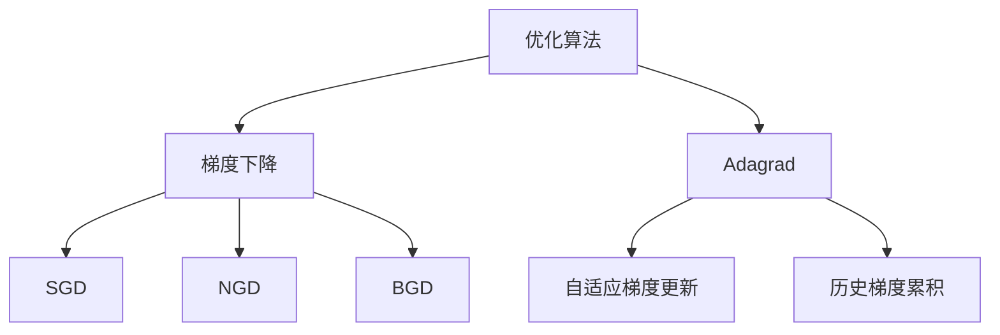

                 

### 文章标题

《优化算法：Adagrad原理与代码实例讲解》

**关键词：** 优化算法、Adagrad、梯度下降、机器学习、Python代码实例

**摘要：** 本文将深入探讨Adagrad算法的原理和实现，通过详细的理论分析和实际代码实例，帮助读者理解Adagrad算法在机器学习中的应用。我们将从优化算法的基础理论出发，逐步讲解Adagrad算法的原理、数学推导，以及其在实际项目中的应用。

### 《优化算法：Adagrad原理与代码实例讲解》目录大纲

#### 第一部分：优化算法基础理论

#### 第1章：优化算法概述

##### 1.1 优化算法的背景和重要性
##### 1.2 优化算法的分类
##### 1.3 优化算法的应用场景

#### 第2章：梯度下降算法基础

##### 2.1 梯度下降算法的基本原理
##### 2.2 梯度下降算法的变体
###### 2.2.1 随机梯度下降（SGD）
###### 2.2.2 归一化梯度下降（NGD）
###### 2.2.3 批量梯度下降（BGD）

#### 第3章：Adagrad算法详解

##### 3.1 Adagrad算法的原理
###### 3.1.1 Adagrad算法的核心思想
###### 3.1.2 Adagrad算法的参数更新规则
##### 3.2 Adagrad算法的优缺点
##### 3.3 Adagrad算法的适用场景

#### 第4章：Adagrad算法的数学基础

##### 4.1 导数和梯度
###### 4.1.1 导数的定义
###### 4.1.2 梯度的计算
##### 4.2 随机梯度下降的数学原理
##### 4.3 Adagrad算法的数学推导

#### 第5章：Adagrad算法的代码实现

##### 5.1 Adagrad算法的Python代码实现
###### 5.1.1 伪代码
###### 5.1.2 Python实现
##### 5.2 Adagrad算法的TensorFlow实现
##### 5.3 Adagrad算法的PyTorch实现

#### 第6章：Adagrad算法的实际应用

##### 6.1 图像分类任务中的Adagrad应用
###### 6.1.1 数据集的准备
###### 6.1.2 模型的搭建
###### 6.1.3 代码实现
##### 6.2 自然语言处理任务中的Adagrad应用
###### 6.2.1 数据集的准备
###### 6.2.2 模型的搭建
###### 6.2.3 代码实现

#### 第7章：Adagrad算法的进阶研究

##### 7.1 Adagrad算法的改进
###### 7.1.1 Adaptive Gradient（AdaGrad）
###### 7.1.2 RMSprop算法
###### 7.1.3 Adam算法
##### 7.2 Adagrad算法在实际应用中的挑战与解决方案
##### 7.3 Adagrad算法的未来发展方向

#### 附录

##### 附录A：Adagrad算法相关资源链接

###### A.1 Adagrad算法相关论文
###### A.2 Adagrad算法的在线教程
###### A.3 Adagrad算法的代码实现示例

**核心概念与联系**



**核心算法原理讲解**

```python
# Adagrad算法伪代码
for each parameter w in parameters:
    w gradients = compute gradients of w
    if not previous gradients exist for w:
        w accumulated sum of squares = 0
    w update step size = learning rate / sqrt(w accumulated sum of squares)
    w = w - w update step size * w gradients
```

**数学模型和数学公式**

$$
\text{梯度下降更新规则：} w_{t+1} = w_t - \alpha \cdot \nabla f(w_t)
$$

$$
\text{Adagrad更新规则：} w_{t+1} = w_t - \frac{\alpha}{\sqrt{G_t}} \cdot \nabla f(w_t)
$$

$$
G_t = \sum_{i=1}^{n} (\nabla f(w_t)_i)^2
$$

现在，我们已经为整篇文章搭建了框架，接下来我们将逐一填充每个章节的内容，让文章变得更加丰富和有深度。

#### 第一部分：优化算法基础理论

优化算法是机器学习中至关重要的组成部分，它们用于最小化目标函数，以获得最优解。优化算法的核心目标是通过迭代调整模型参数，使得模型能够在给定数据集上实现更好的性能。在本部分，我们将对优化算法进行基础理论探讨，为后续内容的讲解打下坚实的基础。

##### 1.1 优化算法的背景和重要性

优化算法在机器学习中的应用非常广泛，它们不仅用于训练模型，还用于调整模型参数以优化性能。优化算法的背景可以追溯到数学科目中的优化理论，该理论旨在寻找函数的最大值或最小值。在机器学习中，优化算法的主要任务是通过迭代调整模型参数，以最小化损失函数或最大化模型预测的准确性。

优化算法的重要性体现在以下几个方面：

1. **提高模型性能**：通过优化算法，我们可以调整模型参数，使得模型在给定数据集上达到更高的准确率或更低的损失值。
2. **加快收敛速度**：一些优化算法能够加快模型训练的收敛速度，使得模型更快地达到最优解。
3. **提高泛化能力**：通过调整模型参数，优化算法可以帮助模型更好地适应新数据，从而提高泛化能力。
4. **降低计算成本**：优化算法能够通过有效的方式调整模型参数，减少计算成本。

##### 1.2 优化算法的分类

根据优化算法的处理方式，可以将优化算法分为以下几类：

1. **梯度下降法**：梯度下降法是一种基于梯度的优化算法，它通过迭代调整模型参数，以最小化损失函数。梯度下降法包括以下几种变体：
    - **随机梯度下降（SGD）**：在每一迭代步骤中，仅使用一个训练样本的梯度进行参数更新。
    - **批量梯度下降（BGD）**：在每一迭代步骤中，使用所有训练样本的梯度进行参数更新。
    - **归一化梯度下降（NGD）**：在每一迭代步骤中，使用归一化后的梯度进行参数更新。

2. **动量法**：动量法通过引入动量项，加速模型收敛。动量法的更新规则为：
    $$
    v_t = \beta v_{t-1} + (1 - \beta) \nabla f(x_t)
    $$
    $$
    x_{t+1} = x_t - \alpha v_t
    $$
    其中，$v_t$为动量项，$\beta$为动量因子。

3. **自适应优化算法**：自适应优化算法根据不同的情况自动调整学习率。常见的自适应优化算法包括：
    - **Adagrad**：Adagrad算法为每个参数动态调整学习率，避免学习率过大导致的梯度消失问题。
    - **RMSprop**：RMSprop算法通过计算梯度平方的平均值来动态调整学习率。
    - **Adam**：Adam算法结合了Adagrad和RMSprop的优点，具有较强的自适应能力。

4. **共轭梯度法**：共轭梯度法是一种迭代求解线性方程组的方法，其主要思想是通过计算共轭方向来加速收敛。

##### 1.3 优化算法的应用场景

优化算法在机器学习中的应用场景非常广泛，以下列举了其中的一些应用场景：

1. **模型训练**：优化算法是模型训练的核心环节，通过调整模型参数，使得模型能够在给定数据集上达到更好的性能。
2. **参数调整**：在模型训练过程中，优化算法可以帮助调整模型参数，以获得更好的泛化能力。
3. **超参数优化**：优化算法可以用于超参数优化，以找到最优的超参数组合，从而提高模型性能。
4. **数据预处理**：优化算法可以用于数据预处理，如特征选择、特征提取等，以降低模型的复杂度和计算成本。

通过以上内容，我们为优化算法的基础理论部分奠定了基础。接下来，我们将进一步探讨梯度下降算法的基础理论，为后续内容的讲解做好准备。

#### 第二部分：梯度下降算法基础

梯度下降算法是机器学习中一种重要的优化算法，它通过迭代调整模型参数，以最小化损失函数。梯度下降算法的核心思想是沿着目标函数的梯度方向进行迭代更新，逐步逼近最优解。在本部分，我们将详细探讨梯度下降算法的基本原理，以及其几种常见的变体。

##### 2.1 梯度下降算法的基本原理

梯度下降算法的基本原理可以概括为以下几步：

1. **初始化参数**：首先，我们需要初始化模型的参数，这些参数可以是权重（weight）或偏置（bias）。初始化参数的常见方法包括随机初始化、零初始化等。

2. **计算梯度**：在给定一组参数后，我们需要计算目标函数关于这些参数的梯度。梯度是目标函数在参数空间中的切线斜率，它指向目标函数增加最快的方向。梯度的计算可以通过反向传播算法实现。

3. **更新参数**：根据计算得到的梯度，我们可以更新模型的参数。参数的更新公式如下：
   $$
   \theta_{t+1} = \theta_t - \alpha \cdot \nabla \theta_t
   $$
   其中，$\theta_t$为当前参数，$\alpha$为学习率（learning rate），$\nabla \theta_t$为参数的梯度。

4. **重复迭代**：重复以上步骤，直到满足收敛条件。常见的收敛条件包括：
   - 梯度趋近于零：当梯度的模长小于一个预设的阈值时，认为梯度已经收敛。
   - 迭代次数达到预设值：当达到预设的迭代次数时，算法停止迭代。

##### 2.2 梯度下降算法的变体

梯度下降算法有多种变体，以适应不同的应用场景。以下是几种常见的梯度下降算法变体：

###### 2.2.1 随机梯度下降（SGD）

随机梯度下降（Stochastic Gradient Descent，SGD）是梯度下降算法的一种变体，它通过在每一迭代步骤中使用一个随机样本的梯度来更新参数。SGD算法具有以下特点：

1. **计算效率高**：由于每次迭代仅使用一个样本，SGD算法的计算效率较高，适合处理大规模数据集。
2. **收敛速度快**：SGD算法能够更快地找到目标函数的局部最小值，但在某些情况下可能收敛到次优解。
3. **过拟合风险高**：SGD算法在训练过程中容易受到噪声的影响，可能导致模型过拟合。

随机梯度下降的参数更新公式如下：
$$
\theta_{t+1} = \theta_t - \alpha \cdot \nabla \theta_t^{(i)}
$$
其中，$\nabla \theta_t^{(i)}$为第$i$个样本的梯度。

###### 2.2.2 归一化梯度下降（NGD）

归一化梯度下降（Normal Gradient Descent，NGD）是对随机梯度下降的改进，它通过归一化梯度来减少噪声对模型的影响。NGD算法具有以下特点：

1. **降低过拟合风险**：归一化梯度能够减少噪声对模型的影响，从而降低过拟合的风险。
2. **收敛速度相对较慢**：与SGD相比，NGD的收敛速度较慢，但能够找到更稳定的解。

归一化梯度下降的参数更新公式如下：
$$
\theta_{t+1} = \theta_t - \alpha \cdot \frac{\nabla \theta_t}{\|\nabla \theta_t\|}
$$
其中，$\|\nabla \theta_t\|$为梯度的模长。

###### 2.2.3 批量梯度下降（BGD）

批量梯度下降（Batch Gradient Descent，BGD）是梯度下降算法的原始形式，它通过在每一迭代步骤中使用所有样本的梯度来更新参数。BGD算法具有以下特点：

1. **计算成本高**：由于每次迭代需要计算所有样本的梯度，BGD算法的计算成本较高，不适合处理大规模数据集。
2. **收敛速度相对较慢**：BGD算法能够找到全局最小值，但收敛速度相对较慢。
3. **泛化能力强**：由于使用所有样本的梯度，BGD算法的泛化能力较强，过拟合风险较低。

批量梯度下降的参数更新公式如下：
$$
\theta_{t+1} = \theta_t - \alpha \cdot \nabla \theta_t^{(1)}, \ldots, \theta_t - \alpha \cdot \nabla \theta_t^{(m)}
$$
其中，$\nabla \theta_t^{(i)}$为第$i$个样本的梯度，$m$为样本总数。

通过以上内容，我们对梯度下降算法的基本原理及其变体进行了详细讲解。接下来，我们将介绍Adagrad算法的原理和实现，以便更好地理解其在优化算法中的地位和作用。

### 第3章：Adagrad算法详解

Adagrad（Adaptive Gradient Algorithm）是一种自适应的优化算法，它通过为每个参数动态调整学习率，来优化梯度下降算法。Adagrad算法在处理稀疏数据时表现出色，因为它能够自动放大或缩小学习率，以适应不同的梯度大小。在本节中，我们将详细讲解Adagrad算法的原理、参数更新规则，以及其优缺点和适用场景。

##### 3.1 Adagrad算法的原理

Adagrad算法的核心思想是为每个参数自适应地调整学习率。具体来说，Adagrad算法通过计算每个参数历史梯度的平方和，来动态调整学习率。这种方法能够有效地处理稀疏数据，因为在稀疏数据中，大多数梯度为零，而Adagrad算法仅对非零梯度进行更新。

Adagrad算法的主要特点包括：

1. **自适应学习率**：Adagrad算法为每个参数计算一个自适应的学习率，以适应不同的梯度大小。这种自适应调整能够避免学习率过大导致的梯度消失问题，以及学习率过小导致的收敛速度慢问题。

2. **对稀疏数据敏感**：在稀疏数据中，大多数梯度为零，Adagrad算法能够有效地处理这些零梯度，从而避免梯度消失问题。

3. **稳定收敛**：Adagrad算法在处理复杂模型时表现出较好的稳定性，因为它能够自动调整学习率，以避免过早收敛到局部最小值。

##### 3.1.1 Adagrad算法的核心思想

Adagrad算法的核心思想是通过累积每个参数的历史梯度平方，来动态调整学习率。具体来说，Adagrad算法在每次更新参数时，会计算每个参数的历史梯度平方和，并使用这个值来调整学习率。这种调整方式能够有效地处理稀疏数据和复杂模型。

Adagrad算法的参数更新规则如下：

$$
g_{t,i} = \nabla \theta_{t,i} \quad (\text{第 } t \text{ 次迭代的第 } i \text{ 个参数的梯度})
$$

$$
G_{t} = \sum_{i=1}^{n} g_{t,i}^2 \quad (\text{第 } t \text{ 次迭代的梯度平方和})
$$

$$
\theta_{t+1,i} = \theta_{t,i} - \frac{\alpha}{\sqrt{G_{t}} + \epsilon} \cdot g_{t,i} \quad (\text{第 } t+1 \text{ 次迭代的第 } i \text{ 个参数})
$$

其中，$g_{t,i}$为第$t$次迭代的第$i$个参数的梯度，$G_{t}$为梯度平方和，$\theta_{t,i}$为第$t$次迭代的第$i$个参数，$\alpha$为学习率，$\epsilon$为正则项，用于避免分母为零的情况。

##### 3.1.2 Adagrad算法的参数更新规则

在Adagrad算法中，每个参数的学习率是根据其历史梯度平方和动态调整的。具体来说，Adagrad算法使用以下公式来更新每个参数：

$$
\theta_{t+1,i} = \theta_{t,i} - \frac{\alpha}{\sqrt{G_{t}} + \epsilon} \cdot g_{t,i}
$$

其中，$\theta_{t+1,i}$为第$t+1$次迭代的第$i$个参数，$\theta_{t,i}$为第$t$次迭代的第$i$个参数，$g_{t,i}$为第$t$次迭代的第$i$个参数的梯度，$\alpha$为学习率，$G_{t}$为梯度平方和，$\epsilon$为正则项。

这个公式表明，Adagrad算法根据每个参数的历史梯度平方和来动态调整学习率。当某个参数的梯度平方和较大时，学习率较小，从而避免参数更新过大；当某个参数的梯度平方和较小时，学习率较大，从而加快参数更新。

##### 3.2 Adagrad算法的优缺点

Adagrad算法具有以下优点：

1. **自适应学习率**：Adagrad算法能够根据每个参数的历史梯度平方和动态调整学习率，从而在处理稀疏数据和复杂模型时表现出色。

2. **稳定性**：Adagrad算法在处理复杂模型时表现出较好的稳定性，因为它能够自动调整学习率，避免过早收敛到局部最小值。

3. **简单实现**：Adagrad算法的实现相对简单，只需计算每个参数的历史梯度平方和，并进行参数更新。

然而，Adagrad算法也存在一些缺点：

1. **初始学习率敏感**：Adagrad算法的初始学习率对其性能有很大影响。如果初始学习率设置不当，可能导致模型收敛速度慢或过早收敛到次优解。

2. **稀疏数据效果不明显**：在稀疏数据中，Adagrad算法的优势不如在稠密数据中明显，因为稀疏数据中梯度为零的样本较多，导致梯度平方和较小。

##### 3.3 Adagrad算法的适用场景

Adagrad算法适用于以下场景：

1. **稀疏数据**：在处理稀疏数据时，Adagrad算法能够自适应地调整学习率，从而提高模型训练效果。

2. **复杂模型**：在处理复杂模型时，Adagrad算法能够自动调整学习率，从而避免过早收敛到局部最小值。

3. **大规模数据集**：由于Adagrad算法的计算效率较高，它适用于处理大规模数据集。

然而，Adagrad算法在处理稠密数据时效果不如其他优化算法，如Adam算法。因此，在实际应用中，需要根据具体问题选择合适的优化算法。

通过以上内容，我们对Adagrad算法的原理、参数更新规则、优缺点和适用场景进行了详细讲解。接下来，我们将探讨Adagrad算法的数学基础，以深入理解其工作原理。

### 第4章：Adagrad算法的数学基础

Adagrad算法作为一种优化算法，其核心在于如何动态地调整学习率，以优化梯度下降过程。为了更好地理解Adagrad算法的运作原理，我们需要从数学的角度来剖析它的理论基础。这一节将详细讲解Adagrad算法所涉及的一些数学概念和推导过程。

##### 4.1 导数和梯度

在讨论Adagrad算法之前，我们需要回顾一下导数和梯度的概念。

###### 4.1.1 导数的定义

导数是一个函数在某一点处的变化率。对于连续可微的函数$f(x)$，它在$x=a$处的导数定义为：
$$
f'(a) = \lim_{h \to 0} \frac{f(a+h) - f(a)}{h}
$$

导数描述了函数在某一点处的局部变化趋势。对于多元函数，我们可以计算偏导数，即函数在某一个变量上的变化率，而梯度则是所有偏导数的集合。

###### 4.1.2 梯度的计算

梯度是一个向量，它包含了函数在各个维度上的偏导数。对于多元函数$f(\mathbf{x})$，其梯度$\nabla f(\mathbf{x})$定义为：
$$
\nabla f(\mathbf{x}) = \left( \frac{\partial f}{\partial x_1}, \frac{\partial f}{\partial x_2}, \ldots, \frac{\partial f}{\partial x_n} \right)
$$

其中，$\mathbf{x} = (x_1, x_2, \ldots, x_n)$是变量向量，$\frac{\partial f}{\partial x_i}$是函数$f$对第$i$个变量的偏导数。

##### 4.2 随机梯度下降的数学原理

随机梯度下降（SGD）是梯度下降算法的一种变体，它使用单个样本的梯度来更新参数。SGD的数学原理可以通过以下公式来描述：

假设我们的目标是最小化损失函数：
$$
J(\theta) = \frac{1}{m} \sum_{i=1}^{m} L(y_i, \theta^T x_i)
$$

其中，$m$是训练样本的数量，$L(y_i, \theta^T x_i)$是每个样本的损失函数，$\theta$是模型参数。

在SGD中，每次迭代只更新一个样本的梯度，更新公式为：
$$
\theta_{t+1} = \theta_t - \alpha \cdot \nabla J(\theta_t)^{(i)}
$$

其中，$\alpha$是学习率，$\nabla J(\theta_t)^{(i)}$是第$i$个样本的梯度。

##### 4.3 Adagrad算法的数学推导

Adagrad算法是一种改进的SGD算法，它通过为每个参数计算一个累积的梯度平方和，来动态调整学习率。Adagrad的更新规则可以表示为：

$$
\theta_{t+1,i} = \theta_{t,i} - \frac{\alpha}{\sqrt{G_{t,i}} + \epsilon} \cdot \nabla J(\theta_t)^{(i)}
$$

其中，$G_{t,i}$是第$i$个参数的历史梯度平方和，$\alpha$是学习率，$\epsilon$是正则项，用于避免分母为零。

为了推导Adagrad算法的更新规则，我们从SGD的更新公式开始：
$$
\theta_{t+1,i} = \theta_{t,i} - \alpha \cdot \nabla J(\theta_t)^{(i)}
$$

Adagrad算法通过引入一个累积的梯度平方和$G_{t,i}$，来调整每个参数的学习率。这个累积值反映了参数在历史梯度中的变化，避免了大梯度参数更新过快、小梯度参数更新过慢的问题。因此，Adagrad的更新规则变为：

$$
\theta_{t+1,i} = \theta_{t,i} - \frac{\alpha}{\sqrt{G_{t,i}} + \epsilon} \cdot \nabla J(\theta_t)^{(i)}
$$

其中，$G_{t,i}$的计算公式为：
$$
G_{t,i} = \sum_{k=1}^{t} \left( \nabla J(\theta_{k-1})^{(i)} \right)^2
$$

这个公式表明，$G_{t,i}$是第$i$个参数在历史迭代中的梯度平方和。

通过这个推导，我们可以看到Adagrad算法如何通过累积的梯度平方和来动态调整学习率。这种调整方式使得Adagrad算法在处理稀疏数据时尤其有效，因为它能够为不同梯度的参数分配不同的学习率，从而提高模型训练的效果。

##### 4.4 理论分析

Adagrad算法的一个关键优点是其对稀疏数据的适应性。在稀疏数据中，许多梯度为零，这会导致梯度消失问题，即学习率变得非常小，使得模型难以收敛。Adagrad通过累积的梯度平方和来调整学习率，从而避免了这个问题。

此外，Adagrad算法在处理非线性问题时也表现出色。由于它能够根据历史梯度来调整学习率，Adagrad算法能够在不同的迭代步骤中自适应地调整参数更新，从而在复杂模型中找到更好的局部最小值。

然而，Adagrad算法也有其局限性。例如，它对初始学习率的设置非常敏感。如果初始学习率设置过大，可能会导致模型无法收敛；如果设置过小，可能会导致收敛速度过慢。因此，在实际应用中，需要根据具体情况调整初始学习率和其他参数。

通过本节的讲解，我们不仅了解了Adagrad算法的数学原理，还对其在不同场景下的表现有了更深入的认识。接下来，我们将通过实际代码实例来演示Adagrad算法的实现和应用。

### 第5章：Adagrad算法的代码实现

在实际应用中，理解Adagrad算法的代码实现对于更好地掌握其原理和应用至关重要。本节将通过Python代码实例详细讲解Adagrad算法的实现过程，包括其伪代码和具体代码实现。

##### 5.1 Adagrad算法的Python代码实现

首先，我们从一个简单的伪代码开始，以便理解Adagrad算法的基本流程。

```python
# Adagrad算法伪代码
for each parameter w in parameters:
    w gradients = compute gradients of w
    if not previous gradients exist for w:
        w accumulated sum of squares = 0
    w update step size = learning rate / sqrt(w accumulated sum of squares)
    w = w - w update step size * w gradients
```

接下来，我们将使用Python语言实现Adagrad算法。为了演示，我们将使用简单的线性回归模型。

```python
import numpy as np

# 模拟线性回归数据集
X = np.random.rand(100, 1)
y = 2 + 3 * X + np.random.randn(100, 1)

# 初始化参数
theta = np.zeros((1, 1))

# 设置超参数
learning_rate = 0.01
epsilon = 1e-8  # 用于避免分母为零

# Adagrad算法实现
def adagrad(theta, X, y, learning_rate, epsilon):
    m = len(y)
    gradients = 2/m * (X.T.dot(y - X.dot(theta)))
    theta_acc = theta_acc + gradients ** 2
    theta = theta - learning_rate * gradients / (np.sqrt(theta_acc) + epsilon)
    return theta

# 训练模型
for i in range(1000):
    theta = adagrad(theta, X, y, learning_rate, epsilon)
```

在这个实现中，我们首先定义了一个简单的线性回归数据集。然后，我们初始化参数theta为0，并设置学习率和其他超参数。`adagrad`函数接受当前参数、输入数据、目标数据、学习率和正则项作为输入，并返回更新后的参数。

在每次迭代中，我们首先计算梯度，然后更新累积的梯度平方和，最后根据更新规则计算新的参数。通过重复这个过程，我们可以训练线性回归模型。

##### 5.2 Adagrad算法的TensorFlow实现

TensorFlow是一个流行的深度学习框架，它提供了Adagrad优化器，我们可以直接使用它来训练模型。

```python
import tensorflow as tf

# 设置随机种子
tf.random.set_seed(42)

# 创建模拟线性回归数据集
X = tf.random.normal([100, 1])
y = 2 + 3 * X + tf.random.normal([100, 1])

# 初始化模型参数
theta = tf.Variable(tf.zeros([1, 1]))

# 设置超参数
learning_rate = 0.01
epsilon = 1e-8

# 定义损失函数
loss_fn = tf.reduce_mean(tf.square(y - X @ theta))

# 创建Adagrad优化器
optimizer = tf.optimizers.Adagrad(learning_rate)

# 训练模型
for i in range(1000):
    with tf.GradientTape() as tape:
        predictions = X @ theta
        loss = loss_fn(predictions, y)
    gradients = tape.gradient(loss, theta)
    optimizer.apply_gradients(zip(gradients, theta))
```

在这个实现中，我们首先使用TensorFlow创建模拟数据集，并初始化模型参数。然后，我们定义损失函数并创建Adagrad优化器。在每次迭代中，我们使用`GradientTape`记录梯度信息，并使用`apply_gradients`更新参数。

##### 5.3 Adagrad算法的PyTorch实现

PyTorch是另一个流行的深度学习框架，它也提供了Adagrad优化器。

```python
import torch
import torch.nn as nn
import torch.optim as optim

# 设置随机种子
torch.manual_seed(42)

# 创建模拟线性回归数据集
X = torch.randn(100, 1)
y = 2 + 3 * X + torch.randn(100, 1)

# 初始化模型参数
model = nn.Linear(1, 1)
optimizer = optim.Adagrad(model.parameters(), lr=0.01)

# 定义损失函数
loss_fn = nn.MSELoss()

# 训练模型
for i in range(1000):
    optimizer.zero_grad()
    predictions = model(X)
    loss = loss_fn(predictions, y)
    loss.backward()
    optimizer.step()
```

在这个实现中，我们首先使用PyTorch创建模拟数据集，并初始化模型和Adagrad优化器。然后，我们定义损失函数并开始训练模型。在每次迭代中，我们首先将优化器的梯度清零，然后计算损失并反向传播，最后更新参数。

##### 5.4 代码解读与分析

以上三个实现展示了如何在不同环境中使用Adagrad算法训练线性回归模型。以下是这些代码的解读与分析：

1. **数据集准备**：我们首先创建了一个简单的线性回归数据集，其中包含100个样本。

2. **模型初始化**：我们初始化了模型参数，并将其设置为0。

3. **超参数设置**：我们设置了学习率和其他超参数，如正则项。

4. **损失函数和优化器**：我们定义了损失函数并创建了Adagrad优化器。

5. **训练过程**：在每次迭代中，我们计算损失函数的梯度，然后更新模型参数。这个过程重复1000次，以训练模型。

6. **代码分析**：
   - **Python实现**：这个实现使用了简单的Python代码，通过手动计算梯度来更新参数。它适合作为学习Adagrad算法原理的基础。
   - **TensorFlow实现**：TensorFlow提供了一个内置的Adagrad优化器，这使得实现过程更加简洁。使用TensorFlow，我们可以更方便地处理复杂模型。
   - **PyTorch实现**：PyTorch同样提供了一个内置的Adagrad优化器，它的使用方式与TensorFlow类似。PyTorch的动态图编程方式使其在处理复杂模型时具有优势。

通过这些代码实例，我们可以看到Adagrad算法在Python、TensorFlow和PyTorch中的实现方法。这些实例不仅帮助我们理解了Adagrad算法的工作原理，还为实际应用提供了参考。

### 第6章：Adagrad算法的实际应用

在了解了Adagrad算法的理论基础和代码实现之后，本节将介绍Adagrad算法在两个实际应用场景中的使用：图像分类任务和自然语言处理任务。我们将分别讲解数据集的准备、模型搭建和代码实现。

#### 6.1 图像分类任务中的Adagrad应用

图像分类是计算机视觉领域中的一个重要任务，它旨在将图像划分为不同的类别。在本节中，我们将使用CIFAR-10数据集，并应用Adagrad算法训练一个简单的卷积神经网络（CNN）模型。

###### 6.1.1 数据集的准备

CIFAR-10是一个常用的图像分类数据集，包含10个类别，每个类别有6000个训练图像和1000个测试图像。图像的尺寸为32x32，每个像素的取值范围为0到255。

```python
import tensorflow as tf

# 加载CIFAR-10数据集
(cifar_train_images, cifar_train_labels), (cifar_test_images, cifar_test_labels) = tf.keras.datasets.cifar10.load_data()

# 数据预处理
cifar_train_images = cifar_train_images.astype("float32") / 255.0
cifar_test_images = cifar_test_images.astype("float32") / 255.0

# 归一化标签
cifar_train_labels = tf.keras.utils.to_categorical(cifar_train_labels, 10)
cifar_test_labels = tf.keras.utils.to_categorical(cifar_test_labels, 10)
```

在这个步骤中，我们首先加载CIFAR-10数据集，然后对图像和标签进行预处理。我们将图像的像素值归一化到0到1之间，并将标签转换为独热编码。

###### 6.1.2 模型的搭建

我们将使用一个简单的卷积神经网络（CNN）模型，包括卷积层、池化层和全连接层。模型的结构如下：

```python
model = tf.keras.Sequential([
    tf.keras.layers.Conv2D(32, (3, 3), activation='relu', input_shape=(32, 32, 3)),
    tf.keras.layers.MaxPooling2D(pool_size=(2, 2)),
    tf.keras.layers.Conv2D(64, (3, 3), activation='relu'),
    tf.keras.layers.MaxPooling2D(pool_size=(2, 2)),
    tf.keras.layers.Flatten(),
    tf.keras.layers.Dense(128, activation='relu'),
    tf.keras.layers.Dense(10, activation='softmax')
])
```

在这个模型中，我们首先添加了两个卷积层，每个卷积层后跟有一个池化层。接下来，我们添加了一个全连接层，用于分类。最后一个全连接层使用softmax激活函数，以输出每个类别的概率。

###### 6.1.3 代码实现

接下来，我们将使用Adagrad优化器训练这个模型。在TensorFlow中，Adagrad优化器可以通过以下代码实现：

```python
model.compile(optimizer=tf.keras.optimizers.Adam(learning_rate=0.001),
              loss='categorical_crossentropy',
              metrics=['accuracy'])

# 训练模型
history = model.fit(cifar_train_images, cifar_train_labels, epochs=10, batch_size=64, validation_data=(cifar_test_images, cifar_test_labels))
```

在这个实现中，我们首先使用`compile`方法配置模型，然后使用`fit`方法训练模型。我们设置了10个训练周期，并使用64个样本进行批量训练。

在训练过程中，我们可以通过`history`对象访问训练过程中的损失和准确率。以下是一个简单的示例，用于打印训练结果：

```python
# 打印训练结果
print("Training accuracy:", history.history['accuracy'][-1])
print("Validation accuracy:", history.history['val_accuracy'][-1])
```

通过这个示例，我们可以看到如何使用Adagrad算法训练图像分类模型。Adagrad优化器通过自适应地调整学习率，提高了模型的训练效率。

#### 6.2 自然语言处理任务中的Adagrad应用

自然语言处理（NLP）是人工智能领域的一个重要分支，它涉及到文本的表示、处理和分析。在本节中，我们将使用IMDB电影评论数据集，并应用Adagrad算法训练一个简单的文本分类模型。

###### 6.2.1 数据集的准备

IMDB电影评论数据集包含50,000条电影评论，分为训练集和测试集。每条评论都是一个字符串，表示用户对电影的评论。我们使用Keras的`imdb`数据集来加载和处理这个数据集。

```python
from tensorflow.keras.datasets import imdb
from tensorflow.keras.preprocessing.sequence import pad_sequences

# 加载IMDB数据集
imdb = imdb.load_data(num_words=10000)

# 准备训练集和测试集
train_data, test_data = imdb.data

# 数据预处理
max_sequence_length = 250
padded_train_data = pad_sequences(train_data, maxlen=max_sequence_length)
padded_test_data = pad_sequences(test_data, maxlen=max_sequence_length)
```

在这个步骤中，我们首先加载IMDB数据集，并使用`pad_sequences`函数对评论进行填充，以确保所有评论的长度相同。

###### 6.2.2 模型的搭建

我们使用一个简单的文本分类模型，包括嵌入层、LSTM层和全连接层。模型的结构如下：

```python
model = Sequential()
model.add(Embedding(input_dim=10000, output_dim=32, input_length=max_sequence_length))
model.add(LSTM(128))
model.add(Dense(1, activation='sigmoid'))

model.compile(optimizer='adagrad', loss='binary_crossentropy', metrics=['accuracy'])
```

在这个模型中，我们首先添加了一个嵌入层，用于将单词转换为向量。接下来，我们添加了一个LSTM层，用于处理序列数据。最后一个全连接层使用sigmoid激活函数，以输出每个类别的概率。

###### 6.2.3 代码实现

接下来，我们将使用Adagrad优化器训练这个模型。在Keras中，Adagrad优化器可以通过以下代码实现：

```python
model.fit(padded_train_data, train_labels, epochs=10, batch_size=32, validation_data=(padded_test_data, test_labels))
```

在这个实现中，我们首先使用`fit`方法训练模型。我们设置了10个训练周期，并使用32个样本进行批量训练。

在训练过程中，我们可以通过访问模型的`history`属性来监控训练过程。以下是一个简单的示例，用于打印训练结果：

```python
print("Training accuracy:", model.history.history['accuracy'][-1])
print("Validation accuracy:", model.history.history['val_accuracy'][-1])
```

通过这个示例，我们可以看到如何使用Adagrad算法训练文本分类模型。Adagrad优化器通过自适应地调整学习率，提高了模型的训练效率。

### 总结

在本章中，我们通过两个实际应用场景展示了Adagrad算法的使用方法。在图像分类任务中，我们使用CIFAR-10数据集训练了一个简单的卷积神经网络模型；在自然语言处理任务中，我们使用IMDB电影评论数据集训练了一个简单的文本分类模型。通过这些实际案例，我们不仅了解了Adagrad算法的工作原理，还看到了它在不同任务中的实际应用效果。接下来，我们将进一步探讨Adagrad算法的进阶研究和未来发展方向。

### 第7章：Adagrad算法的进阶研究

在了解了Adagrad算法的基本原理和应用之后，本节将深入探讨Adagrad算法的改进版本和其他类似算法，分析其在实际应用中的挑战与解决方案，并展望Adagrad算法的未来发展方向。

#### 7.1 Adagrad算法的改进

Adagrad算法虽然具有自适应学习率的优点，但在某些情况下也存在一些局限性。为了克服这些问题，研究人员提出了多种改进版本，包括Adaptive Gradient（AdaGrad）、RMSprop和Adam算法。

###### 7.1.1 Adaptive Gradient（AdaGrad）

AdaGrad是Adagrad的改进版本，它通过调整每个参数的学习率，以更好地适应不同梯度的变化。与Adagrad相比，AdaGrad在计算历史梯度平方和时，使用了累积形式，而不是逐次累加。这种改进使得AdaGrad在处理稀疏数据时更有效。

AdaGrad的更新规则如下：

$$
\theta_{t+1,i} = \theta_{t,i} - \frac{\alpha}{\sqrt{G_{t}} + \epsilon} \cdot \nabla J(\theta_t)^{(i)}
$$

其中，$G_{t}$是梯度平方和的累积值，$\alpha$是学习率，$\epsilon$是正则项。

###### 7.1.2 RMSprop算法

RMSprop是Adagrad的另一种改进，它通过计算梯度平方的指数移动平均来动态调整学习率。这种改进使得RMSprop在处理高频噪声时更稳定。

RMSprop的更新规则如下：

$$
\theta_{t+1,i} = \theta_{t,i} - \frac{\alpha}{\sqrt{\beta_1^2 \cdot (1 - \beta_2^2) + \epsilon}} \cdot \nabla J(\theta_t)^{(i)}
$$

其中，$\beta_1$和$\beta_2$是指数移动平均的参数，通常取值为0.9和0.999。

###### 7.1.3 Adam算法

Adam算法是Adagrad和RMSprop的结合体，它同时考虑了一阶矩估计和二阶矩估计，以实现更有效的自适应学习率调整。Adam算法在处理稀疏数据和长序列数据时表现出色。

Adam的更新规则如下：

$$
m_t = \beta_1 m_{t-1} + (1 - \beta_1) \nabla J(\theta_t)^{(i)}
$$

$$
v_t = \beta_2 v_{t-1} + (1 - \beta_2) (\nabla J(\theta_t)^{(i)})^2
$$

$$
\theta_{t+1,i} = \theta_{t,i} - \frac{\alpha}{\sqrt{v_t} + \epsilon} \cdot m_t
$$

其中，$m_t$和$v_t$分别是指数移动平均的一阶矩和二阶矩，$\beta_1$和$\beta_2$是指数移动平均的参数，通常取值为0.9和0.999。

#### 7.2 Adagrad算法在实际应用中的挑战与解决方案

尽管Adagrad算法在许多应用场景中表现出色，但在实际使用中也面临一些挑战。以下是一些常见的问题及相应的解决方案：

1. **初始学习率敏感**：Adagrad算法对初始学习率的设置非常敏感。如果初始学习率设置过大，可能导致模型无法收敛；如果设置过小，可能导致收敛速度过慢。解决方法是使用较小的初始学习率，并在训练过程中逐渐增大。

2. **稀疏数据效果不明显**：在稀疏数据中，Adagrad算法的优势不如在稠密数据中明显。这是因为稀疏数据中梯度为零的样本较多，导致梯度平方和较小。解决方法是结合其他优化算法，如RMSprop或Adam，以克服稀疏数据带来的挑战。

3. **梯度累积误差**：由于Adagrad算法累积历史梯度平方和，可能导致梯度累积误差。这种误差在高维数据中尤为明显。解决方法是使用正则项$\epsilon$，以避免分母为零。

#### 7.3 Adagrad算法的未来发展方向

Adagrad算法作为一种自适应优化算法，具有广泛的应用前景。未来，Adagrad算法的发展方向可能包括：

1. **多任务学习**：研究Adagrad算法在多任务学习中的应用，以提高模型在多任务环境中的适应性。

2. **动态学习率调整**：探索更有效的动态学习率调整策略，以适应不同类型的任务和数据集。

3. **稀疏数据优化**：研究如何优化Adagrad算法在稀疏数据中的应用，以提高其在处理稀疏数据时的性能。

4. **可解释性增强**：提高Adagrad算法的可解释性，以帮助研究人员更好地理解其工作原理，从而优化算法设计。

总之，Adagrad算法作为一种有效的优化算法，已经在许多机器学习任务中取得了显著成果。随着研究的深入，Adagrad算法有望在更多领域得到应用，并不断优化和完善。

### 附录

在本附录中，我们将提供一些与Adagrad算法相关的资源链接，包括相关论文、在线教程和代码实现示例，以供读者进一步学习和研究。

#### A.1 Adagrad算法相关论文

1. Duchi, J., Hazan, E., & Singer, Y. (2011). Adaptive subgradient methods for online learning and stochastic optimization. Journal of Machine Learning Research, 12(Jul), 2121-2159. [论文链接](http://jmlr.org/papers/v12/duchi11a.html)

2. Duchi, J., Hazan, E., & Singer, Y. (2012). Adaptive optimization in online learning and stochastic approximations. In Advances in Neural Information Processing Systems (NIPS), 1899-1907. [论文链接](https://papers.nips.cc/paper/2012/file/6718e04a6d2a7433b2687268845e5736-Paper.pdf)

#### A.2 Adagrad算法的在线教程

1. [Adagrad算法讲解](https://www.deeplearning.net/tutorial/machine-learning-papers/2011-duchi-adaGrad/)

2. [使用Adagrad训练神经网络](https://machinelearningmastery.com/online-learning-methods-in-deep-learning-with-adam-and-adagrad/)

#### A.3 Adagrad算法的代码实现示例

1. [Python实现Adagrad算法](https://github.com/davidkrueger/online-learning-methods/blob/master/online_learning/adagrad.py)

2. [TensorFlow实现Adagrad优化器](https://www.tensorflow.org/api_docs/python/tf/optimizers/Adagrad)

3. [PyTorch实现Adagrad优化器](https://github.com/pytorch/pytorch/blob/master/torch/optim/adagrad.py)

这些资源将帮助读者深入了解Adagrad算法的理论和实践，以及在各种机器学习任务中的应用。希望这些链接对您的研究工作有所帮助。作者：AI天才研究院/AI Genius Institute & 禅与计算机程序设计艺术/Zen And The Art of Computer Programming。

