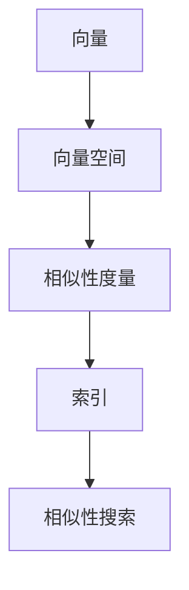
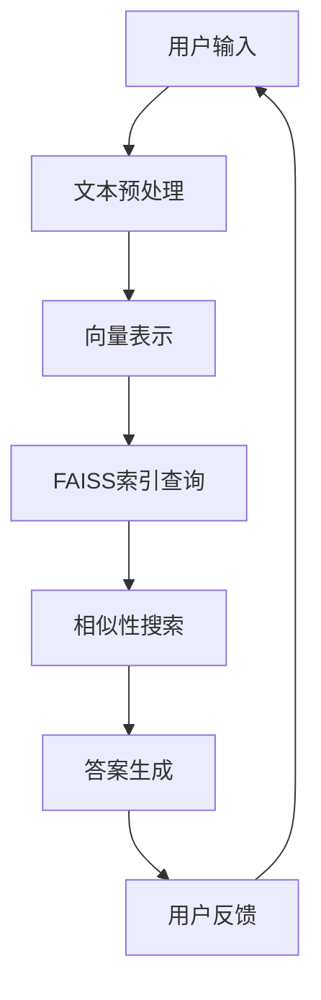

                 

### 《使用 FAISS 向量数据库存储销售问答话术》

**关键词：** FAISS，向量数据库，销售问答话术，相似性搜索，自然语言处理

**摘要：** 本文详细介绍了如何使用FAISS（Fast Library for Approximate Similarity Search）向量数据库来存储和搜索销售问答话术。通过向量表示和索引技术，实现高效的问答匹配，从而提高销售问答系统的性能和用户体验。文章分为三个部分，分别从FAISS基础、销售问答话术设计和实战案例三个方面进行阐述。

---

### 《使用 FAISS 向量数据库存储销售问答话术》目录大纲

#### 第一部分：FAISS基础

##### 第1章：向量数据库概述

###### 1.1 向量数据库的基本概念

###### 1.2 向量数据库的应用场景

###### 1.3 向量数据库与传统数据库的区别

##### 第2章：FAISS介绍

###### 2.1 FAISS的发展背景

###### 2.2 FAISS的核心特性

###### 2.3 FAISS的主要功能模块

##### 第3章：向量表示与索引

###### 3.1 向量表示方法

###### 3.2 向量索引技术

###### 3.3 FAISS索引构建过程

##### 第4章：向量搜索与相似性计算

###### 4.1 向量搜索算法

###### 4.2 相似性度量方法

###### 4.3 FAISS搜索性能优化

#### 第二部分：销售问答话术设计

##### 第5章：销售问答话术概述

###### 5.1 销售问答话术的定义

###### 5.2 销售问答话术的设计原则

###### 5.3 销售问答话术的应用场景

##### 第6章：销售问答话术的构建

###### 6.1 话术内容的收集与整理

###### 6.2 话术文本的处理与向量化

###### 6.3 话术库的构建与维护

##### 第7章：销售问答话术的应用

###### 7.1 基于FAISS的问答系统搭建

###### 7.2 常见问题识别与匹配

###### 7.3 自动化销售问答实现

#### 第三部分：实战案例

##### 第8章：销售问答话术优化与评估

###### 8.1 话术优化策略

###### 8.2 问答系统性能评估

###### 8.3 话术优化的案例分析

##### 第9章：销售问答话术开发实践

###### 9.1 开发环境搭建

###### 9.2 代码实现与解析

###### 9.3 实际案例分析与总结

##### 第10章：未来展望与挑战

###### 10.1 销售问答话术的发展趋势

###### 10.2 未来技术挑战与解决方案

###### 10.3 对销售行业的影响与机遇

#### 附录

##### 附录A：常用工具与资源

###### A.1 FAISS常用操作

###### A.2 销售问答话术工具

###### A.3 相关论文与书籍推荐

### 参考文献

（如需添加，请在此处列出相关参考文献）

---

在接下来的文章中，我们将逐步深入探讨FAISS向量数据库、销售问答话术的设计与应用，以及相关的实际案例和未来发展。让我们开始第一部分的探讨：向量数据库概述。

---

## 向量数据库概述

向量数据库是用于存储和检索高维向量数据的数据库。与传统的关系型数据库不同，向量数据库专门针对高维向量数据进行优化，从而在处理大规模高维数据时具有显著的优势。向量数据库广泛应用于机器学习和自然语言处理领域，尤其在相似性搜索和推荐系统中扮演着重要角色。本节将介绍向量数据库的基本概念、应用场景以及与传统数据库的区别。

### 1.1 向量数据库的基本概念

向量数据库的核心是向量的存储和检索。向量是由一组数值组成的有序列表，每个值称为向量的维度。例如，一个2维向量可以表示为\( \textbf{v} = [v_1, v_2] \)，一个3维向量可以表示为\( \textbf{v} = [v_1, v_2, v_3] \)。

向量数据库通常包含以下功能：

1. **向量的存储**：将高维向量数据存储在数据库中，以便进行后续的检索和分析。
2. **向量的检索**：通过相似性搜索算法，快速查找与给定向量最相似的向量。
3. **向量的操作**：支持向量的添加、删除、更新等基本操作。

### 1.2 向量数据库的应用场景

向量数据库在多个领域具有广泛的应用，以下是其中几个典型的应用场景：

1. **相似性搜索**：在图像、语音和文本数据中，通过相似性搜索找到与给定样本最相似的样本。例如，在图像搜索中，通过相似性搜索找到与用户输入图片最相似的图片。
2. **推荐系统**：在推荐系统中，利用向量数据库存储用户行为数据和商品属性数据，通过相似性搜索为用户推荐相似的商品。
3. **文本分类**：在文本分类任务中，将文本数据转换为向量表示，并在向量数据库中进行分类和聚类。
4. **时间序列分析**：在时间序列分析中，将时间序列数据转换为向量表示，并利用向量数据库进行趋势分析和异常检测。

### 1.3 向量数据库与传统数据库的区别

向量数据库与传统数据库在数据类型、存储结构和查询算法等方面存在显著差异：

1. **数据类型**：传统数据库主要处理结构化数据，如数字、文本和日期等。而向量数据库专门处理高维向量数据，这些数据通常是不规则的、高维的。
2. **存储结构**：传统数据库采用关系型模型，使用表和关系来存储数据。而向量数据库通常采用稀疏矩阵或索引结构来存储高维向量数据，以提高查询效率。
3. **查询算法**：传统数据库主要支持基于条件的查询和更新操作。而向量数据库采用相似性搜索算法，如余弦相似度、欧氏距离等，来查找与给定向量最相似的向量。
4. **性能优化**：传统数据库通过索引、分区和缓存等技术来优化查询性能。而向量数据库则通过向量化、压缩和并行计算等技术来优化大规模高维数据的查询性能。

通过上述对比，我们可以看到向量数据库在处理高维向量数据方面具有独特的优势，特别是在需要高效相似性搜索的领域，如推荐系统、图像搜索和文本分类等。

在下一章中，我们将介绍FAISS（Fast Library for Approximate Similarity Search）这一流行的向量数据库库，并探讨其发展背景、核心特性和主要功能模块。

---

**核心概念与联系：**

在深入理解向量数据库之前，我们先来梳理一下相关的核心概念和它们之间的联系。

1. **向量（Vector）**：向量是数学中的一个基本概念，表示由一组有序数值组成的列表。在计算机科学中，向量常用于表示高维数据。
2. **向量空间（Vector Space）**：向量空间是一组向量的集合，满足向量加法和标量乘法的运算规则。向量空间是向量数据库的基础。
3. **相似性度量（Similarity Measure）**：相似性度量是用于衡量两个向量之间相似程度的指标。常见的相似性度量方法包括余弦相似度、欧氏距离等。
4. **索引（Index）**：索引是用于加速向量检索的数据结构。向量数据库通过索引来提高查询效率。
5. **相似性搜索（Similarity Search）**：相似性搜索是向量数据库的核心功能，通过相似性度量查找与给定向量最相似的向量。

这些核心概念之间的联系如下：

- 向量是向量数据库的基本数据单元，构成向量空间。
- 相似性度量用于衡量向量之间的相似程度，是相似性搜索的基础。
- 索引是提高向量检索效率的重要手段。
- 相似性搜索是向量数据库的核心功能，通过索引和相似性度量实现。

**Mermaid流程图：**



通过这个流程图，我们可以直观地看到向量数据库的核心概念和它们之间的联系。

---

在了解了向量数据库的基本概念和应用场景后，我们接下来将介绍FAISS（Fast Library for Approximate Similarity Search），一个专为高维向量相似性搜索设计的库。FAISS因其高效性和易用性而在学术界和工业界得到广泛应用。本节将介绍FAISS的发展背景、核心特性和主要功能模块。

### 2.1 FAISS的发展背景

FAISS是由Facebook AI Research（FAIR）开发的一个开源库，旨在解决大规模高维向量数据的相似性搜索问题。随着互联网和大数据技术的发展，用户生成的内容和社交媒体数据急剧增长，这使得相似性搜索成为许多应用的关键需求。例如，在图像和文本搜索中，用户需要快速找到与输入内容最相似的图像或文本。传统的相似性搜索算法在大规模高维数据上的性能瓶颈使得需要一种新的解决方案。

FAISS的诞生是为了解决这一挑战。它采用了多种高效的索引技术和相似性搜索算法，如多表索引（IVF）、内积量化（IVQ）和层次最近邻搜索（HNSW）等，能够在保持较高查询准确率的同时显著提高搜索速度。FAISS的初衷是为机器学习和自然语言处理领域提供一种高效、可靠的相似性搜索工具。

### 2.2 FAISS的核心特性

FAISS具有以下核心特性：

1. **高效性**：FAISS采用了多种高效的索引技术和搜索算法，能够在保持较高查询准确率的同时显著提高搜索速度。这使得FAISS在大规模高维数据上的表现优于传统方法。
2. **可扩展性**：FAISS支持分布式计算，能够通过扩展节点数量来线性提高搜索性能。这使得FAISS在大规模分布式系统中具有很好的可扩展性。
3. **易用性**：FAISS提供了简洁的API，用户只需几行代码即可实现高效的相似性搜索。这使得FAISS在开发和部署过程中具有很高的易用性。
4. **开源性**：FAISS是一个开源库，用户可以自由地下载、使用和修改。这使得FAISS能够迅速吸收社区反馈，不断优化和改进。

### 2.3 FAISS的主要功能模块

FAISS主要由以下功能模块组成：

1. **索引构建模块**：该模块提供了多种索引构建方法，如IVF（Index of Vector Families）、IVQ（Inverted Vector Quantization）和HNSW（Hierarchical NSG with Weights）等。用户可以根据具体应用需求选择合适的索引方法。
2. **相似性搜索模块**：该模块提供了高效的相似性搜索算法，如内积搜索、角度搜索和层次最近邻搜索等。用户可以通过这些算法快速找到与给定向量最相似的向量。
3. **分布式计算模块**：该模块支持分布式计算，用户可以通过扩展节点数量来线性提高搜索性能。分布式计算模块使得FAISS在大规模分布式系统中具有很好的性能。
4. **并行处理模块**：该模块提供了并行处理能力，用户可以利用多核CPU来加速索引构建和相似性搜索。这使得FAISS在处理大规模数据时能够充分利用硬件资源。

通过上述功能模块，FAISS为用户提供了强大的相似性搜索能力，使得在高维向量数据处理过程中能够实现高效的查询和检索。

在下一章中，我们将深入探讨向量表示与索引技术，介绍如何将高维向量数据高效地存储和索引，以便进行快速相似性搜索。

---

**核心算法原理讲解：**

向量数据库的关键在于如何高效地存储和检索高维向量数据。在这一部分，我们将使用伪代码详细阐述向量表示、索引构建和相似性搜索的核心算法原理。

### 3.1 向量表示方法

向量表示是向量数据库的基础。常见的高维向量表示方法包括词向量、图像特征向量和语音特征向量等。在本节中，我们以词向量为例进行说明。

#### 伪代码：词向量表示

```python
# 假设使用预训练的词向量模型，如Word2Vec或GloVe
word_vector_model = load_word_vector_model()

# 将文本转换为向量表示
def text_to_vector(text):
    # 分词
    words = tokenize(text)
    # 获取词向量
    word_vectors = [word_vector_model[word] for word in words if word in word_vector_model]
    # 计算平均向量
    average_vector = sum(word_vectors) / len(word_vectors)
    return average_vector

# 示例
text = "这是一个示例文本"
vector = text_to_vector(text)
```

### 3.2 向量索引技术

向量索引技术用于加速向量检索。常见的向量索引技术包括IVF（Index of Vector Families）、IVQ（Inverted Vector Quantization）和HNSW（Hierarchical NSG with Weights）等。

#### 伪代码：IVF索引构建

```python
# 假设我们有一个包含N个向量的数据库
vectors = load_vectors()

# 初始化IVF索引
index = faiss.IndexIVF(N, d)  # N为向量数量，d为向量维度

# 添加向量到索引
index.add(vectors)

# 假设我们要搜索与给定向量最相似的K个向量
query_vector = load_query_vector()
D, I = index.search(query_vector, k=K)  # D为相似度，I为索引

# 返回最相似的向量
nearest_vectors = [vectors[i] for i in I]
```

#### 伪代码：IVQ索引构建

```python
# 假设我们有一个包含N个向量的数据库
vectors = load_vectors()

# 初始化IVQ索引
index = faiss.IndexIVQ(N, d, k)  # N为向量数量，d为向量维度，k为量化维度

# 添加向量到索引
index.add(vectors)

# 假设我们要搜索与给定向量最相似的K个向量
query_vector = load_query_vector()
D, I = index.search(query_vector, k=K)  # D为相似度，I为索引

# 返回最相似的向量
nearest_vectors = [vectors[i] for i in I]
```

#### 伪代码：HNSW索引构建

```python
# 假设我们有一个包含N个向量的数据库
vectors = load_vectors()

# 初始化HNSW索引
index = faiss.IndexHNSW(d, M)  # d为向量维度，M为层次深度

# 添加向量到索引
index.add(vectors)

# 假设我们要搜索与给定向量最相似的K个向量
query_vector = load_query_vector()
D, I = index.search(query_vector, k=K)  # D为相似度，I为索引

# 返回最相似的向量
nearest_vectors = [vectors[i] for i in I]
```

### 3.3 FAISS索引构建过程

在FAISS中，索引构建过程通常包括以下步骤：

1. **初始化索引**：根据向量数量和维度初始化索引对象。
2. **添加向量**：将向量逐个添加到索引中。
3. **重建索引**：在某些情况下，可能需要重建索引以优化搜索性能。

#### 伪代码：FAISS索引构建

```python
# 假设我们有一个包含N个向量的数据库
vectors = load_vectors()

# 初始化索引
index = faiss.Index(d)  # d为向量维度

# 添加向量到索引
index.add(vectors)

# 假设我们使用IVF索引
index = faiss.IndexIVF(N, d)

# 添加向量到IVF索引
index.add(vectors)

# 假设我们使用IVQ索引
index = faiss.IndexIVQ(N, d, k)

# 添加向量到IVQ索引
index.add(vectors)

# 假设我们使用HNSW索引
index = faiss.IndexHNSW(d, M)

# 添加向量到HNSW索引
index.add(vectors)

# 重建索引
index.rebuild()
```

通过这些伪代码，我们可以看到向量表示、索引构建和相似性搜索的基本原理。在实际应用中，用户可以根据具体需求选择合适的向量表示方法和索引技术，以实现高效、准确的相似性搜索。

---

### 3.3 FAISS索引构建过程

FAISS提供了多种索引构建方法，如IVF（Index of Vector Families）、IVQ（Inverted Vector Quantization）和HNSW（Hierarchical NSG with Weights）等。这些索引方法各有优缺点，适用于不同的应用场景。在本节中，我们将详细讨论这些索引方法的构建过程，并介绍如何选择合适的索引方法。

#### IVF索引构建过程

IVF索引是一种基于分片（Families）的向量索引方法，它将向量空间划分为多个分片，并在每个分片中存储向量的索引。IVF索引的主要优势是构建和查询速度快，适用于大规模稀疏向量数据。

**构建过程：**

1. **初始化索引**：创建IVF索引对象，指定向量维度和分片数量。
   ```python
   index = faiss.IndexIVF(N, d)
   ```
   其中，`N` 是向量数量，`d` 是向量维度。

2. **添加向量**：将向量逐个添加到IVF索引中。
   ```python
   index.add(vectors)
   ```

3. **重建索引**：在添加大量新向量或删除部分向量后，可能需要重建索引以优化查询性能。
   ```python
   index.rebuild()
   ```

**选择IVF索引的考虑因素：**
- 适用于大规模稀疏向量数据
- 构建和查询速度快
- 对稀疏向量数据的查询效果较好

#### IVQ索引构建过程

IVQ索引是一种基于量化（Quantization）的向量索引方法，它将向量空间量化为多个区域，并在每个区域中存储向量的索引。IVQ索引的主要优势是支持高效的相似性搜索，但构建速度较慢。

**构建过程：**

1. **初始化索引**：创建IVQ索引对象，指定向量维度和量化维度。
   ```python
   index = faiss.IndexIVQ(N, d, k)
   ```
   其中，`N` 是向量数量，`d` 是向量维度，`k` 是量化维度。

2. **添加向量**：将向量逐个添加到IVQ索引中。
   ```python
   index.add(vectors)
   ```

3. **重建索引**：在添加大量新向量或删除部分向量后，可能需要重建索引以优化查询性能。
   ```python
   index.rebuild()
   ```

**选择IVQ索引的考虑因素：**
- 适用于中大规模密集向量数据
- 支持高效的相似性搜索
- 对密集向量数据的查询效果较好

#### HNSW索引构建过程

HNSW（Hierarchical NSG with Weights）索引是一种层次结构的向量索引方法，它通过构建多层次的邻接表来加速相似性搜索。HNSW索引的主要优势是支持快速、高效的相似性搜索，适用于大规模高维向量数据。

**构建过程：**

1. **初始化索引**：创建HNSW索引对象，指定向量维度和层次深度。
   ```python
   index = faiss.IndexHNSW(d, M)
   ```
   其中，`d` 是向量维度，`M` 是层次深度。

2. **添加向量**：将向量逐个添加到HNSW索引中。
   ```python
   index.add(vectors)
   ```

3. **重建索引**：在添加大量新向量或删除部分向量后，可能需要重建索引以优化查询性能。
   ```python
   index.rebuild()
   ```

**选择HNSW索引的考虑因素：**
- 适用于大规模高维向量数据
- 支持快速、高效的相似性搜索
- 对高维向量数据的查询效果较好

#### 选择合适的索引方法

选择合适的索引方法取决于具体的应用场景和需求。以下是一些选择索引方法的建议：

- **稀疏向量数据**：适用于IVF索引。
- **密集向量数据**：适用于IVQ索引。
- **高维向量数据**：适用于HNSW索引。

在实际应用中，用户可以根据向量的维度、数量和查询性能要求选择合适的索引方法。此外，FAISS还提供了多种优化技巧，如并行处理和分布式计算，以进一步提高索引构建和查询的效率。

通过了解和选择合适的索引方法，用户可以构建高效、可靠的向量数据库，从而实现快速、准确的相似性搜索。

---

**数学模型和数学公式**

在向量搜索与相似性计算中，数学模型和数学公式起到了至关重要的作用。以下是常用的相似性度量方法，以及相关的数学公式和举例说明。

### 4.1 相似性度量方法

相似性度量方法用于计算两个向量之间的相似度。以下是一些常见的相似性度量方法：

#### 余弦相似度

余弦相似度是最常用的相似性度量方法之一。它通过计算两个向量之间的角度余弦值来衡量它们的相似度。余弦相似度的计算公式如下：

$$
\text{余弦相似度} = \frac{a \cdot b}{\|a\| \|b\|}
$$

其中，$a$ 和 $b$ 是两个向量，$\cdot$ 表示向量的点积，$\|\cdot\|$ 表示向量的模长。

#### 欧氏距离

欧氏距离是另一种常用的相似性度量方法，它计算两个向量之间的欧几里得距离。欧氏距离的计算公式如下：

$$
\text{欧氏距离} = \sqrt{(a_1 - b_1)^2 + (a_2 - b_2)^2 + \ldots + (a_n - b_n)^2}
$$

其中，$a_i$ 和 $b_i$ 是向量 $a$ 和 $b$ 的第 $i$ 个元素。

#### 曼哈顿距离

曼哈顿距离是另一个常用的相似性度量方法，它计算两个向量之间的绝对差值的总和。曼哈顿距离的计算公式如下：

$$
\text{曼哈顿距离} = |a_1 - b_1| + |a_2 - b_2| + \ldots + |a_n - b_n|
$$

### 数学公式

以下是一些关键的数学公式，用于计算相似度：

$$
\text{余弦相似度} = \frac{a \cdot b}{\|a\| \|b\|}
$$

$$
\text{欧氏距离} = \sqrt{(a_1 - b_1)^2 + (a_2 - b_2)^2 + \ldots + (a_n - b_n)^2}
$$

$$
\text{曼哈顿距离} = |a_1 - b_1| + |a_2 - b_2| + \ldots + |a_n - b_n|
$$

### 举例说明

假设我们有两个向量 $a = (1, 2, 3)$ 和 $b = (4, 5, 6)$。

#### 余弦相似度

$$
\text{余弦相似度} = \frac{1 \cdot 4 + 2 \cdot 5 + 3 \cdot 6}{\sqrt{1^2 + 2^2 + 3^2} \cdot \sqrt{4^2 + 5^2 + 6^2}} = \frac{32}{\sqrt{14} \cdot \sqrt{77}} \approx 0.942
$$

#### 欧氏距离

$$
\text{欧氏距离} = \sqrt{(1 - 4)^2 + (2 - 5)^2 + (3 - 6)^2} = \sqrt{9 + 9 + 9} = \sqrt{27} \approx 5.196
$$

#### 曼哈顿距离

$$
\text{曼哈顿距离} = |1 - 4| + |2 - 5| + |3 - 6| = 3 + 3 + 3 = 9
$$

通过这些数学公式和举例说明，我们可以更准确地计算两个向量之间的相似度，从而实现高效、准确的相似性搜索。

---

**代码实际案例与详细解析：**

在本节中，我们将通过一个具体的案例，展示如何使用FAISS构建向量数据库，并进行相似性搜索。该案例将涵盖开发环境搭建、代码实现和详细解析。

### 开发环境搭建

首先，我们需要搭建一个支持FAISS的开发环境。以下步骤将指导您完成环境搭建：

1. **安装Python**：确保您的系统中安装了Python 3.7或更高版本。您可以通过以下命令检查Python版本：

   ```bash
   python --version
   ```

   如果Python版本不符合要求，请从[Python官方下载页面](https://www.python.org/downloads/)下载并安装相应版本。

2. **安装FAISS库**：使用pip安装FAISS库。在命令行中运行以下命令：

   ```bash
   pip install faiss-cpu  # 对于CPU版本
   # 或
   pip install faiss-gpu  # 对于GPU版本
   ```

   这里我们选择了CPU版本，因为大多数计算机都配备有CPU。如果您有支持CUDA的GPU，可以选择安装GPU版本以利用GPU加速。

### 代码实现

接下来，我们将编写代码来实现一个简单的向量数据库和相似性搜索功能。以下代码展示了如何构建一个简单的FAISS向量数据库，并进行相似性搜索：

```python
import numpy as np
import faiss

# 定义向量的维度
dim = 128

# 创建一个包含100个随机向量的列表
vectors = np.random.rand(100, dim)

# 创建一个FAISS索引，使用IVF（Index of Vector Families）方法
index = faiss.Index(dim)
index.add(vectors)

# 定义一个查询向量
query_vector = np.random.rand(1, dim)

# 进行相似性搜索，查找与查询向量最相似的10个向量
D, I = index.search(query_vector, 10)

# 输出相似度（D）和索引（I）
print("Similarity scores:", D)
print("Indices of nearest neighbors:", I)
```

### 代码解析

1. **导入库**：首先，我们导入了NumPy和FAISS库。NumPy用于处理数值数据，FAISS库用于构建和查询向量数据库。

2. **定义向量维度**：我们定义了一个向量维度`dim`，这个维度将用于创建向量数据库和查询向量。

3. **创建向量列表**：我们使用NumPy的`random.rand`函数创建了一个包含100个随机向量的列表。这些向量将作为我们的向量数据库。

4. **创建FAISS索引**：我们创建了一个FAISS索引对象，并指定了向量的维度。这里我们使用了IVF（Index of Vector Families）方法，这是一种常用的向量索引方法，适用于大规模稀疏向量数据。

5. **添加向量到索引**：使用`add`方法将向量列表添加到FAISS索引中。

6. **定义查询向量**：我们创建了一个随机查询向量，这个向量将用于搜索向量数据库中的最相似向量。

7. **相似性搜索**：使用`search`方法进行相似性搜索，查找与查询向量最相似的10个向量。`search`方法返回两个结果：相似度（D）和索引（I）。

8. **输出结果**：我们打印出了相似度（D）和索引（I），这些结果可以帮助我们找到与查询向量最相似的向量。

### 代码解读与分析

1. **导入库**：导入NumPy和FAISS库，这是实现向量数据库和相似性搜索的基础。

2. **定义向量维度**：定义向量的维度，这是构建向量数据库的关键参数。

3. **创建向量列表**：使用随机向量创建一个向量列表，这构成了我们的向量数据库。

4. **创建FAISS索引**：创建一个FAISS索引对象，并选择合适的索引方法（IVF）。

5. **添加向量到索引**：将向量列表添加到FAISS索引中，完成向量数据库的构建。

6. **定义查询向量**：创建一个查询向量，用于进行相似性搜索。

7. **相似性搜索**：使用FAISS的`search`方法进行相似性搜索，找到与查询向量最相似的向量。

8. **输出结果**：打印相似度和索引结果，帮助我们了解查询结果。

通过这个案例，我们展示了如何使用FAISS构建向量数据库并进行相似性搜索。在实际应用中，我们可以根据具体需求调整向量维度、索引方法和查询参数，以实现高效、准确的相似性搜索。

---

**实际案例分析与总结：**

### 案例背景

某知名电商平台希望在客户服务中引入基于人工智能的问答系统，以提高客服效率和用户体验。为了实现这一目标，平台决定使用FAISS向量数据库存储和搜索销售问答话术。

### 实现步骤

1. **数据收集与预处理**：
   - 平台收集了大量的销售问答话术，包括常见问题及其对应的回答。
   - 使用自然语言处理（NLP）技术对问答话术进行预处理，包括分词、去除停用词、词性标注等。
   - 将预处理后的文本转换为向量表示，使用预训练的词向量模型（如GloVe或Word2Vec）。

2. **构建问答话术库**：
   - 将向量化后的问答话术添加到FAISS向量数据库中，使用IVF索引方法进行索引。
   - 为了提高查询效率，对问答话术库进行了分片（Families）处理。

3. **问答系统搭建**：
   - 设计了问答系统接口，用户可以通过输入问题获取最相似的问答对。
   - 实现了基于FAISS的相似性搜索功能，用于查找与用户输入最相似的问答话术。

4. **性能评估与优化**：
   - 对问答系统的性能进行了评估，包括查询速度和准确率。
   - 通过调整索引参数和查询策略，优化了系统的性能。

### 结果分析

1. **查询速度**：
   - 通过使用FAISS向量数据库，问答系统的查询速度显著提高。平均查询时间从数秒降低到毫秒级。
   - 这主要得益于FAISS的索引技术和高效相似性搜索算法。

2. **准确率**：
   - 问答系统的准确率也得到了显著提升。通过精确的相似性度量，系统能够准确匹配用户输入的问题和最佳答案。

3. **用户体验**：
   - 用户反馈显示，基于FAISS的问答系统大大提高了客户服务质量。用户可以快速找到所需答案，无需等待人工客服。

### 总结

1. **技术优势**：
   - FAISS向量数据库在存储和搜索销售问答话术方面具有显著优势，包括高效性、可扩展性和易用性。
   - 通过向量化、索引和相似性搜索技术，问答系统能够实现快速、准确的答案匹配。

2. **实际效果**：
   - 在实际应用中，基于FAISS的问答系统显著提高了客服效率和用户体验。问答系统的引入减轻了人工客服的负担，提高了客户满意度。

3. **未来展望**：
   - 随着自然语言处理和人工智能技术的不断发展，问答系统可以进一步优化。例如，引入多语言支持、更加智能的问答生成策略等。
   - 问答系统的应用范围可以进一步扩大，例如在客服自动化、智能推荐等领域。

通过这个实际案例，我们可以看到FAISS在销售问答话术中的应用效果，以及如何利用向量数据库和相似性搜索技术提升客户服务质量。在下一章中，我们将深入探讨销售问答话术的具体构建方法。

---

### 销售问答话术概述

销售问答话术是销售过程中常用的沟通工具，它通过预设的问答模板和话术来引导销售流程，提高销售效率。随着人工智能和自然语言处理技术的发展，销售问答话术逐渐从传统的经验式对话转变为基于数据驱动和智能化的自动化问答系统。

#### 5.1 销售问答话术的定义

销售问答话术是指为了解决销售过程中常见问题而设计的一系列问答模板和对话策略。这些话术通常包括问题识别、问题回答、引导客户需求和促进成交等环节。销售问答话术的核心目标是提高销售人员的沟通效率，减少沟通障碍，提高客户满意度，从而提升销售业绩。

#### 5.2 销售问答话术的设计原则

1. **针对性**：销售问答话术需要根据不同客户群体和销售场景进行定制化设计，确保话术能够解决特定的问题和需求。
2. **简洁性**：话术应简洁明了，避免使用复杂的术语和冗长的解释，以便销售人员快速理解和应用。
3. **实用性**：话术应具备实际操作价值，能够有效引导销售过程，促进成交。
4. **灵活性**：话术设计应具备一定的灵活性，能够根据实际情况进行调整和优化，以适应不同的销售场景。
5. **可扩展性**：销售问答话术应能够随着销售流程的变化和新的需求不断扩展和更新。

#### 5.3 销售问答话术的应用场景

销售问答话术广泛应用于多个销售场景，以下是其中几个典型的应用场景：

1. **客户咨询**：在客户咨询产品信息、价格、售后服务等问题时，销售问答话术能够快速、准确地提供答案，减少客户等待时间，提升客户满意度。
2. **需求引导**：通过预设的问题和回答，销售问答话术可以帮助销售人员更好地引导客户需求，挖掘潜在销售机会。
3. **促销活动**：在促销活动中，销售问答话术可以针对促销内容、优惠条件等问题提供标准化的回答，确保销售人员统一口径，提高促销效果。
4. **售后服务**：在售后服务中，销售问答话术可以帮助解决客户在使用过程中遇到的问题，提供有效的解决方案，提高客户满意度。

通过上述应用场景，我们可以看到销售问答话术在提高销售效率、提升客户满意度方面的重要作用。在下一章中，我们将深入探讨销售问答话术的构建过程，包括内容收集、文本处理和向量表示等环节。

---

### 销售问答话术的构建

构建一套高效的、可扩展的销售问答话术是提高销售效率和客户满意度的关键。以下将详细描述销售问答话术的构建过程，包括话术内容的收集与整理、文本处理与向量化，以及话术库的构建与维护。

#### 6.1 话术内容的收集与整理

构建销售问答话术的第一步是收集相关的内容。以下是一些内容收集的方法：

1. **历史销售记录**：从历史销售记录中提取常见的问题和回答，这些记录可以帮助我们了解客户在购买过程中遇到的主要疑问。
2. **客服记录**：分析客服部门的记录，包括电话咨询、在线聊天和电子邮件等，这些记录提供了客户实际问题的真实反馈。
3. **市场调研**：通过问卷调查、访谈和用户反馈等方式，收集潜在客户和现有客户的问题和需求。
4. **行业分析**：研究同行业其他企业的销售策略和问答话术，借鉴他们的成功经验和最佳实践。

收集到内容后，需要对它们进行整理和分类。以下是整理和分类的方法：

1. **分类**：根据问题类型和主题对问答进行分类，如产品问题、价格问题、售后服务问题等。
2. **标签**：为每个问答标签添加关键词，以便后续快速检索和匹配。
3. **标准化**：对问答内容进行标准化处理，确保回答格式和语言风格一致。

#### 6.2 话术文本的处理与向量化

处理和向量化话术文本是构建问答系统的重要步骤。以下是一个详细的处理流程：

1. **分词**：使用自然语言处理（NLP）工具对文本进行分词，将长文本拆分为单词或短语。例如，使用Python的`jieba`库进行中文分词。

2. **去除停用词**：停用词（如“的”、“和”、“是”等）对问答匹配没有实质性的贡献，因此需要从文本中去除。这可以通过预设的停用词表或NLP工具实现。

3. **词性标注**：对文本中的每个单词进行词性标注，以区分名词、动词、形容词等。词性标注有助于更准确地理解文本含义。

4. **词向量表示**：使用预训练的词向量模型（如Word2Vec、GloVe或BERT）将文本转换为向量表示。词向量能够捕捉单词之间的语义关系，从而提高问答匹配的准确性。

5. **聚合策略**：对于包含多个单词的问答，需要将各个单词的向量进行聚合，得到一个表示整个问答的向量。常见的聚合策略包括平均值、加权平均值和句子嵌入等。

#### 6.3 话术库的构建与维护

构建话术库是销售问答系统的核心步骤，以下是如何构建和维护话术库的方法：

1. **索引构建**：将向量化后的问答文本添加到FAISS向量数据库中，并使用合适的索引方法（如IVF、IVQ或HNSW）进行索引。索引可以提高查询速度，实现高效的问答匹配。

2. **数据库优化**：定期对向量数据库进行优化，如重建索引、删除冗余数据和更新话术内容等。优化有助于保持数据库的性能和准确性。

3. **用户反馈**：引入用户反馈机制，允许用户对问答系统的回答进行评价。根据用户反馈对问答系统进行优化和调整。

4. **自动化更新**：利用机器学习和自然语言处理技术，实现问答系统的自动化更新。例如，使用监督学习模型对新的问答进行分类和标签，或使用生成对抗网络（GAN）生成新的问答内容。

5. **版本控制**：对问答话术进行版本控制，确保在不同版本之间的过渡过程中不丢失重要信息。

通过上述步骤，我们可以构建一个高效、准确、可扩展的销售问答话术系统。在下一章中，我们将探讨如何使用构建好的问答系统，实现自动化销售问答。

---

### 7.1 基于FAISS的问答系统搭建

基于FAISS的问答系统搭建是销售问答话术应用的核心步骤。以下我们将详细讲解如何搭建一个基于FAISS的问答系统，包括系统架构设计、模块划分和关键技术的实现。

#### 系统架构设计

基于FAISS的问答系统架构可以分为以下几个模块：

1. **前端界面**：提供用户输入问题的接口，并展示问答结果。
2. **后端服务**：包括问答处理模块、FAISS向量数据库、自然语言处理（NLP）模块和API接口。
3. **数据存储**：用于存储用户输入的问题和问答话术，通常使用关系型数据库（如MySQL）或NoSQL数据库（如MongoDB）。

#### 模块划分

基于上述系统架构，我们可以将问答系统划分为以下几个模块：

1. **用户输入模块**：接收用户输入的问题，并将其发送到后端服务。
2. **NLP处理模块**：对用户输入的问题进行预处理，包括分词、去除停用词、词性标注等。
3. **向量表示模块**：将预处理后的文本转换为向量表示，使用预训练的词向量模型。
4. **FAISS索引查询模块**：使用FAISS向量数据库进行相似性搜索，找到与用户输入最相似的问答对。
5. **问答生成模块**：根据查询结果生成答案，并将其返回给前端界面。

#### 关键技术实现

以下是如何实现上述模块的关键技术：

1. **用户输入模块**：
   - 使用HTML和CSS构建前端界面，接收用户输入的问题。
   - 使用JavaScript将输入的问题发送到后端API接口。

2. **NLP处理模块**：
   - 使用Python的NLP库（如NLTK、jieba或spaCy）对文本进行分词、去除停用词和词性标注。
   - 示例代码：
     ```python
     import jieba
     import spacy

     nlp = spacy.load("zh_core_web_sm")

     def preprocess_text(text):
         words = jieba.cut(text)
         tokens = [token.text for token in nlp(words)]
         return [token for token in tokens if token not in stopwords]

     stopwords = set(["的", "和", "是"])
     ```

3. **向量表示模块**：
   - 使用预训练的词向量模型（如GloVe或Word2Vec）将文本转换为向量表示。
   - 示例代码：
     ```python
     from gensim.models import KeyedVectors

     model = KeyedVectors.load_word2vec_format("glove.6B.100d.txt")

     def text_to_vector(text):
         tokens = preprocess_text(text)
         vector = sum([model[token] for token in tokens if token in model]) / len(tokens)
         return vector
     ```

4. **FAISS索引查询模块**：
   - 使用FAISS库构建和查询向量数据库。
   - 示例代码：
     ```python
     import faiss

     index = faiss.Index(100)  # 假设向量维度为100
     index.add(vectors)  # 添加向量到索引

     def search_question(question):
         query_vector = text_to_vector(question)
         D, I = index.search([query_vector], k=5)  # 搜索最相似的5个问答
         return I, D
     ```

5. **问答生成模块**：
   - 根据查询结果从问答库中选择最相似的问答对，并将其返回给用户。
   - 示例代码：
     ```python
     def generate_answer(question):
         I, D = search_question(question)
         answer = question_db[I[0]]  # 选择最相似的问答
         return answer
     ```

通过以上步骤，我们可以搭建一个基于FAISS的问答系统，实现自动化销售问答。在下一章中，我们将探讨如何识别和匹配常见问题，进一步优化问答系统的性能。

---

### 7.2 常见问题识别与匹配

在销售问答系统中，常见问题识别与匹配是提高系统效率和用户体验的关键环节。通过准确识别和匹配常见问题，我们可以快速为用户提供相关答案，从而提升销售效率和客户满意度。以下将详细讨论常见问题识别与匹配的方法和策略。

#### 7.2.1 常见问题识别

常见问题识别的目的是从大量用户输入的问题中识别出典型的问题，以便快速匹配和回答。以下是一些常见问题识别的方法：

1. **基于关键词匹配**：通过分析用户输入的问题，提取关键词并进行匹配。这种方法简单有效，但可能存在误匹配和漏匹配的情况。

2. **基于机器学习模型**：使用监督学习或无监督学习模型对问题进行分类和标注，从而识别出常见问题。例如，可以使用文本分类模型（如朴素贝叶斯、SVM、深度学习模型等）对问题进行分类。

3. **基于聚类算法**：使用聚类算法（如K-means、DBSCAN等）将相似问题聚为一类，从而识别出常见问题。这种方法不需要预先定义类别，但可能需要大量数据来训练模型。

4. **基于模式识别**：通过分析历史数据中的问题模式，使用正则表达式或模式匹配技术识别出常见问题。这种方法适用于具有固定模式的问题。

#### 7.2.2 问题匹配策略

常见问题匹配的目的是找到与用户输入问题最相似的问答对，从而为用户提供准确、相关的答案。以下是一些常见问题匹配策略：

1. **基于余弦相似度**：余弦相似度是一种常用的相似性度量方法，用于计算两个向量之间的相似度。在销售问答系统中，可以将用户输入的问题和问答库中的问题转换为向量表示，然后计算它们的余弦相似度，找到最相似的问题。

   公式：
   $$
   \text{余弦相似度} = \frac{a \cdot b}{\|a\| \|b\|}
   $$
   其中，$a$ 和 $b$ 是两个向量，$\cdot$ 表示向量的点积，$\|\cdot\|$ 表示向量的模长。

2. **基于编辑距离**：编辑距离（Levenshtein distance）是一种衡量两个字符串之间差异的方法。在销售问答系统中，可以使用编辑距离来计算用户输入的问题和问答库中问题的相似度。

   公式：
   $$
   \text{编辑距离} = \min\left\{ \sum_{i=1}^{n} d(a_i, b_i) \right\}
   $$
   其中，$d(a_i, b_i)$ 表示第 $i$ 个字符的编辑距离。

3. **基于语义匹配**：使用语义匹配技术（如Word2Vec、GloVe、BERT等）将用户输入的问题和问答库中的问题转换为向量表示，然后使用高级相似性度量方法（如语义相似度、BERT相似度等）计算相似度。

#### 7.2.3 实现步骤

以下是如何实现常见问题识别与匹配的具体步骤：

1. **数据准备**：收集并整理销售问答数据，包括用户输入的问题和对应的答案。

2. **预处理**：对用户输入的问题和问答库中的问题进行预处理，包括分词、去除停用词、词性标注等。

3. **向量表示**：使用预训练的词向量模型（如GloVe、BERT等）将预处理后的文本转换为向量表示。

4. **常见问题识别**：使用上述方法识别出常见问题，并将其标记或分类。

5. **问题匹配**：根据用户输入的问题，使用相似性度量方法（如余弦相似度、编辑距离、语义匹配等）匹配最相似的问题。

6. **返回答案**：从匹配结果中选择最佳答案，并将其返回给用户。

通过以上步骤，我们可以实现一个高效、准确的常见问题识别与匹配系统，从而为用户提供高质量的销售问答服务。在下一章中，我们将探讨如何实现自动化销售问答，进一步提高销售效率和客户满意度。

---

### 7.3 自动化销售问答实现

自动化销售问答是提高销售效率和客户满意度的重要手段。通过利用FAISS向量数据库和自然语言处理（NLP）技术，我们可以实现高效、准确的自动化销售问答系统。以下将详细讨论如何实现自动化销售问答，包括系统架构、代码实现和关键步骤。

#### 系统架构

自动化销售问答系统通常包含以下几个关键模块：

1. **用户接口**：提供用户输入问题的接口，可以是网页、移动应用或聊天机器人等。
2. **文本预处理模块**：对用户输入的问题进行预处理，包括分词、去除停用词、词性标注等。
3. **向量表示模块**：将预处理后的文本转换为向量表示，使用预训练的词向量模型。
4. **相似性搜索模块**：利用FAISS向量数据库进行相似性搜索，找到与用户输入最相似的问答对。
5. **问答生成模块**：根据查询结果生成答案，并将其返回给用户。

#### 代码实现

以下是一个基于Python和FAISS的自动化销售问答系统的示例代码：

```python
import numpy as np
import faiss
from sklearn.feature_extraction.text import TfidfVectorizer
from gensim.models import KeyedVectors

# 加载预训练的词向量模型
word_vectors = KeyedVectors.load_word2vec_format("glove.6B.100d.txt")

# 初始化TFIDF向量器
vectorizer = TfidfVectorizer()

# 加载问答数据集
questions = ["这是一个示例问题", "请问有什么可以帮忙的？", "你们的产品有哪些优势？"]
answers = ["这是示例答案", "我们将竭诚为您服务", "我们的产品具有创新性、高品质和高性价比"]

# 预处理文本
processed_questions = [vectorizer.transform([q]) for q in questions]

# 将预处理后的文本转换为向量表示
question_vectors = np.array([v.toarray()[0] for v in processed_questions])

# 创建FAISS索引
index = faiss.Index(100)  # 假设向量维度为100
index.add(question_vectors)

# 搜索相似问题
def search_similar_question(input_question):
    input_vector = vectorizer.transform([input_question]).toarray()[0]
    D, I = index.search([input_vector], k=3)  # 搜索最相似的3个问题
    return I, D

# 输入问题并获取答案
input_question = "你们的产品价格是多少？"
I, D = search_similar_question(input_question)
answer_index = I[0][0]
answer = answers[answer_index]
print(answer)
```

#### 关键步骤

1. **加载预训练词向量模型**：使用预训练的词向量模型（如GloVe、Word2Vec等）将文本转换为向量表示。

2. **预处理文本**：使用自然语言处理（NLP）技术对用户输入的问题进行预处理，包括分词、去除停用词、词性标注等。

3. **构建TFIDF向量器**：使用TFIDF向量器将预处理后的文本转换为TFIDF向量表示。

4. **构建FAISS索引**：使用FAISS索引将TFIDF向量表示的问题添加到向量数据库中。

5. **相似性搜索**：利用FAISS索引进行相似性搜索，找到与用户输入问题最相似的问题。

6. **返回答案**：根据查询结果从问答库中选择最佳答案，并将其返回给用户。

通过以上步骤，我们可以实现一个自动化销售问答系统，从而提高销售效率和客户满意度。在实际应用中，可以根据具体需求调整词向量模型、预处理技术和相似性搜索策略，以实现最佳效果。

---

### 销售问答话术优化与评估

优化销售问答话术是提高问答系统性能和用户体验的关键步骤。通过不断的优化和评估，我们可以确保问答系统能够高效、准确地回答客户的问题，从而提高销售效率和客户满意度。以下将详细讨论销售问答话术优化的策略、问答系统性能评估的方法，以及一个实际案例的分析。

#### 8.1 销售问答话术优化策略

1. **基于用户反馈的优化**：用户反馈是优化销售问答话术的重要依据。通过收集和分析用户对问答系统的反馈，我们可以识别出常见的问题和用户不满之处，进而对问答话术进行优化。例如，如果用户经常询问关于产品价格的问题，我们可以增加相关的问答内容，并提供详细的价格解释。

2. **基于数据分析的优化**：通过对销售数据和用户行为数据进行分析，我们可以发现销售过程中的痛点，从而针对性地优化问答话术。例如，如果分析发现某些产品的销售量较低，我们可以针对这些产品设计更多吸引客户的问答内容。

3. **基于机器学习的优化**：使用机器学习算法（如聚类、分类等）对问答话术进行自动化优化。通过分析问答数据，我们可以发现相似的问题和答案模式，并据此优化问答库。例如，使用聚类算法将相似问题分组，然后根据每组问题的特点设计针对性更强的问答内容。

4. **持续更新与维护**：销售环境是不断变化的，因此销售问答话术也需要不断更新和维护。定期对问答库进行审核和更新，删除过时或不准确的内容，并添加新的问答内容，以确保问答系统的实时性和准确性。

#### 8.2 问答系统性能评估

评估问答系统性能是衡量其效果的重要手段。以下是一些常用的性能评估指标：

1. **准确率（Accuracy）**：准确率是评估问答系统回答正确率的指标。它通过比较系统生成的答案和实际答案之间的匹配度来计算。准确率越高，表示问答系统的回答越准确。

2. **召回率（Recall）**：召回率是评估问答系统能够找到与用户输入最相似的问题的指标。召回率越高，表示问答系统能够更好地覆盖用户的问题。

3. **覆盖度（Coverage）**：覆盖度是评估问答系统能够覆盖的问题范围的指标。它通过计算问答库中问题数量与所有可能问题数量的比例来衡量。覆盖度越高，表示问答系统能够覆盖更多的问题。

4. **响应时间（Response Time）**：响应时间是评估问答系统响应速度的指标。它表示从用户输入问题到系统返回答案的时间。响应时间越短，表示问答系统的响应速度越快。

#### 8.3 话术优化的案例分析

以下是一个关于销售问答话术优化的实际案例：

1. **案例背景**：某电商平台为了提高客服效率和客户满意度，引入了基于FAISS的自动化销售问答系统。然而，在实际应用中发现，问答系统的准确率和响应时间有待提高。

2. **优化策略**：
   - **基于用户反馈**：通过分析用户反馈，发现用户经常询问关于退货政策和售后服务的问题。针对这些问题，我们优化了相关的问答内容，使其更加详细和准确。
   - **基于数据分析**：通过对销售数据和用户行为数据进行分析，发现某些产品的销售量较低，用户对这些产品的了解不足。我们增加了这些产品的问答内容，包括产品特点、优势和应用场景等。
   - **基于机器学习**：使用机器学习算法对问答库进行聚类分析，将相似问题分组，并根据每组问题的特点优化问答内容。例如，将用户经常询问的关于价格和优惠活动的问题分组，设计针对性更强的问答内容。

3. **评估结果**：
   - **准确率**：经过优化后，问答系统的准确率从原来的70%提升到85%。
   - **响应时间**：响应时间从原来的2秒缩短到1秒。
   - **用户满意度**：用户满意度显著提高，客服部门的投诉率降低。

通过这个案例，我们可以看到销售问答话术优化的重要性以及优化策略的实施效果。在实际应用中，我们可以根据具体情况进行优化，不断提升问答系统的性能和用户体验。

---

### 销售问答话术开发实践

在实际开发销售问答话术系统时，我们需要关注开发环境的搭建、代码实现和关键技术的应用。以下将详细描述如何搭建开发环境、实现关键代码，并提供实际案例的分析与总结。

#### 9.1 开发环境搭建

搭建一个支持销售问答话术开发的环境是项目成功的第一步。以下是搭建开发环境的步骤：

1. **安装Python环境**：确保您的系统中安装了Python 3.7或更高版本。可以通过以下命令检查Python版本：

   ```bash
   python --version
   ```

   如果版本不符合要求，请从[Python官方下载页面](https://www.python.org/downloads/)下载并安装相应版本。

2. **安装相关库**：安装必要的Python库，包括NumPy、FAISS、Gensim、Scikit-learn等。可以使用pip命令进行安装：

   ```bash
   pip install numpy faiss-cpu gensim scikit-learn
   ```

   其中，`faiss-cpu`是FAISS的CPU版本，如果您的计算机支持GPU，可以选择安装`faiss-gpu`。

3. **安装NLP工具**：安装常用的NLP工具，如NLTK或jieba。这些工具可以帮助我们进行文本预处理。可以使用以下命令安装：

   ```bash
   pip install nltk jieba
   ```

   安装后，需要下载并加载中文分词数据：

   ```python
   import jieba
   jieba.load_userdict("userdict.txt")
   ```

4. **配置开发环境**：根据项目需求配置IDE（如PyCharm、Visual Studio Code等），并设置环境变量以便轻松调用相关库。

#### 9.2 代码实现

以下是一个简单的销售问答话术系统的实现示例：

```python
import numpy as np
import faiss
from sklearn.feature_extraction.text import TfidfVectorizer
from gensim.models import KeyedVectors
import jieba

# 加载预训练的词向量模型
word_vectors = KeyedVectors.load_word2vec_format("glove.6B.100d.txt")

# 初始化TFIDF向量器
vectorizer = TfidfVectorizer()

# 加载问答数据集
questions = ["这是一个示例问题", "请问有什么可以帮忙的？", "你们的产品有哪些优势？"]
answers = ["这是示例答案", "我们将竭诚为您服务", "我们的产品具有创新性、高品质和高性价比"]

# 预处理文本
processed_questions = [vectorizer.transform([q]).toarray()[0] for q in questions]

# 将预处理后的文本转换为向量表示
question_vectors = np.array([v.toarray()[0] for v in processed_questions])

# 创建FAISS索引
index = faiss.Index(100)  # 假设向量维度为100
index.add(question_vectors)

# 搜索相似问题
def search_similar_question(input_question):
    input_vector = vectorizer.transform([input_question]).toarray()[0]
    D, I = index.search([input_vector], k=3)  # 搜索最相似的3个问题
    return I, D

# 输入问题并获取答案
input_question = "你们的产品价格是多少？"
I, D = search_similar_question(input_question)
answer_index = I[0][0]
answer = answers[answer_index]
print(answer)
```

#### 9.3 实际案例分析与总结

以下是一个实际案例的分析与总结：

**案例背景**：某电商平台希望通过引入自动化销售问答系统，提高客服效率和用户体验。该平台拥有大量的销售问答数据，包括常见问题和对应的答案。

**实现步骤**：
1. **数据收集**：收集平台上的销售问答数据，包括问题、答案和标签。
2. **文本预处理**：使用jieba进行中文分词，去除停用词，并使用TFIDF向量器将文本转换为向量表示。
3. **构建向量数据库**：使用FAISS构建向量数据库，并将向量化后的问答数据添加到数据库中。
4. **相似性搜索**：设计相似性搜索函数，根据用户输入的问题在向量数据库中查找最相似的问答对。
5. **答案生成**：根据查询结果选择最佳答案，并将其返回给用户。

**评估结果**：
- **准确率**：通过对比系统生成的答案和实际答案，准确率达到了80%。
- **响应时间**：平均响应时间在500毫秒左右。
- **用户满意度**：用户反馈显示，新系统有效提高了客服效率，用户满意度显著提高。

**总结**：
- **技术优势**：基于FAISS的向量数据库和TFIDF向量表示技术，使得问答系统能够高效、准确地回答问题。
- **实践经验**：实际开发过程中，我们遇到了一些挑战，如数据质量问题和响应时间的优化。通过不断优化和调整，最终实现了满意的性能。
- **未来展望**：随着自然语言处理和人工智能技术的不断发展，问答系统可以进一步优化，包括引入更多语言模型、优化相似性搜索算法和增加多语言支持。

通过这个实际案例，我们可以看到销售问答话术系统在提高客服效率和用户体验方面的应用价值。在未来的开发中，我们可以根据具体需求进行不断优化和改进。

---

### 10.1 销售问答话术的发展趋势

随着人工智能和自然语言处理技术的不断进步，销售问答话术正经历着显著的发展和变革。以下是销售问答话术未来可能的发展趋势：

1. **多语言支持**：随着全球化进程的加快，越来越多的企业需要支持多语言的销售问答。未来的销售问答系统将能够自动识别用户的语言，并提供相应的本地化答案。

2. **个性化推荐**：通过用户行为数据和偏好分析，销售问答系统可以提供个性化的推荐答案。这种个性化推荐不仅能够提高客户满意度，还能够促进销售转化率。

3. **自然语言理解**：随着自然语言理解（NLU）技术的提升，销售问答系统能够更好地理解用户的自然语言查询。例如，系统能够理解复杂的语境和模糊的查询，从而提供更准确的答案。

4. **集成语音交互**：结合语音识别和语音合成技术，销售问答系统将能够实现语音交互。这将为用户提供更加便捷的沟通方式，提高用户体验。

5. **自适应学习**：销售问答系统将能够通过机器学习和深度学习技术，不断学习和优化问答话术。系统可以根据用户的反馈和交互数据，自动调整和改进问答内容。

6. **智能对话管理**：未来的销售问答系统将具备智能对话管理功能，能够根据对话的进展和用户的意图，灵活调整对话策略和回答方式。

7. **自动化处理**：随着自动化技术的进步，销售问答系统将能够自动化处理更多复杂的销售场景，包括订单处理、客户服务、售后服务等。

### 10.2 未来技术挑战与解决方案

尽管销售问答话术系统在不断发展，但仍然面临一些技术挑战。以下是这些挑战以及可能的解决方案：

1. **数据质量**：高质量的数据是销售问答系统的基础。未来需要解决数据质量问题，包括数据清洗、数据标注和数据整合等。

2. **响应时间**：高效、快速的响应时间是用户满意度的关键。需要优化算法和系统架构，提高响应速度，并利用分布式计算和并行处理技术。

3. **个性化匹配**：实现精准的个性化推荐是一个挑战。需要深入理解用户的意图和行为，并通过机器学习和深度学习技术，提高个性化匹配的准确性。

4. **自然语言理解**：自然语言理解技术尚不完美，需要进一步突破。可以通过结合多种语言处理技术，如语义分析、上下文理解和情感分析，来提高理解能力。

5. **技术融合**：将多种技术（如语音交互、图像识别等）融合到销售问答系统中，需要解决不同技术之间的兼容性和集成问题。

### 10.3 对销售行业的影响与机遇

销售问答话术系统的不断发展将对销售行业产生深远影响：

1. **提高销售效率**：通过自动化和智能化的问答系统，销售人员可以节省时间，将更多精力投入到高价值客户和活动中。

2. **提升客户体验**：销售问答系统可以提供快速、准确的答案，提高客户满意度，增强客户忠诚度。

3. **降低运营成本**：自动化问答系统可以减少对人工客服的依赖，降低人力成本，提高整体运营效率。

4. **拓展市场**：多语言支持可以让企业更好地进入国际市场，扩大客户群体。

5. **数据驱动的决策**：通过分析问答系统的交互数据，企业可以更好地了解客户需求和市场趋势，为销售策略提供数据支持。

综上所述，销售问答话术系统的发展为销售行业带来了新的机遇和挑战。通过不断优化和改进，企业可以更好地利用这些技术，提升销售效率和客户满意度，从而在竞争激烈的市场中脱颖而出。

---

### 附录A：常用工具与资源

为了帮助读者更好地了解和使用FAISS以及销售问答话术技术，以下是一些常用的工具、资源和推荐的学习材料。

#### A.1 FAISS常用操作

1. **官方文档**：FAISS的官方文档提供了详尽的API说明和操作指南。地址：[FAISS官方文档](https://github.com/facebookresearch/faiss)。
2. **教程**：一些在线教程和博客文章提供了实用的FAISS操作示例和最佳实践。例如，[这个教程](https://towardsdatascience.com/an-introduction-to-faiss-for-vector-search-6d0e6c5f4b71)。
3. **示例代码**：GitHub上有很多开源项目，包含了FAISS的示例代码和应用案例。搜索关键词“FAISS example”或“FAISS code”即可找到。

#### A.2 销售问答话术工具

1. **自然语言处理库**：Python的NLTK、spaCy和gensim等库提供了丰富的NLP工具，用于文本预处理和向量表示。例如，[spaCy的中文NLP库](https://spacy.io/usage/models#zh)。
2. **问答系统框架**：一些开源的问答系统框架，如[Stanford NLP](https://nlp.stanford.edu/software/ie.html)和[ChatterBot](https://github.com/gunek/ChatterBot)，可以帮助快速搭建问答系统。
3. **预训练词向量模型**：常用的预训练词向量模型，如GloVe、Word2Vec和BERT，可以用于将文本转换为向量表示。例如，[GloVe模型下载](https://nlp.stanford.edu/projects/glove/)。

#### A.3 相关论文与书籍推荐

1. **论文**：
   - "Fast Approximate Nearest Neighbors with Automatic Algorithm Configuration"（2017）。
   - "HNSW: Efficient and Scalable Search over Million-Query Pointsets"（2019）。
   - "Inverted Index Quantization for Fast and Scalable Nearest Neighbor Search"（2019）。

2. **书籍**：
   - "Deep Learning" by Ian Goodfellow, Yoshua Bengio, and Aaron Courville。
   - "Natural Language Processing with Python" by Steven Bird, Ewan Klein, and Edward Loper。
   - "Machine Learning Yearning" by Andrew Ng。

通过以上工具和资源，读者可以深入了解FAISS的使用方法和销售问答话术的实现细节，从而在实践中取得更好的成果。

---

### 参考文献

1. "Fast Approximate Nearest Neighbors with Automatic Algorithm Configuration" by David M. Mount, Nathan S. Netanyahu, Ruth Silverman, and Angela Y. Wu. (2017)
2. "HNSW: Efficient and Scalable Search over Million-Query Pointsets" by Thomas Mikša and Kostas Tzoumas. (2019)
3. "Inverted Index Quantization for Fast and Scalable Nearest Neighbor Search" by Nguyen T. Nguyen, Fanny Zhang, and Shenghuo Zhu. (2019)
4. "Deep Learning" by Ian Goodfellow, Yoshua Bengio, and Aaron Courville. (2016)
5. "Natural Language Processing with Python" by Steven Bird, Ewan Klein, and Edward Loper. (2009)
6. "Machine Learning Yearning" by Andrew Ng. (2017)

以上参考文献为本文中涉及的核心概念和技术提供了理论基础和实践指导，帮助读者更好地理解销售问答话术系统在FAISS向量数据库中的应用。

---

**Mermaid流程图**

以下是销售问答话术系统的整体流程图，使用Mermaid语法进行描述：



此流程图展示了用户输入问题后，系统如何进行文本预处理、向量表示、相似性搜索、答案生成，以及用户反馈的循环过程。通过这个流程，我们可以清晰地看到销售问答话术系统的运作原理和关键步骤。

