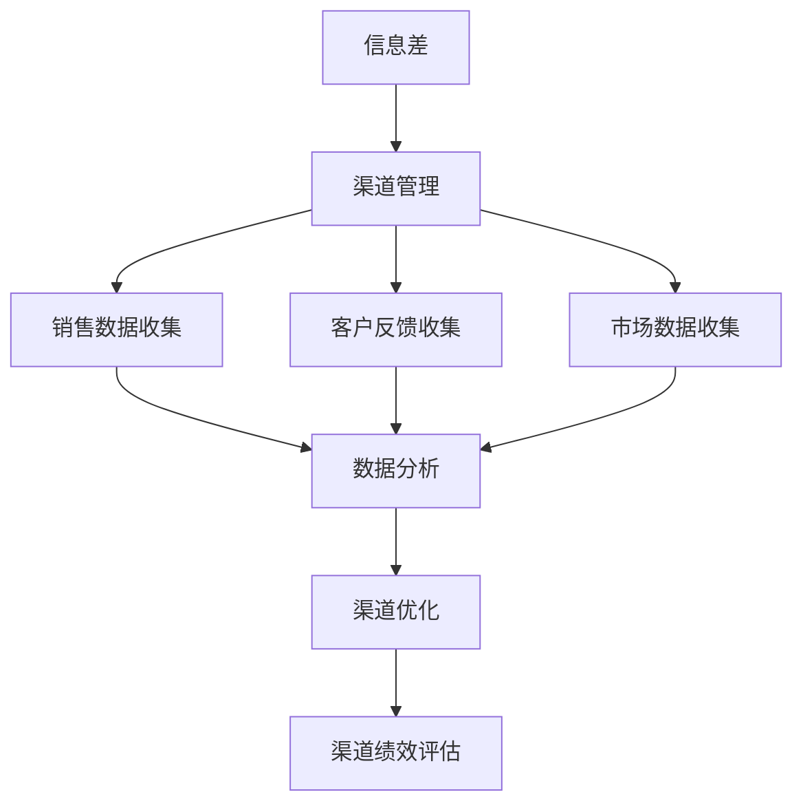

                 

# 《信息差的商业渠道管理：大数据如何优化渠道管理》

## 概述

### 信息差的概念与商业应用

信息差是指在一个信息市场中，不同个体或组织之间对于同一信息的了解程度存在差异。这种差异可以表现在信息的获取、处理、传递等多个环节。在商业环境中，信息差具有重要的应用价值。有效的信息管理能够帮助企业快速响应市场变化，优化决策过程，提高竞争力。

首先，让我们定义信息差。信息差可以分为两类：显性信息差和隐性信息差。显性信息差指的是市场上公开的信息，例如财务报表、市场分析报告等。隐性信息差则是指不易获取或公开的信息，例如内部运营数据、客户反馈等。

在商业应用中，信息差的作用不容忽视。一个典型的例子是投资领域。投资者通过分析公开的财务报表和市场数据，寻找信息差，以便做出更准确的决策。同样，在供应链管理中，企业通过收集并分析供应链上下游的信息，优化库存管理，降低成本。

### 信息差在商业环境中的重要性

信息差在商业环境中具有以下几个重要性：

1. **竞争优势**：信息差可以帮助企业快速获取市场动态，发现商业机会，抢占市场先机。
2. **决策支持**：信息差为企业提供了重要的决策依据，使得管理层能够基于更全面、准确的信息做出战略规划。
3. **风险控制**：通过分析信息差，企业可以预判市场风险，制定相应的应对策略，降低经营风险。
4. **客户服务**：信息差使得企业能够更准确地了解客户需求，提供个性化的服务，提升客户满意度。

### 信息差的来源与传播

信息差的来源主要包括以下几个方面：

1. **公开渠道**：如新闻媒体、行业报告、市场调查等。
2. **内部渠道**：如企业内部数据库、员工交流平台等。
3. **合作伙伴**：如供应商、分销商、客户等。

信息差的传播途径则包括：

1. **人际网络**：通过个人关系网，如商业会议、社交活动等。
2. **技术手段**：如数据分析、人工智能等。
3. **正式渠道**：如企业内部邮件、报告等。

### 商业渠道管理的基本概念

#### 商业渠道的类型与功能

商业渠道是指产品或服务从生产者到达最终消费者的路径。根据不同的分类标准，商业渠道可以分为以下类型：

1. **直接渠道**：生产者直接向消费者销售产品或服务。
2. **间接渠道**：生产者通过中间商（如分销商、代理商）向消费者销售产品或服务。
3. **多级渠道**：产品或服务通过多个中间商销售给最终消费者。

商业渠道的功能主要包括：

1. **市场细分**：渠道帮助企业将市场细分为不同的消费者群体。
2. **需求满足**：渠道帮助企业及时满足消费者的需求。
3. **信息传递**：渠道帮助企业获取市场信息和客户反馈。
4. **物流管理**：渠道帮助企业实现产品的物流配送。

#### 商业渠道管理的目标与挑战

商业渠道管理的目标主要包括：

1. **提高市场覆盖率**：确保产品或服务能够到达目标市场。
2. **提升渠道效率**：优化渠道运营流程，提高销售和物流效率。
3. **降低成本**：通过渠道优化降低运营成本。
4. **提升客户满意度**：提供高质量的客户服务，提高客户忠诚度。

商业渠道管理面临的挑战有：

1. **渠道冲突**：不同渠道之间可能存在竞争，导致资源浪费。
2. **信息不对称**：渠道成员之间信息传递不畅，影响决策效果。
3. **渠道管理成本**：渠道管理需要投入大量的人力、物力和财力。
4. **市场变化**：快速变化的市场环境要求企业不断调整渠道策略。

#### 商业渠道管理的基本策略

商业渠道管理的基本策略包括：

1. **渠道选择**：根据市场需求和产品特点，选择合适的渠道类型。
2. **渠道激励**：通过激励措施，提升渠道成员的积极性和忠诚度。
3. **渠道协作**：建立渠道合作关系，实现信息共享和资源整合。
4. **渠道监控**：对渠道运营进行监控和评估，及时发现和解决问题。

通过以上策略，企业可以更好地管理商业渠道，实现业务目标。

## 大数据在渠道管理中的应用

### 大数据的基本概念与技术

大数据是指无法使用传统数据处理方法进行分析的数据集合，其特点为大量（Volume）、多样（Variety）、快速（Velocity）和真实（Veracity）。大数据技术包括数据收集、存储、处理、分析和可视化等多个方面。

数据收集方面，大数据技术主要依赖于传感器、社交媒体、互联网日志等。数据存储方面，常用的技术包括Hadoop、NoSQL数据库等。数据处理方面，大数据技术采用了分布式计算和并行处理方法。数据分析方面，大数据技术利用数据挖掘、机器学习和统计方法进行深入分析。数据可视化方面，大数据技术通过数据仪表板、地图等工具，将分析结果直观展示。

### 大数据在渠道管理中的优势

大数据在渠道管理中具有显著的优势：

1. **数据驱动的决策**：通过大数据分析，企业可以更准确地了解市场需求，优化渠道策略。
2. **提升效率**：大数据技术可以帮助企业自动化渠道管理流程，提高运营效率。
3. **降低成本**：通过数据分析，企业可以发现优化渠道的机会，降低运营成本。
4. **增强客户体验**：大数据技术使得企业能够提供个性化的客户服务，提高客户满意度。

### 大数据在渠道管理中的挑战与应对策略

尽管大数据在渠道管理中具有显著优势，但同时也面临一些挑战：

1. **数据质量问题**：大数据质量直接影响到分析结果。企业需要确保数据的质量，包括准确性、完整性和一致性。
2. **隐私保护**：渠道数据通常涉及客户隐私信息，需要确保数据的安全和合规。
3. **技术难题**：大数据技术要求企业具备较高的技术能力，包括数据存储、处理和安全性等方面。

应对策略包括：

1. **数据质量管理**：建立数据质量管理体系，包括数据清洗、验证和监控等。
2. **数据安全与合规**：采用加密技术、数据脱敏等方法，确保数据安全和合规。
3. **技术能力提升**：通过培训和人才引进，提高企业在大数据技术方面的能力。

### 大数据在渠道管理中的应用流程

大数据在渠道管理中的应用通常包括以下流程：

1. **数据收集**：收集来自各个渠道的数据，包括销售数据、市场调研数据、客户反馈等。
2. **数据预处理**：清洗、转换和集成数据，确保数据质量。
3. **数据分析**：利用数据挖掘、机器学习等方法，对数据进行深入分析。
4. **结果可视化**：通过数据仪表板、地图等工具，将分析结果直观展示，帮助管理者做出决策。
5. **反馈与调整**：根据分析结果，调整渠道策略，持续优化渠道管理。

通过以上流程，企业可以充分利用大数据的优势，优化渠道管理，提高业务绩效。

## 大数据技术在渠道数据分析中的应用

### 渠道数据收集与处理

渠道数据收集是渠道数据分析的基础。数据来源包括渠道销售数据、市场调研数据、客户反馈数据等。首先，企业需要建立数据收集系统，确保数据的实时性和准确性。数据收集系统可以通过以下几种方式实现：

1. **自动化采集**：利用API接口、日志文件等自动采集渠道数据。
2. **手动录入**：通过员工手动录入渠道数据。
3. **第三方数据源**：从第三方数据提供商获取渠道数据。

数据收集后，需要进行数据预处理。数据预处理包括以下步骤：

1. **数据清洗**：去除重复数据、无效数据和错误数据。
2. **数据转换**：将不同格式的数据进行统一转换。
3. **数据集成**：将来自不同渠道的数据进行整合。

数据预处理是确保数据分析结果准确性的关键步骤。通过数据清洗、转换和集成，可以确保数据质量，为后续数据分析提供可靠的基础。

### 渠道数据挖掘与可视化

渠道数据挖掘是指利用统计学、机器学习等方法，从渠道数据中提取有价值的信息。渠道数据挖掘的主要步骤包括：

1. **特征选择**：选择对业务有影响的关键特征。
2. **数据建模**：构建数据挖掘模型，如分类、聚类、关联规则挖掘等。
3. **模型评估**：评估模型效果，包括准确性、召回率、F1值等。
4. **模型应用**：将模型应用到实际业务场景中，如市场预测、客户细分等。

渠道数据挖掘可以帮助企业发现潜在的商业机会，优化渠道策略。例如，通过关联规则挖掘，企业可以发现不同渠道之间的销售关联，从而调整渠道布局，提高整体销售业绩。

数据可视化是将数据分析结果以图形化的方式展示出来，使管理者能够直观地理解数据。常用的数据可视化工具包括Tableau、PowerBI等。数据可视化可以应用于以下场景：

1. **渠道绩效分析**：通过数据仪表板，实时展示渠道销售情况、市场份额等关键指标。
2. **市场预测**：通过数据可视化，展示市场趋势和预测结果。
3. **客户细分**：通过数据可视化，展示不同客户群体的特征和需求。

数据可视化不仅可以帮助管理者更好地理解数据，还可以用于向外部利益相关者展示分析结果，增强决策的透明度。

### 大数据在渠道市场预测中的应用

市场预测是渠道管理的重要环节。大数据技术为市场预测提供了强大的工具和方法。大数据在渠道市场预测中的应用主要包括以下几个方面：

1. **时间序列分析**：利用时间序列分析方法，预测未来的市场趋势。时间序列分析方法包括自回归移动平均（ARMA）、自回归积分移动平均（ARIMA）等。
2. **机器学习模型**：利用机器学习模型，如线性回归、决策树、神经网络等，对市场数据进行预测。机器学习模型可以通过训练数据集，学习市场变化的规律，从而预测未来的市场走势。
3. **集成预测方法**：将不同的预测方法进行集成，如组合预测、贝叶斯网络等，提高市场预测的准确性。

市场预测结果可以用于以下应用：

1. **渠道规划**：根据市场预测结果，调整渠道布局和策略，确保渠道能够满足市场需求。
2. **库存管理**：根据市场预测结果，优化库存管理，降低库存成本。
3. **营销策略**：根据市场预测结果，制定有效的营销策略，提高市场占有率。

通过大数据技术在渠道市场预测中的应用，企业可以更加准确地预测市场变化，制定科学的渠道策略，提高业务绩效。

### 大数据驱动的渠道优化策略

大数据技术不仅可以帮助企业进行渠道数据分析和市场预测，还可以为渠道优化提供有力支持。以下是一些大数据驱动的渠道优化策略：

1. **渠道结构优化**：通过大数据分析，企业可以发现渠道中的瓶颈和效率低下的问题。例如，通过分析渠道销售数据，企业可以发现某些渠道的销售业绩不佳，从而考虑关闭这些渠道，优化渠道结构。此外，大数据分析还可以帮助企业确定最佳渠道布局，提高整体销售效率。

2. **渠道效率提升**：大数据技术可以帮助企业自动化渠道管理流程，提高渠道效率。例如，通过数据分析，企业可以确定最佳的订单处理流程、物流配送方案等，从而减少运营成本，提高渠道效率。

3. **渠道成本控制**：通过大数据分析，企业可以找到降低渠道运营成本的方法。例如，通过分析销售数据，企业可以发现哪些渠道成本较高，从而采取相应的措施，如调整渠道策略、优化库存管理等，降低渠道成本。

4. **渠道风险管理**：大数据技术可以帮助企业识别渠道风险，制定相应的风险管理策略。例如，通过分析市场数据和客户反馈，企业可以发现市场变化趋势和客户需求变化，从而提前采取应对措施，降低渠道风险。

5. **渠道客户关系管理**：大数据技术可以帮助企业更好地管理客户关系，提高客户满意度。例如，通过分析客户数据，企业可以了解客户需求和行为，从而提供个性化的服务，提高客户忠诚度。

通过大数据驱动的渠道优化策略，企业可以更加精准地管理渠道，提高业务绩效，实现持续增长。

### 大数据在渠道管理中的实战案例

#### 案例一：电商平台的渠道数据分析

**案例背景**

某电商平台在渠道管理中面临以下问题：

1. **销售数据波动大**：不同渠道的销售数据波动较大，影响整体业绩的稳定性。
2. **渠道冲突**：不同渠道之间存在竞争，导致资源浪费和客户流失。
3. **库存管理困难**：库存管理不到位，导致库存积压和缺货现象交替出现。

为了解决这些问题，电商平台决定利用大数据技术对渠道数据进行分析，优化渠道管理。

**数据收集与处理**

电商平台收集了以下数据：

1. **销售数据**：包括各个渠道的销售量、销售额、销售增长率等。
2. **客户数据**：包括客户的购买行为、偏好、反馈等。
3. **市场数据**：包括市场趋势、竞争对手情况等。

收集数据后，电商平台进行了数据预处理，包括数据清洗、转换和集成，确保数据质量。

**数据挖掘与分析**

通过数据挖掘技术，电商平台进行了以下分析：

1. **销售趋势分析**：通过时间序列分析，预测未来的销售趋势，帮助电商平台制定销售策略。
2. **客户细分**：通过聚类分析，将客户分为不同的群体，了解不同客户群体的特征和需求，为个性化服务提供依据。
3. **渠道绩效评估**：通过回归分析，评估不同渠道的销售贡献，找出绩效不佳的渠道，进行优化。

**案例分析**

通过数据分析，电商平台发现：

1. **渠道优化**：某些渠道的销售业绩不佳，电商平台决定关闭这些渠道，并将资源集中于高绩效渠道，提高整体销售效率。
2. **库存管理**：电商平台通过分析销售数据，优化库存管理策略，确保库存充足，避免缺货现象。
3. **客户关系管理**：电商平台根据客户细分结果，提供个性化的服务，提高客户满意度，增加客户忠诚度。

通过大数据分析，电商平台成功地解决了渠道管理中的问题，提高了业务绩效。

#### 案例二：制造企业的渠道优化

**案例背景**

某制造企业在渠道管理中面临以下问题：

1. **渠道冲突**：不同渠道之间存在价格竞争，导致企业利润下降。
2. **销售数据不准确**：渠道销售数据不准确，影响企业决策。
3. **渠道运营效率低**：渠道运营流程不完善，导致运营效率低下。

为了解决这些问题，制造企业决定利用大数据技术对渠道数据进行分析，优化渠道管理。

**数据分析流程**

制造企业进行了以下数据分析流程：

1. **数据收集**：收集渠道销售数据、客户反馈数据、市场调研数据等。
2. **数据预处理**：清洗、转换和集成数据，确保数据质量。
3. **数据分析**：利用数据挖掘技术，对销售数据进行分析，找出渠道运营中的问题。
4. **结果可视化**：通过数据仪表板，将分析结果直观展示，帮助管理层做出决策。

**渠道优化方案**

通过数据分析，制造企业制定了以下渠道优化方案：

1. **渠道整合**：关闭低绩效渠道，将资源集中于高绩效渠道，提高整体销售效率。
2. **渠道定价策略**：根据不同渠道的市场地位和客户群体，制定差异化的定价策略，降低渠道冲突。
3. **销售数据分析**：定期分析渠道销售数据，及时调整渠道策略，确保销售数据准确。
4. **运营流程优化**：优化渠道运营流程，提高运营效率。

**案例分析**

通过大数据分析，制造企业成功地解决了渠道管理中的问题：

1. **渠道整合**：关闭了低绩效渠道，将资源集中于高绩效渠道，提高了整体销售效率。
2. **渠道定价策略**：根据不同渠道的市场地位和客户群体，制定了差异化的定价策略，降低了渠道冲突。
3. **销售数据分析**：定期分析渠道销售数据，及时调整渠道策略，确保销售数据准确。
4. **运营流程优化**：优化了渠道运营流程，提高了运营效率。

通过大数据分析，制造企业成功地优化了渠道管理，提高了业务绩效。

### 大数据在渠道管理中的未来趋势

随着大数据技术的不断发展和应用，未来渠道管理将呈现以下趋势：

1. **智能化**：大数据与人工智能技术相结合，实现渠道管理的智能化。通过机器学习、自然语言处理等技术，渠道管理可以实现自动化，提高运营效率。
2. **个性化**：大数据分析将帮助企业更好地了解客户需求和行为，实现个性化渠道管理。通过个性化推荐、定制化服务等方式，提升客户体验，增加客户忠诚度。
3. **实时化**：大数据技术将实现渠道管理的实时化。通过实时数据采集、分析和反馈，渠道管理可以快速响应市场变化，提高决策效率。
4. **集成化**：大数据技术将实现渠道管理系统的集成化。通过整合不同渠道的数据，渠道管理可以实现数据共享和资源优化，提高整体运营效率。

未来，大数据在渠道管理中的应用将越来越广泛，为企业带来更多的价值。企业应积极拥抱大数据技术，优化渠道管理，实现持续增长。

### 附录一：大数据渠道管理工具与资源

#### 主流大数据分析工具

1. **Hadoop**：Hadoop 是一个开源的分布式数据存储和处理框架，适用于大规模数据的存储和分析。Hadoop 提供了 HDFS (Hadoop Distributed File System) 和 MapReduce 等核心组件，可以实现数据的分布式存储和并行处理。
   
2. **Spark**：Spark 是一个开源的分布式计算引擎，具有内存计算和实时处理的优势。Spark 提供了丰富的数据处理库，如 Spark SQL、Spark MLlib 等，适用于复杂的分析和机器学习任务。

3. **Apache Flink**：Apache Flink 是一个流处理框架，可以处理实时数据流，提供低延迟和高吞吐量的数据处理能力。Flink 支持窗口操作、事件驱动处理等实时数据处理功能。

4. **Tableau**：Tableau 是一个数据可视化工具，可以将复杂的数据转换为直观的图表和仪表板。Tableau 提供了丰富的图表类型和交互功能，适用于数据分析和报告。

#### 大数据渠道管理相关的开源资源和书籍

1. **Apache Kafka**：Kafka 是一个开源的流处理平台，适用于实时数据流处理和消息队列。Kafka 具有高吞吐量、可扩展性和可靠性的特点，适用于大数据渠道管理中的实时数据处理。

2. **Apache Storm**：Storm 是一个开源的实时数据处理框架，适用于实时数据分析和处理。Storm 提供了高效的分布式计算能力和灵活的处理逻辑，适用于实时渠道数据分析。

3. **《大数据时代》**：作者：[剑桥大学计算机系教授] 大卫·麦凯恩。本书介绍了大数据的概念、技术和应用，对大数据的发展和应用进行了深入探讨。

4. **《大数据分析：方法和实践》**：作者：[清华大学计算机科学与技术系教授] 刘铁岩。本书系统地介绍了大数据分析的方法和技术，包括数据挖掘、机器学习和统计分析等。

#### 大数据渠道管理相关的在线课程和培训

1. **Coursera 上的《大数据技术与应用》**：该课程由北京大学教授讲授，涵盖了大数据的基本概念、技术框架和应用案例。

2. **Udacity 上的《大数据工程师纳米学位》**：该纳米学位课程包括多个项目，涵盖大数据的存储、处理和分析，适合有志于从事大数据领域的人士。

3. **edX 上的《大数据分析与决策》**：该课程由香港科技大学教授讲授，介绍了大数据分析的基本概念和技术，以及如何利用大数据进行决策。

### 附录二：Mermaid 流程图示例

以下是一个 Mermaid 流程图的示例，用于展示信息差与商业渠道管理的关系：

这个流程图展示了信息差在商业渠道管理中的应用，包括数据收集、数据分析和渠道优化等步骤。

### 附录三：大数据核心算法原理讲解

#### 数据挖掘算法概述

数据挖掘算法是大数据技术中的核心部分，用于从大量数据中提取有价值的信息。以下是一些常见的数据挖掘算法：

1. **分类算法**：分类算法将数据分为不同的类别。常见的分类算法包括决策树（Decision Tree）、支持向量机（SVM）和随机森林（Random Forest）。

2. **聚类算法**：聚类算法将数据分为多个类别，使同一类别内的数据尽可能相似，不同类别之间的数据尽可能不同。常见的聚类算法包括 K-均值（K-Means）、层次聚类（Hierarchical Clustering）和 DBSCAN。

3. **关联规则挖掘**：关联规则挖掘用于发现数据之间的关联关系。常见的算法包括 Apriori 算法和 FP-Growth 算法。

4. **异常检测**：异常检测用于发现数据中的异常值或异常模式。常见的算法包括孤立森林（Isolation Forest）、局部异常因子（Local Outlier Factor）和基于密度的方法。

#### 机器学习算法简介

机器学习算法是数据挖掘算法的一种，通过学习数据中的规律，实现对未知数据的预测和分类。以下是一些常见的机器学习算法：

1. **线性回归**：线性回归是一种简单的预测模型，用于预测数值型变量。线性回归模型可以表示为 Y = b0 + b1X1 + b2X2 + ... + bnXn。

2. **逻辑回归**：逻辑回归是一种分类模型，用于预测二分类变量。逻辑回归模型可以表示为 P(Y=1) = 1 / (1 + exp(-Z))，其中 Z = b0 + b1X1 + b2X2 + ... + bnXn。

3. **决策树**：决策树是一种树形结构的预测模型，通过一系列的决策规则将数据分为不同的类别或数值。决策树的生成可以使用 ID3、C4.5 或 C5.0 算法。

4. **随机森林**：随机森林是一种集成学习算法，通过构建多个决策树，并利用随机性进行特征选择和节点分裂，提高模型的预测性能。

#### 大数据预测模型构建与优化

大数据预测模型的构建与优化包括以下步骤：

1. **数据预处理**：对数据进行清洗、转换和集成，确保数据质量。

2. **特征工程**：选择对预测目标有影响的关键特征，进行特征提取和特征选择。

3. **模型选择**：根据业务需求和数据特点，选择合适的预测模型。常见的模型包括线性回归、逻辑回归、决策树、随机森林等。

4. **模型训练**：使用训练数据集，训练预测模型，得到模型参数。

5. **模型评估**：使用验证数据集，评估模型的预测性能。常见的评估指标包括准确率、召回率、F1值等。

6. **模型优化**：根据模型评估结果，调整模型参数或特征选择，优化模型性能。

通过以上步骤，可以构建和优化大数据预测模型，实现数据价值的最大化。

### 附录四：数学模型与公式讲解

#### 数学模型在渠道管理中的应用

在渠道管理中，数学模型可以用于优化渠道布局、预测市场需求、评估渠道绩效等多个方面。以下是一些常用的数学模型：

1. **线性回归模型**：线性回归模型用于预测数值型变量，其公式为：

   $$ Y = b_0 + b_1X_1 + b_2X_2 + ... + b_nX_n $$

   其中，Y 是预测变量，X_1, X_2, ..., X_n 是自变量，b_0, b_1, ..., b_n 是模型参数。

2. **逻辑回归模型**：逻辑回归模型用于预测二分类变量，其公式为：

   $$ P(Y=1) = \frac{1}{1 + e^{-(b_0 + b_1X_1 + b_2X_2 + ... + b_nX_n)}} $$

   其中，Y 是预测变量，X_1, X_2, ..., X_n 是自变量，b_0, b_1, ..., b_n 是模型参数。

3. **线性规划模型**：线性规划模型用于优化线性目标函数，其公式为：

   $$ \text{maximize or minimize } C^T X $$
   $$ \text{subject to } Ax \le b $$

   其中，C 是目标函数系数，X 是决策变量，A 是系数矩阵，b 是常数向量。

4. **决策树模型**：决策树模型用于分类和回归任务，其公式为：

   $$ \text{if condition } c_i \text{ then predict class } y_i $$
   $$ \text{else predict class } y_j $$

   其中，c_i 是条件，y_i 和 y_j 是不同类别的预测值。

#### 公式推导与示例

以下是一个线性回归模型的推导示例：

假设我们有 n 个样本点 (X_i, Y_i)，其中 X_i 和 Y_i 分别为自变量和因变量。我们希望找到一个线性函数 f(X) = b_0 + b_1X，使得 f(X_i) 尽可能接近 Y_i。

首先，我们定义一个损失函数 L(b_0, b_1)：

$$ L(b_0, b_1) = \sum_{i=1}^{n} (Y_i - f(X_i))^2 $$

为了最小化损失函数，我们对 b_0 和 b_1 求偏导数，并令偏导数为零：

$$ \frac{\partial L}{\partial b_0} = -2 \sum_{i=1}^{n} (Y_i - f(X_i)) = 0 $$
$$ \frac{\partial L}{\partial b_1} = -2 \sum_{i=1}^{n} (X_i f(X_i) - Y_i) = 0 $$

解上述方程组，我们可以得到最优的 b_0 和 b_1：

$$ b_0 = \frac{1}{n} \sum_{i=1}^{n} Y_i - b_1 \frac{1}{n} \sum_{i=1}^{n} X_i $$
$$ b_1 = \frac{1}{n} \sum_{i=1}^{n} (X_i - \bar{X})(Y_i - \bar{Y}) $$

其中，\bar{X} 和 \bar{Y} 分别为 X 和 Y 的均值。

通过以上推导，我们得到了线性回归模型的最优参数 b_0 和 b_1。

#### 数学模型在渠道管理中的实际应用案例

以下是一个渠道绩效评估的数学模型应用案例：

假设某企业的渠道销售数据如下表所示：

| 渠道 | 销售额（万元） | 成本（万元） |
| ---- | ------------ | ------------ |
| 渠道1 | 1000         | 500          |
| 渠道2 | 800          | 400          |
| 渠道3 | 600          | 300          |

我们希望找到一个最优的渠道组合，使得总利润最大化。

首先，我们定义一个线性规划模型：

$$ \text{maximize } P = \sum_{i=1}^{3} (销售额_i - 成本_i) x_i $$
$$ \text{subject to } x_1 + x_2 + x_3 \le 1 $$
$$ x_i \ge 0 \quad (i=1,2,3) $$

其中，x_i 表示渠道 i 的销售份额。

通过求解上述线性规划模型，我们可以得到最优的渠道组合，使得总利润最大化。

在实际应用中，我们可以根据实际情况调整目标函数和约束条件，以适应不同的业务需求。通过数学模型的应用，企业可以更加科学地进行渠道管理，提高业务绩效。 

### 总结

本文以《信息差的商业渠道管理：大数据如何优化渠道管理》为题，系统地探讨了大数据在商业渠道管理中的应用、挑战与未来趋势。文章首先介绍了信息差的概念及其在商业环境中的重要性，然后详细阐述了大数据技术在渠道管理中的优势和应用流程。通过实战案例，我们看到了大数据在渠道优化中的实际应用，以及其带来的业务价值。

在文章的最后，我们介绍了大数据渠道管理工具与资源、大数据核心算法原理、数学模型与公式讲解，以及其在渠道管理中的实际应用。这些内容不仅为读者提供了丰富的理论依据，也为实践中的渠道管理提供了实用的方法和工具。

随着大数据技术的不断发展和应用，商业渠道管理将迎来新的机遇和挑战。希望本文能够为广大读者提供有益的启示，助力企业在大数据时代实现渠道管理的优化和升级。

### 作者信息

**作者：AI天才研究院/AI Genius Institute & 禅与计算机程序设计艺术 /Zen And The Art of Computer Programming**

AI天才研究院（AI Genius Institute）是一家专注于人工智能研究与应用的顶级学术机构。研究院在计算机科学、人工智能、机器学习等领域取得了世界领先的成果，拥有丰富的学术资源和强大的研究团队。研究院致力于推动人工智能技术的创新与应用，为全球范围内的企业和组织提供先进的人工智能解决方案。

《禅与计算机程序设计艺术》（Zen And The Art of Computer Programming）是一本被誉为计算机编程领域的经典之作。作者通过深入探讨计算机编程的哲学和艺术，为程序员提供了一种全新的思考方式和工作方法。这本书不仅涵盖了编程的核心概念和技术，还强调了思维方式和哲学思维在编程中的重要性，对于提高程序员的编程水平和创造力具有重要的指导意义。

